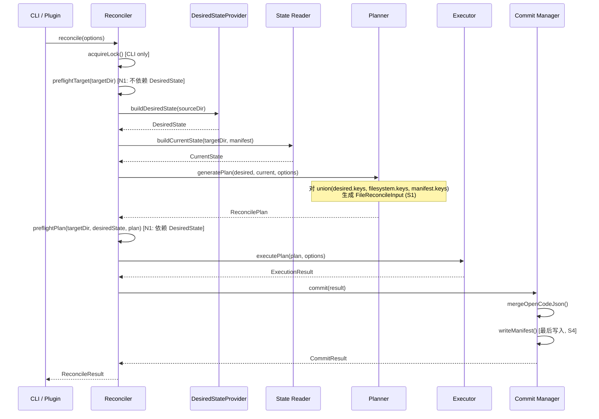
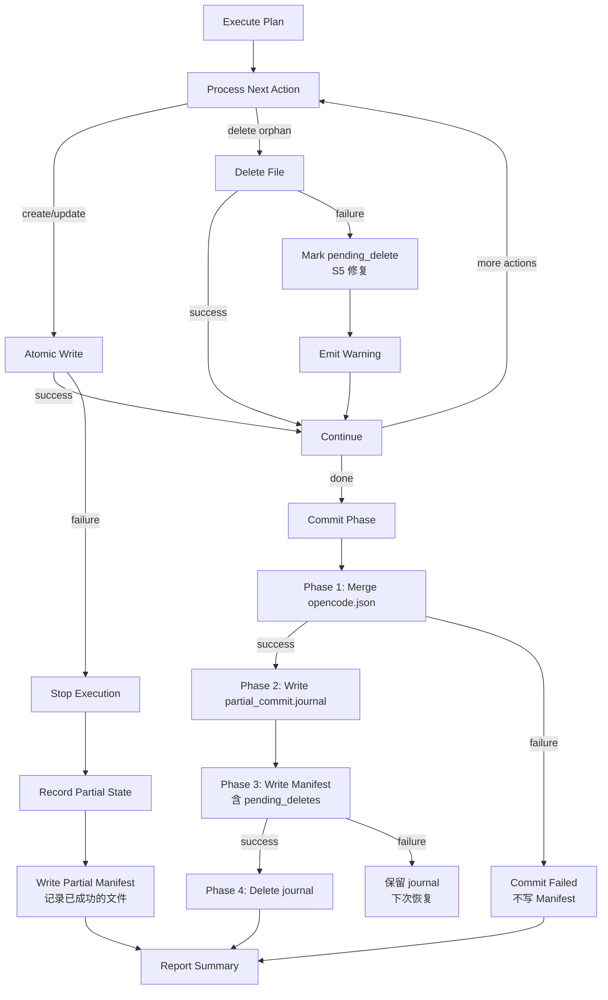
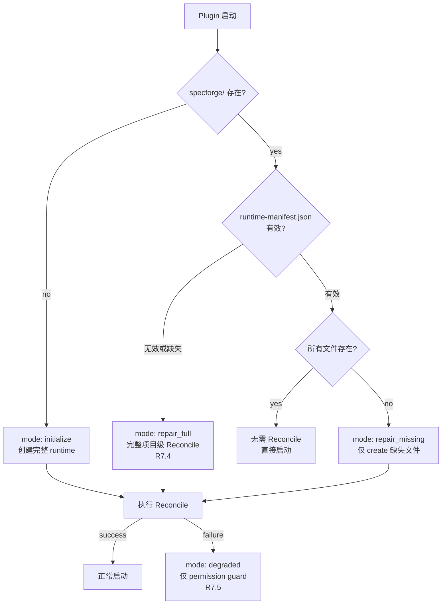

# Design Document: Installer Reconcile Redesign

## Overview

本设计将 SpecForge 安装器从基于手动注册表（`SHARED_COMPONENT_REGISTRY` 数组）的架构重构为**声明式期望状态 + 自动协调（Reconcile）**架构。核心思想是将 `.opencode/` 源目录视为唯一真实来源（Single Source of Truth），通过运行时扫描动态构建部署清单，再由统一的 Reconcile 引擎将目标目录收敛到期望状态。

### 设计目标

1. **消除手动注册表维护** — 添加/删除文件时无需修改代码
2. **统一所有部署路径** — install、upgrade、repair 共用同一个 Reconcile 函数
3. **幂等性保证** — 多次执行相同操作不产生额外变更
4. **用户自定义保护** — 通过三方哈希比较检测用户修改，避免意外覆盖
5. **原子性与容错** — 每个文件写入都是原子的，失败时不留下损坏状态
6. **作用域隔离** — 用户级共享组件与项目级运行时使用不同的 DesiredStateProvider 和 Reconcile 策略

### 设计决策

| 决策 | 选择 | 理由 |
|------|------|------|
| 发现机制 | 运行时 glob 扫描 | 零维护成本，文件增删自动反映 |
| 哈希算法 | SHA-256 | 与现有 Manifest 兼容，碰撞概率极低 |
| 路径规范化 | 内部统一 POSIX | 跨平台一致性，Manifest 可移植 |
| 冲突检测 | 三方哈希比较（source/current/manifest） | 精确区分"源变更"与"用户修改" |
| 原子写入 | temp file + SHA-256 验证 + rename | 防止部分写入，确保完整性 |
| 孤儿检测 | Manifest 记录 + sf-/sf_ 前缀扫描 | 双重来源确保不遗漏 |
| 决策输入模型 | 统一 FileReconcileInput（S1 修复） | 完整表达三方状态，含 undefined 语义 |
| 作用域分离 | scope: "user_shared" / "project_runtime"（S3 修复） | Plugin 与 CLI 职责隔离 |
| 提交顺序 | 文件 → opencode.json → Manifest（S4 修复） | Manifest 作为 commit record 最后写入 |
| 锁机制 | heartbeat + PID 验证 + 二次确认（S6 修复） | 完整并发安全保证 |

## Glossary

| 术语 | 定义 |
|------|------|
| ManagedKind | 安装器管理的文件种类枚举：`"component"` \| `"generated"`（L2 修复，与 Requirements Glossary 中 Managed_Component_File / Managed_Generated_File 对齐） |
| ReconcileScope | Reconcile 操作的作用域：`"user_shared"` \| `"project_runtime"` |
| FileReconcileInput | Planner 的统一决策输入模型，完整表达 source/filesystem/manifest 三方状态 |

## Architecture

### 高层架构图

```mermaid
graph TD
    CLI[CLI Entry<br/>sf-installer.ts] --> |install/upgrade/uninstall| RE[Reconcile Engine<br/>reconcile.ts]
    CLI --> |verify| VE[Verify Module<br/>verify.ts]
    Plugin[Plugin Startup<br/>sf_specforge.ts] --> |repair/initialize| RE

    RE --> DSP[DesiredStateProvider<br/>接口]
    RE --> SM[State Module<br/>state.ts]
    RE --> PM[Plan Generator<br/>planner.ts]
    RE --> EX[Plan Executor<br/>executor.ts]

    DSP --> UserDSP[UserSharedProvider<br/>discovery.ts]
    DSP --> ProjDSP[ProjectRuntimeProvider<br/>project_runtime.ts]

    UserDSP --> |scan .opencode/| FS1[Source FileSystem]
    ProjDSP --> |scan specforge templates| FS1
    SM --> |read manifest + scan| FS2[Target FileSystem]
    EX --> |atomic write/delete| FS2
    EX --> CM[Commit Manager<br/>commit.ts]
    CM --> OM[OpenCode Merge<br/>opencode_merge.ts]
    CM --> MW[Manifest Writer<br/>manifest.ts]

    subgraph "Core Pipeline"
        DSP --> |DesiredState| PM
        SM --> |FileReconcileInput[]| PM
        PM --> |ReconcilePlan| EX
    end

    subgraph "Scope Isolation (S3)"
        UserDSP -.- |scope: user_shared| CLI
        ProjDSP -.- |scope: project_runtime| Plugin
    end
```

### 数据流



### 模块职责

| 模块 | 文件路径 | 职责 |
|------|----------|------|
| Discovery | `scripts/lib/discovery.ts` | 扫描 `.opencode/` 构建用户级 DesiredState |
| ProjectRuntime | `scripts/lib/project_runtime.ts` | 构建项目级运行时 DesiredState（S3） |
| State | `scripts/lib/state.ts` | 从 Manifest + 文件系统构建 CurrentState |
| Planner | `scripts/lib/planner.ts` | 按决策矩阵生成 ReconcilePlan |
| Executor | `scripts/lib/executor.ts` | 执行计划中的原子操作 |
| Commit | `scripts/lib/commit.ts` | 管理提交阶段顺序（S4） |
| Reconcile | `scripts/lib/reconcile.ts` | 编排上述模块的统一入口 |
| CLI | `scripts/sf-installer.ts` | 解析参数，调用 Reconcile |
| OpenCode Merge | `scripts/lib/opencode_merge.ts` | 管理 opencode.json 的 sf-* 条目 |
| Manifest | `scripts/lib/manifest.ts` | Manifest 读取、验证、写入 |
| Lock | `scripts/lib/lock.ts` | 安装锁获取、释放、stale 检测（S6） |
| Verify | `scripts/lib/verify.ts` | verify 子命令实现 |

### 替换关系

| 旧模块 | 新模块 | 说明 |
|--------|--------|------|
| `scripts/lib/registry.ts` | `scripts/lib/discovery.ts` | 静态数组 → 动态扫描 |
| `cmdInstall()` 内联逻辑 | `scripts/lib/reconcile.ts` | 分散逻辑 → 统一引擎 |
| `cmdUpgrade()` 内联逻辑 | `scripts/lib/reconcile.ts` | 同上 |
| `findOrphanSfFiles()` | `scripts/lib/planner.ts` | 孤儿检测集成到计划生成 |


## Components and Interfaces

### 1. Discovery Module (`scripts/lib/discovery.ts`)

```typescript
/**
 * 扫描源目录构建期望状态（用户级共享组件）
 */
export interface DiscoveryOptions {
  sourceDir: string  // .opencode/ 的绝对路径
}

export interface DesiredStateEntry {
  /** POSIX 相对路径（相对于源目录） */
  relativePath: string
  /** 组件类型 */
  componentType: ManagedComponentType
  /** 文件内容的 SHA-256 哈希 */
  sourceHash: string
  /** 文件大小（字节） */
  size: number
}

/**
 * L2 修复：ManagedComponentType 与 Glossary 中 Component_Type 对齐
 * ManagedKind 区分 "component" | "generated"
 */
export type ManagedComponentType = "agent" | "tool" | "tool_lib" | "plugin" | "skill"
export type ManagedKind = "component" | "generated"

/** 判断组件类型是否为可自定义类型 */
export function isCustomizable(type: ManagedComponentType): boolean {
  return type === "agent" || type === "skill"
}

export interface DesiredState {
  entries: Map<string, DesiredStateEntry>  // key = relativePath
  version: string  // 从 package.json 读取
}

/** L1 修复：Discovery 空目录错误类型细分 */
export type DiscoveryError =
  | { code: "SOURCE_DIR_NOT_FOUND"; path: string }
  | { code: "SOURCE_DIR_EMPTY"; path: string; message: string }
  | { code: "SOURCE_DIR_NOT_READABLE"; path: string; cause: Error }

export type DiscoveryResult =
  | { ok: true; state: DesiredState }
  | { ok: false; error: DiscoveryError }

/**
 * 扫描 .opencode/ 目录构建 DesiredState
 * 
 * 扫描规则：
 * - agents/*.md
 * - tools/*.ts (顶层)
 * - tools/lib/*.ts
 * - plugins/*.ts
 * - skills/*/SKILL.md
 * 
 * 排除：
 * - .gitkeep
 * - node_modules/
 * - package.json, package-lock.json
 */
export async function buildDesiredState(options: DiscoveryOptions): Promise<DiscoveryResult>
```

### 2. DesiredStateProvider 接口（S3 修复）

```typescript
/**
 * S3 修复：引入 DesiredStateProvider 接口，分离用户级与项目级
 */
export type ReconcileScope = "user_shared" | "project_runtime"

export interface DesiredStateProvider {
  scope: ReconcileScope
  buildDesiredState(): Promise<DiscoveryResult>
}

/**
 * 用户级共享组件 Provider — CLI 使用
 * 扫描 .opencode/ 源目录
 */
export class UserSharedProvider implements DesiredStateProvider {
  scope: ReconcileScope = "user_shared"
  constructor(private sourceDir: string) {}
  async buildDesiredState(): Promise<DiscoveryResult> { /* ... */ }
}

/**
 * N2 修复：Plugin 项目级运行时 Provider
 * 
 * Plugin 启动模式（R7.1-R7.6）：
 * - initialize: specforge/ 不存在 → 创建完整 runtime（create all）
 * - repair_missing: specforge/ 存在但部分文件缺失 → 仅 create 缺失文件
 * - repair_full: Runtime_Manifest 无效或缺失 → 完整项目级 Reconcile（create/update/delete）
 * - degraded: Reconcile 失败 → 仅 permission guard，不崩溃
 */
export type PluginStartupMode = "initialize" | "repair_missing" | "repair_full" | "degraded"

export class ProjectRuntimeProvider implements DesiredStateProvider {
  scope: ReconcileScope = "project_runtime"
  constructor(
    private templateDir: string,
    private projectDir: string,
    private startupMode: PluginStartupMode
  ) {}
  async buildDesiredState(): Promise<DiscoveryResult> { /* ... */ }
}

/**
 * N2 修复：Plugin 启动模式判定逻辑
 */
export interface PluginStartupDecision {
  mode: PluginStartupMode
  reason: string
}

/**
 * 判定 Plugin 启动模式
 * 
 * 1. specforge/ 不存在 → initialize
 * 2. specforge/ 存在 + Runtime_Manifest 有效 + 所有文件存在 → skip（无需 Reconcile）
 * 3. specforge/ 存在 + Runtime_Manifest 有效 + 部分文件缺失 → repair_missing
 * 4. specforge/ 存在 + Runtime_Manifest 无效或缺失 → repair_full（R7.4）
 * 5. 任何 Reconcile 失败 → degraded（R7.5）
 */
export async function determinePluginStartupMode(projectDir: string): Promise<PluginStartupDecision>

/**
 * N2 修复：Runtime_Manifest 接口
 * 项目级运行时使用独立的轻量 Manifest
 */
export interface RuntimeManifest {
  schema_version: "1.0"
  created_at: string
  updated_at: string
  files: Record<string, RuntimeFileEntry>
}

export interface RuntimeFileEntry {
  /** mtime 用于快速比较（M6 性能优化） */
  mtime: number
  size: number
}

export async function readRuntimeManifest(projectDir: string): Promise<RuntimeManifest | null>
export async function writeRuntimeManifest(projectDir: string, manifest: RuntimeManifest): Promise<boolean>
```

### 3. State Module (`scripts/lib/state.ts`)

```typescript
/**
 * S1 修复：CurrentStateEntry.currentHash 改为可选
 * 表达"Manifest 中有记录但目标文件不存在"的状态
 */
export interface CurrentStateEntry {
  /** POSIX 相对路径 */
  relativePath: string
  /** 文件系统中的当前 SHA-256 哈希（文件不存在时为 undefined） */
  currentHash: string | undefined
  /** Manifest 中记录的上次部署哈希（可能为 undefined） */
  manifestHash: string | undefined
  /** 组件类型（从 Manifest 或路径推断） */
  componentType: ManagedComponentType
  /** 文件大小（文件不存在时为 0） */
  size: number
  /** 文件是否存在于文件系统 */
  existsOnDisk: boolean
}

export interface CurrentState {
  entries: Map<string, CurrentStateEntry>  // key = relativePath
  manifestValid: boolean
  manifestVersion: string | undefined
}

export interface StateOptions {
  targetDir: string  // User_Level_Directory 绝对路径
  manifest: ValidatedManifest | null
}

/**
 * 构建 CurrentState
 * 
 * 来源（取并集）：
 * 1. Manifest 中记录的文件条目
 * 2. managed 目录中 sf-/sf_ 前缀文件的文件系统扫描
 * 
 * 对每个发现的文件计算 currentHash（文件不存在时为 undefined）
 */
export async function buildCurrentState(options: StateOptions): Promise<CurrentState>
```

### 4. Planner Module (`scripts/lib/planner.ts`)

```typescript
/**
 * S1 修复：统一决策输入模型 FileReconcileInput
 * Planner 对 union(desired.keys, filesystem.keys, manifest.files.keys) 生成决策输入
 */
export interface FileReconcileInput {
  relativePath: string
  /** 源文件哈希（不在 DesiredState 中时为 undefined） */
  sourceHash: string | undefined
  /** 文件系统当前哈希（文件不存在时为 undefined） */
  currentHash: string | undefined
  /** Manifest 记录的哈希（Manifest 无效或无此条目时为 undefined） */
  manifestHash: string | undefined
  /** 组件类型 */
  componentType: ManagedComponentType
  /** 是否为 Managed_Component_File */
  isManagedComponent: boolean
}

/**
 * S2 修复：删除全局 manifestAvailable 布尔值
 * Planner 按每个 entry 的 manifestHash !== undefined 判断
 * R14.9 优先于 R14.5/R14.6（当 manifestHash 为 undefined 时）
 */
export interface PlannerOptions {
  force: boolean
  /** S2 修复：不再有全局 manifestAvailable，per-entry 判断 */
}

export type ActionType = "create" | "update" | "delete" | "skip" | "conflict"

/**
 * N5 修复：分离 DecisionAction 与 ExecutableAction
 * 
 * DecisionAction: Planner 内部决策结果，包含 ignore/none
 * ExecutableAction: 进入 ReconcilePlan 的可执行动作
 * 
 * ignore/none 不进入 executable plan，但进入诊断输出和测试
 */
export type DecisionAction = "create" | "update" | "delete" | "skip" | "conflict" | "ignore" | "none"
export type ExecutableAction = "create" | "update" | "delete" | "skip" | "conflict"

/** Planner 内部单文件决策结果 */
export interface FileDecision {
  relativePath: string
  decision: DecisionAction
  componentType: ManagedComponentType
  reason: string
  tamperWarning?: boolean
}

/** 诊断输出：包含所有决策（含 ignore/none） */
export interface PlanDiagnostics {
  allDecisions: FileDecision[]
  ignored: FileDecision[]   // R14.8
  noAction: FileDecision[]  // R14.11
}

export interface PlanEntry {
  relativePath: string
  action: ActionType
  componentType: ManagedComponentType
  reason: string
  /** update/create 时的源哈希 */
  sourceHash?: string
  /** conflict 时的当前哈希 */
  currentHash?: string
  /** 是否为 tamper_or_corruption 警告 */
  tamperWarning?: boolean
  /** S5 修复：orphan 删除失败时标记 pending_delete */
  pendingDelete?: boolean
}

export interface ReconcilePlan {
  entries: PlanEntry[]
  summary: PlanSummary
  /** N5 修复：诊断输出，包含 ignore/none 决策 */
  diagnostics: PlanDiagnostics
}

export interface PlanSummary {
  create: number
  update: number
  delete: number
  skip: number
  conflict: number
}

/**
 * 按 R14 决策矩阵生成 ReconcilePlan
 * 
 * 输入构建（S1 修复）：
 * 1. 计算 allKeys = union(desired.keys, current.keys)
 *    - desired.keys: DesiredState 中所有 relativePath
 *    - current.keys: CurrentState 中所有 relativePath（含 Manifest 记录 + 文件系统扫描）
 * 2. 对每个 key 构建 FileReconcileInput
 * 3. 按 R14 决策矩阵逐条判定
 * 
 * R14.9 优先级（S2 修复）：
 * - 当 entry.manifestHash === undefined 时，R14.9 优先于 R14.5/R14.6
 * - 即：manifestHash 缺失 → 不触发 conflict，直接 update
 */
export function generatePlan(
  desired: DesiredState,
  current: CurrentState,
  options: PlannerOptions
): ReconcilePlan
```

### 5. Executor Module (`scripts/lib/executor.ts`)

```typescript
/**
 * 执行 ReconcilePlan 中的动作
 */
export interface ExecutionResult {
  success: boolean
  executed: ExecutedAction[]
  failed: FailedAction | null
  warnings: ExecutionWarning[]
  /** S5 修复：orphan 删除失败的条目，保留 pending_delete 标记 */
  pendingDeletes: PendingDeleteEntry[]
}

export interface ExecutedAction {
  relativePath: string
  action: ActionType
  /** 执行后的文件哈希（create/update 时） */
  resultHash?: string
}

export interface FailedAction {
  relativePath: string
  action: ActionType
  error: string
}

export interface ExecutionWarning {
  relativePath: string
  message: string
  code: WarningCode
}

export type WarningCode = "orphan_delete_failed" | "tamper_or_corruption" | "disk_space_low"

/**
 * S5 修复：orphan 删除失败时保留 pending_delete 标记
 * 下一轮 Reconcile 继续尝试删除
 */
export interface PendingDeleteEntry {
  relativePath: string
  failedAt: string  // ISO8601
  reason: string
}

export interface ExecutorOptions {
  sourceDir: string
  targetDir: string
  force: boolean
  scope: ReconcileScope
}

/**
 * 执行计划
 * 
 * - create/update: 原子写入（temp + SHA-256 验证 + rename）
 * - delete: 删除文件（orphan 删除失败为非致命警告，标记 pending_delete）
 * - conflict + force: 覆盖
 * - conflict + !force: 跳过并警告
 * 
 * create/update 失败时停止执行
 * orphan delete 失败时继续并标记 pending_delete（S5 修复）
 */
export async function executePlan(
  plan: ReconcilePlan,
  options: ExecutorOptions
): Promise<ExecutionResult>
```

### 6. Commit Manager (`scripts/lib/commit.ts`) — S4 修复

```typescript
/**
 * S4 修复：明确提交阶段顺序
 * 
 * 提交顺序：
 * 1. 合并 opencode.json（Agent 注册）
 * 2. 写入 Manifest（作为 commit record，最后写入）
 * 
 * 如果 opencode.json 合并失败 → 不写 Manifest → 下次 Reconcile 会重试
 * 如果 Manifest 写入失败 → opencode.json 已更新但 Manifest 未更新
 *   → 下次 Reconcile 因 Manifest 缺失/过期会重新执行（幂等安全）
 * 
 * Partial Journal（S4 增强）：
 * 在 opencode.json 写入成功但 Manifest 写入前，写入 partial_commit.journal
 * 下次启动时检测到 journal → 仅重试 Manifest 写入
 */
export interface CommitOptions {
  targetDir: string
  executionResult: ExecutionResult
  desiredState: DesiredState
  scope: ReconcileScope
  /** opencode.json 合并选项（仅 user_shared scope） */
  mergeOptions?: OpenCodeMergeOptions
  /** N4 修复：降级结果（如有） */
  downgradeResult?: DowngradeResult
}

export interface CommitResult {
  opencodeMerged: boolean
  manifestWritten: boolean
  journalCleaned: boolean
}

/**
 * N3 修复：PartialCommitJournal 完整数据结构
 * 
 * 包含足够信息以在崩溃恢复时直接写入 Manifest，无需重执行 plan
 */
export interface PartialCommitJournal {
  schema_version: "1.0"
  run_id: string                    // UUID，唯一标识本次 Reconcile 运行
  scope: ReconcileScope
  created_at: string                // ISO8601
  phase_completed: "opencode_merge" // 当前仅在 opencode merge 后写入
  /** 待写入 Manifest 的完整数据 */
  manifest_payload: {
    shared_version: string
    files: Record<string, FileEntry>
    pending_deletes: PendingDeleteEntry[]
    managed_agents: string[]
    managed_agent_hashes: Record<string, string>
  }
  /** opencode.json 合并结果（用于诊断） */
  opencode_merge_result?: OpenCodeMergeResult
}

/**
 * 提交阶段
 * 
 * Phase 1: opencode.json 合并（仅 user_shared scope）
 * Phase 2: 构建 manifest_payload 并写入 partial_commit.journal
 * Phase 3: 写入 Manifest（commit record）
 * Phase 4: 删除 partial_commit.journal
 */
export async function commit(options: CommitOptions): Promise<CommitResult>

/**
 * 恢复中断的提交
 * 
 * 检测 partial_commit.journal 存在 → 读取 manifest_payload → 直接写入 Manifest
 * 无需重执行 plan（N3 修复：journal 包含完整 manifest_payload）
 */
export async function recoverPartialCommit(targetDir: string): Promise<CommitResult | null>
```

### 7. OpenCode Merge Module (`scripts/lib/opencode_merge.ts`) — M1 修复

```typescript
/**
 * M1 修复：增加可实现的合并接口
 */
export interface OpenCodeMergeOptions {
  targetDir: string
  /** 当前 DesiredState 中的 agent 条目 */
  agents: DesiredStateEntry[]
  /** 源仓库 opencode.json 中的 agent 配置模板 */
  sourceConfig: Record<string, AgentConfig>
  /** 用户覆盖保留策略 */
  preserveUserOverrides: boolean
  /** N4 修复：降级前是否备份 */
  backupBeforeDowngrade: boolean
}

/**
 * R9.4 修复：Agent 名称映射规则
 * 
 * 文件路径 → agent key 映射：
 * - agents/sf-orchestrator.md → "sf-orchestrator"
 * - agents/sf-executor.md → "sf-executor"
 * 
 * 规则：取文件名（不含扩展名）作为 agent key
 */
export function agentKeyFromPath(relativePath: string): string

export interface AgentConfig {
  mode: string
  model: string
  prompt: string
  permission: Record<string, string>
}

/**
 * R9.4 修复：用户覆盖保留规则
 * 
 * 当 preserveUserOverrides=true 时：
 * - 保留字段：model（用户可能切换了模型）
 * - 强制覆盖字段：mode, prompt, permission（安装器管理）
 * 
 * 当 preserveUserOverrides=false 时（--force 或降级）：
 * - 所有字段使用源配置覆盖
 */
export interface MergeFieldPolicy {
  /** 用户可覆盖的字段 */
  userOverridable: string[]   // ["model"]
  /** 安装器强制管理的字段 */
  installerManaged: string[]  // ["mode", "prompt", "permission"]
}

export const DEFAULT_MERGE_FIELD_POLICY: MergeFieldPolicy = {
  userOverridable: ["model"],
  installerManaged: ["mode", "prompt", "permission"],
}

export interface OpenCodeMergeResult {
  success: boolean
  agentsAdded: string[]
  agentsRemoved: string[]
  agentsUpdated: string[]
  /** 用户覆盖的字段被保留的 agent 列表 */
  userOverridesPreserved: string[]
  error?: string
  /** 是否创建了备份 */
  backupCreated?: boolean
  backupPath?: string
}

/**
 * 合并策略：
 * 1. 读取目标 opencode.json（不存在则创建空结构）
 * 2. JSON 解析失败 → 备份到 .backup/ → 创建新文件
 * 3. 保留所有非 sf-* 条目不变
 * 4. sf-* 条目：
 *    - DesiredState 中有 → 更新（按 MergeFieldPolicy 保留用户覆盖）
 *    - DesiredState 中无 → 删除
 *    - 新增 agent → 添加（使用源配置）
 * 5. 原子写入（temp + rename）
 */
export async function mergeOpenCodeJson(options: OpenCodeMergeOptions): Promise<OpenCodeMergeResult>
```

### 8. Manifest Module (`scripts/lib/manifest.ts`) — M3 修复

```typescript
/**
 * M3 修复：分层校验（header invalid vs entry invalid）
 */
export type ManifestValidationLevel = "header" | "entries"

export interface ManifestHeaderError {
  level: "header"
  reason: "missing" | "parse_error" | "schema_invalid"
  details: string
}

export interface ManifestEntryError {
  level: "entries"
  invalidEntries: Array<{
    relativePath: string
    reason: string  // "missing_sha256" | "invalid_type" | "missing_size"
  }>
}

export type ManifestValidationError = ManifestHeaderError | ManifestEntryError

export interface ValidatedManifest {
  valid: true
  data: UserLevelManifest
  /** entry 级别的警告（不影响整体有效性） */
  entryWarnings: ManifestEntryError | null
}

export interface InvalidManifest {
  valid: false
  error: ManifestHeaderError
}

export type ManifestResult = ValidatedManifest | InvalidManifest

/**
 * 读取并验证 Manifest（分层校验）
 * 
 * Layer 1 (Header):
 * - 不存在 → { valid: false, error: { level: "header", reason: "missing" } }
 * - JSON 解析失败 → { valid: false, error: { level: "header", reason: "parse_error" } }
 * - 缺少必需字段 → { valid: false, error: { level: "header", reason: "schema_invalid" } }
 * 
 * Layer 2 (Entries):
 * - Header 有效但个别 entry 格式异常 → valid: true + entryWarnings
 * - 异常 entry 的 manifestHash 视为 undefined（不影响其他 entry）
 */
export async function readAndValidateManifest(targetDir: string): Promise<ManifestResult>

/**
 * S5 修复：写入 Manifest 时保留 pending_delete 标记
 */
export interface ManifestWriteOptions {
  targetDir: string
  desiredState: DesiredState
  executionResult: ExecutionResult
  /** pending_delete 条目保留在 Manifest 中 */
  pendingDeletes: PendingDeleteEntry[]
}

export async function writeManifest(options: ManifestWriteOptions): Promise<boolean>
```

### 9. Lock Module (`scripts/lib/lock.ts`) — S6 修复

```typescript
/**
 * S6 修复：完整的锁机制设计
 * 
 * 解决的问题：
 * - heartbeat 更新机制
 * - PID 复用处理
 * - stale lock 删除竞态
 */
export interface LockContent {
  lock_id: string       // UUID v4
  pid: number           // 持有者进程 ID
  hostname: string      // 持有者主机名
  command: string       // 执行的命令（install/upgrade/uninstall）
  acquired_at: string   // ISO8601
  last_heartbeat: string // ISO8601，每 5 秒更新
}

export interface LockOptions {
  targetDir: string
  command: string
  /** 最大等待时间（ms），默认 30000 */
  timeout?: number
  /** 轮询间隔（ms），默认 500 */
  pollInterval?: number
  /** heartbeat 间隔（ms），默认 5000 */
  heartbeatInterval?: number
  /** stale 判定阈值（ms），默认 600000 (10分钟) */
  staleThreshold?: number
}

export interface LockHandle {
  /** 释放锁 */
  release(): Promise<void>
  /** 锁是否仍然有效 */
  isValid(): boolean
}

export type LockAcquireResult =
  | { acquired: true; handle: LockHandle }
  | { acquired: false; reason: "timeout"; holder: LockContent }

/**
 * 获取安装锁
 * 
 * 流程：
 * 1. 尝试 O_CREAT | O_EXCL 创建锁文件
 * 2. 创建成功 → 启动 heartbeat 定时器 → 返回 handle
 * 3. 创建失败（文件已存在）→ 读取锁内容 → stale 检测
 * 
 * Stale 检测（S6 修复）：
 * 1. 读取 last_heartbeat，超过 staleThreshold → 疑似 stale
 * 2. 检查 PID 是否存活（process.kill(pid, 0)）
 *    - PID 不存在 → 确认 stale
 *    - PID 存在但 hostname 不同 → PID 复用，确认 stale
 *    - PID 存在且 hostname 相同 → 非 stale，继续等待
 * 3. 确认 stale → 二次确认删除：
 *    a. 读取锁文件获取 lock_id
 *    b. 删除锁文件
 *    c. 立即尝试创建新锁
 *    d. 创建成功 → 获取锁
 *    e. 创建失败 → 其他进程抢先获取，回到等待循环
 * 
 * Heartbeat 机制：
 * - 获取锁后启动 setInterval，每 heartbeatInterval 更新 last_heartbeat
 * - 使用 read-modify-write + lock_id 校验防止误更新他人的锁
 * - release() 时清除定时器并删除锁文件（校验 lock_id）
 * 
 * PID 复用处理：
 * - 仅 PID 存活不足以判定锁有效
 * - 必须同时校验 hostname 和 last_heartbeat 时效性
 */
export async function acquireLock(options: LockOptions): Promise<LockAcquireResult>
```

### 10. Reconcile Engine (`scripts/lib/reconcile.ts`)

```typescript
/**
 * M2 修复：ReconcileMode 枚举替代 freshInstall 布尔值
 * N2 修复：增加 Plugin 模式
 * 
 * - "full": 完整 Reconcile（读取 Manifest + 文件系统）
 * - "fresh_install": 忽略现有状态，视 CurrentState 为空
 * - "repair_missing": Plugin 轻量修复（仅 create 缺失文件）
 * - "repair_full": Plugin 完整项目级 Reconcile（R7.4：Runtime_Manifest 无效时）
 */
export type ReconcileMode = "full" | "fresh_install" | "repair_missing" | "repair_full"

export interface ReconcileOptions {
  sourceDir: string
  targetDir: string
  force: boolean
  mode: ReconcileMode
  scope: ReconcileScope
  /** DesiredStateProvider 实例 */
  provider: DesiredStateProvider
}

/**
 * N4 修复：降级结果接口（R15.4/R15.5）
 */
export interface DowngradeResult {
  previousVersion: string
  targetVersion: string
  /** opencode.json 降级前备份路径（R15.4） */
  opencodeBackupPath?: string
  deletedFiles: string[]
  overwrittenFiles: string[]
  skippedConflicts: string[]
}

export interface ReconcileResult {
  success: boolean
  plan: ReconcilePlan
  execution: ExecutionResult
  commitResult: CommitResult
  /** 降级检测结果 */
  downgradeDetected: boolean
  /** N4 修复：降级详细结果（仅降级时有值） */
  downgradeResult?: DowngradeResult
  /** N1 修复：preflight 检查结果 */
  targetPreflightPassed: boolean
  planPreflightPassed: boolean
}

/**
 * 执行完整 Reconcile 流程（N1 修复：正确的调用顺序）
 * 
 * 1. preflightTarget(targetDir)（N1：不依赖 DesiredState）
 * 2. recoverPartialCommit()（S4 修复）
 * 3. provider.buildDesiredState()
 * 4. 读取并验证 Manifest（M3 分层校验）
 * 5. 降级检测（source version < manifest version）
 *    - 降级 + !force → 停止（R15.2）
 *    - 降级 + force → 备份 opencode.json（R15.4）→ 继续
 * 6. buildCurrentState(targetDir, manifest)
 * 7. generatePlan(desired, current, options)
 * 8. preflightPlan(targetDir, desiredState, plan)（N1：依赖 DesiredState + Plan）
 * 9. executePlan(plan, options)
 * 10. commit(result)（S4 修复：opencode.json → Manifest）
 * 11. 生成 DowngradeResult 摘要（R15.5，如适用）
 * 
 * repair_missing 模式特殊行为（N2 修复）：
 * - 跳过降级检测
 * - 跳过 opencode.json 合并
 * - 使用 ProjectRuntimeProvider
 * - 仅执行 create 动作（不 update/delete）
 * 
 * repair_full 模式特殊行为（N2 修复，R7.4）：
 * - 跳过降级检测
 * - 跳过 opencode.json 合并
 * - 使用 ProjectRuntimeProvider
 * - 执行 create/update/delete（完整项目级 Reconcile）
 */
export async function reconcile(options: ReconcileOptions): Promise<ReconcileResult>
```

### 11. CLI Integration (`scripts/sf-installer.ts`) — M4 修复

```typescript
/**
 * M4 修复：为每个命令补充 CommandResult 接口和退出码
 */
export interface CommandResult {
  exitCode: number
  message: string
  details?: Record<string, unknown>
}

/** 退出码定义 */
export const EXIT_CODES = {
  SUCCESS: 0,
  GENERAL_ERROR: 1,
  LOCK_TIMEOUT: 2,
  DOWNGRADE_REJECTED: 3,
  SOURCE_NOT_FOUND: 4,
  PARTIAL_FAILURE: 5,
  VERIFICATION_MISMATCH: 6,
  DISK_SPACE_INSUFFICIENT: 7,
} as const

// install: reconcile({ mode: "full", force: false, scope: "user_shared" })
//   如果 Manifest 不存在 → 等同 fresh_install 行为
//   如果 Manifest 已存在 → 视为 upgrade（读取 CurrentState）
async function cmdInstall(opts: CLIOptions): Promise<CommandResult>

// upgrade: reconcile({ mode: "full", force: opts.force, scope: "user_shared" })
async function cmdUpgrade(opts: CLIOptions): Promise<CommandResult>

// verify: 只读比较，不修改文件
async function cmdVerify(): Promise<CommandResult>

// uninstall: 删除 Manifest 中所有文件 + 清理 opencode.json
async function cmdUninstall(): Promise<CommandResult>

// --version: 显示版本信息
async function cmdVersion(): Promise<CommandResult>

/**
 * M4 修复：verify 命令详细设计
 * 
 * 输出：
 * - 每个不匹配文件的路径、预期哈希、实际哈希
 * - 缺失文件列表
 * - 多余文件列表（Manifest 中无记录的 sf-* 文件）
 * 
 * 退出码：
 * - 0: 所有文件匹配
 * - 6: 存在不匹配
 */

/**
 * M4 修复：uninstall 命令详细设计
 * 
 * 流程：
 * 1. 获取锁
 * 2. 读取 Manifest
 * 3. 删除 Manifest 中记录的所有组件文件
 * 4. 从 opencode.json 移除 sf-* 条目
 * 5. 删除 Manifest 文件本身
 * 6. 删除 upgrade_journal.json（如存在）
 * 7. 释放锁
 * 
 * 退出码：
 * - 0: 卸载成功
 * - 1: 部分文件删除失败
 */

/**
 * M4 修复：--version 命令详细设计
 * 
 * 输出：
 * - SpecForge shared_version（从 Manifest 读取）
 * - installed_at 时间戳
 * - updated_at 时间戳
 * - 已部署文件数量
 * - Manifest 路径
 * 
 * 退出码：
 * - 0: 成功显示
 * - 1: Manifest 不存在或无效
 */
```

### 12. Preflight Checks (`scripts/lib/preflight.ts`) — M7/N1 修复

```typescript
/**
 * N1 修复：Preflight 拆为两段，解决调用顺序与接口冲突
 * 
 * preflightTarget: 不依赖 DesiredState，在 buildDesiredState 之前调用
 * preflightPlan: 依赖 DesiredState 和 Plan，在 generatePlan 之后、executePlan 之前调用
 */

// === Phase 1: Target Preflight（不依赖 DesiredState）===

export interface TargetPreflightOptions {
  targetDir: string
}

export interface TargetPreflightResult {
  passed: boolean
  errors: TargetPreflightError[]
}

export type TargetPreflightError =
  | { code: "TARGET_DIR_NOT_WRITABLE"; path: string }
  | { code: "BACKUP_DIR_NOT_CREATABLE"; path: string }
  | { code: "TEMP_FILE_NOT_RENAMEABLE"; path: string }

/**
 * Phase 1 Preflight：在 buildDesiredState 之前调用
 * 
 * 检查项：
 * 1. 目标目录存在且可写
 * 2. .backup/ 目录可创建
 * 3. 临时文件可 rename（验证原子写入可行性）
 */
export async function preflightTarget(options: TargetPreflightOptions): Promise<TargetPreflightResult>

// === Phase 2: Plan Preflight（依赖 DesiredState + Plan）===

export interface PlanPreflightOptions {
  targetDir: string
  desiredState: DesiredState
  plan: ReconcilePlan
  /** 最小可用磁盘空间（字节），默认 50MB */
  minDiskSpace?: number
}

export interface PlanPreflightResult {
  passed: boolean
  errors: PlanPreflightError[]
  warnings: PlanPreflightWarning[]
}

export type PlanPreflightError =
  | { code: "DISK_SPACE_INSUFFICIENT"; available: number; required: number }
  | { code: "TOO_MANY_FILES"; count: number; limit: number }

export type PlanPreflightWarning =
  | { code: "DISK_SPACE_LOW"; available: number; threshold: number }
  | { code: "LARGE_FILE_COUNT"; count: number }

/**
 * Phase 2 Preflight：在 generatePlan 之后、executePlan 之前调用
 * 
 * 检查项：
 * 1. 磁盘可用空间 ≥ plan 中 create/update 文件总大小 * 2（temp + final）
 * 2. 文件数量合理性（> 1000 文件发出警告，> 5000 报错）
 */
export async function preflightPlan(options: PlanPreflightOptions): Promise<PlanPreflightResult>
```

### 13. Generated File Handler (`scripts/lib/generated_files.ts`) — M5 修复

```typescript
/**
 * M5 修复：upgrade_journal.json 清理纳入执行流
 * 作为 GeneratedFileHandler 管理
 */
export interface GeneratedFileHandler {
  /** 检查生成文件是否需要清理 */
  checkForCleanup(targetDir: string): Promise<GeneratedFileCleanupPlan>
  /** 执行清理 */
  executeCleanup(plan: GeneratedFileCleanupPlan): Promise<void>
}

export interface GeneratedFileCleanupPlan {
  filesToDelete: Array<{
    path: string
    reason: string  // "upgrade_journal_stale" | "partial_commit_recovered"
  }>
}

/**
 * 在 Reconcile 成功完成后调用
 * 
 * 管理的生成文件：
 * - upgrade_journal.json: 旧安装器遗留，成功 Reconcile 后删除
 * - partial_commit.journal: 提交中断恢复后删除
 */
export const generatedFileHandler: GeneratedFileHandler
```


## Data Models

### DesiredState Entry

```typescript
interface DesiredStateEntry {
  relativePath: string          // "agents/sf-orchestrator.md"
  componentType: ManagedComponentType  // "agent"
  sourceHash: string            // SHA-256 hex
  size: number                  // bytes
}
```

### CurrentState Entry（S1 修复）

```typescript
/**
 * S1 修复：currentHash 为 string | undefined
 * undefined 表示"Manifest 中有记录但目标文件不存在"
 */
interface CurrentStateEntry {
  relativePath: string          // "agents/sf-orchestrator.md"
  currentHash: string | undefined  // SHA-256 of deployed file, undefined if file missing
  manifestHash: string | undefined // SHA-256 from manifest, undefined if missing/invalid
  componentType: ManagedComponentType
  size: number                  // 0 if file missing
  existsOnDisk: boolean
}
```

### FileReconcileInput（S1 修复 — Planner 的统一输入）

```typescript
/**
 * S1 修复：Planner 的统一决策输入模型
 * 
 * 构建方式：
 * allKeys = union(desiredState.entries.keys(), currentState.entries.keys())
 * 
 * 对每个 key：
 * - sourceHash = desiredState.entries.get(key)?.sourceHash ?? undefined
 * - currentHash = currentState.entries.get(key)?.currentHash ?? undefined
 * - manifestHash = currentState.entries.get(key)?.manifestHash ?? undefined
 * 
 * 这样可以完整表达 R14.10 场景：
 * sourceHash=undefined, currentHash=undefined, manifestHash=exists
 */
interface FileReconcileInput {
  relativePath: string
  sourceHash: string | undefined
  currentHash: string | undefined
  manifestHash: string | undefined
  componentType: ManagedComponentType
  isManagedComponent: boolean
}
```

### ReconcilePlan Entry

```typescript
interface PlanEntry {
  relativePath: string
  action: "create" | "update" | "delete" | "skip" | "conflict"
  componentType: ManagedComponentType
  reason: string                // 人类可读的决策原因
  sourceHash?: string           // create/update 时的目标哈希
  currentHash?: string          // conflict 时的当前哈希
  tamperWarning?: boolean       // R14.6 tamper_or_corruption 警告
  pendingDelete?: boolean       // S5: orphan 删除失败标记
}
```

### Deployed Manifest (specforge-manifest.json)

```typescript
interface UserLevelManifest {
  schema_version: "1.0"
  shared_version: string          // "3.6.0"
  install_mode: "user_level"
  installed_at: string            // ISO8601
  updated_at: string              // ISO8601
  managed_agents: string[]        // ["sf-orchestrator", ...]
  managed_agent_hashes: Record<string, string>  // agent config SHA-256
  files: Record<string, FileEntry>  // relativePath → entry
  /** S5 修复：pending_delete 条目 */
  pending_deletes?: PendingDeleteEntry[]
}

interface FileEntry {
  sha256: string
  size: number
  type: ManagedComponentType
}

/**
 * S5 修复：pending_delete 条目
 * Manifest 保留此标记，下一轮 Reconcile 继续尝试删除
 */
interface PendingDeleteEntry {
  relativePath: string
  failedAt: string    // ISO8601
  reason: string      // 失败原因
  retryCount: number  // 已重试次数
}
```

### Reconcile Decision Matrix (R14) — S1/S2 修复后完整版

| # | sourceHash | currentHash | manifestHash | Action | Condition | 优先级 |
|---|-----------|-------------|--------------|--------|-----------|--------|
| R14.2 | exists | undefined | — | `create` | 文件不存在于目标 | — |
| R14.3 | X | X | — | `skip` | 内容一致，刷新 manifestHash | — |
| R14.9 | S | C (C≠S) | **undefined** | `update` | manifestHash 缺失时不触发 conflict | **优先于 R14.5/R14.6** |
| R14.4 | S | C (C≠S) | C (=manifest) | `update` | 源变更，用户未修改 | — |
| R14.5 | S | C (C≠S, C≠M) | M (defined) | `conflict` | 用户修改了可自定义组件 (agent/skill) | 仅 manifestHash defined |
| R14.6 | S | C (C≠S, C≠M) | M (defined) | `update` + warning | 非可自定义组件被篡改 (tool/tool_lib/plugin) | 仅 manifestHash defined |
| R14.7 | undefined | exists | — | `delete` | 孤儿文件（仅 Managed_Component_File） | — |
| R14.8 | undefined | exists | — | ignore | 非 managed 文件 | — |
| R14.10 | undefined | **undefined** | exists | `skip` | 移除 stale manifest 条目（S1 修复：currentHash 可为 undefined） | — |
| R14.11 | undefined | undefined | undefined | — | 无动作（不生成 PlanEntry） | — |

**S1 修复说明**：
- `currentHash` 为 `string | undefined`，`undefined` 表示文件不存在于文件系统
- R14.10 现在可以正确实现：sourceHash=undefined, currentHash=undefined, manifestHash=exists
- Planner 输入来自 `union(desired.keys, current.keys)`，确保所有三方状态都被覆盖

**S2 修复说明**：
- 删除全局 `manifestAvailable` 布尔值
- R14.9 的判定条件改为 per-entry 的 `manifestHash === undefined`
- 判定优先级：R14.9 优先于 R14.5/R14.6（当 manifestHash 为 undefined 时跳过 conflict 判断）

### Customizable vs Non-Customizable Components

| ManagedComponentType | Customizable | Conflict Behavior |
|---------------------|-------------|-------------------|
| agent | ✅ | R14.5 → conflict（仅 manifestHash defined 时） |
| skill | ✅ | R14.5 → conflict（仅 manifestHash defined 时） |
| tool | ❌ | R14.6 → update + tamper warning |
| tool_lib | ❌ | R14.6 → update + tamper warning |
| plugin | ❌ | R14.6 → update + tamper warning |

### S5 修复：Orphan Delete 与 Manifest 一致性

```
问题：R6.5 要求 orphan 删除失败是非致命警告，但 Property 10 要求 Manifest 反映真实 deployed state

解决方案：
1. orphan 删除失败 → 不停止执行（R6.5 满足）
2. Manifest 中保留 pending_deletes 数组，记录删除失败的条目
3. 下一轮 Reconcile 时：
   - pending_deletes 中的条目参与 Planner 输入
   - 如果文件仍存在 → 再次尝试删除
   - 如果文件已不存在 → 从 pending_deletes 移除
4. Property 10 修正：Manifest 反映 deployed state + pending_deletes
```


## Correctness Properties

*A property is a characteristic or behavior that should hold true across all valid executions of a system—essentially, a formal statement about what the system should do. Properties serve as the bridge between human-readable specifications and machine-verifiable correctness guarantees.*

### Property 1: Discovery produces correct desired state

*For any* valid `.opencode/` directory structure containing arbitrary combinations of `.md` files in `agents/`, `.ts` files in `tools/` and `tools/lib/`, `.ts` files in `plugins/`, and `SKILL.md` files in `skills/*/`, the Discovery Module SHALL return exactly the set of deployable files (excluding `.gitkeep`, `node_modules/`, `package.json`, `package-lock.json`) with correct `ManagedComponentType` classification based on directory location.

**Validates: Requirements 1.1, 1.2, 1.3, 1.4, 1.8**

### Property 2: Discovery hash integrity

*For any* file discovered by the Discovery Module, the `sourceHash` in the DesiredState entry SHALL equal the SHA-256 hash independently computed from the file's content.

**Validates: Requirements 1.5**

### Property 3: Path normalization round-trip

*For any* file path containing arbitrary combinations of forward slashes, backslashes, and mixed separators, converting to internal POSIX format and then to native OS format SHALL produce a valid path that resolves to the same filesystem location. Additionally, all paths in DesiredState and CurrentState SHALL use only forward slashes regardless of the host OS.

**Validates: Requirements 1.6, 10.1, 10.2, 10.4**

### Property 4: Decision matrix correctness

*For any* `FileReconcileInput` with a given combination of (sourceHash: string|undefined, currentHash: string|undefined, manifestHash: string|undefined, componentType: ManagedComponentType, force: boolean), the Planner SHALL assign exactly the action specified by the R14 decision matrix, with R14.9 taking priority over R14.5/R14.6 when manifestHash is undefined:

- sourceHash defined, currentHash undefined → `create` (R14.2)
- sourceHash === currentHash → `skip` (R14.3)
- sourceHash ≠ currentHash, manifestHash undefined → `update` (R14.9, priority over R14.5/R14.6)
- sourceHash ≠ currentHash, currentHash === manifestHash → `update` (R14.4)
- sourceHash ≠ currentHash ≠ manifestHash (all defined), customizable type → `conflict` (R14.5)
- sourceHash ≠ currentHash ≠ manifestHash (all defined), non-customizable type → `update` + tamper warning (R14.6)
- sourceHash undefined, currentHash defined, managed file → `delete` (R14.7)
- sourceHash undefined, currentHash defined, non-managed → ignore (R14.8)
- sourceHash undefined, currentHash undefined, manifestHash defined → `skip` + remove stale entry (R14.10)
- sourceHash undefined, currentHash undefined, manifestHash undefined → no action (R14.11)

**Validates: Requirements 2.1, 2.2, 2.3, 14.1–14.11**

### Property 5: Reconcile idempotence

*For any* valid DesiredState and CurrentState, after executing a ReconcilePlan, writing the new Manifest, and successfully committing, running the Reconciler again with the same DesiredState SHALL produce a plan containing only `skip` actions (no creates, updates, deletes, or conflicts), excluding any `pending_deletes` entries where the file still exists on disk.

**Validates: Requirements 2.5**

### Property 6: Conflict resolution respects force flag

*For any* ReconcilePlan containing `conflict` entries, executing without `--force` SHALL leave conflicted files unchanged on the filesystem, and executing with `--force` SHALL overwrite them with source content whose SHA-256 matches the expected sourceHash.

**Validates: Requirements 3.1, 3.2, 3.3, 8.3**

### Property 7: Non-managed file safety invariant

*For any* reconcile operation on a target directory containing non-managed files (files without sf-/sf_ prefix that are not in the Manifest), those files SHALL remain unchanged in content and existence after reconcile completes.

**Validates: Requirements 3.5, 6.4**

### Property 8: Atomic write crash safety（L3 修复：可测试版本）

*For any* file content written via the atomic write mechanism, if the write operation completes successfully (function returns without error), the resulting file on disk SHALL have a SHA-256 hash equal to the hash of the source content. If the write operation fails at any point, the target file SHALL either retain its previous content (if it existed) or not exist (if it was a new file), and no temporary files SHALL remain in the target directory.

**可测试方式**：通过 fault injection 在 temp write / rename 各阶段注入失败，验证不变量。

**Validates: Requirements 4.1, 4.4, 4.6, 5.6**

### Property 9: Manifest validation correctness

*For any* JSON object, the manifest validator SHALL return `valid: true` if and only if the object contains all required header fields (`shared_version` as string, `installed_at` as string, `updated_at` as string, `files` as object) with correct types. Missing fields, wrong types, or unparseable JSON SHALL return `valid: false` with the appropriate `ManifestHeaderError`. Individual entry validation errors SHALL be reported as `entryWarnings` without invalidating the overall manifest.

**Validates: Requirements 5.1, 5.2, 5.3**

### Property 10: Manifest reflects deployed state after reconcile（S5 修复）

*For any* successful reconcile execution, the written Manifest SHALL satisfy:
1. For every managed component file that exists in the target directory, the Manifest SHALL contain an entry with `sha256` equal to the actual SHA-256 of the deployed file.
2. For every file that failed to delete (orphan), the Manifest SHALL contain a `pending_deletes` entry with the file's path and failure reason.
3. The union of `files` entries and `pending_deletes` entries SHALL account for all managed files known to the system.

**Validates: Requirements 5.5, 6.5**

### Property 11: opencode.json merge preserves non-sf-* entries

*For any* existing opencode.json containing arbitrary non-sf-* agent entries and other configuration, after the merge operation, all non-sf-* entries SHALL remain unchanged in content and structure, while sf-* entries SHALL reflect the current DesiredState agents.

**Validates: Requirements 12.1, 12.4, 12.6**

### Property 12: Agent registration synchronization

*For any* set of agent files in the DesiredState, the opencode.json SHALL contain exactly one registration entry per discovered agent (with correct mode, model, prompt path, and permissions), and agents removed from DesiredState SHALL have their entries removed from opencode.json.

**Validates: Requirements 9.2, 9.3**

### Property 13: Downgrade detection correctness

*For any* pair of semver version strings (source version, manifest version), the downgrade detector SHALL return `true` if and only if the source version is strictly less than the manifest version according to semver comparison rules.

**Validates: Requirements 15.1**

### Property 14: Scope isolation（S3 修复）

*For any* Plugin-initiated reconcile with scope "project_runtime", the operation SHALL NOT modify files in User_Level_Directory, SHALL NOT merge opencode.json, and SHALL NOT perform downgrade detection. Conversely, CLI-initiated reconcile with scope "user_shared" SHALL NOT modify project-level runtime files.

**Validates: Requirements 7.3**

### Property 15: Commit ordering safety（S4 修复）

*For any* successful reconcile execution, if the process crashes after opencode.json merge but before Manifest write, the next reconcile invocation SHALL detect the partial_commit.journal and complete the Manifest write without re-executing the plan. The system SHALL converge to correct state within at most 2 reconcile invocations after any single crash.

**Validates: Requirements 4.3, 4.5**

### Property 16: Lock mutual exclusion（S6 修复）

*For any* two concurrent processes attempting to acquire the same lock, at most one SHALL succeed at any given time. A lock held by a crashed process (no heartbeat update for > staleThreshold) SHALL eventually be reclaimable by another process.

**Validates: Requirements 8.6, 13.5**


## Error Handling

### Error Categories（M7 修复：增加错误类型）

| Category | Severity | Behavior | Exit Code |
|----------|----------|----------|-----------|
| Source directory missing | Fatal | Exit with error message | 4 |
| Source directory empty (L1) | Fatal | Exit with specific "no deployable components" message | 4 |
| Source directory not readable (L1) | Fatal | Exit with permission error details | 4 |
| Lock acquisition timeout | Fatal | Exit after 30s with "another operation in progress" message | 2 |
| Disk space insufficient (M7) | Fatal | Exit before any file changes with space details | 7 |
| Target directory not writable (M7) | Fatal | Exit with permission error | 1 |
| Manifest parse failure | Recoverable | Ignore manifestHash, proceed with Full_Reconcile | — |
| Manifest schema invalid (header) | Recoverable | Same as parse failure, with additional warning | — |
| Manifest entry invalid (M3) | Non-fatal | Mark affected entries' manifestHash as undefined, continue | — |
| Atomic write checksum mismatch | File-fatal | Delete temp file, stop plan execution, report partial state | 5 |
| File write I/O error | File-fatal | Stop plan execution, report which files succeeded/failed | 5 |
| Orphan delete failure (S5) | Non-fatal | Emit warning, mark pending_delete, continue | — |
| Downgrade detected (no --force) | Fatal | Stop before any file changes, suggest --force | 3 |
| opencode.json parse failure | Recoverable | Backup corrupt file, create fresh | — |
| opencode.json merge failure (S4) | Commit-fatal | Stop commit, don't write Manifest, report | 5 |
| Too many files (M7) | Fatal | Exit before execution with file count details | 1 |

### Error Reporting Format

每个错误报告包含：
- **文件路径**: 出错的具体文件（POSIX 格式）
- **动作**: 尝试执行的操作（create/update/delete/merge）
- **原因**: 具体错误信息（权限、磁盘空间、校验和不匹配等）
- **上下文**: 已成功处理的文件数和剩余未处理的文件数
- **退出码**: 对应的进程退出码（M4 修复）

### Partial Failure Strategy（S4/S5 修复后）



### Lock Mechanism（S6 修复：完整设计）

```mermaid
flowchart TD
    Start[acquireLock] --> Try[O_CREAT|O_EXCL 创建锁文件]
    Try --> |success| HB[启动 Heartbeat 定时器]
    HB --> Return[返回 LockHandle]
    
    Try --> |EEXIST| Read[读取锁文件内容]
    Read --> CheckHB{last_heartbeat<br/>超过 staleThreshold?}
    
    CheckHB --> |no| Wait[等待 pollInterval]
    CheckHB --> |yes| CheckPID{检查 PID 存活}
    
    CheckPID --> |PID 不存在| Stale[确认 Stale]
    CheckPID --> |PID 存在<br/>hostname 不同| Stale
    CheckPID --> |PID 存在<br/>hostname 相同| Wait
    
    Stale --> ReadID[读取 lock_id]
    ReadID --> Delete[删除锁文件]
    Delete --> Retry[立即重试创建]
    Retry --> |success| HB
    Retry --> |EEXIST| Wait
    
    Wait --> Timeout{超过 timeout?}
    Timeout --> |yes| Fail[返回 timeout 错误]
    Timeout --> |no| Read
```

**锁文件内容**：
```json
{
  "lock_id": "uuid-v4",
  "pid": 12345,
  "hostname": "my-machine",
  "command": "upgrade",
  "acquired_at": "2024-01-01T00:00:00.000Z",
  "last_heartbeat": "2024-01-01T00:00:05.000Z"
}
```

**Heartbeat 更新**：
- 每 5 秒更新 `last_heartbeat` 字段
- 更新前校验 `lock_id` 一致（防止误更新他人锁）
- 校验失败 → 停止 heartbeat → 标记锁失效

**Release 流程**：
1. 停止 heartbeat 定时器
2. 读取锁文件，校验 `lock_id`
3. 校验通过 → 删除锁文件
4. 校验失败 → 仅停止定时器（锁已被他人接管）

**PID 复用处理**：
- 操作系统可能将已退出进程的 PID 分配给新进程
- 仅 `process.kill(pid, 0)` 成功不足以判定锁有效
- 必须同时满足：PID 存活 + hostname 匹配 + heartbeat 未超时


## Plugin Runtime Reconcile（S3/M6/N2 修复）

### 作用域隔离

```typescript
/**
 * S3 修复：Plugin 与 CLI 使用不同的 DesiredStateProvider 和策略
 * N2 修复：Plugin 启动模式拆分为 initialize / repair_missing / repair_full / degraded
 * 
 * | 维度 | CLI (user_shared) | Plugin (project_runtime) |
 * |------|-------------------|--------------------------|
 * | Provider | UserSharedProvider | ProjectRuntimeProvider |
 * | 目标目录 | ~/.config/opencode/ | ./specforge/ |
 * | opencode.json | 合并 sf-* 条目 | 不操作 |
 * | 降级检测 | 执行 | 跳过 |
 * | 锁机制 | 获取 .specforge.lock | 不获取（项目级无并发风险） |
 * | Manifest | specforge-manifest.json | runtime-manifest.json |
 * | 冲突处理 | R14.5 conflict | 不触发 conflict |
 */
```

### N2 修复：Plugin 启动模式判定与行为



**各模式行为对比**：

| 模式 | ReconcileMode | 动作范围 | Manifest | 触发条件 |
|------|--------------|----------|----------|----------|
| initialize | fresh_install | create all | 写入新 runtime-manifest | specforge/ 不存在（R7.2） |
| repair_missing | repair_missing | create only | 更新 runtime-manifest | Manifest 有效但文件缺失（R7.1） |
| repair_full | repair_full | create/update/delete | 重写 runtime-manifest | Manifest 无效或缺失（R7.4） |
| degraded | — | 无文件操作 | 不操作 | Reconcile 失败（R7.5） |

### M6 修复：500ms Plugin 启动约束

```typescript
/**
 * Plugin runtime Reconcile 使用轻量策略确保 500ms 内完成：
 * 
 * 1. 跳过 SHA-256 全量计算 — 使用 mtime + size 快速比较
 *    - mtime/size 不变 → skip
 *    - mtime/size 变化 → 计算 SHA-256 确认（仅 repair_full 模式）
 * 
 * 2. repair_missing 模式仅执行 create — 不检查已存在文件内容
 *    - 缺失文件 → create
 *    - 已存在文件 → skip（不检查内容）
 * 
 * 3. 无 opencode.json 合并 — 省去 JSON 读写开销
 * 
 * 4. 无降级检测 — 省去版本比较
 * 
 * 5. 轻量 Manifest — runtime-manifest.json 仅记录文件列表和 mtime
 * 
 * 性能预算（< 50 文件）：
 * - Provider 构建: ~50ms（读取模板列表）
 * - State 读取: ~100ms（stat 50 个文件）
 * - Plan 生成: ~5ms（纯内存操作）
 * - Execution: ~200ms（创建缺失文件，通常 0-3 个）
 * - Manifest 写入: ~20ms
 * - 总计: < 400ms（留 100ms 余量）
 * 
 * 超时行为：
 * - 如果 Reconcile 超过 500ms → 记录性能警告但不中断
 * - 如果 Reconcile 超过 2000ms → 记录错误，标记为 degraded
 */
export interface PluginReconcileOptions {
  projectDir: string
  templateDir: string
  startupMode: PluginStartupMode
  /** 性能预算（ms），默认 500 */
  performanceBudgetMs?: number
}

export interface PluginReconcileResult {
  success: boolean
  mode: PluginStartupMode
  durationMs: number
  budgetExceeded: boolean
}
```

## Commit Ordering（S4 修复详细设计）

### 问题分析

原设计执行顺序：`executePlan → 写 Manifest → 合并 opencode.json`

问题场景：
1. executePlan 成功
2. Manifest 写入成功
3. opencode.json 合并失败
4. 结果：Manifest 记录了新状态，但 opencode.json 中缺少新 Agent 注册

### 修复后的提交顺序

```
executePlan → 合并 opencode.json → 写 partial_commit.journal → 写 Manifest → 删除 journal
```

**设计原则**：Manifest 作为 commit record 最后写入。只有 Manifest 写入成功，整个 Reconcile 才算完成。

### 各阶段失败的恢复策略

| 失败点 | 系统状态 | 恢复方式 |
|--------|----------|----------|
| executePlan 中途失败 | 部分文件已写入 | 下次 Reconcile 重新执行（幂等） |
| opencode.json 合并失败 | 文件已部署但未注册 | 不写 Manifest → 下次 Reconcile 重新执行全流程 |
| journal 写入失败 | opencode.json 已更新 | 不写 Manifest → 下次 Reconcile 重新执行（opencode.json 合并幂等） |
| Manifest 写入失败 | opencode.json 已更新，journal 存在 | 下次启动检测 journal → 仅重试 Manifest 写入 |
| journal 删除失败 | 全部成功 | 下次启动检测 journal → 校验 Manifest 已最新 → 删除 journal |

### partial_commit.journal 格式（N3 修复：完整字段）

```json
{
  "schema_version": "1.0",
  "run_id": "550e8400-e29b-41d4-a716-446655440000",
  "scope": "user_shared",
  "created_at": "2024-01-01T00:00:00.000Z",
  "phase_completed": "opencode_merge",
  "manifest_payload": {
    "shared_version": "3.6.0",
    "files": {
      "agents/sf-orchestrator.md": { "sha256": "abc123...", "size": 4096, "type": "agent" }
    },
    "pending_deletes": [],
    "managed_agents": ["sf-orchestrator", "sf-executor"],
    "managed_agent_hashes": { "sf-orchestrator": "def456..." }
  },
  "opencode_merge_result": {
    "success": true,
    "agentsAdded": ["sf-knowledge"],
    "agentsRemoved": [],
    "agentsUpdated": ["sf-orchestrator"],
    "userOverridesPreserved": ["sf-executor"]
  }
}
```

**N3 修复说明**：
- `manifest_payload` 包含写入 Manifest 所需的全部数据
- `recoverPartialCommit()` 读取 journal → 直接用 `manifest_payload` 写入 Manifest
- 无需重执行 plan 或重新计算任何状态
- `opencode_merge_result` 仅用于诊断，不影响恢复逻辑


## Testing Strategy

### 测试框架选择

- **单元测试**: Bun 内置测试运行器 (`bun test`)
- **属性测试**: [fast-check](https://github.com/dubzzz/fast-check) — TypeScript 生态最成熟的 PBT 库
- **集成测试**: Bun test + 临时目录 fixture
- **故障注入测试**: 自定义 fault injection harness（L5 修复）

### 属性测试配置

```typescript
import fc from "fast-check"

// 每个属性测试最少 100 次迭代
const PBT_CONFIG = { numRuns: 100 }
```

### 测试分层

| 层级 | 测试类型 | 覆盖范围 | 运行频率 |
|------|----------|----------|----------|
| Unit | Example-based | 边界条件、错误路径、特定场景 | 每次提交 |
| Property | Property-based (fast-check) | 核心逻辑的通用正确性 | 每次提交 |
| Integration | Fixture-based | CLI 端到端、Plugin 集成 | PR 合并前 |
| Fault Injection | Chaos testing (L5) | 原子写入、锁机制、提交顺序 | PR 合并前 |

### 属性测试覆盖

每个 Correctness Property 对应一个 fast-check 属性测试：

| Property | 测试文件 | Generator 策略 |
|----------|----------|----------------|
| P1: Discovery | `tests/property/discovery.property.test.ts` | 随机目录树生成器 |
| P2: Hash integrity | `tests/property/discovery.property.test.ts` | 随机文件内容 |
| P3: Path normalization | `tests/property/paths.property.test.ts` | 随机路径字符串（含 `/`, `\`, 混合） |
| P4: Decision matrix | `tests/property/planner.property.test.ts` | **L4 修复：穷举表驱动**（见下方） |
| P5: Idempotence | `tests/property/reconcile.property.test.ts` | 随机 DesiredState + CurrentState |
| P6: Conflict resolution | `tests/property/executor.property.test.ts` | 随机 conflict 计划 |
| P7: Non-managed safety | `tests/property/executor.property.test.ts` | 随机目标目录含非 managed 文件 |
| P8: Atomic write | `tests/property/atomic.property.test.ts` | 随机内容 + 故障注入点 |
| P9: Manifest validation | `tests/property/manifest.property.test.ts` | 随机 JSON 对象（含分层校验） |
| P10: Manifest reflects state | `tests/property/reconcile.property.test.ts` | 随机成功 reconcile + pending_deletes |
| P11: Merge preserves entries | `tests/property/opencode_merge.property.test.ts` | 随机 opencode.json |
| P12: Agent sync | `tests/property/opencode_merge.property.test.ts` | 随机 agent 集合 |
| P13: Downgrade detection | `tests/property/semver.property.test.ts` | 随机 semver 对 |
| P14: Scope isolation | `tests/property/scope.property.test.ts` | 随机 scope + 操作组合 |
| P15: Commit ordering | `tests/property/commit.property.test.ts` | 随机故障注入点 |
| P16: Lock mutual exclusion | `tests/property/lock.property.test.ts` | 并发获取模拟 |

### L4 修复：R14 决策矩阵穷举表驱动测试

```typescript
/**
 * L4 修复：Property 4 使用穷举表驱动而非纯随机
 * 
 * R14 决策矩阵的输入空间是有限的离散组合：
 * - sourceHash: defined | undefined (2)
 * - currentHash: defined_same | defined_different | undefined (3)
 * - manifestHash: defined_same_as_current | defined_different | undefined (3)
 * - componentType: customizable | non_customizable (2)
 * - force: true | false (2)
 * 
 * 总组合数: 2 * 3 * 3 * 2 * 2 = 72（含不可能组合）
 * 有效组合约 30-40 个
 * 
 * 测试策略：穷举所有有效组合，每个组合验证预期 action
 */
interface DecisionMatrixTestCase {
  id: string  // "R14.2", "R14.3", etc.
  sourceHash: string | undefined
  currentHash: string | undefined
  manifestHash: string | undefined
  componentType: ManagedComponentType
  force: boolean
  isManagedComponent: boolean
  expectedAction: DecisionAction  // N5 修复：使用 DecisionAction 而非 ActionType | "ignore" | "none"
  expectedTamperWarning?: boolean
}

const EXHAUSTIVE_MATRIX: DecisionMatrixTestCase[] = [
  // R14.2: source exists, current missing
  { id: "R14.2", sourceHash: "abc", currentHash: undefined, manifestHash: undefined,
    componentType: "agent", force: false, isManagedComponent: true,
    expectedAction: "create" },
  { id: "R14.2", sourceHash: "abc", currentHash: undefined, manifestHash: "old",
    componentType: "tool", force: false, isManagedComponent: true,
    expectedAction: "create" },
  
  // R14.3: source === current
  { id: "R14.3", sourceHash: "abc", currentHash: "abc", manifestHash: undefined,
    componentType: "agent", force: false, isManagedComponent: true,
    expectedAction: "skip" },
  { id: "R14.3", sourceHash: "abc", currentHash: "abc", manifestHash: "abc",
    componentType: "tool", force: false, isManagedComponent: true,
    expectedAction: "skip" },
  
  // R14.9: manifestHash undefined, source ≠ current (priority over R14.5/R14.6)
  { id: "R14.9", sourceHash: "new", currentHash: "old", manifestHash: undefined,
    componentType: "agent", force: false, isManagedComponent: true,
    expectedAction: "update" },  // NOT conflict!
  { id: "R14.9", sourceHash: "new", currentHash: "old", manifestHash: undefined,
    componentType: "tool", force: false, isManagedComponent: true,
    expectedAction: "update" },
  
  // R14.4: source ≠ current, current === manifest
  { id: "R14.4", sourceHash: "new", currentHash: "old", manifestHash: "old",
    componentType: "agent", force: false, isManagedComponent: true,
    expectedAction: "update" },
  
  // R14.5: conflict (customizable, manifest defined)
  { id: "R14.5", sourceHash: "new", currentHash: "user", manifestHash: "old",
    componentType: "agent", force: false, isManagedComponent: true,
    expectedAction: "conflict" },
  { id: "R14.5+force", sourceHash: "new", currentHash: "user", manifestHash: "old",
    componentType: "skill", force: true, isManagedComponent: true,
    expectedAction: "update" },  // force resolves conflict
  
  // R14.6: tamper warning (non-customizable, manifest defined)
  { id: "R14.6", sourceHash: "new", currentHash: "tampered", manifestHash: "old",
    componentType: "tool", force: false, isManagedComponent: true,
    expectedAction: "update", expectedTamperWarning: true },
  
  // R14.7: orphan (managed)
  { id: "R14.7", sourceHash: undefined, currentHash: "exists", manifestHash: "exists",
    componentType: "agent", force: false, isManagedComponent: true,
    expectedAction: "delete" },
  
  // R14.8: ignore (non-managed)
  { id: "R14.8", sourceHash: undefined, currentHash: "exists", manifestHash: undefined,
    componentType: "tool", force: false, isManagedComponent: false,
    expectedAction: "ignore" },
  
  // R14.10: stale manifest entry (S1 修复：currentHash 可为 undefined)
  { id: "R14.10", sourceHash: undefined, currentHash: undefined, manifestHash: "stale",
    componentType: "agent", force: false, isManagedComponent: true,
    expectedAction: "skip" },
  
  // R14.11: nothing exists
  { id: "R14.11", sourceHash: undefined, currentHash: undefined, manifestHash: undefined,
    componentType: "agent", force: false, isManagedComponent: true,
    expectedAction: "none" },
  
  // ... 完整穷举所有有效组合
]
```

### L5 修复：故障注入测试场景

```typescript
/**
 * L5 修复：测试增加故障注入场景
 */
interface FaultInjectionScenario {
  name: string
  faultPoint: string
  expectedBehavior: string
}

const FAULT_INJECTION_SCENARIOS: FaultInjectionScenario[] = [
  // 原子写入故障
  { name: "temp_write_fails",
    faultPoint: "fs.writeFile(tempPath)",
    expectedBehavior: "target file unchanged, no temp file remains" },
  { name: "rename_fails_after_temp_write",
    faultPoint: "fs.rename(tempPath, targetPath)",
    expectedBehavior: "temp file cleaned up, target unchanged" },
  { name: "sha256_verification_fails",
    faultPoint: "hash comparison after write",
    expectedBehavior: "temp file deleted, checksum mismatch error reported" },
  
  // 锁机制故障
  { name: "process_crash_holding_lock",
    faultPoint: "after lock acquired, before release",
    expectedBehavior: "heartbeat stops, lock becomes stale after threshold" },
  { name: "lock_file_deleted_externally",
    faultPoint: "lock file removed by another process",
    expectedBehavior: "heartbeat update fails, lock marked invalid" },
  
  // 提交阶段故障（S4）
  { name: "crash_after_opencode_merge",
    faultPoint: "after opencode.json write, before manifest",
    expectedBehavior: "journal exists, next run recovers manifest write" },
  { name: "crash_during_manifest_write",
    faultPoint: "during manifest atomic write",
    expectedBehavior: "old manifest preserved, journal triggers retry" },
  
  // 磁盘故障（M7）
  { name: "disk_full_during_write",
    faultPoint: "fs.writeFile with ENOSPC",
    expectedBehavior: "temp file cleaned up, execution stops, partial state reported" },
  { name: "permission_denied_on_delete",
    faultPoint: "fs.unlink(orphanPath) with EACCES",
    expectedBehavior: "warning emitted, pending_delete marked, execution continues" },
]
```

### 单元测试覆盖

| 模块 | 测试重点 |
|------|----------|
| Discovery | 空目录错误类型（L1）、.gitkeep 排除、node_modules 排除、ManagedComponentType 分类 |
| Planner | R14 穷举表（L4）、FileReconcileInput 构建（S1）、per-entry manifestHash 判断（S2）、pending_delete 处理 |
| Executor | 写入失败停止、orphan 删除失败 → pending_delete（S5）、目录创建 |
| Manifest | 分层校验（M3）、旧格式兼容、损坏恢复、pending_deletes 读写 |
| Commit | 提交顺序（S4）、journal 恢复、幂等性 |
| Lock | heartbeat 更新（S6）、PID 复用检测、stale 二次确认、并发竞态 |
| CLI | 参数解析、install→upgrade 降级、--version 输出（M4）、退出码 |
| OpenCode Merge | 用户覆盖保留（M1）、备份创建、sf-* 条目同步 |
| Preflight | 磁盘空间检测（M7）、文件数量限制、目录可写性 |
| Scope | user_shared 与 project_runtime 隔离（S3） |

### 集成测试覆盖

| 场景 | 验证内容 |
|------|----------|
| 全新安装 | 所有文件创建、Manifest 写入、opencode.json 生成 |
| 升级（无冲突） | 变更文件更新、未变更文件跳过 |
| 升级（有冲突） | conflict 文件跳过、--force 覆盖 |
| 孤儿清理 | 旧文件删除、非 managed 文件保留、pending_delete 标记 |
| 降级拒绝 | 错误消息、无文件变更、退出码 3 |
| 降级 --force | 文件降级、孤儿清理 |
| Plugin 启动 repair（S3） | 仅项目级文件补齐、不触及用户级 |
| Plugin 500ms 约束（M6） | 50 文件场景下 < 500ms 完成 |
| 向后兼容 | 旧 Manifest 读取、upgrade_journal 清理（M5） |
| 提交中断恢复（S4） | journal 检测、Manifest 重试 |
| 并发锁竞争（S6） | 两进程同时 upgrade、stale 恢复 |
| 磁盘空间不足（M7） | preflight 拦截、错误消息 |
| Manifest entry 异常（M3） | 部分 entry 无效不影响整体 |
| opencode.json 用户覆盖（M1） | model 覆盖保留 |
| verify 命令（M4） | 不匹配报告、退出码 |
| uninstall 命令（M4） | 完整清理、退出码 |
| --version 命令（M4） | 版本信息显示 |

### 测试标签格式

```typescript
// Feature: installer-reconcile-redesign, Property 4: Decision matrix correctness
describe("R14 decision matrix", () => {
  // L4: 穷举表驱动
  for (const tc of EXHAUSTIVE_MATRIX) {
    it(`${tc.id}: sourceHash=${tc.sourceHash ? "defined" : "undefined"}, ` +
       `currentHash=${tc.currentHash ? "defined" : "undefined"}, ` +
       `manifestHash=${tc.manifestHash ? "defined" : "undefined"}, ` +
       `type=${tc.componentType} → ${tc.expectedAction}`, () => {
      const input: FileReconcileInput = {
        relativePath: "test/file.ts",
        sourceHash: tc.sourceHash,
        currentHash: tc.currentHash,
        manifestHash: tc.manifestHash,
        componentType: tc.componentType,
        isManagedComponent: tc.isManagedComponent,
      }
      const result = decideSingleFile(input, { force: tc.force })
      expect(result.action).toBe(tc.expectedAction)
      if (tc.expectedTamperWarning) {
        expect(result.tamperWarning).toBe(true)
      }
    })
  }

  // 补充：随机组合验证无 panic/exception
  it.prop([arbitraryFileReconcileInput()], PBT_CONFIG)(
    "never throws for any valid input combination",
    (input) => {
      expect(() => decideSingleFile(input, { force: false })).not.toThrow()
      expect(() => decideSingleFile(input, { force: true })).not.toThrow()
    }
  )
})
```

## Issue Traceability

以下表格追踪每个 Review Issue 在本设计中的修复位置：

| Issue | 修复摘要 | 设计中的位置 |
|-------|----------|-------------|
| S1 | FileReconcileInput 统一模型，currentHash 可为 undefined | §Components.4 Planner, §Data Models.FileReconcileInput |
| S2 | 删除全局 manifestAvailable，per-entry 判断 manifestHash | §Components.4 PlannerOptions, §Decision Matrix 优先级 |
| S3 | ReconcileScope + DesiredStateProvider 接口 | §Components.2, §Plugin Runtime Reconcile |
| S4 | Commit Manager + partial_commit.journal | §Components.6, §Commit Ordering |
| S5 | pending_delete 标记 + Manifest 保留 | §Components.5 PendingDeleteEntry, §Data Models.S5 修复 |
| S6 | 完整 lock.ts 接口（heartbeat/PID/stale） | §Components.9 Lock Module |
| M1 | OpenCodeMergeOptions/Result 接口 + MergeFieldPolicy | §Components.7 OpenCode Merge |
| M2 | ReconcileMode 枚举替代 freshInstall | §Components.10 ReconcileMode |
| M3 | 分层校验（header/entries） | §Components.8 Manifest Module |
| M4 | CommandResult + EXIT_CODES + 命令详细设计 | §Components.11 CLI Integration |
| M5 | GeneratedFileHandler | §Components.13 Generated File Handler |
| M6 | Plugin 轻量策略 + 性能预算 + 超时行为 | §Plugin Runtime Reconcile.M6 |
| M7 | PreflightChecks（两段式）+ 错误类型 | §Components.12 Preflight Checks |
| L1 | DiscoveryError 类型细分 | §Components.1 DiscoveryError |
| L2 | ManagedKind + ManagedComponentType | §Components.1, §Glossary |
| L3 | Property 8 改为可测试版本（故障注入） | §Correctness Properties.P8 |
| L4 | 穷举表驱动 R14 测试 | §Testing Strategy.L4 |
| L5 | 故障注入场景 | §Testing Strategy.L5 |
| **N1** | **Preflight 拆为 preflightTarget + preflightPlan，修正调用顺序** | **§Components.12, §Components.10 流程步骤, §数据流** |
| **N2** | **Plugin mode 拆为 initialize/repair_missing/repair_full/degraded + RuntimeManifest** | **§Components.2 ProjectRuntimeProvider, §Plugin Runtime Reconcile** |
| **N3** | **PartialCommitJournal 完整字段定义（含 manifest_payload）** | **§Components.6 Commit Manager, §Commit Ordering.journal 格式** |
| **N4** | **DowngradeResult 接口 + opencode 备份 + 降级摘要** | **§Components.10 ReconcileResult, §Components.6 CommitOptions** |
| **N5** | **DecisionAction vs ExecutableAction 分离 + PlanDiagnostics** | **§Components.4 Planner Module** |
