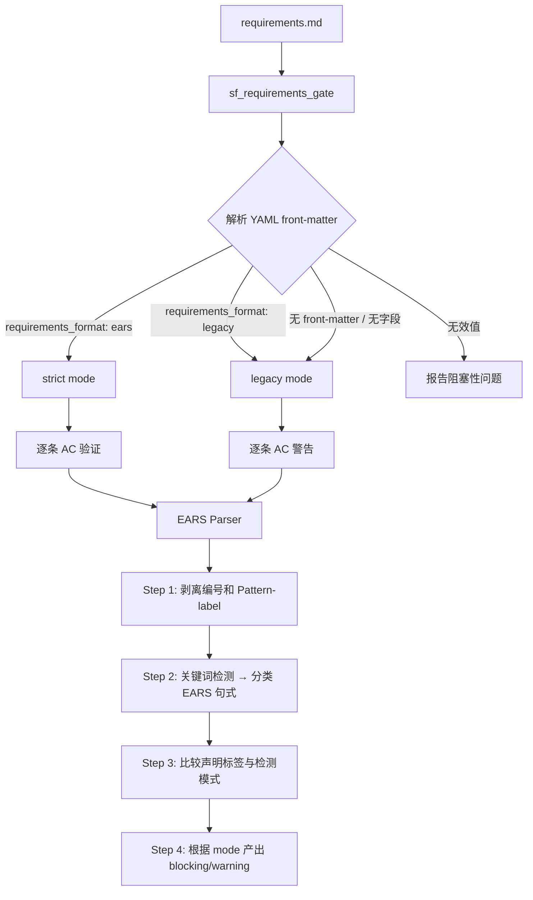
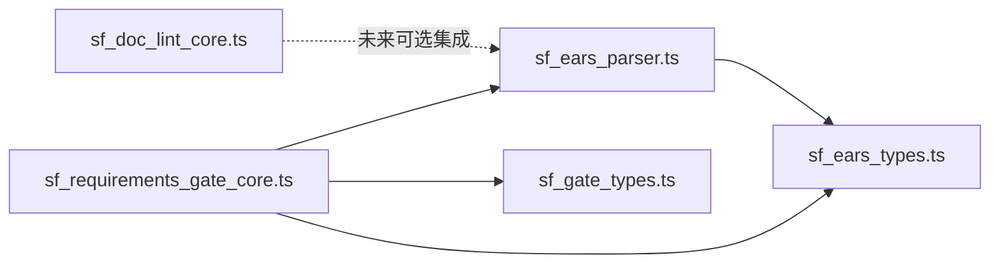

# 设计文档：EARS 格式验证

## 概述

本设计文档描述 SpecForge 系统中 EARS（Easy Approach to Requirements Syntax）格式验证功能的技术实现方案。该功能涉及三个组件的变更：

1. **EARS 解析器**（新增）：一个纯函数式的结构化验证模块，负责对单条 AC 进行模式分类和格式校验
2. **sf_requirements_gate 扩展**：集成 EARS 解析器，根据文档元数据选择验证模式（strict/legacy）
3. **Prompt/模板变更**：sf-requirements Agent 和 superpowers-brainstorming Skill 的文本更新

### 设计原则

- **解析器不是语义理解引擎**：仅做结构化验证（关键词检测、子句顺序、标点符号），不理解 AC 的业务含义
- **固定正则表达式**：所有正则表达式在编译时确定，绝不从 AC 内容动态构造 regex
- **向后兼容**：无 `requirements_format` 元数据的文档默认使用 legacy mode，不阻塞现有工作流
- **线性时间复杂度**：每条 AC 的验证为 O(1)，整体为 O(n)

## 架构

### 整体架构



### 模块依赖关系



### 解析器四步流水线

解析器对每条 AC 执行以下四步处理：

| 步骤 | 输入 | 输出 | 说明 |
|------|------|------|------|
| Step 1 | 原始 AC 字符串 | `{ index, raw, body, declaredPattern? }` | 剥离编号前缀 `N.` 和 `[Pattern-label]`，提取纯 EARS 句式本体 |
| Step 2 | EARS 句式本体 | `detectedPattern: EarsPattern \| null` | 使用固定正则检测关键词，分类为 6 种模式之一 |
| Step 3 | `declaredPattern` + `detectedPattern` | `mismatch: boolean` | 比较声明标签与检测结果 |
| Step 4 | 全部中间结果 + `ValidationMode` | `ACValidationResult` | 根据 mode 决定 issue 的 severity |

## 组件与接口

### 新增文件

| 文件路径 | 职责 |
|----------|------|
| `.opencode/tools/lib/sf_ears_types.ts` | EARS 类型定义（EarsPattern、ValidationMode、ACValidationResult 等） |
| `.opencode/tools/lib/sf_ears_parser.ts` | EARS 解析器核心逻辑（纯函数，无 I/O） |

### 修改文件

| 文件路径 | 变更内容 |
|----------|----------|
| `.opencode/tools/lib/sf_requirements_gate_core.ts` | 集成 EARS 解析器，新增 YAML front-matter 解析和模式选择逻辑 |
| `.opencode/agents/sf-requirements.md` | 新增 EARS 格式编写指令和 AC 输出格式规范 |
| `.opencode/skills/superpowers-brainstorming/SKILL.md` | 新增第 8 维度"EARS 模式覆盖" |

### 接口定义

#### sf_ears_parser.ts 导出接口

```typescript
/**
 * 验证单条 AC 的 EARS 格式合规性
 * 纯函数，无副作用
 */
export function validateAC(raw: string, index: number, mode: ValidationMode): ACValidationResult

/**
 * 批量验证所有 AC
 * 从 requirements.md 内容中提取 AC 列表并逐条验证
 */
export function validateAllACs(content: string, mode: ValidationMode): ACValidationResult[]

/**
 * 解析 YAML front-matter 中的 requirements_format 字段
 * 返回验证模式或错误
 */
export function parseValidationMode(content: string): 
  | { ok: true; mode: ValidationMode }
  | { ok: false; error: string }

/**
 * 检测 EARS 句式本体的模式分类
 * 纯函数，仅基于关键词位置判断
 */
export function detectPattern(body: string): EarsPattern | null

/**
 * 从 AC 原始字符串中剥离编号和 [Pattern-label]
 */
export function stripPrefixes(raw: string): { body: string; declaredPattern: EarsPattern | null }
```

#### AC 提取器（extractAcceptanceCriteria）

```typescript
export interface ExtractedAC {
  requirementId: string
  sectionTitle: string
  index: number
  raw: string
  lineStart: number
  lineEnd: number
}

export function extractAcceptanceCriteria(content: string): ExtractedAC[]
```

**提取规则：**
1. 只提取每个 `#### Acceptance Criteria` 小节下的顶层编号列表（`N. ...` 格式）
2. fenced code block（` ``` `）内的内容一律忽略，不提取也不验证
3. 遇到下一个 `### Requirement` 或同级/更高级标题时停止当前 AC 小节提取
4. strict mode 下，存在 Acceptance Criteria 小节但无 AC，报告 blocking issue
5. legacy mode 下，存在 Acceptance Criteria 小节但无 AC，报告 warning
6. 多行 AC 不支持；如果编号行后的续行不以新编号开头，并入上一条 AC
7. CRLF 和 LF 换行符均支持

#### sf_requirements_gate_core.ts 新增接口

```typescript
/**
 * 执行 EARS 格式验证（在现有 gate 检查之后调用）
 * 根据 mode 决定是否将 EARS 问题升级为 blocking_issues
 */
export function checkEarsCompliance(
  content: string,
  mode: ValidationMode
): { blocking_issues: string[]; warnings: string[] }
```

#### 路径安全校验

```typescript
/**
 * 校验并解析 requirements.md 路径
 * 拒绝绝对路径和路径遍历，确保文件位于 Spec_Directory 内
 */
export function resolveRequirementsPath(
  specDirectory: string,
  requestedPath: string
): { ok: true; path: string } | { ok: false; error: string }
```

**校验规则：**
1. 拒绝绝对路径（以 `/`、`C:\`、`D:\` 等开头）
2. 拒绝包含 `..` 的路径
3. resolve 后必须仍位于 specDirectory 内
4. 错误消息只返回相对路径，不返回绝对路径
5. 在 EARS 验证之前调用，失败时直接返回 blocking issue

## 数据模型

### 核心类型定义（sf_ears_types.ts）

```typescript
/**
 * EARS 六种模式
 */
export type EarsPattern =
  | "Ubiquitous"
  | "Event-driven"
  | "State-driven"
  | "Optional-feature"
  | "Unwanted-behavior"
  | "Complex"

/**
 * 验证模式
 */
export type ValidationMode = "strict" | "legacy"

/**
 * 单条 AC 的验证结果
 */
export interface ACValidationResult {
  /** AC 在文档中的序号（从 1 开始） */
  index: number
  /** 原始 AC 文本 */
  raw: string
  /** 从 [Pattern-label] 提取的声明模式 */
  declaredPattern?: EarsPattern
  /** 通过关键词检测得到的实际模式 */
  detectedPattern?: EarsPattern
  /** 验证状态 */
  status: "pass" | "warning" | "fail"
  /** 具体问题列表 */
  issues: ACIssue[]
}

/**
 * 单个验证问题
 */
export interface ACIssue {
  /** 问题代码，用于机器识别 */
  code: EarsIssueCode
  /** 严重程度 */
  severity: "warning" | "blocking"
  /** 人类可读的错误消息 */
  message: string
}

/**
 * 问题代码枚举
 */
export type EarsIssueCode =
  | "MISSING_SHALL"           // 缺少 SHALL 关键词
  | "MISSING_THE"            // 缺少 THE 关键词
  | "MISSING_THEN"           // IF 模式缺少 THEN
  | "MISSING_COMMA"          // 条件子句后缺少逗号
  | "MISSING_LABEL"          // 缺少 [Pattern-label] 前缀
  | "LABEL_MISMATCH"         // 标签与实际模式不匹配
  | "INVALID_PATTERN"        // 未匹配任何有效 EARS 模式
  | "EMPTY_AC"              // AC 内容为空
  | "COMPLEX_WHEN_IF"       // Complex 模式同时使用 WHEN 和 IF
  | "COMPLEX_ORDER"         // Complex 模式条件子句顺序错误
  | "INVALID_FORMAT_VALUE"  // requirements_format 值无效
  | "AC_TOO_LONG"           // 单条 AC 超过 2000 字符

/**
 * EARS 关键词常量
 */
export const EARS_KEYWORDS = ["WHEN", "WHILE", "WHERE", "IF", "THEN", "THE", "SHALL"] as const

/**
 * 合法的 Pattern-label 值
 */
export const VALID_PATTERN_LABELS: readonly EarsPattern[] = [
  "Ubiquitous",
  "Event-driven",
  "State-driven",
  "Optional-feature",
  "Unwanted-behavior",
  "Complex",
] as const
```

### 正则表达式设计

所有正则表达式为编译时常量，不从 AC 内容构造：

```typescript
/** Step 1: 剥离编号前缀 — 匹配 "N." 或 "N. " 开头 */
const RE_STRIP_NUMBER = /^\d+\.\s*/

/** Step 1: 提取 [Pattern-label] — 匹配 "[xxx]" 前缀 */
const RE_PATTERN_LABEL = /^\[([^\]]+)\]\s*/

/** Step 2: 检测 Ubiquitous — 以 THE 开头，包含 SHALL，不含条件关键词 */
const RE_UBIQUITOUS = /^THE\s+/i

/** Step 2: 检测 Event-driven — 以 WHEN 开头 */
const RE_EVENT_DRIVEN = /^WHEN\s+/i

/** Step 2: 检测 State-driven — 以 WHILE 开头 */
const RE_STATE_DRIVEN = /^WHILE\s+/i

/** Step 2: 检测 Optional-feature — 以 WHERE 开头 */
const RE_OPTIONAL_FEATURE = /^WHERE\s+/i

/** Step 2: 检测 Unwanted-behavior — 以 IF 开头 */
const RE_UNWANTED_BEHAVIOR = /^IF\s+/i

/** Step 2: 检测条件子句存在性（用于 Complex 判断） */
const RE_CONDITION_CLAUSES = /\b(WHERE|WHILE|WHEN|IF)\b/gi
```

### 分类算法：Complex 优先

`detectPattern` 必须先统计条件子句数量，再判断基础模式：

```typescript
function detectPattern(body: string): EarsPattern | null {
  const clauses = collectConditionClauses(body) // 收集 WHERE/WHILE/WHEN/IF 出现位置
  
  // Complex 优先：两个或以上条件子句
  if (clauses.length >= 2) {
    return validateComplexOrder(clauses) ? "Complex" : null // 顺序错误返回 null
  }
  
  // 五种基础模式（单条件子句或无条件）
  if (startsWithWhere(body)) return "Optional-feature"
  if (startsWithWhile(body)) return "State-driven"
  if (startsWithWhen(body)) return "Event-driven"
  if (startsWithIfThen(body)) return "Unwanted-behavior"
  if (startsWithTheShall(body)) return "Ubiquitous"
  
  return null
}
```

**关键规则：**
- Complex 判断在基础模式之前执行，避免 `WHERE x, WHEN y, THE z SHALL r` 被错误分类为 Optional-feature
- `validateComplexOrder` 验证子句顺序符合 WHERE → WHILE → WHEN/IF
- WHEN 和 IF 不允许同时出现

```typescript
/** 检测 SHALL 关键词 */
const RE_HAS_SHALL = /\bSHALL\b/

/** 检测 THE 关键词 */
const RE_HAS_THE = /\bTHE\b/

/** 检测 THEN 关键词 */
const RE_HAS_THEN = /\bTHEN\b/

/** 检测条件子句后的逗号（WHEN/WHILE/WHERE/IF ... , THE/THEN） */
const RE_COMMA_BEFORE_THE = /,\s*(THE|THEN)\b/i
```

### YAML Front-Matter 解析

```typescript
/** 匹配 YAML front-matter 块 */
const RE_FRONT_MATTER = /^---\n([\s\S]*?)\n---/

/** 匹配 requirements_format 字段 */
const RE_FORMAT_FIELD = /^requirements_format:\s*(.+)$/m
```

### Gate 结果集成

EARS 验证结果通过现有 `GateResult` 接口返回，不引入新的顶层类型：

```typescript
// 在 GateResult.details 中添加 EARS 验证详情（可选）
interface EarsGateDetails {
  mode: ValidationMode
  total_acs: number
  passed: number
  warnings: number
  failed: number
  results: ACValidationResult[]
}
```

### next_action 设置规则

当 `checkEarsCompliance` 返回任意 `blocking_issues` 时，`sf_requirements_gate_core` 的 `checkRequirementsGate` 函数 SHALL 设置 `GateResult.next_action = "revise"`。

集成点：在现有 gate 检查（用户故事、验收标准、术语表）之后，EARS 验证之前检查文件大小和路径安全，然后执行 EARS 验证，最后合并所有 blocking_issues 和 warnings 到 GateResult。

## 正确性属性

*正确性属性是在系统所有有效执行中都应成立的特征或行为——本质上是对系统应做什么的形式化陈述。属性是人类可读规格与机器可验证正确性保证之间的桥梁。*

### Property 1: 模式分类正确性

*对于任意*有效的 EARS 句式（属于 6 种模式之一），解析器的 `detectPattern` 函数应返回与该句式实际模式一致的分类结果。分类仅基于句式本体的关键词位置，与 `[Pattern-label]` 前缀无关。

**Validates: Requirements 7.1, 7.2, 7.3, 7.4, 7.5, 7.6, 7.7, 2.1**

### Property 2: 验证模式选择正确性

*对于任意* requirements.md 文档内容，`parseValidationMode` 函数应根据 YAML front-matter 中的 `requirements_format` 字段值正确选择验证模式：值为 `"ears"` 时返回 strict，值为 `"legacy"` 时返回 legacy，无 front-matter 或无该字段时返回 legacy。

**Validates: Requirements 6.1, 6.2, 6.3, 4.1, 4.4**

### Property 3: 无效格式值拒绝

*对于任意*非 `"ears"` 且非 `"legacy"` 的 `requirements_format` 字段值，`parseValidationMode` 函数应返回错误结果，且错误消息中包含该无效值。

**Validates: Requirements 6.4**

### Property 4: Strict 模式对无效 EARS 的阻塞

*对于任意*不匹配任何有效 EARS 模式的 AC 字符串，在 strict mode 下 `validateAC` 应返回 `status: "fail"` 且 issues 中包含至少一个 `severity: "blocking"` 的问题。

**Validates: Requirements 2.2, 2.4, 2.6**

### Property 5: Legacy 模式的非阻塞性

*对于任意* AC 字符串，在 legacy mode 下 `validateAC` 返回的 issues 中不应包含 `severity: "blocking"` 的问题（所有问题均为 warning）。

**Validates: Requirements 2.5, 4.2**

### Property 6: 标签与检测模式不匹配检测

*对于任意*有效 EARS 句式和一个与其实际模式不同的 `[Pattern-label]`，`validateAC` 应在 issues 中包含 `code: "LABEL_MISMATCH"` 的问题。

**Validates: Requirements 8.5**

### Property 7: 结构性错误检测

*对于任意*包含条件子句（WHEN/WHILE/WHERE/IF）但缺少必要结构元素（THE、SHALL、逗号）的 AC 字符串，`validateAC` 应在 issues 中包含对应错误代码的问题，且错误消息与缺失元素一致。

**Validates: Requirements 8.1, 8.2, 8.4**

### Property 8: Complex 模式子句顺序验证

*对于任意*包含两个或以上条件子句的 AC，当子句顺序不符合 WHERE → WHILE → WHEN/IF 规则时，`validateAC` 应报告 `code: "COMPLEX_ORDER"` 的阻塞性问题；当同时包含 WHEN 和 IF 时，应报告 `code: "COMPLEX_WHEN_IF"` 的阻塞性问题。

**Validates: Requirements 7.8, 7.9, 7.10**

### Property 9: 解析器对特殊字符的鲁棒性

*对于任意*包含正则元字符（`.*+?^${}()|[]\`）或 Unicode 控制字符的 AC 字符串，解析器应在有限时间内完成处理（不崩溃、不挂起），并返回有效的 `ACValidationResult`。

**Validates: Requirements 9.3, 10.5**

### Property 10: 错误消息不暴露绝对路径

*对于任意*验证失败的场景，`ACValidationResult.issues` 中所有 `message` 字段不应包含绝对路径模式（如 `/home/`、`C:\`、`D:\` 等）。

**Validates: Requirements 10.3**

### Property 11: AC 提取不读取 fenced code block

*对于任意*包含 fenced code block 且 code block 内含有 `N. [Pattern-label] EARS sentence` 格式文本的 requirements.md，`extractAcceptanceCriteria` 不应将 code block 内的内容作为 AC 提取。

**Validates: Requirements 2.1 (逐条验证的前提是正确提取)**

### Property 12: strict mode 下结构不完整的 AC 必须 blocking

*对于任意*缺少编号、缺少 `[Pattern-label]`、或 `[Pattern-label]` 不属于合法枚举的 AC 字符串，在 strict mode 下 `validateAC` 应返回 `status: "fail"` 且 issues 中包含对应的 blocking 问题。

**Validates: Requirements 2.6, 5.1, 5.2**

### Property 13: THE subject 和 SHALL response 为空时报告结构错误

*对于任意*包含 THE 但 THE 后 system subject 为空（直接接 SHALL）、或包含 SHALL 但 SHALL 后 response 为空的 AC 字符串，`validateAC` 应在 issues 中包含对应错误。

**Validates: Requirements 8.1, 8.2**

### Property 14: 路径安全拒绝绝对路径和路径遍历

*对于任意*包含绝对路径前缀（`/`、`C:\`、`D:\` 等）或包含 `..` 的路径字符串，`resolveRequirementsPath` 应返回 `{ ok: false }` 且错误消息不包含绝对路径。

**Validates: Requirements 10.2, 10.3**

## 错误处理

### 文件级错误

| 错误场景 | 处理方式 | 结果 |
|----------|----------|------|
| 文件不存在 | 保持现有行为 | `status: "fail"`, `blocking_issues: ["requirements.md not found"]` |
| 文件读取失败 | 保持现有行为 | `status: "blocked"`, `next_action: "ask_user"` |
| 文件超过 1MB | 新增检查，在 EARS 验证前拦截 | `status: "fail"`, `blocking_issues: ["文件大小超过限制"]` |
| 无 front-matter | — | 默认 legacy mode |
| 有 front-matter 但无法解析 | 报告阻塞性问题 | `status: "fail"`, 消息 "invalid front-matter" |
| 有 front-matter 但无 requirements_format | — | 默认 legacy mode + migration warning |
| requirements_format 值无效 | 报告阻塞性问题 | `status: "fail"`, 消息指明无效值 |

### AC 级错误

| 错误场景 | 问题代码 | 消息 |
|----------|----------|------|
| AC 内容为空 | `EMPTY_AC` | "AC 内容为空" |
| 缺少 SHALL | `MISSING_SHALL` | "缺少 SHALL 关键词" |
| 缺少 THE | `MISSING_THE` | "缺少 THE 关键词" |
| IF 模式缺少 THEN | `MISSING_THEN` | "IF 模式缺少 THEN" |
| 条件子句后缺少逗号 | `MISSING_COMMA` | "条件子句后缺少逗号" |
| 缺少 [Pattern-label] | `MISSING_LABEL` | "缺少模式标签 [Pattern-label]" |
| 标签与模式不匹配 | `LABEL_MISMATCH` | "标签 [X] 与检测到的模式 Y 不匹配" |
| 未匹配任何模式 | `INVALID_PATTERN` | "未匹配任何有效 EARS 模式" |
| Complex 同时含 WHEN 和 IF | `COMPLEX_WHEN_IF` | "Complex 模式不允许同时使用 WHEN 和 IF" |
| Complex 子句顺序错误 | `COMPLEX_ORDER` | "条件子句顺序错误" |

### 严重程度映射

| 模式 | EARS 格式问题 | 标签不匹配 | 缺少标签 |
|------|--------------|-----------|----------|
| strict | blocking | blocking | blocking |
| legacy | warning | warning | warning |

### 防御性设计

1. **不构造动态正则**：所有 regex 为模块级常量，AC 内容仅作为 `.test()` 或 `.match()` 的输入
2. **超长 AC 拒绝**：单条 AC 超过 2000 字符时，直接返回 `AC_TOO_LONG` 错误，不对内容进行合规判定
3. **正则安全**：所有正则使用非贪婪匹配或有界量词，避免灾难性回溯
4. **异常隔离**：单条 AC 验证失败不影响其他 AC 的验证

## 测试策略

### 测试框架

- **单元测试**：Vitest
- **属性测试**：fast-check（已在项目 devDependencies 中）
- **最低迭代次数**：每个属性测试 100 次迭代

### 属性测试（Property-Based Testing）

每个正确性属性对应一个属性测试文件：

| 属性 | 测试文件 | 生成器策略 |
|------|----------|-----------|
| Property 1 | `tests/property/ears-classification.property.test.ts` | 为每种 EARS 模式生成随机有效句式 |
| Property 2 | `tests/property/ears-mode-selection.property.test.ts` | 生成带/不带 front-matter 的文档 |
| Property 3 | `tests/property/ears-invalid-format.property.test.ts` | 生成非 "ears"/"legacy" 的随机字符串 |
| Property 4 | `tests/property/ears-strict-blocking.property.test.ts` | 生成不含 EARS 关键词的随机字符串 |
| Property 5 | `tests/property/ears-legacy-nonblocking.property.test.ts` | 生成任意 AC 字符串 |
| Property 6 | `tests/property/ears-label-mismatch.property.test.ts` | 生成有效句式 + 错误标签组合 |
| Property 7 | `tests/property/ears-structural-errors.property.test.ts` | 生成缺少结构元素的句式 |
| Property 8 | `tests/property/ears-complex-ordering.property.test.ts` | 生成多子句句式的各种排列 |
| Property 9 | `tests/property/ears-robustness.property.test.ts` | 生成含特殊字符的字符串 |
| Property 10 | `tests/property/ears-no-absolute-paths.property.test.ts` | 生成各种错误场景，检查消息 |
| Property 11 | `tests/property/ears-ac-extraction-codeblock.property.test.ts` | 生成含 fenced code block 的文档 |
| Property 12 | `tests/property/ears-strict-incomplete-ac.property.test.ts` | 生成缺少编号/标签/非法标签的 AC |
| Property 13 | `tests/property/ears-empty-subject-response.property.test.ts` | 生成 THE 后无 subject 或 SHALL 后无 response 的 AC |
| Property 14 | `tests/property/ears-path-safety.property.test.ts` | 生成含绝对路径前缀或 `..` 的路径字符串 |

**属性测试标签格式**：
```typescript
// Feature: specforge-ears-format, Property 1: 模式分类正确性
```

### 单元测试

| 测试文件 | 覆盖内容 |
|----------|----------|
| `tests/unit/ears-parser.test.ts` | 每种模式的具体示例、边界情况 |
| `tests/unit/ears-gate-integration.test.ts` | Gate 集成：向后兼容性、mode 选择、结果格式 |
| `tests/unit/ears-edge-cases.test.ts` | 空 AC、超长 AC、仅编号、Complex WHEN+IF |

### 测试覆盖矩阵

| 需求 | 属性测试 | 单元测试 | 说明 |
|------|----------|----------|------|
| Req 1 (Agent prompt) | — | — | Prompt 变更，人工审查 |
| Req 2 (Gate 验证) | P1-P5 | ✓ | 核心解析逻辑 |
| Req 3 (Brainstorming) | — | — | 静态文本变更，人工审查 |
| Req 4 (向后兼容) | P2, P5 | ✓ | 模式选择和 legacy 行为 |
| Req 5 (输出格式) | — | — | Prompt 变更，人工审查 |
| Req 6 (模式选择) | P2, P3 | ✓ | Front-matter 解析 |
| Req 7 (分类规则) | P1, P8 | ✓ | 模式分类核心逻辑 |
| Req 8 (错误处理) | P6, P7 | ✓ | 错误检测和消息 |
| Req 9 (性能) | P9 | ✓ (benchmark) | 正则安全性 + 性能基准 |
| Req 10 (安全) | P9, P10, P14 | ✓ | 输入安全和路径安全 |
