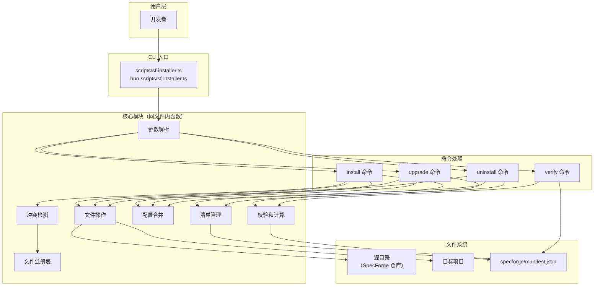
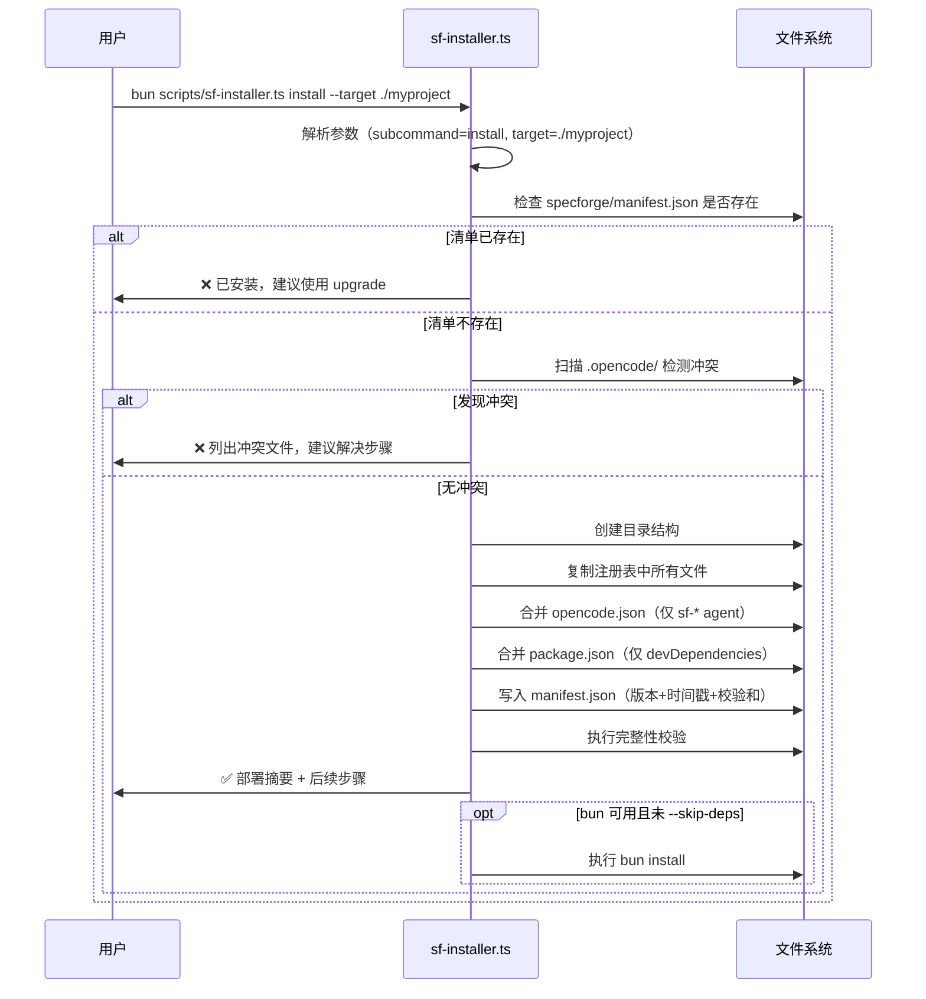

# 设计文档 — SpecForge 统一安装命令系统

## 概述

本文档是 SpecForge 统一安装命令系统的设计文档，基于需求文档定义的 10 项需求。该系统用一个跨平台的 TypeScript CLI 工具（`scripts/sf-installer.ts`）替代现有的平台特定脚本（`install.ps1`、`install.sh`、`reinstall.ps1`），实现版本感知、冲突检测、安全操作的安装/升级/卸载/校验体验。

### 设计目标

1. **单一入口**：一个 TypeScript 文件通过 bun 运行，Windows 和 Unix 行为一致
2. **显式文件追踪**：硬编码文件注册表替代 glob 复制，清单文件记录部署状态
3. **安全操作**：永不覆盖用户文件，冲突检测前置，dry-run 支持
4. **选择性升级**：基于 SHA-256 校验和差异，仅部署变化的文件
5. **配置合并**：对 `opencode.json` 和 `package.json` 执行精确合并，不破坏用户配置
6. **零外部依赖**：仅使用 Node.js 内置模块 + bun 运行时

### 设计决策与理由

| 决策 | 理由 |
|------|------|
| 单文件架构（`scripts/sf-installer.ts`），不拆分模块 | 安装器是 CLI 工具不是库；单文件便于分发和理解；函数级组织足够 |
| 硬编码文件注册表而非动态扫描 | 显式优于隐式；避免意外部署非预期文件；注册表即文档 |
| SHA-256 校验和而非文件修改时间 | 跨平台一致性；内容寻址更可靠；bun 内置 crypto 支持 |
| 清单文件放在 `specforge/manifest.json` | 与 specforge 目录结构一致；不污染项目根目录；卸载时可一并清理 |
| 合并策略：读取→解析→修改→写回 | 保留用户格式和注释（JSON 无注释但保留字段顺序）；精确控制修改范围 |
| `--force` 覆盖冲突而非自动备份 | 简单明确；备份文件会污染项目；用户应通过 git 管理版本 |
| 旧脚本保留但标记废弃 | 向后兼容；用户可能有自动化依赖旧脚本；渐进迁移 |
| 版本号从源目录 `package.json` 读取 | 单一版本源；与 npm 生态一致；无需额外版本文件 |

---

## 架构

### 系统架构总览



### 命令执行流程



---

## 组件与接口

### DD-1 参数解析模块 refs: [REQ-1]

负责解析命令行参数，返回结构化的命令配置。

```typescript
interface CLIOptions {
  subcommand: "install" | "upgrade" | "uninstall" | "verify" | null;
  target: string;          // 目标项目路径，默认 cwd
  force: boolean;          // --force 忽略冲突
  purge: boolean;          // --purge 卸载时删除运行时数据
  dryRun: boolean;         // --dry-run 仅显示不执行
  skipDeps: boolean;       // --skip-deps 跳过 bun install
  showVersion: boolean;    // --version 显示版本
}

function parseArgs(args: string[]): CLIOptions;
function showUsage(): void;
function showVersion(targetDir: string): void;
```

### DD-2 文件注册表 refs: [REQ-2, REQ-4]

硬编码的文件清单，定义 SpecForge 部署的所有文件相对路径。这是安装器的"真相源"——只有注册表中的文件才会被部署。

```typescript
/** 文件注册表 — SpecForge 部署的所有文件 */
const FILE_REGISTRY: string[] = [
  // Agent 定义
  ".opencode/agents/sf-orchestrator.md",
  ".opencode/agents/sf-requirements.md",
  ".opencode/agents/sf-design.md",
  ".opencode/agents/sf-task-planner.md",
  ".opencode/agents/sf-executor.md",
  ".opencode/agents/sf-debugger.md",
  ".opencode/agents/sf-reviewer.md",
  ".opencode/agents/sf-verifier.md",

  // Custom Tools
  ".opencode/tools/sf_state_read.ts",
  ".opencode/tools/sf_state_transition.ts",
  ".opencode/tools/sf_doc_lint.ts",
  ".opencode/tools/sf_requirements_gate.ts",
  ".opencode/tools/sf_design_gate.ts",
  ".opencode/tools/sf_tasks_gate.ts",
  ".opencode/tools/sf_verification_gate.ts",
  ".opencode/tools/sf_knowledge_graph.ts",
  ".opencode/tools/sf_knowledge_query.ts",
  ".opencode/tools/sf_context_build.ts",
  ".opencode/tools/sf_batch_verify.ts",
  ".opencode/tools/sf_cost_report.ts",
  ".opencode/tools/sf_artifact_write.ts",
  ".opencode/tools/sf_doctor.ts",
  ".opencode/tools/sf_trace_matrix.ts",
  // Tool 核心库
  ".opencode/tools/lib/sf_state_read_core.ts",
  ".opencode/tools/lib/sf_state_transition_core.ts",
  ".opencode/tools/lib/sf_doc_lint_core.ts",
  ".opencode/tools/lib/sf_requirements_gate_core.ts",
  ".opencode/tools/lib/sf_design_gate_core.ts",
  ".opencode/tools/lib/sf_tasks_gate_core.ts",
  ".opencode/tools/lib/sf_verification_gate_core.ts",
  ".opencode/tools/lib/sf_knowledge_graph_core.ts",
  ".opencode/tools/lib/sf_knowledge_query_core.ts",
  ".opencode/tools/lib/sf_context_build_core.ts",
  ".opencode/tools/lib/sf_batch_verify_core.ts",
  ".opencode/tools/lib/sf_cost_report_core.ts",
  ".opencode/tools/lib/sf_artifact_write_core.ts",
  ".opencode/tools/lib/sf_conversation_recorder_core.ts",
  ".opencode/tools/lib/sf_trace_matrix_core.ts",
  ".opencode/tools/lib/state_machine.ts",
  ".opencode/tools/lib/utils.ts",

  // Plugins
  ".opencode/plugins/sf_checkpoint.ts",
  ".opencode/plugins/sf_cost_tracker.ts",
  ".opencode/plugins/sf_event_logger.ts",
  ".opencode/plugins/sf_permission_guard.ts",
  ".opencode/plugins/sf_session_recorder.ts",

  // Skills
  ".opencode/skills/sf-workflow-feature-spec/SKILL.md",
  ".opencode/skills/sf-workflow-bugfix-spec/SKILL.md",
  ".opencode/skills/sf-workflow-design-first/SKILL.md",
  ".opencode/skills/sf-workflow-quick-change/SKILL.md",
  ".opencode/skills/superpowers-brainstorming/SKILL.md",
  ".opencode/skills/superpowers-code-review/SKILL.md",
  ".opencode/skills/superpowers-subagent-driven-development/SKILL.md",
  ".opencode/skills/superpowers-systematic-debugging/SKILL.md",
  ".opencode/skills/superpowers-tdd/SKILL.md",
  ".opencode/skills/superpowers-verification-before-completion/SKILL.md",
  ".opencode/skills/superpowers-writing-plans/SKILL.md",

  // SpecForge 核心配置
  "specforge/agents/AGENT_CONSTITUTION.md",
  "specforge/agents/contracts/sf-orchestrator.contract.md",
  "specforge/agents/contracts/sf-requirements.contract.md",
  "specforge/agents/contracts/sf-design.contract.md",
  "specforge/agents/contracts/sf-executor.contract.md",
  "specforge/agents/contracts/sf-task-planner.contract.md",
  "specforge/agents/contracts/sf-debugger.contract.md",
  "specforge/agents/contracts/sf-reviewer.contract.md",
  "specforge/agents/contracts/sf-verifier.contract.md",
  "specforge/config/project.json",
  "specforge/config/risk_policy.json",
  "specforge/config/skill_fragments.json",

  // SpecForge 运行时初始文件
  "specforge/runtime/state.json",
  "specforge/runtime/events.jsonl",

  // 根目录文件
  "AGENTS.md",
];

/** 需要合并而非直接复制的配置文件 */
const MERGE_FILES = ["opencode.json", "package.json"] as const;

/** 运行时数据目录（卸载时默认保留） */
const RUNTIME_DIRS = [
  "specforge/runtime/checkpoints",
  "specforge/sessions",
  "specforge/specs",
  "specforge/archive",
  "specforge/logs",
] as const;
```

### DD-3 清单管理模块 refs: [REQ-4, REQ-9]

管理 `specforge/manifest.json` 的读写和校验。

```typescript
interface ManifestFile {
  version: string;
  installed_at: string;       // ISO 8601
  source_dir: string;         // 安装时的源目录路径
  files: Record<string, string>;  // 相对路径 → SHA-256 hex
}

function readManifest(targetDir: string): ManifestFile | null;
function writeManifest(targetDir: string, manifest: ManifestFile): void;
function computeSHA256(filePath: string): Promise<string>;
function buildManifest(sourceDir: string, targetDir: string, deployedFiles: string[]): Promise<ManifestFile>;
```

### DD-4 冲突检测模块 refs: [REQ-3, REQ-7]

在部署前扫描目标目录，检测命名冲突。

```typescript
interface ConflictReport {
  hasConflicts: boolean;
  conflicts: Array<{
    path: string;
    reason: "user_file_at_sf_path" | "non_sf_agent_in_config";
    detail: string;
  }>;
}

function detectConflicts(targetDir: string, manifest: ManifestFile | null): ConflictReport;
function isSpecForgeFile(filename: string): boolean;
function checkOpenCodeJsonConflicts(targetDir: string): ConflictReport;
```

**冲突检测逻辑：**

1. 遍历 `FILE_REGISTRY` 中每个路径
2. 如果目标路径已存在文件：
   - 如果该路径在现有清单中 → 是 SF 文件，无冲突
   - 如果该路径不在清单中 → 用户文件占据了 SF 路径，报告冲突
3. 检查 `opencode.json` 中的 agent 定义：
   - 如果存在 `sf-` 前缀的 agent 但不在清单中 → 报告冲突

### DD-5 配置合并模块 refs: [REQ-10, REQ-2]

精确合并 `opencode.json` 和 `package.json`，保护用户配置。

```typescript
/** 合并 opencode.json：仅操作 agent 对象中 sf-* 条目 */
function mergeOpenCodeJson(targetDir: string, sourceDir: string, mode: "add" | "remove"): void;

/** 合并 package.json：仅操作 devDependencies 中 SF 所需条目 */
function mergePackageJson(targetDir: string, sourceDir: string, mode: "add" | "remove"): void;
```

**opencode.json 合并规则：**
- `mode="add"`（install/upgrade）：读取目标文件 → 解析 JSON → 将源文件中 `agent` 对象里以 `sf-` 开头的条目写入目标的 `agent` 对象 → 保留 `$schema`、`permission`、非 `sf-` agent 不变 → 写回
- `mode="remove"`（uninstall）：读取目标文件 → 删除 `agent` 对象中以 `sf-` 开头的条目 → 写回

**package.json 合并规则：**
- `mode="add"`：读取目标文件 → 将源文件 `devDependencies` 中的条目合并到目标的 `devDependencies` → 保留 `name`、`version`、`scripts`、`dependencies` 等其他字段不变 → 写回
- `mode="remove"`：读取目标文件 → 从 `devDependencies` 中删除源文件 `devDependencies` 中列出的包名 → 写回

### DD-6 文件操作模块 refs: [REQ-7, REQ-2]

封装所有文件系统操作，支持 dry-run 和日志输出。

```typescript
type OpType = "创建" | "更新" | "删除" | "跳过" | "合并";

interface FileOperation {
  type: OpType;
  path: string;
  reason?: string;
}

function deployFile(sourceDir: string, targetDir: string, relativePath: string, dryRun: boolean): FileOperation;
function removeFile(targetDir: string, relativePath: string, dryRun: boolean): FileOperation;
function removeEmptyDirs(targetDir: string, dirs: string[], dryRun: boolean): FileOperation[];
function logOperation(op: FileOperation): void;
```

### DD-7 命令实现 refs: [REQ-2, REQ-5, REQ-6, REQ-9]

四个子命令的顶层实现函数。

```typescript
async function cmdInstall(opts: CLIOptions, sourceDir: string): Promise<void>;
async function cmdUpgrade(opts: CLIOptions, sourceDir: string): Promise<void>;
async function cmdUninstall(opts: CLIOptions): Promise<void>;
async function cmdVerify(opts: CLIOptions): Promise<void>;
```

### DD-8 依赖管理集成 refs: [REQ-8]

安装/升级完成后自动执行 `bun install`。

```typescript
function isBunAvailable(): boolean;
function runBunInstall(targetDir: string): { success: boolean; output: string };
```

---

## 数据模型

### 清单文件（Manifest）

**文件路径：** `specforge/manifest.json`（位于目标项目中）

```json
{
  "version": "0.5.0",
  "installed_at": "2025-01-15T10:30:00.000Z",
  "source_dir": "/home/user/SpecForge",
  "files": {
    ".opencode/agents/sf-orchestrator.md": "a1b2c3d4e5f6...",
    ".opencode/agents/sf-requirements.md": "b2c3d4e5f6a1...",
    ".opencode/tools/sf_state_read.ts": "c3d4e5f6a1b2...",
    "specforge/config/project.json": "d4e5f6a1b2c3...",
    "AGENTS.md": "e5f6a1b2c3d4..."
  }
}
```

**字段说明：**

| 字段 | 类型 | 说明 | 来源 |
|------|------|------|------|
| `version` | string | SpecForge 版本号 | 源目录 `package.json` 的 `version` 字段 |
| `installed_at` | string | ISO 8601 时间戳 | 安装/升级时生成 |
| `source_dir` | string | 源目录绝对路径 | 安装时记录，升级时用于定位源文件 |
| `files` | Record | 已部署文件的相对路径→SHA-256 映射 | 部署后计算 |

### SpecForge 文件识别规则

| 文件类型 | 前缀规则 | 示例 |
|----------|----------|------|
| Agent 定义 | `sf-` | `sf-orchestrator.md` |
| Skill 目录 | `sf-` | `sf-workflow-feature-spec/` |
| Tool 文件 | `sf_` | `sf_state_read.ts` |
| Plugin 文件 | `sf_` | `sf_event_logger.ts` |
| Tool 核心库 | `sf_` | `sf_state_read_core.ts` |
| 共享库 | 无前缀但在注册表中 | `state_machine.ts`、`utils.ts` |
| 根目录文件 | 无前缀但在注册表中 | `AGENTS.md` |

**识别优先级：** 清单文件 > 前缀规则。如果文件在清单中，它就是 SF 文件，无论是否有前缀。

---

## 正确性属性

*正确性属性是在系统所有有效执行中都应成立的特征或行为——本质上是对系统应做什么的形式化陈述。属性是人类可读规格与机器可验证正确性保证之间的桥梁。*

### Property 1: 安装部署完整性

*对于任意*文件注册表和空目标目录，执行 install 命令后，注册表中的每个文件都应存在于目标目录的对应路径。

**Validates: Requirements 2.1**

### Property 2: opencode.json 合并安全性

*对于任意*包含任意非 sf-* agent 定义和任意 `$schema`/`permission` 值的有效 `opencode.json`，执行合并操作后，所有原始非 sf-* agent 定义、`$schema` 和 `permission` 字段应保持不变，且所有 sf-* agent 定义应被正确添加/更新。

**Validates: Requirements 2.4, 5.5, 10.1, 10.2, 10.5**

### Property 3: package.json 合并安全性

*对于任意*包含任意 `name`、`version`、`scripts`、`dependencies` 和 `devDependencies` 的有效 `package.json`，执行合并操作后，`devDependencies` 以外的所有字段应保持不变，且 SpecForge 所需的 devDependencies 应被正确添加/更新。

**Validates: Requirements 2.5, 10.3, 10.4**

### Property 4: 清单校验和正确性

*对于任意*已部署的文件集合，清单文件中记录的每个路径对应的 SHA-256 校验和应等于该文件实际内容的 SHA-256 哈希值。

**Validates: Requirements 2.6, 4.3**

### Property 5: 冲突检测阻止用户文件覆盖

*对于任意*目标目录中存在的非清单文件，如果该文件路径与文件注册表中的某个路径相同，安装器应检测到冲突并中止操作（除非提供 --force）。

**Validates: Requirements 3.2, 7.1, 7.3**

### Property 6: SpecForge 文件前缀识别

*对于任意*文件名，`isSpecForgeFile` 函数应返回 true 当且仅当文件名以 `sf-` 或 `sf_` 开头。

**Validates: Requirements 3.3**

### Property 7: 升级选择性部署

*对于任意*清单和源文件集合，upgrade 命令应仅部署 SHA-256 校验和与清单记录不同的文件或清单中不存在的新文件，不应重写校验和匹配的文件。

**Validates: Requirements 5.3**

### Property 8: 运行时数据不可变性

*对于任意* install、upgrade 或 uninstall（无 --purge）操作，运行时数据文件（`specforge/runtime/`、`specforge/sessions/`、`specforge/specs/`、`specforge/archive/`、`specforge/logs/`）的内容应保持不变。

**Validates: Requirements 5.4, 6.5**

### Property 9: 升级清理已移除文件

*对于任意*清单中记录但源目录文件注册表中已不存在的文件路径，upgrade 命令应从目标项目中删除该文件。

**Validates: Requirements 5.6**

### Property 10: 卸载移除所有清单文件

*对于任意*清单文件列表，执行 uninstall 命令后，清单中列出的每个文件都不应存在于目标目录中。

**Validates: Requirements 6.1**

### Property 11: 卸载配置清理

*对于任意*包含 sf-* 和非 sf-* agent 定义的 `opencode.json`，以及包含 SF 和非 SF devDependencies 的 `package.json`，执行 uninstall 后，sf-* agent 定义和 SF devDependencies 应被移除，而非 sf-* 条目应保持不变。

**Validates: Requirements 6.2, 6.3**

### Property 12: 卸载不删除用户文件

*对于任意*目标目录中不在清单文件列表中的文件，执行 uninstall 后该文件应仍然存在且内容不变。

**Validates: Requirements 7.2**

### Property 13: 已修改 SF 文件检测

*对于任意*清单中记录的文件，如果该文件当前内容的 SHA-256 与清单记录不同，upgrade 命令应将其标记为"已修改"并在非 --force 模式下提示确认。

**Validates: Requirements 7.4**

### Property 14: Dry-run 幂等性

*对于任意*子命令和 --dry-run 标志，执行后目标目录的文件系统状态（所有文件的存在性和内容）应与执行前完全一致。

**Validates: Requirements 7.5**

### Property 15: 完整性校验正确性

*对于任意*清单和目标目录文件状态（文件可能缺失、已修改或完整），verify 命令应正确将每个文件分类为"完整"、"已修改"或"缺失"，分类结果应与实际 SHA-256 比较结果一致。

**Validates: Requirements 9.2, 9.3, 9.4**

---

## 错误处理

### 错误分类与处理策略

| 错误类型 | 触发条件 | 处理方式 | refs |
|----------|----------|----------|------|
| 参数错误 | 无效子命令、无效路径 | 显示用法信息，退出码 1 | [REQ-1] |
| 已安装错误 | install 时清单已存在 | 提示使用 upgrade，退出码 1 | [REQ-2] |
| 未安装错误 | upgrade/uninstall 时清单不存在 | 提示使用 install，退出码 1 | [REQ-5, REQ-6] |
| 冲突错误 | 检测到文件冲突（无 --force） | 列出冲突，建议解决步骤，退出码 1 | [REQ-3] |
| JSON 解析错误 | opencode.json/package.json 无效 | 中止操作，报告解析错误，退出码 1 | [REQ-10] |
| 权限错误 | 文件复制/删除权限不足 | 报告具体路径，跳过该文件，继续处理 | [REQ-2] |
| 源文件缺失 | 注册表中的文件在源目录不存在 | 报告警告，跳过该文件，继续处理 | [REQ-2] |
| 目标目录不存在 | --target 指向不存在的路径 | 创建目录（install）或报错（upgrade/uninstall/verify） | [REQ-1] |

### 退出码

| 退出码 | 含义 |
|--------|------|
| 0 | 操作成功完成 |
| 1 | 操作失败（参数错误、冲突、已安装/未安装） |
| 2 | 部分成功（有文件跳过但整体完成） |

### 错误输出格式

```
❌ 错误: <错误描述>
   路径: <相关文件路径>
   建议: <解决步骤>
```

---

## 测试策略

### 测试框架

- **单元测试**：vitest（项目已有配置）
- **属性测试**：fast-check（项目已有依赖）
- **测试文件位置**：`tests/unit/installer/` 目录

### 属性测试（Property-Based Testing）

每个正确性属性对应一个属性测试，使用 fast-check 生成随机输入，最少 100 次迭代。

**测试配置：**
```typescript
import fc from "fast-check";
import { describe, it, expect } from "vitest";

// 每个属性测试最少 100 次迭代
const PBT_CONFIG = { numRuns: 100 };
```

**生成器设计：**

| 生成器 | 用途 | 生成内容 |
|--------|------|----------|
| `arbFileRegistry` | 文件注册表 | 随机相对路径列表（含嵌套目录） |
| `arbOpenCodeJson` | opencode.json | 含随机 sf-* 和非 sf-* agent 的 JSON |
| `arbPackageJson` | package.json | 含随机 name/version/scripts/deps 的 JSON |
| `arbManifest` | 清单文件 | 随机版本+路径→校验和映射 |
| `arbFileContent` | 文件内容 | 随机字节序列（用于校验和测试） |
| `arbFilename` | 文件名 | 随机字符串（含/不含 sf-/sf_ 前缀） |

### 单元测试

覆盖属性测试不适合的场景：

| 测试类别 | 覆盖内容 |
|----------|----------|
| 参数解析 | 各种 CLI 参数组合、无效输入、默认值 |
| 命令守卫 | install 已安装中止、upgrade 未安装中止、uninstall 未安装中止 |
| 错误处理 | 权限错误跳过、JSON 解析错误中止、源文件缺失警告 |
| 输出格式 | 操作日志标识、摘要格式、后续步骤提示 |
| 依赖管理 | bun 可用/不可用、--skip-deps 行为 |
| --force 行为 | 冲突时强制继续 |
| --purge 行为 | 卸载时删除运行时数据 |

### 集成测试

在临时目录中执行完整的 install → verify → upgrade → uninstall 流程：

1. 创建临时目标目录
2. 执行 install，验证所有文件部署
3. 执行 verify，验证完整性通过
4. 修改源文件，执行 upgrade，验证选择性部署
5. 执行 uninstall，验证清理完成
6. 清理临时目录

### 测试标签格式

```typescript
// Feature: specforge-install-commands, Property 1: 安装部署完整性
it.prop("对于任意文件注册表，install 应部署所有文件", [arbFileRegistry], PBT_CONFIG, ...)
```
