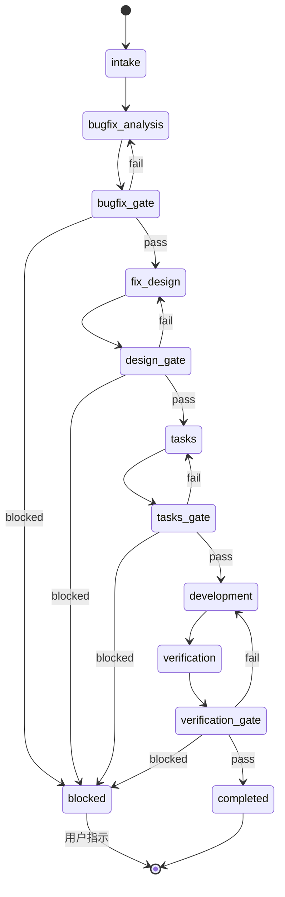
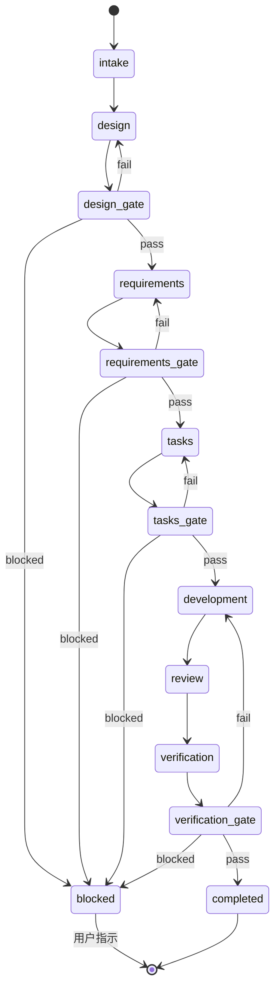
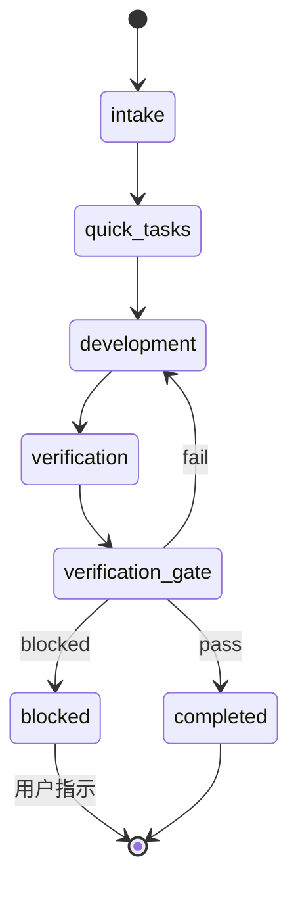

# 设计文档 — SpecForge V1 Complete（增量设计）

## 概述

本文档是 SpecForge V1 Complete 的**增量设计文档**，基于已实现并经过 4 轮测试验证的 V1 MVP。MVP 设计文档（`.kiro/specs/specforge-v1-mvp/design.md`）中已定义的组件、接口、数据模型在此不重复，仅描述**新增组件**和**对现有组件的变更**。

### 增量设计范围

| 类别 | 新增 | 变更 |
|------|------|------|
| 状态机 | bugfix_spec、feature_spec_design_first、quick_change 三种工作流 | state_machine.ts 扩展为多工作流支持 |
| Custom Tool | sf_trace_matrix | sf_state_read（agent_runs 查询）、sf_requirements_gate（bugfix 模式）、sf_doc_lint（bugfix 类型）、sf_verification_gate（e2e 检查）、sf_doctor（扩展检查项） |
| Plugin | sf_permission_guard、sf_checkpoint | — |
| Skill | writing-plans、subagent-driven-development、tdd、systematic-debugging、code-review | superpowers-verification-before-completion（增加 e2e 证据） |
| Agent 定义 | — | 全部 7 个 Sub_Agent（增加禁止 sf_state_transition 条款） |
| 契约文件 | — | 全部 7 个 Sub_Agent 契约（增加禁止行为） |
| 配置 | — | AGENT_CONSTITUTION.md（增加规则 10）、sf-orchestrator.md（工作流选择扩展） |
| 数据模型 | Agent Run Archive、Checkpoint | state.json（workflow_type 扩展）、events.jsonl（新事件类型） |

### 设计决策与理由

| 决策 | 理由 |
|------|------|
| 状态机按 workflow_type 分表而非合并 | 不同工作流的状态集合和流转规则差异大，分表更清晰，避免非法跨工作流流转 |
| sf_permission_guard 用 Plugin 而非 Custom Tool | 需要在 tool.execute.before 钩子中拦截，Plugin 是唯一能做到"先于工具执行"的机制 |
| sf_checkpoint 用 Plugin 而非 Custom Tool | 需要监听 session.compacting 事件，这是 Plugin 专属能力 |
| sf_trace_matrix 用 Custom Tool | 追溯矩阵检查是确定性的文档解析逻辑，适合 Custom Tool |
| Skill 文件不做程序化验证 | Skill 本质是 prompt 指令，其效果依赖 LLM 遵循度，用单元测试检查内容关键词即可 |
| Agent Run Archive 由 Orchestrator 创建而非 Plugin | Plugin 无法获取子 Agent 的执行结果详情（如 files_changed），需要 Orchestrator 在调度前后主动记录 |
| Quick Change 升级为 feature_spec 时从 requirements 重新开始 | 保留 intake 信息但需要补充完整的需求分析，确保升级后的工作流质量 |

---

## 架构

### 扩展后的系统分层架构

```mermaid
graph TB
    subgraph "用户层"
        User[用户 / OpenCode 主会话<br/>Depth 0]
    end

    subgraph "编排层 Orchestration Layer"
        Orch[sf-orchestrator<br/>primary agent / Depth 1]
        SM[sf_state_transition<br/>Custom Tool]
        SR[sf_state_read<br/>Custom Tool]
        EL[sf_event_logger<br/>Plugin]
        PG[sf_permission_guard<br/>Plugin ★新增]
        CP[sf_checkpoint<br/>Plugin ★新增]
    end

    subgraph "Agent 层 Agent Layer"
        REQ[sf-requirements-agent]
        DES[sf-design-agent]
        TP[sf-task-planner-agent]
        EXE[sf-executor-agent]
        DBG[sf-debugger-agent]
        REV[sf-reviewer-agent]
        VER[sf-verifier-agent]
    end

    subgraph "控制层 Control Layer"
        RG[sf_requirements_gate<br/>★扩展 bugfix 模式]
        DG[sf_design_gate]
        TG[sf_tasks_gate]
        VG[sf_verification_gate<br/>★扩展 e2e 检查]
        DL[sf_doc_lint<br/>★扩展 bugfix 类型]
        TM[sf_trace_matrix<br/>★新增]
    end

    subgraph "方法层 Method Layer"
        SB[superpowers-brainstorming]
        SV[superpowers-verification<br/>★更新 e2e 证据]
        WP[superpowers-writing-plans ★新增]
        SD[superpowers-subagent-driven-dev ★新增]
        TD[superpowers-tdd ★新增]
        SY[superpowers-systematic-debugging ★新增]
        CR[superpowers-code-review ★新增]
    end

    subgraph "持久层 Persistence Layer"
        STATE[state.json]
        EVENTS[events.jsonl]
        SPECS[specforge/specs/]
        LOGS[specforge/logs/]
        ARCHIVE[specforge/archive/ ★新增]
        CKPT[specforge/runtime/checkpoints/ ★新增]
    end

    User --> Orch
    Orch --> REQ & DES & TP & EXE & DBG & REV & VER
    Orch --> SM & SR & RG & DG & TG & VG & DL & TM
    PG -.->|拦截| SM & DL
    CP -.->|快照| STATE
    REQ -.-> SB & SY
    TP -.-> WP
    EXE -.-> SD & TD
    REV -.-> CR
    VER -.-> SV
    SM --> STATE & EVENTS
    SR --> STATE & ARCHIVE
    EL --> LOGS
    PG --> LOGS
    CP --> CKPT
    RG & DG & TG & VG & TM --> SPECS
```



### 新增工作流状态机

#### Bugfix Spec 工作流



#### Feature Spec Design-First 工作流



#### Quick Change 工作流



### Skill 与工作流阶段绑定矩阵

| 工作流 \ 阶段 | intake | requirements / bugfix_analysis | design / fix_design | tasks / quick_tasks | development | review | verification |
|---|---|---|---|---|---|---|---|
| feature_spec | — | brainstorming | — | writing-plans | subagent-driven-dev | code-review | verification-before-completion |
| feature_spec_design_first | — | brainstorming | — | writing-plans | subagent-driven-dev | code-review | verification-before-completion |
| bugfix_spec | — | systematic-debugging | — | writing-plans | tdd | — | verification-before-completion |
| quick_change | — | — | — | writing-plans | subagent-driven-dev | — | verification-before-completion |

---

## 组件与接口

### 新增组件总览

| 类别 | 组件 | 文件路径 | 实现方式 |
|------|------|----------|----------|
| Custom Tool | sf_trace_matrix | `.opencode/tools/sf_trace_matrix.ts` | TypeScript |
| Custom Tool 核心 | sf_trace_matrix_core | `.opencode/tools/lib/sf_trace_matrix_core.ts` | TypeScript |
| Plugin | sf_permission_guard | `.opencode/plugins/sf_permission_guard.ts` | TypeScript |
| Plugin | sf_checkpoint | `.opencode/plugins/sf_checkpoint.ts` | TypeScript |
| Skill | superpowers-writing-plans | `.opencode/skills/superpowers-writing-plans/SKILL.md` | Markdown |
| Skill | superpowers-subagent-driven-development | `.opencode/skills/superpowers-subagent-driven-development/SKILL.md` | Markdown |
| Skill | superpowers-tdd | `.opencode/skills/superpowers-tdd/SKILL.md` | Markdown |
| Skill | superpowers-systematic-debugging | `.opencode/skills/superpowers-systematic-debugging/SKILL.md` | Markdown |
| Skill | superpowers-code-review | `.opencode/skills/superpowers-code-review/SKILL.md` | Markdown |

### 变更组件总览

| 类别 | 组件 | 变更内容 |
|------|------|----------|
| 状态机 | state_machine.ts | 新增 3 种工作流的状态流转表，isValidTransition 支持 workflow_type 参数 |
| Custom Tool | sf_state_read | 新增 query=agent_runs 支持 |
| Custom Tool | sf_requirements_gate | 新增 mode=bugfix 参数 |
| Custom Tool | sf_doc_lint | 新增 doc_type=bugfix 支持 |
| Custom Tool | sf_verification_gate | 增加 e2e 测试结果检查 |
| Custom Tool | sf_doctor | 扩展检查项（7 个 Skill、3 个 Plugin、checkpoint 目录、guard.log） |
| Agent 定义 | 7 个 Sub_Agent .md | 增加禁止调用 sf_state_transition 条款 |
| 契约文件 | 7 个 Sub_Agent 契约 | 增加禁止行为 |
| 配置 | AGENT_CONSTITUTION.md | 增加规则 10 |
| 配置 | sf-orchestrator.md | 工作流选择扩展、会话恢复、Agent Run Archive |
| Skill | verification-before-completion | 增加第四类证据（e2e 功能测试） |


### 3.1 状态机扩展（state_machine.ts 变更）

**变更说明：** 当前 state_machine.ts 仅支持 feature_spec 工作流。需要扩展为支持 4 种工作流类型，每种有独立的状态集合和流转表。

#### 3.1.1 新增工作流类型枚举

```typescript
export type WorkflowType =
  | "feature_spec"
  | "bugfix_spec"
  | "feature_spec_design_first"
  | "quick_change"
```

#### 3.1.2 Bugfix Spec 状态流转表

```typescript
export const BUGFIX_SPEC_TRANSITIONS: ReadonlyMap<string, readonly string[]> =
  new Map([
    ["intake", ["bugfix_analysis"]],
    ["bugfix_analysis", ["bugfix_gate"]],
    ["bugfix_gate", ["fix_design", "bugfix_analysis", "blocked"]],
    ["fix_design", ["design_gate"]],
    ["design_gate", ["tasks", "fix_design", "blocked"]],
    ["tasks", ["tasks_gate"]],
    ["tasks_gate", ["development", "tasks", "blocked"]],
    ["development", ["verification"]],
    ["verification", ["verification_gate"]],
    ["verification_gate", ["completed", "development", "blocked"]],
  ])
```

#### 3.1.3 Feature Spec Design-First 状态流转表

```typescript
export const DESIGN_FIRST_TRANSITIONS: ReadonlyMap<string, readonly string[]> =
  new Map([
    ["intake", ["design"]],
    ["design", ["design_gate"]],
    ["design_gate", ["requirements", "design", "blocked"]],
    ["requirements", ["requirements_gate"]],
    ["requirements_gate", ["tasks", "requirements", "blocked"]],
    ["tasks", ["tasks_gate"]],
    ["tasks_gate", ["development", "tasks", "blocked"]],
    ["development", ["review"]],
    ["review", ["verification"]],
    ["verification", ["verification_gate"]],
    ["verification_gate", ["completed", "development", "blocked"]],
  ])
```

#### 3.1.4 Quick Change 状态流转表

```typescript
export const QUICK_CHANGE_TRANSITIONS: ReadonlyMap<string, readonly string[]> =
  new Map([
    ["intake", ["quick_tasks"]],
    ["quick_tasks", ["development"]],
    ["development", ["verification"]],
    ["verification", ["verification_gate"]],
    ["verification_gate", ["completed", "development", "blocked"]],
  ])
```

#### 3.1.5 isValidTransition 接口变更

```typescript
/**
 * 根据工作流类型获取对应的状态流转表
 */
export function getTransitionTable(
  workflowType: WorkflowType
): ReadonlyMap<string, readonly string[]> {
  switch (workflowType) {
    case "feature_spec":
      return VALID_TRANSITIONS  // 保持原有命名兼容
    case "bugfix_spec":
      return BUGFIX_SPEC_TRANSITIONS
    case "feature_spec_design_first":
      return DESIGN_FIRST_TRANSITIONS
    case "quick_change":
      return QUICK_CHANGE_TRANSITIONS
  }
}

/**
 * 验证状态流转是否合法（扩展版，支持 workflow_type）
 * 保持原有无 workflow_type 参数的签名向后兼容
 */
export function isValidTransition(
  from: string,
  to: string,
  workflowType: WorkflowType = "feature_spec"
): boolean {
  const table = getTransitionTable(workflowType)
  const validTargets = table.get(from)
  if (!validTargets) return false
  return validTargets.includes(to)
}
```

#### 3.1.6 sf_state_transition_core.ts 变更

```typescript
// executeTransition 函数变更：
// 1. 从 state.json 中读取 work_item 的 workflow_type
// 2. 将 workflow_type 传递给 isValidTransition
// 变更位置：步骤 7（验证合法后继状态）

// 原代码：
// if (!isValidTransition(input.from_state, input.to_state))

// 变更为：
const workflowType = workItem.workflow_type as WorkflowType || "feature_spec"
if (!isValidTransition(input.from_state, input.to_state, workflowType))
```

### 3.2 sf_permission_guard Plugin（新增）

**文件路径：** `.opencode/plugins/sf_permission_guard.ts`

**职责：**
1. 拦截 Orchestrator 通过 file.edit 修改非 specforge/ 目录下的文件
2. 拦截非授权 Agent 修改 requirements.md、design.md、tasks.md、bugfix.md
3. 拦截非 Orchestrator Agent 调用 sf_state_transition
4. 记录所有拦截事件到 guard.log

#### 接口设计

```typescript
import type { Plugin } from "@opencode-ai/plugin"
import { appendFile, mkdir } from "node:fs/promises"
import { join, dirname } from "node:path"

// ============================================================
// 授权规则配置
// ============================================================

/** 允许修改 spec 文档的 Agent 映射 */
const SPEC_DOC_PERMISSIONS: Record<string, string[]> = {
  "requirements.md": ["sf-requirements"],
  "design.md": ["sf-design"],
  "tasks.md": ["sf-task-planner"],
  "bugfix.md": ["sf-requirements"],
}

/** 只有 Orchestrator 可以调用的工具 */
const ORCHESTRATOR_ONLY_TOOLS = ["sf_state_transition"]

/** Orchestrator 允许编辑的目录前缀 */
const ORCHESTRATOR_ALLOWED_PATHS = ["specforge/"]

// ============================================================
// 核心拦截逻辑
// ============================================================

export interface GuardDecision {
  allowed: boolean
  reason?: string
}

/**
 * 检查文件编辑操作是否被允许
 */
export function checkFileEditPermission(
  agentName: string,
  filePath: string
): GuardDecision {
  // 规则 1: Orchestrator 不得编辑非 specforge/ 目录下的文件
  if (agentName === "sf-orchestrator") {
    const isSpecforgePath = filePath.startsWith("specforge/")
      || filePath.startsWith("specforge\\")
    if (!isSpecforgePath) {
      return {
        allowed: false,
        reason: `Orchestrator 不得编辑非 specforge/ 目录下的文件: ${filePath}`,
      }
    }
  }

  // 规则 2: 检查 spec 文档的编辑权限
  for (const [docName, allowedAgents] of Object.entries(SPEC_DOC_PERMISSIONS)) {
    if (filePath.endsWith(docName)) {
      if (!allowedAgents.includes(agentName)) {
        return {
          allowed: false,
          reason: `Agent ${agentName} 无权修改 ${docName}，仅允许: ${allowedAgents.join(", ")}`,
        }
      }
    }
  }

  return { allowed: true }
}

/**
 * 检查工具调用是否被允许
 */
export function checkToolCallPermission(
  agentName: string,
  toolName: string
): GuardDecision {
  // 规则 3: 非 Orchestrator 不得调用 sf_state_transition
  if (ORCHESTRATOR_ONLY_TOOLS.includes(toolName)) {
    if (agentName !== "sf-orchestrator") {
      return {
        allowed: false,
        reason: `Agent ${agentName} 无权调用 ${toolName}，仅 Orchestrator 可调用`,
      }
    }
  }

  return { allowed: true }
}

// ============================================================
// Plugin Export
// ============================================================

export const sf_permission_guard: Plugin = async ({ directory }) => {
  const guardLogPath = join(directory, "specforge/logs/guard.log")

  async function logGuardEvent(entry: object): Promise<void> {
    try {
      await mkdir(dirname(guardLogPath), { recursive: true })
      await appendFile(guardLogPath, JSON.stringify(entry) + "\n", "utf-8")
    } catch { /* 静默失败 */ }
  }

  return {
    "tool.execute.before": async (input, output) => {
      const toolName = input.tool
      const agentName = input.agent || "unknown"

      // 检查工具调用权限
      const toolDecision = checkToolCallPermission(agentName, toolName)
      if (!toolDecision.allowed) {
        await logGuardEvent({
          timestamp: new Date().toISOString(),
          level: "WARN",
          component: "sf_permission_guard",
          event: "tool_call_blocked",
          agent: agentName,
          tool: toolName,
          reason: toolDecision.reason,
        })
        throw new Error(`[PermissionGuard] ${toolDecision.reason}`)
      }

      // 检查文件编辑权限（针对 file.edit 类工具）
      if (toolName === "file.edit" || toolName === "file.write") {
        const filePath = (output.args as any)?.path
          || (output.args as any)?.file
          || ""
        const fileDecision = checkFileEditPermission(agentName, filePath)
        if (!fileDecision.allowed) {
          await logGuardEvent({
            timestamp: new Date().toISOString(),
            level: "WARN",
            component: "sf_permission_guard",
            event: "file_edit_blocked",
            agent: agentName,
            tool: toolName,
            target_file: filePath,
            reason: fileDecision.reason,
          })
          throw new Error(`[PermissionGuard] ${fileDecision.reason}`)
        }
      }
    },
  }
}
```

### 3.3 sf_checkpoint Plugin（新增）

**文件路径：** `.opencode/plugins/sf_checkpoint.ts`

**职责：**
1. 监听 session.compacting 事件
2. 保存 state.json 快照到 checkpoints/
3. 生成恢复上下文摘要（recovery.md）
4. 将恢复上下文注入压缩后的会话

#### 接口设计

```typescript
import type { Plugin } from "@opencode-ai/plugin"
import { readFile, writeFile, mkdir } from "node:fs/promises"
import { join } from "node:path"

// ============================================================
// 核心逻辑
// ============================================================

export interface WorkItemSummary {
  work_item_id: string
  workflow_type: string
  current_state: string
  updated_at: string
}

/**
 * 生成恢复上下文摘要
 * 确保不超过 2000 token（约 6000 字符）
 */
export function generateRecoverySummary(
  stateData: any,
  recentEvents: any[]
): string {
  const MAX_CHARS = 6000  // 约 2000 token

  let summary = "# SpecForge 恢复上下文\n\n"
  summary += `> 快照时间: ${new Date().toISOString()}\n\n`

  // 1. 活跃 Work Item 列表
  summary += "## 活跃 Work Item\n\n"
  const workItems = stateData?.work_items || {}
  const activeItems: WorkItemSummary[] = []

  for (const [id, item] of Object.entries(workItems)) {
    const wi = item as any
    if (wi.current_state !== "completed") {
      activeItems.push({
        work_item_id: id,
        workflow_type: wi.workflow_type || "feature_spec",
        current_state: wi.current_state,
        updated_at: wi.updated_at || "",
      })
    }
  }

  if (activeItems.length === 0) {
    summary += "无活跃 Work Item。\n\n"
  } else {
    for (const item of activeItems) {
      summary += `- **${item.work_item_id}**: 工作流=${item.workflow_type}, `
      summary += `当前阶段=${item.current_state}, `
      summary += `最后更新=${item.updated_at}\n`
    }
    summary += "\n"
  }

  // 2. 最近 3 次状态流转
  summary += "## 最近状态流转\n\n"
  const recentTransitions = recentEvents
    .filter((e: any) => e.event_type === "state.transitioned")
    .slice(-3)

  if (recentTransitions.length === 0) {
    summary += "无最近状态流转记录。\n\n"
  } else {
    for (const evt of recentTransitions) {
      summary += `- ${evt.work_item_id}: ${evt.payload?.from_state} → ${evt.payload?.to_state}`
      if (evt.payload?.evidence) summary += ` (${evt.payload.evidence})`
      summary += "\n"
    }
    summary += "\n"
  }

  // 3. 待执行操作
  summary += "## 待执行操作\n\n"
  for (const item of activeItems) {
    summary += `- ${item.work_item_id}: 继续执行 ${item.current_state} 阶段\n`
  }

  // 截断保护
  if (summary.length > MAX_CHARS) {
    summary = summary.slice(0, MAX_CHARS - 50) + "\n\n> [摘要已截断以控制 token 用量]\n"
  }

  return summary
}

// ============================================================
// Plugin Export
// ============================================================

export const sf_checkpoint: Plugin = async ({ directory }) => {
  const stateFilePath = join(directory, "specforge/runtime/state.json")
  const eventsFilePath = join(directory, "specforge/runtime/events.jsonl")
  const checkpointDir = join(directory, "specforge/runtime/checkpoints")
  const appLogPath = join(directory, "specforge/logs/app.log")
  const errorLogPath = join(directory, "specforge/logs/error.log")

  return {
    event: async ({ event }) => {
      if (event.type !== "session.compacting") return

      const timestamp = new Date().toISOString()
      const fileTimestamp = timestamp.replace(/[:.]/g, "-")

      try {
        // 1. 读取当前 state.json
        let stateData: any
        try {
          const content = await readFile(stateFilePath, "utf-8")
          stateData = JSON.parse(content)
        } catch {
          stateData = { work_items: {} }
        }

        // 2. 读取最近事件
        let recentEvents: any[] = []
        try {
          const eventsContent = await readFile(eventsFilePath, "utf-8")
          const lines = eventsContent.trim().split("\n").filter(Boolean)
          recentEvents = lines.slice(-10).map((l: string) => {
            try { return JSON.parse(l) } catch { return null }
          }).filter(Boolean)
        } catch { /* 无事件文件 */ }

        // 3. 保存 state.json 快照
        await mkdir(checkpointDir, { recursive: true })
        const snapshotPath = join(checkpointDir, `${fileTimestamp}.json`)
        await writeFile(snapshotPath, JSON.stringify(stateData, null, 2), "utf-8")

        // 4. 生成恢复上下文摘要
        const summary = generateRecoverySummary(stateData, recentEvents)
        const recoveryPath = join(checkpointDir, `${fileTimestamp}.recovery.md`)
        await writeFile(recoveryPath, summary, "utf-8")

        // 5. 记录成功日志
        const logEntry = {
          timestamp,
          level: "INFO",
          component: "sf_checkpoint",
          event: "checkpoint.created",
          message: `Checkpoint saved: ${fileTimestamp}`,
          payload: { snapshot_path: snapshotPath, recovery_path: recoveryPath },
        }
        await mkdir(join(directory, "specforge/logs"), { recursive: true })
        const { appendFile: appendF } = await import("node:fs/promises")
        await appendF(appLogPath, JSON.stringify(logEntry) + "\n", "utf-8")

      } catch (err: unknown) {
        // 6. 失败时记录错误但不阻断
        try {
          const errorEntry = {
            timestamp,
            level: "ERROR",
            component: "sf_checkpoint",
            event: "checkpoint.failed",
            message: `Checkpoint failed: ${(err as Error).message}`,
            payload: {},
          }
          await mkdir(join(directory, "specforge/logs"), { recursive: true })
          const { appendFile: appendF } = await import("node:fs/promises")
          await appendF(errorLogPath, JSON.stringify(errorEntry) + "\n", "utf-8")
        } catch { /* 完全静默 */ }
      }
    },
  }
}
```

### 3.4 sf_trace_matrix Custom Tool（新增）

**文件路径：** `.opencode/tools/sf_trace_matrix.ts`（入口）+ `.opencode/tools/lib/sf_trace_matrix_core.ts`（核心逻辑）

**职责：** 解析 requirements.md、design.md、tasks.md，检查需求→设计→任务的追溯关系完整性。

#### 核心逻辑接口

```typescript
// sf_trace_matrix_core.ts

export interface TraceMatrixResult {
  status: "pass" | "fail"
  uncovered_requirements: string[]   // 未被设计覆盖的需求编号
  uncovered_designs: string[]        // 未被任务覆盖的设计章节
  coverage_summary: {
    total_requirements: number
    covered_requirements: number
    total_design_sections: number
    covered_design_sections: number
    requirement_coverage_pct: number
    design_coverage_pct: number
  }
}

/**
 * 从 requirements.md 中提取需求编号
 * 匹配模式: "### 需求 N" 或 "### Requirement N" 或 "## N." 等
 */
export function extractRequirementIds(content: string): string[]

/**
 * 从 design.md 中提取引用的需求编号
 * 匹配模式: "需求 N" 或 "Requirement N" 或 "Req-N" 等
 */
export function extractDesignReqReferences(content: string): string[]

/**
 * 从 design.md 中提取设计章节标题
 * 匹配模式: "## N.N" 或 "### N.N" 等二级/三级标题
 */
export function extractDesignSections(content: string): string[]

/**
 * 从 tasks.md 中提取引用的设计章节
 * 匹配模式: "设计 N.N" 或 "Design N.N" 或 "§N.N" 等
 */
export function extractTaskDesignReferences(content: string): string[]

/**
 * 执行追溯矩阵检查
 */
export async function checkTraceMatrix(
  workItemId: string,
  baseDir: string
): Promise<TraceMatrixResult>
```

#### Tool 入口接口

```typescript
// sf_trace_matrix.ts
import { tool } from "@opencode-ai/plugin"

export default tool({
  description: "检查需求→设计→任务的追溯关系完整性",
  args: {
    work_item_id: tool.schema.string().describe("Work Item ID"),
  },
  async execute(args, context) {
    const baseDir = context.directory || context.worktree || process.cwd()
    const result = await checkTraceMatrix(args.work_item_id, baseDir)
    return JSON.stringify(result)
  },
})
```

### 3.5 sf_requirements_gate 变更（bugfix 模式）

**变更内容：** 新增 `mode` 参数，支持 `bugfix` 模式。

#### 接口变更

```typescript
// sf_requirements_gate.ts 入口变更
export default tool({
  description: "检查 requirements.md 或 bugfix.md 是否满足最低质量标准",
  args: {
    work_item_id: tool.schema.string().describe("Work Item ID"),
    mode: tool.schema.enum(["standard", "bugfix"]).default("standard")
      .describe("检查模式: standard 检查 requirements.md, bugfix 检查 bugfix.md"),
  },
  // ...
})

// sf_requirements_gate_core.ts 新增函数
export async function checkBugfixGate(
  workItemId: string,
  baseDir: string
): Promise<GateResult> {
  const specDir = join(baseDir, "specforge", "specs", workItemId)
  const docPath = join(specDir, "bugfix.md")

  // 读取 bugfix.md
  // 检查四个必需章节:
  // 1. 当前行为 / Current Behavior
  // 2. 预期行为 / Expected Behavior
  // 3. 不变行为 / Unchanged Behavior
  // 4. 根因分析 / Root Cause Analysis
}

export function hasCurrentBehavior(content: string): boolean {
  return /当前行为|current\s+behavior/i.test(content)
}

export function hasExpectedBehavior(content: string): boolean {
  return /预期行为|expected\s+behavior/i.test(content)
}

export function hasUnchangedBehavior(content: string): boolean {
  return /不变行为|unchanged\s+behavior/i.test(content)
}

export function hasRootCauseAnalysis(content: string): boolean {
  return /根因分析|root\s+cause\s+analysis/i.test(content)
}
```

### 3.6 sf_doc_lint 变更（bugfix 类型）

**变更内容：** `doc_type` 枚举新增 `bugfix` 值。

```typescript
// sf_doc_lint_core.ts 变更
export type DocType = "requirements" | "design" | "tasks" | "bugfix"

// 新增 lintBugfix 函数
function lintBugfix(content: string, fileName: string): DocLintResult {
  const issues: LintIssue[] = []

  if (!hasHeading(content, ["当前行为", "current behavior"])) {
    issues.push({
      severity: "error",
      message: '缺少"当前行为"/"Current Behavior"章节',
      location: fileName,
    })
  }
  if (!hasHeading(content, ["预期行为", "expected behavior"])) {
    issues.push({
      severity: "error",
      message: '缺少"预期行为"/"Expected Behavior"章节',
      location: fileName,
    })
  }
  if (!hasHeading(content, ["不变行为", "unchanged behavior"])) {
    issues.push({
      severity: "error",
      message: '缺少"不变行为"/"Unchanged Behavior"章节',
      location: fileName,
    })
  }
  if (!hasHeading(content, ["根因分析", "root cause analysis"])) {
    issues.push({
      severity: "error",
      message: '缺少"根因分析"/"Root Cause Analysis"章节',
      location: fileName,
    })
  }

  return { status: issues.length === 0 ? "pass" : "fail", issues }
}

// getDocFileName 扩展
function getDocFileName(docType: DocType): string {
  switch (docType) {
    case "bugfix": return "bugfix.md"
    // ... 其他不变
  }
}

// lintDocument switch 扩展
case "bugfix":
  return lintBugfix(content, docFileName)
```

### 3.7 sf_verification_gate 变更（e2e 检查增强）

**变更内容：** 增加对端到端测试结果的检查。

```typescript
// sf_verification_gate_core.ts 变更

/**
 * 检查验证报告是否包含端到端测试结果
 */
export function hasE2ETestResults(content: string): boolean {
  const patterns = [
    /端到端/i,
    /end[_\-\s]?to[_\-\s]?end/i,
    /e2e/i,
    /功能测试/i,
    /functional\s+test/i,
  ]
  return patterns.some((p) => p.test(content))
}

// checkVerificationGate 函数变更：
// 在现有检查之后增加 e2e 检查
// 如果验证报告中不包含 e2e 测试结果，返回 fail
if (!hasE2ETestResults(content)) {
  blockingIssues.push(
    `验证文件 ${fileName} 中未包含端到端测试结果（e2e / 端到端 / 功能测试）`
  )
}
```

### 3.8 sf_state_read 变更（agent_runs 查询）

**变更内容：** 支持 `query=agent_runs` 参数，返回指定 Work Item 的 Agent Run 记录。

```typescript
// sf_state_read_core.ts 新增函数

export interface AgentRunSummary {
  run_id: string
  agent_name: string
  status: string
  start_time: string
  end_time: string
  duration_ms: number
  retry_count: number
}

/**
 * 读取指定 Work Item 的 Agent Run 记录
 */
export async function readAgentRuns(
  workItemId: string,
  baseDir: string
): Promise<AgentRunSummary[] | { error: string }> {
  const archiveDir = join(baseDir, "specforge", "archive", "agent_runs")

  try {
    const entries = await readdir(archiveDir)
    // 过滤以 workItemId 开头的目录
    const matchingDirs = entries.filter(e => e.startsWith(workItemId))

    const runs: AgentRunSummary[] = []
    for (const dir of matchingDirs) {
      const resultPath = join(archiveDir, dir, "result.json")
      try {
        const content = await readFile(resultPath, "utf-8")
        const result = JSON.parse(content)
        runs.push({
          run_id: result.run_id,
          agent_name: result.agent_name,
          status: result.status,
          start_time: result.start_time,
          end_time: result.end_time,
          duration_ms: result.duration_ms || 0,
          retry_count: result.retry_count || 0,
        })
      } catch { /* 跳过无法读取的记录 */ }
    }

    return runs
  } catch {
    return { error: "Agent runs archive directory not found" }
  }
}

// sf_state_read.ts 入口变更
export default tool({
  description: "读取 Work Item 状态或 Agent Run 记录",
  args: {
    work_item_id: tool.schema.string().describe("Work Item ID 或 'all'"),
    query: tool.schema.enum(["state", "agent_runs"]).default("state")
      .describe("查询类型: state=工作流状态, agent_runs=Agent 执行记录"),
  },
  async execute(args, context) {
    if (args.query === "agent_runs") {
      const result = await readAgentRuns(args.work_item_id, baseDir)
      return JSON.stringify(result)
    }
    // 原有 state 查询逻辑不变
  },
})
```

### 3.9 sf_doctor 变更（扩展检查项）

**变更内容：** 增加对 V1 Complete 新增组件的检查。

```typescript
// sf_doctor.ts runChecks 函数扩展

// === 新增 Plugin 检查 ===
const plugins = [
  "sf_event_logger",
  "sf_permission_guard",  // 新增
  "sf_checkpoint",        // 新增
]

// === 新增 Skill 检查（7 个） ===
const skills = [
  "superpowers-brainstorming",
  "superpowers-verification-before-completion",
  "superpowers-writing-plans",                    // 新增
  "superpowers-subagent-driven-development",      // 新增
  "superpowers-tdd",                              // 新增
  "superpowers-systematic-debugging",             // 新增
  "superpowers-code-review",                      // 新增
]

// === 新增 Custom Tool 检查 ===
const tools = [
  // ... 原有 7 个
  "sf_trace_matrix",  // 新增
]

// === 新增运行时检查 ===
// checkpoint 目录可写性检查
// guard.log 可写性检查

// === 返回分类汇总 ===
interface DoctorReport {
  overall: "healthy" | "issues_found"
  categories: {
    agents: { total: number; ok: number; missing: number }
    tools: { total: number; ok: number; missing: number }
    plugins: { total: number; ok: number; missing: number }
    skills: { total: number; ok: number; missing: number }
    runtime: { total: number; ok: number; missing: number }
  }
  total_checks: number
  passed: number
  failed: number
  results: CheckResult[]
  repair_suggestions: string[]  // 新增：修复建议
}
```

### 3.10 新增 Skill 文件设计

#### 3.10.1 superpowers-writing-plans

```markdown
---
name: superpowers-writing-plans
description: 指导 Agent 为每个 task 生成结构化的执行计划
autoload: false
---

# Superpowers Writing Plans

## 指令

在为每个 task 生成执行计划时，你必须包含以下四个部分：

### 1. 前置条件（Prerequisites）
- 列出执行此 task 前必须满足的条件
- 包括：依赖的文件、已完成的前置 task、需要的环境配置

### 2. 执行步骤（Steps）
- 按顺序列出具体的执行步骤
- 每个步骤必须是可操作的、明确的
- 总步骤数不得超过 30 个（如果超过，说明 task 粒度过大，需要拆分）

### 3. 预期产物（Expected Outputs）
- 列出此 task 完成后应产生的文件或变更
- 包括：新建文件、修改文件、删除文件

### 4. 验证方法（Verification）
- 列出验证此 task 完成的具体命令或检查方法
- 必须包含 verification_commands 字段
- 每个验证命令必须是可自动执行的

## 粒度控制

- 每个 task 的执行步骤不得超过 30 个
- 如果一个 task 需要超过 30 个步骤，必须将其拆分为多个子 task
- 每个 task 应该可以在单次子 Agent 执行中完成
```

#### 3.10.2 superpowers-subagent-driven-development

```markdown
---
name: superpowers-subagent-driven-development
description: 指导 Agent 在执行开发任务时遵循最佳实践纪律
autoload: false
---

# Superpowers Subagent-Driven Development

## 执行纪律

在执行任何开发任务时，你必须严格遵循以下纪律：

### 1. 先读后写
- 在修改任何文件之前，必须先读取该文件的当前内容
- 理解现有代码的结构、风格和约定
- 不得在未读取文件的情况下直接覆盖

### 2. 修改后验证
- 每次修改文件后，必须运行相关的验证命令
- 验证命令来自 tasks.md 中定义的 verification_commands
- 如果验证失败，必须先诊断原因再修复，不得盲目重试

### 3. 失败诊断优先
- 遇到命令执行失败时，先分析错误输出
- 形成修复假设后再执行修复
- 同一修复方法最多尝试 2 次，如果仍然失败，向 Orchestrator 报告

### 4. 完成前验证
- 在声明任务完成前，必须运行 tasks.md 中定义的所有 verification_commands
- 所有验证命令必须通过
- 如果有验证命令无法执行（如缺少依赖），必须向 Orchestrator 报告
```

#### 3.10.3 superpowers-tdd

```markdown
---
name: superpowers-tdd
description: 指导 Agent 在 Bugfix 开发中遵循 TDD（测试驱动开发）方法论
autoload: false
---

# Superpowers TDD

## Red-Green-Refactor 循环

在修复 Bug 时，你必须严格遵循 TDD 的 Red-Green-Refactor 循环：

### 1. Red（编写失败的测试）
- 在编写任何修复代码之前，先编写能复现 Bug 的回归测试
- 运行测试，确认测试失败（Red）
- 测试失败的原因必须与 bugfix.md 中描述的当前行为一致

### 2. Green（编写最小修复代码）
- 编写最小的代码变更使测试通过
- 不要过度设计，只修复 Bug
- 运行测试，确认测试通过（Green）

### 3. Refactor（重构）
- 在测试通过后，检查是否需要重构
- 重构不得改变行为，只改善代码质量
- 重构后再次运行测试，确认仍然通过

## 回归测试要求

- 回归测试必须在修复代码之前编写
- 回归测试必须能复现 bugfix.md 中描述的 Bug
- 回归测试必须验证 bugfix.md 中的"不变行为"未受影响
- 回归测试必须作为项目测试套件的永久组成部分
```

#### 3.10.4 superpowers-systematic-debugging

```markdown
---
name: superpowers-systematic-debugging
description: 指导 Agent 进行系统化的缺陷分析和根因定位
autoload: false
---

# Superpowers Systematic Debugging

## 系统化调试步骤

在进行缺陷分析时，你必须按以下步骤系统化地进行：

### 1. 复现问题（Reproduce）
- 根据用户描述，尝试复现问题
- 记录复现步骤和观察到的行为
- 如果无法复现，向 Orchestrator 报告并请求更多信息

### 2. 收集证据（Gather Evidence）
- 检查相关日志、错误信息、堆栈跟踪
- 检查相关代码的最近变更（git log / git diff）
- 检查相关配置和环境信息
- 记录所有收集到的证据

### 3. 形成假设（Hypothesize）
- 基于证据形成可能的根因假设
- 列出所有合理的假设，按可能性排序
- 每个假设必须有支持它的证据

### 4. 验证假设（Verify）
- 对每个假设设计验证方法
- 执行验证，记录结果
- 排除不成立的假设

### 5. 确认根因（Confirm Root Cause）
- 确认最终的根因
- 根因必须能解释所有观察到的症状
- 根因必须有验证证据支持

## 关键纪律

- **区分症状和根因**：症状是用户看到的现象，根因是导致症状的底层原因
- **禁止未验证的结论**：不得在未验证假设的情况下直接给出根因结论
- **记录排除过程**：被排除的假设也要记录，说明排除理由
```

#### 3.10.5 superpowers-code-review

```markdown
---
name: superpowers-code-review
description: 指导 Agent 进行结构化的代码审查
autoload: false
---

# Superpowers Code Review

## 审查维度

在进行代码审查时，你必须从以下六个维度逐一评估：

### 1. 功能正确性（Correctness）
- 代码是否正确实现了 requirements.md 中的需求
- 逻辑是否正确，边界条件是否处理
- 评级: pass / warning / fail

### 2. 需求覆盖度（Coverage）
- 所有需求是否都有对应的代码实现
- 是否有遗漏的需求
- 评级: pass / warning / fail

### 3. 代码质量（Quality）
- 代码是否清晰、可读
- 命名是否合理，结构是否清晰
- 是否有重复代码或不必要的复杂度
- 评级: pass / warning / fail

### 4. 安全性（Security）
- 是否有明显的安全漏洞
- 输入验证是否充分
- 敏感信息是否正确处理
- 评级: pass / warning / fail

### 5. 性能（Performance）
- 是否有明显的性能问题
- 算法复杂度是否合理
- 资源使用是否合理
- 评级: pass / warning / fail

### 6. 可维护性（Maintainability）
- 代码是否易于理解和修改
- 是否有适当的注释和文档
- 模块划分是否合理
- 评级: pass / warning / fail

## 审查输出格式

对每个维度给出明确的 pass / warning / fail 评级，并附上具体说明。
最终给出总体评估: approved / approved_with_warnings / rejected。
```

### 3.11 superpowers-verification-before-completion 变更

**变更内容：** 增加第四类验证证据要求。

```markdown
# 变更部分（在原有 3 类证据后增加）

4. **端到端功能测试结果**：启动应用并验证核心用户流程可正常操作
   - 如果是 Web 应用：启动服务器，验证核心页面可访问，核心操作可执行
   - 如果是 CLI 工具：执行核心命令，验证输出正确
   - 如果是库：编写集成示例，验证核心 API 可正常调用
```

### 3.12 Agent 定义文件变更（ISS-012 修复）

**变更内容：** 在所有 7 个 Sub_Agent 的 `.opencode/agents/<agent-name>.md` 文件的 Boundaries 章节中增加：

```markdown
## Boundaries

（原有内容保持不变）

- **禁止调用 sf_state_transition 工具**：状态流转完全由 Orchestrator 集中管控，Sub_Agent 不得自行流转状态。违反此规则的操作将被 sf_permission_guard 拦截。
```

### 3.13 Agent 契约文件变更（ISS-012 修复）

**变更内容：** 在所有 7 个 Sub_Agent 的 `specforge/agents/contracts/<agent-name>.contract.md` 文件的禁止行为章节中增加：

```markdown
## 禁止行为

（原有内容保持不变）

- 不得调用 sf_state_transition 工具（状态流转由 Orchestrator 集中管控）
```

### 3.14 AGENT_CONSTITUTION.md 变更

**变更内容：** 增加规则 10。

```markdown
## 规则 10：除 Orchestrator 外不得调用 sf_state_transition

**禁止行为：** 除 sf-orchestrator 外，任何 Sub_Agent 不得调用 sf_state_transition 工具。
所有工作流状态流转必须由 Orchestrator 集中管控。

**存在理由：** 状态流转是工作流控制的核心。如果子 Agent 可以自行流转状态，
会导致状态流转不可控、事件流不完整、Orchestrator 对工作流进度的判断失准。
sf_permission_guard Plugin 会程序化地拦截违规调用。
```

### 3.15 sf-orchestrator.md 变更（工作流选择扩展）

**变更内容：** 扩展 Orchestrator 的工作流选择逻辑和会话恢复能力。

```markdown
# 新增/变更的 Orchestrator 指令

## 工作流选择

当用户提交新的工作请求时，按以下规则选择工作流：

1. **意图分类**：
   - new_feature → feature_spec（默认 Requirements-First）
   - bug_report → bugfix_spec
   - small_change → quick_change（需用户确认）

2. **Design-First 触发条件**：
   当用户明确表示"先设计"、"Design-First"、"我已有技术方案"等意图时，
   选择 feature_spec_design_first 工作流。

3. **Quick Change 判断标准**：
   当变更描述涉及单个文件或单一配置项修改时，建议 quick_change。
   必须等待用户确认后才使用。

4. **向用户展示选择**：
   在意图分类后，向用户展示选择的工作流类型，允许用户覆盖。

## 会话恢复

当在新会话中启动时：
1. 调用 sf_state_read(work_item_id="all") 检查是否存在进行中的 Work Item
2. 如果存在，读取最新的 checkpoint recovery 文件
3. 向用户报告当前进度并询问是否继续
4. 用户确认继续后，从当前状态对应的阶段继续执行
5. 恢复后重新验证当前阶段的产物是否存在

## Agent Run Archive

在调度子 Agent 前后：
1. 调度前：生成 run_id（格式: <work_item_id>-<agent_name>-<序号>）
2. 调度后：在 specforge/archive/agent_runs/<run_id>/ 下创建归档记录
3. 归档内容：result.json + files_changed.json

## Quick Change 升级

在 quick_change 工作流中：
1. 如果 sf-task-planner 生成的任务数量超过 3 个，建议升级
2. 如果 sf-executor 发现需要修改超过 5 个文件，建议升级
3. 升级时：变更 workflow_type 为 feature_spec，从 requirements 阶段重新开始
4. 保留已有的 intake 信息
```

---

## 数据模型

### 4.1 state.json 扩展

**变更：** `workflow_type` 字段扩展为支持 4 种工作流类型。

```typescript
interface WorkItemState {
  work_item_id: string
  workflow_type: "feature_spec" | "bugfix_spec" | "feature_spec_design_first" | "quick_change"
  current_state: string
  created_at: string   // ISO 8601
  updated_at: string   // ISO 8601
}
```

**各工作流的合法状态枚举：**

| 工作流 | 合法状态 |
|--------|---------|
| feature_spec | intake, requirements, requirements_gate, design, design_gate, tasks, tasks_gate, development, review, verification, verification_gate, completed, blocked |
| bugfix_spec | intake, bugfix_analysis, bugfix_gate, fix_design, design_gate, tasks, tasks_gate, development, verification, verification_gate, completed, blocked |
| feature_spec_design_first | intake, design, design_gate, requirements, requirements_gate, tasks, tasks_gate, development, review, verification, verification_gate, completed, blocked |
| quick_change | intake, quick_tasks, development, verification, verification_gate, completed, blocked |

### 4.2 Agent Run Archive 数据模型（新增）

**目录结构：** `specforge/archive/agent_runs/<run_id>/`

#### result.json

```json
{
  "run_id": "WI-001-sf-executor-1",
  "work_item_id": "WI-001",
  "agent_name": "sf-executor",
  "start_time": "2026-05-03T10:00:00Z",
  "end_time": "2026-05-03T10:15:00Z",
  "duration_ms": 900000,
  "status": "success",
  "task_description": "实现用户登录功能",
  "retry_count": 0
}
```

**失败时额外字段：**

```json
{
  "status": "failure",
  "error_type": "implementation_failure",
  "error_summary": "TypeScript 编译错误: 类型不匹配",
  "retry_count": 1
}
```

**字段说明：**

| 字段 | 类型 | 必需 | 说明 |
|------|------|------|------|
| run_id | string | 是 | 格式: `<work_item_id>-<agent_name>-<序号>` |
| work_item_id | string | 是 | 所属 Work Item ID |
| agent_name | string | 是 | 执行的 Agent 名称 |
| start_time | ISO 8601 | 是 | 开始时间 |
| end_time | ISO 8601 | 是 | 结束时间 |
| duration_ms | number | 是 | 执行耗时（毫秒） |
| status | enum | 是 | success / failure |
| task_description | string | 是 | 任务描述 |
| retry_count | number | 是 | 重试次数 |
| error_type | string | 失败时 | 错误类型 |
| error_summary | string | 失败时 | 错误摘要 |

#### files_changed.json

```json
{
  "run_id": "WI-001-sf-executor-1",
  "files": [
    { "path": "src/auth/login.ts", "action": "created" },
    { "path": "src/auth/login.test.ts", "action": "created" },
    { "path": "src/routes/index.ts", "action": "modified" }
  ]
}
```

#### run_id 格式规范

```
<work_item_id>-<agent_name>-<序号>
```

示例：
- `WI-001-sf-executor-1`（第 1 次执行）
- `WI-001-sf-executor-2`（第 2 次执行，重试）
- `WI-001-sf-debugger-1`（debugger 介入）

### 4.3 Checkpoint 数据模型（新增）

**目录结构：** `specforge/runtime/checkpoints/`

#### `<timestamp>.json`（state.json 快照）

与 state.json 格式完全一致，是某一时刻的完整副本。

#### `<timestamp>.recovery.md`（恢复上下文摘要）

```markdown
# SpecForge 恢复上下文

> 快照时间: 2026-05-03T10:30:00Z

## 活跃 Work Item

- **WI-001**: 工作流=feature_spec, 当前阶段=development, 最后更新=2026-05-03T10:25:00Z

## 最近状态流转

- WI-001: tasks_gate → development (tasks gate passed)

## 待执行操作

- WI-001: 继续执行 development 阶段
```

### 4.4 events.jsonl 扩展

**新增事件类型：**

| event_type | 触发时机 | payload 内容 |
|------------|----------|-------------|
| agent_run.started | 子 Agent 调度前 | run_id, agent_name, task_description |
| agent_run.completed | 子 Agent 执行成功 | run_id, agent_name, duration_ms |
| agent_run.failed | 子 Agent 执行失败 | run_id, agent_name, error_type, error_summary |
| checkpoint.created | Checkpoint 保存成功 | snapshot_path, recovery_path |
| guard.blocked | 权限守卫拦截操作 | agent, tool, target_file, reason |
| workflow.upgraded | Quick Change 升级为 Feature Spec | from_workflow, to_workflow |

### 4.5 Bugfix Spec 文档结构（新增）

**文件路径：** `specforge/specs/<work_item_id>/bugfix.md`

```markdown
# Bugfix 分析报告

## 当前行为（Current Behavior）
描述 Bug 的当前表现...

## 预期行为（Expected Behavior）
描述修复后应有的正确行为...

## 不变行为（Unchanged Behavior）
列出修复过程中不应受影响的功能...

## 根因分析（Root Cause Analysis）
### 复现步骤
### 收集的证据
### 假设与验证
### 确认的根因
```

### 4.6 扩展后的目录结构

```
project-root/
├── .opencode/
│   ├── agents/          （不变，8 个 agent.md 内容更新）
│   ├── tools/
│   │   ├── lib/
│   │   │   ├── state_machine.ts          ★变更：多工作流支持
│   │   │   ├── sf_state_transition_core.ts ★变更：workflow_type 传递
│   │   │   ├── sf_state_read_core.ts      ★变更：agent_runs 查询
│   │   │   ├── sf_requirements_gate_core.ts ★变更：bugfix 模式
│   │   │   ├── sf_doc_lint_core.ts        ★变更：bugfix 类型
│   │   │   ├── sf_verification_gate_core.ts ★变更：e2e 检查
│   │   │   ├── sf_trace_matrix_core.ts    ★新增
│   │   │   └── ...（其他不变）
│   │   ├── sf_trace_matrix.ts             ★新增
│   │   └── ...（其他不变）
│   ├── plugins/
│   │   ├── sf_event_logger.ts             （不变）
│   │   ├── sf_permission_guard.ts         ★新增
│   │   └── sf_checkpoint.ts               ★新增
│   └── skills/
│       ├── superpowers-brainstorming/SKILL.md           （不变）
│       ├── superpowers-verification-before-completion/SKILL.md ★变更
│       ├── superpowers-writing-plans/SKILL.md           ★新增
│       ├── superpowers-subagent-driven-development/SKILL.md ★新增
│       ├── superpowers-tdd/SKILL.md                     ★新增
│       ├── superpowers-systematic-debugging/SKILL.md    ★新增
│       └── superpowers-code-review/SKILL.md             ★新增
└── specforge/
    ├── agents/
    │   ├── AGENT_CONSTITUTION.md          ★变更：增加规则 10
    │   └── contracts/                     ★变更：7 个契约增加禁止行为
    ├── specs/
    │   └── <work_item_id>/
    │       ├── bugfix.md                  ★新增（bugfix_spec 工作流）
    │       ├── trace_matrix.md            ★新增（由 sf_trace_matrix 生成）
    │       └── ...（其他不变）
    ├── runtime/
    │   ├── checkpoints/
    │   │   ├── <timestamp>.json           ★新增
    │   │   └── <timestamp>.recovery.md    ★新增
    │   └── ...（其他不变）
    ├── archive/
    │   └── agent_runs/
    │       └── <run_id>/
    │           ├── result.json            ★新增
    │           └── files_changed.json     ★新增
    └── logs/
        ├── guard.log                      ★新增
        └── ...（其他不变）
```

---

## 正确性属性

*正确性属性（Correctness Property）是一种在系统所有合法执行中都应成立的特征或行为——本质上是对系统应做什么的形式化陈述。属性是连接人类可读规格与机器可验证正确性保证的桥梁。*

以下属性仅覆盖 V1 Complete 新增和变更的组件。MVP 已有的 11 个属性（见 MVP 设计文档）继续有效。

### Property 12: 多工作流状态流转合法性验证

*对于任意* 工作流类型（feature_spec、bugfix_spec、feature_spec_design_first、quick_change）和任意 (from_state, to_state) 状态对，isValidTransition 应当：
- 当 (from_state, to_state) 在该工作流的合法流转表中时，返回 true
- 当 (from_state, to_state) 不在该工作流的合法流转表中时，返回 false
- 当 from_state 不属于该工作流的合法状态时，返回 false

**验证: 需求 2.1, 2.2, 3.5, 4.6**

### Property 13: Bugfix 文档章节检测

*对于任意* 包含或缺少"当前行为"、"预期行为"、"不变行为"、"根因分析"章节的 bugfix.md 文档：
- sf_requirements_gate（bugfix 模式）应当正确识别缺失的章节并在 blocking_issues 中报告
- sf_doc_lint（doc_type=bugfix）应当正确识别缺失的章节并在 issues 中报告
- 当四个章节全部存在时，应当返回 pass

**验证: 需求 1.4, 1.5, 20.1, 20.2, 20.3**

### Property 14: 权限守卫授权判断

*对于任意* Agent 名称和目标文件路径/工具名称组合：
- 当 Orchestrator 尝试编辑非 specforge/ 目录下的文件时，checkFileEditPermission 应返回 allowed=false
- 当非授权 Agent 尝试修改 spec 文档（requirements.md、design.md、tasks.md、bugfix.md）时，应返回 allowed=false
- 当非 Orchestrator Agent 尝试调用 sf_state_transition 时，checkToolCallPermission 应返回 allowed=false
- 当操作在授权范围内时，应返回 allowed=true

**验证: 需求 10.2, 10.3, 16.4**

### Property 15: 追溯矩阵覆盖检测

*对于任意* requirements.md（包含若干需求编号）和 design.md（引用若干需求编号）和 tasks.md（引用若干设计章节）：
- sf_trace_matrix 应当正确识别所有未被设计覆盖的需求编号
- sf_trace_matrix 应当正确识别所有未被任务覆盖的设计章节
- 当所有需求都被覆盖且所有设计都被引用时，返回 status=pass
- 返回的 coverage_summary 中的覆盖率百分比应与实际覆盖情况一致

**验证: 需求 13.2, 13.3, 13.4**

### Property 16: 恢复上下文摘要完整性

*对于任意* state.json 数据（包含若干活跃和已完成的 Work Item）和最近事件列表：
- generateRecoverySummary 生成的摘要应包含所有活跃（非 completed）Work Item 的 ID 和当前状态
- 摘要应包含最近 3 次状态流转记录
- 摘要应包含每个活跃 Work Item 的待执行操作

**验证: 需求 11.3, 23.2**

### Property 17: 恢复上下文 Token 限制

*对于任意* state.json 数据（包含任意数量的 Work Item，包括极端情况如 100 个活跃 Work Item）：
- generateRecoverySummary 生成的摘要字符数不应超过 6000（约 2000 token）

**验证: 需求 23.3**

### Property 18: 验证 Gate e2e 检查增强

*对于任意* 验证报告内容：
- 当报告中不包含端到端测试相关关键词（e2e、端到端、end-to-end、功能测试）时，sf_verification_gate 应返回 fail
- 当报告中包含端到端测试关键词且测试通过时，应返回 pass

**验证: 需求 17.2**

### Property 19: Run ID 格式验证

*对于任意* work_item_id 和 agent_name 组合，生成的 run_id 应当匹配格式 `<work_item_id>-<agent_name>-<序号>`，其中序号为正整数。

**验证: 需求 14.4**

### Property 20: 新增工具 Zod Schema 验证

*对于任意* 不符合 Zod schema 定义的输入：
- sf_trace_matrix 应当拒绝该输入并返回验证错误
- sf_requirements_gate（bugfix 模式参数）应当拒绝非法 mode 值
- sf_doc_lint（bugfix 类型参数）应当拒绝非法 doc_type 值

*对于任意* 符合 Zod schema 定义的输入，工具应当正常执行不抛出 schema 验证错误。

**验证: 需求 13.6, 20.4**

---

## 错误处理

### 6.1 新增状态机错误

| 错误场景 | 处理方式 |
|----------|----------|
| 未知的 workflow_type | sf_state_transition 返回 `{ success: false, error: "Unknown workflow type: <type>" }` |
| bugfix_spec 工作流中尝试流转到 requirements | 返回 `{ success: false, error: "Invalid transition for bugfix_spec: ..." }` |
| quick_change 工作流中尝试流转到 design | 返回 `{ success: false, error: "Invalid transition for quick_change: ..." }` |

### 6.2 权限守卫错误

| 错误场景 | 处理方式 |
|----------|----------|
| Orchestrator 尝试编辑业务代码 | sf_permission_guard 抛出异常，记录到 guard.log |
| 非授权 Agent 修改 spec 文档 | sf_permission_guard 抛出异常，记录到 guard.log |
| 非 Orchestrator 调用 sf_state_transition | sf_permission_guard 抛出异常，记录到 guard.log |
| guard.log 写入失败 | 静默失败，不阻断拦截操作 |

### 6.3 Checkpoint 错误

| 错误场景 | 处理方式 |
|----------|----------|
| state.json 读取失败 | 使用空状态 `{ work_items: {} }` 继续 |
| events.jsonl 读取失败 | 使用空事件列表继续 |
| checkpoint 文件写入失败 | 记录错误到 error.log，不阻断 session.compacting |
| checkpoint 目录创建失败 | 记录错误到 error.log，不阻断 session.compacting |

### 6.4 追溯矩阵错误

| 错误场景 | 处理方式 |
|----------|----------|
| requirements.md 不存在 | 返回 `{ status: "fail", uncovered_requirements: [], uncovered_designs: [], coverage_summary: { ... } }` |
| design.md 不存在 | 同上 |
| tasks.md 不存在 | 同上 |
| 文档格式无法解析 | 返回 fail 并在 coverage_summary 中说明 |

### 6.5 Agent Run Archive 错误

| 错误场景 | 处理方式 |
|----------|----------|
| archive 目录不存在 | sf_state_read(query=agent_runs) 返回空列表 |
| result.json 格式损坏 | 跳过该记录，继续处理其他记录 |
| 归档写入失败 | Orchestrator 记录警告，不阻断工作流 |

### 6.6 Quick Change 升级错误

| 错误场景 | 处理方式 |
|----------|----------|
| 升级时 workflow_type 变更失败 | Orchestrator 向用户报告，继续 quick_change 工作流 |
| 升级后 requirements 阶段产物缺失 | 正常行为，从头开始 requirements 阶段 |

---

## 测试策略

### 7.1 测试方法概述

V1 Complete 增量测试延续 MVP 的双轨策略，新增组件的测试覆盖如下：

1. **属性测试（Property-Based Testing）**：验证新增 Custom Tool 和 Plugin 核心逻辑
2. **单元测试（Example-Based Testing）**：验证具体场景、Skill 内容、配置正确性
3. **集成测试（Integration Testing）**：验证组件间协作

### 7.2 属性测试（Property-Based Testing）

**测试库：** fast-check（与 MVP 一致）

**配置要求：**
- 每个属性测试最少运行 100 次迭代
- 标签格式：`Feature: specforge-v1-complete, Property {number}: {property_text}`

**属性测试清单：**

| 属性 | 测试目标 | 生成器策略 |
|------|----------|-----------|
| Property 12 | 多工作流状态流转合法性 | 生成随机 workflow_type + 随机 (from, to) 对，覆盖 4 种工作流的合法和非法组合 |
| Property 13 | Bugfix 文档章节检测 | 生成随机 markdown，随机包含/缺少四个必需章节（当前行为、预期行为、不变行为、根因分析） |
| Property 14 | 权限守卫授权判断 | 生成随机 agent 名称 + 随机文件路径/工具名称，覆盖授权和非授权组合 |
| Property 15 | 追溯矩阵覆盖检测 | 生成随机需求编号集合 + 随机设计引用集合 + 随机任务引用集合，验证覆盖检测 |
| Property 16 | 恢复上下文摘要完整性 | 生成随机 state.json（0-20 个 Work Item，随机状态）+ 随机事件列表 |
| Property 17 | 恢复上下文 Token 限制 | 生成极端 state.json（1-100 个 Work Item），验证摘要字符数 ≤ 6000 |
| Property 18 | 验证 Gate e2e 检查 | 生成随机验证报告内容，随机包含/缺少 e2e 关键词 |
| Property 19 | Run ID 格式验证 | 生成随机 work_item_id + agent_name + 序号，验证格式匹配 |
| Property 20 | 新增工具 Zod Schema | 生成随机非法输入，验证 schema 拒绝 |

### 7.3 单元测试（Example-Based Testing）

**测试框架：** Vitest（与 MVP 一致）

**单元测试清单：**

| 测试目标 | 验证内容 | 对应需求 |
|----------|----------|----------|
| bugfix_spec 状态流转表 | 包含所有预期状态和流转 | 2.1 |
| design_first 状态流转表 | 包含所有预期状态和流转 | 3.5 |
| quick_change 状态流转表 | 包含所有预期状态和流转，不含 requirements/design/review | 4.2, 4.3 |
| bugfix_spec Work Item 创建 | workflow_type 正确记录为 bugfix_spec | 2.3 |
| sf_requirements_gate bugfix 模式 | 具体的 pass/fail 场景 | 1.5, 20.1 |
| sf_doc_lint bugfix 类型 | 具体的 pass/fail 场景 | 20.3 |
| sf_verification_gate e2e 检查 | 有/无 e2e 结果的具体场景 | 17.2 |
| sf_trace_matrix 具体场景 | 完全覆盖/部分覆盖/无覆盖 | 13.2, 13.3 |
| sf_state_read agent_runs 查询 | 有/无归档记录的场景 | 24.1 |
| sf_doctor 扩展检查项 | 新增组件的检查结果 | 15.2, 15.3, 15.4 |
| sf_permission_guard 具体拦截场景 | Orchestrator 编辑业务代码、非授权 Agent 修改 spec | 10.2, 10.3, 16.4 |
| sf_checkpoint 快照创建 | state.json 快照和 recovery.md 生成 | 11.2, 11.4 |
| sf_checkpoint 失败处理 | 写入失败时不阻断 | 11.5 |
| recovery summary 具体场景 | 空状态、单 WI、多 WI | 11.3, 23.2 |
| Skill 文件内容检查 | 5 个新 Skill 包含必需关键词 | 5.1-9.4 |
| Agent 定义文件禁止条款 | 7 个 Sub_Agent 包含禁止 sf_state_transition | 16.1 |
| Agent 契约文件禁止行为 | 7 个契约包含禁止行为 | 16.2 |
| AGENT_CONSTITUTION 规则 10 | 包含规则 10 内容 | 16.3 |
| verification Skill 更新 | 包含第四类证据（e2e） | 17.3 |
| run_id 格式 | 具体的格式匹配示例 | 14.4 |
| result.json 失败字段 | 失败时包含 error_type 和 error_summary | 14.5 |
| result.json 额外字段 | 包含 duration_ms 和 retry_count | 24.2 |

### 7.4 集成测试

| 测试目标 | 验证内容 | 对应需求 |
|----------|----------|----------|
| bugfix_spec 完整流转 | intake → bugfix_analysis → ... → completed | 1.2, 2.1 |
| design_first 完整流转 | intake → design → ... → completed | 3.2, 3.5 |
| quick_change 完整流转 | intake → quick_tasks → ... → completed | 4.2, 4.6 |
| permission_guard 拦截链路 | tool.execute.before → 拦截 → guard.log 记录 | 10.2-10.5 |
| checkpoint 保存链路 | session.compacting → 快照 + recovery.md | 11.2-11.4 |
| trace_matrix 端到端 | 解析文档 → 检查覆盖 → 返回结果 | 13.2-13.4 |
| agent_runs 查询链路 | 创建归档 → sf_state_read 查询 → 返回摘要 | 24.1 |

### 7.5 新增测试目录结构

```
tests/
├── unit/
│   ├── tools/
│   │   ├── lib/
│   │   │   ├── state_machine.test.ts          ★扩展：多工作流测试
│   │   │   ├── sf_trace_matrix_core.test.ts   ★新增
│   │   │   └── ...
│   │   ├── sf_trace_matrix.test.ts            ★新增
│   │   └── ...（扩展现有测试）
│   ├── plugins/
│   │   ├── sf_permission_guard.test.ts        ★新增
│   │   ├── sf_checkpoint.test.ts              ★新增
│   │   └── ...
│   └── config/
│       ├── skill_files.test.ts                ★新增（5 个新 Skill）
│       ├── agent_iss012_fix.test.ts           ★新增（ISS-012 修复验证）
│       └── ...
├── property/
│   ├── multi_workflow_transitions.property.test.ts  ★新增
│   ├── bugfix_doc_validation.property.test.ts       ★新增
│   ├── permission_guard.property.test.ts            ★新增
│   ├── trace_matrix.property.test.ts                ★新增
│   ├── recovery_summary.property.test.ts            ★新增
│   ├── verification_gate_e2e.property.test.ts       ★新增
│   ├── run_id_format.property.test.ts               ★新增
│   ├── schema_validation.property.test.ts           ★扩展
│   └── ...（MVP 属性测试保持不变）
└── integration/
    ├── bugfix_workflow.test.ts                       ★新增
    ├── design_first_workflow.test.ts                 ★新增
    ├── quick_change_workflow.test.ts                 ★新增
    ├── permission_guard_flow.test.ts                 ★新增
    ├── checkpoint_flow.test.ts                       ★新增
    └── ...（MVP 集成测试保持不变）
```

### 7.6 不适用 PBT 的部分

| 部分 | 原因 | 替代测试方式 |
|------|------|-------------|
| 5 个新 Skill 文件（.md） | Prompt 指令，不是可执行逻辑 | 单元测试检查内容关键词 |
| Agent 定义文件变更 | 静态配置文件 | 单元测试检查文件内容 |
| Orchestrator 工作流选择 | LLM prompt 驱动，非确定性 | 集成测试 |
| 会话恢复流程 | Orchestrator prompt 行为 | 集成测试 |
| Quick Change 升级决策 | Orchestrator prompt 行为 | 集成测试 |
| Skill 与工作流阶段绑定 | Orchestrator prompt 行为 | 集成测试 |
