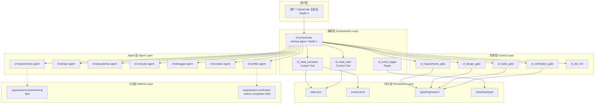
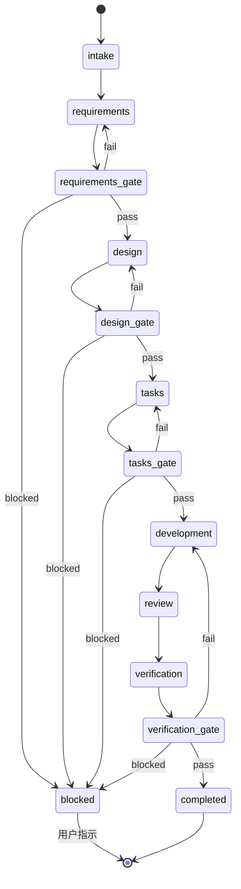

# 设计文档

## 概述

SpecForge V1 MVP 是运行在 OpenCode 上的规格驱动 AI 开发控制系统。本设计文档基于已确认的 18 项需求，定义系统的架构、组件、接口、数据模型和测试策略。

### 设计目标

1. **跑通完整闭环**：实现 Feature Spec（Requirements-First）工作流从 intake 到 verification 的完整链路
2. **程序硬控优先**：Gate、状态流转、文档 lint 用 Custom Tool 实现，权限用 OpenCode permission 控制，事件记录用 Plugin 实现
3. **主 Agent 纯净**：Orchestrator 只做项目管理和用户沟通，不执行技术任务
4. **子 Agent 隔离**：子 Agent 之间不可互相调用，调用深度最多 3 层
5. **全部事实落盘**：权威状态存 state.json，事件流存 events.jsonl，日志分类存储

### 设计决策与理由

| 决策 | 理由 |
|------|------|
| Gate 用 Custom Tool 而非 Skill | Custom Tool 是程序化的确定性检查，Skill 只是 prompt 指令，Agent 可以不遵守 |
| 状态流转用 Custom Tool | 需要原子性读写 state.json 并验证合法性，prompt 无法保证 |
| 事件记录用 Plugin | Plugin 可监听 tool.execute.after 等事件钩子，自动记录无需 Agent 主动调用 |
| 不做 Model Router | OpenCode 原生支持 per-agent 模型配置，无需额外路由层 |
| 不做 Provider Fallback | OpenCode 不支持动态切换 provider，V1 错误直接返回用户 |
| 子 Agent permission.task = deny | 从工具描述层面隐藏其他 Agent，比 prompt 约束强得多 |

---

## 架构

### 系统分层架构



### 工作流状态机

Feature Spec（Requirements-First）工作流的状态流转：



### 调用层级

```
Depth 0: 用户 / OpenCode 主会话
  └── Depth 1: sf-orchestrator (primary agent)
        ├── Depth 2: sf-requirements-agent (subagent)
        ├── Depth 2: sf-design-agent (subagent)
        ├── Depth 2: sf-task-planner-agent (subagent)
        ├── Depth 2: sf-executor-agent (subagent)
        ├── Depth 2: sf-debugger-agent (subagent)
        ├── Depth 2: sf-reviewer-agent (subagent)
        └── Depth 2: sf-verifier-agent (subagent)
```

子 Agent 之间不可互相调用（permission.task = deny），最大调用深度为 3 层。

---

## 组件与接口

### 组件总览

系统由以下 4 类组件构成：

| 类别 | 组件 | 文件路径 | 实现方式 |
|------|------|----------|----------|
| Agent | sf-orchestrator | `.opencode/agents/sf-orchestrator.md` | Agent 定义文件 |
| Agent | sf-requirements-agent | `.opencode/agents/sf-requirements.md` | Agent 定义文件 |
| Agent | sf-design-agent | `.opencode/agents/sf-design.md` | Agent 定义文件 |
| Agent | sf-task-planner-agent | `.opencode/agents/sf-task-planner.md` | Agent 定义文件 |
| Agent | sf-executor-agent | `.opencode/agents/sf-executor.md` | Agent 定义文件 |
| Agent | sf-debugger-agent | `.opencode/agents/sf-debugger.md` | Agent 定义文件 |
| Agent | sf-reviewer-agent | `.opencode/agents/sf-reviewer.md` | Agent 定义文件 |
| Agent | sf-verifier-agent | `.opencode/agents/sf-verifier.md` | Agent 定义文件 |
| Custom Tool | sf_state_read | `.opencode/tools/sf_state_read.ts` | TypeScript |
| Custom Tool | sf_state_transition | `.opencode/tools/sf_state_transition.ts` | TypeScript |
| Custom Tool | sf_doc_lint | `.opencode/tools/sf_doc_lint.ts` | TypeScript |
| Custom Tool | sf_requirements_gate | `.opencode/tools/sf_requirements_gate.ts` | TypeScript |
| Custom Tool | sf_design_gate | `.opencode/tools/sf_design_gate.ts` | TypeScript |
| Custom Tool | sf_tasks_gate | `.opencode/tools/sf_tasks_gate.ts` | TypeScript |
| Custom Tool | sf_verification_gate | `.opencode/tools/sf_verification_gate.ts` | TypeScript |
| Plugin | sf_event_logger | `.opencode/plugins/sf_event_logger.ts` | TypeScript |
| Skill | superpowers-brainstorming | `.opencode/skills/superpowers-brainstorming/SKILL.md` | Markdown |
| Skill | superpowers-verification-before-completion | `.opencode/skills/superpowers-verification-before-completion/SKILL.md` | Markdown |
| 配置 | opencode.json | `opencode.json` | JSON |
| 配置 | AGENTS.md | `AGENTS.md` | Markdown |
| 配置 | AGENT_CONSTITUTION.md | `specforge/agents/AGENT_CONSTITUTION.md` | Markdown |
| 契约 | 8 个 Agent 契约 | `specforge/agents/contracts/<name>.contract.md` | Markdown |


### 3.1 Agent 定义文件接口

每个 Agent 定义文件（`.opencode/agents/<agent-name>.md`）遵循统一结构：

```markdown
---
description: <Agent 职责简述>
mode: primary | subagent
model: <provider/model-id>
temperature: <0.0-1.0>
steps: <最大步数>
permission:
  edit: ask | deny
  bash: ask | deny
  task: deny | allow
  skill: ask
---

# Role
<角色定义>

# Responsibilities
<职责列表>

# Boundaries
<禁止行为，引用 AGENT_CONSTITUTION.md>

# Required Output
<必须输出的文件和格式>
```

**各 Agent 关键配置差异：**

| Agent | mode | permission.edit | permission.task | permission.bash | 加载 Skill |
|-------|------|----------------|-----------------|-----------------|-----------|
| sf-orchestrator | primary | ask | allow（仅调度子 Agent） | ask | 无 |
| sf-requirements | subagent | ask | deny | ask | superpowers-brainstorming |
| sf-design | subagent | ask | deny | ask | 无 |
| sf-task-planner | subagent | ask | deny | ask | 无 |
| sf-executor | subagent | ask | deny | ask | 无 |
| sf-debugger | subagent | ask | deny | ask | 无 |
| sf-reviewer | subagent | deny | deny | ask | 无 |
| sf-verifier | subagent | deny | deny | ask | superpowers-verification-before-completion |

### 3.2 Agent 契约文件接口

每个契约文件（`specforge/agents/contracts/<agent-name>.contract.md`）定义：

```markdown
# <Agent Name> 契约

## 输入格式
- work_item_id: string
- spec_directory: string
- 阶段特定输入...

## 输出格式
- 必须生成的文件列表
- 文件内容结构要求

## 禁止行为
- 不得...

## 升级条件
- 当...时，向 Orchestrator 报告
```

### 3.3 Custom Tool 接口

#### 3.3.1 sf_state_read

```typescript
import { tool } from "@opencode-ai/plugin"

export default tool({
  description: "读取指定 Work Item 的当前工作流状态",
  args: {
    work_item_id: tool.schema.string().describe("Work Item ID"),
  },
  async execute(args, context) {
    // 读取 specforge/runtime/state.json
    // 返回该 work_item 的当前状态
    return {
      work_item_id: args.work_item_id,
      current_state: "requirements",
      workflow_type: "feature_spec",
      created_at: "2025-01-01T00:00:00Z",
      updated_at: "2025-01-01T01:00:00Z"
    }
  }
})
```

#### 3.3.2 sf_state_transition

```typescript
import { tool } from "@opencode-ai/plugin"

export default tool({
  description: "执行 Work Item 的状态流转，验证合法性并更新权威状态",
  args: {
    work_item_id: tool.schema.string().describe("Work Item ID"),
    from_state: tool.schema.string().describe("当前状态（用于乐观锁验证）"),
    to_state: tool.schema.string().describe("目标状态"),
    evidence: tool.schema.string().optional().describe("流转依据，如 Gate 结果"),
  },
  async execute(args, context) {
    // 1. 读取 state.json，验证 from_state 与当前状态一致
    // 2. 验证 to_state 是 from_state 的合法后继
    // 3. 更新 state.json
    // 4. 追加 state.transitioned 事件到 events.jsonl
    return {
      success: true,
      work_item_id: args.work_item_id,
      previous_state: args.from_state,
      current_state: args.to_state,
      timestamp: new Date().toISOString()
    }
  }
})
```

#### 3.3.3 sf_doc_lint

```typescript
import { tool } from "@opencode-ai/plugin"

export default tool({
  description: "检查规格文档的结构合规性",
  args: {
    work_item_id: tool.schema.string().describe("Work Item ID"),
    doc_type: tool.schema.enum(["requirements", "design", "tasks"])
      .describe("文档类型"),
  },
  async execute(args, context) {
    // 根据 doc_type 检查对应文档的结构
    return {
      status: "pass" | "fail",
      issues: [
        { severity: "error", message: "缺少术语表章节", location: "requirements.md" }
      ]
    }
  }
})
```

#### 3.3.4 Gate 工具通用接口

4 个 Gate 工具共享统一的输出结构：

```typescript
// 通用 Gate 输出类型
interface GateResult {
  status: "pass" | "fail" | "blocked";
  blocking_issues: string[];
  warnings: string[];
  next_action: "continue" | "revise" | "ask_user";
}
```

**sf_requirements_gate：**

```typescript
import { tool } from "@opencode-ai/plugin"

export default tool({
  description: "检查 requirements.md 是否满足最低质量标准",
  args: {
    work_item_id: tool.schema.string().describe("Work Item ID"),
  },
  async execute(args, context) {
    // 检查项：
    // 1. requirements.md 是否存在
    // 2. 是否包含用户故事（"用户故事" 或 "User Story"）
    // 3. 是否包含验收标准（"验收标准" 或 "Acceptance Criteria"）
    // 4. 是否包含术语表（"术语表" 或 "Glossary"）
    return { status, blocking_issues, warnings, next_action }
  }
})
```

**sf_design_gate：**

```typescript
export default tool({
  description: "检查 design.md 是否满足最低质量标准",
  args: {
    work_item_id: tool.schema.string().describe("Work Item ID"),
  },
  async execute(args, context) {
    // 检查项：
    // 1. design.md 是否存在
    // 2. 是否引用了 requirements.md 中的需求编号
    return { status, blocking_issues, warnings, next_action }
  }
})
```

**sf_tasks_gate：**

```typescript
export default tool({
  description: "检查 tasks.md 是否满足最低质量标准",
  args: {
    work_item_id: tool.schema.string().describe("Work Item ID"),
  },
  async execute(args, context) {
    // 检查项：
    // 1. tasks.md 是否存在
    // 2. 每个 task 是否包含 verification_commands 字段
    return { status, blocking_issues, warnings, next_action }
  }
})
```

**sf_verification_gate：**

```typescript
export default tool({
  description: "检查验证阶段是否满足最低质量标准",
  args: {
    work_item_id: tool.schema.string().describe("Work Item ID"),
  },
  async execute(args, context) {
    // 检查项：
    // 1. 是否存在测试执行结果
    // 2. 测试是否全部通过
    return { status, blocking_issues, warnings, next_action }
  }
})
```

### 3.4 Plugin 接口

#### sf_event_logger

```typescript
import type { Plugin } from "@opencode-ai/plugin"

export const sf_event_logger: Plugin = async ({ directory }) => {
  return {
    // 监听工具调用完成事件
    "tool.execute.after": async (input, output) => {
      const logEntry = {
        timestamp: new Date().toISOString(),
        level: "INFO",
        component: "sf_event_logger",
        event: "tool.execute.after",
        message: `Tool ${input.tool} executed`,
        payload: {
          tool: input.tool,
          // 脱敏处理：过滤 API key、token、password
          args: redactSensitive(output.args),
          result_preview: truncate(output.result, 200)
        }
      }
      // 追加写入 specforge/logs/tool_calls.jsonl
      await appendJsonl(path.join(directory, "specforge/logs/tool_calls.jsonl"), logEntry)
    },

    // 监听会话空闲事件
    event: async ({ event }) => {
      if (event.type === "session.idle" || event.type === "session.status") {
        const logEntry = {
          timestamp: new Date().toISOString(),
          level: "INFO",
          component: "sf_event_logger",
          event: event.type,
          message: `Session event: ${event.type}`,
          payload: {}
        }
        await appendJsonl(path.join(directory, "specforge/logs/tool_calls.jsonl"), logEntry)
      }
    }
  }
}
```

### 3.5 Skill 接口

#### superpowers-brainstorming

```markdown
---
name: superpowers-brainstorming
description: 指导 Agent 在需求分析时从多维度进行头脑风暴
autoload: false
---

# Superpowers Brainstorming

## 指令

在开始撰写需求之前，你必须从以下维度逐一进行头脑风暴，
每个维度至少列出一个考虑点：

1. **业务需求**：核心业务价值、用户场景、业务流程
2. **技术约束**：平台限制、依赖关系、兼容性要求
3. **用户体验**：交互方式、反馈机制、错误提示
4. **安全合规**：权限控制、数据保护、审计要求
5. **运维部署**：部署方式、监控需求、故障恢复
6. **成本预算**：资源消耗、API 调用成本、存储成本
7. **扩展性**：未来扩展方向、接口预留、版本兼容

完成所有维度的头脑风暴后，再开始撰写结构化需求。
```

#### superpowers-verification-before-completion

```markdown
---
name: superpowers-verification-before-completion
description: 要求 Agent 在声明任务完成前提供验证证据
autoload: false
---

# Superpowers Verification Before Completion

## 指令

在将任何任务标记为 completed 之前，你必须提供以下验证证据：

1. **测试执行结果**：运行所有相关测试并展示输出
2. **构建成功证据**：确认项目可以成功构建
3. **验收标准逐项确认**：对照 tasks.md 中的验收标准逐项确认

如果无法提供上述任何一项证据，你不得将任务标记为 completed。
必须向 Orchestrator 报告缺失的验证项。
```

### 3.6 opencode.json 配置接口

```json
{
  "$schema": "https://opencode.ai/config.json",
  "agent": {
    "sf-orchestrator": {
      "mode": "primary",
      "model": "anthropic/claude-sonnet-4-20250514",
      "prompt": "{file:./.opencode/agents/sf-orchestrator.md}"
    },
    "sf-requirements": {
      "mode": "subagent",
      "model": "anthropic/claude-sonnet-4-20250514",
      "prompt": "{file:./.opencode/agents/sf-requirements.md}",
      "permission": { "task": "deny" }
    },
    "sf-design": {
      "mode": "subagent",
      "model": "anthropic/claude-sonnet-4-20250514",
      "prompt": "{file:./.opencode/agents/sf-design.md}",
      "permission": { "task": "deny" }
    },
    "sf-task-planner": {
      "mode": "subagent",
      "model": "anthropic/claude-sonnet-4-20250514",
      "prompt": "{file:./.opencode/agents/sf-task-planner.md}",
      "permission": { "task": "deny" }
    },
    "sf-executor": {
      "mode": "subagent",
      "model": "anthropic/claude-sonnet-4-20250514",
      "prompt": "{file:./.opencode/agents/sf-executor.md}",
      "permission": { "task": "deny" }
    },
    "sf-debugger": {
      "mode": "subagent",
      "model": "anthropic/claude-sonnet-4-20250514",
      "prompt": "{file:./.opencode/agents/sf-debugger.md}",
      "permission": { "task": "deny" }
    },
    "sf-reviewer": {
      "mode": "subagent",
      "model": "anthropic/claude-sonnet-4-20250514",
      "prompt": "{file:./.opencode/agents/sf-reviewer.md}",
      "permission": { "task": "deny", "edit": "deny" }
    },
    "sf-verifier": {
      "mode": "subagent",
      "model": "anthropic/claude-sonnet-4-20250514",
      "prompt": "{file:./.opencode/agents/sf-verifier.md}",
      "permission": { "task": "deny", "edit": "deny" }
    }
  }
}
```

---

## 数据模型

### 4.1 state.json（权威状态）

```json
{
  "work_items": {
    "<work_item_id>": {
      "work_item_id": "WI-001",
      "workflow_type": "feature_spec",
      "current_state": "requirements",
      "created_at": "2025-01-01T00:00:00Z",
      "updated_at": "2025-01-01T01:00:00Z"
    }
  }
}
```

**字段说明：**

| 字段 | 类型 | 说明 |
|------|------|------|
| work_item_id | string | 唯一标识，格式 `WI-<序号>` |
| workflow_type | enum | `feature_spec` \| `bugfix_spec` |
| current_state | enum | 当前工作流阶段（见状态枚举） |
| created_at | ISO 8601 | 创建时间 |
| updated_at | ISO 8601 | 最后更新时间 |

**状态枚举（feature_spec 工作流）：**

```
intake → requirements → requirements_gate → design → design_gate →
tasks → tasks_gate → development → review → verification →
verification_gate → completed | blocked
```

**合法状态流转表：**

| from_state | 合法 to_state |
|------------|--------------|
| intake | requirements |
| requirements | requirements_gate |
| requirements_gate | design, requirements, blocked |
| design | design_gate |
| design_gate | tasks, design, blocked |
| tasks | tasks_gate |
| tasks_gate | development, tasks, blocked |
| development | review |
| review | verification |
| verification | verification_gate |
| verification_gate | completed, development, blocked |
| blocked | （由用户指示决定目标状态） |

### 4.2 events.jsonl（事件流）

每行一个 JSON 对象：

```json
{
  "timestamp": "2025-01-01T00:00:00Z",
  "event_type": "state.transitioned",
  "work_item_id": "WI-001",
  "payload": {
    "from_state": "requirements",
    "to_state": "requirements_gate",
    "evidence": "requirements.md generated"
  }
}
```

**核心事件类型：**

| event_type | 触发时机 | payload 内容 |
|------------|----------|-------------|
| work_item.created | 新 Work Item 创建 | workflow_type |
| document.generated | 规格文档生成 | doc_type, file_path |
| gate.executed | Gate 检查完成 | gate_name, status, blocking_issues |
| state.transitioned | 状态流转成功 | from_state, to_state, evidence |

### 4.3 spec.json（Work Item 元数据）

每个 Work Item 在 `specforge/specs/<work_item_id>/` 下创建：

```json
{
  "work_item_id": "WI-001",
  "workflow_type": "feature_spec",
  "created_at": "2025-01-01T00:00:00Z"
}
```

### 4.4 日志格式

所有日志文件（app.log、error.log、gate.log）使用统一格式：

```json
{
  "timestamp": "2025-01-01T00:00:00Z",
  "level": "INFO",
  "work_item_id": "WI-001",
  "component": "sf_requirements_gate",
  "event": "gate.executed",
  "message": "Requirements gate passed",
  "payload": {}
}
```

**日志级别：** `DEBUG` | `INFO` | `WARN` | `ERROR`

**日志文件分工：**

| 文件 | 内容 | 写入时机 |
|------|------|----------|
| app.log | 工作流事件 | 阶段转换时 |
| error.log | 错误信息 | 系统发生错误时 |
| gate.log | Gate 检查结果 | Gate 工具执行完成后 |
| tool_calls.jsonl | 工具调用记录 | Plugin 自动记录 |

### 4.5 Gate 工具输入输出 Schema

**通用输入：**

```typescript
const GateInputSchema = z.object({
  work_item_id: z.string().describe("Work Item ID"),
})
```

**通用输出：**

```typescript
const GateOutputSchema = z.object({
  status: z.enum(["pass", "fail", "blocked"]),
  blocking_issues: z.array(z.string()),
  warnings: z.array(z.string()),
  next_action: z.enum(["continue", "revise", "ask_user"]),
})
```

### 4.6 sf_doc_lint 输入输出 Schema

**输入：**

```typescript
const DocLintInputSchema = z.object({
  work_item_id: z.string().describe("Work Item ID"),
  doc_type: z.enum(["requirements", "design", "tasks"]).describe("文档类型"),
})
```

**输出：**

```typescript
const DocLintOutputSchema = z.object({
  status: z.enum(["pass", "fail"]),
  issues: z.array(z.object({
    severity: z.enum(["error", "warning"]),
    message: z.string(),
    location: z.string(),
  })),
})
```

### 4.7 sf_state_transition 输入输出 Schema

**输入：**

```typescript
const StateTransitionInputSchema = z.object({
  work_item_id: z.string().describe("Work Item ID"),
  from_state: z.string().describe("当前状态（乐观锁验证）"),
  to_state: z.string().describe("目标状态"),
  evidence: z.string().optional().describe("流转依据"),
})
```

**输出（成功）：**

```typescript
{
  success: true,
  work_item_id: "WI-001",
  previous_state: "requirements",
  current_state: "requirements_gate",
  timestamp: "2025-01-01T00:00:00Z"
}
```

**输出（失败）：**

```typescript
{
  success: false,
  error: "Invalid transition: requirements → tasks is not allowed",
  work_item_id: "WI-001",
  current_state: "requirements"
}
```

### 4.8 目录结构

```
project-root/
├── AGENTS.md
├── opencode.json
├── .opencode/
│   ├── agents/
│   │   ├── sf-orchestrator.md
│   │   ├── sf-requirements.md
│   │   ├── sf-design.md
│   │   ├── sf-task-planner.md
│   │   ├── sf-executor.md
│   │   ├── sf-debugger.md
│   │   ├── sf-reviewer.md
│   │   └── sf-verifier.md
│   ├── tools/
│   │   ├── sf_state_read.ts
│   │   ├── sf_state_transition.ts
│   │   ├── sf_doc_lint.ts
│   │   ├── sf_requirements_gate.ts
│   │   ├── sf_design_gate.ts
│   │   ├── sf_tasks_gate.ts
│   │   └── sf_verification_gate.ts
│   ├── plugins/
│   │   └── sf_event_logger.ts
│   └── skills/
│       ├── superpowers-brainstorming/
│       │   └── SKILL.md
│       └── superpowers-verification-before-completion/
│           └── SKILL.md
└── specforge/
    ├── agents/
    │   ├── AGENT_CONSTITUTION.md
    │   └── contracts/
    │       ├── sf-orchestrator.contract.md
    │       ├── sf-requirements.contract.md
    │       ├── sf-design.contract.md
    │       ├── sf-task-planner.contract.md
    │       ├── sf-executor.contract.md
    │       ├── sf-debugger.contract.md
    │       ├── sf-reviewer.contract.md
    │       └── sf-verifier.contract.md
    ├── config/
    │   ├── project.json
    │   └── risk_policy.json
    ├── specs/
    │   └── <work_item_id>/
    │       ├── spec.json
    │       ├── intake.md
    │       ├── requirements.md
    │       ├── design.md
    │       └── tasks.md
    ├── runtime/
    │   ├── state.json
    │   ├── events.jsonl
    │   └── checkpoints/
    ├── sessions/
    ├── archive/
    │   └── agent_runs/
    └── logs/
        ├── app.log
        ├── error.log
        ├── gate.log
        └── tool_calls.jsonl
```


---

## 正确性属性

*正确性属性（Correctness Property）是一种在系统所有合法执行中都应成立的特征或行为——本质上是对系统应做什么的形式化陈述。属性是连接人类可读规格与机器可验证正确性保证的桥梁。*

### Property 1: 状态流转合法性验证

*对于任意* (from_state, to_state) 状态对，sf_state_transition 工具应当：
- 当 from_state 与 state.json 中的当前状态不一致时，返回失败
- 当 to_state 不是 from_state 的合法后继状态时，返回失败
- 当且仅当 from_state 匹配当前状态且 to_state 是合法后继时，返回成功

**验证: 需求 6.3, 9.3, 9.4, 9.5, 9.6**

### Property 2: 状态流转持久化往返

*对于任意* 合法的状态流转操作，执行 sf_state_transition 后：
- 读取 state.json 应返回更新后的 current_state
- events.jsonl 的最后一条记录应为 state.transitioned 事件，包含正确的 from_state 和 to_state

**验证: 需求 9.7, 12.4**

### Property 3: 工具输出结构不变量

*对于任意* Gate 工具（sf_requirements_gate、sf_design_gate、sf_tasks_gate、sf_verification_gate）的任意输入，输出必须包含 status（pass/fail/blocked）、blocking_issues（数组）、warnings（数组）、next_action（continue/revise/ask_user）四个字段。
*对于任意* sf_doc_lint 的任意输入，输出必须包含 status（pass/fail）和 issues（数组）两个字段。

**验证: 需求 8.3, 10.5**

### Property 4: 需求文档章节检测

*对于任意* 包含或缺少"简介"、"术语表"、"需求"章节的 requirements.md 文档，sf_requirements_gate 和 sf_doc_lint（doc_type=requirements）应当正确识别缺失的章节并在 blocking_issues/issues 中报告。

**验证: 需求 8.4, 10.2**

### Property 5: 设计文档验证

*对于任意* design.md 文档：
- sf_design_gate 应当检测文档是否引用了 requirements.md 中的需求编号，未引用时报告 fail
- sf_doc_lint（doc_type=design）应当检测文档是否包含任务拆分内容，包含时报告 fail

**验证: 需求 8.5, 10.3**

### Property 6: 任务文档验证

*对于任意* tasks.md 文档中的任意 task 条目，sf_tasks_gate 和 sf_doc_lint（doc_type=tasks）应当正确识别缺少 verification_commands 字段的 task 并报告。

**验证: 需求 8.6, 10.4**

### Property 7: 验证 Gate 测试结果评估

*对于任意* 测试结果状态（全部通过、部分失败、结果缺失），sf_verification_gate 应当：
- 全部通过时返回 pass
- 部分失败或结果缺失时返回 fail 或 blocked

**验证: 需求 8.7**

### Property 8: Zod Schema 输入验证

*对于任意* 不符合 Zod schema 定义的输入，所有 Custom Tool（sf_state_read、sf_state_transition、sf_doc_lint、4 个 Gate 工具）应当拒绝该输入并返回验证错误。
*对于任意* 符合 Zod schema 定义的输入，工具应当正常执行不抛出 schema 验证错误。

**验证: 需求 8.8, 9.8, 10.6**

### Property 9: 日志条目结构不变量

*对于任意* 日志写入操作，生成的日志条目必须包含 timestamp、level、component、event、message、payload 六个字段，且 timestamp 为合法 ISO 8601 格式。

**验证: 需求 11.4, 15.2**

### Property 10: 敏感信息脱敏

*对于任意* 包含敏感模式（API key、token、password 等关键词）的字符串，脱敏函数应当将敏感值替换为 "redacted" 占位符，且不改变非敏感内容。

**验证: 需求 11.5, 15.6**

### Property 11: Work Item 创建持久化

*对于任意* 合法的 Work Item 创建请求，创建后读取 state.json 应当包含该 Work Item 的条目，且条目包含 work_item_id、workflow_type、current_state、created_at 四个字段。

**验证: 需求 12.3**

---

## 错误处理

### 6.1 状态机错误

| 错误场景 | 处理方式 |
|----------|----------|
| from_state 与当前状态不一致 | sf_state_transition 返回 `{ success: false, error: "State mismatch: expected <current>, got <from_state>" }` |
| to_state 不是合法后继 | sf_state_transition 返回 `{ success: false, error: "Invalid transition: <from> → <to> is not allowed" }` |
| state.json 文件不存在 | sf_state_read/sf_state_transition 返回错误并建议初始化 |
| state.json 格式损坏 | 返回错误并记录到 error.log |
| work_item_id 不存在 | sf_state_read 返回 `{ error: "Work item not found: <id>" }` |

### 6.2 Gate 错误

| 错误场景 | 处理方式 |
|----------|----------|
| 规格文档不存在 | Gate 返回 `{ status: "fail", blocking_issues: ["<doc> not found"] }` |
| 规格文档格式无法解析 | Gate 返回 `{ status: "fail", blocking_issues: ["<doc> parse error"] }` |
| Spec 目录不存在 | Gate 返回 `{ status: "blocked", blocking_issues: ["Spec directory not found"] }` |

### 6.3 文档 Lint 错误

| 错误场景 | 处理方式 |
|----------|----------|
| 文档不存在 | sf_doc_lint 返回 `{ status: "fail", issues: [{ severity: "error", message: "File not found" }] }` |
| 不支持的 doc_type | Zod schema 验证拒绝，返回验证错误 |

### 6.4 Plugin 错误

| 错误场景 | 处理方式 |
|----------|----------|
| 日志文件写入失败 | sf_event_logger 静默失败，不阻断主流程（日志是辅助功能） |
| 日志目录不存在 | 自动创建目录后重试写入 |

### 6.5 Orchestrator 级错误

| 错误场景 | 处理方式 |
|----------|----------|
| 子 Agent 执行失败 | Orchestrator 最多重试 executor 2 次，然后调度 debugger 1 次 |
| debugger 也失败 | 标记 task 为 blocked，向用户报告 |
| review 发现问题 | 最多 1 次 review repair loop |
| 超过重试限制 | 停止自动重试，等待用户指示 |
| Provider 出错 | 直接返回错误信息给用户 |

### 6.6 敏感信息处理

所有日志和事件记录在写入前经过脱敏处理：

```typescript
function redactSensitive(obj: any): any {
  const sensitivePatterns = [
    /api[_-]?key/i,
    /token/i,
    /password/i,
    /secret/i,
    /credential/i,
  ]
  // 递归遍历对象，对匹配 key 的值替换为 "[REDACTED]"
  // 对字符串值中包含的敏感模式也进行替换
}
```

---

## 测试策略

### 7.1 测试方法概述

SpecForge V1 MVP 采用双轨测试策略：

1. **属性测试（Property-Based Testing）**：验证 Custom Tool 的核心逻辑在所有合法输入下的正确性
2. **单元测试（Example-Based Testing）**：验证具体场景、边界条件和配置正确性
3. **集成测试（Integration Testing）**：验证组件间协作和 OpenCode 平台集成

### 7.2 属性测试（Property-Based Testing）

**测试库选择：** [fast-check](https://github.com/dubzzz/fast-check)（TypeScript 生态最成熟的 PBT 库）

**配置要求：**
- 每个属性测试最少运行 100 次迭代
- 每个测试必须引用设计文档中的属性编号
- 标签格式：`Feature: specforge-v1-mvp, Property {number}: {property_text}`

**属性测试清单：**

| 属性 | 测试目标 | 生成器策略 |
|------|----------|-----------|
| Property 1 | sf_state_transition 合法性验证 | 生成随机 (from_state, to_state) 对，覆盖合法和非法组合 |
| Property 2 | sf_state_transition 持久化往返 | 生成随机合法流转，验证 state.json 和 events.jsonl |
| Property 3 | Gate/lint 输出结构 | 生成随机 work_item_id 和文档状态，验证输出字段 |
| Property 4 | 需求文档章节检测 | 生成随机 markdown，随机包含/缺少必需章节 |
| Property 5 | 设计文档验证 | 生成随机 design.md，随机包含/缺少需求引用和任务内容 |
| Property 6 | 任务文档验证 | 生成随机 tasks.md，随机包含/缺少 verification_commands |
| Property 7 | 验证 Gate 测试结果评估 | 生成随机测试结果状态组合 |
| Property 8 | Zod schema 验证 | 生成随机非法输入，验证 schema 拒绝 |
| Property 9 | 日志条目结构 | 生成随机日志数据，验证格式化输出 |
| Property 10 | 敏感信息脱敏 | 生成包含随机敏感模式的字符串，验证脱敏 |
| Property 11 | Work Item 创建持久化 | 生成随机 Work Item 数据，验证 state.json |

### 7.3 单元测试（Example-Based Testing）

**测试框架：** Vitest（与 TypeScript 生态兼容，支持 fast-check 集成）

**单元测试清单：**

| 测试目标 | 验证内容 | 对应需求 |
|----------|----------|----------|
| Agent 定义文件结构 | 8 个 agent.md 包含正确 frontmatter 和章节 | 2.2, 2.3, 2.4, 2.5 |
| Agent 契约文件结构 | 8 个 contract.md 包含必需章节 | 3.1, 3.2 |
| opencode.json 配置 | Agent 条目、权限、prompt 引用正确 | 4.1-4.4 |
| AGENT_CONSTITUTION 内容 | 包含 9 条底线规则 | 5.2 |
| Agent 引用 Constitution | 每个 agent.md 引用 AGENT_CONSTITUTION | 5.3 |
| spec.json 创建 | 包含必需字段 | 7.1 |
| Skill 文件内容 | brainstorming 包含 7 个维度 | 13.2 |
| Skill 文件内容 | verification 包含 3 类证据要求 | 14.2 |
| 事件类型支持 | 4 种核心事件类型可正常创建 | 12.5 |
| 权限配置 | 所有 sub-agent 的 task 权限为 deny | 16.1 |

### 7.4 集成测试

| 测试目标 | 验证内容 | 对应需求 |
|----------|----------|----------|
| 目录结构初始化 | 所有目录和文件正确创建 | 1.1-1.3 |
| Gate → 状态流转链路 | Gate pass 后状态正确流转 | 6.3, 6.4 |
| Plugin 事件记录 | tool.execute.after 事件正确写入 JSONL | 11.2, 11.3 |
| Gate 结果日志 | Gate 执行后结果写入 gate.log | 15.3 |
| 错误日志 | 错误信息写入 error.log | 15.4 |
| 阶段转换日志 | 状态流转事件写入 app.log | 15.5 |

### 7.5 测试目录结构

```
tests/
├── unit/
│   ├── tools/
│   │   ├── sf_state_read.test.ts
│   │   ├── sf_state_transition.test.ts
│   │   ├── sf_doc_lint.test.ts
│   │   ├── sf_requirements_gate.test.ts
│   │   ├── sf_design_gate.test.ts
│   │   ├── sf_tasks_gate.test.ts
│   │   └── sf_verification_gate.test.ts
│   ├── plugins/
│   │   └── sf_event_logger.test.ts
│   └── config/
│       ├── agent_files.test.ts
│       ├── contract_files.test.ts
│       └── opencode_config.test.ts
├── property/
│   ├── state_transition.property.test.ts
│   ├── gate_output.property.test.ts
│   ├── doc_lint.property.test.ts
│   ├── log_format.property.test.ts
│   ├── redaction.property.test.ts
│   └── work_item.property.test.ts
└── integration/
    ├── directory_init.test.ts
    ├── gate_flow.test.ts
    └── event_logging.test.ts
```

### 7.6 不适用 PBT 的部分

以下部分不适用属性测试，原因如下：

| 部分 | 原因 | 替代测试方式 |
|------|------|-------------|
| Agent 定义文件（.md） | 静态配置文件，不是函数 | 单元测试检查文件结构 |
| Skill 文件（.md） | Prompt 指令，不是可执行逻辑 | 单元测试检查内容 |
| Orchestrator 行为 | LLM prompt 驱动，非确定性 | 集成测试 |
| OpenCode 平台行为 | 第三方平台，不是我们的代码 | 不测试 |
| 子 Agent 调用控制 | 由 OpenCode permission 实现 | 配置检查 |
