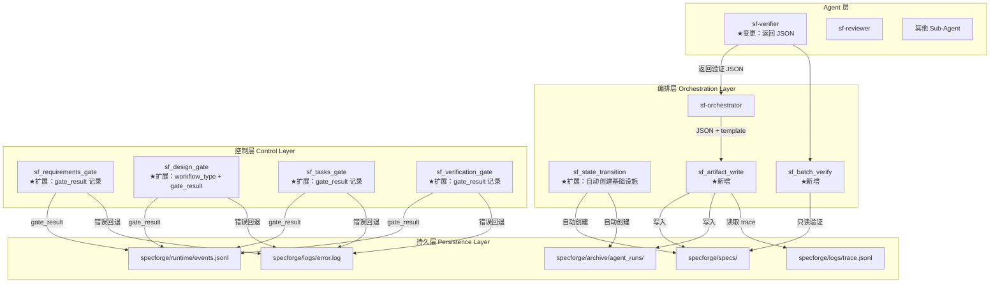
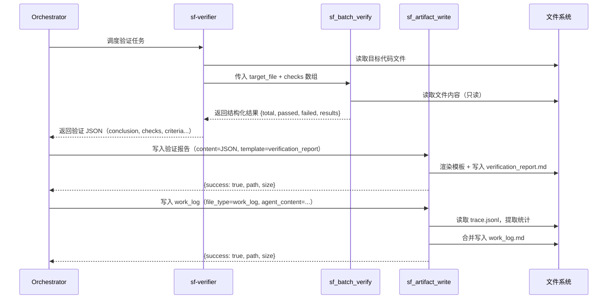
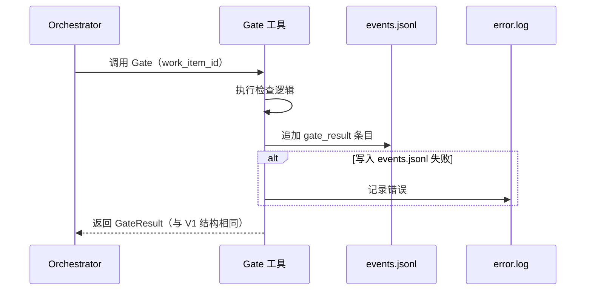

# 设计文档 — SpecForge V2.0（效率版）

## 概述

本文档是 SpecForge V2.0（效率版）的设计文档，基于已实现并经过 10 轮测试验证的 V1 系统。V1 已完成 4 种工作流、8 个 Agent、9 个 Custom Tool、3 个 Plugin、7 个 Skill 和 263 个单元测试。

V2.0 聚焦于解决 V1 测试中发现的 6 个系统性效率瓶颈，通过新增 2 个 Custom Tool（sf_artifact_write、sf_batch_verify）、扩展 4 个现有 Gate 工具、增强 sf_state_transition 的自动化能力，实现以下目标：

| 指标 | V1 实际 | V2 目标 |
|------|---------|---------|
| Quick Change 总耗时 | 8 分钟 | ≤ 4 分钟 |
| sf-verifier 工具调用 | 16 次 | ≤ 8 次 |
| 验证阶段耗时 | 5 分钟 | ≤ 90 秒 |
| 报告写入次数 | 2-5 次 bash | 1 次 sf_artifact_write |
| work_log 统计准确性 | 不可信（自报） | 100%（trace 提取） |

### 设计原则

1. **机制替代 Prompt**：用 Custom Tool 的确定性逻辑替代 Agent 的不确定性行为
2. **单次调用**：每个产物写入操作压缩为 1 次工具调用
3. **向后兼容**：所有变更不破坏 V1 的 263 个单元测试和 4 种工作流
4. **最小侵入**：优先扩展现有接口（新增可选参数），避免重写

### 设计决策与理由

| 决策 | 理由 |
|------|------|
| sf_artifact_write 用 Custom Tool 而非 Plugin | 需要被 Agent 主动调用并获取返回值，Plugin 只能被动监听事件 |
| sf_batch_verify 内部用 Node.js RegExp | 消除 Python 脚本生成和 PowerShell 转义问题，与项目技术栈一致 |
| 模板渲染集成在 sf_artifact_write 中 | 避免新增独立工具，保持工具数量可控；渲染逻辑与写入天然耦合 |
| Gate 结果在 execute 函数内记录 | 确保即使调用者丢弃结果，日志也已写入；避免依赖 Plugin 的 result_preview（已知为空） |
| work_log 统计从 trace.jsonl 提取 | trace.jsonl 由 sf_event_logger Plugin 自动记录，数据 100% 准确 |
| design_gate 用 workflow_type 参数分支 | 最小侵入方式，保持默认行为不变，仅在 Design-First 时切换检查标准 |
| sf_state_transition 自动创建基础设施 | 消除 Orchestrator 的 bash mkdir 调用，保持上下文干净 |

---

## 架构

### V2.0 增量变更架构图



### 数据流：验证阶段（V2 优化后）



### 数据流：Gate 结果记录



---

## 组件与接口

### 新增组件总览

| 类别 | 组件 | 文件路径 | 关联需求 |
|------|------|----------|----------|
| Custom Tool | sf_artifact_write | `.opencode/tools/sf_artifact_write.ts` | 需求 1、需求 3、需求 5 |
| Custom Tool 核心 | sf_artifact_write_core | `.opencode/tools/lib/sf_artifact_write_core.ts` | 需求 1、需求 3、需求 5 |
| Custom Tool | sf_batch_verify | `.opencode/tools/sf_batch_verify.ts` | 需求 2 |
| Custom Tool 核心 | sf_batch_verify_core | `.opencode/tools/lib/sf_batch_verify_core.ts` | 需求 2 |

### 变更组件总览

| 类别 | 组件 | 变更内容 | 关联需求 |
|------|------|----------|----------|
| Custom Tool | sf_design_gate | 新增 workflow_type 参数，Design-First 专用检查 | 需求 6 |
| Custom Tool 核心 | sf_design_gate_core | 新增 checkDesignGateDesignFirst 函数 | 需求 6 |
| Custom Tool | sf_requirements_gate | Gate 结果记录到 events.jsonl | 需求 4 |
| Custom Tool | sf_design_gate | Gate 结果记录到 events.jsonl | 需求 4 |
| Custom Tool | sf_tasks_gate | Gate 结果记录到 events.jsonl | 需求 4 |
| Custom Tool | sf_verification_gate | Gate 结果记录到 events.jsonl | 需求 4 |
| Custom Tool 核心 | sf_state_transition_core | 新 Work Item 时自动创建基础设施 | 需求 9 |


### 3.1 sf_artifact_write Custom Tool（新增）（需求 1、需求 3、需求 5）

**文件路径：** `.opencode/tools/sf_artifact_write.ts`（入口）+ `.opencode/tools/lib/sf_artifact_write_core.ts`（核心逻辑）

**职责：**
1. 为只读 Agent（sf-verifier、sf-reviewer）提供白名单路径内的文件写入能力
2. 支持模板渲染（将验证 JSON 渲染为 Markdown 报告）
3. 支持 work_log 自动生成（合并 Agent 内容 + trace 统计）

#### 类型定义

```typescript
// sf_artifact_write_core.ts

/** 支持的文件类型 */
export type ArtifactFileType =
  | "verification_report"
  | "work_log"
  | "review_report"
  | "intake"
  | "agent_run_result"

/** 支持的模板类型 */
export type TemplateType = "verification_report"

/** 写入请求参数 */
export interface ArtifactWriteInput {
  work_item_id: string
  file_type: ArtifactFileType
  content: string
  run_id?: string        // work_log 和 agent_run_result 时必填
  template?: TemplateType // 指定时将 content 作为 JSON 用模板渲染
  agent_content?: string  // work_log 时可选，提供 Agent 报告内容
}

/** 写入成功结果 */
export interface ArtifactWriteSuccess {
  success: true
  path: string
  size: number
}

/** 写入失败结果 */
export interface ArtifactWriteFailure {
  success: false
  error: string
}

export type ArtifactWriteResult = ArtifactWriteSuccess | ArtifactWriteFailure
```

#### 白名单路径映射

```typescript
/** 文件类型到路径模式的映射 */
const FILE_TYPE_PATH_MAP: Record<ArtifactFileType, (workItemId: string, runId?: string) => string> = {
  verification_report: (wid) => `specforge/specs/${wid}/verification_report.md`,
  review_report: (wid) => `specforge/specs/${wid}/review_report.md`,
  intake: (wid) => `specforge/specs/${wid}/intake.md`,
  work_log: (_wid, rid) => `specforge/archive/agent_runs/${rid}/work_log.md`,
  agent_run_result: (_wid, rid) => `specforge/archive/agent_runs/${rid}/result.json`,
}

/** 白名单路径前缀 */
const WHITELIST_PREFIXES = [
  "specforge/specs/",
  "specforge/archive/agent_runs/",
]

/**
 * 验证路径是否在白名单内
 */
export function isPathWhitelisted(resolvedPath: string): boolean {
  return WHITELIST_PREFIXES.some(prefix => resolvedPath.startsWith(prefix))
}

/**
 * 根据 file_type 解析目标文件路径
 */
export function resolveArtifactPath(
  fileType: ArtifactFileType,
  workItemId: string,
  runId?: string
): string {
  const resolver = FILE_TYPE_PATH_MAP[fileType]
  return resolver(workItemId, runId)
}
```

#### 核心写入逻辑

```typescript
import { writeFile, readFile, mkdir } from "node:fs/promises"
import { join, dirname } from "node:path"

/**
 * 执行产物文件写入
 */
export async function writeArtifact(
  input: ArtifactWriteInput,
  baseDir: string
): Promise<ArtifactWriteResult> {
  // 1. 参数验证
  if (!input.work_item_id || !input.content) {
    return { success: false, error: "missing required parameter" }
  }

  if ((input.file_type === "work_log" || input.file_type === "agent_run_result") && !input.run_id) {
    return { success: false, error: "run_id is required for work_log and agent_run_result" }
  }

  // 2. 解析目标路径
  const relativePath = resolveArtifactPath(input.file_type, input.work_item_id, input.run_id)

  // 3. 白名单检查
  if (!isPathWhitelisted(relativePath)) {
    return { success: false, error: "path not in whitelist" }
  }

  const absolutePath = join(baseDir, relativePath)

  // 4. 确定写入内容
  let finalContent: string

  if (input.template === "verification_report") {
    // 模板渲染模式：将 JSON content 渲染为 Markdown
    finalContent = renderVerificationReport(input.content)
  } else if (input.file_type === "work_log" && input.agent_content) {
    // work_log 自动生成模式：合并 Agent 内容 + trace 统计
    finalContent = await generateWorkLog(input.agent_content, input.run_id!, baseDir)
  } else {
    finalContent = input.content
  }

  // 5. 递归创建父目录
  await mkdir(dirname(absolutePath), { recursive: true })

  // 6. 写入文件
  await writeFile(absolutePath, finalContent, "utf-8")

  // 7. 返回成功结果
  const size = Buffer.byteLength(finalContent, "utf-8")
  return { success: true, path: relativePath, size }
}
```

#### 验证报告模板渲染（需求 3）

```typescript
/** 验证 JSON 结构 */
export interface VerificationJSON {
  conclusion: "pass" | "fail" | "blocked"
  verification_commands: Array<{
    command: string
    status: "pass" | "fail"
    output_summary: string
  }>
  acceptance_criteria: Array<{
    req_id: string
    name: string
    status: "pass" | "fail"
    evidence: string
  }>
  e2e_tests: Array<{
    name: string
    status: "pass" | "fail"
    evidence: string
  }>
  side_effects: string
  summary: string
}

/**
 * 将验证 JSON 渲染为 Markdown 报告
 */
export function renderVerificationReport(jsonContent: string): string {
  const data: VerificationJSON = JSON.parse(jsonContent)

  // 统计汇总
  const allChecks = [
    ...data.verification_commands.map(c => c.status),
    ...data.acceptance_criteria.map(c => c.status),
    ...data.e2e_tests.map(c => c.status),
  ]
  const totalChecks = allChecks.length
  const passedChecks = allChecks.filter(s => s === "pass").length
  const failedChecks = totalChecks - passedChecks

  const lines: string[] = []

  lines.push("# 验证报告")
  lines.push("")
  lines.push("## 结果汇总")
  lines.push("")
  lines.push("| 指标 | 数值 |")
  lines.push("|------|------|")
  lines.push(`| 总检查数 | ${totalChecks} |`)
  lines.push(`| 通过 | ${passedChecks} |`)
  lines.push(`| 失败 | ${failedChecks} |`)
  lines.push(`| 结论 | ${data.conclusion} |`)
  lines.push("")

  // 章节 1: 验证命令
  lines.push("## 验证命令")
  lines.push("")
  if (data.verification_commands.length > 0) {
    lines.push("| 命令 | 状态 | 输出摘要 |")
    lines.push("|------|------|----------|")
    for (const cmd of data.verification_commands) {
      const icon = cmd.status === "pass" ? "✅" : "❌"
      lines.push(`| \`${cmd.command}\` | ${icon} ${cmd.status} | ${cmd.output_summary} |`)
    }
  } else {
    lines.push("无验证命令。")
  }
  lines.push("")

  // 章节 2: 验收标准
  lines.push("## 验收标准")
  lines.push("")
  if (data.acceptance_criteria.length > 0) {
    lines.push("| 需求 | 名称 | 状态 | 证据 |")
    lines.push("|------|------|------|------|")
    for (const ac of data.acceptance_criteria) {
      const icon = ac.status === "pass" ? "✅" : "❌"
      lines.push(`| ${ac.req_id} | ${ac.name} | ${icon} ${ac.status} | ${ac.evidence} |`)
    }
  } else {
    lines.push("无验收标准检查。")
  }
  lines.push("")

  // 章节 3: 端到端测试
  lines.push("## 端到端测试")
  lines.push("")
  if (data.e2e_tests.length > 0) {
    lines.push("| 测试名称 | 状态 | 证据 |")
    lines.push("|----------|------|------|")
    for (const e2e of data.e2e_tests) {
      const icon = e2e.status === "pass" ? "✅" : "❌"
      lines.push(`| ${e2e.name} | ${icon} ${e2e.status} | ${e2e.evidence} |`)
    }
  } else {
    lines.push("无端到端测试。")
  }
  lines.push("")

  // 章节 4: 副作用
  lines.push("## 副作用")
  lines.push("")
  lines.push(data.side_effects || "无副作用。")
  lines.push("")

  // 章节 5: 结论
  lines.push("## 结论")
  lines.push("")
  lines.push(`**结论：${data.conclusion}**`)
  lines.push("")
  lines.push(data.summary || "")

  return lines.join("\n")
}
```

#### work_log 自动生成（需求 5）

```typescript
/** Trace 条目中的工具调用分类 */
const TOOL_CATEGORIES: Record<string, string> = {
  read: "read",
  "file.read": "read",
  write: "write",
  "file.write": "write",
  "file.edit": "write",
  bash: "bash",
  grep: "grep",
}

/** 判断是否为 SpecForge 工具 */
function isSfTool(toolName: string): boolean {
  return toolName.startsWith("sf_")
}

/** 对工具名进行分类 */
function categorizeToolCall(toolName: string): string {
  if (isSfTool(toolName)) return "sf_tool"
  for (const [pattern, category] of Object.entries(TOOL_CATEGORIES)) {
    if (toolName.includes(pattern)) return category
  }
  return "other"
}

export interface TraceStats {
  total_tool_calls: number
  by_category: Record<string, number>
  files_changed: string[]
  duration_estimate: string
}

/**
 * 从 trace.jsonl 提取指定 run_id 的执行统计
 */
export async function extractTraceStats(
  runId: string,
  baseDir: string
): Promise<TraceStats | null> {
  const tracePath = join(baseDir, "specforge", "logs", "trace.jsonl")

  let traceContent: string
  try {
    traceContent = await readFile(tracePath, "utf-8")
  } catch {
    return null
  }

  const lines = traceContent.trim().split("\n").filter(Boolean)
  const entries = lines.map(line => {
    try { return JSON.parse(line) } catch { return null }
  }).filter(Boolean)

  // 过滤匹配 run_id 的条目（通过 payload 中的 tool 字段和时间范围匹配）
  const toolCallEntries = entries.filter(e =>
    e.event === "tool.execute.after" &&
    e.payload?.tool
  )

  // 统计
  const byCategory: Record<string, number> = {}
  const filesChanged: Set<string> = new Set()

  for (const entry of toolCallEntries) {
    const toolName = entry.payload.tool as string
    const category = categorizeToolCall(toolName)
    byCategory[category] = (byCategory[category] || 0) + 1

    // 提取修改的文件
    const args = entry.payload.args as any
    if (args?.path || args?.file) {
      filesChanged.add(args.path || args.file)
    }
  }

  return {
    total_tool_calls: toolCallEntries.length,
    by_category: byCategory,
    files_changed: Array.from(filesChanged),
    duration_estimate: "从 trace 时间戳计算",
  }
}

/**
 * 生成合并的 work_log.md
 */
export async function generateWorkLog(
  agentContent: string,
  runId: string,
  baseDir: string
): Promise<string> {
  const lines: string[] = []

  lines.push("# 工作日志")
  lines.push("")
  lines.push(`> Run ID: ${runId}`)
  lines.push(`> 生成时间: ${new Date().toISOString()}`)
  lines.push("")

  // 第一部分：Agent 报告
  lines.push("## Agent 报告")
  lines.push("")
  lines.push(agentContent)
  lines.push("")

  // 第二部分：执行统计（从 trace 自动提取）
  lines.push("## 执行统计")
  lines.push("")

  const stats = await extractTraceStats(runId, baseDir)

  if (stats === null) {
    lines.push("> ⚠️ trace 数据不可用")
    lines.push("")
  } else {
    lines.push(`- **总工具调用次数**: ${stats.total_tool_calls}`)
    lines.push("")
    lines.push("### 按类别统计")
    lines.push("")
    lines.push("| 类别 | 次数 |")
    lines.push("|------|------|")
    for (const [category, count] of Object.entries(stats.by_category)) {
      lines.push(`| ${category} | ${count} |`)
    }
    lines.push("")

    if (stats.files_changed.length > 0) {
      lines.push("### 涉及文件")
      lines.push("")
      for (const file of stats.files_changed) {
        lines.push(`- ${file}`)
      }
      lines.push("")
    }
  }

  return lines.join("\n")
}
```

#### Tool 入口

```typescript
// sf_artifact_write.ts
import { tool } from "@opencode-ai/plugin"
import { writeArtifact } from "./lib/sf_artifact_write_core"

export default tool({
  description: "将产物文件写入白名单路径（供只读 Agent 使用）",
  args: {
    work_item_id: tool.schema.string().describe("Work Item ID"),
    file_type: tool.schema
      .enum(["verification_report", "work_log", "review_report", "intake", "agent_run_result"])
      .describe("文件类型"),
    content: tool.schema.string().describe("文件内容"),
    run_id: tool.schema.string().optional()
      .describe("Run ID（work_log 和 agent_run_result 时必填）"),
    template: tool.schema.enum(["verification_report"]).optional()
      .describe("模板类型，指定时将 content 作为 JSON 用模板渲染"),
    agent_content: tool.schema.string().optional()
      .describe("Agent 报告内容（work_log 时可选，用于自动合并 trace 统计）"),
  },
  async execute(args, context) {
    const baseDir = context.directory || context.worktree || process.cwd()
    const result = await writeArtifact(
      {
        work_item_id: args.work_item_id,
        file_type: args.file_type as any,
        content: args.content,
        run_id: args.run_id,
        template: args.template as any,
        agent_content: args.agent_content,
      },
      baseDir
    )
    return JSON.stringify(result, null, 2)
  },
})
```

### 3.2 sf_batch_verify Custom Tool（新增）（需求 2）

**文件路径：** `.opencode/tools/sf_batch_verify.ts`（入口）+ `.opencode/tools/lib/sf_batch_verify_core.ts`（核心逻辑）

**职责：** 接受目标文件和检查模式数组，在内部执行 Node.js RegExp 匹配，返回结构化结果。

#### 类型定义

```typescript
// sf_batch_verify_core.ts

/** 单个检查模式 */
export interface CheckPattern {
  name: string          // 人类可读的检查描述
  pattern: string       // 正则模式字符串
  should_exist: boolean // 模式是否应被找到
  count?: number        // 可选：预期最小匹配次数
}

/** 单个检查结果 */
export interface CheckResult {
  name: string
  status: "pass" | "fail"
  found: boolean
  match_count: number
  error?: string        // 无效正则时的错误信息
}

/** 批量验证结果 */
export interface BatchVerifyResult {
  success: boolean
  total: number
  passed: number
  failed: number
  results: CheckResult[]
  error?: string        // 文件级错误
}
```

#### 核心验证逻辑

```typescript
import { readFile } from "node:fs/promises"
import { join } from "node:path"

/**
 * 执行批量验证
 */
export async function batchVerify(
  targetFile: string,
  checks: CheckPattern[],
  baseDir: string
): Promise<BatchVerifyResult> {
  // 1. 空检查数组
  if (checks.length === 0) {
    return { success: true, total: 0, passed: 0, failed: 0, results: [] }
  }

  // 2. 读取目标文件
  const absolutePath = join(baseDir, targetFile)
  let fileContent: string
  try {
    fileContent = await readFile(absolutePath, "utf-8")
  } catch {
    return {
      success: false,
      error: "target file not found",
      total: 0,
      passed: 0,
      failed: 0,
      results: [],
    }
  }

  // 3. 逐个执行检查
  const results: CheckResult[] = []

  for (const check of checks) {
    let regex: RegExp
    try {
      regex = new RegExp(check.pattern, "g")
    } catch (err) {
      // 无效正则：标记为 fail，继续处理
      results.push({
        name: check.name,
        status: "fail",
        found: false,
        match_count: 0,
        error: `Invalid regex: ${(err as Error).message}`,
      })
      continue
    }

    const matches = fileContent.match(regex)
    const matchCount = matches ? matches.length : 0
    const found = matchCount > 0

    // 判断 pass/fail
    let status: "pass" | "fail"

    if (check.count !== undefined) {
      // count 模式：实际匹配次数 >= 指定次数
      status = matchCount >= check.count ? "pass" : "fail"
    } else if (check.should_exist) {
      status = found ? "pass" : "fail"
    } else {
      status = found ? "fail" : "pass"
    }

    results.push({ name: check.name, status, found, match_count: matchCount })
  }

  const passed = results.filter(r => r.status === "pass").length
  const failed = results.filter(r => r.status === "fail").length

  return {
    success: true,
    total: results.length,
    passed,
    failed,
    results,
  }
}
```

#### Tool 入口

```typescript
// sf_batch_verify.ts
import { tool } from "@opencode-ai/plugin"
import { batchVerify } from "./lib/sf_batch_verify_core"

export default tool({
  description: "对目标文件执行批量正则验证，返回结构化结果",
  args: {
    target_file: tool.schema.string().describe("要验证的文件路径"),
    checks: tool.schema.array(
      tool.schema.object({
        name: tool.schema.string().describe("检查描述"),
        pattern: tool.schema.string().describe("正则模式"),
        should_exist: tool.schema.boolean().describe("模式是否应被找到"),
        count: tool.schema.number().optional().describe("预期最小匹配次数"),
      })
    ).describe("检查模式数组"),
  },
  async execute(args, context) {
    const baseDir = context.directory || context.worktree || process.cwd()
    const result = await batchVerify(args.target_file, args.checks, baseDir)
    return JSON.stringify(result, null, 2)
  },
})
```


### 3.3 Gate 结果结构化记录（需求 4）

**变更范围：** 4 个 Gate 工具（sf_requirements_gate、sf_design_gate、sf_tasks_gate、sf_verification_gate）

**变更方式：** 在每个 Gate 的 `execute` 函数内，调用核心检查逻辑后、返回结果前，追加 gate_result 条目到 events.jsonl。

#### 共享的 Gate 结果记录函数

```typescript
// 新增到 .opencode/tools/lib/utils.ts

import { appendJsonl } from "./utils"
import { join } from "node:path"
import { appendFile, mkdir } from "node:fs/promises"
import { dirname } from "node:path"

export interface GateResultEntry {
  type: "gate_result"
  timestamp: string
  work_item_id: string
  gate: string
  status: "pass" | "fail" | "blocked"
  blocking_issues: string[]
  warnings: string[]
}

/**
 * 记录 Gate 结果到 events.jsonl
 * 如果写入失败，记录错误到 error.log 但不阻塞工作流
 */
export async function recordGateResult(
  workItemId: string,
  gateName: string,
  result: { status: string; blocking_issues: string[]; warnings: string[] },
  baseDir: string
): Promise<void> {
  const eventsPath = join(baseDir, "specforge", "runtime", "events.jsonl")
  const errorLogPath = join(baseDir, "specforge", "logs", "error.log")

  const entry: GateResultEntry = {
    type: "gate_result",
    timestamp: new Date().toISOString(),
    work_item_id: workItemId,
    gate: gateName,
    status: result.status as "pass" | "fail" | "blocked",
    blocking_issues: result.blocking_issues,
    warnings: result.warnings,
  }

  try {
    await appendJsonl(eventsPath, entry)
  } catch (err) {
    // 写入 events.jsonl 失败时，记录到 error.log
    try {
      const errorEntry = {
        timestamp: new Date().toISOString(),
        level: "ERROR",
        component: gateName,
        event: "gate_result_write_failed",
        message: `Failed to write gate result: ${(err as Error).message}`,
        payload: { work_item_id: workItemId, gate_status: result.status },
      }
      await mkdir(dirname(errorLogPath), { recursive: true })
      await appendFile(errorLogPath, JSON.stringify(errorEntry) + "\n", "utf-8")
    } catch {
      // 完全静默
    }
  }
}
```

#### Gate 工具 execute 函数变更模式

以 sf_design_gate 为例，其他 3 个 Gate 工具采用相同模式：

```typescript
// sf_design_gate.ts 变更后
import { tool } from "@opencode-ai/plugin"
import { checkDesignGate } from "./lib/sf_design_gate_core"
import { recordGateResult } from "./lib/utils"

export default tool({
  description: "检查 design.md 是否满足最低质量标准",
  args: {
    work_item_id: tool.schema.string().describe("Work Item ID"),
    workflow_type: tool.schema.string().optional()
      .describe('工作流类型，默认 "feature_spec"'),
  },
  async execute(args, context) {
    const baseDir = context.directory || context.worktree || process.cwd()
    const result = await checkDesignGate(
      args.work_item_id,
      baseDir,
      args.workflow_type  // 新增参数透传
    )

    // 记录 Gate 结果到 events.jsonl（在返回前）
    await recordGateResult(args.work_item_id, "sf_design_gate", result, baseDir)

    return JSON.stringify(result, null, 2)
  },
})
```

### 3.4 sf_design_gate Design-First 专用检查（需求 6）

**变更文件：** `.opencode/tools/lib/sf_design_gate_core.ts`

#### 接口变更

```typescript
/**
 * 执行 design gate 检查（扩展版）
 *
 * @param workItemId - Work Item ID
 * @param baseDir - 项目根目录路径
 * @param workflowType - 工作流类型，默认 "feature_spec"
 * @returns Gate 检查结果
 */
export async function checkDesignGate(
  workItemId: string,
  baseDir: string,
  workflowType: string = "feature_spec"
): Promise<GateResult> {
  const specDir = join(baseDir, "specforge", "specs", workItemId)
  const docPath = join(specDir, "design.md")

  // 1. 读取 design.md（不变）
  let content: string
  try {
    content = await readFile(docPath, "utf-8")
  } catch (err: unknown) {
    const error = err as NodeJS.ErrnoException
    if (error.code === "ENOENT") {
      return {
        status: "fail",
        blocking_issues: ["design.md not found"],
        warnings: [],
        next_action: "revise",
      }
    }
    return {
      status: "blocked",
      blocking_issues: [`Failed to read design.md: ${error.message}`],
      warnings: [],
      next_action: "ask_user",
    }
  }

  // 2. 根据 workflow_type 选择检查标准
  if (workflowType === "feature_spec_design_first") {
    return checkDesignGateDesignFirst(content)
  }

  // 3. 默认行为（feature_spec / bugfix_spec）：检查需求引用（V1 行为不变）
  const blockingIssues: string[] = []
  const warnings: string[] = []

  if (!hasRequirementReferences(content)) {
    blockingIssues.push(
      '设计文档未引用需求编号（需要包含"需求 X"、"REQ-XXX"或"Requirement X"格式的引用）'
    )
  }

  if (blockingIssues.length > 0) {
    return { status: "fail", blocking_issues: blockingIssues, warnings, next_action: "revise" }
  }

  return { status: "pass", blocking_issues: [], warnings, next_action: "continue" }
}
```

#### Design-First 专用检查函数

```typescript
/**
 * Design-First 工作流的 design gate 检查
 * 不检查需求引用，改为检查架构完整性
 */
export function checkDesignGateDesignFirst(content: string): GateResult {
  const blockingIssues: string[] = []
  const warnings: string[] = []

  // 检查 1: 架构概述章节
  if (!hasArchitectureSection(content)) {
    blockingIssues.push("design.md 缺少架构概述章节（需要包含"架构"、"Architecture"或"概述"标题）")
  }

  // 检查 2: 模块或组件边界
  if (!hasModuleBoundaries(content)) {
    blockingIssues.push("design.md 未定义模块或组件边界（需要包含"模块"、"组件"、"Module"或"Component"）")
  }

  // 检查 3: 数据模型或接口定义
  if (!hasDataModelOrInterface(content)) {
    blockingIssues.push("design.md 缺少数据模型或接口定义（需要包含"数据模型"、"接口"、"Data Model"或"Interface"）")
  }

  if (blockingIssues.length > 0) {
    return { status: "fail", blocking_issues: blockingIssues, warnings, next_action: "revise" }
  }

  return { status: "pass", blocking_issues: [], warnings, next_action: "continue" }
}

// === 辅助函数 ===

export function hasArchitectureSection(content: string): boolean {
  const patterns = [/#+\s*架构/i, /#+\s*architecture/i, /#+\s*概述/i, /#+\s*overview/i]
  return patterns.some(p => p.test(content))
}

export function hasModuleBoundaries(content: string): boolean {
  const patterns = [/模块/i, /组件/i, /module/i, /component/i, /边界/i, /boundary/i]
  return patterns.some(p => p.test(content))
}

export function hasDataModelOrInterface(content: string): boolean {
  const patterns = [/数据模型/i, /接口/i, /data\s*model/i, /interface/i, /类型定义/i, /type\s*defin/i]
  return patterns.some(p => p.test(content))
}
```

### 3.5 sf_state_transition 自动创建基础设施（需求 9）

**变更文件：** `.opencode/tools/lib/sf_state_transition_core.ts`

**变更位置：** `handleNewWorkItem` 函数

```typescript
async function handleNewWorkItem(
  input: TransitionInput,
  state: StateFile,
  stateFilePath: string,
  eventsFilePath: string,
  timestamp: string,
  baseDir: string  // 新增参数
): Promise<TransitionResult> {
  // ... 现有验证逻辑不变 ...

  // === 新增：自动创建基础设施 ===
  const specDir = join(baseDir, "specforge", "specs", input.work_item_id)
  const archiveDir = join(baseDir, "specforge", "archive", "agent_runs")
  const createdPaths: string[] = []

  // 创建 spec 目录
  await mkdir(specDir, { recursive: true })
  createdPaths.push(`specforge/specs/${input.work_item_id}/`)

  // 创建 spec.json
  const specJsonPath = join(specDir, "spec.json")
  const specJson = {
    work_item_id: input.work_item_id,
    workflow_type: workflowType,
    created_at: timestamp,
  }
  await writeFile(specJsonPath, JSON.stringify(specJson, null, 2), "utf-8")
  createdPaths.push(`specforge/specs/${input.work_item_id}/spec.json`)

  // 创建 archive/agent_runs/ 目录（如不存在）
  await mkdir(archiveDir, { recursive: true })
  createdPaths.push("specforge/archive/agent_runs/")

  // === 现有逻辑：更新 state.json 和 events.jsonl ===
  // ... 不变 ...

  // 返回结果中包含创建的路径
  return {
    success: true,
    work_item_id: input.work_item_id,
    previous_state: "",
    current_state: "intake",
    timestamp,
    created_paths: createdPaths,  // 新增字段
  }
}
```

**TransitionSuccess 类型扩展：**

```typescript
export interface TransitionSuccess {
  success: true
  work_item_id: string
  previous_state: string
  current_state: string
  timestamp: string
  created_paths?: string[]  // 新增可选字段，仅创建新 Work Item 时返回
}
```

---

## 数据模型

### 新增数据结构

#### Gate 结果条目（events.jsonl）

```json
{
  "type": "gate_result",
  "timestamp": "2025-01-15T10:30:00.000Z",
  "work_item_id": "WI-001",
  "gate": "sf_design_gate",
  "status": "fail",
  "blocking_issues": ["设计文档未引用需求编号"],
  "warnings": []
}
```

#### 验证 JSON（sf-verifier 返回给 Orchestrator）

```json
{
  "conclusion": "pass",
  "verification_commands": [
    { "command": "vitest run", "status": "pass", "output_summary": "263 tests passed" }
  ],
  "acceptance_criteria": [
    { "req_id": "需求 1", "name": "sf_artifact_write 工具", "status": "pass", "evidence": "工具文件存在且测试通过" }
  ],
  "e2e_tests": [
    { "name": "完整 Quick Change 工作流", "status": "pass", "evidence": "从 intake 到 completed 在 4 分钟内完成" }
  ],
  "side_effects": "无副作用，所有 263 个现有测试继续通过",
  "summary": "所有验证检查通过"
}
```

#### spec.json（sf_state_transition 自动创建）

```json
{
  "work_item_id": "WI-003",
  "workflow_type": "feature_spec",
  "created_at": "2025-01-15T10:00:00.000Z"
}
```

### 变更数据结构

#### TransitionSuccess 扩展

V1 结构保持不变，新增可选字段 `created_paths`：

```typescript
// V1（不变）
{ success: true, work_item_id: string, previous_state: string, current_state: string, timestamp: string }

// V2（扩展）
{ success: true, work_item_id: string, previous_state: string, current_state: string, timestamp: string, created_paths?: string[] }
```

`created_paths` 仅在创建新 Work Item（from_state=""）时返回，现有消费者不受影响。

#### GateResult 结构（不变）

```typescript
export interface GateResult {
  status: "pass" | "fail" | "blocked"
  blocking_issues: string[]
  warnings: string[]
  next_action: "continue" | "revise" | "ask_user"
}
```

所有 Gate 工具继续返回相同的 GateResult 结构，保持向后兼容（需求 7）。


---

## 正确性属性

*正确性属性是在系统所有有效执行中都应成立的特征或行为——本质上是关于系统应该做什么的形式化陈述。属性是人类可读规格与机器可验证正确性保证之间的桥梁。*

### 属性 1：产物写入往返一致性

*对于任意*有效的 work_item_id、file_type 和 content 组合，通过 sf_artifact_write 写入后读取文件，应产生与输入 content 完全相同的内容。

**验证：需求 1.9**

### 属性 2：白名单路径强制执行

*对于任意*文件路径，如果该路径不以 `specforge/specs/` 或 `specforge/archive/agent_runs/` 开头，sf_artifact_write 应拒绝写入并返回 `{ success: false, error: "path not in whitelist" }`。

**验证：需求 1.5、需求 1.8**

### 属性 3：文件类型路径解析正确性

*对于任意*有效的 (work_item_id, file_type, run_id) 组合，resolveArtifactPath 函数应返回匹配对应 file_type 模式的路径，且成功写入后返回的结果应包含 `success: true`、正确的 `path` 和非负的 `size`。

**验证：需求 1.3、需求 1.6**

### 属性 4：批量验证正则匹配正确性

*对于任意*文件内容和检查模式数组，sf_batch_verify 的每个检查结果应与直接使用 Node.js RegExp 执行匹配的结果一致：当 `should_exist: true` 且模式未匹配时状态为 "fail"，当 `should_exist: false` 且模式匹配时状态为 "fail"，其他情况为 "pass"。

**验证：需求 2.5、需求 2.6、需求 2.7**

### 属性 5：批量验证幂等性

*对于任意*未更改的目标文件和相同的检查模式数组，连续两次执行 sf_batch_verify 应产生完全相同的结果。

**验证：需求 2.11**

### 属性 6：批量验证只读性

*对于任意*目标文件，执行 sf_batch_verify 前后文件内容应完全相同，验证操作不修改目标文件。

**验证：需求 7.5**

### 属性 7：验证报告模板渲染结构一致性

*对于任意*有效的验证 JSON 输入，通过模板渲染为 Markdown 后，提取章节标题应始终包含以下 5 个必需章节：验证命令、验收标准、端到端测试、副作用、结论。

**验证：需求 3.3、需求 3.4、需求 3.5、需求 3.6**

### 属性 8：Gate 结果记录一致性

*对于任意* Gate 工具执行，events.jsonl 中追加的 gate_result 条目应满足：当 status 为 "fail" 时 blocking_issues 数组非空，当 status 为 "pass" 时 blocking_issues 数组为空；且条目结构包含 type、timestamp、work_item_id、gate、status、blocking_issues、warnings 字段。

**验证：需求 4.1、需求 4.2、需求 4.3、需求 4.4**

### 属性 9：work_log 合并完整性

*对于任意* agent_content 和包含匹配 run_id 条目的 trace.jsonl，生成的 work_log.md 应同时包含 "Agent 报告" 和 "执行统计" 两个章节，且执行统计中的工具调用总数应与 trace 中匹配条目的实际数量一致。

**验证：需求 5.2、需求 5.3、需求 8.5**

### 属性 10：design_gate 工作流类型分派正确性

*对于任意* design.md 内容和 workflow_type 参数，sf_design_gate 应满足：当 workflow_type 为 "feature_spec" 或 "bugfix_spec" 时检查需求引用（V1 行为），当 workflow_type 为 "feature_spec_design_first" 时跳过需求引用检查并改为检查架构、模块边界和数据模型；且无论 workflow_type 如何，返回值始终符合 GateResult 结构。

**验证：需求 6.2、需求 6.3、需求 6.4、需求 6.6**

### 属性 11：状态流转自动创建基础设施

*对于任意* work_item_id，当 sf_state_transition 以 from_state="" 创建新 Work Item 时，应自动创建 `specforge/specs/<work_item_id>/` 目录、`specforge/specs/<work_item_id>/spec.json` 文件（包含 work_item_id、workflow_type、created_at 字段）和 `specforge/archive/agent_runs/` 目录，且返回值应包含创建的路径列表。

**验证：需求 9.1、需求 9.2、需求 9.3、需求 9.4**

---

## 错误处理

### 错误处理策略总览

| 组件 | 错误场景 | 处理方式 | 关联需求 |
|------|----------|----------|----------|
| sf_artifact_write | content 或 work_item_id 为空 | 返回 `{ success: false, error: "missing required parameter" }` | 需求 1.7 |
| sf_artifact_write | 路径不在白名单 | 返回 `{ success: false, error: "path not in whitelist" }` | 需求 1.5 |
| sf_artifact_write | work_log/agent_run_result 缺少 run_id | 返回 `{ success: false, error: "run_id is required..." }` | 需求 1.2 |
| sf_artifact_write | 模板渲染时 JSON 解析失败 | 返回 `{ success: false, error: "invalid JSON content" }` | 需求 3.3 |
| sf_artifact_write | trace.jsonl 不存在或无匹配条目 | 写入 work_log 并标记 "trace 数据不可用" | 需求 5.4 |
| sf_artifact_write | 文件系统写入失败 | 返回 `{ success: false, error: "write failed: <message>" }` | 需求 1 |
| sf_batch_verify | target_file 不存在 | 返回 `{ success: false, error: "target file not found", ... }` | 需求 2.4 |
| sf_batch_verify | 无效正则模式 | 该检查标记为 fail 并附带错误信息，继续处理剩余检查 | 需求 2.10 |
| sf_batch_verify | checks 数组为空 | 返回 `{ success: true, total: 0, passed: 0, failed: 0, results: [] }` | 需求 2.9 |
| Gate 工具 | events.jsonl 写入失败 | 记录错误到 error.log，继续返回 Gate 结果 | 需求 4.6 |
| sf_state_transition | 目录已存在 | mkdir recursive 静默成功，不报错 | 需求 9.5 |

### 错误传播原则

1. **工具级错误不阻塞工作流**：sf_artifact_write 和 sf_batch_verify 的错误通过返回值传递，不抛出异常
2. **日志写入失败静默处理**：Gate 结果记录失败不影响 Gate 本身的返回值
3. **向后兼容优先**：所有错误返回格式与 V1 一致，新增字段为可选

---

## 测试策略

### 测试框架与工具

- **单元测试框架**：Vitest（项目已有配置）
- **属性测试库**：fast-check（项目已安装 `fast-check@^4.7.0`）
- **测试目录**：`tests/unit/tools/`（新增工具测试）、`tests/unit/tools/lib/`（核心逻辑测试）

### 双重测试方法

#### 单元测试（示例驱动）

针对具体场景和边界条件：

| 测试文件 | 覆盖组件 | 关键测试场景 |
|----------|----------|-------------|
| `tests/unit/tools/sf_artifact_write.test.ts` | sf_artifact_write_core | 各 file_type 写入、白名单拒绝、空参数、模板渲染、work_log 生成 |
| `tests/unit/tools/sf_batch_verify.test.ts` | sf_batch_verify_core | 正则匹配、should_exist 逻辑、count 模式、无效正则、空数组、文件不存在 |
| `tests/unit/tools/sf_design_gate.test.ts` | sf_design_gate_core（扩展） | Design-First 检查、默认行为不变、workflow_type 参数 |
| `tests/unit/tools/sf_state_transition.test.ts` | sf_state_transition_core（扩展） | 自动创建目录、spec.json 生成、目录已存在 |
| `tests/unit/tools/lib/gate_result_recording.test.ts` | recordGateResult | 正常记录、写入失败回退、条目格式 |

#### 属性测试（property-based testing）

使用 fast-check 库，每个属性测试最少运行 100 次迭代。

| 属性编号 | 测试文件 | 属性描述 | 标签 |
|----------|----------|----------|------|
| 属性 1 | `sf_artifact_write.test.ts` | 写入往返一致性 | Feature: specforge-v2-efficiency, Property 1: artifact write round-trip |
| 属性 2 | `sf_artifact_write.test.ts` | 白名单路径强制执行 | Feature: specforge-v2-efficiency, Property 2: whitelist enforcement |
| 属性 3 | `sf_artifact_write.test.ts` | 文件类型路径解析 | Feature: specforge-v2-efficiency, Property 3: file type path resolution |
| 属性 4 | `sf_batch_verify.test.ts` | 正则匹配正确性 | Feature: specforge-v2-efficiency, Property 4: regex matching correctness |
| 属性 5 | `sf_batch_verify.test.ts` | 批量验证幂等性 | Feature: specforge-v2-efficiency, Property 5: batch verify idempotence |
| 属性 6 | `sf_batch_verify.test.ts` | 批量验证只读性 | Feature: specforge-v2-efficiency, Property 6: batch verify read-only |
| 属性 7 | `sf_artifact_write.test.ts` | 模板渲染结构一致性 | Feature: specforge-v2-efficiency, Property 7: template rendering structure |
| 属性 8 | `gate_result_recording.test.ts` | Gate 结果记录一致性 | Feature: specforge-v2-efficiency, Property 8: gate result logging consistency |
| 属性 9 | `sf_artifact_write.test.ts` | work_log 合并完整性 | Feature: specforge-v2-efficiency, Property 9: work log merge completeness |
| 属性 10 | `sf_design_gate.test.ts` | design_gate 工作流分派 | Feature: specforge-v2-efficiency, Property 10: design gate workflow dispatch |
| 属性 11 | `sf_state_transition.test.ts` | 状态流转自动创建 | Feature: specforge-v2-efficiency, Property 11: state transition auto-creation |

### 回归测试

- 所有 263 个现有单元测试必须继续通过（需求 7.1）
- 运行命令：`vitest run`
- 新增测试不得修改现有测试文件

### 属性测试配置

```typescript
// 属性测试示例模式
import { describe, it, expect } from "vitest"
import * as fc from "fast-check"

describe("Property Tests", () => {
  it("Property 1: artifact write round-trip", () => {
    // Feature: specforge-v2-efficiency, Property 1: artifact write round-trip
    fc.assert(
      fc.asyncProperty(
        fc.string({ minLength: 1 }),  // work_item_id
        fc.constantFrom("verification_report", "review_report", "intake"),  // file_type
        fc.string({ minLength: 1 }),  // content
        async (workItemId, fileType, content) => {
          // 写入
          const result = await writeArtifact({ work_item_id: workItemId, file_type: fileType, content }, baseDir)
          if (result.success) {
            // 读取并验证往返一致性
            const readContent = await readFile(join(baseDir, result.path), "utf-8")
            expect(readContent).toBe(content)
          }
        }
      ),
      { numRuns: 100 }
    )
  })
})
```
