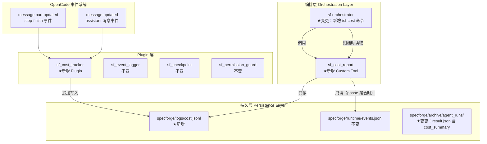
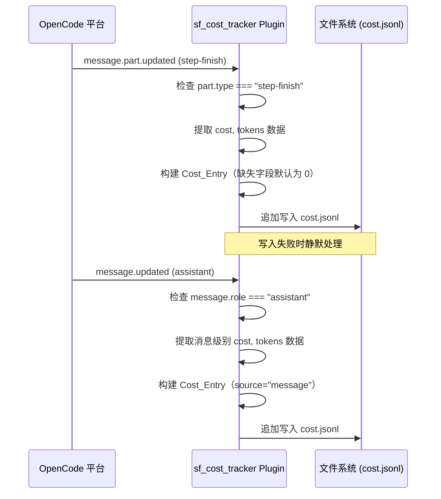
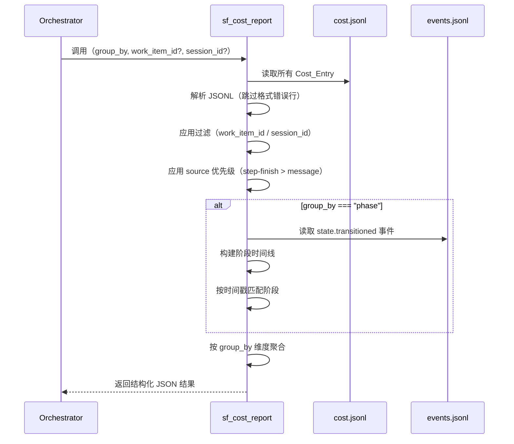
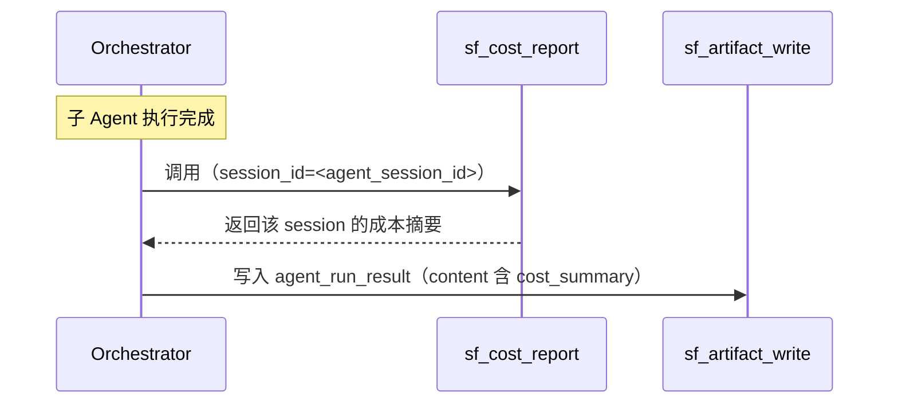

# 设计文档 — SpecForge V3.0（成本追踪版）

## 概述

本文档是 SpecForge V3.0（成本追踪版）的设计文档，基于已实现并经过 12 轮测试验证的 V2.0 系统。V2.0 已完成效率优化（sf-verifier 工具调用从 16 降至 4-5，bash 调用从 12 降至 0），系统拥有 11 个 Custom Tool、3 个 Plugin、337 个单元测试。

V3.0 聚焦于为系统增加 Token 消耗和成本追踪能力，通过新增 1 个 Plugin（sf_cost_tracker）和 1 个 Custom Tool（sf_cost_report），实现成本数据的自动采集、持久化存储、多维度聚合分析和用户可见的成本报告。

### 设计目标

1. **真实数据采集**：利用 OpenCode 平台原生提供的 cost/tokens 数据，捕获真实的 Token 使用量和成本，而非估算值
2. **多维度分析**：支持按 Work Item、Agent、工作流阶段、模型四个维度聚合成本数据
3. **零侵入集成**：新增组件不修改任何现有文件，337 个单元测试全部继续通过
4. **优雅降级**：当 Plugin 未启用或日志文件不存在时，所有依赖成本数据的功能返回空结果而非报错

### 设计决策与理由

| 决策 | 理由 |
|------|------|
| 成本采集用 Plugin 而非 Custom Tool | Plugin 可被动监听 `message.updated` 和 `message.part.updated` 事件，无需 Agent 主动调用；与 sf_event_logger 模式一致 |
| sf_cost_tracker 自包含（不引用外部模块） | OpenCode Plugin 加载器要求自包含；与 sf_event_logger、sf_checkpoint 保持一致 |
| 成本报告用 Custom Tool（sf_cost_report） | 需要被 Orchestrator 主动调用并获取结构化返回值；Plugin 只能被动监听事件 |
| 核心逻辑提取到 `lib/sf_cost_report_core.ts` | 与现有 Tool 模式一致（入口文件 + core 模块），便于单元测试 |
| 阶段聚合通过 events.jsonl 时间线推断 | events.jsonl 已有 `state.transitioned` 事件记录，无需在 Cost_Entry 中冗余存储阶段信息 |
| 默认使用 step-finish 级别数据聚合 | step-finish 粒度更细，避免与 message 级别数据重复计算；无 step-finish 时回退到 message 级别 |
| 成本数据写入独立的 cost.jsonl | 与 events.jsonl、trace.jsonl 分离，避免污染现有日志；便于独立管理和清理 |
| /sf-cost 命令集成到 Orchestrator 调试命令 | 与现有 /sf-status 命令模式一致，用户体验统一 |

---

## 架构

### V3.0 增量变更架构图



### 数据流：成本数据采集



### 数据流：成本报告聚合



### 数据流：Agent Run Archive 成本集成



---

## 组件与接口

### 新增组件总览

| 类别 | 组件 | 文件路径 | 关联需求 |
|------|------|----------|----------|
| Plugin | sf_cost_tracker | `.opencode/plugins/sf_cost_tracker.ts` | 需求 1、需求 5、需求 7 |
| Custom Tool | sf_cost_report | `.opencode/tools/sf_cost_report.ts` | 需求 2、需求 4、需求 5 |
| Custom Tool 核心 | sf_cost_report_core | `.opencode/tools/lib/sf_cost_report_core.ts` | 需求 2、需求 4、需求 5、需求 7 |

### 变更组件总览

| 类别 | 组件 | 变更内容 | 关联需求 |
|------|------|----------|----------|
| Agent | sf-orchestrator | 新增 /sf-cost 调试命令 | 需求 3 |
| Agent | sf-orchestrator | Agent Run Archive 时调用 sf_cost_report 获取 cost_summary | 需求 4 |


### 3.1 sf_cost_tracker Plugin（新增）（需求 1、需求 5、需求 7）

**文件路径：** `.opencode/plugins/sf_cost_tracker.ts`

**职责：**
1. 监听 OpenCode 的 `message.part.updated` 和 `message.updated` 事件
2. 从 StepFinishPart 和 Assistant 消息中提取真实的 cost/tokens 数据
3. 将 Cost_Entry 追加写入 `specforge/logs/cost.jsonl`
4. 静默处理所有写入错误，不阻断 OpenCode 消息处理流程

**自包含约束：** 与 sf_event_logger、sf_checkpoint 一致，不引用外部模块，仅使用 `node:fs/promises` 和 `node:path`。

#### 类型定义

```typescript
// sf_cost_tracker.ts 内部类型（自包含，不导出到外部）

/** 成本记录条目 */
export interface CostEntry {
  timestamp: string          // ISO8601 格式
  source: "step-finish" | "message"  // 数据来源
  session_id: string         // 会话 ID
  agent: string              // Agent 名称
  model: string              // 模型名称
  work_item_id: string       // 关联的 Work Item ID
  tokens: {
    input: number
    output: number
    reasoning: number
    cache_read: number
    cache_write: number
  }
  cost: number               // 美元
}
```

#### 事件处理逻辑

```typescript
import type { Plugin } from "@opencode-ai/plugin"
import { mkdir, appendFile } from "node:fs/promises"
import { join, dirname } from "node:path"

// ============================================================
// 内联工具函数（自包含，不依赖外部模块）
// ============================================================

async function appendJsonlSafe(filePath: string, entry: object): Promise<void> {
  try {
    await mkdir(dirname(filePath), { recursive: true })
    await appendFile(filePath, JSON.stringify(entry) + "\n", "utf-8")
  } catch {
    /* 静默失败 */
  }
}

/** 安全提取数字值，null/undefined/NaN 返回 0 */
function safeNumber(value: unknown): number {
  if (value === null || value === undefined) return 0
  const num = Number(value)
  return Number.isFinite(num) ? num : 0
}

/** 安全提取字符串值 */
function safeString(value: unknown, fallback: string = ""): string {
  if (value === null || value === undefined) return fallback
  return String(value)
}

// ============================================================
// Cost_Entry 构建
// ============================================================

/**
 * 从事件数据中提取 tokens 对象
 */
export function extractTokens(tokensData: any): CostEntry["tokens"] {
  if (!tokensData || typeof tokensData !== "object") {
    return { input: 0, output: 0, reasoning: 0, cache_read: 0, cache_write: 0 }
  }
  return {
    input: safeNumber(tokensData.input),
    output: safeNumber(tokensData.output),
    reasoning: safeNumber(tokensData.reasoning),
    cache_read: safeNumber(tokensData.cache?.read),
    cache_write: safeNumber(tokensData.cache?.write),
  }
}

/**
 * 构建 Cost_Entry
 */
export function buildCostEntry(
  source: "step-finish" | "message",
  cost: unknown,
  tokensData: unknown,
  sessionId: string,
  agent: string,
  model: string,
  workItemId: string
): CostEntry {
  return {
    timestamp: new Date().toISOString(),
    source,
    session_id: sessionId,
    agent,
    model,
    work_item_id: workItemId,
    tokens: extractTokens(tokensData),
    cost: safeNumber(cost),
  }
}

/**
 * 判断事件数据是否包含成本信息
 */
export function hasCostData(data: any): boolean {
  if (!data || typeof data !== "object") return false
  const hasCost = data.cost !== undefined && data.cost !== null
  const hasTokens = data.tokens !== undefined && data.tokens !== null
  return hasCost || hasTokens
}

// ============================================================
// Plugin Export
// ============================================================

export const sf_cost_tracker: Plugin = async ({ directory }) => {
  const costFilePath = join(directory, "specforge/logs/cost.jsonl")

  // 初始化时确保目录存在
  try {
    await mkdir(dirname(costFilePath), { recursive: true })
  } catch {
    /* 静默失败 */
  }

  return {
    event: async ({ event }) => {
      try {
        const eventData = event as any

        // 处理 message.part.updated 事件（step-finish）
        if (eventData.type === "message.part.updated") {
          const part = eventData.properties?.part
          if (!part || part.type !== "step-finish") return
          if (!hasCostData(part)) return

          const message = eventData.properties?.message
          const entry = buildCostEntry(
            "step-finish",
            part.cost,
            part.tokens,
            safeString(eventData.properties?.sessionID, "unknown"),
            safeString(message?.metadata?.agent, "unknown"),
            safeString(message?.metadata?.model, "unknown"),
            "unknown"  // work_item_id 无法从事件中直接获取
          )
          await appendJsonlSafe(costFilePath, entry)
          return
        }

        // 处理 message.updated 事件（assistant 消息）
        if (eventData.type === "message.updated") {
          const message = eventData.properties?.message
          if (!message || message.role !== "assistant") return
          if (!hasCostData(message)) return

          const entry = buildCostEntry(
            "message",
            message.cost,
            message.tokens,
            safeString(eventData.properties?.sessionID, "unknown"),
            safeString(message.metadata?.agent, "unknown"),
            safeString(message.metadata?.model, "unknown"),
            "unknown"
          )
          await appendJsonlSafe(costFilePath, entry)
          return
        }
      } catch {
        /* 静默失败：不阻断 OpenCode 消息处理流程 */
      }
    },
  }
}
```

**关键设计说明：**

1. **事件数据访问路径**：OpenCode 的 Event 对象通过 `event.properties` 携带消息/Part 数据。具体路径需在运行时验证，代码中使用安全访问模式（`?.` 链式调用 + `safeNumber`/`safeString`）。

2. **work_item_id 获取**：Plugin 的 event 钩子无法直接获取当前 Work Item ID（这是 SpecForge 的业务概念，不是 OpenCode 原生概念）。因此 work_item_id 默认记录为 `"unknown"`，由 sf_cost_report 在聚合时通过 session_id 或时间戳与 events.jsonl 关联。

3. **source 字段区分**：`"step-finish"` 表示单步执行级别数据（粒度更细），`"message"` 表示消息级别聚合数据。sf_cost_report 聚合时默认优先使用 step-finish 数据。

### 3.2 sf_cost_report Custom Tool（新增）（需求 2、需求 4、需求 5）

**文件路径：** `.opencode/tools/sf_cost_report.ts`（入口）+ `.opencode/tools/lib/sf_cost_report_core.ts`（核心逻辑）

**职责：**
1. 读取 `specforge/logs/cost.jsonl`，解析所有 Cost_Entry 记录
2. 支持按 work_item、agent、phase、model 四个维度聚合
3. 支持按 work_item_id 和 session_id 过滤
4. 阶段聚合时读取 events.jsonl 构建阶段时间线
5. 默认使用 step-finish 级别数据，无 step-finish 时回退到 message 级别

#### 类型定义

```typescript
// sf_cost_report_core.ts

/** 聚合维度 */
export type GroupBy = "work_item" | "agent" | "phase" | "model"

/** 报告请求参数 */
export interface CostReportInput {
  work_item_id?: string
  session_id?: string
  group_by?: GroupBy
}

/** Token 汇总 */
export interface TokenSummary {
  input: number
  output: number
  reasoning: number
  cache_read: number
  cache_write: number
}

/** 分组条目 */
export interface CostGroup {
  key: string
  cost: number
  tokens: TokenSummary
  entry_count: number
}

/** 报告结果 */
export interface CostReportResult {
  success: true
  summary: {
    total_cost: number
    total_tokens: TokenSummary
  }
  groups: CostGroup[]
}

/** Cost_Entry（与 Plugin 中定义一致） */
export interface CostEntry {
  timestamp: string
  source: "step-finish" | "message"
  session_id: string
  agent: string
  model: string
  work_item_id: string
  tokens: {
    input: number
    output: number
    reasoning: number
    cache_read: number
    cache_write: number
  }
  cost: number
}

/** 状态流转事件（从 events.jsonl 读取） */
export interface StateTransitionEvent {
  timestamp: string
  event_type: string
  work_item_id: string
  payload: {
    from_state: string
    to_state: string
    evidence?: string
  }
}
```

#### 核心聚合逻辑

```typescript
import { readFile } from "node:fs/promises"
import { join } from "node:path"

// ============================================================
// JSONL 解析
// ============================================================

/**
 * 解析 JSONL 文件，跳过格式错误的行
 */
export function parseJsonl<T>(content: string): T[] {
  if (!content || !content.trim()) return []
  return content
    .trim()
    .split("\n")
    .filter(Boolean)
    .map(line => {
      try { return JSON.parse(line) as T }
      catch { return null }
    })
    .filter((item): item is T => item !== null)
}

/**
 * 读取并解析 JSONL 文件，文件不存在时返回空数组
 */
export async function readJsonlFile<T>(filePath: string): Promise<T[]> {
  try {
    const content = await readFile(filePath, "utf-8")
    return parseJsonl<T>(content)
  } catch {
    return []
  }
}

// ============================================================
// Source 优先级过滤
// ============================================================

/**
 * 应用 source 优先级策略：
 * - 默认使用 step-finish 级别记录
 * - 当无 step-finish 记录时，回退到 message 级别
 *
 * 策略：如果存在任何 step-finish 记录，则过滤掉所有 message 记录
 */
export function applySourcePriority(entries: CostEntry[]): CostEntry[] {
  const hasStepFinish = entries.some(e => e.source === "step-finish")
  if (hasStepFinish) {
    return entries.filter(e => e.source === "step-finish")
  }
  return entries
}

// ============================================================
// 阶段时间线构建
// ============================================================

/** 阶段时间区间 */
export interface PhaseInterval {
  work_item_id: string
  phase: string
  start: string  // ISO8601
  end: string    // ISO8601，最后一个阶段用 "9999-12-31T23:59:59.999Z"
}

/**
 * 从 events.jsonl 的状态流转记录构建阶段时间线
 */
export function buildPhaseTimeline(events: StateTransitionEvent[]): PhaseInterval[] {
  // 按 work_item_id 分组
  const byWorkItem = new Map<string, StateTransitionEvent[]>()
  for (const evt of events) {
    if (evt.event_type !== "state.transitioned") continue
    const list = byWorkItem.get(evt.work_item_id) || []
    list.push(evt)
    byWorkItem.set(evt.work_item_id, list)
  }

  const intervals: PhaseInterval[] = []
  const FAR_FUTURE = "9999-12-31T23:59:59.999Z"

  for (const [workItemId, transitions] of byWorkItem) {
    // 按时间排序
    transitions.sort((a, b) => a.timestamp.localeCompare(b.timestamp))

    for (let i = 0; i < transitions.length; i++) {
      const t = transitions[i]
      const nextTimestamp = i + 1 < transitions.length
        ? transitions[i + 1].timestamp
        : FAR_FUTURE

      intervals.push({
        work_item_id: workItemId,
        phase: t.payload.to_state,
        start: t.timestamp,
        end: nextTimestamp,
      })
    }
  }

  return intervals
}

/**
 * 根据 Cost_Entry 的时间戳和 work_item_id 匹配阶段
 * - 找到该 work_item 的阶段时间线中包含该时间戳的区间
 * - 时间戳早于首次流转时归入 "intake"
 * - work_item_id 为 "unknown" 时归入 "unattributed"
 */
export function matchPhase(
  entry: CostEntry,
  timeline: PhaseInterval[]
): string {
  if (entry.work_item_id === "unknown") {
    return "unattributed"
  }

  // 过滤该 work_item 的时间线
  const wiTimeline = timeline.filter(i => i.work_item_id === entry.work_item_id)

  if (wiTimeline.length === 0) {
    return "unattributed"
  }

  // 检查是否早于首次流转
  const firstTransition = wiTimeline[0]
  if (entry.timestamp < firstTransition.start) {
    return "intake"
  }

  // 找到包含该时间戳的区间（从后往前找最近的）
  for (let i = wiTimeline.length - 1; i >= 0; i--) {
    if (entry.timestamp >= wiTimeline[i].start) {
      return wiTimeline[i].phase
    }
  }

  return "intake"
}

// ============================================================
// 聚合逻辑
// ============================================================

/** 创建空的 TokenSummary */
function emptyTokens(): TokenSummary {
  return { input: 0, output: 0, reasoning: 0, cache_read: 0, cache_write: 0 }
}

/** 累加 tokens */
function addTokens(target: TokenSummary, source: CostEntry["tokens"]): void {
  target.input += source.input || 0
  target.output += source.output || 0
  target.reasoning += source.reasoning || 0
  target.cache_read += source.cache_read || 0
  target.cache_write += source.cache_write || 0
}

/**
 * 获取分组 key
 */
function getGroupKey(
  entry: CostEntry,
  groupBy: GroupBy,
  timeline: PhaseInterval[]
): string {
  switch (groupBy) {
    case "work_item":
      return entry.work_item_id || "unknown"
    case "agent":
      return entry.agent || "unknown"
    case "model":
      return entry.model || "unknown"
    case "phase":
      return matchPhase(entry, timeline)
  }
}

/**
 * 执行成本报告聚合
 */
export async function generateCostReport(
  input: CostReportInput,
  baseDir: string
): Promise<CostReportResult> {
  const costFilePath = join(baseDir, "specforge", "logs", "cost.jsonl")
  const eventsFilePath = join(baseDir, "specforge", "runtime", "events.jsonl")

  // 1. 读取 Cost_Entry 记录
  let entries = await readJsonlFile<CostEntry>(costFilePath)

  // 2. 应用过滤
  if (input.work_item_id) {
    entries = entries.filter(e => e.work_item_id === input.work_item_id)
  }
  if (input.session_id) {
    entries = entries.filter(e => e.session_id === input.session_id)
  }

  // 3. 应用 source 优先级
  entries = applySourcePriority(entries)

  // 4. 空结果快速返回
  if (entries.length === 0) {
    return {
      success: true,
      summary: { total_cost: 0, total_tokens: emptyTokens() },
      groups: [],
    }
  }

  // 5. 构建阶段时间线（仅 phase 聚合时需要）
  const groupBy = input.group_by || "work_item"
  let timeline: PhaseInterval[] = []
  if (groupBy === "phase") {
    const events = await readJsonlFile<StateTransitionEvent>(eventsFilePath)
    timeline = buildPhaseTimeline(events)
  }

  // 6. 聚合
  const groupMap = new Map<string, CostGroup>()
  const totalTokens = emptyTokens()
  let totalCost = 0

  for (const entry of entries) {
    const key = getGroupKey(entry, groupBy, timeline)

    // 更新总计
    totalCost += entry.cost || 0
    addTokens(totalTokens, entry.tokens)

    // 更新分组
    let group = groupMap.get(key)
    if (!group) {
      group = { key, cost: 0, tokens: emptyTokens(), entry_count: 0 }
      groupMap.set(key, group)
    }
    group.cost += entry.cost || 0
    addTokens(group.tokens, entry.tokens)
    group.entry_count += 1
  }

  // 7. 按成本降序排列
  const groups = Array.from(groupMap.values())
    .sort((a, b) => b.cost - a.cost)

  return {
    success: true,
    summary: { total_cost: totalCost, total_tokens: totalTokens },
    groups,
  }
}
```

#### Tool 入口

```typescript
// sf_cost_report.ts
import { tool } from "@opencode-ai/plugin"
import { generateCostReport } from "./lib/sf_cost_report_core"

export default tool({
  description: "读取成本日志并按多维度聚合分析，返回成本报告",
  args: {
    work_item_id: tool.schema.string().optional()
      .describe("按 Work Item ID 过滤"),
    session_id: tool.schema.string().optional()
      .describe("按 Session ID 过滤（用于提取单次 Agent 执行的成本）"),
    group_by: tool.schema.enum(["work_item", "agent", "phase", "model"])
      .default("work_item")
      .describe("聚合维度：work_item（默认）、agent、phase、model"),
  },
  async execute(args, context) {
    const baseDir = context.directory || context.worktree || process.cwd()
    const result = await generateCostReport(
      {
        work_item_id: args.work_item_id,
        session_id: args.session_id,
        group_by: args.group_by as any,
      },
      baseDir
    )
    return JSON.stringify(result, null, 2)
  },
})
```

### 3.3 /sf-cost 命令（需求 3）

**变更文件：** `.opencode/agents/sf-orchestrator.md`

**变更位置：** 在"调试命令（Debug Commands）"章节中，`/sf-status` 命令之后新增 `/sf-cost` 命令。

#### 命令定义

```markdown
## /sf-cost 命令

**当用户输入 `/sf-cost` 时，执行以下操作：**

1. 调用 `sf_cost_report`（无参数，默认 group_by="work_item"）
2. 以结构化格式展示成本摘要：

\```
💰 SpecForge 成本报告
━━━━━━━━━━━━━━━━━━━━
总成本: $X.XXXX
总 Token 数: input=XXX, output=XXX, reasoning=XXX, cache_read=XXX, cache_write=XXX
━━━━━━━━━━━━━━━━━━━━
按 Work Item 分组:
| Work Item | 成本 | Token 总数 | 记录数 |
|-----------|------|-----------|--------|
| WI-001    | $X.XX | XXXXX    | XX     |
| WI-002    | $X.XX | XXXXX    | XX     |
━━━━━━━━━━━━━━━━━━━━
\```

3. 如果返回的 groups 为空，显示："暂无成本数据。成本追踪将在 sf_cost_tracker Plugin 启用后自动开始。"

**当用户输入 `/sf-cost <work_item_id>` 时：**

1. 调用 `sf_cost_report`（work_item_id=<指定值>，group_by="work_item"）
2. 展示该 Work Item 的成本明细

**当用户输入 `/sf-cost --by agent` 时：**

1. 调用 `sf_cost_report`（group_by="agent"）
2. 展示按 Agent 分组的成本分布

**当用户输入 `/sf-cost --by phase` 时：**

1. 调用 `sf_cost_report`（group_by="phase"）
2. 展示按工作流阶段分组的成本分布

**当用户输入 `/sf-cost --by model` 时：**

1. 调用 `sf_cost_report`（group_by="model"）
2. 展示按模型分组的成本分布
```

### 3.4 Agent Run Archive 成本集成（需求 4）

**变更文件：** `.opencode/agents/sf-orchestrator.md`

**变更位置：** 在子 Agent 调度完成后、创建 agent_run_result 归档前的流程中。

#### 流程变更

Orchestrator 在子 Agent 完成后执行以下步骤：

1. 调用 `sf_cost_report`（session_id=`<agent_session_id>`）获取该次执行的成本数据
2. 从返回结果中提取 `summary` 作为 `cost_summary`
3. 在调用 `sf_artifact_write`（file_type="agent_run_result"）时，将 `cost_summary` 包含在 result.json 的 content 中

#### cost_summary 结构

```json
{
  "cost_summary": {
    "total_cost": 0.0234,
    "total_tokens": {
      "input": 15000,
      "output": 3000,
      "reasoning": 500,
      "cache_read": 8000,
      "cache_write": 2000
    },
    "entry_count": 12
  }
}
```

当 sf_cost_report 返回空结果（Plugin 未启用或无数据）时，`cost_summary` 设为 `null`。

---

## 数据模型

### 新增数据结构

#### Cost_Entry（cost.jsonl 中的每行记录）

```json
{
  "timestamp": "2025-01-20T10:30:00.000Z",
  "source": "step-finish",
  "session_id": "sess_abc123",
  "agent": "sf-executor",
  "model": "anthropic/claude-sonnet-4-20250514",
  "work_item_id": "unknown",
  "tokens": {
    "input": 5000,
    "output": 1200,
    "reasoning": 300,
    "cache_read": 3000,
    "cache_write": 800
  },
  "cost": 0.0045
}
```

**字段说明：**

| 字段 | 类型 | 说明 |
|------|------|------|
| timestamp | string (ISO8601) | 记录创建时间 |
| source | enum | `"step-finish"` 或 `"message"`，标识数据来源级别 |
| session_id | string | OpenCode 会话 ID，用于关联单次 Agent 执行 |
| agent | string | Agent 名称（如 "sf-executor"），无法获取时为 "unknown" |
| model | string | 模型名称（如 "anthropic/claude-sonnet-4-20250514"），无法获取时为 "unknown" |
| work_item_id | string | 关联的 Work Item ID，无法获取时为 "unknown" |
| tokens | object | Token 使用明细 |
| tokens.input | number | 输入 Token 数 |
| tokens.output | number | 输出 Token 数 |
| tokens.reasoning | number | 推理 Token 数 |
| tokens.cache_read | number | 缓存读取 Token 数 |
| tokens.cache_write | number | 缓存写入 Token 数 |
| cost | number | 成本（美元），由 OpenCode 平台计算 |

#### CostReportResult（sf_cost_report 返回结构）

```json
{
  "success": true,
  "summary": {
    "total_cost": 0.1234,
    "total_tokens": {
      "input": 50000,
      "output": 12000,
      "reasoning": 3000,
      "cache_read": 30000,
      "cache_write": 8000
    }
  },
  "groups": [
    {
      "key": "WI-001",
      "cost": 0.0800,
      "tokens": {
        "input": 35000,
        "output": 8000,
        "reasoning": 2000,
        "cache_read": 20000,
        "cache_write": 5000
      },
      "entry_count": 25
    },
    {
      "key": "WI-002",
      "cost": 0.0434,
      "tokens": {
        "input": 15000,
        "output": 4000,
        "reasoning": 1000,
        "cache_read": 10000,
        "cache_write": 3000
      },
      "entry_count": 15
    }
  ]
}
```

#### 空结果（文件不存在或无数据时）

```json
{
  "success": true,
  "summary": {
    "total_cost": 0,
    "total_tokens": {
      "input": 0,
      "output": 0,
      "reasoning": 0,
      "cache_read": 0,
      "cache_write": 0
    }
  },
  "groups": []
}
```

### 文件系统变更

V3.0 新增以下文件：

```
specforge/
└── logs/
    └── cost.jsonl          ★ 新增：成本数据日志

.opencode/
├── plugins/
│   └── sf_cost_tracker.ts  ★ 新增：成本采集 Plugin
└── tools/
    ├── sf_cost_report.ts   ★ 新增：成本报告工具入口
    └── lib/
        └── sf_cost_report_core.ts  ★ 新增：成本报告核心逻辑

tests/
└── unit/
    ├── plugins/
    │   └── sf_cost_tracker.test.ts  ★ 新增
    └── tools/
        ├── sf_cost_report.test.ts   ★ 新增
        └── lib/
            └── sf_cost_report_core.test.ts  ★ 新增（含属性测试）
```

---

## 正确性属性

*正确性属性（Correctness Property）是一种在系统所有合法执行中都应成立的特征或行为——本质上是对系统应做什么的形式化陈述。属性是连接人类可读规格与机器可验证正确性保证的桥梁。*

### Property 1: Cost_Entry 提取完整性与默认值

*对于任意* 包含 cost 或 tokens 数据的 OpenCode 事件（无论是 step-finish Part 还是 assistant 消息），从中提取的 Cost_Entry 应包含所有必需字段（timestamp、source、session_id、agent、model、work_item_id、tokens、cost），且 source 字段正确标识数据来源（"step-finish" 或 "message"）。当原始事件中的 token 或 cost 字段为 null、undefined 或非数字时，对应字段应记录为 0。

**验证: 需求 1.3, 1.4, 1.6, 1.7, 7.2, 7.4**

### Property 2: 事件过滤——仅处理含成本数据的事件

*对于任意* OpenCode 事件，当事件不包含 cost 且不包含 tokens 数据时，sf_cost_tracker 不应产生任何 Cost_Entry 记录。当事件包含 cost 或 tokens 数据时，应产生恰好一条 Cost_Entry 记录。

**验证: 需求 1.10**

### Property 3: 聚合正确性——分组汇总与总计一致

*对于任意* 一组 Cost_Entry 记录和任意聚合维度（work_item、agent、model），sf_cost_report 的聚合结果应满足：所有分组的 cost 之和等于 summary.total_cost，所有分组的各类 token 之和分别等于 summary.total_tokens 中的对应值，所有分组的 entry_count 之和等于参与聚合的记录总数。

**验证: 需求 2.4, 2.5, 2.7, 2.9**

### Property 4: 过滤正确性——work_item_id 和 session_id 过滤

*对于任意* 一组 Cost_Entry 记录和指定的 work_item_id 或 session_id 过滤条件，sf_cost_report 的聚合结果应仅包含匹配该过滤条件的记录，不包含任何不匹配的记录。

**验证: 需求 2.8, 4.5**

### Property 5: 阶段匹配正确性

*对于任意* Cost_Entry 和阶段时间线（由 events.jsonl 中的 state.transitioned 事件构建），sf_cost_report 的阶段匹配应满足：
- 当 Cost_Entry 的 work_item_id 为 "unknown" 时，归入 "unattributed"
- 当 Cost_Entry 的 timestamp 早于该 Work Item 的首次状态流转时，归入 "intake"
- 否则，归入该 timestamp 所在的最近一次状态流转的目标状态

**验证: 需求 2.6, 5.2, 5.3, 5.4, 5.5**

### Property 6: Source 优先级——step-finish 优先于 message

*对于任意* 一组同时包含 source="step-finish" 和 source="message" 的 Cost_Entry 记录，sf_cost_report 聚合时应仅使用 step-finish 记录。当记录中不存在任何 step-finish 记录时，应使用所有 message 记录。

**验证: 需求 7.3**

### Property 7: 成本数据往返一致性

*对于任意* 一组有效的 Cost_Entry 记录，将它们写入 cost.jsonl 后由 sf_cost_report 读取并聚合（不应用 source 优先级过滤），summary.total_cost 应等于所有记录的 cost 字段之和，各类 token 总数应分别等于所有记录对应字段之和。

**验证: 需求 7.6, 2.3**

### Property 8: 聚合幂等性

*对于任意* 一份 cost.jsonl 文件和相同的查询参数，sf_cost_report 执行两次聚合查询应返回完全相同的结果。

**验证: 需求 7.5**

### Property 9: 格式错误行容错

*对于任意* 包含有效 JSON 行和格式错误行混合的 cost.jsonl 文件，sf_cost_report 应正确解析所有有效行并跳过错误行，聚合结果应仅基于有效行的数据。

**验证: 需求 2.11**

### Property 10: 只读不变量

*对于任意* sf_cost_report 的聚合操作，cost.jsonl 和 events.jsonl 文件的内容在操作前后应完全相同（sf_cost_report 不修改任何源文件）。

**验证: 需求 6.4**

---

## 错误处理

### Plugin 错误（sf_cost_tracker）

| 错误场景 | 处理方式 |
|----------|----------|
| cost.jsonl 写入失败（磁盘满、权限不足） | 静默失败，不抛出异常，不阻断 OpenCode 消息处理 |
| specforge/logs/ 目录不存在 | 初始化时自动创建；运行时写入前再次尝试创建 |
| 事件数据格式异常（缺少 properties） | 安全访问（`?.` 链式调用），不匹配时直接 return |
| cost/tokens 字段为 null/undefined/NaN | `safeNumber()` 返回 0，不跳过记录 |
| 事件不包含 cost 或 tokens 数据 | `hasCostData()` 返回 false，直接 return，不写入记录 |

### Tool 错误（sf_cost_report）

| 错误场景 | 处理方式 |
|----------|----------|
| cost.jsonl 文件不存在 | `readJsonlFile()` 返回空数组，最终返回空结果 |
| cost.jsonl 文件为空 | `parseJsonl()` 返回空数组，最终返回空结果 |
| cost.jsonl 中存在格式错误的 JSON 行 | `parseJsonl()` 跳过该行，继续处理剩余行 |
| events.jsonl 文件不存在（phase 聚合时） | `readJsonlFile()` 返回空数组，所有条目归入 "unattributed" |
| events.jsonl 中存在格式错误的行 | 同上，跳过错误行 |
| work_item_id 或 session_id 过滤后无匹配记录 | 返回空结果（success: true, groups: []） |

### Orchestrator 错误

| 错误场景 | 处理方式 |
|----------|----------|
| sf_cost_report 调用失败 | Orchestrator 向用户展示"成本数据暂不可用"提示 |
| Agent Run Archive 时无法获取成本数据 | cost_summary 设为 null，不阻断归档流程 |

---

## 测试策略

### 测试方法概述

SpecForge V3.0 延续 V1/V2 的双轨测试策略：

1. **属性测试（Property-Based Testing）**：验证 sf_cost_report_core 的聚合逻辑在所有合法输入下的正确性
2. **单元测试（Example-Based Testing）**：验证具体场景、边界条件和 Plugin 行为
3. **回归测试**：确保 337 个现有单元测试全部通过

### 属性测试（Property-Based Testing）

**测试库：** fast-check（与 V1/V2 一致）

**配置要求：**
- 每个属性测试最少运行 100 次迭代
- 每个测试必须引用设计文档中的属性编号
- 标签格式：`Feature: specforge-v3-cost-tracking, Property {number}: {property_text}`

**属性测试清单：**

| 属性 | 测试目标 | 生成器策略 |
|------|----------|-----------|
| Property 1 | Cost_Entry 提取完整性 | 生成随机 cost/tokens 数据（含 null、undefined、NaN），验证提取结果字段完整且默认值正确 |
| Property 2 | 事件过滤 | 生成随机事件（有/无 cost/tokens），验证仅含成本数据的事件产生记录 |
| Property 3 | 聚合正确性 | 生成随机 Cost_Entry 数组和 group_by 维度，验证分组汇总与总计一致 |
| Property 4 | 过滤正确性 | 生成随机 Cost_Entry 数组和过滤条件，验证仅匹配记录被包含 |
| Property 5 | 阶段匹配 | 生成随机阶段时间线和 Cost_Entry，验证阶段分配正确 |
| Property 6 | Source 优先级 | 生成混合 source 的 Cost_Entry 数组，验证 step-finish 优先 |
| Property 7 | 往返一致性 | 生成随机 Cost_Entry，写入 JSONL 后读取聚合，验证总计一致 |
| Property 8 | 幂等性 | 生成随机 JSONL 和查询参数，执行两次聚合，验证结果相同 |
| Property 9 | 格式错误行容错 | 生成混合有效/无效 JSON 行的 JSONL，验证有效行正确处理 |
| Property 10 | 只读不变量 | 生成 JSONL 文件，执行聚合，验证文件内容未变 |

### 单元测试（Example-Based Testing）

**测试框架：** Vitest（与 V1/V2 一致）

**sf_cost_tracker Plugin 测试：**

| 测试目标 | 验证内容 | 对应需求 |
|----------|----------|----------|
| step-finish 事件处理 | 正确提取 cost 和 tokens | 1.3 |
| assistant 消息处理 | 正确提取消息级别数据 | 1.4 |
| 非目标事件忽略 | 不处理 user 消息、非 step-finish Part | 1.10 |
| 缺失字段默认值 | null/undefined tokens 记录为 0 | 1.7 |
| 写入失败静默处理 | mock fs 抛错，验证不传播异常 | 1.8 |
| 目录自动创建 | 初始化时创建 specforge/logs/ | 1.9 |
| 自包含验证 | 无外部模块引用 | 1.2 |

**sf_cost_report_core 测试：**

| 测试目标 | 验证内容 | 对应需求 |
|----------|----------|----------|
| 空文件/不存在文件 | 返回空结果 | 2.10 |
| group_by=work_item | 按 work_item_id 正确聚合 | 2.4 |
| group_by=agent | 按 agent 正确聚合 | 2.5 |
| group_by=phase | 按阶段正确聚合 | 2.6 |
| group_by=model | 按 model 正确聚合 | 2.7 |
| session_id 过滤 | 仅返回匹配 session 的记录 | 4.5 |
| source 优先级 | step-finish 优先，无 step-finish 时回退 | 7.3 |
| 阶段时间线构建 | 正确解析 events.jsonl | 5.2 |
| 时间戳匹配阶段 | 正确匹配最近的状态流转 | 5.3 |
| 早于首次流转 | 归入 intake | 5.4 |
| unknown work_item_id | 归入 unattributed | 5.5 |

### 回归测试

- 运行 `vitest run` 确保 337 个现有单元测试全部通过
- 验证 sf_cost_tracker 不干扰 sf_event_logger、sf_checkpoint、sf_permission_guard
- 验证 sf_artifact_write 现有功能不受影响

### 不适用 PBT 的部分

| 部分 | 原因 | 替代测试方式 |
|------|------|-------------|
| sf_cost_tracker Plugin 事件监听 | 依赖 OpenCode 运行时事件系统 | 单元测试 mock 事件对象 |
| /sf-cost 命令 | Orchestrator prompt 驱动行为 | 集成测试 |
| Agent Run Archive 成本集成 | Orchestrator 行为 | 集成测试 |
| sf_cost_tracker 写入失败处理 | 特定错误场景 | 单元测试 mock fs |

### 测试目录结构

```
tests/
└── unit/
    ├── plugins/
    │   └── sf_cost_tracker.test.ts          ★ 新增
    └── tools/
        ├── sf_cost_report.test.ts           ★ 新增
        └── lib/
            └── sf_cost_report_core.test.ts  ★ 新增（含属性测试）
```
