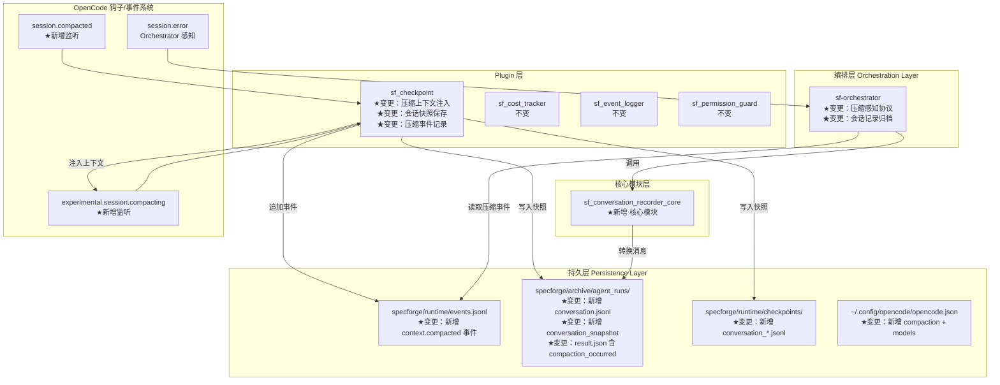
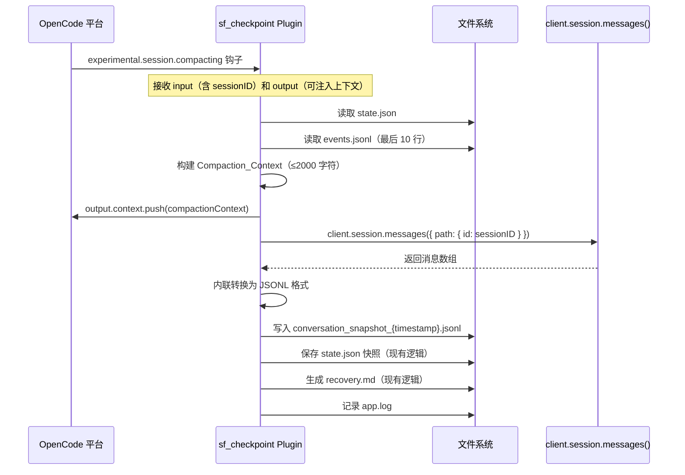
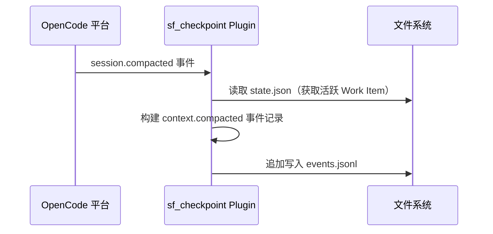
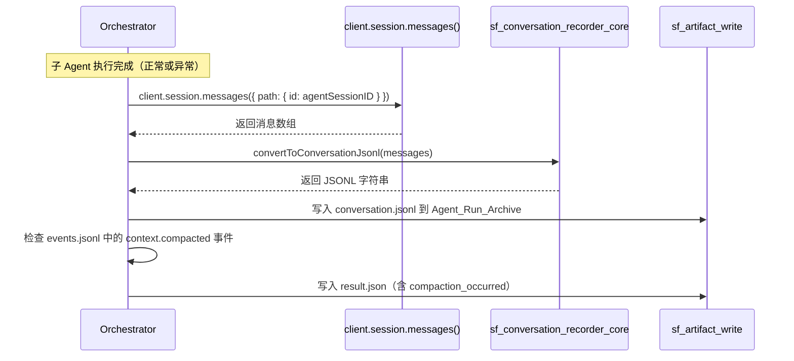

# 设计文档 — SpecForge V3.1（上下文压缩感知与会话记录版）

## 概述

本文档是 SpecForge V3.1（上下文压缩感知与会话记录版）的设计文档，基于已实现并经过 13 轮测试验证的 V3.0 系统。V3.0 已完成成本追踪（sf_cost_tracker Plugin + sf_cost_report Tool），系统拥有 12 个 Custom Tool、4 个 Plugin、7 个 Skill、8 个 Agent、381 个单元测试。

V3.1 聚焦于四项增量能力：
1. **压缩配置优化**：为 OpenCode 全局配置添加 `compaction` 和 `models` 参数，使自动压缩机制按预期工作
2. **压缩上下文增强**：增强 sf_checkpoint Plugin，在压缩前注入 SpecForge 业务上下文、保存会话快照、记录压缩事件
3. **Orchestrator 压缩感知**：Orchestrator 检测子 Agent 压缩/耗尽事件并合理应对
4. **完整会话记录**：记录子 Agent 完整对话（含 tool_call 详情、token 消耗），为 prompt 优化和失败分析提供数据基础

### 设计目标

1. **不重复造轮子**：利用 OpenCode 原生的自动压缩机制和 `experimental.session.compacting` 钩子，不自行实现 Token 监控
2. **增强而非替代**：增强现有 sf_checkpoint Plugin，而非新建 Plugin
3. **配置优先**：能通过配置解决的问题不写代码（需求 1 纯配置变更）
4. **Plugin 自包含**：sf_checkpoint 的所有新增逻辑必须内联，不引用外部模块
5. **会话可追溯**：通过 sf_conversation_recorder_core 核心模块提供可独立测试的消息转换逻辑

### 设计决策与理由

| 决策 | 理由 |
|------|------|
| 压缩/模型配置写入全局 `~/.config/opencode/opencode.json` 而非项目级 `opencode.json` | `compaction` 和 `models` 是全局行为配置，不应在项目级重复；项目级 `opencode.json` 仅保留 `agent` 配置 |
| install.ps1 采用 JSON 合并策略（读取→合并→写回） | 保留用户已有的全局配置（如其他项目的 agent 配置），仅新增/更新 `compaction` 和 `models` 字段 |
| sf_checkpoint 同时注册 `experimental.session.compacting` 钩子和 `event` 事件处理 | 钩子用于压缩前注入上下文和保存快照（可影响压缩行为），事件用于压缩后记录事件（被动监听） |
| sf_checkpoint 内联会话快照转换逻辑（不调用 sf_conversation_recorder_core） | Plugin 必须自包含，不能 import 外部模块；sf_conversation_recorder_core 供 Orchestrator/Tool 使用 |
| sf_checkpoint 通过 Plugin 初始化时的 `ctx.client` 获取 session.messages() 能力 | `experimental.session.compacting` 钩子的回调参数中包含 `input`（含 sessionID），Plugin 初始化时保存 `client` 引用 |
| Compaction_Context 限制 2000 字符（约 700 Token） | 避免注入过多上下文反而降低压缩质量；2000 字符足以包含活跃 Work Item 列表和最近 3 条状态流转 |
| sf_conversation_recorder_core 作为独立核心模块放在 `.opencode/tools/lib/` | 与现有 Tool 核心模块模式一致（如 sf_cost_report_core），便于单元测试和属性测试 |
| conversation.jsonl 采用 JSONL 格式而非单个 JSON 文件 | 与 cost.jsonl、events.jsonl、trace.jsonl 格式一致；支持流式追加写入；便于逐行解析大文件 |
| result_preview 截断为 500 字符 | 工具结果可能很大（如文件内容），500 字符足以提供上下文但不会膨胀文件体积 |
| Orchestrator 压缩感知通过协议更新（prompt 变更）实现而非代码变更 | Orchestrator 是 Agent（由 prompt 驱动），其行为变更通过修改 sf-orchestrator.md 实现 |
| run_id 从 events.jsonl 中 agent.dispatched 事件提取 | sf_checkpoint 无法直接获取 run_id，但可从最近的 events.jsonl 中 agent.dispatched 事件推断 |

---

## 架构

### V3.1 增量变更架构图



### 数据流：压缩前上下文注入与会话快照



### 数据流：压缩后事件记录



### 数据流：子 Agent 完成后会话记录



---

## 组件与接口

### 变更组件总览

| 类别 | 组件 | 文件路径 | 变更类型 | 关联需求 |
|------|------|----------|----------|----------|
| 安装脚本 | install.ps1 | `scripts/install.ps1` | 增强 | 需求 1 |
| Plugin | sf_checkpoint | `.opencode/plugins/sf_checkpoint.ts` | 增强 | 需求 2、需求 4 |
| 核心模块 | sf_conversation_recorder_core | `.opencode/tools/lib/sf_conversation_recorder_core.ts` | 新增 | 需求 4 |
| Agent | sf-orchestrator | `.opencode/agents/sf-orchestrator.md` | 协议更新 | 需求 3、需求 4 |

### 不变组件

| 类别 | 组件 | 说明 |
|------|------|------|
| Plugin | sf_cost_tracker | 不变 |
| Plugin | sf_event_logger | 不变 |
| Plugin | sf_permission_guard | 不变 |
| 配置 | opencode.json（项目级） | 不变 |
| Tool | 所有 12 个现有 Custom Tool | 不变 |


### 3.1 install.ps1 配置合并逻辑（需求 1）

**变更文件：** `scripts/install.ps1`

**职责：** 在安装过程中，将 `compaction` 和 `models` 配置合并写入 OpenCode 全局配置文件 `~/.config/opencode/opencode.json`，保留所有现有配置内容。

#### 合并策略

```powershell
# ============================================================
# 写入 OpenCode 全局配置（compaction + models）
# ============================================================

Write-Host "📁 配置 OpenCode 全局压缩和模型参数 ..."

$globalConfigDir = Join-Path $env:USERPROFILE ".config\opencode"
$globalConfigPath = Join-Path $globalConfigDir "opencode.json"

# 确保目录存在
New-Item -ItemType Directory -Path $globalConfigDir -Force | Out-Null

# 读取现有全局配置（如存在）
$globalConfig = @{}
if (Test-Path $globalConfigPath) {
    try {
        $globalConfig = Get-Content $globalConfigPath -Raw | ConvertFrom-Json -AsHashtable
    } catch {
        Write-Host "⚠️  现有全局配置解析失败，将创建新配置"
        $globalConfig = @{}
    }
}

# 合并 compaction 配置
$globalConfig["compaction"] = @{
    "auto" = $true
    "prune" = $true
    "reserved" = 20000
}

# 合并 models 配置（保留其他模型配置）
if (-not $globalConfig.ContainsKey("models")) {
    $globalConfig["models"] = @{}
}
$globalConfig["models"]["zai-coding-plan/glm-5.1"] = @{
    "context" = 90000
}

# 写回全局配置
$globalConfig | ConvertTo-Json -Depth 10 | Set-Content $globalConfigPath -Encoding UTF8

Write-Host "✅ OpenCode 全局配置已更新: $globalConfigPath"
```

**关键设计说明：**

1. **合并而非覆盖**：先读取现有配置，仅更新 `compaction` 和 `models` 字段，保留其他所有字段
2. **不设置 output 限制**：`models` 配置中仅设置 `context: 90000`，不设置 `output`，使用 GLM-5.1 默认的 max_tokens=65536
3. **容错处理**：现有配置解析失败时创建新配置，不中断安装流程
4. **不修改项目级 opencode.json**：压缩和模型配置属于全局行为，不在项目级重复

### 3.2 sf_checkpoint Plugin 增强（需求 2、需求 4）

**变更文件：** `.opencode/plugins/sf_checkpoint.ts`

**新增职责：**
1. 注册 `experimental.session.compacting` 钩子，在压缩前注入 SpecForge 业务上下文
2. 在压缩前保存当前 Session 的完整会话快照（Conversation_Snapshot）
3. 监听 `session.compacted` 事件，记录压缩事件到 Events_JSONL
4. 保持现有 `session.compacting` 事件处理逻辑不变

**自包含约束：** 所有新增逻辑内联实现，不引用外部模块，仅使用 `node:fs/promises` 和 `node:path`。

#### 类型定义（新增）

```typescript
// sf_checkpoint.ts 内部新增类型

/** 压缩上下文注入内容 */
interface CompactionContext {
  active_work_items: Array<{
    work_item_id: string
    workflow_type: string
    current_state: string
    spec_path: string
  }>
  recent_transitions: Array<{
    work_item_id: string
    from_state: string
    to_state: string
    timestamp: string
  }>
}

/** Conversation_Snapshot 中的消息记录 */
interface ConversationRecord {
  seq: number
  role: string
  timestamp: string
  content?: string
  type?: string           // "tool_call" | "text" | "parse_error"
  tool?: string
  args?: any
  result_preview?: string
  status?: string
  tokens?: {
    input: number | null
    output: number | null
    reasoning: number | null
    cache_read: number | null
    cache_write: number | null
  } | null
  cost?: number | null
  // parse_error 专用
  raw_type?: string
  error?: string
}

/** Events_JSONL 中的压缩事件记录 */
interface CompactionEvent {
  timestamp: string
  event_type: "context.compacted"
  session_id: string
  payload: {
    active_work_items: Array<{
      work_item_id: string
      current_state: string
    }>
  }
}
```

#### 核心逻辑（新增导出函数）

```typescript
// ============================================================
// 新增：Compaction_Context 构建
// ============================================================

const COMPACTION_CONTEXT_MAX_CHARS = 2000

/**
 * 构建压缩上下文文本
 * 从 state.json 和 events.jsonl 提取关键业务信息，
 * 格式化为结构化文本注入压缩提示词。
 * 总长度不超过 2000 字符。
 */
export function buildCompactionContext(
  stateData: any,
  recentEvents: any[]
): string {
  let context = "## SpecForge 业务上下文（压缩时保留）\n\n"

  // 1. 活跃 Work Item 列表
  const workItems = stateData?.work_items || {}
  const activeItems: Array<{
    work_item_id: string
    workflow_type: string
    current_state: string
  }> = []

  for (const [id, item] of Object.entries(workItems)) {
    const wi = item as any
    if (wi.current_state !== "completed") {
      activeItems.push({
        work_item_id: id,
        workflow_type: wi.workflow_type || "feature_spec",
        current_state: wi.current_state,
      })
    }
  }

  context += "### 活跃 Work Item\n"
  if (activeItems.length === 0) {
    context += "无\n\n"
  } else {
    for (const item of activeItems) {
      context += `- ${item.work_item_id}: 工作流=${item.workflow_type}, `
      context += `阶段=${item.current_state}, `
      context += `spec=specforge/specs/${item.work_item_id}/\n`
    }
    context += "\n"
  }

  // 2. 最近 3 条状态流转
  context += "### 最近状态流转\n"
  const transitions = recentEvents
    .filter((e: any) => e.event_type === "state.transitioned")
    .slice(-3)

  if (transitions.length === 0) {
    context += "无\n"
  } else {
    for (const evt of transitions) {
      context += `- ${evt.work_item_id}: `
      context += `${evt.payload?.from_state} → ${evt.payload?.to_state}\n`
    }
  }

  // 截断保护
  if (context.length > COMPACTION_CONTEXT_MAX_CHARS) {
    context = context.slice(0, COMPACTION_CONTEXT_MAX_CHARS - 30)
      + "\n\n> [上下文已截断]\n"
  }

  return context
}

// ============================================================
// 新增：内联会话快照转换（自包含，不依赖外部模块）
// ============================================================

/**
 * 将 client.session.messages() 返回的消息数组转换为 JSONL 字符串
 * 这是 sf_conversation_recorder_core 的内联简化版本，
 * 因为 Plugin 不能 import 外部模块。
 */
export function convertMessagesToJsonl(
  messages: Array<{ info: any; parts: any[] }>
): string {
  const records: string[] = []
  let seq = 0

  for (const msg of messages) {
    const info = msg.info || {}
    const parts = msg.parts || []
    const role = info.role || "unknown"
    const timestamp = info.createdAt || info.created_at
      || new Date().toISOString()

    // 处理每个 Part
    for (const part of parts) {
      seq++
      try {
        if (!part || typeof part !== "object") {
          records.push(JSON.stringify({
            seq, type: "parse_error",
            raw_type: "null_part", error: "Part is null or not an object"
          }))
          continue
        }

        const partType = part.type || "unknown"

        // TextPart
        if (partType === "text") {
          const record: any = {
            seq, role, timestamp,
            content: typeof part.text === "string"
              ? part.text : String(part.text || ""),
          }
          // assistant 消息附加 tokens/cost
          if (role === "assistant" && info.tokens) {
            record.tokens = {
              input: info.tokens?.input ?? null,
              output: info.tokens?.output ?? null,
              reasoning: info.tokens?.reasoning ?? null,
              cache_read: info.tokens?.cache?.read ?? null,
              cache_write: info.tokens?.cache?.write ?? null,
            }
            record.cost = info.cost ?? null
          }
          records.push(JSON.stringify(record))
          continue
        }

        // ToolPart
        if (partType === "tool-invocation" || partType === "tool") {
          const result = part.result ?? part.output ?? ""
          const resultStr = typeof result === "string"
            ? result : JSON.stringify(result)
          const record: any = {
            seq, role: "assistant", timestamp,
            type: "tool_call",
            tool: part.toolName || part.tool || "unknown",
            args: part.args || part.input || {},
            result_preview: resultStr.length > 500
              ? resultStr.slice(0, 500) : resultStr,
            status: part.state === "error" ? "error" : "completed",
            duration_ms: part.duration ?? null,
          }
          records.push(JSON.stringify(record))
          continue
        }

        // StepFinishPart — 跳过（元数据，不是对话内容）
        if (partType === "step-finish") {
          continue
        }

        // ReasoningPart
        if (partType === "reasoning") {
          records.push(JSON.stringify({
            seq, role, timestamp,
            type: "reasoning",
            content: typeof part.text === "string"
              ? part.text : String(part.text || ""),
          }))
          continue
        }

        // 其他未知类型 — 记录为 parse_error
        records.push(JSON.stringify({
          seq, type: "parse_error",
          raw_type: partType,
          error: `Unsupported part type: ${partType}`,
        }))
      } catch (err: unknown) {
        records.push(JSON.stringify({
          seq, type: "parse_error",
          raw_type: "exception",
          error: (err as Error).message || "Unknown error",
        }))
      }
    }

    // 如果消息没有 parts（纯 user 消息），直接记录 info
    if (parts.length === 0 && info.content) {
      seq++
      records.push(JSON.stringify({
        seq, role, timestamp,
        content: typeof info.content === "string"
          ? info.content : String(info.content),
      }))
    }
  }

  return records.join("\n") + (records.length > 0 ? "\n" : "")
}

/**
 * 从 events.jsonl 中提取最近的 run_id
 * 查找最近的 agent.dispatched 事件中的 run_id
 */
export function extractRunIdFromEvents(recentEvents: any[]): string | null {
  for (let i = recentEvents.length - 1; i >= 0; i--) {
    const evt = recentEvents[i]
    if (evt.event === "agent.dispatched" || evt.event_type === "agent.dispatched") {
      const runId = evt.payload?.run_id || evt.run_id
      if (runId) return runId
    }
  }
  return null
}
```

#### Plugin 导出结构（增强后）

```typescript
export const sf_checkpoint: Plugin = async ({ directory, client }) => {
  // 保存 client 引用，供 experimental.session.compacting 钩子使用
  const savedClient = client

  const stateFilePath = join(directory, "specforge/runtime/state.json")
  const eventsFilePath = join(directory, "specforge/runtime/events.jsonl")
  const checkpointDir = join(directory, "specforge/runtime/checkpoints")
  const appLogPath = join(directory, "specforge/logs/app.log")
  const errorLogPath = join(directory, "specforge/logs/error.log")

  return {
    // ★ 新增：experimental.session.compacting 钩子
    "experimental.session.compacting": async (input, output) => {
      const timestamp = new Date().toISOString()
      const fileTimestamp = timestamp.replace(/[:.]/g, "-")
      const sessionID = input?.sessionID || "unknown"

      try {
        // 1. 读取 state.json
        let stateData: any
        try {
          const content = await readFile(stateFilePath, "utf-8")
          stateData = JSON.parse(content)
        } catch {
          stateData = { work_items: {} }
        }

        // 2. 读取最近事件
        let recentEvents: any[] = []
        try {
          const eventsContent = await readFile(eventsFilePath, "utf-8")
          const lines = eventsContent.trim().split("\n").filter(Boolean)
          recentEvents = lines.slice(-10).map((l: string) => {
            try { return JSON.parse(l) } catch { return null }
          }).filter(Boolean)
        } catch { /* 静默 */ }

        // 3. 构建并注入 Compaction_Context
        const compactionContext = buildCompactionContext(stateData, recentEvents)
        output.context.push(compactionContext)

        // 4. 保存会话快照（Conversation_Snapshot）
        try {
          if (savedClient?.session?.messages) {
            const messagesResponse = await savedClient.session.messages({
              path: { id: sessionID }
            })
            const messages = Array.isArray(messagesResponse)
              ? messagesResponse : []

            if (messages.length > 0) {
              const jsonlContent = convertMessagesToJsonl(messages)

              // 确定保存路径
              const runId = extractRunIdFromEvents(recentEvents)
              let snapshotPath: string
              if (runId) {
                const archiveDir = join(directory,
                  "specforge/archive/agent_runs", runId)
                await mkdir(archiveDir, { recursive: true })
                snapshotPath = join(archiveDir,
                  `conversation_snapshot_${fileTimestamp}.jsonl`)
              } else {
                await mkdir(checkpointDir, { recursive: true })
                snapshotPath = join(checkpointDir,
                  `conversation_${sessionID}_${fileTimestamp}.jsonl`)
              }

              await writeFile(snapshotPath, jsonlContent, "utf-8")
            }
          }
        } catch { /* 静默：快照保存失败不阻断压缩 */ }

        // 5. 记录成功日志
        const activeIds = Object.entries(stateData?.work_items || {})
          .filter(([_, wi]: [string, any]) =>
            wi.current_state !== "completed")
          .map(([id]) => id)

        await appendLogSafe(appLogPath, {
          timestamp,
          level: "INFO",
          component: "sf_checkpoint",
          event: "compaction_context.injected",
          message: `Compaction context injected: ${compactionContext.length} chars`,
          payload: {
            context_length: compactionContext.length,
            active_work_items: activeIds,
            session_id: sessionID,
          },
        })

      } catch (err: unknown) {
        await appendLogSafe(errorLogPath, {
          timestamp,
          level: "ERROR",
          component: "sf_checkpoint",
          event: "compaction_context.failed",
          message: `Compaction context injection failed: ${(err as Error).message}`,
          payload: { session_id: sessionID },
        })
      }
    },

    // 现有 event 处理 + 新增 session.compacted 处理
    event: async ({ event }) => {
      // ★ 新增：session.compacted 事件处理
      if (event.type === "session.compacted") {
        const timestamp = new Date().toISOString()
        try {
          // 读取 state.json 获取活跃 Work Item
          let stateData: any
          try {
            const content = await readFile(stateFilePath, "utf-8")
            stateData = JSON.parse(content)
          } catch {
            stateData = { work_items: {} }
          }

          const activeItems = Object.entries(stateData?.work_items || {})
            .filter(([_, wi]: [string, any]) =>
              wi.current_state !== "completed")
            .map(([id, wi]: [string, any]) => ({
              work_item_id: id,
              current_state: wi.current_state,
            }))

          // 构建并写入压缩事件记录
          const compactionEvent: CompactionEvent = {
            timestamp,
            event_type: "context.compacted",
            session_id: (event as any).properties?.sessionID
              || (event as any).sessionID || "unknown",
            payload: { active_work_items: activeItems },
          }

          await appendLogSafe(eventsFilePath, compactionEvent)
        } catch { /* 静默 */ }
        // 不 return，允许继续执行下面的现有逻辑（如果匹配）
      }

      // ── 现有逻辑：session.compacting 事件处理（完全不变）──
      if (event.type !== "session.compacting") return

      // ... 现有的 checkpoint 逻辑保持不变 ...
    },
  }
}
```

**关键设计说明：**

1. **Plugin 初始化时保存 `client` 引用**：`experimental.session.compacting` 钩子需要调用 `client.session.messages()` 获取会话历史。Plugin 初始化函数接收 `ctx`（含 `client`），在闭包中保存引用。

2. **钩子 vs 事件的区别**：
   - `experimental.session.compacting`：是**钩子**（hook），在压缩发生前调用，可通过 `output.context.push()` 影响压缩行为
   - `session.compacted`：是**事件**（event），在压缩完成后触发，只能被动监听
   - `session.compacting`：是**事件**（event），现有逻辑已在监听

3. **会话快照的内联转换**：`convertMessagesToJsonl()` 是 `sf_conversation_recorder_core` 的简化内联版本，因为 Plugin 不能 import 外部模块。两者的输出格式一致。

4. **run_id 获取策略**：从 events.jsonl 最近的 `agent.dispatched` 事件中提取 run_id。如果找不到（如 Orchestrator 自身的 Session），回退到 checkpoints 目录。


### 3.3 sf_conversation_recorder_core 核心模块（需求 4）

**文件路径：** `.opencode/tools/lib/sf_conversation_recorder_core.ts`

**职责：**
1. 将 OpenCode SDK 的 `client.session.messages()` 响应转换为 Conversation_JSONL 格式字符串
2. 可独立测试，不依赖 OpenCode 运行时环境
3. 正确处理所有消息类型：纯文本、工具调用、混合类型、包含 tokens/cost 的 assistant 消息

**与 sf_checkpoint 内联版本的关系：** sf_checkpoint 中的 `convertMessagesToJsonl()` 是本模块的内联简化版本。两者输出格式一致，但本模块提供更完整的类型定义和错误处理，供 Orchestrator 通过 Custom Tool 或直接 import 使用。

#### 类型定义

```typescript
// sf_conversation_recorder_core.ts

/** OpenCode SDK session.messages() 返回的消息结构 */
export interface OpenCodeMessage {
  info: {
    id: string
    role: "user" | "assistant"
    createdAt?: string
    created_at?: string
    cost?: number
    tokens?: {
      input?: number
      output?: number
      reasoning?: number
      cache?: { read?: number; write?: number }
    }
    content?: string
    metadata?: {
      agent?: string
      model?: string
    }
  }
  parts: OpenCodePart[]
}

/** OpenCode Part 类型联合 */
export type OpenCodePart =
  | TextPart
  | ToolPart
  | StepFinishPart
  | ReasoningPart
  | UnknownPart

export interface TextPart {
  type: "text"
  text: string
}

export interface ToolPart {
  type: "tool-invocation" | "tool"
  toolName?: string
  tool?: string
  args?: any
  input?: any
  result?: any
  output?: any
  state?: "pending" | "running" | "completed" | "error"
  duration?: number
}

export interface StepFinishPart {
  type: "step-finish"
  cost?: number
  tokens?: any
}

export interface ReasoningPart {
  type: "reasoning"
  text: string
}

export interface UnknownPart {
  type: string
  [key: string]: any
}

/** Conversation_JSONL 中的文本消息记录 */
export interface TextRecord {
  seq: number
  role: string
  timestamp: string
  content: string
  tokens?: {
    input: number | null
    output: number | null
    reasoning: number | null
    cache_read: number | null
    cache_write: number | null
  } | null
  cost?: number | null
}

/** Conversation_JSONL 中的工具调用记录 */
export interface ToolCallRecord {
  seq: number
  role: "assistant"
  timestamp: string
  type: "tool_call"
  tool: string
  args: any
  result_preview: string
  status: "completed" | "error"
  duration_ms: number | null
}

/** Conversation_JSONL 中的解析错误占位记录 */
export interface ParseErrorRecord {
  seq: number
  type: "parse_error"
  raw_type: string
  error: string
}

/** 所有记录类型的联合 */
export type ConversationRecord = TextRecord | ToolCallRecord | ParseErrorRecord
```

#### 核心转换逻辑

```typescript
const RESULT_PREVIEW_MAX_LENGTH = 500

/**
 * 安全截断字符串
 */
function truncate(str: string, maxLength: number): string {
  if (str.length <= maxLength) return str
  return str.slice(0, maxLength)
}

/**
 * 安全提取时间戳
 */
function extractTimestamp(info: any): string {
  return info?.createdAt || info?.created_at || new Date().toISOString()
}

/**
 * 从 assistant 消息 info 中提取 tokens 结构
 */
export function extractMessageTokens(info: any): TextRecord["tokens"] {
  if (!info?.tokens) return null
  return {
    input: info.tokens.input ?? null,
    output: info.tokens.output ?? null,
    reasoning: info.tokens.reasoning ?? null,
    cache_read: info.tokens.cache?.read ?? null,
    cache_write: info.tokens.cache?.write ?? null,
  }
}

/**
 * 将 OpenCode SDK 的 session.messages() 响应转换为 ConversationRecord 数组
 *
 * @param messages - client.session.messages() 返回的消息数组
 * @returns ConversationRecord 数组，按原始顺序排列
 */
export function convertToRecords(
  messages: OpenCodeMessage[]
): ConversationRecord[] {
  const records: ConversationRecord[] = []
  let seq = 0

  for (const msg of messages) {
    const info = msg.info || ({} as any)
    const parts = msg.parts || []
    const role = info.role || "unknown"
    const timestamp = extractTimestamp(info)

    for (const part of parts) {
      seq++
      try {
        if (!part || typeof part !== "object") {
          records.push({
            seq, type: "parse_error",
            raw_type: "null_part",
            error: "Part is null or not an object",
          })
          continue
        }

        const partType = (part as any).type || "unknown"

        // TextPart
        if (partType === "text") {
          const record: TextRecord = {
            seq, role, timestamp,
            content: typeof (part as TextPart).text === "string"
              ? (part as TextPart).text
              : String((part as any).text || ""),
          }
          if (role === "assistant") {
            record.tokens = extractMessageTokens(info)
            record.cost = info.cost ?? null
          }
          records.push(record)
          continue
        }

        // ToolPart
        if (partType === "tool-invocation" || partType === "tool") {
          const tp = part as ToolPart
          const result = tp.result ?? tp.output ?? ""
          const resultStr = typeof result === "string"
            ? result : JSON.stringify(result)
          records.push({
            seq, role: "assistant", timestamp,
            type: "tool_call",
            tool: tp.toolName || tp.tool || "unknown",
            args: tp.args || tp.input || {},
            result_preview: truncate(resultStr, RESULT_PREVIEW_MAX_LENGTH),
            status: tp.state === "error" ? "error" : "completed",
            duration_ms: tp.duration ?? null,
          })
          continue
        }

        // StepFinishPart — 跳过
        if (partType === "step-finish") {
          seq-- // 不占用序号
          continue
        }

        // ReasoningPart
        if (partType === "reasoning") {
          records.push({
            seq, role, timestamp,
            content: typeof (part as ReasoningPart).text === "string"
              ? (part as ReasoningPart).text
              : String((part as any).text || ""),
          } as TextRecord)
          continue
        }

        // 未知类型
        records.push({
          seq, type: "parse_error",
          raw_type: partType,
          error: `Unsupported part type: ${partType}`,
        })
      } catch (err: unknown) {
        records.push({
          seq, type: "parse_error",
          raw_type: "exception",
          error: (err as Error).message || "Unknown error",
        })
      }
    }

    // 无 parts 的纯 user 消息
    if (parts.length === 0 && info.content) {
      seq++
      records.push({
        seq, role, timestamp,
        content: typeof info.content === "string"
          ? info.content : String(info.content),
      } as TextRecord)
    }
  }

  return records
}

/**
 * 将 ConversationRecord 数组转换为 JSONL 字符串
 */
export function recordsToJsonl(records: ConversationRecord[]): string {
  if (records.length === 0) return ""
  return records.map(r => JSON.stringify(r)).join("\n") + "\n"
}

/**
 * 一步完成：消息数组 → JSONL 字符串
 * 这是 Orchestrator 调用的主入口函数
 */
export function convertToConversationJsonl(
  messages: OpenCodeMessage[]
): string {
  const records = convertToRecords(messages)
  return recordsToJsonl(records)
}
```

**关键设计说明：**

1. **两步转换**：`convertToRecords()` 返回结构化数组（便于测试和断言），`recordsToJsonl()` 序列化为 JSONL 字符串。`convertToConversationJsonl()` 是组合入口。
2. **StepFinishPart 跳过**：step-finish 是元数据（cost/tokens），不是对话内容，sf_cost_tracker 已在采集。
3. **result_preview 截断**：工具结果最大 500 字符，避免 conversation.jsonl 文件膨胀。
4. **parse_error 占位**：遇到无法解析的 Part 类型时，插入 `parse_error` 记录而非跳过，保留审计线索。

### 3.4 sf-orchestrator 协议更新（需求 3、需求 4）

**变更文件：** `.opencode/agents/sf-orchestrator.md`

**变更内容：** 在 Agent Run Archive 协议中新增压缩感知和会话记录逻辑。

#### Agent Run Archive 协议变更

在现有归档流程的步骤 0（调用 sf_cost_report）之后，新增以下步骤：

```markdown
## Agent Run Archive 协议（V3.1 增强）

### 归档创建流程

每次子 Agent 执行完成后（无论成功或失败），执行以下步骤：

0. 调用 `sf_cost_report`（session_id=<agent_session_id>）获取成本数据（现有）

0.5 ★新增：保存完整会话记录
   a. 调用 `client.session.messages({ path: { id: <agent_session_id> } })` 获取完整会话历史
   b. 将消息数组传递给 sf_conversation_recorder_core 的 `convertToConversationJsonl()` 转换为 JSONL
   c. 将 JSONL 内容写入 `specforge/archive/agent_runs/<run_id>/conversation.jsonl`
   d. 如果步骤 a-c 任一失败，静默跳过，在 result.json 中标记 `conversation_recorded: false`

0.7 ★新增：检查压缩事件
   a. 读取 `specforge/runtime/events.jsonl`
   b. 查找 start_time 到 end_time 之间的 `context.compacted` 事件
   c. 如果找到压缩事件，设置 `compaction_occurred: true`
   d. 如果未找到，设置 `compaction_occurred: false`
   e. 如果读取/解析失败，设置 `compaction_occurred: null`

1. 调用 `sf_artifact_write` 写入 result.json（现有，新增字段）

result.json 新增字段：
{
  // ... 现有字段 ...
  "compaction_occurred": true | false | null,
  "conversation_recorded": true | false
}

2. 调用 `sf_artifact_write` 写入 work_log.md（现有，不变）
```

#### Context_Exhaustion 处理协议（新增）

```markdown
## Context_Exhaustion 处理协议

### 识别上下文耗尽

当子 Agent 执行失败时，检查错误信息是否包含以下关键词：
- "context length exceeded"
- "context window"
- "token limit"
- "maximum context"
- session.error 事件中的相关错误

### 处理流程

WHEN 子 Agent 因 Context_Exhaustion 失败时：

1. **不在同一 Session 中重试**（重试无意义，上下文已满）
2. **保存完整会话记录**：
   a. 调用 `client.session.messages()` 获取该 Session 的完整会话历史
   b. 转换并保存到 Agent_Run_Archive 的 `conversation.jsonl`
3. **向用户报告**：
   ```
   ⚠️ 子 Agent 上下文耗尽
   ━━━━━━━━━━━━━━━━━━━━
   Agent: <agent_name>
   Session: <session_id>
   状态: 上下文窗口已满，无法继续执行
   ━━━━━━━━━━━━━━━━━━━━
   完整会话已保存到: specforge/archive/agent_runs/<run_id>/conversation.jsonl
   建议: 可以创建新的子 Agent Session 继续执行剩余任务
   ```
4. **在 result.json 中标记**：
   ```json
   {
     "status": "failure",
     "error_type": "context_exhaustion",
     "error_summary": "Session context window exceeded"
   }
   ```

### 压缩事件报告

WHEN Orchestrator 检测到子 Agent 执行期间发生过压缩事件时：

向用户报告：
```
ℹ️ 子 Agent 执行期间发生了上下文压缩
━━━━━━━━━━━━━━━━━━━━
Agent: <agent_name>
Session: <session_id>
压缩时间: <compaction_timestamp>
━━━━━━━━━━━━━━━━━━━━
压缩前的完整会话快照已保存。
```
```


---

## 数据模型

### 新增数据结构

#### Compaction_Context（注入压缩提示词的业务上下文）

```
## SpecForge 业务上下文（压缩时保留）

### 活跃 Work Item
- WI-001: 工作流=feature_spec, 阶段=development, spec=specforge/specs/WI-001/
- WI-002: 工作流=bugfix_spec, 阶段=bugfix_analysis, spec=specforge/specs/WI-002/

### 最近状态流转
- WI-001: design_gate → tasks
- WI-001: tasks → tasks_gate
- WI-001: tasks_gate → development
```

**约束：** 总长度 ≤ 2000 字符（约 700 Token）

#### CompactionEvent（events.jsonl 中的压缩事件记录）

```json
{
  "timestamp": "2025-01-20T10:30:00.000Z",
  "event_type": "context.compacted",
  "session_id": "sess_abc123",
  "payload": {
    "active_work_items": [
      { "work_item_id": "WI-001", "current_state": "development" },
      { "work_item_id": "WI-002", "current_state": "bugfix_analysis" }
    ]
  }
}
```

#### Conversation_JSONL 格式（conversation.jsonl / conversation_snapshot_*.jsonl）

**文本消息记录：**

```json
{"seq":1,"role":"user","timestamp":"2025-01-20T10:00:00.000Z","content":"请实现用户认证功能"}
```

**Assistant 文本消息记录（含 tokens/cost）：**

```json
{"seq":2,"role":"assistant","timestamp":"2025-01-20T10:00:05.000Z","content":"好的，我来分析需求...","tokens":{"input":1500,"output":800,"reasoning":200,"cache_read":500,"cache_write":300},"cost":0.0045}
```

**工具调用记录：**

```json
{"seq":3,"role":"assistant","timestamp":"2025-01-20T10:00:10.000Z","type":"tool_call","tool":"sf_state_read","args":{"work_item_id":"WI-001"},"result_preview":"{\"success\":true,\"current_state\":\"development\"...}","status":"completed","duration_ms":150}
```

**解析错误占位记录：**

```json
{"seq":4,"type":"parse_error","raw_type":"custom_widget","error":"Unsupported part type: custom_widget"}
```

**字段说明：**

| 字段 | 类型 | 说明 | 出现条件 |
|------|------|------|----------|
| seq | number | 从 1 开始的序号 | 所有记录 |
| role | string | "user" 或 "assistant" | 文本/工具调用记录 |
| timestamp | string (ISO8601) | 消息创建时间 | 文本/工具调用记录 |
| content | string | 文本内容 | 文本消息记录 |
| tokens | object \| null | Token 使用明细 | assistant 文本消息 |
| cost | number \| null | 成本（美元） | assistant 文本消息 |
| type | string | "tool_call" 或 "parse_error" | 工具调用/错误记录 |
| tool | string | 工具名称 | 工具调用记录 |
| args | object | 工具参数 | 工具调用记录 |
| result_preview | string | 工具结果预览（≤500 字符） | 工具调用记录 |
| status | string | "completed" 或 "error" | 工具调用记录 |
| duration_ms | number \| null | 工具执行耗时（毫秒） | 工具调用记录 |
| raw_type | string | 原始 Part 类型 | 解析错误记录 |
| error | string | 错误描述 | 解析错误记录 |

#### result.json 新增字段

```json
{
  "run_id": "WI-001-sf-executor-1",
  "work_item_id": "WI-001",
  "agent_name": "sf-executor",
  "start_time": "2025-01-20T10:00:00.000Z",
  "end_time": "2025-01-20T10:05:00.000Z",
  "duration_ms": 300000,
  "status": "success",
  "task_description": "实现用户认证功能",
  "retry_count": 0,
  "cost_summary": { "..." : "（现有，不变）" },
  "compaction_occurred": false,
  "conversation_recorded": true
}
```

| 新增字段 | 类型 | 说明 |
|----------|------|------|
| compaction_occurred | boolean \| null | 执行期间是否发生过压缩。true=发生过，false=未发生，null=无法确定 |
| conversation_recorded | boolean | 完整会话是否已保存。true=已保存 conversation.jsonl，false=保存失败 |

#### OpenCode_Global_Config 新增字段

```json
{
  "compaction": {
    "auto": true,
    "prune": true,
    "reserved": 20000
  },
  "models": {
    "zai-coding-plan/glm-5.1": {
      "context": 90000
    }
  }
}
```

### 文件系统变更

V3.1 新增/变更以下文件：

```
~/.config/opencode/
└── opencode.json                    ★ 变更：新增 compaction + models 字段

scripts/
└── install.ps1                      ★ 变更：新增全局配置合并逻辑

.opencode/
├── plugins/
│   └── sf_checkpoint.ts             ★ 变更：新增钩子/事件处理
└── tools/
    └── lib/
        └── sf_conversation_recorder_core.ts  ★ 新增

.opencode/agents/
└── sf-orchestrator.md               ★ 变更：新增压缩感知和会话记录协议

specforge/
├── runtime/
│   ├── events.jsonl                 ★ 变更：新增 context.compacted 事件类型
│   └── checkpoints/
│       └── conversation_*_*.jsonl   ★ 新增（压缩前快照，无 run_id 时）
└── archive/
    └── agent_runs/<run_id>/
        ├── result.json              ★ 变更：新增 compaction_occurred + conversation_recorded
        ├── conversation.jsonl       ★ 新增（完整会话记录）
        └── conversation_snapshot_*.jsonl  ★ 新增（压缩前快照，有 run_id 时）

tests/
└── unit/
    ├── plugins/
    │   └── sf_checkpoint.test.ts    ★ 变更：新增测试用例
    └── tools/
        └── lib/
            └── sf_conversation_recorder_core.test.ts  ★ 新增（含属性测试）
```

---

## 正确性属性

*正确性属性（Correctness Property）是一种在系统所有合法执行中都应成立的特征或行为——本质上是对系统应做什么的形式化陈述。属性是连接人类可读规格与机器可验证正确性保证的桥梁。*

### Property 1: Compaction_Context 注入完整性

*对于任意* 有效的 state.json 数据（包含 0 到 N 个活跃 Work Item）和 events.jsonl 事件数组（包含 0 到 M 条状态流转记录），`buildCompactionContext()` 生成的上下文文本应满足：
- 包含所有非 completed 状态的 Work Item 的 work_item_id、workflow_type 和 current_state
- 包含最近 3 条（或更少）状态流转记录的 from_state 和 to_state
- 每个活跃 Work Item 的 spec 路径格式为 `specforge/specs/<work_item_id>/`

**验证: 需求 2.1, 2.2**

### Property 2: Compaction_Context 长度不变量

*对于任意* state.json 数据和 events.jsonl 事件数组（无论数据量多大），`buildCompactionContext()` 生成的上下文文本长度应始终不超过 2000 字符。

**验证: 需求 2.3**

### Property 3: 压缩事件记录字段完整性

*对于任意* session.compacted 事件数据和 state.json 数据，生成的 CompactionEvent 记录应包含所有必需字段（timestamp、event_type="context.compacted"、session_id、payload.active_work_items），且 active_work_items 中的每个条目都包含 work_item_id 和 current_state。

**验证: 需求 2.8, 2.9**

### Property 4: 消息转换 JSONL 格式正确性

*对于任意* OpenCode session.messages() 返回的消息数组，`convertToRecords()` 生成的记录数组中每条记录序列化为 JSON 后应为合法的 JSON 字符串，且 `recordsToJsonl()` 的输出中每行都是独立的合法 JSON 对象。

**验证: 需求 4.4, 4.5**

### Property 5: 消息转换字段完整性

*对于任意* 包含文本消息、工具调用、混合类型消息的 OpenCode 消息数组，`convertToRecords()` 应满足：
- 所有文本消息记录包含 seq、role、timestamp、content 字段
- 所有 assistant 文本消息记录额外包含 tokens 和 cost 字段（值可为 null）
- 所有工具调用记录包含 seq、role、timestamp、type="tool_call"、tool、args、result_preview（≤500 字符）、status、duration_ms 字段
- seq 从 1 开始单调递增

**验证: 需求 4.5, 4.6, 4.7, 4.11**

### Property 6: 无法解析消息的容错

*对于任意* 包含有效消息和无法解析消息（null Part、未知 Part 类型、异常 Part）混合的消息数组，`convertToRecords()` 应为每个无法解析的 Part 生成一条 `parse_error` 类型的占位记录（包含 seq、type="parse_error"、raw_type、error），且不影响其他有效消息的转换。

**验证: 需求 4.13**

---

## 错误处理

### sf_checkpoint Plugin 错误

| 错误场景 | 处理方式 | 关联需求 |
|----------|----------|----------|
| state.json 不存在或解析失败 | 使用默认值 `{ work_items: {} }`，继续执行 | 2.10 |
| events.jsonl 不存在或解析失败 | 使用空数组 `[]`，继续执行 | 2.10 |
| client.session.messages() 调用失败 | 静默跳过会话快照保存，不阻断压缩流程 | 2.10 |
| client 对象不存在（Plugin 初始化未提供） | 跳过会话快照保存，仅执行上下文注入和现有逻辑 | 2.10 |
| 会话快照文件写入失败 | 静默跳过，记录错误日志 | 2.10 |
| Compaction_Context 超过 2000 字符 | 截断到 2000 字符以内，附加截断提示 | 2.3 |
| events.jsonl 追加写入失败（压缩事件记录） | 静默跳过，不阻断 | 2.10 |
| experimental.session.compacting 钩子整体异常 | 捕获异常，记录错误日志，不阻断 OpenCode 压缩流程 | 2.10 |
| session.compacted 事件处理异常 | 静默跳过，不影响其他事件处理 | 2.10 |
| 现有 session.compacting 事件处理逻辑 | 完全不变，保持现有错误处理行为 | 2.7, 5.2 |

### sf_conversation_recorder_core 错误

| 错误场景 | 处理方式 | 关联需求 |
|----------|----------|----------|
| 消息数组为空 | 返回空字符串 | 4.10 |
| Part 为 null 或非对象 | 生成 parse_error 占位记录 | 4.13 |
| Part 类型未知 | 生成 parse_error 占位记录 | 4.13 |
| Part 处理过程中抛出异常 | 捕获异常，生成 parse_error 占位记录 | 4.13 |
| 工具结果超过 500 字符 | 截断到 500 字符 | 4.7 |
| tokens/cost 字段不存在 | 记录为 null | 4.6 |
| info.content 不是字符串 | 转换为字符串 | 4.5 |

### Orchestrator 错误

| 错误场景 | 处理方式 | 关联需求 |
|----------|----------|----------|
| client.session.messages() 调用失败 | 静默跳过会话记录，标记 conversation_recorded: false | 4.12 |
| sf_conversation_recorder_core 转换失败 | 静默跳过，标记 conversation_recorded: false | 4.12 |
| events.jsonl 读取/解析失败（压缩事件检查） | 设置 compaction_occurred: null | 3.7 |
| 子 Agent 因 Context_Exhaustion 失败 | 不在同一 Session 重试，保存会话记录，向用户报告 | 3.4, 3.5, 3.6 |

### install.ps1 错误

| 错误场景 | 处理方式 | 关联需求 |
|----------|----------|----------|
| 全局配置文件不存在 | 创建新文件 | 1.4 |
| 全局配置文件解析失败 | 创建新配置（覆盖损坏文件） | 1.4 |
| 全局配置目录不存在 | 递归创建目录 | 1.4 |
| 写入全局配置失败 | 报告错误，不中断安装流程 | 1.4 |

---

## 测试策略

### 测试方法概述

SpecForge V3.1 延续 V1/V2/V3.0 的双轨测试策略：

1. **属性测试（Property-Based Testing）**：验证 sf_conversation_recorder_core 的转换逻辑和 sf_checkpoint 的上下文构建逻辑在所有合法输入下的正确性
2. **单元测试（Example-Based Testing）**：验证具体场景、边界条件、错误处理路径和 Plugin 行为
3. **回归测试**：确保 381 个现有单元测试全部通过

### 属性测试（Property-Based Testing）

**测试库：** fast-check（与 V1/V2/V3.0 一致）

**配置要求：**
- 每个属性测试最少运行 100 次迭代
- 每个测试必须引用设计文档中的属性编号
- 标签格式：`Feature: specforge-v31-token-monitor, Property {number}: {property_text}`

**属性测试清单：**

| 属性 | 测试文件 | 生成器策略 |
|------|----------|-----------|
| Property 1: Compaction_Context 注入完整性 | sf_checkpoint.test.ts | 生成随机 state.json（0-20 个 Work Item，随机状态）和随机 events 数组（0-30 条事件），验证输出包含所有活跃 Work Item 信息和最近 3 条流转 |
| Property 2: Compaction_Context 长度不变量 | sf_checkpoint.test.ts | 生成极端大小的 state.json（0-200 个 Work Item）和 events 数组（0-100 条），验证输出长度始终 ≤ 2000 |
| Property 3: 压缩事件记录字段完整性 | sf_checkpoint.test.ts | 生成随机 session_id 和 state.json，验证生成的 CompactionEvent 包含所有必需字段 |
| Property 4: 消息转换 JSONL 格式正确性 | sf_conversation_recorder_core.test.ts | 生成随机消息数组（0-50 条消息，每条 0-10 个 Part），验证每行输出都是合法 JSON |
| Property 5: 消息转换字段完整性 | sf_conversation_recorder_core.test.ts | 生成随机类型的消息（text/tool/mixed），验证各类型记录包含所有必需字段 |
| Property 6: 无法解析消息容错 | sf_conversation_recorder_core.test.ts | 生成混合有效/无效 Part 的消息数组，验证无效 Part 生成 parse_error 记录且不影响有效 Part |

### 单元测试（Example-Based Testing）

**测试框架：** Vitest（与 V1/V2/V3.0 一致）

**sf_checkpoint Plugin 新增测试：**

| 测试目标 | 验证内容 | 对应需求 |
|----------|----------|----------|
| buildCompactionContext 基本功能 | 正确提取活跃 Work Item 和最近流转 | 2.1, 2.2 |
| buildCompactionContext 空数据 | state.json 为空或不存在时返回"无"提示 | 2.10 |
| buildCompactionContext 截断 | 大量 Work Item 时输出不超过 2000 字符 | 2.3 |
| convertMessagesToJsonl 文本消息 | 正确转换 user/assistant 文本消息 | 4.5 |
| convertMessagesToJsonl 工具调用 | 正确转换 tool-invocation Part | 4.7 |
| convertMessagesToJsonl 混合消息 | 同一消息中包含文本和工具调用 | 4.11 |
| convertMessagesToJsonl 空消息 | 空数组返回空字符串 | 5.7 |
| convertMessagesToJsonl result_preview 截断 | 超过 500 字符的工具结果被截断 | 4.7 |
| extractRunIdFromEvents 有 run_id | 正确提取最近的 run_id | 2.5 |
| extractRunIdFromEvents 无 run_id | 返回 null | 2.6 |
| session.compacted 事件处理 | 正确生成并写入 context.compacted 事件 | 2.8, 2.9 |
| 现有 session.compacting 逻辑不变 | 所有现有测试继续通过 | 5.2 |
| 错误处理：state.json 读取失败 | 静默降级，使用默认值 | 2.10 |
| 错误处理：client 不存在 | 跳过会话快照保存 | 2.10 |

**sf_conversation_recorder_core 测试：**

| 测试目标 | 验证内容 | 对应需求 |
|----------|----------|----------|
| 空 Session（无消息） | 返回空字符串 | 5.8 |
| 纯 user 文本消息 | 正确转换，包含 seq/role/timestamp/content | 4.5 |
| assistant 文本消息含 tokens/cost | 正确提取 tokens 各字段和 cost | 4.6 |
| assistant 文本消息无 tokens/cost | tokens 和 cost 为 null | 4.6 |
| 工具调用消息 | 正确转换，包含所有必需字段 | 4.7 |
| 工具调用结果截断 | 超过 500 字符的结果被截断 | 4.7 |
| 工具调用状态为 error | status 字段为 "error" | 4.7 |
| 混合类型消息 | 同一消息中的 text + tool Part 都被正确转换 | 4.11 |
| StepFinishPart 跳过 | step-finish Part 不生成记录 | 4.11 |
| ReasoningPart 处理 | 正确转换为文本记录 | 4.11 |
| 无法解析的 Part 类型 | 生成 parse_error 占位记录 | 4.13 |
| null Part | 生成 parse_error 占位记录 | 4.13 |
| 异常 Part（处理时抛错） | 捕获异常，生成 parse_error 记录 | 4.13 |
| extractMessageTokens 完整数据 | 正确提取所有 token 字段 | 4.6 |
| extractMessageTokens 部分数据 | 缺失字段为 null | 4.6 |
| extractMessageTokens 无数据 | 返回 null | 4.6 |
| recordsToJsonl 格式 | 每行一条 JSON，末尾有换行 | 4.4 |
| convertToConversationJsonl 端到端 | 完整流程正确 | 4.2 |

### 回归测试

- 运行 `bun test`（vitest run），确保所有 381 个现有测试通过
- 重点关注 `tests/unit/plugins/sf_checkpoint.test.ts` 中的现有测试不受影响
