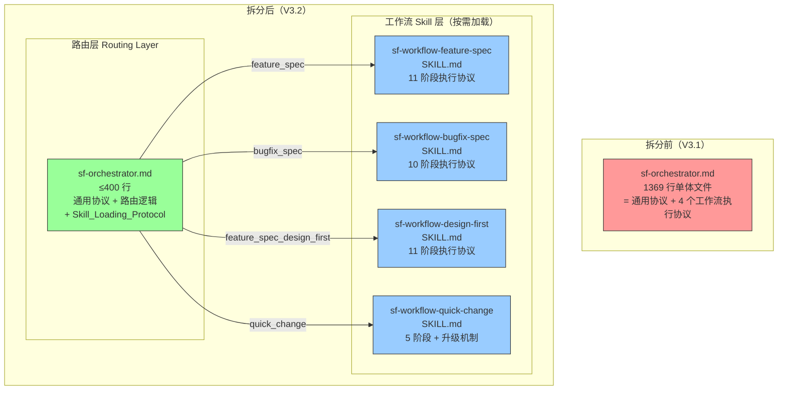
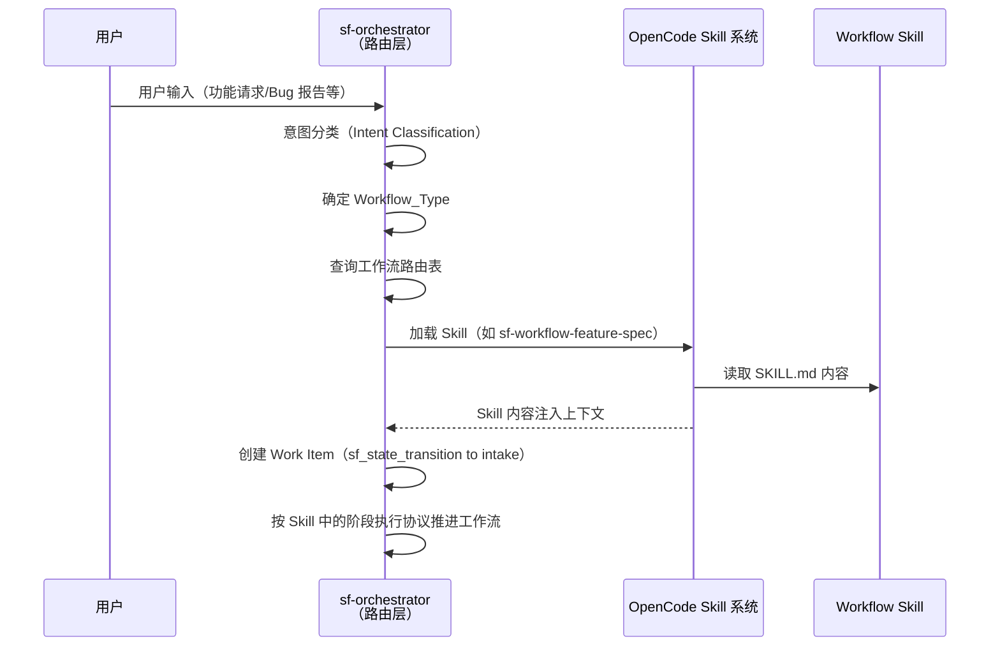
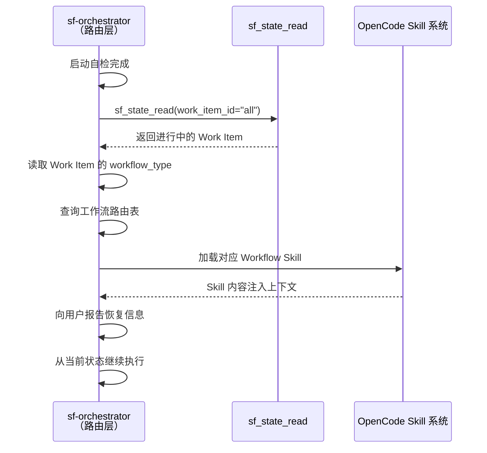
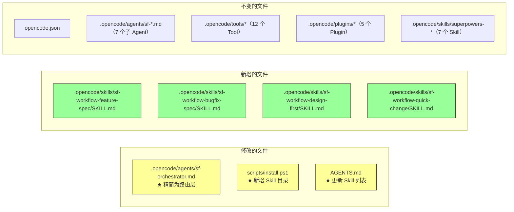

# 设计文档 — SpecForge V3.2（Orchestrator Prompt 拆分版）

## 概述

本文档是 SpecForge V3.2（Orchestrator Prompt 拆分版）的设计文档，基于已实现并经过测试验证的 V3.1 系统。V3.1 已完成上下文压缩感知与会话记录功能，系统拥有 12 个 Custom Tool、5 个 Plugin、7 个 Skill、8 个 Agent、424 个单元测试。

V3.2 聚焦于一项核心结构重构：将当前 1369 行的单体 `sf-orchestrator.md` 拆分为一个精简路由层（≤400 行）加 4 个按需加载的工作流 Skill 文件。这是一次**纯 Prompt 重构**——不涉及任何 TypeScript 代码变更、Custom Tool 变更或 Plugin 变更，仅创建/修改 Markdown 文件。

### 设计目标

1. **提升 AI 指令遵从性**：将 Orchestrator 基础上下文从 1369 行降至 ≤400 行，减少中部指令被忽略的风险（V3.1 的 step 0.5 被跳过已证实此问题）
2. **按需加载**：利用 OpenCode Skill 机制，仅在确定工作流类型后加载对应的阶段执行协议，避免上下文窗口浪费
3. **Skill 自包含**：每个 Workflow Skill 文件包含完整的阶段执行协议，不使用跨文件引用（如"参照 Feature Spec"），确保加载后即可独立执行
4. **零行为变更**：拆分是纯结构重构，4 个工作流的执行行为与拆分前完全一致
5. **易于扩展**：新增工作流只需创建 Skill 文件 + 路由表添加一行映射

### 设计决策与理由

| 决策 | 理由 |
|------|------|
| 使用 OpenCode 原生 Skill 机制而非自定义加载方案 | Skill 机制已成熟（7 个现有 Skill 运行良好），`autoload: false` + `permission.skill = allow` 支持按需加载，无需额外代码 |
| 共享协议（Gate、重试、Archive 等）保留在路由层 | 这些协议是所有工作流共用的，放在路由层避免 4 份重复；Skill 文件只包含工作流特有的阶段执行协议 |
| 每个 Workflow Skill 完整复制共享阶段（如 Bugfix 的 design_gate 与 Feature Spec 相同） | 自包含原则优先于 DRY 原则；跨 Skill 引用会导致加载依赖和上下文碎片化 |
| Skill 加载时机为意图分类后、Work Item 创建前 | 确保 Orchestrator 在开始执行工作流前已拥有完整的阶段指令；Work Item 创建是工作流执行的第一步 |
| 路由层保留工作流阶段总览（状态流转图）但移除详细执行步骤 | 总览图帮助 Orchestrator 理解工作流全貌和状态机合法路径；详细步骤由 Skill 提供 |
| 会话恢复时也加载 Skill | 恢复后需要继续执行工作流，必须拥有阶段执行协议 |
| Skill 加载失败时停止而非降级 | 缺少阶段执行协议会导致工作流执行不完整，降级比停止更危险 |
| install.ps1 使用通配符复制 Skills 目录 | 现有脚本已使用 `Get-ChildItem` 遍历所有 Skill 目录，新增 Skill 无需修改复制逻辑；只需在目录创建列表中添加新目录 |
| 不修改 opencode.json | Skill 通过 `permission.skill = allow` 在运行时加载，无需在 opencode.json 中注册 |

---

## 架构

### V3.2 拆分架构图



### Skill 加载时序图



### 会话恢复时的 Skill 加载



### 文件系统变更总览



---

## 组件与接口

### 变更组件总览

| 类别 | 组件 | 文件路径 | 变更类型 | 关联需求 |
|------|------|----------|----------|----------|
| Agent | sf-orchestrator | `.opencode/agents/sf-orchestrator.md` | 精简重构 | 需求 1、需求 6 |
| Skill | sf-workflow-feature-spec | `.opencode/skills/sf-workflow-feature-spec/SKILL.md` | 新增 | 需求 2 |
| Skill | sf-workflow-bugfix-spec | `.opencode/skills/sf-workflow-bugfix-spec/SKILL.md` | 新增 | 需求 3 |
| Skill | sf-workflow-design-first | `.opencode/skills/sf-workflow-design-first/SKILL.md` | 新增 | 需求 4 |
| Skill | sf-workflow-quick-change | `.opencode/skills/sf-workflow-quick-change/SKILL.md` | 新增 | 需求 5 |
| 安装脚本 | install.ps1 | `scripts/install.ps1` | 增强 | 需求 7 |
| 文档 | AGENTS.md | `AGENTS.md` | 更新 | 需求 7 |

### 不变组件

| 类别 | 组件 | 说明 |
|------|------|------|
| 配置 | opencode.json | 不变——Skill 通过运行时加载，无需注册 |
| Agent | sf-requirements 等 7 个子 Agent | 不变——子 Agent 的 prompt 不受影响 |
| Tool | 所有 12 个 Custom Tool | 不变——工具逻辑不受 prompt 拆分影响 |
| Plugin | 所有 5 个 Plugin | 不变——Plugin 逻辑不受 prompt 拆分影响 |
| Skill | 所有 7 个 superpowers-* Skill | 不变——现有 Skill 不受影响 |
| 测试 | 所有 424 个单元测试 | 不变——测试对象是 Tool/Plugin 代码，不涉及 prompt |


### 3.1 sf-orchestrator.md 路由层（需求 1、需求 6）

**变更文件：** `.opencode/agents/sf-orchestrator.md`

**变更类型：** 精简重构——移除工作流阶段执行协议，新增 Skill_Loading_Protocol 和工作流路由表

#### 路由层保留内容清单

以下章节从当前 sf-orchestrator.md **原样保留**，不做任何内容修改：

| 序号 | 章节名称 | 说明 |
|------|----------|------|
| 1 | Frontmatter | model、permissions、temperature、steps 等配置 |
| 2 | 启动自检（Startup Self-Check） | sf_doctor 调用流程 |
| 3 | 会话恢复（Session Recovery）★ | 恢复检查流程（需增加 Skill 加载步骤，见下文） |
| 4 | 核心行为约束 | 5 条绝对不可违反的规则 |
| 5 | Role | Orchestrator 角色定义 |
| 6 | 意图分类（Intent Classification） | 分类规则、歧义处理 |
| 7 | 工作流执行协议 — 工作流选择表 | 意图→工作流映射表 |
| 8 | 工作流执行协议 — 阶段总览 | 各工作流的状态流转图（仅总览，不含详细步骤） |
| 9 | 子 Agent 调度规则 | task 工具使用规范、禁止做法、调度信息模板 |
| 10 | Gate 处理协议 | 通用 Gate 调用流程、pass/fail/blocked 处理 |
| 11 | 失败重试协议 | Executor 重试、Debugger 介入、Review Repair Loop |
| 12 | Context_Exhaustion 处理协议 | 上下文耗尽识别与处理 |
| 13 | Work Item 生命周期 | 创建、查询、流转、恢复 |
| 14 | Spec 目录管理 | 目录创建、结构、输出规则 |
| 15 | Agent Run Archive 协议 | run_id 生成、归档流程、archive_path 传递 |
| 16 | 调试命令（Debug Commands） | /sf-status、/sf-cost |
| 17 | Gate 格式匹配一致性规则 | 各文档类型的 Gate 检查对齐 |
| 18 | Responsibilities | 6 项职责说明 |
| 19 | 可用工具清单 | 10 个工具的用途和调用时机 |
| 20 | Boundaries | 底线规则和角色边界 |
| 21 | Required Output | 各阶段产物和输出格式 |

#### 路由层移除内容清单

以下内容从 sf-orchestrator.md **移除**，提取到对应的 Workflow Skill 文件中：

| 移除内容 | 提取到 |
|----------|--------|
| Feature Spec 各阶段执行协议（阶段 1-11 详细步骤） | sf-workflow-feature-spec |
| Bugfix Spec 工作流执行协议（全部阶段详细步骤） | sf-workflow-bugfix-spec |
| Design-First 工作流执行协议（全部阶段详细步骤） | sf-workflow-design-first |
| Quick Change 工作流执行协议（全部阶段详细步骤） | sf-workflow-quick-change |
| Quick Change 升级机制 | sf-workflow-quick-change |
| Skill 与工作流阶段绑定矩阵 | 分散到各 Workflow Skill |

#### 路由层新增内容

##### 新增 1：Skill_Loading_Protocol 章节

在"意图分类"章节之后、"工作流执行协议"章节之前，新增以下章节：

```markdown
# Skill 加载协议（Skill_Loading_Protocol）

## 工作流路由表

| Workflow_Type | Workflow_Skill 名称 |
|---------------|-------------------|
| feature_spec | sf-workflow-feature-spec |
| bugfix_spec | sf-workflow-bugfix-spec |
| feature_spec_design_first | sf-workflow-design-first |
| quick_change | sf-workflow-quick-change |

## 加载流程

WHEN 意图分类完成并确定 Workflow_Type 后：

1. 查询上方路由表，获取对应的 Workflow_Skill 名称
2. 加载该 Skill：`请加载 skill: <skill-name>`
3. 确认 Skill 加载成功
4. 然后创建 Work Item（sf_state_transition to intake）
5. 按已加载 Skill 中的阶段执行协议推进工作流

## 加载时机

- **新工作流**：意图分类完成后、创建 Work Item 之前
- **会话恢复**：检测到进行中的 Work Item 后、继续执行之前

## 加载规则

1. 每次工作流执行只加载一个 Workflow_Skill，不同时加载多个
2. Skill 加载失败时，向用户报告错误并停止工作流执行，不使用降级方案
3. Skill 加载后，按其中的阶段执行协议执行，路由层不包含阶段执行细节
```

##### 新增 2：会话恢复增加 Skill 加载步骤

在现有"会话恢复"章节的"恢复步骤"中，在步骤 2（向用户报告）和步骤 3（根据用户回复执行）之间，插入 Skill 加载步骤：

```markdown
2.5 **加载对应的 Workflow_Skill**：
   - 从 Work Item 的 `workflow_type` 字段确定工作流类型
   - 查询工作流路由表，获取对应的 Workflow_Skill 名称
   - 加载该 Skill：`请加载 skill: <skill-name>`
```

##### 新增 3：工作流执行协议章节替换

将现有的"各阶段执行协议"详细内容替换为 Skill 引导指令：

```markdown
## 各阶段执行协议

各工作流的阶段执行协议已提取到对应的 Workflow_Skill 中。
请按照已加载的 Workflow_Skill 中的指令执行各阶段。

如果 Workflow_Skill 未加载，请先执行 Skill_Loading_Protocol 加载对应 Skill。
```

#### 路由层行数预估

| 章节 | 预估行数 |
|------|----------|
| Frontmatter | ~15 |
| 启动自检 | ~15 |
| 会话恢复（含 Skill 加载步骤） | ~40 |
| 核心行为约束 | ~20 |
| Role | ~10 |
| 意图分类 | ~80 |
| Skill 加载协议（新增） | ~35 |
| 工作流执行协议（精简版） | ~25 |
| 子 Agent 调度规则 | ~30 |
| Gate 处理协议 | ~50 |
| 失败重试协议 | ~35 |
| Context_Exhaustion 处理协议 | ~25 |
| Work Item 生命周期 | ~25 |
| Spec 目录管理 | ~20 |
| Agent Run Archive 协议 | ~60 |
| 调试命令 | ~40 |
| Gate 格式匹配一致性规则 | ~50 |
| Responsibilities | ~40 |
| 可用工具清单 | ~20 |
| Boundaries | ~25 |
| Required Output | ~30 |
| **合计** | **~390** |

**注意：** 预估行数 ~390 行，在 400 行限制内。实际编写时需严格控制，必要时压缩冗余描述。


### 3.2 sf-workflow-feature-spec Skill 文件（需求 2）

**文件路径：** `.opencode/skills/sf-workflow-feature-spec/SKILL.md`

**职责：** 包含 Feature Spec（Requirements-First）工作流的完整 11 阶段执行协议和 Skill 绑定矩阵。

#### Frontmatter

```yaml
---
name: sf-workflow-feature-spec
description: Feature Spec（Requirements-First）工作流的阶段执行协议，包含 intake 到 completed 共 11 个阶段的详细执行步骤和 Skill 绑定矩阵
autoload: false
---
```

#### 文件结构

```markdown
# Feature Spec 工作流执行协议（Requirements-First）

## 工作流阶段总览

intake → requirements → requirements_gate → design → design_gate
→ tasks → tasks_gate → development → review → verification
→ verification_gate → completed

## Skill 绑定矩阵

| 阶段 | 调度的子 Agent | 加载的 Skill |
|------|---------------|-------------|
| intake | —（Orchestrator 自行收集） | — |
| requirements | sf-requirements | superpowers-brainstorming |
| design | sf-design | — |
| tasks | sf-task-planner | superpowers-writing-plans |
| development | sf-executor | superpowers-subagent-driven-development |
| review | sf-reviewer | superpowers-code-review |
| verification | sf-verifier | superpowers-verification-before-completion |

## 各阶段执行协议

### 阶段 1：intake（需求收集）
[完整复制当前 sf-orchestrator.md 中 Feature Spec 阶段 1 的内容]

### 阶段 2：requirements（需求分析）
[完整复制当前 sf-orchestrator.md 中 Feature Spec 阶段 2 的内容]

### 阶段 3：requirements_gate（需求质量门禁）
[完整复制当前 sf-orchestrator.md 中 Feature Spec 阶段 3 的内容]

### 阶段 4：design（设计）
[完整复制当前 sf-orchestrator.md 中 Feature Spec 阶段 4 的内容]

### 阶段 5：design_gate（设计质量门禁）
[完整复制当前 sf-orchestrator.md 中 Feature Spec 阶段 5 的内容]

### 阶段 6：tasks（任务拆分）
[完整复制当前 sf-orchestrator.md 中 Feature Spec 阶段 6 的内容]

### 阶段 7：tasks_gate（任务质量门禁）
[完整复制当前 sf-orchestrator.md 中 Feature Spec 阶段 7 的内容]

### 阶段 8：development（开发执行）
[完整复制当前 sf-orchestrator.md 中 Feature Spec 阶段 8 的内容]

### 阶段 9：review（代码审查）
[完整复制当前 sf-orchestrator.md 中 Feature Spec 阶段 9 的内容]

### 阶段 10：verification（验证）
[完整复制当前 sf-orchestrator.md 中 Feature Spec 阶段 10 的内容]

### 阶段 11：verification_gate（验证质量门禁）
[完整复制当前 sf-orchestrator.md 中 Feature Spec 阶段 11 的内容]
```

#### 内容来源映射

| Skill 中的章节 | 来源（当前 sf-orchestrator.md） |
|---------------|-------------------------------|
| 工作流阶段总览 | "Feature Spec 工作流阶段总览" |
| Skill 绑定矩阵 | "Skill 与工作流阶段绑定"中 feature_spec 行 + Responsibilities 中的调度表 |
| 阶段 1-11 | "各阶段执行协议"中阶段 1-11 的完整内容 |

#### 不包含的内容

- Gate 处理协议（保留在路由层）
- 失败重试协议（保留在路由层）
- Agent Run Archive 协议（保留在路由层）
- Context_Exhaustion 处理协议（保留在路由层）
- 子 Agent 调度规则（保留在路由层）

### 3.3 sf-workflow-bugfix-spec Skill 文件（需求 3）

**文件路径：** `.opencode/skills/sf-workflow-bugfix-spec/SKILL.md`

**职责：** 包含 Bugfix Spec 工作流的完整 10 阶段执行协议和 Skill 绑定矩阵。

#### Frontmatter

```yaml
---
name: sf-workflow-bugfix-spec
description: Bugfix Spec 工作流的阶段执行协议，包含 intake 到 completed 共 10 个阶段的详细执行步骤和 Skill 绑定矩阵
autoload: false
---
```

#### 文件结构

```markdown
# Bugfix Spec 工作流执行协议

## 工作流阶段总览

intake → bugfix_analysis → bugfix_gate → fix_design → design_gate
→ tasks → tasks_gate → development → verification
→ verification_gate → completed

## Skill 绑定矩阵

| 阶段 | 调度的子 Agent | 加载的 Skill |
|------|---------------|-------------|
| intake | —（Orchestrator 自行收集） | — |
| bugfix_analysis | sf-requirements | superpowers-systematic-debugging |
| fix_design | sf-design | — |
| tasks | sf-task-planner | superpowers-writing-plans |
| development | sf-executor | superpowers-tdd |
| verification | sf-verifier | superpowers-verification-before-completion |

## 各阶段执行协议

### 阶段 1：intake（缺陷信息收集）
[完整复制当前 sf-orchestrator.md 中 Bugfix 阶段 1 的内容]

### 阶段 2：bugfix_analysis（缺陷分析）
[完整复制当前 sf-orchestrator.md 中 Bugfix 阶段 2 的内容]

### 阶段 3：bugfix_gate（缺陷分析质量门禁）
[完整复制当前 sf-orchestrator.md 中 Bugfix 阶段 3 的内容]

### 阶段 4：fix_design（修复设计）
[完整复制当前 sf-orchestrator.md 中 Bugfix 阶段 4 的内容]

### 阶段 5：design_gate（设计质量门禁）
[完整复制 Feature Spec 阶段 5 的内容——自包含，不引用]

### 阶段 6：tasks（任务拆分）
[完整复制 Feature Spec 阶段 6 的内容——自包含，不引用]

### 阶段 7：tasks_gate（任务质量门禁）
[完整复制 Feature Spec 阶段 7 的内容——自包含，不引用]

### 阶段 8：development（开发执行）
[完整复制当前 sf-orchestrator.md 中 Bugfix 阶段 8 的内容，
 含 superpowers-tdd Skill 加载指令和"无 review 阶段"说明]

### 阶段 9：verification → verification_gate
[完整复制 Feature Spec 阶段 10-11 的内容，
 额外包含 Bugfix 特有的验证要求：回归测试通过、不变行为未受影响]
```

#### 自包含说明

当前 sf-orchestrator.md 中 Bugfix 的阶段 5-7 标注为"与 Feature Spec 工作流相同，参照 Feature Spec 工作流的阶段 5-7 执行"。在 Skill 文件中，这些阶段的执行协议将被**完整复制**（不使用引用方式），确保 Skill 文件加载后即可独立执行。

具体需要完整复制的阶段：
- design_gate：从 Feature Spec 阶段 5 完整复制，但注意 Bugfix 工作流不传递 `workflow_type` 参数
- tasks：从 Feature Spec 阶段 6 完整复制
- tasks_gate：从 Feature Spec 阶段 7 完整复制

### 3.4 sf-workflow-design-first Skill 文件（需求 4）

**文件路径：** `.opencode/skills/sf-workflow-design-first/SKILL.md`

**职责：** 包含 Design-First 工作流的完整 11 阶段执行协议、与标准 Feature Spec 的差异对照表和 Skill 绑定矩阵。

#### Frontmatter

```yaml
---
name: sf-workflow-design-first
description: Feature Spec Design-First 工作流的阶段执行协议，intake 后先 design 再 requirements，包含 11 个阶段的详细执行步骤和差异对照表
autoload: false
---
```

#### 文件结构

```markdown
# Feature Spec Design-First 工作流执行协议

## 工作流阶段总览

intake → design → design_gate → requirements → requirements_gate
→ tasks → tasks_gate → development → review → verification
→ verification_gate → completed

## 与标准 Feature Spec 的差异对照表

| 差异点 | 标准 Feature Spec | Design-First |
|--------|-------------------|--------------|
| intake 后的第一阶段 | requirements | design |
| design 阶段输入 | requirements.md | intake.md |
| requirements 阶段输入 | intake.md | design.md（反向推导） |
| requirements 阶段指令 | 从 intake 分析需求 | 从 design.md 反向推导需求 |
| design_gate 参数 | 不传 workflow_type | 传递 workflow_type="feature_spec_design_first" |

## Skill 绑定矩阵

| 阶段 | 调度的子 Agent | 加载的 Skill |
|------|---------------|-------------|
| intake | —（Orchestrator 自行收集） | — |
| design | sf-design | — |
| requirements | sf-requirements | superpowers-brainstorming |
| tasks | sf-task-planner | superpowers-writing-plans |
| development | sf-executor | superpowers-subagent-driven-development |
| review | sf-reviewer | superpowers-code-review |
| verification | sf-verifier | superpowers-verification-before-completion |

## 各阶段执行协议

### 阶段 1：intake
[完整复制当前 sf-orchestrator.md 中 Design-First 阶段 1 的内容，
 spec.json 中 workflow_type 设为 feature_spec_design_first]

### 阶段 2：design（先于 requirements）
[完整复制当前 sf-orchestrator.md 中 Design-First 阶段 2 的内容，
 输入为 intake.md 而非 requirements.md]

### 阶段 3：design_gate
[完整复制当前 sf-orchestrator.md 中 Design-First 阶段 3 的内容，
 必须传递 workflow_type="feature_spec_design_first"，
 pass 后进入 requirements 而非 tasks]

### 阶段 4：requirements（基于 design 反向推导）
[完整复制当前 sf-orchestrator.md 中 Design-First 阶段 4 的内容，
 输入为 design.md，指令为反向推导需求]

### 阶段 5：requirements_gate
[完整复制 Feature Spec 阶段 3 的内容——自包含]

### 阶段 6-11：tasks → tasks_gate → development → review → verification → verification_gate
[完整复制 Feature Spec 阶段 6-11 的内容——自包含，不引用]
```

#### 自包含说明

当前 sf-orchestrator.md 中 Design-First 的阶段 5 及之后标注为"与标准 Feature Spec 工作流相同"。在 Skill 文件中，这些阶段将被**完整复制**：

- requirements_gate：从 Feature Spec 阶段 3 完整复制
- tasks 至 verification_gate：从 Feature Spec 阶段 6-11 完整复制

### 3.5 sf-workflow-quick-change Skill 文件（需求 5）

**文件路径：** `.opencode/skills/sf-workflow-quick-change/SKILL.md`

**职责：** 包含 Quick Change 工作流的完整 5 阶段执行协议、升级机制和 Skill 绑定矩阵。

#### Frontmatter

```yaml
---
name: sf-workflow-quick-change
description: Quick Change 轻量工作流的阶段执行协议，包含 5 个阶段的详细执行步骤、升级机制和轻量验证模式
autoload: false
---
```

#### 文件结构

```markdown
# Quick Change 工作流执行协议

## 工作流阶段总览

intake → quick_tasks → development → verification
→ verification_gate → completed

## Skill 绑定矩阵

| 阶段 | 调度的子 Agent | 加载的 Skill |
|------|---------------|-------------|
| intake | —（Orchestrator 自行收集） | — |
| quick_tasks | sf-task-planner | superpowers-writing-plans |
| development | sf-executor | superpowers-subagent-driven-development |
| verification | sf-verifier | superpowers-verification-before-completion |

## 各阶段执行协议

### 阶段 1：intake
[完整复制当前 sf-orchestrator.md 中 Quick Change 阶段 1 的内容，
 spec.json 中 workflow_type 设为 quick_change]

### 阶段 2：quick_tasks（简化任务生成）
[完整复制当前 sf-orchestrator.md 中 Quick Change 阶段 2 的内容，
 含升级条件检查]

### 阶段 3：development
[完整复制当前 sf-orchestrator.md 中 Quick Change 阶段 3 的内容，
 含文件数升级条件检查]

### 阶段 4-5：verification → verification_gate
[完整复制当前 sf-orchestrator.md 中 Quick Change 阶段 4 的内容，
 含轻量验证模式指令]

## Quick Change 升级机制

### 升级触发条件
[完整复制当前 sf-orchestrator.md 中"Quick Change 升级机制"的全部内容]

### 升级流程
[完整复制升级建议、用户同意/拒绝的处理流程]
```

### 3.6 install.ps1 更新（需求 7）

**变更文件：** `scripts/install.ps1`

**变更内容：** 在目录创建列表 `$dirs` 中新增 4 个 Workflow Skill 目录。

#### 变更详情

在现有的 `$dirs` 数组中，在 `".opencode\skills\superpowers-verification-before-completion"` 之后添加：

```powershell
$dirs = @(
    # ... 现有目录 ...
    ".opencode\skills\superpowers-brainstorming",
    ".opencode\skills\superpowers-verification-before-completion",
    # ★ V3.2 新增：工作流 Skill 目录
    ".opencode\skills\sf-workflow-feature-spec",
    ".opencode\skills\sf-workflow-bugfix-spec",
    ".opencode\skills\sf-workflow-design-first",
    ".opencode\skills\sf-workflow-quick-change",
    # ... 其余目录 ...
)
```

**注意：** 现有脚本的 Skill 复制逻辑已使用 `Get-ChildItem` 遍历所有 Skill 目录并复制 `SKILL.md`，因此只需在目录创建列表中添加新目录，复制逻辑无需修改：

```powershell
# 现有逻辑（不变）
$skillDirs = Get-ChildItem "$SpecForgeDir\.opencode\skills" -Directory
foreach ($skillDir in $skillDirs) {
    $targetSkillDir = Join-Path $Target ".opencode\skills\$($skillDir.Name)"
    New-Item -ItemType Directory -Path $targetSkillDir -Force | Out-Null
    Copy-Item "$($skillDir.FullName)\SKILL.md" "$targetSkillDir\" -Force -ErrorAction SilentlyContinue
}
```

### 3.7 AGENTS.md 更新（需求 7）

**变更文件：** `AGENTS.md`

**变更内容：** 在"6. 可用 Skills"表格中新增 4 个 Workflow Skill 条目，并新增"7. 工作流 Skill 加载协议"章节。

#### Skills 表格新增条目

| Skill 名称 | 文件路径 | 用途 | 加载时机 |
|------------|----------|------|----------|
| sf-workflow-feature-spec | `.opencode/skills/sf-workflow-feature-spec/SKILL.md` | Feature Spec 工作流阶段执行协议 | 意图分类为 feature_spec 后（Orchestrator 加载） |
| sf-workflow-bugfix-spec | `.opencode/skills/sf-workflow-bugfix-spec/SKILL.md` | Bugfix Spec 工作流阶段执行协议 | 意图分类为 bugfix_spec 后（Orchestrator 加载） |
| sf-workflow-design-first | `.opencode/skills/sf-workflow-design-first/SKILL.md` | Design-First 工作流阶段执行协议 | 意图分类为 feature_spec_design_first 后（Orchestrator 加载） |
| sf-workflow-quick-change | `.opencode/skills/sf-workflow-quick-change/SKILL.md` | Quick Change 工作流阶段执行协议 | 意图分类为 quick_change 后（Orchestrator 加载） |

#### 新增章节：工作流 Skill 加载协议

```markdown
## 7. 工作流 Skill 加载协议（V3.2 新增）

### 7.1 加载时机

Orchestrator 在以下两种场景加载 Workflow Skill：

1. **新工作流**：意图分类完成 → 确定 Workflow_Type → 加载 Skill → 创建 Work Item
2. **会话恢复**：检测到进行中的 Work Item → 读取 workflow_type → 加载 Skill → 继续执行

### 7.2 路由映射

| Workflow_Type | Workflow_Skill |
|---------------|---------------|
| feature_spec | sf-workflow-feature-spec |
| bugfix_spec | sf-workflow-bugfix-spec |
| feature_spec_design_first | sf-workflow-design-first |
| quick_change | sf-workflow-quick-change |

### 7.3 加载规则

- 每次工作流执行只加载一个 Workflow_Skill
- 加载失败时停止工作流，不降级
- Workflow_Skill 中不包含共享协议（Gate、重试等），这些保留在路由层
```


---

## 数据模型

### 文件系统变更

#### 新增文件

| 文件路径 | 类型 | 大小预估 | 说明 |
|----------|------|----------|------|
| `.opencode/skills/sf-workflow-feature-spec/SKILL.md` | Markdown | ~350 行 | Feature Spec 工作流 11 阶段执行协议 |
| `.opencode/skills/sf-workflow-bugfix-spec/SKILL.md` | Markdown | ~300 行 | Bugfix Spec 工作流 10 阶段执行协议 |
| `.opencode/skills/sf-workflow-design-first/SKILL.md` | Markdown | ~380 行 | Design-First 工作流 11 阶段执行协议 + 差异对照表 |
| `.opencode/skills/sf-workflow-quick-change/SKILL.md` | Markdown | ~200 行 | Quick Change 工作流 5 阶段 + 升级机制 |

#### 修改文件

| 文件路径 | 变更前行数 | 变更后行数 | 变更说明 |
|----------|-----------|-----------|----------|
| `.opencode/agents/sf-orchestrator.md` | 1369 行 | ≤400 行 | 移除工作流执行协议，新增 Skill_Loading_Protocol |
| `scripts/install.ps1` | ~130 行 | ~134 行 | 新增 4 个 Skill 目录到 $dirs 数组 |
| `AGENTS.md` | ~130 行 | ~170 行 | 新增 Skill 条目和加载协议章节 |

#### 不变文件

| 文件路径 | 说明 |
|----------|------|
| `opencode.json` | 不变——Skill 通过运行时加载 |
| `.opencode/agents/sf-requirements.md` 等 7 个子 Agent | 不变 |
| `.opencode/tools/*.ts`（12 个） | 不变 |
| `.opencode/plugins/*.ts`（5 个） | 不变 |
| `.opencode/skills/superpowers-*`（7 个） | 不变 |
| `specforge/runtime/state.json` | 不变——状态机定义不受影响 |
| `specforge/config/*.json` | 不变 |

### Skill 文件格式规范

所有 Workflow Skill 文件遵循统一的模板结构：

```markdown
---
name: sf-workflow-{workflow-type}
description: {工作流描述}
autoload: false
---

# {工作流名称} 工作流执行协议

## 工作流阶段总览
{状态流转图}

## Skill 绑定矩阵
{阶段 → 子 Agent → Skill 映射表}

## 各阶段执行协议
### 阶段 N：{阶段名}（{阶段描述}）
**目标：** {目标}
**执行步骤：**
1. ...
**产物：** {产物}

[如有工作流特有机制（如 Quick Change 升级），在阶段执行协议之后单独列出]
```

### 工作流路由表数据结构

路由表是 sf-orchestrator.md 中的 Markdown 表格，采用声明式映射：

```markdown
| Workflow_Type | Workflow_Skill 名称 |
|---------------|-------------------|
| feature_spec | sf-workflow-feature-spec |
| bugfix_spec | sf-workflow-bugfix-spec |
| feature_spec_design_first | sf-workflow-design-first |
| quick_change | sf-workflow-quick-change |
```

新增工作流时，只需在此表格中添加一行映射条目，并创建对应的 Skill 文件。

---

## 正确性属性

**本节不适用。**

V3.2 是纯 Prompt 重构项目，所有变更都是 Markdown 文件的创建和修改，不涉及任何 TypeScript 代码变更。因此：

- 没有可以进行属性测试的纯函数或数据转换逻辑
- 没有可以进行 round-trip 测试的序列化/反序列化操作
- 没有可以进行不变量测试的算法或业务逻辑

正确性验证通过以下方式保障：
1. **结构验证**：检查 Skill 文件的 frontmatter 格式、章节结构是否符合规范
2. **内容完整性验证**：对比拆分前后的内容，确保无遗漏
3. **集成测试**：运行实际工作流，验证行为一致性
4. **回归测试**：确保 424 个现有单元测试继续通过

---

## 错误处理

### Skill 加载失败

| 场景 | 处理方式 | 关联需求 |
|------|----------|----------|
| Skill 文件不存在 | Orchestrator 向用户报告错误："Workflow Skill `{skill-name}` 未找到，请检查安装是否完整"，停止工作流执行 | 需求 6.5 |
| Skill 文件格式错误（frontmatter 解析失败） | OpenCode 平台报告加载错误，Orchestrator 捕获并向用户报告，停止工作流执行 | 需求 6.5 |
| Skill 加载超时 | Orchestrator 向用户报告超时错误，建议重试或检查系统状态 | 需求 6.5 |

**关键原则：** Skill 加载失败时**不使用降级方案**。缺少阶段执行协议将导致工作流执行不完整，降级比停止更危险。

### 会话恢复时 Skill 加载失败

| 场景 | 处理方式 |
|------|----------|
| Work Item 的 workflow_type 无法映射到 Skill | 向用户报告："Work Item `{id}` 的工作流类型 `{type}` 无对应 Skill，可能是版本不兼容"，保持 Work Item 状态不变 |
| Skill 加载成功但内容为空 | 向用户报告异常，建议重新安装 SpecForge |

### 路由表映射缺失

| 场景 | 处理方式 |
|------|----------|
| 意图分类结果的 Workflow_Type 不在路由表中 | 向用户报告："工作流类型 `{type}` 暂不支持，请检查是否需要更新 SpecForge 版本" |

### 安装脚本错误

| 场景 | 处理方式 |
|------|----------|
| Skill 目录创建失败 | install.ps1 的 `New-Item -Force` 会自动处理，不会中断安装 |
| SKILL.md 复制失败 | 现有的 `-ErrorAction SilentlyContinue` 会静默跳过，安装完成后 sf_doctor 会检测到缺失 |

---

## 测试策略

### 测试方法论

V3.2 是纯 Prompt 重构，不涉及 TypeScript 代码变更。因此测试策略与传统代码项目不同：

- **不需要属性测试（PBT）**：没有可测试的纯函数
- **不需要新增单元测试**：现有 424 个单元测试覆盖的是 Tool/Plugin 代码，不受 prompt 变更影响
- **核心验证方式**：结构检查 + 内容对比 + 集成测试

### 测试层次

#### 第 1 层：回归测试（自动化）

**目标：** 确保现有 424 个单元测试全部通过

**方法：**
```bash
bun test
```

**预期结果：** 424 个测试全部通过，0 个失败。这证明 Tool/Plugin 代码未受 prompt 拆分影响。

**关联需求：** 需求 7.1

#### 第 2 层：结构验证（手动检查）

**目标：** 验证所有新增和修改的文件结构正确

**检查项：**

| 检查项 | 验证方法 | 关联需求 |
|--------|----------|----------|
| sf-orchestrator.md 行数 ≤ 400 | `wc -l .opencode/agents/sf-orchestrator.md` | 需求 1.8 |
| 4 个 Skill 文件存在 | `ls .opencode/skills/sf-workflow-*/SKILL.md` | 需求 2.1、3.1、4.1、5.1 |
| Skill frontmatter 包含 name、description、autoload: false | 逐文件检查 YAML frontmatter | 需求 2.2、3.2、4.2、5.2 |
| 路由层包含 Skill_Loading_Protocol 章节 | grep 检查 | 需求 1.5 |
| 路由层包含工作流路由表 | grep 检查 | 需求 1.6 |
| 路由层不包含阶段执行协议详细步骤 | grep 反向检查 | 需求 1.4 |
| 各 Skill 不包含 Shared_Protocol | grep 反向检查（Gate 处理协议、失败重试协议等关键词） | 需求 2.6、3.7、4.8、5.8 |

#### 第 3 层：内容完整性验证（手动对比）

**目标：** 确保拆分后的内容与拆分前语义等价

**方法：**

1. **Feature Spec 对比**：将 sf-workflow-feature-spec/SKILL.md 中的阶段 1-11 与拆分前 sf-orchestrator.md 的对应内容逐段对比，确认无遗漏、无修改
2. **Bugfix Spec 对比**：同上，特别关注自包含复制的阶段（design_gate、tasks、tasks_gate）
3. **Design-First 对比**：同上，特别关注差异对照表的准确性和自包含复制的阶段
4. **Quick Change 对比**：同上，特别关注升级机制和轻量验证模式

**关联需求：** 需求 7.2

#### 第 4 层：集成测试（手动执行）

**目标：** 验证拆分后的 4 个工作流端到端行为正确

**测试场景：**

| 测试场景 | 工作流 | 验证要点 |
|----------|--------|----------|
| 新功能请求 | feature_spec | Skill 正确加载、11 阶段顺序执行、Gate 正常工作 |
| Bug 报告 | bugfix_spec | Skill 正确加载、bugfix_analysis 阶段正常、无 review 阶段 |
| Design-First 请求 | feature_spec_design_first | Skill 正确加载、design 先于 requirements、design_gate 传递 workflow_type |
| 小型变更 | quick_change | Skill 正确加载、轻量验证模式、升级机制触发 |
| 会话恢复 | 任意 | 恢复时正确加载对应 Skill、从当前状态继续 |
| Skill 缺失 | 任意 | 删除一个 Skill 文件后，Orchestrator 正确报错并停止 |

**关联需求：** 需求 6、需求 7

#### 第 5 层：兼容性验证（手动检查）

**目标：** 确保不变组件确实未被修改

**检查项：**

| 检查项 | 验证方法 | 关联需求 |
|--------|----------|----------|
| opencode.json 未修改 | git diff | 需求 7.3 |
| 7 个子 Agent prompt 未修改 | git diff | 需求 7.4 |
| 7 个 superpowers-* Skill 未修改 | git diff | 需求 7.5 |
| 12 个 Tool + 5 个 Plugin 未修改 | git diff | 需求 7.6 |
| install.ps1 仅新增目录条目 | git diff | 需求 7.7 |

### 测试执行顺序

1. 先执行第 1 层（回归测试），确保基线通过
2. 执行第 2 层（结构验证），确保文件格式正确
3. 执行第 3 层（内容对比），确保无遗漏
4. 执行第 5 层（兼容性验证），确保不变组件未被修改
5. 最后执行第 4 层（集成测试），验证端到端行为

