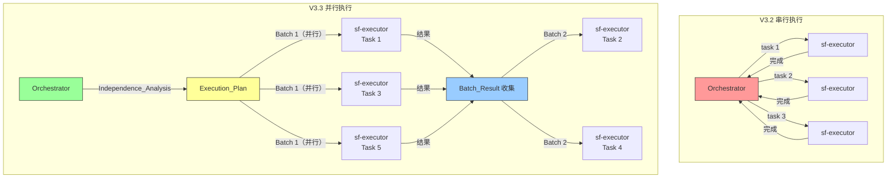
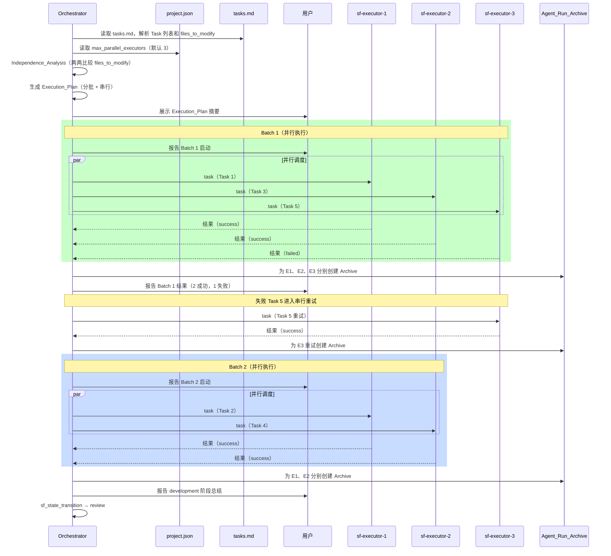
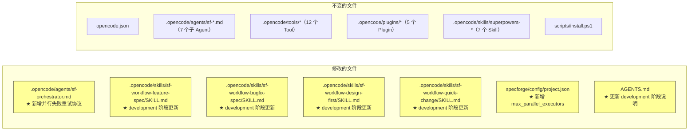

# 设计文档 — SpecForge V3.3（并行任务控制版）

## 概述

本文档是 SpecForge V3.3（并行任务控制版）的设计文档，基于已实现并经过测试验证的 V3.2 系统。V3.2 已完成 Orchestrator Prompt 拆分，系统拥有 12 个 Custom Tool、5 个 Plugin、11 个 Skill（含 4 个 Workflow Skill）、8 个 Agent、424 个单元测试。

V3.3 聚焦于 development 阶段的并行 executor 调度能力。当前 development 阶段采用严格串行执行，对于拥有 N 个独立 task 的工作流，总耗时为 N×(1-2 分钟)。V3.3 通过 Task 独立性分析和 OpenCode 原生并行 `task` 调用能力，将独立 Task 分批并行执行，将总耗时缩短至接近单个 Task 的执行时间。

与 V3.2 类似，V3.3 是一次**纯 Prompt 变更**——仅修改 Markdown 文件（sf-orchestrator.md 路由层 + 4 个 Workflow Skill）和 project.json 配置文件，不涉及任何 TypeScript 代码变更、Custom Tool 变更或 Plugin 变更。

### 设计目标

1. **安全并行**：基于 `files_to_modify` 交集判断 Task 独立性，宁可串行也不冒文件冲突风险
2. **渐进式并行**：默认最大并行数为 3（可配置），降低 OpenCode 高并发 hang 风险
3. **向后兼容**：当所有 Task 有依赖时自动回退到串行执行，行为与 V3.2 完全一致
4. **最小变更**：仅修改 Prompt 文件和配置文件，不新增 Custom Tool
5. **透明可观测**：并行执行的决策过程和结果对用户可见

### 设计决策与理由

| 决策 | 理由 |
|------|------|
| Orchestrator 通过 `readFile` 工具直接读取 `project.json` 获取 `max_parallel_executors` | Orchestrator 已有 `bash: allow` 和文件读取权限，无需新增 Custom Tool；保持"最小变更"原则 |
| Independence_Analysis 在 Orchestrator 的 Prompt 逻辑中完成，不新增工具 | 独立性分析是简单的集合交集判断（比较 `files_to_modify` 列表），Orchestrator 的 LLM 能力完全胜任；新增工具会增加维护成本 |
| 并行调度通过在同一条 assistant 消息中发起多个 `task` 工具调用实现 | 这是 OpenCode 原生支持的并行执行机制，无需额外基础设施 |
| 失败 Task 从并行批次移出后按串行方式重试 | 并行重试会增加复杂度且收益有限（失败 Task 通常需要更多上下文），串行重试与 V3.2 协议一致 |
| `result.json` 新增 `parallel_batch` 和 `parallel_peers` 字段而非创建新的归档格式 | 向后兼容——现有字段全部保留，新字段为可选扩展；串行执行时这两个字段为 `null` |
| 4 个 Workflow Skill 的 development 阶段统一更新为相同的并行调度协议 | 并行调度是通用能力，不应因工作流类型而异；统一协议降低维护成本 |
| Execution_Plan 在内存中生成（Orchestrator 推理过程），不持久化到文件 | Execution_Plan 是一次性的调度决策，执行完成后无需保留；结果已通过 Agent_Run_Archive 的 `parallel_batch`/`parallel_peers` 字段记录 |
| 默认 `max_parallel_executors` 为 3 而非更高 | GitHub issue #18378 报告高并发 hang 风险；3 是保守但安全的默认值，用户可根据环境调高 |

---

## 架构

### V3.3 并行调度架构图



### Development 阶段并行执行时序图



### 文件系统变更总览



---

## 组件与接口

### 变更组件总览

| 类别 | 组件 | 文件路径 | 变更类型 | 关联需求 |
|------|------|----------|----------|----------|
| Agent | sf-orchestrator（路由层） | `.opencode/agents/sf-orchestrator.md` | 修改 | 需求 4、需求 5 |
| Skill | sf-workflow-feature-spec | `.opencode/skills/sf-workflow-feature-spec/SKILL.md` | 修改 | 需求 1、需求 2、需求 3、需求 6 |
| Skill | sf-workflow-bugfix-spec | `.opencode/skills/sf-workflow-bugfix-spec/SKILL.md` | 修改 | 需求 6 |
| Skill | sf-workflow-design-first | `.opencode/skills/sf-workflow-design-first/SKILL.md` | 修改 | 需求 6 |
| Skill | sf-workflow-quick-change | `.opencode/skills/sf-workflow-quick-change/SKILL.md` | 修改 | 需求 6 |
| 配置 | project.json | `specforge/config/project.json` | 修改 | 需求 2 |
| 文档 | AGENTS.md | `AGENTS.md` | 修改 | 需求 7 |

### 不变组件

| 类别 | 组件 | 说明 |
|------|------|------|
| 配置 | opencode.json | 不变——并行调度不需要配置变更 |
| Agent | sf-executor 等 7 个子 Agent | 不变——并行调度对 executor 透明（需求 7.7） |
| Tool | 所有 12 个 Custom Tool | 不变（需求 7.5） |
| Plugin | 所有 5 个 Plugin | 不变（需求 7.5） |
| Skill | 所有 7 个 superpowers-* Skill | 不变 |
| 脚本 | scripts/install.ps1 | 不变——无新增 Skill 目录 |
| 测试 | 所有 424 个单元测试 | 不变——测试对象是 Tool/Plugin 代码，不涉及 prompt |


### 3.1 Workflow Skill — development 阶段并行调度协议（需求 1、2、3、6）

**变更文件：** 4 个 Workflow Skill 的 development 阶段

**变更类型：** 将现有串行执行协议替换为并行调度协议

以下是更新后的 development 阶段执行协议，4 个 Workflow Skill 共用同一套协议（Bugfix 工作流的差异点单独标注）。

#### 更新后的 development 阶段执行步骤

```markdown
### 阶段 N：development（开发执行）

**目标：** 执行 tasks.md 中的每个 task，支持独立 Task 并行执行

**执行步骤：**

#### Step 1：读取 tasks.md 和配置

1. 调用 `sf_state_read` 确认当前状态为 `development`
2. 读取 `specforge/specs/<work_item_id>/tasks.md`，解析每个 Task 的：
   - Task 编号和描述
   - `修改文件`（files_to_modify）列表
   - `依赖` 声明
   - `verification_commands`
3. 读取 `specforge/config/project.json`，获取 `max_parallel_executors` 值（字段不存在时默认为 3）

#### Step 2：Independence_Analysis（独立性分析）

对所有 Task 执行独立性分析：

1. **文件冲突检测**：对所有 Task 两两比较 `修改文件` 列表，如果两个 Task 的列表存在交集（至少一个相同文件路径），标记为 File_Conflict
2. **依赖关系检测**：检查每个 Task 的 `依赖` 字段，如果 Task B 声明依赖 Task A（如"依赖 Task 1"、"在 Task N 完成后执行"），标记 B 依赖 A
3. **独立性判定**：两个 Task 满足 Task_Independence 当且仅当：无 File_Conflict 且无依赖关系

#### Step 3：生成 Execution_Plan

基于 Independence_Analysis 结果生成执行计划：

1. 将所有互相独立的 Task 分组为 Parallel_Batch
2. 每个 Parallel_Batch 内的 Task 数量不超过 `max_parallel_executors`，超过时拆分为多个子批次
3. 存在依赖关系的 Task 按依赖顺序排列为串行 Task
4. 如果所有 Task 之间都存在冲突或依赖，生成全串行的 Execution_Plan（Serial_Fallback）

#### Step 4：向用户展示 Execution_Plan

向用户展示结构化的执行计划摘要：

```
📋 Task 执行计划
━━━━━━━━━━━━━━━━━━━━
总任务数: N
执行模式: 并行（M 个批次）/ 串行
最大并行数: <max_parallel_executors>
━━━━━━━━━━━━━━━━━━━━
批次 1（并行）: Task 1, Task 3, Task 5
批次 2（并行）: Task 2, Task 4
串行: Task 6（原因: 依赖 Task 5 的输出文件 xxx.ts）
━━━━━━━━━━━━━━━━━━━━
```

#### Step 5：按 Execution_Plan 执行

**5a. 并行批次执行：**

对每个 Parallel_Batch：

1. 向用户报告批次启动信息（批次编号、包含的 Task 列表）
2. 为该批次中的每个 Task 生成独立的 run_id（格式 `<work_item_id>-sf-executor-<全局序号>`）
3. 记录每个 Task 的 start_time
4. **在同一条 assistant 消息中**，为该批次的所有 Task 各发起一个 `task` 工具调用，调度独立的 sf-executor 子 Agent，每个调用包含：
   - task 描述、verification_commands、修改文件列表、相关上下文
   - 独立的 run_id 和 archive_path（`specforge/archive/agent_runs/<run_id>/`）
5. 等待该批次所有 executor 返回结果
6. 记录每个 Task 的 end_time
7. 为该批次中的每个 executor 创建 Agent_Run_Archive（见并行 Archive 协议）
8. 向用户报告 Batch_Result 摘要（成功/失败的 Task 列表及耗时）
9. 如果有失败的 Task，将其移出并行批次，进入并行失败重试协议（见路由层）
10. 确认当前批次处理完成后，继续执行下一个 Parallel_Batch

**5b. 串行 Task 执行：**

对每个串行 Task，按 V3.2 的串行协议执行：
1. 生成 run_id，记录 start_time
2. 使用 `task` 工具调度 sf-executor
3. 等待完成，记录 end_time
4. 创建 Agent_Run_Archive
5. 如果失败，进入标准失败重试协议

**5c. Serial_Fallback 模式：**

当 Execution_Plan 为全串行时，按 V3.2 的串行协议逐个执行所有 Task，行为完全不变。

#### Step 6：development 阶段完成

所有 Parallel_Batch 和串行 Task 执行完成且全部成功后：
1. 向用户报告 development 阶段总结（总耗时、并行节省的估算时间、各 Task 最终状态）
2. 调用 `sf_state_transition`（from_state="development"，to_state="review"，evidence="all tasks completed"）

**注意（Bugfix 工作流）：** Bugfix 工作流没有 review 阶段，development 直接进入 verification。
```

#### 各 Workflow Skill 的差异点

| Workflow Skill | 差异 |
|---------------|------|
| sf-workflow-feature-spec | 标准协议，development → review |
| sf-workflow-bugfix-spec | development → verification（无 review），executor 加载 `superpowers-tdd` Skill |
| sf-workflow-design-first | 与 feature-spec 完全一致 |
| sf-workflow-quick-change | 与 feature-spec 一致，但保留升级条件检查（修改文件 > 5 时触发升级建议） |

### 3.2 sf-orchestrator.md 路由层更新（需求 4、需求 5）

**变更文件：** `.opencode/agents/sf-orchestrator.md`

**变更类型：** 修改现有章节，新增并行相关协议

#### 3.2.1 失败重试协议更新

在现有"失败重试协议"章节中，新增"并行失败重试"子章节：

```markdown
## 并行失败重试协议（Parallel Failure Retry）

WHEN 一个 Parallel_Batch 中某个 executor 失败时：

1. **移出并行批次**：将失败 Task 从当前批次移出
2. **串行重试**：按标准失败重试协议对失败 Task 进行串行重试
   - executor 最多 2 次总尝试（首次 + 1 次重试）
   - debugger 最多 1 次介入
   - 超过限制标记 blocked
3. **不阻塞后续批次**：如果当前批次中有成功的 Task 且下一批次的 Task 与这些成功 Task 无依赖，可以继续推进下一批次
4. **重试成功**：标记 Task 为已完成，继续正常流程
5. **重试耗尽**：标记 Task 为 blocked，向用户报告并询问：
   - 用户选择继续 → 跳过 blocked Task，继续执行剩余批次
   - 用户选择停止 → 停止 development 阶段，等待用户指示
```

#### 3.2.2 Agent Run Archive 协议更新

在现有"Agent Run Archive 协议"章节中，新增"并行 Archive 协议"子章节：

```markdown
## 并行 Archive 协议

并行执行时，每个 executor 的归档遵循以下规则：

1. **独立 run_id**：每个并行 executor 使用独立的 run_id，格式 `<work_item_id>-sf-executor-<全局序号>`，序号在整个 Work Item 生命周期内递增
2. **独立 archive_path**：每个 executor 的 archive_path 为 `specforge/archive/agent_runs/<run_id>/`
3. **逐个归档**：Parallel_Batch 完成后，为每个 executor 分别调用 `sf_artifact_write`（file_type="agent_run_result"）和 `sf_artifact_write`（file_type="work_log"）
4. **新增字段**：并行 executor 的 result.json 额外包含：
   - `parallel_batch`：批次编号（如 1、2、3），串行执行时为 null
   - `parallel_peers`：同批次其他 Task 的 run_id 列表，串行执行时为 null
```

### 3.3 project.json 配置更新（需求 2）

**变更文件：** `specforge/config/project.json`

**变更类型：** 新增 `max_parallel_executors` 字段

#### 更新后的 project.json

```json
{
  "name": "specforge",
  "version": "0.5.0",
  "description": "运行在 OpenCode 上的规格驱动 AI 开发控制系统",
  "max_parallel_executors": 3
}
```

#### 字段说明

| 字段 | 类型 | 默认值 | 说明 |
|------|------|--------|------|
| `max_parallel_executors` | number | 3 | 单批次最大并行 executor 数量。设为 1 等同于禁用并行。 |

#### 读取方式

Orchestrator 在 development 阶段 Step 1 中通过 `readFile` 工具读取 `specforge/config/project.json`，解析 JSON 获取 `max_parallel_executors` 值。如果字段不存在，使用默认值 3。

### 3.4 AGENTS.md 文档更新（需求 7、需求 8）

**变更文件：** `AGENTS.md`

**变更类型：** 更新 development 阶段说明，新增并行调度能力描述

#### 更新内容

1. 在"4.2 各阶段说明"表格中，development 阶段的说明更新为包含并行调度能力
2. 在"4.4 失败重试策略"中新增并行失败重试说明
3. 新增"8. 并行任务调度（V3.3 新增）"章节，包含：
   - Independence_Analysis 说明
   - Execution_Plan 生成规则
   - 并行调度协议概述
   - 配置项说明（`max_parallel_executors`）

---

## 数据模型

### 配置变更

#### project.json 新增字段

| 字段路径 | 类型 | 默认值 | 取值范围 | 说明 |
|----------|------|--------|----------|------|
| `max_parallel_executors` | number | 3 | 1-10 | 单批次最大并行 executor 数量 |

### result.json 新增字段

并行执行时，每个 executor 的 `result.json` 在现有字段基础上新增：

| 字段 | 类型 | 串行时的值 | 并行时的值 | 说明 |
|------|------|-----------|-----------|------|
| `parallel_batch` | number \| null | null | 批次编号（1, 2, 3...） | 标识该 executor 属于哪个并行批次 |
| `parallel_peers` | string[] \| null | null | 同批次其他 run_id 列表 | 便于事后关联分析同批次执行情况 |

#### 完整 result.json 结构（V3.3）

```json
{
  "run_id": "WI-001-sf-executor-2",
  "work_item_id": "WI-001",
  "agent_name": "sf-executor",
  "start_time": "2025-01-15T10:30:00Z",
  "end_time": "2025-01-15T10:31:30Z",
  "duration_ms": 90000,
  "status": "success",
  "task_description": "Task 3: 创建并行调度协议",
  "retry_count": 0,
  "cost_summary": { "total_tokens": 15000, "total_cost_usd": 0.045 },
  "compaction_occurred": false,
  "conversation_recorded": true,
  "parallel_batch": 1,
  "parallel_peers": ["WI-001-sf-executor-1", "WI-001-sf-executor-3"]
}
```

### tasks.md 格式要求

V3.3 不改变 tasks.md 的格式，但对 Independence_Analysis 依赖的字段有明确要求：

| 字段 | 格式 | 用途 |
|------|------|------|
| `修改文件` | 文件路径列表（每行一个或逗号分隔） | Independence_Analysis 的 File_Conflict 检测输入 |
| `依赖` | "无" 或 "Task N" 格式 | Independence_Analysis 的依赖关系检测输入 |

#### Independence_Analysis 算法

```
输入：Task 列表 T = [T1, T2, ..., Tn]
输出：Execution_Plan（Parallel_Batch 列表 + 串行 Task 列表）

1. 构建冲突图 G：
   - 节点 = 所有 Task
   - 边 = File_Conflict 或依赖关系
   - 对每对 (Ti, Tj)：
     - 如果 Ti.files_to_modify ∩ Tj.files_to_modify ≠ ∅ → 添加边
     - 如果 Ti 依赖 Tj 或 Tj 依赖 Ti → 添加有向边

2. 拓扑排序（处理依赖关系）：
   - 按依赖关系对 Task 进行拓扑排序
   - 同一拓扑层级内的 Task 是并行候选

3. 在每个拓扑层级内，按冲突图分组：
   - 同一组内的 Task 两两无 File_Conflict
   - 每组即为一个 Parallel_Batch

4. 按 max_parallel_executors 拆分：
   - 如果某个 Parallel_Batch 的 Task 数 > max_parallel_executors
   - 将其拆分为多个子批次，每个子批次 ≤ max_parallel_executors

5. 如果所有 Task 都在同一组（全部互相冲突或依赖）→ Serial_Fallback
```

### Execution_Plan 数据结构（概念模型）

Execution_Plan 不持久化，仅在 Orchestrator 推理过程中使用：

```
Execution_Plan = {
  mode: "parallel" | "serial",
  total_tasks: number,
  batches: [
    {
      batch_id: 1,
      type: "parallel",
      tasks: [Task 1, Task 3, Task 5]
    },
    {
      batch_id: 2,
      type: "parallel",
      tasks: [Task 2, Task 4]
    },
    {
      batch_id: 3,
      type: "serial",
      tasks: [Task 6],
      reason: "依赖 Task 5 的输出文件 xxx.ts"
    }
  ]
}
```

### 文件系统变更总览

#### 修改文件

| 文件路径 | 变更说明 |
|----------|----------|
| `.opencode/agents/sf-orchestrator.md` | 失败重试协议新增并行重试子章节，Archive 协议新增并行 Archive 子章节 |
| `.opencode/skills/sf-workflow-feature-spec/SKILL.md` | development 阶段替换为并行调度协议 |
| `.opencode/skills/sf-workflow-bugfix-spec/SKILL.md` | development 阶段替换为并行调度协议 |
| `.opencode/skills/sf-workflow-design-first/SKILL.md` | development 阶段替换为并行调度协议 |
| `.opencode/skills/sf-workflow-quick-change/SKILL.md` | development 阶段替换为并行调度协议 |
| `specforge/config/project.json` | 新增 `max_parallel_executors` 字段 |
| `AGENTS.md` | 更新 development 阶段说明，新增并行调度章节 |

#### 不变文件

| 文件路径 | 说明 |
|----------|------|
| `opencode.json` | 不变（需求 7.6） |
| `.opencode/agents/sf-requirements.md` 等 7 个子 Agent | 不变（需求 7.4） |
| `.opencode/tools/*.ts`（12 个） | 不变（需求 7.5） |
| `.opencode/plugins/*.ts`（5 个） | 不变（需求 7.5） |
| `.opencode/skills/superpowers-*`（7 个） | 不变 |
| `scripts/install.ps1` | 不变——无新增 Skill 目录 |
| `specforge/runtime/state.json` | 不变——状态机定义不受影响 |

---

## 正确性属性

**本节不适用。**

V3.3 是纯 Prompt 变更项目，所有变更都是 Markdown 文件的修改和 JSON 配置文件的字段新增，不涉及任何 TypeScript 代码变更。因此：

- 没有可以进行属性测试的纯函数或数据转换逻辑
- 没有可以进行 round-trip 测试的序列化/反序列化操作
- 没有可以进行不变量测试的算法或业务逻辑
- Independence_Analysis 是 Orchestrator LLM 的推理过程，不是可执行的代码函数

正确性验证通过以下方式保障：
1. **回归测试**：确保 424 个现有单元测试继续通过
2. **结构验证**：检查修改后的文件结构是否符合规范
3. **内容完整性验证**：对比修改前后的内容，确保无遗漏
4. **集成测试**：运行实际工作流，验证并行调度行为正确

---

## 错误处理

### 并行执行错误场景

| 场景 | 处理方式 | 关联需求 |
|------|----------|----------|
| 单个 executor 失败 | 移出并行批次，按串行方式进入失败重试协议（executor 2 次 + debugger 1 次） | 需求 4.1、4.2 |
| 批次内多个 executor 失败 | 每个失败 Task 独立进入失败重试协议，互不影响 | 需求 4.1 |
| 批次内所有 executor 失败 | 所有 Task 逐个进入失败重试协议 | 需求 4.1 |
| 失败 Task 重试耗尽 | 标记 blocked，向用户报告，询问是否继续剩余 Task | 需求 4.5、4.6、4.7 |
| 用户选择停止 | 停止 development 阶段，保持当前状态，等待用户指示 | 需求 4.7 |

### 配置读取错误场景

| 场景 | 处理方式 | 关联需求 |
|------|----------|----------|
| `project.json` 不存在 | 使用默认值 `max_parallel_executors = 3` | 需求 2.2 |
| `max_parallel_executors` 字段不存在 | 使用默认值 3 | 需求 2.2 |
| `max_parallel_executors` 值为非正整数 | 使用默认值 3，向用户报告配置异常 | — |
| `max_parallel_executors` 值为 1 | 等同于禁用并行，所有 Task 串行执行 | — |

### Independence_Analysis 错误场景

| 场景 | 处理方式 | 关联需求 |
|------|----------|----------|
| tasks.md 中某个 Task 缺少 `修改文件` 字段 | 将该 Task 视为与所有其他 Task 冲突（保守策略），强制串行执行 | 需求 1.1 |
| tasks.md 解析失败 | 回退到全串行执行（Serial_Fallback） | 需求 7.1 |
| 依赖关系存在循环 | 向用户报告循环依赖，回退到全串行执行 | — |

### OpenCode 平台错误场景

| 场景 | 处理方式 | 关联需求 |
|------|----------|----------|
| 并行 `task` 调用 hang（GitHub issue #18378） | `max_parallel_executors` 限制降低风险；如果检测到超时，向用户报告并建议降低并行数 | 需求 2.2 |
| 并行 executor 的 Session 创建失败 | 将该 Task 视为失败，进入失败重试协议 | 需求 4.1 |

---

## 测试策略

### 测试方法论

V3.3 是纯 Prompt 变更，不涉及 TypeScript 代码变更。因此测试策略与 V3.2 类似：

- **不需要属性测试（PBT）**：没有可测试的纯函数
- **不需要新增单元测试**：现有 424 个单元测试覆盖的是 Tool/Plugin 代码，不受 prompt 变更影响
- **核心验证方式**：回归测试 + 结构检查 + 集成测试

### 测试层次

#### 第 1 层：回归测试（自动化）

**目标：** 确保现有 424 个单元测试全部通过

**方法：**
```bash
bun test
```

**预期结果：** 424 个测试全部通过，0 个失败。证明 Tool/Plugin 代码未受 prompt 变更影响。

**关联需求：** 需求 7.3

#### 第 2 层：结构验证（手动检查）

**目标：** 验证所有修改文件的结构正确

**检查项：**

| 检查项 | 验证方法 | 关联需求 |
|--------|----------|----------|
| sf-orchestrator.md 包含并行失败重试协议 | grep "并行失败重试" | 需求 4 |
| sf-orchestrator.md 包含并行 Archive 协议 | grep "并行 Archive" | 需求 5 |
| 4 个 Workflow Skill 的 development 阶段包含 Independence_Analysis | grep "Independence_Analysis" | 需求 1、6 |
| 4 个 Workflow Skill 的 development 阶段包含 Execution_Plan | grep "Execution_Plan" | 需求 1、6 |
| project.json 包含 max_parallel_executors 字段 | JSON 解析验证 | 需求 2 |
| AGENTS.md 包含并行调度说明 | grep "并行" | 需求 7、8 |

#### 第 3 层：内容完整性验证（手动对比）

**目标：** 确保修改后的内容完整且正确

**方法：**

1. **Workflow Skill 对比**：确认 4 个 Skill 的 development 阶段以外的所有阶段未被修改
2. **路由层对比**：确认 sf-orchestrator.md 中除失败重试协议和 Archive 协议外的其他章节未被修改
3. **配置对比**：确认 project.json 中现有字段（name、version、description）未被修改

#### 第 4 层：集成测试（手动执行）

**目标：** 验证并行调度端到端行为正确

**测试场景：**

| 测试场景 | 工作流 | 验证要点 |
|----------|--------|----------|
| 全部 Task 独立（可并行） | feature_spec | Independence_Analysis 正确识别独立 Task，并行调度执行，结果正确收集 |
| 全部 Task 有依赖（全串行） | feature_spec | Serial_Fallback 生效，行为与 V3.2 完全一致 |
| 部分 Task 独立、部分有依赖 | feature_spec | 混合执行计划正确生成，并行和串行交替执行 |
| 并行批次中部分失败 | feature_spec | 失败 Task 正确进入串行重试，成功 Task 不受影响 |
| max_parallel_executors = 1 | feature_spec | 等同于全串行，行为与 V3.2 一致 |
| project.json 无 max_parallel_executors | feature_spec | 使用默认值 3 |
| Bugfix 工作流并行 | bugfix_spec | 并行调度正确，development 后直接进入 verification |
| Quick Change 工作流并行 | quick_change | 并行调度正确，升级条件检查仍然生效 |
| Execution_Plan 展示 | 任意 | 用户能看到结构化的执行计划摘要 |
| Batch_Result 报告 | 任意 | 每个批次完成后用户能看到结果摘要 |

#### 第 5 层：兼容性验证（手动检查）

**目标：** 确保不变组件确实未被修改

**检查项：**

| 检查项 | 验证方法 | 关联需求 |
|--------|----------|----------|
| opencode.json 未修改 | git diff | 需求 7.6 |
| 7 个子 Agent prompt 未修改 | git diff | 需求 7.4 |
| 12 个 Tool + 5 个 Plugin 未修改 | git diff | 需求 7.5 |
| 7 个 superpowers-* Skill 未修改 | git diff | — |
| sf-executor 契约未变 | 对比 sf-executor.md 的 Required Output 格式 | 需求 7.7 |

### 测试执行顺序

1. 先执行第 1 层（回归测试），确保基线通过
2. 执行第 2 层（结构验证），确保文件结构正确
3. 执行第 3 层（内容对比），确保无遗漏和误改
4. 执行第 5 层（兼容性验证），确保不变组件未被修改
5. 最后执行第 4 层（集成测试），验证端到端行为
