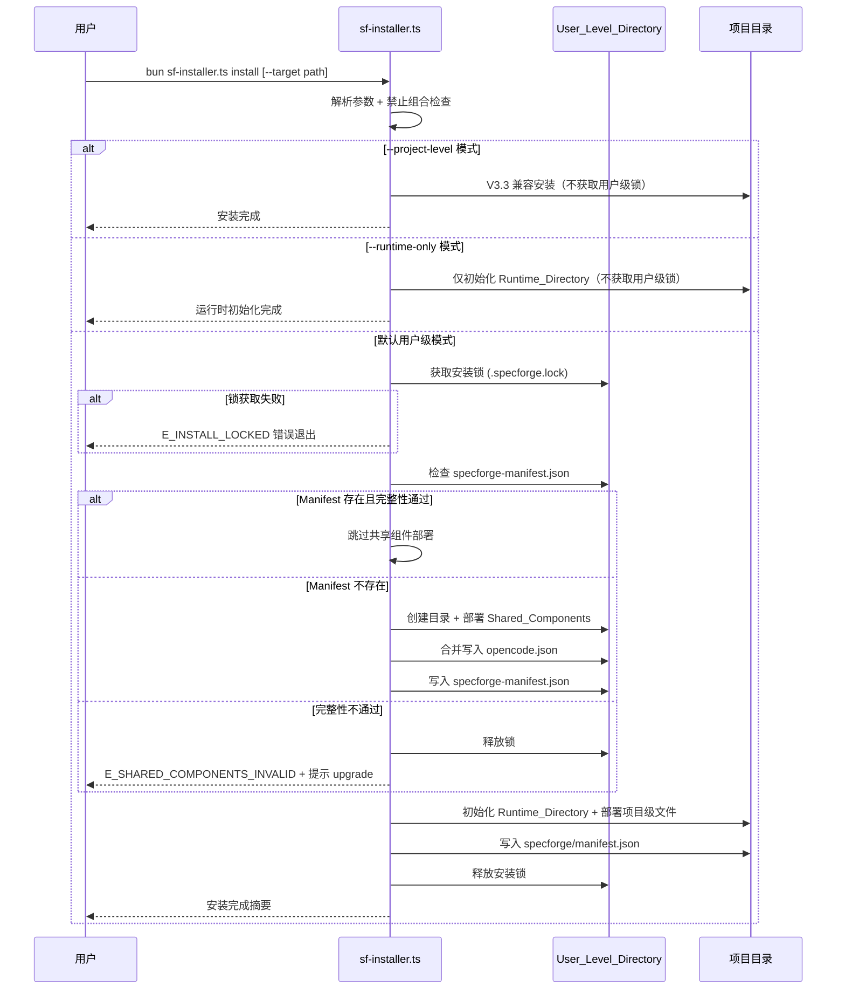
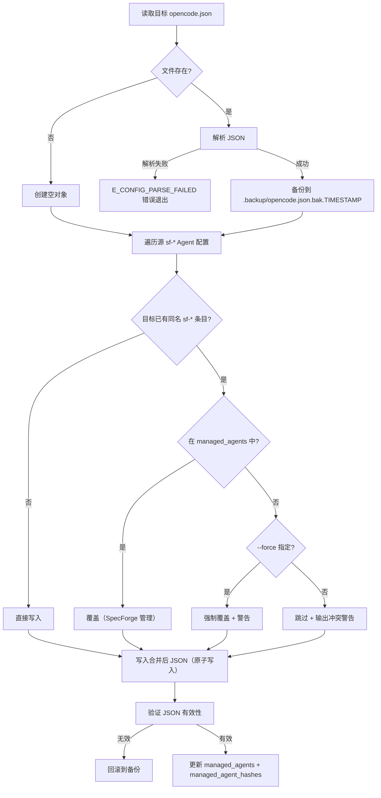
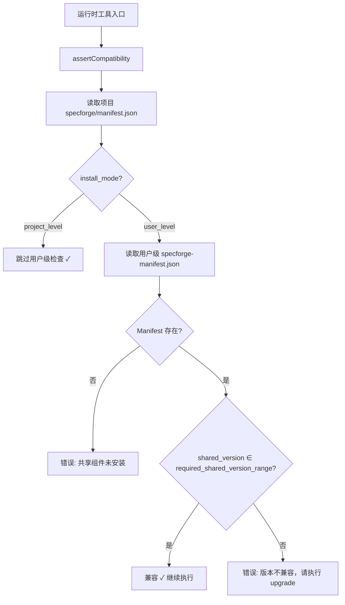

# 设计文档 — SpecForge V3.4.0（用户级安装与迁移基础版）

## 概述

本文档是 SpecForge V3.4.0 的技术设计文档，基于已通过评审的 V3.4.0 需求文档（12 个需求）。V3.4.0 将共享组件（Agent、Tool、Skill、Plugin）从项目级 `.opencode/` 迁移到用户级目录 `~/.config/opencode/`，实现一次安装、全局共享。项目级仅保留运行时数据目录 `specforge/`。

### 设计目标

1. **共享优先**：共享组件一次安装到用户级目录，所有项目自动共享
2. **运行时隔离**：每个项目的运行时数据（状态、会话、归档、日志）完全隔离在项目本地
3. **向后兼容**：`--project-level` 兼容模式保持 V3.3 行为不变，689 个现有测试继续通过
4. **Manifest 驱动**：所有文件管理基于 Manifest/File_Registry，不依赖 sf-* 前缀删除
5. **原子写入与备份**：关键配置文件写入前备份，写入失败可回滚
6. **并发安全**：安装锁串行化多项目并发写操作，复用 V5.0 知识库文件锁模式
7. **零外部依赖**：SpecForge Tool/Plugin 无外部运行时 npm 依赖，仅依赖 Bun 内置 API

### 设计决策与理由

| 决策 | 理由 |
|------|------|
| 安装锁复用 V5.0 知识库文件锁**模式**（PID + 超时 + 崩溃恢复），重新实现 | 已验证的并发安全模式；但语义不同（V5.0 锁失败返回 false 不阻塞，安装锁失败抛错阻塞），因此重新实现而非直接复用代码 |
| opencode.json 局部校验（managed_agent_hashes）而非整文件 SHA-256 | opencode.json 为混合所有权文件，用户修改非 sf-* 配置不应触发校验失败 |
| 规范化 JSON 字符串计算哈希（键名递归排序 + 无多余空白） | 确保不同环境下相同配置产生相同哈希，消除格式差异导致的误报 |
| managed_agent_hashes 校验输出分级（error/warning/ignore） | 区分严重问题（缺失/字段不完整）和轻微偏差（用户微调），避免过度告警 |
| `install --runtime-only` 不获取用户级安装锁 | 该模式不写 User_Level_Directory，无需锁保护；允许在共享组件损坏时急救项目运行时 |
| 锁文件 JSON 损坏时按过期/异常锁处理 | 鲁棒性优先；损坏的锁文件不应永久阻塞安装操作 |
| Manifest schema_version 独立于 shared_version | 允许 Manifest 结构独立演进，不与功能版本耦合 |
| File_Registry 硬编码在安装器中而非外部配置文件 | 安装器是单一可执行入口，避免引入额外配置文件依赖 |
| assertCompatibility() 在运行时工具入口调用 | 尽早发现版本不兼容，避免运行到一半才失败 |
| 备份文件带时间戳存放在 .backup/ 子目录 | 避免多次安装互相覆盖备份；集中管理便于清理 |

### 外部依赖声明

**SpecForge Tool/Plugin 无外部运行时 npm 依赖。** 所有功能仅依赖：
- Bun 内置 API（`node:fs`、`node:fs/promises`、`node:path`、`node:crypto`、`node:os`）
- Bun 运行时（`Bun.spawnSync`）

安装器本身同样无外部依赖，仅使用 Node.js/Bun 标准库。`package.json` 中的 `devDependencies` 仅用于测试框架（bun:test），不影响运行时。

---

## 架构

### V3.4.0 安装架构总览

```mermaid
graph TB
    subgraph "用户级目录 (~/.config/opencode/)"
        UOC["opencode.json<br/>（混合所有权）"]
        UA["agents/<br/>（9 个 sf-* Agent）"]
        UT["tools/ + tools/lib/<br/>（16+18 个 Tool 文件）"]
        US["skills/<br/>（12 个 Skill 目录）"]
        UP["plugins/<br/>（5 个 Plugin）"]
        UM["specforge-manifest.json<br/>（用户级 Manifest）"]
        UL[".specforge.lock<br/>（安装锁）"]
        UB[".backup/<br/>（备份目录）"]
    end

    subgraph "项目目录"
        PA["AGENTS.md"]
        PC["specforge/agents/<br/>（AGENT_CONSTITUTION + contracts）"]
        PR["specforge/runtime/<br/>（state.json, events.jsonl, checkpoints/）"]
        PS["specforge/sessions/"]
        PAR["specforge/archive/"]
        PK["specforge/knowledge/"]
        PL["specforge/logs/"]
        PCF["specforge/config/<br/>（project.json, risk_policy.json, skill_fragments.json）"]
        PM["specforge/manifest.json<br/>（项目级 Manifest）"]
    end

    subgraph "安装器 CLI"
        INS["sf-installer.ts"]
    end

    INS -->|"install/upgrade"| UOC & UA & UT & US & UP & UM
    INS -->|"install"| PA & PC & PR & PS & PAR & PK & PL & PCF & PM
    INS -->|"获取/释放"| UL
    INS -->|"备份"| UB

    style UL fill:#f96,stroke:#333
    style UM fill:#9cf,stroke:#333
    style PM fill:#9cf,stroke:#333
    style UB fill:#ccc,stroke:#333
```



### install 命令流程



### opencode.json 合并写入流程



### 版本兼容性检查流程



---

## 组件与接口

### 变更组件总览

| 类别 | 组件 | 文件路径 | 变更类型 | 关联需求 |
|------|------|----------|----------|----------|
| 安装器 | sf-installer.ts | `scripts/sf-installer.ts` | 重构 | 需求 1-12 |
| 工具 | sf_doctor | `.opencode/tools/lib/sf_doctor_core.ts` | 修改 | 需求 10 |
| 工具 | sf_state_read | `.opencode/tools/lib/sf_state_read_core.ts` | 修改（+assertCompatibility） | 需求 6 |
| 工具 | sf_state_transition | `.opencode/tools/lib/sf_state_transition_core.ts` | 修改（+assertCompatibility） | 需求 6 |
| 工具 | 4 个 Gate 工具 | `.opencode/tools/lib/sf_*_gate_core.ts` | 修改（+assertCompatibility） | 需求 6 |
| 工具 | sf_knowledge_graph | `.opencode/tools/lib/sf_knowledge_graph_core.ts` | 修改（+assertCompatibility） | 需求 6 |
| 工具 | sf_knowledge_query | `.opencode/tools/lib/sf_knowledge_query_core.ts` | 修改（+assertCompatibility） | 需求 6 |
| 工具 | sf_context_build | `.opencode/tools/lib/sf_context_build_core.ts` | 修改（+assertCompatibility） | 需求 6 |

### 不变组件

| 类别 | 组件 | 说明 |
|------|------|------|
| Agent | 9 个 Agent prompt 文件 | 内容不变，仅部署位置变化 |
| Tool | 16 个 Custom Tool wrapper | 仅在 core 层添加 assertCompatibility() |
| Plugin | 5 个 Plugin | 不做任何修改 |
| Skill | 12 个 Skill | 不做任何修改 |

---

## 核心类型定义

### 错误码枚举

```typescript
// ============================================================
// 错误码枚举（V3.4.0 新增）
// ============================================================

export enum InstallerErrorCode {
  /** 文件/目录权限不足（EACCES/EPERM） */
  E_PERMISSION_DENIED = "E_PERMISSION_DENIED",
  /** 磁盘空间不足（ENOSPC） */
  E_DISK_FULL = "E_DISK_FULL",
  /** opencode.json / manifest.json 等配置文件 JSON 解析失败 */
  E_CONFIG_PARSE_FAILED = "E_CONFIG_PARSE_FAILED",
  /** Manifest schema_version 不受当前安装器支持（需要升级安装器） */
  E_MANIFEST_SCHEMA_UNSUPPORTED = "E_MANIFEST_SCHEMA_UNSUPPORTED",
  /** 安装锁被其他进程持有且未超时 */
  E_INSTALL_LOCKED = "E_INSTALL_LOCKED",
  /** 文件 SHA-256 校验和不匹配 */
  E_CHECKSUM_MISMATCH = "E_CHECKSUM_MISMATCH",
  /** 共享组件完整性检查失败（缺失文件/版本不匹配/校验和不一致） */
  E_SHARED_COMPONENTS_INVALID = "E_SHARED_COMPONENTS_INVALID",
}

export class InstallerError extends Error {
  constructor(
    public readonly code: InstallerErrorCode,
    message: string,
    public readonly details?: Record<string, unknown>
  ) {
    super(`[${code}] ${message}`)
    this.name = "InstallerError"
  }
}

/**
 * 错误码到退出码映射
 */
export const EXIT_CODES: Record<InstallerErrorCode, number> = {
  E_PERMISSION_DENIED: 10,
  E_DISK_FULL: 11,
  E_CONFIG_PARSE_FAILED: 12,
  E_MANIFEST_SCHEMA_UNSUPPORTED: 13,
  E_INSTALL_LOCKED: 14,
  E_CHECKSUM_MISMATCH: 15,
  E_SHARED_COMPONENTS_INVALID: 16,
}
```

### Manifest 数据结构

```typescript
// ============================================================
// 用户级 Manifest（{User_Level_Directory}/specforge-manifest.json）
// ============================================================

export interface UserLevelManifest {
  /** Manifest 结构版本，当前 "1.0" */
  schema_version: "1.0"
  /** SpecForge 共享组件版本（semver，如 "3.4.0"） */
  shared_version: string
  /** 安装模式标识 */
  install_mode: "user_level"
  /** 首次安装时间 */
  installed_at: string  // ISO8601
  /** 最近更新时间 */
  updated_at: string    // ISO8601
  /** SpecForge 管理的 Agent 名称列表 */
  managed_agents: string[]
  /** 每个 Agent 配置片段的 SHA-256 哈希（规范化 JSON） */
  managed_agent_hashes: Record<string, string>
  /** 已部署文件的校验和与大小（路径为 POSIX 风格相对路径） */
  files: Record<string, FileEntry>
}

export interface FileEntry {
  sha256: string
  size: number
}

// ============================================================
// 项目级 Manifest（specforge/manifest.json）
// ============================================================

export interface ProjectLevelManifest {
  /** Manifest 结构版本，当前 "1.0" */
  schema_version: "1.0"
  /** 运行时数据 schema 版本 */
  runtime_schema_version: "1.0"
  /** 安装模式：user_level 或 project_level */
  install_mode: "user_level" | "project_level"
  /** 要求的共享组件版本范围（semver range，如 ">=3.4.0 <4.0.0"） */
  required_shared_version_range: string
  /** 项目运行时初始化时间 */
  initialized_at: string  // ISO8601
  /** 最近更新时间 */
  updated_at: string      // ISO8601
  /** 项目级文件的校验和与大小 */
  project_files: Record<string, FileEntry>
}

// ============================================================
// V3.3 兼容 Manifest（project_level 模式下的旧格式）
// ============================================================

export interface LegacyManifest {
  version: string
  installed_at: string
  source_dir: string
  files: Record<string, string>  // path → sha256
}

/** 支持的 schema_version 列表 */
export const SUPPORTED_SCHEMA_VERSIONS = ["1.0"] as const
```

### File_Registry 数据结构

```typescript
// ============================================================
// File_Registry — 双注册表（需求 8）
// ============================================================

/**
 * 用户级注册表：部署到 User_Level_Directory 的文件
 * 路径为相对于 User_Level_Directory 的 POSIX 风格路径
 *
 * 注意：opencode.json 不纳入此注册表（混合所有权文件，
 * 由 managed_agent_hashes 机制单独管理）
 */
export const USER_LEVEL_REGISTRY: string[] = [
  // Agent 定义（9 个）
  "agents/sf-orchestrator.md",
  "agents/sf-requirements.md",
  "agents/sf-design.md",
  "agents/sf-task-planner.md",
  "agents/sf-executor.md",
  "agents/sf-debugger.md",
  "agents/sf-reviewer.md",
  "agents/sf-verifier.md",
  "agents/sf-knowledge.md",

  // Custom Tools（16 个）
  "tools/sf_artifact_write.ts",
  "tools/sf_batch_verify.ts",
  "tools/sf_context_build.ts",
  "tools/sf_cost_report.ts",
  "tools/sf_design_gate.ts",
  "tools/sf_doc_lint.ts",
  "tools/sf_doctor.ts",
  "tools/sf_knowledge_base.ts",
  "tools/sf_knowledge_graph.ts",
  "tools/sf_knowledge_query.ts",
  "tools/sf_requirements_gate.ts",
  "tools/sf_state_read.ts",
  "tools/sf_state_transition.ts",
  "tools/sf_tasks_gate.ts",
  "tools/sf_trace_matrix.ts",
  "tools/sf_verification_gate.ts",

  // Tool 核心库（18 个）
  "tools/lib/sf_artifact_write_core.ts",
  "tools/lib/sf_batch_verify_core.ts",
  "tools/lib/sf_context_build_core.ts",
  "tools/lib/sf_conversation_recorder_core.ts",
  "tools/lib/sf_cost_report_core.ts",
  "tools/lib/sf_design_gate_core.ts",
  "tools/lib/sf_doc_lint_core.ts",
  "tools/lib/sf_knowledge_base_core.ts",
  "tools/lib/sf_knowledge_graph_core.ts",
  "tools/lib/sf_knowledge_query_core.ts",
  "tools/lib/sf_requirements_gate_core.ts",
  "tools/lib/sf_state_read_core.ts",
  "tools/lib/sf_state_transition_core.ts",
  "tools/lib/sf_tasks_gate_core.ts",
  "tools/lib/sf_trace_matrix_core.ts",
  "tools/lib/sf_verification_gate_core.ts",
  "tools/lib/state_machine.ts",
  "tools/lib/utils.ts",

  // Plugins（5 个）
  "plugins/sf_checkpoint.ts",
  "plugins/sf_cost_tracker.ts",
  "plugins/sf_event_logger.ts",
  "plugins/sf_permission_guard.ts",
  "plugins/sf_session_recorder.ts",

  // Skills（12 个目录的 SKILL.md）
  "skills/sf-workflow-feature-spec/SKILL.md",
  "skills/sf-workflow-bugfix-spec/SKILL.md",
  "skills/sf-workflow-design-first/SKILL.md",
  "skills/sf-workflow-quick-change/SKILL.md",
  "skills/superpowers-brainstorming/SKILL.md",
  "skills/superpowers-code-review/SKILL.md",
  "skills/superpowers-knowledge-extraction/SKILL.md",
  "skills/superpowers-subagent-driven-development/SKILL.md",
  "skills/superpowers-systematic-debugging/SKILL.md",
  "skills/superpowers-tdd/SKILL.md",
  "skills/superpowers-verification-before-completion/SKILL.md",
  "skills/superpowers-writing-plans/SKILL.md",
]

/**
 * 项目级注册表：部署到项目目录的文件
 * 路径为相对于项目根目录的 POSIX 风格路径
 */
export const PROJECT_LEVEL_REGISTRY: string[] = [
  // 项目文档
  "AGENTS.md",
  "specforge/agents/AGENT_CONSTITUTION.md",
  "specforge/agents/contracts/sf-orchestrator.contract.md",
  "specforge/agents/contracts/sf-requirements.contract.md",
  "specforge/agents/contracts/sf-design.contract.md",
  "specforge/agents/contracts/sf-executor.contract.md",
  "specforge/agents/contracts/sf-task-planner.contract.md",
  "specforge/agents/contracts/sf-debugger.contract.md",
  "specforge/agents/contracts/sf-reviewer.contract.md",
  "specforge/agents/contracts/sf-verifier.contract.md",

  // 项目配置
  "specforge/config/project.json",
  "specforge/config/risk_policy.json",
  "specforge/config/skill_fragments.json",

  // 运行时初始文件
  "specforge/runtime/state.json",
  "specforge/runtime/events.jsonl",
]

/**
 * 运行时数据目录（install 时创建，verify 时检查存在性）
 */
export const RUNTIME_DIRECTORIES: string[] = [
  "specforge/runtime/checkpoints",
  "specforge/sessions",
  "specforge/archive/agent_runs",
  "specforge/specs",
  "specforge/knowledge",
  "specforge/logs",
]
```

### CLI 参数类型

```typescript
// ============================================================
// CLI 参数解析（需求 2 扩展）
// ============================================================

export interface CLIOptions {
  subcommand: "install" | "upgrade" | "uninstall" | "verify" | null
  /** 项目目标路径（--target） */
  target: string
  /** 强制覆盖（--force） */
  force: boolean
  /** 卸载时清除运行时数据（--purge） */
  purge: boolean
  /** 仅模拟不执行（--dry-run） */
  dryRun: boolean
  /** 跳过 bun install（--skip-deps） */
  skipDeps: boolean
  /** 显示版本（--version） */
  showVersion: boolean
  /** 启用知识库（--enable-knowledge） */
  enableKnowledge: boolean
  /** ★ V3.4.0 新增：项目级兼容模式（--project-level） */
  projectLevel: boolean
  /** ★ V3.4.0 新增：仅初始化运行时（--runtime-only） */
  runtimeOnly: boolean
}

/**
 * 禁止的参数组合
 */
export const FORBIDDEN_COMBINATIONS: Array<{
  flags: string[]
  message: string
}> = [
  {
    flags: ["projectLevel", "runtimeOnly"],
    message: "--project-level 和 --runtime-only 不能同时使用",
  },
  // 注：--project-level --global 等组合在需求中提到但 --global 不是 V3.4.0 参数
]
```

---

## 核心算法与实现

### 5.1 User_Level_Directory 路径解析（需求 1, 9）

```typescript
import { homedir } from "node:os"
import { resolve, normalize, join } from "node:path"

/**
 * 解析 User_Level_Directory 路径
 * 优先级：
 *   (a) OPENCODE_CONFIG_DIR 环境变量（OpenCode 原生支持）
 *   (b) 平台默认全局目录
 *       - Linux/macOS: ~/.config/opencode/
 *       - Windows: %APPDATA%/opencode/
 *   (c) 不读取 config.json 或 configDir 字段
 *
 * 所有路径通过 path.resolve() / path.normalize() 归一化
 */
export function resolveUserLevelDirectory(): string {
  // (a) 环境变量覆盖
  const envDir = process.env.OPENCODE_CONFIG_DIR
  if (envDir) {
    return resolve(normalize(envDir))
  }

  // (b) 平台默认
  if (process.platform === "win32") {
    const appData = process.env.APPDATA
    if (appData) {
      return resolve(normalize(join(appData, "opencode")))
    }
    // fallback: Windows 无 APPDATA 时
    return resolve(normalize(join(homedir(), "AppData", "Roaming", "opencode")))
  }

  // Linux / macOS
  return resolve(normalize(join(homedir(), ".config", "opencode")))
}

/**
 * 将 POSIX 风格路径转换为平台路径（用于 Manifest 中记录的路径）
 */
export function posixToNative(posixPath: string): string {
  if (process.platform === "win32") {
    return posixPath.replace(/\//g, "\\")
  }
  return posixPath
}

/**
 * 将平台路径转换为 POSIX 风格（用于写入 Manifest）
 */
export function nativeToPosix(nativePath: string): string {
  return nativePath.replace(/\\/g, "/")
}
```

### 5.2 安装锁实现（需求 12）

复用 V5.0 知识库文件锁模式，增强以下三个审核注意点：
1. `install --runtime-only` 不获取锁
2. 锁文件 JSON 损坏时按过期/异常锁处理
3. 锁超时从 30 秒改为 10 分钟（安装操作耗时更长）

```typescript
import { writeFile, readFile, unlink, mkdir } from "node:fs/promises"
import { join, dirname } from "node:path"
import { hostname } from "node:os"

// ============================================================
// 安装锁（需求 12）
// ============================================================

export interface InstallLockInfo {
  /** 持有锁的进程 PID */
  pid: number
  /** 执行的命令 */
  command: "install" | "upgrade"
  /** 锁获取时间 */
  acquired_at: string  // ISO8601
  /** 主机名（辅助诊断） */
  hostname: string
}

/** 锁超时：10 分钟（安装操作可能较慢） */
const INSTALL_LOCK_TIMEOUT_MS = 10 * 60 * 1000

/** 最大等待时间：30 秒（每 1 秒重试） */
const INSTALL_LOCK_MAX_WAIT_MS = 30_000
const INSTALL_LOCK_RETRY_INTERVAL_MS = 1_000

/**
 * 获取安装锁
 *
 * 行为：
 * - 锁文件不存在 → 原子创建（flag: "wx"）
 * - 锁文件存在且 JSON 损坏 → 输出 warning，按过期锁处理，尝试原子接管
 * - 锁文件存在且 PID 不存活 → 清除过期锁，重新获取
 * - 锁文件存在且 acquired_at 超过 10 分钟 → 强制接管
 * - 锁文件存在且 PID 存活且未超时 → 等待重试（最多 30 秒）
 * - 超时仍未获取 → 返回 E_INSTALL_LOCKED 错误
 *
 * 注意：install --runtime-only 和 install --project-level 不调用此函数
 */
export async function acquireInstallLock(
  userLevelDir: string,
  command: "install" | "upgrade"
): Promise<void> {
  const lockPath = join(userLevelDir, ".specforge.lock")
  const startTime = Date.now()

  while (Date.now() - startTime < INSTALL_LOCK_MAX_WAIT_MS) {
    // Step 1: 检查现有锁
    let existingLock: InstallLockInfo | null = null
    try {
      const content = await readFile(lockPath, "utf-8")
      try {
        existingLock = JSON.parse(content) as InstallLockInfo
        // ★ 字段合法性校验：pid 非 number 或 acquired_at 非合法时间也按异常锁处理
        if (
          typeof existingLock.pid !== "number" ||
          !existingLock.acquired_at ||
          isNaN(new Date(existingLock.acquired_at).getTime())
        ) {
          console.warn(
            `  ⚠️ 安装锁文件字段非法（pid/acquired_at 无效），按异常锁处理，尝试接管`
          )
          await unlink(lockPath).catch(() => {})
          existingLock = null
        }
      } catch {
        // ★ 审核注意点 3：锁文件 JSON 损坏 → 按过期/异常锁处理
        console.warn(
          `  ⚠️ 安装锁文件 JSON 损坏，按异常锁处理，尝试接管`
        )
        await unlink(lockPath).catch(() => {})
        // 继续尝试获取
        existingLock = null
      }
    } catch {
      // 锁文件不存在，可以获取
      existingLock = null
    }

    if (existingLock) {
      // 检查 PID 是否存活
      let pidAlive = false
      try {
        process.kill(existingLock.pid, 0)
        pidAlive = true
      } catch {
        // PID 不存在
      }

      if (!pidAlive) {
        // PID 不存活 → 崩溃恢复，清除过期锁
        console.warn(
          `  ⚠️ 检测到过期安装锁（PID ${existingLock.pid} 已不存在），清除并接管`
        )
        await unlink(lockPath).catch(() => {})
      } else {
        // PID 存活，检查超时
        const elapsed = Date.now() - new Date(existingLock.acquired_at).getTime()
        if (elapsed > INSTALL_LOCK_TIMEOUT_MS) {
          // 超过 10 分钟 → 强制接管
          console.warn(
            `  ⚠️ 安装锁已超时（${Math.round(elapsed / 60000)} 分钟），强制接管`
          )
          await unlink(lockPath).catch(() => {})
        } else {
          // 锁有效，等待重试
          await new Promise(r => setTimeout(r, INSTALL_LOCK_RETRY_INTERVAL_MS))
          continue
        }
      }
    }

    // Step 2: 尝试获取锁（排他创建）
    try {
      const lockInfo: InstallLockInfo = {
        pid: process.pid,
        command,
        acquired_at: new Date().toISOString(),
        hostname: hostname(),
      }
      await mkdir(dirname(lockPath), { recursive: true })
      await writeFile(lockPath, JSON.stringify(lockInfo, null, 2), { flag: "wx" })
      return  // 成功获取
    } catch (err: unknown) {
      const error = err as NodeJS.ErrnoException
      if (error.code === "EEXIST") {
        // 竞争失败，继续重试
        await new Promise(r => setTimeout(r, INSTALL_LOCK_RETRY_INTERVAL_MS))
        continue
      }
      throw err  // 其他错误直接抛出
    }
  }

  // 超时未获取到锁
  let holderInfo = ""
  try {
    const content = await readFile(lockPath, "utf-8")
    const lock = JSON.parse(content) as InstallLockInfo
    holderInfo = `PID=${lock.pid}, command=${lock.command}, host=${lock.hostname}, since=${lock.acquired_at}`
  } catch {
    holderInfo = "无法读取锁持有者信息"
  }

  throw new InstallerError(
    InstallerErrorCode.E_INSTALL_LOCKED,
    `安装锁被其他进程持有，等待 30 秒后超时。锁持有者: ${holderInfo}`,
    { lockPath, holderInfo }
  )
}

/**
 * 释放安装锁（通过 try-finally 确保调用）
 *
 * ★ 所有权校验：释放前读取锁文件，仅当 pid === process.pid 且
 *   hostname === 当前主机名时才删除；否则输出 warning，不删除。
 *   防止进程 A 超时被接管后，A 的 finally 误删进程 B 的锁。
 */
export async function releaseInstallLock(userLevelDir: string): Promise<void> {
  const lockPath = join(userLevelDir, ".specforge.lock")
  try {
    const content = await readFile(lockPath, "utf-8")
    let lock: InstallLockInfo
    try {
      lock = JSON.parse(content) as InstallLockInfo
    } catch {
      // ★ 锁文件损坏：释放阶段不删除（避免 TOCTOU 误删新锁）
      // 损坏锁的接管只发生在 acquire 阶段
      console.warn(
        `  ⚠️ 安装锁文件损坏，释放阶段不删除（由下次 acquire 接管处理）`
      )
      return
    }

    // 所有权校验
    if (lock.pid === process.pid && lock.hostname === hostname()) {
      await unlink(lockPath)
    } else {
      // 锁已被其他进程接管，不删除
      console.warn(
        `  ⚠️ 安装锁已被其他进程接管（PID=${lock.pid}, host=${lock.hostname}），跳过释放`
      )
    }
  } catch {
    // 锁文件不存在或读取失败，忽略
  }
}
```

### 5.3 opencode.json 局部合并算法（需求 3）

#### 规范化 JSON 字符串计算哈希规则

```typescript
import * as crypto from "node:crypto"

/**
 * 计算 Agent 配置片段的规范化 SHA-256 哈希
 *
 * 规范化规则：
 * 1. 对 JSON 对象的所有键进行递归字母序排序
 * 2. 序列化为无多余空白的紧凑 JSON（JSON.stringify 无 space 参数）
 * 3. 数组元素保持原始顺序不变
 * 4. 对序列化后的 UTF-8 字符串计算 SHA-256
 *
 * 示例输入（opencode.json 中 agent["sf-orchestrator"] 的值）：
 * {
 *   "mode": "primary",
 *   "model": "zai-coding-plan/glm-5.1",
 *   "prompt": "{file:./agents/sf-orchestrator.md}",
 *   "permission": { "task": "allow", "edit": "allow", "bash": "allow", "skill": "allow" }
 * }
 *
 * 规范化后：
 * {"mode":"primary","model":"zai-coding-plan/glm-5.1","permission":{"bash":"allow","edit":"allow","skill":"allow","task":"allow"},"prompt":"{file:./agents/sf-orchestrator.md}"}
 */
export function canonicalizeJson(obj: unknown): string {
  if (obj === null || obj === undefined) return JSON.stringify(obj)
  if (typeof obj !== "object") return JSON.stringify(obj)
  if (Array.isArray(obj)) {
    return "[" + obj.map(item => canonicalizeJson(item)).join(",") + "]"
  }
  // 对象：键名递归排序
  const sortedKeys = Object.keys(obj as Record<string, unknown>).sort()
  const pairs = sortedKeys.map(key => {
    const value = (obj as Record<string, unknown>)[key]
    return `${JSON.stringify(key)}:${canonicalizeJson(value)}`
  })
  return "{" + pairs.join(",") + "}"
}

/**
 * 计算 Agent 配置片段的 SHA-256 哈希
 */
export function computeAgentConfigHash(agentConfig: unknown): string {
  const canonical = canonicalizeJson(agentConfig)
  return crypto.createHash("sha256").update(canonical, "utf-8").digest("hex")
}
```

#### 合并写入核心逻辑

```typescript
export interface MergeResult {
  /** 成功写入的 Agent 列表 */
  written: string[]
  /** 因冲突跳过的 Agent 列表 */
  skipped: string[]
  /** 警告信息 */
  warnings: string[]
}

/**
 * 合并写入 opencode.json
 *
 * 所有权判断逻辑：
 * (a) 条目在 managed_agents 中 → SpecForge 管理，可覆盖
 * (b) 条目不在 managed_agents 中但名字是 sf-* → 用户自定义冲突，跳过+警告
 * (c) --force 时覆盖所有 sf-* 冲突条目
 */
export async function mergeOpenCodeJsonUserLevel(
  userLevelDir: string,
  sourceAgents: Record<string, unknown>,
  manifest: UserLevelManifest | null,
  force: boolean
): Promise<MergeResult> {
  const targetPath = join(userLevelDir, "opencode.json")
  const result: MergeResult = { written: [], skipped: [], warnings: [] }

  // 读取或创建目标
  let targetConfig: Record<string, unknown> = {}
  if (existsSync(targetPath)) {
    // 备份
    await backupFile(userLevelDir, "opencode.json")
    try {
      targetConfig = JSON.parse(await readFile(targetPath, "utf-8"))
    } catch {
      throw new InstallerError(
        InstallerErrorCode.E_CONFIG_PARSE_FAILED,
        `opencode.json 解析失败: ${targetPath}`
      )
    }
  }

  // 确保 agent 对象存在
  if (!targetConfig.agent || typeof targetConfig.agent !== "object") {
    targetConfig.agent = {}
  }
  const targetAgents = targetConfig.agent as Record<string, unknown>

  // 获取 managed_agents 列表
  const managedAgents = manifest?.managed_agents || []

  // 遍历源 sf-* Agent
  for (const [name, config] of Object.entries(sourceAgents)) {
    if (!name.startsWith("sf-")) continue

    if (targetAgents[name]) {
      // 已存在同名条目
      if (managedAgents.includes(name)) {
        // (a) SpecForge 管理 → 覆盖
        targetAgents[name] = config
        result.written.push(name)
      } else if (force) {
        // (c) --force → 强制覆盖
        targetAgents[name] = config
        result.written.push(name)
        result.warnings.push(`强制覆盖非 Manifest 管理的 Agent: ${name}`)
      } else {
        // (b) 用户自定义冲突 → 跳过
        result.skipped.push(name)
        result.warnings.push(
          `跳过 Agent "${name}": 不在 managed_agents 中，可能是用户自定义。使用 --force 覆盖`
        )
      }
    } else {
      // 不存在 → 直接写入
      targetAgents[name] = config
      result.written.push(name)
    }
  }

  // 设置 prompt 路径为相对于 User_Level_Directory
  for (const name of result.written) {
    const agentConf = targetAgents[name] as Record<string, unknown>
    if (agentConf && typeof agentConf.prompt === "string") {
      // 将 {file:./.opencode/agents/xxx.md} 转换为 {file:./agents/xxx.md}
      agentConf.prompt = (agentConf.prompt as string).replace(
        /\{file:\.\/.opencode\/agents\//,
        "{file:./agents/"
      )
    }
  }

  // 原子写入
  const tempPath = targetPath + ".tmp"
  const jsonContent = JSON.stringify(targetConfig, null, 2) + "\n"
  await writeFile(tempPath, jsonContent, "utf-8")

  // 验证 JSON 有效性
  try {
    JSON.parse(jsonContent)
  } catch {
    await unlink(tempPath).catch(() => {})
    // 回滚到备份
    throw new InstallerError(
      InstallerErrorCode.E_CONFIG_PARSE_FAILED,
      "合并后 JSON 无效，已回滚"
    )
  }

  await rename(tempPath, targetPath)
  return result
}
```

### 5.4 managed_agent_hashes 校验与输出分级（需求 5 — 审核注意点 1）

```typescript
// ============================================================
// opencode.json 局部校验（需求 5 AC-3）
// ============================================================

export type VerifyLevel = "error" | "warning" | "ignore"

export interface AgentVerifyResult {
  agent: string
  level: VerifyLevel
  message: string
}

/** Agent 配置必填字段 */
const REQUIRED_AGENT_FIELDS = ["mode", "model", "prompt", "permission"] as const

/**
 * 校验 opencode.json 中 managed_agents 的完整性
 *
 * 输出分级规则（审核注意点 1）：
 * - error: Agent 注册缺失 / 必填字段（mode/model/prompt/permission）不完整
 * - warning: Agent 存在且字段完整，但 hash 与 managed_agent_hashes 记录不一致
 *           （说明用户微调了配置，非错误）
 * - ignore: 非 sf-* 配置的变化（不参与校验）
 */
export async function verifyOpenCodeJson(
  userLevelDir: string,
  manifest: UserLevelManifest
): Promise<AgentVerifyResult[]> {
  const results: AgentVerifyResult[] = []
  const configPath = join(userLevelDir, "opencode.json")

  // 读取 opencode.json
  let config: Record<string, unknown>
  try {
    config = JSON.parse(await readFile(configPath, "utf-8"))
  } catch {
    results.push({
      agent: "*",
      level: "error",
      message: "opencode.json 不存在或 JSON 解析失败",
    })
    return results
  }

  const agents = (config.agent || {}) as Record<string, unknown>

  for (const agentName of manifest.managed_agents) {
    const agentConfig = agents[agentName]

    // Case 1: Agent 注册缺失 → error
    if (!agentConfig || typeof agentConfig !== "object") {
      results.push({
        agent: agentName,
        level: "error",
        message: `Agent "${agentName}" 注册缺失`,
      })
      continue
    }

    // Case 2: 必填字段不完整 → error
    const agentObj = agentConfig as Record<string, unknown>
    const missingFields = REQUIRED_AGENT_FIELDS.filter(f => !(f in agentObj))
    if (missingFields.length > 0) {
      results.push({
        agent: agentName,
        level: "error",
        message: `Agent "${agentName}" 缺少必填字段: ${missingFields.join(", ")}`,
      })
      continue
    }

    // Case 3: hash 不一致但字段完整 → warning
    const expectedHash = manifest.managed_agent_hashes[agentName]
    if (expectedHash) {
      const actualHash = computeAgentConfigHash(agentConfig)
      if (actualHash !== expectedHash) {
        results.push({
          agent: agentName,
          level: "warning",
          message: `Agent "${agentName}" 配置已被用户修改（hash 不一致，字段完整）`,
        })
        continue
      }
    }

    // Case 4: 一切正常，不输出
  }

  // 非 sf-* 配置变化 → ignore（不产生任何输出）

  return results
}
```

### 5.5 assertCompatibility() 统一兼容性检查（需求 6）

```typescript
import { readFileSync, existsSync } from "node:fs"
import { join } from "node:path"

// ============================================================
// 版本兼容性检查（需求 6）
// ============================================================

export interface CompatibilityResult {
  compatible: boolean
  installMode: "user_level" | "project_level"
  sharedVersion?: string
  requiredRange?: string
  error?: string
}

/**
 * 统一兼容性检查函数
 *
 * 调用入口：
 * - sf_state_read
 * - sf_state_transition
 * - sf_requirements_gate / sf_design_gate / sf_tasks_gate / sf_verification_gate
 * - sf_knowledge_graph
 * - sf_knowledge_query
 * - sf_context_build
 * - sf_doctor
 *
 * 行为：
 * - project_level 模式 → 跳过用户级检查（所有文件在项目本地）
 * - user_level 模式 → 检查用户级 Manifest 版本是否满足项目要求
 * - Manifest 不存在 → 报错
 * - 版本不兼容 → 报错并提示 upgrade
 *
 * @param baseDir 项目根目录（specforge/ 所在目录）
 * @throws InstallerError 当版本不兼容时
 */
export function assertCompatibility(baseDir: string): CompatibilityResult {
  const projectManifestPath = join(baseDir, "specforge", "manifest.json")

  // 读取项目 Manifest
  if (!existsSync(projectManifestPath)) {
    // 无项目 Manifest → 旧项目（V3.3 之前）或未初始化，跳过检查
    return { compatible: true, installMode: "project_level" }
  }

  let projectManifest: ProjectLevelManifest | LegacyManifest
  try {
    projectManifest = JSON.parse(readFileSync(projectManifestPath, "utf-8"))
  } catch {
    // ★ Manifest 存在但 JSON 解析失败 → 错误（不跳过）
    return {
      compatible: false,
      installMode: "user_level",
      error: "项目 specforge/manifest.json 存在但 JSON 解析失败，请修复或删除后重新 install",
    }
  }

  // ★ schema_version 校验
  if ("schema_version" in projectManifest) {
    const sv = (projectManifest as ProjectLevelManifest).schema_version
    if (!SUPPORTED_SCHEMA_VERSIONS.includes(sv as any)) {
      return {
        compatible: false,
        installMode: "user_level",
        error: `项目 manifest schema_version "${sv}" 不受当前安装器支持，请升级安装器`,
      }
    }
  }

  // 判断安装模式
  const installMode = ("install_mode" in projectManifest)
    ? (projectManifest as ProjectLevelManifest).install_mode
    : "project_level"  // 旧格式默认 project_level

  if (installMode === "project_level") {
    // 项目级安装 → 跳过用户级版本检查
    return { compatible: true, installMode: "project_level" }
  }

  // user_level 模式 → 检查用户级 Manifest
  const userLevelDir = resolveUserLevelDirectory()
  const userManifestPath = join(userLevelDir, "specforge-manifest.json")

  if (!existsSync(userManifestPath)) {
    return {
      compatible: false,
      installMode: "user_level",
      error: "共享组件未安装：用户级 specforge-manifest.json 不存在。请执行 install",
    }
  }

  let userManifest: UserLevelManifest
  try {
    userManifest = JSON.parse(readFileSync(userManifestPath, "utf-8"))
  } catch {
    return {
      compatible: false,
      installMode: "user_level",
      error: "用户级 specforge-manifest.json 解析失败",
    }
  }

  // 版本范围检查
  const pm = projectManifest as ProjectLevelManifest
  const requiredRange = pm.required_shared_version_range
  const actualVersion = userManifest.shared_version

  if (!satisfiesRange(actualVersion, requiredRange)) {
    return {
      compatible: false,
      installMode: "user_level",
      sharedVersion: actualVersion,
      requiredRange,
      error: `项目要求共享组件版本 ${requiredRange}，当前安装版本 ${actualVersion}，请执行 upgrade`,
    }
  }

  return {
    compatible: true,
    installMode: "user_level",
    sharedVersion: actualVersion,
    requiredRange,
  }
}

/**
 * 简化的 semver range 检查
 *
 * ★ 限制：仅支持 ">=x.y.z <a.b.c" 格式的范围表达式。
 * 不支持 ^、~、x-range、|| 等复杂语法。
 * 传入不支持的格式时返回 true（宽松处理，不阻塞运行）。
 */
export function satisfiesRange(version: string, range: string): boolean {
  const parseVersion = (v: string): [number, number, number] => {
    const parts = v.replace(/^[>=<]+/, "").trim().split(".")
    return [
      parseInt(parts[0] || "0"),
      parseInt(parts[1] || "0"),
      parseInt(parts[2] || "0"),
    ]
  }

  const compareVersions = (a: [number, number, number], b: [number, number, number]): number => {
    for (let i = 0; i < 3; i++) {
      if (a[i] !== b[i]) return a[i] - b[i]
    }
    return 0
  }

  const actual = parseVersion(version)

  // 解析 range（支持 ">=x.y.z <a.b.c" 格式）
  const parts = range.split(/\s+/)
  for (const part of parts) {
    if (part.startsWith(">=")) {
      const min = parseVersion(part.slice(2))
      if (compareVersions(actual, min) < 0) return false
    } else if (part.startsWith(">")) {
      const min = parseVersion(part.slice(1))
      if (compareVersions(actual, min) <= 0) return false
    } else if (part.startsWith("<=")) {
      const max = parseVersion(part.slice(2))
      if (compareVersions(actual, max) > 0) return false
    } else if (part.startsWith("<")) {
      const max = parseVersion(part.slice(1))
      if (compareVersions(actual, max) >= 0) return false
    }
  }

  return true
}

/**
 * 校验 semver range 格式是否为安装器支持的格式
 * ★ 写入端严格校验：只允许 ">=x.y.z <a.b.c" 格式
 * 运行时读取端宽松（satisfiesRange 对不支持格式返回 true）
 */
export function validateSemverRangeFormat(range: string): boolean {
  // 支持格式：>=x.y.z <a.b.c（两个条件用空格分隔）
  const pattern = /^>=\d+\.\d+\.\d+\s+<\d+\.\d+\.\d+$/
  return pattern.test(range.trim())
}
```

### 5.6 备份机制

```typescript
import { existsSync } from "node:fs"
import { readFile, writeFile, mkdir } from "node:fs/promises"
import { join } from "node:path"

/**
 * 备份文件到 {User_Level_Directory}/.backup/ 目录
 * 文件名格式：{原文件名}.bak.{YYYYMMDD-HHMMSS}
 */
export async function backupFile(
  userLevelDir: string,
  relativePath: string
): Promise<string | null> {
  const sourcePath = join(userLevelDir, relativePath)
  if (!existsSync(sourcePath)) return null

  const backupDir = join(userLevelDir, ".backup")
  await mkdir(backupDir, { recursive: true })

  const now = new Date()
  const timestamp = [
    now.getFullYear().toString(),
    (now.getMonth() + 1).toString().padStart(2, "0"),
    now.getDate().toString().padStart(2, "0"),
    "-",
    now.getHours().toString().padStart(2, "0"),
    now.getMinutes().toString().padStart(2, "0"),
    now.getSeconds().toString().padStart(2, "0"),
  ].join("")

  const backupFileName = `${relativePath.replace(/\//g, "_")}.bak.${timestamp}`
  const backupPath = join(backupDir, backupFileName)

  const content = await readFile(sourcePath)
  await writeFile(backupPath, content)
  return backupPath
}
```

### 5.7 原子写入

```typescript
import { writeFile, rename, unlink, mkdir } from "node:fs/promises"
import { dirname } from "node:path"

/**
 * 原子写入文件（写临时文件 → rename）
 * 失败时不留下半写文件
 *
 * 注意：临时文件必须在目标同目录（跨设备 rename 不支持）
 */
export async function atomicWriteFile(
  targetPath: string,
  content: string | Buffer
): Promise<void> {
  const tempPath = targetPath + ".tmp." + process.pid
  await mkdir(dirname(targetPath), { recursive: true })

  try {
    await writeFile(tempPath, content, typeof content === "string" ? "utf-8" : undefined)
    await rename(tempPath, targetPath)
  } catch (err) {
    // 清理临时文件
    await unlink(tempPath).catch(() => {})
    throw err
  }
}
```

### 5.8 Agent 配置生成源（loadSourceAgents）

```typescript
/**
 * 内置 SpecForge Agent 定义
 *
 * ★ 不依赖当前项目级 opencode.json 的完整性。
 * 以 USER_LEVEL_REGISTRY 中 9 个 Agent 为准，固定生成 user-level 配置。
 * prompt 路径使用相对于 User_Level_Directory 的引用。
 */
export const SPECFORGE_AGENT_DEFINITIONS: Record<string, AgentConfig> = {
  "sf-orchestrator": {
    mode: "primary",
    model: "anthropic/claude-sonnet-4-20250514",
    prompt: "{file:./agents/sf-orchestrator.md}",
    permission: { task: "allow", edit: "allow", bash: "allow", skill: "allow" },
  },
  "sf-requirements": {
    mode: "subagent",
    model: "anthropic/claude-sonnet-4-20250514",
    prompt: "{file:./agents/sf-requirements.md}",
    permission: { task: "deny", edit: "allow", bash: "allow", skill: "allow" },
  },
  "sf-design": {
    mode: "subagent",
    model: "anthropic/claude-sonnet-4-20250514",
    prompt: "{file:./agents/sf-design.md}",
    permission: { task: "deny", edit: "allow", bash: "allow", skill: "allow" },
  },
  "sf-task-planner": {
    mode: "subagent",
    model: "anthropic/claude-sonnet-4-20250514",
    prompt: "{file:./agents/sf-task-planner.md}",
    permission: { task: "deny", edit: "allow", bash: "allow", skill: "allow" },
  },
  "sf-executor": {
    mode: "subagent",
    model: "anthropic/claude-sonnet-4-20250514",
    prompt: "{file:./agents/sf-executor.md}",
    permission: { task: "deny", edit: "allow", bash: "allow", skill: "allow" },
  },
  "sf-debugger": {
    mode: "subagent",
    model: "anthropic/claude-sonnet-4-20250514",
    prompt: "{file:./agents/sf-debugger.md}",
    permission: { task: "deny", edit: "allow", bash: "allow", skill: "allow" },
  },
  "sf-reviewer": {
    mode: "subagent",
    model: "anthropic/claude-sonnet-4-20250514",
    prompt: "{file:./agents/sf-reviewer.md}",
    permission: { task: "deny", edit: "deny", bash: "allow", skill: "allow" },
  },
  "sf-verifier": {
    mode: "subagent",
    model: "anthropic/claude-sonnet-4-20250514",
    prompt: "{file:./agents/sf-verifier.md}",
    permission: { task: "deny", edit: "deny", bash: "allow", skill: "allow" },
  },
  "sf-knowledge": {
    mode: "subagent",
    model: "anthropic/claude-sonnet-4-20250514",
    prompt: "{file:./agents/sf-knowledge.md}",
    permission: { task: "deny", edit: "ask", bash: "allow", skill: "allow" },
  },
}

export interface AgentConfig {
  mode: "primary" | "subagent"
  model: string
  prompt: string
  permission: { task: string; edit: string; bash: string; skill: string }
}

/**
 * 加载源 Agent 配置
 *
 * 优先使用 SPECFORGE_AGENT_DEFINITIONS（内置 9 Agent 定义），
 * 确保即使源 opencode.json 缺少某个 Agent 也能补齐。
 * 如果源 opencode.json 中有额外的 model 覆盖，则合并使用。
 */
export function loadSourceAgents(sourceDir: string): Record<string, unknown> {
  // 基础：使用内置定义
  const agents: Record<string, unknown> = { ...SPECFORGE_AGENT_DEFINITIONS }

  // 可选：从源 opencode.json 读取 model 覆盖（允许用户自定义模型）
  const sourcePath = join(sourceDir, "opencode.json")
  if (existsSync(sourcePath)) {
    try {
      const sourceConfig = JSON.parse(readFileSync(sourcePath, "utf-8"))
      if (sourceConfig.agent && typeof sourceConfig.agent === "object") {
        for (const [name, config] of Object.entries(sourceConfig.agent as Record<string, any>)) {
          if (name.startsWith("sf-") && agents[name] && config.model) {
            // 仅覆盖 model 字段
            (agents[name] as any).model = config.model
          }
        }
      }
    } catch {
      // 源 opencode.json 解析失败，使用内置定义
    }
  }

  return agents
}
```

---

## 命令实现设计

### 6.1 install 命令（需求 2）

```typescript
/**
 * install 命令主流程
 *
 * 模式分支：
 * - --project-level → V3.3 兼容安装（不获取用户级锁）
 * - --runtime-only → 仅初始化项目 runtime（不获取用户级锁，不检查共享组件）
 * - 默认 → 用户级共享组件 + 项目 runtime
 */
export async function cmdInstall(opts: CLIOptions, sourceDir: string): Promise<void> {
  const { target, force, dryRun, projectLevel, runtimeOnly } = opts

  // 禁止组合检查
  validateForbiddenCombinations(opts)

  if (projectLevel) {
    // V3.3 兼容模式：完整项目级安装，不获取用户级锁
    await cmdInstallProjectLevel(opts, sourceDir)
    return
  }

  if (runtimeOnly) {
    // ★ 审核注意点 2：--runtime-only 不获取用户级安装锁
    // 仅初始化项目 runtime，跳过共享组件检查
    await initProjectRuntime(target, sourceDir, dryRun)
    return
  }

  // 默认用户级安装
  const userLevelDir = resolveUserLevelDirectory()

  // 获取安装锁
  await acquireInstallLock(userLevelDir, "install")

  try {
    // Phase 1: 共享组件部署
    const userManifest = await readUserManifest(userLevelDir)

    if (userManifest) {
      // 已存在 → 完整性检查
      const integrityResult = await checkSharedComponentsIntegrity(
        userLevelDir, userManifest, sourceDir
      )
      if (integrityResult.intact) {
        console.log("  ✅ 共享组件已存在且完整，跳过部署")
      } else {
        // 完整性不通过 → 失败退出
        throw new InstallerError(
          InstallerErrorCode.E_SHARED_COMPONENTS_INVALID,
          "共享组件完整性检查失败，请执行 upgrade 修复",
          { issues: integrityResult.issues }
        )
      }
    } else {
      // 不存在 → 全新部署
      await deploySharedComponents(userLevelDir, sourceDir, force, dryRun)
      await mergeOpenCodeJsonUserLevel(userLevelDir, loadSourceAgents(sourceDir), null, force)
      await writeUserManifest(userLevelDir, sourceDir)
    }

    // Phase 2: 项目 runtime 初始化
    await initProjectRuntime(target, sourceDir, dryRun)

  } finally {
    await releaseInstallLock(userLevelDir)
  }
}
```

### 6.2 upgrade 命令（需求 4）

```typescript
/**
 * upgrade 命令主流程
 */
export async function cmdUpgrade(opts: CLIOptions, sourceDir: string): Promise<void> {
  const { target, force, dryRun } = opts
  const userLevelDir = resolveUserLevelDirectory()

  // 获取安装锁
  await acquireInstallLock(userLevelDir, "upgrade")

  try {
    const userManifest = await readUserManifest(userLevelDir)
    if (!userManifest) {
      throw new InstallerError(
        InstallerErrorCode.E_SHARED_COMPONENTS_INVALID,
        "共享组件未安装，请先执行 install"
      )
    }

    // 比较版本（防降级）
    const sourceVersion = getSourceVersion(sourceDir)
    if (sourceVersion === userManifest.shared_version && !force) {
      console.log(`✅ 已是最新版本 (v${userManifest.shared_version})`)
      return
    }

    // ★ 防降级检查：源版本低于已安装版本时阻止（除非 --force）
    if (compareVersions(parseVersion(sourceVersion), parseVersion(userManifest.shared_version)) < 0) {
      if (!force) {
        throw new InstallerError(
          InstallerErrorCode.E_SHARED_COMPONENTS_INVALID,
          `源版本 ${sourceVersion} 低于已安装版本 ${userManifest.shared_version}，拒绝降级。使用 --force 强制执行`,
          { sourceVersion, installedVersion: userManifest.shared_version }
        )
      }
      console.warn(`  ⚠️ 强制降级: ${userManifest.shared_version} → ${sourceVersion}`)
    }

    // 逐文件差异升级
    for (const relativePath of USER_LEVEL_REGISTRY) {
      const sourcePath = join(sourceDir, ".opencode", relativePath)
      const targetPath = join(userLevelDir, relativePath)

      if (!existsSync(sourcePath)) continue

      const sourceHash = await computeSHA256(sourcePath)
      const manifestEntry = userManifest.files[relativePath]

      if (!manifestEntry) {
        // 新文件 → 部署
        await deployFileAtomic(sourcePath, targetPath, dryRun)
      } else if (sourceHash !== manifestEntry.sha256) {
        // 文件有变化
        if (existsSync(targetPath) && !force) {
          const currentHash = await computeSHA256(targetPath)
          if (currentHash !== manifestEntry.sha256) {
            // 用户修改过 → 跳过 + 警告
            console.warn(`  ⚠️ [已修改] ${relativePath} — 用户已修改，使用 --force 覆盖`)
            continue
          }
        }
        // 备份 + 部署
        await backupFile(userLevelDir, relativePath)
        await deployFileAtomic(sourcePath, targetPath, dryRun)
      }
    }

    // 更新 opencode.json
    await mergeOpenCodeJsonUserLevel(
      userLevelDir, loadSourceAgents(sourceDir), userManifest, force
    )

    // 更新 Manifest
    await writeUserManifest(userLevelDir, sourceDir)

    // 补充项目级新增配置项
    await supplementProjectConfig(target, sourceDir)

  } finally {
    await releaseInstallLock(userLevelDir)
  }
}
```

### 6.3 verify 命令（需求 5）

```typescript
/**
 * verify 命令主流程
 *
 * 注意：verify 不获取写锁，但检测到锁存在时输出警告
 */
export async function cmdVerify(opts: CLIOptions): Promise<void> {
  const { target } = opts
  const userLevelDir = resolveUserLevelDirectory()

  // 检测写锁存在时输出警告
  if (existsSync(join(userLevelDir, ".specforge.lock"))) {
    console.warn("  ⚠️ 安装/升级进行中，校验结果可能不准确")
  }

  const issues: VerifyIssue[] = []

  // Phase 1: 用户级共享组件校验
  const userManifest = await readUserManifest(userLevelDir)
  if (userManifest) {
    // 文件存在性 + SHA-256 校验
    for (const [relativePath, entry] of Object.entries(userManifest.files)) {
      const fullPath = join(userLevelDir, posixToNative(relativePath))
      if (!existsSync(fullPath)) {
        issues.push({ scope: "shared", level: "error", path: relativePath, message: "文件缺失" })
      } else {
        const actualHash = await computeSHA256(fullPath)
        if (actualHash !== entry.sha256) {
          // ★ 共享组件文件 hash 不一致 = error（文件损坏或被非法修改）
          issues.push({
            scope: "shared", level: "error", path: relativePath,
            message: `校验和不一致（预期: ${entry.sha256.slice(0, 8)}..., 实际: ${actualHash.slice(0, 8)}...）`,
          })
        }
      }
    }

    // opencode.json 局部校验（分级输出）
    const agentResults = await verifyOpenCodeJson(userLevelDir, userManifest)
    for (const r of agentResults) {
      issues.push({ scope: "shared", level: r.level as any, path: "opencode.json", message: r.message })
    }
  }

  // Phase 2: 项目级运行时校验
  const projectManifest = await readProjectManifest(target)
  if (projectManifest) {
    // 目录存在性
    for (const dir of RUNTIME_DIRECTORIES) {
      if (!existsSync(join(target, dir))) {
        issues.push({ scope: "project", level: "error", path: dir, message: "目录缺失" })
      }
    }
    // 关键文件存在性
    for (const [relativePath] of Object.entries(projectManifest.project_files || {})) {
      if (!existsSync(join(target, relativePath))) {
        issues.push({ scope: "project", level: "error", path: relativePath, message: "文件缺失" })
      }
    }
  }

  // Phase 3: 版本兼容性检查
  const compat = assertCompatibility(target)
  if (!compat.compatible) {
    issues.push({ scope: "shared", level: "error", path: "version", message: compat.error! })
  }

  // 输出结果
  printVerifyResults(issues)
}

export interface VerifyIssue {
  scope: "shared" | "project"
  level: "error" | "warning"
  path: string
  message: string
}

/**
 * 输出校验结果并决定退出码
 *
 * 退出码规则：
 * - error 数量 > 0 → 非零退出（exit code 1）
 * - warning 数量 > 0 且 error = 0 → 退出 0，显示 warning
 * - 全部通过 → 退出 0，输出"校验通过"
 */
function printVerifyResults(issues: VerifyIssue[]): void {
  const errors = issues.filter(i => i.level === "error")
  const warnings = issues.filter(i => i.level === "warning")

  if (errors.length === 0 && warnings.length === 0) {
    console.log("✅ SpecForge 安装完整性校验通过")
    return
  }

  // 分组输出
  if (errors.length > 0) {
    console.log(`\n❌ 共享组件/项目运行时错误 (${errors.length}):`)
    for (const e of errors) {
      console.log(`  [${e.scope}] ${e.path}: ${e.message}`)
    }
  }
  if (warnings.length > 0) {
    console.log(`\n⚠️ 警告 (${warnings.length}):`)
    for (const w of warnings) {
      console.log(`  [${w.scope}] ${w.path}: ${w.message}`)
    }
  }

  if (errors.length > 0) {
    console.log("\n建议: 运行 `upgrade --force` 恢复共享组件到预期状态")
    process.exit(1)
  }
}
```

### 6.4 sf_doctor 适配（需求 10）

```typescript
/**
 * sf_doctor 用户级安装模式检查（新增检查项）
 *
 * 在现有 sf_doctor 健康检查中新增：
 * 1. User_Level_Directory 关键文件存在性
 * 2. 项目级 Runtime_Directory 关键文件存在性
 * 3. 混合安装模式检测
 * 4. assertCompatibility() 版本兼容性检查
 */
export async function checkUserLevelInstallation(baseDir: string): Promise<DoctorIssue[]> {
  const issues: DoctorIssue[] = []
  const userLevelDir = resolveUserLevelDirectory()

  // 1. 检查用户级关键文件
  const requiredUserFiles = [
    "opencode.json",
    "agents/sf-orchestrator.md",  // 至少 1 个 Agent
    "tools/sf_state_read.ts",     // 至少 1 个 Tool
  ]
  for (const file of requiredUserFiles) {
    if (!existsSync(join(userLevelDir, file))) {
      issues.push({
        category: "user_level",
        severity: "error",
        message: `用户级目录缺少关键文件: ${file}`,
      })
    }
  }

  // 2. 检查项目级关键文件
  const requiredProjectFiles = [
    "specforge/runtime/state.json",
    "specforge/config/project.json",
  ]
  for (const file of requiredProjectFiles) {
    if (!existsSync(join(baseDir, file))) {
      issues.push({
        category: "project_runtime",
        severity: "error",
        message: `项目运行时缺少关键文件: ${file}`,
      })
    }
  }

  // 3. 混合安装模式检测
  const hasProjectLevel = existsSync(join(baseDir, ".opencode", "agents", "sf-orchestrator.md"))
  const hasUserLevel = existsSync(join(userLevelDir, "agents", "sf-orchestrator.md"))
  if (hasProjectLevel && hasUserLevel) {
    issues.push({
      category: "mixed_mode",
      severity: "warning",
      message: "检测到混合安装模式（项目级 + 用户级同时存在），建议执行迁移（V3.4.1 提供）",
    })
  }

  // 4. 版本兼容性检查
  const compat = assertCompatibility(baseDir)
  if (!compat.compatible) {
    issues.push({
      category: "version",
      severity: "error",
      message: compat.error!,
    })
  }

  return issues
}
```

---

## 数据模型

### 用户级 Manifest 完整示例

**文件路径：** `~/.config/opencode/specforge-manifest.json`

```json
{
  "schema_version": "1.0",
  "shared_version": "3.4.0",
  "install_mode": "user_level",
  "installed_at": "2026-05-06T15:30:00Z",
  "updated_at": "2026-05-06T15:30:00Z",
  "managed_agents": [
    "sf-orchestrator",
    "sf-requirements",
    "sf-design",
    "sf-task-planner",
    "sf-executor",
    "sf-debugger",
    "sf-reviewer",
    "sf-verifier",
    "sf-knowledge"
  ],
  "managed_agent_hashes": {
    "sf-orchestrator": "a1b2c3d4e5f6...",
    "sf-requirements": "b2c3d4e5f6a1...",
    "sf-design": "c3d4e5f6a1b2...",
    "sf-task-planner": "d4e5f6a1b2c3...",
    "sf-executor": "e5f6a1b2c3d4...",
    "sf-debugger": "f6a1b2c3d4e5...",
    "sf-reviewer": "1a2b3c4d5e6f...",
    "sf-verifier": "2b3c4d5e6f1a...",
    "sf-knowledge": "3c4d5e6f1a2b..."
  },
  "files": {
    "agents/sf-orchestrator.md": { "sha256": "abc123...", "size": 15234 },
    "agents/sf-requirements.md": { "sha256": "def456...", "size": 8901 },
    "tools/sf_state_read.ts": { "sha256": "789abc...", "size": 2345 },
    "tools/lib/sf_state_read_core.ts": { "sha256": "012def...", "size": 12456 }
  }
}
```

### 项目级 Manifest 完整示例

**文件路径：** `specforge/manifest.json`

```json
{
  "schema_version": "1.0",
  "runtime_schema_version": "1.0",
  "install_mode": "user_level",
  "required_shared_version_range": ">=3.4.0 <4.0.0",
  "initialized_at": "2026-05-06T15:30:05Z",
  "updated_at": "2026-05-06T15:30:05Z",
  "project_files": {
    "AGENTS.md": { "sha256": "aaa111...", "size": 5678 },
    "specforge/agents/AGENT_CONSTITUTION.md": { "sha256": "bbb222...", "size": 3456 },
    "specforge/config/project.json": { "sha256": "ccc333...", "size": 234 },
    "specforge/runtime/state.json": { "sha256": "ddd444...", "size": 89 }
  }
}
```

### 安装锁文件示例

**文件路径：** `~/.config/opencode/.specforge.lock`

```json
{
  "pid": 12345,
  "command": "install",
  "acquired_at": "2026-05-06T15:30:00Z",
  "hostname": "dev-machine"
}
```

### 用户级 opencode.json 示例

**文件路径：** `~/.config/opencode/opencode.json`

```json
{
  "$schema": "https://opencode.ai/config.json",
  "permission": "allow",
  "agent": {
    "sf-orchestrator": {
      "mode": "primary",
      "model": "zai-coding-plan/glm-5.1",
      "prompt": "{file:./agents/sf-orchestrator.md}",
      "permission": {
        "task": "allow",
        "edit": "allow",
        "bash": "allow",
        "skill": "allow"
      }
    },
    "sf-requirements": {
      "mode": "subagent",
      "model": "zai-coding-plan/glm-5.1",
      "prompt": "{file:./agents/sf-requirements.md}",
      "permission": {
        "task": "deny",
        "edit": "allow",
        "bash": "allow",
        "skill": "allow"
      }
    },
    "my-custom-agent": {
      "mode": "subagent",
      "model": "openai/gpt-4o",
      "prompt": "You are a custom agent.",
      "permission": { "task": "deny", "edit": "allow", "bash": "deny", "skill": "deny" }
    }
  }
}
```

注意：`my-custom-agent` 为用户自定义配置，SpecForge 安装/升级/校验均不触碰。

---

## 错误处理策略

| 场景 | 错误码 | 处理方式 | 退出码 |
|------|--------|----------|--------|
| 文件/目录权限不足 | E_PERMISSION_DENIED | 输出具体路径和权限错误，建议 sudo 或修改权限 | 10 |
| 磁盘空间不足 | E_DISK_FULL | 输出剩余空间信息，建议清理磁盘 | 11 |
| opencode.json/manifest.json 解析失败 | E_CONFIG_PARSE_FAILED | 输出文件路径和解析错误，建议手动修复 JSON | 12 |
| Manifest schema_version 不支持 | E_MANIFEST_SCHEMA_UNSUPPORTED | 输出当前/支持的版本，建议升级安装器 | 13 |
| 安装锁被持有且未超时 | E_INSTALL_LOCKED | 输出锁持有者信息（PID/command/host/time），等待或手动清除 | 14 |
| 文件 SHA-256 不匹配 | E_CHECKSUM_MISMATCH | 输出文件路径和预期/实际哈希，建议 upgrade --force | 15 |
| 共享组件完整性失败 | E_SHARED_COMPONENTS_INVALID | 输出详细不一致报告，建议 upgrade 或 install --runtime-only | 16 |
| 锁文件 JSON 损坏 | —（非错误码） | 输出 warning，按过期锁处理，尝试原子接管 | — |
| 原子写入 rename 失败 | — | 清理临时文件，抛出原始错误 | 1 |
| assertCompatibility 版本不兼容 | — | 运行时工具返回错误信息，不执行操作 | — |

---

## 测试策略

### 新增测试文件

| 文件 | 覆盖范围 | 预计用例数 |
|------|----------|-----------|
| `tests/unit/installer/user_level_install.test.ts` | 用户级安装完整流程 | ~25 |
| `tests/unit/installer/opencode_merge.test.ts` | opencode.json 合并（所有权判断 + managed_agent_hashes） | ~20 |
| `tests/unit/installer/opencode_verify.test.ts` | opencode.json 局部校验（分级输出） | ~15 |
| `tests/unit/installer/install_lock.test.ts` | 安装锁获取/释放/超时/崩溃恢复/JSON 损坏 | ~20 |
| `tests/unit/installer/path_resolution.test.ts` | 跨平台路径解析（Win/Mac/Linux + OPENCODE_CONFIG_DIR） | ~15 |
| `tests/unit/installer/compatibility.test.ts` | assertCompatibility + satisfiesRange | ~15 |
| `tests/unit/installer/verify_command.test.ts` | verify 命令完整性校验 | ~15 |
| `tests/unit/installer/doctor_user_level.test.ts` | sf_doctor 用户级模式检查 | ~10 |
| `tests/unit/installer/runtime_only.test.ts` | --runtime-only 跳过共享组件检查 | ~8 |
| `tests/unit/installer/canonicalize.test.ts` | canonicalizeJson + computeAgentConfigHash | ~10 |

### 回归测试

- 所有 689 个现有测试必须继续通过
- `--project-level` 模式行为与 V3.3 完全一致
- 现有 `FILE_REGISTRY`（V3.3 单注册表）在 `--project-level` 模式下继续使用

### 评审补充测试用例

| 场景 | 预期行为 |
|------|----------|
| upgrade 源版本低于已安装版本（降级） | 无 --force 时拒绝，有 --force 时警告并执行 |
| 项目 manifest.json 存在但 JSON 损坏 | assertCompatibility 返回 error，不跳过 |
| 项目 manifest.json schema_version 不支持 | assertCompatibility 返回 error + 升级提示 |
| verify 共享组件文件 hash 不一致 | 输出 error，非零退出 |
| verify opencode.json Agent hash 不一致 | 输出 warning，零退出 |
| 锁释放时锁已被其他进程接管 | 输出 warning，不删除锁文件 |
| 锁文件 JSON 合法但字段非法（pid 非 number） | 按异常锁处理，接管 |
| 旧项目无 manifest（V3.3 之前） | assertCompatibility 跳过检查 |
| 旧格式 manifest（LegacyManifest） | 按 project_level 处理 |

---

## 需求追溯矩阵

| 需求 | 设计组件 | 关键接口/函数 |
|------|----------|--------------|
| 需求 1 | resolveUserLevelDirectory + USER_LEVEL_REGISTRY + PROJECT_LEVEL_REGISTRY | 路径解析 + 双注册表 |
| 需求 2 | cmdInstall + deploySharedComponents + initProjectRuntime | install 三模式分支 |
| 需求 3 | mergeOpenCodeJsonUserLevel + canonicalizeJson + computeAgentConfigHash | 合并 + 规范化哈希 |
| 需求 4 | cmdUpgrade + 逐文件差异升级 + supplementProjectConfig | 升级 + 配置补充 |
| 需求 5 | cmdVerify + verifyOpenCodeJson（分级输出） | 校验 + error/warning/ignore |
| 需求 6 | assertCompatibility + satisfiesRange | 版本兼容检查 + semver range |
| 需求 7 | UserLevelManifest + ProjectLevelManifest + SUPPORTED_SCHEMA_VERSIONS | Manifest schema |
| 需求 8 | USER_LEVEL_REGISTRY + PROJECT_LEVEL_REGISTRY | 双注册表定义 |
| 需求 9 | resolveUserLevelDirectory + posixToNative + nativeToPosix | 跨平台路径 |
| 需求 10 | checkUserLevelInstallation + 混合模式检测 | sf_doctor 适配 |
| 需求 11 | --project-level 分支 + assertCompatibility 跳过逻辑 | 向后兼容 |
| 需求 12 | acquireInstallLock + releaseInstallLock + InstallLockInfo | 并发锁 |
