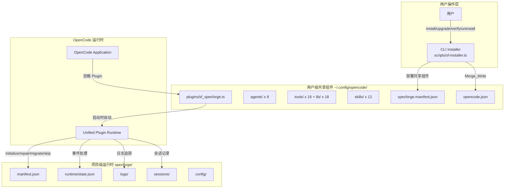
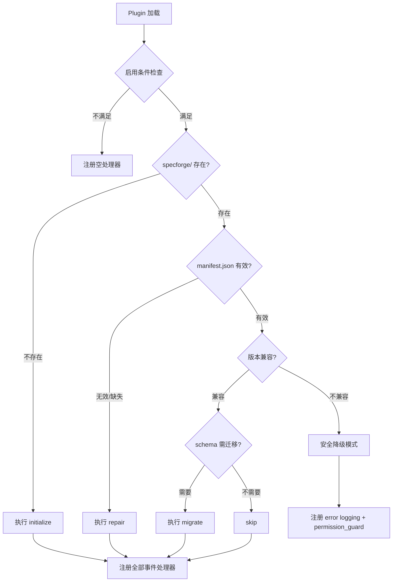
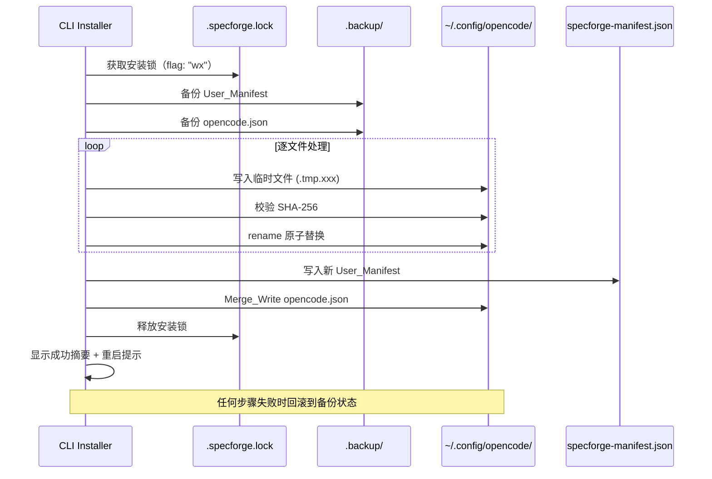

# 设计文档 — SpecForge V3.5（统一 Plugin 架构重构）

## 1. 概述

### 1.1 设计目标

1. **Plugin 合并**：将 5 个独立 Plugin 合并为 1 个统一入口 `sf_specforge.ts`
2. **CLI 简化**：CLI 安装器仅负责用户级共享组件的 install/upgrade/verify/uninstall
3. **运行时自动化**：Plugin 在 OpenCode 启动时自动初始化/修复/迁移项目运行时
4. **版本安全**：通过 runtime_schema_version 独立演进和安全降级模式保护数据
5. **旧代码清除**：移除所有 V3.3 LegacyManifest 兼容代码和已废弃参数

### 1.2 设计决策与理由

| 决策 | 理由 |
|------|------|
| 单一 Plugin 入口，运行时自包含 | OpenCode Plugin 加载器从 plugins/ 目录自动发现并加载；不依赖跨目录 import |
| Plugin 部署到 ~/.config/opencode/plugins/ 目录自动加载 | OpenCode 本地插件通过目录自动发现，不需要 plugin 数组注册 npm 包路径 |
| CLI 不再操作项目级文件 | 项目级初始化由 Plugin 自动完成 |
| runtime_schema_version 独立于 specforge_version | 解耦后减少不必要的迁移 |
| 安全降级模式保留 error logging + permission_guard | 版本不兼容时禁止写入 runtime 状态，但权限守卫必须保持 fail-closed 保护 |
| 锁 heartbeat 5秒 + lock_id 校验 + stale 二次确认 | 防止旧进程恢复后覆盖新锁；防止系统睡眠导致误判 |
| AGENTS.md 冲突时创建 AGENTS.specforge.md | 尊重用户已有内容，不覆盖不合并；用户需手动引用 |
| 项目级 runtime lock（specforge/.runtime.lock） | 防止多 OpenCode 实例同时 initialize/repair/migrate |
| 版本比较使用 compareVersion() 数字段比较 | 禁止字符串 < 比较，避免 "1.10" < "1.2" 错误 |
| semver range 仅支持 ">=x.y.z <a.b.c" 子集 | 无外部依赖约束下可靠实现 |

---

## 2. 架构

### 2.1 整体架构图



### 2.2 CLI 和 Plugin 的职责边界

| 职责 | CLI Installer | Unified Plugin |
|------|--------------|----------------|
| 共享组件部署 | install/upgrade | - |
| 共享组件校验 | verify | - |
| 共享组件卸载 | uninstall | - |
| opencode.json 合并写入 | Merge_Write | - |
| User_Manifest 管理 | 读写 | 只读（版本检查） |
| 项目运行时初始化 | - | initialize |
| 项目运行时修复 | - | repair |
| 项目运行时迁移 | - | migrate |
| Runtime_Manifest 管理 | - | 读写 |
| 事件处理（hook/event） | - | 全部 |
| 安装锁管理 | 获取/释放 | - |

---

## 3. Unified Plugin 设计

### 3.1 启动流程决策树



#### 启用条件（全部满足才执行自动初始化）

1. `specforge-manifest.json` 存在于 User_Level_Directory
2. 环境变量 `SPECFORGE_AUTO_INIT` 未设置为 `false`
3. 项目根目录不是用户 home 目录、系统目录或 `~/.config/opencode` 本身

#### 项目根目录检测

- 优先使用 Git 仓库根目录（查找 `.git` 目录向上遍历）
- 若不在 Git 仓库中，使用当前工作目录（`directory` 参数）
- 可通过 `SPECFORGE_PROJECT_ROOT` 环境变量覆盖

### 3.2 安全降级模式

当 specforge_version 不满足 Runtime_Manifest 的 `required_shared_version_range` 时进入：

**允许的操作：**
- 写入 `specforge/logs/error.log`（追加模式）
- 写入 `specforge/logs/guard.log`（追加模式）
- 输出警告到 stderr
- 权限守卫 fail-closed 拦截（permission_guard 正常运行）

**禁止的操作：**
- 写入 `runtime/state.json`
- 创建 checkpoint
- 保存 session archive
- 写入 `cost.jsonl`
- 写入 `trace.jsonl`
- 执行 Runtime_Migration

**退出条件：** 用户升级共享组件后重启 OpenCode

**初始化失败时的行为：** 如果 initialize 流程异常失败（非版本不兼容），进入 `init_failed` 状态：仅注册 error logging + permission_guard，下次启动重试 initialize。不进入 full mode。

### 3.3 事件处理器注册

Unified Plugin 导出单一命名导出 `sf_specforge`，内部按固定顺序注册处理器：

```typescript
// 伪代码：事件处理器注册结构
export const sf_specforge: Plugin = async ({ directory, client }) => {
  // 1. 启动流程（initialize/repair/migrate/skip/degraded）
  const mode = await determineStartupMode(directory)
  await executeStartupFlow(mode, directory)

  // 2. 根据模式注册处理器
  if (mode === "degraded" || mode === "init_failed") {
    return {
      "tool.execute.before": degradedToolBeforeHandler,  // 事件预记录 + 权限守卫
      event: degradedEventHandler,                       // 仅 error logging
    }
  }

  return {
    "experimental.session.compacting": compactionHandler,
    "tool.execute.before": toolBeforeHandler,   // 权限守卫 + 事件预记录
    "tool.execute.after": toolAfterHandler,     // 事件结果记录 + 会话记录
    event: unifiedEventHandler,                 // 统一事件分发
  }
}
```

#### Hook 内部执行顺序（tool.execute.before）

```
1. 事件预记录（trace.jsonl — 记录工具调用意图，无论是否被拒绝）
2. 权限守卫检查（拒绝时 throw Error 阻断后续，但预记录已完成）
```

#### Hook 内部执行顺序（tool.execute.after）

```
1. 事件结果记录（trace.jsonl + tool_calls.jsonl）
2. 成本追踪（cost.jsonl，仅 step-finish 相关）
3. 会话记录（task 工具完成时保存子会话）
4. 检查点（相关事件触发时）
```

#### Event 处理器内部分发顺序

```
1. 事件日志（trace.jsonl + conversations.jsonl）
2. 成本追踪（message.part.updated / message.updated）
3. 会话记录（session.created/updated/idle）
4. 检查点（session.compacting / session.compacted）
```

### 3.4 子模块结构

**关键约束：sf_specforge.ts 必须是运行时自包含的单文件。**

OpenCode 本地插件加载器从 `~/.config/opencode/plugins/` 目录自动发现 `.ts` 文件并加载。Plugin 不能运行时 import 其他目录（如 `tools/lib/`）的模块。

**部署方式：** 将 `sf_specforge.ts` 放入 `~/.config/opencode/plugins/` 目录即可，OpenCode 启动时自动加载。不需要在 opencode.json 的 `plugin` 数组中注册（该数组用于 npm 包形式的插件）。

**代码复用策略：** 如需复用 `tools/lib/` 中的逻辑（如 utils、semver），在源码仓库中引用，构建/部署时将所需代码内联到 `sf_specforge.ts` 中。最终部署产物是单一自包含文件。

Plugin 内部逻辑按功能域组织为内联代码块：

| 功能域 | 对应原 Plugin | 核心函数 |
|--------|--------------|----------|
| startup | 新增 | `determineStartupMode()`, `executeStartupFlow()` |
| permission_guard | sf_permission_guard | `checkFileEditPermission()`, `checkToolCallPermission()` |
| event_logger | sf_event_logger | `writeTrace()`, `writeToolCall()`, `buildLogEntry()` |
| cost_tracker | sf_cost_tracker | `extractTokens()`, `buildCostEntry()`, `hasCostData()` |
| session_recorder | sf_session_recorder | `saveSession()`, `convertMessagesToJsonl()` |
| checkpoint | sf_checkpoint | `generateRecoverySummary()`, `buildCompactionContext()` |
| version | 新增 | `parseVersion()`, `compareVersion()`, `satisfiesRange()` |

### 3.5 错误隔离策略

```typescript
// 每个子模块调用包裹在独立 try-catch 中
async function unifiedEventHandler({ event }) {
  // 事件日志 — 失败不阻断
  try { await handleEventLogging(event) } catch (e) { logError("event_logger", e) }

  // 成本追踪 — 失败不阻断
  try { await handleCostTracking(event) } catch (e) { logError("cost_tracker", e) }

  // 会话记录 — 失败不阻断
  try { await handleSessionRecording(event) } catch (e) { logError("session_recorder", e) }

  // 检查点 — 失败不阻断
  try { await handleCheckpoint(event) } catch (e) { logError("checkpoint", e) }
}

// 例外：权限守卫拒绝时 throw Error 阻断后续执行（设计意图）
async function toolBeforeHandler(input, output) {
  // 事件预记录 — 失败不阻断（确保被拒绝操作也有审计记录）
  try { await logToolIntent(input, output) } catch (e) { logError("event_logger", e) }

  // 权限守卫 — 拒绝时 throw（有意阻断）
  await checkPermissions(input, output)  // throws on deny, also writes guard.log
}
```

---

## 4. CLI 安装器重构

### 4.1 简化后的命令设计

```
bun scripts/sf-installer.ts install    # 部署共享组件到 ~/.config/opencode/
bun scripts/sf-installer.ts upgrade    # 原子升级共享组件
bun scripts/sf-installer.ts verify     # 校验共享组件完整性
bun scripts/sf-installer.ts uninstall  # 卸载共享组件
```

**已移除的参数：** `--target`、`--project-level`、`--runtime-only`

当用户提供已移除参数时，输出错误信息并退出：
```
错误: 参数 --project-level 已不再支持。
V3.5 起项目级运行时由 Plugin 自动初始化，无需手动操作。
```

**保留的参数：** `--force`（upgrade 时强制覆盖）、`--version`（显示版本）

### 4.2 SHARED_COMPONENT_REGISTRY

替代旧版 `FILE_REGISTRY` 和 `USER_LEVEL_REGISTRY`，仅包含用户级共享组件：

```typescript
export const SHARED_COMPONENT_REGISTRY: ComponentEntry[] = [
  // Agent 定义（9 个）
  { path: "agents/sf-orchestrator.md", type: "agent" },
  { path: "agents/sf-requirements.md", type: "agent" },
  { path: "agents/sf-design.md", type: "agent" },
  { path: "agents/sf-task-planner.md", type: "agent" },
  { path: "agents/sf-executor.md", type: "agent" },
  { path: "agents/sf-debugger.md", type: "agent" },
  { path: "agents/sf-reviewer.md", type: "agent" },
  { path: "agents/sf-verifier.md", type: "agent" },
  { path: "agents/sf-knowledge.md", type: "agent" },

  // Custom Tools（16 个）
  { path: "tools/sf_artifact_write.ts", type: "tool" },
  { path: "tools/sf_batch_verify.ts", type: "tool" },
  // ... 其余 14 个 tool

  // Tool 核心库（18 个）
  { path: "tools/lib/sf_artifact_write_core.ts", type: "tool_lib" },
  { path: "tools/lib/utils.ts", type: "tool_lib" },
  // ... 其余 16 个 tool_lib

  // Plugin（1 个，替代原来的 5 个）
  { path: "plugins/sf_specforge.ts", type: "plugin" },

  // Skills（12 个）
  { path: "skills/sf-workflow-feature-spec/SKILL.md", type: "skill" },
  // ... 其余 11 个 skill
]

interface ComponentEntry {
  path: string  // POSIX 风格相对路径
  type: "agent" | "tool" | "tool_lib" | "skill" | "plugin"
}
```

### 4.3 升级策略（逐文件原子替换）



**原子性保证：**
- 每个文件先写入 `.tmp.<random>` 临时文件
- 校验临时文件 SHA-256 与源文件一致
- 使用 `rename()` 原子替换目标文件（同文件系统内 rename 是原子操作）
- 失败时删除临时文件，恢复备份

### 4.4 Heartbeat 机制

```typescript
// 持锁期间每 5 秒刷新 last_heartbeat
let heartbeatInterval: Timer | null = null

function startHeartbeat(lockPath: string): void {
  heartbeatInterval = setInterval(async () => {
    try {
      const content = await readFile(lockPath, "utf-8")
      const lock = JSON.parse(content)
      lock.last_heartbeat = new Date().toISOString()
      await writeFile(lockPath, JSON.stringify(lock, null, 2))
    } catch { /* 静默失败 */ }
  }, 5000)
}

function stopHeartbeat(): void {
  if (heartbeatInterval) {
    clearInterval(heartbeatInterval)
    heartbeatInterval = null
  }
}
```

---

## 5. 数据模型

### 5.1 User_Manifest 结构

文件位置：`~/.config/opencode/specforge-manifest.json`

```typescript
interface UserManifest {
  schema_version: "1.0"
  shared_version: string           // specforge_version，如 "3.5.0"
  install_mode: "user_level"
  installed_at: string             // ISO8601，首次安装时间
  updated_at: string               // ISO8601，最近更新时间
  managed_agents: string[]         // Agent 名称列表，如 ["sf-orchestrator", ...]
  managed_agent_hashes: Record<string, string>  // Agent 配置 SHA-256
  files: Record<string, FileEntry> // 已部署文件清单
}

interface FileEntry {
  sha256: string
  size: number
  type: "agent" | "tool" | "tool_lib" | "skill" | "plugin"
}
```

**示例：**
```json
{
  "schema_version": "1.0",
  "shared_version": "3.5.0",
  "install_mode": "user_level",
  "installed_at": "2026-06-01T10:00:00.000Z",
  "updated_at": "2026-06-15T14:30:00.000Z",
  "managed_agents": [
    "sf-orchestrator", "sf-requirements", "sf-design",
    "sf-task-planner", "sf-executor", "sf-debugger",
    "sf-reviewer", "sf-verifier", "sf-knowledge"
  ],
  "managed_agent_hashes": {
    "sf-orchestrator": "a1b2c3...",
    "sf-requirements": "d4e5f6..."
  },
  "files": {
    "agents/sf-orchestrator.md": { "sha256": "abc123...", "size": 8192, "type": "agent" },
    "plugins/sf_specforge.ts": { "sha256": "def456...", "size": 24576, "type": "plugin" },
    "tools/sf_state_read.ts": { "sha256": "789abc...", "size": 4096, "type": "tool" }
  }
}
```

### 5.2 Runtime_Manifest 结构

文件位置：`<project>/specforge/manifest.json`

```typescript
interface RuntimeManifest {
  schema_version: "1.0"
  runtime_schema_version: string   // 如 "1.0", "1.1", "2.0"
  install_mode: "user_level"
  required_shared_version_range: string  // semver range，如 ">=3.5.0 <4.0.0"
  initialized_at: string           // ISO8601
  updated_at: string               // ISO8601
  project_files: Record<string, { sha256: string; size: number }>
  // V3.5 新增字段
  recovery_required?: boolean      // manifest 损坏恢复标记
  last_migration?: {
    from_version: string
    to_version: string
    migrated_at: string
  }
}
```

### 5.3 MIGRATIONS 注册表

Plugin 内置的迁移注册表，定义版本间的升级路径：

```typescript
interface Migration {
  from: string  // 源 runtime_schema_version
  to: string    // 目标 runtime_schema_version
  description: string
  execute: (projectDir: string) => Promise<void>
}

const CURRENT_RUNTIME_SCHEMA_VERSION = "1.1"

const MIGRATIONS: Migration[] = [
  {
    from: "1.0",
    to: "1.1",
    description: "添加 logs/cost.jsonl 支持、补齐 knowledge/ 目录",
    execute: async (projectDir) => {
      // 1. 确保 specforge/logs/ 目录存在
      // 2. 补齐 specforge/knowledge/ 目录
      // 3. config/project.json 补充新字段（不改已有值）
    }
  },
  // 未来迁移在此追加
]
```

**迁移路径查找算法：**
```typescript
function findMigrationPath(currentVersion: string): Migration[] {
  const path: Migration[] = []
  let version = currentVersion
  while (version !== CURRENT_RUNTIME_SCHEMA_VERSION) {
    const next = MIGRATIONS.find(m => m.from === version)
    if (!next) throw new Error(`No migration path from ${version}`)
    path.push(next)
    version = next.to
  }
  return path
}
```

---

## 6. 核心算法

### 6.1 Plugin 启动决策流程

#### 版本比较工具（内联于 Plugin，禁止字符串比较）

```typescript
/** 解析版本为数字三元组，非法版本抛出错误 */
function parseVersion(v: string): [number, number, number] {
  const cleaned = v.replace(/^[>=<]+/, "").trim()
  if (!/^\d+\.\d+\.\d+$/.test(cleaned)) {
    throw new Error(`Invalid version format: "${v}"`)
  }
  const parts = cleaned.split(".")
  return [parseInt(parts[0]), parseInt(parts[1]), parseInt(parts[2])]
}

/** 比较两个版本：-1 (a < b), 0 (a == b), 1 (a > b) */
function compareVersion(a: string, b: string): -1 | 0 | 1 {
  const pa = parseVersion(a), pb = parseVersion(b)
  for (let i = 0; i < 3; i++) {
    if (pa[i] < pb[i]) return -1
    if (pa[i] > pb[i]) return 1
  }
  return 0
}

/** 仅支持 ">=x.y.z <a.b.c" 格式；不支持的格式返回 false 并进入 degraded */
function satisfiesRange(version: string, range: string): boolean {
  const parts = range.trim().split(/\s+/)
  for (const part of parts) {
    if (part.startsWith(">=")) {
      if (compareVersion(version, part.slice(2)) < 0) return false
    } else if (part.startsWith("<")) {
      if (compareVersion(version, part.slice(1)) >= 0) return false
    } else {
      return false  // 不支持的格式，视为不兼容，进入 degraded
    }
  }
  return true
}
```

#### 启动决策伪代码

```typescript
async function determineStartupMode(directory: string): Promise<StartupMode> {
  // Step 1: 启用条件检查
  const userManifestPath = join(resolveUserLevelDirectory(), "specforge-manifest.json")
  if (!existsSync(userManifestPath)) return "noop"
  if (process.env.SPECFORGE_AUTO_INIT === "false") return "noop"

  const projectRoot = detectProjectRoot(directory)
  if (isExcludedDirectory(projectRoot)) return "noop"

  // Step 2: specforge/ 目录存在性
  const specforgeDir = join(projectRoot, "specforge")
  if (!existsSync(specforgeDir)) return "initialize"

  // Step 3: manifest.json 有效性
  const manifest = await readRuntimeManifest(projectRoot)
  if (!manifest) return "repair"

  // Step 4: 版本兼容性
  const userManifest = await readUserManifest()
  const sharedVersion = userManifest.shared_version
  if (!satisfiesRange(sharedVersion, manifest.required_shared_version_range)) {
    return "degraded"
  }

  // Step 5: schema 版本检查（使用数字比较，禁止字符串 <）
  if (compareVersion(manifest.runtime_schema_version, CURRENT_RUNTIME_SCHEMA_VERSION) < 0) {
    return "migrate"
  }

  // Step 6: 必需文件完整性快速检查
  if (!allRequiredFilesExist(projectRoot)) return "repair"

  return "skip"
}

type StartupMode = "initialize" | "repair" | "migrate" | "skip" | "degraded" | "noop" | "init_failed" | "runtime_busy"
```

### 6.2 Runtime_Migration 执行流程

```typescript
async function executeMigration(projectDir: string, manifest: RuntimeManifest): Promise<void> {
  const currentVersion = manifest.runtime_schema_version
  const migrations = findMigrationPath(currentVersion)

  for (const migration of migrations) {
    // 记录迁移开始
    await appendLog(projectDir, "app.log", {
      level: "INFO",
      event: "migration.start",
      message: `Migrating ${migration.from} -> ${migration.to}: ${migration.description}`
    })

    try {
      await migration.execute(projectDir)

      // 更新 manifest
      manifest.runtime_schema_version = migration.to
      manifest.updated_at = new Date().toISOString()
      manifest.last_migration = {
        from_version: migration.from,
        to_version: migration.to,
        migrated_at: new Date().toISOString()
      }
      await writeRuntimeManifest(projectDir, manifest)

      await appendLog(projectDir, "app.log", {
        level: "INFO",
        event: "migration.complete",
        message: `Migration ${migration.from} -> ${migration.to} completed`
      })
    } catch (err) {
      // 迁移失败：记录错误，进入降级模式
      await appendLog(projectDir, "error.log", {
        level: "ERROR",
        event: "migration.failed",
        message: `Migration ${migration.from} -> ${migration.to} failed: ${err.message}`
      })
      throw err  // 上层捕获后进入降级模式
    }
  }
}
```

### 6.3 锁 Heartbeat 机制

```typescript
// 锁文件结构（V3.5 增强：lock_id + heartbeat）
interface InstallLockInfo {
  lock_id: string         // 随机 UUID，用于所有权校验
  pid: number
  hostname: string
  command: "install" | "upgrade" | "uninstall"
  created_at: string      // ISO8601
  last_heartbeat: string  // ISO8601，每 5 秒刷新
}

// Heartbeat 实现（使用 unref 防止阻止进程退出）
let heartbeatInterval: ReturnType<typeof setInterval> | null = null
let currentLockId: string | null = null

function startHeartbeat(lockPath: string, lockId: string): void {
  currentLockId = lockId
  heartbeatInterval = setInterval(async () => {
    try {
      const content = await readFile(lockPath, "utf-8")
      const lock = JSON.parse(content) as InstallLockInfo
      // 校验 lock_id：如果不匹配说明锁已被接管，停止 heartbeat
      if (lock.lock_id !== currentLockId) {
        stopHeartbeat()
        return
      }
      lock.last_heartbeat = new Date().toISOString()
      await writeFile(lockPath, JSON.stringify(lock, null, 2))
    } catch { /* 静默失败 */ }
  }, 5000)
  // unref 防止 timer 阻止进程退出
  if (heartbeatInterval.unref) heartbeatInterval.unref()
}

function stopHeartbeat(): void {
  if (heartbeatInterval) {
    clearInterval(heartbeatInterval)
    heartbeatInterval = null
  }
  currentLockId = null
}

// 获取锁（含 stale 二次确认）
async function acquireInstallLock(userLevelDir: string, command: string): Promise<void> {
  const lockPath = join(userLevelDir, ".specforge.lock")
  const startTime = Date.now()

  while (Date.now() - startTime < 30_000) {
    // 尝试原子创建
    try {
      const lockId = crypto.randomUUID()
      const lockInfo: InstallLockInfo = {
        lock_id: lockId,
        pid: process.pid,
        hostname: hostname(),
        command,
        created_at: new Date().toISOString(),
        last_heartbeat: new Date().toISOString()
      }
      await writeFile(lockPath, JSON.stringify(lockInfo, null, 2), { flag: "wx" })
      startHeartbeat(lockPath, lockId)
      return  // 成功获取
    } catch (err) {
      if (err.code !== "EEXIST") throw err
    }

    // 锁已存在，检查 stale（二次确认）
    const existing = await readLockFile(lockPath)
    if (existing) {
      const heartbeatAge = Date.now() - new Date(existing.last_heartbeat).getTime()
      if (heartbeatAge > 10 * 60 * 1000) {
        // 第一次判断 stale，等 1 秒后再确认
        await sleep(1000)
        const recheck = await readLockFile(lockPath)
        if (recheck && recheck.lock_id === existing.lock_id) {
          const recheckAge = Date.now() - new Date(recheck.last_heartbeat).getTime()
          if (recheckAge > 10 * 60 * 1000) {
            // 二次确认仍 stale，接管
            await unlink(lockPath).catch(() => {})
            continue
          }
        }
      }
    }

    await sleep(1000)
  }

  throw new InstallerError(InstallerErrorCode.E_LOCK_TIMEOUT, "安装锁等待超时")
}

// 释放锁（校验 lock_id + pid + hostname）
async function releaseInstallLock(userLevelDir: string): Promise<void> {
  // ★ 先保存 lockId，再停止 heartbeat（避免 stopHeartbeat 清空 currentLockId）
  const lockId = currentLockId
  stopHeartbeat()
  const lockPath = join(userLevelDir, ".specforge.lock")
  const lock = await readLockFile(lockPath)
  if (lock && lock.lock_id === lockId && lock.pid === process.pid && lock.hostname === hostname()) {
    await unlink(lockPath)
  }
}

// CLI 命令主流程模板（固化 finally 清理）
async function cmdInstall(): Promise<void> {
  await acquireInstallLock(userLevelDir, "install")
  try {
    // ... 安装逻辑 ...
  } finally {
    await releaseInstallLock(userLevelDir)
  }
}
```

### 6.4 项目级 Runtime Lock

Plugin 在执行 initialize/repair/migrate 时获取项目级锁，防止多 OpenCode 实例并发操作：

```typescript
// 锁文件位置：specforge/.runtime.lock
// ★ initialize 场景：先创建 specforge/ 目录，再获取锁，然后继续创建子目录和文件

async function withRuntimeLock(projectDir: string, mode: StartupMode, fn: () => Promise<void>): Promise<void> {
  const specforgeDir = join(projectDir, "specforge")
  // initialize 时先确保根目录存在（否则锁文件无法创建）
  await mkdir(specforgeDir, { recursive: true })

  const lockPath = join(specforgeDir, ".runtime.lock")
  const lockId = crypto.randomUUID()
  const lockInfo = {
    lock_id: lockId,
    pid: process.pid,
    hostname: hostname(),
    command: mode,
    created_at: new Date().toISOString(),
    last_heartbeat: new Date().toISOString()
  }

  // 尝试获取（最多等 5 秒，Plugin 启动不应长时间阻塞）
  const startTime = Date.now()
  while (Date.now() - startTime < 5000) {
    try {
      await writeFile(lockPath, JSON.stringify(lockInfo, null, 2), { flag: "wx" })
      // 获取成功，执行操作
      try {
        await fn()
      } finally {
        // 释放时校验 lock_id
        try {
          const content = await readFile(lockPath, "utf-8")
          const lock = JSON.parse(content)
          if (lock.lock_id === lockId) {
            await unlink(lockPath)
          }
        } catch { /* 静默 */ }
      }
      return
    } catch (err) {
      if (err.code !== "EEXIST") throw err
    }

    // 锁已存在，检查 stale（简化版：5 分钟超时，无 heartbeat）
    try {
      const content = await readFile(lockPath, "utf-8")
      const existing = JSON.parse(content)
      const age = Date.now() - new Date(existing.last_heartbeat || existing.created_at).getTime()
      if (age > 5 * 60 * 1000) {
        await unlink(lockPath).catch(() => {})
        continue
      }
    } catch { /* 锁文件损坏，删除重试 */
      await unlink(lockPath).catch(() => {})
      continue
    }

    await sleep(500)
  }

  // 获取失败：进入 runtime_busy 状态
  // 只注册 error logging + permission_guard，不进入 full mode
  throw new RuntimeLockBusyError("另一个 OpenCode 实例正在操作项目运行时")
}
```

**runtime_busy 状态处理：** 当 runtime lock 获取失败时，Plugin 进入与 degraded 相同的受限模式（error logging + permission_guard），不注册 checkpoint/session/cost 处理器。下次启动重试。

---

## 7. opencode.json 目标结构

### 7.1 完整示例

```json
{
  "$schema": "https://opencode.ai/config.json",
  "permission": "allow",
  "agent": {
    "sf-orchestrator": {
      "mode": "primary",
      "model": "anthropic/claude-sonnet-4-20250514",
      "prompt": "{file:./agents/sf-orchestrator.md}",
      "permission": { "task": "allow", "edit": "allow", "bash": "allow", "skill": "allow" }
    },
    "sf-requirements": {
      "mode": "subagent",
      "model": "anthropic/claude-sonnet-4-20250514",
      "prompt": "{file:./agents/sf-requirements.md}",
      "permission": { "task": "deny", "edit": "allow", "bash": "allow", "skill": "allow" }
    },
    "sf-design": {
      "mode": "subagent",
      "model": "anthropic/claude-sonnet-4-20250514",
      "prompt": "{file:./agents/sf-design.md}",
      "permission": { "task": "deny", "edit": "allow", "bash": "allow", "skill": "allow" }
    },
    "sf-task-planner": {
      "mode": "subagent",
      "model": "anthropic/claude-sonnet-4-20250514",
      "prompt": "{file:./agents/sf-task-planner.md}",
      "permission": { "task": "deny", "edit": "allow", "bash": "allow", "skill": "allow" }
    },
    "sf-executor": {
      "mode": "subagent",
      "model": "anthropic/claude-sonnet-4-20250514",
      "prompt": "{file:./agents/sf-executor.md}",
      "permission": { "task": "deny", "edit": "allow", "bash": "allow", "skill": "allow" }
    },
    "sf-debugger": {
      "mode": "subagent",
      "model": "anthropic/claude-sonnet-4-20250514",
      "prompt": "{file:./agents/sf-debugger.md}",
      "permission": { "task": "deny", "edit": "allow", "bash": "allow", "skill": "allow" }
    },
    "sf-reviewer": {
      "mode": "subagent",
      "model": "anthropic/claude-sonnet-4-20250514",
      "prompt": "{file:./agents/sf-reviewer.md}",
      "permission": { "task": "deny", "edit": "deny", "bash": "allow", "skill": "allow" }
    },
    "sf-verifier": {
      "mode": "subagent",
      "model": "anthropic/claude-sonnet-4-20250514",
      "prompt": "{file:./agents/sf-verifier.md}",
      "permission": { "task": "deny", "edit": "deny", "bash": "allow", "skill": "allow" }
    },
    "sf-knowledge": {
      "mode": "subagent",
      "model": "anthropic/claude-sonnet-4-20250514",
      "prompt": "{file:./agents/sf-knowledge.md}",
      "permission": { "task": "deny", "edit": "ask", "bash": "allow", "skill": "allow" }
    }
  }
}
```

**注意：** opencode.json 中不包含 `plugin` 数组。Plugin 通过 `~/.config/opencode/plugins/` 目录自动发现加载，不需要配置注册。
```

### 7.2 Merge_Write 规则

**Plugin 注册方式：** 不通过 opencode.json `plugin` 数组注册。Plugin 文件放入 `~/.config/opencode/plugins/` 目录，OpenCode 启动时自动发现并加载。

| 操作 | install | upgrade | uninstall |
|------|---------|---------|-----------|
| `agent` 中 sf-* 条目 | 添加/覆盖 | 更新 | 删除 |
| `agent` 中非 sf-* 条目 | 保留不动 | 保留不动 | 保留不动 |
| 其他顶层键 | 保留不动 | 保留不动 | 保留不动 |
| `$schema` | 不存在时添加 | 保留 | 保留 |

---

## 8. 错误处理

### 8.1 错误码表

| 错误码 | 退出码 | 触发场景 | 建议修复方法 |
|--------|--------|----------|-------------|
| E_PERMISSION_DENIED | 10 | 文件/目录权限不足（EACCES/EPERM） | 检查目录权限，或使用管理员权限运行 |
| E_DISK_FULL | 11 | 磁盘空间不足（ENOSPC） | 清理磁盘空间后重试 |
| E_INVALID_JSON | 12 | opencode.json / manifest.json 解析失败 | 检查 JSON 语法，或从 .backup/ 恢复 |
| E_MANIFEST_SCHEMA_UNSUPPORTED | 13 | Manifest schema_version 不受支持 | 升级 SpecForge 安装器到最新版本 |
| E_LOCK_TIMEOUT | 14 | 安装锁等待 30 秒超时 | 检查是否有其他安装进程运行；若无，删除 .specforge.lock |
| E_CHECKSUM_MISMATCH | 15 | 文件 SHA-256 校验和不匹配 | 执行 `upgrade` 重新部署受损文件 |
| E_SHARED_COMPONENTS_INVALID | 16 | 共享组件完整性检查失败 | 执行 `upgrade --force` 强制重新部署 |

### 8.2 降级策略

| 场景 | 降级行为 | 恢复方式 |
|------|----------|----------|
| Plugin 启动时版本不兼容 | 仅 error logging，禁止写入 runtime 状态 | 升级共享组件后重启 OpenCode |
| Plugin 启动时 manifest 损坏 | 备份损坏文件，尝试推断版本，标记 recovery_required | 手动确认后执行 repair |
| Plugin 启动时初始化异常 | 记录错误到 stderr + error.log，继续注册事件处理器 | 下次启动自动重试 |
| 子模块运行时异常 | 隔离记录到 error.log，不阻断其他模块 | 自动恢复（下次事件正常处理） |
| 权限守卫拒绝操作 | throw Error 阻断当前工具执行 | 设计意图，非降级 |
| CLI 升级中途失败 | 回滚到备份状态 | 修复问题后重新执行 upgrade |
| CLI 锁超时 | 报告 E_LOCK_TIMEOUT + 锁元数据 | 等待或手动清除 stale 锁 |

### 8.3 错误输出渠道

| 组件 | 正常日志 | 错误日志 | 用户可见输出 |
|------|----------|----------|-------------|
| CLI Installer | stdout | stderr + 退出码 | stdout 摘要 |
| Plugin 启动 | specforge/logs/app.log | specforge/logs/error.log + stderr | stderr 警告 |
| Plugin 事件处理 | specforge/logs/trace.jsonl | specforge/logs/error.log | 无（静默） |
| 权限守卫 | specforge/logs/guard.log | - | throw Error（OpenCode 显示） |

---

## 9. 迁移映射表

### 9.1 旧 5 Plugin 到 Unified Plugin 的映射

#### sf_permission_guard.ts

| 原始注册 | 原始行为 | Unified Plugin 对应 |
|----------|----------|-------------------|
| hook: `tool.execute.before` | 拦截未授权文件编辑 + 工具调用 | `tool.execute.before` 处理器第 1 步（权限守卫） |
| 输出: guard.log | JSONL 格式拦截记录 | 保持不变：specforge/logs/guard.log |

#### sf_event_logger.ts

| 原始注册 | 原始行为 | Unified Plugin 对应 |
|----------|----------|-------------------|
| hook: `tool.execute.before` | 记录工具调用到 trace.jsonl + agent dispatch 追踪 | `tool.execute.before` 处理器第 2 步（事件日志） |
| hook: `tool.execute.after` | 记录工具结果到 trace.jsonl + sf_* 写入 tool_calls.jsonl | `tool.execute.after` 处理器第 1 步（事件日志） |
| event: 多种事件类型 | 记录到 trace.jsonl + conversations.jsonl | `event` 处理器第 1 步（事件日志） |
| 输出: trace.jsonl | 完整运行痕迹 | 保持不变 |
| 输出: tool_calls.jsonl | sf_* 工具调用记录 | 保持不变 |
| 输出: conversations.jsonl | 消息内容记录 | 保持不变 |

#### sf_cost_tracker.ts

| 原始注册 | 原始行为 | Unified Plugin 对应 |
|----------|----------|-------------------|
| event: `message.part.updated` (step-finish) | 提取 cost/tokens 写入 cost.jsonl | `event` 处理器第 2 步（成本追踪） |
| event: `message.updated` (assistant) | 提取消息级 cost/tokens 写入 cost.jsonl | `event` 处理器第 2 步（成本追踪） |
| 输出: cost.jsonl | 成本记录 | 保持不变 |

#### sf_session_recorder.ts

| 原始注册 | 原始行为 | Unified Plugin 对应 |
|----------|----------|-------------------|
| event: `session.created`/`session.updated` | 追踪子会话 | `event` 处理器第 3 步（会话记录） |
| event: `session.idle` | 保存主会话 | `event` 处理器第 3 步（会话记录） |
| hook: `tool.execute.after` (task tool) | 保存子 Agent 会话 | `tool.execute.after` 处理器第 3 步（会话记录） |
| 输出: sessions/{id}/conversation.jsonl | 会话 JSONL | 保持不变 |
| 输出: sessions/{id}/metadata.json | 会话元数据 | 保持不变 |

#### sf_checkpoint.ts

| 原始注册 | 原始行为 | Unified Plugin 对应 |
|----------|----------|-------------------|
| hook: `experimental.session.compacting` | 注入 compaction context + 保存会话快照 | `experimental.session.compacting` 处理器 |
| event: `session.compacting` | 保存 state.json 快照 + 生成恢复摘要 | `event` 处理器第 4 步（检查点） |
| event: `session.compacted` | 记录压缩事件到 events.jsonl | `event` 处理器第 4 步（检查点） |
| 输出: runtime/checkpoints/*.json | 状态快照 | 保持不变 |
| 输出: runtime/checkpoints/*.recovery.md | 恢复摘要 | 保持不变 |

### 9.2 Hook 执行顺序对照

**V3.4（5 个独立 Plugin，OpenCode 按注册顺序调用）：**
```
tool.execute.before:
  sf_permission_guard → sf_event_logger

tool.execute.after:
  sf_event_logger → sf_session_recorder
```

**V3.5（Unified Plugin，内部顺序控制）：**
```
tool.execute.before:
  1. event_logger.intent（事件预记录，失败不阻断）
  2. permission_guard（拒绝时写 guard.log 并 throw）

tool.execute.after:
  1. event_logger.result（trace.jsonl + tool_calls.jsonl）
  2. cost_tracker（仅相关事件）
  3. session_recorder（仅 task 工具）
  4. checkpoint（仅相关事件）
```

**degraded 模式下的 tool.execute.before：**
```
  1. degraded_guard_logger（只写 guard.log/error.log，不写 trace.jsonl）
  2. permission_guard（fail-closed 拦截）
```

### 9.3 输出文件清单（不变）

| 文件路径 | 写入来源 | 格式 |
|----------|----------|------|
| specforge/logs/trace.jsonl | event_logger | JSONL |
| specforge/logs/tool_calls.jsonl | event_logger | JSONL |
| specforge/logs/conversations.jsonl | event_logger | JSONL |
| specforge/logs/cost.jsonl | cost_tracker | JSONL |
| specforge/logs/guard.log | permission_guard | JSONL |
| specforge/logs/app.log | startup + checkpoint | JSONL |
| specforge/logs/error.log | 所有模块错误 | JSONL |
| specforge/runtime/checkpoints/*.json | checkpoint | JSON |
| specforge/runtime/checkpoints/*.recovery.md | checkpoint | Markdown |
| specforge/runtime/events.jsonl | checkpoint (compacted) | JSONL |
| specforge/sessions/{id}/conversation.jsonl | session_recorder | JSONL |
| specforge/sessions/{id}/metadata.json | session_recorder | JSON |

---

## 10. 需求追溯矩阵

| 需求 | 验收标准 | 设计章节 | 实现要点 |
|------|----------|----------|----------|
| 需求 1: CLI 简化 | AC 1-11 | 4.1, 4.2, 4.3 | 移除旧参数、SHARED_COMPONENT_REGISTRY、原子升级、错误码 |
| 需求 2: Plugin 合并 | AC 1-10 | 3.3, 3.4, 3.5 | 单一导出、子模块结构、错误隔离、固定执行顺序 |
| 需求 3: 自动初始化 | AC 1-9 | 3.1, 6.1 | 启用条件检查、initialize 流程、AGENTS.md 冲突处理、幂等性 |
| 需求 4: 版本兼容 | AC 1-8 | 3.2, 5.3, 6.2 | 安全降级模式、MIGRATIONS 注册表、manifest 损坏恢复 |
| 需求 5: 路径统一 | AC 1-4 | 2.1 | resolveUserLevelDirectory()、POSIX 路径存储、环境变量覆盖 |
| 需求 6: 合并写入 | AC 1-6 | 7.1, 7.2 | Merge_Write 规则、sf-* 前缀过滤、备份机制 |
| 需求 7: 旧代码清除 | AC 1-8 | 4.2 | 移除 LegacyManifest、FILE_REGISTRY 替换为 SHARED_COMPONENT_REGISTRY |
| 需求 8: 用户体验 | AC 1-5 | 4.1, 4.3 | 单命令安装、自动初始化、成功摘要、错误码+修复建议 |
| 需求 9: 安装锁 | AC 1-9 | 6.3, 4.4 | flag:"wx" 原子创建、5秒 heartbeat、10分钟超时、所有权校验 |
| 需求 10: 幂等性 | AC 1-5 | 3.1, 6.1 | 四种启动流程分类、不覆盖已有文件、审计日志 |
| 需求 11: 非功能需求 | AC 1-5 | 全文 | 无外部依赖、备份机制、测试覆盖、FileEntry.type 字段、SHA-256 |

### 详细追溯

#### 需求 1 验收标准追溯

| AC | 设计对应 |
|----|----------|
| 1.1 仅支持四个子命令 | 4.1 命令设计 |
| 1.2 install 部署+写 Manifest+注册 | 4.3 升级策略（install 同理） |
| 1.3 upgrade 原子策略 | 4.3 逐文件原子替换 |
| 1.4 verify 校验 SHA-256 | 4.1 verify 命令 + 5.1 FileEntry |
| 1.5 uninstall 仅删 Manifest 记录文件 | 7.2 Merge_Write uninstall 规则 |
| 1.6 不接受已移除参数 | 4.1 已移除参数说明 |
| 1.7 已移除参数错误提示 | 4.1 错误信息示例 |
| 1.8 无 LegacyManifest 代码 | 4.2 SHARED_COMPONENT_REGISTRY 替代 |
| 1.9 Merge_Write + 备份 | 7.2 Merge_Write 规则 |
| 1.10 重启提示 | 4.3 成功摘要 |
| 1.11 错误码定义 | 8.1 错误码表 |

#### 需求 2 验收标准追溯

| AC | 设计对应 |
|----|----------|
| 2.1 唯一入口文件 | 3.4 子模块结构 |
| 2.2 检查点功能 | 9.1 sf_checkpoint 映射 |
| 2.3 成本追踪功能 | 9.1 sf_cost_tracker 映射 |
| 2.4 事件日志功能 | 9.1 sf_event_logger 映射 |
| 2.5 权限守卫功能 | 9.1 sf_permission_guard 映射 |
| 2.6 会话记录功能 | 9.1 sf_session_recorder 映射 |
| 2.7 单一命名导出 | 3.3 事件处理器注册 |
| 2.8 固定执行顺序 | 3.3 Hook 内部执行顺序 + 9.2 |
| 2.9 错误隔离 | 3.5 错误隔离策略 |
| 2.10 部署 1 个 Plugin 文件 | 4.2 SHARED_COMPONENT_REGISTRY |

#### 需求 3 验收标准追溯

| AC | 设计对应 |
|----|----------|
| 3.1 initialize 流程 | 3.1 启动流程决策树 |
| 3.2 创建子目录 | 6.1 initialize 执行 |
| 3.3 创建初始文件 | 6.1 initialize 执行 |
| 3.4 AGENTS.md 冲突处理 | 1.2 设计决策（AGENTS.specforge.md） |
| 3.5 部署 AGENT_CONSTITUTION + 契约 | 6.1 initialize 执行 |
| 3.6 写入 Runtime_Manifest | 5.2 Runtime_Manifest 结构 |
| 3.7 repair 流程 | 3.1 决策树 repair 分支 |
| 3.8 异常不崩溃 | 3.5 错误隔离 + 8.2 降级策略 |
| 3.9 无用户交互 | 3.1 全自动流程 |

#### 需求 4 验收标准追溯

| AC | 设计对应 |
|----|----------|
| 4.1 版本比对 | 6.1 Step 4 版本兼容性 |
| 4.2 安全降级模式 | 3.2 安全降级模式 |
| 4.3 迁移触发条件 | 5.3 MIGRATIONS + 6.1 Step 5 |
| 4.4 迁移支持操作 | 5.3 Migration.execute |
| 4.5 迁移后更新 Manifest | 6.2 executeMigration |
| 4.6 Manifest 损坏恢复 | 5.2 recovery_required 字段 |
| 4.7 异常不崩溃 | 8.2 降级策略 |
| 4.8 输出渠道 | 8.3 错误输出渠道 |

#### 需求 9 验收标准追溯

| AC | 设计对应 |
|----|----------|
| 9.1 修改前获取锁 | 6.3 acquireInstallLock |
| 9.2 原子创建 + JSON 内容 | 6.3 InstallLockInfo 结构 |
| 9.3 5 秒 heartbeat | 4.4 Heartbeat 机制 |
| 9.4 等待 30 秒 | 6.3 while 循环 |
| 9.5 超时报告 | 8.1 E_LOCK_TIMEOUT |
| 9.6 10 分钟 stale 判定 | 6.3 heartbeatAge 检查 |
| 9.7 verify 不获取锁 | 4.1 verify 命令说明 |
| 9.8 uninstall 获取锁 | 6.3 command 参数支持 uninstall |
| 9.9 释放时所有权校验 | 6.3 releaseInstallLock |

---

## 附录 A：关键技术约束总结

| 约束 | 来源 | 影响范围 |
|------|------|----------|
| 无外部 npm 依赖 | 需求 11.1 | CLI + Plugin 全部代码 |
| Plugin 入口可引用 tools/lib/ | 需求 2.1 | sf_specforge.ts import 路径 |
| 所有平台路径统一 ~/.config/opencode/ | 需求 5.1 | resolveUserLevelDirectory() |
| 锁使用 flag:"wx" 原子创建 | 需求 9.2 | acquireInstallLock() |
| 5 秒 heartbeat | 需求 9.3 | startHeartbeat() |
| 版本不兼容进入安全降级 | 需求 4.2 | determineStartupMode() |
| AGENTS.md 已存在时创建 AGENTS.specforge.md | 需求 3.4 | initialize 流程 |
| 迁移触发条件：schema < CURRENT | 需求 4.3 | determineStartupMode() Step 5 |
| checksum 统一 SHA-256 | 需求 11.5 | 所有校验逻辑 |
| 修改已有文件前创建 .bak 备份 | 需求 11.2 | CLI 所有写操作 |
