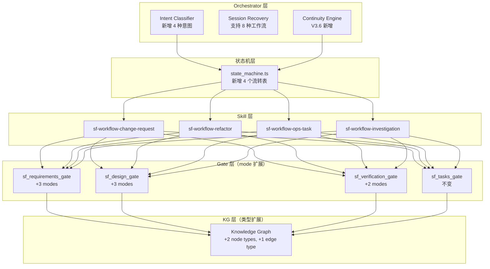
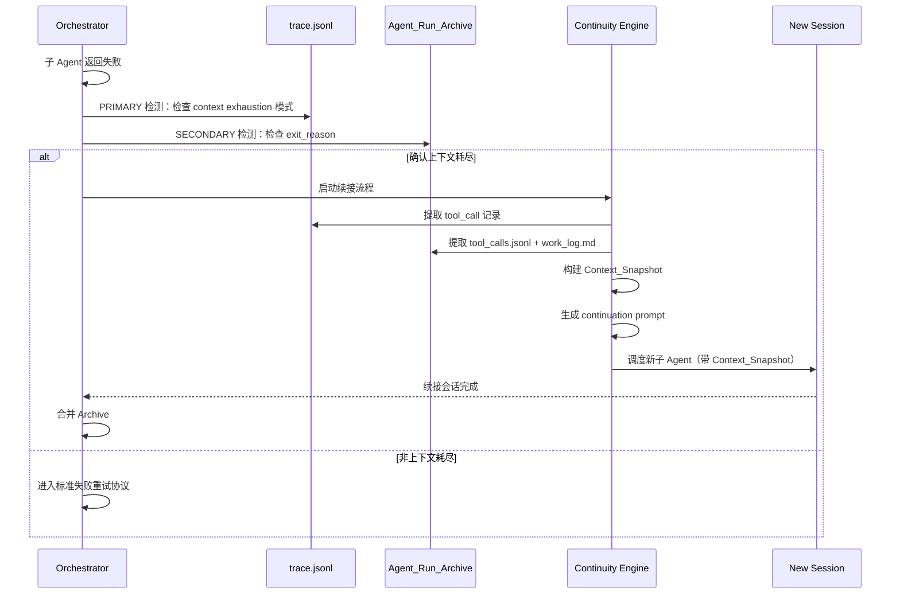
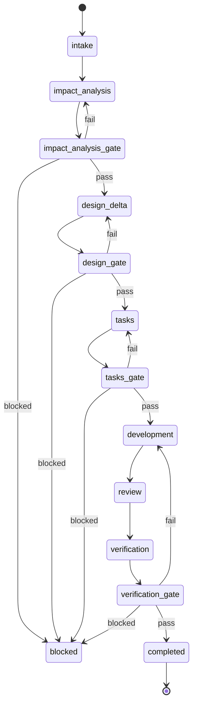
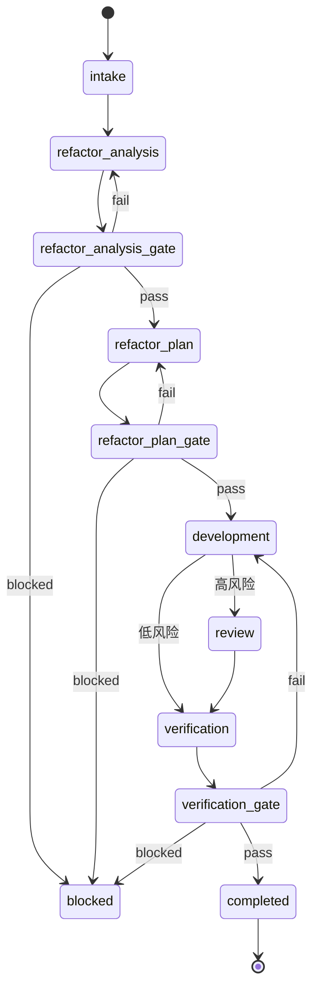
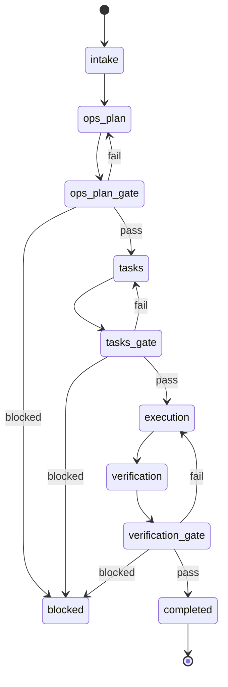
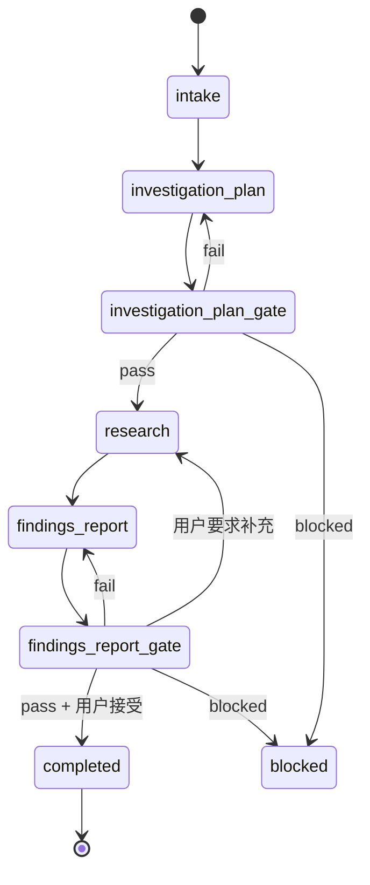

# 设计文档 — SpecForge V3.6（Session Continuity + New Workflows）

## 概述

V3.6 为 SpecForge 引入两大核心能力：

1. **跨会话续接（Cross-Session Continuity）**：当子 Agent 因上下文耗尽中断时，Orchestrator 自动从 trace.jsonl 和 Agent_Run_Archive 提取结构化 Context_Snapshot，生成续接 prompt 并在新会话中继续执行。最多允许 1-2 次续接（可配置），超限后回退到 blocked 行为。

2. **四种新工作流**：change_request、refactor、ops_task、investigation，每种工作流有独立的状态机流转表、Skill 文件和 Gate mode 定义。复用现有 9 个 Agent 和 Gate 工具，通过 mode 参数区分行为。

### 设计目标

- 自动续接消除人工重启，提升长任务完成率
- 新工作流覆盖变更请求、重构、运维、调查四大场景
- 向后兼容：现有 4 种工作流行为完全不变
- 复用现有 Agent/Gate/KG 基础设施，最小化新增代码

### 设计约束

- 不新增 Agent（复用现有 9 个）
- 不新增 Gate 工具（通过 mode 参数扩展现有 4 个 Gate）
- 状态机扩展遵循现有 `state_machine.ts` 的 Map-based 模式
- Skill 文件遵循 V3.2 建立的 `SKILL.md` 结构
- KG 类型扩展保持 union type 向后兼容

---

## 架构

### 整体架构变更



### 跨会话续接架构



---

## 组件和接口

### 1. Continuity Engine（跨会话续接引擎）

**位置：** `.opencode/tools/lib/sf_continuity_core.ts`（新增）

**职责：**
- 检测上下文耗尽事件
- 从多数据源提取 Context_Snapshot
- 生成续接 prompt
- 管理续接计数和链式 Archive

**注：** `sf_continuity_core.ts` 是纯核心逻辑模块，用于测试和验证。运行时，Orchestrator 通过 prompt 协议 + 现有工具（read/bash）实现等效行为。不需要单独的 Tool wrapper。

**接口：**

```typescript
// 检测上下文耗尽（双条件：run failed + trace 含耗尽模式）
function detectContextExhaustion(
  runFailed: boolean,
  traceEntries: TraceEntry[],
  archiveResult: ArchiveResult | null,
  runId: string,
  sessionId: string
): ExhaustionDetectionResult

// 提取 Context_Snapshot
function extractContextSnapshot(options: {
  workItemId: string
  runId: string
  sessionId: string
  workflowType: WorkflowType
  stage: string
  baseDir: string
}): Promise<ContextSnapshot | null>
// 注：sessionId 和 stage 从 Agent_Run_Archive/result.json 的 metadata 中获取

// 生成续接 prompt
function generateContinuationPrompt(
  originalTask: string,
  snapshot: ContextSnapshot,
  continuationIndex: number
): string

// 合并 Archive
function mergeArchives(
  originalArchive: AgentRunArchive,
  continuationArchive: AgentRunArchive
): MergedArchive
```

### 2. State Machine 扩展

**位置：** `.opencode/tools/lib/state_machine.ts`（修改）

**变更：**
- `WorkflowType` union 新增 4 个值
- 新增 4 个流转表常量
- `getTransitionTable` 新增 4 个 case 分支

### 3. Gate Mode Dispatcher

**位置：** 各 Gate core 文件（修改）

**模式：** 引入 `GateModeSpec` 策略表，Gate 函数通过查表 + 执行 `checkFn` 的方式分发到不同检查逻辑，替代 switch/if 分发。

```typescript
// GateModeSpec 策略表定义
interface GateModeSpec {
  mode: string
  targetFile: string
  requiredSections: string[]
  checkFn: (content: string, sections: Record<string, string>) => GateResult
}

// 示例：sf_requirements_gate 的策略表
const REQUIREMENTS_GATE_SPECS: GateModeSpec[] = [
  {
    mode: "change_request",
    targetFile: "impact_analysis.md",
    requiredSections: ["变更范围", "风险评估", "回归测试范围", "KG 关联"],
    checkFn: checkImpactAnalysisContent,
  },
  {
    mode: "refactor",
    targetFile: "refactor_analysis.md",
    requiredSections: ["代码问题识别", "重构目标", "不变行为声明", "风险评估"],
    checkFn: checkRefactorAnalysisContent,
  },
  {
    mode: "investigation",
    targetFile: "investigation_plan.md",
    requiredSections: ["调查目标", "调查范围", "调查方法", "预期产出格式"],
    checkFn: checkInvestigationPlanContent,
  },
]
```

Gate 函数执行流程：
1. 查找 `GateModeSpec` 表中匹配的 mode
2. 读取 `targetFile`
3. 解析 `requiredSections`
4. 调用 `checkFn(content, sections)` 返回 `GateResult`

```typescript
// sf_requirements_gate_core.ts 扩展（options object，向后兼容）
export async function checkRequirementsGate(
  workItemId: string,
  baseDir: string,
  options?: { mode?: RequirementsGateMode }
): Promise<GateResult>

// sf_design_gate_core.ts 扩展（options object，向后兼容）
export async function checkDesignGate(
  workItemId: string,
  baseDir: string,
  options?: { workflowType?: string; mode?: DesignGateMode }
): Promise<GateResult>

// sf_verification_gate_core.ts 扩展（options object，向后兼容）
export async function checkVerificationGate(
  workItemId: string,
  baseDir: string,
  options?: { mode?: VerificationGateMode }
): Promise<GateResult>
```

注：旧调用方不传 options 时继续使用默认行为（向后兼容）。

### 4. Intent Classifier 扩展

**位置：** `.opencode/agents/sf-orchestrator.md`（修改）

**变更：** 新增 4 种意图分类规则和优先级排序逻辑。

### 5. Skill 文件（4 个新增）

| Skill | 路径 | 工作流 |
|-------|------|--------|
| sf-workflow-change-request | `.opencode/skills/sf-workflow-change-request/SKILL.md` | change_request |
| sf-workflow-refactor | `.opencode/skills/sf-workflow-refactor/SKILL.md` | refactor |
| sf-workflow-ops-task | `.opencode/skills/sf-workflow-ops-task/SKILL.md` | ops_task |
| sf-workflow-investigation | `.opencode/skills/sf-workflow-investigation/SKILL.md` | investigation |

---

## 数据模型

### Context_Snapshot 数据结构

```typescript
interface ContextSnapshot {
  // === 通用字段（所有工作流） ===
  completed_work: {
    files_created: string[]
    files_modified: string[]
    verification_commands_passed: string[]
    description: string
  }
  artifacts: {
    files: string[]
    reports: string[]
    commands: string[]
    data: {
      metrics?: Record<string, number>
      test_results?: Array<{ name: string; passed: boolean }>
      command_outputs_summary?: string[]
      evidence_refs?: string[]
      extra?: Record<string, unknown>
    }
  }
  pending_work: {
    description: string
    remaining_tasks: string[]
    expected_output: string
  }
  key_decisions: Array<{
    decision: string
    rationale: string
    alternatives_rejected: string[]
  }>
  workflow_context: {
    workflow_type: WorkflowType
    stage: string
    expected_output: string
    work_item_id: string
    run_id: string
  }

  // === 可选代码相关字段 ===
  files_state?: Array<{
    path: string
    status: "created" | "modified" | "deleted"
    summary: string
  }>
  verification_results?: Array<{
    command: string
    exit_code: number
    passed: boolean
  }>

  // === 可选调查相关字段（investigation） ===
  evidence_collected?: Array<{
    type: string
    source: string
    summary: string
  }>
  open_questions?: string[]
  hypotheses?: Array<{
    hypothesis: string
    status: "confirmed" | "rejected" | "pending"
    evidence: string[]
  }>
}
```

### 续接链（Continuation Chain）

```typescript
interface ContinuationMetadata {
  continuation_parent_run_id: string   // 直接前驱 run_id
  continuation_root_run_id: string     // 续接链起始 run_id
  continuation_index: number           // 从 1 开始递增
}

// run_id 格式: <原run_id>-cont-<序号>
// 例: WI-001-sf-executor-1-cont-1, WI-001-sf-executor-1-cont-2

interface MergedArchive {
  files_changed: string[]              // 两次会话的并集
  duration_ms: number                  // 累加
  tool_calls: ToolCall[]               // 拼接
  continuation_chain: string[]         // [root_run_id, cont-1_run_id, ...]
}
```

### 新增 KG 类型

```typescript
// 扩展 NodeType union
export type NodeType =
  | "requirement"
  | "design_decision"
  | "task"
  | "code_file"
  | "refactor_target"    // V3.6 新增：重构目标
  | "ops_action"         // V3.6 新增：运维操作

// 扩展 EdgeType union
export type EdgeType =
  | "traces_to"
  | "decomposes_to"
  | "modifies"
  | "implements"
  | "affects"            // V3.6 新增：影响关系

// refactor_target 节点元数据
interface RefactorTargetMetadata extends NodeMetadata {
  smell_type?: string           // 代码坏味道类型
  risk_level?: "low" | "high"
  target_files?: string[]
}

// ops_action 节点元数据
interface OpsActionMetadata extends NodeMetadata {
  action_type?: string          // deploy, configure, migrate 等
  target_environment?: string
  rollback_defined?: boolean
}
```

### 知识提取扩展字段

```typescript
interface KnowledgeEntry {
  // ... 现有字段 ...
  workflow_type?: WorkflowType   // V3.6 新增：知识来源工作流
  confidence?: "high" | "medium" | "low"  // V3.6 新增：置信度
  // investigation 工作流默认 status="candidate", confidence="medium"
}
```

### project.json 配置扩展

```json
{
  "continuity": {
    "max_continuations": 1,
    "key_messages_count": 20
  }
}
```

---

## 状态机设计

### change_request 状态机



**流转表定义：**

```typescript
export const CHANGE_REQUEST_TRANSITIONS: ReadonlyMap<string, readonly string[]> =
  new Map<string, readonly string[]>([
    ["intake", ["impact_analysis"]],
    ["impact_analysis", ["impact_analysis_gate"]],
    ["impact_analysis_gate", ["design_delta", "impact_analysis", "blocked"]],
    ["design_delta", ["design_gate"]],
    ["design_gate", ["tasks", "design_delta", "blocked"]],
    ["tasks", ["tasks_gate"]],
    ["tasks_gate", ["development", "tasks", "blocked"]],
    ["development", ["review"]],
    ["review", ["verification"]],
    ["verification", ["verification_gate"]],
    ["verification_gate", ["completed", "development", "blocked"]],
  ])
```

### refactor 状态机



**流转表定义：**

```typescript
export const REFACTOR_TRANSITIONS: ReadonlyMap<string, readonly string[]> =
  new Map<string, readonly string[]>([
    ["intake", ["refactor_analysis"]],
    ["refactor_analysis", ["refactor_analysis_gate"]],
    ["refactor_analysis_gate", ["refactor_plan", "refactor_analysis", "blocked"]],
    ["refactor_plan", ["refactor_plan_gate"]],
    ["refactor_plan_gate", ["development", "refactor_plan", "blocked"]],
    ["development", ["review", "verification"]],
    ["review", ["verification"]],
    ["verification", ["verification_gate"]],
    ["verification_gate", ["completed", "development", "blocked"]],
  ])
```

**条件路径实现：** `development` 状态的合法目标包含 `review` 和 `verification` 两个选项。Orchestrator 在 `refactor_plan_gate` pass 时读取 `refactor_analysis.md` 中的风险等级，将路径选择记录到 Work Item 的 `metadata.risk_path` 字段。进入 `development` 后，Orchestrator 根据 `metadata.risk_path` 决定流转到 `review`（高风险）还是 `verification`（低风险）。状态机本身不强制路径——两个目标都是合法的——路径选择由 Orchestrator 业务逻辑控制。

**sf_state_transition 守卫：** 当 `workflowType="refactor"` 且 `from="development"` 时，`sf_state_transition` 必须读取 Work Item 的 `metadata.risk_path` 字段并强制执行路径约束：
- `risk_path="high"` → 仅允许流转到 `"review"`
- `risk_path="low"` → 仅允许流转到 `"verification"`
- `risk_path` 缺失 → 拒绝流转（blocked），要求 Orchestrator 先设置 risk_path

### ops_task 状态机



**流转表定义：**

```typescript
export const OPS_TASK_TRANSITIONS: ReadonlyMap<string, readonly string[]> =
  new Map<string, readonly string[]>([
    ["intake", ["ops_plan"]],
    ["ops_plan", ["ops_plan_gate"]],
    ["ops_plan_gate", ["tasks", "ops_plan", "blocked"]],
    ["tasks", ["tasks_gate"]],
    ["tasks_gate", ["execution", "tasks", "blocked"]],
    ["execution", ["verification"]],
    ["verification", ["verification_gate"]],
    ["verification_gate", ["completed", "execution", "blocked"]],
  ])
```

### investigation 状态机



**流转表定义：**

```typescript
export const INVESTIGATION_TRANSITIONS: ReadonlyMap<string, readonly string[]> =
  new Map<string, readonly string[]>([
    ["intake", ["investigation_plan"]],
    ["investigation_plan", ["investigation_plan_gate"]],
    ["investigation_plan_gate", ["research", "investigation_plan", "blocked"]],
    ["research", ["findings_report"]],
    ["findings_report", ["findings_report_gate"]],
    ["findings_report_gate", ["completed", "research", "findings_report", "blocked"]],
  ])
```

**用户接受守卫实现：** `findings_report_gate` 的流转目标包含 `completed`、`research`、`findings_report`、`blocked` 四个选项。Gate 工具返回 pass/fail/blocked 后，Orchestrator 在 pass 情况下向用户展示报告摘要并询问是否接受：
- 用户接受 → 流转到 `completed`
- 用户要求补充/修改 → 流转到 `research`（重新调查）
- Gate fail → 流转到 `findings_report`（修订报告）

**sf_state_transition 守卫：** 当 `workflowType="investigation"` 且 `from="findings_report_gate"` 且 `to="completed"` 时，`sf_state_transition` 必须检查 `transition_context.user_accepted === true`。如果 `user_accepted` 不为 true，拒绝流转。这确保 investigation 工作流的完成必须经过用户明确确认。

### sf_state_transition Workflow-Specific Guards 汇总

`sf_state_transition_core.ts` 中新增以下 workflow-specific 守卫逻辑，在标准流转表合法性检查之后执行：

```typescript
// Workflow-specific guards（在 isValidTransition 通过后执行）
function checkWorkflowGuards(
  workflowType: WorkflowType,
  from: string,
  to: string,
  workItem: WorkItem,
  transitionContext?: Record<string, unknown>
): GuardResult {
  // Guard 1: refactor risk_path
  if (workflowType === "refactor" && from === "development") {
    const riskPath = workItem.metadata?.risk_path
    if (riskPath === undefined) {
      return { allowed: false, reason: "risk_path missing in metadata, cannot determine path" }
    }
    if (riskPath === "high" && to !== "review") {
      return { allowed: false, reason: "risk_path=high requires transition to review" }
    }
    if (riskPath === "low" && to !== "verification") {
      return { allowed: false, reason: "risk_path=low requires transition to verification" }
    }
  }

  // Guard 2: investigation user_accepted
  if (workflowType === "investigation" && from === "findings_report_gate" && to === "completed") {
    if (transitionContext?.user_accepted !== true) {
      return { allowed: false, reason: "user_accepted must be true to complete investigation" }
    }
  }

  return { allowed: true }
}
```

---

## 算法设计

### 上下文耗尽检测算法

```pseudocode
function detectContextExhaustion(runFailed, traceEntries, archiveResult, runId, sessionId):
    // 前提条件：run 必须已失败，否则不检测
    if not runFailed:
        return { detected: false }

    // Cutoff 定义：先按 run_id/session_id 过滤，再取最后 100 条与最近 10 分钟的交集
    associatedEntries = traceEntries.filter(e => e.run_id == runId OR e.session_id == sessionId)
    last100 = associatedEntries.slice(-100)
    tenMinutesAgo = now() - 10_minutes
    recentEntries = last100.filter(e => e.timestamp >= tenMinutesAgo)

    exhaustionPatterns = [
        "context_length_exceeded",
        "max_tokens_reached",
        "context window",
        "token limit",
        "conversation too long"
    ]

    // PRIMARY 检测：仅匹配 tool_call 条目的 error_message 字段（不扫描任意文本）
    for entry in recentEntries.reverse():
        if entry.type == "tool_call" and entry.status == "error":
            if any(pattern in entry.error_message for pattern in exhaustionPatterns):
                return { detected: true, source: "trace.jsonl", confidence: "high" }
        if entry.type == "agent_response" and entry.status == "truncated":
            return { detected: true, source: "trace.jsonl", confidence: "high" }

    // SECONDARY 检测：Agent_Run_Archive result.json（仅检查 exit_reason）
    if archiveResult != null:
        if archiveResult.exit_reason in ["context_exhaustion", "token_limit"]:
            return { detected: true, source: "archive", confidence: "medium" }

    return { detected: false }
```

**检测要点：**
- 双条件触发：必须 run failed **且** 关联 trace 条目包含耗尽模式
- 模式匹配仅绑定到 `tool_call` 条目的 `error_message` 字段，不扫描任意文本字段
- Cutoff 定义：先按 run_id/session_id 过滤关联条目，再取最后 100 条与最近 10 分钟的交集
- SECONDARY 检测仅检查 `exit_reason` 字段，不依赖 `error_type`（Agent 在耗尽时可能无法可靠返回）

### Context_Snapshot 提取算法

```pseudocode
function extractContextSnapshot(options):
    { workItemId, runId, sessionId, workflowType, stage, baseDir } = options
    snapshot = new ContextSnapshot()
    snapshot.workflow_context = { workflowType, stage, workItemId, runId }

    // Step 1: PRIMARY 数据源 — tool_calls.jsonl
    toolCalls = readToolCalls(archivePath(runId))

    // Step 2: PRIMARY 数据源 — trace.jsonl
    traceEntries = readTraceEntries(baseDir, runId)

    // Step 3: 字段提取规则（显式来源优先级）
    // files_created / files_modified: 从 tool_calls.jsonl 中的 write/edit 工具调用 + 磁盘验证
    writeToolCalls = toolCalls.filter(tc => tc.tool in ["write", "edit", "create"])
    candidateFiles = writeToolCalls.map(tc => tc.arguments.path)
    snapshot.completed_work.files_created = candidateFiles.filter(f => isNewFile(f, traceEntries))
    snapshot.completed_work.files_modified = candidateFiles.filter(f => isExistingFile(f, traceEntries))
    // 磁盘验证：确认文件实际存在
    snapshot.completed_work.files_created = verifyExistOnDisk(snapshot.completed_work.files_created)
    snapshot.completed_work.files_modified = verifyExistOnDisk(snapshot.completed_work.files_modified)

    // verification_commands_passed: 从 bash 工具调用中 exit_code=0 的条目
    bashCalls = toolCalls.filter(tc => tc.tool == "bash" AND tc.exit_code == 0)
    snapshot.completed_work.verification_commands_passed = bashCalls.map(tc => tc.arguments.command)

    // key_decisions: 优先级来源
    // Priority 1: work_log.md 中的 "Decision/Reason" sections
    workLog = readWorkLog(archivePath(runId))
    if workLog != null:
        decisions = parseDecisionSections(workLog)
        if decisions.length > 0:
            snapshot.key_decisions = decisions
    // Priority 2: conversation.jsonl 中 agent_summary 类型的关键消息
    if snapshot.key_decisions is empty:
        config = readProjectConfig(baseDir)
        N = config.continuity?.key_messages_count ?? 20
        conversation = readConversation(sessionId)
        keyMessages = filterKeyMessages(conversation, N)
        summaryMessages = keyMessages.filter(m => classifyMessage(m) == "agent_summary")
        decisions = extractDecisionsFromSummaries(summaryMessages)
        if decisions.length > 0:
            snapshot.key_decisions = decisions
    // Priority 3: 空数组（绝不编造）
    if snapshot.key_decisions is empty:
        snapshot.key_decisions = []

    // pending_work: 优先级来源
    // Priority 1: work_log.md 中的 "pending/todo" sections
    if workLog != null:
        pending = parsePendingSections(workLog)
        if pending != null:
            snapshot.pending_work = pending
    // Priority 2: 从 stage 的 expected_output 推断，标记 inferred: true
    if snapshot.pending_work is empty:
        snapshot.pending_work = inferFromExpectedOutput(workflowType, stage)
        snapshot.pending_work.inferred = true

    // Step 4: artifacts 提取
    snapshot.artifacts = extractArtifacts(toolCalls, traceEntries)

    // Step 5: SECONDARY 数据源 — conversation.jsonl（最后 N 条关键消息）
    if not already_loaded:
        config = readProjectConfig(baseDir)
        N = config.continuity?.key_messages_count ?? 20
        conversation = readConversation(sessionId)
        keyMessages = filterKeyMessages(conversation, N)
    enrichFromConversation(snapshot, keyMessages)

    // Step 6: 验证数据源 — 磁盘文件状态
    if workflowType in CODE_WORKFLOWS:
        snapshot.files_state = verifyFilesOnDisk(snapshot.completed_work.files_modified)
        snapshot.verification_results = extractVerificationResults(toolCalls)

    if workflowType == "investigation":
        snapshot.evidence_collected = extractEvidence(toolCalls, keyMessages)
        snapshot.open_questions = extractOpenQuestions(keyMessages)
        snapshot.hypotheses = extractHypotheses(keyMessages)

    // Step 7: 完整性检查
    if snapshot.completed_work == empty AND snapshot.artifacts == empty:
        return null  // 提取失败，回退到 blocked

    return snapshot
```

**字段提取规则总结：**

| 字段 | 来源 | 说明 |
|------|------|------|
| `files_created` / `files_modified` | tool_calls.jsonl 中 write/edit 工具调用 + 磁盘验证 | 仅包含磁盘上实际存在的文件 |
| `verification_commands_passed` | tool_calls.jsonl 中 bash 调用且 exit_code=0 | — |
| `key_decisions` | P1: work_log.md "Decision/Reason" sections → P2: agent_summary 关键消息 → P3: 空数组 | 绝不编造 |
| `pending_work` | P1: work_log.md "pending/todo" sections → P2: 从 stage expected_output 推断（标记 `inferred: true`） | — |

### 关键消息过滤算法

```pseudocode
function filterKeyMessages(conversation, maxCount):
    priorityTypes = [
        "user_instruction",      // 最高优先级
        "agent_summary",
        "tool_call_result",
        "error_message",
        "file_change_description"
    ]
    skipTypes = [
        "file_read_repeat",      // 重复文件读取
        "intermediate_reasoning", // 中间推理
        "formatted_output"       // 格式化输出
    ]

    candidates = []
    for msg in conversation.reverse():
        msgType = classifyMessage(msg)
        if msgType in skipTypes:
            continue
        if msgType in priorityTypes:
            candidates.prepend(msg)
        if candidates.length >= maxCount:
            break

    return candidates
```

### 意图路由算法

```pseudocode
function classifyIntent(userInput):
    // Step 1: 关键词匹配，计算每个意图的匹配分数
    scores = {}
    for (intent, keywords) in INTENT_KEYWORDS:
        score = countMatches(userInput, keywords)
        if score > 0:
            scores[intent] = score

    // Step 2: 如果无匹配，返回现有路由逻辑
    if scores is empty:
        return fallbackToExistingRouting(userInput)

    // Step 3: 优先级排序（当多个意图匹配时）
    PRIORITY_ORDER = [
        "bugfix_spec",           // 1. 明确错误描述
        "investigation",         // 2. 仅调查/研究
        "ops_task",              // 3. 部署/运维操作
        "change_request",        // 4. 修改已有功能
        "refactor",              // 5. 结构性改善
        // 6. 其他 → 现有路由
    ]

    // Step 4: 按优先级选择最高匹配
    sortedIntents = sortByPriority(scores, PRIORITY_ORDER)
    topIntent = sortedIntents[0]
    secondIntent = sortedIntents[1] if len > 1 else null

    // Step 5: 置信度检查
    if secondIntent != null:
        confidenceGap = topIntent.score - secondIntent.score
        if confidenceGap < DISAMBIGUATION_THRESHOLD:
            // 低置信度：向用户展示候选
            return { type: "ambiguous", candidates: sortedIntents[:3] }

    return { type: "resolved", intent: topIntent.intent }
```

### Gate Mode 分发逻辑

```pseudocode
function checkGateWithMode(workItemId, baseDir, gateType, mode):
    // 无 mode 参数：默认行为（向后兼容）
    if mode == null:
        return existingGateCheck(workItemId, baseDir, gateType)

    // 查找 GateModeSpec 策略表
    specTable = GATE_MODE_SPECS[gateType]
    spec = specTable.find(s => s.mode == mode)

    // 未知 mode 处理
    if spec == null:
        return { status: "fail", warnings: ["Unsupported mode: " + mode] }

    // 按策略表执行
    filePath = resolveWorkItemPath(workItemId, baseDir, spec.targetFile)
    content = readFile(filePath)
    if content == null:
        return { status: "fail", blocking_issues: ["File not found: " + spec.targetFile] }

    sections = parseSections(content, spec.requiredSections)
    missingSections = spec.requiredSections.filter(s => sections[s] == null OR sections[s] == "")
    if missingSections.length > 0:
        return { status: "fail", blocking_issues: missingSections.map(s => "Missing section: " + s) }

    // 调用 mode 特定的检查函数
    return spec.checkFn(content, sections)
```

---

## Gate Mode 详细设计

### sf_requirements_gate mode 定义

| mode | 检查文件 | 必需 sections | pass 条件 |
|------|----------|--------------|-----------|
| 无（默认） | requirements.md | 用户故事、验收标准、术语表 | 现有逻辑不变 |
| `"change_request"` | impact_analysis.md | 变更范围、风险评估、回归测试范围、KG 关联 | 所有 section 非空，风险评估为合法值（高/中/低） |
| `"refactor"` | refactor_analysis.md | 代码问题识别、重构目标、不变行为声明、风险评估 | 所有 section 非空，不变行为声明明确 |
| `"investigation"` | investigation_plan.md | 调查目标、调查范围、调查方法、预期产出格式 | 所有 section 非空（轻量级） |

### sf_design_gate mode 定义

| mode | 检查文件 | 必需 sections | pass 条件 |
|------|----------|--------------|-----------|
| 无（默认） | design.md | 需求引用 | 现有逻辑不变 |
| `"change_request"` | design_delta.md | 增量设计描述、受影响模块、兼容性影响、回归风险、KG 追溯关系 | 所有 section 非空，增量设计与 impact_analysis 变更范围一致 |
| `"ops_task"` | ops_plan.md | 操作目标、前置条件、操作步骤、回滚方案、回滚触发条件、风险评估、影响范围 | 所有 section 非空，回滚方案覆盖每个操作步骤，回滚触发条件已定义 |
| `"refactor"` | refactor_plan.md | 重构策略、步骤顺序、风险等级判定 | 所有 section 非空 |
| `"investigation"` | findings_report.md | 调查结论、数据和证据、建议、限制 | 结论有证据支撑，建议可操作 |

### sf_verification_gate mode 定义

| mode | 额外检查 |
|------|----------|
| 无（默认） | 现有逻辑不变 |
| `"refactor"` | 所有现有测试通过（行为不变性）+ 代码质量指标改善 |
| `"ops_task"` | 操作结果与 ops_plan.md 预期结果一致 |
| `"change_request"` | 回归测试覆盖 impact_analysis.md 声明的受影响区域 |

### sf_tasks_gate

不新增 mode 参数。change_request 和 ops_task 工作流的 tasks 阶段产出标准 tasks.md，使用默认检查规则。

### Mode 参数实现模式

```typescript
// GateModeSpec 策略表驱动的实现模式（以 sf_requirements_gate_core.ts 为例）

type RequirementsGateMode = "change_request" | "refactor" | "investigation"

const REQUIREMENTS_GATE_SPECS: GateModeSpec[] = [
  {
    mode: "change_request",
    targetFile: "impact_analysis.md",
    requiredSections: ["变更范围", "风险评估", "回归测试范围", "KG 关联"],
    checkFn: (content, sections) => {
      const validRiskLevels = ["高", "中", "低"]
      if (!validRiskLevels.includes(sections["风险评估"].trim())) {
        return { status: "fail", blocking_issues: ["风险评估值不合法"], warnings: [], next_action: "revise" }
      }
      return { status: "pass", blocking_issues: [], warnings: [], next_action: "proceed" }
    },
  },
  // ... 其他 mode specs
]

export async function checkRequirementsGate(
  workItemId: string,
  baseDir: string,
  options?: { mode?: RequirementsGateMode }
): Promise<GateResult> {
  const mode = options?.mode

  // 无 mode：现有行为（向后兼容）
  if (mode === undefined) {
    return existingRequirementsGateCheck(workItemId, baseDir)
  }

  // 查找策略表
  const spec = REQUIREMENTS_GATE_SPECS.find(s => s.mode === mode)
  if (spec === undefined) {
    return {
      status: "fail",
      blocking_issues: [],
      warnings: [`Unsupported mode: "${mode}"`],
      next_action: "ask_user",
    }
  }

  // 读取目标文件
  const filePath = resolveWorkItemPath(workItemId, baseDir, spec.targetFile)
  const content = await readFile(filePath)
  if (content === null) {
    return {
      status: "fail",
      blocking_issues: [`File not found: ${spec.targetFile}`],
      warnings: [],
      next_action: "revise",
    }
  }

  // 解析 sections 并检查完整性
  const sections = parseSections(content, spec.requiredSections)
  const missing = spec.requiredSections.filter(s => !sections[s]?.trim())
  if (missing.length > 0) {
    return {
      status: "fail",
      blocking_issues: missing.map(s => `Missing section: ${s}`),
      warnings: [],
      next_action: "revise",
    }
  }

  // 执行 mode 特定检查
  return spec.checkFn(content, sections)
}
```

---

## Skill 文件设计

### 通用结构（遵循 V3.2 模式）

每个 Skill 文件包含：
1. YAML frontmatter（name、description、autoload: false）
2. 工作流阶段总览（状态机图）
3. Skill 绑定矩阵（阶段→Agent→Skill 映射）
4. 各阶段执行协议（详细步骤）

### sf-workflow-change-request Skill 绑定矩阵

| 阶段 | 调度的子 Agent | 加载的 Skill | 产物 |
|------|---------------|-------------|------|
| intake | —（Orchestrator） | — | intake.md |
| impact_analysis | sf-requirements | — | impact_analysis.md |
| impact_analysis_gate | — | — | Gate 判定 |
| design_delta | sf-design | — | design_delta.md |
| design_gate | — | — | Gate 判定 |
| tasks | sf-task-planner | superpowers-writing-plans | tasks.md |
| tasks_gate | — | — | Gate 判定 |
| development | sf-executor | superpowers-subagent-driven-development | 代码文件 |
| review | sf-reviewer | superpowers-code-review | 审查意见 |
| verification | sf-verifier | superpowers-verification-before-completion | 验证报告 |
| verification_gate | — | — | Gate 判定 |

### sf-workflow-refactor Skill 绑定矩阵

| 阶段 | 调度的子 Agent | 加载的 Skill | 产物 |
|------|---------------|-------------|------|
| intake | —（Orchestrator） | — | intake.md |
| refactor_analysis | sf-design | — | refactor_analysis.md |
| refactor_analysis_gate | — | — | Gate 判定 |
| refactor_plan | sf-design | — | refactor_plan.md |
| refactor_plan_gate | — | — | Gate 判定 + 风险路径决定 |
| development | sf-executor | superpowers-subagent-driven-development | 代码文件 |
| review（高风险） | sf-reviewer | superpowers-code-review | 审查意见 |
| verification | sf-verifier | superpowers-verification-before-completion | 验证报告 |
| verification_gate | — | — | Gate 判定 |

### sf-workflow-ops-task Skill 绑定矩阵

| 阶段 | 调度的子 Agent | 加载的 Skill | 产物 |
|------|---------------|-------------|------|
| intake | —（Orchestrator） | — | intake.md |
| ops_plan | sf-design | — | ops_plan.md |
| ops_plan_gate | — | — | Gate 判定（含安全检查） |
| tasks | sf-task-planner | superpowers-writing-plans | tasks.md |
| tasks_gate | — | — | Gate 判定 |
| execution | sf-executor | — | 运维操作结果 |
| verification | sf-verifier | superpowers-verification-before-completion | 验证报告 |
| verification_gate | — | — | Gate 判定 |

### sf-workflow-investigation Skill 绑定矩阵

| 阶段 | 调度的子 Agent | 加载的 Skill | 产物 |
|------|---------------|-------------|------|
| intake | —（Orchestrator） | — | intake.md |
| investigation_plan | sf-design | — | investigation_plan.md |
| investigation_plan_gate | — | — | Gate 判定 |
| research | sf-executor | — | 调查数据/中间产物 |
| findings_report | sf-design | — | findings_report.md |
| findings_report_gate | — | — | Gate 判定 + 用户确认 |

---

## KG 集成设计

### 新工作流 KG 同步矩阵

| 工作流 | Gate | scope | 同步内容 |
|--------|------|-------|----------|
| change_request | impact_analysis_gate | requirements | requirement 节点 + affects 边 |
| change_request | design_gate | design | design_decision 节点 + traces_to 边 |
| change_request | tasks_gate | tasks | task/code_file 节点 + modifies 边 |
| change_request | verification_gate | verification | 全量同步 |
| refactor | refactor_analysis_gate | requirements | refactor_target 节点 |
| refactor | refactor_plan_gate | tasks | code_file 节点 + modifies 边 |
| refactor | verification_gate | verification | 全量同步 |
| ops_task | ops_plan_gate | design | ops_action 节点 |
| ops_task | tasks_gate | tasks | task 节点 |
| ops_task | verification_gate | verification | 全量同步 |
| investigation | — | — | 不同步 KG |

### refactor_plan_gate 触发 KG 同步

refactor 工作流没有 tasks_gate（refactor_plan 直接进入 development），因此 KG 同步在 `refactor_plan_gate` pass 时触发，scope 设为 `"tasks"`。实现方式：在 `sf_design_gate_core.ts` 的 `mode="refactor"` 分支中，Gate pass 后调用 `syncFromSpec(workItemId, baseDir, "tasks")`，解析 `refactor_plan.md` 中涉及的文件列表生成 code_file 节点和 modifies 边。

### 类型扩展向后兼容

```typescript
// isValidNodeType 扩展
const VALID_NODE_TYPES: NodeType[] = [
  "requirement", "design_decision", "task", "code_file",
  "refactor_target", "ops_action"  // V3.6 新增
]

// isValidEdgeType 扩展
const VALID_EDGE_TYPES: EdgeType[] = [
  "traces_to", "decomposes_to", "modifies", "implements",
  "affects"  // V3.6 新增
]

// 现有 graph.json 无需迁移：新类型仅在新工作流创建时产生
// sf_knowledge_query 对不认识的类型正常返回（不报错）
```

---

## Orchestrator 路由层更新

### 新增意图分类规则

```typescript
const INTENT_KEYWORDS = {
  change_request: ["变更", "修改已有", "改现有功能", "change request", "CR", "变更请求"],
  refactor: ["重构", "refactor", "代码整理", "技术债务", "代码质量"],
  ops_task: ["部署", "配置", "运维", "deploy", "infrastructure", "ops", "迁移"],
  investigation: ["调查", "研究", "分析", "investigate", "research", "技术选型", "性能分析"],
}
```

### 新增 Skill 路由表

| Workflow_Type | Workflow_Skill |
|---------------|---------------|
| change_request | sf-workflow-change-request |
| refactor | sf-workflow-refactor |
| ops_task | sf-workflow-ops-task |
| investigation | sf-workflow-investigation |

### 优先级排序

当用户输入匹配多个意图时，按以下优先级选择：

1. `bugfix_spec` — 包含明确错误描述或失败测试
2. `investigation` — 仅调查/研究，不涉及代码变更
3. `ops_task` — 涉及部署/环境/服务运维操作
4. `change_request` — 修改已有业务功能
5. `refactor` — 明确声明"不改变行为"的结构性改善
6. 其他 → 现有路由逻辑

### 低置信度消歧 UX

当 top-2 意图分数差距 < 阈值时，Orchestrator 向用户展示：

```
🤔 意图识别
━━━━━━━━━━━━━━━━━━━━
你的请求可能匹配以下工作流：
1. change_request（变更请求）— 修改已有功能，含影响分析
2. refactor（重构）— 纯结构性改善，不改变行为
━━━━━━━━━━━━━━━━━━━━
请确认你想使用哪个工作流？
```

---

## 知识提取集成

### investigation 工作流特殊处理

investigation 工作流提取的知识条目默认：
- `status: "candidate"`（非 `"active"`）
- `confidence: "medium"`（研究性结论，需后续验证）
- `workflow_type: "investigation"`

其他工作流提取的知识条目：
- `status: "active"`（默认行为不变）
- `confidence: "high"`（经过完整开发验证流程）
- `workflow_type: <对应工作流类型>`

### sf-knowledge Agent 扩展

sf-knowledge Agent 在提取知识时检查 Work Item 的 workflow_type：

```pseudocode
function extractKnowledge(workItemId, sessionId):
    workItem = readWorkItem(workItemId)
    entries = performExtraction(workItemId, sessionId)

    for entry in entries:
        entry.workflow_type = workItem.workflow_type
        if workItem.workflow_type == "investigation":
            entry.status = "candidate"
            entry.confidence = "medium"
        else:
            entry.status = "active"
            entry.confidence = "high"

    saveEntries(entries)
```

---

## 文件修改清单

### 新增文件

| 文件路径 | 说明 |
|----------|------|
| `.opencode/tools/lib/sf_continuity_core.ts` | 跨会话续接核心逻辑 |
| `.opencode/skills/sf-workflow-change-request/SKILL.md` | change_request 工作流 Skill |
| `.opencode/skills/sf-workflow-refactor/SKILL.md` | refactor 工作流 Skill |
| `.opencode/skills/sf-workflow-ops-task/SKILL.md` | ops_task 工作流 Skill |
| `.opencode/skills/sf-workflow-investigation/SKILL.md` | investigation 工作流 Skill |
| `tests/unit/tools/lib/sf_continuity_core.test.ts` | Continuity Engine 单元测试 |
| `tests/property/state_machine.property.test.ts` | 状态机流转属性测试 |
| `tests/property/continuity.property.test.ts` | 跨会话续接属性测试 |
| `tests/property/intent_routing.property.test.ts` | 意图路由属性测试 |
| `tests/property/gate_mode.property.test.ts` | Gate mode 分发属性测试 |
| `tests/property/kg_types.property.test.ts` | KG 类型扩展属性测试 |

### 修改文件

| 文件路径 | 变更内容 |
|----------|----------|
| `.opencode/tools/lib/state_machine.ts` | 新增 4 个流转表、扩展 WorkflowType union、扩展 getTransitionTable |
| `.opencode/tools/lib/sf_knowledge_graph_core.ts` | 扩展 NodeType/EdgeType union、扩展 VALID_NODE_TYPES/VALID_EDGE_TYPES 数组 |
| `.opencode/tools/lib/sf_requirements_gate_core.ts` | 新增 mode 参数（options object）、新增 GateModeSpec 策略表、新增 3 个 mode checkFn |
| `.opencode/tools/lib/sf_design_gate_core.ts` | 新增 mode 参数、新增 4 个 mode 检查函数 |
| `.opencode/tools/lib/sf_verification_gate_core.ts` | 新增 mode 参数、新增 3 个 mode 检查函数 |
| `.opencode/tools/sf_requirements_gate.ts` | 传递 mode 参数到 core |
| `.opencode/tools/sf_design_gate.ts` | 传递 mode 参数到 core |
| `.opencode/tools/sf_verification_gate.ts` | 传递 mode 参数到 core |
| `.opencode/tools/sf_state_transition.ts` | 识别新增 4 种 workflow_type |
| `.opencode/tools/lib/sf_state_transition_core.ts` | 新增 workflow-specific guards（refactor risk_path、investigation user_accepted） |
| `.opencode/agents/sf-orchestrator.md` | 新增意图分类、路由表、续接协议、优先级规则 |
| `.opencode/tools/lib/sf_knowledge_base_core.ts` | 支持 workflow_type 和 confidence 字段 |
| `AGENTS.md` | 更新工作流列表、Skill 列表、路由表 |
| `specforge/config/project.json` | 新增 continuity 配置节 |

---

## 正确性属性

*正确性属性是在系统所有合法执行中都应成立的特征或行为——本质上是对系统应做什么的形式化陈述。属性是人类可读规格与机器可验证正确性保证之间的桥梁。*

### Property 1: 状态机流转合法性

*对于任意* 工作流类型（包括新增的 change_request、refactor、ops_task、investigation）和任意 (from_state, to_state) 对，`isValidTransition(from, to, workflowType)` 返回 true 当且仅当该对存在于对应工作流的流转表中；返回 false 当且仅当该对不在流转表中。

**Validates: Requirements 2.1, 2.2, 3.1, 3.2, 4.1, 4.2, 5.1, 5.2, 6.3, 6.4, 8.1, 8.4**

### Property 2: 上下文耗尽検出正確性（双条件）

*対于任意* trace.jsonl 条目序列和 Agent_Run_Archive result.json，`detectContextExhaustion` 返回 `detected: true` 当且仅当（run failed **且** 关联该 run_id 的 trace 条目的 `error_message` 字段包含上下文耗尽模式（context_length_exceeded、max_tokens_reached 等）**或** result.json 的 exit_reason 为 context_exhaustion/token_limit）。其他字段中出现 "token limit" 等文本 **不得** 触发检测。run 未失败时，即使 trace 中存在耗尽模式也不得返回 detected: true。

**Validates: Requirements 1.1**

### Property 3: Context_Snapshot 结构完整性

*对于任意* 有效的 (workflowType, toolCalls, traceEntries) 组合，提取的 Context_Snapshot 必须包含所有通用字段（completed_work、artifacts、pending_work、key_decisions、workflow_context），且根据 workflow_type 正确包含可选字段：代码相关工作流包含 files_state/verification_results，investigation 包含 evidence_collected/open_questions/hypotheses。

**Validates: Requirements 1.2, 1.3, 7.2**

### Property 4: 关键消息过滤正确性

*对于任意* 会话消息序列和配置的 N 值，`filterKeyMessages` 返回的消息数量 ≤ N，且返回的消息仅包含关键类型（user_instruction、agent_summary、tool_call_result、error_message、file_change_description），不包含非关键类型（file_read_repeat、intermediate_reasoning、formatted_output）。

**Validates: Requirements 1.4**

### Property 5: 续接 prompt 结构完整性

*对于任意* 有效的 Context_Snapshot 和 continuation_index，生成的续接 prompt 必须包含：原始任务描述、Context_Snapshot 中的所有结构化信息、续接指令文本、格式正确的 run_id（`<原run_id>-cont-<序号>`）。

**Validates: Requirements 1.5**

### Property 6: 续接次数上限强制

*对于任意* max_continuations 值（1 或 2），系统允许恰好 max_continuations 次续接后标记 blocked。即 continuation_index 从 1 递增到 max_continuations 时允许续接，continuation_index > max_continuations 时拒绝。

**Validates: Requirements 1.6**

### Property 7: 续接链元数据一致性

*对于任意* 续接链（长度 1 到 max_continuations），每个续接会话的 Archive 必须满足：continuation_root_run_id 等于链中第一个会话的 run_id，continuation_parent_run_id 等于直接前驱的 run_id，continuation_index 严格递增且从 1 开始。

**Validates: Requirements 1.7**

### Property 8: Archive 合并正确性

*对于任意* 两个有效的 Agent_Run_Archive（原始和续接），合并结果的 files_changed 等于两者的并集，duration_ms 等于两者之和，tool_calls 等于两者的有序拼接。

**Validates: Requirements 1.8**

### Property 9: 意图分类优先级正确性

*对于任意* 同时包含多个工作流关键词的用户输入，意图分类器返回的结果必须是优先级最高的匹配意图（按 bugfix > investigation > ops_task > change_request > refactor 排序），或在分数差距小于阈值时返回 ambiguous 状态。

**Validates: Requirements 6.1, 6.6**

### Property 10: Gate mode 分发正确性

*对于任意* (gate_type, mode, document_content) 组合，Gate 返回 pass 当且仅当 document_content 包含该 mode 定义的所有必需 sections 且满足对应的 pass 条件；不传 mode 时行为与 V3.5 完全一致。

**Validates: Requirements 11.1, 11.2, 11.4, 11.5**

### Property 11: KG 类型扩展向后兼容

*对于任意* 现有 graph.json 文件（仅包含 V4.0 类型），新增的 NodeType/EdgeType 值不会导致现有查询失败或数据损坏。`isValidNodeType` 和 `isValidEdgeType` 对新增类型返回 true，对现有类型的行为不变。

**Validates: Requirements 9.7, 9.8**

### Property 12: refactor 风险路径守卫

*对于任意* `workflowType="refactor"` 且 Work Item `metadata.risk_path="high"` 的情况，`sf_state_transition` 必须拒绝 `development → verification` 的流转。仅允许 `development → review`。反之，`risk_path="low"` 时必须拒绝 `development → review`，仅允许 `development → verification`。`risk_path` 缺失时，必须拒绝 `development` 的所有流转（blocked）。

**Validates: Requirements 3.1, 3.2, 3.8**

### Property 13: investigation 用户接受守卫

*对于任意* `workflowType="investigation"` 的情况，`sf_state_transition` 必须拒绝 `findings_report_gate → completed` 的流转，除非 `transition_context.user_accepted === true`。当 `user_accepted` 不为 true（包括 false、undefined、缺失）时，流转必须被拒绝。

**Validates: Requirements 5.1, 5.13**

---

## 错误处理

### 跨会话续接错误处理

| 错误场景 | 处理方式 |
|----------|----------|
| Context_Snapshot 提取失败（所有数据源不可用） | 回退到 blocked，记录 `continuity.extraction_failed` 事件 |
| 续接次数达到上限 | 标记 blocked，向用户报告续接链历史 |
| 续接会话也失败 | 按标准失败重试协议处理（不再续接） |
| Archive 合并失败 | 保留两个独立 Archive，记录警告 |

### Gate Mode 错误处理

| 错误场景 | 处理方式 |
|----------|----------|
| 未知 mode 值 | 返回 fail，warnings 中说明不支持的 mode |
| mode 对应的文件不存在 | 返回 fail，blocking_issues 中说明文件缺失 |
| mode 对应的 section 缺失 | 返回 fail，blocking_issues 中列出缺失 sections |

### 新工作流错误处理

| 错误场景 | 处理方式 |
|----------|----------|
| ops_task execution 命令输出与预期不匹配 | fail-stop，报告异常，检查回滚触发条件 |
| investigation findings_report_gate 用户拒绝 | 回退到 research 重新调查 |
| refactor verification 现有测试失败 | 回退到 development，附带失败测试信息 |

---

## 测试策略

### 单元测试

**状态机测试（state_machine.ts）：**
- 每个新流转表的所有合法路径验证
- 非法流转（跳过阶段、逆向）拒绝验证
- `getTransitionTable` 对新 workflow_type 返回正确表
- 现有 4 种工作流的流转行为回归

**Gate Mode 测试（各 gate_core.ts）：**
- 每个 mode 的 pass/fail 场景
- 无 mode 参数时行为回归
- 未知 mode 返回 fail + warning
- ops_plan_gate 安全检查（缺少回滚计划/触发条件/备份声明时 fail）

**Continuity Engine 测试（sf_continuity_core.ts）：**
- 上下文耗尽检测（各种模式匹配）
- Context_Snapshot 提取（各工作流类型的字段选择）
- 关键消息过滤（优先级和数量限制）
- 续接 prompt 生成（结构完整性）
- Archive 合并（files_changed 并集、duration 累加）
- 续接计数器（上限强制）

**KG 类型测试（sf_knowledge_graph_core.ts）：**
- 新增 NodeType/EdgeType 的验证函数
- 现有类型行为不变

**意图分类测试：**
- 各工作流关键词正确匹配
- 优先级排序正确
- 低置信度消歧触发

### 属性测试（Property-Based Testing）

**测试框架：** fast-check（TypeScript PBT 库）

**配置：** 每个属性测试最少 100 次迭代

**属性测试清单：**

| Property | 测试文件 | Tag |
|----------|----------|-----|
| Property 1 | `state_machine.property.test.ts` | Feature: specforge-v36-workflows, Property 1: State machine transition validity |
| Property 2 | `continuity.property.test.ts` | Feature: specforge-v36-workflows, Property 2: Context exhaustion detection (dual-condition) |
| Property 3 | `continuity.property.test.ts` | Feature: specforge-v36-workflows, Property 3: Context_Snapshot structure completeness |
| Property 4 | `continuity.property.test.ts` | Feature: specforge-v36-workflows, Property 4: Key message filtering |
| Property 5 | `continuity.property.test.ts` | Feature: specforge-v36-workflows, Property 5: Continuation prompt structure |
| Property 6 | `continuity.property.test.ts` | Feature: specforge-v36-workflows, Property 6: Continuation counter enforcement |
| Property 7 | `continuity.property.test.ts` | Feature: specforge-v36-workflows, Property 7: Continuation chain metadata |
| Property 8 | `continuity.property.test.ts` | Feature: specforge-v36-workflows, Property 8: Archive merge correctness |
| Property 9 | `intent_routing.property.test.ts` | Feature: specforge-v36-workflows, Property 9: Intent classification priority |
| Property 10 | `gate_mode.property.test.ts` | Feature: specforge-v36-workflows, Property 10: Gate mode dispatch |
| Property 11 | `kg_types.property.test.ts` | Feature: specforge-v36-workflows, Property 11: KG type extensibility |
| Property 12 | `state_machine.property.test.ts` | Feature: specforge-v36-workflows, Property 12: Refactor risk_path guard |
| Property 13 | `state_machine.property.test.ts` | Feature: specforge-v36-workflows, Property 13: Investigation user_accepted guard |

### 集成测试

- Skill 文件加载验证（4 个新 Skill 存在且格式正确）
- Orchestrator 路由表映射正确性
- 新工作流端到端流程（intake → completed）
- KG 同步在 Gate pass 时触发
- 知识提取在 completed 时触发
- investigation 知识条目 status 为 candidate

### 回归测试

- 现有 4 种工作流的触发输入仍路由到原有工作流
- 不传 mode 参数时 Gate 行为与 V3.5 一致
- 现有 16 个 Custom Tool 的输入输出契约不变
- 现有 KG 查询对新类型不报错
