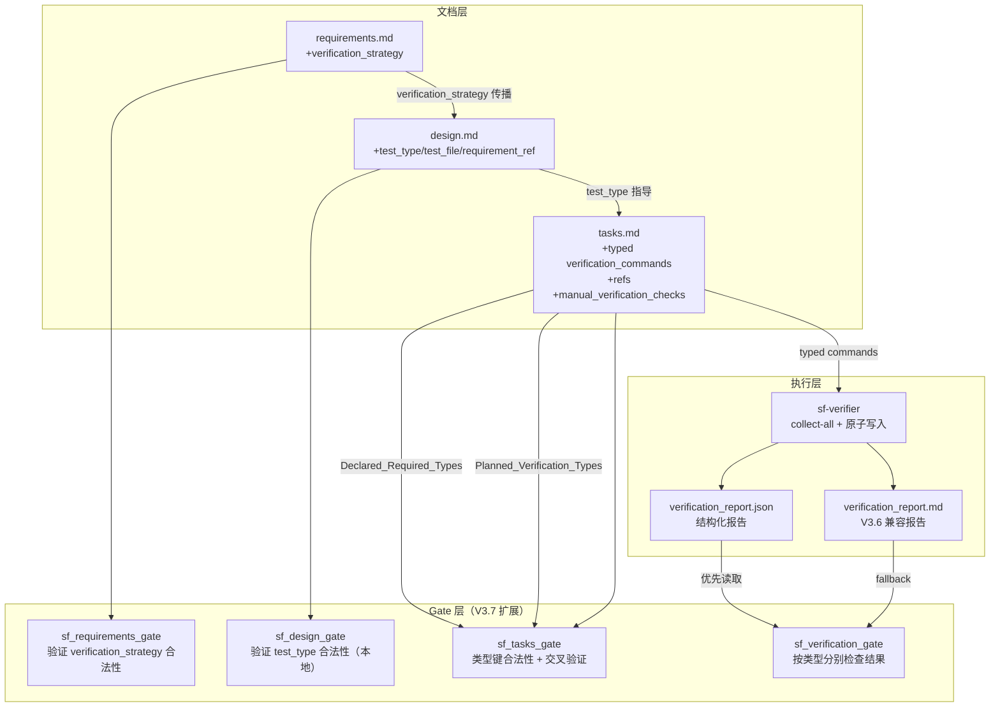

# 设计文档 — SpecForge V3.7（Verification Strategy）

## 概述

V3.7 为 SpecForge 引入系统化的验证策略管理能力，在 requirements → design → tasks 三个层面建立类型化的验证绑定链路。

**核心变更：**

1. **requirements.md 层**：每个需求可声明可选的 `verification_strategy` 字段，指定应使用哪种检测方式（unit / property / integration / e2e / regression）验证该需求。
2. **design.md 层**：Correctness Properties 新增 `test_type`、`test_file`、`requirement_ref` 字段，将设计层面的验证意图与测试文件明确关联。
3. **tasks.md 层**：`verification_commands` 从平铺字符串列表升级为按类型分组的结构化对象；新增 `refs` 字段建立机器可追溯链路；新增 `manual_verification_checks` 字段分离非可执行检查项。
4. **Gate 层**：`sf_requirements_gate` 验证 `verification_strategy` 合法性；`sf_design_gate` 验证 `test_type` 合法性（本地语法，不跨文件）；`sf_tasks_gate` 执行 Planned_Verification_Types vs Declared_Required_Types 交叉验证；`sf_verification_gate` 按类型分别检查测试结果。
5. **sf-verifier 层**：读取类型化命令，使用 collect-all 策略执行，原子写入结构化 `verification_report.json`，同时保留 V3.6 兼容的 `verification_report.md`。

### 设计目标

- 验证意图在文档层面显式化，从需求到测试文件全链路可追溯
- Gate 双重保障：sf_tasks_gate 交叉验证覆盖性，sf_verification_gate 验证执行结果
- 结构化报告消除自然语言解析的不确定性
- 所有变更向后兼容：V3.6 格式文档行为完全不变

### 设计约束

- `verification_strategy` 为可选字段，不声明时行为与 V3.6 完全一致
- 旧格式 `verification_commands`（平铺列表）继续通过所有 Gate，仅新增 non-blocking warning
- `verification_report.json` 为新增文件；`sf_verification_gate` 优先读取它，不存在时回退到 V3.6 行为
- `GateResult` 接口扩展为可选 `details` 字段，不新增顶层必填字段
- `sf_design_gate` 默认模式只做本地语法检查，不跨文件读取 requirements.md

---

## 架构

### 整体架构变更



### 策略传播链路

```
requirements.md                    design.md                      tasks.md
┌─────────────────────┐           ┌──────────────────────┐       ┌──────────────────────────┐
│ REQ-1               │           │ CP-1                 │       │ TASK-1                   │
│ verification_strategy│──────────▶│ test_type: property  │──────▶│ verification_commands:   │
│ [unit, property]    │           │ test_file: tests/... │       │   unit: bun test ...     │
│                     │           │ requirement_ref: REQ-1│       │   property: bun test ... │
└─────────────────────┘           └──────────────────────┘       │ refs: [REQ-1, CP-1]      │
                                                                  └──────────────────────────┘
         │                                                                    │
         ▼                                                                    ▼
  Declared_Required_Types                                      Planned_Verification_Types
  {unit, property}                                             {unit, property}
         │                                                                    │
         └──────────────────── sf_tasks_gate 交叉验证 ──────────────────────┘
                               Planned ⊇ Declared → pass
```

---

## 组件和接口

### DD-1 TypeScript 类型定义（新增）

**位置：** `.opencode/tools/lib/sf_verification_types.ts`（新增文件）

所有 V3.7 新增类型集中在此文件，供各 core 模块导入。

```typescript
/**
 * V3.7 Verification Strategy 类型定义
 * 集中管理所有新增类型，供各 core 模块导入
 */

// ============================================================
// VerificationType — 5 种合法检测方法
// ============================================================

export type VerificationType = "unit" | "property" | "integration" | "e2e" | "regression"

export const VALID_VERIFICATION_TYPES: readonly VerificationType[] = [
  "unit",
  "property",
  "integration",
  "e2e",
  "regression",
] as const

/**
 * 判断字符串是否为合法 VerificationType（大小写不敏感）
 */
export function isValidVerificationType(value: string): boolean {
  return VALID_VERIFICATION_TYPES.includes(value.toLowerCase() as VerificationType)
}

/**
 * 将字符串规范化为小写 VerificationType
 * 若非法则返回 null
 */
export function normalizeVerificationType(value: string): VerificationType | null {
  const lower = value.toLowerCase()
  if (VALID_VERIFICATION_TYPES.includes(lower as VerificationType)) {
    return lower as VerificationType
  }
  return null
}

// ============================================================
// VerificationStrategy — requirements.md 中的需求级声明
// ============================================================

/**
 * 解析后的 VerificationStrategy（已规范化为小写，已去重）
 */
export type VerificationStrategy = VerificationType[]

/**
 * 从 Markdown 文本中解析 verification_strategy 字段
 *
 * 支持格式：
 *   **verification_strategy**: [unit, property, integration]
 *   **verification_strategy**: unit, property
 *   **verification_strategy**: unit
 *
 * @returns 解析结果，包含规范化后的类型列表和任何警告/错误
 */
export interface ParseVerificationStrategyResult {
  types: VerificationType[]
  warnings: string[]
  errors: string[]
}

// ============================================================
// TypedVerificationCommands — tasks.md 中的类型化命令结构
// ============================================================

/**
 * 单个类型分组下的命令（字符串或字符串列表）
 */
export type TypedCommandEntry = string | string[]

/**
 * 类型化 verification_commands 对象
 * 键为 VerificationType，值为单条命令或命令列表
 */
export type TypedVerificationCommands = Partial<Record<VerificationType, TypedCommandEntry>>

/**
 * 解析后的 task verification 信息
 */
export interface ParsedTaskVerification {
  /** 类型化命令（若使用新格式） */
  typedCommands?: TypedVerificationCommands
  /** 旧格式命令列表（若使用旧格式） */
  legacyCommands?: string[]
  /** 人工检查项（不执行） */
  manualChecks?: string[]
  /** refs 字段（REQ-N 和 CP-N 引用） */
  refs?: string[]
  /** 格式类型 */
  format: "typed" | "legacy" | "empty"
  /** 非法的类型键（如 smoke:），由 sf_tasks_gate / sf_doc_lint 报错 */
  invalidTypedKeys?: string[]
}

// ============================================================
// VerificationReport — verification_report.json schema
// ============================================================

export type CommandStatus = "passed" | "failed" | "skipped"
export type ReportStatus = "completed" | "incomplete"
export type TypeResultStatus = "passed" | "missing" | "failed" | "skipped"

export interface VerificationCommandRecord {
  /** Verification_Type — typed 命令必填，旧格式命令省略 */
  type?: VerificationType
  /** 执行的命令字符串 */
  command: string
  /** 执行状态 */
  status: CommandStatus
  /** 退出码（skipped 时为 -1） */
  exit_code: number
  /** 标准输出（可选） */
  stdout?: string
  /** 标准错误（可选） */
  stderr?: string
}

export interface VerificationReport {
  /** Schema 版本，当前为 "1.0" */
  schema_version: "1.0"
  /** Work Item ID */
  work_item_id: string
  /** 报告状态：sf-verifier 正常完成时为 "completed" */
  status: ReportStatus
  /** 命令执行记录数组 */
  commands: VerificationCommandRecord[]
}

// ============================================================
// GateResult 扩展 — details.type_results
// ============================================================

export interface TypeResults {
  [type: string]: TypeResultStatus
}

export interface VerificationGateDetails {
  type_results: TypeResults
}
```

### DD-2 GateResult 接口扩展

**位置：** `.opencode/tools/lib/sf_gate_types.ts`（新增）

**模块边界说明：** GateResult 和 SyncSummary 类型从 sf_requirements_gate_core.ts 迁移到独立的 sf_gate_types.ts，所有 Gate core 模块从此文件导入共享类型。sf_requirements_gate_core.ts 保留 re-export 以保持向后兼容：
```typescript
// sf_requirements_gate_core.ts — 向后兼容 re-export
export type { GateResult, SyncSummary } from "./sf_gate_types"
```

在现有 `GateResult` 接口中新增可选 `details` 字段：

```typescript
export interface GateResult {
  status: "pass" | "fail" | "blocked"
  blocking_issues: string[]
  warnings: string[]
  next_action: "continue" | "revise" | "ask_user"
  kg_sync?: SyncSummary | null
  details?: Record<string, unknown>  // V3.7 新增，可选
}
```

**设计决策：** 新增输出数据放置在可选 `details` 字段下，不新增顶层必填字段，确保现有调用方无需修改。`details` 字段的具体内容由各 Gate 工具自行定义（如 `sf_verification_gate` 使用 `details.type_results`）。

### DD-3 Markdown 解析：requirements.md verification_strategy 字段

**位置：** `.opencode/tools/lib/sf_verification_types.ts`（新增）

**解析目标：** 在 requirements.md 中，每个需求（`### REQ-N` 标题下）的验收标准区块中查找 `verification_strategy` 字段。

**字段格式（支持以下变体）：**

```markdown
**verification_strategy**: [unit, property, integration]
**verification_strategy**: unit, property
**verification_strategy**: unit
```

**解析算法：**

```typescript
// 改进后的字段匹配正则（支持 list marker，行级锚定）
const fieldPattern = /^\s*-?\s*\*\*\s*verification_strategy\s*\*\*\s*:\s*(.*?)\s*$/im
```

> **注意：** 解析前先剥离 fenced code blocks（``` 包围的区域），避免匹配代码示例中的字段。

```typescript
/**
 * 从 requirements.md 内容中提取所有需求的 verification_strategy
 *
 * @returns Map<reqId, ParseVerificationStrategyResult>
 *   reqId 格式为 "REQ-N"（从标题提取）
 */
export function parseAllVerificationStrategies(
  content: string
): Map<string, ParseVerificationStrategyResult> {
  const result = new Map<string, ParseVerificationStrategyResult>()

  // 按 REQ-N 标题分割文档
  const reqPattern = /^#{1,6}\s+(REQ-\d+[^\n]*)/gm
  let match: RegExpExecArray | null
  const reqBoundaries: Array<{ id: string; start: number }> = []

  while ((match = reqPattern.exec(content)) !== null) {
    const idMatch = match[1].match(/REQ-\d+/)
    if (idMatch) {
      reqBoundaries.push({ id: idMatch[0], start: match.index })
    }
  }

  for (let i = 0; i < reqBoundaries.length; i++) {
    const { id, start } = reqBoundaries[i]
    const end = i + 1 < reqBoundaries.length ? reqBoundaries[i + 1].start : content.length
    const reqContent = content.slice(start, end)

    const strategyResult = parseVerificationStrategyField(reqContent)
    if (strategyResult !== null) {
      result.set(id, strategyResult)
    }
  }

  return result
}

/**
 * 从单个需求文本块中解析 verification_strategy 字段
 * 返回 null 表示字段不存在（不是错误）
 */
export function parseVerificationStrategyField(
  reqContent: string
): ParseVerificationStrategyResult | null {
  // 改进后的字段匹配正则（支持 list marker，行级锚定）
  const fieldPattern = /^\s*-?\s*\*\*\s*verification_strategy\s*\*\*\s*:\s*(.*?)\s*$/im
  const match = fieldPattern.exec(reqContent)

  if (!match) {
    return null  // 字段不存在，不是错误
  }

  const rawValue = match[1].trim()
  const warnings: string[] = []
  const errors: string[] = []

  // 去除方括号（支持 [unit, property] 格式）
  const stripped = rawValue.replace(/^\[|\]$/g, "").trim()

  if (!stripped) {
    errors.push("verification_strategy 字段值为空列表")
    return { types: [], warnings, errors }
  }

  // 分割（支持逗号分隔）
  const rawItems = stripped.split(/\s*,\s*/).map((s) => s.trim()).filter(Boolean)

  if (rawItems.length === 0) {
    errors.push("verification_strategy 字段值为空列表")
    return { types: [], warnings, errors }
  }

  // 检查格式：若没有分隔符但有多个词，报格式错误
  if (rawItems.length === 1 && rawValue.includes(" ") && !rawValue.includes(",")) {
    const words = rawValue.trim().split(/\s+/)
    if (words.length > 1) {
      errors.push(
        `verification_strategy 格式错误：多个类型值必须用逗号分隔（当前值: "${rawValue}"）`
      )
      return { types: [], warnings, errors }
    }
  }

  // 规范化并验证每个值
  const seen = new Set<string>()
  const types: VerificationType[] = []

  for (const item of rawItems) {
    const normalized = normalizeVerificationType(item)
    if (normalized === null) {
      errors.push(`非法的 verification_strategy 值: "${item}"`)
      continue
    }
    if (seen.has(normalized)) {
      warnings.push(`verification_strategy 包含重复值: "${normalized}"（已去重）`)
      continue
    }
    seen.add(normalized)
    types.push(normalized)
  }

  return { types, warnings, errors }
}
```

**大小写规范化：** 所有合法值均规范化为小写后传播。`Unit` → `unit`，`PROPERTY` → `property`。

### DD-4 Markdown 解析：tasks.md 类型化 verification_commands

**位置：** `.opencode/tools/lib/sf_markdown_verification_parser.ts`（新增）

**模块边界说明：** 所有 Markdown 验证字段解析函数集中在此独立模块，供 sf_doc_lint_core.ts、sf_tasks_gate_core.ts、sf_verification_gate_core.ts 和 sf-verifier 导入，避免循环依赖。

**解析目标：** 在每个 task 章节中，识别 `verification_commands` 字段是旧格式（平铺列表）还是新格式（类型化对象），并解析 `refs` 和 `manual_verification_checks` 字段。

**格式识别规则：**

```
旧格式（平铺列表）：
  - **verification_commands**:
    - `bun test tests/unit/foo.test.ts`
    - `bun test tests/integration/bar.test.ts`

新格式（类型化对象）：
  - **verification_commands**:
    - unit: `bun test tests/unit/foo.test.ts`
    - property: `bun test tests/property/foo.property.test.ts`
    - integration:
      - `bun test tests/integration/bar.test.ts`
      - `bun test tests/integration/baz.test.ts`

区分规则（两层识别）：
  - 第一层：若 verification_commands 下的第一个非空列表项匹配 `^-?\s*([A-Za-z_][\w-]*)\s*:`（key: 模式）
    → 视为类型化格式尝试
  - 第二层：校验 key 合法性（合法 key 为 unit|property|integration|e2e|regression）
    → 非法 key（如 smoke:）会被 sf_tasks_gate / sf_doc_lint 报非法类型键，而不是逃逸成 legacy
  - 若第一层不匹配 → 旧格式（平铺列表）
```

**解析算法：**

```typescript
/**
 * 解析单个 task 章节内容，提取 verification 相关字段
 */
export function parseTaskVerification(taskContent: string): ParsedTaskVerification {
  const result: ParsedTaskVerification = { format: "empty" }

  // 提取 refs 字段
  const refsMatch = taskContent.match(/\*\*refs\*\*\s*:\s*\[([^\]]*)\]/i)
  if (refsMatch) {
    result.refs = refsMatch[1]
      .split(/\s*,\s*/)
      .map((s) => s.trim())
      .filter(Boolean)
  }

  // 提取 manual_verification_checks 字段
  const manualSection = extractFieldSection(taskContent, "manual_verification_checks")
  if (manualSection) {
    result.manualChecks = parseStringList(manualSection)
  }

  // 提取 verification_commands 字段
  const vcSection = extractFieldSection(taskContent, "verification_commands")
  if (!vcSection) {
    return result
  }

  // 判断格式
  const lines = vcSection.split("\n").map((l) => l.trim()).filter(Boolean)
  const firstItem = lines[0] ?? ""

  // 两层识别规则：先识别 key: 模式，再校验 key 合法性
  const typedLikePattern = /^-?\s*([A-Za-z_][\w-]*)\s*:/
  const knownTypePattern = /^-?\s*(unit|property|integration|e2e|regression)\s*:/i

  // 判断逻辑：任何 key: 模式都视为 typed 格式尝试
  // 非法 key（如 smoke:）会被 sf_tasks_gate / sf_doc_lint 报非法类型键，而不是逃逸成 legacy
  if (typedLikePattern.test(firstItem)) {
    result.format = "typed"
    const { commands, invalidKeys } = parseTypedCommandBlock(vcSection)
    result.typedCommands = commands
    if (invalidKeys.length > 0) {
      result.invalidTypedKeys = invalidKeys
    }
  } else {
    result.format = "legacy"
    result.legacyCommands = parseStringList(vcSection)
  }

  return result
}

/**
 * 解析类型化 verification_commands 块
 * 返回合法命令和非法类型键
 */
function parseTypedCommandBlock(section: string): {
  commands: TypedVerificationCommands
  invalidKeys: string[]
} {
  const commands: TypedVerificationCommands = {}
  const invalidKeys: string[] = []
  const lines = section.split("\n")
  let currentType: VerificationType | null = null
  let currentKey: string | null = null
  let currentCommands: string[] = []

  // 匹配任意 key: 模式（不限于合法 VerificationType）
  const anyKeyPattern = /^-?\s*([A-Za-z_][\w-]*)\s*:\s*(.*)/i
  const commandLinePattern = /^-?\s*`([^`]+)`\s*$/
  const indentedCommandPattern = /^\s+-\s+`([^`]+)`\s*$/

  for (const line of lines) {
    const keyMatch = anyKeyPattern.exec(line)
    if (keyMatch) {
      // 保存前一个类型的命令
      if (currentType !== null && currentCommands.length > 0) {
        commands[currentType] = currentCommands.length === 1 ? currentCommands[0] : [...currentCommands]
      }

      const rawKey = keyMatch[1]
      const normalized = normalizeVerificationType(rawKey)

      if (normalized) {
        currentType = normalized
        currentKey = rawKey
      } else {
        // 非法 key：记录但不存入 commands
        invalidKeys.push(rawKey)
        currentType = null
        currentKey = rawKey
      }
      currentCommands = []

      // 同行命令（key: `command`）
      const inlineCmd = keyMatch[2].trim()
      if (inlineCmd && currentType !== null) {
        const cmdMatch = inlineCmd.match(/^`([^`]+)`$/)
        if (cmdMatch) {
          currentCommands.push(cmdMatch[1])
        }
      }
    } else if (currentType !== null) {
      // 多行命令列表（仅在当前 key 合法时收集）
      const cmdMatch = commandLinePattern.exec(line) ?? indentedCommandPattern.exec(line)
      if (cmdMatch) {
        currentCommands.push(cmdMatch[1])
      }
    }
  }

  // 保存最后一个类型的命令
  if (currentType !== null && currentCommands.length > 0) {
    commands[currentType] = currentCommands.length === 1 ? currentCommands[0] : [...currentCommands]
  }

  return { commands, invalidKeys }
}
```

### DD-5 sf_tasks_gate 交叉验证逻辑

**位置：** `.opencode/tools/lib/sf_tasks_gate_core.ts`（修改）

**职责：** 在现有 `verification_commands` 存在性检查之后，对使用类型化格式的 task 执行交叉验证。

**交叉验证流程：**

```typescript
/**
 * 执行 V3.7 交叉验证
 * 前提：task 使用类型化 verification_commands
 *
 * 5 个场景（REQ-3 AC-9）：
 * A: typed task 无 refs → fail
 * B: refs 指向的 REQ 无 verification_strategy → 忽略，不 fail
 * C: refs 指向多个 REQ，部分有 strategy → 取并集
 * D: Planned_Verification_Types 未覆盖 Declared_Required_Types → fail
 * E: typed task 包含 property 命令但 refs 中无 CP-N → fail
 */
export async function crossValidateTask(
  taskId: string,
  taskVerification: ParsedTaskVerification,
  requirementsContent: string,
  designContent: string | null
): Promise<{ blockingIssues: string[]; warnings: string[] }> {
  const blockingIssues: string[] = []
  const warnings: string[] = []

  // 场景 A: typed task 无 refs
  if (!taskVerification.refs || taskVerification.refs.length === 0) {
    blockingIssues.push(
      `Task ${taskId} uses typed verification_commands but lacks REQ refs; cannot verify strategy coverage.`
    )
    return { blockingIssues, warnings }
  }

  // 提取 REQ-N refs 和 CP-N refs
  const reqRefs = taskVerification.refs.filter((r) => /^REQ-\d+$/i.test(r))
  const cpRefs = taskVerification.refs.filter((r) => /^CP-\d+$/i.test(r))

  // 场景 A 增强：refs 存在但无 REQ-N（如只有 [CP-1]）
  if (reqRefs.length === 0) {
    blockingIssues.push(
      `Task ${taskId} uses typed verification_commands but lacks REQ-N refs; cannot verify strategy coverage.`
    )
    return { blockingIssues, warnings }
  }

  // 场景 B/C: 从 refs 指向的 REQ 收集 Declared_Required_Types
  const allStrategies = parseAllVerificationStrategies(requirementsContent)
  const declaredTypes = new Set<VerificationType>()

  for (const reqRef of reqRefs) {
    const strategyResult = allStrategies.get(reqRef.toUpperCase())
    if (strategyResult && strategyResult.errors.length === 0 && strategyResult.types.length > 0) {
      // 场景 B: 无 verification_strategy 的 REQ 被忽略（不贡献 declaredTypes）
      // 场景 C: 有 verification_strategy 的 REQ 贡献其类型到并集
      for (const t of strategyResult.types) {
        declaredTypes.add(t)
      }
    }
  }

  // 场景 D: 检查 Planned_Verification_Types 是否覆盖 Declared_Required_Types
  if (declaredTypes.size > 0 && taskVerification.typedCommands) {
    const plannedTypes = new Set(Object.keys(taskVerification.typedCommands) as VerificationType[])
    const missingTypes = [...declaredTypes].filter((t) => !plannedTypes.has(t))

    if (missingTypes.length > 0) {
      const missingStr = missingTypes.join(", ")
      const reqRefsStr = reqRefs.join(", ")
      blockingIssues.push(
        `Task ${taskId} missing verification type(s) [${missingStr}] required by refs [${reqRefsStr}]`
      )
    }
  }

  // 场景 E: typed task 包含 property 命令但 refs 中无 CP-N
  if (taskVerification.typedCommands?.property !== undefined && cpRefs.length === 0) {
    blockingIssues.push(
      `Task ${taskId} has property verification_commands but no CP-N ref; property test without Correctness_Property traceability is not allowed.`
    )
  }

  // REQ-3 AC-10: property 命令路径与 CP test_file 一致性检查（warning 级别）
  if (taskVerification.typedCommands?.property !== undefined && cpRefs.length > 0 && designContent) {
    const propertyCommands = normalizeToArray(taskVerification.typedCommands.property)
    for (const cpRef of cpRefs) {
      const testFile = extractCPTestFile(designContent, cpRef)
      if (testFile) {
        const pathMatches = propertyCommands.some((cmd) => cmd.includes(testFile))
        if (!pathMatches) {
          warnings.push(
            `Task ${taskId}: property command path does not match CP ${cpRef} test_file "${testFile}" (warning only)`
          )
        }
      }
      // 若 CP 未声明 test_file，接受约定路径 tests/property/{cp_id}.property.test.ts（pass，无 warning）
    }
  }

  return { blockingIssues, warnings }
}

/**
 * 从 design.md 内容中提取指定 CP-N 的 test_file 字段值
 * 返回 null 表示 CP 不存在或未声明 test_file
 */
function extractCPTestFile(designContent: string, cpRef: string): string | null {
  const cpPattern = new RegExp(`#{1,6}\\s+${cpRef}[^\\n]*`, "i")
  const cpMatch = cpPattern.exec(designContent)
  if (!cpMatch) return null

  const afterCP = designContent.slice(cpMatch.index + cpMatch[0].length)
  const nextHeading = /^#{1,6}\s/m.exec(afterCP)
  const cpSection = nextHeading ? afterCP.slice(0, nextHeading.index) : afterCP

  const testFileMatch = /\*\*test_file\*\*\s*:\s*(.+)/i.exec(cpSection)
  return testFileMatch ? testFileMatch[1].trim() : null
}
```

**与现有逻辑的集成：**

```typescript
// sf_tasks_gate_core.ts 修改后的主流程（伪代码）
export async function checkTasksGate(workItemId, baseDir): Promise<GateResult> {
  // ... 现有文件读取逻辑 ...

  const taskSections = getTaskSections(content)
  const blockingIssues: string[] = []
  const warnings: string[] = []

  // 读取 requirements.md 和 design.md（用于交叉验证）
  const requirementsContent = await readFileOptional(join(specDir, "requirements.md"))
  const designContent = await readFileOptional(join(specDir, "design.md"))

  for (const section of taskSections) {
    const taskVerification = parseTaskVerification(section.content)

    // 现有检查：verification_commands 存在性
    if (taskVerification.format === "empty") {
      blockingIssues.push(`任务"${section.title}"缺少 verification_commands 字段`)
      continue
    }

    if (taskVerification.format === "legacy") {
      // 旧格式：pass/fail 语义与 V3.6 一致，新增 non-blocking warning
      warnings.push(
        `任务"${section.title}"使用旧格式 verification_commands，建议迁移到类型化格式`
      )
      continue
    }

    // 新格式处理
    const taskId = extractTaskId(section.title)

    // 验证类型键合法性（包括 invalidTypedKeys）
    for (const key of Object.keys(taskVerification.typedCommands ?? {})) {
      if (!isValidVerificationType(key)) {
        blockingIssues.push(
          `任务"${section.title}"的 verification_commands 包含非法类型键: "${key}"`
        )
      }
    }
    for (const key of taskVerification.invalidTypedKeys ?? []) {
      blockingIssues.push(
        `任务"${section.title}"的 verification_commands 包含非法类型键: "${key}"`
      )
    }

    // 交叉验证
    if (taskVerification.format === "typed" && !requirementsContent) {
      blockingIssues.push(
        `Task ${taskId} uses typed verification_commands but requirements.md is missing or unreadable; cannot verify strategy coverage.`
      )
      continue
    }
    if (requirementsContent) {
      const crossResult = await crossValidateTask(
        taskId,
        taskVerification,
        requirementsContent,
        designContent
      )
      blockingIssues.push(...crossResult.blockingIssues)
      warnings.push(...crossResult.warnings)
    }
  }

  // ... 现有 KG sync 逻辑 ...
}
```

### DD-6 sf_verification_gate 类型化检查逻辑

**位置：** `.opencode/tools/lib/sf_verification_gate_core.ts`（修改）

**核心变更：** 在默认模式（无 `mode` 参数）下，新增类型化检查路径。

**Planned_Verification_Types 推导：**

```typescript
/**
 * 从 tasks.md 内容推导 Planned_Verification_Types
 * 返回所有 task 中出现的类型键的并集
 * 若所有 task 均为旧格式，返回 null（触发 V3.6 fallback）
 */
export function derivePlannedVerificationTypes(
  tasksContent: string
): Set<VerificationType> | null {
  const taskSections = getTaskSections(tasksContent)
  const plannedTypes = new Set<VerificationType>()
  let hasTypedTask = false

  for (const section of taskSections) {
    const taskVerification = parseTaskVerification(section.content)
    if (taskVerification.format === "typed" && taskVerification.typedCommands) {
      hasTypedTask = true
      for (const key of Object.keys(taskVerification.typedCommands)) {
        const normalized = normalizeVerificationType(key)
        if (normalized) plannedTypes.add(normalized)
      }
    }
  }

  return hasTypedTask ? plannedTypes : null
}
```

**类型化检查主逻辑：**

```typescript
/**
 * 按类型分别检查 Verification_Report
 *
 * @param report - 解析后的 VerificationReport（来自 verification_report.json）
 * @param requiredTypes - 必须通过的类型集合（来自 Planned_Verification_Types 或 required_types 参数）
 * @returns GateResult，details.type_results 包含每种类型的状态
 */
export function checkTypedVerificationResults(
  report: VerificationReport,
  requiredTypes: Set<VerificationType>
): GateResult {
  const typeResults: TypeResults = {}
  const blockingIssues: string[] = []
  const warnings: string[] = []

  for (const requiredType of requiredTypes) {
    // 查找该类型的命令记录
    const typeCommands = report.commands.filter((cmd) => cmd.type === requiredType)

    if (typeCommands.length === 0) {
      // 该类型无任何记录
      typeResults[requiredType] = "missing"
      blockingIssues.push(
        `缺少 ${requiredType} 类型测试的通过记录；该类型可能未执行、未上报或未通过`
      )
    } else {
      const hasPassed = typeCommands.some((cmd) => cmd.status === "passed")
      const hasFailed = typeCommands.some((cmd) => cmd.status === "failed")

      if (hasPassed && !hasFailed) {
        typeResults[requiredType] = "passed"
      } else if (hasFailed) {
        typeResults[requiredType] = "failed"
        blockingIssues.push(`缺少 ${requiredType} 类型测试的通过记录`)
      } else {
        // 全部 skipped
        typeResults[requiredType] = "skipped"
        blockingIssues.push(`缺少 ${requiredType} 类型测试的通过记录`)
      }
    }
  }

  const status = blockingIssues.length > 0 ? "fail" : "pass"
  return {
    status,
    blocking_issues: blockingIssues,
    warnings,
    next_action: status === "pass" ? "continue" : "revise",
    details: { type_results: typeResults },
  }
}
```

**fast-check stdout fallback（仅当结构化字段不可用时）：**

```typescript
/**
 * 从 fast-check stdout 文本中识别 property 测试结果
 * 仅作为 fallback，当 Verification_Report 结构化字段不可用时使用
 */
export function detectPropertyTestResultFromStdout(stdout: string): "passed" | "failed" | "unknown" {
  // fast-check 通过模式
  const passPatterns = [
    /•\s+\d+\s+passed/i,
    /\d+\s+tests?\s+passed/i,
    /all\s+\d+\s+tests?\s+passed/i,
  ]
  // fast-check 失败模式
  const failPatterns = [
    /counterexample\s+found/i,
    /property\s+failed/i,
    /shrunk\s+\d+\s+time/i,
  ]

  if (failPatterns.some((p) => p.test(stdout))) return "failed"
  if (passPatterns.some((p) => p.test(stdout))) return "passed"
  return "unknown"
}
```

**checkVerificationGate 默认模式扩展（伪代码）：**

```typescript
// 默认模式（无 mode 参数）的新增逻辑
export async function checkVerificationGate(workItemId, baseDir, options?) {
  // ... 现有 mode dispatch 逻辑（V3.6 不变）...

  const specDir = join(baseDir, "specforge", "specs", workItemId)

  // V3.7: 优先读取 verification_report.json
  const jsonReportPath = join(specDir, "verification_report.json")
  let structuredReport: VerificationReport | null = null
  let jsonFileExists = false

  try {
    const jsonContent = await readFile(jsonReportPath, "utf-8")
    jsonFileExists = true
    const parsed = JSON.parse(jsonContent) as VerificationReport

    // Schema 验证
    if (!parsed.schema_version || !parsed.work_item_id || !parsed.status || !Array.isArray(parsed.commands)) {
      return {
        status: "fail",
        blocking_issues: ["Verification report is missing, malformed, or incomplete."],
        warnings: [],
        next_action: "revise",
      }
    }
    if (parsed.status !== "completed") {
      return {
        status: "fail",
        blocking_issues: ["Verification report is missing, malformed, or incomplete."],
        warnings: [],
        next_action: "revise",
      }
    }
    structuredReport = parsed
  } catch (err: unknown) {
    const error = err as NodeJS.ErrnoException
    if (error.code === "ENOENT") {
      // 文件不存在 → 可 fallback 到 V3.6
      structuredReport = null
      jsonFileExists = false
    } else {
      // JSON 解析失败或其他 IO 错误 → fail，不 fallback
      return {
        status: "fail",
        blocking_issues: ["Verification report is missing, malformed, or incomplete."],
        warnings: [],
        next_action: "revise",
      }
    }
  }

  // 确定 required_types（优先级：required_types 参数 > Planned_Verification_Types > V3.6 fallback）
  const explicitRequiredTypes = options?.required_types as VerificationType[] | undefined

  if (explicitRequiredTypes && explicitRequiredTypes.length > 0) {
    // 验证 required_types 参数合法性
    const invalidTypes = explicitRequiredTypes.filter((t) => !isValidVerificationType(t))
    if (invalidTypes.length > 0) {
      return {
        status: "fail",
        blocking_issues: [`Invalid required_types parameter: [${invalidTypes.join(", ")}]`],
        warnings: [],
        next_action: "revise",
      }
    }
    // required_types 参数优先级最高，无论 tasks.md 格式如何
    if (!structuredReport) {
      return {
        status: "fail",
        blocking_issues: ["Verification report is missing, malformed, or incomplete."],
        warnings: [],
        next_action: "revise",
      }
    }
    return checkTypedVerificationResults(structuredReport, new Set(explicitRequiredTypes))
  }

  // 读取 tasks.md 推导 Planned_Verification_Types
  const tasksContent = await readFileOptional(join(specDir, "tasks.md"))
  const plannedTypes = tasksContent ? derivePlannedVerificationTypes(tasksContent) : null

  if (plannedTypes === null) {
    // 所有 task 均为旧格式 → V3.6 fallback
    return existingVerificationGateCheck(workItemId, baseDir)
  }

  // 混合格式检查
  const hasMixedFormat = tasksContent ? hasMixedVerificationFormat(tasksContent) : false
  if (hasMixedFormat) {
    // 对类型化 task 执行按类型检查，对旧格式 task 执行 V3.6 检查
    // 产生 non-blocking warning
    const mixedWarning = "tasks.md 包含混合格式 verification_commands（部分类型化，部分旧格式）"
    if (!structuredReport) {
      return {
        status: "fail",
        blocking_issues: ["Verification report is missing, malformed, or incomplete."],
        warnings: [mixedWarning],
        next_action: "revise",
      }
    }
    const typedResult = checkTypedVerificationResults(structuredReport, plannedTypes)

    // Legacy 部分：读取 verification_report.md，复用 V3.6 逻辑
    const legacyResult = await checkLegacyVerificationFromMarkdown(specDir)

    // 合并规则：任一部分 fail → 整体 fail
    const mergedResult = mergeGateResults(typedResult, legacyResult, [mixedWarning])
    return mergedResult
  }

  // 纯类型化格式
  if (!structuredReport) {
    return {
      status: "fail",
      blocking_issues: ["Verification report is missing, malformed, or incomplete."],
      warnings: [],
      next_action: "revise",
    }
  }
  return checkTypedVerificationResults(structuredReport, plannedTypes)
}

/**
 * 合并 typed 和 legacy 检查结果
 * 合并规则：
 * - blocked 优先级高于 fail（blocked 表示无法判断，需要外部介入）
 * - typed fail + legacy 任意 → final fail
 * - typed pass + legacy fail → final fail
 * - typed pass + legacy pass → final pass
 * - warnings 合并
 * - details.type_results 只包含 typed 类型结果；legacy V3.6 不产生 details
 */
function mergeGateResults(
  typedResult: GateResult,
  legacyResult: GateResult,
  additionalWarnings: string[]
): GateResult {
  // blocked 优先级高于 fail（blocked 表示无法判断，需要外部介入）
  const status =
    typedResult.status === "blocked" || legacyResult.status === "blocked"
      ? "blocked"
      : typedResult.status === "fail" || legacyResult.status === "fail"
        ? "fail"
        : "pass"

  const next_action =
    status === "pass" ? "continue" :
    status === "blocked" ? "ask_user" :
    "revise"

  return {
    status,
    blocking_issues: [...typedResult.blocking_issues, ...legacyResult.blocking_issues],
    warnings: [...typedResult.warnings, ...legacyResult.warnings, ...additionalWarnings],
    next_action,
    details: typedResult.details, // type_results 只包含 typed 部分；legacy V3.6 不产生 details
  }
}
```

**details 合并边界：** Legacy V3.6 verification result SHALL NOT produce `details`. In mixed format, merged `details` SHALL preserve only `typedResult.details.type_results`. Future legacy details extensions (if any) must use a separate key (e.g., `details.legacy_result`) and must not affect `details.type_results`.

> **Note:** "Legacy V3.6 verification result SHALL NOT produce details. In mixed format, merged details SHALL preserve only typedResult.details.type_results."

**混合格式 legacy 检查设计决策：**
采用方案 A — legacy 部分读取 verification_report.md，复用 V3.6 逻辑。
原因：V3.6 的 e2e 检查依赖 Markdown 内容中的关键词（"端到端"、"e2e"等），
无法从 JSON 中无 type 字段的 VerificationCommandRecord 可靠推断。
混合格式下 legacy 检查的语义是"V3.6 兼容路径仍然通过"，而非"JSON 中旧格式记录通过"。

**checkLegacyVerificationFromMarkdown 定义：**

```typescript
/**
 * 混合格式下的 legacy 部分检查
 * 复用 V3.6 的 existingVerificationGateCheck 逻辑：
 * 读取 verification_report.md 或其他测试输出文件，检查 pass/fail 关键词和 e2e 结果
 *
 * 设计决策：混合格式时 legacy 检查不基于 JSON 中无 type 的记录，
 * 而是直接读取 verification_report.md（V3.6 兼容路径）。
 * 原因：V3.6 的 e2e 检查依赖 Markdown 内容中的关键词，
 * 无法从 VerificationCommandRecord 可靠推断。
 */
async function checkLegacyVerificationFromMarkdown(specDir: string): Promise<GateResult> {
  // 复用 V3.6 的 existingVerificationGateCheck 内部逻辑：
  // 1. 查找 verification_report.md 或测试输出文件
  // 2. 检查 pass/fail 关键词
  // 3. 检查 e2e 测试结果
  const dirEntries = await readdir(specDir)
  const verificationFiles = findVerificationFiles(dirEntries)

  if (verificationFiles.length === 0) {
    // 混合格式下 legacy 部分无 Markdown 报告 → 不阻断（typed 部分已有 JSON 检查）
    return {
      status: "pass",
      blocking_issues: [],
      warnings: ["Legacy verification_commands 无对应 Markdown 报告，仅依赖 JSON typed 检查"],
      next_action: "continue",
    }
  }

  const blockingIssues: string[] = []
  const warnings: string[] = []

  for (const fileName of verificationFiles) {
    const filePath = join(specDir, fileName)
    try {
      const content = await readFile(filePath, "utf-8")
      const result = checkTestResults(content, fileName)
      if (result.failed) {
        blockingIssues.push(result.message)
      } else if (result.warning) {
        warnings.push(result.warning)
      }
      // e2e 检查（V3.6 行为）
      if (!hasE2ETestResults(content)) {
        blockingIssues.push(
          `验证文件 ${fileName} 中未包含端到端测试结果（e2e / 端到端 / 功能测试）`
        )
      }
    } catch {
      warnings.push(`无法读取验证文件: ${fileName}`)
    }
  }

  return {
    status: blockingIssues.length > 0 ? "fail" : "pass",
    blocking_issues: blockingIssues,
    warnings,
    next_action: blockingIssues.length > 0 ? "revise" : "continue",
  }
}
```

### DD-7 sf_requirements_gate 验证策略合法性检查

**位置：** `.opencode/tools/lib/sf_requirements_gate_core.ts`（修改）

**变更：** 在现有默认模式检查（用户故事、验收标准、术语表）之后，新增 `verification_strategy` 合法性检查。

```typescript
// 在 existingRequirementsGateCheck 中新增（在现有 3 项检查通过后）：

// V3.7: 检查 verification_strategy 字段合法性
const strategyMap = parseAllVerificationStrategies(content)
for (const [reqId, result] of strategyMap) {
  // 格式错误 → blocking
  for (const error of result.errors) {
    blockingIssues.push(`${reqId}: ${error}`)
  }
  // 重复值 → non-blocking warning
  for (const warning of result.warnings) {
    warnings.push(`${reqId}: ${warning}`)
  }
}
```

**检查规则汇总：**

| 情况 | 结果 |
|------|------|
| 字段不存在 | pass（不强制要求） |
| 合法值子集（如 `[unit, property]`） | pass |
| 包含非法值（如 `[unit, fast-check]`） | fail，blocking_issue |
| 空列表（`[]`） | fail，blocking_issue |
| 格式错误（无分隔符多值） | fail，blocking_issue |
| 重复值（`[unit, unit]`） | pass + warning（去重后继续） |
| 大小写混用（`Unit`、`PROPERTY`） | pass，规范化为小写 |

### DD-8 sf_design_gate test_type 合法性检查

**位置：** `.opencode/tools/lib/sf_design_gate_core.ts`（修改）

**变更：** 在默认模式（feature_spec / bugfix_spec）的现有检查之后，新增 Correctness Properties 中 `test_type` 字段的本地语法验证。

**设计决策（REQ-2 AC-7）：** `sf_design_gate` 只做本地语法检查，不跨文件读取 requirements.md。CP.test_type 与 REQ.verification_strategy 的潜在冲突由 sf_tasks_gate 在交叉验证阶段发现。

```typescript
/**
 * 从 design.md 内容中提取所有 Correctness Properties 的 test_type 字段
 * 返回 { cpId, testType } 列表
 */
export function extractCPTestTypes(
  content: string
): Array<{ cpId: string; testType: string }> {
  const results: Array<{ cpId: string; testType: string }> = []

  // 匹配 CP-N 标题
  const cpPattern = /^#{1,6}\s+(CP-\d+[^\n]*)/gm
  let match: RegExpExecArray | null

  while ((match = cpPattern.exec(content)) !== null) {
    const cpIdMatch = match[1].match(/CP-\d+/)
    if (!cpIdMatch) continue

    const cpId = cpIdMatch[0]
    const afterCP = content.slice(match.index + match[0].length)
    const nextHeading = /^#{1,6}\s/m.exec(afterCP)
    const cpSection = nextHeading ? afterCP.slice(0, nextHeading.index) : afterCP

    const testTypeMatch = /\*\*test_type\*\*\s*:\s*(\S+)/i.exec(cpSection)
    if (testTypeMatch) {
      results.push({ cpId, testType: testTypeMatch[1].trim() })
    }
  }

  return results
}

// 在 checkDesignGate 默认模式中新增（在现有需求引用检查之后）：
const cpTestTypes = extractCPTestTypes(content)
for (const { cpId, testType } of cpTestTypes) {
  if (!isValidVerificationType(testType)) {
    blockingIssues.push(
      `${cpId}: test_type 值非法 "${testType}"，合法值为: unit, property, integration, e2e, regression`
    )
  }
}
// 注：requirement_ref 引用不存在的 REQ-N → warning（不 fail，不跨文件验证）
```

### DD-9 sf-verifier 执行策略

**位置：** `.opencode/agents/sf-verifier.md`（修改）

**核心变更：** sf-verifier 从生成 Markdown 报告升级为生成结构化 JSON 报告，同时保留 V3.6 兼容的 Markdown 报告。

**执行流程：**

```typescript
/**
 * sf-verifier 执行流程（更新）：
 *
 * 0. 删除旧报告（防止 stale report）
 *    - 删除 verification_report.json（若存在）
 *    - 删除 verification_report.md（若存在）
 *    这确保 gate 在 verifier 执行期间只会看到"文件不存在"状态
 * 1. 读取 tasks.md，解析所有 task 的 verification 信息
 * 2. 对每个 task 按 collect-all 策略执行命令
 * 3. 原子写入 verification_report.json（先写临时文件，完成后重命名）
 * 4. 生成 verification_report.md（V3.6 兼容格式）
 */

async function removeIfExists(path: string): Promise<void> {
  try {
    await unlink(path)
  } catch (err) {
    const e = err as NodeJS.ErrnoException
    if (e.code !== "ENOENT") throw err
  }
}

async function cleanupStaleReports(specDir: string): Promise<void> {
  const jsonPath = join(specDir, "verification_report.json")
  const mdPath = join(specDir, "verification_report.md")
  await removeIfExists(jsonPath)
  await removeIfExists(mdPath)
}
```

> **Note:** If cleanupStaleReports fails for reasons other than ENOENT (e.g., permission denied, file locked), sf-verifier SHALL stop and report failure before executing any verification commands.
```

```
0. 删除旧报告（防止 stale report）
1. 读取 tasks.md，解析所有 task 的 verification 信息
2. 对每个 task：
   a. 若为类型化格式：按类型分组执行命令，记录 type 字段
   b. 若为旧格式：执行命令，不记录 type 字段
   c. manual_verification_checks 条目：跳过，不执行，不记录
3. 使用 collect-all 策略：命令失败时记录 status="failed"，继续执行后续命令
4. 命令无法启动时：记录 status="skipped"，stderr 说明原因
5. 所有命令执行完毕后：
   a. 原子写入 verification_report.json（先写临时文件，完成后重命名）
   b. 生成 verification_report.md（V3.6 兼容格式）
```

**原子写入实现：**

```typescript
/**
 * 原子写入 verification_report.json
 * 先写入临时文件，完成后重命名为最终文件名
 * 确保调用方只会看到 status="completed" 或文件不存在两种状态
 */
async function atomicWriteVerificationReport(
  report: VerificationReport,
  outputPath: string
): Promise<void> {
  const tempPath = `${outputPath}.tmp.${Date.now()}`
  const finalReport: VerificationReport = { ...report, status: "completed" }

  await writeFile(tempPath, JSON.stringify(finalReport, null, 2), "utf-8")
  await rename(tempPath, outputPath)
}
```

**sf-verifier Agent 提示词更新要点：**

sf-verifier.md 需要更新以下内容：
1. 读取 tasks.md 时使用 `parseTaskVerification` 解析类型化命令
2. 执行命令时记录 `type` 字段（typed 命令）或省略（旧格式命令）
3. 跳过 `manual_verification_checks` 条目
4. 使用 collect-all 策略（不中断）
5. 原子写入 `verification_report.json`
6. 同时生成 `verification_report.md`（V3.6 兼容）

### DD-10 sf_doc_lint 类型化 verification_commands 验证

**位置：** `.opencode/tools/lib/sf_doc_lint_core.ts`（修改）

**变更：** `lintTasks` 函数中，对类型化格式的 `verification_commands` 执行与 `sf_tasks_gate` 相同的类型键合法性验证。

```typescript
// lintTasks 中的修改（在现有 hasVerificationCommands 检查之后）：
for (const section of taskSections) {
  const taskVerification = parseTaskVerification(section.content)

  if (taskVerification.format === "empty") {
    issues.push({
      severity: "error",
      message: `任务"${section.title}"缺少 verification_commands 字段`,
      location: `${fileName}#${section.title}`,
    })
  } else if (taskVerification.format === "legacy") {
    // 旧格式：pass + non-blocking warning（与 sf_tasks_gate 行为一致）
    issues.push({
      severity: "warning",
      message: `任务"${section.title}"使用旧格式 verification_commands，建议迁移到类型化格式`,
      location: `${fileName}#${section.title}`,
    })
  } else if (taskVerification.format === "typed") {
    // 新格式：验证类型键合法性
    for (const key of Object.keys(taskVerification.typedCommands ?? {})) {
      if (!isValidVerificationType(key)) {
        issues.push({
          severity: "error",
          message: `任务"${section.title}"的 verification_commands 包含非法类型键: "${key}"`,
          location: `${fileName}#${section.title}`,
        })
      }
    }
    for (const key of taskVerification.invalidTypedKeys ?? []) {
      issues.push({
        severity: "error",
        message: `任务"${section.title}"的 verification_commands 包含非法类型键: "${key}"`,
        location: `${fileName}#${section.title}`,
      })
    }
    // manual_verification_checks 字段：接受，仅验证结构（必须是字符串列表）
    if (taskVerification.manualChecks !== undefined) {
      // 结构已在 parseTaskVerification 中验证，此处无需额外检查
    }
  }
}
```

---

## 数据模型

### requirements.md 格式扩展

```markdown
### REQ-1 配置解析

**用户故事：** 作为开发者，我希望...

**verification_strategy**: [unit, property]

#### 验收标准

1. [property:round-trip] WHEN 任意合法配置对象被序列化后再解析，THE Parser SHALL 产生等价的配置对象
2. WHEN 配置文件不存在时，THE Parser SHALL 返回描述性错误
```

**字段位置：** `verification_strategy` 字段位于需求标题（`### REQ-N`）下、验收标准区块之前或之内，作为需求级字段。

**AC 级属性测试子类型标注（可选）：**

```markdown
1. [property:round-trip] WHEN ...
2. [property:invariant] WHEN ...
3. [property:idempotence] WHEN ...
```

此标注仅用于说明属性测试的具体类型，不参与 Declared_Required_Types 推导。

### design.md Correctness Properties 格式扩展

```markdown
#### CP-1 配置解析的往返一致性

- **test_type**: property
- **test_file**: tests/property/config_parser.property.test.ts
- **requirement_ref**: REQ-1
- **property**: WHEN 任意合法配置对象被序列化后再解析，THE Parser SHALL 产生等价的配置对象
```

**字段说明：**

| 字段 | 必填 | 说明 |
|------|------|------|
| `test_type` | 可选 | 合法 VerificationType 之一；非法值导致 sf_design_gate fail |
| `test_file` | 可选 | 相对于项目根目录的测试文件路径 |
| `requirement_ref` | 可选 | 引用的 REQ-N 编号，建立 CP → REQ 追溯关系 |
| `property` | 可选 | 属性描述文本 |

### tasks.md 格式扩展

```markdown
### TASK-3 实现配置解析器

- **描述**: 实现 ConfigParser 类，支持序列化和反序列化
- **依赖**: TASK-1, TASK-2
- **refs**: [REQ-1, REQ-3, CP-1]
- **files**: [src/config_parser.ts, tests/unit/config_parser.test.ts]
- **verification_commands**:
  - unit: `bun test tests/unit/config_parser.test.ts`
  - property: `bun test tests/property/config_parser.property.test.ts`
  - integration: `bun test tests/integration/config_flow.test.ts`
- **manual_verification_checks**:
  - `确认 src/config_parser.ts 文件已创建`
  - `确认 ConfigParser 类导出正确`
```

**字段说明：**

| 字段 | 必填 | 说明 |
|------|------|------|
| `refs` | typed task 必填 | REQ-N 和 CP-N 引用列表；旧格式 task 可省略 |
| `verification_commands` | 必填 | 类型化对象（新格式）或平铺列表（旧格式） |
| `manual_verification_checks` | 可选 | 非可执行的人工检查项列表；不被 sf-verifier 执行 |

### verification_report.json Schema

```json
{
  "schema_version": "1.0",
  "work_item_id": "WI-001",
  "status": "completed",
  "commands": [
    {
      "type": "unit",
      "command": "bun test tests/unit/config_parser.test.ts",
      "status": "passed",
      "exit_code": 0,
      "stdout": "3 tests passed",
      "stderr": ""
    },
    {
      "type": "property",
      "command": "bun test tests/property/config_parser.property.test.ts",
      "status": "passed",
      "exit_code": 0,
      "stdout": "• 100 passed",
      "stderr": ""
    },
    {
      "command": "bun test tests/legacy.test.ts",
      "status": "passed",
      "exit_code": 0
    },
    {
      "type": "integration",
      "command": "bun test tests/integration/config_flow.test.ts",
      "status": "failed",
      "exit_code": 1,
      "stdout": "",
      "stderr": "Error: connection refused"
    }
  ]
}
```

**顶层字段：**

| 字段 | 类型 | 必填 | 说明 |
|------|------|------|------|
| `schema_version` | `"1.0"` | 是 | 当前版本 |
| `work_item_id` | string | 是 | Work Item ID |
| `status` | `"completed"` \| `"incomplete"` | 是 | 原子写入确保只有 `"completed"` 可见 |
| `commands` | array | 是 | 命令执行记录 |

**commands 元素字段：**

| 字段 | 类型 | 必填 | 说明 |
|------|------|------|------|
| `type` | VerificationType | 可选 | typed 命令必填；旧格式命令省略 |
| `command` | string | 是 | 执行的命令字符串 |
| `status` | `"passed"` \| `"failed"` \| `"skipped"` | 是 | 执行状态 |
| `exit_code` | integer | 是 | 退出码；skipped 时为 -1 |
| `stdout` | string | 可选 | 标准输出 |
| `stderr` | string | 可选 | 标准错误 |

### GateResult 扩展后的完整接口

```typescript
export interface GateResult {
  status: "pass" | "fail" | "blocked"
  blocking_issues: string[]
  warnings: string[]
  next_action: "continue" | "revise" | "ask_user"
  kg_sync?: SyncSummary | null
  details?: Record<string, unknown>  // V3.7 新增，可选
}
```

**sf_verification_gate 返回示例（类型化检查失败）：**

```json
{
  "status": "fail",
  "blocking_issues": ["缺少 integration 类型测试的通过记录；该类型可能未执行、未上报或未通过"],
  "warnings": [],
  "next_action": "revise",
  "details": {
    "type_results": {
      "unit": "passed",
      "property": "passed",
      "integration": "missing",
      "e2e": "passed"
    }
  }
}
```

---

## 正确性属性

*A property is a characteristic or behavior that should hold true across all valid executions of a system — essentially, a formal statement about what the system should do. Properties serve as the bridge between human-readable specifications and machine-verifiable correctness guarantees.*

### Property 1: verification_strategy 解析往返一致性

*For any* 合法的 `verification_strategy` 值（合法 VerificationType 的非空子集），将其序列化为 Markdown 字段文本后再解析，应产生等价的类型集合（等价定义：两个集合规范化为去重、小写、顺序无关的 VerificationType 集合后相等）。

**Validates: Requirements REQ-1 AC-1, REQ-9 AC-1**

---

### Property 2: verification_strategy 合法性不变量

*For any* requirements.md 内容，若所有 `verification_strategy` 字段的值均为合法 VerificationType 的非空子集，则 `sf_requirements_gate` 应通过检查；若任意字段包含非法值或空列表，则 `sf_requirements_gate` 应 fail。

**Validates: Requirements REQ-1 AC-2, REQ-7 AC-2, REQ-7 AC-3, REQ-9 AC-1**

---

### Property 3: verification_strategy 大小写规范化

*For any* 包含大小写混用的合法 VerificationType 值的 `verification_strategy` 字段（如 `Unit`、`PROPERTY`、`Integration`），`sf_requirements_gate` 应通过检查，且解析后的类型值均为小写规范形式。

**Validates: Requirements REQ-7 AC-6**

---

### Property 4: verification_strategy 重复值处理

*For any* 包含重复 VerificationType 值的 `verification_strategy` 字段，`sf_requirements_gate` 应通过检查（不 fail），去重后继续，并产生 non-blocking warning。

**Validates: Requirements REQ-7 AC-9**

---

### Property 5: 类型化 verification_commands 类型键合法性

*For any* tasks.md 内容，若所有类型化 `verification_commands` 的类型键均为合法 VerificationType，则 `sf_tasks_gate` 应通过类型键检查；若任意类型键非法，则 `sf_tasks_gate` 应 fail。

**Validates: Requirements REQ-3 AC-2, REQ-3 AC-7, REQ-9 AC-2**

---

### Property 6: 旧格式向后兼容性（sf_tasks_gate）

*For any* 使用旧格式（平铺字符串列表）`verification_commands` 的 tasks.md，`sf_tasks_gate` 的 pass/fail 判定结果应与 V3.6 完全一致，且仅新增 non-blocking warning，不改变 pass/fail 状态。

**Validates: Requirements REQ-3 AC-6, REQ-8 AC-2**

---

### Property 7: typed task refs 必填性

*For any* 使用类型化 `verification_commands` 的 task，若该 task 省略了 `refs` 字段，则 `sf_tasks_gate` 应 fail，blocking_issue 包含 task_id 和明确的错误消息。

**Validates: Requirements REQ-3 AC-5, REQ-3 AC-9 场景A**

---

### Property 8: 交叉验证覆盖性

*For any* 使用类型化 `verification_commands` 的 task，其 `refs` 指向的所有 REQ-N 中声明了 `verification_strategy` 的需求的类型并集（Declared_Required_Types），必须是该 task 的类型化命令键集合（Planned_Verification_Types）的子集；若不满足，`sf_tasks_gate` 应 fail，blocking_issue 包含 task_id 和缺失的类型列表。

**Validates: Requirements REQ-3 AC-9 场景B/C/D**

---

### Property 9: property 命令 CP-N 可追溯性

*For any* 在 `verification_commands` 中包含 `property` 类型命令的 task，若其 `refs` 字段中不包含任何 CP-N 引用，则 `sf_tasks_gate` 应 fail，blocking_issue 包含 task_id 和明确的错误消息。

**Validates: Requirements REQ-3 AC-9 场景E**

---

### Property 10: design.md test_type 合法性

*For any* design.md 内容，若所有 Correctness Properties 的 `test_type` 字段值均为合法 VerificationType，则 `sf_design_gate` 应通过检查；若任意 `test_type` 值非法，则 `sf_design_gate` 应 fail。

**Validates: Requirements REQ-2 AC-2, REQ-2 AC-4, REQ-9 AC-8**

---

### Property 11: Planned_Verification_Types 推导正确性

*For any* tasks.md 内容，从中推导出的 Planned_Verification_Types 应等于所有类型化 task 的 `verification_commands` 类型键的并集；若所有 task 均为旧格式，则推导结果为 null（触发 V3.6 fallback）。

**Validates: Requirements REQ-5 AC-1**

---

### Property 12: 按类型分别检查不变量

*For any* Planned_Verification_Types 集合和 Verification_Report，若集合中所有类型均在报告中有 `status="passed"` 的记录，则 `sf_verification_gate` 应 pass；若任意类型缺少通过记录，则 `sf_verification_gate` 应 fail，且该类型在 `details.type_results` 中标记为 `"missing"` 或 `"failed"`。

**Validates: Requirements REQ-5 AC-2, REQ-5 AC-3, REQ-9 AC-3**

---

### Property 13: required_types 参数覆盖

*For any* 提供了 `required_types` 参数的 `sf_verification_gate` 调用，无论 tasks.md 格式如何，gate 应按 `required_types` 执行类型检查，不触发旧格式 fallback；`required_types` 中缺少通过记录的类型应导致 fail。

**Validates: Requirements REQ-5 AC-7, REQ-5 AC-9**

---

### Property 14: details.type_results 字段位置不变量

*For any* `sf_verification_gate` 返回的 GateResult，`type_results` 字段必须嵌套在 `details` 下，不得作为顶层字段出现；现有调用方忽略 `details` 字段时行为不变。

**Validates: Requirements REQ-5 AC-4, REQ-8 AC-5, REQ-9 AC-11**

---

### Property 15: Verification_Report 类型保真性

*For any* tasks.md 内容（包含类型化命令、旧格式命令和 manual_verification_checks），sf-verifier 生成的 `verification_report.json` 应满足：类型化命令的记录包含正确的 `type` 字段；旧格式命令的记录省略 `type` 字段；`manual_verification_checks` 条目不出现在报告中。

**Validates: Requirements REQ-6 AC-2, REQ-6 AC-3, REQ-6 AC-4, REQ-9 AC-12**

---

### Property 16: collect-all 执行策略

*For any* 包含多条命令的 tasks.md（其中部分命令执行失败），sf-verifier 应尝试执行所有命令，每条命令在报告中有对应记录（`status` 为 `"passed"`、`"failed"` 或 `"skipped"`），不因某条命令失败而中断后续命令的执行。

**Validates: Requirements REQ-6 AC-8, REQ-9 AC-12**

---

### Property 17: 旧格式 sf_verification_gate fallback

*For any* 所有 task 均使用旧格式 `verification_commands` 的 tasks.md，`sf_verification_gate` 的行为应与 V3.6 完全一致，不执行按类型检查。

**Validates: Requirements REQ-5 AC-5, REQ-8 AC-3**

---

### Property 18: Malformed JSON 不 fallback

*For any* 存在但 JSON 格式非法或 schema 不完整的 `verification_report.json`，`sf_verification_gate` 应 fail，不得回退到 V3.6 行为。

**Validates: Requirements REQ-6 sf_verification_gate 对报告完整性的处理**

---

### Property 19: Mixed format 结果合并

*For any* 混合格式 tasks.md（部分 typed、部分 legacy），若 typed 部分检查 pass 但 legacy 部分检查 fail，则 `sf_verification_gate` 最终结果应为 fail；反之亦然。任一部分 fail 导致整体 fail。

**Validates: Requirements REQ-5 AC-6**

---

### Property 20a: cleanupStaleReports 删除保证

*For any* specDir containing old `verification_report.json` and/or `verification_report.md`, after `cleanupStaleReports(specDir)` succeeds, neither file exists in specDir.

**Validates: Requirements REQ-6 AC-9, stale report 防护**

---

### Property 20b: cleanup 失败阻止验证执行

*For any* non-ENOENT unlink error during `cleanupStaleReports`, sf-verifier SHALL stop before executing any verification commands and SHALL NOT write new reports.

**Validates: Requirements REQ-6 AC-9, stale report 防护**

---

## 错误处理

### sf_requirements_gate 错误处理

| 错误情况 | 处理方式 | 结果 |
|----------|----------|------|
| requirements.md 不存在 | 现有逻辑（不变） | fail，blocking_issue |
| `verification_strategy` 字段不存在 | 忽略，不报错 | pass（不强制要求） |
| `verification_strategy` 包含非法值 | 记录 blocking_issue | fail |
| `verification_strategy` 为空列表 | 记录 blocking_issue | fail |
| `verification_strategy` 格式错误（无分隔符多值） | 记录 blocking_issue | fail |
| `verification_strategy` 包含重复值 | 去重，记录 warning | pass + warning |
| `verification_strategy` 大小写混用 | 规范化为小写 | pass |

### sf_tasks_gate 错误处理

| 错误情况 | 处理方式 | 结果 |
|----------|----------|------|
| tasks.md 不存在 | 现有逻辑（不变） | fail，blocking_issue |
| task 无 verification_commands | 现有逻辑（不变） | fail，blocking_issue |
| 旧格式 verification_commands | 新增 non-blocking warning | pass + warning（V3.6 语义不变） |
| 类型化格式，非法类型键 | 记录 blocking_issue | fail |
| 类型化格式，无 refs | 记录 blocking_issue（场景 A） | fail |
| refs 指向无 strategy 的 REQ | 忽略（场景 B） | 不影响结果 |
| Planned 未覆盖 Declared | 记录 blocking_issue（场景 D） | fail |
| property 命令无 CP-N ref | 记录 blocking_issue（场景 E） | fail |
| requirements.md 不可读（typed task） | 记录 blocking_issue | fail |
| requirements.md 不可读（legacy task） | 保持 V3.6 行为 | 不影响结果 |

### sf_design_gate 错误处理

| 错误情况 | 处理方式 | 结果 |
|----------|----------|------|
| design.md 不存在 | 现有逻辑（不变） | fail，blocking_issue |
| CP 无 test_type 字段 | 忽略（可选字段） | pass |
| CP test_type 值非法 | 记录 blocking_issue | fail |
| CP test_file 字段缺失 | 忽略（可选字段） | pass |
| CP requirement_ref 引用不存在的 REQ-N | 记录 warning（不跨文件验证） | pass + warning |

### sf_verification_gate 错误处理

| 错误情况 | 处理方式 | 结果 |
|----------|----------|------|
| verification_report.json 不存在 | 回退到 V3.6 行为（查找 .md 文件） | V3.6 逻辑 |
| verification_report.json JSON 格式非法 | fail，blocking_issue（不 fallback） | fail |
| verification_report.json schema 不完整 | fail，blocking_issue（不 fallback） | fail |
| verification_report.json status != "completed" | fail，blocking_issue 包含 "incomplete" | fail |
| Planned_Verification_Types 中某类型无通过记录 | 记录 blocking_issue，type_results 标记 "missing" | fail |
| 所有 task 均为旧格式 | 回退到 V3.6 行为 | V3.6 逻辑 |
| 混合格式 tasks.md | 类型化部分按类型检查，旧格式部分 V3.6 检查，+ warning | 综合结果 |
| required_types 参数提供但报告不存在 | fail，blocking_issue | fail |

### sf-verifier 错误处理

| 错误情况 | 处理方式 | 结果 |
|----------|----------|------|
| 命令执行失败（exit_code != 0） | 记录 status="failed"，继续执行（collect-all） | 报告中有 failed 记录 |
| 命令无法启动（超时/前置条件失败） | 记录 status="skipped"，stderr 说明原因 | 报告中有 skipped 记录 |
| manual_verification_checks 条目 | 跳过，不执行，不记录 | 不出现在报告中 |
| 临时文件写入失败 | 不重命名，最终文件不存在 | sf_verification_gate 触发 fail |

---

## 测试策略

### 双重测试方法

V3.7 采用属性测试（Property-Based Testing）和单元测试相结合的方式：

- **属性测试**：验证 20 个正确性属性，使用 fast-check 库，每个属性最少 100 次迭代
- **单元测试**：验证具体示例、边界条件和错误情况
- **集成测试**：验证 sf-verifier 端到端流程（命令执行 + 报告生成）

### 属性测试配置

```typescript
// 属性测试标注格式
// Feature: specforge-v37-verification-strategy, Property N: <property_text>

import fc from "fast-check"

// 示例：Property 1 — verification_strategy 解析往返一致性
test("Property 1: verification_strategy round-trip", () => {
  // Feature: specforge-v37-verification-strategy, Property 1: verification_strategy 解析往返一致性
  fc.assert(
    fc.property(
      fc.subarray(["unit", "property", "integration", "e2e", "regression"] as const, { minLength: 1 }),
      (types) => {
        const serialized = `**verification_strategy**: [${types.join(", ")}]`
        const parsed = parseVerificationStrategyField(serialized)
        if (!parsed || parsed.errors.length > 0) return false
        const parsedSet = new Set(parsed.types)
        const originalSet = new Set(types)
        return parsedSet.size === originalSet.size && [...originalSet].every((t) => parsedSet.has(t))
      }
    ),
    { numRuns: 100 }
  )
})
```

### 单元测试覆盖要点

**sf_requirements_gate（REQ-7 / REQ-9 AC-4）：**
- 合法值（单个类型、多个类型、所有 5 种类型）→ pass
- 非法值（拼写错误如 `fast-check`、未知类型名）→ fail
- 空列表 `[]` → fail
- 格式错误（`unit property` 无分隔符）→ fail
- 重复值（`[unit, unit]`）→ pass + warning
- 大小写混用（`Unit`、`PROPERTY`）→ pass，规范化为小写
- 未声明 `verification_strategy` → pass

**sf_tasks_gate（REQ-9 AC-5）：**
- 合法类型化格式 → pass
- 旧格式（平铺列表）→ pass + warning（pass/fail 状态与 V3.6 一致）
- 非法类型键（如 `fast-check`）→ fail
- 混合格式（部分 typed、部分旧格式）→ typed 部分检查，旧格式部分 V3.6 行为，整体 + warning
- refs 指向需求声明了 property，但 typed commands 缺少 property 键 → fail，blocking_issue 包含 task_id
- typed task 无 REQ-N refs → fail，blocking_issue 包含 task_id
- typed task 有 property 命令但 refs 中无 CP-N → fail，blocking_issue 包含 task_id

**sf_verification_gate（REQ-9 AC-6）：**
- 所有 Planned_Verification_Types 均通过 → pass
- 部分 Planned_Verification_Types 缺失 → fail + 具体缺失类型报告（在 details.type_results 中）
- 旧格式 tasks.md → 回退到 V3.6 行为
- 混合格式 tasks.md → typed 部分按类型检查，旧格式部分 V3.6 行为，+ non-blocking warning
- required_types 参数提供时 → 无论 tasks.md 格式，按 required_types 执行类型检查
- Malformed JSON (parse error) → gate fail, no V3.6 fallback
- Mixed format: typed pass + legacy fail → final fail
- Stale report: old completed JSON exists, verifier deletes before execution

**sf_design_gate（REQ-9 AC-8）：**
- 合法 test_type 值 → pass
- 非法 test_type 值 → fail
- test_file 缺失（可选字段）→ pass
- requirement_ref 引用不存在的 REQ-N → warning（不 fail，不跨文件验证）

**sf_doc_lint（REQ-9 AC-9）：**
- 合法类型化格式 → pass
- 旧格式 → pass + warning（与 sf_tasks_gate 行为一致）
- 非法类型键 → fail
- manual_verification_checks 字段存在 → pass（不报错）

**fast-check stdout fallback（REQ-9 AC-10）：**
- fast-check 通过输出（`• 100 passed`）→ passed
- fast-check 失败输出（`Counterexample found`）→ failed
- 普通 bun test 通过输出 → passed（不误判为 fast-check）
- 格式异常/空输出 → unknown，不 fail

**sf-verifier 集成测试（REQ-9 AC-12）：**
- typed task 的命令 → 报告中对应记录有 `type` 字段，值为正确的 VerificationType
- 旧格式 task 的命令 → 报告中对应记录无 `type` 字段
- manual_verification_checks 条目 → 不出现在报告中
- 混合格式 task → typed 命令有 `type`，旧格式命令无 `type`，共存于同一 `commands` 数组
- 命令执行失败（exit_code != 0）→ 记录 `status="failed"`，继续执行后续命令（collect-all）
- 命令无法启动 → 记录 `status="skipped"`，stderr 包含原因
- 正常完成 → 报告顶层 `status="completed"`，`schema_version="1.0"`，`work_item_id` 正确
- 同时产出 `verification_report.json` 和 `verification_report.md`
- sf_verification_gate 读取 status != "completed" 的报告 → fail，blocking_issue 包含 "incomplete"

### 回归测试（REQ-9 AC-7）

- 现有 tasks.md 格式（旧格式）通过 `sf_tasks_gate` 不产生 error，pass/fail 与 V3.6 一致
- 现有 requirements.md（无 `verification_strategy`）通过 `sf_requirements_gate` 不产生 error
- 现有 `sf_verification_gate` 行为在旧格式下不变
- 现有 4 种工作流（feature_spec、bugfix_spec、feature_spec_design_first、quick_change）和 V3.6 新增的 4 种工作流行为完全不变

### 测试文件组织

```
tests/
  unit/
    sf_verification_types.test.ts      # VerificationType 解析和规范化
    sf_requirements_gate_v37.test.ts   # verification_strategy 合法性检查
    sf_tasks_gate_v37.test.ts          # 类型化命令检查 + 交叉验证
    sf_design_gate_v37.test.ts         # test_type 合法性检查
    sf_verification_gate_v37.test.ts   # 按类型分别检查
    sf_doc_lint_v37.test.ts            # 类型化命令 lint
    fast_check_fallback.test.ts        # fast-check stdout fallback（fixture-based）
  property/
    verification_strategy.property.test.ts   # Properties 1-4
    typed_commands.property.test.ts          # Properties 5-9
    design_gate.property.test.ts             # Property 10
    verification_gate.property.test.ts       # Properties 11-20
  integration/
    sf_verifier_v37.test.ts            # sf-verifier 端到端流程
  regression/
    backward_compat.test.ts            # V3.6 格式向后兼容性
```

