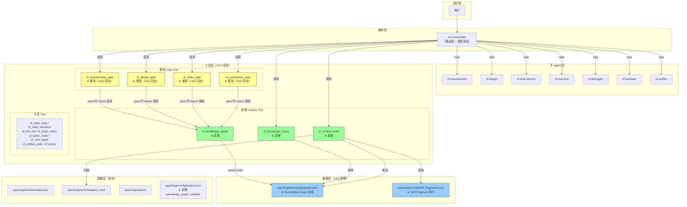
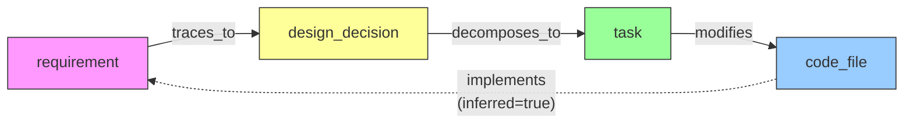
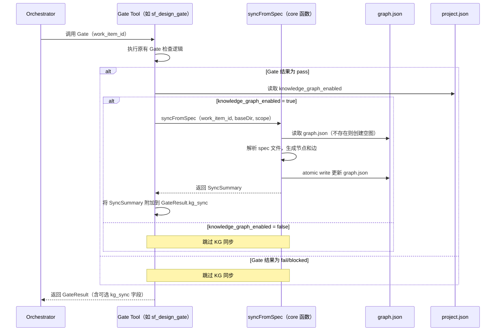
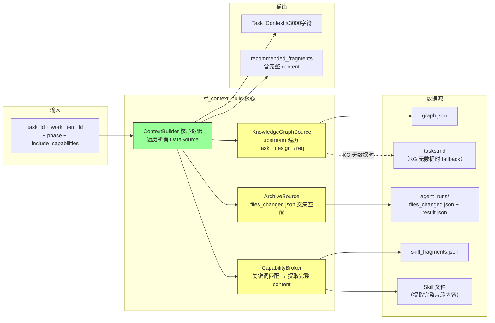

# 设计文档 — SpecForge V4.0（平台版）

## 概述

本文档是 SpecForge V4.0（平台版）的设计文档，基于已实现并经过 17 轮测试验证的 V3.3 系统。V3.3 已完成并行任务控制，系统拥有 12 个 Custom Tool、5 个 Plugin、11 个 Skill（含 4 个 Workflow Skill）、8 个 Agent、424 个单元测试。

V4.0 引入两大核心能力：**Knowledge Graph（知识图谱）** 和 **Context Builder / Capability Broker（上下文构建器 / 能力代理）**。Knowledge Graph 将需求→设计→任务→代码之间的隐式关系显式化为可查询的有向图；Context Builder 基于 Knowledge Graph 和历史执行记录为子 Agent 构建精准上下文；Capability Broker 实现 Skill 片段级按需注入，替代全量 Skill 加载。

与 V3.3 不同，V4.0 是一次**代码 + Prompt 混合变更**——新增 3 个 Custom Tool（TypeScript 代码）、修改 4 个现有 Gate Tool（TypeScript 代码）、更新 Prompt 文件（sf-orchestrator.md 路由层 + 4 个 Workflow Skill）、新增配置文件和数据存储文件。

### 设计目标

1. **结构化关系管理**：将需求→设计→任务→代码的隐式关系显式化为有向图，支持按方向查询和影响分析
2. **精准上下文构建**：基于 Knowledge Graph 和历史执行记录，为子 Agent 提供与任务最相关的上下文
3. **细粒度能力供给**：通过 Capability Broker 实现 Skill 片段级按需注入，减少 Token 浪费
4. **可扩展数据源架构**：Context Builder 的数据源接口设计为可扩展，V5.0 可无缝接入知识库数据源
5. **向后兼容**：所有变更保持与 V3.3 的向后兼容，424 个现有单元测试继续通过
6. **Gate 内置同步**：Gate 工具在判定 pass 后内部自动调用 syncFromSpec 核心函数，而非由 Orchestrator 外部调用
7. **显式启用控制**：通过 `knowledge_graph_enabled` 配置项控制 KG 功能，未启用时系统行为与 V3.3 完全一致

### 设计决策与理由

| 决策 | 理由 |
|------|------|
| Knowledge Graph 使用 JSON 文件存储（`specforge/knowledge/graph.json`），不引入图数据库 | 保持零外部依赖原则；当前规模（单项目、数十到数百节点）JSON 文件完全胜任；与现有 state.json、project.json 存储模式一致 |
| 边的存储方向统一为下游：requirement→design→task→code_file | 与 SpecForge 工作流的自然推进方向一致；查询时通过 direction 参数控制遍历方向（downstream/upstream/both），存储方向和查询方向解耦 |
| implements 边由系统从 requirement→design→task→code_file 链路自动推导，标记 `inferred: true` | 无法从 spec 文件直接解析"代码实现了哪个需求"；链路推导是可靠的间接证据；inferred 标记区分推导边和显式边 |
| 通过 `knowledge_graph_enabled` 配置项控制启用/禁用，不用"文件不存在"判断 | 避免"文件不存在"的歧义（是未启用还是首次运行？）；显式配置语义清晰；默认 true 确保新安装自动启用 |
| Gate 工具内部直接调用 `syncFromSpec` 核心函数，而非调用 sf_knowledge_graph Tool wrapper | Gate 本身就是 Tool，Tool 不应调用 Tool（避免嵌套）；core 函数可直接 import，无需经过 Zod schema 验证和 OpenCode 运行时 |
| Context Builder 实现为独立 Custom Tool（`sf_context_build`），而非集成到 Orchestrator Prompt | Custom Tool 可独立测试、可复用；Prompt 逻辑应保持简洁；Tool 返回结构化数据便于 Orchestrator 注入 |
| Capability Broker 集成到 `sf_context_build`（`include_capabilities` 参数），不单独创建 Tool | Capability Broker 的输出与 Context Builder 的输出一起注入到调度 prompt 中，合并为一个 Tool 调用减少延迟 |
| Capability Broker 返回完整 fragment content 而非 preview | Orchestrator 需要将内容直接注入 prompt，preview 不够；content 从 Skill 文件中按 section_heading 提取 |
| Agent_Run_Archive 查询通过扫描 `files_changed.json` 实现文件交集匹配，而非建立索引 | Archive 数量有限（通常 < 100）；扫描成本低；避免引入额外索引维护复杂度 |
| ContextDataSource 接口设计为可扩展适配器模式 | V5.0 将新增知识库数据源，接口预留扩展点避免届时重构核心逻辑 |
| GraphNode 增加 metadata 字段，code_file 必须包含 path | label 有 200 字符限制且语义不明确；Context Builder 需要用文件路径匹配 Archive；metadata 为不同节点类型提供类型特定信息 |
| graph.json 使用 atomic write（写临时文件→rename）+ .lock 文件串行化写入 | atomic write 防止写入中断导致文件损坏；.lock 文件防止并发写入导致数据丢失（读旧版本→写入→覆盖其他写入者的变更）；成本低的防御性措施 |
| JSON 解析失败时返回错误，不返回空图，不覆盖原文件 | 返回空图会导致下次写入覆盖原数据，造成数据丢失；保留损坏文件供人工恢复 |
| 新增 `get_overview` 查询类型，不用 `get_subgraph(work_item_id="all")` | 避免特殊字符串硬编码；get_overview 有独立的返回结构（统计摘要），与 get_subgraph（完整节点/边列表）语义不同 |
| impact_analysis 支持 direction 参数，默认 downstream，默认排除 inferred 边 | 需求变更影响代码应走下游；implements 闭环会污染 downstream 影响范围（从 code_file 跳回 requirement）；inferred 边更适合 upstream trace 而非 downstream impact |
| 新增 3 个 Custom Tool 遵循现有 thin wrapper + core 模式 | 与现有 12 个 Tool 的架构一致；core 模块可独立单元测试，不依赖 OpenCode 运行时 |
| GateResult 新增可选 `kg_sync` 字段，而非创建新的返回类型 | 向后兼容——现有调用方解析 GateResult 时忽略未知字段；新字段为可选扩展 |

---

## 架构

### V4.0 系统架构总览



### Knowledge Graph 边方向模型



**存储方向**：实线箭头为边的 source→target 存储方向（下游）
**推导边**：虚线箭头为 implements 边，由 verification_gate 阶段从链路自动推导，标记 `inferred: true`
**查询方向**：impact_analysis 的 `direction` 参数控制遍历方向——downstream 沿实线方向，upstream 沿反方向

### Gate 工具内置 KG 同步时序图



### Context Builder 数据流图




---

## 组件与接口

### 变更组件总览

| 类别 | 组件 | 文件路径 | 变更类型 | 关联需求 |
|------|------|----------|----------|----------|
| Tool | sf_knowledge_graph | `.opencode/tools/sf_knowledge_graph.ts` + `lib/sf_knowledge_graph_core.ts` | 新增 | 需求 1、2 |
| Tool | sf_knowledge_query | `.opencode/tools/sf_knowledge_query.ts` + `lib/sf_knowledge_query_core.ts` | 新增 | 需求 3 |
| Tool | sf_context_build | `.opencode/tools/sf_context_build.ts` + `lib/sf_context_build_core.ts` | 新增 | 需求 5、6 |
| Tool | sf_requirements_gate | `.opencode/tools/lib/sf_requirements_gate_core.ts` | 修改 | 需求 4、9 |
| Tool | sf_design_gate | `.opencode/tools/lib/sf_design_gate_core.ts` | 修改 | 需求 4、9 |
| Tool | sf_tasks_gate | `.opencode/tools/lib/sf_tasks_gate_core.ts` | 修改 | 需求 4、9 |
| Tool | sf_verification_gate | `.opencode/tools/lib/sf_verification_gate_core.ts` | 修改 | 需求 4、9 |
| Agent | sf-orchestrator（路由层） | `.opencode/agents/sf-orchestrator.md` | 修改 | 需求 7、8 |
| Skill | 4 个 Workflow Skill | `.opencode/skills/sf-workflow-*/SKILL.md` | 修改 | 需求 7 |
| 配置 | project.json | `specforge/config/project.json` | 修改 | 需求 1 |
| 配置 | skill_fragments.json | `specforge/config/skill_fragments.json` | 新增 | 需求 6 |
| 数据 | graph.json | `specforge/knowledge/graph.json` | 新增（自动创建） | 需求 1 |
| 文档 | AGENTS.md | `AGENTS.md` | 修改 | 需求 9 |

### 不变组件

| 类别 | 组件 | 说明 |
|------|------|------|
| 配置 | opencode.json | 不变（需求 9.6） |
| Agent | 7 个子 Agent prompt | 不变（需求 9.5） |
| Tool | 8 个不变 Tool | sf_state_read、sf_state_transition、sf_doc_lint、sf_trace_matrix、sf_batch_verify、sf_cost_report、sf_artifact_write、sf_doctor（需求 9.3） |
| Plugin | 5 个 Plugin | 不变（需求 9.4） |
| Skill | 7 个 superpowers-* Skill | 不变 |

### 3.1 sf_knowledge_graph — Knowledge Graph 读写工具（需求 1、2）

**新增文件：**
- `.opencode/tools/sf_knowledge_graph.ts`（thin wrapper）
- `.opencode/tools/lib/sf_knowledge_graph_core.ts`（核心逻辑）

#### 核心类型定义（sf_knowledge_graph_core.ts）

```typescript
export type NodeType = "requirement" | "design_decision" | "task" | "code_file"
export type EdgeType = "traces_to" | "decomposes_to" | "modifies" | "implements"

export interface NodeMetadata {
  source_file?: string    // 来源文件路径
  source_line?: number    // 来源行号
  req_id?: string         // 原始需求编号（requirement 类型）
  design_id?: string      // 原始设计编号（design_decision 类型）
  task_id?: string        // 原始任务编号（task 类型）
  path?: string           // 文件路径（code_file 类型必填）
}

export interface GraphNode {
  id: string              // 格式: <work_item_id>:<type>:<序号>
  type: NodeType
  work_item_id: string
  label: string           // 最大 200 字符
  metadata?: NodeMetadata
  created_at: string      // ISO8601
  updated_at: string      // ISO8601
}

export interface GraphEdge {
  source: string          // 源节点 ID（下游方向的起点）
  target: string          // 目标节点 ID（下游方向的终点）
  type: EdgeType
  work_item_id: string
  inferred: boolean       // true = 系统自动推导，false = 从 spec 解析
  created_at: string      // ISO8601
}

export interface GraphStore {
  version: "1.0"
  nodes: GraphNode[]
  edges: GraphEdge[]
}

export interface SyncSummary {
  nodes_added: number
  nodes_updated: number
  nodes_removed: number
  edges_added: number
  edges_removed: number
}

export interface KGOperationResult {
  success: boolean
  summary?: SyncSummary
  error?: string
}
```

#### 核心函数签名

```typescript
/** 加载 Graph Store，不存在时创建空图（需 knowledge_graph_enabled=true） */
export async function loadGraphStore(baseDir: string): Promise<GraphStore>

/** 原子写入 Graph Store（写临时文件→rename） */
export async function saveGraphStore(store: GraphStore, baseDir: string): Promise<void>

/** 读取 knowledge_graph_enabled 配置 */
export async function isKGEnabled(baseDir: string): Promise<boolean>

/** 批量添加节点（验证 ID 格式、类型合法性、唯一性） */
export async function addNodes(nodes: GraphNode[], baseDir: string): Promise<KGOperationResult>

/** 批量添加边（验证 source/target 存在、类型合法、不重复） */
export async function addEdges(edges: GraphEdge[], baseDir: string): Promise<KGOperationResult>

/** 批量删除节点及关联边（级联删除） */
export async function removeNodes(nodeIds: string[], baseDir: string): Promise<KGOperationResult>

/** 更新单个节点的 label 和 metadata */
export async function updateNode(nodeId: string, updates: { label?: string; metadata?: Partial<NodeMetadata> }, baseDir: string): Promise<KGOperationResult>

/** 从 spec 文件同步节点和边（幂等），scope 控制同步范围 */
export async function syncFromSpec(workItemId: string, baseDir: string, scope: "requirements" | "design" | "tasks" | "verification"): Promise<KGOperationResult>

/** 验证节点 ID 格式 */
export function isValidNodeId(id: string): boolean

/** 验证节点类型 */
export function isValidNodeType(type: string): type is NodeType

/** 验证边类型 */
export function isValidEdgeType(type: string): type is EdgeType
```

#### syncFromSpec scope 参数与解析规则

| scope | 解析的文件 | 生成的节点 | 生成的边 | implements 推导 |
|-------|-----------|-----------|---------|----------------|
| `"requirements"` | requirements.md | requirement 节点（metadata.req_id = "REQ-N"） | — | 否 |
| `"design"` | design.md | design_decision 节点 | requirement→design_decision 的 traces_to 边 | 否 |
| `"tasks"` | tasks.md | task 节点 + code_file 节点（metadata.path = 文件路径） | design_decision→task 的 decomposes_to 边，task→code_file 的 modifies 边 | 是 |
| `"verification"` | 全部三个文件 | 全部节点类型 | 全部边类型 | 是（最终确认） |

**解析规则：**

| 文件 | 解析规则 |
|------|----------|
| requirements.md | 匹配标准化 `### REQ-N 标题` 格式，兼容 `### 需求 N` 和 `### Requirement N` 标题 |
| design.md | 匹配标准化 `### DD-N 标题` 格式，兼容 `### N.N 标题` 格式；检测 `refs: [REQ-N, ...]` 和文中 `需求 N` / `Requirement N` 引用建立 traces_to 边 |
| tasks.md | 匹配标准化 `### TASK-N 标题` 格式，兼容 `## Task N:` 标题和 `- [ ] N.` 格式；解析 `files: [path1, path2]` 和 `修改文件` 字段；检测 `refs: [DD-N]` 和 `基于设计 N.N` 建立 task→design 关联（匹配失败时跳过该边并记录警告） |

#### implements 边推导算法（需求 2.8）

在 tasks_gate 或 verification_gate 阶段的 syncFromSpec 中执行：

```
输入：当前 Graph_Store 中指定 work_item_id 的所有节点和边
输出：新增的 implements 边列表

1. 查找所有 code_file 节点 C
2. 对每个 C：
   a. 沿 modifies 边反向找到 task 节点 T（T --modifies--> C）
   b. 沿 decomposes_to 边反向找到 design_decision 节点 D（D --decomposes_to--> T）
   c. 沿 traces_to 边反向找到 requirement 节点 R（R --traces_to--> D）... 
      实际存储方向是 R→D，所以查找 source=R, target=D 的 traces_to 边
   d. 为每个 (C, R) 对生成 implements 边：source=C, target=R, inferred=true
3. 去重：跳过已存在的 implements 边
4. 返回新增的 implements 边
```

#### atomic write + .lock 实现（需求 1.11、1.12）

```typescript
import { writeFile, rename, mkdir } from "node:fs/promises"
import { join, dirname } from "node:path"

const LOCK_TIMEOUT = 5000 // 5 秒超时

async function acquireLock(lockPath: string): Promise<void> {
  const start = Date.now()
  while (true) {
    try {
      await writeFile(lockPath, String(process.pid), { flag: "wx" }) // 排他创建
      return
    } catch {
      if (Date.now() - start > LOCK_TIMEOUT) throw new Error("Lock timeout")
      await new Promise(r => setTimeout(r, 50))
    }
  }
}

async function releaseLock(lockPath: string): Promise<void> {
  try { await import("node:fs/promises").then(fs => fs.unlink(lockPath)) } catch {}
}

async function saveGraphStore(store: GraphStore, baseDir: string): Promise<void> {
  const graphPath = join(baseDir, "specforge", "knowledge", "graph.json")
  const tempPath = graphPath + ".tmp"
  const lockPath = graphPath + ".lock"
  
  await mkdir(dirname(graphPath), { recursive: true })
  await acquireLock(lockPath)
  try {
    await writeFile(tempPath, JSON.stringify(store, null, 2), "utf-8")
    await rename(tempPath, graphPath)  // 原子替换
  } finally {
    await releaseLock(lockPath)
  }
}
```

### 3.2 sf_knowledge_query — Knowledge Graph 查询工具（需求 3）

**新增文件：**
- `.opencode/tools/sf_knowledge_query.ts`（thin wrapper）
- `.opencode/tools/lib/sf_knowledge_query_core.ts`（核心逻辑）

#### 核心类型定义

```typescript
export type Direction = "downstream" | "upstream" | "both"

export interface QueryResult {
  query_type: string
  result_count: number
  nodes: GraphNode[]
  edges: GraphEdge[]
  found?: boolean
  message?: string
  paths?: GraphPath[]
}

export interface OverviewResult {
  query_type: "get_overview"
  nodes_by_type: Record<NodeType, number>
  edges_by_type: Record<EdgeType, number>
  work_items: string[]
  total_nodes: number
  total_edges: number
}

export interface GraphPath {
  nodes: GraphNode[]
  edges: GraphEdge[]
  length: number
}

export interface QueryFilter {
  work_item_id?: string
  node_type?: NodeType
  edge_type?: EdgeType
}
```

#### 核心函数签名

```typescript
export async function getNode(nodeId: string, baseDir: string): Promise<QueryResult>
export async function getNeighbors(nodeId: string, baseDir: string, filter?: QueryFilter): Promise<QueryResult>
export async function getSubgraph(workItemId: string, baseDir: string): Promise<QueryResult>
export async function getOverview(baseDir: string): Promise<OverviewResult>
export async function impactAnalysis(nodeId: string, direction: Direction, maxDepth: number, baseDir: string, filter?: QueryFilter, includeInferred?: boolean): Promise<QueryResult>
export async function tracePath(sourceId: string, targetId: string, baseDir: string, options?: { max_depth?: number; max_paths?: number }): Promise<QueryResult>
```

#### impactAnalysis 算法（需求 3.3-3.5）

```
输入：startNodeId, direction ("downstream"|"upstream"|"both"), maxDepth（默认 3）
输出：受影响节点列表（每个节点附带 depth）

1. 初始化 BFS 队列 Q = [(startNodeId, depth=0)]
2. 初始化已访问集合 visited = {startNodeId}
3. 初始化结果列表 results = []

4. WHILE Q 非空:
   a. 取出 (currentId, currentDepth)
   b. IF currentDepth >= maxDepth: continue
   c. 根据 direction 查找邻居（默认排除 inferred=true 的边）：
      - downstream: 查找 source=currentId 且 inferred=false 的边，邻居为 target
      - upstream: 查找 target=currentId 且 inferred=false 的边，邻居为 source
      - both: 查找 source=currentId 或 target=currentId 且 inferred=false 的边
      - 如果 include_inferred=true，则不排除 inferred 边
   d. 对每个邻居节点 neighborId:
      - 如果 neighborId 不在 visited 中:
        - 添加到 visited
        - 添加到 results（附带 depth = currentDepth + 1）
        - 入队 (neighborId, currentDepth + 1)

5. 按 depth 升序排序 results
6. 返回 { nodes: results 中的节点, edges: 遍历过的边, result_count: results.length }
```

### 3.3 sf_context_build — Context Builder + Capability Broker（需求 5、6）

**新增文件：**
- `.opencode/tools/sf_context_build.ts`（thin wrapper）
- `.opencode/tools/lib/sf_context_build_core.ts`（核心逻辑）

#### 核心类型定义（需求 5.9、5.10）

```typescript
// ============================================================
// ContextDataSource 可扩展接口
// ============================================================

export interface TaskQueryParams {
  work_item_id: string
  task_id?: string
  phase?: string
  task_description?: string   // 任务描述文本（Capability Broker 关键词匹配用）
  workflow_type?: string      // 工作流类型（如 feature_spec）
  target_files?: string[]     // 当前 Task 的目标文件列表
  file_types?: string[]       // 修改文件的类型（如 .ts, .md）
}

export interface ContextFragment {
  source_type: string       // "knowledge_graph" | "archive" | 未来: "knowledge_base"
  source_id: string         // Graph 节点 ID 或 Archive run_id
  category: "requirement" | "design_decision" | "success_pattern" | "failure_pattern" | "warning"
  content: string
  priority: number          // 数值越大越重要
}

/** 可扩展数据源接口 */
export interface ContextDataSource {
  name: string
  query(params: TaskQueryParams): Promise<ContextFragment[]>
}

// ============================================================
// 内置数据源
// ============================================================

/** 数据源 1：Knowledge Graph（upstream 遍历） */
export class KnowledgeGraphSource implements ContextDataSource {
  name = "knowledge_graph"
  constructor(private baseDir: string) {}
  async query(params: TaskQueryParams): Promise<ContextFragment[]>
  // 实现：从 task 节点沿 upstream 遍历到 design_decision 和 requirement
}

/** 数据源 2：Agent_Run_Archive（文件交集匹配） */
export class ArchiveSource implements ContextDataSource {
  name = "archive"
  constructor(private baseDir: string) {}
  async query(params: TaskQueryParams): Promise<ContextFragment[]>
  // 实现：扫描 files_changed.json，匹配 target_files
  // KG 无数据时从 tasks.md 解析修改文件列表作为 fallback
}

// ============================================================
// Context Builder + Capability Broker
// ============================================================

export interface TaskContext {
  context: string           // 格式化文本（≤3000 字符）
  sources: Array<{ type: string; id: string }>
  estimated_tokens: number
}

export interface CapabilityRecommendation {
  recommended_fragments: Array<{
    fragment_id: string
    reason: string
    content: string         // 从 Skill 文件提取的完整片段内容
    estimated_tokens: number
  }>
  estimated_tokens: number  // 所有片段的总 Token 量
}

export interface ContextBuildResult {
  task_context: TaskContext
  capabilities?: CapabilityRecommendation
}

export async function buildTaskContext(
  params: TaskQueryParams, dataSources: ContextDataSource[], baseDir: string
): Promise<TaskContext>

export async function recommendCapabilities(
  params: TaskQueryParams, baseDir: string
): Promise<CapabilityRecommendation>

export async function buildContext(
  workItemId: string, taskId: string | undefined, phase: string | undefined,
  includeCapabilities: boolean, baseDir: string
): Promise<ContextBuildResult>
```

#### ArchiveSource 查询机制（需求 5.4）

```
输入：TaskQueryParams（含 target_files 列表）
输出：ContextFragment[]

1. 获取目标文件列表：
   a. 优先从 Knowledge Graph 查询 task→code_file 的 modifies 边，
      提取 code_file 节点的 metadata.path
   b. 如果 KG 无数据（KG 未启用或无相关节点），
      从 tasks.md 解析当前 Task 的 `修改文件` 字段

2. 扫描 specforge/archive/agent_runs/ 下所有 <run_id>/ 目录

3. 对每个 run 目录：
   a. 读取 files_changed.json（解析失败则跳过）
   b. 计算 files[].path 与 target_files 的交集
   c. 如果交集非空：
      - 读取 result.json（解析失败则跳过）
      - status="success" → 生成 success_pattern ContextFragment
      - status="failure" → 生成 failure_pattern + warning ContextFragment

4. 按 priority 排序返回
```

#### Phase Context 匹配规则（需求 7.4）

当 `phase` 参数非空时（requirements/design/tasks 阶段），Context Builder 执行跨 Work Item 匹配：

```
输入：work_item_id, phase
输出：ContextFragment[]（跨 Work Item 参考）

1. 确定目标节点类型：
   - phase="requirements" → node_type="requirement"
   - phase="design" → node_type="design_decision"
   - phase="tasks" → node_type="task"

2. 从 Knowledge Graph 中查找其他 Work Item 的同类型节点：
   - 过滤条件：node.type = 目标类型 AND node.work_item_id ≠ 当前 work_item_id

3. 按 label 关键词相似度排序（简单实现：当前 Work Item 的 intake.md 关键词与候选节点 label 的词重叠度）

4. 取 top-5 作为参考上下文，生成 ContextFragment
```

#### Capability Broker 片段提取（需求 6.5、6.6）

```
输入：TaskQueryParams（任务描述、修改文件类型、工作流阶段）
输出：CapabilityRecommendation

1. 读取 specforge/config/skill_fragments.json
2. 对每个 fragment 条目：
   a. 检查 triggers 列表中的关键词是否出现在任务描述中
   b. 如果匹配：
      - 读取 skill_file 文件
      - 按 section_heading 提取该章节的完整内容
      - 估算 Token 量（字符数 / 3）
      - 生成推荐条目（含完整 content）
3. 返回推荐列表
```

### 3.4 Gate 工具 KG 同步集成（需求 4）

**修改文件：** 4 个 Gate core 文件

#### GateResult 类型扩展

```typescript
export interface GateResult {
  status: "pass" | "fail" | "blocked"
  blocking_issues: string[]
  warnings: string[]
  next_action: "continue" | "revise" | "ask_user"
  kg_sync?: SyncSummary | null  // ★ V4.0 新增：可选字段
}
```

#### 修改模式（4 个 Gate 统一）

```typescript
import { syncFromSpec, isKGEnabled } from "./sf_knowledge_graph_core"
// 每个 Gate 传入自己的 scope：
// sf_requirements_gate → "requirements"
// sf_design_gate → "design"
// sf_tasks_gate → "tasks"
// sf_verification_gate → "verification"

export async function checkXxxGate(workItemId: string, baseDir: string): Promise<GateResult> {
  const scope = "xxx" as const // 每个 Gate 替换为自己的 scope
  // ... 现有 Gate 检查逻辑不变 ...

  if (blockingIssues.length > 0) {
    return { status: "fail", blocking_issues: blockingIssues, warnings, next_action: "revise" }
  }

  // ★ V4.0：Gate pass 后执行 KG 同步
  let kgSync: SyncSummary | null = null
  try {
    if (await isKGEnabled(baseDir)) {
      const result = await syncFromSpec(workItemId, baseDir, scope)
      if (result.success && result.summary) {
        kgSync = result.summary
      } else if (result.error) {
        warnings.push(`KG sync warning: ${result.error}`)
      }
    }
  } catch (err) {
    warnings.push(`KG sync failed: ${(err as Error).message}`)
  }

  return { status: "pass", blocking_issues: [], warnings, next_action: "continue", kg_sync: kgSync }
}
```

#### 各 Gate 的同步范围

| Gate 工具 | 同步范围 | implements 推导 |
|-----------|----------|----------------|
| sf_requirements_gate | requirement 节点 | 否 |
| sf_design_gate | design_decision 节点 + traces_to 边 | 否 |
| sf_tasks_gate | task 节点 + code_file 节点 + decomposes_to 边 + modifies 边 | 是（推导 implements） |
| sf_verification_gate | 全量 sync + implements 推导 | 是（最终确认） |

### 3.5 Orchestrator 调度协议更新（需求 7）

#### development 阶段新增步骤

在现有 Step 5（执行 Task）之前新增：

```markdown
#### Step 4.5：构建 Task Context（V4.0 新增）

对每个即将调度的 Task：
1. 调用 sf_context_build（task_id, work_item_id, include_capabilities=true）
2. 如果返回非空 task_context.context → 注入到 executor 调度 prompt 中
3. 如果返回非空 capabilities.recommended_fragments → 注入完整 content，替代全量 Skill
4. 向用户报告 Context Builder 摘要
5. 如果 sf_context_build 调用失败 → 回退到 V3.3 协议
```

#### requirements/design/tasks 阶段新增步骤

```markdown
调度子 Agent 前：
1. 调用 sf_context_build（work_item_id, phase=<当前阶段>）
2. 如果返回非空上下文 → 注入到子 Agent 调度 prompt 中（跨 Work Item 参考）
3. 如果调用失败 → 按 V3.3 协议继续
```

### 3.6 sf-orchestrator.md 路由层更新（需求 8）

#### 新增调试命令

```markdown
## /sf-graph
- `/sf-graph`：调用 sf_knowledge_query（query_type="get_overview"），展示 Graph 统计摘要
- `/sf-graph <work_item_id>`：调用 sf_knowledge_query（query_type="get_subgraph"），展示子图
- `/sf-graph impact <node_id>`：调用 sf_knowledge_query（query_type="impact_analysis", direction="downstream"），展示影响分析
```

#### 工具清单新增

| 工具名 | 用途 | 调用时机 |
|--------|------|----------|
| `sf_knowledge_graph` | KG 节点和边的 CRUD | Orchestrator 手动操作时（Gate 内部直接调用 core） |
| `sf_knowledge_query` | KG 查询和影响分析 | /sf-graph 命令时 |
| `sf_context_build` | 构建 Task Context 和能力推荐 | 调度子 Agent 前 |


---

## 数据模型

### Graph_Store 完整示例（需求 1）

**文件路径：** `specforge/knowledge/graph.json`

```json
{
  "version": "1.0",
  "nodes": [
    {
      "id": "WI-001:requirement:1",
      "type": "requirement",
      "work_item_id": "WI-001",
      "label": "Knowledge Graph 数据模型与存储",
      "metadata": { "source_file": "specforge/specs/WI-001/requirements.md", "req_id": "需求 1" },
      "created_at": "2026-05-05T10:00:00Z",
      "updated_at": "2026-05-05T10:00:00Z"
    },
    {
      "id": "WI-001:design_decision:1",
      "type": "design_decision",
      "work_item_id": "WI-001",
      "label": "JSON 文件存储，不引入图数据库",
      "metadata": { "source_file": "specforge/specs/WI-001/design.md", "design_id": "3.1" },
      "created_at": "2026-05-05T11:00:00Z",
      "updated_at": "2026-05-05T11:00:00Z"
    },
    {
      "id": "WI-001:task:1",
      "type": "task",
      "work_item_id": "WI-001",
      "label": "实现 sf_knowledge_graph_core.ts",
      "metadata": { "source_file": "specforge/specs/WI-001/tasks.md", "task_id": "Task 1" },
      "created_at": "2026-05-05T12:00:00Z",
      "updated_at": "2026-05-05T12:00:00Z"
    },
    {
      "id": "WI-001:code_file:1",
      "type": "code_file",
      "work_item_id": "WI-001",
      "label": "sf_knowledge_graph_core.ts",
      "metadata": { "path": ".opencode/tools/lib/sf_knowledge_graph_core.ts" },
      "created_at": "2026-05-05T12:00:00Z",
      "updated_at": "2026-05-05T12:00:00Z"
    }
  ],
  "edges": [
    {
      "source": "WI-001:requirement:1",
      "target": "WI-001:design_decision:1",
      "type": "traces_to",
      "work_item_id": "WI-001",
      "inferred": false,
      "created_at": "2026-05-05T11:00:00Z"
    },
    {
      "source": "WI-001:design_decision:1",
      "target": "WI-001:task:1",
      "type": "decomposes_to",
      "work_item_id": "WI-001",
      "inferred": false,
      "created_at": "2026-05-05T12:00:00Z"
    },
    {
      "source": "WI-001:task:1",
      "target": "WI-001:code_file:1",
      "type": "modifies",
      "work_item_id": "WI-001",
      "inferred": false,
      "created_at": "2026-05-05T12:00:00Z"
    },
    {
      "source": "WI-001:code_file:1",
      "target": "WI-001:requirement:1",
      "type": "implements",
      "work_item_id": "WI-001",
      "inferred": true,
      "created_at": "2026-05-05T14:00:00Z"
    }
  ]
}
```

**边方向说明：**
- `traces_to`：requirement(source) → design_decision(target)，下游方向
- `decomposes_to`：design_decision(source) → task(target)，下游方向
- `modifies`：task(source) → code_file(target)，下游方向
- `implements`：code_file(source) → requirement(target)，闭环方向，`inferred: true`

### project.json 配置更新（需求 1.7）

```json
{
  "name": "specforge",
  "version": "0.5.0",
  "description": "运行在 OpenCode 上的规格驱动 AI 开发控制系统",
  "max_parallel_executors": 3,
  "knowledge_graph_enabled": true
}
```

### Skill_Fragment 索引（需求 6）

**文件路径：** `specforge/config/skill_fragments.json`

```json
{
  "version": "1.0",
  "fragments": [
    {
      "fragment_id": "brainstorming-7-dimensions",
      "skill_file": ".opencode/skills/superpowers-brainstorming/SKILL.md",
      "section_heading": "7 个维度",
      "triggers": ["需求分析", "头脑风暴", "brainstorming", "requirements"],
      "description": "从 7 个维度进行需求头脑风暴的方法论"
    },
    {
      "fragment_id": "tdd-red-green-refactor",
      "skill_file": ".opencode/skills/superpowers-tdd/SKILL.md",
      "section_heading": "Red-Green-Refactor",
      "triggers": ["测试驱动", "TDD", "单元测试", "test"],
      "description": "TDD 的 Red-Green-Refactor 循环方法论"
    },
    {
      "fragment_id": "verification-evidence-types",
      "skill_file": ".opencode/skills/superpowers-verification-before-completion/SKILL.md",
      "section_heading": "四类证据",
      "triggers": ["验证", "verification", "证据", "evidence"],
      "description": "验证完成前需要提供的四类证据"
    },
    {
      "fragment_id": "debugging-systematic",
      "skill_file": ".opencode/skills/superpowers-systematic-debugging/SKILL.md",
      "section_heading": "系统化调试",
      "triggers": ["调试", "debug", "错误", "error", "失败", "failure"],
      "description": "系统化调试方法论"
    },
    {
      "fragment_id": "code-review-checklist",
      "skill_file": ".opencode/skills/superpowers-code-review/SKILL.md",
      "section_heading": "审查清单",
      "triggers": ["审查", "review", "代码质量", "code quality"],
      "description": "代码审查检查清单"
    },
    {
      "fragment_id": "writing-plans-structure",
      "skill_file": ".opencode/skills/superpowers-writing-plans/SKILL.md",
      "section_heading": "任务拆分",
      "triggers": ["任务拆分", "task planning", "计划", "plan"],
      "description": "任务拆分和计划编写方法论"
    }
  ]
}
```

### 文件系统变更总览

#### 新增文件

| 文件路径 | 说明 |
|----------|------|
| `.opencode/tools/sf_knowledge_graph.ts` | KG 读写工具 thin wrapper |
| `.opencode/tools/lib/sf_knowledge_graph_core.ts` | KG 读写核心逻辑（含 atomic write、implements 推导） |
| `.opencode/tools/sf_knowledge_query.ts` | KG 查询工具 thin wrapper |
| `.opencode/tools/lib/sf_knowledge_query_core.ts` | KG 查询核心逻辑（含 direction 参数的 BFS） |
| `.opencode/tools/sf_context_build.ts` | Context Builder thin wrapper |
| `.opencode/tools/lib/sf_context_build_core.ts` | Context Builder 核心逻辑（含 ContextDataSource 接口） |
| `specforge/knowledge/graph.json` | Graph Store（首次 syncFromSpec 时自动创建） |
| `specforge/config/skill_fragments.json` | Skill Fragment 索引配置 |
| `tests/unit/tools/lib/sf_knowledge_graph_core.test.ts` | KG 读写单元测试 |
| `tests/unit/tools/lib/sf_knowledge_query_core.test.ts` | KG 查询单元测试 |
| `tests/unit/tools/lib/sf_context_build_core.test.ts` | Context Builder 单元测试 |

#### 修改文件

| 文件路径 | 变更说明 |
|----------|----------|
| `.opencode/tools/lib/sf_requirements_gate_core.ts` | pass 后新增 KG syncFromSpec 调用（检查 enabled） |
| `.opencode/tools/lib/sf_design_gate_core.ts` | pass 后新增 KG syncFromSpec 调用（检查 enabled） |
| `.opencode/tools/lib/sf_tasks_gate_core.ts` | pass 后新增 KG syncFromSpec 调用（含 implements 推导） |
| `.opencode/tools/lib/sf_verification_gate_core.ts` | pass 后新增 KG syncFromSpec 调用（最终 implements 确认） |
| `specforge/config/project.json` | 新增 `knowledge_graph_enabled` 字段 |
| `.opencode/agents/sf-orchestrator.md` | 新增 /sf-graph 命令、工具清单更新 |
| `.opencode/skills/sf-workflow-feature-spec/SKILL.md` | 各阶段新增 Context Builder 调用 |
| `.opencode/skills/sf-workflow-bugfix-spec/SKILL.md` | 各阶段新增 Context Builder 调用 |
| `.opencode/skills/sf-workflow-design-first/SKILL.md` | 各阶段新增 Context Builder 调用 |
| `.opencode/skills/sf-workflow-quick-change/SKILL.md` | 各阶段新增 Context Builder 调用 |
| `AGENTS.md` | 新增 V4.0 Tool 说明和 KG 维护协议 |

---

## 正确性属性

V4.0 新增了可测试的 TypeScript 纯函数，以下是核心正确性属性：

### 属性 1：节点 ID 格式验证（需求 1.3、2.3）

```
∀ id: string,
  isValidNodeId(id) = true ⟺ id 可以用最后两个 ":" 分割为三部分：
  work_item_id（匹配 /^[A-Za-z0-9][A-Za-z0-9_-]*$/）、type（合法 NodeType）、序号（正整数）
```

### 属性 2：addNodes 唯一性（需求 2.3）

```
∀ nodes: GraphNode[],
  addNodes(nodes) 成功后，graph.nodes 中不存在两个 id 相同的节点
```

### 属性 3：removeNodes 级联删除（需求 2.5）

```
∀ nodeId: string,
  removeNodes([nodeId]) 成功后
  → graph.edges 中不存在 source=nodeId 或 target=nodeId 的边
```

### 属性 4：addEdges 引用完整性（需求 2.4）

```
∀ edge: GraphEdge,
  addEdges([edge]) 成功
  → graph.nodes 中存在 id=edge.source 的节点 AND 存在 id=edge.target 的节点
```

### 属性 5：syncFromSpec 幂等性（需求 2.7）

```
∀ workItemId: string,
  syncFromSpec(workItemId) 连续调用两次
  → 第二次返回 { nodes_added: 0, nodes_removed: 0, edges_added: 0, edges_removed: 0 }
```

### 属性 6：impactAnalysis 深度限制（需求 3.5）

```
∀ nodeId, direction, maxDepth,
  impactAnalysis(nodeId, direction, maxDepth) 返回的所有节点
  → 每个节点的 depth ≤ maxDepth
```

### 属性 7：impactAnalysis 方向正确性（需求 3.3）

```
∀ nodeId,
  impactAnalysis(nodeId, "downstream", maxDepth) 返回的所有边
  → 每条边的遍历方向为 source→target（沿存储方向）

  impactAnalysis(nodeId, "upstream", maxDepth) 返回的所有边
  → 每条边的遍历方向为 target→source（沿反方向）
```

### 属性 8：Gate KG 同步不影响 Gate 判定（需求 4.7）

```
∀ workItemId, baseDir,
  IF checkXxxGate(workItemId, baseDir).status = "pass"（Gate 检查逻辑通过）
  THEN 即使 syncFromSpec 抛出异常
       checkXxxGate 仍返回 status = "pass"
```

### 属性 9：KG disabled 时 Gate 行为不变（需求 4.6、9.7）

```
∀ workItemId, baseDir,
  IF knowledge_graph_enabled = false
  THEN checkXxxGate(workItemId, baseDir) 的返回值
       与 V3.3 版本的 checkXxxGate 返回值完全一致（无 kg_sync 字段）
```

### 属性 10：Task_Context 长度限制（需求 5.6）

```
∀ params: TaskQueryParams,
  buildTaskContext(params).context.length ≤ 3000
```

### 属性 11：atomic write 安全性（需求 1.11）

```
∀ store: GraphStore,
  IF saveGraphStore(store) 过程中发生中断
  THEN graph.json 要么是旧的完整内容，要么是新的完整内容，不会是损坏的部分内容
```

### 属性 12：implements 边推导正确性（需求 2.8）

```
∀ implements_edge in graph.edges WHERE type="implements",
  ∃ path: code_file ←modifies← task ←decomposes_to← design ←traces_to← requirement
  使得 implements_edge.source = code_file.id AND implements_edge.target = requirement.id
  AND implements_edge.inferred = true
```

### 属性 13：impactAnalysis 默认排除 inferred 边（需求 3.6）

```
∀ nodeId, direction, maxDepth,
  impactAnalysis(nodeId, direction, maxDepth, includeInferred=false) 遍历过程中
  → 不经过任何 inferred=true 的边
```

### 属性 14：syncFromSpec scope 限制（需求 2.6）

```
∀ workItemId,
  syncFromSpec(workItemId, baseDir, "requirements") 执行后
  → 只新增/更新/删除 type="requirement" 的节点，不产生任何边

  syncFromSpec(workItemId, baseDir, "design") 执行后
  → 只新增/更新/删除 type="design_decision" 的节点和 type="traces_to" 的边

  syncFromSpec(workItemId, baseDir, "tasks") 执行后
  → 只新增/更新/删除 type="task" 和 type="code_file" 的节点，
    以及 type="decomposes_to"、"modifies"、"implements" 的边
```

### 属性 15：.lock 文件串行化（需求 1.12）

```
∀ concurrent calls saveGraphStore(storeA) and saveGraphStore(storeB),
  最终 graph.json 的内容为 storeA 或 storeB 之一（不会丢失任何一次完整写入）
```

---

## 错误处理

### Knowledge Graph 错误场景

| 场景 | 处理方式 | 关联需求 |
|------|----------|----------|
| graph.json 不存在且 enabled=true | loadGraphStore 创建空图并返回 | 需求 1.8 |
| graph.json 不存在且 enabled=false | 不创建，不读取，跳过所有 KG 操作 | 需求 1.9 |
| graph.json JSON 解析失败 | 返回 `{ success: false, error: "..." }`，不覆盖原文件 | 需求 2.10 |
| graph.json 写入失败（权限/磁盘） | atomic write 确保原文件不损坏，返回错误 | 需求 1.11 |
| 节点 ID 格式不合法 | addNodes 返回错误，拒绝整批操作 | 需求 2.3 |
| 节点 ID 重复 | addNodes 返回错误，拒绝重复节点 | 需求 2.3 |
| 边的 source/target 节点不存在 | addEdges 返回错误，拒绝该边 | 需求 2.4 |
| 重复边（相同 source+target+type） | addEdges 跳过重复边，不报错 | 需求 2.4 |
| spec 文件不存在（syncFromSpec） | 跳过该文件，同步已存在的文件 | 需求 2.6 |
| spec 文件格式无法解析 | 记录警告，返回部分同步结果 | 需求 2.6 |

### Knowledge Graph 查询错误场景

| 场景 | 处理方式 | 关联需求 |
|------|----------|----------|
| 查询的节点 ID 不存在 | 返回 `{ found: false, message: "Node not found: <id>" }` | 需求 3.9 |
| graph.json 不存在 | 返回空结果（result_count: 0） | 需求 3.9 |
| 影响分析遇到环形引用 | BFS 的 visited 集合自动防止无限循环 | 需求 3.4 |
| trace_path 无路径 | 返回 `{ paths: [], result_count: 0 }` | 需求 3.6 |

### Gate KG 同步错误场景

| 场景 | 处理方式 | 关联需求 |
|------|----------|----------|
| knowledge_graph_enabled=false | 跳过同步，Gate 正常返回（无 kg_sync 字段） | 需求 4.6 |
| syncFromSpec 抛出异常 | Gate 捕获异常，添加到 warnings，仍返回 pass | 需求 4.7 |
| syncFromSpec 返回 success=false | Gate 将 error 添加到 warnings，仍返回 pass | 需求 4.7 |

### Context Builder 错误场景

| 场景 | 处理方式 | 关联需求 |
|------|----------|----------|
| KG 中无相关节点 | KnowledgeGraphSource 返回空片段，继续查询其他数据源 | 需求 5.7 |
| KG 未启用 | KnowledgeGraphSource 跳过，ArchiveSource 从 tasks.md fallback | 需求 5.4 |
| Agent_Run_Archive 目录不存在 | ArchiveSource 返回空片段列表 | 需求 5.4 |
| files_changed.json 解析失败 | 跳过该 run，继续处理其他 run | 需求 5.4 |
| result.json 解析失败 | 跳过该 run，继续处理其他 run | 需求 5.4 |
| 所有数据源均无结果 | 返回空 Task_Context `{ context: "", sources: [] }` | 需求 5.7 |
| skill_fragments.json 不存在 | Capability Broker 返回空推荐列表 | 需求 6.7 |
| Skill 文件读取失败 | 跳过该 fragment，继续处理其他 | 需求 6.7 |
| sf_context_build 整体调用失败 | Orchestrator 回退到 V3.3 协议 | 需求 7.7 |

---

## 测试策略

### 测试方法论

V4.0 新增了 TypeScript 代码（3 个新 Tool + 4 个 Gate 修改），需要新增单元测试。测试遵循现有项目的测试模式：使用 bun test 运行，测试 core 模块的纯函数，使用临时目录模拟文件系统。

### 测试层次

#### 第 1 层：回归测试（自动化）

**目标：** 确保现有 424 个单元测试全部通过

```bash
bun test
```

**关联需求：** 需求 9.1

#### 第 2 层：新增单元测试（自动化）

##### sf_knowledge_graph_core.test.ts

| 测试场景 | 验证要点 | 关联需求 |
|----------|----------|----------|
| loadGraphStore — 文件不存在且 enabled | 创建并返回空图 | 需求 1.8 |
| loadGraphStore — 正常文件 | 正确解析 JSON | 需求 1.6 |
| loadGraphStore — JSON 损坏 | 返回错误，不返回空图 | 需求 2.10 |
| saveGraphStore — atomic write | 写入中断不损坏原文件 | 需求 1.11 |
| isKGEnabled — enabled=true | 返回 true | 需求 1.7 |
| isKGEnabled — enabled=false | 返回 false | 需求 1.7 |
| isKGEnabled — 字段不存在 | 返回 true（默认值） | 需求 1.7 |
| addNodes — 正常添加 | 节点写入，返回 nodes_added=N | 需求 2.2 |
| addNodes — ID 格式不合法 | 返回错误 | 需求 2.3 |
| addNodes — ID 重复 | 返回错误 | 需求 2.3 |
| addNodes — metadata.path 必填（code_file） | code_file 无 path 时返回错误 | 需求 1.4 |
| addEdges — 正常添加 | 边写入 | 需求 2.4 |
| addEdges — source 不存在 | 返回错误 | 需求 2.4 |
| addEdges — 重复边 | 跳过重复，不报错 | 需求 2.4 |
| addEdges — 边方向验证 | traces_to 的 source 必须是 requirement | 需求 1.2 |
| removeNodes — 级联删除 | 节点和关联边都被删除 | 需求 2.5 |
| syncFromSpec — scope=requirements | 只同步 requirement 节点 | 需求 2.6 |
| syncFromSpec — scope=design | 只同步 design_decision 和 traces_to | 需求 2.6 |
| syncFromSpec — scope=tasks | 同步 task/code_file 和相关边 + implements | 需求 2.6、2.8 |
| syncFromSpec — scope=verification | 全量同步 | 需求 2.6 |
| syncFromSpec — 正常同步 | 正确解析 requirements/design/tasks | 需求 2.6 |
| syncFromSpec — 幂等性 | 连续两次调用结果一致 | 需求 2.7 |
| syncFromSpec — implements 推导 | 正确生成 inferred=true 的 implements 边 | 需求 2.8 |
| syncFromSpec — 空 spec 目录 | 返回空同步结果 | 需求 2.6 |
| isValidNodeId — 合法/非法 ID | 正确返回 true/false | 需求 1.3 |

##### sf_knowledge_query_core.test.ts

| 测试场景 | 验证要点 | 关联需求 |
|----------|----------|----------|
| getNode — 存在/不存在 | 正确返回或 found=false | 需求 3.2、3.9 |
| getNeighbors — 有/无邻居 | 正确返回 | 需求 3.2 |
| getSubgraph — 正常/空图 | 返回指定 Work Item 子图 | 需求 3.2 |
| getOverview — 正常 | 返回统计摘要 | 需求 3.7 |
| impactAnalysis — downstream | 只沿 source→target 遍历 | 需求 3.3 |
| impactAnalysis — upstream | 只沿 target→source 遍历 | 需求 3.3 |
| impactAnalysis — both | 双向遍历 | 需求 3.3 |
| impactAnalysis — 默认排除 inferred 边 | downstream 不经过 implements | 需求 3.6 |
| impactAnalysis — include_inferred=true | 包含 implements 边 | 需求 3.6 |
| impactAnalysis — 深度限制 | 不超过 maxDepth | 需求 3.5 |
| impactAnalysis — 环形引用 | 不无限循环 | 需求 3.4 |
| impactAnalysis — 结果含 depth | 每个节点附带跳数 | 需求 3.4 |
| tracePath — 有/无路径 | 正确返回 | 需求 3.6 |
| tracePath — max_depth/max_paths 限制 | 不超过限制 | 需求 3.7 |
| filter — work_item_id/node_type/edge_type | 正确过滤 | 需求 3.8 |

##### sf_context_build_core.test.ts

| 测试场景 | 验证要点 | 关联需求 |
|----------|----------|----------|
| buildTaskContext — 有 KG 数据 | 返回需求和设计摘要 | 需求 5.3 |
| buildTaskContext — KG 无数据但 Archive 有 | 仍返回历史经验 | 需求 5.7 |
| buildTaskContext — 所有数据源无数据 | 返回空上下文 | 需求 5.7 |
| buildTaskContext — 长度截断 | 总长度 ≤ 3000 字符 | 需求 5.6 |
| ArchiveSource — 文件交集匹配 | 正确匹配 files_changed.json | 需求 5.4 |
| ArchiveSource — KG 无数据时 tasks.md fallback | 从 tasks.md 获取文件列表 | 需求 5.4 |
| ArchiveSource — archive 目录不存在 | 返回空片段 | 需求 5.4 |
| ContextDataSource — 自定义数据源 | 注册后被正确调用 | 需求 5.9 |
| recommendCapabilities — 有匹配 | 返回含完整 content 的推荐 | 需求 6.6 |
| recommendCapabilities — 无匹配 | 返回空推荐列表 | 需求 6.7 |
| phase context — 跨 Work Item 匹配 | 返回其他 WI 的相关节点 | 需求 7.4 |

##### Gate KG 同步测试（4 个 Gate 各新增）

| 测试场景 | 验证要点 | 关联需求 |
|----------|----------|----------|
| Gate pass + KG enabled + 同步成功 | GateResult 含 kg_sync 摘要 | 需求 4.1-4.4 |
| Gate pass + KG enabled + 同步失败 | GateResult 仍为 pass，warnings 含错误 | 需求 4.7 |
| Gate pass + KG disabled | 跳过同步，无 kg_sync 字段 | 需求 4.6 |
| Gate fail | 不执行 KG 同步 | 需求 4.5 |

#### 第 3 层：结构验证（手动检查）

| 检查项 | 验证方法 | 关联需求 |
|--------|----------|----------|
| 4 个 Gate core 包含 isKGEnabled + syncFromSpec | grep | 需求 4 |
| sf-orchestrator.md 包含 /sf-graph 命令 | grep | 需求 8 |
| 4 个 Workflow Skill 包含 sf_context_build | grep | 需求 7 |
| project.json 包含 knowledge_graph_enabled | JSON 验证 | 需求 1.7 |
| skill_fragments.json 结构正确 | JSON 验证 | 需求 6 |

#### 第 4 层：兼容性验证

| 检查项 | 验证方法 | 关联需求 |
|--------|----------|----------|
| opencode.json 未修改 | git diff | 需求 9.6 |
| 7 个子 Agent prompt 未修改 | git diff | 需求 9.5 |
| 8 个不变 Tool 未修改 | git diff | 需求 9.3 |
| 5 个 Plugin 未修改 | git diff | 需求 9.4 |
| knowledge_graph_enabled=false 时 Gate 行为不变 | 单元测试 | 需求 9.7 |

#### 第 5 层：集成测试（手动执行）

| 测试场景 | 验证要点 |
|----------|----------|
| feature_spec 完整工作流 | 每个 Gate pass 后 graph.json 自动更新，implements 边正确生成 |
| /sf-graph 命令 | get_overview 展示统计，get_subgraph 展示子图，impact_analysis 按方向遍历 |
| development 阶段 Context Builder | sf_context_build 返回非空上下文，注入到 executor prompt |
| Capability Broker | 匹配的 Skill Fragment 完整内容被提取和注入 |
| knowledge_graph_enabled=false | Gate 正常通过，无 KG 操作，行为与 V3.3 一致 |
| sf_context_build 失败回退 | Orchestrator 回退到 V3.3 协议 |
| graph.json 损坏 | 返回错误，不覆盖原文件 |
| 跨 Work Item 查询 | 多个 Work Item 图数据共存且可分别查询 |
