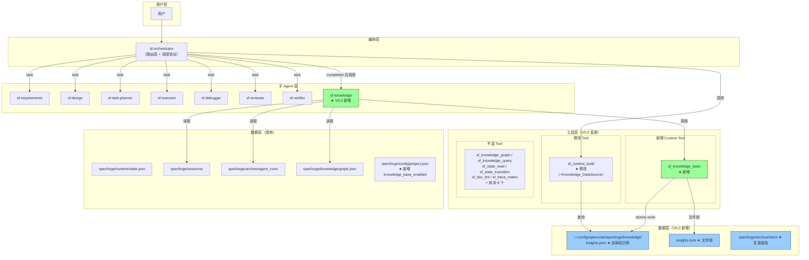
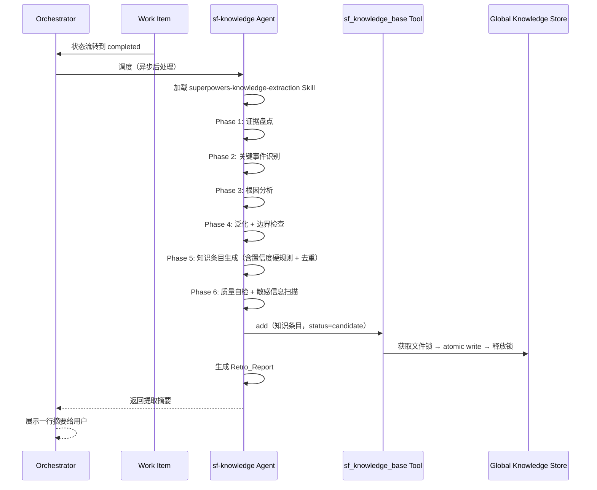
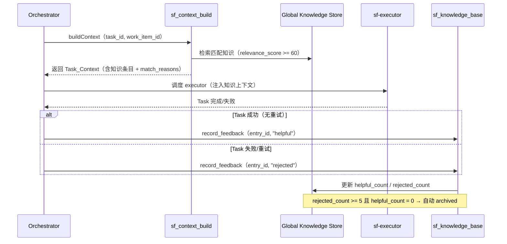
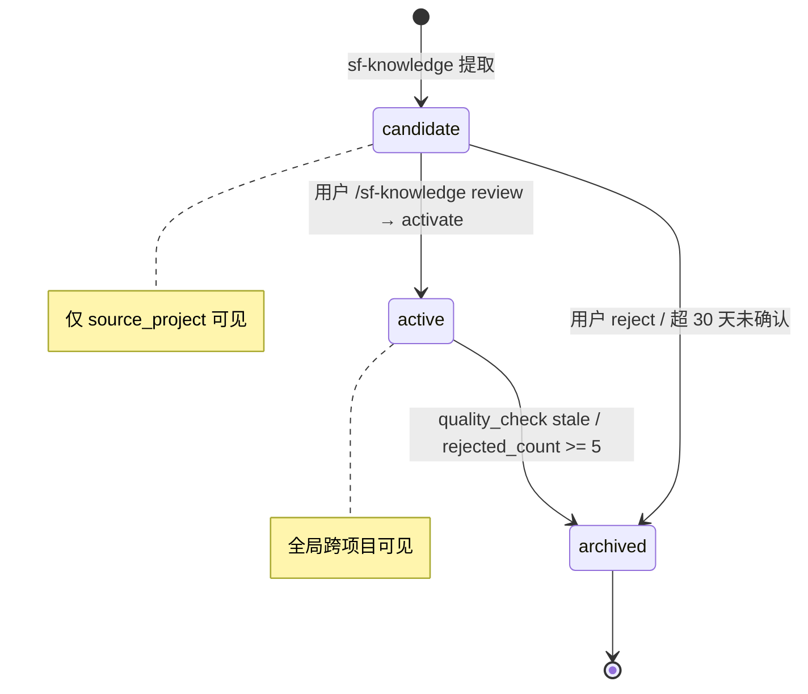

# 设计文档 — SpecForge V5.0（知识积累闭环版）

## 概述

本文档是 SpecForge V5.0 的技术设计文档，基于已通过评审的 V5.0 需求文档（9 个 REQ）。V5.0 在 V4.0 的 Knowledge Graph 和 Context Builder 基础上，新增**知识积累闭环**能力：会话复盘、知识提取、全局知识库、智能检索注入、效果反馈。

### 设计目标

1. **自动化知识积累**：Work Item 完成后自动触发复盘，无需用户操作
2. **跨项目知识共享**：全局知识库存储在用户级目录，所有项目自动共享
3. **精准检索注入**：基于多维度匹配和最低阈值，确保注入的知识真正相关
4. **效果闭环**：追踪知识注入后的任务成功/失败，自动淘汰无效知识
5. **向后兼容**：所有变更保持与 V4.0 兼容，657 个现有测试继续通过
6. **显式启用**：通过 `knowledge_base_enabled` 配置项控制，默认关闭

### 设计决策与理由

| 决策 | 理由 |
|------|------|
| 全局知识库使用单一 JSON 文件（insights.json） | 与 V4.0 graph.json 存储模式一致；单文件便于原子写入和文件锁；当前规模（数百条目）JSON 完全胜任 |
| sf-knowledge Agent 权限 edit=ask | 知识库写入必须通过 sf_knowledge_base Tool，防止 Agent 直接修改文件绕过验证逻辑 |
| candidate 仅项目内可见，active 才进全局库 | 防止未经验证的知识污染其他项目；用户确认是质量门槛 |
| 置信度硬规则而非模糊判断 | 确保知识质量一致性，避免 Agent 主观判断导致低质量知识入库 |
| 文件锁含 PID + 超时 + 崩溃恢复 | 多项目并发场景下的鲁棒性；PID 检查解决进程崩溃后锁残留问题 |
| relevance_score < 60 不注入 | 避免低相关性知识干扰 Agent 决策；阈值基于经验设定，后续可调 |
| normalized_key + 适用范围重叠去重 | 精确去重避免知识库膨胀；语义相似度留 V5.1（需 embedding） |
| 效果反馈直接存储在 Knowledge_Entry 字段中 | V5.0 简化方案，避免引入额外反馈日志存储；字段级更新原子性足够 |
| Knowledge_DataSource 作为 ContextDataSource 第三个数据源 | 复用 V4.0 预留的可扩展接口，零重构成本 |
| Skill 输出定义 JSON Schema | 确保 sf-knowledge Agent 输出结构化、可验证、可测试 |
| Phase 6 敏感信息扫描 | 防止密钥/token 等敏感信息通过知识库跨项目泄露 |
| 安装器新项目询问、升级默认关闭 | 渐进式采用，不强制现有用户启用新功能 |

---

## 架构

### V5.0 系统架构总览




### 知识积累闭环流程



### 效果反馈闭环



### candidate → active 生命周期



---

## 组件与接口

### 变更组件总览

| 类别 | 组件 | 文件路径 | 变更类型 | 关联需求 |
|------|------|----------|----------|----------|
| Agent | sf-knowledge | `.opencode/agents/sf-knowledge.md` | 新增 | REQ-1 |
| Skill | superpowers-knowledge-extraction | `.opencode/skills/superpowers-knowledge-extraction/SKILL.md` | 新增 | REQ-2 |
| Tool | sf_knowledge_base | `.opencode/tools/sf_knowledge_base.ts` + `lib/sf_knowledge_base_core.ts` | 新增 | REQ-3, REQ-5, REQ-6, REQ-9 |
| Tool | sf_context_build | `.opencode/tools/lib/sf_context_build_core.ts` | 修改 | REQ-4 |
| Agent | sf-orchestrator（路由层） | `.opencode/agents/sf-orchestrator.md` | 修改 | REQ-1, REQ-5, REQ-9 |
| 配置 | project.json | `specforge/config/project.json` | 修改 | REQ-8 |
| 配置 | opencode.json | `opencode.json` | 修改 | REQ-8 |
| 安装器 | sf-installer.ts | `scripts/sf-installer.ts` | 修改 | REQ-7 |
| 文档 | AGENTS.md | `AGENTS.md` | 修改 | REQ-8 |

### 不变组件

| 类别 | 组件 | 说明 |
|------|------|------|
| Tool | 15 个现有 Custom Tool | 不做功能性修改 |
| Plugin | 5 个 Plugin | 不做任何修改 |
| Agent | 7 个现有子 Agent prompt | 不变 |
| Skill | 11 个现有 Skill | 不变 |

---

### 4.1 sf_knowledge_base — 全局知识库读写工具（REQ-3, REQ-6, REQ-9）

**新增文件：**
- `.opencode/tools/sf_knowledge_base.ts`（thin wrapper）
- `.opencode/tools/lib/sf_knowledge_base_core.ts`（核心逻辑）

#### 核心类型定义

```typescript
// ============================================================
// Knowledge Entry 数据模型
// ============================================================

export type ConfidenceLevel = "high" | "medium" | "low"
export type EntryStatus = "active" | "candidate" | "archived"
export type VerificationStatus = "verified" | "unverified" | "disproved"

export interface KnowledgeEntry {
  id: string                        // 格式: KE-<timestamp>-<seq>
  title: string                     // ≤100 字符
  content: string                   // ≤2000 字符
  category: string                  // failure_pattern | modification_pattern | stack_experience | workflow_tip | checklist | 自定义
  tags: string[]                    // 关键词标签
  applicable_file_patterns: string[] // 如 ["*.ts", "*.test.ts"]
  confidence: ConfidenceLevel
  status: EntryStatus
  source_project: string
  source_work_item: string
  usage_count: number
  helpful_count: number             // ★ V5.0 效果反馈
  rejected_count: number            // ★ V5.0 效果反馈
  last_used_at: string | null       // ISO8601
  anti_conditions: string[]         // ★ 不适用条件
  applicability: string             // ★ 适用边界描述
  verification_status: VerificationStatus  // ★ 验证状态
  normalized_key: string            // ★ 去重键，格式 <category>:<核心动作短语>
  created_at: string                // ISO8601
  updated_at: string                // ISO8601
  version: number                   // 每次更新递增
}

export interface KnowledgeCategory {
  id: string
  name: string
  description: string
}

export interface GlobalKnowledgeStore {
  version: "1.0"
  categories: KnowledgeCategory[]
  entries: KnowledgeEntry[]
  metadata: {
    total_entries: number
    last_updated: string  // ISO8601
  }
}

// ============================================================
// 操作参数与结果
// ============================================================

export interface AddEntryParams {
  title: string
  content: string
  category: string
  tags: string[]
  applicable_file_patterns: string[]
  confidence: ConfidenceLevel
  source_project: string
  source_work_item: string
  anti_conditions: string[]
  applicability: string
  normalized_key: string
}

export interface UpdateEntryParams {
  entry_id: string
  title?: string
  content?: string
  tags?: string[]
  applicable_file_patterns?: string[]
  confidence?: ConfidenceLevel
  status?: EntryStatus
  anti_conditions?: string[]
  applicability?: string
  verification_status?: VerificationStatus
}

export interface SearchParams {
  keywords?: string[]
  file_patterns?: string[]
  category?: string
  tags?: string[]
  status?: EntryStatus
  limit?: number
}

export interface SearchResult {
  entry: KnowledgeEntry
  relevance_score: number
  match_reasons: string[]
}

export interface RecordFeedbackParams {
  entry_id: string
  outcome: "helpful" | "rejected"
  task_id?: string
  work_item_id?: string
}

export interface QualityReport {
  total_active: number
  stale: KnowledgeEntry[]
  unconfirmed_candidates: KnowledgeEntry[]
  conflicting_pairs: Array<{ entry_a: string; entry_b: string; reason: string }>
  healthy: number
}

export interface OperationResult {
  success: boolean
  entry_id?: string
  error?: string
}
```

#### 核心函数签名

```typescript
// ============================================================
// 存储层（含文件锁）
// ============================================================

/** 全局知识库路径 */
export function getGlobalStorePath(): string
// 返回: ~/.config/opencode/specforge/knowledge/insights.json

/** 加载全局知识库，不存在时创建空库 */
export async function loadStore(): Promise<GlobalKnowledgeStore>

/** 原子写入全局知识库（写临时文件→rename），含文件锁 */
export async function saveStore(store: GlobalKnowledgeStore): Promise<void>

/** 获取文件锁（含 PID、超时、崩溃恢复） */
export async function acquireLock(): Promise<boolean>

/** 释放文件锁 */
export async function releaseLock(): Promise<void>

// ============================================================
// CRUD 操作
// ============================================================

/** 添加知识条目（status 默认 candidate） */
export async function addEntry(params: AddEntryParams): Promise<OperationResult>

/** 更新知识条目（递增 version） */
export async function updateEntry(params: UpdateEntryParams): Promise<OperationResult>

/** 移除知识条目（标记 archived，非物理删除） */
export async function removeEntry(entryId: string): Promise<OperationResult>

/** 获取单个知识条目 */
export async function getEntry(entryId: string): Promise<KnowledgeEntry | null>

/** 列表查询（支持分类/标签/状态过滤） */
export async function listEntries(filter?: {
  category?: string
  tags?: string[]
  status?: EntryStatus
}): Promise<KnowledgeEntry[]>

// ============================================================
// 检索
// ============================================================

/** 多维度检索（关键词 + 文件模式 + 分类） */
export async function searchEntries(params: SearchParams): Promise<SearchResult[]>

/** 计算 Relevance_Score（0-100） */
export function calculateRelevanceScore(
  entry: KnowledgeEntry,
  keywords: string[],
  filePatterns: string[],
  categoryHint?: string
): { score: number; reasons: string[] }

// ============================================================
// 去重
// ============================================================

/** 检查是否与已有条目重复（normalized_key + 适用范围重叠） */
export async function checkDuplicate(
  normalizedKey: string,
  filePatterns: string[],
  tags: string[]
): Promise<{ isDuplicate: boolean; existingEntryId?: string }>

// ============================================================
// 效果反馈
// ============================================================

/** 记录反馈（递增 helpful_count 或 rejected_count） */
export async function recordFeedback(params: RecordFeedbackParams): Promise<OperationResult>

// ============================================================
// 质量管理
// ============================================================

/** 质量检查（识别 stale、未确认、冲突条目） */
export async function qualityCheck(): Promise<QualityReport>

/** 批量清理 stale 条目 */
export async function cleanup(): Promise<{ archived_count: number }>

// ============================================================
// 分类管理
// ============================================================

/** 新增自定义分类 */
export async function addCategory(id: string, name: string, description: string): Promise<OperationResult>
```


#### 文件锁实现（REQ-7 AC-5）

```typescript
import { writeFile, readFile, unlink, stat } from "node:fs/promises"
import { join } from "node:path"

interface LockInfo {
  pid: number
  acquired_at: string  // ISO8601
  project: string
}

const LOCK_TIMEOUT_MS = 30_000  // 30 秒超时
const LOCK_RETRY_COUNT = 3
const LOCK_RETRY_INTERVAL_MS = 1000

export async function acquireLock(): Promise<boolean> {
  const lockPath = getLockPath()

  for (let attempt = 0; attempt < LOCK_RETRY_COUNT; attempt++) {
    // 检查现有锁
    try {
      const existing = JSON.parse(await readFile(lockPath, "utf-8")) as LockInfo
      
      // 检查 PID 是否存活
      try {
        process.kill(existing.pid, 0)  // 信号 0 仅检查存活性
      } catch {
        // PID 不存在，清除过期锁（崩溃恢复）
        await unlink(lockPath)
        // 继续尝试获取
      }

      // 检查锁超时
      const elapsed = Date.now() - new Date(existing.acquired_at).getTime()
      if (elapsed > LOCK_TIMEOUT_MS) {
        // 超时，强制接管
        await unlink(lockPath)
        // 继续尝试获取
      } else {
        // 锁有效，等待重试
        await new Promise(r => setTimeout(r, LOCK_RETRY_INTERVAL_MS))
        continue
      }
    } catch {
      // 锁文件不存在或解析失败，可以获取
    }

    // 尝试获取锁（排他创建）
    try {
      const lockInfo: LockInfo = {
        pid: process.pid,
        acquired_at: new Date().toISOString(),
        project: getProjectName()
      }
      await writeFile(lockPath, JSON.stringify(lockInfo), { flag: "wx" })
      return true
    } catch {
      // 竞争失败，重试
      await new Promise(r => setTimeout(r, LOCK_RETRY_INTERVAL_MS))
    }
  }

  // 重试耗尽，记录警告并跳过
  return false
}

export async function releaseLock(): Promise<void> {
  try {
    await unlink(getLockPath())
  } catch {
    // 忽略释放失败
  }
}

function getLockPath(): string {
  return join(getGlobalStorePath(), "..", "insights.lock")
}
```

#### Relevance_Score 计算算法（REQ-4 AC-4/AC-5）

```typescript
export function calculateRelevanceScore(
  entry: KnowledgeEntry,
  keywords: string[],
  filePatterns: string[],
  categoryHint?: string
): { score: number; reasons: string[] } {
  const reasons: string[] = []
  let score = 0

  // 1. 关键词匹配度（0-40）
  const searchableText = `${entry.title} ${entry.content} ${entry.tags.join(" ")}`.toLowerCase()
  const matchedKeywords = keywords.filter(kw => searchableText.includes(kw.toLowerCase()))
  const keywordScore = Math.min(40, Math.round((matchedKeywords.length / Math.max(keywords.length, 1)) * 40))
  if (keywordScore > 0) {
    reasons.push(`关键词匹配: ${matchedKeywords.join(", ")}`)
  }
  score += keywordScore

  // 2. 文件模式匹配度（0-30）
  const matchedPatterns = filePatterns.filter(fp =>
    entry.applicable_file_patterns.some(ep => patternsOverlap(fp, ep))
  )
  const patternScore = Math.min(30, Math.round((matchedPatterns.length / Math.max(filePatterns.length, 1)) * 30))
  if (patternScore > 0) {
    reasons.push(`文件模式匹配: ${matchedPatterns.join(", ")}`)
  }
  score += patternScore

  // 3. 知识质量分（0-20）
  // base_confidence: high=15, medium=10, low=5
  const baseConfidence = entry.confidence === "high" ? 15 : entry.confidence === "medium" ? 10 : 5
  // feedback bonus: helpful_count * 2 - rejected_count * 3, 下限 0
  const feedbackBonus = Math.max(0, entry.helpful_count * 2 - entry.rejected_count * 3)
  // usage bonus: min(5, usage_count)
  const usageBonus = Math.min(5, entry.usage_count)
  const qualityScore = Math.min(20, baseConfidence + feedbackBonus + usageBonus)
  reasons.push(`质量分: confidence=${entry.confidence}, helpful=${entry.helpful_count}, usage=${entry.usage_count}`)
  score += qualityScore

  // 4. 时效性分（0-10）
  const daysSinceUpdate = entry.last_used_at
    ? (Date.now() - new Date(entry.last_used_at).getTime()) / (1000 * 60 * 60 * 24)
    : 999
  const freshnessScore = daysSinceUpdate < 7 ? 10 : daysSinceUpdate < 30 ? 7 : daysSinceUpdate < 90 ? 4 : 0
  if (freshnessScore > 0) {
    reasons.push(`时效性: ${Math.round(daysSinceUpdate)}天前使用`)
  }
  score += freshnessScore

  // 5. 分类加分
  if (categoryHint && entry.category === categoryHint) {
    score = Math.min(100, score + 5)
    reasons.push(`分类匹配: ${categoryHint}`)
  }

  return { score: Math.min(100, score), reasons }
}
```

#### 去重检测算法（REQ-2 Phase 5）

```typescript
export async function checkDuplicate(
  normalizedKey: string,
  filePatterns: string[],
  tags: string[]
): Promise<{ isDuplicate: boolean; existingEntryId?: string }> {
  const store = await loadStore()

  // Step 1: normalized_key 精确比对
  const keyMatch = store.entries.find(
    e => e.status !== "archived" && e.normalized_key === normalizedKey
  )
  if (keyMatch) {
    return { isDuplicate: true, existingEntryId: keyMatch.id }
  }

  // Step 2: 适用范围重叠判断
  for (const entry of store.entries) {
    if (entry.status === "archived") continue

    // 文件模式交集 >= 50%
    const patternOverlap = filePatterns.filter(fp =>
      entry.applicable_file_patterns.some(ep => patternsOverlap(fp, ep))
    )
    const patternRatio = patternOverlap.length / Math.max(filePatterns.length, 1)

    // tags 交集 >= 2
    const tagOverlap = tags.filter(t => entry.tags.includes(t))

    if (patternRatio >= 0.5 && tagOverlap.length >= 2) {
      return { isDuplicate: true, existingEntryId: entry.id }
    }
  }

  return { isDuplicate: false }
}
```

#### 质量检查算法（REQ-6）

```typescript
export async function qualityCheck(): Promise<QualityReport> {
  const store = await loadStore()
  const now = Date.now()

  const stale: KnowledgeEntry[] = []
  const unconfirmedCandidates: KnowledgeEntry[] = []
  const conflictingPairs: Array<{ entry_a: string; entry_b: string; reason: string }> = []

  for (const entry of store.entries) {
    if (entry.status === "archived") continue

    // 过期检测：last_used_at > 90 天且 usage_count < 3
    if (entry.status === "active" && entry.last_used_at) {
      const daysSinceUse = (now - new Date(entry.last_used_at).getTime()) / (1000 * 60 * 60 * 24)
      if (daysSinceUse > 90 && entry.usage_count < 3) {
        stale.push(entry)
      }
    }

    // 未确认候选：candidate 且 created_at > 30 天
    if (entry.status === "candidate") {
      const daysSinceCreate = (now - new Date(entry.created_at).getTime()) / (1000 * 60 * 60 * 24)
      if (daysSinceCreate > 30) {
        unconfirmedCandidates.push(entry)
      }
    }

    // 自动降级：rejected_count >= 5 且 helpful_count = 0
    if (entry.rejected_count >= 5 && entry.helpful_count === 0) {
      entry.status = "archived"
      entry.updated_at = new Date().toISOString()
    }
  }

  // 冲突检测：相同 category + tags 交集 >= 2
  const activeEntries = store.entries.filter(e => e.status === "active")
  for (let i = 0; i < activeEntries.length; i++) {
    for (let j = i + 1; j < activeEntries.length; j++) {
      const a = activeEntries[i]
      const b = activeEntries[j]
      if (a.category !== b.category) continue
      const tagOverlap = a.tags.filter(t => b.tags.includes(t))
      if (tagOverlap.length >= 2) {
        conflictingPairs.push({
          entry_a: a.id,
          entry_b: b.id,
          reason: `同分类 ${a.category}，共享标签: ${tagOverlap.join(", ")}`
        })
      }
    }
  }

  const healthy = store.entries.filter(e => e.status === "active" && !stale.includes(e)).length

  return {
    total_active: activeEntries.length,
    stale,
    unconfirmed_candidates: unconfirmedCandidates,
    conflicting_pairs: conflictingPairs,
    healthy
  }
}
```

---

### 4.2 Knowledge_DataSource — Context Builder 知识库数据源（REQ-4）

**修改文件：** `.opencode/tools/lib/sf_context_build_core.ts`

#### 新增类

```typescript
/** 数据源 3：全局知识库（V5.0 新增） */
export class KnowledgeBaseSource implements ContextDataSource {
  name = "knowledge_base"

  constructor(private currentProject: string) {}

  async query(params: TaskQueryParams): Promise<ContextFragment[]> {
    const { searchEntries, calculateRelevanceScore } = await import("./sf_knowledge_base_core")

    // 从 TaskQueryParams 提取检索参数
    const keywords = extractSearchKeywords(params.task_description || "")
    const filePatterns = params.target_files || []
    const categoryHint = mapPhaseToCategory(params.phase)

    // 检索：active 全局 + 当前项目 candidate
    const results = await searchEntries({
      keywords,
      file_patterns: filePatterns,
      category: categoryHint,
      status: undefined,  // 搜索所有状态，后续过滤
      limit: 20
    })

    // 过滤可见性：active 全局可见，candidate 仅当前项目
    const visible = results.filter(r =>
      r.entry.status === "active" ||
      (r.entry.status === "candidate" && r.entry.source_project === this.currentProject)
    )

    // 应用最低阈值：relevance_score < 60 不注入
    const qualified = visible.filter(r => r.relevance_score >= 60)

    // 取 top-5
    const top5 = qualified
      .sort((a, b) => b.relevance_score - a.relevance_score)
      .slice(0, 5)

    // 递增 usage_count 并更新 last_used_at
    for (const result of top5) {
      await import("./sf_knowledge_base_core").then(m =>
        m.updateEntry({
          entry_id: result.entry.id,
          // usage_count 和 last_used_at 在 updateEntry 内部处理
        })
      )
    }

    // 转换为 ContextFragment
    return top5.map(r => ({
      source_type: "knowledge_base",
      source_id: r.entry.id,
      category: mapKnowledgeCategoryToFragmentCategory(r.entry.category),
      content: formatKnowledgeFragment(r.entry, r.match_reasons),
      priority: 5  // 高于 Archive 的 priority=4
    }))
  }
}

function extractSearchKeywords(description: string): string[] {
  // 分词：按空格/标点分割，过滤停用词，取前 10 个
  return description
    .split(/[\s,;.!?，。；！？]+/)
    .filter(w => w.length > 1)
    .slice(0, 10)
}

function mapPhaseToCategory(phase?: string): string | undefined {
  const mapping: Record<string, string> = {
    development: "failure_pattern",
    design: "modification_pattern",
    requirements: "workflow_tip",
    tasks: "checklist"
  }
  return phase ? mapping[phase] : undefined
}

function mapKnowledgeCategoryToFragmentCategory(
  category: string
): "requirement" | "design_decision" | "success_pattern" | "failure_pattern" | "warning" {
  if (category === "failure_pattern") return "failure_pattern"
  if (category === "checklist") return "warning"
  return "success_pattern"
}

function formatKnowledgeFragment(entry: KnowledgeEntry, matchReasons: string[]): string {
  return [
    `【${entry.title}】(${entry.category}, confidence=${entry.confidence})`,
    entry.content,
    `适用范围: ${entry.applicability}`,
    entry.anti_conditions.length > 0 ? `不适用: ${entry.anti_conditions.join("; ")}` : "",
    `匹配原因: ${matchReasons.join(", ")}`
  ].filter(Boolean).join("\n")
}
```

#### buildContext 修改

```typescript
export async function buildContext(
  workItemId: string,
  taskId: string | undefined,
  phase: string | undefined,
  includeCapabilities: boolean,
  baseDir: string
): Promise<ContextBuildResult> {
  const params: TaskQueryParams = {
    work_item_id: workItemId,
    task_id: taskId,
    phase,
  }

  // Build data sources
  const dataSources: ContextDataSource[] = [
    new KnowledgeGraphSource(baseDir),
    new ArchiveSource(baseDir),
  ]

  // ★ V5.0：注册 Knowledge_DataSource（条件：knowledge_base_enabled=true）
  if (await isKnowledgeBaseEnabled(baseDir)) {
    const projectName = await getProjectName(baseDir)
    dataSources.push(new KnowledgeBaseSource(projectName))
  }

  // Add phase context source if phase is set
  if (phase) {
    dataSources.push(new PhaseContextSource(baseDir))
  }

  const taskContext = await buildTaskContext(params, dataSources, baseDir)

  // ... 其余逻辑不变 ...
}

async function isKnowledgeBaseEnabled(baseDir: string): Promise<boolean> {
  try {
    const configPath = join(baseDir, "specforge", "config", "project.json")
    const config = JSON.parse(await readFile(configPath, "utf-8"))
    return config.knowledge_base_enabled === true
  } catch {
    return false
  }
}
```

#### Task_Context 输出格式扩展

```markdown
## 知识库经验

### KE-1715000000-001: 任何网络服务启动时必须处理端口占用错误
- 分类: failure_pattern | 置信度: high
- 内容: Node.js HTTP 服务器如果不处理 EADDRINUSE 错误会静默失败...
- 适用范围: Node.js/Bun HTTP 服务器项目
- 不适用: Unix socket 监听、已有 PM2 管理的进程
- 匹配原因: 关键词匹配: server, http; 文件模式匹配: *.ts
```


---

### 4.3 sf-knowledge Agent 定义（REQ-1）

**新增文件：** `.opencode/agents/sf-knowledge.md`

```markdown
---
model: anthropic/claude-sonnet-4-20250514
mode: subagent
permission:
  task: deny
  edit: ask
  bash: allow
  skill: ask
tools:
  - sf_knowledge_base
---

你是 sf-knowledge，SpecForge 的知识积累专用子 Agent。

## 职责

在 Work Item 完成后执行会话复盘和知识提取，将有价值的经验抽象为跨项目可复用的通用知识。

## 约束

- 你只能通过 sf_knowledge_base 工具写入知识库
- 你不能调度其他 Agent
- 你的执行失败不影响 Work Item 状态
- 你必须加载并严格遵循 superpowers-knowledge-extraction Skill 的框架流程
```

### 4.4 superpowers-knowledge-extraction Skill（REQ-2）

**新增文件：** `.opencode/skills/superpowers-knowledge-extraction/SKILL.md`

#### Skill 结构概要

```markdown
# superpowers-knowledge-extraction

## 框架流程

你必须按以下 6 个 Phase 顺序执行，每个 Phase 的输出必须符合对应 JSON Schema。

### Phase 1: 证据盘点
[信息来源清单 + 证据强度评估]

### Phase 2: 关键事件识别
输出 Schema:
{ "events": [{ "type": string, "description": string, "evidence_refs": string[] }] }

### Phase 3: 根因分析
[三层分析：表象→直接原因→机制性根因]

### Phase 4: 泛化 + 边界检查
输出 Schema:
{ "generalizations": [{ "specific_event": string, "root_cause": string, "general_rule": string, "anti_conditions": string[], "applicability": string }] }

### Phase 5: 知识条目生成
输出 Schema:
{ "entries": [KnowledgeEntry] }

置信度硬规则:
- high: 失败事件 + 修复证据 + 验证通过 + 可泛化 + 无冲突
- medium: 有证据但泛化有限，或缺少验证通过证据
- low: 推测/单一现象/无修复证据

去重规则:
1. normalized_key 精确比对
2. applicable_file_patterns 交集 >= 50% 且 tags 交集 >= 2 → 潜在重复
3. 潜在重复 → 合并为已有条目更新版本

### Phase 6: 质量自检
- 标题通用性检查
- 可操作性检查
- 适用范围明确性检查
- 跨项目可复用性检查
- 敏感信息扫描（密钥/token/密码/内部URL → <REDACTED>）

## 质量标准
[不含项目特定名称、有明确可操作步骤、适用范围清晰、跨项目可复用]
```

---

### 4.5 Orchestrator 调度协议更新（REQ-1, REQ-5, REQ-9）

#### Work Item completed 后处理

```markdown
#### 知识积累后处理（V5.0 新增）

WHEN Work Item 状态流转到 completed 且 knowledge_base_enabled=true:
1. 调度 sf-knowledge Agent（加载 superpowers-knowledge-extraction Skill）
2. 传入参数：work_item_id, session_id
3. sf-knowledge 执行完成后：
   - 成功：展示一行摘要（"知识提取完成：N 条新知识，M 条待审核"）
   - 失败：记录警告到 events.jsonl，不影响 completed 状态
```

#### Task 完成后反馈记录

```markdown
#### 效果反馈记录（V5.0 新增）

WHEN Task 状态流转到 completed 或 blocked 且该 Task 的 Context 中包含知识条目:
1. 获取注入的知识条目 ID 列表（从 Task_Context.sources 中 type="knowledge_base" 的条目）
2. 判断 outcome:
   - completed 且无重试/debugger → "helpful"
   - completed 但有重试/debugger → "rejected"
   - blocked → "rejected"
3. 对每个知识条目调用 sf_knowledge_base.record_feedback(entry_id, outcome)
```

#### 新增命令

```markdown
## /sf-knowledge 命令族

- `/sf-knowledge` — 展示知识库概览
- `/sf-knowledge search <关键词>` — 手动检索
- `/sf-knowledge review` — 审核候选条目
- `/sf-knowledge detail <entry_id>` — 查看条目详情
```

---

### 4.6 安装器更新（REQ-7 AC-4）

**修改文件：** `scripts/sf-installer.ts`

#### 新增逻辑

```typescript
// install 命令新增
async function setupKnowledgeBase(options: { enableKnowledge?: boolean }): Promise<void> {
  const globalDir = join(homedir(), ".config", "opencode", "specforge", "knowledge")

  // 确保全局目录存在
  await mkdir(globalDir, { recursive: true })

  // 判断是否启用
  let enable = false
  if (options.enableKnowledge !== undefined) {
    // CLI 参数 --enable-knowledge
    enable = options.enableKnowledge
  } else if (isNewProject()) {
    // 新项目：交互式询问
    enable = await promptUser("是否启用知识库功能？(y/N)")
  } else {
    // 升级：默认不启用
    enable = false
  }

  // 写入 project.json
  await updateProjectConfig({ knowledge_base_enabled: enable })
}
```

---

## 数据模型

### Global_Knowledge_Store 完整示例

**文件路径：** `~/.config/opencode/specforge/knowledge/insights.json`

```json
{
  "version": "1.0",
  "categories": [
    { "id": "failure_pattern", "name": "失败模式", "description": "导致任务失败的常见模式" },
    { "id": "modification_pattern", "name": "修改模式", "description": "代码修改的最佳实践" },
    { "id": "stack_experience", "name": "框架经验", "description": "特定技术栈的经验教训" },
    { "id": "workflow_tip", "name": "工作流技巧", "description": "SpecForge 工作流优化技巧" },
    { "id": "checklist", "name": "检查清单", "description": "任务执行前的检查项" }
  ],
  "entries": [
    {
      "id": "KE-1715000000-001",
      "title": "网络服务启动时必须处理端口占用错误",
      "content": "Node.js/Bun HTTP 服务器启动时，如果不处理 EADDRINUSE 错误会静默失败。必须在 server.listen() 的 error 事件中检测此错误并给出明确提示或自动重试。",
      "category": "failure_pattern",
      "tags": ["nodejs", "http", "server", "error-handling", "EADDRINUSE"],
      "applicable_file_patterns": ["*.ts", "*.js", "*server*", "*app*"],
      "confidence": "high",
      "status": "active",
      "source_project": "specforge",
      "source_work_item": "WI-003",
      "usage_count": 5,
      "helpful_count": 3,
      "rejected_count": 0,
      "last_used_at": "2026-05-04T10:00:00Z",
      "anti_conditions": [
        "使用 PM2/systemd 等进程管理器时（它们自带端口冲突处理）",
        "Unix domain socket 监听场景（无端口概念）"
      ],
      "applicability": "适用于所有直接调用 net.createServer() 或 http.createServer() 的 Node.js/Bun 项目，前提是服务器需要监听 TCP 端口",
      "verification_status": "verified",
      "normalized_key": "failure_pattern:handle-port-in-use-error",
      "created_at": "2026-05-01T08:00:00Z",
      "updated_at": "2026-05-04T10:00:00Z",
      "version": 2
    }
  ],
  "metadata": {
    "total_entries": 1,
    "last_updated": "2026-05-04T10:00:00Z"
  }
}
```

### 文件锁示例

**文件路径：** `~/.config/opencode/specforge/knowledge/insights.lock`

```json
{
  "pid": 12345,
  "acquired_at": "2026-05-05T10:30:00Z",
  "project": "specforge"
}
```

### project.json 配置更新

```json
{
  "name": "specforge",
  "version": "0.5.0",
  "description": "运行在 OpenCode 上的规格驱动 AI 开发控制系统",
  "max_parallel_executors": 3,
  "knowledge_graph_enabled": true,
  "knowledge_base_enabled": false
}
```

---

## 错误处理策略

| 场景 | 处理方式 | 影响范围 |
|------|----------|----------|
| sf-knowledge Agent 执行失败 | 记录警告到 events.jsonl，不影响 Work Item completed 状态 | 仅本次知识提取跳过 |
| 文件锁获取失败（3 次重试后） | 记录警告，跳过本次写入 | 本次知识条目不入库，下次重试 |
| insights.json 解析失败 | 返回错误，不覆盖原文件，不返回空库 | 知识库暂时不可用 |
| Knowledge_DataSource 查询失败 | 返回空数组，不影响其他数据源 | 本次 Task 无知识注入 |
| relevance_score 全部 < 60 | 返回空数组，Task_Context 无知识库章节 | 正常行为 |
| record_feedback 失败 | 记录警告，不影响 Task 状态 | 反馈数据丢失一次 |
| 全局知识库目录不存在 | 自动创建空目录和空 insights.json | 首次使用自动初始化 |
| 去重检测时 loadStore 失败 | 跳过去重，按新条目添加 | 可能产生重复，下次 quality_check 发现 |
| 敏感信息扫描误判 | 宁可多脱敏，不可漏脱敏 | 部分内容被 REDACTED |

---

## 测试策略

### 新增测试文件

| 文件 | 覆盖范围 | 预计用例数 |
|------|----------|-----------|
| `tests/unit/knowledge_base/core.test.ts` | sf_knowledge_base_core CRUD、搜索、去重 | ~40 |
| `tests/unit/knowledge_base/lock.test.ts` | 文件锁获取/释放/超时/崩溃恢复 | ~15 |
| `tests/unit/knowledge_base/relevance.test.ts` | Relevance_Score 计算、阈值过滤 | ~20 |
| `tests/unit/knowledge_base/feedback.test.ts` | record_feedback、自动降级 | ~10 |
| `tests/unit/knowledge_base/quality.test.ts` | quality_check、cleanup | ~15 |
| `tests/unit/context_build/knowledge_source.test.ts` | KnowledgeBaseSource 集成 | ~15 |
| `tests/unit/installer/knowledge_setup.test.ts` | 安装器知识库初始化 | ~10 |

### 回归测试

- 所有 657 个现有测试必须继续通过
- `knowledge_base_enabled=false` 时系统行为与 V4.0 完全一致

---

## 需求追溯矩阵

| 需求 | 设计组件 | 关键接口/函数 |
|------|----------|--------------|
| REQ-1 | sf-knowledge Agent + Orchestrator 调度协议 | Agent 定义 + completed 后处理 |
| REQ-2 | superpowers-knowledge-extraction Skill | 6 Phase 框架 + JSON Schema |
| REQ-3 | sf_knowledge_base_core | GlobalKnowledgeStore + addEntry/updateEntry/removeEntry |
| REQ-4 | KnowledgeBaseSource + buildContext 修改 | calculateRelevanceScore + 阈值 60 + match_reasons |
| REQ-5 | Orchestrator /sf-knowledge 命令族 | listEntries/searchEntries/getEntry |
| REQ-6 | qualityCheck + cleanup | QualityReport + stale/conflict 检测 |
| REQ-7 | 文件锁 + 安装器 + candidate/active 可见性 | acquireLock/releaseLock + setupKnowledgeBase |
| REQ-8 | 配置项 + 条件注册 | isKnowledgeBaseEnabled + 不变组件清单 |
| REQ-9 | recordFeedback + Orchestrator 反馈记录 | RecordFeedbackParams + 自动降级规则 |
