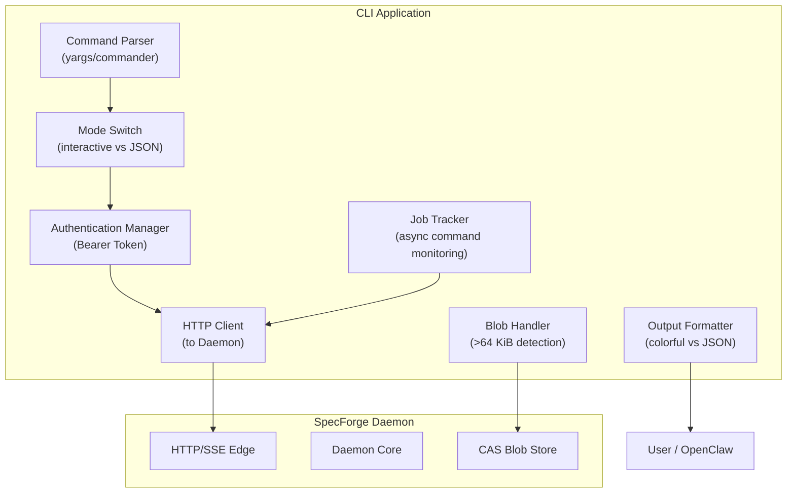
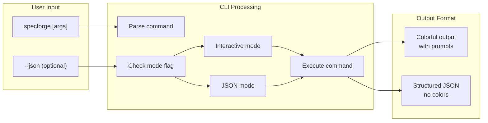
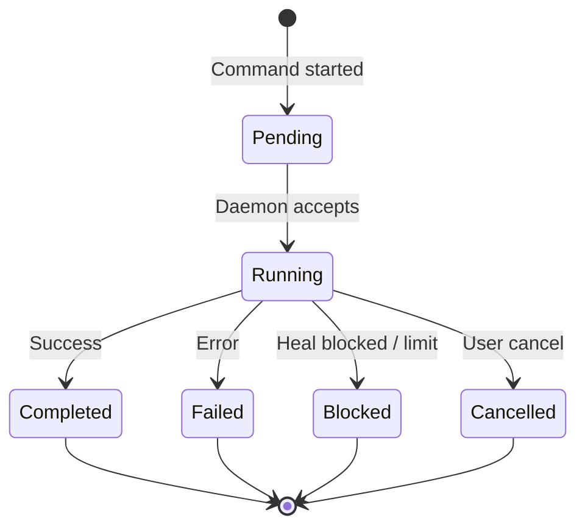

# Design Document: CLI

## Overview

This design document defines the architecture and implementation approach for the **Command Line Interface (CLI)** module of SpecForge V6. The CLI serves as the primary user-facing interface to the Daemon, supporting both interactive human usage and machine-friendly automation.

### Design Principles

1. **Dual-mode First**: Every command must work in both interactive and JSON modes with consistent behavior.
2. **Machine-friendly by Default**: The `--json` output must be stable, parseable, and suitable for programmatic consumption.
3. **Transparent Blob Handling**: Large content should be automatically converted to blob references without user intervention.
4. **Async Consistency**: Asynchronous operations must follow a predictable contract with job tracking.

### Scope

This is a **P0** design, implementing functionality required for V6.0 release. The CLI must:
- Provide access to all core Daemon functionality
- Support OpenClaw integration via machine-friendly mode
- Enforce payload size thresholds
- Implement consistent async command contracts

## Architecture

### 1. CLI Component Structure



### 2. Dual-Mode Flow



### 3. Async Command State Machine



## Components and Interfaces

### 1. Command Parser

```typescript
interface CommandParser {
  parse(argv: string[]): ParsedCommand;
  validate(command: ParsedCommand): ValidationResult;
  generateHelp(command: string): string;
}

interface ParsedCommand {
  command: string;
  args: Record<string, unknown>;
  flags: {
    json?: boolean;
    wait?: boolean;
    help?: boolean;
    version?: boolean;
  };
}
```

### 2. Mode Switch

```typescript
interface ModeSwitch {
  isJsonMode(flags: ParsedCommand['flags']): boolean;
  shouldWait(flags: ParsedCommand['flags']): boolean;
  formatOutput(data: unknown, mode: 'interactive' | 'json'): string;
}
```

### 3. Authentication Manager

```typescript
interface AuthManager {
  getToken(): Promise<string | null>;
  readHandshakeFile(): Promise<HandshakeFile>;
  validateToken(token: string): boolean;
  getAuthHeader(): Promise<{ Authorization: string }>;
}

interface HandshakeFile {
  pid: number;
  port: number;
  token: string;
  schema_version: string;
  bound_to: "127.0.0.1" | "0.0.0.0";
}
```

### 4. HTTP Client

```typescript
interface HTTPClient {
  request<T = unknown>(options: {
    method: string;
    path: string;
    body?: unknown;
    headers?: Record<string, string>;
  }): Promise<T>;
  
  stream(options: {
    path: string;
    onData: (data: unknown) => void;
    onError: (error: Error) => void;
  }): Promise<void>;
}
```

### 5. Blob Handler

```typescript
interface BlobHandler {
  shouldConvertToBlob(content: unknown): boolean;
  convertToBlob(content: unknown): Promise<BlobReference>;
  resolveBlob(ref: BlobReference): Promise<unknown>;
  getBlobSize(content: unknown): number;
}

type BlobReference = `blob://${string}`;
```

### 6. Job Tracker

```typescript
interface JobTracker {
  createJob(command: string, args: unknown): Promise<JobInfo>;
  getJobStatus(jobId: string): Promise<JobStatus>;
  waitForJob(jobId: string, timeout?: number): Promise<JobStatus>;
  cancelJob(jobId: string): Promise<void>;
}

interface JobInfo {
  jobId: string;
  status: "pending";
  command: string;
  createdAt: number;
}

interface JobStatus {
  jobId: string;
  status: "pending" | "running" | "completed" | "failed" | "blocked" | "cancelled";
  result?: unknown;
  error?: string;
  updatedAt: number;
}
```

### 7. Output Formatter

```typescript
interface OutputFormatter {
  formatInteractive(data: unknown): string;
  formatJson(data: unknown): string;
  formatError(error: Error, mode: 'interactive' | 'json'): string;
  formatJobStatus(status: JobStatus, mode: 'interactive' | 'json'): string;
}
```

## Data Models

### 1. CLI Configuration

```typescript
interface CLIConfig {
  schema_version: "1.0";
  default_mode: "interactive" | "json";
  color_enabled: boolean;
  timeout_seconds: number;
  max_content_size_kib: number; // 64
}
```

### 2. Command Definition

```typescript
interface CommandDefinition {
  name: string;
  description: string;
  async: boolean;
  parameters: ParameterDefinition[];
  examples: string[];
}

interface ParameterDefinition {
  name: string;
  type: "string" | "number" | "boolean" | "array";
  required: boolean;
  description: string;
  default?: unknown;
}
```

### 3. Webhook Registration

```typescript
interface WebhookRegistration {
  schema_version: "1.0";
  url: string;
  events: string[]; // e.g., ["gate.*", "permission.denied"]
  secret?: string;
  enabled: boolean;
  createdAt: number;
}
```

## Correctness Properties Implementation

### Property 17: Payload Size Thresholding

**Implementation Strategy**:
- BlobHandler component monitors all request/response content
- Automatic conversion when content > 64 KiB
- Integration tests verify no >64 KiB inline data in HTTP bodies

**Test Cases**:
1. Content < 64 KiB remains inline
2. Content > 64 KiB becomes blob reference
3. Mixed content (some inline, some blob) handled correctly
4. Blob references properly resolved for interactive display

### Property 18: Async Command Contract

**Implementation Strategy**:
- JobTracker manages async command lifecycle
- Consistent JSON output format for all async commands
- `specforge job <id>` endpoint for status queries
- Terminal state validation

**Test Cases**:
1. Async command returns immediate jobId
2. Job status query returns valid status
3. `--wait` blocks until terminal state
4. All jobs end in defined terminal states
5. Error handling for invalid jobIds

## Error Handling

### Error Categories

| Category | Example | Response |
|----------|---------|----------|
| **Auth** | Invalid/missing token | HTTP 401, clear error message |
| **Network** | Daemon unreachable | "Daemon unreachable" with retry suggestion |
| **Validation** | Invalid command args | Usage help with specific error |
| **Async** | Job not found | "Job not found: <id>" |
| **Blob** | Blob reference invalid | "Invalid blob reference" |

### Error Output Format

**Interactive mode**:
```
Error: Daemon unreachable
  Hint: Is the Daemon running? Try 'specforge daemon start'
```

**JSON mode**:
```json
{
  "error": "daemon_unreachable",
  "message": "Daemon unreachable",
  "hint": "Is the Daemon running? Try 'specforge daemon start'"
}
```

## Testing Strategy

### Property-Based Tests

1. **Payload Size Property Test**: Generate random content of varying sizes, verify threshold behavior
2. **Async Command Property Test**: Generate random async command sequences, verify contract compliance
3. **JSON Output Property Test**: Verify JSON output is always valid, parseable JSON

### Unit Tests

1. Command parser tests
2. Mode switch tests
3. Blob handler tests (size detection, conversion)
4. Job tracker tests (state transitions)
5. Output formatter tests (interactive vs JSON)

### Integration Tests

1. End-to-end command execution
2. Async command lifecycle
3. Blob reference handling with actual CAS
4. OpenClaw integration simulation
5. Error scenario handling

### Performance Tests

1. Command parsing speed
2. Blob conversion overhead
3. Async job tracking performance
4. Memory usage with large content

## Implementation Notes

1. **Library Choice**: Use established CLI framework (yargs, commander.js) for robustness
2. **Color Support**: Use chalk or similar for interactive mode colors
3. **JSON Stability**: Ensure JSON output structure is stable across versions
4. **Error Codes**: Define stable error codes for machine consumption
5. **Backward Compatibility**: Maintain compatibility with future Daemon API changes
6. **Platform Support**: Ensure cross-platform compatibility (Windows, macOS, Linux)

## Dependencies

- Daemon HTTP API
- CAS blob storage
- Authentication system
- Event system for webhooks

## Open Questions

1. Should blob conversion be configurable (threshold adjustable)?
2. How to handle partial content (some parts >64 KiB, some not)?
3. Webhook security model (secret validation)?
4. Job persistence across CLI restarts?