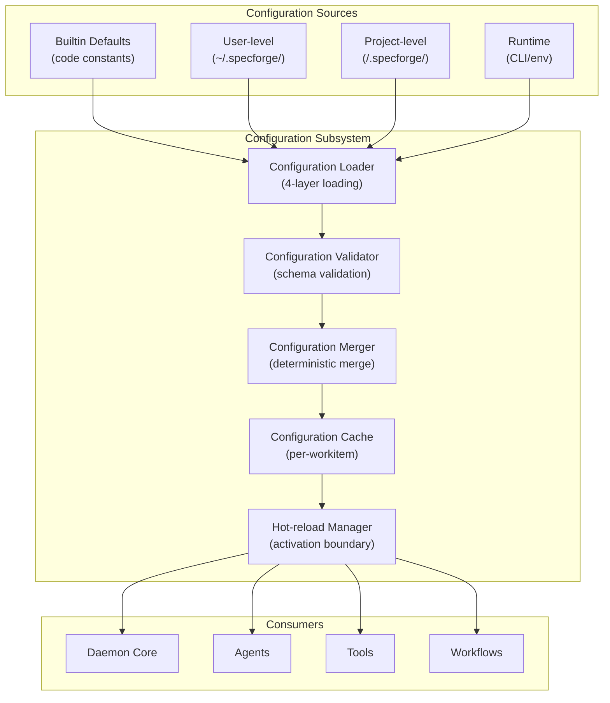

# Design Document: Configuration Subsystem

## Overview

This design document specifies the implementation of the **Configuration Subsystem** module for SpecForge V6. The Configuration Subsystem manages the four-layer configuration model with deterministic merging, sensitive field protection, and hot-reload boundaries.

**Parent Specification**: This design inherits architectural decisions from **[v6-architecture-overview](../v6-architecture-overview/design.md)**.

**Scope**: **P0** - Required for V6.0 release.

## Architecture

### Configuration Subsystem Component Diagram



### Key Architectural Decisions

#### ADR-CONF-001: Deterministic Merge Algorithm
**Decision**: Implement deterministic merge algorithm where same inputs always produce same output, independent of timing or execution environment.

**Rationale**: 
- Ensures Configuration Merge Determinism (Property 11)
- Eliminates configuration drift between environments
- Simplifies debugging and reproducibility

**Alternatives Considered**:
- Non-deterministic merge (causes environment-specific issues)
- Time-based merging (complex, hard to debug)

#### ADR-CONF-002: Hot-reload with Activation Boundary
**Decision**: Implement hot-reload with strict activation boundary based on workflow/work item start time.

**Rationale**:
- Ensures Hot-reload Activation Boundary (Property 19)
- Prevents mid-execution configuration changes from breaking running work items
- Clear semantics for when new config applies

**Alternatives Considered**:
- Immediate application to all components (risky for running work items)
- Manual restart required (poor user experience)

#### ADR-CONF-003: Sensitive Field Protection
**Decision**: Prevent project-level configuration from overriding sensitive fields (API keys, credentials, tokens).

**Rationale**:
- Security: prevents accidental leakage of secrets into repositories
- Compliance: aligns with security best practices
- Clear ownership: sensitive config belongs to user, not project

**Alternatives Considered**:
- Allow override with warning (security risk)
- Encrypted project-level secrets (complexity overhead)

#### ADR-CONF-004: No Fallback on Load Failure
**Decision**: When project-level configuration fails to load, error immediately without falling back to user-level or builtin.

**Rationale**:
- Clear failure semantics
- Prevents silent degradation of functionality
- Forces explicit configuration management

**Alternatives Considered**:
- Silent fallback (hides configuration issues)
- Warning with fallback (ambiguous behavior)

## Component Specifications

### 1. Configuration Loader

**Responsibilities**:
- Load configuration from four layers in order
- Handle file system I/O and parsing
- Support multiple formats (JSON, YAML, etc.)
- Track source layer for each configuration value

**Interfaces**:
```typescript
interface ConfigurationLoader {
  loadBuiltin(): Promise<ConfigLayer>;
  loadUser(): Promise<ConfigLayer>;
  loadProject(projectPath: string): Promise<ConfigLayer>;
  loadRuntime(): Promise<ConfigLayer>;
  getLayerSource(key: string): ConfigLayerType;
}
```

### 2. Configuration Merger

**Responsibilities**:
- Implement deterministic merge algorithm (Property 11)
- Apply merge rules: simple override, deep object merge, array replacement
- Protect sensitive fields from project-level override
- Generate merged configuration cache

**Interfaces**:
```typescript
interface ConfigurationMerger {
  merge(layers: ConfigLayer[]): MergedConfig;
  isSensitiveField(key: string): boolean;
  validateMerge(layers: ConfigLayer[]): ValidationResult;
}
```

### 3. Configuration Validator

**Responsibilities**:
- Validate configuration schema
- Provide clear error messages with context
- Support schema versioning
- Dry-run validation mode

**Interfaces**:
```typescript
interface ConfigurationValidator {
  validate(config: any, schema: ConfigSchema): ValidationResult;
  getSchemaVersion(config: any): string;
  formatError(error: ValidationError): string;
}
```

### 4. Hot-reload Manager

**Responsibilities**:
- Manage configuration reload events
- Enforce activation boundary (Property 19)
- Maintain per-workitem configuration cache
- Coordinate with workflow runtime

**Interfaces**:
```typescript
interface HotReloadManager {
  reload(): Promise<ReloadResult>;
  getConfigForWorkItem(workItemId: string, startTime: number): MergedConfig;
  isReloadPending(): boolean;
  getLastReloadTime(): number | null;
}
```

### 5. Configuration Cache

**Responsibilities**:
- Cache merged configurations
- Support per-workitem configuration snapshots
- Efficient lookup of configuration values
- Memory management (eviction policies)

**Interfaces**:
```typescript
interface ConfigurationCache {
  get(key: string): any;
  set(key: string, value: any, ttl?: number): void;
  snapshot(workItemId: string): ConfigSnapshot;
  restore(workItemId: string, snapshot: ConfigSnapshot): void;
}
```

## Data Models

### ConfigLayer
```typescript
interface ConfigLayer {
  type: "builtin" | "user" | "project" | "runtime";
  source: string;  // File path, CLI args, etc.
  timestamp: number;
  data: Record<string, unknown>;
  schemaVersion: string;
}
```

### MergedConfig
```typescript
interface MergedConfig {
  schemaVersion: string;
  mergedAt: number;
  data: Record<string, unknown>;
  metadata: {
    sources: Record<string, ConfigLayerType>;  // key -> source layer
    sensitiveFields: string[];
    validationErrors: ValidationError[];
  };
}
```

### ConfigSchema
```typescript
interface ConfigSchema {
  version: string;
  fields: Record<string, FieldSchema>;
  sensitiveFields: string[];
  requiredFields: string[];
}
```

### ReloadEvent
```typescript
interface ReloadEvent {
  eventId: string;
  timestamp: number;
  trigger: "file-watcher" | "cli-command" | "api-call";
  layersChanged: ConfigLayerType[];
  activationBoundary: number;  // Time t from Property 19
}
```

## Error Handling

### Error Categories

| Category | Examples | Response |
|----------|----------|----------|
| **Schema Validation** | Invalid field type, missing required field | Reject config, detailed error |
| **Sensitive Field Violation** | Project-level override of API key | Reject override, log security event |
| **Merge Conflict** | Incompatible data types between layers | Reject merge, conflict details |
| **Load Failure** | File not found, parse error, permissions | Fail fast, no silent fallback |
| **Hot-reload Conflict** | Reload during critical operation | Queue reload, return status |

### Recovery Scenarios

1. **Invalid Configuration File**: Reject load, provide clear error, maintain previous valid config
2. **Missing User-level Config**: Use builtin defaults, log warning
3. **Runtime Config Conflict**: CLI/env overrides file-based config with warning
4. **Hot-reload Failure**: Rollback to previous config, log error

## Testing Strategy

### Property-Based Tests

Each inherited Correctness Property must have corresponding PBT:

1. **Property 11 (Merge Determinism)**: Generate random configuration layers, verify same inputs → same output
2. **Property 19 (Hot-reload Boundary)**: Generate reload events and workflow timings, verify activation boundary

### Unit Tests

1. Merge algorithm tests (simple values, objects, arrays)
2. Sensitive field protection tests
3. Hot-reload boundary tests
4. Schema validation tests
5. Error handling tests

### Integration Tests

1. End-to-end configuration loading and merging
2. Hot-reload with multiple concurrent workflows
3. Cross-component configuration sharing
4. Error recovery scenarios

## Implementation Notes

### Technology Stack
- **Language**: TypeScript (aligns with existing SpecForge codebase)
- **Schema Validation**: Zod or similar TypeScript-first validation
- **File Watching**: Chokidar for cross-platform file system monitoring
- **Caching**: LRU cache with TTL support

### Performance Considerations
- Lazy loading of configuration layers
- Efficient merge algorithm (avoid deep copies)
- Smart caching of merged configurations
- Incremental validation on hot-reload

### Security Considerations
- Sensitive field protection (no project-level override)
- Secure parsing (avoid injection attacks)
- File permission validation
- No secrets in logs

### Testing Strategy
- Property-based tests for architectural invariants
- Unit tests for merge logic and validation
- Integration tests for hot-reload scenarios
- Security tests for sensitive field protection

## Open Questions

1. **Configuration format**: JSON only, or support YAML/TOML?
2. **Schema evolution**: How to handle breaking changes?
3. **Environment variable expansion**: Support `${VAR}` syntax?
4. **Configuration templates**: Support for reusable config fragments?

## References

1. Parent spec: [v6-architecture-overview](../v6-architecture-overview/)
2. REQ-9: Configuration Layers
3. REQ-21.6: Skill hot-loading
4. Property 11: Configuration Merge Determinism
5. Property 19: Hot-reload Activation Boundary