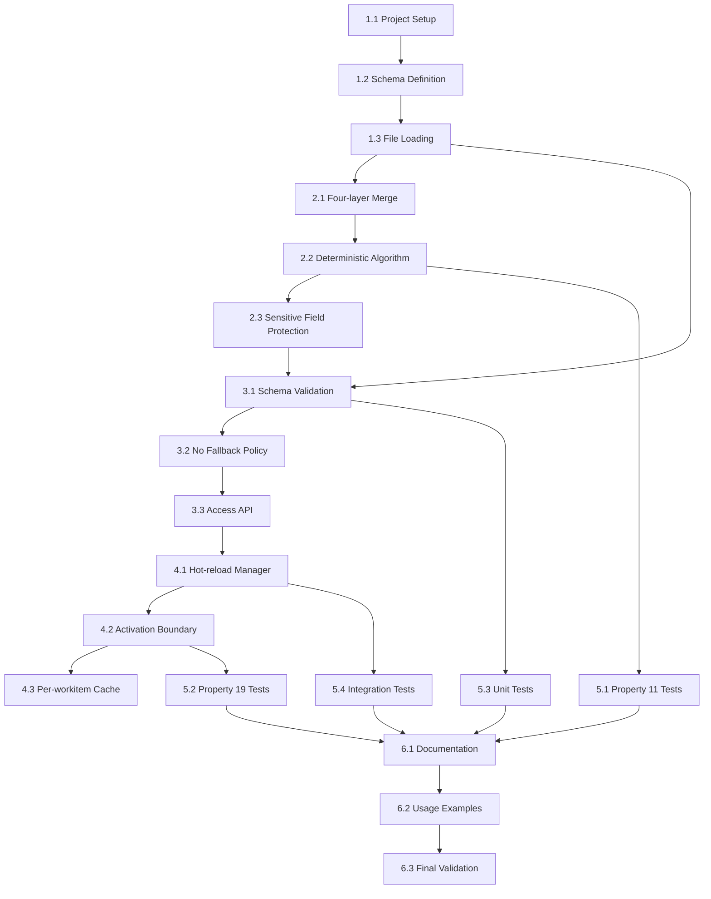

# Implementation Plan: Configuration Subsystem

## Overview

This implementation plan covers the development of the **Configuration Subsystem** module for SpecForge V6. The Configuration Subsystem manages the four-layer configuration model with deterministic merging, sensitive field protection, and hot-reload boundaries.

**Parent Specification**: This plan implements requirements and architectural constraints from **[v6-architecture-overview](../v6-architecture-overview/)**.

**Scope**: **P0** - Required for V6.0 release.

**Inherited Correctness Properties**:
- Property 11: Configuration Merge Determinism
- Property 19: Hot-reload Activation Boundary

## Tasks

### Phase 1: Foundation
- [x] 1.1 Set up project structure and build configuration
  - Create TypeScript project with proper tsconfig
  - Set up build scripts (tsc, maybe esbuild)
  - Configure linting (ESLint) and formatting (Prettier)
  - _Requirements: All_

- [x] 1.2 Define configuration schema and types
  - TypeScript interfaces for ConfigLayer, MergedConfig, etc.
  - Schema definition for validation
  - Sensitive fields list definition
  - _Requirements: 1.1, 1.3_

- [x] 1.3 Implement configuration file loading
  - Load from `~/.specforge/config/` (user-level)
  - Load from `<project>/.specforge/config/` (project-level)
  - Support JSON format (primary)
  - Error handling for missing/invalid files
  - _Requirements: 1.1_

### Phase 2: Merge Algorithm
- [x] 2.1 Implement four-layer merge logic
  - Builtin defaults (code constants)
  - User-level overrides
  - Project-level overrides (with sensitive field protection)
  - Runtime overrides (CLI/env)
  - _Requirements: 1.1, 1.2_

- [x] 2.2 Implement deterministic merge algorithm
  - Simple values: later layer overrides earlier
  - Objects: deep merge
  - Arrays: replace (not concatenate)
  - **Property 11 Test**: Verify same inputs → same output
  - _Requirements: 1.2, Property 11_

- [ ] 2.3 Implement sensitive field protection
  - Detect project-level attempts to override sensitive fields
  - Reject overrides with clear error messages
  - Log security events for observability
  - _Requirements: 1.4_

### Phase 3: Validation and Error Handling
- [x] 3.1 Implement schema validation
  - Validate configuration against schema
  - Provide detailed error messages with context
  - Support schema versioning
  - _Requirements: 3.1_

- [x] 3.2 Implement "no fallback" policy
  - Project-level load failure → error immediately
  - No silent fallback to user-level/builtin
  - Clear error reporting
  - _Requirements: 3.2_

- [ ] 3.3 Implement configuration access API
  - Typed configuration access
  - Layer source tracking (for debugging)
  - Value interpolation (env var expansion)
  - _Requirements: 4.1-4.4_

### Phase 4: Hot-reload Implementation
- [x] 4.1 Implement hot-reload manager
  - File system watchers for config changes
  - Explicit reload command (CLI/API)
  - Reload event recording
  - _Requirements: 2.5_

- [ ] 4.2 Implement activation boundary
  - Track reload timestamp t
  - Apply new config to workflows/work items with start time > t
  - Maintain old config for workflows/work items with start time ≤ t
  - **Property 19 Test**: Verify activation boundary
  - _Requirements: 2.1-2.3, Property 19_

- [x] 4.3 Implement per-workitem configuration cache
  - Snapshot configuration at workflow/work item start
  - Restore from snapshot for running work items
  - Memory management (eviction policies)
  - _Requirements: 2.1-2.3_

### Phase 5: Integration and Testing
- [x] 5.1 Implement Property 11 test suite
  - Generate random configuration layers
  - Verify deterministic merge (same inputs → same output)
  - **Property 11 Test**: Configuration Merge Determinism
  - _Requirements: Property 11_

- [ ] 5.2 Implement Property 19 test suite
  - Generate reload events and workflow timings
  - Verify activation boundary enforcement
  - **Property 19 Test**: Hot-reload Activation Boundary
  - _Requirements: Property 19_

- [x] 5.3 Implement unit test suite
  - Merge algorithm tests
  - Sensitive field protection tests
  - Validation tests
  - Hot-reload tests
  - High code coverage (> 90%)
  - _Requirements: All_

- [x] 5.4 Implement integration tests
  - End-to-end configuration loading
  - Hot-reload with concurrent workflows
  - Error recovery scenarios
  - Cross-component configuration sharing
  - _Requirements: All_

### Phase 6: Documentation and Polish
- [x] 6.1 Write configuration format documentation
  - JSON schema documentation
  - Example configurations
  - Best practices
  - _Requirements: All_

- [x] 6.2 Create usage examples
  - CLI configuration examples
  - Programmatic API examples
  - Hot-reload scenarios
  - _Requirements: All_

- [x] 6.3 Final validation
  - Run all property-based tests
  - Verify inherited Correctness Properties
  - Performance and memory usage validation
  - _Requirements: All_

## Property-Based Test Details

### Property 11: Configuration Merge Determinism Test
**Strategy**: Generate random configuration layers (builtin, user, project, runtime). For each set of layers, verify:
1. `merge(layers) == merge(layers)` (idempotence)
2. `merge(layers)` on different machines/environments produces identical output
3. Merge result depends only on layer contents and order, not timing or environment

**Generators**:
- Random configuration key-value pairs
- Random layer ordering permutations
- Random data types (primitives, objects, arrays)
- Random sensitive field assignments

**Shrinking**: Focus on minimal layer sets that demonstrate non-determinism.

### Property 19: Hot-reload Activation Boundary Test
**Strategy**: Generate sequences of reload events and workflow/work item start times. Verify:
1. Workflows/work items starting after reload time t get new config
2. Workflows/work items starting at or before t keep old config
3. Running work items are not affected by reload
4. Reload events are recorded with correct timestamps

**Generators**:
- Random reload event timestamps
- Random workflow/work item start times (before/after reload)
- Random configuration changes
- Random work item durations

**Shrinking**: Focus on boundary cases (work items starting exactly at reload time).

## Task Dependencies

## Implementation Notes

### Technology Choices
- **TypeScript**: Aligns with existing SpecForge codebase
- **Zod**: TypeScript-first schema validation
- **Chokidar**: Cross-platform file system watching
- **LRU Cache**: Efficient caching with memory limits

### Performance Considerations
- Lazy loading of configuration files
- Efficient deep merge algorithm (avoid unnecessary copies)
- Smart caching with appropriate TTLs
- Incremental validation on changes

### Security Considerations
- Sensitive field protection (hard-coded list)
- Secure file parsing (avoid eval/unsafe constructs)
- File permission validation
- No secrets in logs or error messages

### Testing Strategy
- Property-based tests for architectural invariants
- Unit tests for merge logic and validation
- Integration tests for hot-reload scenarios
- Security tests for sensitive field protection

## Open Issues

1. **Configuration format support**: Beyond JSON, consider YAML/TOML?
2. **Environment variable syntax**: Support `${VAR}` or `$VAR`?
3. **Configuration templates**: Reusable fragments with inheritance?
4. **Schema migration**: Automatic migration between schema versions?

## Success Criteria

1. Both inherited Correctness Properties implemented as PBTs
2. All requirements from parent spec satisfied
3. Deterministic merge algorithm (Property 11)
4. Correct hot-reload activation boundary (Property 19)
5. Sensitive field protection working
6. Full test coverage (> 90%)
7. Clear documentation and examples