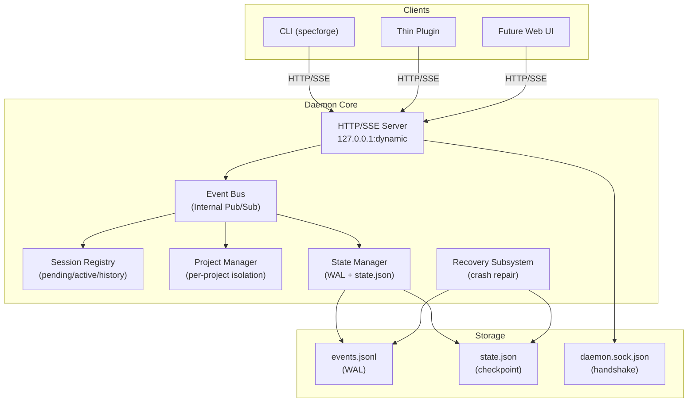

# Design Document: Daemon Core

## Overview

This design document specifies the implementation of the **Daemon Core** module for SpecForge V6. The Daemon Core serves as the central process and **Single Source of Truth** for the entire V6 architecture.

**Parent Specification**: This design inherits architectural decisions from **[v6-architecture-overview](../v6-architecture-overview/design.md)**.

**Scope**: **P0** - Required for V6.0 release.

## Architecture

### Daemon Core Component Diagram



### Key Architectural Decisions

#### ADR-DC-001: Single Daemon Instance Enforcement
**Decision**: Enforce single Daemon instance per machine using file-based locking on `~/.specforge/runtime/daemon.lock`.

**Rationale**: 
- Ensures Single Source of Truth principle (Property 1)
- Prevents state corruption from multiple instances
- Simplifies client discovery (one handshake file)

**Alternatives Considered**:
- Port-based locking (race condition risk)
- Process name checking (platform-dependent)

#### ADR-DC-002: Project Isolation via Path-Based Namespacing
**Decision**: Implement project isolation using absolute project root paths as namespace keys.

**Rationale**:
- Simple and deterministic
- No need for project UUID generation/management
- Natural mapping to filesystem paths for storage

**Alternatives Considered**:
- Project UUIDs (extra complexity)
- Hash-based namespacing (less human-readable)

#### ADR-DC-003: WAL Implementation with fsync Guarantees
**Decision**: Implement strict WAL ordering: events.jsonl append + fsync before state.json update.

**Rationale**:
- Ensures crash recovery (Property 7)
- Prevents data loss scenarios
- Aligns with database best practices

**Alternatives Considered**:
- Batched fsync (performance vs. safety tradeoff)
- Async writes (complex crash recovery)

#### ADR-DC-004: Session Identity via sessionId Only
**Decision**: Use `sessionId` as sole identity key in Session Registry, ignoring OpenCode-provided `agent` field.

**Rationale**:
- Decouples from OpenCode implementation details
- Ensures identity stability (Property 5)
- Simplifies reconnection logic

**Alternatives Considered**:
- Composite key (sessionId + agent)
- Agent name as primary key (breaks if OpenCode changes)

## Component Specifications

### 1. HTTP/SSE Server

**Responsibilities**:
- Listen on dynamic port (127.0.0.1)
- Handle HTTP/1.1 requests with Bearer Token authentication
- Manage Server-Sent Events (SSE) connections
- Enforce payload size limits (64 KiB → CAS blob references)

**Interfaces**:
```typescript
interface HTTPServer {
  start(): Promise<{ port: number }>;
  stop(): Promise<void>;
  registerRoute(method: string, path: string, handler: RequestHandler): void;
  broadcastEvent(event: Event): void;
}
```

### 2. Event Bus

**Responsibilities**:
- Internal publish/subscribe system
- Ensure all cross-layer communication passes through bus (Property 2)
- Provide observability hooks for all events

**Interfaces**:
```typescript
interface EventBus {
  publish(event: Event): void;
  subscribe(topic: string, handler: EventHandler): Subscription;
  getObservabilityStream(): Observable<Event>;
}
```

### 3. Session Registry

**Responsibilities**:
- Manage session lifecycle (pending → active → history)
- Maintain AgentIdentity mappings
- Support Session Tree via parentSessionId
- Rebuild state from events.jsonl on restart

**Interfaces**:
```typescript
interface SessionRegistry {
  registerPending(spawnIntentId: string): AgentIdentity;
  activate(sessionId: string, spawnIntentId: string): AgentIdentity;
  lookupBySessionId(sessionId: string): AgentIdentity | null;
  getSessionTree(workItemId: string): SessionTreeNode[];
}
```

### 4. Project Manager

**Responsibilities**:
- Maintain per-project contexts
- Enforce project isolation (Property 22)
- Manage per-project write locks
- Coordinate cross-project knowledge sharing

**Interfaces**:
```typescript
interface ProjectManager {
  getProjectContext(projectPath: string): ProjectContext;
  acquireLock(projectPath: string): Promise<Lock>;
  releaseLock(lock: Lock): void;
  listActiveProjects(): string[];
}
```

### 5. State Manager

**Responsibilities**:
- Implement WAL semantics (Property 7)
- Manage events.jsonl and state.json
- Ensure idempotent recovery (Property 6)
- Handle schema versioning

**Interfaces**:
```typescript
interface StateManager {
  appendEvent(event: Event): Promise<void>;
  getCurrentState(projectPath: string): ProjectState;
  rebuildFromEvents(events: Event[]): ProjectState;
  getSchemaVersion(): string;
}
```

### 6. Recovery Subsystem

**Responsibilities**:
- Detect and repair state inconsistencies (Property 20)
- Implement predefined repair rules
- Record recovery events
- Limit session WAL replay reconstruction to startup only (Property 21)

**Interfaces**:
```typescript
interface RecoverySubsystem {
  checkConsistency(): ConsistencyCheckResult;
  repairInconsistency(result: ConsistencyCheckResult): RepairResult;
  attemptSessionReconnect(sessionId: string): Promise<boolean>;
}
```

## Data Models

### Event Schema (Property 30)
```typescript
interface Event {
  eventId: string;           // UUIDv7, globally unique
  ts: number;                // Monotonically non-decreasing
  projectId: string;         // Non-empty, project-aggregatable
  action: string;            // e.g., "session.activated"
  payload: Record<string, unknown>;
  metadata: {
    schemaVersion: string;
    source: "daemon" | "client" | "adapter";
  };
}
```

### AgentIdentity
```typescript
interface AgentIdentity {
  sessionId: string;
  agentRole: string;         // e.g., "sf-orchestrator"
  workflowRole: string;      // e.g., "requirements-phase-executor"
  parentSessionId: string | null;
  workItemId: string;
  spawnIntentId: string;
  createdAt: number;
  lastActiveAt: number;
  status: "pending" | "active" | "history";
}
```

### ProjectState
```typescript
interface ProjectState {
  projectPath: string;
  schemaVersion: string;
  activeSessions: string[];  // sessionIds
  workItems: WorkItemState[];
  lastEventId: string;
  lastEventTs: number;
  // Derived from events.jsonl
}
```

### Handshake File
```typescript
interface HandshakeFile {
  pid: number;
  port: number;
  token: string;            // Random bearer token
  startedAt: number;
  schemaVersion: string;
}
```

## Error Handling

### Error Categories

| Category | Examples | Response |
|----------|----------|----------|
| **Auth** | Missing/invalid Bearer Token | HTTP 401 + permission.denied event |
| **Bad Request** | Invalid event schema, missing fields | HTTP 400 + error details |
| **Resource Conflict** | Project lock contention, duplicate session | HTTP 409 + conflict details |
| **Internal Error** | WAL write failure, state corruption | HTTP 500 + internal error event |

### Recovery Scenarios

1. **State Inconsistency**: Roll back to last consistent snapshot, record `recovery.repaired`
2. **Session Reconnection Failure**: Mark session as terminated, notify clients
3. **Project Lock Timeout**: Release lock, return error to client
4. **Event Bus Overflow**: Throttle producers, log warnings

## Testing Strategy

### Property-Based Tests

Each inherited Correctness Property must have corresponding PBT:

1. **Property 1 (SoT)**: Generate random state change operations, verify all produce events
2. **Property 2 (Event Bus)**: Generate cross-layer calls, verify all pass through bus
3. **Property 5 (Session Stability)**: Generate session events, verify identity consistency
4. **Property 6 (Idempotent Recovery)**: Generate event streams, verify rebuild determinism
5. **Property 7 (WAL Ordering)**: Generate concurrent writes, verify fsync ordering
6. **Property 20 (Recovery Repair)**: Generate corrupted states, verify repair rules
7. **Property 21 (WAL Replay Scope)**: Generate runtime scenarios, verify replay scope limits
8. **Property 22 (Project Isolation)**: Generate cross-project operations, verify isolation
9. **Property 30 (Multi-sync Readiness)**: Generate events, verify schema properties

### Integration Tests

1. **Daemon Lifecycle**: Startup → operation → shutdown → restart
2. **Multi-client**: CLI + Thin Plugin simultaneous operation
3. **Multi-project**: Concurrent operations across projects
4. **Crash Recovery**: Simulated crashes during operations
5. **Load Testing**: High volume of events/sessions

### Performance Tests

1. **Startup Time**: < 3 seconds (REQ-27 threshold 5)
2. **Event Write Latency**: < 5 ms/event (REQ-27 threshold 5)
3. **Concurrent Sessions**: Support 100+ simultaneous sessions
4. **Memory Usage**: Stable under sustained load

## Implementation Notes

### Technology Stack
- **Language**: TypeScript (aligns with existing `.opencode/tools/`)
- **HTTP Server**: Native Node.js `http` + `http-terminator`
- **Event Bus**: Custom implementation (simple pub/sub)
- **Storage**: Direct filesystem I/O with proper fsync
- **Locking**: File-based locks (`fs-extra`)

### Dependencies
- Parent spec: `v6-architecture-overview`
- No external dependencies beyond Node.js standard library

### Migration Path
- Initial version: schema_version = "1.0"
- Future changes: Increment schema_version, provide migration scripts

## Open Questions

1. **Event Bus implementation details**: In-memory vs. persistent?
2. **Session expiration policy**: How long to keep history records?
3. **Project context cleanup**: When to remove inactive project contexts?
4. **Handshake token rotation**: Frequency and mechanism?

## References

1. Parent spec: [v6-architecture-overview](../v6-architecture-overview/)
2. REQ-4: Daemon Process Model
3. REQ-5: Communication Protocol  
4. REQ-6: Session Registry
5. REQ-12: Crash Recovery
6. REQ-13: Multi-project Support
7. REQ-19: Multi-sync Readiness
8. Properties 1, 2, 5, 6, 7, 20, 21, 22, 30
