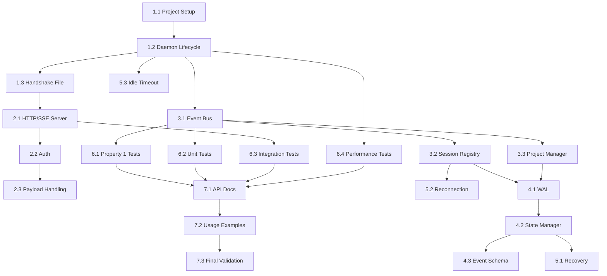

# Implementation Plan: Daemon Core

## Overview

This implementation plan covers the development of the **Daemon Core** module for SpecForge V6. The Daemon Core serves as the central process and **Single Source of Truth** for the entire V6 architecture.

**Parent Specification**: This plan implements requirements and architectural constraints from **[v6-architecture-overview](../v6-architecture-overview/)**.

**Scope**: **P0** - Required for V6.0 release.

**Inherited Correctness Properties**:
- Property 1: Single Source of Truth
- Property 2: Event Bus Traversal  
- Property 5: Session Identity Stability
- Property 6: Idempotent Recovery
- Property 7: WAL Ordering
- Property 20: Recovery Consistency Repair
- Property 21: Session Reconnect Scope
- Property 22: Project Isolation
- Property 30: Event Schema Multi-sync Readiness

## Tasks

### Phase 1: Foundation
- [x] 1.1 Set up project structure and build configuration
  - Create TypeScript project with proper tsconfig
  - Set up build scripts (tsc, maybe esbuild)
  - Configure linting (ESLint) and formatting (Prettier)
  - _Requirements: All_

- [x] 1.2 Implement basic Daemon process lifecycle
  - Single instance enforcement (file locking)
  - Startup/shutdown procedures
  - Signal handling (SIGTERM, SIGINT)
  - _Requirements: 1.1, 1.2_

- [x] 1.3 Implement handshake file mechanism
  - Generate random bearer token
  - Write `~/.specforge/runtime/daemon.sock.json`
  - File permissions (0600)
  - Cleanup on shutdown
  - _Requirements: 2.3_

### Phase 2: Communication Layer
- [x] 2.1 Implement HTTP/SSE server
  - Dynamic port allocation
  - HTTP/1.1 support
  - Server-Sent Events (SSE) for real-time updates
  - _Requirements: 2.1, 2.2_

- [x] 2.2 Implement Bearer Token authentication
  - Validate `Authorization: Bearer <token>` header
  - Return HTTP 401 for invalid/missing tokens
  - Record permission denied events
  - _Requirements: 2.4, 2.5_

- [ ] 2.3 Implement payload size handling
  - Detect content > 64 KiB
  - CAS blob reference generation
  - Error handling for oversized payloads
  - _Requirements: 2.6_

### Phase 3: Core Components
- [x] 3.1 Implement Event Bus
  - Internal publish/subscribe system
  - Topic-based routing
  - Observability hooks
  - **Property 2 Test**: Verify all cross-layer communication passes through bus
  - _Requirements: Property 2_

- [x] 3.2 Implement Session Registry
  - AgentIdentity data structure
  - Pending/active/history record management
  - Session Tree support via parentSessionId
  - **Property 5 Test**: Verify session identity stability
  - _Requirements: 3.1-3.4_

- [x] 3.3 Implement Project Manager
  - Per-project context isolation
  - Project path-based namespacing
  - Per-project write locks
  - **Property 22 Test**: Verify project isolation
  - _Requirements: 4.1-4.4_

### Phase 4: State Management
- [x] 4.1 Implement WAL (Write-Ahead Log)
  - events.jsonl file format
  - Append + fsync semantics
  - **Property 7 Test**: Verify WAL ordering (events.jsonl fsync before state.json)
  - _Requirements: 5.1, Property 7_

- [x] 4.2 Implement State Manager
  - state.json checkpoint format
  - State reconstruction from events
  - **Property 6 Test**: Verify idempotent recovery
  - _Requirements: 5.2, Property 6_

- [ ] 4.3 Implement event schema
  - UUIDv7 generation for eventId
  - Monotonic timestamps
  - ProjectId aggregation support
  - **Property 30 Test**: Verify multi-sync readiness properties
  - _Requirements: 6.1-6.3, Property 30_

### Phase 5: Recovery & Resilience
- [ ] 5.1 Implement Recovery Subsystem
  - State inconsistency detection
  - Predefined repair rules
  - **Property 20 Test**: Verify recovery consistency repair
  - _Requirements: 5.3, Property 20_

- [x] 5.2 Implement session reconnection logic
  - Startup-only reconnection attempts
  - Old session detection
  - **Property 21 Test**: Verify reconnect scope limitation
  - _Requirements: 5.4, 5.5, Property 21_

- [x] 5.3 Implement idle timeout
  - 30-second idle exit for Thin Plugin/CLI startups
  - Exclusion for `--detach` mode
  - _Requirements: 1.3, 1.4_

### Phase 6: Integration & Testing
- [x] 6.1 Implement Property 1 test suite
  - Generate random state change operations
  - Verify all produce events and go through Daemon
  - **Property 1 Test**: Single Source of Truth
  - _Requirements: Property 1_

- [x] 6.2 Implement unit test suite
  - Component-level tests for all modules
  - Mock external dependencies
  - High code coverage (> 90%)
  - _Requirements: All_

- [x] 6.3 Implement integration tests
  - End-to-end Daemon lifecycle
  - Multi-client scenarios
  - Crash recovery simulations
  - _Requirements: 5.7_

- [x] 6.4 Implement performance tests
  - Startup time < 3 seconds
  - Event write latency < 5 ms
  - Concurrent session support
  - _Requirements: 5.7 threshold 5_

### Phase 7: Documentation & Polish
- [x] 7.1 Write API documentation
  - HTTP endpoints
  - Event schema
  - Error codes
  - _Requirements: All_

- [ ] 7.2 Create usage examples
  - CLI integration
  - Thin Plugin integration
  - Error handling scenarios
  - _Requirements: All_

- [x] 7.3 Final validation
  - Run all property-based tests
  - Verify inherited Correctness Properties
  - Performance benchmark verification
  - _Requirements: All_

## Property-Based Test Details

### Property 1: Single Source of Truth Test
**Strategy**: Generate random sequences of state-changing operations (session creation, project updates, permission changes). For each operation, verify:
1. It produces an event written to events.jsonl
2. The event contains all necessary context
3. No state change occurs without corresponding event

**Generators**:
- Random AgentIdentity objects
- Random project paths
- Random state change types

**Shrinking**: Focus on minimal sequences that violate the property.

### Property 2: Event Bus Traversal Test  
**Strategy**: Instrument all component boundaries. Generate random cross-layer calls, verify:
1. Call produces Event Bus message
2. Message contains source/destination metadata
3. No direct function calls bypass the bus

**Generators**:
- Random component pairs (HTTP→Session, Session→State, etc.)
- Random message payloads
- Random call timing patterns

### Property 5: Session Identity Stability Test
**Strategy**: Generate session lifecycle sequences. Verify:
1. `sessionId` remains consistent key throughout
2. `AgentIdentity` lookup returns same object (by value)
3. OpenCode `agent` field not used as identity key

**Generators**:
- Random session creation/activation/termination sequences
- Random OpenCode agent name variations
- Random parent/child session relationships

### Property 6: Idempotent Recovery Test
**Strategy**: Generate random event streams. Verify:
1. `rebuild(events) == rebuild(events)` (idempotence)
2. Different machines produce identical ProjectState (byte equality)
3. Observational fields (`lastEventTs`) may differ, core state identical

**Generators**:
- Random event sequences (valid according to schema)
- Random event ordering (preserving timestamp monotonicity)
- Random project contexts

### Property 7: WAL Ordering Test
**Strategy**: Generate concurrent write scenarios. Verify:
1. events.jsonl append + fsync completes before state.json update
2. Crash during write leaves events.jsonl in consistent state
3. State.json never contains data not in events.jsonl

**Generators**:
- Random concurrent write operations
- Random crash injection points
- Random fsync timing variations

### Property 20: Recovery Consistency Repair Test
**Strategy**: Generate corrupted (events.jsonl, state.json) pairs. Verify:
1. Repair produces consistent state s'
2. `rebuild(events) == s'` after repair
3. Repair event recorded with correct path

**Generators**:
- Random inconsistency types (missing events, state mismatch, etc.)
- Random repair rule applicability
- Random project state complexity

### Property 21: Session Reconnect Scope Test
**Strategy**: Generate runtime scenarios with old sessions. Verify:
1. Reconnection attempts only during startup
2. Post-startup session detection doesn't trigger reconnection
3. Reconnection logic respects scope boundaries

**Generators**:
- Random startup/shutdown sequences
- Random old session detection timing
- Random reconnection success/failure scenarios

### Property 22: Project Isolation Test
**Strategy**: Generate cross-project operations. Verify:
1. P1 events/state don't reach P2 files
2. P1 and P2 operations don't block each other
3. Same-project concurrent writes are serialized

**Generators**:
- Random project pairs (P1 ≠ P2)
- Random concurrent operation timing
- Random lock acquisition patterns

### Property 30: Event Schema Multi-sync Readiness Test
**Strategy**: Generate random events. Verify:
1. `eventId` globally unique (collision check)
2. `ts` monotonic within machine
3. `projectId` non-empty and aggregatable
4. Schema forward-compatible (no breaking changes)

**Generators**:
- Random event payloads
- Random timestamp sequences
- Random project identifier patterns

## Task Dependencies

## Implementation Notes

### Technology Choices
- **TypeScript**: Aligns with existing SpecForge codebase
- **Native HTTP**: Avoid framework overhead, better control
- **File-based locking**: Simple, cross-platform
- **UUIDv7**: Time-ordered unique identifiers

### Performance Considerations
- Event batching for high throughput
- Connection pooling for HTTP clients
- Memory-efficient session storage
- Lazy project context loading

### Security Considerations
- Bearer token randomness (cryptographically secure)
- File permission enforcement (0600 for handshake)
- Input validation for all HTTP endpoints
- No sensitive data in logs

### Testing Strategy
- Property-based tests for architectural invariants
- Unit tests for component logic
- Integration tests for end-to-end scenarios
- Performance tests for scalability

## Open Issues

1. **Event Bus persistence**: Should Event Bus messages be persisted for recovery?
2. **Session expiration**: Automatic cleanup of old session records?
3. **Project context eviction**: When to unload inactive project contexts?
4. **Handshake token rotation**: Automatic rotation mechanism?

## Success Criteria

1. All inherited Correctness Properties implemented as PBTs
2. All requirements from parent spec satisfied
3. Performance meets V6.0 thresholds (startup < 3s, event write < 5ms)
4. Zero data loss in crash recovery tests
5. Full test coverage (> 90%)
6. API documentation complete and accurate
