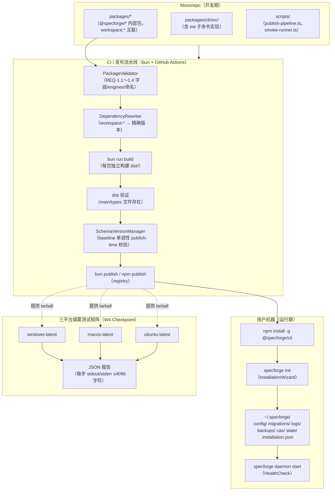
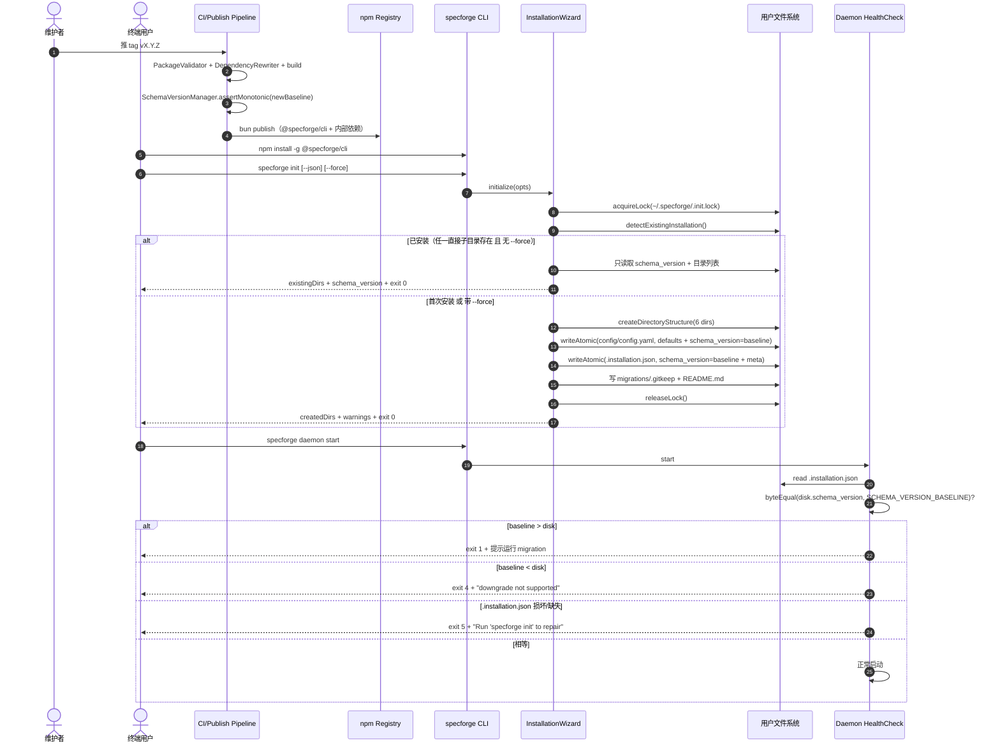
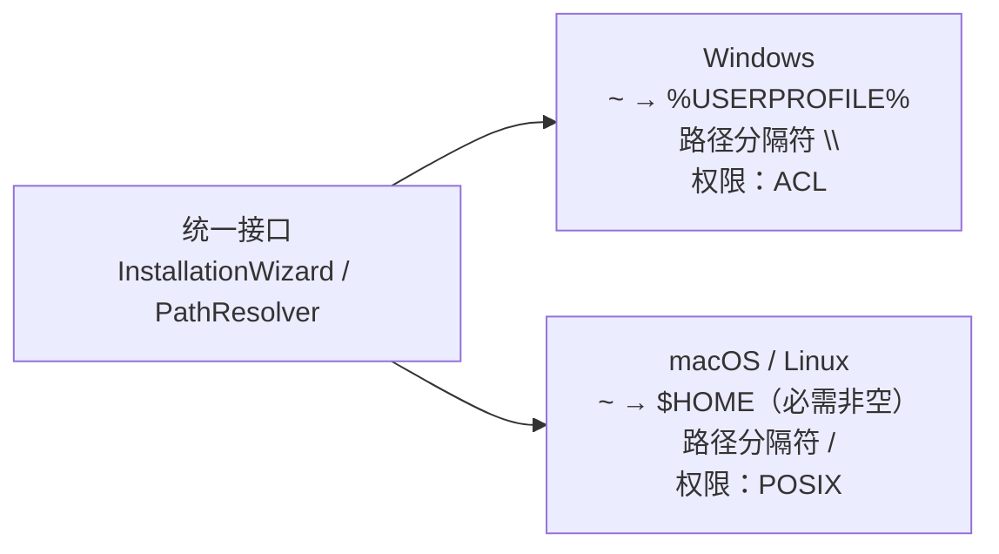
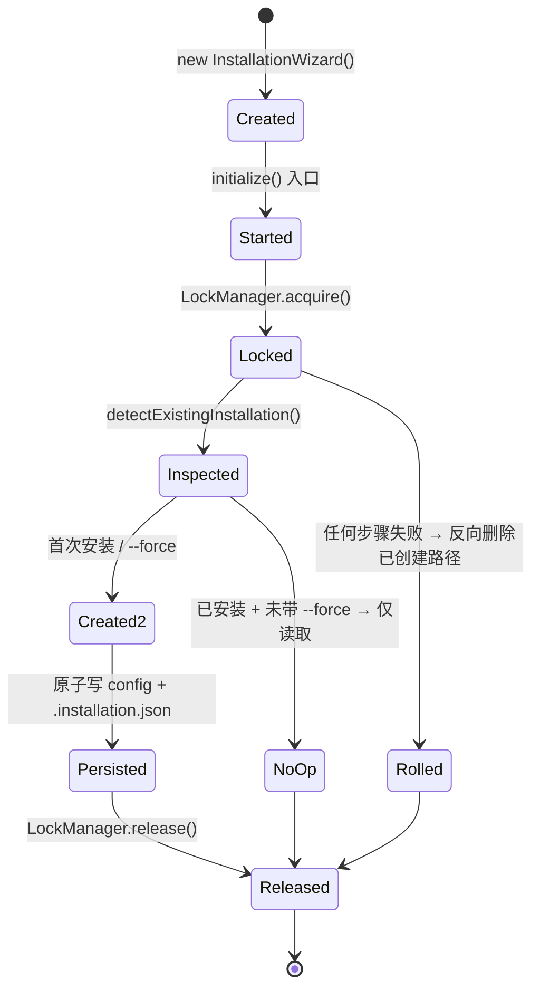
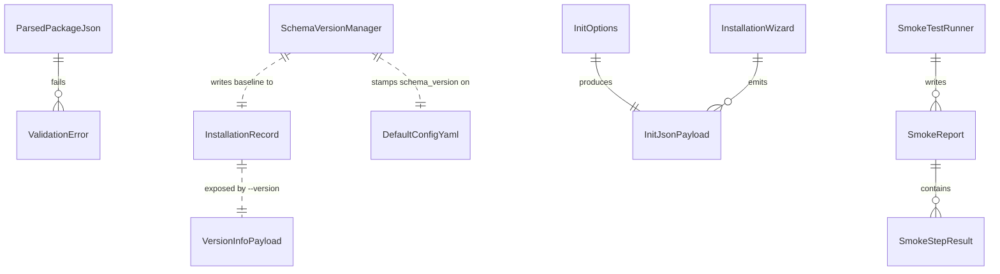
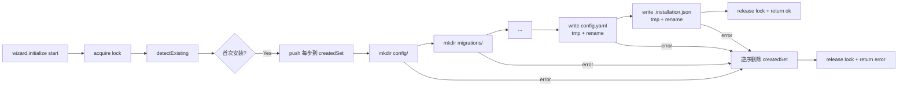

# Design Document

## Overview

Distribution（分发与安装）是 SpecForge V6.0 的 **W4 / M7** 模块，负责把 monorepo 中已实现的 `@specforge/*` 包打包发布到 npm registry，并在用户机器上通过 `specforge init` 一键搭起 `~/.specforge/` 目录骨架。

### 范围与不重复

本 spec 严格只做 **"打包 → 发布 → 安装 → 初始化 → 烟雾验证"** 这条链路（详见 requirements.md 的 Scope Boundary）。下面这些能力**已由其他 spec 承接，本 spec 不重复实现**：

| 能力 | 归属 | 本 spec 与之的关系 |
|---|---|---|
| `schema_version` 单调演进 / 迁移脚本执行 / 备份回滚 | [migration](../migration/design.md) | 仅创建空骨架目录 `~/.specforge/migrations/` + README，并验证 Property 14 的"初始基线相等"子条件 |
| 远程访问鉴权 / API key / IP 白名单 / 二步确认 | [permission-engine](../permission-engine/design.md)（Property 26 已通过） | 仅确保 `specforge init` 默认不开启远程模式 |
| `specforge` CLI 双模式输出 / `--json` / jobId 契约 | [cli](../cli/design.md)（Property 17/18） | 本 spec 在 cli 包内**新增** `init` 子命令；其余命令契约不动 |
| Daemon 启动 / Event Bus / HTTP server | [daemon-core](../daemon-core/design.md) | 烟雾测试中只跑 `daemon status` 验证"装完起得来" |
| OpenClaw 端到端 | [integration-tests](../integration-tests/) | 不重测 |
| 配置默认值与四层合并 | [configuration](../configuration/design.md)（Property 11） | 引用其默认值生成器，不再自定义 |

### 设计目标

1. **一行命令上手**：`npm install -g @specforge/cli` → `specforge init` 即可使用 V6.0
2. **跨平台一致**：Windows 10+ / macOS 12+ / 主流 Linux 三平台行为一致，由 GitHub Actions 矩阵烟雾测试作为权威证据
3. **架构属性可验证**：以 PBT 形式承接父规范 **Property 14（Schema Version Monotonicity）** 的"初始基线相等"子条件与 **Property 15（Scope Boundary）**
4. **用户数据零损伤**：升级、卸载、降级触发时绝不修改 `~/.specforge/` 内容；任何破坏性恢复路径都交给 migration spec 决策

### 关键设计决策

| 决策 | 选择 | 理由 |
|---|---|---|
| 包管理器 | 开发/构建/测试/打包统一用 **bun**；分发产物是 npm 包 | 项目 steering 规则 5；用户安装命令仍是 `npm install -g`，对外无门槛 |
| 内部依赖协议 | 开发期 `workspace:*`；publish 时**重写**为精确 `MAJOR.MINOR.PATCH` | 让 `@specforge/cli` 可独立 npm install，又不丢失 monorepo 内的快速联动 |
| baseline 真值来源 | 嵌入到 `@specforge/cli` 构建产物的常量 `SCHEMA_VERSION_BASELINE`，**不读盘** | 避免"读盘的 schema_version 反过来污染 baseline"形成的环 |
| init 幂等策略 | 只看 `~/.specforge/` 直接子目录是否存在；存在即"已安装"，**只读不写** | 给 idempotent 提供清晰可枚举的判定，与 Property 3 的可证性对齐 |
| `--force` 范围 | 只覆盖 `config/config.yaml` 与 `.installation.json`；migrations/ 与 logs/ 永不动 | 用户日志与迁移脚本不该被 init 覆盖；`migrations/` 由 migration spec 拥有 |
| 锁文件 | `~/.specforge/.init.lock`，单进程持有 | 防止两个 init 并发把自己写崩 |
| W4 Checkpoint 证据 | GitHub Actions matrix（windows/macos/ubuntu-latest）烟雾测试的 JSON 报告 | requirements.md REQ-5 全部 AC + roadmap W4 退出条件 |

## Architecture

### 系统架构图



### 关键数据流



### 平台适配层



平台差异**只**在 `PathResolver` 与 `LockManager` 中存在；其余组件接受抽象路径与抽象锁，平台无关。

### Wave 与上下游契约

| 上游（已完成或并行交付） | 本 spec 用什么 |
|---|---|
| `daemon-core`（Wave 0–1） | `specforge daemon start` 已具备；本 spec 烟雾测试只跑 `daemon status` |
| `permission-engine`（Wave 1） | Property 26 远程访问限制；本 spec 在默认 config 中保持远程模式关闭 |
| `configuration`（Wave 0） | 默认配置生成器：本 spec 调用其导出的 `buildDefaultConfig(): { yaml: string, schema_version: "1.0" }` |
| `cli`（Wave 2） | `--json`/jobId 契约（Property 17/18）；本 spec 让 `init` 也遵循这一契约 |
| `migration`（Wave 1） | 接收 `~/.specforge/migrations/` 骨架；Property 14 主体由其承接 |

| 下游（依赖本 spec） | 给它们什么 |
|---|---|
| W4 Checkpoint | 三平台烟雾测试 JSON 报告 |
| W5 北极星验证 | 装得上、起得来的端到端证据 |
| 用户文档 / README | "Complete Removal Including User Data" 章节（REQ-7.4） |

## Components and Interfaces

所有源码落在 `packages/cli/src/` 与 `scripts/` 下（项目 structure 规则 1：spec 目录只放文档）。

### 1. PackageValidator（发布期）

**位置**：`packages/cli/src/distribution/package-validator.ts`

**职责**：发布流水线对每个候选 `@specforge/*` 包的 `package.json` 做 REQ-1.1～1.4、1.6 的校验。

```typescript
export interface PackageValidator {
  /** 验证一个候选包。无副作用、纯函数。 */
  validate(pkg: ParsedPackageJson, ctx: ValidationContext): ValidationResult;
}

export interface ValidationContext {
  /** 该包在 monorepo 中的绝对路径，用于错误消息定位 */
  packagePath: string;
  /** 当前流水线模式：开发期允许 workspace:*，发布期不允许 */
  mode: "dev" | "publish";
  /** 其他公开包的 name → 精确版本映射（publish 模式下用于检查依赖） */
  publishVersionMap: ReadonlyMap<string, string>;
}

export interface ValidationResult {
  isValid: boolean;
  /** 每条形如 { code: "MISSING_FIELD", field: "license", message: "..." } */
  errors: ValidationError[];
  warnings: string[];
}

export interface ValidationError {
  /** 稳定的机器可读错误码，用于流水线退出消息 */
  code:
    | "NAME_FORMAT"
    | "MISSING_FIELD"
    | "ENGINES_NODE"
    | "ENGINES_BUN"
    | "WORKSPACE_NOT_REWRITTEN"
    | "DEP_RANGE_FORBIDDEN"
    | "DEP_VERSION_NOT_PINNED";
  /** 出错的 package.json 字段 jsonpath，例如 "engines.node" 或 "dependencies.@specforge/foo" */
  field: string;
  message: string;
}
```

**关键约束**：
- 包名正则 `^@specforge\/[a-z][a-z0-9-]*$`（REQ-1.1）
- 必需字段集合是常量数组：`["name", "version", "description", "main", "types", "files", "license", "repository", "schema_version"]`（REQ-1.2）
- engines 必须严格等于 `{ node: ">=20", bun: ">=1.0" }`（REQ-1.3）
- publish 模式下 dependencies 中的 `@specforge/*` 必须是精确 `MAJOR.MINOR.PATCH`，禁止 `^`/`~`/`*`/`x`/range comparator/dist-tag/git/file（REQ-2.3）

### 2. DependencyRewriter（发布期）

**位置**：`packages/cli/src/distribution/dependency-rewriter.ts`

```typescript
export interface DependencyRewriter {
  /**
   * 把 dependencies/devDependencies 中所有 workspace:* 改写为精确版本。
   * 输入不被 mutate，返回新对象。
   */
  rewrite(
    pkg: ParsedPackageJson,
    versionMap: ReadonlyMap<string, string>,
  ): ParsedPackageJson;
}
```

未在 `versionMap` 中找到的 `workspace:*` 依赖必须**抛错**，由流水线汇报为 `WORKSPACE_NOT_REWRITTEN`。

### 3. SchemaVersionManager（构建期 + 运行期）

**位置**：`packages/cli/src/distribution/schema-version-manager.ts`

```typescript
export interface SchemaVersionManager {
  /** 当前 CLI 构建产物中嵌入的 baseline，编译期常量。 */
  readonly baseline: string;

  /**
   * 解析 "MAJOR.MINOR" 元组。"1.0" → [1, 0]；非法值抛错。
   * 等同 REQ-6.6 的 tuple 比较输入。
   */
  parseTuple(version: string): readonly [number, number];

  /**
   * publish 时校验：candidateBaseline 的 (MAJOR, MINOR) 不得低于 highestPublished。
   * 用法：流水线在 publish 前调用，返回的 ValidationResult 决定是否退出非零。
   */
  assertMonotonic(
    candidateBaseline: string,
    highestPublished: string | null,
  ): ValidationResult;

  /**
   * 运行期 byte-for-byte 比较（REQ-6.5）。返回三态：
   *   "equal"           → 放行
   *   "code_higher"     → 退出 1，提示运行 migration
   *   "code_lower"      → 退出 4，"downgrade not supported"
   */
  compareForHealthCheck(diskValue: string, baseline: string):
    | "equal"
    | "code_higher"
    | "code_lower";
}
```

**实现注**：`baseline` 字符串通过构建期注入（如 `bun build --define`）固化到 dist 中，运行期不允许从外部读取覆盖。

### 4. InstallationWizard（运行期）

**位置**：`packages/cli/src/commands/init/wizard.ts`

```typescript
export interface InstallationWizard {
  /** 执行 `specforge init`。所有 I/O 在此方法内闭合。 */
  initialize(opts: InitOptions): Promise<InitResult>;
}

export interface InitOptions {
  force: boolean;
  json: boolean;
  /** 测试与文档样例可指定，正常用户不会传；默认走 PathResolver.resolveInstallRoot() */
  installRootOverride?: string;
}

export interface InitResult {
  exitCode: 0 | 1 | 2;
  /** REQ-3.5 的 JSON 输出对象；交互模式从中提炼摘要行 */
  payload: InitJsonPayload;
}
```

**生命周期（CARU 四阶段，遵守 async-resource-coding-standards）**：



**约束**：
- 构造器（`new InstallationWizard(deps)`）**只赋值依赖句柄**，不做 I/O、不启 timer。符合 lessons-injected.md JS1（构造器副作用黑名单）。
- `LockManager.acquire/release` 配对必须在 `try/finally` 中（C2 + JS3 配对释放）。
- 文件写入用 "tmp + rename" 原子模式（[migration spec ADR-MIG-002](../migration/design.md) 同款）。

### 5. PathResolver / LockManager / FilesystemAdapter

**位置**：`packages/cli/src/utils/`

```typescript
export interface PathResolver {
  resolveInstallRoot(override?: string): string;        // REQ-4.6
  resolveHomeDirectory(): string;                       // 失败时抛 HOME_NOT_SET（REQ-4.9）
  platform(): "win32" | "darwin" | "linux";             // REQ-4.3 的 platform 字段来源
  arch(): "x64" | "arm64";                              // REQ-6.4 的 platform 字段后半段
  installSourceFromArgv(argv: string[]): "npm-global" | "npm-local" | "dev"; // REQ-4.3
}

export interface LockManager extends Disposable {
  /** 取锁；超时返回 false。锁文件路径 = ~/.specforge/.init.lock */
  acquire(timeoutMs: number): Promise<boolean>;
  /** 即便 acquire 未成功也可调用，幂等。 */
  release(): Promise<void>;
  /** 自检 API（lessons-injected.md P5/X2） */
  isHeld(): boolean;
  /** Symbol.dispose（JS2） */
  [Symbol.asyncDispose](): Promise<void>;
}
```

`LockManager` 实现：用 `proper-lockfile`（与 `scripts/sync-task-status.ts` 同款），`copyFile + unlink` 模式绕开 Windows EPERM rename 风险。锁文件元数据写入 `{ pid, hostname, timestamp }`，便于 REQ-3.9 的 stderr 提示。

### 6. SmokeTestRunner（CI / 本地）

**位置**：`scripts/smoke-runner.ts`

```typescript
export interface SmokeTestRunner {
  /** 单步执行；每步独立 120s timeout（REQ-5.1） */
  runStep(step: SmokeStep): Promise<StepResult>;
  /** 整套序列；写出报告到 reportPath；任一步失败整体返回非 0（REQ-5.3） */
  runAll(opts: SmokeRunOptions): Promise<SmokeRunResult>;
  /** 总会被调用，即便上面的 runAll 抛错（REQ-5.7、5.8） */
  cleanup(): Promise<CleanupResult>;
}

export interface SmokeRunOptions {
  /** 临时 HOME 目录的绝对路径，runner 自己创建 */
  tempHome: string;
  /** 报告输出路径；亦可由 SMOKE_REPORT_PATH 环境变量提供 */
  reportPath: string;
  /** 单步超时；默认 120000 ms */
  perStepTimeoutMs: number;
}
```

**步骤序列**（REQ-5.1，硬编码不可配）：
1. `npm install -g <local-tarball>`（CI 用 `bun pack` 产物）
2. `specforge --version`
3. `specforge init`（HOME 指向 tempHome）
4. `specforge --help`
5. `specforge daemon status`（非破坏性，不真正启动 daemon）

**退出码**（REQ-5.3、5.8）：
- `0` 全部步骤成功
- `1` 任一业务步骤失败
- `2` 步骤超时
- `3` 清理阶段失败（distinct from 1，便于 CI 区分）

## Data Models

### 1. PackageMetadata（发布期校验对象）

```typescript
export interface ParsedPackageJson {
  schema_version: "1.0";       // REQ-1.2 必需字段
  name: string;                // 必须匹配 ^@specforge/[a-z][a-z0-9-]*$
  version: string;             // SemVer 2.0.0：MAJOR.MINOR.PATCH[-prerelease][+build]（REQ-6.1）
  description: string;
  main: string;                // dist 内入口路径
  types: string;
  files: string[];
  license: string;             // 例如 "MIT"
  repository: { type: "git"; url: string };
  engines: { node: ">=20"; bun: ">=1.0" };

  bin?: Record<string, string>;          // 仅 @specforge/cli 必需含 specforge → ...
  dependencies?: Record<string, string>;
  devDependencies?: Record<string, string>;
  peerDependencies?: Record<string, string>;
  private?: boolean;                     // true 且不被 cli 依赖时，发布流水线跳过（REQ-1.6）
  keywords?: string[];
  author?: string;
}
```

### 2. InstallationRecord（运行期持久化）

写入路径：`~/.specforge/.installation.json`

```typescript
export interface InstallationRecord {
  schema_version: string;      // 必须等于 SCHEMA_VERSION_BASELINE（Property 1）
  installedAt: string;         // ISO 8601 UTC ms："2026-05-19T12:34:56.789Z"
  cliVersion: string;          // = @specforge/cli package.json#version
  platform: "win32" | "darwin" | "linux";   // 封闭枚举
  installSource: "npm-global" | "npm-local" | "dev";
}
```

**JSON 写入要求**：原子（tmp + rename），UTF-8，无 BOM，末尾换行。

### 3. DefaultConfigYaml（运行期持久化）

写入路径：`~/.specforge/config/config.yaml`

由 `configuration` spec 的 `buildDefaultConfig()` 生成，Distribution 不再自定义字段。本 spec 只在写入时**强制注入**：
- `schema_version: "1.0"`（顶部，REQ-4.2 / Property 1）
- 所有 P1/P2 feature flag 的初始值为 `false`（Property 15 / REQ-4.2）

P1/P2 flag 列表来自父规范 REQ-25，由 `scope-gate` spec 暴露：

```typescript
export interface ScopeGateExports {
  /** 父 REQ-25 中标记为 P1 / P2 的所有 feature flag 的稳定 key 列表 */
  readonly p1p2FlagKeys: ReadonlyArray<string>;
}
```

Distribution 在生成默认 yaml 时遍历该列表逐个写 `<key>: false`（或省略；语义等价于关闭）。

### 4. InitJsonPayload（CLI 输出契约）

`specforge init --json` 的 stdout 单行 JSON：

```typescript
export interface InitJsonPayload {
  schema_version: "1.0";
  installRoot: string;                  // 绝对路径
  cliVersion: string;
  baseline: string;                     // = SCHEMA_VERSION_BASELINE
  createdDirs: string[];                // 相对 installRoot；不含已存在的
  existingDirs: string[];               // 相对 installRoot；含目录与已存在的 init 管理文件
  warnings: string[];                   // ≤100 项；每项 ≤500 字符（REQ-3.5）
  forceUsed: boolean;
  exitCode: 0 | 1 | 2;
}
```

JSON 模式禁止 ANSI 转义（REQ-3.5）；交互模式从同一对象提炼摘要行 + 每个 createdDir 一行 + 5 个命名字段（REQ-3.6）。

### 5. VersionInfoPayload（CLI 输出契约）

`specforge --version --json` 的 stdout 单行 JSON（REQ-6.4）：

```typescript
export interface VersionInfoPayload {
  schema_version: "1.0";
  cliVersion: string;
  schemaVersionBaseline: string;
  installRoot: string;
  installRootSchemaVersion: string | null;     // 读不到/解析不了 → null
  platform: string;                            // 形如 "win32-x64" / "darwin-arm64" / "linux-x64"
}
```

### 6. SmokeReport（CI 工件）

写入路径：`--report-path` 或 `$SMOKE_REPORT_PATH`

```typescript
export interface SmokeReport {
  schema_version: "1.0";
  startTime: string;                    // ISO 8601 UTC
  endTime: string;
  platform: string;                     // process.platform-process.arch
  overallStatus: "passed" | "failed" | "timeout" | "cleanup_failed";
  steps: SmokeStepResult[];
  cleanup: { success: boolean; errors: string[] };
}

export interface SmokeStepResult {
  name: string;                         // 形如 "specforge --version"
  startTime: string;
  endTime: string;
  durationMs: number;
  exitCode: number;
  /** stdout 摘要：UTF-8 截断到 4096 字符 */
  stdout: string;
  stderr: string;
  status: "passed" | "failed" | "timeout";
}
```

### 7. ErrorPayload（CLI 错误输出）

```typescript
export interface ErrorPayload {
  schema_version: "1.0";
  error: { code: ErrorCode; message: string; details?: string };
  context: { operation: string; platform: string; cliVersion: string };
  remediation?: { action: string; command?: string };
}

export type ErrorCode =
  | "INIT_UNKNOWN_FLAG"           // REQ-3.1 → exit 2
  | "INIT_LOCKED"                 // REQ-3.9 → exit 2
  | "INIT_HOME_NOT_SET"           // REQ-4.9 → exit 1
  | "INIT_PERMISSION_DENIED"      // REQ-3.8 → exit 1
  | "INIT_RESOURCE_WARNING"       // REQ-3.7 → exit 0（仅警告）
  | "PUBLISH_VALIDATION"          // REQ-1.7
  | "PUBLISH_BUILD_FAILED"        // REQ-1.8
  | "PUBLISH_DIST_MISSING"        // REQ-1.9
  | "PUBLISH_BASELINE_DOWNGRADE"  // REQ-6.6
  | "DAEMON_BASELINE_MISMATCH"    // REQ-6.5 → exit 1
  | "DAEMON_DOWNGRADE_REJECTED"   // REQ-7.5 → exit 4
  | "DAEMON_INSTALLATION_BROKEN"; // REQ-7.6 → exit 5
```

每个 ErrorCode 一一对应一条 AC，便于测试逐项断言。

### 数据模型关系



## Correctness Properties

*A property is a characteristic or behavior that should hold true across all valid executions of a system—essentially, a formal statement about what the system should do. Properties serve as the bridge between human-readable specifications and machine-verifiable correctness guarantees.*

### PBT 适用性评估

Distribution 是一个混合特性：流水线层是纯函数（适合 PBT），三平台烟雾测试是 IaC/CI 层（不适合 PBT），CLI 命令多数 AC 行为不随输入变化（适合 EXAMPLE）。

按 prework 分类与 requirements.md "Testing Strategy" 的硬性锁定，本 spec **恰好 3 个 PBT**：

1. Property 1（Schema Baseline Equality）— 承接父规范 Property 14 子条件
2. Property 2（P1/P2 Default Off）— 承接父规范 Property 15
3. Property 3（Init Idempotency）— 本 spec 自有的合成属性

其余 AC 由 EXAMPLE 单元测试、INTEGRATION 集成测试、SMOKE 配置审核覆盖（详见 Testing Strategy）。

### Property 1: Schema Baseline Equality

*For any* `@specforge/cli` 构建产物 `B` 与其嵌入的 `SCHEMA_VERSION_BASELINE = b`，对**任意** `~/.specforge/.installation.json` 状态 `s ∈ { missing, unparseable, missing_field, present(v) for v ∈ Versions }`，下列等式同时成立：

1. **写入面**：`B` 执行 `specforge init` 后，磁盘上 `.installation.json#schema_version` 与 `config/config.yaml#schema_version` 都 byte-equal `b`（不读盘、不被环境覆盖）
2. **校验面**：`B` 执行 `specforge daemon start` 时的 HealthCheck 决策函数 `H(s, b)` 满足
   - `H(present(v), b) = "equal"` ⇔ `v` byte-equal `b`
   - `H(present(v), b) = "code_higher"` ⇔ `parseTuple(b) > parseTuple(v)`
   - `H(present(v), b) = "code_lower"` ⇔ `parseTuple(b) < parseTuple(v)`
   - `H(missing | unparseable | missing_field, *) = "broken"`

**Validates: Requirements 4.5, 6.2, 6.3, 6.5, 7.5**

**Derived-From**: v6-architecture-overview Property 14（仅"安装后初始 schema_version == 基线"子条件）。

**测试落点**：`packages/cli/tests/property/distribution-property-14-baseline-equality.property.test.ts`，迭代 ≥ 100。
- 用 `fast-check` 生成随机 baseline 字符串（合法 + 非法）和随机磁盘状态
- 验证写入侧用临时 HOME 跑 wizard，断言两个文件首尾的 `schema_version` 段
- 验证校验侧用 `compareForHealthCheck` 纯函数

### Property 2: P1/P2 Default Off

*For any* P1/P2 feature flag 集合 `F`（来自 `ScopeGateExports.p1p2FlagKeys`）和**任意** init 调用上下文 `c`（无 `--force` 或带 `--force` 但用户未自定义这些 key），`specforge init` 写入的默认 `config/config.yaml` 中：

`∀ f ∈ F: parseYaml(yaml).getEffective(f) ∈ { false, undefined }`

**含义**：未启用的 P1/P2 能力在用户可见路径上必须等价于"关闭"。`undefined`（key 完全不出现）等价于"关闭"，符合 configuration spec 的默认值合并语义。

**Validates: Requirements 4.2**

**Derived-From**: v6-architecture-overview Property 15。requirements.md 将"P1/P2 flag 默认关闭"具象化在 R4.2 默认 config 生成上（亦即 Inherited Architectural Properties 章节 Property 15 承接面）。

**测试落点**：`packages/cli/tests/property/distribution-property-15-scope-default-off.property.test.ts`，迭代 ≥ 100。
- 用 `fast-check` 生成随机 P1/P2 flag 名称集合（含特殊字符、嵌套 key 如 `remote.api_key.enabled`）
- 喂给 `wizard.generateDefaultConfig(flags)` 函数
- 解析回 yaml，断言每个 flag 的 effective value 满足 `{ false, undefined }` 集合

### Property 3: Init Idempotency

*For any* 预存在的 `~/.specforge/` 文件系统状态 `s`（包含随机的 6 个直接子目录的存在/不存在子集 + 随机用户写入的非 init 管理文件 `U` ⊆ `migrations/` ∪ `logs/`）和**任意** flag 组合 `(force ∈ {true, false}, json ∈ {true, false})`，`specforge init(force, json)` 调用结束后：

1. **用户文件零损伤**：`∀ u ∈ U: hash(u_after) = hash(u_before)`（即便 `--force`）
2. **existingDirs 一致性**：返回的 `existingDirs` 准确等于 `s` 中已存在的直接子目录与已存在的 init 管理文件（`config/config.yaml`、`.installation.json`）的并集
3. **no-op 分支判定**：当至少一个直接子目录在 `s` 中存在 且 `force = false`，则 `createdDirs = []` 且磁盘任何文件 byte-equal `s`
4. **--force 分支判定**：当 `force = true`，仅 `config/config.yaml` 与 `.installation.json` 可被覆盖；`migrations/` 与 `logs/` 下任何 `u ∈ U` 不变

**Validates: Requirements 3.3, 3.4, 4.7, 4.8, 7.1, 7.2**

**测试落点**：`packages/cli/tests/property/distribution-init-idempotent.property.test.ts`，迭代 ≥ 100。
- 用 `fast-check` 生成 `(预存目录子集, 用户随机文件树, force, json)` 四元组
- 在临时 HOME 中物化、跑 wizard、用 sha256 比对前后

### 属性反思（Redundancy Check）

| 候选 | 是否独立 | 处理 |
|---|---|---|
| Property 1（Baseline Equality） | ✅ 量词在 baseline × 磁盘状态 | 保留 |
| Property 2（P1/P2 Default Off） | ✅ 量词在 P1/P2 flag 集合 | 保留 |
| Property 3（Init Idempotency） | ✅ 量词在预存 FS 状态 × flag 组合 | 保留 |
| ~~"包格式验证"~~ | ❌ 收益不抵成本，行为是固定字段集合 + 正则 | 降级为 EXAMPLE 单元测 |
| ~~"原子操作回滚"~~ | ❌ 不是 for-all 性质，是错误注入测 | 降级为 EDGE_CASE 单元测 |
| ~~"烟雾测试确定性"~~ | ❌ 烟雾测试本身已是 IaC 层；运行 100 次 ≠ 验证更多输入 | 降级为 INTEGRATION |

三条 PBT 各自的量词空间（baseline 字符串 / flag 集合 / FS 状态 × flag 组合）正交，无相互蕴含。

## Error Handling

### 错误分类

| 类别 | 示例 | 退出码 | 输出渠道 |
|---|---|---|---|
| 用户输入错误 | 未知 flag、$HOME 未设置 | 1 / 2 | stderr 单行 + （JSON 模式额外 stdout ErrorPayload） |
| 环境/资源不足 | CPU/RAM/磁盘低于阈值 | 0（仅警告，REQ-3.7） | stderr + warnings 数组 |
| 锁/并发 | 锁文件已被持有 | 2 | stderr + 锁路径 + 持有者 PID |
| 安装回滚 | mkdir EACCES | 1 | stderr 含 path/errno/remedy |
| 数据一致性 | baseline 不匹配 | 1（升）/ 4（降）/ 5（损坏） | stderr，由 daemon 本身打印 |
| 发布流水线 | 字段缺失、build 失败、dist 缺文件、baseline 倒退 | 非 0 | CI stderr，含包名 + ErrorCode |
| 烟雾测试 | 步骤超时、清理失败 | 1 / 2 / 3 | JSON 报告 + stderr |

### 错误 → ErrorCode → 退出码 完整映射表

| AC | ErrorCode | exitCode | 关键文案 |
|---|---|---|---|
| 3.1 | INIT_UNKNOWN_FLAG | 2 | "unknown flag: --xxx" |
| 3.7 | INIT_RESOURCE_WARNING | 0 | "low disk: 20 GB free, 40 GB recommended" |
| 3.8 | INIT_PERMISSION_DENIED | 1 | path / errno / "请检查目录权限或换用 --install-root" |
| 3.9 | INIT_LOCKED | 2 | lock 路径 + 持有者 PID |
| 4.9 | INIT_HOME_NOT_SET | 1 | "HOME environment variable is not set" |
| 1.7 | PUBLISH_VALIDATION | 非 0 | 包名 + 字段 + ValidationError code |
| 1.8 | PUBLISH_BUILD_FAILED | 非 0 | 包名 + build 退出码 |
| 1.9 | PUBLISH_DIST_MISSING | 非 0 | 包名 + 缺失文件路径 |
| 6.6 | PUBLISH_BASELINE_DOWNGRADE | 非 0 | 新 baseline + 历史最高 baseline |
| 6.5 | DAEMON_BASELINE_MISMATCH | 1 | observed + expected + "运行迁移" |
| 7.5 | DAEMON_DOWNGRADE_REJECTED | 4 | "downgrade not supported" + on-disk + cli baseline |
| 7.6 | DAEMON_INSTALLATION_BROKEN | 5 | "Run 'specforge init' to repair your installation" |

### 回滚机制



实现要点（async-resource-coding-standards 落地）：
- `LockManager` 实现 `Disposable`/`AsyncDisposable`，wizard 入口用 `await using lock = ...` 保证释放（lessons-injected JS2/JS3）
- 任何 `Promise.race`（如锁超时 + 实际 acquire）必须 finally 清理 timer（C1）
- 任何 while 循环必须有外部可达终止 + 30 s 超时兜底（C2）
- 错误抛出包含 operation / timeoutMs / suggestion 三件套（C3）

### 健康检查（Daemon 启动早期）

由 daemon-core 调用本 spec 的 `SchemaVersionManager.compareForHealthCheck()` 与 `loadInstallationRecord()`：

```typescript
const record = await loadInstallationRecord();   // 失败 → exit 5
const verdict = svm.compareForHealthCheck(
  record.schema_version,
  svm.baseline
);
if (verdict === "code_higher") process.exit(1);   // 提示运行 migration
if (verdict === "code_lower")  process.exit(4);   // 拒绝降级
// equal → 继续启动
```

## Testing Strategy

### 1. 测试金字塔

```
            ┌────────────────────────┐
            │  端到端 / 烟雾（W4）   │  ← 三平台 GH Actions matrix
            │  3-5 个真实场景         │
            └────────────────────────┘
            ┌────────────────────────┐
            │  集成测试               │  ← pack→install→init→help
            │  ≈ 8 个                 │
            └────────────────────────┘
            ┌────────────────────────┐
            │  PBT（fast-check）      │  ← 恰好 3 个，每个 ≥ 100 iter
            │  3 个                   │
            └────────────────────────┘
            ┌────────────────────────┐
            │  单元测试               │  ← 纯函数 + 错误路径 + 字段校验
            │  ≈ 30-40 个             │
            └────────────────────────┘
```

### 2. PBT（恰好 3 个，由 requirements.md "Testing Strategy" 锁定）

| 测试文件（`packages/cli/tests/property/`） | 承接 Property | 迭代 | Tag |
|---|---|---|---|
| `distribution-property-14-baseline-equality.property.test.ts` | Property 1 | ≥ 100 | `Feature: distribution, Property 1: Schema Baseline Equality; Derived-From: v6-architecture-overview Property 14` |
| `distribution-property-15-scope-default-off.property.test.ts` | Property 2 | ≥ 100 | `Feature: distribution, Property 2: P1/P2 Default Off; Derived-From: v6-architecture-overview Property 15` |
| `distribution-init-idempotent.property.test.ts` | Property 3 | ≥ 100 | `Feature: distribution, Property 3: Init Idempotency` |

库选型：`fast-check`（与项目既有 PBT 一致，[lessons-injected.md] 推荐）。

### 3. 单元测试（位置：`packages/cli/tests/unit/`）

| 文件 | 覆盖 AC |
|---|---|
| `package-validator.test.ts` | REQ-1.1～1.4、1.6～1.7、2.3、6.1 |
| `dependency-rewriter.test.ts` | REQ-1.4 |
| `schema-version-manager.test.ts` | REQ-6.6（publish 端 tuple 比较）、6.5（compareForHealthCheck 三态） |
| `path-resolver.test.ts` | REQ-4.6、4.9 |
| `lock-manager.test.ts` | REQ-3.9 |
| `init-options-parser.test.ts` | REQ-3.1（未知 flag）、3.5、3.6 |
| `init-resource-check.test.ts` | REQ-3.7 |
| `init-rollback.test.ts` | REQ-3.8、4.10 |
| `version-cmd.test.ts` | REQ-2.4、2.5、6.4 |
| `daemon-healthcheck.test.ts` | REQ-6.5、7.5、7.6 |
| `error-payload.test.ts` | 全部 ErrorCode → 退出码映射 |

### 4. 集成测试（位置：`tests/integration/distribution/`）

| 文件 | 覆盖 AC |
|---|---|
| `pack-and-install.test.ts` | REQ-1.5、1.8、1.9、2.2 |
| `init-end-to-end.test.ts` | REQ-3.2、4.1～4.4 完整流程 |
| `init-concurrent-lock.test.ts` | REQ-3.9 真实 OS 锁 |
| `upgrade-in-place.test.ts` | REQ-7.2、7.3 |
| `uninstall-preserves-data.test.ts` | REQ-7.1 |
| `downgrade-rejection.test.ts` | REQ-7.5（exit 4） |

每个集成测试用临时 HOME 目录隔离，afterEach 用追踪列表清理（async-resource-coding-standards T1）。

### 5. 烟雾测试（CI 矩阵）

**位置**：`.github/workflows/distribution-smoke.yml` + `scripts/smoke-runner.ts`

```yaml
# .github/workflows/distribution-smoke.yml（结构）
strategy:
  fail-fast: false
  matrix:
    os: [windows-latest, macos-latest, ubuntu-latest]
jobs:
  smoke:
    runs-on: ${{ matrix.os }}
    timeout-minutes: 15            # REQ-5.2 wall-clock
    steps:
      - bun pack packages/cli       # 生成本地 tarball
      - bun run scripts/smoke-runner.ts \
            --tarball=<path> \
            --temp-home=<path> \
            --report-path=$GITHUB_WORKSPACE/smoke-report.json
      - upload-artifact: smoke-report.json
```

退出码契约（REQ-5.3、5.6、5.8）：
- 任一 OS 矩阵作业非 0 → W4 Checkpoint 失败 → branch protection 阻止合并到发版分支
- 清理失败时退出 3，与业务失败的退出 1 区分

报告 schema 与 SmokeReport 一致；CI 跑完上传为 artifact 供 W4 Checkpoint 验证。

### 6. 配置/CI 审核（SMOKE 类）

| 文件 / 检查 | 覆盖 AC |
|---|---|
| `.github/workflows/distribution-smoke.yml` 含 matrix + timeout-minutes | REQ-5.2 |
| `packages/cli/README.md` 含 "Complete Removal Including User Data" 章节 | REQ-7.4 |
| 发布前 git-tag-vs-package-version 对齐 | REQ-6.1 |

### 7. 测试基础设施约束（强制遵守 async-resource-coding-standards）

每个引入测试的 package（`packages/cli`、`scripts/`）的 `vitest.config.ts` 必须：

```typescript
test: {
  testTimeout: 10_000,
  hookTimeout: 5_000,
  teardownTimeout: 3_000,
  pool: "forks",                  // ← 关键：单文件资源泄漏不拖垮整个 bun test
  // 排查卡死时临时启用：
  // reporters: ["default", "hanging-process"],
}
```

测试中所有 `LockManager` / `SmokeTestRunner` 实例必须在 `afterEach` 中调用 `dispose()` 并断言 `isHeld() === false` / `getActiveStepCount() === 0`（X2）。

### 8. 跨平台兼容性

集成测试在本地仅跑 Linux 子集；完整三平台覆盖由 CI 矩阵兜底。本地开发可通过：

```powershell
# 本地（Windows）：用 Start-Job + Wait-Job 包裹（lessons-injected kiro-execute-pwsh-constraints）
$job = Start-Job -ScriptBlock { Set-Location $using:PWD; bun test packages/cli/tests/property/distribution-init-idempotent.property.test.ts 2>&1 }
if (Wait-Job $job -Timeout 90) { Receive-Job $job; Remove-Job $job } else { Stop-Job $job; Remove-Job $job -Force; exit 1 }
```

CI 中无需 Start-Job，使用 `timeout-minutes` 在 step 级兜底。

### 9. 测试数据 / 工具

| 用途 | 工具 |
|---|---|
| 文件系统 mock | `memfs`（部分单测） + 临时目录（集成测） |
| 时间 mock | `vi.useFakeTimers()`（lessons-injected T3） |
| 子进程模拟 | `execa` / Node.js child_process |
| 网络隔离断言 | `nock` / 启动 PID + lsof 抽查 |
| 哈希比对 | Node.js `crypto.createHash('sha256')` |

### 10. 不在本 spec 范围的测试

- 父规范 Property 14 主体（schema 单调演进的迁移脚本执行）由 `migration` spec 验证
- 父规范 Property 26（远程访问鉴权）由 `permission-engine` spec 验证（已 23/23 通过）
- OpenClaw 端到端由 `integration-tests` spec Phase 4 验证

本 spec 烟雾测试**只**验证"装得上、起得来、能 init"——其余链路由对应 spec 自我验证。

## 设计决策记录（ADR 摘要）

| ID | 决策 | 替代方案 | 理由 |
|---|---|---|---|
| ADR-DIST-001 | baseline 写死成 build-time 常量 | 配置可读 / 环境变量覆盖 | 避免环依赖、防降级伪造 |
| ADR-DIST-002 | --force 不动 migrations/ 与 logs/ | 全删重建 | 用户数据零损伤是硬约束（Property 3） |
| ADR-DIST-003 | 锁文件用 proper-lockfile（copyFile + unlink） | 系统级 flock | 跨平台、绕开 Windows EPERM rename（参见 sync-task-status 同款 bug） |
| ADR-DIST-004 | 烟雾测试用本地 tarball 而非 npm registry | 推到真 registry 再装 | 离线、CI 可重复、无需 NPM_TOKEN |
| ADR-DIST-005 | 默认 P1/P2 关闭由 scope-gate 提供 flag 列表 | 在本 spec 内硬编码 | 单一真值来源；scope-gate 是 Property 15 的 owner |
| ADR-DIST-006 | exit 4 / 5 与 cli spec 通用退出码错开 | 复用 1 / 2 | 让 CI 与运维脚本能精确区分降级、损坏、并发三类失败 |

## Open Questions

1. **打包工具选择**：`bun pack` 输出与 `npm pack` 是否 byte-equal？需在 W4 早期跑一次双向兼容测试。
2. **proper-lockfile 与 bun 兼容性**：bun 1.x 对 fs.flock 的支持是否完备？若否，回退到 `copyFile + unlink` 路径已在 LockManager 中预留。
3. **CI 中 `npm install -g` 在 Windows 上的全局安装路径变迁**：是否需要在烟雾 runner 内显式探测 `npm root -g` 而非假设固定路径？倾向于探测。
4. **PathResolver.installSourceFromArgv 的探测策略**：`dev` 模式判定是否应包含 `bun link` 场景？建议在 W4 任务列表中增设单测覆盖。
