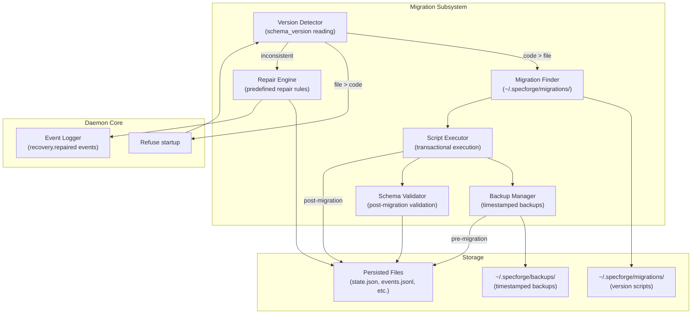

# Design Document: Migration Subsystem

## Overview

This design document specifies the implementation of the **Migration Subsystem** module for SpecForge V6. The Migration Subsystem handles schema versioning, automatic migration scripts, and recovery repair logic to ensure data consistency across version upgrades and system crashes.

**Parent Specification**: This design inherits architectural decisions from **[v6-architecture-overview](../v6-architecture-overview/design.md)**.

**Scope**: **P0** - Required for V6.0 release.

## Architecture

### Migration Subsystem Component Diagram



### Key Design Decisions

#### ADR-MIG-001: Schema Version Field Placement
**Decision**: `schema_version` field placed at root level of all JSON persistent files.

**Rationale**:
- Easy to detect without parsing entire file
- Consistent across all file types
- Allows quick version comparison during startup

**Implementation**:
```typescript
// All persistent JSON files must have this structure
interface VersionedFile {
  schema_version: string;  // e.g., "1.0.0", "2.1.0"
  // ... file-specific content
}
```

#### ADR-MIG-002: Migration Script Language
**Decision**: Migration scripts written in TypeScript/JavaScript.

**Rationale**:
- Leverages existing SpecForge toolchain
- Type safety for complex migrations
- Can import existing utility libraries
- Runtime already available (Bun/Node.js)

**Implementation**:
```typescript
// Migration script interface
interface MigrationScript {
  fromVersion: string;
  toVersion: string;
  migrate(data: any): Promise<any>;
  validate?(data: any): boolean;
}
```

#### ADR-MIG-003: Recovery Repair Rule Precedence
**Decision**: Repair rules follow "conservative rollback" principle.

**Rationale**:
- Prefer rolling back to earlier known-good state over guessing
- Minimize data loss by preserving events.jsonl when possible
- Always log repair actions for auditability

**Implementation**:
```typescript
// Repair rule precedence
const repairRules: RepairRule[] = [
  // Rule 1: If events.jsonl valid, rebuild from events
  { condition: "events_valid", action: "rebuild_from_events" },
  // Rule 2: If state.json valid but events corrupted, use state with warning
  { condition: "state_valid_events_corrupt", action: "use_state_warn" },
  // Rule 3: If design phase recorded but design.md missing, roll back to requirements
  { condition: "design_missing", action: "rollback_to_requirements" },
  // Rule 4: Default - start fresh with empty state
  { condition: "default", action: "fresh_start" }
];
```

## Component Specifications

### 1. Version Detector

**Responsibilities**:
- Read `schema_version` from persisted files
- Compare code version vs file version
- Determine migration/repair path

**Interfaces**:
```typescript
interface VersionDetectionResult {
  fileVersion: string;
  codeVersion: string;
  comparison: "equal" | "file_newer" | "code_newer";
  needsMigration: boolean;
  needsRepair: boolean;
}
```

### 2. Migration Finder

**Responsibilities**:
- Locate migration scripts in `~/.specforge/migrations/`
- Match scripts to required version transitions
- Validate script compatibility

**Interfaces**:
```typescript
interface MigrationScriptInfo {
  path: string;
  fromVersion: string;
  toVersion: string;
  description?: string;
  safeToRun: boolean;
}
```

### 3. Script Executor

**Responsibilities**:
- Execute migration scripts transactionally
- Handle script failures with rollback
- Ensure idempotency

**Interfaces**:
```typescript
interface MigrationExecutionResult {
  success: boolean;
  backupPath?: string;
  error?: string;
  durationMs: number;
}
```

### 4. Backup Manager

**Responsibilities**:
- Create timestamped backups before migration
- Restore from backup on failure
- Manage backup retention

**Interfaces**:
```typescript
interface BackupInfo {
  timestamp: string;
  originalPath: string;
  backupPath: string;
  fileSize: number;
}
```

### 5. Repair Engine

**Responsibilities**:
- Detect inconsistent (events.jsonl, state.json) combinations
- Apply predefined repair rules
- Log repair actions as events

**Interfaces**:
```typescript
interface RepairResult {
  repaired: boolean;
  originalState: any;
  repairedState: any;
  ruleApplied: string;
  eventLogged: boolean;
}
```

### 6. Schema Validator

**Responsibilities**:
- Validate migrated data against target schema
- Ensure data integrity post-migration
- Provide validation errors

**Interfaces**:
```typescript
interface ValidationResult {
  valid: boolean;
  errors: ValidationError[];
  warnings: ValidationWarning[];
}
```

## Data Flow

### Normal Migration Flow
1. Daemon starts, Version Detector reads `schema_version`
2. If `codeVersion > fileVersion`: find migration script(s)
3. Backup Manager creates backup
4. Script Executor runs migration(s) transactionally
5. Schema Validator validates result
6. If validation passes: commit, else restore backup
7. Daemon continues startup

### Recovery Repair Flow
1. Daemon starts, Version Detector detects inconsistency
2. Repair Engine analyzes (events.jsonl, state.json) pair
3. Apply appropriate repair rule based on condition
4. Log `recovery.repaired` event with repair details
5. Continue startup with repaired state

### Version Downgrade Prevention Flow
1. Daemon starts, Version Detector reads `schema_version`
2. If `fileVersion > codeVersion`: refuse startup
3. Show user-friendly upgrade prompt
4. Exit with error code

## Testing Strategy

### Property-Based Tests

#### Property 14: Schema Version Monotonicity
**Test Strategy**: Generate random file versions and migration sequences, verify `schema_version` never decreases.

**Implementation**:
```typescript
// Pseudo-code for property test
test("Property 14: Schema version monotonicity", () => {
  fc.assert(
    fc.property(
      fc.array(fc.tuple(fc.string(), fc.string())), // migration sequences
      (migrations) => {
        let currentVersion = "1.0.0";
        for (const [from, to] of migrations) {
          // Simulate migration
          if (compareVersions(to, currentVersion) < 0) {
            return false; // Violation: version decreased
          }
          currentVersion = to;
        }
        return true;
      }
    )
  );
});
```

#### Property 20: Recovery Consistency Repair
**Test Strategy**: Generate corrupted state/event pairs, verify repair rules produce consistent state.

**Implementation**:
```typescript
// Pseudo-code for property test
test("Property 20: Recovery consistency repair", () => {
  fc.assert(
    fc.property(
      fc.record({
        events: fc.string(), // events.jsonl content
        state: fc.string(),  // state.json content
        corruptionType: fc.oneof(
          fc.constant("events_missing"),
          fc.constant("state_missing"),
          fc.constant("design_missing"),
          fc.constant("both_corrupt")
        )
      }),
      (testCase) => {
        const repairResult = repairEngine.repair(testCase);
        return (
          repairResult.repaired &&
          rebuild(repairResult.repairedState.events) === 
          repairResult.repairedState.state
        );
      }
    )
  );
});
```

### Unit Tests
1. Version comparison and detection tests
2. Migration script lookup and validation tests
3. Transactional execution with rollback tests
4. Backup creation and restoration tests
5. Repair rule application tests
6. Schema validation tests

### Integration Tests
1. End-to-end migration: v1.0.0 → v1.1.0 → v1.2.0
2. Crash during migration recovery test
3. Multiple inconsistent state repair scenarios
4. Version downgrade prevention test
5. Backup retention and cleanup test

## Error Handling

### Error Categories
1. **Migration Errors**: Script failures, validation failures
2. **Repair Errors**: Unrecoverable inconsistencies
3. **Version Errors**: Unsupported version transitions
4. **IO Errors**: File read/write failures, backup failures

### Recovery Strategies
1. **Migration failures**: Restore from backup, log error, abort startup
2. **Repair failures**: Use conservative fallback (fresh start), log severity
3. **Version errors**: User-friendly upgrade prompt, exit gracefully
4. **IO errors**: Retry with exponential backoff, fallback to safe defaults

### Logging Requirements
1. All migrations must log: script name, duration, success/failure
2. All repairs must log: inconsistency type, rule applied, result
3. All backups must log: timestamp, size, location
4. All errors must log: error type, context, recovery attempt

## Performance Considerations

### Startup Time Impact
- Version detection: < 10ms per file
- Migration execution: variable, but should complete within 5 seconds
- Repair analysis: < 100ms for typical state sizes
- Backup creation: depends on file size, but parallelizable

### Memory Usage
- Migration scripts should process files streamingly when possible
- Large state files may need chunked processing
- Backup operations should use efficient copy mechanisms

### Disk Space
- Backups retained for 7 days by default
- Configurable retention policy
- Compression for large backup files

## Security Considerations

### Script Execution Safety
- Migration scripts run in isolated context
- No filesystem access beyond specified paths
- No network access by default
- Resource limits (CPU, memory, time)

### Backup Security
- Backup files preserve original permissions
- No sensitive data exposure in backup paths
- Secure deletion of old backups

### Validation Safety
- Schema validation must not execute arbitrary code
- Input size limits to prevent DoS
- Timeout for complex validation logic

## Dependencies

### Internal Dependencies
- **Daemon Core**: For event logging and state management
- **Configuration Subsystem**: For migration/backup settings
- **Permission Engine**: For migration script execution permissions

### External Dependencies
- **Bun/Node.js**: For script execution runtime
- **File System**: For backup and migration file storage
- **UUID Library**: For generating backup directory names

## Future Extensions

### V6.1 (P1) Enhancements
1. **Migration dry-run preview**: Show changes before applying
2. **Migration script testing framework**: Unit tests for migration scripts
3. **Migration rollback capability**: Undo specific migrations
4. **Migration dependency management**: Handle interdependent migrations

### V6.x (P2) Enhancements
1. **Distributed migration**: Coordinate migrations across multiple machines
2. **Migration performance optimization**: Parallel migration execution
3. **Migration analytics**: Track migration success rates and performance
4. **Migration script marketplace**: Community-contributed migration scripts