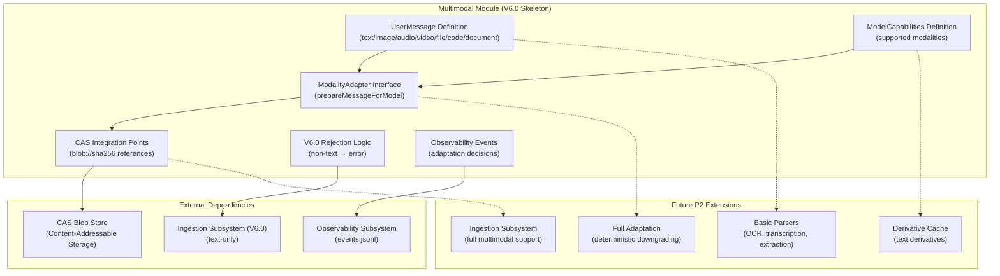

# Design Document: Multimodal Message Layer

## Overview

This design document specifies the **Multimodal Message Layer** skeleton for SpecForge V6. The multimodal module provides the foundational framework for handling multi-modal content (images, audio, video, files, code snippets, documents) while enforcing V6.0 scope boundaries.

**Parent Specification**: This design inherits architectural decisions from **[v6-architecture-overview](../v6-architecture-overview/design.md)**.

**Scope**: **P0 skeleton** - Framework establishment for V6.0 release, with full implementation deferred to P2 (V6.x).

## Architecture

### Multimodal Component Diagram



### V6.0 vs P2 Scope Boundaries

| Component | V6.0 (P0 Skeleton) | P2 (Full Support) |
|---|---|---|
| **UserMessage Format** | Defined structure with all modality types | Fully implemented with actual content handling |
| **ModelCapabilities** | Defined structure | Populated from actual model metadata |
| **ModalityAdapter** | Interface definition | Full implementation with adaptation logic |
| **CAS Integration** | Reference points defined | Actual blob storage/retrieval |
| **Ingestion** | Text-only acceptance, rejects non-text | Full multimodal ingestion |
| **Parsers** | Interface definitions | OCR, transcription, document extraction |
| **Observability** | Event schema defined | Actual adaptation decision recording |
| **Error Handling** | Rejection with P2 indication | Graceful degradation or processing |

## Components and Interfaces

### 1. UserMessage Definition (REQ-14.1)

```ts
type MessageContentItem =
  | { type: "text"; text: string }
  | { type: "image"; blob: string; mime: string }
  | { type: "audio"; blob: string; mime: string }
  | { type: "video"; blob: string; mime: string }
  | { type: "file"; blob: string; mime: string; filename: string }
  | { type: "code"; language: string; blob: string }
  | { type: "document"; blob: string; mime: string };

interface UserMessage {
  content: MessageContentItem[];
  derivedTexts?: Record<string, string>;  // For P2: OCR/transcription/summary cache
}
```

**V6.0 Constraint**: Only `{ type: "text" }` items are allowed in V6.0 submissions.

### 2. ModelCapabilities Definition (REQ-14.4)

```ts
interface ModelCapabilities {
  modalities: Array<"text" | "image" | "audio" | "video" | "file">;
  maxInputTokens: number;
  supportsTools: boolean;
}
```

### 3. ModalityAdapter Interface (REQ-14.5)

```ts
interface ModalityAdapter {
  prepareMessageForModel(msg: UserMessage, caps: ModelCapabilities): PreparedMessage;
}
```

**Property 13 (Modality Adaptation Determinism)**: Same `(msg, caps)` input → same output.

### 4. CAS Integration Points (REQ-14.2)

```ts
type BlobRef = `blob://${string}`;  // Format: blob://<sha256 hex>
```

**Property 9 (CAS Content Addressing)**: `store(content).id === "blob://" + sha256(content)`

### 5. V6.0 Rejection Logic (REQ-14.8, Property 23)

```ts
interface IngestionSubsystem {
  submitMessage(msg: UserMessage): Promise<SubmissionResult>;
}

// V6.0 implementation:
submitMessage(msg: UserMessage): Promise<SubmissionResult> {
  if (msg.content.some(item => item.type !== "text")) {
    return {
      success: false,
      error: "Multimodal content not supported in V6.0. Full support requires P2 (V6.x).",
      errorCode: "V6_MULTIMODAL_REJECTED"
    };
  }
  // Process text-only message...
}
```

## Data Models

### 1. UserMessage (Persistent)

```ts
interface UserMessageFile {
  schema_version: "1.0";
  content: MessageContentItem[];
  submittedAt: number;
  submitter: AgentIdentity | null;
  workItemId: string | null;
}
```

### 2. Adaptation Decision Event (Observability)

```ts
interface ModalityAdaptationEvent {
  schema_version: "1.0";
  eventId: string;
  ts: number;
  category: "modality";
  action: "adaptation.decision";
  payload: {
    inputModalities: string[];
    targetModel: string;
    downgraded: boolean;
    usedDerivativeBlobRef?: string;
    originalBlobRefs: string[];
  };
}
```

### 3. Rejection Event (V6.0)

```ts
interface MultimodalRejectionEvent {
  schema_version: "1.0";
  eventId: string;
  ts: number;
  category: "modality";
  action: "rejection.v6_boundary";
  payload: {
    rejectedModalities: string[];
    errorCode: "V6_MULTIMODAL_REJECTED";
    message: string;
  };
}
```

## Design Decisions (ADR)

### ADR-MM-001: V6.0 Skeleton-Only Approach

**Decision**: Implement only the framework skeleton in V6.0, with full functionality deferred to P2.

**Rationale**: 
- Aligns with REQ-14.7 (V6.0只做多模态基础链路骨架)
- Enforces Property 23 (V6.0 Multimodal Rejection)
- Provides stable foundation for P2 without blocking V6.0 release
- Reduces V6.0 complexity and risk

**Alternatives Considered**:
- Partial implementation in V6.0 (risk of incomplete, inconsistent behavior)
- No multimodal framework in V6.0 (would require architectural changes for P2)

### ADR-MM-002: Deterministic Adaptation Interface

**Decision**: Define `ModalityAdapter` interface with deterministic `prepareMessageForModel()` method.

**Rationale**:
- Enforces Property 13 (Modality Adaptation Determinism)
- Provides clear contract for P2 implementation
- Enables testing of adaptation logic independent of actual parsers

**Alternatives Considered**:
- Non-deterministic adaptation (violates architectural property)
- Tight coupling with specific parser implementations (reduces flexibility)

### ADR-MM-003: CAS-First Blob Reference Design

**Decision**: All non-text content uses CAS blob references (`blob://<sha256>`) from day one.

**Rationale**:
- Enforces Property 9 (CAS Content Addressing)
- Consistent with V6 architecture's CAS-centric design
- Enables efficient storage and retrieval for P2
- Prevents inline data bloat in events and messages

**Alternatives Considered**:
- Inline base64 encoding (bloats events.jsonl, violates REQ-5.6)
- Hybrid approach (inconsistent, harder to migrate)

## Testing Strategy

### Property-Based Tests

1. **Property 9 Test**: CAS Content Addressing
   - Generate random content, verify `store(content).id == "blob://" + sha256(content)`
   - Verify identical content → identical id, different content → different id
   - Minimum 1000 iterations for collision probability validation

2. **Property 13 Test**: Modality Adaptation Determinism
   - Generate random `(UserMessage, ModelCapabilities)` pairs
   - Verify `prepareMessageForModel(msg, caps)` produces identical output for identical input
   - Test with mocked adaptation logic for V6.0 skeleton

3. **Property 23 Test**: V6.0 Multimodal Rejection
   - Generate UserMessages with mixed modality content
   - Verify all non-text messages are rejected with appropriate error
   - Verify text-only messages are accepted (when P2 not enabled)

### Unit Tests

1. UserMessage validation (structure, schema_version)
2. ModelCapabilities structure tests
3. ModalityAdapter interface contract tests
4. V6.0 rejection logic tests
5. CAS blob reference format validation
6. Observability event schema tests

### Integration Tests

1. End-to-end text-only message flow
2. Multimodal rejection flow with error feedback
3. CAS integration smoke tests
4. Observability event recording integration
5. Cross-module boundary tests with Ingestion subsystem

## Implementation Notes

- **V6.0 Deliverable**: Framework skeleton only, no actual multimodal processing
- **P2 Dependency**: Full implementation requires V6.0 skeleton as foundation
- **Error Messages**: Must clearly indicate P2 requirement for rejected content
- **Schema Version**: All structures include `schema_version` for future migration
- **Testing Focus**: Property-based tests for architectural properties, unit tests for interfaces
- **Documentation**: Clear distinction between V6.0 skeleton and P2 full capabilities