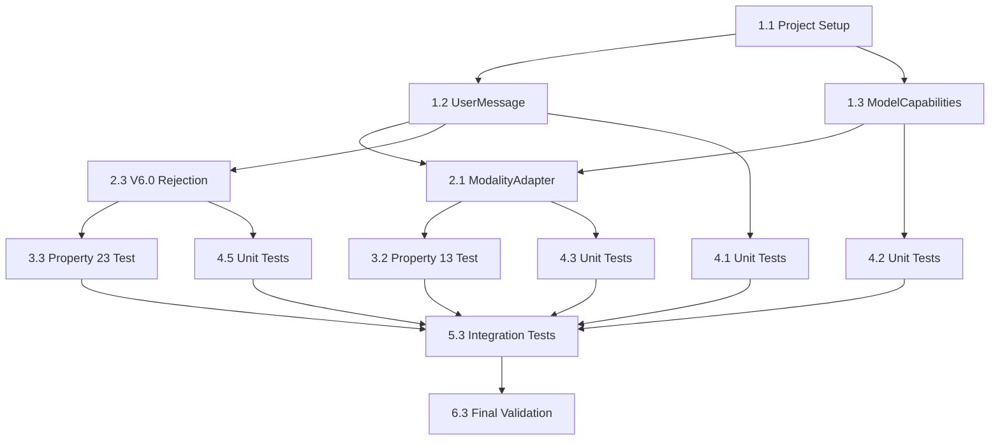

# Implementation Plan: Multimodal Message Layer

## Overview

This implementation plan covers the development of the **Multimodal Message Layer** skeleton for SpecForge V6. The multimodal module provides the foundational framework for handling multi-modal content while enforcing V6.0 scope boundaries.

**Parent Specification**: This plan implements requirements and architectural constraints from **[v6-architecture-overview](../v6-architecture-overview/)**.

**Scope**: **P0 skeleton** - Framework establishment for V6.0 release, with full implementation deferred to P2 (V6.x).

**Inherited Correctness Properties**:
- Property 9: CAS Content Addressing
- Property 13: Modality Adaptation Determinism  
- Property 23: V6.0 Multimodal Rejection

## Tasks

### Phase 1: Foundation and Data Structures
- [x] 1.1 Set up project structure and build configuration
  - Create TypeScript project with proper tsconfig
  - Set up build scripts (tsc, maybe esbuild)
  - Configure linting (ESLint) and formatting (Prettier)
  - _Requirements: All_

- [x] 1.2 Implement UserMessage data structures
  - Define `MessageContentItem` union type (text/image/audio/video/file/code/document)
  - Define `UserMessage` interface with `content` array
  - Add `schema_version` field to all structures
  - _Requirements: 14.1_

- [x] 1.3 Implement ModelCapabilities data structure
  - Define `ModelCapabilities` interface with `modalities` array
  - Support modalities: text, image, audio, video, file
  - Include `maxInputTokens` and `supportsTools` fields
  - _Requirements: 14.4_

### Phase 2: Interfaces and Contracts
- [x] 2.1 Define ModalityAdapter interface
  - Create `ModalityAdapter` interface with `prepareMessageForModel()` method
  - Define `PreparedMessage` return type
  - Define `ModalityType` enum for type-safe modality identification
  - Define `ModalityAdapterConfig` interface for adapter configuration
  - Document deterministic behavior requirement (Property 13)
  - _Requirements: 14.5_

- [x] 2.2 Implement CAS integration points
  - Define `BlobRef` type: `blob://<sha256>`
  - Create CAS client interface for blob storage/retrieval
  - Implement Property 9 verification helpers
  - _Requirements: 14.2, 30.9_

- [x] 2.3 Implement V6.0 rejection logic
  - Create `IngestionSubsystem` interface with `submitMessage()` method
  - Implement V6.0 rejection for non-text UserMessages
  - Return clear error messages indicating P2 requirement
  - _Requirements: 14.8, Property 23_

### Phase 3: Property-Based Tests
- [x] 3.1 Implement Property 9 test: CAS Content Addressing
  - **Property 9: CAS Content Addressing**
  - **Validates: Requirements 30.9, 5.6, 14.2**
  - Use `fast-check` to generate random binary/text content
  - Verify `store(content).id == "blob://" + sha256(content)`
  - Verify identical content → identical id
  - Verify different content → different id (collision probability check)
  - Minimum 1000 iterations
  - _Feature: multimodal, Property 9: CAS Content Addressing; Derived-From: v6-architecture-overview Property 9_

- [x] 3.2 Implement Property 13 test: Modality Adaptation Determinism
  - **Property 13: Modality Adaptation Determinism**
  - **Validates: Requirements 30.13, 14.5**
  - Use `fast-check` to generate random `(UserMessage, ModelCapabilities)` pairs
  - Mock `prepareMessageForModel()` with deterministic logic
  - Verify identical inputs produce identical outputs
  - Test edge cases: empty messages, unsupported modalities
  - Minimum 100 iterations
  - _Feature: multimodal, Property 13: Modality Adaptation Determinism; Derived-From: v6-architecture-overview Property 13_

- [x] 3.3 Implement Property 23 test: V6.0 Multimodal Rejection
  - **Property 23: V6.0 Multimodal Rejection**
  - **Validates: Requirements 14.7, 14.8**
  - Use `fast-check` to generate UserMessages with mixed modality content
  - Verify all non-text messages are rejected with `errorCode: "V6_MULTIMODAL_REJECTED"`
  - Verify text-only messages are accepted (when P2 not enabled)
  - Test all non-text types: image, audio, video, file, code, document
  - Minimum 100 iterations
  - _Feature: multimodal, Property 23: V6.0 Multimodal Rejection; Derived-From: v6-architecture-overview Property 23_

### Phase 4: Unit Tests
- [x] 4.1 Write UserMessage validation tests
  - Test structure validation (required fields, schema_version)
  - Test type guards for `MessageContentItem` union
  - Test serialization/deserialization round-trip
  - _Requirements: 14.1_

- [x] 4.2 Write ModelCapabilities tests
  - Test modality array validation
  - Test capability checking methods
  - Test serialization/deserialization
  - _Requirements: 14.4_

- [x] 4.3 Write ModalityAdapter interface tests
  - Test interface contract compliance
  - Test deterministic behavior with mocked implementations
  - Test error handling for invalid inputs
  - _Requirements: 14.5_

- [x] 4.4 Write CAS integration tests
  - Test `BlobRef` format validation
  - Test CAS client interface methods
  - Test Property 9 verification helpers
  - _Requirements: 14.2_

- [x] 4.5 Write V6.0 rejection logic tests
  - Test rejection of all non-text modality types
  - Test acceptance of text-only messages
  - Test error message clarity and P2 indication
  - _Requirements: 14.8_

### Phase 5: Observability and Integration
- [x] 5.1 Define observability events
  - Create `ModalityAdaptationEvent` schema
  - Create `MultimodalRejectionEvent` schema
  - Include all required fields per V6 architecture
  - _Requirements: 14.6_

- [x] 5.2 Implement event recording integration
  - Integrate with Event Bus for adaptation decision events
  - Record rejection events with proper context
  - Ensure events include `schema_version` field
  - _Requirements: 14.6_

- [x] 5.3 Create integration tests
  - End-to-end text-only message flow
  - Multimodal rejection flow with error feedback
  - Observability event recording verification
  - Cross-module integration with Ingestion subsystem
  - _Requirements: All_

### Phase 6: Documentation and Finalization
- [x] 6.1 Create comprehensive documentation
  - Document V6.0 vs P2 scope boundaries
  - Document all interfaces and data structures
  - Provide examples of V6.0 rejection behavior
  - _Requirements: 14.7, 14.8_

- [x] 6.2 Finalize scope tag enforcement
  - Ensure `scopeTag: "p0"` is properly set in `.config.kiro`
  - Document that full implementation requires `scopeTag: "p2"`
  - Verify P2 dependency on V6.0 skeleton
  - _Requirements: 14.9_

- [x] 6.3 Run final validation
  - Run all property-based tests (3.1-3.3)
  - Run all unit tests (4.1-4.5)
  - Run integration tests (5.3)
  - Verify zero test failures
  - _Requirements: All_

## Notes

- **V6.0 Deliverable**: Framework skeleton only, no actual multimodal processing
- **P2 Dependency**: Full implementation requires V6.0 skeleton as foundation (REQ-14.9)
- **Error Messages**: Must clearly indicate P2 requirement for rejected content
- **Testing Priority**: Property-based tests for architectural properties are mandatory
- **Scope Enforcement**: V6.0 must reject all non-text UserMessages (Property 23)
- **Determinism**: Modality adaptation must be deterministic (Property 13)
- **CAS Integration**: All blob references must use proper SHA-256 addressing (Property 9)

## Task Dependencies

**Critical Path**: 1.1 → 1.2 → 2.3 → 3.3 → 5.3 → 6.3 (V6.0 rejection logic must be implemented and tested first to meet scope boundary requirements).