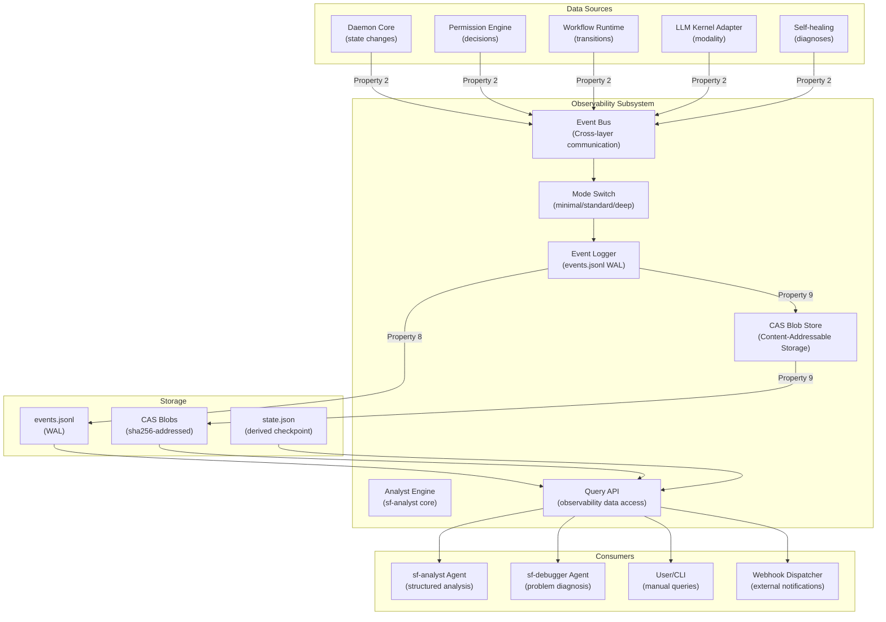

# Design Document: Observability

## Overview

This design document specifies the implementation of the **Observability** module for SpecForge V6. The Observability subsystem is a **first-class component** that provides comprehensive monitoring, logging, and analysis capabilities to achieve the North Star goal: "5 minutes from problem occurrence to root cause identification."

**Parent Specification**: This design inherits architectural decisions from **[v6-architecture-overview](../v6-architecture-overview/design.md)**.

**Scope**: **P0** - Required for V6.0 release.

## Architecture

### Observability Component Diagram



### Three-Tier Observability Mode

**Minimal Mode**:
- Records only decision events (Gate passes/fails, Permission allow/deny, Workflow transitions)
- Event payloads limited to essential metadata
- Designed for low-resource environments and CI pipelines

**Standard Mode (Default)**:
- Records all events across all components
- Excludes large payloads (> 64 KiB) - stored as CAS blob references
- Balanced detail level for daily development use

**Deep Mode**:
- Records all events with full payloads
- Large payloads stored as CAS blob references with content preserved
- Used for post-mortem analysis and complex debugging

### Event Schema (Property 30)

```typescript
interface Event {
  schema_version: "1.0";
  eventId: string;                 // UUIDv7 (globally unique, time-ordered)
  ts: number;                      // Monotonic timestamp (nanoseconds)
  monotonicSeq: number;            // Process-internal sequence for same-ts ordering
  projectId: string;               // SHA-256 of project root path (truncated)
  workItemId: string | null;
  actor: AgentIdentity | null;
  category: "workflow" | "gate" | "permission" | "session" | "tool" | "heal" | "modality" | "migration" | "system";
  action: string;                  // e.g., "workflow.started", "permission.evaluated"
  payload?: unknown;
  payloadBlobRef?: string;         // "blob://<sha256>" for payloads > 64 KiB
}
```

**Multi-sync Readiness**: The event schema includes fields necessary for future multi-machine synchronization (global eventId, monotonic timestamp, project aggregation dimension).

### CAS Integration (Property 9)

**Content-Addressable Storage**:
- All binary/text content > 64 KiB stored in CAS
- Blob ID = `"blob://" + sha256(content)`
- Identical content produces identical blob IDs
- Different content produces different blob IDs (SHA-256 collision resistance)

**Blob Reference Format**: `blob://<sha256-hex>`

### Serialization Round-trip (Property 8)

All persisted data objects must satisfy `parse(serialize(x)) == x`:
- `AgentIdentity`
- `Event` 
- `ProjectState`
- `WorkflowDefinitionFile`
- `HandshakeFile`
- `PermissionRule`
- `PluginManifest`
- `SkillMetadata`
- `MergedConfig`
- `UserMessage`
- `WorkItemState`

### Permission Decision Traceability (Property 10)

Every Permission Engine decision generates an event with complete traceability:

```typescript
interface PermissionDecisionEvent {
  action: "permission.evaluated";
  payload: {
    actor: AgentIdentity;
    action: string;                // e.g., "tool.invoke"
    resource: { type: string; id: string };
    matched_rule: string;          // Rule ID
    rule_layer: "hard" | "builtin" | "user";
    reason: string;
    effect: "allow" | "deny";
  };
}
```

## Components

### 1. Event Bus

**Responsibilities**:
- Receive all cross-layer communication messages
- Apply mode filtering (minimal/standard/deep)
- Route events to appropriate handlers
- Ensure Property 2 compliance (no direct function calls across boundaries)

**Interfaces**:
```typescript
interface EventBus {
  emit(event: Omit<Event, "eventId" | "ts" | "monotonicSeq">): Promise<void>;
  subscribe(pattern: string): AsyncIterable<Event>;
  getMode(): "minimal" | "standard" | "deep";
  setMode(mode: "minimal" | "standard" | "deep"): void;
}
```

### 2. CAS (Content-Addressable Storage)

**Responsibilities**:
- Store binary/text content with SHA-256 addressing
- Enforce Property 9: `store(content).id == sha256(content)`
- Manage blob lifecycle (reference counting, garbage collection)
- Provide efficient blob retrieval

**Interfaces**:
```typescript
interface CAS {
  store(content: Uint8Array | string): Promise<string>;  // Returns "blob://<sha256>"
  retrieve(ref: string): Promise<Uint8Array | string | null>;
  exists(ref: string): Promise<boolean>;
  delete(ref: string): Promise<void>;
}
```

### 3. Event Logger

**Responsibilities**:
- Write events to events.jsonl with WAL semantics
- Apply serialization round-trip validation (Property 8)
- Handle large payloads via CAS integration
- Ensure fsync before state.json updates (WAL Ordering Property)

**Interfaces**:
```typescript
interface EventLogger {
  append(event: Event): Promise<void>;
  getEvents(filter?: EventFilter): AsyncIterable<Event>;
  rebuildState(): Promise<ProjectState>;
  getLastEventId(): string | null;
}
```

### 4. Query API

**Responsibilities**:
- Provide structured access to observability data
- Support North Star goal analysis across 10 scenarios
- Enable sf-analyst data processing
- Offer efficient filtering and aggregation

**Interfaces**:
```typescript
interface QueryAPI {
  queryEvents(filter: EventFilter): Promise<Event[]>;
  analyzeScenario(scenario: NorthStarScenario, timeRange: TimeRange): Promise<AnalysisResult>;
  getPermissionTrace(decisionId: string): Promise<PermissionTrace>;
  getBlobContent(ref: string): Promise<Uint8Array | string | null>;
}
```

### 5. Analyst Engine

**Responsibilities**:
- Core logic for sf-analyst agent
- Generate structured analysis from observability data
- Support all 10 North Star troubleshooting scenarios
- Separate from sf-debugger (architectural vs code analysis)

**Interfaces**:
```typescript
interface AnalystEngine {
  analyzeGateFailures(workItemId: string, timeRange: TimeRange): Promise<GateFailureAnalysis>;
  analyzeAgentDeviation(sessionId: string): Promise<AgentDeviationAnalysis>;
  analyzeToolErrors(toolId: string, timeRange: TimeRange): Promise<ToolErrorAnalysis>;
  // ... other scenario analyses
}
```

## Data Models

### Event Filter
```typescript
interface EventFilter {
  projectId?: string;
  workItemId?: string;
  category?: Event["category"];
  action?: string;
  actor?: Partial<AgentIdentity>;
  startTs?: number;
  endTs?: number;
  limit?: number;
}
```

### Analysis Result
```typescript
interface AnalysisResult {
  scenario: NorthStarScenario;
  rootCause: string | null;
  confidence: number;  // 0-1
  evidence: Event[];
  recommendations: string[];
  timeToIdentify: number;  // milliseconds
}
```

### Permission Trace
```typescript
interface PermissionTrace {
  decision: PermissionDecisionEvent;
  rule: PermissionRule;
  context: Record<string, unknown>;
  relatedEvents: Event[];  // Events leading to the decision
}
```

## Testing Strategy

### Property-Based Tests

1. **Property 2: Event Bus Traversal Test**
   - Instrument all component boundaries
   - Generate random cross-layer calls
   - Verify all calls produce Event Bus messages
   - Verify no direct function calls bypass Event Bus

2. **Property 8: Serialization Round-trip Test**
   - Generate random instances of all persisted data types
   - Verify `parse(serialize(x)) == x` for each type
   - Test edge cases (null values, empty arrays, maximum sizes)

3. **Property 9: CAS Content Addressing Test**
   - Generate random binary/text content
   - Verify `store(content).id == "blob://" + sha256(content)`
   - Verify identical content produces identical IDs
   - Verify different content produces different IDs

4. **Property 10: Permission Decision Traceability Test**
   - Generate random permission decisions
   - Verify each decision produces a traceable event
   - Verify event contains all six required fields
   - Verify deny decisions can be traced back to rules

5. **Property 30: Event Schema Multi-sync Readiness Test**
   - Generate random events
   - Verify eventId uniqueness
   - Verify timestamp monotonicity
   - Verify projectId non-empty and aggregatable

### Unit Tests

1. Three-tier mode switching and filtering
2. Event Bus message routing and delivery
3. CAS blob storage and retrieval
4. Event Logger WAL semantics and fsync
5. Query API filtering and aggregation
6. Analyst Engine scenario analysis
7. North Star goal validation (10 scenarios)

### Integration Tests

1. End-to-end observability pipeline
2. Mode behavior under different workloads
3. Crash recovery with WAL reconstruction
4. Multi-project observability isolation
5. sf-analyst integration and analysis generation
6. Permission decision traceability workflow

## Implementation Notes

- **Performance**: Event logging overhead < 5 ms/event; standard mode events.jsonl < 1 GB/day
- **Resource Usage**: CAS implements reference counting for garbage collection
- **Error Handling**: Observability errors don't block core functionality; errors are logged as events
- **Configuration**: Mode switching via runtime configuration (hot reload)
- **Backward Compatibility**: Event schema versioning supports future migrations

## Dependencies

- **Daemon Core**: For project context and state management
- **Permission Engine**: For permission decision events
- **Workflow Runtime**: For workflow transition events
- **LLM Kernel Adapter**: For modality adaptation events
- **Self-healing**: For diagnosis events

## Open Questions

1. CAS garbage collection strategy (time-based vs reference-counting)
2. Event retention policy (time-based vs size-based)
3. Query API performance optimization for large event streams
4. Analyst Engine machine learning integration for pattern detection
