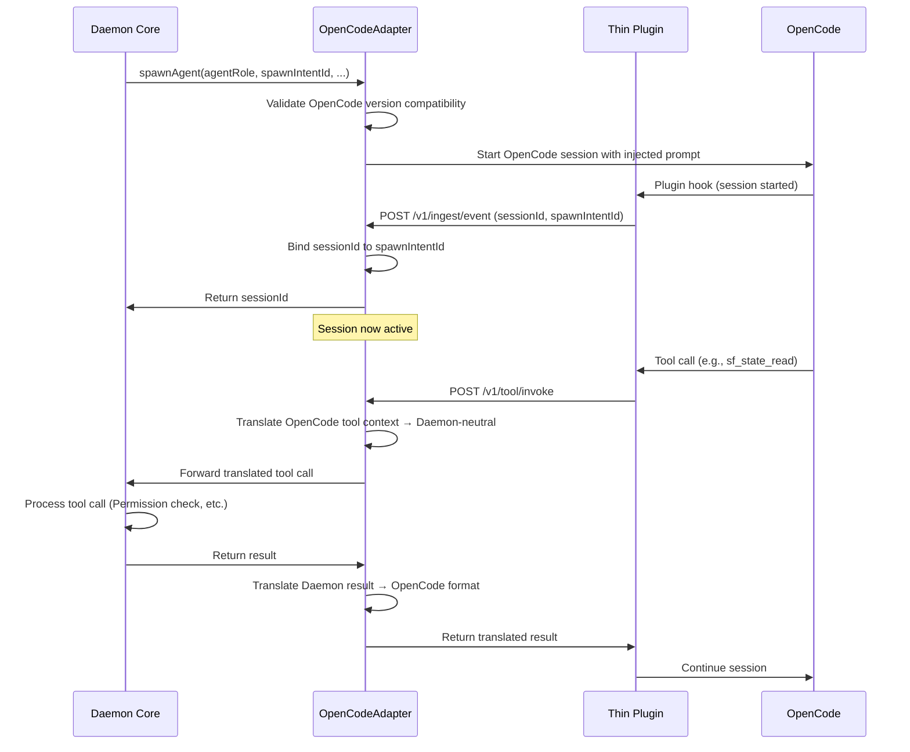

# Design Document: OpenCode Adapter

## Overview

This design document provides the technical design for the **OpenCode Adapter** module, which implements the `LLMKernelAdapter` interface for OpenCode. The adapter serves as an isolation layer between OpenCode's implementation details and SpecForge V6's Daemon core, absorbing OpenCode version changes while preventing concept leakage.

**Parent Specification**: This design implements requirements from **[v6-architecture-overview](../v6-architecture-overview/design.md)** and the local **[requirements.md](./requirements.md)**.

**Scope**: **P0** - Required for V6.0 release.

**Inherited Correctness Properties**:
- Property 4: Adapter Encapsulation
- Property 12: Adapter Version Alignment

## Architecture

### 1. High-Level Architecture

```
┌─────────────────────────────────────────────────────────────┐
│                    Daemon Core                              │
│  ┌────────────────────────────────────────────────────┐    │
│  │              LLMKernelAdapter Interface            │    │
│  │  • spawnAgent()                                   │    │
│  │  • getSession()                                   │    │
│  │  • cancelSession()                                │    │
│  │  • sendPrompt()                                   │    │
│  │  • subscribeEvents()                              │    │
│  │  • getCapabilities()                              │    │
│  └────────────────────────────────────────────────────┘    │
│                    │                                        │
│                    ▼                                        │
└─────────────────────────────────────────────────────────────┘
                              │
                    Implements │
                              ▼
┌─────────────────────────────────────────────────────────────┐
│                OpenCodeAdapter (V6.0 only)                  │
│  ┌────────────────────────────────────────────────────┐    │
│  │           Concept Translation Layer                │    │
│  │  • OpenCode ctx/callID → Daemon-neutral           │    │
│  │  • Plugin hook params → Standardized              │    │
│  │  • Event schema mapping                           │    │
│  │  • Tool call translation                          │    │
│  └────────────────────────────────────────────────────┘    │
│  ┌────────────────────────────────────────────────────┐    │
│  │         Version Compatibility Checker              │    │
│  │  • compatibleKernelRange validation               │    │
│  │  • OpenCode version detection                     │    │
│  │  • Mismatch handling & events                     │    │
│  └────────────────────────────────────────────────────┘    │
│                    │                                        │
│                    ▼                                        │
└─────────────────────────────────────────────────────────────┘
                              │
                    Communicates via │
                    OpenCode Plugin API
                              ▼
┌─────────────────────────────────────────────────────────────┐
│                    OpenCode (LLM Kernel)                    │
│  ┌────────────────────────────────────────────────────┐    │
│  │               Thin Plugin Bridge                  │    │
│  │  • Event reporting to Daemon                      │    │
│  │  • Command reception from Daemon                  │    │
│  │  • On-demand Daemon startup                       │    │
│  └────────────────────────────────────────────────────┘    │
└─────────────────────────────────────────────────────────────┘
```

### 2. Key Design Decisions

#### ADR-OCA-001: Isolation Over Absorption
When OpenCode behavior changes cannot be fully absorbed by the adapter, **concept isolation takes precedence**. The adapter will return "unsupported" errors for affected operations rather than leaking OpenCode-specific concepts to Daemon core.

**Rationale**: Prevents architectural contamination and maintains clean abstraction boundaries. Daemon core stability is more important than feature completeness in edge cases.

#### ADR-OCA-002: Version-Gated Compatibility
Adapter versions are explicitly tied to OpenCode major versions. The `compatibleKernelRange` is strictly validated at startup, and incompatible combinations are rejected with clear error messages.

**Rationale**: Prevents subtle bugs from version mismatches. Explicit version coupling makes compatibility expectations clear.

#### ADR-OCA-003: Translation-First Architecture
All data passing from OpenCode to Daemon goes through explicit translation functions that convert OpenCode-specific structures to Daemon-neutral representations.

**Rationale**: Centralizes translation logic, makes it testable, and ensures no OpenCode concepts bypass the translation layer.

### 3. Data Flow: Session Creation Example



### 4. Components and Interfaces

#### 4.1 LLMKernelAdapter Interface Implementation

```typescript
interface OpenCodeAdapter implements LLMKernelAdapter {
  readonly version: string;               // e.g., "1.0.0"
  readonly compatibleKernelRange: string; // e.g., "opencode ^1.14"
  
  // Core interface methods
  spawnAgent(params: SpawnAgentParams): Promise<{ sessionId: string }>;
  getSession(sessionId: string): Promise<SessionInfo | null>;
  cancelSession(sessionId: string, reason: string): Promise<void>;
  sendPrompt(sessionId: string, message: UserMessage): Promise<void>;
  subscribeEvents(sessionId: string): AsyncIterable<KernelEvent>;
  getCapabilities(model: string): Promise<ModelCapabilities>;
  
  // Adapter-specific methods
  detectOpenCodeVersion(): Promise<string>;
  validateCompatibility(): Promise<CompatibilityResult>;
  translateToolContext(toolCall: OpenCodeToolCall): DaemonToolCall;
  translateEvent(event: OpenCodeEvent): DaemonEvent;
}
```

#### 4.2 Translation Layer

The translation layer consists of dedicated modules:

- **ContextTranslator**: Converts OpenCode `ctx` objects to Daemon-neutral session contexts
- **EventTranslator**: Maps OpenCode event schemas to Daemon event schemas
- **ToolTranslator**: Converts tool call parameters between OpenCode and Daemon formats
- **CapabilityTranslator**: Maps OpenCode model capabilities to Daemon ModelCapabilities

Each translator follows the pattern:
```typescript
interface Translator<TFrom, TTo> {
  canTranslate(input: TFrom): boolean;
  translate(input: TFrom): TTo;
  getUnsupportedReasons(input: TFrom): string[];
}
```

#### 4.3 Version Compatibility Checker

```typescript
interface VersionCompatibilityChecker {
  check(adapterRange: string, openCodeVersion: string): CompatibilityResult;
  
  // Results include:
  // - COMPATIBLE: Version within range
  // - INCOMPATIBLE_TOO_LOW: Version below range
  // - INCOMPATIBLE_TOO_HIGH: Version above range  
  // - UNKNOWN: Version string cannot be parsed
}

interface CompatibilityResult {
  status: 'compatible' | 'incompatible' | 'unknown';
  details: string;
  suggestedAction?: 'upgrade_adapter' | 'downgrade_opencode' | 'both';
}
```

### 5. Error Handling

#### 5.1 Error Categories

1. **Version Incompatibility Errors**: When OpenCode version is outside `compatibleKernelRange`
2. **Translation Failures**: When OpenCode concepts cannot be translated to Daemon-neutral forms
3. **OpenCode Communication Errors**: When OpenCode API calls fail
4. **Thin Plugin Integration Errors**: When Thin Plugin communication fails

#### 5.2 Error Response Strategy

- **Version mismatches**: Reject binding, record `adapter.version_mismatch` event, provide clear upgrade/downgrade instructions
- **Translation failures**: Return "unsupported operation" errors, maintain concept isolation
- **Communication errors**: Implement retry logic with exponential backoff, eventually fail with descriptive errors
- **Integration errors**: Log detailed diagnostics, attempt graceful degradation

### 6. Testing Strategy

#### 6.1 Property-Based Tests (PBT)

**Property 4: Adapter Encapsulation Test**
- Generate random OpenCode data structures
- Verify no OpenCode-specific types appear in translated outputs
- Verify translation either succeeds or returns "unsupported" (never leaks)

**Property 12: Adapter Version Alignment Test**
- Generate version strings within/outside compatible ranges
- Verify correct compatibility decisions
- Verify `adapter.version_mismatch` events for incompatible versions

#### 6.2 Unit Tests

1. **Translation Tests**: Each translator module with comprehensive input coverage
2. **Version Compatibility Tests**: Edge cases, version string parsing, range semantics
3. **Interface Implementation Tests**: All LLMKernelAdapter methods with mock OpenCode
4. **Error Handling Tests**: All error categories with verification of proper events

#### 6.3 Integration Tests

1. **End-to-End with Mock OpenCode**: Full session lifecycle
2. **Thin Plugin Integration**: Event reporting and command reception
3. **Version Compatibility Scenarios**: Upgrade/downgrade sequences
4. **Error Recovery**: Communication failures and recovery

#### 6.4 Compatibility Matrix Testing

Test against:
- Minimum supported OpenCode version
- Maximum supported OpenCode version  
- One version below minimum (should fail)
- One version above maximum (should fail)
- Patch versions within range (should work)

### 7. Implementation Notes

#### 7.1 Directory Structure

```
opencode-adapter/
├── src/
│   ├── index.ts                    # Main export
│   ├── OpenCodeAdapter.ts          # Main class
│   ├── translators/
│   │   ├── ContextTranslator.ts
│   │   ├── EventTranslator.ts
│   │   ├── ToolTranslator.ts
│   │   └── CapabilityTranslator.ts
│   ├── compatibility/
│   │   ├── VersionChecker.ts
│   │   └── CompatibilityError.ts
│   ├── integration/
│   │   ├── ThinPluginClient.ts
│   │   └── OpenCodeClient.ts
│   └── types/
│       ├── OpenCodeTypes.ts        # OpenCode-specific types
│       └── TranslationTypes.ts     # Translation interfaces
├── tests/
│   ├── property/
│   │   ├── AdapterEncapsulation.test.ts
│   │   └── VersionAlignment.test.ts
│   ├── unit/
│   └── integration/
└── package.json
```

#### 7.2 Dependencies

- **Runtime**: OpenCode plugin API (via Thin Plugin bridge)
- **Internal**: Daemon core types (for interface implementation)
- **Testing**: fast-check (property testing), jest/vitest (unit testing)

#### 7.3 Configuration

```typescript
interface OpenCodeAdapterConfig {
  version: string;
  compatibleKernelRange: string;
  translation: {
    strictMode: boolean;  // If true, fail on untranslatable concepts
    logUntranslated: boolean;
  };
  compatibility: {
    checkOnStartup: boolean;
    allowOverride: boolean;  // For development/testing only
  };
  integration: {
    thinPluginEndpoint: string;
    reconnectAttempts: number;
    reconnectDelayMs: number;
  };
}
```

### 8. Migration and Evolution

#### 8.1 Versioning Strategy

- **Major version**: Changes when OpenCode major version changes
- **Minor version**: New features within same OpenCode major version
- **Patch version**: Bug fixes, performance improvements

#### 8.2 Breaking Changes

Breaking changes in OpenCode require:
1. New adapter major version
2. Updated `compatibleKernelRange`
3. Translation layer updates for changed concepts
4. Backward compatibility tests with previous OpenCode versions

#### 8.3 Deprecation Policy

- Deprecated translation paths maintained for one major version
- Clear warnings in logs when deprecated paths are used
- Removal in next major version after deprecation

## Conclusion

The OpenCode Adapter design prioritizes **isolation** and **abstraction** to protect Daemon core from OpenCode implementation details. By enforcing strict version compatibility and comprehensive translation, the adapter enables SpecForge V6 to use OpenCode as an LLM Kernel while maintaining architectural integrity.

The design satisfies both inherited Correctness Properties:
- **Property 4**: Through the translation layer and isolation-first error handling
- **Property 12**: Through the version compatibility checker and strict range validation
