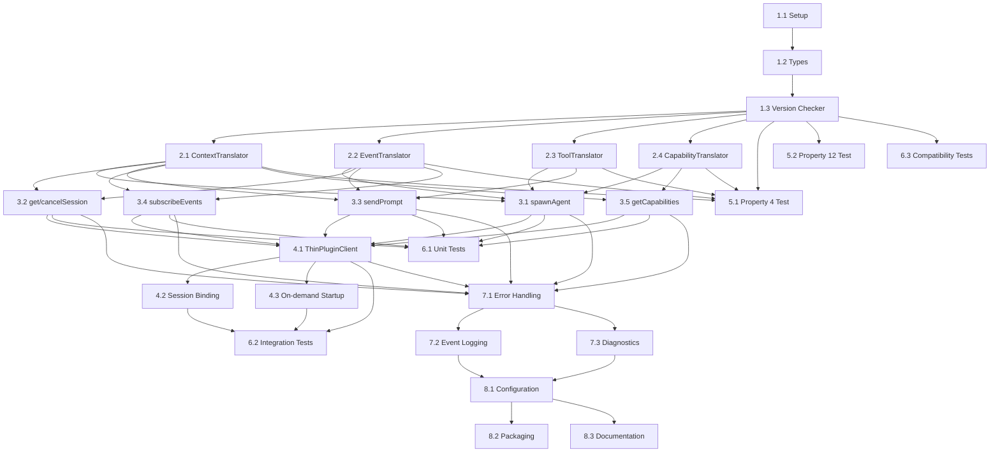

# Implementation Plan: OpenCode Adapter

## Overview

This implementation plan covers the development of the **OpenCode Adapter** module for SpecForge V6. The OpenCode Adapter implements the `LLMKernelAdapter` interface for OpenCode, providing isolation between OpenCode implementation details and Daemon core.

**Parent Specification**: This plan implements requirements and architectural constraints from **[v6-architecture-overview](../v6-architecture-overview/)**.

**Scope**: **P0** - Required for V6.0 release.

**Inherited Correctness Properties**:
- Property 4: Adapter Encapsulation
- Property 12: Adapter Version Alignment

## Tasks

### Phase 1: Foundation and Setup
- [x] 1.1 Set up project structure and build configuration
  - Create TypeScript project with proper tsconfig
  - Set up build scripts (tsc, maybe esbuild)
  - Configure linting (ESLint) and formatting (Prettier)
  - _Requirements: All_

- [x] 1.2 Define TypeScript interfaces and types
  - Implement `LLMKernelAdapter` interface from parent spec
  - Define OpenCode-specific types (internal only)
  - Define translation interfaces
  - _Requirements: 1.1, 1.2_

- [x] 1.3 Implement version compatibility checker
  - Parse OpenCode version strings
  - Implement SemVer range checking
  - Generate compatibility results and error messages
  - _Requirements: 2.1, 2.2, 2.3_

### Phase 2: Core Translation Layer
- [x] 2.1 Implement ContextTranslator
  - Convert OpenCode `ctx` objects to Daemon-neutral session contexts
  - Handle edge cases and unsupported features
  - Write comprehensive unit tests
  - _Requirements: 3.1, 3.2, 3.4_

- [x] 2.2 Implement EventTranslator
  - Map OpenCode event schemas to Daemon event schemas
  - Handle event payload translation
  - Support different OpenCode event versions
  - _Requirements: 3.1, 3.4_

- [x] 2.3 Implement ToolTranslator
  - Convert tool call parameters between OpenCode and Daemon formats
  - Handle tool result translation
  - Support tool call error translation
  - _Requirements: 3.1, 3.4_

- [x] 2.4 Implement CapabilityTranslator
  - Map OpenCode model capabilities to Daemon ModelCapabilities
  - Handle capability discovery and reporting
  - Support capability versioning
  - _Requirements: 3.1, 3.4_

### Phase 3: LLMKernelAdapter Implementation
- [x] 3.1 Implement `spawnAgent` method
  - Validate OpenCode version compatibility
  - Start OpenCode session with injected prompt
  - Handle session initialization errors
  - _Requirements: 1.1, 1.4, 2.1_

- [x] 3.2 Implement `getSession` and `cancelSession` methods
  - Query OpenCode session status
  - Gracefully terminate sessions
  - Handle missing or invalid sessions
  - _Requirements: 1.1_

- [x] 3.3 Implement `sendPrompt` method
  - Translate UserMessage to OpenCode format
  - Send prompt to OpenCode session
  - Handle prompt delivery errors
  - _Requirements: 1.1, 3.1_

- [x] 3.4 Implement `subscribeEvents` method
  - Subscribe to OpenCode session events
  - Translate events to Daemon format
  - Handle event stream errors and reconnection
  - _Requirements: 1.1, 3.1_

- [x] 3.5 Implement `getCapabilities` method
  - Query OpenCode for model capabilities
  - Translate to Daemon ModelCapabilities
  - Cache capabilities for performance
  - _Requirements: 1.1, 3.1_

### Phase 4: Thin Plugin Integration
- [x] 4.1 Implement ThinPluginClient
  - HTTP client for Thin Plugin communication
  - Event reporting endpoint implementation
  - Error handling and retry logic
  - _Requirements: 4.1, 4.2_

- [x] 4.2 Implement session binding logic
  - First-contact binding strategy
  - `spawnIntentId` to `sessionId` mapping
  - Session registry integration
  - _Requirements: 4.2_

- [x] 4.3 Implement on-demand startup support
  - Detect when Daemon needs to be started
  - Start Daemon process when required
  - Handle startup failures
  - _Requirements: 4.3_

### Phase 5: Property-Based Tests
- [x] 5.1 Implement Property 4 test: Adapter Encapsulation
  - Generate random OpenCode data structures
  - Verify no OpenCode concepts leak in translations
  - Test translation failure handling
  - **Validates: Property 4**

- [x] 5.2 Implement Property 12 test: Adapter Version Alignment
  - Generate version strings within/outside ranges
  - Verify compatibility checking
  - Test `adapter.version_mismatch` events
  - **Validates: Property 12**

### Phase 6: Unit and Integration Tests
- [x] 6.1 Write comprehensive unit tests
  - Each translator module (Context, Event, Tool, Capability)
  - Version compatibility checker
  - LLMKernelAdapter method implementations
  - Error handling scenarios
  - _Requirements: All_

- [x] 6.2 Write integration tests
  - End-to-end session lifecycle
  - Thin Plugin communication
  - Version compatibility scenarios
  - Error recovery and retry logic
  - _Requirements: All_

- [x] 6.3 Write compatibility matrix tests
  - Minimum supported OpenCode version
  - Maximum supported OpenCode version
  - Version below minimum (should fail)
  - Version above maximum (should fail)
  - Patch version testing
  - _Requirements: 2.1, 2.2, 2.3, 2.4, 2.5_

### Phase 7: Error Handling and Observability
- [x] 7.1 Implement error classification and handling
  - Version incompatibility errors
  - Translation failures
  - OpenCode communication errors
  - Thin Plugin integration errors
  - _Requirements: 1.6, 2.3, 4.4_

- [x] 7.2 Implement event logging
  - `adapter.version_mismatch` events
  - Translation failure events
  - Session lifecycle events
  - Integration error events
  - _Requirements: 2.3_

- [x] 7.3 Implement diagnostics and logging
  - Detailed translation logs (configurable)
  - Performance metrics
  - Compatibility warnings
  - Debug information
  - _Requirements: 3.3_

### Phase 8: Configuration and Deployment
- [x] 8.1 Implement configuration system
  - `compatibleKernelRange` configuration
  - Translation strictness settings
  - Integration timeout settings
  - Logging configuration
  - _Requirements: 2.1_

- [x] 8.2 Create package and build artifacts
  - TypeScript compilation
  - Bundle for distribution
  - Documentation generation
  - Version tagging
  - _Requirements: All_

- [x] 8.3 Create installation and setup documentation
  - Version compatibility requirements
  - Configuration instructions
  - Troubleshooting guide
  - Upgrade procedures
  - _Requirements: 2.4_

## Task Dependencies

## Testing Strategy

### Property-Based Tests (Required by Parent Spec)

1. **Property 4: Adapter Encapsulation**
   - Test that no OpenCode-specific types appear in public API
   - Test that translation either succeeds or returns "unsupported"
   - Test that error messages don't leak OpenCode internals

2. **Property 12: Adapter Version Alignment**
   - Test version range checking correctness
   - Test `adapter.version_mismatch` event generation
   - Test error messages for incompatible versions

### Unit Tests

- **Translation layer**: Each translator with comprehensive input coverage
- **Version compatibility**: Edge cases, parsing, range semantics
- **LLMKernelAdapter methods**: All interface methods with mocks
- **Error handling**: All error categories with event verification

### Integration Tests

- **End-to-end session lifecycle**: Creation, use, termination
- **Thin Plugin integration**: Event reporting and command flow
- **Version scenarios**: Upgrade/downgrade, compatibility edges
- **Error recovery**: Network failures, OpenCode crashes, reconnection

### Compatibility Tests

- **Matrix testing**: All supported OpenCode versions
- **Boundary testing**: Minimum-1, minimum, maximum, maximum+1
- **Patch version testing**: Within same major version

## Notes

- All translation code must be contained within the OpenCodeAdapter module
- OpenCode-specific types must not be exported from the module
- Version compatibility is critical - false positives (rejecting compatible) preferred over false negatives (accepting incompatible)
- The adapter must maintain clean separation between absorption obligation (translating changes) and isolation obligation (preventing leakage)
- All persistent state (sessions, capabilities cache) must be reconstructable from events
- Error messages must be user-friendly and actionable
- Performance should be monitored, especially translation overhead
- The adapter should be designed for testability with clear interfaces between components
