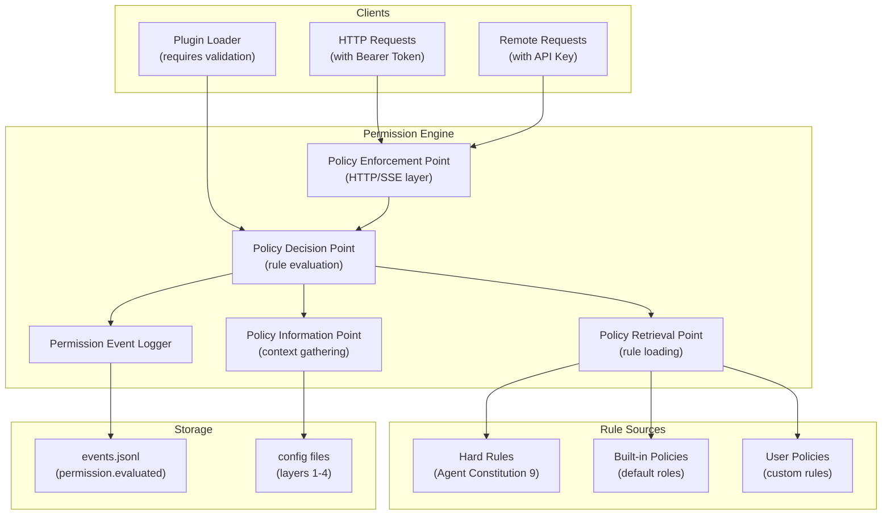

# Design Document: Permission Engine

## Overview

This design document specifies the implementation of the **Permission Engine** module for SpecForge V6. The Permission Engine is the central authorization component that enforces the three-layer permission model and ensures all permission decisions are traceable.

**Parent Specification**: This design inherits architectural decisions from **[v6-architecture-overview](../v6-architecture-overview/design.md)**.

**Scope**: **P0** - Required for V6.0 release.

## Architecture

### Permission Engine Component Diagram



### Three-Layer Permission Model

The Permission Engine implements a three-layer model with strict precedence:

1. **Hard Rules (Layer 1)**: Agent Constitution 9 bottom lines, hardcoded in TypeScript constants, immutable.
2. **Built-in Policies (Layer 2)**: Default agent role permissions shipped with SpecForge (JSON/YAML configs).
3. **User Policies (Layer 3)**: User/project custom rules (JSON/YAML configs).

**Rule Merging Order**:
1. Hard rules always win (cannot be overridden)
2. More specific rules win over more general rules
3. At same specificity, deny wins over allow

### Key Components

#### Policy Enforcement Point (PEP)
- HTTP/SSE request authentication (Bearer Token validation)
- Remote access mode enforcement (API keys, IP whitelists)
- Request context extraction (actor, action, resource)

#### Policy Decision Point (PDP)
- Rule evaluation engine
- Three-layer rule merging
- Decision logging with complete context

#### Policy Information Point (PIP)
- Gathers runtime context for rule evaluation
- Accesses session registry, project state, etc.

#### Policy Retrieval Point (PRP)
- Loads rules from three layers
- Detects hard rule conflicts
- Supports hot-reloading of user policies

#### Permission Event Logger
- Writes `permission.evaluated` events to events.jsonl
- Ensures all six fields are present: actor, action, resource, matched_rule, rule_layer, reason

### Remote Access Security

When remote access mode is enabled (`bind=0.0.0.0 --require-auth`):

1. **Long-term API Keys**: Distinct from local Bearer Tokens, stored in `~/.specforge/config/api-keys.json`
2. **IP Whitelists**: Configurable per-key IP restrictions
3. **Two-Step Confirmation**: Required for sensitive operations (delete, permission changes, config reset)
4. **User Binding**: OpenClaw requests must bind to registered SpecForge user identities

### Plugin Permission Gate

Plugin loading involves two permission checks:

1. **Declared Requirements**: Plugin manifest's `requires` field must be subset of granted permissions
2. **Static API Checks**: Source code scanning for prohibited APIs (direct exec, fs out-of-bounds, undeclared network)

## Data Models

### Permission Decision Event

```typescript
interface PermissionDecisionEvent {
  eventId: string;           // UUIDv7
  ts: number;               // monotonic timestamp
  projectId: string;        // non-empty project identifier
  action: "permission.evaluated";
  payload: {
    actor: {
      sessionId?: string;
      agentRole?: string;
      workflowRole?: string;
      remoteIdentity?: string;  // for OpenClaw requests
    };
    action: string;         // e.g., "tool.execute", "workflow.create"
    resource: {
      type: string;         // e.g., "tool", "workItem", "file"
      id?: string;          // resource identifier if applicable
      path?: string;        // file path if applicable
    };
    decision: "allow" | "deny";
    matched_rule: string;   // rule identifier
    rule_layer: "hard" | "builtin" | "user";
    reason: string;         // human-readable explanation
    context: Record<string, unknown>;  // additional evaluation context
  };
}
```

### Hard Rule Configuration

```typescript
// Hardcoded in packages/permission-engine/src/hard-rules.ts
const AGENT_CONSTITUTION_RULES = [
  {
    id: "hard-001",
    description: "Agent must not bypass Gate checks",
    condition: (actor, action, resource) => /* ... */,
    effect: "deny"
  },
  // ... 8 more rules
] as const;
```

### Built-in Policy Schema

```yaml
# ~/.specforge/config/builtin-policies.yaml
version: "1.0"
policies:
  - id: "builtin-reviewer-readonly"
    description: "Reviewer agent can only read, not modify"
    actorPattern: "agentRole:sf-reviewer"
    actionPattern: "action:^tool\\.(execute|write)"
    resourcePattern: "resourceType:*"
    effect: "deny"
    layer: "builtin"
```

## Error Handling

### Permission-Specific Errors

| Error Code | HTTP Status | Scenario | Event Action |
|---|---|---|---|
| `permission_denied` | 403 | PDP evaluates to deny | `permission.evaluated` (decision: deny) |
| `authentication_required` | 401 | Missing/invalid Bearer Token | `permission.denied` (layer: auth) |
| `remote_access_denied` | 401 | Remote mode: missing API key/IP | `permission.denied` (layer: remote) |
| `hard_rule_conflict` | N/A | Config attempts to relax hard rule | `config.hard_rule_conflict` |
| `plugin_permission_denied` | N/A | Plugin requires not granted | `plugin.load_denied` |
| `plugin_static_check_failed` | N/A | Plugin source contains prohibited API | `plugin.load_denied` |

### Conflict Resolution

1. **Startup Conflicts**: Configuration attempting to relax hard rules is rejected, Daemon starts with hard rules intact
2. **Hot-load Conflicts**: New conflicts are reported but Daemon continues with already-loaded configuration
3. **Rule Priority Conflicts**: More specific rules win; at same specificity, deny wins

## Testing Strategy

### Property-Based Tests

This design must implement the following property-based tests corresponding to inherited Correctness Properties:

#### Property 3: Hard Rule Immutability
- Generate random configuration attempts to relax each hard rule
- Assert Permission Engine rejects all attempts
- Verify hard rules remain unchanged

#### Property 10: Permission Decision Traceability  
- Generate random (actor, action, resource) tuples
- For each permission decision, verify complete event logging
- Assert events contain all six required fields

#### Property 16: Bearer Token Enforcement
- Generate HTTP requests with valid/invalid/missing tokens
- Assert 401 responses for invalid/missing tokens
- Verify `permission.denied` events are logged

#### Property 26: Remote Access Guard
- Generate remote mode requests with/without API keys, IP restrictions
- Assert enforcement of API keys, IP whitelists, two-step confirmation
- Verify sensitive operations require extra confirmation

#### Property 28: Plugin Permission Gate
- Generate plugin manifests with various `requires` sets
- Generate plugin source code with/without prohibited APIs
- Assert loading rejection for unauthorized requirements and prohibited APIs

### Unit Tests

1. Three-layer rule merging tests
2. Hard rule conflict detection tests
3. Permission event logging completeness tests
4. Remote access security tests (API key validation, IP whitelisting)
5. Plugin permission validation tests
6. Configuration hot-reloading tests

### Integration Tests

1. End-to-end permission flow with Daemon Core
2. Remote access integration with OpenClaw
3. Plugin loading integration with Plugin Loader
4. Cross-module permission checks (Tool execution, Workflow operations)
5. Crash recovery of permission state

## Implementation Notes

- All permission decisions must be synchronous for deterministic event ordering
- Event logging must happen before returning decision to caller (WAL semantics)
- Hard rules are TypeScript constants, not config files, to prevent accidental modification
- Built-in policies are read-only at runtime (can be overridden by user policies)
- User policies support hot-reloading without Daemon restart
- Permission Engine must not have external dependencies beyond Daemon Core interfaces
