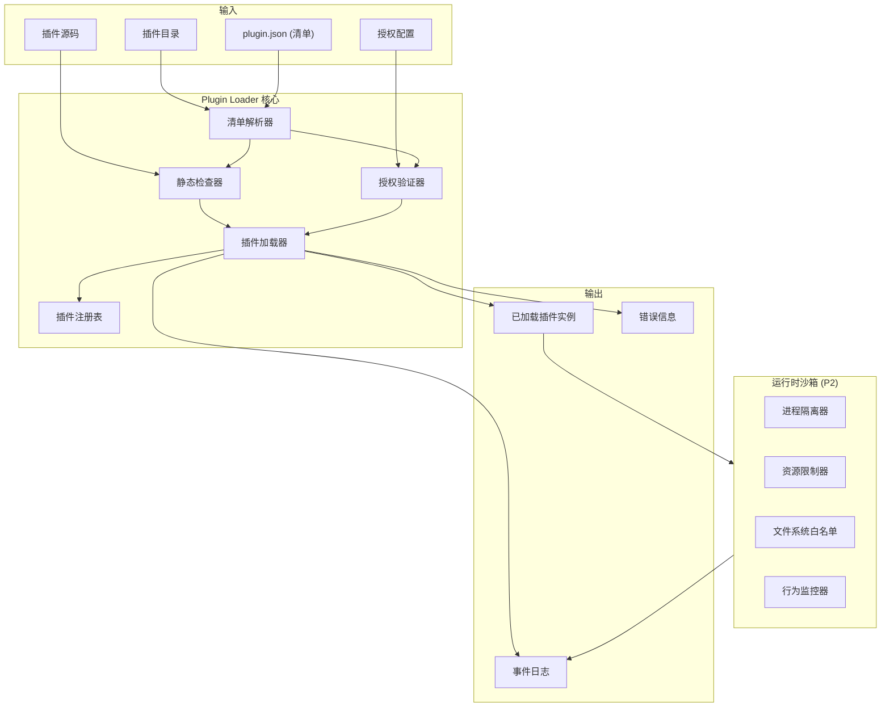
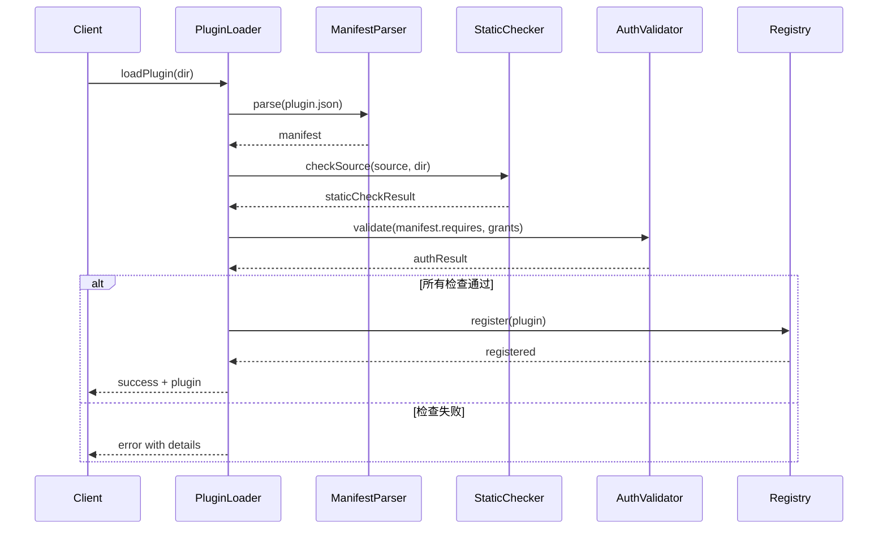

# Design Document

## Overview

### 本文档的性质

本设计文档定义 Plugin Loader 模块的架构与实现方案，承接 V6 架构概览 spec 中的 **Property 28: Plugin Permission Gate**。本模块负责：

1. **P0（V6.0）**：插件静态权限检查与加载
2. **P2（V6.x）**：插件运行时沙箱隔离

### 设计原则

1. **显式声明优于隐式推断**：插件必须显式声明所需权限，系统不自动推断。
2. **编译时检查优于运行时防护**：尽可能在加载时发现问题，减少运行时开销。
3. **最小权限原则**：插件仅获得明确授权的权限，默认拒绝所有未声明权限。
4. **可观测性优先**：所有加载决策记录到事件日志，便于审计与调试。

### 架构位置

Plugin Loader 位于 Daemon 的"扩展加载器"层，与 Skill Loader、Tool Registry、Workflow Loader、Gate Registry 并列：

```
Daemon Core
├─ Session Registry
├─ Permission Engine
├─ Event Bus
├─ Workflow Runtime
└─ 扩展加载器层
   ├─ Skill Loader
   ├─ Tool Registry
   ├─ Workflow Loader
   ├─ Gate Registry
   └─ Plugin Loader (本模块)
```

## Architecture

### 1. 组件视图



### 2. 数据流

1. **发现阶段**：扫描插件目录，发现 `plugin.json` 清单文件。
2. **解析阶段**：解析清单，验证格式与 `schema_version`。
3. **检查阶段**：
   - 静态检查：分析源码，检测禁止的 API 调用。
   - 授权验证：对比 `requires` 与当前 `grants`。
4. **加载阶段**：
   - P0：直接加载到 Daemon 进程（信任模式）。
   - P2：通过沙箱加载到隔离进程。
5. **注册阶段**：将加载的插件注册到插件注册表，供其他组件调用。

### 3. 关键接口

#### PluginManifest (清单)

```typescript
interface PluginManifest {
  schema_version: "1.0";
  id: string;                    // 插件唯一标识符
  version: string;              // 语义化版本号
  requires: Array<              // 权限声明
    "filesystem.read" |
    "filesystem.write" |
    "network" |
    "child_process" |
    "env.read"
  >;
  entry: string;                // 入口文件路径（相对插件目录）
  description?: string;         // 可选：插件描述
  author?: string;              // 可选：作者信息
  compatible?: string;          // 可选：兼容的 SpecForge 版本范围
  dependencies?: Array<{        // 可选：依赖声明
    type: "plugin" | "library" | "tool";
    id: string;
    version?: string;
  }>;
}
```

#### PluginLoader (加载器)

```typescript
interface PluginLoader {
  // 加载单个插件
  loadPlugin(dir: string): Promise<LoadResult>;
  
  // 批量加载目录下所有插件
  loadPluginsFromDir(dir: string): Promise<BatchLoadResult>;
  
  // 获取已加载插件
  getPlugin(id: string): LoadedPlugin | null;
  
  // 重新加载插件（热加载）
  reloadPlugin(id: string): Promise<LoadResult>;
  
  // 卸载插件
  unloadPlugin(id: string): Promise<void>;
}

interface LoadResult {
  success: boolean;
  plugin?: LoadedPlugin;
  error?: {
    code: "MANIFEST_ERROR" | "STATIC_CHECK_FAILED" | "AUTH_DENIED" | "DEPENDENCY_MISSING";
    message: string;
    details?: unknown;
  };
}
```

#### StaticChecker (静态检查器)

```typescript
interface StaticChecker {
  // 检查源码中的禁止 API
  checkSource(source: string, filePath: string): StaticCheckResult;
  
  // 检查文件系统访问路径
  checkFSPath(path: string, baseDir: string): boolean;  // true=安全, false=越界
}

interface StaticCheckResult {
  passed: boolean;
  violations?: Array<{
    line: number;
    column: number;
    api: string;
    message: string;
  }>;
}
```

#### AuthValidator (授权验证器)

```typescript
interface AuthValidator {
  // 验证权限声明
  validate(requires: string[], grants: string[]): AuthValidationResult;
  
  // 获取当前授权集合
  getGrants(): string[];
  
  // 更新授权集合
  updateGrants(grants: string[], source: "user" | "project"): Promise<void>;
}

interface AuthValidationResult {
  authorized: boolean;
  missing?: string[];  // 未授权的权限
}
```

### 4. 事件设计

所有插件加载操作产生事件，记录到 `events.jsonl`：

```typescript
// 插件加载事件
interface PluginLoadEvent {
  eventId: string;
  ts: number;
  category: "plugin";
  action: "load" | "reload" | "unload";
  pluginId: string;
  success: boolean;
  reason?: string;  // 失败原因
  requires?: string[];
  grants?: string[];
  staticCheckPassed?: boolean;
}
```

## Components and Interfaces

### 1. ManifestParser

**职责**：解析和验证插件清单文件。

**实现要点**：
- 支持 `schema_version` 自动迁移
- 验证必需字段存在且类型正确
- 支持清单文件热重载

**接口**：
```typescript
interface ManifestParser {
  parse(filePath: string): Promise<PluginManifest>;
  validate(manifest: PluginManifest): ValidationResult;
  migrate(manifest: any, fromVersion: string, toVersion: string): PluginManifest;
}
```

### 2. StaticChecker (P0 核心)

**职责**：静态分析插件源码，检测禁止的 API 调用。

**禁止的 API 模式**：
1. **直接子进程执行**：
   - `child_process.exec` / `execSync`
   - `child_process.spawn`（未声明 `child_process` 权限时）
   - `require('child_process')`（未声明权限时）

2. **文件系统越界访问**：
   - 路径包含 `../` 逃逸出插件目录
   - 访问系统关键路径（如 `/etc/`, `C:\Windows\`）

3. **未声明的网络访问**：
   - `http.request` / `https.request`
   - `fetch`（浏览器/Node.js）
   - `require('http')` / `require('https')`（未声明 `network` 权限时）

**实现策略**：
- 使用 AST（抽象语法树）分析 TypeScript/JavaScript 源码
- 预定义禁止的 API 模式规则
- 支持插件目录白名单检查

### 3. AuthValidator

**职责**：管理授权集合，验证插件权限声明。

**授权来源**：
1. **用户级授权**：`~/.specforge/config/plugin-grants.json`
2. **项目级授权**：`<project>/.specforge/config/plugin-grants.json`
3. **运行时授权**：CLI/API 动态更新

**合并规则**：项目级覆盖用户级，运行时覆盖持久化配置。

**接口**：
```typescript
interface GrantsConfig {
  schema_version: "1.0";
  grants: string[];  // 当前授权的权限集合
  plugins?: Record<string, string[]>;  // 按插件细化的授权
}
```

### 4. PluginLoader 核心

**职责**：协调各组件，完成插件加载流程。

**加载流程**：


### 5. PluginRegistry

**职责**：管理已加载的插件实例。

**功能**：
- 插件实例存储与检索
- 插件生命周期管理
- 插件依赖关系解析
- 插件状态监控

**接口**：
```typescript
interface PluginRegistry {
  register(plugin: LoadedPlugin): void;
  get(id: string): LoadedPlugin | null;
  list(): LoadedPlugin[];
  hasDependency(pluginId: string, dependencyId: string): boolean;
  resolveDependencies(pluginId: string): string[];  // 返回依赖链
}
```

### 6. PluginSandbox (P2)

**职责**：运行时隔离与资源限制。

**隔离策略**：
1. **进程隔离**：每个插件在独立子进程中运行
2. **通信机制**：IPC（进程间通信）或 RPC（远程过程调用）
3. **资源限制**：
   - CPU 时间配额
   - 内存使用上限
   - 执行时间限制
   - 文件描述符限制
4. **文件系统白名单**：
   - 插件目录（读写）
   - 临时目录（读写）
   - 只读共享目录（如配置目录）
5. **网络限制**：
   - 仅允许声明了 `network` 权限的插件访问网络
   - 可配置允许的域名/IP 范围

**接口**：
```typescript
interface PluginSandbox {
  createSandbox(plugin: LoadedPlugin, options: SandboxOptions): SandboxHandle;
  execute(handle: SandboxHandle, method: string, args: any[]): Promise<any>;
  destroySandbox(handle: SandboxHandle): Promise<void>;
}

interface SandboxOptions {
  memoryLimitMB: number;
  cpuTimeLimitSec: number;
  timeoutMs: number;
  fsWhitelist: string[];
  networkWhitelist?: string[];
}
```

## Data Models

### 1. PluginManifest (清单文件)

```typescript
// plugin.json
{
  "schema_version": "1.0",
  "id": "specforge-github-integration",
  "version": "1.0.0",
  "requires": ["network", "filesystem.read"],
  "entry": "./dist/index.js",
  "description": "GitHub API integration for SpecForge",
  "author": "SpecForge Team",
  "compatible": "^6.0.0",
  "dependencies": [
    {
      "type": "library",
      "id": "octokit",
      "version": "^3.0.0"
    }
  ]
}
```

### 2. GrantsConfig (授权配置)

```typescript
// ~/.specforge/config/plugin-grants.json
{
  "schema_version": "1.0",
  "grants": ["filesystem.read", "env.read"],
  "plugins": {
    "specforge-github-integration": ["network", "filesystem.read"]
  }
}
```

### 3. LoadedPlugin (已加载插件)

```typescript
interface LoadedPlugin {
  id: string;
  version: string;
  manifest: PluginManifest;
  entryPath: string;
  module: any;  // 加载的模块对象
  sandboxHandle?: SandboxHandle;  // P2: 沙箱句柄
  loadedAt: number;
  lastUsedAt: number;
  stats: {
    loadCount: number;
    errorCount: number;
    totalExecutionTimeMs: number;
  };
}
```

### 4. StaticCheckRule (静态检查规则)

```typescript
interface StaticCheckRule {
  id: string;
  pattern: string;  // AST 匹配模式或正则表达式
  message: string;
  severity: "error" | "warning";
  requiredPermission?: string;  // 需要什么权限才能允许
}
```

## Correctness Properties

### Property PL-1: 权限声明验证

*For all* 插件 p 与当前授权集合 grants，若 `p.manifest.requires \ grants ≠ ∅`（即存在未被授权的声明），THEN PluginLoader 拒绝加载 p。

**Validates: Requirements 1.4**

### Property PL-2: 静态检查一致性

*For all* 插件源码 s，若 s 包含禁止的敏感 API 调用（如未声明 `child_process` 权限时的 `child_process.exec`），THEN StaticChecker 检测到违规并导致加载拒绝。

**Validates: Requirements 2.3**

### Property PL-3: 最小权限原则

*For all* 已加载插件 p，p 在运行时仅能访问其 `manifest.requires` 中声明且被授权的权限；未声明的权限默认拒绝。

**Validates: Requirements 1, 2**

### Property PL-4: 事件可追溯性

*For all* 插件加载操作（成功或失败），THEN PluginLoader 产生一条包含完整上下文的事件记录到 events.jsonl。

**Validates: Requirements 6.2**

### Property PL-5: 热加载一致性

*For all* 插件 p 的热重载操作，若 p 的清单或源码发生变化但通过所有检查，THEN 新版本替换旧版本且不影响其他插件。

**Validates: Requirements 7**

### Property PL-6: 依赖解析正确性

*For all* 插件 p 声明依赖 d，若 d 不满足（未安装、版本不匹配），THEN PluginLoader 拒绝加载 p 并提示缺失依赖。

**Validates: Requirements 8.4**

### Property PL-7: 沙箱隔离性 (P2)

*For all* 在沙箱中执行的插件 p，p 不能访问沙箱外部的文件系统、进程或网络资源（除非明确授权）。

**Validates: Requirements 5**

### Property PL-8: 资源限制有效性 (P2)

*For all* 在沙箱中执行的插件 p，若 p 超过配置的资源限制（内存、CPU、时间），THEN Sandbox 终止 p 的执行。

**Validates: Requirements 5.2**

## 设计决策 (ADR)

### ADR-PL-001: 静态检查 vs 运行时监控

**决策**：采用编译时/加载时静态检查为主，运行时监控为辅（P2）。

**理由**：
- 静态检查能提前发现问题，避免运行时错误
- 减少运行时开销，提高性能
- 符合"程序硬控优先于 Prompt 控制"原则

**备选方案**：纯运行时监控（发现违规时终止）—— 响应慢，可能已造成损害。

### ADR-PL-002: 权限粒度设计

**决策**：采用粗粒度权限（`filesystem.read`、`network` 等），而非细粒度（`fs.readFile`、`http.get`）。

**理由**：
- 简化权限模型，降低使用复杂度
- 粗粒度已能满足 V6.0 安全需求
- 未来可通过子权限扩展细粒度控制

**备选方案**：细粒度权限模型 —— 过于复杂，维护成本高。

### ADR-PL-003: 沙箱实现策略

**决策**：P2 采用子进程隔离 + 资源限制，而非 VM 或容器。

**理由**：
- 子进程隔离在 Node.js/Bun 生态成熟
- 资源限制 API 可用（如 `resource-limits`）
- 比容器轻量，比 VM 简单

**备选方案**：
1. Docker 容器 —— 重量级，需要 Docker 运行时
2. WebAssembly 沙箱 —— 生态不成熟，工具链复杂

### ADR-PL-004: 热加载策略

**决策**：支持插件热加载，但保持旧实例直到新实例就绪。

**理由**：
- 提高开发体验，无需重启 Daemon
- 平滑过渡，避免服务中断
- 符合 Daemon 长生命周期设计

**备选方案**：不支持热加载 —— 开发体验��，运维不便。

### ADR-PL-005: 错误处理策略

**决策**：详细错误信息 + 事件日志，但不暴露内部细节。

**理由**：
- 用户需要知道失败原因以便修复
- 运维需要日志进行故障排查
- 安全考虑不暴露系统内部信息

**备选方案**：简略错误信息 —— 调试困难，用户体验差。

## 与父 spec 的集成点

### 1. 与 Permission Engine 集成

Plugin Loader 依赖 Permission Engine 的授权管理框架，但保持独立决策：
- Permission Engine 管理全局权限策略
- Plugin Loader 管理插件特定授权

### 2. 与 Event Bus 集成

所有插件加载事件通过 Event Bus 广播，确保可观测性：
```typescript
// 事件示例
EventBus.emit({
  category: "plugin",
  action: "load",
  pluginId: "specforge-github-integration",
  success: true,
  requires: ["network", "filesystem.read"],
  grants: ["network", "filesystem.read"]
});
```

### 3. 与 Configuration Subsystem 集成

授权配置遵循四层配置模型：
- Layer 1: 内置默认授权（空集合）
- Layer 2: 用户级授权（`~/.specforge/`）
- Layer 3: 项目级授权（`<project>/.specforge/`）
- Layer 4: 运行时授权（CLI/API）

### 4. 与 Tool Registry 集成

插件可能暴露为 Tool，需要注册到 Tool Registry：
```typescript
// 插件可声明暴露的 tools
interface PluginTool {
  id: string;
  displayName: string;
  execute: (args: any) => Promise<any>;
}

// Plugin Loader 自动注册到 Tool Registry
```

## 测试策略

### 单元测试
- ManifestParser 解析与验证
- StaticChecker API 检测
- AuthValidator 权限验证

### 集成测试
- 完整加载流程（成功/失败场景）
- 热加载功能
- 多插件依赖解析

### Property-Based Tests
- Property PL-1 到 PL-8 的可执行验证
- 随机生成插件清单与源码进行测试

### 性能测试
- 加载时间 < 100ms（P0 要求）
- 内存使用监控
- 并发加载测试

## 迁移与兼容性

### 从 V5 迁移
V5 无插件系统，无需迁移。

### 未来版本兼容性
通过 `schema_version` 字段支持清单格式演进，Migration Subsystem 提供自动迁移。

## 安全考虑

1. **清单文件验证**：防止清单文件篡改
2. **源码完整性**：静态检查确保源码安全
3. **权限最小化**：默认拒绝，显式授权
4. **沙箱隔离**：P2 提供运行时防护
5. **审计日志**：所有操作可追溯

## 性能考虑

1. **静态检查优化**：AST 分析缓存结果
2. **并行加载**：支持多插件并行加载
3. **懒加载**：插件按需加载，非启动时全量加载
4. **资源复用**：沙箱进程池（P2）