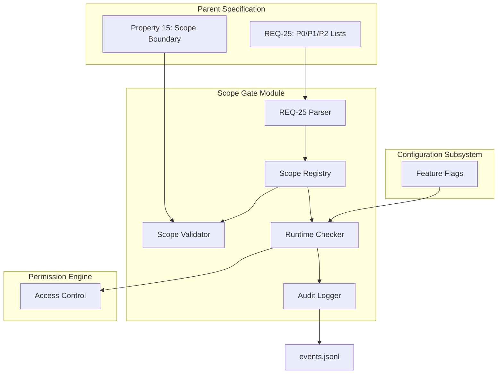

# Design Document: Scope Gate

## Overview

The Scope Gate is a **P0 enforcement module** within the SpecForge V6 architecture. Its primary responsibility is to **enforce the P0/P1/P2 scope boundaries** defined in REQ-25 of the parent V6 architecture specification. The Scope Gate ensures that:

1. Features marked as P1 or P2 are **disabled by default** in V6.0 release branches
2. Runtime attempts to use P1/P2 capabilities return appropriate "unavailable" errors
3. Scope boundaries can only be bypassed through **explicit runtime feature flags**
4. All scope boundary violations are **logged and auditable**

### Design Principles

1. **Static First, Runtime Second**: Scope validation should happen at build/compile time where possible, with runtime checks as a safety net.
2. **Explicit Over Implicit**: Enabling P1/P2 capabilities requires explicit user action, not implicit assumptions.
3. **Audit Everything**: All scope boundary decisions and violations must be logged for observability and compliance.
4. **Fail Safe**: Scope violations should fail with clear, actionable error messages, not silent degradation.

### Architecture Context

The Scope Gate sits between the **Configuration Subsystem** (which manages feature flags) and the **Permission Engine** (which enforces access controls). It provides an additional layer of **release boundary enforcement** that complements existing permission controls.



## Components and Interfaces

### 1. Scope Registry

The Scope Registry maintains the authoritative mapping of capabilities to their scope tags (P0/P1/P2) as defined in REQ-25.

```typescript
interface ScopeRegistry {
  // Load scope definitions from REQ-25 of parent spec
  loadFromParentSpec(parentSpecPath: string): Promise<void>;
  
  // Register a capability with its scope tag
  registerCapability(capability: CapabilityDefinition): void;
  
  // Check if a capability is available in current scope
  isAvailable(capabilityId: string, context: ScopeContext): AvailabilityResult;
  
  // Get all capabilities with a specific scope tag
  getCapabilitiesByScope(scopeTag: ScopeTag): CapabilityDefinition[];
  
  // Validate scope dependencies (no P0 depending on P1/P2)
  validateDependencies(): ValidationResult[];
}

type ScopeTag = "p0" | "p1" | "p2";

interface CapabilityDefinition {
  id: string;
  displayName: string;
  scopeTag: ScopeTag;
  entryPoints: string[];  // Function/method names that trigger this capability
  dependencies: string[]; // IDs of other capabilities this depends on
  description: string;
}

interface ScopeContext {
  releaseBranch: "v6.0" | "v6.1" | "v6.x" | "development";
  featureFlags: Set<string>;  // Enabled feature flags
  environment: "production" | "staging" | "development" | "test";
}

interface AvailabilityResult {
  available: boolean;
  reason?: string;
  requiredFlag?: string;  // Feature flag needed to enable
}
```

### 2. REQ-25 Parser

Parses the REQ-25 section from the parent specification's requirements.md to extract P0/P1/P2 capability lists.

```typescript
interface Req25Parser {
  // Parse REQ-25 from markdown
  parseReq25(markdown: string): Req25Data;
  
  // Extract capability definitions from list items
  extractCapabilities(listItems: string[], scopeTag: ScopeTag): CapabilityDefinition[];
  
  // Normalize capability IDs (consistent naming)
  normalizeCapabilityId(rawName: string): string;
}

interface Req25Data {
  p0: CapabilityDefinition[];
  p1: CapabilityDefinition[];
  p2: CapabilityDefinition[];
  lastUpdated: Date;
  sourceHash: string;  // For change detection
}
```

### 3. Scope Validator

Performs static validation of scope boundaries across the codebase.

```typescript
interface ScopeValidator {
  // Static analysis: check for P0 code depending on P1/P2
  validateCodeDependencies(codebasePath: string): ValidationResult[];
  
  // Validate spec .config.kiro files have correct scopeTag
  validateSpecScopeTags(specsPath: string): ValidationResult[];
  
  // Check that runtime feature flags are properly guarded
  validateFeatureFlagGuards(codebasePath: string): ValidationResult[];
}

interface ValidationResult {
  type: "error" | "warning" | "info";
  code: ScopeValidationCode;
  message: string;
  location?: SourceLocation;
  context?: Record<string, unknown>;
}

type ScopeValidationCode = 
  | "p0_depends_on_p1"
  | "p0_depends_on_p2"
  | "missing_scope_tag"
  | "incorrect_scope_tag"
  | "missing_feature_flag_guard"
  | "unregistered_capability"
  | "scope_tag_mismatch";
```

### 4. Runtime Scope Checker

Enforces scope boundaries at runtime.

```typescript
interface RuntimeScopeChecker {
  // Decorator/guard for P1/P2 capability entry points
  guardCapability(capabilityId: string): MethodDecorator;
  
  // Manual check (for non-decorator contexts)
  checkCapability(capabilityId: string, context: ScopeContext): void;
  
  // Batch check multiple capabilities
  checkCapabilities(capabilityIds: string[], context: ScopeContext): CheckResult[];
  
  // Get current scope context
  getCurrentContext(): ScopeContext;
}

interface CheckResult {
  capabilityId: string;
  available: boolean;
  error?: ScopeError;
}

class ScopeError extends Error {
  code: "SCOPE_BOUNDARY_VIOLATION" | "FEATURE_FLAG_REQUIRED" | "CAPABILITY_UNAVAILABLE";
  capabilityId: string;
  requiredFlag?: string;
  scopeTag: ScopeTag;
}
```

### 5. Audit Logger

Logs all scope-related decisions and violations to events.jsonl.

```typescript
interface AuditLogger {
  // Log scope boundary violation attempt
  logViolationAttempt(violation: ScopeViolationAttempt): Promise<void>;
  
  // Log feature flag enablement/disablement
  logFeatureFlagChange(change: FeatureFlagChange): Promise<void>;
  
  // Log scope validation results
  logValidationResults(results: ValidationResult[]): Promise<void>;
  
  // Query scope-related events
  queryScopeEvents(query: ScopeEventQuery): Promise<ScopeEvent[]>;
}

interface ScopeViolationAttempt {
  capabilityId: string;
  scopeTag: ScopeTag;
  context: ScopeContext;
  stackTrace?: string;
  userId?: string;
  sessionId?: string;
  timestamp: Date;
}

interface FeatureFlagChange {
  flag: string;
  oldValue: boolean;
  newValue: boolean;
  reason: string;
  userId?: string;
  timestamp: Date;
}

interface ScopeEvent {
  eventId: string;
  type: "scope_violation" | "feature_flag_change" | "scope_validation";
  payload: unknown;
  timestamp: Date;
  actor?: AgentIdentity;
}
```

## Data Models

### 1. Scope Configuration

```typescript
interface ScopeConfiguration {
  schema_version: "1.0";
  
  // Enforcement mode
  enforcementMode: "strict" | "warning" | "disabled";
  
  // Default scope context
  defaultContext: {
    releaseBranch: "v6.0" | "v6.1" | "v6.x" | "development";
    environment: "production" | "staging" | "development" | "test";
  };
  
  // Feature flag mappings
  featureFlags: Record<string, {
    description: string;
    default: boolean;
    capabilities: string[];  // Capability IDs this flag enables
    environments: string[];  // Where this flag can be set
  }>;
  
  // Overrides (for testing/development)
  overrides: Array<{
    capabilityId: string;
    available: boolean;
    reason: string;
    expiresAt?: Date;
  }>;
}
```

### 2. Scope Validation Report

```typescript
interface ScopeValidationReport {
  schema_version: "1.0";
  generatedAt: Date;
  parentSpecHash: string;
  
  // Summary
  summary: {
    totalCapabilities: number;
    p0: number;
    p1: number;
    p2: number;
    violations: number;
    warnings: number;
  };
  
  // Detailed results
  results: ValidationResult[];
  
  // Recommendations
  recommendations: string[];
  
  // Metadata
  metadata: {
    toolVersion: string;
    runtimeContext: ScopeContext;
    durationMs: number;
  };
}
```

## Design Decisions (ADR)

### ADR-SG-001: Static Analysis vs Runtime Checks

**Decision**: Implement both static analysis (build-time) and runtime checks, with static analysis as the primary enforcement mechanism.

**Rationale**:
- Static analysis catches issues early in development cycle
- Runtime checks provide safety net for dynamic code paths
- Combined approach ensures comprehensive coverage
- Static analysis can be integrated into CI/CD pipelines

**Alternatives Considered**:
- Runtime-only: Simpler but misses build-time issues
- Static-only: May miss dynamic code paths

### ADR-SG-002: Feature Flag Design

**Decision**: Use a hierarchical feature flag system with environment-specific defaults.

**Rationale**:
- Allows different defaults for production vs development
- Supports gradual rollout of P1/P2 capabilities
- Provides audit trail for flag changes
- Integrates with existing Configuration Subsystem

**Flag Hierarchy**:
1. Environment-specific defaults (e.g., P1 disabled in production)
2. User-level configuration overrides
3. Runtime command-line overrides

### ADR-SG-003: Error Handling Strategy

**Decision**: Use structured errors with consistent error codes for scope violations.

**Rationale**:
- Enables programmatic handling of scope violations
- Supports observability and monitoring
- Provides clear user feedback
- Aligns with parent spec's error handling conventions

**Error Codes**:
- `SCOPE_BOUNDARY_VIOLATION`: Attempt to use P1/P2 in V6.0
- `FEATURE_FLAG_REQUIRED`: Capability requires specific flag
- `CAPABILITY_UNAVAILABLE`: General unavailability

### ADR-SG-004: Integration with Permission Engine

**Decision**: Scope Gate runs before Permission Engine checks.

**Rationale**:
- Scope boundaries are release-level constraints, not user-level permissions
- Even authorized users shouldn't bypass release boundaries
- Clear separation of concerns: release planning vs access control
- Prevents permission overrides from circumventing scope enforcement

**Flow**: Request → Scope Gate → Permission Engine → Execution

## Testing Strategy

### Property-Based Tests

#### Property 15: Scope Boundary Enforcement

**Test Implementation**:
```typescript
test("Property 15: P1/P2 capabilities disabled by default in V6.0", () => {
  return fc.assert(
    fc.property(
      fc.constantFrom(...p1p2Capabilities),
      fc.context(),
      (capability, ctx) => {
        // Arrange: V6.0 context, no feature flags
        const scopeContext: ScopeContext = {
          releaseBranch: "v6.0",
          featureFlags: new Set(),
          environment: "production"
        };
        
        // Act: Check availability
        const result = scopeRegistry.isAvailable(capability.id, scopeContext);
        
        // Assert: Should be unavailable
        expect(result.available).toBe(false);
        expect(result.reason).toContain("P1/P2 capability");
        
        ctx.log(`Verified ${capability.id} unavailable in V6.0`);
        return true;
      }
    ),
    { numRuns: 100 }
  );
});
```

**Additional PBTs**:
1. **Feature Flag Enablement**: When feature flag is set, P1/P2 capabilities become available
2. **Scope Tag Consistency**: All capabilities have consistent scope tags across registry
3. **Dependency Validation**: No P0 capabilities depend on P1/P2
4. **Error Consistency**: Same capability always produces same error message

### Unit Tests

1. **REQ-25 Parser Tests**
   - Parse valid REQ-25 markdown
   - Handle malformed REQ-25 sections
   - Extract capability definitions correctly
   - Normalize capability IDs consistently

2. **Scope Registry Tests**
   - Register and retrieve capabilities
   - Availability checks with different contexts
   - Dependency validation
   - Change detection (when REQ-25 updates)

3. **Runtime Checker Tests**
   - Guard decorator functionality
   - Manual check calls
   - Error generation and formatting
   - Context management

4. **Audit Logger Tests**
   - Event logging and retrieval
   - Violation attempt logging
   - Feature flag change logging
   - Query functionality

### Integration Tests

1. **Parent Spec Integration**
   - Load REQ-25 from actual parent spec
   - Validate against parent spec's artifacts
   - Integration with `sf_v6_arch_check` tool

2. **Configuration Subsystem Integration**
   - Feature flag synchronization
   - Environment-specific defaults
   - Configuration hot reload

3. **Permission Engine Integration**
   - Order of execution (Scope Gate first)
   - Combined error scenarios
   - Audit event correlation

4. **End-to-End Scenarios**
   - V6.0 release branch simulation
   - P1 capability enablement workflow
   - Scope violation detection and reporting
   - Audit trail completeness

## Implementation Notes

### V6.0 Constraints

As a **P0** module, the Scope Gate must be fully functional in V6.0. However, it primarily enforces constraints on P1/P2 capabilities, which by definition are not implemented in V6.0. Therefore:

1. The Scope Gate's **enforcement mechanisms** are P0
2. The **capabilities it regulates** may be P1/P2
3. The module must handle the case where regulated capabilities don't exist yet

### Error Code Stability

Error codes defined by the Scope Gate become part of the **SpecForge Runtime Contract**. Once defined in V6.0, they cannot change semantics in minor versions.

### Performance Considerations

- Scope checks should be fast (microseconds)
- Registry loading happens once at startup
- Static analysis can be cached between runs
- Audit logging should be asynchronous

### Security Considerations

- Feature flags should not be guessable
- Audit logs must be tamper-evident
- Scope overrides require appropriate permissions
- Integration with Permission Engine prevents bypass

## Correctness Properties

### Derived Properties (from Parent Spec)

#### Property 15: Scope Boundary (Direct Implementation)

*For all* capabilities f marked as P1 or P2 in REQ-25, in V6.0 release branches with default configuration, calls to f's entry points must return errors with code `SCOPE_BOUNDARY_VIOLATION` or `CAPABILITY_UNAVAILABLE`.

**Implementation Verification**:
- Static analysis confirms P1/P2 entry points have scope guards
- Runtime tests verify error generation
- Audit logs confirm violation attempts are recorded

### Additional Properties (Module-Specific)

#### Property SG-1: Consistent Scope Tagging

*For all* capabilities c registered in the Scope Registry, c's scope tag must match its classification in REQ-25 of the parent specification.

#### Property SG-2: Feature Flag Determinism

*For all* capability availability checks with identical context (release branch, feature flags, environment), the result must be identical.

#### Property SG-3: Audit Trail Completeness

*For all* scope boundary violation attempts, an audit event must be recorded in events.jsonl within 1 second of the attempt.

#### Property SG-4: No Silent Failures

*For all* scope boundary violations, the error message must clearly indicate:
- Which capability was attempted
- Why it's unavailable (P1/P2 in V6.0)
- How to enable it (if applicable)

## Migration Considerations

The Scope Gate itself is a V6.0 feature, so no migration from earlier versions is needed. However, it must support:

1. **Future Scope Changes**: When capabilities move from P1→P0 or P2→P1
2. **New Capability Registration**: As new features are defined
3. **Schema Evolution**: Scope configuration format may evolve

All persistent data must include `schema_version` field for future migration support.