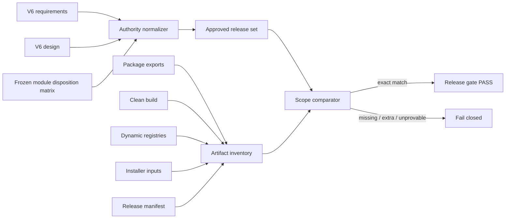

# Design Document: Scope Gate

## Current Release Alignment

- **Parent authority**: V6 REQ-25, REQ-27, REQ-31 and design 0.3—0.7 / Property 15.
- **Classification / status**: stable target `CURRENT_RELEASE_SUPPORTING`; current package remains `BUILT_NOT_ENABLED` until a formal build/release gate consumes it and duplicate scope sources are removed.
- **Current scope**: release-time comparison of the approved module/capability set with all artifact surfaces.
- **Excluded**: no business Runtime state machine and no environment/config/permission/runtime feature flag can enable excluded capability code.

## Architecture


```mermaid
flowchart LR
  REQ["V6 requirements"] --> NORM["Authority normalizer"]
  DES["V6 design"] --> NORM
  MATRIX["Frozen module disposition matrix"] --> NORM
  NORM --> APPROVED["Approved release set"]

  EXPORTS["Package exports"] --> INVENTORY["Artifact inventory"]
  BUILD["Clean build"] --> INVENTORY
  REG["Dynamic registries"] --> INVENTORY
  INSTALL["Installer inputs"] --> INVENTORY
  MANIFEST["Release manifest"] --> INVENTORY

  APPROVED --> COMPARE["Scope comparator"]
  INVENTORY --> COMPARE
  COMPARE -->|"exact match"| PASS["Release gate PASS"]
  COMPARE -->|"missing / extra / unprovable"| FAIL["Fail closed"]
```

Scope is defined only by the V6 product authority and the frozen Step 5 matrix. Scope Gate converts those inputs to a normalized release set and compares it with an inventory produced from the clean release candidate. It does not maintain a second runtime capability registry.

## Components and Interfaces

```typescript
type ReleaseClassification =
  | "CURRENT_RELEASE_CORE"
  | "CURRENT_RELEASE_SUPPORTING"
  | "BUILT_NOT_ENABLED"
  | "LEGACY_ONLY"
  | "HISTORICAL_EVIDENCE_ONLY";

interface ApprovedReleaseItem {
  id: string;
  classification: ReleaseClassification;
  requiredSurfaces: readonly ArtifactSurface[];
  dependencies: readonly string[];
  authoritySources: readonly string[];
}

type ArtifactSurface =
  | "package_export"
  | "clean_build"
  | "dynamic_registry"
  | "installer_asset"
  | "release_manifest"
  | "runtime_entry";

interface ArtifactItem {
  id: string;
  surface: ArtifactSurface;
  path: string;
  sha256?: string;
  dependencies: readonly string[];
}

interface ScopeVerdict {
  status: "passed" | "failed";
  missingRequired: readonly string[];
  unexpectedExcluded: readonly string[];
  invalidDependencies: readonly string[];
  incompleteEvidence: readonly string[];
}

interface ScopeGate {
  validate(
    approved: readonly ApprovedReleaseItem[],
    actual: readonly ArtifactItem[],
  ): ScopeVerdict;
}
```

### Authority normalizer

- Parses only declared, versioned V6 authority inputs.
- Rejects ambiguous identifiers, duplicate classification and missing source paths.
- Does not infer scope from package existence, tests, default values or Git history.

### Artifact inventory

- Runs against a clean build/release candidate rather than the developer source tree alone.
- Enumerates exports, produced files, registries, installer inputs, manifest entries and runtime entry points.
- Reports an incomplete inventory as evidence failure; absence is only proven when the producer set is complete.

### Scope comparator

- Required current items must be present on every declared surface.
- P1/P2, `BUILT_NOT_ENABLED` and `LEGACY_ONLY` items must be absent from every current artifact surface.
- Current items may not depend on excluded items.
- `HISTORICAL_EVIDENCE_ONLY` content may remain in documentation/Git evidence but cannot be a production artifact or Runtime input.

## Dependency Direction

```text
requirements + design + frozen module matrix
→ scope-gate release validator
→ build / installer / manifest acceptance
```

Scope Gate is intentionally outside the business Runtime dependency graph. Daemon, CLI and capability packages do not query it to decide whether excluded behavior may execute. Their official artifact simply does not contain that behavior.

## Error Handling

| Condition | Result |
|---|---|
| excluded item exists on any artifact surface | `SCOPE_BOUNDARY_VIOLATION`, release blocked |
| required item or producer/consumer edge missing | `RELEASE_SET_INCOMPLETE`, release blocked |
| authority inputs conflict | `SCOPE_AUTHORITY_CONFLICT`, release blocked |
| inventory cannot prove completeness | `SCOPE_EVIDENCE_INSUFFICIENT`, release blocked |
| stale caller addresses excluded identifier | `CAPABILITY_UNAVAILABLE`; implementation is not loaded |

Warning/disabled enforcement modes are not supported for stable release validation. Permission decisions cannot override a release-set failure.

## Testing Strategy

1. Property: identical normalized authority and artifact inputs yield byte-stable verdicts.
2. Property: adding any excluded item to any surface always fails.
3. Property: removing any required item/edge always fails.
4. Property: a current item depending on an excluded item always fails.
5. Negative: environment/config/permission feature-flag paths are detected as excluded artifacts.
6. Integration: clean build, dynamic registry enumeration, installer inputs and release manifest are compared in one formal pre-release gate.

## Historical Design Disposition

The previous hierarchical runtime feature-flag manager, environment-specific defaults, permission-protected flag mutation and “disabled by default” properties are superseded. They remain recoverable from Git/ERR history but are not current design, must not be deployed, and must be removed or adjusted with their tests in Step 6.
