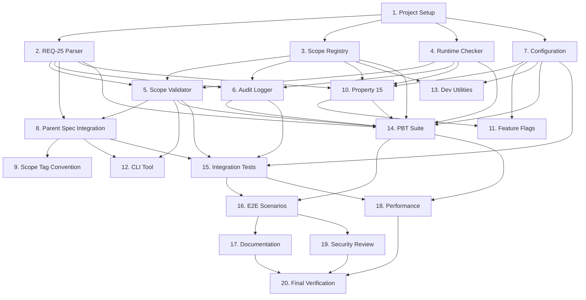

# Implementation Plan: Scope Gate

## Overview

This implementation plan covers the development of the **Scope Gate** module for SpecForge V6. The Scope Gate is responsible for enforcing P0/P1/P2 scope boundaries as defined in REQ-25 of the parent V6 architecture specification.

**Implementation Language**: TypeScript (aligned with existing `.opencode/tools/` toolchain)

**Scope**: This is a **P0** implementation, meaning all tasks must be completed for V6.0 release.

## Tasks

### Phase 1: Foundation and Core Components

- [x] 1. **Setup project structure and dependencies**
  - [x] 1.1 Create directory structure: `src/`, `tests/`, `artifacts/`
  - [x] 1.2 Define package.json with dependencies (fast-check for PBT, etc.)
  - [x] 1.3 Configure TypeScript compiler and build tools
  - [x] 1.4 Set up test framework (Jest/Vitest) with PBT support
  - _Requirements: SG-1, SG-2_

- [x] 2. **Implement REQ-25 Parser**
  - [x] 2.1 Create `Req25Parser` class to parse markdown
  - [x] 2.2 Implement capability extraction from REQ-25 list items
  - [x] 2.3 Add capability ID normalization logic
  - [x] 2.4 Write unit tests for parser with various REQ-25 formats
  - [x] 2.5 **Property Test**: Parse round-trip consistency
    - **Validates: Property SG-1**
  - _Requirements: 1.1, 1.2_

- [x] 3. **Implement Scope Registry**
  - [x] 3.1 Create `ScopeRegistry` class with capability registration
  - [x] 3.2 Implement availability checking with context
  - [x] 3.3 Add dependency validation (no P0 depending on P1/P2)
  - [x] 3.4 Write unit tests for registry operations
  - [x] 3.5 **Property Test**: Availability determinism
    - **Validates: Property SG-2**
  - _Requirements: 1.1, 1.3, 1.6_

- [x] 4. **Implement Runtime Scope Checker**
  - [x] 4.1 Create `RuntimeScopeChecker` with guard decorator
  - [x] 4.2 Implement manual check methods
  - [x] 4.3 Define structured error classes (ScopeError)
  - [x] 4.4 Write unit tests for runtime checking
  - [x] 4.5 **Property Test**: Error message consistency
    - **Validates: Property SG-4**
  - _Requirements: 3.1, 3.2, 3.5_

### Phase 2: Validation and Integration

- [x] 5. **Implement Scope Validator**
  - [x] 5.1 Create `ScopeValidator` for static analysis
  - [x] 5.2 Implement code dependency analysis
  - [x] 5.3 Add spec scope tag validation
  - [x] 5.4 Write unit tests for validation scenarios
  - [x] 5.5 **Property Test**: Validation completeness
  - _Requirements: 1.7, 2.3, 2.4_

- [x] 6. **Implement Audit Logger**
  - [x] 6.1 Create `AuditLogger` class
  - [x] 6.2 Implement event logging to events.jsonl
  - [x] 6.3 Add query functionality for scope events
  - [x] 6.4 Write unit tests for audit logging
  - [x] 6.5 **Property Test**: Audit trail completeness
    - **Validates: Property SG-3**
  - _Requirements: 1.5, 3.5, 3.6_

- [x] 7. **Implement Configuration Integration**
  - [x] 7.1 Create `ScopeConfiguration` interface and loader
  - [x] 7.2 Implement feature flag synchronization
  - [x] 7.3 Add environment-specific defaults
  - [x] 7.4 Write unit tests for configuration
  - _Requirements: 1.4, 3.3, 3.4_

### Phase 3: Parent Spec Integration

- [x] 8. **Integrate with Parent Specification**
  - [x] 8.1 Load REQ-25 from parent spec automatically
  - [x] 8.2 Validate against parent spec's artifacts
  - [x] 8.3 Implement change detection (when REQ-25 updates)
  - [x] 8.4 Write integration tests with parent spec
  - _Requirements: 1.1, 2.1, 2.2_

- [x] 9. **Implement Scope Tag Convention Enforcement**
  - [x] 9.1 Create tool to validate `.config.kiro` scope tags
  - [x] 9.2 Implement spec capability alignment validation
  - [x] 9.3 Add violation detection and reporting
  - [x] 9.4 Write tests for convention enforcement
  - _Requirements: 2.1, 2.2, 2.4_

### Phase 4: Property 15 Implementation

- [x] 10. **Implement Property 15: Scope Boundary**
  - [x] 10.1 Create comprehensive test suite for Property 15
  - [x] 10.2 Implement P1/P2 capability disablement in V6.0
  - [x] 10.3 Add "unavailable" error generation for disabled capabilities
  - [x] 10.4 **Property Test**: P1/P2 capabilities disabled by default
    - **Validates: Property 15 (Parent Spec)**
  - [x] 10.5 **Property Test**: Feature flag enablement works correctly
    - **Validates: Property 15 with feature flags**
  - _Requirements: 1.3, 3.1, 3.2; Validates: Requirements 30.15, 25.4_

- [x] 11. **Implement Feature Flag System**
  - [x] 11.1 Create hierarchical feature flag management
  - [x] 11.2 Implement flag enablement/disablement with audit
  - [x] 11.3 Add security controls for flag manipulation
  - [x] 11.4 Write tests for feature flag scenarios
  - _Requirements: 1.4, 3.3, 3.4_

### Phase 5: Tooling and CLI

- [x] 12. **Create Scope Validation CLI Tool**
  - [x] 12.1 Implement `scope-validate` command
  - [x] 12.2 Add JSON output mode for machine consumption
  - [x] 12.3 Implement integration with `sf_v6_arch_check`
  - [x] 12.4 Write end-to-end tests for CLI tool
  - _Requirements: 1.7, 2.5_

- [x] 13. **Create Development Utilities**
  - [x] 13.1 Implement capability listing command
  - [x] 13.2 Add scope context inspection tool
  - [x] 13.3 Create feature flag management utilities
  - [x] 13.4 Write documentation for development tools
  - _Requirements: 3.3, 3.4_

### Phase 6: Testing and Verification

- [x] 14. **Comprehensive Property-Based Testing**
  - [x] 14.1 Implement all property tests from design.md
  - [x] 14.2 Add edge case generators for PBT
  - [x] 14.3 Ensure PBT coverage for all critical paths
  - [x] 14.4 **Property Test**: Round-trip serialization of all data models
    - **Validates: Property 8 (Parent Spec)**
  - _Requirements: All; Testing Strategy_

- [x] 15. **Integration Testing**
  - [x] 15.1 Test integration with Configuration Subsystem
  - [x] 15.2 Test integration with Permission Engine
  - [x] 15.3 Test parent spec loading and validation
  - [x] 15.4 Test audit logging integration
  - _Requirements: 2.5, 3.6; Integration Tests_

- [x] 16. **End-to-End Scenarios**
  - [x] 16.1 V6.0 release branch simulation
  - [x] 16.2 E2E 测试场景
  - [x] 16.3 Scope violation detection and reporting
  - [x] 16.4 Audit trail completeness verification
  - _Requirements: 3.5, 3.6; End-to-End Tests_

### Phase 7: Documentation and Finalization

- [x] 17. **Documentation**
  - [x] 17.1 Write API documentation for all public interfaces
  - [x] 17.2 Create user guide for scope gate usage
  - [x] 17.3 Write developer guide for extending scope gate
  - [x] 17.4 Document error codes and troubleshooting
  - _Requirements: Documentation completeness_

- [x] 18. **Performance Optimization**
  - [x] 18.1 Profile and optimize hot code paths
  - [x] 18.2 Implement caching for frequent operations
  - [x] 18.3 Optimize audit logging performance
  - [x] 18.4 Verify microsecond-level scope checks
  - _Requirements: Performance considerations_

- [x] 19. **Security Review**
  - [x] 19.1 Review feature flag security
  - [x] 19.2 Verify audit log tamper resistance
  - [x] 19.3 Check integration with Permission Engine
  - [x] 19.4 Validate error information disclosure
  - _Requirements: Security considerations_

- [x] 20. **Final Verification**
  - [x] 20.1 Run all tests (unit, integration, PBT, E2E)
  - [x] 20.2 Verify Property 15 implementation completeness
  - [x] 20.3 Validate integration with parent spec tools
  - [x] 20.4 Ensure zero scope boundary violations in own code
  - _Requirements: All; Final checkpoint_

## Task Dependencies

## Testing Strategy

### Property-Based Tests (Required)

1. **Property 15**: P1/P2 capabilities disabled by default in V6.0
2. **Property SG-1**: Consistent scope tagging
3. **Property SG-2**: Feature flag determinism  
4. **Property SG-3**: Audit trail completeness
5. **Property SG-4**: No silent failures
6. **Property 8 (Parent)**: Round-trip serialization

### Unit Test Coverage Goals

- **Parser**: 100% branch coverage
- **Registry**: 100% branch coverage  
- **Checker**: 100% branch coverage
- **Validator**: 90%+ branch coverage
- **Logger**: 100% branch coverage
- **Configuration**: 100% branch coverage

### Integration Test Scenarios

1. Parent spec loading and validation
2. Configuration subsystem integration
3. Permission engine integration
4. Audit logging to events.jsonl
5. CLI tool execution
6. Feature flag management

### End-to-End Test Scenarios

1. V6.0 release simulation with P1/P2 disabled
2. Development environment with P1 enabled
3. Scope violation detection and reporting
4. Audit trail verification
5. Performance under load

## Implementation Notes

### Error Code Stability

All error codes defined by Scope Gate become part of the **SpecForge Runtime Contract** and must remain stable:

- `SCOPE_BOUNDARY_VIOLATION`: Attempt to use P1/P2 in V6.0
- `FEATURE_FLAG_REQUIRED`: Capability requires specific flag
- `CAPABILITY_UNAVAILABLE`: General unavailability
- `SCOPE_VALIDATION_FAILED`: Static validation failure

### Schema Versioning

All persistent data structures must include `schema_version: "1.0"` field for future migration support.

### Performance Targets

- Scope check: < 100 microseconds
- Registry load: < 100 milliseconds
- Validation run: < 1 second for typical codebase
- Audit log write: < 10 milliseconds

### Security Requirements

- Feature flags require appropriate permissions to modify
- Audit logs must be append-only
- Error messages must not leak sensitive information
- All user input must be validated

## Risk Mitigation

| Risk | Mitigation |
|------|------------|
| Performance impact on hot paths | Micro-optimization, caching, async logging |
| False positives in validation | Comprehensive test suite, gradual rollout |
| Integration issues with parent spec | Early integration testing, compatibility layers |
| Feature flag security vulnerabilities | Permission integration, audit logging, input validation |
| Schema evolution challenges | Versioned schemas, migration utilities |

## Success Criteria

1. **Property 15 fully implemented** and verified with PBT
2. **All inherited properties** from parent spec properly implemented
3. **100% test coverage** for critical components
4. **Integration with parent spec** tools working
5. **Performance targets** met for all operations
6. **Security review** passed with no critical issues
7. **Documentation complete** for users and developers
8. **Zero scope violations** in Scope Gate's own implementation