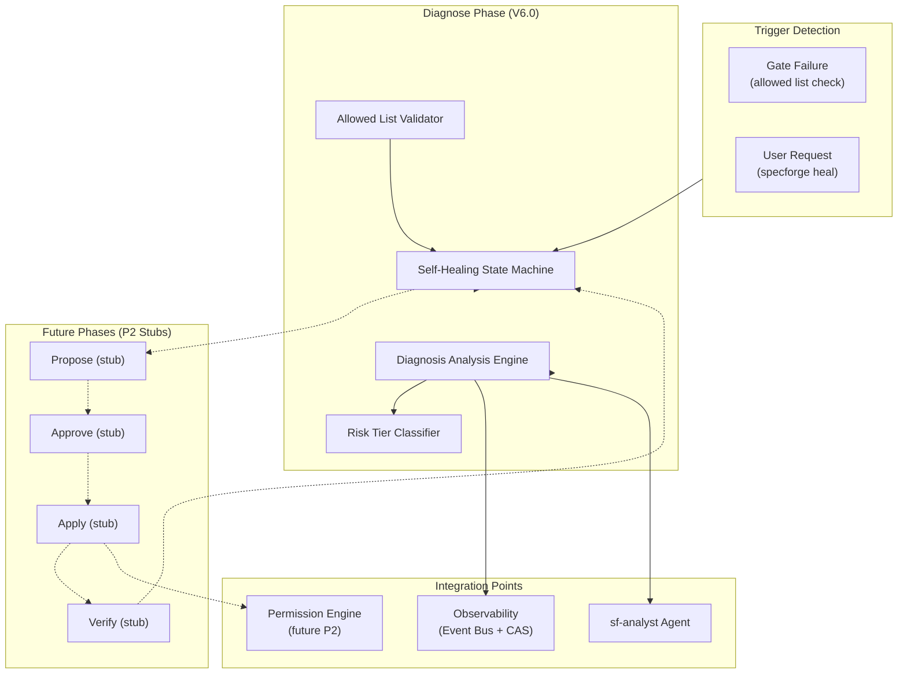
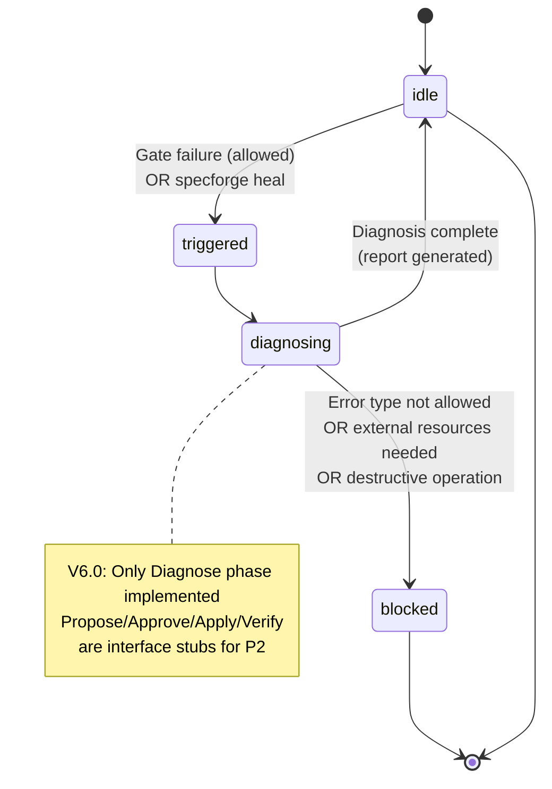
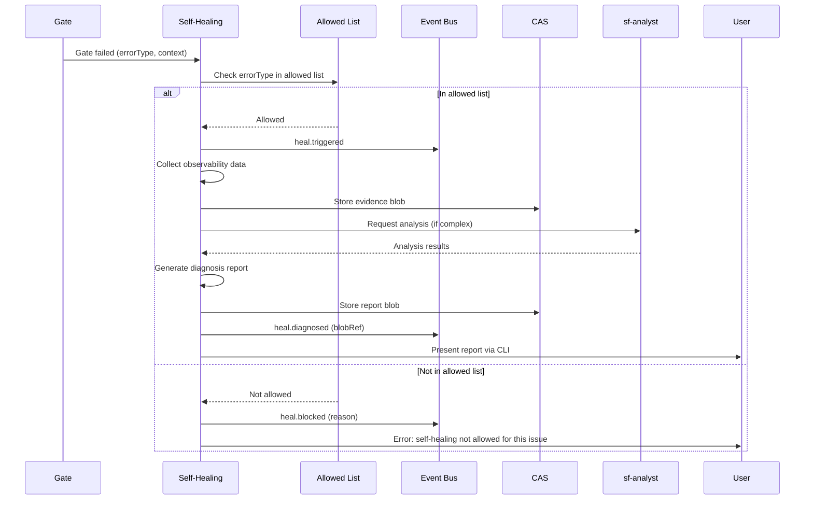

# Design Document: Self-Healing Subsystem

## Overview

### Module Purpose

The Self-Healing Subsystem implements the automated diagnosis and repair capabilities for SpecForge V6. Following the parent architecture's phased approach, this module delivers the **Diagnose phase** in V6.0 (P0), with the complete `Diagnose → Propose → Approve → Apply → Verify` loop deferred to V6.x (P2).

### Key Design Decisions

1. **Phased Implementation**: Diagnose-only in V6.0, full loop in P2 (ADR-011)
2. **Safety-First**: Strict allowed list of error types, iteration bounds, rollback guarantees
3. **Observability Integration**: All activities emit events, use CAS for evidence storage
4. **Human-in-the-Loop**: V6.0 provides diagnosis reports for manual repair; automated repair deferred

### Inherited Constraints

This design must satisfy:
- **Property 24**: Healing Rollback Precondition
- **Property 25**: Healing Iteration Bound
- **REQ-15**: Self-healing loop definition and V6.0 scope (Diagnose only)
- **REQ-30**: Architecture consistency properties

## Architecture

### 1. Component Overview



### 2. Self-Healing State Machine (V6.0 Implementation)



**V6.0 Transitions**:
- `idle → triggered`: Gate failure (error type in allowed list) OR user `specforge heal` command
- `triggered → diagnosing`: Validation passes, begin diagnosis analysis
- `diagnosing → blocked`: Error type not allowed, requires external resources, or destructive operation
- `diagnosing → idle`: Diagnosis complete, report generated and stored

**P2 Stub Transitions** (not implemented in V6.0):
- `diagnosing → proposing`: Generate repair plan
- `proposing → approving`: Obtain approval (auto/L1, default/L2, manual/L3)
- `approving → applying`: Apply changes (after rollback point creation)
- `applying → verifying`: Verify repair success
- `verifying → idle`: Success, cleanup
- `verifying → applying`: Failure, rollback and retry (≤ 3 iterations)

### 3. Data Flow: Diagnosis Process



## Components and Interfaces

### 1. SelfHealingStateMachine

```typescript
interface SelfHealingStateMachine {
  // V6.0 implemented methods
  trigger(params: {
    workItemId: string;
    triggerType: "gate_failure" | "user_request";
    errorType?: string;
    context?: Record<string, unknown>;
  }): Promise<TriggerResult>;

  diagnose(workItemId: string): Promise<DiagnosisReport>;

  getState(workItemId: string): Promise<HealingState>;

  // P2 stub methods (throw "not implemented" in V6.0)
  propose(workItemId: string): Promise<Proposal>;
  approve(workItemId: string, approval: Approval): Promise<void>;
  apply(workItemId: string): Promise<ApplyResult>;
  verify(workItemId: string): Promise<VerifyResult>;
}

type HealingState = 
  | { phase: "idle" }
  | { phase: "triggered", triggeredAt: number, triggerType: string }
  | { phase: "diagnosing", startedAt: number }
  | { phase: "blocked", blockedAt: number, reason: string }
  // P2 states (not implemented in V6.0)
  | { phase: "proposing" }
  | { phase: "approving", riskTier: "L1" | "L2" | "L3" }
  | { phase: "applying", rollbackPointId: string }
  | { phase: "verifying" };

interface DiagnosisReport {
  schema_version: "1.0";
  workItemId: string;
  rootCause: string;
  confidence: "high" | "medium" | "low";
  evidence: Array<{
    source: "events" | "state" | "artifacts" | "analysis";
    blobRef: string;
    description: string;
  }>;
  recommendedActions: Array<{
    action: string;
    riskTier: "L1" | "L2" | "L3";
    description: string;
  }>;
  generatedAt: number;
}
```

### 2. AllowedListValidator

```typescript
interface AllowedListValidator {
  isAllowed(errorType: string, context?: Record<string, unknown>): boolean;
  getAllowedTypes(): string[];
  addType(errorType: string, configLayer: "builtin" | "user" | "project"): void;
  removeType(errorType: string, configLayer: "user" | "project"): void;
}

// Built-in allowed types (V6.0)
const BUILTIN_ALLOWED_TYPES = [
  "requirements.missing_section",
  "design.missing_section", 
  "tasks.missing_section",
  "markdown.format_error",
  "yaml.syntax_error",
  "link.broken_internal",
  "artifact.missing_file",
  "task.dependency_cycle"
];

// Built-in excluded types (never allowed for auto-healing)
const BUILTIN_EXCLUDED_TYPES = [
  "code.logic_error",
  "permission.access_denied",
  "security.violation",
  "data.loss_risk",
  "network.connectivity",
  "external.resource_required"
];
```

### 3. RiskTierClassifier

```typescript
interface RiskTierClassifier {
  classify(action: RepairAction): "L1" | "L2" | "L3";
  
  // Classification rules (V6.0)
  readonly rules: Array<{
    pattern: RepairActionPattern;
    tier: "L1" | "L2" | "L3";
    description: string;
  }>;
}

type RepairAction = {
  type: "add" | "modify" | "delete";
  target: "file" | "section" | "content";
  scope: "single" | "multiple";
  impact: "cosmetic" | "behavioral" | "security";
};

// Example classification rules
const DEFAULT_RISK_RULES = [
  {
    pattern: { type: "add", target: "section", scope: "single", impact: "cosmetic" },
    tier: "L1",
    description: "Adding missing documentation sections"
  },
  {
    pattern: { type: "modify", target: "content", scope: "single", impact: "cosmetic" },
    tier: "L1", 
    description: "Fixing formatting errors"
  },
  {
    pattern: { type: "add", target: "file", scope: "single", impact: "behavioral" },
    tier: "L2",
    description: "Adding test files"
  },
  {
    pattern: { type: "delete", target: "file", scope: "any", impact: "any" },
    tier: "L3",
    description: "Any file deletion"
  }
];
```

### 4. DiagnosisAnalysisEngine

```typescript
interface DiagnosisAnalysisEngine {
  analyze(workItemId: string, triggerContext: TriggerContext): Promise<DiagnosisReport>;
  
  collectEvidence(workItemId: string): Promise<EvidenceCollection>;
  
  generateReport(
    evidence: EvidenceCollection,
    analysisResults: AnalysisResults
  ): DiagnosisReport;
}

interface EvidenceCollection {
  events: Event[];  // Relevant events from events.jsonl
  state: ProjectState;  // Current state.json
  artifacts: Record<string, string>;  // Key artifact contents
  gateResults: GateResult[];  // Recent gate failures
}

interface AnalysisResults {
  rootCause: string;
  confidence: "high" | "medium" | "low";
  patterns: string[];
  correlations: Correlation[];
}
```

### 5. RollbackManager (P2 stub in V6.0)

```typescript
interface RollbackManager {
  // P2: Implemented in V6.x
  createRollbackPoint(workItemId: string): Promise<string>;
  
  restoreFromRollbackPoint(rollbackPointId: string): Promise<void>;
  
  // V6.0: Interface only, throws "not implemented"
}

// Rollback point schema (for P2)
interface RollbackPoint {
  schema_version: "1.0";
  id: string;
  workItemId: string;
  createdAt: number;
  stateSnapshot: ProjectState;
  artifactSnapshots: Record<string, string>;  // blob references
  eventsUpTo: string;  // last eventId included
}
```

## Data Models

### 1. HealingEvent (events.jsonl entry)

```typescript
interface HealingEvent {
  schema_version: "1.0";
  eventId: string;
  ts: number;
  projectId: string;
  workItemId: string;
  actor: AgentIdentity | null;
  category: "heal";
  action: 
    | "heal.triggered"
    | "heal.diagnosing"
    | "heal.diagnosed"
    | "heal.blocked"
    | "heal.proposed"    // P2
    | "heal.approved"    // P2
    | "heal.applying"    // P2
    | "heal.applied"     // P2
    | "heal.verifying"   // P2
    | "heal.verified"    // P2
    | "heal.rollback";   // P2
  
  payload?: {
    triggerType?: string;
    errorType?: string;
    iteration?: number;
    riskTier?: "L1" | "L2" | "L3";
    diagnosisReportRef?: string;  // blob://<sha256>
    rollbackPointId?: string;     // P2
  };
  
  payloadBlobRef?: string;  // For large evidence collections
}
```

### 2. HealingState (per work item)

```typescript
interface HealingState {
  schema_version: "1.0";
  workItemId: string;
  currentPhase: HealingPhase;
  iteration: number;  // Current healing attempt (1-3)
  history: Array<{
    phase: HealingPhase;
    enteredAt: number;
    reason?: string;
    diagnosisReportRef?: string;
  }>;
  blocked?: {
    reason: string;
    blockedAt: number;
  };
}

type HealingPhase = 
  | "idle"
  | "triggered"
  | "diagnosing"
  | "proposing"    // P2
  | "approving"    // P2
  | "applying"     // P2
  | "verifying"    // P2
  | "blocked";
```

### 3. AllowedListConfig

```typescript
interface AllowedListConfig {
  schema_version: "1.0";
  allowedTypes: string[];
  excludedTypes: string[];
  
  // Configuration layer tracking
  source: "builtin" | "user" | "project";
  mergedFrom?: Array<"builtin" | "user" | "project">;
}
```

### 4. RiskTierRulesConfig

```typescript
interface RiskTierRulesConfig {
  schema_version: "1.0";
  rules: Array<{
    id: string;
    pattern: RepairActionPattern;
    tier: "L1" | "L2" | "L3";
    description: string;
    enabled: boolean;
  }>;
}
```

## Integration Points

### 1. Event Bus Integration

All self-healing activities must emit events to the Event Bus:

```typescript
// Example event emission
eventBus.emit({
  category: "heal",
  action: "heal.diagnosed",
  workItemId,
  payload: {
    iteration: currentIteration,
    diagnosisReportRef: reportBlobRef
  }
});
```

### 2. CAS Integration

Large evidence collections and diagnosis reports use CAS:

```typescript
// Store diagnosis report in CAS
const reportBytes = encodeDiagnosisReport(report);
const blobRef = await cas.store(reportBytes);

// Reference in event
event.payloadBlobRef = blobRef;
```

### 3. sf-analyst Integration

Complex diagnosis scenarios delegate to sf-analyst:

```typescript
async function performComplexDiagnosis(evidence: EvidenceCollection): Promise<AnalysisResults> {
  // For complex patterns, use sf-analyst
  const analysisRequest = {
    evidence,
    analysisType: "root_cause",
    workItemId
  };
  
  const analysisResults = await sfAnalyst.analyze(analysisRequest);
  return analysisResults;
}
```

### 4. Permission Engine Integration (P2)

Future P2 implementation will integrate with Permission Engine for approval workflows:

```typescript
// P2: Approval workflow
async function requestApproval(proposal: Proposal, riskTier: RiskTier): Promise<Approval> {
  if (riskTier === "L1") {
    return { approved: true, auto: true };
  }
  
  if (riskTier === "L2") {
    // Check user preferences
    const userPref = await config.get("selfHealing.l2AutoApprove");
    return { approved: userPref !== false, auto: userPref !== false };
  }
  
  if (riskTier === "L3") {
    // Require manual approval via Permission Engine
    return await permissionEngine.requestApproval({
      actor: currentUser,
      action: "heal.approve",
      resource: { type: "workItem", id: workItemId },
      context: { proposal, riskTier }
    });
  }
}
```

## Correctness Properties Implementation

### Property 24: Healing Rollback Precondition

**Implementation Strategy**:
- RollbackManager interface defined but not implemented in V6.0
- State machine enforces that `applying` state can only be entered after successful `createRollbackPoint()`
- Validation in state transition logic: if rollback creation fails → `blocked`
- P2 implementation will include actual snapshot creation and restoration

**PBT Test Design**:
```typescript
test("Property 24: Rollback precondition", () => {
  fc.assert(
    fc.property(
      fc.record({ /* healing scenario */ }),
      (scenario) => {
        // Simulate healing attempt
        const result = healingSystem.trigger(scenario);
        
        // If entering applying state, verify rollback point was created
        if (result.newState === "applying") {
          return rollbackManager.wasCreated(scenario.workItemId);
        }
        
        // If rollback creation failed, verify blocked state
        if (scenario.rollbackCreationFails) {
          return result.newState === "blocked";
        }
        
        return true;
      }
    )
  );
});
```

### Property 25: Healing Iteration Bound

**Implementation Strategy**:
- HealingState tracks `iteration` count (1-3)
- State machine rejects transition to `triggered` if `iteration >= 3`
- On 4th attempt, immediately transition to `blocked` with reason "iteration_limit"
- Counter resets only on work item reset or manual clearance

**PBT Test Design**:
```typescript
test("Property 25: Iteration bound", () => {
  fc.assert(
    fc.property(
      fc.array(fc.record({ /* healing trigger */ }), { minLength: 4, maxLength: 10 }),
      (triggers) => {
        const workItemId = "test-wi";
        let iteration = 0;
        
        for (const trigger of triggers) {
          const result = healingSystem.trigger({ ...trigger, workItemId });
          
          iteration++;
          if (iteration <= 3) {
            // First 3 attempts should proceed
            expect(result.success).toBe(true);
          } else {
            // 4th+ attempts should be blocked
            expect(result.blocked).toBe(true);
            expect(result.reason).toContain("iteration");
          }
        }
        
        return true;
      }
    )
  );
});
```

## Testing Strategy

### Unit Tests

1. **State Machine Tests**:
   - Valid transitions (idle → triggered → diagnosing → idle)
   - Invalid transitions (blocked → diagnosing)
   - Iteration bound enforcement
   - Allowed list validation

2. **AllowedListValidator Tests**:
   - Built-in type inclusion/exclusion
   - User/project configuration merging
   - Context-aware validation

3. **RiskTierClassifier Tests**:
   - L1/L2/L3 classification rules
   - Pattern matching
   - Configuration overrides

4. **DiagnosisAnalysisEngine Tests**:
   - Evidence collection
   - Report generation
   - Integration with sf-analyst

### Property-Based Tests

1. **Property 24**: Rollback precondition verification
2. **Property 25**: Iteration bound enforcement
3. **State Machine Invariants**: No invalid state transitions
4. **Configuration Consistency**: Allowed list and risk tier rules consistency

### Integration Tests

1. **End-to-End Diagnosis**:
   - Gate failure → diagnosis report
   - User request → diagnosis report
   - Non-allowed error → blocked

2. **Observability Integration**:
   - Event emission verification
   - CAS storage/retrieval
   - Report blob reference resolution

3. **CLI Integration**:
   - `specforge heal` command
   - Report retrieval and display
   - Status queries

## Migration Considerations

### V6.0 → V6.x (P2) Migration

When implementing the full self-healing loop in P2:

1. **State Machine Extension**: Add `proposing`, `approving`, `applying`, `verifying` states
2. **RollbackManager Implementation**: Actual snapshot creation/restoration
3. **Permission Engine Integration**: Approval workflows for L3 actions
4. **Apply Engine**: Code modification and artifact generation
5. **Verify Engine**: Result validation and success criteria

### Schema Versioning

All data structures include `schema_version: "1.0"` for V6.0. P2 implementation may require:
- `schema_version: "2.0"` for extended healing state
- Migration scripts for existing healing state records
- Backward compatibility for diagnosis reports

## Security Considerations

### V6.0 (Diagnose Only)

1. **Read-Only Analysis**: Diagnosis phase only reads observability data, no modifications
2. **Allowed List Restrictions**: Strict control over what can trigger diagnosis
3. **Evidence Collection Limits**: Only collect data relevant to diagnosis
4. **Report Access Control**: Diagnosis reports follow existing permission rules

### Future P2 Considerations

1. **Approval Workflows**: L3 actions require manual approval
2. **Rollback Safety**: Guaranteed restoration capability
3. **Change Auditing**: All modifications tracked in events.jsonl
4. **Permission Integration**: Apply phase respects existing tool permissions

## Performance Considerations

1. **Evidence Collection**: Limit data collected to relevant time window
2. **CAS Storage**: Use blob references for large evidence sets
3. **Analysis Delegation**: Complex analysis delegated to sf-analyst
4. **State Machine Efficiency**: Minimal state tracking, efficient transitions
5. **Event Volume**: Heal events follow same volume controls as other event categories