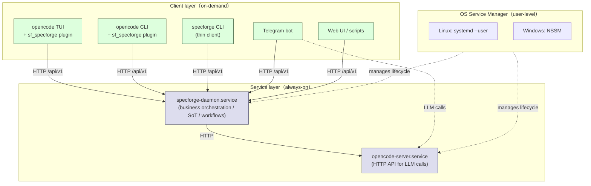
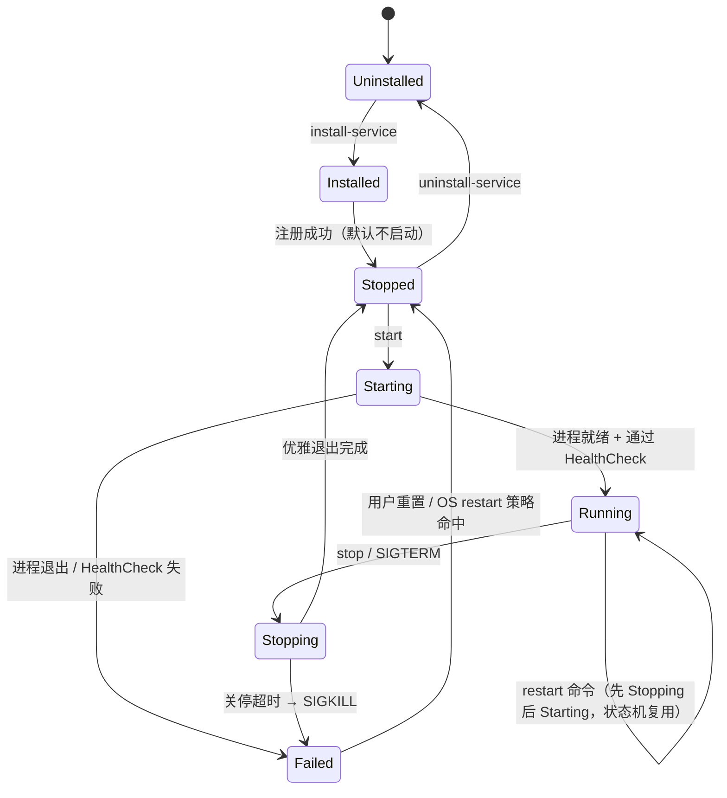
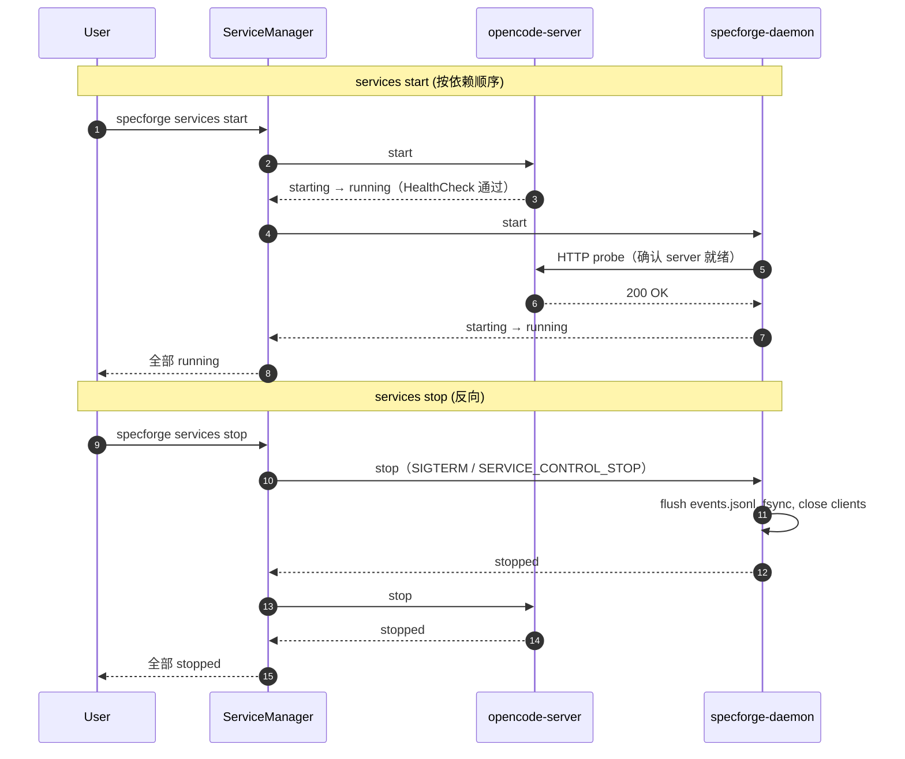
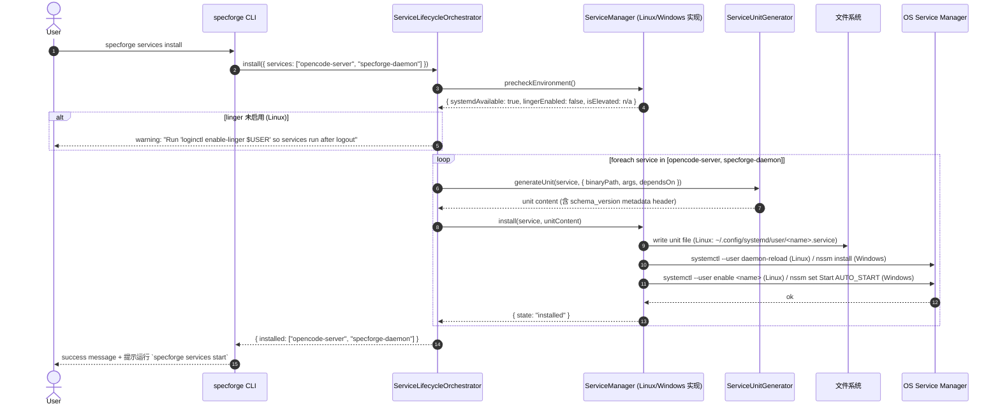
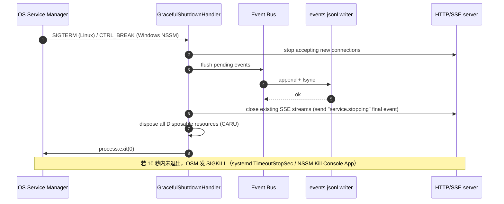
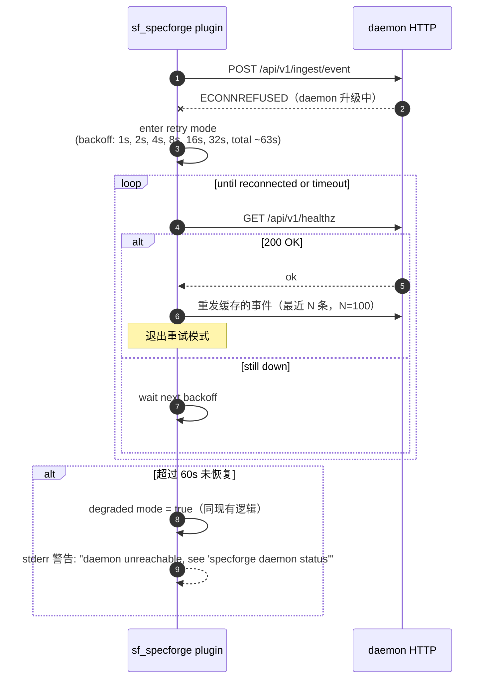
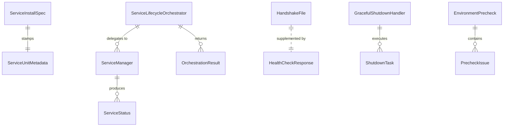

# Design Document: Service Management

## Overview

**Service Management** 把 SpecForge daemon 和 opencode-server 从"由 OpenCode 插件按需 spawn 的短命进程"转成**操作系统管理的用户级长驻服务**，对齐 opencode 的 `opencode serve` 架构模型。多客户端（OpenCode TUI、CLI、Telegram bot、Web UI、远程脚本）通过 HTTP 直接连到这两个服务，互不依赖任何客户端的生命周期。

**Parent Specification**：[v6-architecture-overview](../v6-architecture-overview/requirements.md)
**Wave**：V6.1（在 self-healing 之后，但作为 V6.1 release 的关键架构修复优先推进）
**Scope**：**P0** —— 解决一个阻塞 headless / 远程接入场景的关键架构问题（REQ-1.6 headless 模式、Telegram / OpenClaw / Web UI 全都受当前"daemon 30 秒空闲退出"问题影响）

### 解决的问题

V6.0 当前形态有四个相互纠缠的问题：

1. **Daemon 30 秒空闲自动退出**（daemon-core REQ-1.4）—— 一旦无请求 30 秒就退出，远程客户端再连接会失败
2. **`ensureDaemon()` 只在 OpenCode 插件加载时跑一次** —— 插件不持续监管 daemon，daemon 死了也不知道
3. **薄客户端工具（`sf_doctor`、`sf_state_read` 等）没有自动唤醒** —— 任何"daemon connection failed"都直接传递给用户
4. **`specforge daemon start --detach`** 实现不到位，测试发现仍会 30 秒后退出

合起来导致：headless 场景（Telegram bot 在用户本地长跑、远程访问、跨机调用）几乎无法用，违背 daemon-core REQ-1.6（headless OpenCode mode for Telegram/OpenClaw）。

### 解决方案概要

把 daemon 升级为**机器级单例的 OS 服务**，由 systemd（Linux）或 NSSM（Windows）管理生命周期：

- **Linux**：systemd `--user` unit，无 sudo
- **Windows**：NSSM 注册（注册时需 admin，但运行时是当前用户）
- **不支持 macOS**（V6.1 范围外）
- 同时管理两个服务：`specforge-daemon.service` + `opencode-server.service`，依赖关系 `daemon depends-on opencode-server`
- OpenCode 插件由"daemon spawner"降级为"事件转发桥"，daemon 不可达时打印明确错误而不是尝试 spawn
- 删除 daemon-core REQ-1.4（30s 空闲退出）和 REQ-1.5（`--detach` 标志），新增"优雅停机"需求

### 范围边界（不重不漏）

| 能力 | 归属 | 本 spec 与之关系 |
|---|---|---|
| Daemon 进程模型本身（HTTP server、Event Bus、SoT） | [daemon-core](../daemon-core/) | 本 spec 修改其 REQ-1.3/1.4/1.5，但不重做 daemon 内部逻辑 |
| `specforge` CLI 双模式输出 / `--json` 契约 / jobId | [cli](../cli/design.md)（Property 17/18） | 在 cli 包内**新增** `daemon install-service` 等子命令，遵循既有契约 |
| `specforge upgrade` 升级编排 | [distribution](../distribution/design.md) | **明确不做**——本 spec 只做 service install/start/stop/status/uninstall，升级在 distribution |
| handshake.json / Bearer Token 鉴权 | [daemon-core](../daemon-core/) Property 5 | 本 spec 仅扩展 handshake.json 字段，不改鉴权机制 |
| 远程访问鉴权 / API key | [permission-engine](../permission-engine/) Property 26 | 本 spec 默认不开远程模式，由 permission-engine 控制 |
| 配置默认值 / 四层合并 | [configuration](../configuration/) Property 11 | 本 spec 在默认配置中**关闭** "auto-start service at install" |

### 关键设计决策（用户已确认，不再展开论证）

| ADR | 决策 | 理由 |
|---|---|---|
| ADR-SM-001 | 仅支持 Linux + Windows，**不**支持 macOS | macOS 用户群在 V6.1 阶段优先级低；launchd 适配增加复杂度 |
| ADR-SM-002 | 用户级服务（systemd `--user` / NSSM 当前用户） | 不要求 sudo / Administrator 持续权限；安全边界清晰 |
| ADR-SM-003 | Linux 用 systemd（不兼容回退到 OpenRC / runit / SysV） | 主流发行版默认；非 systemd 发行版（Alpine、WSL1）显式拒绝并报错 |
| ADR-SM-004 | Windows 仅用 NSSM（**无** Task Scheduler 回退） | NSSM 是公认稳健的服务包装器；Task Scheduler 行为差异大 |
| ADR-SM-005 | 服务 unit 文件**总是重写**（不做 in-place patch） | 简单可靠；版本化由顶部 metadata 注释承载 |
| ADR-SM-006 | 删除 daemon-core REQ-1.4（30s 空闲退出）和 REQ-1.5（`--detach`） | 服务化后这两个机制彻底失去存在理由 |
| ADR-SM-007 | 服务依赖：daemon `Wants=` + `After=` opencode-server（弱依赖） | 启动时 server 先就绪，但 server 失败不阻断 daemon 启动尝试 |
| ADR-SM-008 | 启动顺序 server→daemon；停机顺序 daemon→server | daemon 调 server，需要 server 先就位；停机时反向避免 daemon 写到半关的 server |
| ADR-SM-009 | 插件保留但降级为"事件转发桥"，**不再** spawn daemon | 服务化后 spawn 是冗余甚至有害（双实例风险） |
| ADR-SM-010 | OpenCode TUI **和** opencode-server 进程都加载 sf_specforge 插件 | 满足 Property 1（SoT）—— 所有路径都能产生事件流到 daemon |
| ADR-SM-011 | 插件实现 HTTP 自动重连（指数退避，最多 ~60s） | 升级期间短暂不可达不应让插件直接放弃 |
| ADR-SM-012 | 升级期接受 < 1 分钟停机（stop → replace → start） | 简单可靠；降级到零停机的复杂度不值得 |
| ADR-SM-013 | `specforge upgrade` 命令归 distribution spec | 升级编排是分发问题，不是服务管理问题 |
| ADR-SM-014 | 服务的优雅关停信号：SIGTERM（Linux）/ SERVICE_CONTROL_STOP（Windows） | 平台原生信号；超时硬上限（默认 10s）后再 SIGKILL |
| ADR-SM-015 | 把 NSSM.exe 打包进 `~/.specforge/bin/` 随安装器分发 | 用户不需要手装；NSSM 是 BSD 许可、单文件、无依赖 |

---

## Architecture

### 服务拓扑



**启动顺序**：`opencode-server` → `specforge-daemon`
**停机顺序**：`specforge-daemon` → `opencode-server`
**依赖类型**：systemd `Wants=` + `After=`（弱依赖）/ NSSM `DependOnService`

### 服务生命周期状态机



**状态来源**：
- `Running` ↔ `systemctl is-active` 返回 `active` / NSSM `status` 返回 `SERVICE_RUNNING`
- `Failed` ↔ `is-active` 返回 `failed` / NSSM 返回 `SERVICE_STOPPED` 但有非零退出码
- `Stopped` ↔ `is-active` 返回 `inactive` / NSSM 返回 `SERVICE_STOPPED`（exit code 0）
- `Uninstalled` ↔ unit 文件不存在 / NSSM 服务名查询返回 ERROR_SERVICE_DOES_NOT_EXIST

### 跨服务依赖模型



### OS 服务管理器与本仓二进制的交互

| 交互 | Linux (systemd) | Windows (NSSM) |
|---|---|---|
| 启动二进制 | `ExecStart=` 指向绝对路径 | `nssm install <name> <exe> <args>` |
| 进程退出码 → 服务状态 | `Restart=on-failure` + `RestartSec=5s` | `AppExit Default Restart` + `AppRestartDelay 5000` |
| 优雅停机信号 | `KillSignal=SIGTERM` + `TimeoutStopSec=10` | `AppStopMethodSkip 0`（发 CTRL_BREAK + 10s 等待） |
| 日志重定向 | `StandardOutput=append:~/.specforge/logs/<name>.log` | `nssm set <name> AppStdout / AppStderr` |
| 启动条件 | `[Install] WantedBy=default.target` | NSSM `Start=SERVICE_AUTO_START` |
| 用户级运行 | `systemctl --user` + linger 启用 | NSSM 默认以 LocalSystem 运行，需显式设置 `nssm set <name> ObjectName .\<user> <password>` 改成当前用户（或在 V6.1 接受 LocalSystem，由 V6.2 优化） |

**Windows 用户身份说明**：NSSM 默认以 `LocalSystem` 注册服务，与"用户级"目标冲突。V6.1 实现两种之一（决策项见 §10）：
- **方案 A（推荐）**：注册时让用户输入当前用户密码（或集成 LSA），用 `nssm set <name> ObjectName .\<user> <password>` 改账户
- **方案 B（备选）**：先以 LocalSystem 注册，但所有数据路径强制写到 `%USERPROFILE%\.specforge\`，accept LocalSystem 身份做后续优化

---

## Sequence Diagrams（关键流程）

### 流程 1：首次安装（`specforge services install`）



### 流程 2：daemon 优雅关停



### 流程 3：插件遇到 daemon 不可达（升级期间）



---

## Components and Interfaces

源码位置：`packages/service-management/src/`（按项目 structure 规则）。
所有持有资源的类必须实现 `Disposable` 协议（项目 lessons-injected JS2/JS3）。

### 1. ServiceManager（核心抽象）

**位置**：`packages/service-management/src/service-manager/service-manager.ts`

跨平台抽象，实现类按平台选择。

```typescript
/**
 * 跨平台服务管理器抽象。
 *
 * 实现类必须保证：
 * - 所有方法在"目标状态已经满足"时返回成功（幂等性，Property 2）
 * - install/uninstall 失败时回滚（不留半安装状态）
 * - 不持有跨调用的可变状态（每次调用读 OS 真值）
 */
export interface ServiceManager extends Disposable {
  /** 注册服务到 OS service manager */
  install(spec: ServiceInstallSpec): Promise<InstallResult>;

  /** 从 OS service manager 注销 */
  uninstall(serviceName: string): Promise<UninstallResult>;

  /** 启动服务（已运行则 no-op） */
  start(serviceName: string): Promise<StartResult>;

  /** 停止服务（已停止则 no-op） */
  stop(serviceName: string): Promise<StopResult>;

  /** 重启 = stop + start */
  restart(serviceName: string): Promise<RestartResult>;

  /** 查询服务状态（不修改任何状态） */
  status(serviceName: string): Promise<ServiceStatus>;

  /** 启动前检查环境（systemd 是否可用、是否 elevated 等） */
  precheckEnvironment(): Promise<EnvironmentPrecheck>;

  /** Disposable */
  dispose(): Promise<void>;
}

export interface ServiceInstallSpec {
  /** 服务名（OS 内可见的标识，例如 specforge-daemon） */
  name: string;
  /** 显示名 / 描述 */
  description: string;
  /** 可执行文件绝对路径 */
  binaryPath: string;
  /** 启动参数 */
  args: string[];
  /** 工作目录绝对路径 */
  workingDirectory: string;
  /** 环境变量（覆盖默认） */
  environment: Record<string, string>;
  /** 依赖的其他服务名（启动顺序保证） */
  dependsOn: string[];
  /** 启动失败重启策略 */
  restartPolicy: "no" | "on-failure" | "always";
  /** 优雅停机超时（秒），超时后强杀 */
  stopTimeoutSec: number;
  /** stdout / stderr 日志输出路径（绝对） */
  stdoutLogPath: string;
  stderrLogPath: string;
  /** 安装时是否同时 enable（auto-start at boot） */
  enableAtBoot: boolean;
}

export interface ServiceStatus {
  schema_version: "1.0";
  name: string;
  state: ServiceState;
  pid: number | null;
  /** 启动时间戳（ms epoch），仅 running 状态有意义 */
  startedAt: number | null;
  /** 最近一次 exit code（仅 stopped/failed 状态有意义） */
  lastExitCode: number | null;
  /** OS 报告的最近错误信息 */
  lastError: string | null;
}

export type ServiceState =
  | "uninstalled"
  | "stopped"
  | "starting"
  | "running"
  | "stopping"
  | "failed";
```

#### 1a. SystemdServiceManager（Linux 实现）

**位置**：`packages/service-management/src/service-manager/systemd-service-manager.ts`

```typescript
export class SystemdServiceManager implements ServiceManager {
  /** unit 文件目录：~/.config/systemd/user/ */
  constructor(private readonly opts: SystemdOpts) {}

  /**
   * Linux 实现要点：
   * - install: 写 unit 文件 → daemon-reload → enable
   * - 调用 systemctl 命令时设置 30s timeout（lessons C2/C3）
   * - precheck:
   *   - systemd --user 是否可用（systemctl --user list-units 不报错）
   *   - 是否启用 linger（loginctl show-user $USER | grep Linger=yes）
   *   - 不可用则 EnvironmentPrecheck.systemdAvailable = false，调用方拒绝
   */
  // 实现见后文「Algorithmic Pseudocode」
}
```

#### 1b. NssmServiceManager（Windows 实现）

**位置**：`packages/service-management/src/service-manager/nssm-service-manager.ts`

```typescript
export class NssmServiceManager implements ServiceManager {
  constructor(private readonly opts: NssmOpts) {}

  /**
   * Windows 实现要点：
   * - 调用 NSSM CLI（路径：~/.specforge/bin/nssm.exe，installer 部署）
   * - install 需要 Administrator（不是 LocalSystem）：用 ShellExecute "runas"
   *   或要求用户在 elevated cmd 中运行 specforge
   * - 设置 NSSM 服务以**当前用户身份**运行（ObjectName + 密码 / LSA secret）
   *   V6.1 接受 LocalSystem 作为 fallback（决策项见 §10）
   * - status: nssm status <name> + nssm dump <name> 解析
   */
}
```

### 2. ServiceUnitGenerator

**位置**：`packages/service-management/src/unit-generator/service-unit-generator.ts`

负责把 `ServiceInstallSpec` 渲染为 systemd unit 文件文本或 NSSM 命令序列。**always-rewrite** 策略 —— 每次升级都重写文件，依赖顶部 metadata 注释跟踪 schema_version。

```typescript
export interface ServiceUnitGenerator {
  /**
   * 生成 systemd unit 文件文本（Linux）。
   * 返回值的首行是 metadata 注释行（# generated-by, # schema_version 等）。
   */
  generateSystemdUnit(spec: ServiceInstallSpec): string;

  /**
   * 生成 NSSM 命令序列（Windows）。
   * 调用方按顺序执行；每条命令都是幂等的。
   */
  generateNssmCommands(spec: ServiceInstallSpec, nssmExePath: string): NssmCommand[];

  /**
   * 解析 unit 文件顶部 metadata 注释，提取 schema_version。
   * 如果 metadata 缺失或损坏，返回 null（调用方决定是否重写）。
   */
  parseMetadata(unitContent: string): ServiceUnitMetadata | null;
}

export interface NssmCommand {
  /** NSSM 子命令：install / set / remove / start / stop / status */
  subcommand: string;
  /** 参数列表（已 escaping 过；调用方直接 spawn） */
  args: string[];
  /** 是否允许失败（idempotent 操作中"已存在"等错误可忽略） */
  allowFailure: boolean;
}
```

### 3. ServiceLifecycleOrchestrator

**位置**：`packages/service-management/src/orchestrator/service-lifecycle-orchestrator.ts`

跨多服务的启动 / 停机编排。处理依赖顺序、回滚、超时。

```typescript
export interface ServiceLifecycleOrchestrator extends Disposable {
  /** 安装一组服务（按依赖拓扑） */
  installAll(specs: ServiceInstallSpec[]): Promise<OrchestrationResult>;

  /** 启动一组服务（按依赖顺序，前驱就绪后启动后继） */
  startAll(serviceNames: string[]): Promise<OrchestrationResult>;

  /** 停止一组服务（按依赖反向顺序） */
  stopAll(serviceNames: string[]): Promise<OrchestrationResult>;

  /** 卸载一组服务（按依赖反向顺序） */
  uninstallAll(serviceNames: string[]): Promise<OrchestrationResult>;

  /** 查询一组服务的状态 */
  statusAll(serviceNames: string[]): Promise<ServiceStatus[]>;

  dispose(): Promise<void>;
}

export interface OrchestrationResult {
  schema_version: "1.0";
  success: boolean;
  /** 每个服务的最终状态 */
  perService: Map<string, ServiceStatus>;
  /** 失败时已回滚的服务列表 */
  rolledBack: string[];
  /** 错误信息（首个失败服务的错误） */
  error: { code: string; message: string; suggestion: string } | null;
}
```

### 4. GracefulShutdownHandler

**位置**：
- daemon 侧：`packages/daemon-core/src/shutdown/graceful-shutdown-handler.ts`（在 daemon-core 包内新增，本 spec 给出契约）
- opencode-server 侧：由我们维护的 wrapper 进程实现（如果 opencode 本身有 graceful shutdown 则透传，否则我们 fork stdio 包装）

```typescript
/**
 * 优雅停机处理器。
 *
 * 必须实现 Disposable，并按 CARU 顺序释放资源。
 * 启动时通过 attachToProcess() 注册信号监听；关停时按"反向创建顺序"释放。
 */
export interface GracefulShutdownHandler extends AsyncDisposable {
  /** 注册信号处理器 */
  attachToProcess(): void;

  /** 注册一个清理任务（在 SIGTERM 时按反向顺序执行） */
  register(name: string, task: ShutdownTask, priority: ShutdownPriority): void;

  /** 主动触发关停（用于测试和 CLI 的 stop 命令） */
  trigger(reason: string): Promise<void>;

  /** 当前是否正在关停 */
  isShuttingDown(): boolean;

  [Symbol.asyncDispose](): Promise<void>;
}

export type ShutdownTask = (signal: AbortSignal) => Promise<void>;

/** 优先级越高越先执行（停止接受新请求 → 刷盘 → 关连接 → 释放资源） */
export type ShutdownPriority = "stop-accepting" | "drain" | "flush" | "close" | "release";
```

**关停超时与硬上限**：
- 默认总超时 **10 秒**（systemd `TimeoutStopSec` / NSSM `AppStopMethodConsole`）
- 每个 ShutdownTask 自身默认超时 3 秒（lessons C1/C2/C3）
- 任何 task 超时 → 记 warning 事件 → 继续后续 task
- 总超时触发 → 进程退出码 1，OS 后续发 SIGKILL

### 5. PluginAutoReconnect（修改 sf_specforge.ts）

**位置**：`.opencode/plugins/sf_specforge.ts`（**修改**现有文件，不新增包）

把现有的 `ensureDaemon()` 删掉，替换为重连客户端：

```typescript
/**
 * 插件 HTTP 客户端的重连策略。
 * - 每次 postEvent 失败 → 尝试 readHandshake() 拿新 token/port
 * - 仍失败 → 进入 backoff 重连循环（1s, 2s, 4s, 8s, 16s, 32s）
 * - 总超时 60s 后放弃 → degraded mode = true
 * - degraded 期间 postEvent 直接 drop（warn 一次，不刷屏）
 *
 * 不再 spawn daemon 二进制（违反 Property 1 SoT 链）。
 * 仅打印明确错误并指向 `specforge daemon start` / `specforge services start`。
 */
export interface ReconnectingDaemonClient extends Disposable {
  postEvent(type: string, data: unknown): Promise<PostResult>;
  isDegraded(): boolean;
  getActiveBackoffTimerCount(): number; // 自检 API（lessons X2）
  dispose(): Promise<void>; // 必须清掉所有 backoff timer（lessons C1）
}
```

### 6. ServiceCli（CLI 子命令实现）

**位置**：`packages/cli/src/commands/services/`

按项目惯例（cli spec），所有命令同时支持交互模式和 `--json` 模式。

```
specforge daemon install-service     [--json]
specforge daemon uninstall-service   [--json]
specforge daemon start               [--json]
specforge daemon stop                [--json] [--timeout=10]
specforge daemon restart             [--json]
specforge daemon status              [--json]

specforge opencode-server install-service     [--json]
specforge opencode-server uninstall-service   [--json]
specforge opencode-server start               [--json]
specforge opencode-server stop                [--json] [--timeout=10]
specforge opencode-server restart             [--json]
specforge opencode-server status              [--json]

specforge services install   [--json]
specforge services start     [--json]
specforge services stop      [--json] [--timeout=10]
specforge services restart   [--json]
specforge services status    [--json]
specforge services uninstall [--json]
```

**JSON 输出契约**（`status` 命令示例）：

```typescript
export interface ServicesStatusJsonPayload {
  schema_version: "1.0";
  services: Array<{
    name: string;
    state: ServiceState;
    pid: number | null;
    port: number | null;          // 仅 daemon: 从 handshake.json 读
    uptimeSec: number | null;
    activeClients: number | null; // 仅 daemon: 当前 SSE 订阅数
    lastError: string | null;
  }>;
  /** 整体退出码: 0 = 全 running, 1 = 任一非 running, 2 = 任一未安装 */
  overallExitCode: 0 | 1 | 2;
}
```


---

## Data Models

### 1. ServiceUnitMetadata（unit 文件顶部注释）

每个生成的 systemd unit 文件 / NSSM 命令脚本顶部都嵌入这段 metadata 注释，便于排错和 schema 演进追踪。

```typescript
export interface ServiceUnitMetadata {
  schema_version: "1.0";
  /** "specforge-service-management" + 包版本号 */
  generatedBy: string;
  /** ISO 8601 UTC */
  generatedAt: string;
  /** 这个 unit 文件被 install 时的 specforge 版本 */
  specforgeVersion: string;
  /** 服务名（与 unit 文件名 / NSSM 服务名一致） */
  serviceName: string;
  /** 二进制绝对路径（用于诊断"二进制是否还在") */
  binaryPath: string;
}
```

systemd unit 文件示例渲染（顶部注释块）：

```ini
# === GENERATED BY SPECFORGE — DO NOT EDIT MANUALLY ===
# schema_version: 1.0
# generated-by: specforge-service-management@6.1.0
# generated-at: 2026-05-21T10:00:00.000Z
# specforge-version: 6.1.0
# service-name: specforge-daemon
# binary-path: /home/luo/.specforge/bin/specforged
# === END METADATA ===

[Unit]
Description=SpecForge Daemon (business orchestration / SoT)
Documentation=https://github.com/specforge/specforge
Wants=opencode-server.service
After=opencode-server.service

[Service]
Type=simple
ExecStart=/home/luo/.specforge/bin/specforged start --foreground
Restart=on-failure
RestartSec=5s
KillSignal=SIGTERM
TimeoutStopSec=10
StandardOutput=append:/home/luo/.specforge/logs/specforge-daemon.log
StandardError=append:/home/luo/.specforge/logs/specforge-daemon.err
Environment=SPECFORGE_RUN_MODE=service

[Install]
WantedBy=default.target
```

### 2. ServiceState（内部状态模型）

见上文 `ServiceManager` 接口的 `ServiceState` 类型。封闭枚举：

```typescript
export type ServiceState =
  | "uninstalled"  // unit 文件 / NSSM 服务不存在
  | "stopped"      // 已注册，未运行
  | "starting"     // 进程 spawn 但未通过 HealthCheck
  | "running"      // 进程 spawn + HealthCheck 通过
  | "stopping"     // 收到 SIGTERM，等待 graceful shutdown
  | "failed";      // 进程退出码非 0 / OS service manager 标记 failed
```

### 3. EnvironmentPrecheck

```typescript
export interface EnvironmentPrecheck {
  schema_version: "1.0";
  platform: "linux" | "win32";

  // Linux 字段
  systemdAvailable: boolean | null;       // 仅 Linux
  systemdVersion: string | null;          // 仅 Linux
  lingerEnabled: boolean | null;          // 仅 Linux
  systemdUserUnitDir: string | null;      // ~/.config/systemd/user/

  // Windows 字段
  isElevated: boolean | null;             // 仅 Windows: 当前进程是否以 admin 运行
  nssmAvailable: boolean | null;          // 仅 Windows: NSSM 二进制是否存在
  nssmExePath: string | null;             // 仅 Windows: NSSM 路径
  nssmVersion: string | null;             // 仅 Windows
  currentUserName: string | null;         // 仅 Windows: 注册服务以谁的身份运行

  /** 阻塞性问题（必须修复才能继续） */
  blockers: PrecheckIssue[];
  /** 非阻塞警告（可继续，但建议处理） */
  warnings: PrecheckIssue[];
}

export interface PrecheckIssue {
  code:
    | "SYSTEMD_NOT_AVAILABLE"           // Linux: systemd --user 不可用（WSL1、Alpine）
    | "LINGER_NOT_ENABLED"              // Linux: 服务在用户登出后会被杀
    | "NSSM_NOT_FOUND"                  // Windows
    | "NOT_ELEVATED"                    // Windows: install 需要 admin
    | "PORT_IN_USE"                     // 启动前发现 daemon HTTP 端口已占用
    | "BINARY_MISSING"                  // ServiceInstallSpec.binaryPath 不存在
    | "OPENCODE_SERVER_BINARY_MISSING"  // opencode 未装
    | "WORKING_DIR_MISSING";
  message: string;
  suggestion: string;
}
```

### 4. HealthCheckResponse（扩展现有 handshake.json）

daemon 当前 handshake.json（`~/.specforge/runtime/daemon.sock.json`）字段为 `pid` / `port` / `token`。本 spec 扩展为：

```typescript
export interface HandshakeFile {
  schema_version: "1.0";   // 新增
  pid: number;
  port: number;
  token: string;
  startedAt: number;       // 新增 - epoch ms
  version: string;         // 新增 - daemon 版本
  serviceMode: boolean;    // 新增 - 是否由 OS service 启动（区分 ad-hoc）
}
```

新增 HTTP endpoint 用于服务状态查询（不替换 handshake.json，handshake 仍然是引导发现机制）：

```typescript
// GET /api/v1/healthz
export interface HealthCheckResponse {
  schema_version: "1.0";
  status: "ok" | "degraded" | "shutting-down";
  pid: number;
  version: string;
  startedAt: number;
  uptimeSec: number;
  activeClients: number;       // 当前 HTTP/SSE 订阅数
  pendingEvents: number;       // 内部 Event Bus 待刷盘事件数
  lastEventTs: number | null;
}
```

### 5. ServiceManagementConfig（新增配置项）

写入 `~/.specforge/config/config.yaml`（由 configuration spec 拥有），本 spec 在默认配置中添加这一段：

```yaml
schema_version: "1.0"
service_management:
  # 是否允许 `services install` 在安装后自动 `enable`（开机自启）
  auto_enable_at_boot: true
  # 优雅停机超时（秒），同时是 systemd TimeoutStopSec / NSSM AppStopMethodConsole
  stop_timeout_sec: 10
  # 插件 HTTP 重连最大累计退避时间（秒），超时后 degraded
  plugin_reconnect_max_sec: 60
  # 插件重连初始退避（秒）
  plugin_reconnect_initial_sec: 1
  # 插件重连退避因子
  plugin_reconnect_backoff_factor: 2.0
```

**默认值规则**：
- `auto_enable_at_boot: true`（用户级，无害）
- 其余按上表

### 6. 数据模型关系



---

## Cross-platform Implementation Matrix

| Operation | Linux (systemd `--user`) | Windows (NSSM) |
|---|---|---|
| **install** | 1) write `~/.config/systemd/user/<name>.service`<br/>2) `systemctl --user daemon-reload`<br/>3) `systemctl --user enable <name>`（如果 `enableAtBoot=true`） | 1) `<nssm.exe> install <name> <exe> <args>`（**需 admin**）<br/>2) `<nssm.exe> set <name> AppDirectory <wd>`<br/>3) `<nssm.exe> set <name> AppEnvironmentExtra ...`<br/>4) `<nssm.exe> set <name> Start SERVICE_AUTO_START` |
| **uninstall** | 1) `systemctl --user disable <name>`（idempotent）<br/>2) `systemctl --user stop <name>`（idempotent）<br/>3) delete unit file<br/>4) `systemctl --user daemon-reload` | 1) `<nssm.exe> stop <name>`（idempotent）<br/>2) `<nssm.exe> remove <name> confirm` |
| **start** | `systemctl --user start <name>` | `<nssm.exe> start <name>` |
| **stop** | `systemctl --user stop <name>` | `<nssm.exe> stop <name>` |
| **restart** | `systemctl --user restart <name>` | `<nssm.exe> restart <name>`（NSSM 6.0+ 内置；否则 stop + start） |
| **status** | `systemctl --user is-active <name>` + `systemctl --user show <name> --property=MainPID,ActiveState,SubState,ExecMainStartTimestamp` | `<nssm.exe> status <name>` + `<nssm.exe> dump <name>` 解析 |
| **auto-start at boot** | unit `[Install] WantedBy=default.target` + `loginctl enable-linger $USER` | NSSM 默认 `Start=SERVICE_AUTO_START` |
| **dependency declaration** | unit `[Unit]` 的 `Wants=opencode-server.service` + `After=opencode-server.service` | `<nssm.exe> set specforge-daemon DependOnService opencode-server` |
| **graceful shutdown signal** | `KillSignal=SIGTERM` + `TimeoutStopSec=10` | `<nssm.exe> set <name> AppStopMethodSkip 0`（默认依次发 CTRL_C → CTRL_BREAK → WM_CLOSE → terminate；超时 10s） |
| **logging redirection** | `StandardOutput=append:<path>` + `StandardError=append:<path>` | `<nssm.exe> set <name> AppStdout <path>` + `<nssm.exe> set <name> AppStderr <path>` |
| **env vars** | unit `Environment=KEY=VALUE`（多行） | `<nssm.exe> set <name> AppEnvironmentExtra KEY=VALUE` |
| **failure restart policy** | `Restart=on-failure` + `RestartSec=5s` | `<nssm.exe> set <name> AppExit Default Restart` + `<nssm.exe> set <name> AppRestartDelay 5000` |
| **run as current user** | systemd `--user` 天生以当前用户身份运行 | `<nssm.exe> set <name> ObjectName .\<user> <password>`（V6.1 备选 LocalSystem，决策项见 §10） |
| **list installed services** | `systemctl --user list-unit-files | grep specforge` | `Get-Service specforge-* | nssm dump` |
| **service name format** | `specforge-daemon.service` / `opencode-server.service` | `specforge-daemon` / `opencode-server`（Windows 服务名无 `.service` 后缀） |

---

## Algorithmic Pseudocode

下面用 TypeScript 伪代码描述 4 个关键算法的契约（preconditions / postconditions / loop invariants）。完整实现在 `packages/service-management/src/`。

### 算法 1：ServiceLifecycleOrchestrator.startAll()

```typescript
/**
 * 按依赖拓扑顺序启动一组服务。
 *
 * Preconditions:
 *   - 所有 serviceNames 都已 install（state ≠ "uninstalled"）
 *   - serviceManager 不在 disposed 状态
 *
 * Postconditions:
 *   - 成功: 所有服务最终 state === "running"，调用方持有 OrchestrationResult.success === true
 *   - 失败: 已启动的服务被 stop（回滚），rolledBack 包含所有被回滚的服务名
 *   - 无中间态泄漏: 不会留下"启动中但 orchestrator 已退出"的服务
 *
 * Invariants:
 *   - 每次循环开始时，"已启动且未回滚的服务"处于 "running" 状态
 *   - 任意时刻 startedSoFar 与 OS 真值一致（每步后通过 status() 二次确认）
 */
async startAll(serviceNames: string[]): Promise<OrchestrationResult> {
  ASSERT serviceNames.length > 0;
  ASSERT this.disposed === false;

  const sorted = topologicalSort(serviceNames, this.dependencyGraph);
  const startedSoFar: string[] = [];
  const perService = new Map<string, ServiceStatus>();

  try {
    for (const name of sorted) {
      ASSERT allDependenciesIn(name).every(dep => startedSoFar.includes(dep));

      // 启动当前服务（带超时）
      await withTimeout(
        () => this.serviceManager.start(name),
        START_TIMEOUT_MS,
        { operation: `service.start(${name})`, suggestion: "Check service logs" }
      );

      // 二次确认（OS 真值 vs 我们的状态机）
      const status = await this.serviceManager.status(name);
      if (status.state !== "running") {
        throw new ServiceStartError({
          service: name,
          observedState: status.state,
          lastError: status.lastError,
          suggestion: `Inspect logs: ${status.name === 'specforge-daemon' ? '~/.specforge/logs/specforge-daemon.err' : ...}`
        });
      }

      // HealthCheck（仅 daemon: HTTP probe handshake.json）
      if (hasHealthCheck(name)) {
        await waitForHealthy(name, HEALTH_CHECK_TIMEOUT_MS);
      }

      startedSoFar.push(name);
      perService.set(name, status);

      INVARIANT: startedSoFar 中所有服务的 OS 状态 === "running";
    }

    return { schema_version: "1.0", success: true, perService, rolledBack: [], error: null };

  } catch (e) {
    // 回滚: 反向顺序停止已启动的
    const rolledBack: string[] = [];
    for (const name of [...startedSoFar].reverse()) {
      try {
        await this.serviceManager.stop(name);
        rolledBack.push(name);
      } catch (rollbackErr) {
        // 回滚失败不抛出，记录到日志，继续后续回滚
        logger.warn(`Failed to rollback ${name}`, rollbackErr);
      }
    }

    return {
      schema_version: "1.0",
      success: false,
      perService,
      rolledBack,
      error: { code: e.code ?? "UNKNOWN", message: e.message, suggestion: e.suggestion ?? "" }
    };
  }
}
```

**关键不变量**：
- 退出函数时**不会**有"已 spawn 但状态未确认"的服务（每个 start 后立即 status 确认）
- 失败时**所有**已启动的服务都被尝试回滚（即使部分回滚失败也继续）

### 算法 2：GracefulShutdownHandler.trigger()

```typescript
/**
 * 触发优雅关停。
 *
 * Preconditions:
 *   - 所有 ShutdownTask 已通过 register() 登记
 *   - 进程未处于 isShuttingDown === true（重入保护）
 *
 * Postconditions:
 *   - 所有 priority 高于 release 的 task 都被尝试执行（即使前面失败）
 *   - 总耗时 ≤ totalTimeoutMs；超时则 process.exit(1)
 *   - 退出前 dispose 所有 Disposable 资源（lessons CARU）
 *
 * Invariants:
 *   - tasks 按 priority 顺序（stop-accepting → drain → flush → close → release）执行
 *   - 同 priority 内按"反向注册顺序"执行（后注册的先释放）
 */
async trigger(reason: string): Promise<void> {
  if (this.isShuttingDown()) return; // 重入保护
  this.shuttingDown = true;

  logger.info(`Graceful shutdown triggered: ${reason}`);

  const totalAbort = new AbortController();
  const totalTimer = setTimeout(() => totalAbort.abort(), this.totalTimeoutMs);

  try {
    const orderedPriorities: ShutdownPriority[] =
      ["stop-accepting", "drain", "flush", "close", "release"];

    for (const priority of orderedPriorities) {
      const tasks = this.getTasks(priority).reverse(); // 反向注册顺序

      // 同 priority 内并行执行（每个 task 各自有超时）
      const results = await Promise.allSettled(
        tasks.map(t => withTaskTimeout(t.fn, totalAbort.signal, TASK_TIMEOUT_MS))
      );

      for (const [i, r] of results.entries()) {
        if (r.status === "rejected") {
          // 单个 task 失败不阻断其他 task；记录但继续
          logger.warn(`Shutdown task '${tasks[i].name}' failed:`, r.reason);
        }
      }

      if (totalAbort.signal.aborted) {
        logger.error(`Shutdown total timeout (${this.totalTimeoutMs}ms) reached`);
        break;
      }
    }

  } finally {
    clearTimeout(totalTimer); // lessons C1: 必须 clear
  }

  process.exit(totalAbort.signal.aborted ? 1 : 0);
}
```

### 算法 3：ReconnectingDaemonClient.postEvent()

```typescript
/**
 * 把事件发送给 daemon。失败时进入重连循环。
 *
 * Preconditions:
 *   - this.disposed === false
 *
 * Postconditions:
 *   - 成功: daemon 收到事件并返回 2xx
 *   - degraded: 累计退避超过 plugin_reconnect_max_sec → drop 事件 + warn 一次
 *   - 永远不抛出（插件 hooks 不能让 OpenCode 崩）
 *
 * Invariants:
 *   - 重连期间最多有 1 个 backoff timer 活跃（getActiveBackoffTimerCount() ≤ 1）
 *   - dispose() 后 timer 计数为 0（lessons X2）
 */
async postEvent(type: string, data: unknown): Promise<PostResult> {
  if (this.disposed) return { ok: false, dropped: true, reason: "disposed" };
  if (this.degraded) return { ok: false, dropped: true, reason: "degraded" };

  // 一次试投递
  try {
    return await this.tryPost(type, data);
  } catch (firstErr) {
    // 进入重连循环
    return await this.reconnectAndRetry(type, data, firstErr);
  }
}

private async reconnectAndRetry(type, data, lastErr): Promise<PostResult> {
  let backoffMs = this.initialBackoffMs;
  let totalElapsedMs = 0;
  let timer: ReturnType<typeof setTimeout> | null = null;

  while (totalElapsedMs < this.maxReconnectMs) {
    INVARIANT: this.getActiveBackoffTimerCount() <= 1;

    try {
      // 等待 backoff
      await new Promise<void>((resolve, reject) => {
        timer = setTimeout(resolve, backoffMs);
        this.disposeSignal.addEventListener("abort", () => {
          if (timer) clearTimeout(timer); // lessons C1
          reject(new Error("disposed"));
        });
      });
      timer = null;
      totalElapsedMs += backoffMs;

      // 重读 handshake（可能 daemon 重启换了 port/token）
      this.refreshHandshake();

      // 重试
      return await this.tryPost(type, data);

    } catch (err) {
      lastErr = err;
      backoffMs = Math.min(backoffMs * this.backoffFactor, MAX_SINGLE_BACKOFF_MS);
    } finally {
      if (timer) {
        clearTimeout(timer); // lessons C1: 兜底
        timer = null;
      }
    }
  }

  // 超时 → degraded
  this.degraded = true;
  console.warn(`[sf:reconnect] daemon unreachable after ${totalElapsedMs}ms; degraded mode active. Run 'specforge daemon status' to diagnose.`);
  return { ok: false, dropped: true, reason: "reconnect_timeout", lastError: lastErr.message };
}
```

### 算法 4：SystemdServiceManager.install()

```typescript
/**
 * 注册一个 systemd --user 服务。
 *
 * Preconditions:
 *   - precheckEnvironment() 返回 systemdAvailable === true
 *   - spec.binaryPath 文件存在且可执行
 *   - 当前 process 不需要 sudo（user-level）
 *
 * Postconditions:
 *   - 成功: unit 文件存在、daemon-reload 完成、enable（如果 enableAtBoot）
 *   - 失败: 已写入的 unit 文件被删除（回滚）
 *
 * Invariants:
 *   - 任何时刻 unit 文件要么不存在，要么是完整有效的（atomic write: tmp + rename）
 */
async install(spec: ServiceInstallSpec): Promise<InstallResult> {
  ASSERT spec.binaryPath存在且可执行;

  const unitPath = path.join(this.opts.unitDir, `${spec.name}.service`);
  const unitContent = this.unitGenerator.generateSystemdUnit(spec);
  const tmpPath = `${unitPath}.tmp.${randomId()}`;

  let unitWritten = false;
  let daemonReloaded = false;

  try {
    // 1. atomic write
    await fs.writeFile(tmpPath, unitContent, { mode: 0o644 });
    await fs.rename(tmpPath, unitPath);
    unitWritten = true;

    // 2. daemon-reload
    await runWithTimeout(
      ["systemctl", "--user", "daemon-reload"],
      DAEMON_RELOAD_TIMEOUT_MS
    );
    daemonReloaded = true;

    // 3. enable（如果 enableAtBoot）
    if (spec.enableAtBoot) {
      await runWithTimeout(
        ["systemctl", "--user", "enable", spec.name],
        SYSTEMCTL_TIMEOUT_MS
      );
    }

    return { schema_version: "1.0", success: true, state: "stopped" };

  } catch (e) {
    // 回滚
    if (unitWritten) {
      try { await fs.unlink(unitPath); } catch {}
    }
    if (daemonReloaded) {
      try { await runWithTimeout(["systemctl", "--user", "daemon-reload"], 5000); } catch {}
    }
    throw new ServiceInstallError({
      service: spec.name,
      cause: e,
      suggestion: "Check ~/.config/systemd/user/ permissions"
    });
  } finally {
    // 清理可能残留的 tmp 文件（lessons C1）
    try { await fs.unlink(tmpPath); } catch {}
  }
}
```


---

## Example Usage

### 用户视角：完整安装 → 启动 → 状态查询 → 停机 → 卸载

```bash
# 一次性安装两个服务
$ specforge services install
✓ Pre-check: systemd --user available (v254)
⚠ Warning: linger not enabled. Run 'loginctl enable-linger luo' so services run after logout.
✓ Installed: opencode-server.service
✓ Installed: specforge-daemon.service
Run 'specforge services start' to start them.

# 启动（按依赖顺序）
$ specforge services start
✓ Started: opencode-server.service (pid 12345, port 4096)
✓ Started: specforge-daemon.service (pid 12346, port 4097)
All services running.

# 状态查询
$ specforge services status --json
{
  "schema_version": "1.0",
  "services": [
    { "name": "opencode-server", "state": "running", "pid": 12345, "port": 4096, "uptimeSec": 47, "activeClients": 2, "lastError": null },
    { "name": "specforge-daemon", "state": "running", "pid": 12346, "port": 4097, "uptimeSec": 45, "activeClients": 3, "lastError": null }
  ],
  "overallExitCode": 0
}

# Telegram bot 现在可以连了（daemon 在 4097 端口长跑）
$ TELEGRAM_BOT_TOKEN=... specforge-tg-bot --daemon=http://127.0.0.1:4097

# 停机
$ specforge services stop
✓ Stopped: specforge-daemon.service
✓ Stopped: opencode-server.service

# 完全卸载
$ specforge services uninstall
✓ Uninstalled: specforge-daemon.service
✓ Uninstalled: opencode-server.service
Run 'specforge services install' to reinstall.
```

### 开发者视角：使用 ServiceLifecycleOrchestrator

```typescript
import { createServiceLifecycleOrchestrator } from "@specforge/service-management";

await using orchestrator = await createServiceLifecycleOrchestrator({
  platform: process.platform === "win32" ? "win32" : "linux",
  binDir: path.join(os.homedir(), ".specforge", "bin"),
});

// install → start → status
const installResult = await orchestrator.installAll([daemonSpec, openServerSpec]);
if (!installResult.success) {
  console.error("install failed:", installResult.error);
  process.exit(1);
}

const startResult = await orchestrator.startAll(["opencode-server", "specforge-daemon"]);
console.log("running:", startResult.success);

// 离开 await using 作用域时，orchestrator 自动 dispose
```

### 插件视角：sf_specforge.ts 重连客户端

```typescript
import { createReconnectingDaemonClient } from "@specforge/service-management/plugin";

await using client = createReconnectingDaemonClient({
  handshakePath: path.join(os.homedir(), ".specforge", "runtime", "handshake.json"),
  initialBackoffMs: 1000,
  maxReconnectMs: 60_000,
  backoffFactor: 2.0,
});

// 在 hook 里
await client.postEvent("tool.invoking", { tool, callID, args });

// 异常时不抛出，永远 ok=false + degraded
if (client.isDegraded()) {
  console.warn("[sf] events being dropped; daemon down");
}
```

---

## Correctness Properties

> *A property is a characteristic or behavior that should hold true across all valid executions of a system. Properties serve as the bridge between human-readable specifications and machine-verifiable correctness guarantees.*

### PBT 适用性反思

**反思问题**：哪些性质是真正的"for-all"性质，哪些只是单元测试场景？

| 候选 | 量词空间 | 是否独立 | 处理 |
|---|---|---|---|
| Property 1（启动顺序保持） | 命令序列 × 服务集合 | ✅ for-all 命令序列，order invariant 必须永真 | 保留为 PBT |
| Property 2（操作幂等性） | 命令序列（含重复 / 乱序）× 初始状态 | ✅ for-all 序列，最终状态等价 | 保留为 PBT |
| Property 3（跨平台行为等价） | 操作 × 平台 ∈ {linux, win32} | ⚠️ 量词空间过窄（只有 2 个平台），并且是 IaC 层 | **降级为 INTEGRATION 测试**（跨平台对比矩阵），见 §Testing Strategy |
| ~~"unit 文件总是含 schema_version"~~ | unit 内容 | ❌ 行为是固定字段写入，不是 for-all | EXAMPLE |
| ~~"插件重连不抛出"~~ | 输入事件 × daemon 可达性 | ⚠️ 关键性质，但 daemon 可达性是 mock，不是真随机 | **降级为 EXAMPLE**（重连状态机的 fuzz 测试） |
| Property 4（关停期间事件不丢失） | 关停时刻 × pending 事件数 | ✅ for-all 关停时刻 t，"已 ack 的事件"必须 fsync 到 events.jsonl | 保留为 PBT |

最终保留 **3 个 PBT**（Property 1/2/4）+ 1 个降级到 INTEGRATION（Property 3 跨平台等价）。

### Property 1: 启动顺序保持

*For all* 服务集合 `S = {opencode-server, specforge-daemon}` 与依赖图 `G = {daemon → opencode-server}`，对**任意**调用序列 `σ ∈ Sequence({install, start, stop, restart, uninstall} × S × T)`（`T` 是时间间隔，可任意），在每个时刻 `t` 观察到的 `(server.state, daemon.state)` 满足：

```
state(daemon, t) === "running"  ⟹  state(server, t-ε) === "running"  for some ε ≥ 0
state(server, t) === "stopped"  ⟹  state(daemon, t-ε) ∈ {"stopped", "uninstalled"}
```

即：daemon 进入 running 状态时刻必须**晚于**（或等于）server 进入 running；server 离开 running 必须**晚于**（或等于）daemon 离开 running。

**Validates: Requirements 1.1, 1.2** *(placeholder; specific requirement IDs to be assigned during design-first → requirements derivation phase. Property covers "service dependency / startup-shutdown order".)*

**测试落点**：`packages/service-management/tests/property/startup-order-preservation.property.test.ts`，迭代 ≥ 100。
- 用 `fast-check` 生成随机命令序列（含 install / start / stop / restart / uninstall 任意顺序）
- 用内存 mock 的 ServiceManager 执行
- 在每个时间步检查上述蕴含式

### Property 2: 服务操作幂等性

*For all* 命令序列 `σ` 与命令 `c ∈ {install, uninstall, start, stop}` 与服务 `s ∈ S`：

```
finalState(σ ++ [c(s)] ++ [c(s)] ++ ... ++ [c(s)])
=== finalState(σ ++ [c(s)])
```

即：在 `σ` 之后连续执行 `c(s)` N 次（N ≥ 1）与执行一次得到相同的最终状态（含 OS 真值、unit 文件存在性、HTTP 健康状态）。

更精确地，把这些命令分为两组：
- **目标态命令**（`install/uninstall/start/stop`）：必须完全幂等
- **非幂等命令**（`restart`）：仅保证执行后状态收敛到 running，不保证多次 restart 等价于一次

**Validates: Requirements 2.1, 2.2** *(placeholder; specific requirement IDs to be assigned during design-first → requirements derivation phase. Property covers "idempotency of target-state operations".)*

**测试落点**：`packages/service-management/tests/property/idempotent-operations.property.test.ts`，迭代 ≥ 100。
- 用 `fast-check` 生成 `(σ, c, s, repeatN ∈ [1, 10])` 四元组
- 用内存 mock ServiceManager 跑两遍：一次 N 次重复，一次 1 次
- 断言最终 `ServiceStatus`（除了 `startedAt` 这种观测字段）byte-equal

### Property 4: 关停期间事件不丢失

*For all* "daemon 收到关停信号"的时刻 `t_stop`，对**任意**已被 daemon ack（HTTP 2xx 响应）的事件 `e`（`e.ts < t_stop`），关停完成后 events.jsonl 中存在 `e`：

```
∀ e: ack(e, t_e) ∧ t_e < t_stop ⟹ e ∈ readEventsJsonl(t_stop + shutdownDuration)
```

即：daemon 必须在 graceful shutdown 期间把所有已 ack 的事件刷盘，**不丢失任何已承诺持久化的事件**。

**Validates: Requirements 3.1, 3.2** *(placeholder; specific requirement IDs to be assigned during design-first → requirements derivation phase. Property covers "graceful shutdown durability"; also derived-from v6-architecture-overview Property 7 WAL Ordering, shutdown extension.)*

**测试落点**：`packages/service-management/tests/property/graceful-shutdown-no-event-loss.property.test.ts`，迭代 ≥ 100。
- 用 `fast-check` 生成"事件流 + 随机时刻插入 SIGTERM"
- 用真实 daemon 二进制 + 临时数据目录跑（INTEGRATION 性质的 PBT）
- 断言 events.jsonl 中所有 ack=true 的事件都存在

**注意**：这条 Property 与父规范 Property 7（WAL Ordering）正交但相关——Property 7 保证写入顺序，Property 4 保证关停时已 ack 的不丢。两者无冗余。

### 反思（Redundancy Check）

| Property | 量词空间 | 与父规范关系 |
|---|---|---|
| Property 1（启动顺序） | 命令序列 × 服务集合 | 本 spec 自有 |
| Property 2（幂等性） | 命令序列 × N | 本 spec 自有 |
| Property 4（关停不丢事件） | 关停时刻 | 父 Property 7 的关停延伸（不重复，是新维度） |

三条 PBT 量词空间正交。

---

## Inherited Properties from Parent Spec

本 spec 必须保持承接以下来自 v6-architecture-overview 的 properties（仅"不破坏"，不重复实现 PBT）：

### Property 1: Single Source of Truth

服务化后，**所有客户端**（TUI、CLI、Telegram bot）必须仍然通过 daemon 的 HTTP API 写状态。本 spec 的关键设计：

- 插件**不再 spawn daemon**，避免"插件 spawn 的 daemon" vs "服务管理器 spawn 的 daemon"两个实例同时存在
- 插件在 OpenCode TUI **和** opencode-server 进程内**都加载**（ADR-SM-010），保证所有 LLM 调用路径都有事件流到 daemon
- daemon 是 OS 服务的**机器级单例**（systemd / NSSM 都保证只有一个实例）

### Property 22: Project Isolation

服务是机器级的，但数据是项目级的。本 spec **不引入**任何机器级数据写入路径——所有项目数据仍然通过 daemon HTTP API 写入项目级 events.jsonl / state.json，由 daemon-core 的 per-project lock 保证隔离。

### Property 30: Event Schema

服务生命周期事件（start / stop / install / uninstall）由 daemon 在收到 ServiceLifecycleOrchestrator 的状态变更通知时写入 events.jsonl，事件 schema 完全遵守父规范：

```typescript
{
  schema_version: "1.0",
  eventId: "<UUIDv7>",
  ts: 1716285600000,
  projectId: "<machine-level-projectId-for-service-events>", // 服务事件的特殊 projectId
  action: "service.started" | "service.stopped" | "service.installed" | "service.uninstalled" | "service.failed",
  payload: { serviceName, pid?, exitCode?, reason? },
  metadata: { schemaVersion: "1.0", source: "service-management" }
}
```

**特殊处理**：服务事件的 `projectId` 用一个固定的"机器级伪项目 ID"（如 `__machine__`），与真实项目数据完全隔离。这不破坏 Property 22，因为机器级事件不进入任何真实项目的 events.jsonl。

---

## Error Handling

### 错误分类

| 类别 | 示例 | 退出码 | 提示 |
|---|---|---|---|
| 环境不满足 | systemd 不可用、NSSM 找不到、未 elevated | 2 | 修复指引 + 命令 |
| 用户输入错误 | 服务名拼错、`--timeout` 非整数 | 2 | usage 提示 |
| 已是目标态 | 已安装时再 install / 已 running 时再 start | 0 | 提示 "no-op" |
| 操作失败 | systemd start 返回非 0 / NSSM 报错 | 1 | OS 报错 + log 路径 |
| 优雅关停超时 | 10s 内未退出 | 1 | 已 SIGKILL，提示查看日志 |
| 依赖服务失败 | 启动 daemon 时 server 不在 running | 1 | 建议先 `services start opencode-server` |

### 具体错误码与处理表

| ErrorCode | 触发条件 | exitCode | 文案 | 是否可重试 |
|---|---|---|---|---|
| `SVC_SYSTEMD_NOT_AVAILABLE` | Linux: `systemctl --user list-units` 报错 | 2 | "systemd --user is not available. SpecForge service management requires systemd. WSL1 / Alpine / non-systemd distributions are not supported." | 否 |
| `SVC_LINGER_NOT_ENABLED` | Linux: `loginctl show-user $USER \| grep Linger=yes` 失败 | 0（warning） | "Services will stop when you log out. Run: `loginctl enable-linger $USER`" | N/A |
| `SVC_NSSM_NOT_FOUND` | Windows: `~/.specforge/bin/nssm.exe` 不存在且 PATH 中也没有 | 2 | "NSSM not found. Run `specforge install --install-deps` to install bundled NSSM, or download from https://nssm.cc/" | 否 |
| `SVC_NOT_ELEVATED` | Windows: 当前进程未以 admin 运行（仅 install/uninstall） | 2 | "Service install requires administrator privileges. Run from an elevated PowerShell." | 是（用户提权后） |
| `SVC_BINARY_MISSING` | spec.binaryPath 文件不存在 | 1 | "Binary not found: <path>. Reinstall SpecForge." | 否 |
| `SVC_PORT_IN_USE` | 启动 daemon 前发现 handshake.json 中的 port 已被占用 | 1 | "Port <N> already in use. Another daemon may be running. Run `specforge daemon status`." | 是 |
| `SVC_OPENCODE_SERVER_BINARY_MISSING` | 启动 opencode-server 时找不到 opencode 二进制 | 1 | "opencode CLI not found. Install with `npm install -g opencode-ai` or set OPENCODE_BIN env var." | 否 |
| `SVC_DEPENDENCY_NOT_RUNNING` | start daemon 时检测 opencode-server 未 running | 1 | "Cannot start specforge-daemon: opencode-server is not running. Run `specforge services start` instead." | 是 |
| `SVC_GRACEFUL_TIMEOUT` | 关停时 10s 内未退出 | 1 | "Service did not stop gracefully within 10s; SIGKILL was sent. Check ~/.specforge/logs/<svc>.err for hints." | 否 |
| `SVC_INSTALL_ROLLBACK_FAILED` | install 失败但回滚 unit 文件也失败 | 1 | "Install failed and rollback also failed. Manually remove ~/.config/systemd/user/<svc>.service" | 是 |
| `SVC_HEALTH_CHECK_FAILED` | start 后等待 daemon 健康检查超时（5s） | 1 | "Service started but failed health check. Check daemon logs." | 是 |
| `SVC_NSSM_REQUIRES_USER_PASSWORD` | Windows: install 时 ObjectName 配置失败（V6.1 备用 LocalSystem） | 0（warning） | "Falling back to LocalSystem. Service will run as system user, not your user account. Data path is still ~/.specforge/." | N/A |
| `SVC_AUTO_RECONNECT_GAVE_UP` | 插件累计重连超过 60s | 0（plugin warning） | "[sf:reconnect] daemon unreachable after 60s; degraded mode active. Run 'specforge daemon status' to diagnose." | N/A |

### 错误回滚机制

```mermaid
flowchart TD
  Start[orchestrator.installAll start] --> Pre[precheck]
  Pre --> Decide{any blockers?}
  Decide -->|yes| Fail[return error, no changes]
  Decide -->|no| Track[init createdServices = []]
  Track --> Loop{for each spec}
  Loop --> Inst[serviceManager.install spec]
  Inst -- ok --> Push[createdServices.push spec.name]
  Push --> Loop
  Inst -- fail --> Rollback[reverse loop createdServices: uninstall each]
  Rollback --> Done[return error with rolledBack list]
  Loop -- all done --> Success[return success]
```

实现遵循 lessons C2/C3：
- 每个 systemctl / nssm 命令都有 timeout（默认 30s）
- 任何 try 都有对应 finally
- 错误抛出包含 operation / cause / suggestion 三件套

### 健康检查（service start 之后）

```typescript
async waitForHealthy(serviceName: string, timeoutMs: number): Promise<void> {
  const deadline = Date.now() + timeoutMs;
  let lastError: Error | null = null;

  while (Date.now() < deadline) {
    try {
      if (serviceName === "specforge-daemon") {
        const handshake = await readHandshake(); // ~/.specforge/runtime/handshake.json
        const resp = await fetchWithTimeout(
          `http://127.0.0.1:${handshake.port}/api/v1/healthz`,
          { headers: { Authorization: `Bearer ${handshake.token}` } },
          2000
        );
        if (resp.status === 200) return;
      } else if (serviceName === "opencode-server") {
        // opencode 默认在已知端口，HTTP probe
        const resp = await fetchWithTimeout("http://127.0.0.1:4096/", {}, 2000);
        if (resp.status < 500) return;
      }
    } catch (e) {
      lastError = e;
    }
    await sleep(500); // 仅这种"已知有限轮询"用 setTimeout，外层有 deadline 兜底（lessons C2）
  }

  throw new ServiceHealthCheckError({
    service: serviceName,
    timeoutMs,
    lastError: lastError?.message,
    suggestion: `Check logs: ~/.specforge/logs/${serviceName}.err`,
  });
}
```


---

## Testing Strategy

### 测试金字塔

```
            ┌─────────────────────────────┐
            │  端到端 / 烟雾（W4 集成） │  ← CI matrix: ubuntu-latest + windows-latest
            │  3-5 个完整生命周期场景     │
            └─────────────────────────────┘
            ┌─────────────────────────────┐
            │  集成测试（真实 OS）         │  ← Linux 真 systemd-user / Win 真 NSSM
            │  ≈ 10-12 个                 │
            └─────────────────────────────┘
            ┌─────────────────────────────┐
            │  PBT（fast-check）           │  ← 3 个，每个 ≥ 100 iter
            │  3 个                       │
            └─────────────────────────────┘
            ┌─────────────────────────────┐
            │  单元测试                   │  ← 纯函数 + mock systemd/NSSM
            │  ≈ 35-45 个                 │
            └─────────────────────────────┘
```

### Property-Based Tests（3 个，恰好对应 §Correctness Properties）

| 文件（`packages/service-management/tests/property/`） | 承接 Property | 迭代 | Tag |
|---|---|---|---|
| `startup-order-preservation.property.test.ts` | Property 1 | ≥ 100 | `Feature: service-management, Property 1: Startup Order Preservation` |
| `idempotent-operations.property.test.ts` | Property 2 | ≥ 100 | `Feature: service-management, Property 2: Idempotent Operations` |
| `graceful-shutdown-no-event-loss.property.test.ts` | Property 4 | ≥ 100 | `Feature: service-management, Property 4: Graceful Shutdown No Event Loss; Derived-From: v6-architecture-overview Property 7 (extension)` |

库选型：`fast-check`（与项目既有 PBT 一致）。

### 单元测试（位置：`packages/service-management/tests/unit/`）

| 文件 | 覆盖 |
|---|---|
| `systemd-service-manager.test.ts` | install/uninstall/start/stop/status 调用 systemd CLI 的命令行渲染、错误码处理 |
| `nssm-service-manager.test.ts` | install/uninstall/start/stop/status 调用 NSSM 的命令行渲染、错误码处理 |
| `service-unit-generator.test.ts` | systemd unit 文件渲染（含 metadata header）、NSSM 命令序列渲染、parseMetadata 容错 |
| `service-lifecycle-orchestrator.test.ts` | 拓扑排序、回滚逻辑、超时处理 |
| `graceful-shutdown-handler.test.ts` | 信号注册、priority 顺序、单 task 超时不阻断、总超时退出码 |
| `reconnecting-daemon-client.test.ts` | 重连退避、handshake 重读、degraded 模式、dispose 清掉 timer |
| `precheck-environment.test.ts` | systemd 不可用 / linger 未启用 / NSSM 缺失 / 未 elevated 各场景 |
| `cli-services-commands.test.ts` | `--json` 输出 schema、退出码、idempotent no-op |

### 集成测试（位置：`tests/integration/service-management/`）

| 文件 | 覆盖 | 平台 |
|---|---|---|
| `linux-systemd-full-lifecycle.test.ts` | install → enable → start → status → restart → stop → disable → uninstall | Linux only |
| `windows-nssm-full-lifecycle.test.ts` | 同上 | Windows only |
| `cross-platform-equivalence.test.ts` | 同一序列在 Linux 和 Windows 上观察到的 ServiceState 序列等价（即原 Property 3 降级版） | 双平台 |
| `dependency-order-real.test.ts` | 真服务管理器下，stop daemon 后 server 仍 running；stop server 后 daemon 也被连带 stop（systemd 的 `Wants=` 不强制连带，本测试验证我们对此的预期） | 双平台 |
| `graceful-shutdown-real.test.ts` | daemon 收到 SIGTERM 后真实写盘 events.jsonl，强杀场景下未 ack 事件丢失符合预期 | 双平台 |
| `plugin-reconnect-real.test.ts` | 真实启动 daemon、kill 之后重启，插件能在 ≤ 60s 内重连成功 | 双平台 |
| `upgrade-restart-cycle.test.ts` | 模拟升级：stop → 替换二进制 → start，事件链不丢 | 双平台 |
| `precheck-blocking.test.ts` | 在没有 systemd / 没有 NSSM 的环境下 precheck 正确拒绝 | 双平台 |

### CI 矩阵

新增 `.github/workflows/service-management-smoke.yml`：

```yaml
strategy:
  fail-fast: false
  matrix:
    os: [ubuntu-latest, windows-latest]
jobs:
  smoke:
    runs-on: ${{ matrix.os }}
    timeout-minutes: 15
    steps:
      - name: Run service-management integration tests
        run: bun test packages/service-management/tests/ tests/integration/service-management/
```

### 测试基础设施约束（async-resource-coding-standards 强制）

每个测试文件遵循：
- **T1（对称清理）**：`afterEach` 必须 dispose 所有创建的 ServiceLifecycleOrchestrator / ReconnectingDaemonClient
- **T2（异步流必有超时）**：`testTimeout: 10000` + `pool: 'forks'`（写入 `vitest.config.ts`）
- **T3（fake timer）**：插件重连测试用 `vi.useFakeTimers()` 模拟退避，不真实等 60s
- **T4（断言资源清零）**：每个 `afterEach` 末尾断言 `client.getActiveBackoffTimerCount()` === 0
- **集成测试隔离**：每个集成测试用唯一服务名（`specforge-daemon-test-<uuid>`）避免污染真实服务

---

## Performance Considerations

| 操作 | 目标 | 备注 |
|---|---|---|
| `services install`（首次） | < 3 秒 | systemd daemon-reload 主要耗时；NSSM 单次注册 ~500ms |
| `services start`（两个服务） | < 5 秒 | 含 daemon HealthCheck 等待 |
| `services stop`（两个服务） | < 11 秒 | 含 graceful shutdown 10s 上限 |
| `services status` | < 200 ms | 仅命令行查询 + handshake.json 读取 |
| 插件重连（首次失败到放弃） | ≤ 60 秒 | 累计退避上限 |
| Graceful shutdown 完成时间 | < 10 秒 | 默认上限；超时强杀 |

---

## Security Considerations

### 攻击面分析

服务化引入的新攻击面：

| 风险 | 缓解 |
|---|---|
| 恶意进程伪造服务名 | systemd unit 文件路径在 `~/.config/systemd/user/`（仅当前用户可写）；NSSM 服务名在 SCM（需 admin） |
| Bearer Token 泄露 | handshake.json 仍然 `0600`（daemon-core 现有机制不变） |
| 远程访问被打开 | service-management 默认配置 `auto_enable_remote = false`，由 permission-engine Property 26 把控 |
| 提权风险（Windows） | install 需要 admin，但运行时是当前用户身份（V6.1 备用 LocalSystem 也仅在 install 时一次性接受） |
| 日志泄露敏感信息 | 日志路径 `~/.specforge/logs/<svc>.log` 权限 `0600`；插件已 mask `Authorization` header |

### 用户级别 vs 系统级别

本 spec 严格用户级。**禁止**：
- 写到 `/etc/systemd/system/`
- 写到 Windows Services 的 LocalService 账户路径（除 V6.1 LocalSystem 备用方案）
- 任何持续 sudo / Administrator 运行时权限

### 升级期间的安全

升级流程（distribution spec 拥有）：
1. `services stop` 触发 graceful shutdown
2. 替换二进制（distribution 处理）
3. `services start` 触发新版本
4. 期间插件进入重连退避（最多 60s degraded）

升级期间 daemon 处于 stopping/stopped 状态，HTTP 接口不可达，**没有半开半关的不一致状态**。

---

## Dependencies

### 新增源码依赖

| 依赖 | 用途 | 位置 |
|---|---|---|
| 无新增 npm 包（核心实现） | systemd / NSSM 操作通过 `child_process.spawn` 直接调用 CLI | — |
| `proper-lockfile`（已有） | install / uninstall 时锁住 unit 文件目录避免并发 | `packages/service-management/` |
| NSSM.exe（v2.24+，BSD 许可） | Windows 服务包装器 | bundled in `~/.specforge/bin/nssm.exe`（installer 部署） |
| `node-windows`（**不引入**） | 备选方案，最终选择直接调用 NSSM CLI（更轻量、无原生编译） | — |

**为什么直接调 NSSM CLI 而不用 `node-windows`**：
- `node-windows` 内部封装了 winsw / NSSM，但有原生模块编译开销
- NSSM CLI 调用稳定、文档清晰、跨 Windows 版本兼容性好
- 我们已经决定 bundle NSSM.exe（ADR-SM-015），直接调它 0 额外依赖

### 跨 spec 依赖

| 上游 spec | 本 spec 用什么 |
|---|---|
| `daemon-core` | 修改 REQ-1.3/1.4/1.5；扩展 handshake.json；新增 GracefulShutdownHandler |
| `cli` | 复用 `--json` 双模式契约、jobId、退出码规范（Property 17/18） |
| `configuration` | 在默认 yaml 中新增 `service_management` 段；遵守 Property 11 |
| `permission-engine` | 默认配置不开远程访问，由 Property 26 守住 |
| `distribution` | distribution 拥有 NSSM bundling（写到 `~/.specforge/bin/nssm.exe`）；本 spec 假设它已存在 |

| 下游 spec | 给它们什么 |
|---|---|
| `distribution`（V6.1 升级） | `specforge upgrade` 命令在 distribution spec 实现，调用本 spec 的 `services stop/start` |
| OpenClaw / Telegram bot | 长跑 daemon HTTP 端点的可达性保证 |

### 平台依赖

- **Linux**：systemd 230+（提供 `systemctl --user`）；现代主流发行版自 2016 起均满足
- **Windows**：Windows 10 1709+（提供完整服务管理）；NSSM 2.24+
- **macOS**：**不支持**（V6.1 范围外）

---

## Implementation Notes

### 代码位置

```
packages/service-management/
├── src/
│   ├── service-manager/
│   │   ├── service-manager.ts            # interface
│   │   ├── systemd-service-manager.ts    # Linux 实现
│   │   ├── nssm-service-manager.ts       # Windows 实现
│   │   └── factory.ts                    # createServiceManager() 按平台返回
│   ├── unit-generator/
│   │   ├── service-unit-generator.ts     # interface
│   │   └── default-impl.ts
│   ├── orchestrator/
│   │   └── service-lifecycle-orchestrator.ts
│   ├── shutdown/
│   │   └── graceful-shutdown-handler.ts  # 注：daemon-core 的 GSH 复用此实现
│   ├── plugin/
│   │   └── reconnecting-daemon-client.ts # 插件用
│   ├── types/
│   │   ├── service-state.ts
│   │   ├── service-install-spec.ts
│   │   └── handshake.ts                  # 扩展的 handshake.json schema
│   └── index.ts                          # 导出公共 API
├── tests/
│   ├── unit/
│   ├── property/
│   └── fixtures/                         # mock systemd / mock NSSM 输出
├── package.json                          # 含 schema_version: "1.0"
├── tsconfig.json
├── vitest.config.ts                      # testTimeout + pool: 'forks'
└── README.md
```

### CLI 命令位置

```
packages/cli/src/commands/services/
├── install.ts
├── uninstall.ts
├── start.ts
├── stop.ts
├── restart.ts
├── status.ts
└── index.ts
```

`packages/cli/src/commands/daemon/` 和 `packages/cli/src/commands/opencode-server/` 各自新增同名子命令文件（共享底层实现，仅过滤 serviceName）。

### 关键约束

- **schema_version**：所有持久化 JSON / YAML（unit metadata、HandshakeFile、HealthCheckResponse、ServicesStatusJsonPayload）含 `schema_version: "1.0"`
- **bun**：`bun install` / `bun run build` / `bun test`，禁用 npm
- **跨平台路径**：用 `path.join` / `path.resolve`；不直接拼字符串
- **AsyncDisposable**：所有持有资源的类（Orchestrator、ServiceManager、Client）实现 `[Symbol.asyncDispose]`（lessons JS2）
- **构造器无副作用**（lessons JS1/P1）：所有类的 constructor 只赋值字段，spawn 子进程 / 注册信号 / 启 timer 必须在显式 `start()` / `attachToProcess()` 中
- **副作用可观测**（lessons P5/X2）：每个类提供 `getActiveXxxCount()` 自检 API（用于测试断言）
- **审计日志**：每次 install/uninstall/start/stop 写一条事件到 events.jsonl（machine-level projectId）

### 删除 / 修改的现有代码

| 文件 | 操作 | 备注 |
|---|---|---|
| `daemon-core` 的 idle exit 实现 | **删除** | 与新 REQ-1.3 同步删除 |
| `daemon-core` 的 `--detach` flag 处理 | **删除** | 与新 REQ-1.5 同步删除 |
| `.opencode/plugins/sf_specforge.ts` 的 `ensureDaemon()` | **删除并替换** | 改用 ReconnectingDaemonClient |
| `.opencode/plugins/sf_specforge.ts` 的 `initProjectIfNeeded()` | **删除** | 项目级初始化由 installer 拥有，不在插件 |
| `.opencode/plugins/daemon-spawn.ts` | **删除整个文件** | spawn 不再是插件职责 |
| `daemon-core` 新增 GracefulShutdownHandler | **新增** | 实现来自本 spec |

---

## Open Questions / Future Work

### V6.1 内必须回答（决策项）

1. **Windows 服务运行身份**：V6.1 要求 install 时必须切到当前用户（A 方案，需要密码或 LSA 集成）？还是接受 LocalSystem 作为 V6.1 fallback、留待 V6.2 优化（B 方案）？
   - **倾向**：B 方案。理由：A 方案要求用户在 CLI 中输入密码，UX 差且增加密码处理代码（攻击面）。LocalSystem 下数据仍在 `~/.specforge/`（路径由 daemon 自己解析），核心功能不受影响。
2. **NSSM 是 bundle 还是 require user install**：上面已经决策为 bundle（ADR-SM-015）；但需要 distribution spec 同步在 installer 中加 NSSM 部署步骤。
3. **插件加载点**：opencode-server 进程是否真的有插件加载机制？需要验证 opencode 的 `opencode serve` 模式是否加载 `.opencode/plugins/`，否则 ADR-SM-010 需要调整。

### V6.2+ 留作 Future Work

4. **macOS 支持**（launchd）：V6.1 不做，V6.2 候选。
5. **Bundling opencode-server 二进制**：当前要求用户单独 `npm install -g opencode-ai`。是否在 installer 中 bundle opencode 二进制？这是 distribution spec 的范围，留作未来讨论。
6. **多用户 Linux 服务器场景**：多个用户共享同一台机器，每人有自己的 `--user` 服务实例。当前架构天然支持，但缺少跨用户协调（例如端口冲突）。
7. **容器化部署（Docker）**：Docker 内不需要 systemd / NSSM，daemon 直接 ENTRYPOINT 运行即可。本 spec 不支持，但容器化部署本身是另一个 spec。
8. **零停机升级**：当前接受 < 1 分钟停机（ADR-SM-012）。如果未来要做零停机，需要 daemon 支持 socket activation + handover，这是大改动。
9. **服务自动健康监控**：systemd 的 `Restart=on-failure` 已经处理了崩溃重启，但更丰富的健康检查（业务指标、性能阈值）属于 self-healing spec 的范围。
10. **Windows 用户登出后服务持续运行**：Linux 通过 linger 解决；Windows NSSM 的 user-account 服务在用户登出后行为需要验证（可能需要切到 LocalSystem）。

---

## References

- 父规范：[v6-architecture-overview](../v6-architecture-overview/)
- 上游：[daemon-core](../daemon-core/)（修改 REQ-1.3/1.4/1.5）
- 上游：[cli](../cli/)（新增 service 子命令）
- 上游：[configuration](../configuration/)（新增 service_management config 段）
- 上游：[distribution](../distribution/)（NSSM bundling、`specforge upgrade` 命令）
- 工程经验：`docs/engineering-lessons/universal/async-resource-lifecycle.md`
- 工程经验：`docs/engineering-lessons/universal/javascript-explicit-resource-management.md`
- 工程经验：`docs/engineering-lessons/universal/shell-command-execution.md`
- NSSM 文档：https://nssm.cc/usage
- systemd 文档：https://www.freedesktop.org/software/systemd/man/systemd.unit.html
