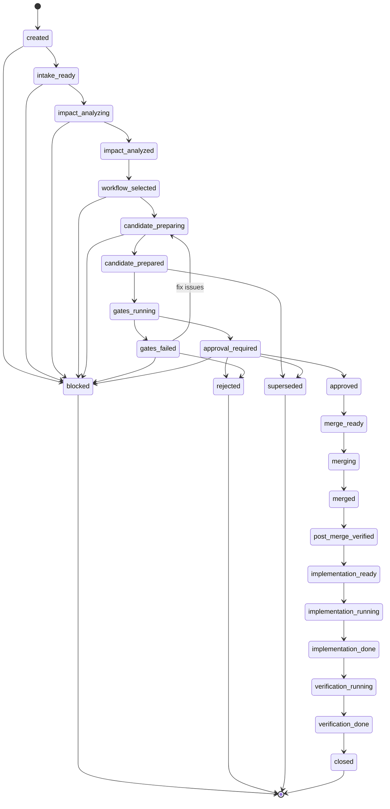
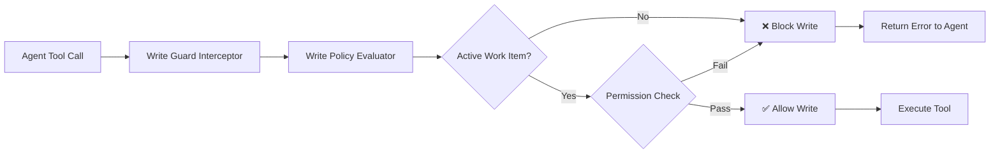
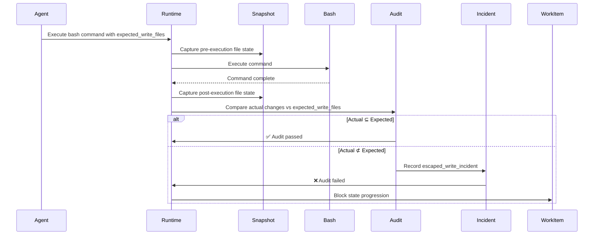
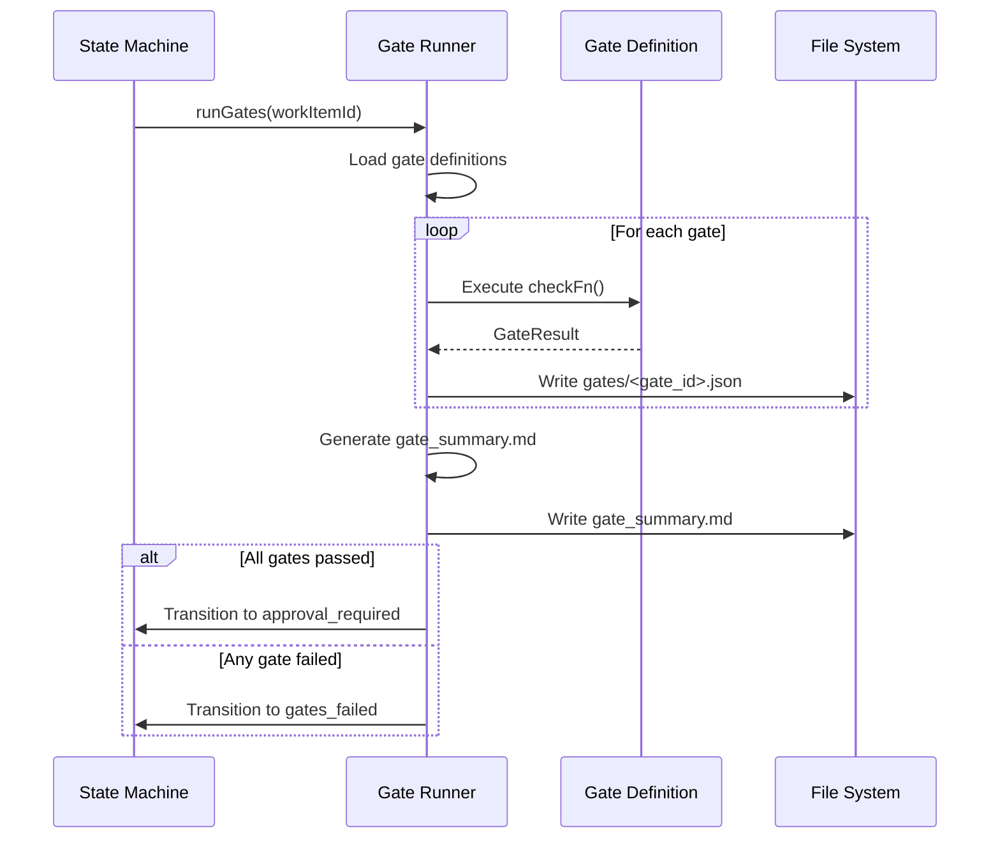
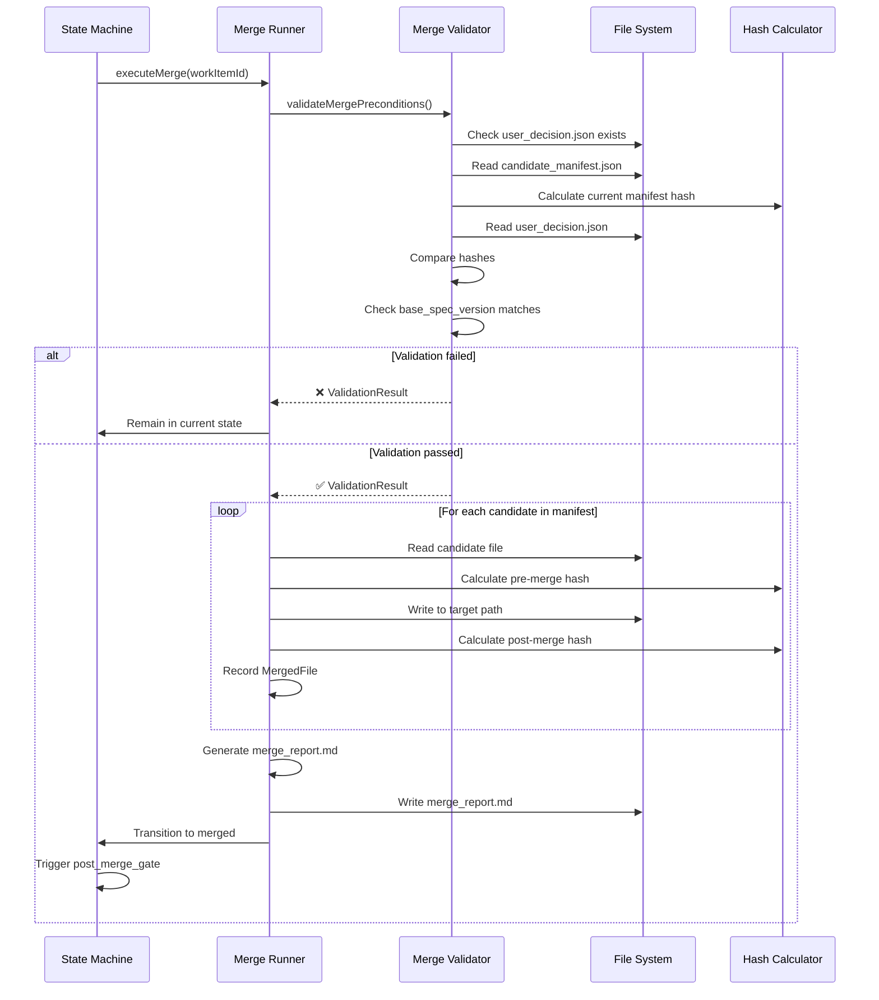
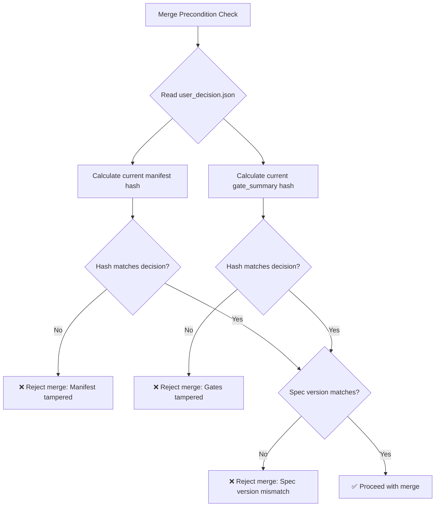
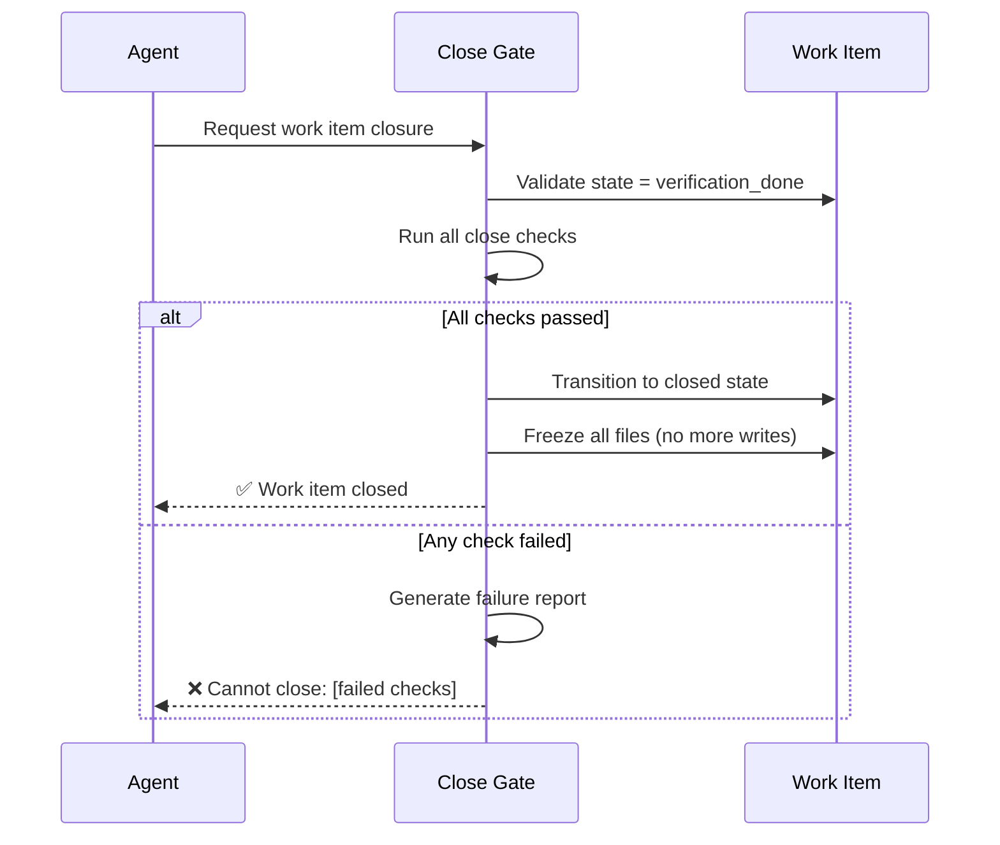
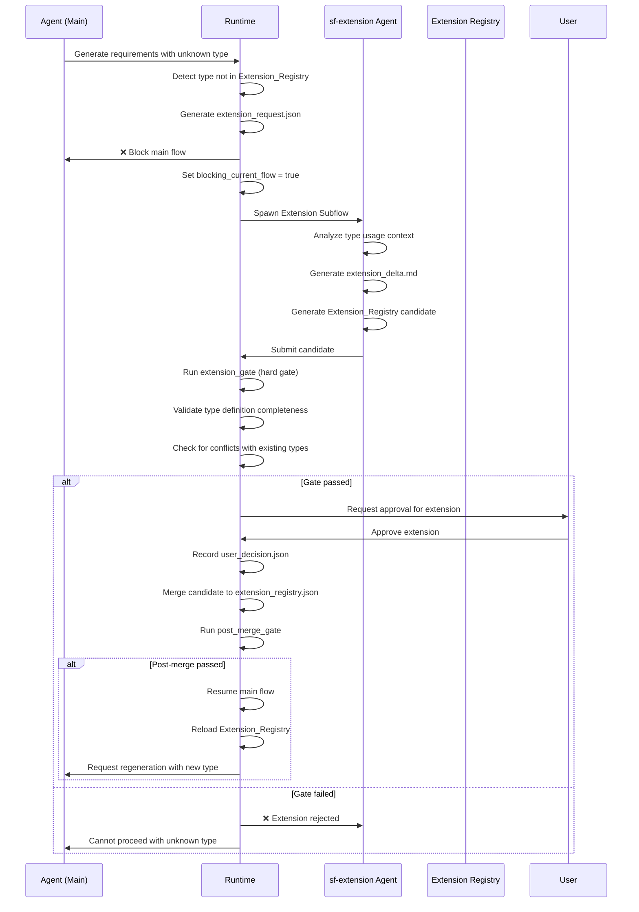

# Technical Design Document

## Introduction

This document specifies the technical design for migrating SpecForge from an "Agent workflow framework" to an "unavoidable spec-driven Runtime" compliant with SpecForge v1.1 + Patch 1 standards. The migration addresses critical control gaps identified in the audit report, where system controls rely on Agent prompts rather than programmatic hard constraints.

The design implements five major technical areas:
1. Directory model migration and path governance (v1.1 compliance)
2. 24-state transaction state machine implementation
3. Candidate merge pipeline with programmatic approval gates
4. Write Guard hard constraints for unauthorized file operations
5. Extension Registry and Extension Subflow for type management

This migration will be implemented across 5 rounds, establishing project-level specification truth sources, transactional work items, candidate merge mechanisms, write guard constraints, and extension registry subflows.

## Overview

### System Transformation

**Current State (v1.0):**
- Agent-centric workflow with prompt-based controls
- Flat `.specforge/specs/**` directory structure
- Direct agent writes to specification files
- Soft constraints through agent instructions
- Ad-hoc extension type usage

**Target State (v1.1):**
- Runtime-enforced programmatic controls
- Hierarchical `.specforge/project/**` + `.specforge/work-items/**` structure
- Candidate-based merge pipeline with approval gates
- Hard constraints through Write Guard interception
- Formal Extension Registry with registration workflow

### Key Design Principles

1. **Unavoidable Controls**: All critical controls implemented as programmatic constraints that cannot be bypassed by agent behavior
2. **Transaction Model**: All specification changes flow through formal work items with state machine governance
3. **Separation of Concerns**: Clear boundaries between Agent (intent generation) and Runtime (control enforcement)
4. **Audit Trail**: Complete traceability of all specification changes through candidate manifests, gate reports, and merge reports
5. **Fail-Safe Defaults**: Write operations blocked by default; permissions explicitly granted


## Architecture

### High-Level Architecture

```mermaid
graph TB
    Agent[Agent Layer]
    Runtime[SpecForge Runtime]
    
    subgraph "Runtime Core Components"
        SM[State Machine]
        WG[Write Guard]
        PS[Path Service]
        PP[Path Policy]
    end
    
    subgraph "Workflow Components"
        GR[Gate Runner]
        MR[Merge Runner]
        UDR[User Decision Recorder]
        CPS[Code Permission Service]
        CFA[Changed Files Audit]
        CG[Close Gate]
    end
    
    subgraph "Storage Layer"
        Project[.specforge/project/**]
        WorkItems[.specforge/work-items/**]
        Runtime_Storage[.specforge/runtime/**]
        Legacy[.specforge/specs/** (read-only)]
    end
    
    Agent -->|Generate Candidates| Runtime
    Runtime -->|Enforce Constraints| WG
    Runtime -->|Validate Paths| PP
    Runtime -->|Generate Paths| PS
    Runtime -->|Manage States| SM
    
    Runtime -->|Execute Gates| GR
    Runtime -->|Execute Merge| MR
    Runtime -->|Record Decisions| UDR
    Runtime -->|Manage Permissions| CPS
    Runtime -->|Audit Changes| CFA
    Runtime -->|Validate Close| CG
    
    MR -->|Write Specs| Project
    Agent -->|Write Candidates| WorkItems
    Runtime -->|Write State| Runtime_Storage
    Agent -->|Read Only| Legacy
```

### Directory Structure Migration

**v1.0 Structure (Legacy):**
```
.specforge/
├── specs/              # Legacy specs (read-only after migration)
├── state/              # Deprecated
├── gates/              # Deprecated
└── archive/            # Deprecated
```

**v1.1 Structure (Target):**
```
.specforge/
├── project/                          # Project-level formal specifications
│   ├── spec_manifest.json            # Canonical spec file registry
│   ├── extension_registry.json       # Formal extension type definitions
│   ├── requirements_index.md
│   ├── design_index.md
│   ├── architecture.md
│   ├── glossary.md
│   ├── decisions.md
│   └── trace_matrix.md
│
├── work-items/                       # Transactional work items
│   └── <WI-ID>/                      # Individual work item directory
│       ├── work_item.json            # Work item metadata and state
│       ├── candidates/               # Agent-generated specification candidates
│       │   ├── requirements.md
│       │   ├── design.md
│       │   └── ...
│       ├── candidate_manifest.json   # Merge plan (which candidates → which targets)
│       ├── gates/                    # Gate execution results
│       │   ├── <gate_id>.json
│       │   └── ...
│       ├── gate_summary.md           # Human-readable gate summary
│       ├── user_decision.json        # User approval decision with hashes
│       ├── merge_report.md           # Merge operation results
│       ├── evidence_manifest.json    # Implementation evidence
│       ├── verification_report.md    # Verification results
│       └── extension_request.json    # Extension type requests (if any)
│
├── runtime/                          # Runtime operational data
│   ├── state.json                    # Current runtime state
│   ├── events.jsonl                  # Event log
│   ├── logs/                         # Runtime logs
│   ├── checkpoints/                  # State checkpoints
│   └── cas/                          # Content-addressable storage
│
└── specs/                            # Legacy specs (read-only, no new writes)
    └── ...
```

### Component Architecture

#### Runtime Core

The Runtime is the central control hub responsible for:
- Initializing and managing the `.specforge/` directory structure
- Loading and validating formal specifications (`spec_manifest.json`, `extension_registry.json`)
- Orchestrating component interactions (State Machine, Write Guard, Gate Runner, etc.)
- Enforcing all programmatic constraints

#### Path Service

**Responsibility**: Generate all paths according to v1.1 standards

**Interface**:
```typescript
interface PathService {
  // Project spec paths
  getProjectSpecPath(fileName: string): string;
  getExtensionRegistryPath(): string;
  getSpecManifestPath(): string;
  
  // Work item paths
  getWorkItemPath(workItemId: string): string;
  getWorkItemMetadataPath(workItemId: string): string;
  getCandidatePath(workItemId: string, fileName: string): string;
  getCandidateManifestPath(workItemId: string): string;
  getGatePath(workItemId: string, gateId: string): string;
  getGateSummaryPath(workItemId: string): string;
  getUserDecisionPath(workItemId: string): string;
  getMergeReportPath(workItemId: string): string;
  
  // Runtime paths
  getRuntimeStatePath(): string;
  getRuntimeEventsPath(): string;
  getRuntimeCheckpointPath(checkpointId: string): string;
}
```

**Key Behavior**:
- All paths are project-root-relative
- All paths use POSIX-style forward slashes
- Paths always include `.specforge/` prefix for spec files
- No path construction outside this service

#### Path Policy

**Responsibility**: Validate path strings against v1.1 rules

**Interface**:
```typescript
interface PathPolicy {
  validatePath(path: string): ValidationResult;
  validateSpecPath(path: string): ValidationResult;
  isLegacySpecPath(path: string): boolean;
  isProjectSpecPath(path: string): boolean;
  isWorkItemPath(path: string): boolean;
}

interface ValidationResult {
  valid: boolean;
  reason?: string;
}
```


**Validation Rules**:
1. Must be project-root-relative (no absolute paths)
2. Must use POSIX-style forward slashes (no `\`)
3. Must not contain path traversal patterns (`..`)
4. Must not contain home directory expansion (`~`)
5. Spec file references must start with `.specforge/`
6. Legacy spec paths (`.specforge/specs/**`) are read-only

**Rejection Examples**:
- `/absolute/path/to/file` → ❌ Absolute path
- `src\\windows\\style\\path` → ❌ Windows backslashes
- `.specforge/../escape/path` → ❌ Path traversal
- `~/home/expansion` → ❌ Home directory expansion
- `requirements.md` → ❌ Missing `.specforge/` prefix (if it's a spec file)

#### State Machine

**Responsibility**: Manage the 24-state transaction lifecycle for work items

**State Diagram**:


**State Definitions**:

| State | Description | Entry Condition |
|-------|-------------|----------------|
| `created` | Work item initialized | Initial state |
| `intake_ready` | Ready for intake analysis | Metadata complete |
| `impact_analyzing` | Analyzing impact | Agent analyzing |
| `impact_analyzed` | Impact analysis complete | Analysis artifacts ready |
| `workflow_selected` | Workflow type selected | Workflow decision made |
| `candidate_preparing` | Agent generating candidates | Agent working |
| `candidate_prepared` | Candidates ready for gates | All candidates generated |
| `gates_running` | Gate checks executing | Gates triggered |
| `gates_failed` | Gate checks failed | Any gate failed |
| `approval_required` | Awaiting user approval | All gates passed |
| `approved` | User approved changes | User decision recorded |
| `merge_ready` | Ready for merge | Approval validated |
| `merging` | Merge in progress | Merge runner executing |
| `merged` | Candidates merged to project specs | Merge complete |
| `post_merge_verified` | Post-merge checks passed | Verification complete |
| `implementation_ready` | Ready for code implementation | Specs finalized |
| `implementation_running` | Code implementation in progress | Agent implementing |
| `implementation_done` | Implementation complete | Code changes made |
| `verification_running` | Verification in progress | Tests running |
| `verification_done` | Verification complete | All tests passed |
| `closed` | Work item closed | All conditions met |
| `blocked` | Work item blocked | External blocker |
| `rejected` | Work item rejected | User/gate rejection |
| `superseded` | Work item superseded | Replaced by another WI |

**Illegal Transitions** (Examples):

The state machine enforces strict transition paths. Key illegal transitions:

- `created` → `implementation_running`: ❌ Cannot skip specification phase
- `candidate_prepared` → `merging`: ❌ Must pass gates and approval first
- `approval_required` → `merging`: ❌ Must record approval decision
- `approval_required` → `closed`: ❌ Must complete merge and verification
- `merged` → `closed`: ❌ Must complete verification
- `closed` → *any*: ❌ Terminal state
- `blocked` → `closed`: ❌ Must unblock first
- `rejected` → `closed`: ❌ Already terminal


**State Transition Authorization**:

Only specific Runtime components can transition states:

| Component | Authorized Transitions |
|-----------|----------------------|
| State Machine | All transitions (orchestrator) |
| Gate Runner | `gates_running` → `gates_failed` / `approval_required` |
| User Decision Recorder | `approval_required` → `approved` |
| Merge Runner | `merging` → `merged` |
| Code Permission Service | `implementation_ready` → `implementation_running` |
| Close Gate | `verification_done` → `closed` |

**Agent Prohibition**: Agents CANNOT directly transition work item states. They generate intent artifacts (candidates, evidence) which trigger Runtime-controlled state transitions.

#### Write Guard

**Responsibility**: Intercept and block all unauthorized file write operations

**Architecture**:


**Interception Points**:
1. `edit` tool (file editing)
2. Custom write file tools
3. `bash` commands with file write side effects
4. Code formatters (prettier, eslint --fix, etc.)
5. Code generators
6. Package managers (npm install, etc.)
7. Snapshot updates (vitest -u, jest -u)
8. Git operations (git add, git commit)

**Write Policy**:
```typescript
interface WriteGuardPolicy {
  canWrite(
    path: string,
    caller: 'agent' | 'merge_runner' | 'gate_runner' | 'user_decision_recorder',
    context: WriteContext
  ): WritePermission;
}

interface WriteContext {
  workItemId?: string;
  codeChangeAllowed: boolean;
  allowedWriteFiles: string[];
  frozenFiles: string[];
}

interface WritePermission {
  allowed: boolean;
  reason?: string;
}
```


**Write Blocking Rules**:

| Condition | Agent Write Blocked | Component Write Allowed |
|-----------|-------------------|----------------------|
| No active work item | ✅ All code writes | Merge Runner: spec writes |
| `code_change_allowed` = false | ✅ All code writes | - |
| Path not in `allowed_write_files` | ✅ Specific file | - |
| Path is `.specforge/project/**` | ✅ Always | Merge Runner: ✅ |
| Path is `user_decision.json` | ✅ Always | User Decision Recorder: ✅ |
| Path is `gates/**` | ✅ Always | Gate Runner: ✅ |
| Path is `gate_summary.md` | ✅ Always | Gate Runner: ✅ |
| Path is `merge_report.md` | ✅ Always | Merge Runner: ✅ |
| Path is `.specforge/specs/**` | ✅ Always (read-only legacy) | ❌ |
| File is frozen (after approval) | ✅ All writes | ❌ |
| Work item state is `closed` | ✅ All writes | ❌ |

#### Code Permission Service

**Responsibility**: Manage code modification permissions for work items

**Interface**:
```typescript
interface CodePermissionService {
  enableCodeChanges(workItemId: string, allowedFiles: string[]): void;
  disableCodeChanges(workItemId: string): void;
  isCodeChangeAllowed(workItemId: string): boolean;
  getAllowedFiles(workItemId: string): string[];
  addAllowedFile(workItemId: string, filePath: string): void;
  removeAllowedFile(workItemId: string, filePath: string): void;
}
```

**Lifecycle**:
1. Work item enters `implementation_ready` state
2. Code Permission Service enables `code_change_allowed = true`
3. Code Permission Service sets `allowed_write_files` based on implementation plan
4. Agent can now write to allowed files
5. Work item enters `verification_running` state
6. Code Permission Service disables `code_change_allowed = false`

#### Changed Files Audit

**Responsibility**: Audit actual file changes against declared expectations

**Flow**:



**Incident Recording**:
```typescript
interface EscapedWriteIncident {
  workItemId: string;
  command: string;
  expectedFiles: string[];
  actualChangedFiles: string[];
  escapedWrites: string[]; // actualChangedFiles - expectedFiles
  timestamp: string;
}
```

**Gate Integration**:
The `write_scope_gate` checks for any `escaped_write_incident` before allowing work item progression.

## Components and Interfaces

### Gate Runner

**Responsibility**: Execute gate checks and generate gate reports

**Interface**:
```typescript
interface GateRunner {
  runGates(workItemId: string): Promise<GateExecutionResult>;
  generateGateSummary(workItemId: string): Promise<void>;
}

interface GateExecutionResult {
  allPassed: boolean;
  results: Map<string, GateResult>;
  summary: GateSummary;
}

interface GateSummary {
  totalGates: number;
  passed: number;
  failed: number;
  blocked: number;
  waived: number;
  notEnabled: number;
}
```

**Execution Flow**:


**Gate Result File Format**:
```json
{
  "schema_version": "1.0",
  "gate_id": "spec_completeness_gate",
  "passed": true,
  "status": "passed",
  "reason": "All required specification sections present",
  "details": {
    "checkedSections": ["overview", "architecture", "components"],
    "missingSections": []
  },
  "executedAt": "2026-01-15T10:30:00Z"
}
```


### Merge Runner

**Responsibility**: Execute candidate merges according to candidate manifest

**Interface**:
```typescript
interface MergeRunner {
  executeMerge(workItemId: string): Promise<MergeResult>;
  validateMergePreconditions(workItemId: string): Promise<ValidationResult>;
}

interface MergeResult {
  success: boolean;
  mergedFiles: MergedFile[];
  errors: MergeError[];
}

interface MergedFile {
  candidatePath: string;
  targetPath: string;
  preHash: string;
  postHash: string;
  operation: 'create' | 'update';
}
```

**Merge Pipeline**:


**Merge Report Format**:
```markdown
# Merge Report

**Work Item**: WI-2024-001
**Executed At**: 2026-01-15T11:00:00Z
**Executor**: merge_runner

## Merge Operations

### 1. requirements.md
- **Source**: .specforge/work-items/WI-2024-001/candidates/requirements.md
- **Target**: .specforge/project/requirements_index.md
- **Operation**: update
- **Pre-merge Hash**: a1b2c3d4e5f6
- **Post-merge Hash**: f6e5d4c3b2a1
- **Status**: ✅ Success

### 2. design.md
- **Source**: .specforge/work-items/WI-2024-001/candidates/design.md
- **Target**: .specforge/project/design_index.md
- **Operation**: create
- **Post-merge Hash**: 1a2b3c4d5e6f
- **Status**: ✅ Success

## Summary
- Total operations: 2
- Successful: 2
- Failed: 0
```


### User Decision Recorder

**Responsibility**: Record user approval decisions with cryptographic binding to candidates and gates

**Interface**:
```typescript
interface UserDecisionRecorder {
  recordApproval(workItemId: string, decision: UserDecision): Promise<void>;
  hasValidApproval(workItemId: string): Promise<boolean>;
}

interface UserDecision {
  approved: boolean;
  timestamp: string;
  userId?: string;
  comments?: string;
}
```

**User Decision File Format**:
```json
{
  "schema_version": "1.0",
  "work_item_id": "WI-2024-001",
  "approved": true,
  "decided_at": "2026-01-15T10:45:00Z",
  "base_spec_version": "PSV-0042",
  "candidate_manifest_hash": "sha256:a1b2c3d4e5f6...",
  "gate_summary_hash": "sha256:f6e5d4c3b2a1...",
  "user_id": "user@example.com",
  "comments": "Approved after reviewing all gate results"
}
```

**Hash Binding**:
The User Decision Recorder creates a cryptographic binding between the user's approval and the exact state of:
1. **Candidate Manifest**: Which files will be merged and where
2. **Gate Summary**: Which gate checks passed/failed
3. **Base Spec Version**: The project spec version at approval time

This prevents:
- Modifying candidates after approval
- Modifying gate results after approval
- Merging against a different spec version than approved

**Detection of Tampering**:



### Close Gate

**Responsibility**: Validate all conditions are met before closing a work item

**Interface**:
```typescript
interface CloseGate {
  validateClose(workItemId: string): Promise<CloseValidationResult>;
}

interface CloseValidationResult {
  canClose: boolean;
  failedChecks: string[];
  checks: CloseCheck[];
}

interface CloseCheck {
  name: string;
  passed: boolean;
  reason?: string;
  notApplicable?: boolean;
}
```

**Close Gate Checks**:

| Check | Validation | Can Skip If |
|-------|-----------|-------------|
| State Check | Work item in `verification_done` state | - |
| Gates Check | All gates passed | - |
| User Decision Check | `user_decision.json` exists and valid | - |
| Merge Report Check | `merge_report.md` exists, all merges successful | - |
| Spec Version Check | Project spec version incremented | - |
| Evidence Check | `evidence_manifest.json` exists with required evidence | `not_applicable` flag set |
| Verification Check | `verification_report.md` exists, all verifications passed | `not_applicable` flag set |
| Trace Matrix Check | `trace_matrix.md` or `trace_delta.md` updated | `not_applicable` flag set |
| Extension Check | No unprocessed `extension_request.json` files | - |
| Write Audit Check | No unresolved `escaped_write_incident` | - |

**Execution Flow**:


### Extension Registry and Extension Subflow

**Extension Registry Structure**:
```json
{
  "schema_version": "1.0",
  "project_spec_version": "PSV-0042",
  "namespaces": {
    "requirement_types": [
      {
        "type_id": "functional_requirement",
        "display_name": "Functional Requirement",
        "description": "System functional capabilities",
        "registered_at": "2026-01-10T08:00:00Z",
        "registered_by_work_item": "WI-2024-001"
      }
    ],
    "design_types": [],
    "task_types": [],
    "verification_types": [],
    "gate_types": []
  },
  "updated_by_work_item": "WI-2024-005",
  "updated_at": "2026-01-15T12:00:00Z"
}
```


**Extension Subflow**:


**Extension Request Format**:
```json
{
  "schema_version": "1.0",
  "work_item_id": "WI-2024-008",
  "requested_types": [
    {
      "namespace": "requirement_types",
      "type_id": "performance_requirement",
      "usage_context": "Need to specify performance requirements for API endpoints"
    }
  ],
  "blocking_current_flow": true,
  "requested_at": "2026-01-15T14:00:00Z"
}
```

## Data Models

### Work Item Metadata

```typescript
interface WorkItemMetadata {
  schema_version: "1.0";
  work_item_id: string;
  title: string;
  description: string;
  current_state: WorkItemState;
  workflow_type: 'requirements-first' | 'design-first' | 'bugfix' | 'fast-task';
  created_at: string;
  updated_at: string;
  created_by: string;
  state_history: StateTransition[];
  tags?: string[];
}

interface StateTransition {
  from_state: string;
  to_state: string;
  transitioned_at: string;
  transitioned_by: string; // Component name
  reason?: string;
}
```


### Candidate Manifest

```typescript
interface CandidateManifest {
  schema_version: "1.0";
  work_item_id: string;
  base_spec_version: string; // e.g., "PSV-0042"
  target_spec_version: string; // e.g., "PSV-0043"
  candidates: CandidateEntry[];
  generated_at: string;
}

interface CandidateEntry {
  candidate_path: string; // Must be in work-items/<WI-ID>/candidates/
  target_path: string;    // Must be in .specforge/project/**
  operation: 'create' | 'update' | 'delete';
  description?: string;
}
```

**Example**:
```json
{
  "schema_version": "1.0",
  "work_item_id": "WI-2024-008",
  "base_spec_version": "PSV-0042",
  "target_spec_version": "PSV-0043",
  "candidates": [
    {
      "candidate_path": ".specforge/work-items/WI-2024-008/candidates/requirements.md",
      "target_path": ".specforge/project/requirements_index.md",
      "operation": "update",
      "description": "Add performance requirements section"
    },
    {
      "candidate_path": ".specforge/work-items/WI-2024-008/candidates/design.md",
      "target_path": ".specforge/project/design_index.md",
      "operation": "update",
      "description": "Add caching layer design"
    }
  ],
  "generated_at": "2026-01-15T09:30:00Z"
}
```

### Project Spec Manifest

```typescript
interface ProjectSpecManifest {
  schema_version: "1.0";
  project_spec_version: string; // e.g., "PSV-0043"
  project_name: string;
  project: {
    extension_registry: string;
    requirements_index: string;
    design_index: string;
    architecture: string;
    glossary: string;
    decisions: string;
    trace_matrix: string;
  };
  modules: ModuleSpec[];
  last_updated_at: string;
  last_updated_by_work_item: string;
}

interface ModuleSpec {
  module_name: string;
  requirements: string;
  design: string;
  tasks: string;
}
```

**Project Spec Version (PSV)**:
- Format: `PSV-NNNN` (e.g., `PSV-0001`, `PSV-0042`)
- Increments with every successful merge
- Used for merge validation (prevents merge against stale base)
- Tracked in `spec_manifest.json`


## Correctness Properties

*A property is a characteristic or behavior that should hold true across all valid executions of a system—essentially, a formal statement about what the system should do. Properties serve as the bridge between human-readable specifications and machine-verifiable correctness guarantees.*

### Property 1: Path Validation Consistency

*For any* path string, the Path_Policy validation SHALL consistently apply all path rules (relative path, POSIX slashes, no traversal patterns, no home expansion, proper prefix for spec files) and reject paths that violate any rule.

**Validates: Requirements 1.4, 1.5, 1.6, 1.7, 1.8, 1.9, 1.10**

### Property 2: Write Guard Protection Universality

*For any* write operation attempt to a protected path (`.specforge/project/**`, `.specforge/specs/**`, `user_decision.json`, `gates/**`, `gate_summary.md`, `merge_report.md`) by an agent caller, the Write Guard SHALL block the operation regardless of work item state or permissions.

**Validates: Requirements 1.11, 3.29, 3.30, 3.31, 3.32, 3.33, 4.20, 4.21, 4.22, 4.23, 4.24, 5.28**

### Property 3: Legacy Spec Read-Only Enforcement

*For any* path matching `.specforge/specs/**`, the Runtime SHALL allow read operations and SHALL block all write operations, ensuring legacy specifications remain immutable.

**Validates: Requirements 1.11, 1.12**

### Property 4: State Transition Authorization

*For any* work item state transition, the State Machine SHALL only accept the transition if the caller is an authorized Runtime component (State Machine, Gate Runner, User Decision Recorder, Merge Runner, Code Permission Service, or Close Gate), and SHALL reject all agent-initiated transitions.

**Validates: Requirements 2.37, 2.38, 2.39, 2.40, 2.41, 2.42, 2.43**

### Property 5: Illegal State Transition Rejection

*For any* (from_state, to_state) pair that represents an illegal transition (e.g., `created` → `implementation_running`, `candidate_prepared` → `merging`, `approval_required` → `closed`), the State Machine SHALL reject the transition attempt.

**Validates: Requirements 2.25, 2.26, 2.27, 2.28, 2.29, 2.30, 2.31, 2.32, 2.33, 2.34, 2.35, 2.36**


### Property 6: Candidate Format Validation

*For any* candidate file submitted by an agent, the Runtime SHALL validate that the candidate contains complete target file content (not patch/diff format), and SHALL reject candidates that are not complete file replacements.

**Validates: Requirements 3.1, 3.2**

### Property 7: Candidate Manifest Path Validation

*For any* candidate manifest entry, the Runtime SHALL validate that the `candidate_path` points to the current work item's `candidates/` directory and that the `target_path` points to `.specforge/project/**`, rejecting manifests with paths outside these constraints.

**Validates: Requirements 3.3, 3.4**

### Property 8: Merge Precondition Hash Validation

*For any* merge operation, the Runtime SHALL validate that the current `candidate_manifest.json` hash matches the hash recorded in `user_decision.json`, that the current `gate_summary.md` hash matches the recorded hash, and that the `base_spec_version` matches the current project spec version, rejecting merges when any hash or version mismatch occurs.

**Validates: Requirements 3.15, 3.16, 3.17, 3.18, 3.19**

### Property 9: Permission-Based Write Control

*For any* code file write operation, when no active work item exists OR when `code_change_allowed` is false OR when the target file is not in `allowed_write_files`, the Write Guard SHALL block the write operation.

**Validates: Requirements 4.3, 4.4, 4.5**

### Property 10: Tool Interception Completeness

*For any* write operation initiated through agent tools (`edit`, custom write tools, `bash` commands, formatters, generators, package managers, snapshot updates, Git operations), the Write Guard SHALL intercept the operation and apply write policy checks.

**Validates: Requirements 4.6, 4.7, 4.8, 4.9, 4.10, 4.11, 4.12, 4.13**

### Property 11: File Change Audit Accuracy

*For any* bash command execution with declared `expected_write_files`, when the actual file changes exceed the declared set, the Changed Files Audit SHALL record an `escaped_write_incident` and SHALL block work item state progression until the incident is resolved.

**Validates: Requirements 4.14, 4.15, 4.16, 4.17, 4.18, 4.19**


### Property 12: Frozen File Write Protection

*For any* file marked as frozen (after user approval) or any write operation when the work item state is `closed`, the Write Guard SHALL block all write attempts to those files.

**Validates: Requirements 4.25, 4.26**

### Property 13: Privileged Component Write Authorization

*For any* write operation by a privileged component (Merge Runner to `.specforge/project/**`, User Decision Recorder to `user_decision.json`, Gate Runner to `gates/**` and `gate_summary.md`), the Write Guard SHALL allow the write operation when the component is properly authenticated.

**Validates: Requirements 4.27, 4.28, 4.29**

### Property 14: Unknown Type Detection

*For any* specification artifact (Requirements, Design, Tasks, Verification, Gate definitions) that references a type not present in the Extension_Registry, the Runtime SHALL detect the missing type and generate an `extension_request.json` file.

**Validates: Requirements 5.3, 5.4, 5.5, 5.6, 5.7**

### Property 15: Extension Registry Write Protection

*For any* write operation targeting `extension_registry.json`, when the caller is an agent (not the Merge Runner), the Write Guard SHALL block the operation, preventing agents from directly creating or modifying extension types.

**Validates: Requirements 5.28, 5.29, 5.30**

### Property 16: JSON Parser/Serializer Round-Trip

*For any* valid JSON-serializable data object, parsing the serialized JSON string and then serializing the parsed object SHALL produce a value equivalent to the original object.

**Validates: Requirements 6.1, 6.2, 6.3**

### Property 17: Configuration Parser/Serializer Round-Trip

*For any* valid configuration object, parsing the serialized configuration file and then serializing the parsed object SHALL produce a value equivalent to the original configuration object.

**Validates: Requirements 6.4, 6.5, 6.6**


### Property 18: Candidate Manifest Parser/Serializer Round-Trip

*For any* valid Candidate_Manifest object, parsing the serialized JSON and then serializing the parsed object SHALL produce a value equivalent to the original manifest object.

**Validates: Requirements 6.7, 6.8, 6.9**

### Property 19: Parser Error Descriptiveness

*For any* invalid input provided to a parser (JSON, configuration, or manifest), the parser SHALL return an error result containing a descriptive error message indicating the nature of the parsing failure.

**Validates: Requirement 6.10**

## Error Handling

### Error Categories

The system defines four error categories with distinct handling strategies:

#### 1. Validation Errors (4xx-class)

**Characteristics**:
- Invalid input provided by agent or user
- Recoverable through correction
- Should not crash the system

**Examples**:
- Invalid path format
- Unknown extension type
- Hash mismatch during merge
- Missing required file

**Handling**:
- Return error to agent with clear message
- Log for audit
- Allow retry with corrected input
- Do not transition work item state

#### 2. Authorization Errors (403-class)

**Characteristics**:
- Attempted operation violates permissions
- Indicates possible agent misbehavior
- Should be logged for review

**Examples**:
- Agent attempting to write protected path
- Agent attempting state transition
- Write to frozen file
- Agent attempting to create unregistered extension type

**Handling**:
- Block operation immediately
- Return error to agent
- Log security event
- Do not allow retry without permission grant


#### 3. System Errors (5xx-class)

**Characteristics**:
- Internal runtime failures
- File system errors
- Unexpected exceptions
- May require manual intervention

**Examples**:
- Failed to write gate result file
- Failed to read spec manifest
- Hash calculation failure
- State persistence failure

**Handling**:
- Log error with full context
- Transition work item to `blocked` state
- Notify user/operator
- Preserve system state for debugging
- Do not lose work-in-progress

#### 4. Gate Failures (Gate-specific)

**Characteristics**:
- Gate check explicitly rejected
- Expected part of workflow
- Requires agent to fix and resubmit

**Examples**:
- Gate check returns `passed: false`
- Missing required specification section
- Incomplete type definition
- Failed post-merge verification

**Handling**:
- Transition work item to `gates_failed` state
- Write gate result to `gates/<gate_id>.json`
- Generate gate summary with failure details
- Allow agent to regenerate candidates and retry

### Error Recovery Strategies

#### Automatic Recovery
- Transient file system errors: Retry with exponential backoff (3 attempts)
- Network errors (if applicable): Retry with backoff
- Lock conflicts: Wait and retry

#### Manual Recovery
- Hash tampering detected: Require new user approval
- Escaped write incident: Require manual investigation and resolution
- Extension gate hard failure: Require extension redesign
- Close gate failure: Address missing conditions

#### State Recovery
- Unexpected crashes: Resume from last checkpoint
- Mid-merge failures: Rollback using backup
- Gate runner crashes: Re-run gates from last completed gate


### Error Logging

All errors SHALL be logged with:
```typescript
interface ErrorLog {
  timestamp: string;
  error_id: string;
  category: 'validation' | 'authorization' | 'system' | 'gate';
  severity: 'info' | 'warning' | 'error' | 'critical';
  work_item_id?: string;
  component: string;
  message: string;
  details?: Record<string, unknown>;
  stack_trace?: string;
}
```

**Log Destinations**:
- `.specforge/runtime/logs/error.log`: All errors
- `.specforge/runtime/events.jsonl`: Structured events for analytics
- Work item directory: Context-specific errors (e.g., gate failures)

## Testing Strategy

### Testing Approach

The testing strategy employs a dual approach combining property-based testing for universal invariants and example-based testing for specific scenarios:

**Property-Based Tests**:
- Validate universal properties that must hold across all valid inputs
- Use fast-check (TypeScript) for property test generation
- Minimum 100 iterations per property test
- Focus on: path validation, write guard, state transitions, parsers, authorization

**Example-Based Unit Tests**:
- Test specific scenarios and edge cases
- Test integration points between components
- Test error conditions
- Focus on: workflow orchestration, specific gate implementations, user decision recording

**Integration Tests**:
- Test complete workflows end-to-end
- Test component interactions in realistic scenarios
- Test state persistence and recovery
- Focus on: complete work item lifecycle, extension subflow, merge pipeline

**Smoke Tests**:
- Verify system initialization
- Verify directory structure creation
- Verify manifest file creation
- Quick validation of basic operations


### Property-Based Test Requirements

All property-based tests MUST:
1. Use fast-check library for TypeScript
2. Run minimum 100 iterations per test
3. Include a comment tag referencing the design property
4. Generate diverse, realistic test inputs
5. Verify the property holds for all generated inputs

**Tag Format**:
```typescript
/**
 * Feature: specforge-v1-1-compliance-remediation
 * Property 1: Path Validation Consistency
 * 
 * For any path string, the Path_Policy validation SHALL consistently
 * apply all path rules and reject paths that violate any rule.
 */
test('path policy validates all rules consistently', () => {
  fc.assert(
    fc.property(
      fc.string(), // Generate arbitrary path strings
      (path) => {
        const result = pathPolicy.validatePath(path);
        // Verify consistent validation
      }
    ),
    { numRuns: 100 }
  );
});
```

### Test Coverage Requirements

**Path Service and Path Policy**:
- ✅ Property: Path validation consistency (Property 1)
- ✅ Property: Legacy spec read-only enforcement (Property 3)
- ✅ Example: Path generation for all known path types
- ✅ Example: Specific rejection cases (absolute paths, backslashes, etc.)

**State Machine**:
- ✅ Property: State transition authorization (Property 4)
- ✅ Property: Illegal state transition rejection (Property 5)
- ✅ Example: Each of the 24 states exists
- ✅ Example: Each legal transition succeeds
- ✅ Integration: Complete work item lifecycle

**Write Guard**:
- ✅ Property: Write guard protection universality (Property 2)
- ✅ Property: Permission-based write control (Property 9)
- ✅ Property: Tool interception completeness (Property 10)
- ✅ Property: Frozen file write protection (Property 12)
- ✅ Property: Privileged component write authorization (Property 13)
- ✅ Example: Each tool type interception
- ✅ Integration: Write guard in complete workflow

**Candidate and Merge Pipeline**:
- ✅ Property: Candidate format validation (Property 6)
- ✅ Property: Candidate manifest path validation (Property 7)
- ✅ Property: Merge precondition hash validation (Property 8)
- ✅ Example: Successful merge flow
- ✅ Example: Merge rejection scenarios
- ✅ Integration: Complete merge pipeline with gates and approval


**File Change Audit**:
- ✅ Property: File change audit accuracy (Property 11)
- ✅ Example: Exact match (expected = actual)
- ✅ Example: Escaped writes detected
- ✅ Integration: Audit in implementation workflow

**Extension Registry and Subflow**:
- ✅ Property: Unknown type detection (Property 14)
- ✅ Property: Extension registry write protection (Property 15)
- ✅ Example: Extension request generation
- ✅ Example: Extension gate validation
- ✅ Integration: Complete extension subflow

**Parsers and Serializers**:
- ✅ Property: JSON parser/serializer round-trip (Property 16)
- ✅ Property: Configuration parser/serializer round-trip (Property 17)
- ✅ Property: Candidate manifest parser/serializer round-trip (Property 18)
- ✅ Property: Parser error descriptiveness (Property 19)
- ✅ Example: Valid inputs parse correctly
- ✅ Example: Invalid inputs return errors

**Gate Runner**:
- ✅ Example: Gate execution and result writing
- ✅ Example: Gate summary generation
- ✅ Example: State transition on gate pass/fail
- ✅ Integration: Gates in complete workflow

**User Decision Recorder**:
- ✅ Example: User decision recording with hashes
- ✅ Example: Hash validation
- ✅ Integration: Approval in merge pipeline

**Close Gate**:
- ✅ Example: Each close check validation
- ✅ Example: Close rejection scenarios
- ✅ Example: Successful close
- ✅ Integration: Close gate in complete workflow

### Test Organization

```
tests/
├── unit/
│   ├── path-service.test.ts
│   ├── path-policy.test.ts
│   ├── state-machine.test.ts
│   ├── write-guard.test.ts
│   ├── gate-runner.test.ts
│   ├── merge-runner.test.ts
│   ├── user-decision-recorder.test.ts
│   ├── code-permission-service.test.ts
│   ├── changed-files-audit.test.ts
│   ├── close-gate.test.ts
│   ├── parsers.test.ts
│   └── extension-registry.test.ts
│
├── properties/
│   ├── path-validation.property.test.ts
│   ├── write-guard.property.test.ts
│   ├── state-transitions.property.test.ts
│   ├── merge-validation.property.test.ts
│   ├── audit.property.test.ts
│   ├── extensions.property.test.ts
│   └── parsers.property.test.ts
│
├── integration/
│   ├── work-item-lifecycle.test.ts
│   ├── merge-pipeline.test.ts
│   ├── extension-subflow.test.ts
│   ├── write-guard-integration.test.ts
│   └── error-recovery.test.ts
│
└── smoke/
    └── system-initialization.test.ts
```


## Implementation Phases

The migration will be implemented in 5 rounds, building incrementally on previous work:

### Round 1: Directory Model and Path Governance

**Objective**: Establish v1.1 directory structure and path control foundation

**Components**:
- Path Service implementation
- Path Policy implementation
- Directory initialization logic
- Legacy spec read-only enforcement
- Project spec manifest creation

**Deliverables**:
- Initialized `.specforge/project/` directory
- Initialized `.specforge/work-items/` directory
- Initialized `.specforge/runtime/` directory
- Empty `spec_manifest.json`
- Empty `extension_registry.json`
- Path validation with all rules enforced
- Legacy specs marked read-only

**Acceptance**:
- All path generation methods available
- All path validation rules enforced
- Legacy spec writes blocked
- Project initialization creates correct structure
- Forbidden directories cannot be created

### Round 2: State Machine Implementation

**Objective**: Implement 24-state transaction state machine with transition controls

**Components**:
- State Machine with all 24 states
- State transition validation
- State history tracking
- Work item metadata management
- State transition authorization

**Deliverables**:
- Complete state machine with all states
- Illegal transition blocking
- State transition authorization enforcement
- Work item metadata schema
- State history persistence

**Acceptance**:
- All 24 states supported
- All illegal transitions blocked
- Only authorized components can transition states
- Agent state transition attempts blocked
- State history correctly recorded


### Round 3: Candidate Merge Pipeline

**Objective**: Implement candidate-based merge pipeline with gates and approval

**Components**:
- Candidate format validation
- Candidate manifest schema and validation
- Gate Runner
- User Decision Recorder
- Merge Runner
- Post-merge gate
- Hash-based tampering detection

**Deliverables**:
- Candidate validation (complete files only)
- Candidate manifest with path validation
- Gate execution framework
- Gate result files and gate summary
- User decision recording with hash binding
- Merge precondition validation
- Merge execution with report generation
- Post-merge verification

**Acceptance**:
- Agents can only submit complete candidate files
- Candidate manifest paths validated
- Gates execute and generate results
- User decisions recorded with hashes
- Merge validates all preconditions
- Hash tampering detected and blocked
- Merge report generated correctly
- Post-merge gate validates merge success

### Round 4: Write Guard Hard Constraints

**Objective**: Implement programmatic write blocking for all unauthorized operations

**Components**:
- Write Guard interceptor
- Code Permission Service
- Changed Files Audit
- Tool interception (edit, bash, formatters, etc.)
- Write policy evaluation
- Escaped write incident recording

**Deliverables**:
- Write Guard intercepting all write tools
- Permission-based write control
- Protected path blocking (project specs, gates, decisions, etc.)
- Frozen file protection
- Privileged component authorization
- Bash command write declaration and audit
- Escaped write incident detection

**Acceptance**:
- All write tools intercepted
- Writes blocked when no work item active
- Writes blocked when code_change_allowed = false
- Writes blocked for paths not in allowed_write_files
- Protected paths blocked for agents
- Frozen files cannot be modified
- Privileged components can write to authorized paths
- Bash command writes audited
- Escaped writes detected and block progression


### Round 5: Extension Registry and Extension Subflow

**Objective**: Implement formal extension type management with registration workflow

**Components**:
- Extension Registry schema and validation
- Unknown type detection
- Extension request generation
- Extension subflow orchestration
- sf-extension agent integration
- Extension gate (hard gate)
- Extension merge and registry update

**Deliverables**:
- Extension Registry with all namespaces
- Type detection across all artifact types
- Extension request generation on unknown type
- Extension subflow blocking main flow
- sf-extension agent producing extension delta and candidate
- Extension gate validating type definitions
- Extension approval and merge
- Main flow resumption with new types

**Acceptance**:
- Extension Registry created at initialization
- Unknown types detected in all artifact types
- Extension requests generated with blocking flag
- Extension subflow executes independently
- Extension gate validates completeness and conflicts
- User approval required for extensions
- Extensions merged to registry
- Main flow resumes after extension registration
- Agents cannot bypass extension registry

### Cross-Cutting Implementation (All Rounds)

**Parser and Serializer Testing**:
- Round 1: JSON parser/serializer with round-trip tests
- Round 2: Work item metadata parser/serializer
- Round 3: Candidate manifest parser/serializer
- Round 5: Extension registry parser/serializer

**Close Gate Implementation**:
- Round 3: Basic close checks (state, gates, decision, merge report)
- Round 4: Write audit check
- Round 5: Extension check

**Runtime Component Responsibilities**:
- All rounds: Clear boundary enforcement between agent and runtime
- All rounds: Agent generates intent, Runtime enforces control
- All rounds: Audit logging and observability


## Migration Strategy

### Backward Compatibility

**Legacy Spec Access**:
- All existing `.specforge/specs/**` files remain readable
- Agents can reference legacy specs during transition
- No new writes to legacy specs allowed
- Gradual migration of specs to `.specforge/project/**`

**Migration Tool**:
```typescript
interface SpecMigrationTool {
  migrateSpec(legacyPath: string, targetPath: string): Promise<void>;
  validateMigration(legacyPath: string, targetPath: string): Promise<boolean>;
  listUnmigratedSpecs(): Promise<string[]>;
}
```

**Migration Workflow**:
1. Create work item for spec migration
2. Tool copies legacy spec to work item candidates
3. Agent reviews and updates to v1.1 format
4. Candidate goes through normal merge pipeline
5. Legacy spec marked as migrated (metadata)
6. After all specs migrated, legacy directory becomes archive

### Rollout Plan

**Phase 1: Development and Testing (Weeks 1-4)**
- Implement Round 1-3 features
- Unit and property tests
- Integration tests
- Internal dogfooding

**Phase 2: Beta Testing (Weeks 5-6)**
- Deploy to test projects
- Collect feedback
- Fix issues
- Performance optimization

**Phase 3: Round 4-5 Implementation (Weeks 7-8)**
- Implement Write Guard and Extension Registry
- Complete test coverage
- Documentation updates

**Phase 4: Production Rollout (Weeks 9-10)**
- Deploy to all projects
- Monitor for issues
- Support migration questions
- Finalize documentation

### Risk Mitigation

**Risk: Data Loss During Migration**
- Mitigation: All operations go through work items with audit trail
- Mitigation: Atomic merge operations with rollback
- Mitigation: Backup before each merge

**Risk: Performance Degradation**
- Mitigation: Path validation caching
- Mitigation: Lazy loading of manifests
- Mitigation: Optimized file system operations

**Risk: Agent Confusion**
- Mitigation: Clear error messages with guidance
- Mitigation: Documentation and examples
- Mitigation: Agent prompt updates

**Risk: Tool Breakage**
- Mitigation: Comprehensive tool interception testing
- Mitigation: Phased rollout
- Mitigation: Quick rollback capability


## Security Considerations

### Threat Model

**Threat 1: Malicious Agent Bypassing Controls**
- Attack: Agent attempts to write directly to protected paths
- Defense: Write Guard intercepts all writes at tool level
- Defense: Path Policy validates all paths
- Defense: Authorization checks on all operations

**Threat 2: Candidate Tampering After Approval**
- Attack: Modify candidates or manifest after user approval
- Defense: Hash binding in user_decision.json
- Defense: Merge precondition validation
- Defense: File freezing after approval

**Threat 3: Privilege Escalation**
- Attack: Agent impersonates privileged component
- Defense: Component authentication/identification
- Defense: Explicit privilege grants in code
- Defense: No dynamic privilege assignment

**Threat 4: State Machine Exploitation**
- Attack: Agent forces illegal state transitions
- Defense: State Machine rejects agent transitions
- Defense: Only Runtime components can transition
- Defense: Transition validation before execution

**Threat 5: Extension Registry Poisoning**
- Attack: Agent creates malicious extension types
- Defense: Extension Subflow required for new types
- Defense: Extension gate validates definitions
- Defense: User approval required
- Defense: Write Guard blocks direct registry writes

### Security Best Practices

**Principle of Least Privilege**:
- Components only have permissions they need
- Write permissions explicitly granted
- Read-only by default for sensitive paths
- Time-limited permissions (work item lifecycle)

**Defense in Depth**:
- Multiple validation layers (Path Policy, Write Guard, State Machine)
- Hash validation prevents tampering
- Audit trail for all operations
- Component isolation

**Fail-Safe Defaults**:
- Writes blocked unless explicitly allowed
- State transitions blocked unless authorized
- Unknown types trigger extension subflow
- Close gate validates all conditions


## Performance Considerations

### Performance Targets

| Operation | Target Latency | Notes |
|-----------|---------------|-------|
| Path validation | < 1ms | In-memory regex checks |
| Write guard check | < 5ms | Policy evaluation |
| State transition | < 10ms | Update metadata, persist |
| Gate execution | < 5s | Depends on gate complexity |
| Candidate merge | < 500ms | Per file merge operation |
| Hash calculation | < 100ms | Per file (SHA-256) |
| Extension detection | < 50ms | Registry lookup |

### Optimization Strategies

**Path Validation Caching**:
```typescript
class PathPolicyCache {
  private cache = new Map<string, ValidationResult>();
  
  validate(path: string): ValidationResult {
    if (this.cache.has(path)) {
      return this.cache.get(path)!;
    }
    const result = this.doValidation(path);
    this.cache.set(path, result);
    return result;
  }
}
```

**Lazy Loading**:
- Load manifests only when needed
- Cache parsed manifests
- Invalidate cache on work item state changes

**Batch Operations**:
- Gate execution in parallel where possible
- Merge operations batched by directory
- Hash calculations parallelized

**File System Optimization**:
- Use async I/O for all operations
- Stream large files instead of loading to memory
- Minimize file system calls

**Index Structures**:
- Extension Registry indexed by type_id
- Work item index by state
- Gate result index by work item

### Monitoring and Metrics

**Key Metrics**:
- Average gate execution time
- Merge operation duration
- Write guard check latency
- State transition frequency
- Cache hit rate
- File change audit overhead

**Monitoring**:
```typescript
interface PerformanceMetrics {
  operation: string;
  duration_ms: number;
  work_item_id?: string;
  success: boolean;
  timestamp: string;
}
```

Metrics logged to `.specforge/runtime/metrics.jsonl` for analysis.


## Observability and Debugging

### Event Logging

All significant operations emit structured events to `.specforge/runtime/events.jsonl`:

```typescript
interface RuntimeEvent {
  event_id: string;
  timestamp: string;
  event_type: string;
  work_item_id?: string;
  component: string;
  action: string;
  result: 'success' | 'failure' | 'blocked';
  details?: Record<string, unknown>;
  duration_ms?: number;
}
```

**Event Types**:
- `state_transition`: Work item state changes
- `write_blocked`: Write operation blocked by Write Guard
- `gate_executed`: Gate check execution
- `merge_executed`: Candidate merge operation
- `approval_recorded`: User decision recorded
- `extension_requested`: Extension type request generated
- `audit_incident`: Escaped write detected

### Debugging Support

**Work Item Inspection**:
```bash
sf-debug work-item WI-2024-008
# Shows:
# - Current state
# - State history
# - All files in work item directory
# - Gate results
# - Merge status
# - Audit incidents
```

**Path Validation Debugging**:
```bash
sf-debug path-validate ".specforge/project/requirements.md"
# Shows:
# - Validation result
# - Which rules passed/failed
# - Suggested corrections
```

**Write Guard Analysis**:
```bash
sf-debug write-blocks WI-2024-008
# Shows:
# - All blocked write attempts
# - Reason for each block
# - Permission state at block time
```

**State Machine Visualization**:
```bash
sf-debug state-diagram WI-2024-008
# Generates Mermaid diagram showing:
# - Current state
# - Available transitions
# - Blocked transitions
```

### Audit Trail

Complete audit trail for compliance:

**File**: `.specforge/runtime/audit.jsonl`

```typescript
interface AuditEntry {
  timestamp: string;
  work_item_id: string;
  operation: string;
  actor: 'agent' | 'user' | 'runtime_component';
  actor_id?: string;
  target?: string;
  result: string;
  details?: Record<string, unknown>;
}
```

**Audit Coverage**:
- All state transitions (who, when, why)
- All write operations (allowed and blocked)
- All gate executions
- All user decisions
- All merge operations
- All extension requests


## Documentation Requirements

### User-Facing Documentation

**Migration Guide**:
- Overview of v1.1 changes
- Step-by-step migration process
- Breaking changes and workarounds
- FAQ for common issues

**Agent Integration Guide**:
- How to work with work items
- Candidate generation best practices
- Understanding gate failures
- Extension type usage

**Runtime Operator Guide**:
- Installation and configuration
- Monitoring and metrics
- Troubleshooting common issues
- Performance tuning

### Developer Documentation

**Architecture Documentation**:
- System architecture diagrams
- Component interaction flows
- State machine documentation
- Extension points

**API Documentation**:
- Path Service API
- State Machine API
- Write Guard configuration
- Gate definition format

**Testing Documentation**:
- How to write property tests
- Test organization guidelines
- Integration test setup
- CI/CD integration

### Component Specifications

Each component SHALL have:
1. **Purpose**: What problem it solves
2. **Interface**: Public API surface
3. **Behavior**: Detailed behavior specification
4. **Dependencies**: Other components it depends on
5. **Configuration**: Configuration options
6. **Error Handling**: Error scenarios and responses
7. **Testing**: How to test the component

## Future Enhancements

### Phase 2 Enhancements (Post-v1.1)

**Concurrent Work Items**:
- Multiple work items active simultaneously
- Conflict detection and resolution
- Merge ordering and dependencies

**Distributed Runtime**:
- Multi-instance deployment
- Distributed state coordination
- Event sourcing for audit trail

**Advanced Gates**:
- AI-powered gate checks
- External service integration (CI/CD, code review)
- Policy-as-code enforcement

**Performance Optimizations**:
- Incremental merge (delta-only)
- Parallel gate execution
- Distributed hash calculation

**Enhanced Extension Management**:
- Extension versioning
- Extension dependencies
- Extension marketplace


## Appendix A: State Transition Matrix

Complete state transition matrix showing all legal transitions:

| From State | To States | Trigger |
|------------|-----------|---------|
| `created` | `intake_ready`, `blocked` | Metadata complete / External blocker |
| `intake_ready` | `impact_analyzing`, `blocked` | Agent starts / External blocker |
| `impact_analyzing` | `impact_analyzed`, `blocked` | Analysis complete / External blocker |
| `impact_analyzed` | `workflow_selected` | Workflow decision made |
| `workflow_selected` | `candidate_preparing`, `blocked` | Agent starts / External blocker |
| `candidate_preparing` | `candidate_prepared`, `gates_failed`, `blocked` | Candidates ready / Validation failed / External blocker |
| `candidate_prepared` | `gates_running`, `superseded` | Gates triggered / Superseded by another WI |
| `gates_running` | `gates_failed`, `approval_required` | Any gate failed / All gates passed |
| `gates_failed` | `candidate_preparing`, `rejected`, `blocked` | Fix and retry / User rejection / External blocker |
| `approval_required` | `approved`, `rejected`, `superseded` | User approves / User rejects / Superseded |
| `approved` | `merge_ready` | Approval validated |
| `merge_ready` | `merging` | Merge runner starts |
| `merging` | `merged` | Merge complete |
| `merged` | `post_merge_verified` | Post-merge gate passed |
| `post_merge_verified` | `implementation_ready` | Specs finalized |
| `implementation_ready` | `implementation_running` | Code permission granted |
| `implementation_running` | `implementation_done` | Implementation complete |
| `implementation_done` | `verification_running` | Verification starts |
| `verification_running` | `verification_done` | All verifications passed |
| `verification_done` | `closed` | Close gate passed |
| `blocked` | Terminal state | - |
| `rejected` | Terminal state | - |
| `superseded` | Terminal state | - |
| `closed` | Terminal state | - |

**Terminal States**: Once a work item enters a terminal state (`closed`, `blocked`, `rejected`, `superseded`), no further transitions are allowed.


## Appendix B: File Format Examples

### Candidate Manifest Example

```json
{
  "schema_version": "1.0",
  "work_item_id": "WI-2026-015",
  "base_spec_version": "PSV-0042",
  "target_spec_version": "PSV-0043",
  "candidates": [
    {
      "candidate_path": ".specforge/work-items/WI-2026-015/candidates/requirements.md",
      "target_path": ".specforge/project/requirements_index.md",
      "operation": "update",
      "description": "Add authentication requirements"
    },
    {
      "candidate_path": ".specforge/work-items/WI-2026-015/candidates/design.md",
      "target_path": ".specforge/project/design_index.md",
      "operation": "update",
      "description": "Add OAuth2 design"
    }
  ],
  "generated_at": "2026-01-15T09:30:00Z"
}
```

### Gate Summary Example

```markdown
# Gate Summary

**Work Item**: WI-2026-015
**Executed At**: 2026-01-15T10:00:00Z

## Overview

- **Total Gates**: 5
- **Passed**: 4
- **Failed**: 1
- **Blocked**: 0
- **Waived**: 0
- **Not Enabled**: 0

## Gate Results

### ✅ spec_completeness_gate
**Status**: Passed
**Severity**: Hard
**Reason**: All required specification sections present

### ✅ spec_consistency_gate
**Status**: Passed
**Severity**: Hard
**Reason**: No conflicting requirements detected

### ❌ test_coverage_gate
**Status**: Failed
**Severity**: Soft
**Reason**: Test coverage below 80% threshold (current: 65%)

**Details**:
- Requirements coverage: 70%
- Design coverage: 60%
- Missing test scenarios: 12

### ✅ trace_matrix_gate
**Status**: Passed
**Severity**: Hard
**Reason**: All requirements traced to design and tasks

### ✅ extension_compliance_gate
**Status**: Passed
**Severity**: Hard
**Reason**: All extension types properly registered

## Recommendation

**Cannot proceed to approval**: 1 soft gate failed. Please address test coverage issues before requesting approval.
```


### User Decision Example

```json
{
  "schema_version": "1.0",
  "work_item_id": "WI-2026-015",
  "approved": true,
  "decided_at": "2026-01-15T10:45:00Z",
  "base_spec_version": "PSV-0042",
  "candidate_manifest_hash": "sha256:a1b2c3d4e5f6789012345678901234567890123456789012345678901234abcd",
  "gate_summary_hash": "sha256:f6e5d4c3b2a1098765432109876543210987654321098765432109876543dcba",
  "user_id": "developer@example.com",
  "comments": "Approved after reviewing spec changes and gate results. Test coverage will be addressed in follow-up work item."
}
```

### Extension Request Example

```json
{
  "schema_version": "1.0",
  "work_item_id": "WI-2026-015",
  "requested_types": [
    {
      "namespace": "requirement_types",
      "type_id": "security_requirement",
      "usage_context": "Need to specify security requirements for authentication system including OWASP compliance"
    },
    {
      "namespace": "gate_types",
      "type_id": "security_audit_gate",
      "usage_context": "Need automated security audit gate to check for common vulnerabilities"
    }
  ],
  "blocking_current_flow": true,
  "requested_at": "2026-01-15T09:15:00Z"
}
```

### Extension Delta Example

```markdown
# Extension Delta

**Extension Request**: WI-2026-015
**Requested Types**: security_requirement, security_audit_gate

## Rationale

The authentication system design requires explicit security requirements to be captured separately from functional requirements. This allows:
1. Clear separation of security concerns
2. Dedicated security review workflow
3. Automated security audit gates

## Type Definitions

### security_requirement

**Namespace**: requirement_types
**Display Name**: Security Requirement
**Description**: Security-specific requirements including authentication, authorization, encryption, and compliance

**Attributes**:
- compliance_frameworks: List of applicable compliance frameworks (OWASP, GDPR, etc.)
- threat_model_ref: Reference to threat model
- mitigation_strategy: Security control implementation approach

### security_audit_gate

**Namespace**: gate_types
**Display Name**: Security Audit Gate
**Description**: Automated security checks including dependency scanning, SAST, secrets detection

**Configuration**:
- enabled_checks: List of security checks to run
- severity_threshold: Minimum severity to fail gate
- allow_waivers: Whether security issues can be waived with justification

## Impact Analysis

- No conflicts with existing extension types
- Compatible with current workflow structure
- Requires sf-extension agent update to support security_audit_gate implementation
```


## Appendix C: Component Responsibility Matrix

| Component | Responsibilities | NOT Responsible For |
|-----------|-----------------|---------------------|
| **Runtime** | Initialize directories, Load manifests, Orchestrate components, Enforce constraints | Generating specifications, Making user decisions |
| **Path Service** | Generate v1.1 compliant paths | Validating paths, Creating directories, Writing files |
| **Path Policy** | Validate path format and rules | Generating paths, Enforcing writes, Accessing file system |
| **State Machine** | Manage work item states, Validate transitions, Track history | Deciding which state to transition to, Executing gates, Merging files |
| **Write Guard** | Intercept writes, Evaluate permissions, Block unauthorized writes | Deciding permissions, Managing allowed files list |
| **Code Permission Service** | Manage code_change_allowed flag, Manage allowed_write_files list | Blocking writes (that's Write Guard), Executing commands |
| **Gate Runner** | Execute gates, Generate gate results, Create gate summary | Defining gate logic (that's in gate definitions), Approving changes |
| **User Decision Recorder** | Record approval decisions, Calculate hashes, Bind approval to artifacts | Making approval decision, Executing merge |
| **Merge Runner** | Merge candidates to project specs, Generate merge report, Calculate file hashes | Validating approval (done before call), Executing gates |
| **Changed Files Audit** | Capture file system state, Compare declared vs actual changes, Record incidents | Blocking writes, Managing permissions |
| **Close Gate** | Validate close conditions, Check all requirements met | Executing the close (State Machine does that), Fixing issues |
| **Agent** | Generate candidates, Generate evidence, Generate reports | Transitioning states, Merging files, Recording decisions, Bypassing controls |

## Appendix D: Gate Types Reference

### Hard Gates vs Soft Gates

**Hard Gates**:
- Must pass for work item to proceed
- Failure blocks progression
- Cannot be waived without fixing
- Examples: spec_consistency_gate, extension_gate, post_merge_gate

**Soft Gates**:
- Failure logged but allows progression with justification
- Can be waived with user approval
- Used for quality checks that shouldn't block urgent work
- Examples: test_coverage_gate, documentation_completeness_gate

### Standard Gate Types

| Gate Type | Severity | Purpose | Timing |
|-----------|----------|---------|--------|
| `spec_completeness_gate` | Hard | Verify all required spec sections present | Before approval |
| `spec_consistency_gate` | Hard | Check for contradictions in specs | Before approval |
| `extension_gate` | Hard | Validate extension type definitions | Extension subflow |
| `post_merge_gate` | Hard | Verify merge completed successfully | After merge |
| `write_scope_gate` | Hard | Check no escaped write incidents | Before implementation |
| `test_coverage_gate` | Soft | Verify test coverage meets threshold | Before approval |
| `trace_matrix_gate` | Hard | Ensure requirements traceability | Before approval |
| `close_gate` | Hard | Validate all close conditions | Before closing |


## Appendix E: Error Code Reference

### Error Code Format

`SF-[CATEGORY]-[NUMBER]`

Where:
- CATEGORY: VAL (validation), AUTH (authorization), SYS (system), GATE (gate)
- NUMBER: 4-digit sequential number

### Common Error Codes

| Code | Category | Message | Resolution |
|------|----------|---------|------------|
| `SF-VAL-1001` | Validation | Invalid path format | Check path follows v1.1 rules |
| `SF-VAL-1002` | Validation | Absolute path not allowed | Use relative path from project root |
| `SF-VAL-1003` | Validation | Path traversal detected (..) | Remove .. from path |
| `SF-VAL-1004` | Validation | Windows path separator detected | Use forward slashes only |
| `SF-VAL-1005` | Validation | Missing .specforge/ prefix | Add .specforge/ prefix for spec files |
| `SF-VAL-2001` | Validation | Candidate is not complete file | Submit complete target file content |
| `SF-VAL-2002` | Validation | Candidate in patch/diff format | Convert to complete file format |
| `SF-VAL-2003` | Validation | Candidate path outside work item | Move candidate to work-items/<WI-ID>/candidates/ |
| `SF-VAL-2004` | Validation | Target path outside project specs | Target must be in .specforge/project/** |
| `SF-VAL-3001` | Validation | Hash mismatch: candidate manifest | Candidate manifest modified after approval |
| `SF-VAL-3002` | Validation | Hash mismatch: gate summary | Gate summary modified after approval |
| `SF-VAL-3003` | Validation | Spec version mismatch | Base spec version doesn't match current |
| `SF-AUTH-4001` | Authorization | Write blocked: no active work item | Create or activate a work item first |
| `SF-AUTH-4002` | Authorization | Write blocked: code changes disabled | Enable code changes for work item |
| `SF-AUTH-4003` | Authorization | Write blocked: file not in allowed list | Add file to allowed_write_files |
| `SF-AUTH-4004` | Authorization | Write blocked: protected path | Agents cannot write to this path |
| `SF-AUTH-4005` | Authorization | Write blocked: frozen file | File frozen after approval |
| `SF-AUTH-4006` | Authorization | Write blocked: work item closed | Cannot modify closed work item |
| `SF-AUTH-5001` | Authorization | State transition unauthorized | Only Runtime components can transition states |
| `SF-AUTH-5002` | Authorization | Illegal state transition | Cannot transition from current state to target state |
| `SF-SYS-6001` | System | Failed to write file | Check file system permissions |
| `SF-SYS-6002` | System | Failed to read manifest | Check manifest file exists and is valid JSON |
| `SF-SYS-6003` | System | Hash calculation failed | File may be locked or corrupted |
| `SF-SYS-6004` | System | State persistence failed | Check runtime directory permissions |
| `SF-GATE-7001` | Gate | Gate execution failed | See gate result for details |
| `SF-GATE-7002` | Gate | Extension gate blocked | Fix extension definition issues |
| `SF-GATE-7003` | Gate | Post-merge gate failed | Merge verification failed |
| `SF-GATE-7004` | Gate | Close gate blocked | Address unmet close conditions |


## Appendix F: Glossary

**Agent**: AI-powered component that generates specification artifacts (requirements, design, candidates, evidence) based on user intent. Agents operate under Runtime controls and cannot bypass programmatic constraints.

**Base Spec Version (BSV)**: The project spec version at the time a candidate manifest is generated. Used for merge validation to prevent merging against stale specifications.

**Candidate**: A complete specification file generated by an agent, stored in the work item's `candidates/` directory, awaiting approval and merge to project specifications.

**Candidate Manifest**: A JSON file (`candidate_manifest.json`) that declares which candidate files should be merged to which target paths in project specifications.

**Changed Files Audit**: Runtime component that compares actual file changes against declared `expected_write_files` to detect unauthorized writes.

**Close Gate**: Final gate that validates all conditions are met before allowing a work item to transition to `closed` state.

**Code Permission Service**: Runtime component that manages the `code_change_allowed` flag and `allowed_write_files` list for work items.

**Escaped Write Incident**: An event where a bash command or tool modifies files beyond what was declared in `expected_write_files`.

**Extension Registry**: Project-level formal specification file (`.specforge/project/extension_registry.json`) defining all extension types available for use in specifications.

**Extension Subflow**: Independent workflow triggered when an agent uses an unregistered extension type, requiring type definition and approval before main flow can continue.

**Frozen File**: A file that cannot be modified after user approval has been recorded, preventing tampering.

**Gate**: A validation check that must pass (hard gate) or should pass (soft gate) before a work item can proceed.

**Gate Runner**: Runtime component that executes gate checks and generates gate results and summaries.

**Gate Summary**: Human-readable markdown file summarizing all gate execution results for a work item.

**Hard Gate**: A gate that must pass for the work item to proceed; failure blocks progression.

**Hash Binding**: Cryptographic technique where user approval is bound to specific artifact hashes to detect tampering.

**Legacy Specs**: Specification files in `.specforge/specs/**` from v1.0; readable but no longer writable in v1.1.

**Merge Report**: Detailed report of merge operations showing source, target, hashes, and results for each merged file.

**Merge Runner**: Runtime component that executes candidate merges according to the candidate manifest.

**Path Policy**: Runtime component that validates path strings against v1.1 path rules.

**Path Service**: Runtime component that generates all file paths according to v1.1 directory structure standards.

**Post-Merge Gate**: Gate that runs after merge completion to verify merge succeeded and project spec version was updated.

**Project Spec Manifest**: Canonical registry file (`.specforge/project/spec_manifest.json`) listing all project-level specification files.

**Project Spec Version (PSV)**: Monotonically increasing version number for project specifications; increments with each successful merge.

**Protected Path**: A path that agents cannot write to (e.g., `.specforge/project/**`, `user_decision.json`, `gates/**`).

**Runtime**: The SpecForge execution environment that enforces all programmatic constraints and orchestrates component interactions.

**Soft Gate**: A gate whose failure is logged but allows work item progression with justification.

**State Machine**: Runtime component managing the 24-state transaction lifecycle for work items.

**Terminal State**: A work item state (`closed`, `blocked`, `rejected`, `superseded`) that cannot transition to any other state.

**User Decision Recorder**: Runtime component that records user approval decisions with cryptographic hash binding to candidates and gates.

**Work Item**: The fundamental unit of specification change in v1.1; a transactional container for candidates, gates, approvals, and merges.

**Write Guard**: Runtime component that intercepts all write operations and enforces permission policies.

**Write Scope Gate**: Gate that checks for any escaped write incidents before allowing work item to proceed to implementation.


## Summary

This technical design document specifies the complete migration of SpecForge from a v1.0 "Agent workflow framework" to a v1.1 "unavoidable spec-driven Runtime." The design addresses the critical control gaps identified in the audit report by replacing agent prompt-based controls with programmatic hard constraints.

**Key Achievements**:

1. **Unavoidable Controls**: All critical operations enforced through programmatic constraints that agents cannot bypass
2. **Transaction Model**: Formal work item lifecycle with 24-state state machine governance
3. **Audit Trail**: Complete traceability through candidate manifests, gate reports, user decisions, and merge reports
4. **Security by Design**: Write Guard, hash binding, and authorization controls prevent tampering and unauthorized operations
5. **Extensibility**: Formal Extension Registry with controlled type registration workflow

**Implementation Approach**:

The design supports incremental implementation across 5 rounds:
- **Round 1**: Directory model and path governance foundation
- **Round 2**: 24-state transaction state machine
- **Round 3**: Candidate merge pipeline with gates and approval
- **Round 4**: Write Guard hard constraints
- **Round 5**: Extension Registry and Extension Subflow

**Quality Assurance**:

Comprehensive testing strategy combining:
- **19 correctness properties** for property-based testing with 100+ iterations each
- **Example-based unit tests** for specific scenarios and edge cases
- **Integration tests** for complete workflows
- **Smoke tests** for system initialization

**Backward Compatibility**:

Legacy `.specforge/specs/**` specifications remain readable with migration tooling to facilitate gradual transition to v1.1 structure.

**Result**:

A production-grade specification management system where all controls are enforced at the Runtime level, making it impossible for agents to bypass governance mechanisms, tamper with approved changes, or violate established policies.

---

*This design document follows SpecForge v1.1 + Patch 1 standards and serves as the formal specification for implementation.*
