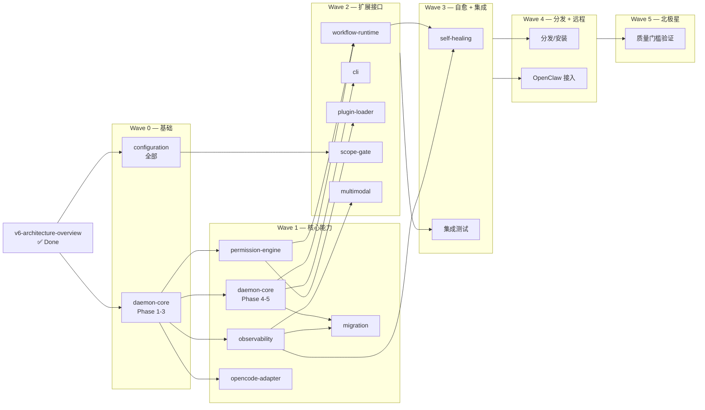

# SpecForge V6.0 开发路线图

> **性质**：本文档是 V6.0 全部 P0 模块 spec 的**并行执行调度计划**，基于依赖关系划分成波次（Wave），每个波次内的任务可并行推进。
>
> **维护者**：项目协调者（Orchestrator）根据每个 Wave 的完成情况推进下一个 Wave。
>
> **数据来源**：
> - 模块清单：`.kiro/specs/*/.config.kiro` 中 `scopeTag == "p0"` 且 `parentSpec == "v6-architecture-overview"`
> - 依赖关系：v6-architecture-overview design.md 第 2 节（Daemon 内部分层）+ artifacts/correctness-property-allocation.json
> - 里程碑映射：artifacts/milestone-tracker.md（M1–M9）

---

## 一、总体策略

**三条原则**：

1. **父规范先行**：`v6-architecture-overview` 已完成（44/44），所有下游模块现在都可以开始。
2. **依赖决定波次**：模块间的依赖关系决定 Wave 先后；Wave 内部可完全并行。
3. **Checkpoint 集中对齐**：每个 Wave 结束设一个 Checkpoint，通过后才开启下一波；避免半成品相互污染。

**依赖总览**（从底层到顶层）：

```
L0: v6-architecture-overview  ← 已完成
 ↓
L1: daemon-core (骨架) + configuration (合并引擎)
 ↓
L2: permission-engine + observability + opencode-adapter + migration
 ↓
L3: scope-gate + workflow-runtime + cli + plugin-loader + multimodal
 ↓
L4: self-healing + 端到端集成
 ↓
L5: 质量门槛验证（M8 + M9）
```

---

## 二、Wave 划分

### Wave 0 — 基础层（L1）：独立并行启动

**目标**：立起 Daemon 骨架 + 配置合并引擎；其他所有模块都依赖这两个最底层能力。

| Spec | 范围 | 对应里程碑 | 预估任务占比 |
|---|---|---|---|
| **daemon-core** | Phase 1–3：进程生命周期、HTTP/SSE、Event Bus、Session Registry、Project Manager | M1 + M2 部分 | ~40% |
| **configuration** | 全部 Phase：四层合并、敏感字段拒写、热加载边界 | M7 前置 | 100% |

**并行度**：2 个 spec 同时开发。

**Checkpoint W0（退出条件）**：
- daemon-core：Event Bus 可发/收事件；Session Registry 预登记 + 首次接触绑定可用；HTTP server 可接收 Bearer Token 请求
- configuration：四层合并确定性验证通过（Property 11）；敏感字段拒写（REQ-9.4）通过
- 所有单测 + 已实现 Property 的 PBT ≥ 100 iteration 通过

---

### Wave 1 — 核心能力层（L2）：四路并行

**目标**：在 Daemon 骨架和配置之上，并行交付权限、可观测、适配器、迁移四个承接 Correctness Property 的关键模块。

| Spec | 范围 | 依赖 | 承接 Property |
|---|---|---|---|
| **daemon-core**（剩余） | Phase 4–5：WAL + state.json + Recovery | W0 完成 | 1, 6, 7, 20, 21 |
| **permission-engine** | Phase 2–5：三层策略 + Bearer Token + 远程模式 + 插件权限 + PBT | daemon-core Phase 3 | 3, 10, 16, 26, 28 |
| **observability** | 全部 Phase：Event Bus 落盘、CAS、三级模式、事件 schema | daemon-core Phase 3 | 2, 8, 9, 10, 30 |
| **opencode-adapter** | 全部 Phase：LLMKernelAdapter 接口 + OpenCodeAdapter 实现 + 版本对齐 | daemon-core Phase 3 (Session Registry) | 4, 12 |
| **migration** | 全部 Phase：schema_version 单调 + 自动迁移 + 备份 | daemon-core Phase 4 (events.jsonl) | 14, 20（部分） |

**并行度**：5 个 spec 同时推进（daemon-core 收尾 + 4 个下游）。

**Checkpoint W1（退出条件）**：
- Property 1, 3, 6, 7, 10, 14, 16 全部通过对应 PBT（≥ 100 iter，安全属性 3 和 7 ≥ 1000 iter）
- WAL 语义验证通过（先 fsync events.jsonl 再更新 state.json）
- 权限决策事件六字段齐备
- OpenCodeAdapter 版本 mismatch 检测可用

---

### Wave 2 — 扩展与接口层（L3）：五路并行

**目标**：在核心能力之上，并行交付工作流引擎、CLI、插件加载、范围控制、多模态骨架。

| Spec | 范围 | 依赖 | 承接 Property |
|---|---|---|---|
| **workflow-runtime** | 全部 Phase：feature_spec workflow + 4 Gate + state machine | permission-engine + daemon-core 完成 | 29 |
| **cli** | 全部 Phase：双模式输出 + 异步 jobId + webhook 注册 + payload size | daemon-core HTTP 完成 | 17, 18 |
| **plugin-loader** | Phase 静态检查部分（P0 子集）：manifest 校验 + 静态 API 扫描 | permission-engine 完成 | 28（静态侧）|
| **scope-gate** | 全部 Phase：REQ-25 parser + 运行时检查 + feature flag | configuration 完成 | 15 |
| **multimodal** | 全部 Phase：UserMessage schema + CAS 接入 + V6.0 拒绝非文本 | observability (CAS) 完成 | 9（多模态侧）, 13, 23 |

**并行度**：5 个 spec 同时推进。

**Checkpoint W2（退出条件）**：
- Property 9, 13, 15, 17, 18, 23, 28, 29 全部通过对应 PBT
- `feature_spec` workflow 端到端可执行（M4 主要判据）
- CLI 所有命令均支持 `--json` 模式
- scope-gate 对 V6.0 分支验证：所有 P1/P2 能力默认关闭

---

### Wave 3 — 自愈与集成（L4）：二路并行 + 联调

**目标**：完成自愈诊断 + 启动跨模块集成联调。

| Spec | 范围 | 依赖 | 承接 Property |
|---|---|---|---|
| **self-healing** | 全部 Phase：Diagnose 阶段（V6.0 只实现这一段）+ 回滚点前置检查 + 迭代上限 | workflow-runtime + observability 完成 | 24, 25 |
| **（集成测试）** | 跨模块端到端场景：feature_spec 全流程 + OpenClaw 模拟 + 10 类排障场景初版 | W2 全部完成 | — |

**并行度**：self-healing + 集成测试组并行。

**Checkpoint W3（退出条件）**：
- Property 24, 25 PBT 通过
- Gate 失败 → self-healing diagnose → blocked 链路可用
- 10 次随机 kill 测试：0 数据丢失（M6 判据 / REQ-27 门槛 3）

---

### Wave 4 — 分发与远程接入（L4→L5）：二路并行

**目标**：npm 分发 + OpenClaw 远程接入 + 安装向导。

| 工作包 | 内容 | 依赖里程碑 |
|---|---|---|
| **分发** | npm 包打包、安装向导、`~/.specforge/migrations/` 脚手架 | M7 |
| **远程接入** | Webhook dispatcher 完整化、OpenClaw 端到端集成、远程访问模式（API key + IP 白名单 + 二步确认） | M8 |

**Checkpoint W4（退出条件）**：
- OpenClaw 端到端完整 spec 创建与执行通过（REQ-27 门槛 4）
- 远程访问 Property 26 PBT 通过
- 全平台（Windows / macOS / Linux）安装向导烟雾测试通过

---

### Wave 5 — 北极星验证（L5）：质量门槛最后一关

**目标**：通过 V6.0 发版的全部 6 条门槛（REQ-27）。

| 门槛 | 验证方式 | 对应里程碑 |
|---|---|---|
| 门槛 1：feature_spec 端到端 | 集成测试脚本 | M4 已完成 |
| 门槛 2：北极星 10 场景 5 分钟定位 | 演练脚本 + sf-analyst | M9 |
| 门槛 3：崩溃恢复 0 数据丢失 | Fault injection 10 次 | M6 已完成 |
| 门槛 4：OpenClaw 端到端 | 集成测试 | W4 已完成 |
| 门槛 5：性能 | 基准测试（启动 < 3s、事件写入 < 5ms） | 全过程持续 |
| 门槛 6：文档完整 | `sf_v6_arch_check` 通过 + 用户手册交付 | M7 已完成 |

**Checkpoint W5（发版判据）**：
- 6 条门槛全部通过
- 30 条 Correctness Property 的 PBT 全部绿
- 打 V6.0 stable tag

---

## 三、依赖关系 DAG



---

## 四、并行执行规则

1. **同 Wave 内部并行**：同一波次中的 spec 没有强依赖，应同时推进，利用多 subagent 并发。
2. **跨 Wave 严格串行**：未达到上一 Wave 的 Checkpoint，不开启下一 Wave；这是"防半成品污染"的硬规则。
3. **Wave 内 spec 细粒度 DAG**：每个 spec 的 tasks.md 自身有 wave 标注（见各 spec tasks.md 底部的 `Task Dependency Graph`），subagent 可按其中的 waves 进一步并行化。
4. **Property 覆盖率每波次校验**：每个 Wave 结束运行 `.kiro/specs/v6-architecture-overview/artifacts/cp_allocation_verifier.ts`，确保承接的 Property 都有 PBT 实现。

---

## 五、当前入口建议

根据审计，当前状态：
- ✅ v6-architecture-overview 完成
- ⚠️ 多个下游 spec 有零散的已完成任务（permission-engine 5/20, observability 3/21, plugin-loader 1/135, scope-gate 2/106）——这些是在 v6-architecture-overview 的任务 6 中创建的骨架留下的

**推荐立刻启动 Wave 0**：
- 并行开 2 个 orchestrator：
  1. `.kiro/specs/daemon-core/tasks.md` → 从 Phase 1 开始
  2. `.kiro/specs/configuration/tasks.md` → 从 Task 1 开始

Wave 0 完成后立即开启 Wave 1（5 路并行）。按当前任务量估算：
- Wave 0：~40 可执行任务
- Wave 1：~70 可执行任务
- Wave 2：~250 可执行任务（workflow-runtime 和 plugin-loader 各很大）
- Wave 3：~60 可执行任务
- Wave 4–5：集成 + 验证，不按任务数计

---

## 六、风险与缓冲

| 风险 | 影响 Wave | 缓冲策略 |
|---|---|---|
| daemon-core 骨架延期 | 阻塞整个 Wave 1 | daemon-core 是唯一关键路径，优先级最高；必要时把 daemon-core 拆到 Wave 0 单独做 |
| plugin-loader 任务量巨大（135 项） | 可能溢出 Wave 2 | 只做静态检查 P0 子集；运行时沙箱是 P2，不在 V6.0 |
| workflow-runtime 任务量大（103 项） | 可能溢出 Wave 2 | compositeGate 是 P1，V6.0 只做基础 Gate + feature_spec |
| scope-gate 任务量大（106 项） | 可能溢出 Wave 2 | 6 阶段可拆分：parser/registry/checker 是核心，其余（CLI 工具、dev utilities）可延后 |
| OpenClaw 外部依赖 | 阻塞 Wave 4 | 先用本地 CLI 模拟，等 OpenClaw 就绪再替换 |

---

## 七、变更管理

- 本文档与 `milestone-tracker.md` 互补：milestone-tracker 以 M1–M9 为轴记录**产出物**，本 roadmap 以 Wave 为轴记录**并行调度**。
- 任何 P0/P1/P2 范围调整 → 先改 REQ-25 → 再同步本 roadmap 与 milestone-tracker。
- 任何 spec 新增或移除承接的 Property → 同步更新 `correctness-property-allocation.json` 与本 roadmap 的 Property 归属列。

## 更新记录

| 日期 | 变更 |
|---|---|
| 2026-05-11 | 初版路线图，基于当前审计结果（v6-architecture-overview 完成；下游 P0 spec 13 个） |
