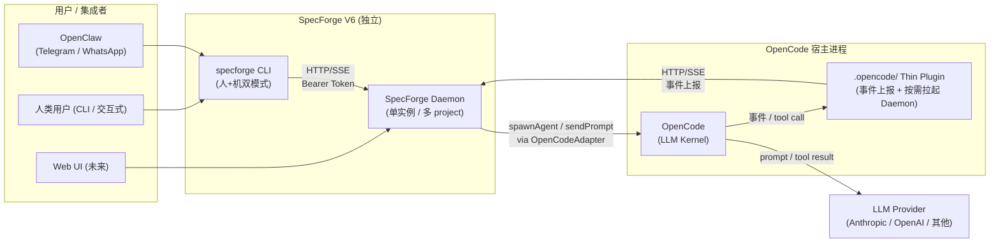
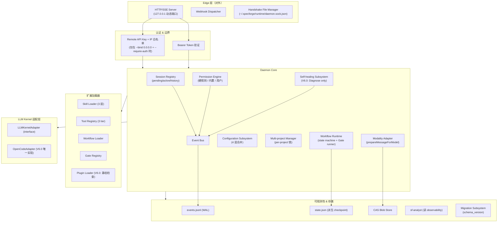
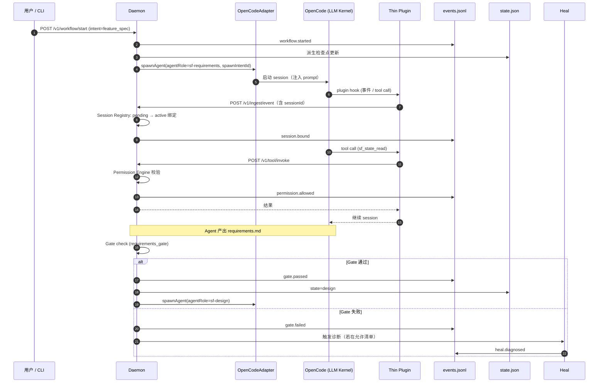
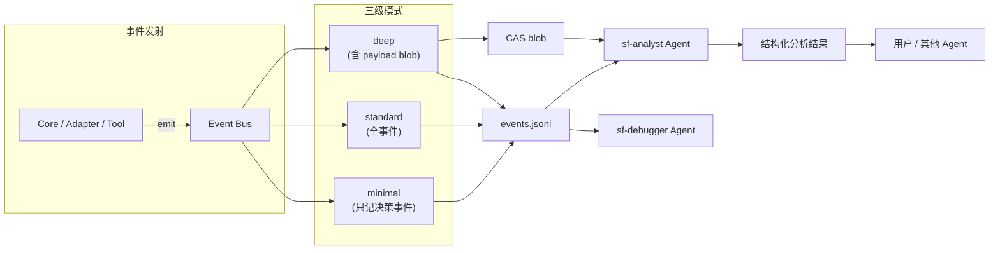
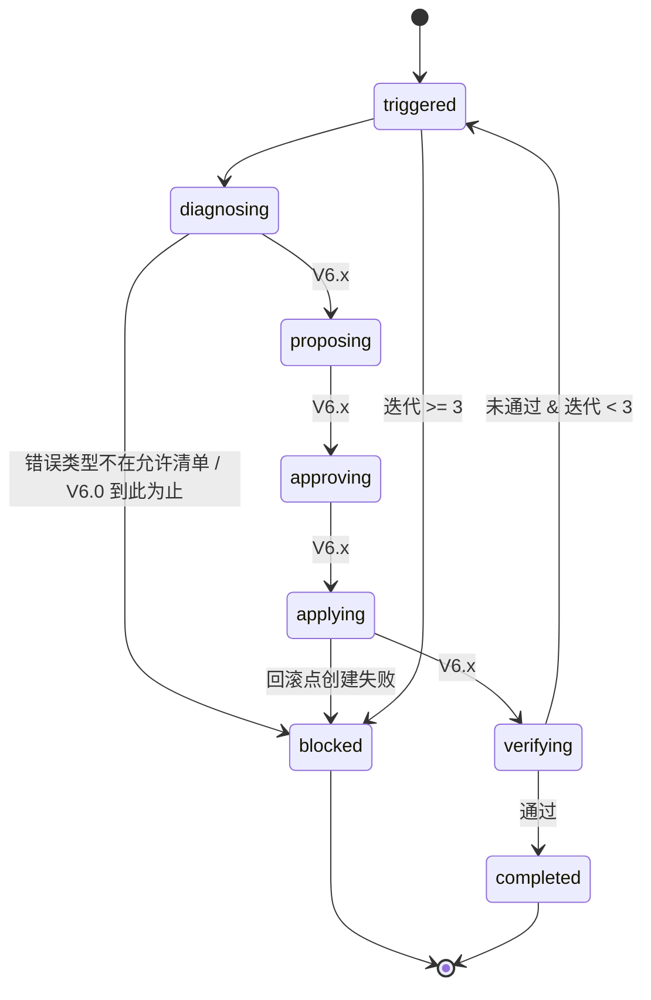

# Design Document

## Overview

### 本文档的性质

本设计文档与其对应的 `requirements.md` 一起，构成 **SpecForge V6 架构的权威参考**。它不是可执行模块的技术方案，而是：

- 把需求中列出的原则、边界、模型翻译成一套**架构决策（ADR）与组件契约**；
- 为后续每一个具体模块 spec（`daemon-core`、`observability`、`permission-engine`、`opencode-adapter`、`multimodal`、`self-healing` 等）提供**唯一指引**；
- 明确"架构一致性属性"，供下游模块 spec 以 property-based tests 细化验证。

任何模块 spec 与本文档冲突时，必须先修改本文档；模块 spec 单方面偏离本文档属于架构违例（对齐 REQ-1.3）。

### V6 的一句话定位

> SpecForge V6 是一个独立的规格驱动 AI 开发控制引擎。它把 OpenCode 当作 LLM 执行后端，自己掌握身份、权限、工作流、可观测性和知识沉淀的完整主权。

### 核心设计原则（对齐 REQ-1.2）

1. **Daemon 是唯一的 Source of Truth**：任何组件都不得绕过 Daemon 修改权威状态。
2. **SpecForge Runtime Contract 的优先级高于 OpenCode 内部行为**：OpenCode 的 plugin hook、事件 schema、tool 参数变化被 Adapter 层吸收，不得泄漏到 Daemon 核心。
3. **程序硬控优先于 Prompt 控制（继承 V5）**：能在代码里以 Gate / Permission / schema 硬约束的规则，不交给 prompt。
4. **可观测性是一级组件，不是附加能力**：Event Bus、CAS、事件日志从 day-1 就是核心，不是"后期再接监控"。
5. **扩展性优先于完备性**：V6.0 先把 Adapter、Skill、Tool、Workflow、Gate、Config 的扩展点定死，再逐步补完内置实现。

### 形态对比

| 维度 | V5（形态 A） | V6（形态 B） |
|---|---|---|
| 主进程 | OpenCode | SpecForge Daemon |
| SpecForge 形态 | OpenCode 插件 | 独立长生命周期进程 |
| 身份 / 权限 / 状态主权 | OpenCode | Daemon |
| OpenCode 角色 | 主体 | LLM Kernel（可被召唤、可 headless） |
| 寄生目录 | `~/.config/opencode/`、`.opencode/` | `~/.specforge/`、`<project>/.specforge/` |

### 北极星目标（对齐 REQ-3）

**5 分钟内从发生问题定位到根因**，覆盖 10 类排障场景（Gate 反复失败、Agent 偏离 prompt、Tool 调用错误、权限拒绝、升级 / 安装失败、状态机卡住、并发死锁、Skill 是否被调用、Workflow 是否按预期执行、Workflow 执行结果偏离预期）。

此目标在 REQ-27 门槛 2 作为 V6.0 发版必过项；Observability 子系统的一切设计围绕该目标展开。

### V6 不做边界（对齐 REQ-2、REQ-26）

**架构层**：LLM Provider 层、IDE / 编辑器插件、多租户协作、云服务、自动化部署 DevOps、LLM 评估 / 微调

**版本层（V6.0 内不做）**：V5→V6 数据迁移工具、国际化、Web UI（V6.0 内）、多租户 / 云服务、Telegram 直接集成（改由 OpenClaw 桥接）。

任何后续需求或 ADR 触及以上边界，必须先修改本 spec 的"不做边界"章节方可继续。

---

## Architecture

### 1. 最高层视图：Form B 的进程拓扑



**关键结构事实**：

- 机器上只有一个 Daemon 实例；一个 Daemon 维护多个 project context。
- Daemon 对外通信协议统一为 HTTP/1.1 + SSE，监听 `127.0.0.1` 动态端口。
- OpenCode 退化为 LLM Kernel；宿主进程里仅保留一个极薄的 Thin Plugin 做事件上报与按需拉起 Daemon。
- CLI、Thin Plugin、未来 Web UI 共用同一 HTTP 端口与 Bearer Token 机制。

### 2. Daemon 内部分层



**分层职责**：

- **Edge 层**：承担 HTTP/SSE、握手文件、webhook 派发；唯一对外暴露面。
- **认证 & 边界**：本地 Bearer Token（默认）+ 可选远程 API Key / IP 白名单（REQ-16）。
- **Daemon Core**：Session Registry、Permission Engine、Event Bus、Workflow Runtime、Config、Multi-project、Self-healing、Modality Adapter。
- **扩展加载器**：Skill / Tool / Workflow / Gate / Plugin 的注册与三层覆盖。
- **Adapter 层**：把 OpenCode 特有概念隔离在一个版本化的模块里。
- **可观测性 & 存储**：events.jsonl（WAL）+ state.json（派生 checkpoint）+ CAS blob + sf-analyst + Migration。

**架构不变式**（对齐 REQ-30）：

- Edge 与 Loaders 的任何命令/请求要改变权威状态，必须经过 Core → Event Bus → events.jsonl（Single Source of Truth Property）。
- 任何跨层通信必须通过 Event Bus（Event Bus Traversal Property）。
- OpenCode 特有概念（ctx / callID / 内部事件 schema）只能出现在 `Adapter/OpenCodeAdapter` 目录内（Adapter Encapsulation Property）。

### 3. 主要事件流：一次 feature_spec 工作流



### 4. 三级可观测模式与分析路径



**目标**：让"5 分钟定位根因"在任意一种模式下都可达成 —— standard 模式下满足日常，deep 模式下可做 post-mortem，minimal 模式下用于低硬件 / CI。

### 5. 设计决策（ADR）

本节记录本 spec 做出的关键架构决策，以及它们与需求的映射。

| ADR | 决策 | 对应需求 | 备选方案 & 理由 |
|---|---|---|---|
| ADR-001 | Daemon 采用 HTTP/1.1 + SSE，127.0.0.1 动态端口，Bearer Token | REQ-5 | 备选：Unix domain socket（Windows 支持差）、gRPC（客户端接入复杂）；HTTP 对未来 Web UI 无缝 |
| ADR-002 | Session 身份策略为"预登记 + 首次接触绑定" | REQ-6 | 备选：强依赖 OpenCode 传入 agent 字段（不稳定，易被 OpenCode 行为变更破坏） |
| ADR-003 | 权限三层；硬规则写死代码，不可配置放宽 | REQ-7 | 备选：全部配置化（违反"程序硬控优先于 Prompt" + "Daemon 作为 Source of Truth") |
| ADR-004 | OpenCode 行为变化仅由 OpenCodeAdapter 吸收；Adapter 版本与 OpenCode major 版本对齐 | REQ-8 | 备选：多处分散适配（V5 的教训：OpenCode 升级即全量返工） |
| ADR-005 | 配置四层，敏感字段禁止项目级覆盖 | REQ-9 | 简化为两层：丢失"用户 vs 项目"边界，敏感字段会被仓库泄漏 |
| ADR-006 | 项目目录改为 `<project>/.specforge/` (带点) | REQ-10 | 备选 `specforge/`（污染工作树，IDE 难以忽略） |
| ADR-007 | CLI 双模式：默认交互 + `--json` 机器模式；异步命令返回 jobId | REQ-11 | 备选：仅一种模式（人或机二选一） |
| ADR-008 | WAL：先 `events.jsonl` fsync → 再 state.json 更新 | REQ-12, REQ-30.7 | 备选：以 state.json 为主（崩溃后无法重建历史） |
| ADR-009 | 单 Daemon + 多 project context；per-project 写锁 | REQ-13 | 备选：一 project 一 Daemon（资源浪费，跨项目知识共享困难） |
| ADR-010 | V6.0 仅做多模态基础链路骨架；完整支持留 P2；V6.0 拒绝多模态内容提交 | REQ-14, REQ-25.3 | 备选：先存后处理（REQ-14.8 明确禁止） |
| ADR-011 | 自愈闭环状态机完整，但 V6.0 仅实现 Diagnose | REQ-15.7 | 备选：V6.0 做完整闭环（过早自动化，破坏性风险高） |
| ADR-012 | Telegram 集成由 OpenClaw 桥接，SpecForge 本身不做；但 OpenClaw 端到端作为 V6.0 质量门槛 | REQ-11.6, REQ-16, REQ-26 | 备选：直接集成（范围蔓延，每新增 IM 都要改 SpecForge） |
| ADR-013 | 插件沙箱 V6.0 仅静态检查 + 权限声明；运行时隔离留 P2 | REQ-17 | 备选：首版即做沙箱（工作量高，阻塞核心路径） |
| ADR-014 | 持久化文件强制带 `schema_version`，`file > code` 拒绝启动、`code > file` 自动迁移 | REQ-18 | 备选：无版本号（迁移不可回退，用户数据风险） |
| ADR-015 | V5→V6 数据迁移工具不在本版本 | REQ-18.7, REQ-26 | 备选：做迁移（V5 数据模型差异大，成本高于收益） |
| ADR-016 | Event Bus 与 events.jsonl 从 day-1 预留多机同步字段（全局事件 ID、单调时间戳、project 维度） | REQ-19 | 备选：同步时再加（届时所有历史数据需重写） |
| ADR-017 | sf-analyst 与 sf-debugger 分离 | REQ-20.3 | 备选：合并（破坏 SRP：诊断代码 vs 分析架构是两种心智） |
| ADR-018 | sf-knowledge 在 V6.0 保留角色 + 提供基础骨架；完整能力 V6.1 | REQ-20.4 | 备选：V6.0 不做（Agent Roster 10 个不成立） |
| ADR-019 | 内置 feature_spec workflow 在 V6.0 交付；Workflow 数据驱动扩展与 Gate 组合留 V6.1 | REQ-23.4, REQ-24.6 | 备选：首版全部数据驱动（风险高，无内置参照） |
| ADR-020 | Correctness Properties 以"架构不变式"形式落在本文档；各模块 spec 再细化为可执行 PBT | REQ-30 | 备选：本 spec 直接写 PBT 代码（与架构 spec 性质冲突） |


---

## Components and Interfaces

本节定义 V6 的核心组件与它们对外的契约。契约采用 TypeScript 风格伪代码描述，仅用于指明字段与方法，不约束具体实现语言。

### 1. Daemon Lifecycle（REQ-4）

```ts
interface DaemonLifecycle {
  // 三种启动方式（REQ-4.2）
  start(opts: {
    source: "thin-plugin" | "cli-on-demand" | "manual-detach";
    cwd?: string;
  }): Promise<DaemonStartResult>;

  stop(): Promise<void>;
  status(): Promise<DaemonStatus>;
}
```

**空闲退出规则**（REQ-4.3, 4.4）：
- 当 `source ∈ { "thin-plugin", "cli-on-demand" }` 且当前无活跃 project context 时，Daemon 进入 IDLE 状态。
- IDLE 状态持续 **30 秒** 后自动退出。
- `source = "manual-detach"` 时忽略空闲退出规则。

**Headless 召唤**（REQ-4.5）：Daemon 可按需启动 OpenCode headless 进程，用于 Telegram / OpenClaw 等无 UI 场景。

### 2. HTTP/SSE Edge（REQ-5, REQ-16）

```ts
interface EdgeServer {
  listen(): Promise<{ port: number; token: string }>;
  writeHandshake(path: "~/.specforge/runtime/daemon.sock.json"): Promise<void>;
}

// 握手文件 schema（权限 0600）
interface HandshakeFile {
  pid: number;
  port: number;
  token: string;                  // 仅本地可读
  schema_version: string;
  bound_to: "127.0.0.1" | "0.0.0.0";
}

// 统一认证头
// Authorization: Bearer <token>
```

**Blob 引用规则**（REQ-5.6）：任何请求或响应体单项内容 > 64 KiB 时，Edge 层强制替换为 `"blob://<sha256>"`，并要求客户端使用 `/v1/blob/:sha256` 获取。

**远程访问模式**（REQ-16.3–5）：当且仅当用户显式执行 `specforge daemon config --bind 0.0.0.0 --require-auth` 时，Edge 才允许 0.0.0.0 绑定，且强制：
- 长期 API Key（与本地 Bearer Token 分离）。
- IP 白名单。
- 敏感操作（删除 WorkItem、权限变更、配置重置）强制二步确认。

### 3. Session Registry（REQ-6）

```ts
interface AgentIdentity {
  sessionId: string;              // OpenCode session 的唯一 ID（首次接触时绑定）
  agentRole: string;              // 静态角色，如 "sf-orchestrator"
  workflowRole: string;           // 动态角色，如 "feature_spec/WI-042/requirements"
  parentSessionId: string | null; // Session Tree（REQ-6.4）
  workItemId: string | null;
  spawnIntentId: string;          // Daemon 预登记时生成
}

type SessionRecord =
  | { state: "pending"; identity: Omit<AgentIdentity, "sessionId">; spawnIntentId: string }
  | { state: "active"; identity: AgentIdentity; boundAt: number }
  | { state: "history"; identity: AgentIdentity; closedAt: number; reason: string };

interface SessionRegistry {
  preregister(intent: Omit<AgentIdentity, "sessionId">): string;      // 返回 spawnIntentId
  bindFirstContact(spawnIntentId: string, sessionId: string): AgentIdentity;
  lookupBySessionId(sessionId: string): AgentIdentity | null;
  close(sessionId: string, reason: string): void;
  rebuildFromEvents(events: AsyncIterable<Event>): Promise<void>;     // 崩溃恢复
  subtree(rootSessionId: string): AgentIdentity[];
}
```

**关键约束**：
- 身份键是 `sessionId`，不是 OpenCode 传入的 agent 字段（REQ-6.5，Session Identity Stability Property）。
- 所有状态来自事件回放（REQ-6.6）。

### 4. Permission Engine（REQ-7）

```ts
type PermissionLayer = "hard" | "builtin" | "user";
type PermissionEffect = "allow" | "deny";

interface PermissionRequest {
  actor: AgentIdentity;
  action: string;                 // 例：tool.invoke, state.write, workflow.transition
  resource: { type: string; id: string };
  context: Record<string, unknown>;
}

interface PermissionDecision {
  effect: PermissionEffect;
  matched_rule: string;           // 规则 ID
  rule_layer: PermissionLayer;
  reason: string;
}

interface PermissionEngine {
  evaluate(req: PermissionRequest): PermissionDecision;
  reportBootConflicts(): PermissionConflict[];   // REQ-7.6
  reportHotReloadConflicts(): PermissionConflict[]; // REQ-7.7
}
```

**Agent Constitution 9 条**（硬规则，不可被任何配置覆盖 —— Hard Rule Immutability Property）：
1. Agent 不得绕过 Gate。
2. Agent 不得伪造验证结果。
3. Agent 不得绕过 Permission Engine 直接触达文件系统 / 网络 / 子进程。
4. Agent 不得修改其他 Agent 的事件日志。
5. Agent 不得声明高于自身 role 的权限。
6. Agent 不得跨 project 写入权威状态。
7. Agent 不得绕过 CAS 直接引用大 blob 内容。
8. Agent 不得修改 `schema_version` 字段（仅 Migration Subsystem 可改）。
9. Agent 不得在远程访问模式下跳过二步确认。

**合并顺序**（REQ-7.4）：硬规则胜 > 更具体胜更一般 > 同优先级 deny 胜 allow。

**决策日志**（REQ-7.3，Permission Decision Traceability Property）：每次 `evaluate()` 结果以事件写入 events.jsonl，字段 `{ actor, action, resource, matched_rule, rule_layer, reason }` 齐备。

**启动期冲突**（REQ-7.5, 7.6）：加载用户/内置配置时，若试图放宽硬规则，拒绝加载并在启动日志报告；即使未实际放宽也必须报告潜在冲突。

**运行期冲突**（REQ-7.7）：热加载引入冲突时报告但继续以已加载问题配置运行，不停机。

### 5. LLM Kernel Adapter（REQ-8, REQ-22.3）

```ts
interface ModelCapabilities {
  modalities: Array<"text" | "image" | "audio" | "video" | "file">;
  maxInputTokens: number;
  supportsTools: boolean;
}

interface LLMKernelAdapter {
  readonly version: string;               // 与某 major OpenCode 版本对齐
  readonly compatibleKernelRange: string; // 例："opencode ^1.14"

  spawnAgent(params: {
    agentRole: string;
    spawnIntentId: string;
    systemPrompt: string;
    cwd: string;
  }): Promise<{ sessionId: string }>;

  getSession(sessionId: string): Promise<SessionInfo | null>;
  cancelSession(sessionId: string, reason: string): Promise<void>;

  sendPrompt(sessionId: string, message: UserMessage): Promise<void>;
  subscribeEvents(sessionId: string): AsyncIterable<KernelEvent>;

  getCapabilities(model: string): Promise<ModelCapabilities>;
}

class OpenCodeAdapter implements LLMKernelAdapter { /* V6.0 唯一实现 */ }
```

**Adapter 封装义务**（Adapter Encapsulation Property）：
- OpenCode 的 `ctx`、`callID`、plugin hook 的 shape、事件 schema —— 一律在 Adapter 内部消化，翻译成 Daemon 中立字段后再向上传递。
- 即使 Adapter 未完全吸收某次 OpenCode 变更（REQ-8.6），概念泄漏义务仍优先：宁可返回"不支持"错误，也不允许 OpenCode 概念泄漏到 Daemon Core 或 Tool Context。

**版本对齐**（REQ-8.4, Adapter Version Alignment Property）：Daemon 启动时检测 OpenCode 版本；若超出 `compatibleKernelRange`，拒绝绑定并提示升级 Adapter 或降级 OpenCode。

### 6. Configuration Subsystem（REQ-9）

```ts
type ConfigLayer = "builtin" | "user" | "project" | "runtime";

interface ConfigSubsystem {
  load(): Promise<MergedConfig>;
  sensitiveFields(): string[];                // REQ-9.3
  reloadOnNextWorkItemStart(): void;          // 热加载语义（REQ-9.5）
  getMerged(): MergedConfig;
}
```

**合并规则**（REQ-9.2）：
- 简单值：后一层覆盖前一层；
- 对象：深合并；
- 数组：替换（不拼接）。

**敏感字段清单**（至少包含，REQ-9.3）：`apiKeys`、`providerCredentials`、`bearerTokens`。项目级（Layer 3）试图覆盖敏感字段时，拒绝并记录"越级写入"事件（REQ-9.4）。

**热加载语义**（REQ-9.5）：新值在"下一个新 workflow 或新 work item 启动时"立即生效；运行中的 work item 不受影响。

**确定性合并**（Configuration Merge Monotonicity Property）：相同 4 层内容 + 相同顺序 → 相同结果。

### 7. Directory Layout（REQ-10）

**用户级**（`~/.specforge/`）：
```
~/.specforge/
├─ config/
├─ runtime/
│  └─ daemon.sock.json        (0600)
├─ knowledge/
├─ observability/
├─ skills/
├─ agents/
├─ tools/
├─ migrations/
└─ backups/
```

**项目级**（`<project>/.specforge/`，`.` 打头，与 `.git` 风格一致）：
```
<project>/.specforge/
├─ config/
├─ specs/
│  └─ {WI-XXX}/
├─ runtime/
├─ knowledge/
├─ observability/
├─ skills/
├─ agents/
└─ tools/
```

**Thin Plugin 目录**（`<project>/.opencode/`）：V6 中仅保留 Thin Plugin；不再承载 agents / tools / skills / plugins / runtime 等 SpecForge 资产（REQ-10.3）。

**Loader 优先级**（REQ-10.5）：内置 < 用户级 < 项目级。

**失败即失败**（REQ-10.6）：项目级资产加载失败（文件损坏、schema 非法）直接报错拒绝加载，不允许回退到用户级或内置版本。

### 8. CLI 双模式（REQ-11）

```
specforge <command> [args] [--json] [--wait]
specforge job <jobId>
specforge webhook register --url <url> --events "<pattern>"
specforge daemon start --detach
specforge daemon stop
specforge daemon config --bind <addr> --require-auth
specforge heal <workItemId>
```

**双模式行为**（REQ-11.1, 11.2）：
- 默认：彩色交互，带 prompt；
- `--json`：输出严格单 JSON 对象或 JSON 数组；不含 escape 色码、不含交互提示；stderr 仅用于异常。

**异步命令**（REQ-11.3, 11.4）：
- 异步命令默认立刻返回 `{ jobId: string, status: "pending" }`；
- `--wait` 阻塞直至 job 终态并返回终态 JSON；
- 任何 jobId 可通过 `specforge job <jobId>` 查询。

**Webhook**（REQ-11.5）：事件订阅使用 glob 模式（如 `gate.*`），由 Daemon 的 Webhook Dispatcher 向 URL POST JSON。

### 9. Workflow Runtime 与 Gate（REQ-23, REQ-24）

```ts
interface WorkflowDefinition {
  id: string;
  displayName: string;
  intent: string;
  stateMachine: {
    initial: string;
    states: Record<string, {
      agent: string;         // agentRole
      gate?: string | CompositeGateDef;
      skills?: string[];
      transitions?: Record<string, string>;
    }>;
  };
  artifacts: Array<{ path: string; required: boolean }>;
}

interface Gate {
  id: string;
  check(ctx: GateContext): Promise<GateResult>;
  syncKnowledgeGraph?(ctx: GateContext): Promise<void>;
}

type GateResult = { ok: true } | { ok: false; reasons: string[] };

interface CompositeGateDef {
  mode: "sequential" | "parallel";
  failPolicy: "fail_fast" | "collect_all";
  children: Array<string | CompositeGateDef>;
}
```

**V6.0 交付**（REQ-23.4, REQ-24.6）：
- 内置 1 个 workflow：`feature_spec`。
- 内置 4 个 Gate：`requirements`、`design`、`tasks`、`verification`。
- Workflow 数据驱动扩展（用户自定义 workflow 加载）与 Gate 组合执行（compositeGate）留给 V6.1（P1）。

**parallel + fail_fast 语义**（REQ-24.5）：任一子 Gate 失败立即取消尚未完成的子 Gate 并返回失败。

### 10. Skill / Tool 扩展机制（REQ-21, REQ-22）

#### Skill 目录结构

```
<skill_id>/
├─ SKILL.md           (必需)
├─ metadata.json      (必需)
├─ fragments/         (可选，支持按需加载)
│  ├─ core.md         (默认加载)
│  ├─ examples.md
│  └─ edge-cases.md
└─ hooks/             (可选)
```

`metadata.json` 必需字段：`version`、`compatible`、`applicableFor`、`dependencies`、`loading`。

**三层覆盖**（REQ-21.4）：内置 < 用户级 < 项目级。**按需加载**（REQ-21.3）：`core` 默认加载，`examples` / `edge-cases` 等按需加载。**`extends`**（REQ-21.5）：允许 skill 继承并扩展。**热加载**（REQ-21.6）：下次加载生效，不中断运行中的 work item。

#### Tool 三层

- **Tier 1（Daemon 内置）**：`sf_state_*`、`sf_knowledge_*`、`sf_event_*` 等。
- **Tier 2（用户自定义）**：TypeScript，带权限声明；字段必须包含 `id`、`displayName`、`version`、`permissions`、`inputSchema`、`outputSchema`、`execute`。
- **Tier 3（MCP Tool）**：V6.0 支持 `stdio` 与 `http` 两种 MCP server。

**Tool Context 中立**（Adapter Encapsulation Property）：Tool Context 不暴露 OpenCode 特有概念；所有跨层字段由 Adapter 翻译为 Daemon 中立字段（REQ-22.3）。

**Tier 2 V6.0 发布策略**（REQ-22.5）：默认只提供"受限只读 / 副作用可声明"子集；若完整 Tier 2 能力在代码库中已实现，允许用户使用，但完整正式发版声明归属 V6.1（P1）。

### 11. Plugin Sandbox（REQ-17）

```ts
interface PluginManifest {
  id: string;
  version: string;
  requires: Array<"filesystem.read" | "filesystem.write" | "network" | "child_process" | "env.read">;
}

interface PluginLoader {
  staticCheck(source: string): StaticCheckResult;  // 禁止敏感 API
  verifyPermissions(manifest: PluginManifest, grants: string[]): boolean;
  load(dir: string): Promise<LoadedPlugin>;
}
```

**V6.0 策略**：
- 静态检查：禁止直接 `child_process.exec`、越界 `fs` 路径、未声明的网络访问。
- 权限声明：`requires` 字段必须与用户授权对齐；未授权即拒绝加载。

**V6.x（P2）**：子进程隔离、资源限额、文件系统白名单（不在 V6.0）。

### 12. Self-healing Subsystem（REQ-15）



**V6.0 范围**（ADR-011）：只实现 `triggered → diagnosing → (blocked|END)` 的子集；其余状态定义好接口但不实现 transition。

**触发条件**（REQ-15.2）：Gate 失败且错误类型在"自愈允许清单"内，或用户显式 `specforge heal <workItemId>`。

**不触发**（REQ-15.3）：涉及用户确认、需要外部资源、严重破坏性操作。

**迭代上限**（REQ-15.4）：单 work item 最多 3 轮；超出 → `blocked`。

**回滚点语义**（REQ-15.5）：进入 `applying` 前必须先创建回滚点 → 失败则 `blocked`，绝不进入 `applying`；`verifying` 失败则自动回滚到该回滚点。

**风险分级**（REQ-15.6）：L1 自动；L2 默认自动、用户可禁用；L3 必须人工批准。

### 13. Multi-project Manager（REQ-13）

```ts
interface ProjectContext {
  rootPath: string;              // 绝对路径作为隔离键
  eventsFile: string;            // <rootPath>/.specforge/observability/events.jsonl
  stateFile: string;
  runtimeDir: string;
  writeLock: Mutex;              // per-project 写锁
}

interface MultiProjectManager {
  getOrCreate(rootPath: string): ProjectContext;
  listActive(): ProjectContext[];
}
```

跨 project 的读写不相互阻塞；同一 project 的写入经 per-project 锁串行化（REQ-13.3, 13.4）。

### 14. Multimodal Message & Modality Adapter（REQ-14）

```ts
type MessageContentItem =
  | { type: "text"; text: string }
  | { type: "image"; blob: string; mime: string }
  | { type: "audio"; blob: string; mime: string }
  | { type: "video"; blob: string; mime: string }
  | { type: "file"; blob: string; mime: string; filename: string }
  | { type: "code"; language: string; blob: string }
  | { type: "document"; blob: string; mime: string };

interface UserMessage {
  content: MessageContentItem[];
  derivedTexts?: Record<string, string>;  // OCR / 转写 / 摘要缓存
}

interface ModalityAdapter {
  prepareMessageForModel(msg: UserMessage, caps: ModelCapabilities): PreparedMessage;
}
```

**确定性**（Modality Adaptation Determinism Property）：相同输入（blob 引用 + caps） → 相同输出。

**V6.0 约束**（REQ-14.7, 14.8；ADR-010）：
- V6.0 只搭基础链路骨架（UserMessage 结构、CAS 接入、Adapter 接口、Observability 记录）。
- V6.0 拒绝真正带非文本模态内容的 UserMessage 提交；返回明确错误（不允许"先存后延迟处理"）。
- P2 完整多模态能力依赖 V6.0 骨架；骨架未完成 → P2 不得启用。

### 15. Observability Subsystem（REQ-25 基础能力项）

**三级模式**：
- `minimal`：只记决策事件（Gate / Permission / Workflow transition）。
- `standard`（默认）：全事件，不含大 payload。
- `deep`：含 payload blob 引用。

**事件字段（基础）**：`eventId`（全局唯一）、`ts`（单调时间戳）、`projectId`、`workItemId?`、`actor?`、`action`、`payload` / `payloadBlobRef`、`schema_version`。
事件 ID 与时间戳设计必须满足"多机同步预留"（REQ-19.2）。

**sf-analyst Agent**（REQ-20.2）：职责为"读 observability → 生成结构化分析结果"；调度者 sf-debugger 和用户。与 sf-debugger 分工（REQ-20.3）：sf-debugger 修复代码；sf-analyst 做架构层感官分析。

### 16. Migration Subsystem（REQ-18）

```ts
interface MigrationSubsystem {
  check(file: PersistedFile): "match" | "code_gt_file" | "file_gt_code";
  runUp(file: PersistedFile, fromVer: string, toVer: string): Promise<void>;
  backup(file: PersistedFile): Promise<string>;   // 到 ~/.specforge/backups/<ts>/
}
```

**启动时行为**（REQ-18.2–4）：
- `code == file`：静默启动。
- `code > file`：自动运行 `~/.specforge/migrations/vA-to-vB.ts`（前置备份）。
- `file > code`：先提示"升级 SpecForge"，再拒绝启动。

**Schema Version 单调不减**（Schema Version Monotonicity Property）：任何 migration 脚本完成后写入的 `schema_version` 不得低于迁移前。


---

## Data Models

本节定义 V6 架构层的权威数据模型。字段注明 `schema_version` 支持未来迁移（REQ-18），所有 id / timestamp 字段设计满足多机同步预留（REQ-19.2）。

### 1. AgentIdentity（REQ-6）

```ts
interface AgentIdentity {
  schema_version: "1.0";
  sessionId: string;               // LLM Kernel 的 session id（首次绑定后不可变）
  agentRole: string;               // 静态角色 id
  workflowRole: string;            // 动态角色，例：feature_spec/WI-042/requirements
  parentSessionId: string | null;  // Session Tree（为 nested subagent 预留）
  workItemId: string | null;
  spawnIntentId: string;           // Daemon 预登记时生成的 UUID
}
```

### 2. Event（events.jsonl 中的一条记录）

```ts
interface Event {
  schema_version: "1.0";
  eventId: string;                 // 全局唯一，UUIDv7（时间有序，便于多机同步）
  ts: number;                      // 单调时间戳（纳秒）
  monotonicSeq: number;            // 进程内自增，用于同 ts 排序
  projectId: string;               // project 根路径 sha256 截断
  workItemId: string | null;
  actor: AgentIdentity | null;
  category: "workflow" | "gate" | "permission" | "session" | "tool" | "heal" | "modality" | "migration" | "system";
  action: string;                  // 例：workflow.started
  payload?: unknown;
  payloadBlobRef?: string;         // "blob://<sha256>"，大于 64 KiB 时使用
}
```

**CAS Content Addressing Property**：`payloadBlobRef = "blob://" + sha256(payload_bytes)`。

### 3. state.json（派生 checkpoint，REQ-12）

```ts
interface ProjectState {
  schema_version: "1.0";
  projectId: string;
  workItems: Record<string, WorkItemState>;
  sessions: Record<string, SessionRecord>;
  lastEventId: string;             // 用于与 events.jsonl 对齐
  lastEventTs: number;
}

interface WorkItemState {
  id: string;
  workflow: string;                // 例："feature_spec"
  currentState: string;            // state machine 当前状态
  artifacts: Record<string, ArtifactRef>;
  history: Array<{ state: string; enteredAt: number; reason: string }>;
}
```

**派生关系**：`rebuild(events.jsonl) == state.json`（Idempotent Recovery Property；WAL Ordering Property：events.jsonl fsync 先行，state.json 落盘在后）。

### 4. WorkflowDefinition（REQ-23）

已在 Components 节定义，持久化字段：

```ts
interface WorkflowDefinitionFile {
  schema_version: "1.0";
  id: string;
  displayName: string;
  intent: string;
  stateMachine: { initial: string; states: Record<string, WorkflowState> };
  artifacts: Array<{ path: string; required: boolean }>;
}
```

### 5. UserMessage & ModelCapabilities（REQ-14）

如 Components 节，持久化时 `blob` 字段均为 `"blob://<sha256>"` 引用，不内联原始字节。

### 6. HandshakeFile（REQ-5）

```ts
interface HandshakeFile {
  schema_version: "1.0";
  pid: number;
  port: number;
  token: string;                   // Bearer Token（本地）
  bound_to: "127.0.0.1" | "0.0.0.0";
  startedAt: number;
}
```

文件路径 `~/.specforge/runtime/daemon.sock.json`，权限 `0600`。

### 7. PermissionRule（REQ-7）

```ts
interface PermissionRule {
  schema_version: "1.0";
  id: string;
  layer: "hard" | "builtin" | "user";
  effect: "allow" | "deny";
  actor: { role?: string };
  action: string;                  // 支持 glob，例：tool.invoke
  resource: { type?: string; idPattern?: string };
  conditions?: Record<string, unknown>;
  specificity: number;             // 越大越具体
}
```

**硬规则写死代码**（Hard Rule Immutability Property）：`layer === "hard"` 的规则来自代码常量而非配置文件。

### 8. PluginManifest（REQ-17）

```ts
interface PluginManifest {
  schema_version: "1.0";
  id: string;
  version: string;
  requires: Array<"filesystem.read" | "filesystem.write" | "network" | "child_process" | "env.read">;
  entry: string;
}
```

### 9. SkillMetadata（REQ-21）

```ts
interface SkillMetadata {
  schema_version: "1.0";
  id: string;
  version: string;
  compatible: string;              // SemVer range
  applicableFor: string[];         // 例：["feature_spec", "bugfix"]
  dependencies: Array<{ id: string; version: string }>;
  loading: { core: string[]; fragments?: Record<string, string> };
  extends?: string;
}
```

### 10. MergedConfig（REQ-9）

```ts
interface MergedConfig {
  schema_version: "1.0";
  mode: "minimal" | "standard" | "deep";
  sensitive: {
    apiKeys?: Record<string, string>;
    providerCredentials?: Record<string, unknown>;
    bearerTokens?: Record<string, string>;
  };
  daemon: { bind: "127.0.0.1" | "0.0.0.0"; requireAuth: boolean; idleTimeoutSec: number };
  workflows: Record<string, unknown>;
  tools: Record<string, unknown>;
  skills: Record<string, unknown>;
}
```

### 11. BlobRef（CAS）

```ts
type BlobRef = `blob://${string}`;   // 格式：blob://<sha256 hex>
```

**Property**：`store(content).id === sha256(content)`（CAS Content Addressing Property）。

### 12. WorkItem 目录布局

```
<project>/.specforge/specs/{WI-XXX}/
├─ .config.kiro             (spec 元数据)
├─ requirements.md
├─ design.md
├─ tasks.md
├─ observability/
│  └─ events.jsonl         (per-workitem 事件子流，可选)
└─ artifacts/              (副产物)
```


---

## Correctness Properties

*A property is a characteristic or behavior that should hold true across all valid executions of a system — essentially, a formal statement about what the system should do. Properties serve as the bridge between human-readable specifications and machine-verifiable correctness guarantees.*

### 适用性说明（PBT 适用边界）

本 spec 是 **纯架构文档 spec**。以下"Correctness Properties"不是直接可执行的 property-based tests，而是 **架构不变式（architectural invariants）**。每一条属性：

1. 是一条 universally quantified（"for all"）的架构约束；
2. 在本 spec 中以可静态审查的形式落地（文档 lint + 架构审查）；
3. **由下游模块 spec 负责以可执行的 property-based tests 将其细化实现**（例如 `daemon-core`、`observability`、`permission-engine`、`opencode-adapter`、`multimodal`、`self-healing` 等 spec）。

所以：**本文档的 Correctness Properties 是"架构不变式合同"，对应每条属性的具体 PBT 实现属于下游模块 spec 的 Testing Strategy**。模块 spec 交付时必须在其 design.md 中引用本文档的属性编号，并在其 tasks.md 中包含对应的 property-based test 任务。

### 核心架构不变式（来自 REQ-30）

#### Property 1: Single Source of Truth

*For all* 状态变更路径 P，若 P 改变 V6 的权威状态（包括 workflow 状态、Session Registry、Permission 决策、work item artifacts 等），THEN P 必须经过 Daemon 的 HTTP API 或 Daemon 内部 Tool 调用，并产生一条写入 events.jsonl 的事件；不得存在绕过 Daemon 的权威状态写路径。

**Validates: Requirements 30.1, 1.1, 4.1**

#### Property 2: Event Bus Traversal

*For all* 跨层通信消息 m（从 Agent 到 Daemon、从 Daemon 到 Observability、从 Daemon 到 Self-healing、从任一组件到另一组件的跨边界调用），m 必须经过 Event Bus；不得存在跨越可观测性边界的直接函数调用。

**Validates: Requirements 30.2**

#### Property 3: Hard Rule Immutability

*For all* 配置层 L ∈ {builtin, user, project, runtime} 和任意规则 R，若 R 试图放宽 Agent Constitution 9 条硬规则中的任何一条，THEN Permission Engine 必须拒绝加载 R 并在启动日志中报告冲突。没有任何配置组合可以让硬规则被旁路。

**Validates: Requirements 30.3, 7.5, 7.6, 7.7, 7.8**

#### Property 4: Adapter Encapsulation

*For all* 从 `Adapter/OpenCodeAdapter` 目录导出的公共 API 面以及 Tool Context 字段集合，其类型签名与运行时数据中均**不得**包含 OpenCode 特有概念（包括但不限于 OpenCode 的 `ctx`、`callID`、plugin hook shape、内部事件 schema）。即便 Adapter 未能完全吸收 OpenCode 行为变更，概念隔离义务仍优先生效（宁可返回"不支持"错误也不泄漏）。

**Validates: Requirements 30.4, 8.5, 8.6, 8.7, 22.3**

#### Property 5: Session Identity Stability

*For all* 到达 Daemon 的事件 e 和该事件关联的 `sessionId` s，通过 `SessionRegistry.lookupBySessionId(s)` 得到的 AgentIdentity 在会话生命周期内保持一致；Daemon 不得依赖 OpenCode Plugin Hook 输入中未公开承诺的 `agent` 字段作为身份键。

**Validates: Requirements 30.5, 6.1, 6.5**

#### Property 6: Idempotent Recovery

*For all* 一致的事件流 E（即 E 来自 Daemon 正常写入、没有截断/错序/损坏），`rebuild(E) == rebuild(E)`，且在不同机器或不同时间执行 `rebuild(E)` 产生的 ProjectState 字节序相同（除 `lastEventTs` 等观测性字段外）。

**Validates: Requirements 30.6, 6.6, 12.2**

#### Property 7: WAL Ordering

*For all* 状态变更写路径 W，W 中必定先完成"对 events.jsonl 的事件追加 + fsync"，然后才更新 state.json。任何写路径中若出现"state.json 先于 events.jsonl fsync 被持久化"，即为架构违例。

**Validates: Requirements 30.7, 12.1**

#### Property 8: Serialization Round-trip

*For all* 持久化数据对象 x ∈ { AgentIdentity, Event, ProjectState, WorkflowDefinitionFile, HandshakeFile, PermissionRule, PluginManifest, SkillMetadata, MergedConfig, UserMessage, WorkItemState }，`parse(serialize(x)) == x`。

**Validates: Requirements 30.8, 6.3**

#### Property 9: CAS Content Addressing

*For all* 二进制或文本内容 c，在 CAS 中存储该内容得到的 blob 引用 id 满足 `id == "blob://" + sha256(c)`；相同内容的两次 `store(c)` 产生相同 id；不同内容的 `store` 结果 id 必不相同（碰撞概率为 sha256 理论值）。

**Validates: Requirements 30.9, 5.6, 14.2**

#### Property 10: Permission Decision Traceability

*For all* Permission Engine 的决策 d（allow 或 deny），events.jsonl 中存在唯一一条事件 e 满足 `e.action == "permission.evaluated"` 且 `e.payload` 含有 `{ actor, action, resource, matched_rule, rule_layer, reason }` 六字段齐备；给定任一 deny 结果 d，可通过 events.jsonl 回溯到 `matched_rule` 与 `rule_layer`。

**Validates: Requirements 30.10, 7.3**

#### Property 11: Configuration Merge Determinism

*For all* 四层配置输入 `(builtin, user, project, runtime)` 与固定合并顺序，`merge(builtin, user, project, runtime)` 的结果仅依赖输入的值与顺序；与合并发生的时间、机器、调用者无关。即"相同输入永远得到相同合并结果"。

**Validates: Requirements 30.11, 9.1, 9.2**

#### Property 12: Adapter Version Alignment

*For all* 启动时观察到的 OpenCode 版本 v 与 `OpenCodeAdapter.compatibleKernelRange` 区间 R，若 v ∉ R，THEN Daemon 必须拒绝绑定该 OpenCode 实例并记录 `adapter.version_mismatch` 事件；反之若 v ∈ R，则绑定成功。

**Validates: Requirements 30.12, 8.4**

#### Property 13: Modality Adaptation Determinism

*For all* `(userMessage, modelCapabilities)` 输入对（userMessage 以 blob 引用固定），`prepareMessageForModel(userMessage, modelCapabilities)` 的输出决策（使用原始 blob 还是文本衍生物、使用哪个衍生物 blob id）是确定性的；相同输入必定产生相同输出。

**Validates: Requirements 30.13, 14.5**

#### Property 14: Schema Version Monotonicity

*For all* 持久化文件 f 与迁移脚本执行结果，迁移执行后写入的 `schema_version` 必定 ≥ 迁移前的 `schema_version`；不存在任何迁移会导致 `schema_version` 下降。

**Validates: Requirements 30.14, 18.2, 18.6**

#### Property 15: Scope Boundary

*For all* 标记为 P1 或 P2 的能力 f（见 REQ-25 清单），在 V6.0 的 release 分支中 f **默认关闭**（可存在死代码或 feature flag，但用户可见行为必须关闭）；运行时调用 f 的 entry 必须返回"不可用"错误，除非用户通过运行期 feature flag 明确开启。

**Validates: Requirements 30.15, 25.4**

### 补充运行期不变式（基于 REQ-1..29 中的 property 类条目）

#### Property 16: Bearer Token Enforcement

*For all* 到达 Daemon Edge 层的 HTTP/SSE 请求 r，若 r 未携带有效的 `Authorization: Bearer <token>`（token 与 handshake file 中 token 相等），THEN Daemon 返回 HTTP 401 并在 events.jsonl 写入一条 `permission.denied` 事件。

**Validates: Requirements 5.4, 5.5**

#### Property 17: Payload Size Thresholding

*For all* 请求或响应体中的单项内容 c，若 `|c| > 64 KiB`，THEN 该内容在 HTTP body 中以 `blob://<sha256>` 引用形式出现，而非内联原始字节；即 body 不得同时携带 `> 64 KiB` 的原始数据。

**Validates: Requirements 5.6**

#### Property 18: Async Command Contract

*For all* 被标记为异步的 CLI 命令 cmd，在 `--json` 模式下 `cmd` 的立即响应输出包含 `{ jobId: string, status: "pending" }` 且合法 JSON 可解析；存在 `specforge job <jobId>` 查询端点返回当前状态；当 `cmd --wait --json` 结束时输出的 job 状态必定 ∈ 终态集合 {completed, failed, blocked, cancelled}。

**Validates: Requirements 11.1, 11.3, 11.4**

#### Property 19: Hot-reload Activation Boundary

*For all* 配置热加载事件 `reload@t` 与其后发生的事件，新配置值对"起始时间 > t 的新 workflow / 新 work item"立即生效；对"起始时间 ≤ t 且仍在运行的 work item"保持旧值。

**Validates: Requirements 9.5, 21.6**

#### Property 20: Recovery Consistency Repair

*For all* 启动时检测到的 (events.jsonl, state.json) 不一致组合，Migration / Recovery 子系统按预定义修复规则将状态回退到一致快照 s'，并写入一条 `recovery.repaired` 事件记录修复路径；修复后 `rebuild(events) == s'` 成立。

**Validates: Requirements 12.3**

#### Property 21: Session Reconnect Scope

*For all* Daemon 运行期事件流，"对旧 OpenCode session 的自动重连尝试"只能出现在 Daemon 启动流程内；启动完成后，即便检测到存活的旧 session，Daemon 也不得自动发起重连。

**Validates: Requirements 12.4, 12.5**

#### Property 22: Project Isolation

*For all* 两个不同 project P1 ≠ P2 及任意在各自 project 上发起的操作 (op1 on P1, op2 on P2)，op1 对 events / state 的写入不触达 P2 的 events.jsonl / state.json；op1 与 op2 不相互阻塞。同一 project 上的并发写入被 per-project 写锁串行化。

**Validates: Requirements 13.1, 13.2, 13.3, 13.4**

#### Property 23: V6.0 Multimodal Rejection

*For all* 在 V6.0 提交的 UserMessage m，若 `m.content` 包含任何非 text 元素（image / audio / video / file / code / document），THEN Ingestion 子系统拒绝该提交并返回明确错误；不得出现"先接收后延迟处理"的状态。

**Validates: Requirements 14.7, 14.8**

#### Property 24: Healing Rollback Precondition

*For all* Self-healing 运行 h，若 h 进入 `applying` 状态，THEN 在进入 `applying` 之前必定成功创建了回滚点；若回滚点创建失败，h 必须转为 `blocked` 且绝不进入 `applying`；若 `verifying` 失败，h 必须自动回滚到该回滚点。

**Validates: Requirements 15.5**

#### Property 25: Healing Iteration Bound

*For all* 单一 work item 上的 self-healing 链条，迭代次数 ≤ 3；第 4 次触发必定被拒绝并将当前 heal 标记为 `blocked`。

**Validates: Requirements 15.4**

#### Property 26: Remote Access Guard

*For all* 在远程访问模式（`bind=0.0.0.0 && requireAuth=true`）下到达的请求 r，若 r 缺少有效长期 API key 或 r 的源 IP 不在白名单内，THEN Daemon 拒绝请求；对敏感操作（删除 WorkItem / 权限变更 / 配置重置），即便 r 通过认证也必须经过二步确认才放行。

**Validates: Requirements 16.3, 16.4, 16.5, 16.6**

#### Property 27: Loader Precedence

*For all* 同名资产 a 存在于多个层（内置 / 用户级 / 项目级），Loader 的返回顺序为：项目级 > 用户级 > 内置；若项目级加载失败，Loader 必须返回错误，不得回退到用户级或内置。

**Validates: Requirements 10.5, 10.6, 21.4**

#### Property 28: Plugin Permission Gate

*For all* 插件 p 与当前授权集合 grants，若 `p.manifest.requires \ grants ≠ ∅`（即存在未被授权的声明），THEN Plugin Loader 拒绝加载 p；若 p 的源码中存在禁止的敏感 API 调用，Loader 也必须拒绝加载。

**Validates: Requirements 17.2, 17.3**

#### Property 29: Composite Gate Semantics

*For all* compositeGate g 与其子 Gate 集合 C，其运行满足：
- `mode = sequential` 时按顺序执行；
- `mode = parallel` 时并发执行；
- `failPolicy = fail_fast + mode = parallel` 时，任一 child 失败后 runner 立即取消尚未完成的 children 并返回失败；
- `failPolicy = collect_all` 时，runner 完成所有 children 后汇总失败原因。

**Validates: Requirements 24.4, 24.5**

#### Property 30: Event Schema Multi-sync Readiness

*For all* 写入 events.jsonl 的事件 e，`e.eventId` 全局唯一（UUIDv7 或等价方案），`e.ts` 在单机内单调不减，`e.projectId` 非空且可按 project 维度聚合；此 schema 对未来多机同步保持前向兼容。

**Validates: Requirements 19.2**


---

## Error Handling

本 spec 不实现代码，但作为架构权威参考，必须给出 V6 各错误类别的"期望响应契约"。下游模块 spec 在实现时必须遵守这些契约。

### 错误分类与响应

| 类别 | 典型场景 | 架构期望响应 | 相关需求 |
|---|---|---|---|
| **Auth** | 无 token / token 不匹配 / 远程模式 API key 无效 / IP 不在白名单 | HTTP 401；写 `permission.denied` 事件；远程模式下额外记录来源 IP | REQ-5.4, 5.5, 16.4 |
| **Authz** | Permission Engine 判 deny | HTTP 403；写 `permission.denied` 事件（含 6 字段）；CLI `--json` 输出 `{ error: "permission_denied", rule, layer, reason }` | REQ-7.3, 30.10 |
| **Bad Request** | HTTP body schema 不合法 / blob 引用不存在 / 超出协议约束 | HTTP 400；`{ error, details }` JSON；不改变状态 | REQ-5 |
| **Hard Rule Conflict（加载期）** | 用户配置试图放宽硬规则 | 启动：拒绝加载该配置，写 `config.hard_rule_conflict`，Daemon 仍启动但以**未放宽**的硬规则运行 | REQ-7.5, 7.6 |
| **Hard Rule Conflict（热加载期）** | 热加载引入冲突 | 报告冲突（事件 + 日志），以**已加载的问题配置**继续运行，不停机 | REQ-7.7 |
| **Schema Version Mismatch** | `file > code` | 启动时先显示"请升级 SpecForge"，再拒绝启动（非零退出码） | REQ-18.4 |
| **Schema Version Upgradable** | `code > file` | 自动备份 → 执行迁移 → 启动；迁移失败则回滚备份并拒绝启动 | REQ-18.2, 18.6 |
| **Adapter Version Mismatch** | OpenCode 版本超出 Adapter 支持区间 | 拒绝绑定；提示升级 Adapter 或降级 OpenCode；写 `adapter.version_mismatch` | REQ-8.4, 30.12 |
| **Project Asset Load Failure** | 项目级 skill / tool / workflow 文件损坏 | 拒绝加载，直接报错；**不回退**到用户级 / 内置 | REQ-10.6 |
| **Multimodal Rejected (V6.0)** | 用户提交含非 text 内容的 UserMessage | Ingestion 返回 `unsupported_modality_v6_0`，不入 CAS，不入 events | REQ-14.8 |
| **Gate Failure** | 工作流 Gate 未通过 | 状态保持在当前 workflow state；写 `gate.failed`；若错误类型在自愈允许清单内则触发 `triggered → diagnosing`，否则等待人工 | REQ-24, REQ-15.2 |
| **Healing Blocked** | 回滚点创建失败 / 迭代超限 / 错误类型不在允许清单 | 写 `heal.blocked`，终止本次 heal 链条；状态保留在 Gate 失败处等待人工 | REQ-15.4, 15.5 |
| **State / Event Inconsistency** | 启动时 state.json 与 events.jsonl 不一致 | 按预定义修复规则回退到一致快照，写 `recovery.repaired`；禁止以不一致状态继续运行 | REQ-12.3 |
| **Daemon Unreachable** | CLI / Thin Plugin 无法连接 Daemon | CLI `--json` 返回 `{ error: "daemon_unreachable", hint }`；Thin Plugin 触发按需启动；UI 显示"Daemon 重连中..." | REQ-12.6 |
| **Sensitive Field Override Attempt** | 项目级配置试图覆盖敏感字段 | 拒绝该 key 的合并；其他字段正常合并；写 `config.sensitive_override_denied` | REQ-9.4 |
| **Plugin Permission Denied** | 插件 `requires` 未被授权 / 源码含禁止 API | Plugin Loader 拒绝加载；返回 `plugin_permission_denied` / `plugin_static_check_failed` | REQ-17.2, 17.3 |

### 错误事件统一 schema

所有错误事件使用一致字段：

```ts
interface ErrorEvent extends Event {
  category: "system" | "permission" | "heal" | "migration" | "modality" | "adapter";
  action: `${category}.${string}`;   // 例：permission.denied
  payload: {
    errorCode: string;               // snake_case，稳定契约
    message: string;
    context: Record<string, unknown>;
  };
}
```

**稳定契约**：`errorCode` 字段进入 SpecForge Runtime Contract，外部订阅者（OpenClaw / Webhook 消费者）按 `errorCode` 编程；不得在 minor 版本中变更语义。

### 用户可见的错误消息

- CLI `--json`：错误必出现在 stdout 的 JSON 中，stderr 仅用于未预期崩溃堆栈；退出码非零。
- CLI 交互模式：错误输出到 stderr，带彩色、可读建议；退出码非零。
- Webhook：错误事件按正常事件发送，消费者通过 `action` 或 `payload.errorCode` 过滤。


---

## Testing Strategy

### 本 spec 的测试策略性质

本 spec 是 **纯架构文档 spec**，它不交付可执行代码，也因此不直接落地 property-based tests。本节给出：

1. **本文档自身的可验证门槛**（文档 lint / 静态审查）；
2. **架构不变式向下游模块 spec 的传递方式**（由哪些模块 spec 负责把 Correctness Properties 实现为可执行 PBT）；
3. **V6.0 发版的综合测试门槛**（对齐 REQ-27）。

### 1. 本文档自身的验收检查

以下项目由文档 lint / 审查流程验证，不需要代码测试：

- REQ-1.1：Introduction 含 V6 一句话定位字符串；
- REQ-1.2：5 条核心设计原则存在且顺序正确；
- REQ-2.1 / REQ-26.1：V6 不做边界 6 项齐全；
- REQ-3.1 / REQ-3.2：北极星目标声明 + 10 类场景列表齐全；
- REQ-25.1 / 25.2 / 25.3：P0（27）/ P1（15）/ P2 清单齐全；
- REQ-27.1：6 条发版门槛齐全；
- REQ-28.1–6：平台 / 运行时 / 硬件要求齐全；
- REQ-29.1：里程碑列表齐全且每个里程碑有明确主题；
- Glossary 含 Agent Constitution 9 条位置引用（至少明确"不得绕过 Gate"与"不得伪造验证"）。

建议在 `sf_doc_lint` 或等价 lint 工具中添加对应规则。

### 2. 架构不变式 → 下游模块 spec 的映射

本 spec 的 30 条 Correctness Properties 不在这里实现；它们按职责分散到下游模块 spec 的 Testing Strategy 中，下游 spec 的 PBT 必须引用这里的 Property 编号作为证据。

| 下游模块 spec | 承接的 Correctness Properties |
|---|---|
| `daemon-core` | 1 (SoT)、2 (Event Bus)、5 (Session Stability)、6 (Idempotent Recovery)、7 (WAL Ordering)、20 (Recovery Repair)、21 (Reconnect Scope)、22 (Project Isolation)、30 (Multi-sync Readiness) |
| `permission-engine` | 3 (Hard Rule)、10 (Traceability)、16 (Bearer Token)、26 (Remote Guard)、28 (Plugin Permission) |
| `opencode-adapter` | 4 (Encapsulation)、12 (Adapter Version) |
| `observability` | 2 (Event Bus)、8 (Round-trip)、9 (CAS)、10 (Traceability)、30 (Multi-sync) |
| `configuration` | 11 (Merge Determinism)、19 (Hot-reload Boundary)、sensitive field denial |
| `migration` | 14 (Schema Monotonicity)、Recovery Repair 部分 |
| `multimodal` | 9 (CAS)、13 (Modality Determinism)、23 (V6.0 Rejection) |
| `self-healing` | 24 (Rollback Precondition)、25 (Iteration Bound) |
| `workflow-runtime` | 29 (Composite Gate Semantics)、Gate 基础契约 |
| `cli` | 18 (Async Command Contract)、17 (Payload Size)、CLI schema |
| `plugin-loader` | 28 (Plugin Permission)、静态检查 |
| `scope-gate` | 15 (Scope Boundary) |

**约束**：
- 每一条 Correctness Property 至少由一个下游模块 spec 的 Testing Strategy 接走。
- 下游模块 spec 的每条 property test 必须标注 `Feature: {module_name}, Property {n}: {text}; Derived-From: v6-architecture-overview Property {x}`。
- PBT 最小 100 次迭代；关键安全属性（3 / 7 / 9 / 24）建议 ≥ 1000 次迭代。
- 建议使用目标语言主流 PBT 库（TypeScript / JavaScript 使用 `fast-check`），不自行实现 PBT 框架。

### 3. V6.0 发版综合测试门槛（REQ-27）

| 门槛 | 类型 | 通过标准 |
|---|---|---|
| 门槛 1：feature_spec workflow 端到端 | integration | 本地从 `specforge spec start` 到 Gate 全通过，产出 4 个工件 |
| 门槛 2：北极星（10 类场景 5 分钟内定位根因） | SLO / 演练 | 每类场景的根因定位演练脚本平均 < 5 分钟；10 类全部通过 |
| 门槛 3：崩溃恢复（10 次随机 kill） | fault-injection | 随机在 workflow 不同阶段 kill Daemon，恢复后数据完整性 100% |
| 门槛 4：OpenClaw 端到端 | integration | 通过 OpenClaw 驱动 CLI 完成一次完整 spec 创建 + 执行 |
| 门槛 5：性能 | perf | Daemon 启动 < 3 s；事件写入 < 5 ms/event；standard 模式事件日志 < 1 GB/天 |
| 门槛 6：文档完整 | doc lint | 架构文档 + 用户手册齐全；Correctness Properties 15+ 条全部有下游归属 |

**决议**：任一门槛未过 → 不打 V6.0 stable tag（REQ-27.2）。

### 4. 不使用 PBT 的场景

下述内容**不**用 PBT：
- OpenCode 外部行为（由 Adapter 隔离，直接集成测试即可）；
- LLM Provider 响应（外部服务，不是我们的代码）；
- 真实 Telegram 消息投递（OpenClaw 职责）；
- 平台安装流程、权限目录创建等一次性操作（SMOKE 即可）；
- 发版清单 / 里程碑产出 / 治理流程（SMOKE + 审查）。

