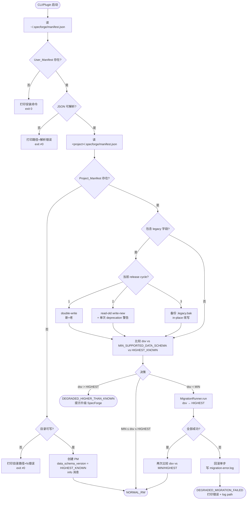
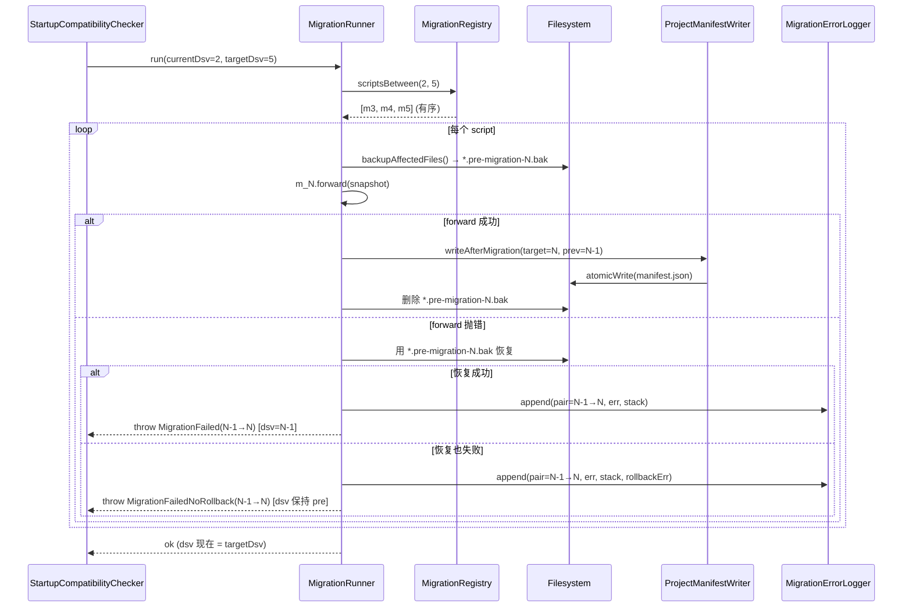
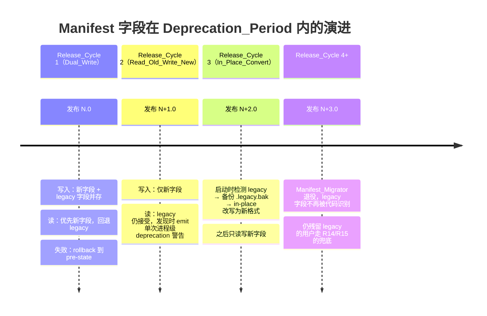

# Design Document — version-unification

## Overview

本特性把 SpecForge 中散落在 user manifest / project manifest / shared 配置 / CLI / plugin 之间的 7 个版本字段（`shared_version`、`schema_version`、`runtime_schema_version`、`required_shared_version_range`、user-level `code_version`、project-level `code_version` 等），收敛为：

- **User_Manifest**：`code_version` / `min_supported_data_schema` / `installed_at` / `updated_at` / `files`（5 个字段）
- **Project_Manifest**：`data_schema_version` / `initialized_at` / `updated_at`（3 个字段）

启动期不再做 semver range 比对，改用 **3 个整数 + 1 个 semver** 的单向数值比较，在 4.5 ms 量级内完成兼容性决策；跨 schema 升级由按目标版本严格递增的 migration 链顺序执行；所有"谁能写、什么时候写、写什么"的规则由 CI_Version_Guard 在 PR 阶段强制兜底；老格式 manifest 用"3 release cycle 渐进迁移 + 一键迁移命令 + 启动 in-place 转换 + `.legacy.bak` 备份"对最终用户透明。

### 设计目标的优先级（高→低）

1. **不丢数据**：迁移失败必须能回到 pre-state；写失败必须原子；in-place 转换必须先备份。
2. **不在用户机器上 surprise**：启动决策幂等、可解释；错误信息含 schema 版本号 + 推荐操作；版本号在常态下不显示。
3. **新人贡献者写不出错的 PR**：CI 在合并前就报告所有违规；schema 升级缺哪个文件、哪个 migration、哪个测试一次性列全。
4. **维护者改字段成本低**：单一来源（package.json / `MIN_SUPPORTED_DATA_SCHEMA` 常量 / `ProjectManifestWriter`）；规则集中在 `packages/version-unification/`。
5. **性能可预测**：CI guard ≤ 30 s on ≤ 1000 文件；启动期 manifest 读 + 决策 ≤ 50 ms；migration 单步 ≤ 用户感知阈值。

### 与 requirements 的对应关系

| Requirement | 设计组件 |
|-------------|----------|
| R1 / R2（字段集合） | `UserManifestWriter`、`ProjectManifestWriter`、`ManifestSchema` |
| R3（启动决策） | `StartupCompatibilityChecker`、`SchemaCompare` |
| R4（migration 链） | `MigrationRegistry`、`MigrationRunner`、`Migration` 接口 |
| R5（code_version） | `code_version` 单一来源（root `package.json`）+ `CodeVersionGuard` |
| R6（min_supported_data_schema） | `MIN_SUPPORTED_DATA_SCHEMA` 常量模块 + `MinSchemaGuard` |
| R7（data_schema_version） | `ProjectManifestWriter` 写入限制 + `DataSchemaWriteGuard` |
| R8（新增 schema 流程） | `SchemaIntroductionGuard`（CI，全量聚合报告） |
| R9（CI 强制） | `CI_Version_Guard` 编排器 + GH Actions 集成 |
| R10（用户可见性） | `--version` / `Doctor_Command` / `MigrationProgressReporter` |
| R11（兼容期渐进） | `Manifest_Migrator` + `ReleaseCyclePolicy` |
| R12（一键迁移命令） | `MigrateManifestCommand`（sf-installer 子命令） |
| R13（migration 失败兜底） | `Read_Only_Degraded_Mode` + `MigrationErrorLogger` |
| R14 / R15（manifest 缺失兜底） | `ManifestBootstrap`（user 缺失=instr+exit0；project 缺失=auto-init） |

## Architecture

### 模块拓扑

```
packages/version-unification/
├── src/
│   ├── constants.ts                    # MIN_SUPPORTED_DATA_SCHEMA, HIGHEST_KNOWN_SCHEMA
│   ├── code-version.ts                 # 唯一从 root package.json 读 code_version
│   ├── manifest/
│   │   ├── types.ts                    # UserManifest / ProjectManifest 类型
│   │   ├── user-manifest-writer.ts
│   │   ├── project-manifest-writer.ts
│   │   ├── manifest-reader.ts
│   │   ├── atomic-write.ts             # tmp + copyFile + unlink（绕开 Windows rename）
│   │   └── schema-validator.ts
│   ├── compat/
│   │   ├── startup-checker.ts          # StartupCompatibilityChecker
│   │   └── schema-compare.ts
│   ├── migration/
│   │   ├── registry.ts                 # MigrationRegistry
│   │   ├── runner.ts                   # MigrationRunner（顺序+原子+回滚）
│   │   ├── error-logger.ts             # migration-error.log
│   │   └── scripts/
│   │       ├── 001-to-2.ts             # 文件名 = 目标版本，强制有序
│   │       └── …
│   ├── legacy/
│   │   ├── detector.ts                 # 识别 legacy 字段
│   │   ├── migrator.ts                 # Manifest_Migrator（cycle 1/2/3 行为开关）
│   │   ├── release-cycle-policy.ts
│   │   └── backup.ts                   # .legacy.bak
│   ├── bootstrap/
│   │   ├── user-missing.ts             # R14
│   │   └── project-missing.ts          # R15
│   ├── degraded-mode/
│   │   ├── read-only-mode.ts
│   │   └── degraded-reporter.ts        # 区分"migration 失败"vs"高于已知 schema"
│   └── index.ts                        # 对外 API（仅 export 协议层，不 export writer 内部）
├── tests/
│   ├── unit/
│   ├── property/                       # PBT 集中地（R1/R2/R4 等）
│   └── integration/
└── package.json                        # workspace:*

scripts/
├── ci/
│   └── version-guard.ts                # CI_Version_Guard 主入口
├── ci/version-guard/
│   ├── code-version-rule.ts            # R5
│   ├── min-schema-rule.ts              # R6
│   ├── data-schema-write-rule.ts       # R7
│   ├── schema-introduction-rule.ts     # R8（聚合报告）
│   └── diff-scanner.ts                 # 扫 PR diff
└── sf-installer.ts                     # 已有：增加 migrate-manifest 子命令

.github/workflows/
└── version-guard.yml                   # 强制 required check
```

### 启动期与 PR 期两条独立路径

```
┌────────────────────────────────────────────────────────────┐
│ 启动期（用户机器）                                          │
│  CLI/Plugin entry                                          │
│   └─ ManifestBootstrap                                     │
│       ├─ user 缺失 → 打印 install 命令，exit 0  (R14)       │
│       ├─ user 存在 → ManifestReader（含 legacy 兜底）       │
│       └─ project 缺失 → auto-init highest schema (R15)     │
│   └─ Manifest_Migrator                                     │
│       └─ 按 release cycle 决定 read/write 行为 (R11)        │
│   └─ StartupCompatibilityChecker.check() → mode 决策 (R3)   │
│       ├─ NORMAL_RW                                         │
│       ├─ MIGRATE → MigrationRunner.run() → 重判 (R3.3)      │
│       │   ├─ ok    → NORMAL_RW                             │
│       │   └─ fail  → ReadOnlyDegradedMode (R13)            │
│       └─ DEGRADED_HIGHER_THAN_KNOWN (R3.4)                 │
│   └─ 业务逻辑                                              │
└────────────────────────────────────────────────────────────┘

┌────────────────────────────────────────────────────────────┐
│ PR 期（CI）                                                 │
│  GH Actions: pull_request                                  │
│   └─ git diff main…HEAD（unified=0）                        │
│   └─ scripts/ci/version-guard.ts                           │
│       ├─ CodeVersionRule         (R5)                      │
│       ├─ MinSchemaRule           (R6)                      │
│       ├─ DataSchemaWriteRule     (R7)                      │
│       ├─ SchemaIntroductionRule  (R8, 聚合)                 │
│       └─ aggregate report → exit 0/1                       │
└────────────────────────────────────────────────────────────┘
```

### 关键设计决策

#### D1：把 `data_schema_version` 改成整数而不是 semver

需求选择整数（R2.2）。设计原因：
- semver 上的 range 比对正是 leidian 事故的根因，改成整数后"是否需要迁移"成为单次 `<` 比较，**不可能写错**。
- migration 链以"目标版本"为序号，整数天然单调对齐链下标。
- 跨语言/跨工具读取无歧义（JSON 整数比 `"1.2.3"` 更安全）。

代价：失去"补丁版本"的语义。补丁修复属于 `code_version` 升级，不应触动 `data_schema_version`——这正是想要的。

#### D2：`code_version` 单一来源 = 仓库根 `package.json`

构建期（`bun run build`）将 `version` 注入到 `packages/version-unification/src/code-version.ts` 的 `CODE_VERSION` 常量；运行时读这个常量。**杜绝**任何地方在源码里写死语义版本字符串（CI 用正则强制）。

#### D3：`MIN_SUPPORTED_DATA_SCHEMA` 单常量 + 单调递增 + 文档强制

R6 要求；设计上把它放在 `packages/version-unification/src/constants.ts` 唯一处导出，CI 既要 grep 拒绝其他文件出现"MIN_SUPPORTED_DATA_SCHEMA"赋值，也要 git diff 拒绝该常量的值减小，并要求新增 `docs/deprecations/` 文档。

#### D4：`data_schema_version` 写入收敛到 `ProjectManifestWriter.writeAfterMigration()`

R7 要求该字段只能由 migration 完成处理写入。设计：
- `ProjectManifestWriter` 暴露 `writeFresh()`（创建 manifest 用）和 `writeAfterMigration(target, prev)`（migration 用）两个方法
- `writeAfterMigration` 内部断言 `target > prev`（R7.3）
- `writeFresh` 永远不更新已有 manifest 的 `data_schema_version`，只用于 R15 的初始化场景
- CI 用 AST/正则规则拒绝任何其他文件对 `.data_schema_version =` 或 `["data_schema_version"]:` 的赋值

#### D5：原子写绕开 Windows EPERM:rename

参照 `scripts/sync-task-status.ts` 的成熟方案：`tmp + copyFile + unlink`。在 `packages/version-unification/src/manifest/atomic-write.ts` 提供统一原语，所有 manifest 写、`migration` 单步写都走它。这同时给"失败回滚到 pre-state"提供基础（详见 §Components.MigrationRunner）。

#### D6：Migration 单步原子 = 双备份 + 单步回滚

每一步 migration 执行前：
1. `cp manifest.json manifest.json.pre-migration-N.bak`
2. 收集所有该步会修改的 project 数据文件路径，全部 `cp <f> <f>.pre-migration-N.bak`
3. 执行 migration forward()
4. forward() 成功 → 删 *.pre-migration-N.bak
5. forward() 失败 → restore from *.pre-migration-N.bak（rollback），保留 manifest 上一步成功的 `data_schema_version`，abort chain，写 `migration-error.log`，进入 Read_Only_Degraded_Mode

回滚本身失败的兜底（R4.5）：保留所有 `.bak`，**不**触动 manifest 字段，让用户/支持人员手工恢复。

#### D7：CI Version Guard 在 30 s 内 ≤ 1000 文件

策略：
- 只扫 PR diff（`git diff origin/main...HEAD --name-only -z`），不扫全仓
- 单 PR 的 changed files 一般 < 50，但要保证最坏情况 1000 文件 ≤ 30 s
- 4 条规则共用一次 diff hunk 解析（`unified=0`）
- 用 `Bun.file()` 读取文件，无 Node fs sync 开销
- 大文件（> 1 MB）跳过文本规则，按"非源码"处理（CI 报告里说明跳过）

#### D8：Read_Only_Degraded_Mode 的写拒绝实现

不在每个写路径加 if，而在 `packages/version-unification` 暴露 `requireWritable()` 守卫，由各业务包在写操作入口调用：进入 degraded 后该函数 throw `ReadOnlyDegradedError`。这样 R13.3 的"拒绝任何写"就成了一行守卫调用，覆盖率 = grep 调用点。

### 启动期兼容性决策流程



### Migration 链执行序列



### Manifest 字段三个 Release Cycle 的演进时间线



## Components and Interfaces

下列接口签名以 TypeScript 形式给出 low-level design 颗粒度。**实现时**才落到 packages/version-unification/src/ 对应文件，本文档不写实现。

### `manifest/types.ts`（核心数据契约）

```typescript
// User_Manifest（R1）—— 5 个字段
export interface UserManifest {
  readonly code_version: string;           // semver, derived from root package.json (R5)
  readonly min_supported_data_schema: number; // ≥0 整数 (R6)
  readonly installed_at: string;           // ISO 8601 (R1.4)
  readonly updated_at: string;             // ISO 8601
  readonly files: ReadonlyArray<ManifestFileEntry>;
}

export interface ManifestFileEntry {
  readonly path: string;
  readonly sha256: string;
  readonly size: number;
}

// Project_Manifest（R2）—— 3 个字段
export interface ProjectManifest {
  readonly data_schema_version: number;    // ≥0 整数 (R2.2)
  readonly initialized_at: string;
  readonly updated_at: string;
}

// 允许字段集合（运行时校验用）
export const USER_MANIFEST_FIELDS = [
  'code_version', 'min_supported_data_schema',
  'installed_at', 'updated_at', 'files'
] as const;

export const PROJECT_MANIFEST_FIELDS = [
  'data_schema_version', 'initialized_at', 'updated_at'
] as const;

// Legacy 字段（R1.5 / R2.4 / R11.1）
export const LEGACY_FIELDS_USER = [
  'shared_version', 'required_shared_version_range',
  'schema_version', 'runtime_schema_version'
] as const;
export const LEGACY_FIELDS_PROJECT = [
  ...LEGACY_FIELDS_USER, 'code_version'
] as const;
```

### `manifest/user-manifest-writer.ts`

```typescript
export interface UserManifestWriter {
  /**
   * 写完整 User_Manifest。仅接受 USER_MANIFEST_FIELDS，其它字段抛错。
   * 写入走 atomicWrite()，失败时不留半成品文件。
   * @throws InvalidManifestFieldError 如果 input 包含非允许字段或缺失允许字段
   */
  write(path: string, manifest: UserManifest): Promise<void>;

  /** Cycle 1 专用：同时写新 + legacy 字段（R11.2） */
  writeDualWrite(path: string, manifest: UserManifest, legacy: LegacyShape): Promise<void>;
}
```

### `manifest/project-manifest-writer.ts`

```typescript
export interface ProjectManifestWriter {
  /**
   * 创建一份新的 Project_Manifest（R15）。绝不更新已有 manifest 的 dsv。
   */
  writeFresh(path: string, dsv: number): Promise<void>;

  /**
   * 仅由 MigrationRunner 在 migration 完成处理中调用（R7.2）。
   * @throws DataSchemaMonotonicError 当 target ≤ prev
   */
  writeAfterMigration(path: string, prev: number, target: number): Promise<void>;

  /** Cycle 1 专用：双写（R11.2） */
  writeDualWrite(path: string, manifest: ProjectManifest, legacy: LegacyShape): Promise<void>;
}
```

### `compat/startup-checker.ts`

```typescript
export type StartupMode =
  | { kind: 'NORMAL_RW' }
  | { kind: 'MIGRATE'; from: number; to: number }
  | { kind: 'DEGRADED_HIGHER_THAN_KNOWN'; observed: number; highest: number }
  | { kind: 'DEGRADED_MIGRATION_FAILED'; pair: [number, number]; logPath: string };

export interface StartupCompatibilityChecker {
  /**
   * 纯函数，幂等：相同输入相同输出，不写文件，不读环境。
   * 上层根据返回值决定下一步动作（直接进入业务、跑 migration、进入 degraded）。
   */
  check(input: {
    dataSchemaVersion: number;
    minSupportedDataSchema: number;
    highestKnownSchema: number;
  }): StartupMode;
}
```

`check()` 实现是 R3 的全部决策逻辑，**没有 I/O**——这是为了 PBT。

### `migration/registry.ts` & `runner.ts`

```typescript
export interface Migration {
  /** 目标版本 N（执行后 dsv 应等于 N） */
  readonly targetVersion: number;

  /**
   * 把版本 (N-1) 的数据升级到 N。允许写文件、写 manifest 字段（除 dsv，由 runner 负责）。
   * 实现必须在内部使用 atomicWrite 原语保证单文件写原子。
   */
  forward(ctx: MigrationContext): Promise<void>;

  /**
   * 自我幂等保证：当输入数据已经满足 N 的 schema 时，forward() 应当 byte-identical no-op。
   * 用作 PBT property-4.4 的局部可执行规约。
   */
  isIdempotentAtTarget(ctx: MigrationContext): Promise<boolean>;
}

export interface MigrationRegistry {
  /** 按 targetVersion 升序的列表。重复或缺号在 build 时报错。 */
  readonly all: ReadonlyArray<Migration>;

  /** 给定 [from, to)，返回 ordered scripts。 */
  scriptsBetween(from: number, to: number): ReadonlyArray<Migration>;
}

export interface MigrationRunner {
  /**
   * 顺序执行 [from+1, to] 的所有 Migration_Script。
   * - 单步原子（D6）
   * - 失败 abort + rollback + 写 migration-error.log
   * - 成功后 manifest.dsv = to
   */
  run(args: {
    projectDir: string;
    from: number;
    to: number;
  }): Promise<MigrationRunResult>;
}

export type MigrationRunResult =
  | { kind: 'OK'; from: number; to: number; elapsedMs: number }
  | { kind: 'FAILED_ROLLED_BACK'; pair: [number, number]; elapsedMs: number; logPath: string }
  | { kind: 'FAILED_NO_ROLLBACK'; pair: [number, number]; elapsedMs: number; logPath: string };
```

`MigrationContext` 提供给单步使用的"原子写"原语和"读 project file"接口，这样 migration 自身不直接调 fs，单步行为可在测试中替换为内存 FS（便于 PBT）。

### `legacy/migrator.ts`

```typescript
export type ReleaseCycleBehavior = 'DUAL_WRITE' | 'READ_OLD_WRITE_NEW' | 'IN_PLACE_CONVERT';

export interface ReleaseCyclePolicy {
  /** 由 code_version 反推当前处于 deprecation period 的第几个 cycle */
  current(): ReleaseCycleBehavior;
}

export interface ManifestMigrator {
  /**
   * 启动期入口。读到 manifest 时调用。
   * @returns 升级后的 manifest（cycle 3 已 in-place 改写完毕；cycle 1/2 在内存里返回新形态）
   */
  migrateOnRead(rawJson: unknown, manifestPath: string): Promise<UserManifest | ProjectManifest>;

  /** 写时按 cycle 行为决定 dual-write / 仅新字段 */
  decorateOnWrite(manifest: UserManifest | ProjectManifest): WriteShape;

  /** 仅 cycle 3 用：备份 + in-place 改写 */
  inPlaceConvert(manifestPath: string): Promise<void>;
}
```

### `degraded-mode/read-only-mode.ts`

```typescript
export class ReadOnlyDegradedError extends Error {
  constructor(public readonly cause: 'MIGRATION_FAILED' | 'HIGHER_THAN_KNOWN' | 'OTHER') {
    super(`SpecForge is in Read_Only_Degraded_Mode (${cause})`);
  }
}

/**
 * 业务包写操作的入口守卫。被 plugin / cli / 各 writer 调用。
 * 进入 degraded 后所有写都被拒（R13.3）。
 */
export function requireWritable(): void;

/** 切换 mode，仅由 StartupCompatibilityChecker 后续处理调用。 */
export function enterReadOnly(cause: 'MIGRATION_FAILED' | 'HIGHER_THAN_KNOWN' | 'OTHER'): void;
```

### CI Guard 违规报告结构

```typescript
export interface ViolationReport {
  readonly tool: 'CI_Version_Guard';
  readonly schemaVersion: '1.0';
  readonly scannedFileCount: number;
  readonly elapsedMs: number;
  readonly violations: ReadonlyArray<Violation>;
  /** 仅当存在 SchemaIntroduction 类规则时聚合：缺哪个 artifact */
  readonly missingArtifacts?: ReadonlyArray<MissingArtifact>;
}

export type Violation =
  | {
      kind: 'CODE_VERSION_LITERAL_OUTSIDE_PACKAGE_JSON';
      file: string; line: number; matchedText: string;
    }
  | {
      kind: 'MIN_SCHEMA_DECREASED';
      from: number; to: number; file: string;
    }
  | {
      kind: 'MIN_SCHEMA_NO_DEPRECATION_DOC';
      from: number; to: number;
      missingDocPath: string;
    }
  | {
      kind: 'DATA_SCHEMA_WRITE_OUTSIDE_DEDICATED_MODULE';
      file: string; line: number; matchedText: string;
    };

export interface MissingArtifact {
  readonly schemaVersion: number;
  readonly kind: 'MIGRATION_SCRIPT' | 'TEST' | 'DECISION_RECORD' | 'READ_WRITE_PATH';
  readonly expectedPath: string;
}

/**
 * 主入口：返回 0 表示无违规，1 表示有违规且报告已写到 stdout (JSON) + stderr (人类可读)。
 * 总耗时硬上限 30 s（R9.4）；超时本身视为基础设施失败 → exit ≠0（R9.3）。
 */
export async function runVersionGuard(args: {
  diffBase: string;        // e.g. 'origin/main'
  repoRoot: string;
  hardTimeoutMs?: number;  // default 30_000
}): Promise<{ exitCode: number; report: ViolationReport }>;
```

### `bootstrap/`（R14 / R15）

```typescript
// user-missing.ts
export async function handleUserManifestMissing(args: {
  expectedPath: string;
  installerCommand: string;     // 例 "bun scripts/sf-installer.ts install"
  print: (msg: string) => void;
}): Promise<{ exitCode: 0 }>;

// project-missing.ts
export async function handleProjectManifestMissing(args: {
  projectDir: string;
  highestKnown: number;
  writer: ProjectManifestWriter;
  log: (msg: string) => void;
}): Promise<{ created: ProjectManifest } | { exitCode: number; reason: 'EROFS' | 'EACCES' | 'ENOSPC' | string }>;
```

### `migrate-manifest`（sf-installer 子命令）

```typescript
// scripts/sf-installer.ts 的子命令
export async function migrateManifestCommand(args: {
  manifestPath: string;
}): Promise<{ exitCode: 0 | 1; backupPath?: string; errorLogPath?: string }>;
```

行为契约（R12）：
- 已是新格式 → byte-identical no-op，exit 0
- legacy → 备份 `.legacy.bak`、写入新格式（含 `format: "CURRENT"` 元字段）、exit 0
- 失败 → 不动 active manifest、写 `<manifest-dir>/migrate-error.log`、exit ≠0
- 反复执行幂等

### Doctor / `--version` 输出格式

`--version`（R10.2）：
```
6.0.0
```
**仅 stdout，无 stderr，无前缀**，单行 newline 结尾，exit 0。

`doctor`（R10.3）输出格式（人类可读，固定字段顺序）：
```
SpecForge Doctor
  code_version              : 6.0.0
  min_supported_data_schema : 3
  data_schema_version       : 5
  user_manifest_path        : C:\Users\luo\.specforge\manifest.json
  project_manifest_path     : D:\code\my-proj\.specforge\manifest.json
  mode                      : NORMAL_RW
```

Migration 完成（R10.4）：
```
[migration] data_schema_version 2 → 5 in 134 ms
```

进入 degraded（R10.5）：
```
[error] data_schema_version 7 exceeds highest supported schema 5.
        Upgrade SpecForge: bun install specforge@latest (or similar).
        Current code_version: 6.0.0
```

Migration 失败（R13.4）的格式：
```
[error] migration 4→5 failed.
        Diagnostic log: D:\code\my-proj\.specforge\migration-error.log
        Recommended next step: contact support or roll back SpecForge code.
```

## Data Models

### `~/.specforge/manifest.json`（User_Manifest，R1）

```json
{
  "code_version": "6.0.0",
  "min_supported_data_schema": 3,
  "installed_at": "2026-05-19T10:30:00.000Z",
  "updated_at": "2026-05-19T10:30:00.000Z",
  "files": [
    {
      "path": "node_modules/.bin/specforge",
      "sha256": "5a4b…",
      "size": 1024000
    }
  ]
}
```

校验规则（写入侧 `UserManifestWriter` 强制；读取侧 `ManifestReader` 容忍 legacy 然后交给 Migrator）：
- 字段集 = `USER_MANIFEST_FIELDS`，多一个少一个都报 `InvalidManifestFieldError`（R1.6）
- `code_version` 必须匹配 `^\d+\.\d+\.\d+(-[A-Za-z0-9.-]+)?$`
- `min_supported_data_schema` ∈ ℤ ∧ ≥ 0
- `installed_at` / `updated_at` 通过 `Date.parse` 且 `toISOString()` round-trip 一致
- `files[*].sha256` ∈ /^[0-9a-f]{64}$/
- `files[*].size` ∈ ℤ ∧ ≥ 0

### `<project>/.specforge/manifest.json`（Project_Manifest，R2）

```json
{
  "data_schema_version": 5,
  "initialized_at": "2026-05-19T10:30:00.000Z",
  "updated_at": "2026-05-19T10:30:00.000Z"
}
```

校验规则：
- 字段集 = `PROJECT_MANIFEST_FIELDS`（R2.5）
- `data_schema_version` ∈ ℤ ∧ ≥ 0（R2.2）
- 写入限制见 D4 / R7

### `<project>/.specforge/migration-error.log`（R13.2）

JSONL，每行一次失败：

```json
{"ts":"2026-05-19T10:31:14.122Z","pair":[3,4],"err":"ENOSPC: no space left","stack":"Error: ENOSPC…","rollback":"ok"}
{"ts":"2026-05-19T11:02:01.555Z","pair":[3,4],"err":"…","stack":"…","rollback":"failed:EBUSY"}
```

### `<manifest-dir>/migrate-error.log`（R12.4）

JSONL，结构同上，但只在 `migrate-manifest` 命令失败时写。

### `<manifest>.legacy.bak`（R11.5 / R12.3）

老 manifest 的逐字节副本，**不**修改、**不**追加任何元数据。便于人工 diff。

### `docs/deprecations/<schema-N>.md`（R6.2 / R6.3）

```markdown
# Deprecation: drop schema versions ≤ N-1

- previous min_supported_data_schema: <X>
- new min_supported_data_schema: <Y>
- Dropped versions: <X..Y-1>
- Replacement migration path: <link>
- Released in: <code_version>
```

CI 用文件存在性 + 关键 section 标题作为门槛，不做完整内容审查。

### `docs/schema-versions/<N>.md`（R8.1）

新增 schema 版本 N 时配套的 ADR 风格决策记录。CI（SchemaIntroductionRule）只检查存在性，不检查内容。

### `MigrationContext`（migration script 接收的上下文）

```typescript
export interface MigrationContext {
  readonly projectDir: string;
  readonly fromVersion: number;     // 当前 dsv
  readonly toVersion: number;       // 目标 dsv（= migration.targetVersion）

  readonly readJson: (relativePath: string) => Promise<unknown>;
  readonly writeJson: (relativePath: string, value: unknown) => Promise<void>;
  readonly listDataFiles: (subdir?: string) => Promise<ReadonlyArray<string>>;

  /** 用于幂等检测：返回当前数据是否已符合 toVersion 的 schema */
  readonly checkAtTarget: () => Promise<boolean>;
}
```

实现侧的 `MigrationRunner` 负责"备份/恢复/manifest dsv 写入"，migration script 只关心 forward 转换逻辑——这是为了让单脚本可以在内存 FS 上做 PBT。


## Correctness Properties

*A property is a characteristic or behavior that should hold true across all valid executions of a system—essentially, a formal statement about what the system should do. Properties serve as the bridge between human-readable specifications and machine-verifiable correctness guarantees.*

下列 29 条 Property 来自 prework 阶段对 15 条需求中所有 acceptance criteria 的逐条分析，并经过 property reflection 去除冗余、合并等价命题（详见 prework）。除明确标记为 EXAMPLE / SMOKE / INTEGRATION 的 criteria 外，每条 acceptance criteria 都被至少一条 Property 覆盖。Property 编号在文档内连续，PBT 实现侧 tag 用 `Feature: version-unification, Property N: <text>`。

### Property 1: Manifest writer field-set integrity

*For any* candidate field set `K`, `UserManifestWriter.write(m)` succeeds without a field-rejection error if and only if `keys(m) === USER_MANIFEST_FIELDS`, and the same equivalence holds for `ProjectManifestWriter.write(m)` against `PROJECT_MANIFEST_FIELDS`. Furthermore, after any successful write, the persisted JSON's top-level keyset equals the corresponding `*_FIELDS` set exactly (no legacy field, no extra field).

**Validates: Requirements 1.1, 1.5, 1.6, 2.1, 2.4, 2.5**

### Property 2: Timestamp round-trip

*For any* `Date` value `d`, writing it as `installed_at` / `updated_at` / `initialized_at` through the writer and reading it back through `ManifestReader` yields a timestamp `d'` such that `d.toISOString() === d'.toISOString()` and `Date.parse(d')` differs from `d.getTime()` by at most 0 ms (millisecond exact).

**Validates: Requirements 1.4, 2.3**

### Property 3: Integer schema fields reject non-non-negative-integer values

*For any* candidate value `v`, the writer accepts `v` for `min_supported_data_schema` (resp. `data_schema_version`) if and only if `Number.isInteger(v) ∧ v ≥ 0`; for any other `v` (negative, fractional, `NaN`, `Infinity`, string, boolean, null, undefined) the writer throws `InvalidManifestFieldError` naming the offending field.

**Validates: Requirements 1.3, 2.2**

### Property 4: Startup compatibility checker decision table

*For any* triple `(dsv, min, highest)` of non-negative integers, `StartupCompatibilityChecker.check({...})` returns:

| Condition | Returned `kind` |
|-----------|-----------------|
| `min ≤ dsv ≤ highest` | `NORMAL_RW` |
| `dsv < min` | `MIGRATE` (with `from = dsv`, `to = highest`) |
| `dsv > highest` | `DEGRADED_HIGHER_THAN_KNOWN` (with `observed = dsv`, `highest`) |

The function is referentially transparent: for the same input it always returns the same output, performs no I/O, and never imports a semver library.

**Validates: Requirements 3.2, 3.3, 3.4, 3.5**

### Property 5: Migration step writes target dsv after success

*For any* `Migration` script `m_N` and pre-state with `data_schema_version = N-1`, after `MigrationRunner.run` invokes `m_N.forward(ctx)` successfully, the persisted Project_Manifest reads `data_schema_version === N` and `updated_at` is within ±1 s of the wall-clock time at write, before any subsequent step runs.

**Validates: Requirements 4.3**

### Property 6: Migration script idempotent at target

*For any* `Migration` script `m_N` and project data already conforming to schema version `N` (manifest dsv `= N`, all data files at version `N`), invoking `m_N.forward(ctx)` a second time leaves every file under `projectDir` byte-identical to its state immediately before the second invocation.

**Validates: Requirements 4.4**

### Property 7: Migration chain ordering

*For any* `MigrationRegistry` instance and `(from, to)` with `from < to`, `MigrationRunner.run({from, to})` invokes the underlying scripts in strictly ascending order of `script.targetVersion`, and the recorded sequence of `targetVersion` values equals `[from+1, from+2, …, to]`.

**Validates: Requirements 4.2**

### Property 8: Migration registry completeness

*For any* `MigrationRegistry` instance whose `all` array is well-formed, the registry contains a script for every consecutive pair `(N-1, N)` with `MIN_SUPPORTED_DATA_SCHEMA < N ≤ HIGHEST_KNOWN_SCHEMA`. If any such pair is missing or duplicated, registry construction throws `MalformedRegistryError` at module load time, before any migration runs.

**Validates: Requirements 4.1**

### Property 9: Atomic chain failure preserves pre-state

*For any* migration chain `[m_{from+1}, …, m_to]` and any failure injection at step index `K ∈ [from+1, to]` (failure during `forward()` or during the writer call), after `MigrationRunner.run` returns:

- if step-`K` rollback succeeded: every file under `projectDir` is byte-identical to its state captured immediately before step `K-1` completed (i.e., `data_schema_version === K-1`); the chain is aborted; an entry has been appended to `<project>/.specforge/migration-error.log` containing the offending pair `[K-1, K]`, the originating error message, and the stack trace.
- if step-`K` rollback failed: `data_schema_version` is byte-identical to its pre-migration value (= `from`); the same diagnostic log entry is written, with rollback failure annotated.

**Validates: Requirements 4.5, 13.1, 13.2**

### Property 10: ProjectManifestWriter.writeAfterMigration contract

*For any* `(prev, target)` pair of non-negative integers, `ProjectManifestWriter.writeAfterMigration(path, prev, target)` succeeds if and only if `target > prev`. On success the persisted manifest reads `data_schema_version === target` and `updated_at === T` for some `T` within ±1 s of the call moment, both written in a single atomic write (intermediate readers either see the pre-state or the post-state, never a partial state).

**Validates: Requirements 7.3, 7.5**

### Property 11: data_schema_version writer call-source contract

*For any* call site invoking `ProjectManifestWriter.writeAfterMigration`, the call must originate from the completion handler of a `Migration` script (asserted via runtime stack inspection or a passed-through `MigrationContext` token); calls from any other origin throw `IllegalWriterCallSiteError` and do not modify the manifest.

**Validates: Requirements 7.2**

### Property 12: Read-only degraded mode rejects every write

*For any* sequence of write operations attempted while the process is in `Read_Only_Degraded_Mode` (regardless of cause), every operation that would mutate project data, project metadata, the Project_Manifest, the User_Manifest, or create a new project throws `ReadOnlyDegradedError`. Read operations against the unchanged project data continue to succeed.

**Validates: Requirements 13.3**

### Property 13: Degraded-mode output keyed by cause

*For any* degraded entry with cause `c ∈ {MIGRATION_FAILED, HIGHER_THAN_KNOWN, OTHER}`, the diagnostic line printed by `DegradedReporter` satisfies:

- if `c === MIGRATION_FAILED`: output contains the failed schema-version pair, the absolute path of the diagnostic log entry, and the recommended next step ("contact support or roll back SpecForge code"); if the print attempt itself raises, no secondary output is produced and no retry occurs.
- if `c === HIGHER_THAN_KNOWN`: output contains the observed `data_schema_version`, the highest supported schema version, and an actionable suggestion to upgrade SpecForge code; output never contains the migration-specific phrase set defined for `MIGRATION_FAILED`.
- if `c === OTHER`: output never contains the migration-specific phrase set.

**Validates: Requirements 13.4, 13.5**

### Property 14: CI guard rejects code_version literal outside package.json

*For any* synthetic PR diff `D` containing one or more added/modified lines matching the regex `code_version\s*[:=]\s*["'][0-9]+\.[0-9]+\.[0-9]+` in files other than the repository root `package.json`, `runVersionGuard(D)` returns `exitCode ≠ 0` and the report's `violations` array contains exactly one `CODE_VERSION_LITERAL_OUTSIDE_PACKAGE_JSON` entry per matching `(file, line)`. For diffs with zero such matches, `runVersionGuard(D)` returns no `CODE_VERSION_LITERAL_OUTSIDE_PACKAGE_JSON` entries.

**Validates: Requirements 5.2**

### Property 15: CI guard for MIN_SUPPORTED_DATA_SCHEMA monotonic + deprecation doc

*For any* synthetic PR diff `D` with old/new values `(old, new)` for `MIN_SUPPORTED_DATA_SCHEMA` and a boolean `hasDepDoc` indicating whether the diff also adds a file under `docs/deprecations/`:

| Condition | Expected guard outcome |
|-----------|------------------------|
| `new < old` | `MIN_SCHEMA_DECREASED` reported, regardless of `hasDepDoc` |
| `new > old ∧ ¬hasDepDoc` | `MIN_SCHEMA_NO_DEPRECATION_DOC` reported |
| `new > old ∧ hasDepDoc` | no MIN-rule violation |
| `new === old` | no MIN-rule violation |

If the same diff also introduces a new schema version `N` without satisfying the deprecation rule's preconditions, the diff is additionally flagged under Property 17, but this Property's invariants remain unchanged.

**Validates: Requirements 6.2, 6.3, 6.4, 8.3**

### Property 16: CI guard for data_schema_version write location

*For any* synthetic PR diff `D` containing added/modified assignments matching `data_schema_version\s*[:=]` in any source file other than `packages/version-unification/src/manifest/project-manifest-writer.ts`, `runVersionGuard(D)` reports exactly one `DATA_SCHEMA_WRITE_OUTSIDE_DEDICATED_MODULE` entry per matching `(file, line)` and returns `exitCode ≠ 0`.

**Validates: Requirements 7.4**

### Property 17: CI guard schema-introduction aggregated report

*For any* synthetic PR diff `D` that introduces a new schema version `N` and an arbitrary subset `S` of the four required artifacts (Migration_Script for `(N-1, N)`, updated read-write code paths, automated tests for both `N-1` and `N`, decision record under `docs/schema-versions/`), the report emitted by `runVersionGuard(D)` lists every artifact in `(REQUIRED \ S)` in its `missingArtifacts` array, in a single aggregated entry, regardless of order or count of misses—the guard does not fail on the first miss.

**Validates: Requirements 8.1, 8.2**

### Property 18: CI guard exit code blocks merge

*For any* `(exitCode, elapsedMs)` pair returned by `runVersionGuard`, the merge-blocking decision satisfies:

- `exitCode === 0` → merge is not blocked (regardless of `elapsedMs`, including zero)
- `exitCode ≠ 0` → merge is blocked
- guard infrastructure failures surface as `exitCode ≠ 0` and therefore block merge

**Validates: Requirements 9.3**

### Property 19: Version surface visibility

*For any* invocation:

- in `NORMAL_RW` mode, business-command stdout/stderr does not contain a string matching the literal value of `code_version`, `data_schema_version`, or `min_supported_data_schema`.
- with the `--version` flag and a successfully retrieved `code_version` value `v`: stdout equals exactly `${v}\n`, stderr is empty, exit code is 0.
- with the `--version` flag when retrieval throws: stderr contains a diagnostic message naming the failure, stdout is empty, exit code is non-zero.

**Validates: Requirements 10.1, 10.2**

### Property 20: Diagnostic output formatter

*For any* diagnostic emission tagged `kind ∈ {DOCTOR, MIGRATION_DONE, DEGRADED_HIGHER, DEGRADED_MIG_FAILED}`, the produced text contains all of the fields required for that kind:

| `kind` | Required substrings |
|--------|---------------------|
| `DOCTOR` | the literal values of `code_version`, `min_supported_data_schema`, `data_schema_version`, the absolute path of User_Manifest, and the absolute path of Project_Manifest |
| `MIGRATION_DONE` | the source `dsv`, the target `dsv`, and an integer count of milliseconds |
| `DEGRADED_HIGHER` | the observed `data_schema_version`, the highest supported schema, and an upgrade suggestion phrase |
| `DEGRADED_MIG_FAILED` | the failed pair `[N-1, N]`, the absolute path of the migration log, and the recommended-next-step phrase |

**Validates: Requirements 10.3, 10.4, 10.5**

### Property 21: Manifest_Migrator legacy detection

*For any* parsed manifest object `m`, `Manifest_Migrator.isLegacy(m) === true` if and only if `keys(m)` intersects `LEGACY_FIELDS_USER ∪ LEGACY_FIELDS_PROJECT`. Detection is independent of field values—only key names matter.

**Validates: Requirements 11.1**

### Property 22: Release-cycle behavior

*For any* current release cycle `c ∈ {1, 2, 3}` and any manifest write operation `w`:

- `c === 1`: persisted JSON contains both new fields and legacy fields; if writing the new fields fails, the file on disk is byte-identical to its pre-write state.
- `c === 2`: persisted JSON contains only new fields; reading a legacy manifest emits exactly one deprecation warning per process invocation, naming each detected legacy field.
- `c === 3`: at startup, any legacy manifest is converted in-place to the new format; subsequent writes never include legacy fields.

**Validates: Requirements 11.2, 11.3, 11.4**

### Property 23: In-place conversion creates faithful backup

*For any* legacy manifest at path `P` undergoing in-place conversion (whether triggered by Cycle-3 startup auto-conversion or by `migrate-manifest` command), after the conversion completes successfully, a sibling file at `P.legacy.bak` exists whose bytes equal the original bytes of `P` measured immediately before the conversion. The backup is created strictly before any modification of `P`.

**Validates: Requirements 11.5, 12.3**

### Property 24: migrate-manifest command idempotence

*For any* manifest `m` that already conforms to the current format and any positive integer `N`, executing the `migrate-manifest` command `N` times in succession leaves the active manifest byte-identical to `m` after each invocation, and each invocation exits with status code 0. For a legacy manifest, the second and all subsequent invocations behave as the no-op case above.

**Validates: Requirements 12.2, 12.5**

### Property 25: migrate-manifest atomic on failure

*For any* failure injected during the conversion performed by `migrate-manifest` (write failure, parse failure, fs error), after the command exits, the active manifest at the target path is byte-identical to its state immediately before the command ran, a diagnostic JSONL entry has been appended to `<manifest-dir>/migrate-error.log` containing the originating error and stack trace, and the command's exit status is non-zero.

**Validates: Requirements 12.4**

### Property 26: User-manifest-missing bootstrap behavior

*For any* startup invocation in a state where the User_Manifest file does not exist, the SpecForge process: (a) prints an instructional message containing the expected User_Manifest absolute path and the exact installer command literal; (b) exits with status code 0; (c) does not modify any file under the project directory (project bytes byte-identical pre/post). Reading project files in read-only fashion to enrich the message is permitted and does not invalidate this property.

**Validates: Requirements 14.1, 14.2**

### Property 27: User-manifest invalid-JSON error path

*For any* User_Manifest file whose contents are not valid JSON, the SpecForge process exits with non-zero status and emits an error message containing both the User_Manifest absolute path and the originating parse error message (or its `name` for typed parser errors). No User_Manifest write attempt occurs in this path.

**Validates: Requirements 14.3**

### Property 28: Project-manifest-missing bootstrap creates new PM

*For any* startup invocation where the User_Manifest indicates a successful install and the Project_Manifest does not exist, the SpecForge process creates a new Project_Manifest at the expected absolute path with `data_schema_version === HIGHEST_KNOWN_SCHEMA`, `initialized_at` and `updated_at` both set to a wall-clock time within ±1 s of creation, and emits exactly one info-level message containing the absolute Project_Manifest path and the chosen `data_schema_version`. No legacy field is written.

**Validates: Requirements 15.1, 15.2, 15.3**

### Property 29: Unwritable project dir error path

*For any* startup invocation where the Project_Manifest does not exist and the containing directory is not writable by the current process, the SpecForge process exits with non-zero status and emits an error message containing the directory absolute path and the originating filesystem error name (`EROFS`/`EACCES`/`ENOSPC`/etc.). No partial Project_Manifest is written.

**Validates: Requirements 15.4**

## Error Handling

### 错误分类与统一表示

所有 `version-unification` 抛出的 typed error 派生自基类 `VersionUnificationError`，每个子类带有：

- `kind`：discriminator string，用于 PBT / 调用方分支
- `userMessage`：面向终端用户的消息（带行动建议），由 `--version` / doctor / 启动失败入口直接打印
- `diagnosticPayload`：写到 log 文件的 JSON 结构（详见各 log 文件 schema）

错误清单：

| Error class | kind | 触发场景 | Requirement |
|-------------|------|----------|-------------|
| `InvalidManifestFieldError` | `INVALID_FIELD` | writer 收到非允许字段 / 缺失必填字段 / 类型错 | R1.6, R2.5 |
| `InvalidJsonInManifestError` | `INVALID_JSON` | manifest 文件存在但不可解析 | R14.3 |
| `MalformedRegistryError` | `MALFORMED_REGISTRY` | migration registry 缺号/重号 | R4.1 |
| `IllegalWriterCallSiteError` | `ILLEGAL_WRITER_CALLSITE` | `writeAfterMigration` 在非 migration 完成处理中调用 | R7.2 |
| `DataSchemaMonotonicError` | `DSV_NOT_MONOTONIC` | `writeAfterMigration` 收到 `target ≤ prev` | R7.3 |
| `MigrationFailed` | `MIGRATION_FAILED_ROLLED_BACK` | 单步 migration 失败但回滚成功 | R4.5, R13.1-3 |
| `MigrationFailedNoRollback` | `MIGRATION_FAILED_NO_ROLLBACK` | 单步 migration 失败且回滚失败 | R4.5 |
| `ReadOnlyDegradedError` | `READ_ONLY_DEGRADED` | 在 degraded 模式下尝试写 | R13.3 |
| `ManifestUnwritableDirError` | `EROFS`/`EACCES`/`ENOSPC` | 创建 PM 时目录不可写 | R15.4 |
| `MigrateManifestFailed` | `MIGRATE_CMD_FAILED` | `migrate-manifest` 命令转换失败 | R12.4 |

### 关键错误路径

#### EH1：JSON 解析失败（R14.3）

```
ManifestReader.readUser(path)
  ↓ try { JSON.parse(bytes) }
  ↓ catch (e: SyntaxError)
  → throw new InvalidJsonInManifestError({
      manifestPath: path,
      parseError: e.message,
      role: 'USER'
    })
```

入口（CLI / plugin）catch 后：
- print 到 stderr：`[error] User_Manifest at <path>: <parseError>`
- exit ≠ 0
- **不**写任何 log 文件（用户机器上的 manifest 解析错不应造成日志膨胀）

#### EH2：文件不可写（R15.4）

```
ProjectManifestWriter.writeFresh(path, dsv)
  ↓ atomicWrite()
  ↓ catch (e: { code: 'EROFS'|'EACCES'|'ENOSPC' })
  → throw new ManifestUnwritableDirError({ dir: dirname(path), errno: e.code })
```

入口 catch 后：
- print 到 stderr：`[error] Cannot write Project_Manifest to <dir>: <errno>`
- exit ≠ 0
- **不**进入 degraded mode（manifest 不存在 + 不可写 ≠ 已有数据需保护，不需要 read-only fallback）

#### EH3：Migration 部分写入回滚（R4.5 / R13.1-3）

详见 §Architecture.D6。运行时序在 §Components.MigrationRunner。失败后调用链：

```
MigrationRunner.run() catches forward() throw
  → backupRestore() → 成功
    → MigrationErrorLogger.append({ pair, err, stack, rollback: 'ok' })
    → throw MigrationFailed
  → backupRestore() → 失败
    → MigrationErrorLogger.append({ pair, err, stack, rollback: { failed: e.message } })
    → throw MigrationFailedNoRollback

StartupCompatibilityChecker catch
  → ReadOnlyDegradedMode.enter('MIGRATION_FAILED')
  → DegradedReporter.print(cause='MIGRATION_FAILED', pair, logPath)
```

#### EH4：DegradedReporter print 自身失败（R13.4）

```
DegradedReporter.print(cause, ...details)
  → const text = format(cause, details)
  → try { process.stderr.write(text) }
  → catch (printErr) {
      // R13.4 显式约束：保持静默，不重试，不向用户反馈
      // print 失败也不能引发新错误 —— 此函数 swallow + return
      return;
    }
```

#### EH5：CI Guard 基础设施失败（R9.3）

```
runVersionGuard()
  ↓ try { 4 rules }
  ↓ catch (infraErr)
  → process.stdout.write(JSON.stringify({ tool, infraError: infraErr.message }))
  → return { exitCode: 1 }
```

CI 配置层（`.github/workflows/version-guard.yml`）将 guard step 设为 `continue-on-error: false`，且后续 step `if: success()`，guard 失败立即截断流水线。Guard 自身硬上限 30 s（R9.4），超时直接 `process.exit(1)`，由 OS-level wait 包装：见 §Testing Strategy.T5。

### 错误信息本地化

所有 `userMessage` 用英文（与现有 SpecForge 输出一致），不引入 i18n 框架。技术错误名（errno、`EROFS`）保留原样，不翻译——便于跨语言搜索。

## Testing Strategy

### Dual Approach

- **Property-based tests**：覆盖 §Correctness Properties 的 29 条 Property，**每条一个 PBT 文件**，最少 200 次迭代（高风险数据完整性属性 P9 / P23 / P24 / P25 至少 1000 次）。
- **Unit tests**：覆盖 prework 中标记为 EXAMPLE / SMOKE 的 acceptance criteria（R3.1 顺序、R5.1 / R5.3 release 流程、R6.1 / R7.1 / R12.1 grep-style 静态检查、R9.1 CI 配置存在性）。
- **Integration tests**：性能与 e2e 路径（R9.4 ≤30 s on 1000 文件）。

### PBT 配置

库选择：**fast-check**（与 SpecForge V6 其他模块一致，已在 daemon-core / configuration 等包使用）。

每个 PBT 文件位于 `packages/version-unification/tests/property/`，命名格式 `version-unification-property-{n}.property.test.ts`。

每个测试文件顶部含 tag 注释：

```typescript
/**
 * Feature: version-unification, Property 9: Atomic chain failure preserves pre-state
 *   Validates Requirements 4.5, 13.1, 13.2.
 * Iterations: 1000 (data-integrity critical).
 */
```

迭代次数（fast-check `numRuns`）：

| Properties | numRuns | 理由 |
|-----------|---------|------|
| P1, P2, P3, P10, P11, P19, P20, P21 | 200 | 字段/格式契约，input 空间结构简单 |
| P4 | 500 | 决策表三分支，需要充分覆盖整数边界 |
| P5, P6, P7, P8 | 200 | migration 单步行为，纯函数性强 |
| P9, P23, P24, P25 | 1000 | 数据完整性关键路径，shrinking 重要 |
| P12, P13, P22 | 200 | 模式 / cycle 路径分支 |
| P14–P18 | 500 | CI guard，diff 空间大 |
| P26, P27, P28, P29 | 200 | bootstrap 路径 |

### Property → 测试文件映射

```
tests/property/
  version-unification-property-1.property.test.ts   # P1  field-set integrity
  version-unification-property-2.property.test.ts   # P2  timestamp round-trip
  …
  version-unification-property-29.property.test.ts  # P29 unwritable dir
```

每个文件的 `it(...)` 标题以 `Property N: <短句>` 开头，便于失败时归位。

### Unit Test 列表

`packages/version-unification/tests/unit/` 下：

| 文件 | 覆盖 |
|------|------|
| `code-version-from-package-json.test.ts` | R5.1 / R5.3 build-time 注入 |
| `startup-checker-read-order.test.ts` | R3.1（fs.read spy 顺序断言） |
| `min-schema-single-source.test.ts` | R6.1（grep 整个仓库 `MIN_SUPPORTED_DATA_SCHEMA` 仅一处赋值） |
| `data-schema-write-single-source.test.ts` | R7.1（grep `data_schema_version\s*[=:]` 仅在 writer module） |
| `migration-test-coverage.test.ts` | R4.6（每个 src/migration/scripts/<N>.ts 必须有同名测试文件） |
| `sf-installer-subcommand.test.ts` | R12.1（migrate-manifest 已注册） |
| `ci-workflow-trigger.test.ts` | R9.1（version-guard.yml on pull_request） |
| `release-precheck.test.ts` | R5.3（注入冲突文件后退出非零） |

### Integration Tests

`packages/version-unification/tests/integration/`：

| 文件 | 场景 |
|------|------|
| `version-guard-1000-files.test.ts` | R9.4 性能：1000 文件 fixture 跑 guard，≤30 s |
| `migration-end-to-end.test.ts` | 多步 chain 在真实临时目录上完整跑通，断言文件树 |
| `legacy-cycle-3-bootstrap.test.ts` | Cycle 3 启动 in-place 转换 + `.legacy.bak` 端到端 |

### PBT 测试基础设施

#### 内存 FS

`packages/version-unification/tests/property/_helpers/memfs.ts` 提供 `MigrationContext` 的内存实现，包含：

- `readJson` / `writeJson` 走 `Map<string, string>`
- `listDataFiles` 返回 keys 过滤
- `checkAtTarget` 按当前 fixture 配置决策
- 可注入"在第 K 次写抛错"的 fault flag

PBT 用 fast-check 生成 `(initialFiles, faultStep)`，触发 P9 的 chain-level invariant。

#### Generators

`packages/version-unification/tests/property/_helpers/generators.ts` 提供：

```typescript
export const validUserManifest: fc.Arbitrary<UserManifest>;
export const validProjectManifest: fc.Arbitrary<ProjectManifest>;
export const arbitraryFieldName: fc.Arbitrary<string>;
export const arbitraryNonNegativeInt: fc.Arbitrary<number>;
export const arbitraryNonInteger: fc.Arbitrary<unknown>;  // for P3
export const arbitraryDate: fc.Arbitrary<Date>;
export const arbitraryStartupTriple: fc.Arbitrary<{ dsv; min; highest; }>;
export const arbitraryMigrationChain: fc.Arbitrary<MigrationFixture>;
export const arbitraryPrDiff: fc.Arbitrary<PrDiffFixture>;  // for P14–P18
export const arbitraryReleaseCycle: fc.Arbitrary<1|2|3>;
```

### 异步资源 / Hard Timeout 配置（强制）

依据 `.kiro/steering/async-resource-coding-standards.md` 与项目 lessons：

`packages/version-unification/vitest.config.ts`：

```typescript
import { defineConfig } from 'vitest/config';

export default defineConfig({
  test: {
    testTimeout: 10_000,
    hookTimeout: 5_000,
    teardownTimeout: 3_000,
    pool: 'forks',                    // 防止单文件资源泄漏拖垮整个 bun test
    // 排查卡死时临时启用：
    // reporters: ['default', 'hanging-process'],
  },
});
```

PBT 内部禁止：

- `Promise.race` 不带 finally 清理 timer（违反 C1）
- `while(condition) { await new Promise(r => setTimeout(r, 50)) }` 形式的轮询（违反 C2 / A2 / A3）
- 任何持有 timer / 文件句柄但不实现 Disposable 协议的 helper 类（违反 javascript-explicit-resource-management）

PBT 文件的 `afterEach` 必须：

```typescript
afterEach(() => {
  for (const dir of trackedTempDirs) fs.rmSync(dir, { recursive: true, force: true });
  trackedTempDirs.length = 0;
  expect(getActiveOpenFileHandles()).toBe(0);
});
```

### 命令执行（CI 与本地）

依据 `.kiro/steering/lessons-injected.md` 中 shell-command-execution / kiro-execute-pwsh-constraints：

- 跑 PBT：`bun test packages/version-unification/tests/property/version-unification-property-9.property.test.ts`
- **Windows 上**：通过 `Start-Job + Wait-Job -Timeout 90` 包裹（详见 v6-development-workflow.md "派单地雷区警告"），防止资源泄漏导致 orchestrator 卡死。
- CI workflow（`code-quality.yml`）已设 `timeout-minutes: 10`，作为 OS 级最后防线。

### Property → Test ID 矩阵（供 trace 用）

| Property | Test file | 关键 fast-check arbitrary | numRuns |
|----------|-----------|----------------------------|---------|
| P1 | `version-unification-property-1.property.test.ts` | `validUserManifest`、`validProjectManifest` | 200 |
| P2 | …-2 | `arbitraryDate` | 200 |
| P3 | …-3 | `arbitraryNonInteger` | 200 |
| P4 | …-4 | `arbitraryStartupTriple` | 500 |
| P5–P8 | …-5..8 | `arbitraryMigrationChain` | 200 |
| P9 | …-9 | `arbitraryMigrationChain` + `faultStep` | **1000** |
| P10–P11 | …-10..11 | `(prev, target)` int pairs / call-source token | 200 |
| P12 | …-12 | `arbitraryWriteOpSequence` | 200 |
| P13 | …-13 | `arbitraryDegradedCause` | 200 |
| P14–P18 | …-14..18 | `arbitraryPrDiff` | 500 |
| P19 | …-19 | `arbitraryBusinessCommand`、`semverString` | 200 |
| P20 | …-20 | `arbitraryDiagnosticKind` | 200 |
| P21 | …-21 | `arbitraryRawJson` | 200 |
| P22 | …-22 | `arbitraryReleaseCycle` × `arbitraryWriteOp` | 200 |
| P23 | …-23 | `arbitraryLegacyManifest` | **1000** |
| P24 | …-24 | `arbitraryNewFormatManifest`、`arbitraryRunCount` | **1000** |
| P25 | …-25 | `arbitraryFaultInjection` | **1000** |
| P26 | …-26 | `arbitraryProjectFs` | 200 |
| P27 | …-27 | `arbitraryInvalidJson` | 200 |
| P28 | …-28 | `arbitraryHighestSchema` | 200 |
| P29 | …-29 | `arbitraryFsErrorCode` | 200 |

### Coverage Goals

- 行覆盖（`packages/version-unification/src/`）：≥ 90%
- 分支覆盖：≥ 85%
- Property × Requirement 矩阵：每条 acceptance criteria 至少被 1 条 Property 或 1 个 unit/integration 测试引用，prework 中的合并已确保 100% 覆盖。
- CI 上 `bun run test` 必须全绿；任一 PBT failed 视作 spec 任务 failed（参见 v6-development-workflow.md F3）。
