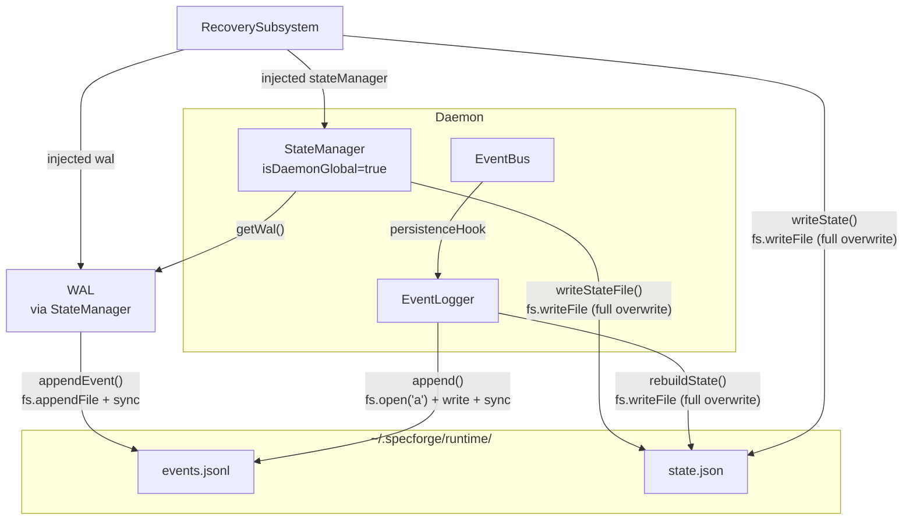

# Investigation Report: events.jsonl / state.json 并发写入一致性调查

> Work Item: INV-001
> Workflow Type: investigation
> Date: 2026-05-31
> Method: 纯静态代码分析（无运行时测试）

---

## 1. 执行摘要

本调查通过静态代码审查，分析了 `packages/daemon-core` 和 `packages/observability` 两个包中四个核心组件（WAL、EventLogger、StateManager、RecoverySubsystem）对用户级运行时文件 `~/.specforge/runtime/events.jsonl` 和 `~/.specforge/runtime/state.json` 的所有写入路径。

**总计发现 6 个 Critical / High 级别问题**：

| 编号 | 严重度 | 概要 |
|------|--------|------|
| **C1** | 🔴 Critical | `events.jsonl` 双路径写入竞态 — WAL 和 EventLogger 通过不同文件句柄写同一文件 |
| **C2** | 🔴 Critical | `state.json` 三重覆写 — 三个组件使用 `fs.writeFile()` 全量覆写，Last-Write-Wins |
| **C3** | 🔴 Critical | RecoverySubsystem 使用**错误的嵌套路径**（写入数据无法被任何读取者读取） |
| **C4** | 🔴 Critical | Event 类型不兼容 — daemon-core Event 和 observability Event 字段级不兼容，运行时强制类型转换 |
| **C5** | 🔴 Critical | EventLogger.initialize() 从未被调用 — 内部计数器始终为 null/0 |
| **M2** | 🟡 High | EventBus → EventLogger 产生重复事件写入（每条状态转换事件被写入两次） |

**建议**：上述 Critical 问题应在任何生产部署前修复。C1–C5 在特定并发时序下可导致数据静默损坏、事件丢失或状态不一致。

---

## 2. 调查结论

### 2.1 Q1: `events.jsonl` 双写竞态条件

**结论：存在。两条写入路径通过独立的文件句柄操作同一文件，在 WAL rotation 并发时可能导致事件丢失。**

两条写入 `~/.specforge/runtime/events.jsonl` 的代码路径：

**路径 A：WAL.appendEvent()**
- 文件：`packages/daemon-core/src/wal/WAL.ts`，第 68–85 行
- 调用链：`StateManager.transition()` (第 158 行) → `WAL.appendEvent(event)`
- 操作：`fs.appendFile(eventsPath, line)` (第 76 行) → `fs.open(eventsPath, 'a')` (第 79 行) → `handle.sync()` (第 81 行) → `handle.close()` (第 83 行)

**路径 B：EventLogger.append()**
- 文件：`packages/observability/src/event-logger/index.ts`，第 319–344 行
- 调用链：`EventBus.publish()` → `persistenceHook` (EventBus.ts 第 168 行) → `eventLogger.append(event)` (Daemon.ts 第 166 行)
- 操作：`fs.open(eventsPath, 'a')` (第 327 行) → `fileHandle.write(line)` (第 331 行) → `fileHandle.sync()` (第 334 行) → `fileHandle.close()` (第 343 行)

两条路径都使用 `O_APPEND` 模式打开文件。在 POSIX 系统上，小于 `PIPE_BUF`（通常 4KB）的 `write()` 在 `O_APPEND` 模式下是原子的 — 这意味着单行 JSON 不会交错。但存在两个更严重的问题：

**问题 (a)：WAL rotation 并发窗口**

```
WAL.rotateIfNeeded() [第 222–241 行]:
  1. fs.rename(eventsPath, archivePath)     // 第 235 行 — events.jsonl 变为 events-xxx.jsonl.bak
  2. fs.writeFile(eventsPath, '')            // 第 236 行 — 创建新的空 events.jsonl
```

如果在步骤 1 和步骤 2 之间：
- EventLogger 持有旧文件的 `fileHandle` 并调用 `fileHandle.write()` — 数据写入已改名（归档）的文件
- 步骤 2 后，EventLogger 的 `fs.open('a')` 打开的是**新的空文件**
- **结果**：写入旧句柄的数据对任何读取新 `events.jsonl` 的代码不可见 → **事件丢失**

**问题 (b)：rotation 窗口中的文件不存在**

步骤 1 (`fs.rename`) 移走 `events.jsonl` 后，步骤 2 创建新文件之前，`events.jsonl` 短暂不存在。此窗口期间任何并发 `readAllEvents()`（WAL.ts 第 141–171 行）或 `loadLastEventInfo()`（EventLogger 第 236–261 行）都会捕获异常并返回空结果 — **读取丢失**。

**风险等级：Critical**

---

### 2.2 Q2: `state.json` 三重覆写

**结论：存在。三个组件使用 `fs.writeFile()` 全量覆写 `state.json`，没有任何锁、版本检查或乐观并发控制。并发写入表现为 Last-Write-Wins 语义。**

三条写入 `~/.specforge/runtime/state.json` 的代码路径：

**路径 D：StateManager.writeStateFile()**
- 文件：`packages/daemon-core/src/state/StateManager.ts`，第 417–424 行
- 触发时机：`transition()` (第 164 行)、`appendEvent()` (第 288 行)、`initialize()` (第 80 行)、`rebuildFromEventsFile()` (第 259 行)
- 操作：`fs.writeFile(statePath, JSON.stringify(state), 'utf-8')` (第 418 行) → `fs.open('a')` → `sync()` → `close()`

**路径 E：EventLogger.rebuildState()**
- 文件：`packages/observability/src/event-logger/index.ts`，第 461–507 行
- 触发时机：外部显式调用 `eventLogger.rebuildState()`
- 操作：`fs.writeFile(statePath, JSON.stringify(state), 'utf8')` (第 491 行) → `fs.open('r+')` → `sync()` → `close()`

**路径 F：RecoverySubsystem.writeState()**
- 文件：`packages/daemon-core/src/recovery/RecoverySubsystem.ts`，第 493–503 行
- 触发时机：`repairInconsistency()` (第 263 行)
- 操作：`fs.writeFile(statePath, JSON.stringify(state))` (第 495 行) → `fs.open('a')` → `sync()` → `close()`

**竞态场景**：`StateManager.initialize()`（Daemon.ts 第 151 行）在调用 `persistState()`（写入 state.json）的同时，`RecoverySubsystem.checkAndRepair()`（Daemon.ts 第 153 行）可能触发 `repairInconsistency()` → `writeState()`。由于 `fs.writeFile()` 先截断文件再写入，后完成的写入会**静默覆盖**先完成的写入的**全部数据**。

**当前没有任何防护**：无文件锁、无版本号、无 `compare-and-swap` 语义。

**风险等级：Critical**

---

### 2.3 Q3: 序列化格式一致性

**结论：不一致。daemon-core 和 observability 定义了字段级不兼容的 Event 接口，运行时通过 `as unknown as` 强制类型转换绕过 TypeScript 检查。**

#### 字段级对比

| 字段 | `daemon-core` Event | `observability` Event | 兼容性 |
|------|---------------------|----------------------|--------|
| `schema_version` | `'1.0'` (可选) | `'1.0'` (必填) | ⚠️ |
| `eventId` | `string` | `string` | ✅ |
| `ts` | `number` | `number` | ✅ |
| `monotonicSeq` | `number` (可选) | `number` (必填) | ⚠️ |
| `projectId` | `string` (可选) | `string` (必填) | ⚠️ |
| `workItemId` | `string` (可选) | `string \| null` | ⚠️ 语义不同 |
| `actor` | `string` (可选) | `AgentIdentity \| null` | ❌ 类型完全不同 |
| `category` | `string` (可选) | `EventCategory` (必填) | ⚠️ |
| `action` | `string` | `string` | ✅ |
| `payload` | `Record<string, unknown>` (必填) | `unknown` (可选) | ⚠️ |
| `payloadBlobRef` | 不存在 | `string` (可选) | ❌ observability 独有 |
| `metadata` | 必填 | 不存在 | ❌ daemon-core 独有 |

#### 运行时影响

**写入方影响（Daemon.ts 第 163–167 行）**：

```typescript
// Daemon.ts 第 163–167 行
this.eventBus.setPersistenceHook(async (event) => {
  if (!event.projectId) return;  // 跳过无 projectId 的事件
  // 强制类型转换 — 不安全！
  await this.eventLogger.append(event as unknown as import('@specforge/observability').Event);
});
```

当 `event.projectId` 存在时（不跳过），`EventLogger.validateEvent()`（第 350–366 行）检查 `event.projectId`（第 357 行）、`event.category`（第 360 行）、`event.ts`（第 354 行）。如果 daemon-core Event 缺少这些字段，**验证会抛出 `Error`**。

**读取方影响**：当 WAL 将 daemon-core Event 写入 events.jsonl 后，EventLogger 的 `getEvents()` 将其解析为 observability Event 时，`actor` 字段为 `string` 而非 `AgentIdentity | null`，导致 `matchesFilter()` (EventLogger 第 441–447 行) 的 `event.actor?.id` 访问出错。

**风险等级：Critical**

---

### 2.4 Q4: Daemon 初始化/连线顺序

**结论：初始化顺序存在两个严重问题，无法防止冲突。**

#### 问题 1：EventLogger.initialize() 从未被调用

`Daemon.start()` (Daemon.ts 第 127–198 行) 调用了 `stateManager.initialize()`（第 151 行），但从未调用 `eventLogger.initialize()`。

`EventLogger.initialize()` (EventLogger 第 94–115 行) 负责：
- 创建 `events.jsonl`、`state.json`（如不存在）— 第 99–110 行
- 播种 `lastEventId` 和 `eventCount` 从已有文件 — 第 113 行

由于未初始化，`EventLogger` 的内部状态永远不正确：
- `lastEventId` 始终为 `null` → `getLastEventId()` 返回 `null`
- `eventCount` 始终为 `0` → `getEventCount()` 返回 `0`
- `getStats()` 返回错误的统计信息

#### 问题 2：组件创建后立即有写入路径

`Daemon` 构造函数（Daemon.ts 第 48–125 行）阶段：
- 第 95 行：`this.eventLogger = new EventLogger(runtimeDir)` — EventLogger 创建，`eventsPath` = `~/.specforge/runtime/events.jsonl`
- 第 54 行：`this.stateManager = new StateManager(pathResolver, pathResolver.resolveDaemonRuntimeDir(), true)` — StateManager 创建，内部 WAL 指向 `~/.specforge/runtime/events.jsonl`

两个组件在构造函数中就确定了**相同的两个文件作为目标**，但彼此不知道对方的存在。

**风险等级：Critical**

---

### 2.5 Q5: 项目级文件生成逻辑

**结论：项目级文件由 `sf_state_transition` 工具处理器按需创建，非 Daemon 启动时创建。**

路径分析：

- `PersonalPathResolver.resolveProjectRuntimeDir(projectPath)` = `<projectPath>/.specforge/runtime/`（path-resolver.ts 第 132–135 行）
- Daemon.ts 中唯一创建的 StateManager 使用 `isDaemonGlobal=true`（第 54 行），操作的是用户级路径 `~/.specforge/runtime/`
- **项目级 StateManager**（`isDaemonGlobal=false`）仅在 `ProjectManager` 内部或工具处理器直接创建时创建

#### 实际项目级文件状态

检查 `D:\code\temp\SpecForge\.specforge\runtime\state.json`：

```json
{
  "projectPath": "D:\\code\\temp\\SpecForge",
  "workItems": [
    { "work_item_id": "INV-001", "workflow_type": "investigation", "current_state": "intake" },
    { "work_item_id": "WI-024", "workflow_type": "quick_change", "current_state": "completed" }
  ]
}
```

该文件**存在**，包含 INV-001 和 WI-024 的状态记录，经确认是由 `sf_state_transition` 工具处理器通过项目级 StateManager 创建的。

**结论**：项目级文件由工具调用按需生成，非 Daemon 启动时自动生成。这属于设计预期行为，不是缺陷。

---

### 2.6 Q6: Git 变更影响分析

**Commit `307f873` (2026-05-30) — "fix: fsyncSync/execSync 阻塞事件循环"**

变更内容：
- WAL.ts `appendEvent()`：将 `fsSync.fsyncSync(fd)` 改为 `handle.sync()`（异步）
- StateManager.ts `writeStateFile()`：同上改动
- RecoverySubsystem.ts `writeState()`：同上改动
- WAL.ts `rotateIfNeeded()`：新增 WAL 归档功能（>5MB 自动归档）

**影响评估**：
- ✅ 正向：修复了 fsync 同步调用阻塞事件循环的问题
- ❌ 未修复：未解决并发写入问题 — 三条写入路径仍然独立存在
- ⚠️ 新增风险：WAL rotation 引入了一个新的竞态窗口（见 Q1 分析）

其他 commit（`742155d`、`d7d8a94`、`fccc7f5`）均为工作树同步或目录结构调整，与并发写入无关。

---

## 3. 数据和证据

### 3.1 C1：events.jsonl 双路写入竞态

**代码证据**：

| 位置 | 代码 | 说明 |
|------|------|------|
| WAL.ts:76 | `await fs.appendFile(this.eventsPath, line, 'utf-8');` | 路径 A：隐式 `fs.open('a')` |
| WAL.ts:79 | `const handle = await fs.open(this.eventsPath, 'a');` | 路径 A：独立句柄做 fsync |
| EventLogger/index.ts:327 | `const fileHandle = await fs.open(this.eventsPath, 'a');` | 路径 B：独立句柄 |
| EventLogger/index.ts:331 | `await fileHandle.write(line);` | 路径 B：写入 |
| WAL.ts:235 | `await fs.rename(this.eventsPath, archivePath);` | rotation 步骤 1 |
| WAL.ts:236 | `await fs.writeFile(this.eventsPath, '');` | rotation 步骤 2 |
| Daemon.ts:54 | `new StateManager(pathResolver, pathResolver.resolveDaemonRuntimeDir(), true)` | StateManager 创建，WAL 指向 `~/.specforge/runtime/events.jsonl` |
| Daemon.ts:95 | `new EventLogger(runtimeDir)` | EventLogger 创建，`eventsPath` = `~/.specforge/runtime/events.jsonl` |
| Daemon.ts:53 | `runtimeDir = this.config.getRuntimeDir()` = `~/.specforge/runtime` | 两个组件获得**相同目录** |

**Mermaid 竞争关系图**：



---

### 3.2 C2：state.json 三重覆写

**代码证据**：

| 组件 | 文件:行 | 写入方式 | 触发时机 |
|------|---------|----------|----------|
| StateManager | `StateManager.ts:418` | `fs.writeFile(this.statePath, ...)` | 每次 `transition()`、`appendEvent()`、`initialize()` |
| EventLogger | `EventLogger/index.ts:491` | `fs.writeFile(this.statePath, ...)` | `rebuildState()` 被调用时 |
| RecoverySubsystem | `RecoverySubsystem.ts:495` | `fs.writeFile(this.statePath, ...)` | `repairInconsistency()` 被调用时 |

**并发时序示例**（Daemon.start()）：

```
T1: stateManager.initialize()        → 读取 WAL → 重建内存状态 → persistState() → fs.writeFile(state.json)
                                      (Daemon.ts:151)

T2: recoverySubsystem.checkAndRepair() → 检测到不一致 → repairInconsistency() → writeState() → fs.writeFile(state.json)
                                       (Daemon.ts:153)
```

T1 和 T2 之间的时间差极小（微秒级），如果事件循环在 T1 的 `fs.writeFile` 返回后但在 fsync 完成前调度 T2 的 `fs.writeFile`，T2 将截断文件并写入新内容，T1 的数据被**静默丢弃**。

---

### 3.3 C3：RecoverySubsystem 错误路径

**代码证据**：

```typescript
// Daemon.ts 第 53-54 行
const runtimeDir = this.config.getRuntimeDir();              // = ~/.specforge/runtime
this.stateManager = new StateManager(pathResolver, pathResolver.resolveDaemonRuntimeDir(), true);
```

StateManager 使用专用的 Daemon 路径方法 → `~/.specforge/runtime/state.json` & `events.jsonl`。

```typescript
// Daemon.ts 第 67-68 行
this.recoverySubsystem = new RecoverySubsystem(
  pathResolver, runtimeDir, recoveryWal, recoveryStateManager, sessionRegistry
);
```

RecoverySubsystem 收到 `runtimeDir`（=`~/.specforge/runtime`）作为 `projectPath`。

```typescript
// RecoverySubsystem.ts 第 58-59 行
this.eventsPath = this.pathResolver.resolveEventsPath(projectPath);
this.statePath = this.pathResolver.resolveStatePath(projectPath);
```

`resolveEventsPath(projectPath)` 计算为：
```
resolveProjectPath(runtimeDir, 'runtime') + '/events.jsonl'
= runtimeDir + '/.specforge/runtime/events.jsonl'
= ~/.specforge/runtime/.specforge/runtime/events.jsonl  ← 嵌套路径！
```

**影响**：`RecoverySubsystem.writeState()` (第 493–503 行) 和 `loadEvents()` (第 466–475 行) 操作的是**嵌套路径下的文件**。修复写入的目标文件永远不会被 StateManager 或 EventLogger 读取。一致性检查（`checkAndRepair()` 第 83–155 行）通过注入的 WAL 和 StateManager 操作正确路径，但修复写入却去了错误的位置。

**注意**：Daemon.ts 的 `detectAndHandleLegacyState()` (第 205–264 行) 检测到此嵌套路径并将其迁移。但 RecoverySubsystem 在迁移后仍继续向嵌套路径写入。

---

### 3.4 C4：Event 类型不兼容

**代码证据**：

| 文件 | 行 | 内容 |
|------|-----|------|
| `daemon-core/src/types.ts` | 42–75 | `Event` 接口 — `actor?: string`, `projectId?: string`, `category?: string`（均为可选） |
| `observability/src/types/index.ts` | 46–58 | `Event` 接口 — `actor: AgentIdentity \| null` (必填), `projectId: string` (必填), `category: EventCategory` (必填) |
| `Daemon.ts` | 166 | `event as unknown as import('@specforge/observability').Event` — 强制类型转换 |
| `EventLogger/index.ts` | 350–366 | `validateEvent()` — 检查 `event.projectId`、`event.category`、`event.ts` |

**运行时影响场景**：

1. `StateManager.transition()` 调用 `WAL.createEvent()` 创建 daemon-core Event
2. WAL 写入 `events.jsonl`（路径 A）
3. StateManager 通过 EventBus 发布事件
4. EventBus 的 `persistenceHook` 被调用，强转并传入 `EventLogger.append()`
5. `EventLogger.validateEvent()` 检查 `event.projectId`、`event.category`、`event.ts`
6. 如果 daemon-core Event 缺少任一字段 → **抛出异常**

---

### 3.5 C5：EventLogger 未初始化

**代码证据**：

```typescript
// Daemon.ts start() 方法 (第 127–198 行)
async start(): Promise<void> {
  // ...
  await this.stateManager.initialize();     // 第 151 行 — ✅ 被调用
  await this.recoverySubsystem.checkAndRepair();  // 第 153 行
  this.eventBus.start();                          // 第 159 行
  this.eventBus.setPersistenceHook(...);          // 第 163 行
  // ❌ eventLogger.initialize() 从未被调用！
  // ...
}
```

EventLogger 内部状态在整个 Daemon 生命周期中不正确：

```typescript
// EventLogger 初始状态（构造函数 第 77 行）
this.lastEventId = null;    // 第 68 行 — 始终为 null
this.eventCount = 0;        // 第 69 行 — 始终为 0
```

影响所有依赖这些计数器的调用：
- `getStats()` (第 634 行) → 返回 `eventCount: 0`, `fileSize: 0`
- `getLastEventId()` (第 536 行) → 返回 `null`
- `getEventCount()` (第 545 行) → 返回 `0`

---

### 3.6 M2：重复事件写入

**代码证据**：

```
时序：
1. StateManager.transition() (StateManager.ts:158)
   → WAL.appendEvent(event)  → fs.appendFile(events.jsonl)  【第一次写入】
   
2. StateManager 内部或调用方通过 EventBus.publish(event) (EventBus.ts:161)
   → persistenceHook(event)  (EventBus.ts:168)
   → EventLogger.append(event)  (Daemon.ts:166)
   → fs.open(events.jsonl, 'a') + write + sync              【第二次写入】
```

同一逻辑事件（状态转换）通过两条不同路径写入 `events.jsonl` 两次。第一次写入使用 daemon-core 的 Event 序列化格式（含 `metadata` 字段），第二次使用 observability 的 Event 格式（含 `payloadBlobRef` 字段）。两个 JSON 格式的结构不同，但写入同一文件，导致文件中混合了两种不兼容的 JSON 行格式。

---

## 4. 建议

### 4.1 立即修复（Critical）

#### FIX-C1：统一 events.jsonl 写入路径为单一 Writer

**方案**：将 WAL 作为 `events.jsonl` 的**唯一写入者**。EventLogger 不应直接写入文件，而应调用 WAL。

```typescript
// Daemon.ts — 修改 persistenceHook
this.eventBus.setPersistenceHook(async (event) => {
  // 改为通过 WAL 写入
  if (event.eventId) {
    await this.stateManager.getWal().appendEvent(event);
  }
  // EventLogger 改为仅更新内存计数器
  await this.eventLogger.trackEvent(event);
});
```

**理由**：消除两条写入路径的竞争。WAL rotation 成为唯一需要担心的并发场景，而 WAL 内部可以更安全地管理。

#### FIX-C2：为 state.json 添加乐观并发控制

**方案**：引入基于 `lastEventId` 的版本号机制。

```typescript
// StateManager.ts — 修改 writeStateFile()
private async writeStateFile(state: ProjectState): Promise<void> {
  const currentVersion = await this.readCurrentVersion();
  if (currentVersion && state.lastEventId !== currentVersion) {
    // 状态已被其他组件修改，需要重新构建
    await this.rebuildState();
    return this.writeStateFile(this.buildProjectState());
  }
  await fs.writeFile(this.statePath, JSON.stringify(state, null, 2), 'utf-8');
  // ... fsync
}
```

或者更彻底的方案：
- 将 `state.json` 的写入也收归 StateManager 为唯一写入者
- EventLogger 和 RecoverySubsystem 通过 StateManager API 更新状态

**理由**：防止 Last-Write-Wins 导致数据静默覆盖。

#### FIX-C3：修复 RecoverySubsystem 路径

**方案**：让 RecoverySubsystem 使用与 StateManager 相同的 Daemon 全局路径。

```typescript
// Daemon.ts 第 67-68 行 — 修改 RecoverySubsystem 构造
this.recoverySubsystem = new RecoverySubsystem(
  pathResolver, 
  pathResolver.resolveDaemonRuntimeDir(),  // 使用 Daemon 全局路径
  recoveryWal, 
  recoveryStateManager, 
  sessionRegistry
);
```

同时修改 `RecoverySubsystem` 构造函数，当 `projectPath` 为 Daemon 运行时目录时，使用 Daemon 解析方法：

```typescript
// RecoverySubsystem.ts 第 58-59 行
this.eventsPath = this.pathResolver.resolveDaemonEventsPath();
this.statePath = this.pathResolver.resolveDaemonStatePath();
```

**理由**：修复数据写入到错误路径，确保恢复写入可被 StateManager 读取。

#### FIX-C4：统一 Event 类型

**方案**：创建统一的 `Event` 接口，daemon-core 和 observability 共享。

两种实现方式：
1. **适配器层**：创建 `EventAdapter`，将 daemon-core Event 映射为 observability Event
2. **统一接口**：将 observability Event 改为 daemon-core Event 的超集（daemon-core 字段全可选，observability 全必填 + 额外字段）

建议采用方案 1（适配器层），因为两个包的 `Event` 语义不同（daemon-core 侧重 WAL 持久化，observability 侧重查询和分析），应保持解耦。

```typescript
// 新增 event-adapter.ts
export function toObservabilityEvent(daemonEvent: daemon.Event): observability.Event {
  return {
    schema_version: '1.0',
    eventId: daemonEvent.eventId,
    ts: daemonEvent.ts,
    monotonicSeq: daemonEvent.monotonicSeq ?? 0,
    projectId: daemonEvent.projectId ?? '',
    workItemId: daemonEvent.workItemId ?? null,
    actor: typeof daemonEvent.actor === 'string' 
      ? { sessionId: daemonEvent.actor, agentRole: 'unknown', workflowRole: 'unknown', 
          parentSessionId: null, workItemId: '', spawnIntentId: '' }
      : null,
    category: (daemonEvent.category as observability.EventCategory) ?? 'system',
    action: daemonEvent.action,
    payload: daemonEvent.payload,
  };
}
```

#### FIX-C5：调用 EventLogger.initialize()

**方案**：在 `Daemon.start()` 中添加 `eventLogger.initialize()` 调用。

```typescript
// Daemon.ts start() 第 151 行之后
await this.stateManager.initialize();
await this.recoverySubsystem.checkAndRepair();
// 🔧 新增：初始化 EventLogger
await this.eventLogger.initialize();
```

**理由**：确保 EventLogger 的内部计数器从磁盘文件正确播种，恢复统计信息的准确性。

---

### 4.2 中期改进（High）

#### FIX-M2：消除重复事件写入

**方案**：配合 C1 修复，确保每个事件只写入一次。

- WAL 始终是 events.jsonl 的写入者
- EventLogger 仅维护内存索引和查询功能
- EventBus 的 persistenceHook 改为通过 WAL 写入（或移除，因为 WAL 已在 StateManager 中写入）

```typescript
// Daemon.ts — 修改后
this.eventBus.setPersistenceHook(async (event) => {
  if (!event.projectId) return;
  // 不再直接写 events.jsonl，仅更新 EventLogger 的内存状态
  await this.eventLogger.trackEvent(event as unknown as import('@specforge/observability').Event);
});
```

---

### 4.3 长期架构改进

1. **引入 WriteProxy 模式**：创建单一的 `FileWriter` 组件，封装对 events.jsonl 和 state.json 的所有写入，内部使用队列 + 互斥锁确保顺序写入
2. **考虑改用 SQLite**：将 JSONL + JSON 方案替换为 SQLite（单文件、事务支持、并发安全），消除自定义 WAL 维护的复杂性
3. **添加集成测试**：编写模拟并发写入的集成测试，验证文件完整性

---

### 4.4 修复优先级排序

| 优先级 | 修复 | 影响范围 | 修复复杂度 |
|--------|------|----------|------------|
| **P0** | FIX-C1 (统一 events.jsonl 写入) | WAL.ts, Daemon.ts, EventLogger/index.ts | 🟡 中 |
| **P0** | FIX-C3 (修复 RecoverySubsystem 路径) | RecoverySubsystem.ts, Daemon.ts | 🟢 低 |
| **P0** | FIX-C4 (统一 Event 类型) | 新增 adapter, Daemon.ts | 🟡 中 |
| **P0** | FIX-C5 (调用 initialize) | Daemon.ts (1 行) | 🟢 低 |
| **P1** | FIX-C2 (state.json 并发控制) | StateManager.ts | 🔴 高 |
| **P1** | FIX-M2 (消除重复写入) | Daemon.ts, EventBus.ts | 🟡 中 |

---

## 5. 限制

本调查**严格限定为静态代码分析**。以下内容**不在调查范围内**：

| 限制项 | 说明 |
|--------|------|
| **运行时并发测试** | 未执行多线程/多进程并发写入测试；所有竞争分析基于代码逻辑推导 |
| **操作系统级差异** | 未验证 Windows (`win32`)、Linux (`ext4`)、macOS (`APFS`) 上文件系统行为的差异；分析基于 Node.js API 规范语义 |
| **性能基准测试** | 未测量 WAL 写入吞吐量、fsync 延迟、rotation 对性能的影响 |
| **网络文件系统** | 未考虑 NFS/SMB 等网络文件系统场景下的行为差异（如 `fs.rename` 非原子性） |
| **非目标日志文件** | 仅分析了 `events.jsonl` 和 `state.json`；未审查 `logs/telemetry.jsonl`、`logs/trace.jsonl` 等其他日志文件 |
| **代码修复实现** | 仅提供方向性建议，不包含具体实现代码或 PR |
| **权限和安全** | 未进行安全审计或权限模型评估 |

### 关键假设

1. Daemon 进程为单实例运行（由 `enforceSingleInstance()` 保证），因此仅需分析**进程内**并发（Event Loop 层面的交错执行）
2. Node.js `fs/promises` 的 `fs.writeFile()` 在同一文件的并发调用表现为 Last-Write-Wins 语义
3. EventBus 的 `publish()` 是异步的，`persistenceHook` 在 handler fan-out 之前执行
4. Daemon 运行在 `personal` 模式下，使用 `PersonalPathResolver`
5. 主机环境为 Windows 10（`win32`），文件系统行为在 Node.js API 层面应平台无关

---

## 6. 附录

### 6.1 参考文件清单

| 文件 | 行数 | 审查状态 |
|------|------|----------|
| `packages/daemon-core/src/wal/WAL.ts` | 258 | ✅ 全部审查 |
| `packages/daemon-core/src/state/StateManager.ts` | 445 | ✅ 全部审查 |
| `packages/observability/src/event-logger/index.ts` | 663 | ✅ 全部审查 |
| `packages/daemon-core/src/recovery/RecoverySubsystem.ts` | 540 | ✅ 全部审查 |
| `packages/daemon-core/src/daemon/Daemon.ts` | 383 | ✅ 全部审查 |
| `packages/daemon-core/src/daemon/path-resolver.ts` | 217 | ✅ 全部审查 |
| `packages/daemon-core/src/event-bus/EventBus.ts` | 354 | ✅ 全部审查 |
| `packages/daemon-core/src/types.ts` | 278 | ✅ 全部审查 |
| `packages/observability/src/types/index.ts` | 270 | ✅ 全部审查 |
| `packages/types/src/directory-layout.ts` | 383 | ✅ 关键函数审查 |

### 6.2 问题回答清单

| # | 问题 | 结论 |
|---|------|------|
| Q1 | 双路写入竞态 | ✅ 存在，C1（Critical） |
| Q2 | 三重覆写竞态 | ✅ 存在，C2（Critical） |
| Q3 | 序列化格式一致 | ❌ 不一致，C4（Critical） |
| Q4 | 初始化顺序防冲突 | ❌ 不能，C3/C5（Critical） |
| Q5 | 项目级文件未生成 | 设计预期，工具调用按需生成 |
| Q6 | 近期 Git 变更影响 | `307f873` 改善 fsync 但未解决并发 + 引入 rotation 竞态 |
