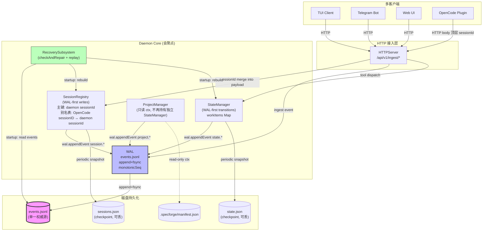
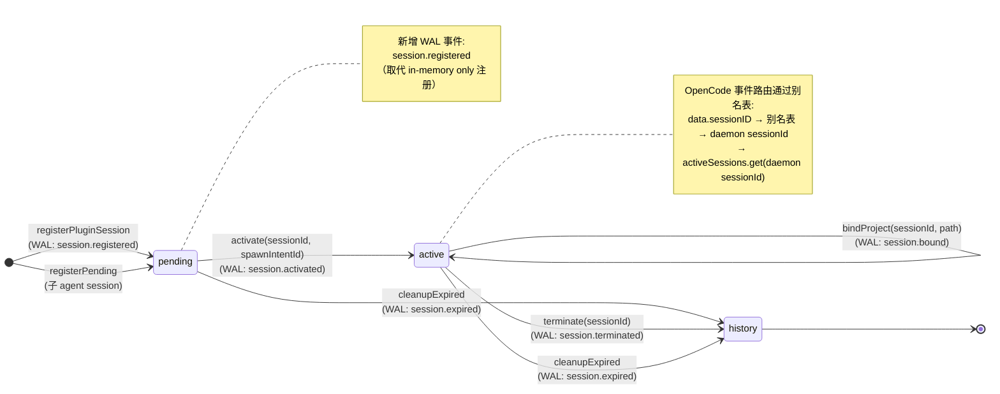
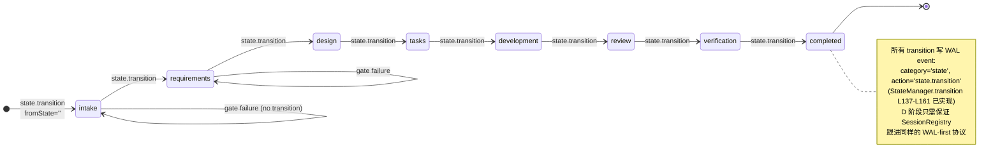

# 05 — 推荐方案与目标架构（步骤 5，回答 Q4）

> 这是 research 阶段**唯一一次下结论**的产物。理由完全基于 `03-comparison-matrix.md` 和 `04-hybrid-feasibility.md` 的填表结果，不凭直觉。

---

## 5.1 推荐结论（一句话）

> **推荐 A+D（Hybrid，分阶段）**：用方案 A 在 Phase 0 立即修补症状 1 的 ID 映射断链，随后用方案 D 把 SessionRegistry 与 StateManager 共同 WAL 化，让 daemon 重启后状态完整可恢复。

### 三条理由（基于 03/04 填表）

1. **A+D 是唯一同时覆盖两个症状的可行 hybrid**（`04 H2`）：A 解症状 1（D5 plugin 零改、D4 改动 "一文件 + 一行"），D 解症状 2（D2 权威归 events.jsonl、D3 daemon 重启后绑定可恢复）。其它 hybrid 要么互斥（A+B / A+B+D，`04 H1/H4`）要么高风险（B+D 同期破坏两条不变式，`04 H3`）。
2. **A 与 D 在 D9（Property 20/21 兼容性）上不冲突**（`03 D9-A` 完全兼容、`03 D9-D` 扩展但不重写），相比 B 显式破坏 Property 5（`03 D1-B`），风险面更小。
3. **A 可作为 D 的 Phase 0 快速止血**，D 在数周内完成时 A 引入的别名表自然纳入 WAL 事件，**实施成本是 D 单方面 + A 的"一文件 + 一行" ≈ D 的成本**（`04 H2 - 负担`）。

---

## 5.2 目标架构图（mermaid graph TD）



### 关键架构差异（vs 现状）

| 维度 | 现状 | 目标 |
|------|------|------|
| WAL 实例 | 多个（Daemon.ts L82 + StateManager 内部 + 每个 per-project StateManager 内部，C7 隐式契约 (1)） | **单例**，由 Daemon 顶层持有，所有子系统注入引用 |
| StateManager 实例 | 双（Daemon 全局 + ProjectManager 内部 per-project，C5 隐式契约 (1)） | **单例**，ProjectManager 不再持有 StateManager |
| RecoverySubsystem | 不注入 WAL/StateManager 走 fallback（C6 隐式契约 (1)/(2)） | **注入 WAL+StateManager**，rebuild 走真实路径 |
| SessionRegistry 持久化 | 仅 getSnapshot 在内存（启动期不 restore，03 D3-A 中点出） | **每次写操作前写 WAL**（session.registered/bound/activated/terminated），rebuild 可还原 |
| ID 映射 | 单 Map by daemon sessionId | **主表 + 别名表**：主键 daemon sessionId，OpenCode sessionID → daemon sessionId 别名 |
| 多客户端会聚点语义承担 | SessionRegistry（事实上） | **SessionRegistry 显式承担**，HTTPServer 仅做协议适配 |

---

## 5.3 状态机（mermaid stateDiagram-v2）

### 5.3.1 会话生命周期



### 5.3.2 工作项生命周期（保留现状语义，仅 WAL-first 语义统一）



> 注：工作项状态枚举 = `ALL_STATES` from `tools/lib/state_machine`，本图按 Feature Spec 工作流主路径绘制，其它工作流（bugfix/refactor/change_request/investigation/ops_task/quick_change）的状态机变体不在 research 范围。

---

## 5.4 关键数据流

### 5.4.1 数据流 a — 插件 register → 颁发身份 → 第一条 OpenCode event 路由

```
┌──────────┐                                    ┌──────────────┐
│ Plugin   │                                    │ Daemon       │
│ (postEvt)│                                    │              │
└────┬─────┘                                    └──────┬───────┘
     │                                                 │
     │ 1. POST /api/v1/ingest/register                │
     │    body: { projectPath }                       │
     ├────────────────────────────────────────────────►│ HTTPServer.handleIngestRegister
     │                                                 │   ├─ ProjectManager.registerProject
     │                                                 │   │   (只创建 ProjectContext, 不再创建 StateManager)
     │                                                 │   ├─ WAL.appendEvent(session.registered)
     │                                                 │   │   { sessionId, projectId, projectPath }
     │                                                 │   ├─ SessionRegistry.registerPluginSession
     │                                                 │   │   (apply to in-memory Map)
     │ 2. response { sessionId, projectId, mode }     │   │
     │◄────────────────────────────────────────────────┤
     │                                                 │
     │ 3. POST /api/v1/ingest/event                   │
     │    body: { sessionId,                          │
     │           type: 'opencode.event',              │
     │           data: { subType, sessionID, ... } }  │
     ├────────────────────────────────────────────────►│ HTTPServer.handleIngestEvent
     │                                                 │   └─ routeIngestEvent
     │                                                 │       └─ handleOpenCodeEvent(sessionId, data, ts)
     │                                                 │           │
     │                                                 │           │ ★ 修复点 (Phase 0/A):
     │                                                 │           │ 合并顶层 sessionId 进 payload
     │                                                 │           ▼
     │                                                 │       SessionRegistry.handleOpenCodeEvent
     │                                                 │           │
     │                                                 │           ├─ Step 1: lookup data.sessionId
     │                                                 │           │           (daemon sessionId, 主键命中)
     │                                                 │           ├─ Step 2: lookup data.sessionID  
     │                                                 │           │           (OpenCode sessionID, 走别名表)
     │                                                 │           │           别名命中 → 转 daemon sessionId
     │                                                 │           └─ WAL.appendEvent(session.touched/...)
     │ 4. response { received: true, type }           │
     │◄────────────────────────────────────────────────┤
```

**关键变化点**：
- **Phase 0 (方案 A 部分)**：HTTPServer.handleOpenCodeEvent L1130-L1148 改 1 行——`{ ...payload, sessionId: payload.sessionId ?? sessionId }`，让顶层 sessionId 成为兜底进 payload。SessionRegistry 4 步映射 Step 1 立即命中（D1-A partial）。
- **Phase D**：register 路径写 `session.registered` WAL 事件；OpenCode 事件路由前先写 `session.touched`（可选，避免 WAL 灌水）；别名表的建立通过 `session.alias_bound` 事件。

### 5.4.2 数据流 b — daemon 重启 → 恢复绑定 → 接受第一条新 event

```
┌──────────────────────────────────────────────────────────────┐
│ Daemon process (new PID)                                     │
├──────────────────────────────────────────────────────────────┤
│ Daemon.start()                                               │
│   ├─ recoverySubsystem.beginStartupPhase()                   │
│   ├─ httpServer.start()  (开始监听, 但事件待 buffer)         │
│   ├─ handshakeManager.writeHandshake() (port+token 落盘)     │
│   ├─ stateManager.initialize()                               │
│   │   └─ wal.initialize() + rebuildState() (workItems 恢复)  │
│   ├─ recoverySubsystem.checkAndRepair()                      │
│   │   (注入了 wal+stateManager → 走真实 rebuild)             │
│   ├─ sessionRegistry.startupReplay()    ★ Phase D 新增       │
│   │   ├─ wal.readAllEvents()                                 │
│   │   ├─ filter category='session'                           │
│   │   └─ replay registered/activated/bound/terminated        │
│   │      → 恢复 pendingSessions/activeSessions/projectBindings/aliasMap│
│   ├─ eventBus.start() + sessionRegistry.start()              │
│   ├─ recoverySubsystem.completeStartup()                     │
│   └─ Daemon.isRunning = true                                 │
│                                                              │
│ ─── 此时 plugin 用旧 sessionId postEvent ───                 │
│                                                              │
│ HTTPServer.handleIngestEvent                                 │
│   └─ routeIngestEvent → handleOpenCodeEvent(sessionId, ...)  │
│       └─ SessionRegistry.handleOpenCodeEvent(subType, data') │
│           Step 1: lookup data'.sessionId (合并的旧 sessionId)│
│                   → 命中 projectBindings (因 WAL 已重放)     │
│           → 路由成功, 后续行为与正常 hot path 完全一致       │
└──────────────────────────────────────────────────────────────┘
```

**关键变化点**：
- Phase 0 之后**不解决**这条流（A 的 D3-A "partial"），插件用旧 sessionId 仍然 4 步全 miss
- Phase D 完成后，`sessionRegistry.startupReplay()` 是新方法（基于现有 `RecoverySubsystem.reconnectOldSessions` L485 的代码模式，但从"探测 OpenCode 进程"改为"纯本地 WAL 重放"）
- 与 Property 21 兼容：仍然只在 `isInStartupPhase=true` 期间做 replay（参 RecoverySubsystem L399-L403）

---

## 5.5 分阶段迁移路径

> 每阶段：(i) 范围 / (ii) 可独立交付的产物 / (iii) 回滚条件 / (iv) 与现有 state.json/events.jsonl 兼容方式

### Phase 0 — A 单方面修复（数小时级）

(i) **范围**：HTTPServer.handleOpenCodeEvent 把 HTTP 顶层 sessionId 合并进 payload；SessionRegistry 4 步映射改 5 步（加 alias lookup 表查询）；alias 表仅 in-memory，不持久化。  
(ii) **可独立交付产物**：单 PR ~30 行 .ts diff；附 1 个 e2e 测试覆盖"plugin register → postEvent opencode.event → 路由命中不再 WARN"。  
(iii) **回滚条件**：若新 alias 命中逻辑导致 SessionRegistry 出现错误绑定（如同一 OpenCode sessionID 关联多个 daemon sessionId），直接 revert PR；不影响 events.jsonl / state.json schema。  
(iv) **兼容方式**：完全兼容。events.jsonl 不变；state.json 不变；plugin wire format 不变。

### Phase 1 — WAL/StateManager 单例化（数天级，D 的前置）

(i) **范围**：Daemon.ts 改造：
- 消除 L82 单独的 `this.wal` —— 改为引用 `this.stateManager.getWal()` 或直接从 stateManager 暴露
- 修复 L53 把 runtimeDir 当 projectPath 传入的嵌套 statePath 问题
- 在 RecoverySubsystem 构造时注入 wal + stateManager（Daemon.ts L54）
- ProjectManager.ts L63 不再为每个项目创建独立 StateManager —— 改为引用 daemon 全局 stateManager 或显式只为多项目场景延迟创建

(ii) **可独立交付产物**：1 个内部重构 PR；新增 e2e 测试覆盖"daemon 重启后 workItems 从 events.jsonl rebuild 正确"。  
(iii) **回滚条件**：若 RecoverySubsystem 的真实 rebuild 路径在某种 events.jsonl 状态下抛错（旧 fallback 反而能容忍），先 revert RecoverySubsystem 注入部分；其它结构清理可保留。  
(iv) **兼容方式**：
- **events.jsonl**：完全兼容（schema 不变）
- **state.json**：现有 state.json 在新位置（不再嵌套）；启动期 RecoverySubsystem 重建并写穿真实路径。**旧嵌套位置的 state.json 可保留（孤儿文件）**，由 verification 阶段记录 cleanup 任务
- **manifest.json**：不变

### Phase 2 — SessionRegistry WAL 化（数周级，D 的核心）

(i) **范围**：
- 引入新 WAL event categories：`session.registered`、`session.bound`、`session.activated`、`session.terminated`、`session.alias_bound`
- SessionRegistry 所有写方法（registerPluginSession / registerPending / activate / terminate / bindProject / handleOpenCodeEvent 的 fallback registerPluginSession）改为 WAL-first（参 StateManager.transition L137-L161 模板）
- 新增 `SessionRegistry.startupReplay(events)` 方法
- RecoverySubsystem.checkAndRepair 在 rebuild 时调 SessionRegistry.startupReplay

(ii) **可独立交付产物**：新增 e2e 测试覆盖"daemon 重启后插件 postEvent 用旧 sessionId 路由命中"；docs 更新 Property 21（重连语义重写为"纯本地 WAL 重放"）。  
(iii) **回滚条件**：若新 WAL events 的写入吞吐成为热路径瓶颈（如 session.touched 写灌水），可加 throttle 或回滚到 in-memory only；事件格式兼容前提下回滚不损坏历史。  
(iv) **兼容方式**：
- **events.jsonl schema 演进**：新增 category='session'，旧事件没有此类——rebuild 时遇到旧 events.jsonl 自动跳过 session category（向后兼容）。**先解决 C7 隐式契约 (3)：WAL 加 schema_version 协商机制**
- **state.json 不变**（仍是 workItems checkpoint）
- **sessions.json checkpoint（新文件）**：可选，作为 SessionRegistry 在线 snapshot；rebuild 优先用 events 重放，sessions.json 加速冷启动

### Phase 3 — Property 21 重写 + 文档同步（数天级，收尾）

(i) **范围**：
- 重写 RecoverySubsystem L13-L17 Property 21 注释化不变式（从"启动期重连 OpenCode 进程"改为"启动期 WAL 重放重建 session 状态"）
- 删除 RecoverySubsystem L443-L523 detectOldSessions/reconnectOldSessions 的"网络探测"老路径（C6 隐式契约 (4) 指出当前是悬空契约）
- 更新 .kiro/specs 和 docs 中所有提及 Property 21 的位置

(ii) **可独立交付产物**：docs PR + 删除老代码 PR。  
(iii) **回滚条件**：若有任何外部测试依赖老 detectOldSessions API，保留 API 但内部转 startupReplay。  
(iv) **兼容方式**：events.jsonl / state.json 不变；纯文档与代码清理。

---

## 推荐之外的 fallback 选项（仅记录，不推荐）

- **若用户拒绝 D**（成本/时间窗口不允许）：单 A 也可接受作为"症状 1 单点修补"。但症状 2 + daemon 重启可恢复性不会解，必须在后续 WI 中追加 D。
- **若用户主推 B**：B+D（H3 部分成立）需先解决 events 历史的语义改写、Property 5 显式撤回——风险面更大。research 中不再展开。
