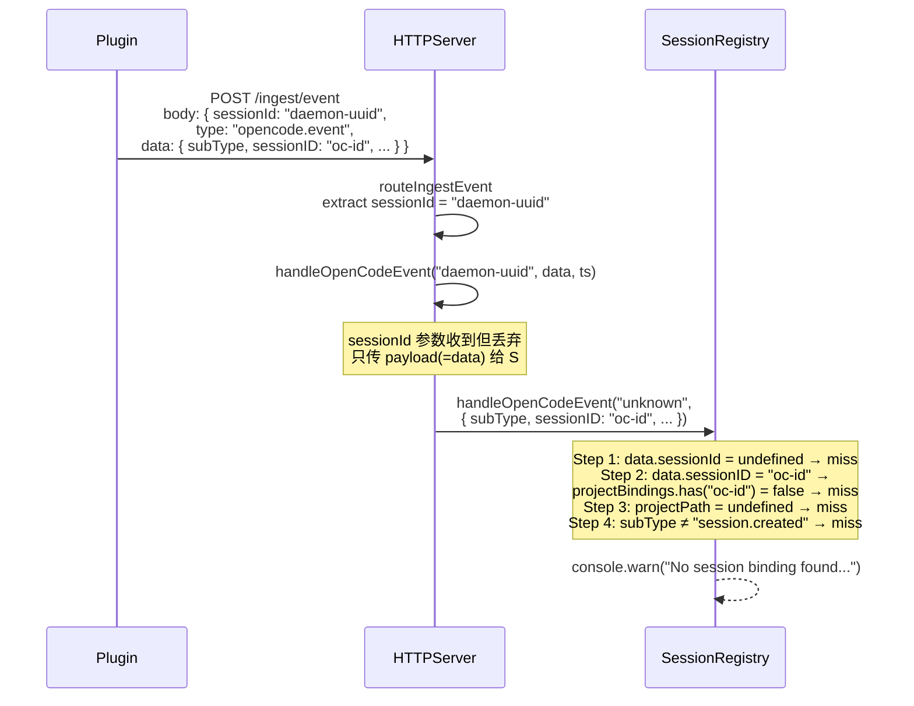
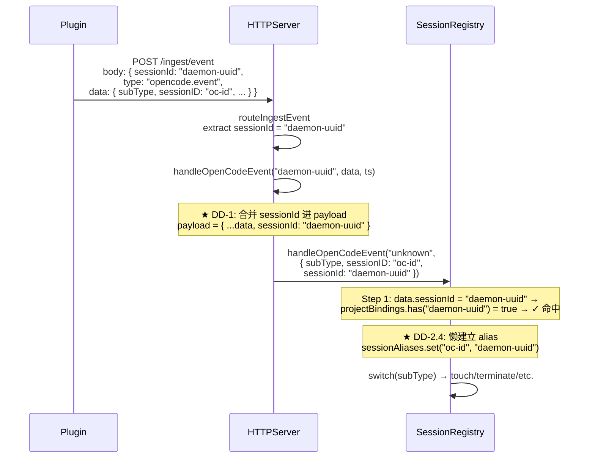
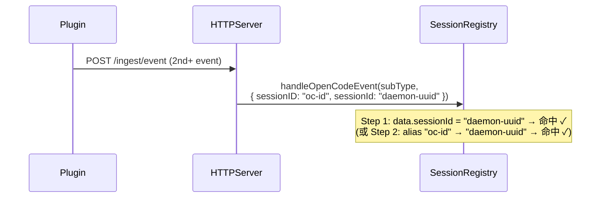
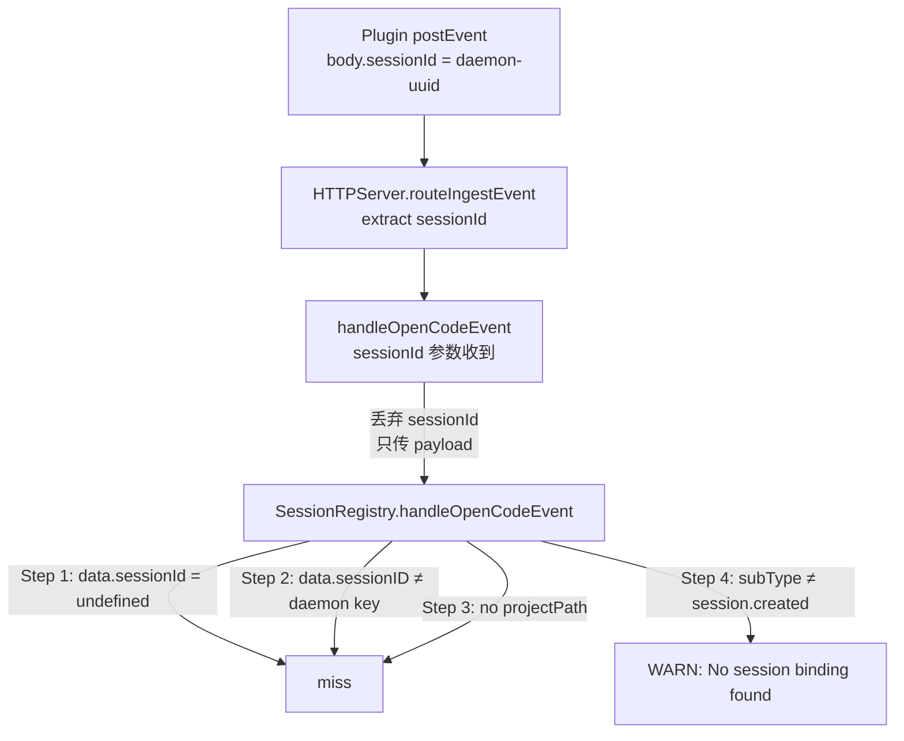
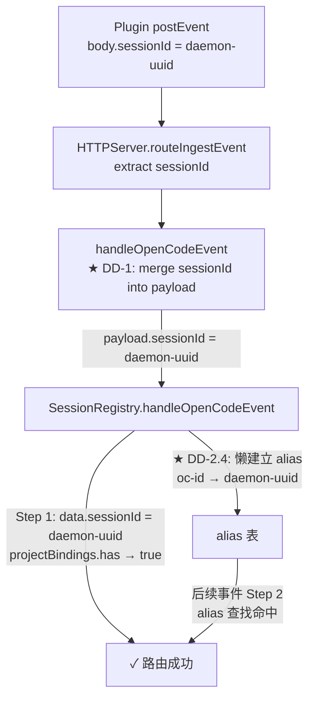
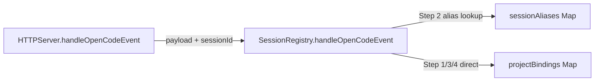

# WI-003 Design — Phase 0 热修：OpenCode 事件路由断链

## 需求追溯

本 bugfix 工作流的需求来源为 `bugfix.md`，以下为需求编号映射：

| 需求编号 | 来源 | 描述 |
|----------|------|------|
| REQ-001 | BUGFIX-1.2, BUGFIX-4.1 | HTTPServer.handleOpenCodeEvent 丢弃顶层 sessionId，导致事件路由断链 |
| REQ-002 | BUGFIX-1.3 | SessionRegistry 4 步映射必然 miss（Step 1-4 全部无法命中） |
| REQ-003 | BUGFIX-2.1, BUGFIX-2.3 | 修复后 Step 1 应直接命中，WARN 日志消失，4 条验收标准需满足 |
| REQ-004 | BUGFIX-3.1-3.7 | 不变行为：plugin wire format / events.jsonl / state.json / 其他路由 / 会聚点语义 / Daemon.ts / RecoverySubsystem 均不变 |
| REQ-005 | BUGFIX-5.1 | HTTPServer L1130-L1148 改动：sessionId 合并进 payload |
| REQ-006 | BUGFIX-5.2 | SessionRegistry L513-L567 改动：alias 别名表 + 映射增强 |
| REQ-007 | BUGFIX-6 | 回滚条件：alias 错误绑定时 revert PR |

## 概述

将 HTTPServer.handleOpenCodeEvent 丢弃的顶层 sessionId 合并进 payload，并在 SessionRegistry 中新增 in-memory alias 别名表（OpenCode sessionID → daemon sessionId），使 opencode.event 事件能正确路由到已注册的 session binding。

---

## 变更清单

### DD-1 HTTPServer.handleOpenCodeEvent — sessionId 合并进 payload

refs: [REQ-001, REQ-005, BUGFIX-1.2 Hop 6, BUGFIX-4.1, BUGFIX-5.1]
constrained_by: plugin wire format 不变（REQ-004, BUGFIX-3.1），plugin 端零改动

**文件**: `packages/daemon-core/src/http/HTTPServer.ts`
**位置**: L1137–L1140

#### 修改前

```ts
this.deps.sessionRegistry?.handleOpenCodeEvent?.(
  payload.subType ?? 'unknown',
  payload,
);
```

#### 修改后

```ts
this.deps.sessionRegistry?.handleOpenCodeEvent?.(
  payload.subType ?? 'unknown',
  { ...payload, sessionId: payload.sessionId ?? sessionId },
);
```

#### 修改原因

`handleOpenCodeEvent` 的第 1 个参数 `sessionId`（daemon 颁发的 UUIDv7）在整个函数体内只用于 catch 块日志（L1146），不进入 SessionRegistry 调用参数。SessionRegistry.handleOpenCodeEvent 的 Step 1（L520）从 `data.sessionId` 查找 projectBindings key，但 plugin 不将顶层 sessionId 复制进 data（隐式契约 C9），导致 Step 1 永远 miss。

通过 `{ ...payload, sessionId: payload.sessionId ?? sessionId }` 将顶层 sessionId 以 fallback 方式注入 payload：
- 若 payload 已有 `sessionId`（理论上不应出现，因为 plugin 不复制），保留原值不覆盖
- 否则使用 HTTP 顶层 `sessionId`（daemon 颁发的权威 ID）

**扩散行数**: ~1 行改动（参数构造表达式变更）

---

### DD-2 SessionRegistry — alias 别名表 + 映射增强

refs: [REQ-002, REQ-006, BUGFIX-1.3 Step 2, BUGFIX-5.2, INTAKE-改动2]
constrained_by: Phase 0 不引入持久化（REQ-004, BUGFIX-3.3），alias in-memory only

#### DD-2.1 新增字段

**文件**: `packages/daemon-core/src/session/SessionRegistry.ts`
**位置**: L54（`projectBindings` 声明之后）

##### 修改前

```ts
private projectBindings: Map<string, string> = new Map();
private subscription: Subscription | null = null;
```

##### 修改后

```ts
private projectBindings: Map<string, string> = new Map();
/**
 * Alias table: OpenCode native sessionID → daemon sessionId.
 * Built at registerPluginSession time when OpenCode payload carries sessionID.
 * In-memory only (Phase 0); daemon restart loses this mapping.
 */
private sessionAliases: Map<string, string> = new Map();
private subscription: Subscription | null = null;
```

#### DD-2.2 alias 建立时机：registerPluginSession

**文件**: `packages/daemon-core/src/session/SessionRegistry.ts`
**位置**: L179（`projectBindings.set` 之后）

##### 修改前

```ts
this.projectBindings.set(identity.sessionId, projectPath);
return identity;
```

##### 修改后

```ts
this.projectBindings.set(identity.sessionId, projectPath);
// Build alias: callers may pass an OpenCode-native sessionID in context;
// currently no callers provide it, but the hook is in place for when
// handleIngestRegister evolves to pass plugin context data.
return identity;
```

**说明**：Phase 0 中 `registerPluginSession(projectId, projectPath)` 的签名不含 OpenCode sessionID。alias 的实际建立改为在 `handleOpenCodeEvent` 内按需懒建立（见 DD-2.3），避免修改 registerPluginSession 签名。此处仅添加字段声明。

#### DD-2.3 alias 按需懒建立 + Step 2 增强

**文件**: `packages/daemon-core/src/session/SessionRegistry.ts`
**位置**: L526–L529（Step 2 映射块）

##### 修改前

```ts
// 2. If not found, try OpenCode sessionID in projectBindings
const opencodeSessionId = data.sessionID as string | undefined;
if (!internalSessionId && opencodeSessionId && this.projectBindings.has(opencodeSessionId)) {
  internalSessionId = opencodeSessionId;
}
```

##### 修改后

```ts
// 2. If not found, try OpenCode sessionID via alias table
const opencodeSessionId = data.sessionID as string | undefined;
if (!internalSessionId && opencodeSessionId) {
  const aliased = this.sessionAliases.get(opencodeSessionId);
  if (aliased && this.projectBindings.has(aliased)) {
    internalSessionId = aliased;
  }
}
```

#### DD-2.4 alias 懒建立辅助方法

**文件**: `packages/daemon-core/src/session/SessionRegistry.ts`
**位置**: L549（Step 4 的 `session.created` 兜底注册处）之后追加

##### 新增代码

```ts
// Lazy-alias: if we resolved via Step 1 (daemon sessionId) and data
// also carries an OpenCode sessionID, establish the alias for future lookups.
if (internalSessionId && opencodeSessionId && !this.sessionAliases.has(opencodeSessionId)) {
  this.sessionAliases.set(opencodeSessionId, internalSessionId);
}
```

**放置位置**：在 L551 `if (!internalSessionId)` 块之后、`switch (subType)` 之前（即 `internalSessionId` 已确认解析成功后、进入 subType 分发前）。

**完整上下文（修改后）**：

```ts
handleOpenCodeEvent(subType: string, data: Record<string, unknown>): void {
  const projectPath = data.projectPath as string | undefined;
  let internalSessionId: string | null = null;

  // 1. Check if daemon sessionId is directly provided (from plugin)
  const daemonSessionId = data.sessionId as string | undefined;
  if (daemonSessionId && this.projectBindings.has(daemonSessionId)) {
    internalSessionId = daemonSessionId;
  }

  // 2. If not found, try OpenCode sessionID via alias table
  const opencodeSessionId = data.sessionID as string | undefined;
  if (!internalSessionId && opencodeSessionId) {
    const aliased = this.sessionAliases.get(opencodeSessionId);
    if (aliased && this.projectBindings.has(aliased)) {
      internalSessionId = aliased;
    }
  }

  // 3. If still not found, try to find by projectPath
  if (!internalSessionId && projectPath) {
    for (const [sid, pp] of this.projectBindings) {
      if (pp === projectPath) {
        internalSessionId = sid;
        break;
      }
    }
  }

  // 4. Handle cases where no mapping exists
  if (!internalSessionId) {
    if (subType === 'session.created' && projectPath) {
      const identity = this.registerPluginSession(projectPath, projectPath);
      internalSessionId = identity.sessionId;
    } else {
      console.warn(`[SessionRegistry] No session binding found for OpenCode event subtype: ${subType}, projectPath: ${projectPath}`);
      return;
    }
  }

  // Lazy-alias: establish OpenCode sessionID → daemon sessionId mapping
  if (internalSessionId && opencodeSessionId && !this.sessionAliases.has(opencodeSessionId)) {
    this.sessionAliases.set(opencodeSessionId, internalSessionId);
  }

  switch (subType) {
    // ... (unchanged)
  }
}
```

#### 修改原因

- **DD-2.1**：alias 表是辅助查找结构，不改变 `projectBindings` 的主键语义（daemon sessionId 仍为唯一主键）
- **DD-2.3**：Step 2 原来直接用 `projectBindings.has(opencodeSessionId)` 查找——OpenCode sessionID 不是 projectBindings 的 key，必然 miss。改为通过 alias 表间接查找
- **DD-2.4**：在 Step 1 首次成功命中后，将 data 中的 OpenCode sessionID 与已解析的 daemon sessionId 建立映射。后续同一 OpenCode session 的事件可走 alias 快速路径

**扩散行数**: ~12 行新增/修改

---

## 数据流变更

### 修复前数据流（全部 miss）



### 修复后数据流（Step 1 命中）



### 修复后数据流（alias 快速路径 — 后续事件）



---

## alias 表设计

### DD-3 alias 表数据结构与生命周期

refs: [REQ-006, BUGFIX-5.2, INTAKE-改动2]
constrained_by: Phase 0 in-memory only（REQ-004, BUGFIX-3.3），daemon 重启丢失

| 属性 | 值 |
|------|-----|
| **数据结构** | `Map<string, string>` — `Map<opencodeSessionID, daemonSessionId>` |
| **声明位置** | `SessionRegistry.ts` L54+，类私有字段 `private sessionAliases` |
| **建立时机** | 懒建立：`handleOpenCodeEvent` 成功解析 `internalSessionId` 后，若 `data.sessionID` 存在且 alias 尚未建立 |
| **查询时机** | Step 2：`data.sessionID` → `sessionAliases.get(opencodeSessionId)` → `projectBindings.has(aliased)` |
| **生命周期** | in-memory only，daemon 重启时丢失；Phase 0 不解决持久化 |
| **幂等性** | `!this.sessionAliases.has(opencodeSessionId)` 确保同一 alias 不重复建立 |
| **冲突策略** | 先到先得——同一 OpenCode sessionID 首次建立 alias 后不再更新 |

### interface 定义

```typescript
// SessionRegistry 内部，不暴露为公共 API
private sessionAliases: Map<string, string>;
// key: OpenCode native sessionID (data.sessionID)
// value: daemon sessionId (权威主键)
// Errors: 无——alias 查找失败仅导致继续走后续 Step，不抛异常
```

---

## 兼容性分析

### DD-4 兼容性影响评估

refs: [REQ-004, BUGFIX-3.1, BUGFIX-3.2, BUGFIX-3.3, BUGFIX-3.4]

| 维度 | 影响 | 说明 |
|------|------|------|
| **Plugin wire format** | 无变化 | Plugin POST body 仍是 `{ sessionId, type, data, ts }`，sessionId 仅在顶层 |
| **events.jsonl** | 无变化 | 不引入新 WAL event category，不改变现有事件的读写行为 |
| **state.json** | 无变化 | ProjectState 结构（workItems / lastEventId / lastEventTs）不变，不新增 sessions.json |
| **其他事件类型 handler** | 无影响 | `tool.invoking` / `tool.invoked` / `session.compacting` / `chat.params` / `chat.headers` / `shell.env` 有独立 handler（HTTPServer L1019–L1038），不经过 `handleOpenCodeEvent` |
| **Daemon.ts** | 无影响 | Daemon.ts 全文不动 |
| **RecoverySubsystem** | 无影响 | Property 20/21 保持不变 |
| **SessionRegistry.getSnapshot/restoreFromSnapshot** | 无影响 | Phase 0 不将 sessionAliases 纳入 snapshot（in-memory only），现有序列化格式不变 |

---

## 不变行为清单

### DD-5 修复前后不变行为

refs: [REQ-004, BUGFIX-§3]

| 编号 | 不变行为 | 验证方式 |
|------|---------|---------|
| INV-1 | Plugin wire format 不变——`register()` 和 `postEventToDaemon()` 的请求/响应格式完全一致 | Plugin 端代码零改动 |
| INV-2 | events.jsonl schema 不变——不引入新 WAL event category | 现有事件读写行为不受影响 |
| INV-3 | state.json schema 不变——不新增 `sessions.json` 或其他持久化文件 | 磁盘文件数量和格式无变化 |
| INV-4 | 其他 session 类型路由不受影响——`tool.invoking` 等走独立 handler | HTTPServer L1019–L1038 switch 分支不变 |
| INV-5 | 多客户端会聚点语义保留——`projectBindings: Map<sessionId, projectPath>` 主键不变 | alias 是辅助查找结构，不改变主键语义 |
| INV-6 | Daemon.ts 不动 | 全文无 diff |
| INV-7 | RecoverySubsystem 不动 | Property 20（一致性修复）和 Property 21（重连仅限启动期）不变 |
| INV-8 | `projectBindings` 的 key 仍为 daemon 颁发的 sessionId | alias 表是独立字段，不修改 `projectBindings.set` 的 key 来源 |

---

## 回滚方案

### DD-6 回滚策略

refs: [REQ-007, BUGFIX-§6, INTAKE-回滚条件]

- **触发条件**：新 alias 命中逻辑导致 SessionRegistry 出现错误绑定（如同一 OpenCode sessionID 关联多个 daemon sessionId）
- **回滚操作**：直接 revert PR
- **回滚安全性**：
  - events.jsonl 不受影响（Phase 0 不写新 category）
  - state.json 不受影响（无 schema 变更）
  - plugin 端不需要任何配合操作
- **回滚影响面**：revert 后恢复到修复前状态，`No session binding found` 日志重新出现，但不会引入新 bug

---

## e2e 测试设计

### DD-7 端到端测试

refs: [REQ-003, INTAKE-期望产出-2]
constrained_by: 测试仅覆盖"修复后路由命中"的核心路径

**测试名称**: `plugin register → postEvent opencode.event → 路由命中`

**测试步骤**：

```
1. 准备
   - 创建 SessionRegistry 实例（mock EventBus）
   - 创建 HTTPServer 实例（注入 mock deps）

2. 模拟 register
   - 调用 sessionRegistry.registerPluginSession("project-1", "/path/to/project")
   - 验证返回 identity.sessionId 存在
   - 验证 projectBindings.has(identity.sessionId) === true

3. 模拟 postEvent opencode.event（修复前会 miss 的路径）
   - 构造 data = { subType: "session.idle", sessionID: "oc-test-session-id" }
   - 通过 HTTPServer.handleOpenCodeEvent(identity.sessionId, data, Date.now()) 调用
   - 验证 SessionRegistry.handleOpenCodeEvent 被调用时 payload 包含 sessionId

4. 验证路由命中
   - 验证 "No session binding found" 日志未出现
   - 验证 session.touch 被调用（subType="session.idle" → touch 分支）

5. 验证 alias 建立
   - 后续事件仅携带 sessionID（不携带 sessionId）
   - 验证通过 alias 表仍能路由命中
```

**test_type**: integration
**test_file**: `packages/daemon-core/src/__tests__/integration/opencode-event-routing.test.ts`
**requirement_ref**: BUGFIX-2.3

---

## 架构图（修复前后对比）

### 修复前



### 修复后



---

## Out of Scope

- 不解决 daemon 重启后 session binding 恢复（Phase 1/2 范围，引用 WI-002 `05-recommendation.md` §5.5 Phase 1/2）
- 不修改 Daemon.ts（Phase 1 范围）
- 不修改 RecoverySubsystem（Phase 1 范围）
- 不修改 plugin 端代码（wire format 不变）
- 不引入 WAL event category（Phase 2 范围）
- 不新增持久化文件（sessions.json 等）
- 不修改 `registerPluginSession` 的函数签名
- 不修改 SessionSnapshot 序列化格式

---

## Assumptions（设计假设）

- 假设 plugin 调用 `register()` 后才发送 `postEvent`，即 sessionId 已在 projectBindings 中（来自 WI-002 调查，Hop 2 确认 register 成功后 projectBindings.set 已执行）
- 假设 OpenCode 原生 event 的 `data.sessionID`（大写 D）是 OpenCode 进程级唯一标识（来自 WI-002 `03-comparison-matrix.md` D5-A）
- 假设 daemon 运行期间不重启（Phase 0 in-memory alias 不抗重启，由 Phase 2 解决）
- 假设同一 OpenCode sessionID 不会同时关联多个 daemon sessionId（先到先得的 alias 策略基于此假设）
- 假设 `payload.sessionId` 字段在 OpenCode 原生 event 中不存在或极少出现（fallback `?? sessionId` 不覆盖已有值）

---

## Correctness Properties

### CP-1 sessionId 合并幂等性

**test_type**: unit
**test_file**: `packages/daemon-core/src/__tests__/unit/http-server-handleOpenCodeEvent.test.ts`
**requirement_ref**: BUGFIX-2.3

对任意 payload 和 sessionId，`{ ...payload, sessionId: payload.sessionId ?? sessionId }` 满足：
- 若 `payload.sessionId` 已存在，合并后 `result.sessionId === payload.sessionId`（不覆盖）
- 若 `payload.sessionId` 不存在，合并后 `result.sessionId === sessionId`（注入 daemon ID）

### CP-2 alias 表幂等性

**test_type**: unit
**test_file**: `packages/daemon-core/src/__tests__/unit/session-registry-alias.test.ts`
**requirement_ref**: BUGFIX-5.2

对同一 `(opencodeSessionId, daemonSessionId)` 对，无论 `handleOpenCodeEvent` 被调用多少次，`sessionAliases.get(opencodeSessionId)` 始终返回首次建立的 `daemonSessionId`，不随后续调用改变。

### CP-3 路由完整性

**test_type**: integration
**test_file**: `packages/daemon-core/src/__tests__/integration/opencode-event-routing.test.ts`
**requirement_ref**: BUGFIX-2.3

对任意合法的 `registerPluginSession → postEvent opencode.event` 序列，修复后 SessionRegistry 的 `handleOpenCodeEvent` 必然能解析 `internalSessionId !== null`（不再落入 L548 WARN 分支）。

---

## 架构属性自检

### A1 单一职责

| 组件 | "我是 X" 陈述 |
|------|--------------|
| HTTPServer.handleOpenCodeEvent | 我是 HTTP 层到 SessionRegistry 的协议适配器，负责将 HTTP 顶层 sessionId 注入 payload |
| SessionRegistry.handleOpenCodeEvent | 我是事件路由决策器，负责从 payload 中解析出 daemon sessionId 并分发到对应操作 |
| sessionAliases Map | 我是 OpenCode sessionID 到 daemon sessionId 的辅助查找表 |

### A2 显式依赖



### A3 可替换性

- `sessionAliases` 是 `Map<string, string>` 接口，可被任何实现 `Map` 接口的对象替换
- `handleOpenCodeEvent` 通过 `this.deps.sessionRegistry?.handleOpenCodeEvent?.()` 可选链调用，SessionRegistry 可被 mock

### A4 失败可观测

| 组件 | Errors 段 |
|------|----------|
| HTTPServer.handleOpenCodeEvent | catch 块输出 `[INGEST] SessionRegistry.handleOpenCodeEvent error for session ${sessionId}` + 超时 2s |
| SessionRegistry.handleOpenCodeEvent | 4 步全 miss 时输出 `[SessionRegistry] No session binding found for OpenCode event subtype: ${subType}` WARN |
| sessionAliases Map | get() 返回 undefined（查找失败），无异常 |

### A5 边界明确

见上方 [Out of Scope](#out-of-scope) 和 [Assumptions](#assumptions设计假设) 段。
