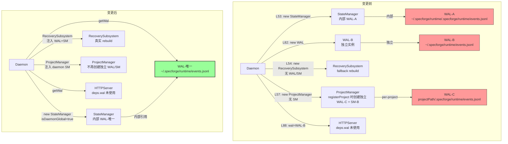

# WI-005 Design Delta — WAL/StateManager 单例化

> **文档类型**: Design Delta (Change Request WI-005)  
> **基于素材**: WI-002 research (01-contracts, 03-comparison-matrix, 05-recommendation §5.5), WI-005 impact_analysis.md  
> **变更范围**: `packages/daemon-core/src/` 内 6 个文件  
> **设计决策数**: 4 个改项 + 2 个关键设计决策  

---

## 增量设计描述

### 改项 1：消除 Daemon.ts L82 单独的 `this.wal`

**现状分析**：

Daemon.ts 存在两个独立的 WAL 实例：
- **L53**：`this.stateManager = new StateManager(pathResolver, runtimeDir)` — StateManager 构造函数（StateManager.ts L50）内部 `new WAL(pathResolver.resolveEventsPath(projectPath))` 创建第一个 WAL
- **L82**：`this.wal = new WAL(path.join(runtimeDir, 'events.jsonl'))` 创建第二个 WAL

两个 WAL 指向**同一个文件路径**（因为 path-resolver 对 runtimeDir 的解析最终也是 `<runtimeDir>/events.jsonl`），但 `_lastSeq` 各自维护（WAL.ts L17），导致 monotonicSeq 竞态。

**关键发现**：HTTPServer 实际上**不使用**传入的 `wal` 参数。通过代码审查 HTTPServer.ts，`deps.wal` 仅在 `HTTPServerDeps` 接口中声明（L34），在所有 handler 方法中无任何引用——所有事件路由走 `eventLogger.append()`、`sessionRegistry.handleOpenCodeEvent()` 等路径，不走 `wal.appendEvent()`。

**设计变更**：

```
文件: packages/daemon-core/src/daemon/Daemon.ts
变更:
  - 删除 L44: private wal: WAL;  // 字段声明
  - 删除 L82: this.wal = new WAL(path.join(runtimeDir, 'events.jsonl'));  // 构造
  - L88: wal: this.wal  →  wal: this.stateManager.getWal()  // HTTPServer deps
```

```
文件: packages/daemon-core/src/state/StateManager.ts
变更:
  + 新增 getWal(): WAL { return this.wal; }  // 暴露内部 WAL 实例
```

```
文件: packages/daemon-core/src/http/HTTPServer.ts
变更:
  无代码逻辑变更（HTTPServer 不使用 wal），仅 deps 传入来源变化
```

**接口变化**：
- `HTTPServerDeps.wal` 类型不变（仍是 `WAL`），但实例来源从 Daemon 独立创建变为通过 `StateManager.getWal()` 获取
- `StateManager` 新增 `getWal(): WAL` 公共方法

**影响面**：Daemon.ts 内部字段清理 + HTTPServer deps 传入来源变化。HTTPServer 内部对 `wal` 的使用方式不变（实际未使用），只是实例来源变了。

**Errors**：
- `StateManager.getWal()` 不会抛错——WAL 在 StateManager 构造时已创建，不可能为 null

---

### 改项 2：修复 path-resolver.ts 嵌套 statePath

**现状分析**：

Daemon.ts L53：
```typescript
this.stateManager = new StateManager(pathResolver, runtimeDir);
```

其中 `runtimeDir` 来自 `this.config.getRuntimeDir()`，典型值为 `~/.specforge/runtime`。

StateManager 构造函数（L50-L51）：
```typescript
this.wal = new WAL(pathResolver.resolveEventsPath(projectPath));  // L50
this.statePath = pathResolver.resolveStatePath(projectPath);      // L51
```

PersonalPathResolver.resolveEventsPath（L135-L136）：
```typescript
resolveEventsPath(projectPath: string): string {
  return path.join(this.resolveProjectRuntimeDir(projectPath), 'events.jsonl');
}
```

PersonalPathResolver.resolveProjectRuntimeDir（L126-L128）：
```typescript
resolveProjectRuntimeDir(projectPath: string): string {
  validateProjectPath(projectPath);
  return path.join(projectPath, '.specforge', 'runtime');
}
```

当 `projectPath = '~/.specforge/runtime'` 时，产生嵌套路径：
- eventsPath: `~/.specforge/runtime/.specforge/runtime/events.jsonl`
- statePath: `~/.specforge/runtime/.specforge/runtime/state.json`

而 HTTPServer 使用的 Daemon 独立 WAL（L82）路径为 `path.join(runtimeDir, 'events.jsonl')` = `~/.specforge/runtime/events.jsonl`——两个 WAL 实例指向**不同文件**，进一步加剧竞态。

**设计决策：statePath 方案选择**

分析三个选项：

| 选项 | 优点 | 缺点 |
|------|------|------|
| **(1) 哨兵值 `__daemon_global__`** | 改动最小，PathResolver 可识别特殊值 | 语义不直观，`validateProjectPath()` 需要特殊放行，`projectPath` 字段的含义被污染 |
| **(2) 新增 `resolveDaemonStatePath()` 方法** | 职责清晰，daemon 全局路径有独立方法 | IPathResolver 接口变更，影响所有实现类 |
| **(3) StateManager 构造加 `mode` 参数** | 可扩展 | 过度设计（YAGNI），当前只有 1 种非项目场景 |

**选择方案 (2)**：在 IPathResolver 新增 daemon 专用路径方法。理由：
1. 当前 IPathResolver 接口已有 `resolveDaemonRuntimeDir()` 方法（L60），说明 daemon 全局路径是接口的合法关注点
2. 新增 `resolveDaemonStatePath()` 和 `resolveDaemonEventsPath()` 与现有 `resolveStatePath(projectPath)` / `resolveEventsPath(projectPath)` 形成对称——前者用于 daemon 全局（无 projectPath），后者用于项目级
3. 方案 (1) 的哨兵值会污染 `projectPath` 语义——StateManager 和所有 PathResolver 的调用方需要记住"某个特殊值有特殊含义"
4. 方案 (3) 违反 YAGNI——mode 参数只有 daemon-global 这一个非项目场景，不满足"≥2 调用点才引入抽象"

**设计变更**：

```
文件: packages/daemon-core/src/daemon/path-resolver.ts
变更:
  + IPathResolver 新增:
    resolveDaemonStatePath(): string;      // daemon 全局 state.json 路径
    resolveDaemonEventsPath(): string;     // daemon 全局 events.jsonl 路径
  + PersonalPathResolver 实现:
    resolveDaemonStatePath(): string {
      return path.join(this.resolveDaemonRuntimeDir(), 'state.json');
    }
    resolveDaemonEventsPath(): string {
      return path.join(this.resolveDaemonRuntimeDir(), 'events.jsonl');
    }
  + EnterprisePathResolver 实现: 同上（daemon 全局路径两个模式一致）
```

```
文件: packages/daemon-core/src/daemon/Daemon.ts
变更:
  L53 改为: 
  this.stateManager = new StateManager(pathResolver, pathResolver.resolveDaemonRuntimeDir(), true);
    // 第三个参数 isDaemonGlobal = true，指示使用 daemon 专用路径
```

```
文件: packages/daemon-core/src/state/StateManager.ts
变更:
  constructor(pathResolver: IPathResolver, projectPath: string, isDaemonGlobal: boolean = false) {
    if (isDaemonGlobal) {
      this.wal = new WAL(pathResolver.resolveDaemonEventsPath());
      this.statePath = pathResolver.resolveDaemonStatePath();
    } else {
      this.wal = new WAL(pathResolver.resolveEventsPath(projectPath));
      this.statePath = pathResolver.resolveStatePath(projectPath);
    }
    this.projectPath = projectPath;
  }
```

**修正后的路径对比**：

| 文件 | 旧路径（嵌套） | 新路径 |
|------|----------------|--------|
| events.jsonl | `~/.specforge/runtime/.specforge/runtime/events.jsonl` | `~/.specforge/runtime/events.jsonl` |
| state.json | `~/.specforge/runtime/.specforge/runtime/state.json` | `~/.specforge/runtime/state.json` |

**旧位置数据处理**：

在 Daemon.start() 中，stateManager.initialize() 之前增加旧位置检测：

```
文件: packages/daemon-core/src/daemon/Daemon.ts
变更:
  + import * as fs from 'fs/promises';
  + 在 start() 中 stateManager.initialize() 前调用:
    await this.detectAndHandleLegacyState(pathResolver);
  
  + private async detectAndHandleLegacyState(pathResolver: IPathResolver): Promise<void> {
      // 检测旧嵌套路径 state.json
      const legacyStatePath = path.join(runtimeDir, '.specforge', 'runtime', 'state.json');
      const legacyEventsPath = path.join(runtimeDir, '.specforge', 'runtime', 'events.jsonl');
      
      try {
        await fs.access(legacyStatePath);
        console.warn(`[DAEMON] Legacy nested state.json found at ${legacyStatePath}. Marking as orphan.`);
        console.warn(`[DAEMON] Data will be rebuilt from canonical events.jsonl. Legacy file preserved for manual inspection.`);
        // 不删除，不迁移——events.jsonl 是权威源，rebuildState() 会从 events 恢复
        // 旧嵌套位置的 events.jsonl 如果有内容，记录但不处理（权威源在新位置）
      } catch {
        // 旧位置不存在，正常情况
      }
    }
```

**设计说明**：不自动迁移旧嵌套 state.json 数据，因为：
1. state.json 只是 checkpoint，events.jsonl 才是权威源
2. 修正后 daemon 的 events.jsonl 在正确路径 `~/.specforge/runtime/events.jsonl`——如果之前 Daemon.ts L82 的独立 WAL 一直在写这个路径，那 events.jsonl 的内容应该是完整的
3. 如果旧嵌套路径有 events.jsonl 但新路径没有（极端情况），说明 daemon 从未成功写入过事件——首次启动会创建空状态，这是安全的

**Errors**：
- `resolveDaemonStatePath()` / `resolveDaemonEventsPath()` 不抛错（纯路径拼接）
- 旧位置检测中的 `fs.access()` 异常被 catch，不影响启动

---

### 改项 3：RecoverySubsystem 注入 WAL + StateManager

**现状分析**：

Daemon.ts L54：
```typescript
this.recoverySubsystem = new RecoverySubsystem(pathResolver, runtimeDir);
```

RecoverySubsystem 构造函数（L52）已支持可选注入：
```typescript
constructor(pathResolver: IPathResolver, projectPath: string, wal?: WAL, stateManager?: StateManager)
```

但由于 Daemon 未传入 `wal` 和 `stateManager`，RecoverySubsystem 的 `this.wal` 和 `this.stateManager` 均为 null。

后果（checkAndRepair L82-L93）：
```typescript
if (this.stateManager) {
  rebuiltState = await this.stateManager.rebuildState();  // 真实 rebuild——带 workItems
} else {
  rebuiltState = await this.rebuildFromEvents(events);    // fallback——workItems: []
}
```

Fallback `rebuildFromEvents`（L305-L322）只取 lastEventId/lastEventTs，永远返回 `workItems: []`。这是 WI-001 "内存幽灵"（sf_state_read 有 vs state.json 无）的精准根因。

**设计变更**：

```
文件: packages/daemon-core/src/daemon/Daemon.ts
变更:
  L54 改为:
  this.recoverySubsystem = new RecoverySubsystem(
    pathResolver, 
    runtimeDir, 
    this.stateManager.getWal(),        // 注入 WAL
    this.stateManager                   // 注入 StateManager
  );
  
  注意：这里必须在 this.stateManager 构造之后才能执行（当前 L53/L54 顺序已满足）
```

**但是有一个构造顺序问题**：

当前代码 L53-L54 的顺序是：
```typescript
L53: this.stateManager = new StateManager(pathResolver, runtimeDir);
L54: this.recoverySubsystem = new RecoverySubsystem(pathResolver, runtimeDir);
```

改项 2 修改了 StateManager 构造函数签名，且改项 1 添加了 `getWal()` 方法。改项 3 只需在 L54 传入两个额外参数即可。**顺序天然正确**——StateManager 在前，RecoverySubsystem 在后。

**风险缓解——注入失败回退策略**：

针对 R1 高风险项（真实 rebuild 路径在特定 events.jsonl 状态下可能抛错），设计如下回退：

```
文件: packages/daemon-core/src/daemon/Daemon.ts
变更（替代直接注入）:

  // 改项 3：RecoverySubsystem 注入 WAL + StateManager
  // 带回退策略：若注入后 checkAndRepair 在真实 rebuild 路径失败，
  // 回退到不注入的 fallback 路径（workItems: []，但不崩溃）
  let recoveryWal: WAL | undefined;
  let recoveryStateManager: StateManager | undefined;
  
  try {
    recoveryWal = this.stateManager.getWal();
    recoveryStateManager = this.stateManager;
  } catch (err) {
    console.warn('[DAEMON] Cannot inject StateManager into RecoverySubsystem — falling back to legacy rebuild path', err);
  }
  
  this.recoverySubsystem = new RecoverySubsystem(
    pathResolver, runtimeDir, recoveryWal, recoveryStateManager
  );
```

在 `Daemon.start()` 中，`checkAndRepair()` 调用也应包裹 try/catch：

```
  // 改项 3 回退保护
  try {
    await this.recoverySubsystem.checkAndRepair();
  } catch (err) {
    console.error('[DAEMON] RecoverySubsystem.checkAndRepair failed — state may be incomplete', err);
    // 不抛出——daemon 继续启动，但 workItems 可能为空
    // 运维人员需检查 events.jsonl 完整性
  }
```

**RecoverySubsystem 无代码变更**：接口已支持，只改 Daemon 构造参数。

**Errors**：
- `StateManager.getWal()` 不会失败（WAL 在构造时已创建）
- `RecoverySubsystem.checkAndRepair()` 注入后走 `stateManager.rebuildState()` 路径，可能因 events.jsonl 格式异常抛错——由外层 try/catch 捕获

---

### 改项 4：ProjectManager 不再为每个项目创建独立 StateManager

**现状分析**：

ProjectManager.registerProject（L49-L89）每次调用时：
```typescript
L60: const wal = new WAL(this.pathResolver.resolveEventsPath(projectPath));
L61: await wal.initialize();
L63: const stateManager = new StateManager(this.pathResolver, projectPath);
L64: await stateManager.initialize();
L84: ctx.wal = wal;
L85: ctx.stateManager = stateManager;
```

这意味着每个注册的项目都有自己的 WAL + StateManager，与 daemon 全局 StateManager 形成 N+1 多写者。

**关键问题**：当前 daemon 是 personal 模式，`registerProject` 被 HTTPServer.handleIngestRegister 调用（当 plugin register 时）。注册的 projectPath 是用户的项目目录（如 `/home/user/my-project`），与 daemon 全局的 runtimeDir 完全不同。因此 per-project WAL 的 events.jsonl 路径是 `<projectPath>/.specforge/runtime/events.jsonl`，与 daemon 全局的 `~/.specforge/runtime/events.jsonl` 不冲突。

**但问题是**：ProjectManager 的 `ctx.stateManager` 写入 state.transition 事件到 per-project events.jsonl，而 daemon 全局 StateManager 也在写入。如果一个 Work Item 的状态变更被路由到了错误的 StateManager，状态就会分裂。实际上，WI-001 发现的"内存幽灵"问题就是这种分裂的表现之一。

**设计决策：ProjectManager 与 daemon 全局 StateManager 的关系**

分析三个选项：

| 选项 | 优点 | 缺点 |
|------|------|------|
| **(A) 构造注入 daemon 全局 StateManager** | 简单直接，ProjectManager 不再持有独立实例 | ProjectManager 的 registerProject 不再创建 ctx.wal/stateManager，下游消费者需全部改为从 daemon 获取 |
| **(B) 工厂/回调获取 StateManager** | 延迟绑定，更灵活 | 增加间接层，YAGNI——当前只有 1 个 StateManager 源 |
| **(C) ProjectContext 不再暴露 wal/stateManager** | 最彻底的清理，消除所有下游引用 | 需要排查所有 `ctx.wal` / `ctx.stateManager` 的消费方 |

**选择方案 (A)**：构造注入 daemon 全局 StateManager。理由：
1. 方案 (B) 违反 YAGNI——"通过工厂获取"只有一个实现源，不满足"≥2 调用点才引入抽象"
2. 方案 (A) 的"下游消费者需改变"正是本次变更的目标——消除所有非 daemon 全局的 StateManager 引用
3. 当前 ProjectContext 的 `wal` 和 `stateManager` 消费方极少（主要在 ProjectManager 内部），改造可控

**设计变更**：

```
文件: packages/daemon-core/src/project/ProjectManager.ts
变更:
  - 构造函数签名:
    constructor(eventBus: EventBus, pathResolver: IPathResolver, daemonStateManager: StateManager)
    
  - registerProject() 不再创建独立 WAL/StateManager:
    删除 L60-L64 (new WAL / new StateManager / initialize)
    
  - ProjectContext:
    保留 wal? 和 stateManager? 字段（向后兼容），但 registerProject 创建的 ctx 不再填充这两个字段
    ctx.wal = undefined
    ctx.stateManager = undefined
    
  - 新增 daemonStateManager 私有字段:
    private daemonStateManager: StateManager;
    
  - 新增 getDaemonStateManager() 方法:
    getDaemonStateManager(): StateManager {
      return this.daemonStateManager;
    }
```

```
文件: packages/daemon-core/src/daemon/Daemon.ts
变更:
  L57 改为:
  this.projectManager = new ProjectManager(this.eventBus, pathResolver, this.stateManager);
```

**下游消费方排查**：

通过代码搜索，`ProjectContext.wal` 和 `ProjectContext.stateManager` 的消费方：
1. `ProjectManager.getProject`（L41-L47）：检查 `existing?.wal` 作为"已完整注册"的标志
2. `ProjectManager.registerProject`（L51）：检查 `existing?.wal` 作为幂等判断
3. 无外部消费者直接读取 `ctx.wal` / `ctx.stateManager`——HTTPServer 通过 `deps.stateManager` 直接引用 daemon 全局 StateManager

**幂等标志替代方案**：

`existing?.wal` 作为幂等标志需要替换。改用一个显式 `isFullyRegistered` 布尔字段：

```typescript
export interface ProjectContext {
  projectId: string;
  projectPath: string;
  dataDir: string;
  schemaVersion: string;
  activeSessions: string[];
  workItems: { id: string; title: string }[];
  lastEventId: string;
  lastEventTs: number;
  wal?: WAL;              // 保留字段但不再填充，标记为 deprecated
  stateManager?: StateManager;  // 同上
  isFullyRegistered?: boolean;  // 新增：替代 wal 作为幂等标志
}
```

```
registerProject 中的幂等检查:
  if (existing?.isFullyRegistered) {
    return existing;
  }

getProject 中的检查:
  if (existing?.isFullyRegistered) {
    return existing;
  }
```

**Errors**：
- `ProjectManager` 构造函数变更不抛错
- `daemonStateManager` 由 Daemon 注入，不可能为 null（Daemon 保证在构造 ProjectManager 之前先构造 StateManager）

---

## 受影响模块

### 模块变更汇总

| 模块 | 接口变化 | 对消费者的影响 |
|------|----------|---------------|
| **Daemon.ts** | 删除 `private wal` 字段；L53/L54/L57 构造参数变更 | 无外部消费者（Daemon 是顶层组装类） |
| **StateManager.ts** | 新增 `getWal(): WAL`；构造函数新增 `isDaemonGlobal` 参数（默认 false） | `getWal()` 纯新增，不影响现有调用；构造函数默认参数保持向后兼容 |
| **path-resolver.ts** | IPathResolver 新增 `resolveDaemonStatePath()` 和 `resolveDaemonEventsPath()` | 接口新增方法，所有实现类需实现；PersonalPathResolver 和 EnterprisePathResolver 均需新增实现 |
| **RecoverySubsystem.ts** | 无接口变更 | 消费者（Daemon.ts）传入更多参数，RecoverySubsystem 行为从 fallback 切换到真实 rebuild |
| **ProjectManager.ts** | 构造函数新增 `daemonStateManager` 参数；registerProject 不再创建 WAL/StateManager；ProjectContext 新增 `isFullyRegistered` 字段 | 下游消费者（HTTPServer.handleIngestRegister）通过 Daemon 注入的 ProjectManager 使用，不直接操作 ctx.wal/stateManager |
| **HTTPServer.ts** | `HTTPServerDeps.wal` 来源变化（从 Daemon 独立创建变为 StateManager.getWal()） | HTTPServer 内部不使用 `deps.wal`，无行为变化 |
| **WAL.ts** | 无变更 | N/A |

### 依赖关系变化（Mermaid）



---

## 兼容性影响

### events.jsonl schema

| 维度 | 影响 |
|------|------|
| schema_version | **不变**，仍为 `'1.0'` |
| 事件格式 | **不变**，WAL.createEvent 输出格式未改 |
| 新增 category | **无**，Phase 1 不引入 session.* 事件 |
| monotonicSeq | 单实例保证连续递增，**不会出现重复或回退** |

### state.json 位置变更

| 维度 | 旧位置 | 新位置 | 影响 |
|------|--------|--------|------|
| daemon 全局 state.json | `~/.specforge/runtime/.specforge/runtime/state.json` | `~/.specforge/runtime/state.json` | 旧位置文件作为孤儿保留 |
| daemon 全局 events.jsonl | `~/.specforge/runtime/.specforge/runtime/events.jsonl`（StateManager 的 WAL 写入） | `~/.specforge/runtime/events.jsonl`（统一路径） | 需注意：Daemon L82 的 WAL-B 一直在写新位置，StateManager 的 WAL-A 写旧位置 |

**关键数据迁移场景分析**：

1. **正常使用场景**：Daemon L82 的 WAL-B 一直在 `~/.specforge/runtime/events.jsonl` 写入事件（因为 `path.join(runtimeDir, 'events.jsonl')` 没有嵌套），而 StateManager 的 WAL-A 写入嵌套路径。**事件数据实际在两个文件中分裂**。

2. **迁移策略**：
   - 修正后 daemon 只读/写 `~/.specforge/runtime/events.jsonl`（新路径）
   - 如果旧嵌套路径 `~/.specforge/runtime/.specforge/runtime/events.jsonl` 存在且有内容，启动时合并到新路径
   - 合并逻辑：读取旧文件所有事件 → 按 monotonicSeq 排序 → 追加到新文件中 monotonicSeq > 旧文件最后 seq 的事件

```
文件: packages/daemon-core/src/daemon/Daemon.ts（detectAndHandleLegacyState 扩展）
变更:
  + 检测旧嵌套 events.jsonl
  + 如果存在且非空：
    - 读取所有事件
    - 读取新路径现有事件
    - 合并去重（按 eventId 去重，按 monotonicSeq 排序）
    - 写回新路径
    - 重命名旧文件为 events.jsonl.orphaned
    - console.warn 记录操作
```

### HTTP API wire format

**不变**。Plugin 端零改动。

### Plugin wire format

**不变**。register/postEvent 的 HTTP body 和 response 格式均不变。

### ProjectContext 接口

**向后兼容**：`wal` 和 `stateManager` 字段保留为可选（`?`），新增 `isFullyRegistered` 可选字段。旧代码检查 `ctx.wal` 时得到 `undefined`，不会崩溃但语义变化——需要更新幂等检查逻辑。

### 现有测试

以下现有测试需要验证通过（不需要修改测试文件，但行为可能变化）：

| 测试文件 | 需验证的原因 |
|----------|-------------|
| `tests/state/StateManager.test.ts` | 构造函数签名变更（新增可选参数） |
| `tests/recovery/RecoverySubsystem.test.ts` | 注入 WAL+StateManager 后行为变化 |
| `tests/project/ProjectManager.test.ts` | 构造函数签名变更 + registerProject 行为变更 |
| `tests/daemon/Daemon.test.ts` | 核心组装变更 |
| `tests/wal/WAL.test.ts` | 无代码变更，但需验证单实例 seq 正确性 |
| `tests/daemon/path-resolver.test.ts` | 接口新增方法 |

---

## 回归风险

### R1：RecoverySubsystem 真实 rebuild 路径可靠性（高严重度）

**风险场景**：某些 events.jsonl 包含格式异常的事件（Phase 0 前遗留），fallback `rebuildFromEvents` 不解析 workItem 数据所以不报错，但 `stateManager.rebuildState()` 会解析并可能抛异常。

**缓解措施**：

1. **Daemon.start() 中 checkAndRepair 包裹 try/catch**：失败时 warn 但不崩溃
2. **StateManager.rebuildState() 中已有容错**（L213-L214）：
   ```typescript
   if (!event || !event.eventId) continue;  // 跳过无效事件
   ```
3. **applyStateTransition 中对 payload 字段有防御性检查**（L338-L342）：
   ```typescript
   const workItemId = payload?.work_item_id ?? event.projectId;
   if (!workItemId) return;  // 跳过无 workItemId 的事件
   const toState = payload?.to_state ?? '';
   if (!toState) return;     // 跳过无 toState 的事件
   ```
4. **独立回滚能力**：改项 3 的注入参数可以独立回退——不传 wal/stateManager 即恢复 fallback 路径

**残留风险**：WAL.readAllEvents（L115-L130）中 `JSON.parse(line)` 对单行格式错误直接 throw。如果 events.jsonl 有损坏行，rebuildState 会失败。

**建议（不在 Phase 1 范围，记录为 follow-up）**：readAllEvents 增加 try/catch per line，跳过坏行并记录 WARN。

### R2：旧嵌套 state.json 数据丢失（中高严重度）

**缓解措施**：
1. 旧位置文件标记为孤儿，不删除
2. events.jsonl 是权威源——即使 state.json 在旧位置被"丢弃"，rebuildState 从 events 恢复
3. 启动时检测旧嵌套 events.jsonl，合并到新位置

**残留风险**：如果旧嵌套路径的 events.jsonl 包含新路径没有的事件，合并逻辑可能产生 seq 不连续。但合并时按 monotonicSeq 排序追加，新路径的 WAL.initialize() 会重新 seed `_lastSeq`，所以后续写入不受影响。

### R3：多项目场景隔离语义（中严重度）

**当前状态**：daemon 只有 personal 模式在用，多项目场景尚未成熟。ProjectManager 的 per-project StateManager 消除后，所有项目共享 daemon 全局 StateManager。

**影响**：Work Item 的 projectId 空间现在是全局的（不再按项目隔离）。但 StateManager 本身就是全局单例设计（workItems Map 以 workItemId 为 key），per-project StateManager 实际上从未提供真正的隔离——它们的 statePath 不同但 workItemId 空间无隔离。

**结论**：消除 per-project StateManager 不改变实际语义，只是让代码与设计意图一致。

### R4：WAL 单实例并发（中严重度）

**变更前**：多个 WAL 实例可能并发写同一文件，竞态。
**变更后**：单实例 WAL，`appendEvent` 内的 fsync 保证顺序。

**结论**：风险实际降低，单实例消除了竞态。

### R5：getWal() 暴露可变状态（低严重度）

**缓解**：getWal() 返回 WAL 引用，HTTPServer（实际不使用）和 RecoverySubsystem（只读用于注入）是仅有的消费方。暂不需要只读包装——当前消费方不会误操作。

---

## KG 追溯关系

### 改项 → impact_analysis.md 变更项映射

| 设计改项 | impact_analysis 变更项 | WI-002 隐式契约 | KG 节点 |
|----------|----------------------|----------------|---------|
| 改项 1：消除 Daemon.ts 独立 WAL | 改项 1 | C1-(1) WAL 多实例竞态、C7-(1) _lastSeq 实例隔离、C8-(1) StateManager 独立 WAL | `WI-001:task:2` State Manager、`WI-001:task:9` Daemon 启动 |
| 改项 2：修复嵌套 statePath | 改项 2 | C1-(2) path-resolver 嵌套、C10-(1) PersonalPathResolver 嵌套 | `WI-001:task:2` State Manager、`WI-001:task:9` Daemon 启动 |
| 改项 3：RecoverySubsystem 注入 | 改项 3 | C1-(3) RecoverySubsystem 不注入、C6-(1)/(2) fallback rebuild 返回空 workItems | `WI-001:task:3` Recovery 子系统、`WI-001:task:9` Daemon 启动 |
| 改项 4：消除 per-project StateManager | 改项 4 | C5-(1) per-project StateManager、C8-(4) 并发写无保护 | `WI-001:task:4` Multi-project Manager |

### 受影响的设计决策

| 设计决策 | 影响说明 |
|----------|----------|
| DD: WAL-first guarantee | 单例化后保证更可靠——不再有多个 WAL 实例竞争 fsync |
| DD: StateManager is single source of truth | 从"名义上唯一"变为"事实上唯一"——消除 N+1 多实例 |
| DD: RecoverySubsystem Property 20 (rebuild(events) == s') | 注入后此 property 真正成立——rebuild 返回完整 workItems |

### 回归测试追溯

| impact_analysis 测试 | 覆盖的改项 | 验证方式 |
|---------------------|-----------|---------|
| T1.1 冷启动 rebuild | 改项 2, 3 | e2e: 删除 state.json → daemon 启动 → 验证 workItems 从 events 恢复 |
| T1.2 重启一致性检查 | 改项 3 | e2e: daemon 重启 → checkAndRepair → workItems 与 events.jsonl 吻合 |
| T1.3 旧嵌套位置检测 | 改项 2 | e2e: 预创建旧位置 state.json → 启动 → 检测 WARN 日志 |
| T1.4 空状态启动 | 改项 2, 3 | e2e: 空 events + 空 state → 启动不抛错 |
| T2.1-T2.3 WI 状态转换 | 改项 1, 4 | e2e: 多 WI 交错 transition → seq 连续无跳跃 |
| T3.1-T3.3 events.jsonl 完整性 | 改项 1, 2, 3 | e2e: 旧 events → 新 daemon rebuild → 完整恢复 |
| T4.1-T4.3 ProjectManager 行为 | 改项 4 | unit: registerProject → ctx 无独立 wal/stateManager |
| T5.1-T5.2 HTTPServer 事件路径 | 改项 1 | e2e: POST /ingest/event → events.jsonl 可读 |
| T6.1-T6.3 RecoverySubsystem 边界 | 改项 3 | unit: checkAndRepair → workItems 非空 |

---

## Out of Scope

- **SessionRegistry WAL 化**（Phase 2）
- **Property 21 重写**（Phase 3）
- **HTTPServer.handleOpenCodeEvent sessionId 合并修复**（Phase 0，WI-004 已完成）
- **Plugin 端改动**（零改动）
- **events.jsonl schema 变更**
- **WAL.readAllEvents 容错增强**（跳过坏行，记录为 follow-up）
- **StateManager 并发写保护**（加锁机制，单实例化后优先级降低）
- **EnterprisePathResolver 的 per-project 路径变更**

## Assumptions

1. **Daemon.ts L82 的 WAL-B 是主要事件写入路径**——因为 HTTPServer 通过 EventBus → EventLogger 写事件，而 EventLogger 的 `append` 方法直接写 `runtimeDir` 下的日志文件。但 StateManager.transition 写入的是 StateManager 内部 WAL（WAL-A，嵌套路径）。修正后两者统一到同一文件。
2. **Personal 模式是唯一在用模式**——EnterprisePathResolver 的 per-project 路径逻辑暂不考虑。
3. **现有 events.jsonl 事件格式正确**——monotonicSeq 连续、eventId 唯一、JSON 格式合法。如果存在格式异常，rebuildState() 的防御性检查会跳过。
4. **旧嵌套路径的 events.jsonl 数据量小**——合并到新路径时全量读入内存可行（WAL.readAllEvents 已是全量读）。
5. **state.json 只是 checkpoint，可以从 events 重建**——不迁移旧嵌套 state.json 的数据。
6. **HTTPServer 不使用 deps.wal**——经代码审查确认，HTTPServer 所有 handler 通过 eventLogger / sessionRegistry / recoverySubsystem 路由，不直接操作 WAL。删除 `this.wal` 后 HTTPServer 的 `wal` 引用来源变但行为不变。
