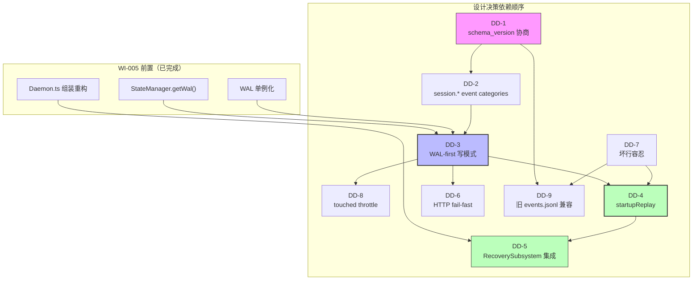

# WI-006 Design Delta: SessionRegistry WAL 化（Phase 2 — D 方案核心）

> 本文档是 change_request 工作流的增量设计文档，基于 WI-002 investigation 产出（05-recommendation.md §5.5 Phase 2）和 WI-006 impact_analysis.md，对现有 4 个核心模块进行增量修改设计。

---

## 增量设计描述

### DD-1 WAL schema_version 协商机制

refs: [intake.md §前置, impact_analysis.md §1]
constrained_by: WAL.ts L16 `schemaVersion = '1.0'` 硬编码, WAL.ts L92 `schema_version: '1.0'` 硬编码

**当前状态**：`WAL.ts` L16 将 `schemaVersion` 硬编码为 `'1.0'`，`createEvent` L92 产出的事件 `schema_version` 字段始终为 `'1.0'`。无版本协商或演进机制。

**设计**：

采用 **兼容扩展策略**（而非版本升级）：`schema_version` 保持 `'1.0'` 不变，通过 `category` 字段路由来区分事件类型。`createEvent` 已支持任意 `category` 字符串参数（L80-L109），因此新增 `category='session'` 不需要修改 `schema_version`。

具体变更：

1. **WAL 类新增 `supportedCategories: Set<string>` 属性**：
   - 构造函数初始化为 `new Set(['state', 'session', 'system'])`
   - 提供 `registerCategory(category: string): void` 方法供未来扩展

2. **`createEvent` 新增 category 合法性校验**（可选，带降级）：
   ```typescript
   createEvent(projectId, category, action, payload, actor, source): Event {
     if (!this.supportedCategories.has(category)) {
       console.warn(`[WAL] Unknown category '${category}' — event will be written but may not be replayed`);
       // 不阻止写入，只记录警告（向后兼容底线）
     }
     // ... 其余逻辑不变
   }
   ```

3. **`readAllEvents` 读取时按 `category` 字段分组返回**（新增辅助方法）：
   ```typescript
   async readEventsByCategory(category: string): Promise<Event[]> {
     const all = await this.readAllEvents();
     return all.filter(e => (e as any).category === category || (category === 'state' && !(e as any).category));
     // 旧事件无 category 字段 → 默认归入 'state' 类别
   }
   ```

4. **Writer 版本检查**：`createEvent` 不拒绝未知 category；Reader（`startupReplay`）必须容忍缺失 `category` 字段的事件。

5. **Reader 容忍策略**：
   - 遇到 `schema_version: '1.0'` + 无 `category` 字段的事件 → 视为 `category='state'`（旧事件）
   - 遇到 `schema_version: '1.0'` + `category='session'` 的事件 → 正常处理
   - 遇到未知 `category` → 跳过不报错

**与现有 events.jsonl 的兼容性**：
- 旧 events.jsonl 中所有事件无 `category` 字段 → `readEventsByCategory('session')` 返回空数组 → startupReplay 跳过
- 新旧事件可共存于同一 events.jsonl 文件

---

### DD-2 新增 WAL Event Categories: session.*

refs: [intake.md §核心-1, impact_analysis.md §2, 05-recommendation.md §5.3.1]
constrained_by: Event 类型定义 (types.ts L42-L75), WAL.createEvent 签名 (WAL.ts L80-L109)

**事件 Schema**：所有 `session.*` 事件使用 `category='session'`，`action` 字段区分具体事件类型。

#### session.registered

```typescript
{
  schema_version: '1.0',
  eventId: string,        // UUIDv7
  ts: number,             // Date.now()
  monotonicSeq: number,   // WAL 自增序列
  projectId: string,      // projectPath（对 plugin session 为 projectPath）
  actor: 'system',
  category: 'session',
  action: 'session.registered',
  payload: {
    sessionId: string,        // daemon 颁发的 UUIDv7 sessionId
    agentRole: string,        // 'plugin' | agent role name
    workflowRole: string,     // 'plugin-daemon-bridge' | workflow role
    workItemId: string,       // '' for plugin sessions
    spawnIntentId: string,    // '' for plugin sessions
    parentSessionId: string | null,
    projectPath: string,      // 原始 projectPath（用于 projectBindings 恢复）
  },
  metadata: { schemaVersion: '1.0', source: 'daemon' },
}
```

#### session.bound

```typescript
{
  // ... 标准 WAL 头部 ...
  category: 'session',
  action: 'session.bound',
  payload: {
    sessionId: string,
    projectPath: string,
  },
}
```

#### session.activated

```typescript
{
  // ... 标准 WAL 头部 ...
  category: 'session',
  action: 'session.activated',
  payload: {
    sessionId: string,
    spawnIntentId: string,
  },
}
```

#### session.terminated

```typescript
{
  // ... 标准 WAL 头部 ...
  category: 'session',
  action: 'session.terminated',
  payload: {
    sessionId: string,
  },
}
```

#### session.alias_bound

```typescript
{
  // ... 标准 WAL 头部 ...
  category: 'session',
  action: 'session.alias_bound',
  payload: {
    daemonSessionId: string,      // daemon 颁发的 sessionId
    opencodeSessionId: string,    // OpenCode 原生 sessionID
  },
}
```

#### session.touched（高频，需 throttle — 见 DD-8）

```typescript
{
  // ... 标准 WAL 头部 ...
  category: 'session',
  action: 'session.touched',
  payload: {
    sessionId: string,
    lastActiveAt: number,   // 触发 touch 时的时间戳
  },
}
```

**事件量评估**（来自 impact_analysis.md §2）：
- `session.registered/bound/activated/terminated/alias_bound`：均为低频（每次 session 生命周期操作 ≤ 1 次 WAL write）
- `session.touched`：高频（每次 OpenCode heartbeat 触发），需 throttle → 见 DD-8
- 单个 session 生命周期约 3-5 次 WAL 写入 + N 次 touched（throttle 后 N ≤ 1/min）
- 对单进程 daemon 不构成性能瓶颈

---

### DD-3 SessionRegistry WAL-first 写模式

refs: [intake.md §核心-2, impact_analysis.md §3, 05-recommendation.md §5.4.1]
constrained_by: StateManager.transition L137-L161 模板, SessionRegistry 构造函数 (L66-L69)

**模板**（参照 StateManager.transition L142-L162）：

```
Step 1: 幂等检查（in-memory 检查，不写 WAL）
Step 2: createEvent → category='session', action='session.*'
Step 3: await wal.appendEvent(event)    // fsync 保证持久化
Step 4: applyInMemory(Map.set/delete)   // WAL 写成功后才更新内存
```

**关键约束**：WAL 写失败时方法必须抛错（fail-fast），不得静默降级为 in-memory only。

#### 3.1 构造函数变更

```typescript
// 当前 (L66-L69):
constructor(eventBus: EventBus, sessionTimeoutMs: number = 30 * 60 * 1000)

// 目标:
constructor(eventBus: EventBus, sessionTimeoutMs: number = 30 * 60 * 1000, wal?: WAL)
```

- `wal` 参数可选——当未注入 WAL 时，写方法回退到 in-memory only 模式（向后兼容 + 测试便利）
- Daemon.ts L68 需改为 `new SessionRegistry(this.eventBus, 30 * 60 * 1000, this.stateManager.getWal())`

#### 3.2 registerPluginSession 转换

```typescript
registerPluginSession(projectId: string, projectPath: string): AgentIdentity {
  // Step 1: 幂等检查（不变，L170-L175）
  for (const [sid, pp] of this.projectBindings) {
    if (pp === projectPath) {
      const existing = this.lookupBySessionId(sid);
      if (existing) return existing;
    }
  }

  const identity = createPendingIdentity('plugin', 'plugin-daemon-bridge', '', '', null, projectId);

  // Step 2-3: WAL write (if WAL is available)
  if (this.wal) {
    const event = this.wal.createEvent(
      projectPath,        // projectId
      'session',          // category
      'session.registered',
      {
        sessionId: identity.sessionId,
        agentRole: 'plugin',
        workflowRole: 'plugin-daemon-bridge',
        workItemId: '',
        spawnIntentId: '',
        parentSessionId: null,
        projectPath,
      },
    );
    // 注意：同步 createEvent + 异步 appendEvent
    // registerPluginSession 当前是同步方法 → 需改为 async
  }

  // Step 4: In-memory apply（仅在 WAL 写成功后）
  this.pendingSessions.set(identity.sessionId, identity);
  this.projectBindings.set(identity.sessionId, projectPath);
  return identity;
}
```

**重要**：`registerPluginSession` 当前是同步方法（L168），WAL-first 需要异步 `appendEvent`。需将方法签名改为 `async`。调用者链：
- `HTTPServer.handleIngestRegister` L929 → 已在 async 上下文，无需改
- `SessionRegistry.handleOpenCodeEvent` L558 → 同步方法内调用 → 需将 handleOpenCodeEvent 也改为 async 或使用 `void this.wal.appendEvent(...)` fire-and-forget（不推荐，违反 WAL-first 原则）

**决策**：所有涉及 WAL 写入的方法统一改为 `async`。

#### 3.3 需要转换的完整方法清单

| 方法 | WAL action | 当前签名 | 目标签名 |
|------|-----------|----------|---------|
| `registerPluginSession` | `session.registered` | sync | async |
| `registerPending` | `session.registered` | sync | async |
| `activate` | `session.activated` | sync | async |
| `terminate` | `session.terminated` | sync | async |
| `bindProject` | `session.bound` | sync | async |
| `touch` | `session.touched` (throttled) | sync | async |
| `handleOpenCodeEvent` → fallback registerPluginSession | `session.registered` + `session.alias_bound` | sync | async |
| `handleOpenCodeEvent` → session.idle case | `session.touched` (throttled) | sync | async |
| `handleOpenCodeEvent` → session.error case | `session.terminated` | sync | async |
| `cleanupExpiredSessions` | 可选 `session.expired` | sync | async |

**约 6 个核心写路径 + 1 个可选（cleanupExpiredSessions 可延后到 Phase 3）**。

#### 3.4 alias_bound WAL 写入点

当前 `handleOpenCodeEvent` L567-L569 建立 alias 映射时仅 in-memory。WAL-first 后需在此处新增 `session.alias_bound` WAL 事件写入：

```typescript
// 当前 L567-L569:
if (internalSessionId && opencodeSessionId && !this.sessionAliases.has(opencodeSessionId)) {
  this.sessionAliases.set(opencodeSessionId, internalSessionId);
}

// 目标:
if (internalSessionId && opencodeSessionId && !this.sessionAliases.has(opencodeSessionId)) {
  // WAL write first
  if (this.wal) {
    const event = this.wal.createEvent(
      this.projectBindings.get(internalSessionId) ?? '',
      'session',
      'session.alias_bound',
      { daemonSessionId: internalSessionId, opencodeSessionId },
    );
    await this.wal.appendEvent(event);
  }
  // then in-memory apply
  this.sessionAliases.set(opencodeSessionId, internalSessionId);
}
```

---

### DD-4 SessionRegistry.startupReplay(events) 方法

refs: [intake.md §核心-3, impact_analysis.md §4, 05-recommendation.md §5.4.2]
constrained_by: RecoverySubsystem.reconnectOldSessions L485-L523 代码模式

**方法签名**：

```typescript
/**
 * Replay session events from WAL to restore in-memory state.
 * Called during daemon startup before sessionRegistry.start().
 *
 * @param events - Filtered events with category='session' (or legacy events without category)
 * @returns Replay summary for logging
 */
async startupReplay(events: Event[]): Promise<{
  replayedCount: number;
  restoredBindings: number;
  restoredAliases: number;
}>
```

**Replay 逻辑**：

```typescript
async startupReplay(events: Event[]): Promise<ReplaySummary> {
  let replayedCount = 0;
  let restoredBindings = 0;
  let restoredAliases = 0;

  // Sort by monotonicSeq (or ts as fallback) to ensure correct order
  const sorted = [...events].sort((a, b) =>
    (a.monotonicSeq ?? a.ts) - (b.monotonicSeq ?? b.ts)
  );

  for (const event of sorted) {
    const action = event.action;
    const payload = event.payload as Record<string, unknown>;

    switch (action) {
      case 'session.registered': {
        const sessionId = payload.sessionId as string;
        const identity: AgentIdentity = {
          sessionId,
          agentRole: payload.agentRole as string,
          workflowRole: payload.workflowRole as string,
          parentSessionId: payload.parentSessionId as string | null ?? null,
          workItemId: payload.workItemId as string,
          spawnIntentId: payload.spawnIntentId as string,
          projectId: event.projectId ?? null,
          createdAt: event.ts,
          lastActiveAt: event.ts,
          status: 'pending',
        };

        // 幂等：仅当 session 不存在时才 set
        if (!this.hasSession(sessionId)) {
          this.pendingSessions.set(sessionId, identity);
        }
        if (payload.projectPath) {
          this.projectBindings.set(sessionId, payload.projectPath as string);
          restoredBindings++;
        }
        replayedCount++;
        break;
      }

      case 'session.activated': {
        const sessionId = payload.sessionId as string;
        const pending = this.pendingSessions.get(sessionId);
        if (pending) {
          const active = activateIdentity(pending);
          this.pendingSessions.delete(sessionId);
          this.activeSessions.set(sessionId, active);
        }
        // 幂等：如果已在 activeSessions 中，跳过
        replayedCount++;
        break;
      }

      case 'session.bound': {
        const sessionId = payload.sessionId as string;
        const projectPath = payload.projectPath as string;
        this.projectBindings.set(sessionId, projectPath);
        restoredBindings++;
        replayedCount++;
        break;
      }

      case 'session.terminated': {
        const sessionId = payload.sessionId as string;
        const active = this.activeSessions.get(sessionId);
        if (active) {
          this.activeSessions.delete(sessionId);
          this.historySessions.set(sessionId, terminateIdentity(active));
        }
        // 幂等：已终止的不再处理
        replayedCount++;
        break;
      }

      case 'session.alias_bound': {
        const daemonSessionId = payload.daemonSessionId as string;
        const opencodeSessionId = payload.opencodeSessionId as string;
        this.sessionAliases.set(opencodeSessionId, daemonSessionId);
        restoredAliases++;
        replayedCount++;
        break;
      }

      case 'session.touched': {
        const sessionId = payload.sessionId as string;
        const active = this.activeSessions.get(sessionId);
        if (active) {
          // 仅更新 lastActiveAt，不触发 WAL 写入（避免循环）
          this.activeSessions.set(sessionId, {
            ...active,
            lastActiveAt: payload.lastActiveAt as number,
          });
        }
        // touched 事件可能是 throttle 产物，对应 session 可能已不在 active 状态
        // （被后续 terminated 事件处理过了），跳过即可
        replayedCount++;
        break;
      }

      default:
        // 未知 session action — 跳过
        break;
    }
  }

  return { replayedCount, restoredBindings, restoredAliases };
}
```

**幂等性保证**：
- `session.registered`：仅当 session 不存在时才 set → 重复 replay 不产生副作用
- `session.activated`：仅从 pending → active，如果已在 active 则跳过
- `session.bound`：`Map.set` 天然幂等
- `session.terminated`：仅从 active → history，如果已终止则跳过
- `session.alias_bound`：`Map.set` 天然幂等
- `session.touched`：仅更新 lastActiveAt，重复更新不影响正确性

**空事件集处理**：传入空数组 → 返回 `{ replayedCount: 0, restoredBindings: 0, restoredAliases: 0 }`，不报错。

---

### DD-5 RecoverySubsystem 集成

refs: [intake.md §核心-4, impact_analysis.md §5, 05-recommendation.md §5.4.2]
constrained_by: RecoverySubsystem 构造函数 (L52-L58), Daemon.ts 启动序列 (L123-L197)

**5.1 依赖注入变更**

RecoverySubsystem 当前已注入 `WAL` + `StateManager`（L52-L56）。需新增注入 `SessionRegistry`：

```typescript
// 当前 (L52):
constructor(pathResolver, projectPath, wal?, stateManager?)

// 目标:
constructor(pathResolver, projectPath, wal?, stateManager?, sessionRegistry?)
```

Daemon.ts 构造函数中新增 SessionRegistry 注入：

```typescript
// 当前 L64-L66:
this.recoverySubsystem = new RecoverySubsystem(
  pathResolver, runtimeDir, recoveryWal, recoveryStateManager
);

// 目标:
this.recoverySubsystem = new RecoverySubsystem(
  pathResolver, runtimeDir, recoveryWal, recoveryStateManager, this.sessionRegistry
);
```

**5.2 checkAndRepair 中的 startupReplay 调用点**

```typescript
// checkAndRepair L82-L142，在 stateManager.rebuildState() 之后插入:

async checkAndRepair(): Promise<ConsistencyCheckResult> {
  const events = this.wal
    ? await this.wal.readAllEvents()
    : await this.loadEvents();

  let rebuiltState: ProjectState;

  // --- 现有：rebuild workItems ---
  if (this.stateManager) {
    rebuiltState = await this.stateManager.rebuildState();
  } else {
    rebuiltState = await this.rebuildFromEvents(events);
  }

  // --- 新增：rebuild session bindings ---
  if (this.sessionRegistry && this.wal) {
    const sessionEvents = events.filter(e =>
      e.category === 'session' ||
      // 兼容旧事件：action 以 'session.' 开头但无 category 字段
      (!e.category && e.action?.startsWith('session.'))
    );
    const replayResult = await this.sessionRegistry.startupReplay(sessionEvents);
    console.log(
      `[RECOVERY] Session replay: ${replayResult.replayedCount} events, ` +
      `${replayResult.restoredBindings} bindings, ${replayResult.restoredAliases} aliases`
    );
  }

  // --- 现有：一致性检查 ---
  const issues: ConsistencyIssue[] = [];
  // ... (不变)
}
```

**5.3 启动序列时序（Daemon.ts start()）**

```
Daemon.start() 执行顺序（目标）：
  1. recoverySubsystem.beginStartupPhase()               L129
  2. handshakeManager.enforceSingleInstance()             L132
  3. httpServer.start()                                   L135
  4. handshakeManager.writeHandshake()                    L139
  5. httpServer.setToken()                                L142
  6. stateManager.initialize()                            L147
  7. recoverySubsystem.checkAndRepair()                   L149
     └─ 内部调用 sessionRegistry.startupReplay()          ★ NEW
  8. eventBus.start()                                     L155
  9. sessionRegistry.start() (EventBus 订阅建立)          L165
  10. projectManager.start()                              L166
  11. extensionLoader.loadAll()                           L170
  12. recoverySubsystem.reconnectOldSessions()            L183
  13. recoverySubsystem.completeStartup()                 L186
```

**关键约束**：`startupReplay`（Step 7 内）必须在 `sessionRegistry.start()`（Step 9）之前完成。当前时序已满足此约束——Step 7 在 Step 9 之前。

**注意**：Step 3 httpServer.start() 在 Step 7 startupReplay 之前。这意味着 HTTP 请求可能在 replay 完成之前到达。需确认是否有 buffer 机制或是否需要调整时序。**建议保持当前时序**（httpServer 先 start 以绑定端口），但 `handleIngestEvent` 在 replay 未完成时可以正常处理——因为 replay 仅影响历史 session 恢复，新请求会创建新 session。

---

### DD-6 WAL 写失败 → HTTP 5xx fail-fast

refs: [intake.md §增强-5, impact_analysis.md §6]
constrained_by: HTTPServer.handleOpenCodeEvent L1130-L1148, HTTPServer.handleIngestEvent L949-L1003

**6.1 当前问题**

`HTTPServer.handleOpenCodeEvent` L1130-L1148 使用 `try/catch` + `console.warn` 吞错：

```typescript
// 当前 L1134-L1148:
try {
  await this.withTimeout(
    (async () => {
      this.deps.sessionRegistry?.handleOpenCodeEvent?.(
        payload.subType ?? 'unknown',
        { ...payload, sessionId: payload.sessionId ?? sessionId },
      );
    })(),
    2_000,
    undefined,
  );
} catch (err) {
  console.warn(`[INGEST] SessionRegistry.handleOpenCodeEvent error for session ${sessionId}:`, err);
}
```

**6.2 错误分类**

| 错误类型 | 分类 | HTTP 行为 |
|---------|------|----------|
| WAL.appendEvent 失败（磁盘满 / I/O 错误） | **关键错误** | HTTP 5xx，不接受事件 |
| SessionRegistry 查找失败（session not found） | **非关键** | HTTP 200 + WARNING（现有行为） |
| EventLogger.append 超时 | **非关键** | HTTP 200 + WARNING |
| PermissionEngine 超时 | **非关键** | HTTP 200（default allow） |

**6.3 设计方案**

引入自定义错误类 `WALWriteError`（或使用现有 `DaemonError`），在 WAL-first 写方法中区分关键与非关键错误：

```typescript
// SessionRegistry 中的 WAL-first 写方法抛出的错误
class WALWriteError extends Error {
  constructor(message: string, public readonly cause: Error) {
    super(message);
    this.name = 'WALWriteError';
  }
}
```

在 `handleIngestEvent` 的 `processing` 路径中：

```typescript
const processing = (async () => {
  try {
    const extra = await this.routeIngestEvent(request);
    respond(200, this.successBody({
      received: true,
      type: request.type ?? 'unknown',
      ...(extra ?? {}),
    }));
  } catch (err) {
    // 新增：WAL 写失败 → 5xx fail-fast
    if (err instanceof WALWriteError) {
      console.error(`[INGEST] WAL write failed for ${request.type}:`, err.cause);
      respond(503, this.errorBody('WAL_WRITE_FAILED', 
        'WAL write failed — event not accepted. Please retry.'));
      return;
    }
    // 非关键错误 → 原有行为（200 + warning）
    console.error(`[INGEST] Failed to process ${request.type}:`, err);
    respond(200, this.successBody({
      received: true,
      type: request.type ?? 'unknown',
      warning: `Event logged but processing failed: ${(err as Error).message}`,
    }));
  }
})();
```

**6.4 需要修改的 HTTP 处理器**

| 处理器 | 修改点 | 错误分类 |
|--------|--------|---------|
| `handleOpenCodeEvent` L1130-L1148 | 移除 try/catch 吞错，改为向上抛出 WALWriteError | 关键（session.registered/alias_bound） |
| `handleIngestRegister` L913-L938 | `registerPluginSession` 改为 async 后，catch 中区分 WALWriteError | 关键 |
| `handleToolInvoking` L1051-L1095 | `touch` 改为 async 后，WAL 写失败不关键（仅 touch） | 非关键 |
| `handleSessionCompacting` L1154-L1168 | 不涉及 WAL 写入（仅 saveCheckpoint） | 不变 |

**6.5 客户端重试策略**

WAL 写失败返回 HTTP 503 + `Retry-After: 5` header。客户端（reconnecting-daemon-client.ts）需实现指数退避重试。**本次 WI 不修改客户端代码**，仅在 daemon 端返回正确的 5xx 状态码。

---

### DD-7 WAL 坏行容忍机制

refs: [intake.md §增强-6, impact_analysis.md §7]
constrained_by: WAL.readAllEvents L115-L130

**7.1 当前问题**

`WAL.readAllEvents` L115-L130 对每行执行 `JSON.parse(line)`，任何一行 JSON 格式损坏导致 `JSON.parse` 抛错 → 整个 `readAllEvents` 失败 → rebuild 无法进行。

**7.2 设计方案**

修改 `readAllEvents` 返回类型，增加坏行报告：

```typescript
interface ReadAllEventsResult {
  events: Event[];
  corruptedLines: Array<{ lineNumber: number; content: string; error: string }>;
}

async readAllEvents(): Promise<ReadAllEventsResult> {
  const result: ReadAllEventsResult = {
    events: [],
    corruptedLines: [],
  };

  try {
    const content = await fs.readFile(this.eventsPath, 'utf-8');
    if (!content) return result;

    const lines = content.split('\n');
    for (let i = 0; i < lines.length; i++) {
      const line = lines[i]!.trim();
      if (!line) continue;

      try {
        result.events.push(JSON.parse(line) as Event);
      } catch (err) {
        const error = err instanceof Error ? err.message : String(err);
        result.corruptedLines.push({
          lineNumber: i + 1,
          content: line.length > 100 ? line.substring(0, 100) + '...' : line,
          error,
        });
        console.warn(
          `[WAL] Skipping corrupted line ${i + 1}: ${error}`
        );
      }
    }
  } catch (error) {
    // File doesn't exist — return empty
    return result;
  }

  if (result.corruptedLines.length > 0) {
    console.error(
      `[WAL] readAllEvents completed with ${result.corruptedLines.length} corrupted line(s), ` +
      `recovered ${result.events.length} valid event(s)`
    );
  }

  return result;
}
```

**7.3 调用者影响**

`readAllEvents` 的返回类型从 `Promise<Event[]>` 变为 `Promise<ReadAllEventsResult>`。所有调用者需适配：

| 调用者 | 当前用法 | 适配方案 |
|--------|---------|---------|
| `RecoverySubsystem.checkAndRepair` L83-L84 | `const events = await this.wal.readAllEvents()` | `const { events } = await this.wal.readAllEvents()` |
| `RecoverySubsystem.reconnectOldSessions` L486-L487 | 同上 | 同上 |
| `WAL.getLastEvent` L136-L138 | `const events = await this.readAllEvents()` | `const { events } = await this.readAllEvents()` |
| 新增 `readEventsByCategory` | 依赖 `readAllEvents` | 适配 |
| 新增 `startupReplay` 调用链 | 过滤 category='session' | 使用 `events` 字段 |

**7.4 一致性报告**

坏行容忍后，rebuild 可能不完整。`checkAndRepair` 的一致性检查应报告：

```
[WAL] Expected N total lines, recovered M valid events, K corrupted lines skipped
```

---

### DD-8 session.touched Throttle 策略

refs: [intake.md §性能, impact_analysis.md §8]
constrained_by: SessionRegistry.touch L390-L399, handleOpenCodeEvent session.idle case L575-L576

**8.1 问题**

`session.idle` 事件可高频到达（每秒多次）。若每次 touch 都写 WAL → events.jsonl 急剧膨胀 + fsync 开销增大。

**8.2 设计方案**

按 session 维度 time-based throttle：

```typescript
// SessionRegistry 新增属性:
private touchThrottleMap: Map<string, number> = new Map();  // sessionId → last WAL write timestamp
private readonly TOUCH_THROTTLE_INTERVAL_MS = 60_000;       // 60 秒

// WAL-first touch 实现:
async touch(sessionId: string): Promise<AgentIdentity | null> {
  const active = this.activeSessions.get(sessionId);
  if (!active) return null;

  const now = Date.now();
  const updated = updateLastActive(active);

  // Step 1: 始终更新 in-memory lastActiveAt（确保 session 超时判断准确）
  this.activeSessions.set(sessionId, updated);

  // Step 2: Throttled WAL write
  if (this.wal) {
    const lastWalWrite = this.touchThrottleMap.get(sessionId) ?? 0;
    if (now - lastWalWrite >= this.TOUCH_THROTTLE_INTERVAL_MS) {
      const event = this.wal.createEvent(
        this.projectBindings.get(sessionId) ?? '',
        'session',
        'session.touched',
        { sessionId, lastActiveAt: now },
      );
      await this.wal.appendEvent(event);
      this.touchThrottleMap.set(sessionId, now);
    }
  }

  return updated;
}
```

**8.3 对 session 超时的影响**

Throttle **仅控制 WAL 写入频率**，in-memory `lastActiveAt` 每次都更新。因此：
- session 超时判断（`cleanupExpiredSessions` L125-L156）不受影响——它检查 `identity.lastActiveAt`
- WAL 中的 `session.touched` 仅用于 replay 时的近似恢复——replay 恢复的 `lastActiveAt` 可能比实际值旧最多 60 秒
- 如果 daemon 重启时某个 session 的真实 lastActiveAt 在 60 秒窗口内，replay 恢复的 lastActiveAt 可能提前触发超时——这是可接受的（daemon 重启后 session 短时间内超时是合理行为）

**8.4 throttle interval 可配置化**

`TOUCH_THROTTLE_INTERVAL_MS` 可通过构造函数参数传入（默认 60_000），便于测试和调优。

---

### DD-9 旧 events.jsonl 向后兼容

refs: [intake.md §兼容性, impact_analysis.md §9]
constrained_by: WAL.readAllEvents 需处理无 category 字段的事件

**9.1 兼容场景**

daemon 升级到 Phase 2 后，旧 events.jsonl 中只有 `category='state'`（或无 category 字段）的事件，没有 `category='session'` 事件。

**9.2 处理方案**

`startupReplay` 的输入已经是经过 `category='session'` 过滤的事件子集（在 `RecoverySubsystem.checkAndRepair` 中过滤）。对旧文件：

- `readEventsByCategory('session')` → 过滤 `category === 'session'` → 返回空数组
- `startupReplay([])` → 返回 `{ replayedCount: 0, restoredBindings: 0, restoredAliases: 0 }` → 不报错
- daemon 启动后 SessionRegistry 为空 → 直到新 plugin register 产生新 session

**9.3 旧事件 category 回退规则**

```typescript
// 在 readEventsByCategory 或 filter 逻辑中:
function eventMatchesCategory(event: Event, targetCategory: string): boolean {
  if (event.category === targetCategory) return true;
  // 旧事件无 category 字段 → 默认视为 'state'
  if (!event.category && targetCategory === 'state') return true;
  return false;
}
```

**9.4 与 Phase 0 alias 表的关系**

Phase 0（WI-003）建立的 alias 表仅 in-memory。升级到 Phase 2 后：
- 旧 events.jsonl 无 `session.alias_bound` 事件 → alias 表 replay 时为空
- daemon 启动后，新到达的 OpenCode 事件会重新建立 alias（L567-L569）并通过 WAL 持久化
- **过渡期**：daemon 重启后、第一个 OpenCode 事件到达前，alias 表为空——这是可接受的（plugin register 后才需要 alias）

---

## 受影响模块

### 模块变更矩阵

| 模块 | 文件路径 | 变更类型 | 变更内容摘要 | 受影响接口 |
|------|---------|---------|-------------|-----------|
| WAL | `src/wal/WAL.ts` | **修改** | 坏行容忍（readAllEvents 返回类型变更）、新增 readEventsByCategory 辅助方法、category 注册机制 | `readAllEvents(): Promise<ReadAllEventsResult>`（返回类型变更）、新增 `readEventsByCategory(category): Promise<Event[]>`、新增 `registerCategory(category): void` |
| SessionRegistry | `src/session/SessionRegistry.ts` | **重大修改** | WAL 注入、6+ 写方法改为 async WAL-first、新增 startupReplay、touch throttle、WALWriteError 抛出 | `constructor(eventBus, sessionTimeoutMs?, wal?)`（新增 wal 参数）、`registerPluginSession` / `registerPending` / `activate` / `terminate` / `bindProject` / `touch` / `handleOpenCodeEvent` → 全部改为 async |
| RecoverySubsystem | `src/recovery/RecoverySubsystem.ts` | **修改** | 构造函数新增 sessionRegistry 参数、checkAndRepair 中调用 startupReplay、readAllEvents 调用适配 | `constructor(pathResolver, projectPath, wal?, stateManager?, sessionRegistry?)`（新增 sessionRegistry）、`checkAndRepair()` 内部新增 startupReplay 调用 |
| HTTPServer | `src/http/HTTPServer.ts` | **修改** | handleOpenCodeEvent/handleIngestRegister 中 WALWriteError fail-fast、handleIngestEvent 错误分类 | `handleOpenCodeEvent` 错误处理从 try/catch 吞错改为向上传播 |
| Daemon | `src/daemon/Daemon.ts` | **修改** | SessionRegistry 构造注入 WAL、RecoverySubsystem 构造注入 SessionRegistry | `Daemon` 构造函数中 SessionRegistry 和 RecoverySubsystem 的创建方式 |

### 接口变更详情

#### SessionRegistry 公开接口变更

```typescript
// === 变更前（同步） ===
class SessionRegistry {
  constructor(eventBus: EventBus, sessionTimeoutMs?: number);
  registerPluginSession(projectId: string, projectPath: string): AgentIdentity;
  registerPending(...): AgentIdentity;
  activate(sessionId: string, spawnIntentId: string): AgentIdentity | null;
  terminate(sessionId: string): AgentIdentity | null;
  bindProject(sessionId: string, projectPath: string): boolean;
  touch(sessionId: string): AgentIdentity | null;
  handleOpenCodeEvent(subType: string, data: Record<string, unknown>): void;
}

// === 变更后（异步 WAL-first） ===
class SessionRegistry {
  constructor(eventBus: EventBus, sessionTimeoutMs?: number, wal?: WAL);
  async registerPluginSession(projectId: string, projectPath: string): Promise<AgentIdentity>;
  async registerPending(...): Promise<AgentIdentity>;
  async activate(sessionId: string, spawnIntentId: string): Promise<AgentIdentity | null>;
  async terminate(sessionId: string): Promise<AgentIdentity | null>;
  async bindProject(sessionId: string, projectPath: string): Promise<boolean>;
  async touch(sessionId: string): Promise<AgentIdentity | null>;
  async handleOpenCodeEvent(subType: string, data: Record<string, unknown>): Promise<void>;

  // 新增方法
  async startupReplay(events: Event[]): Promise<ReplaySummary>;
}
```

**Breaking Change**：所有调用 SessionRegistry 写方法的代码需从同步改为 async/await。受影响的调用点：

1. `HTTPServer.handleIngestRegister` L929 → 已在 async 上下文
2. `HTTPServer.handleOpenCodeEvent` L1137 → 已在 async 上下文（withTimeout 内）
3. `HTTPServer.handleToolInvoking` L1058 → `this.deps.sessionRegistry?.touch?.(sessionId)` 需改为 `await this.deps.sessionRegistry?.touch?.(sessionId)`
4. `SessionRegistry.handleSessionEvent` L625-L671 → 内部调用自身方法，需全部改为 await
5. `SessionRegistry.cleanupExpiredSessions` L125-L156 → 内部调用 terminate，需改为 async

#### WAL 公开接口变更

```typescript
// === 新增类型 ===
interface ReadAllEventsResult {
  events: Event[];
  corruptedLines: Array<{ lineNumber: number; content: string; error: string }>;
}

// === 变更前 ===
class WAL {
  async readAllEvents(): Promise<Event[]>;
}

// === 变更后 ===
class WAL {
  async readAllEvents(): Promise<ReadAllEventsResult>;  // 返回类型变更
  async readEventsByCategory(category: string): Promise<Event[]>;  // 新增
  registerCategory(category: string): void;  // 新增
  readonly supportedCategories: Set<string>;  // 新增
}
```

**Breaking Change**：`readAllEvents` 返回类型从 `Event[]` 变为 `ReadAllEventsResult`。所有调用者需适配。

---

## 兼容性影响

### 1. events.jsonl 格式兼容

| 维度 | 评估 |
|------|------|
| 旧事件可读性 | ✅ 完全兼容。旧事件无 `category` 字段 → 默认视为 `'state'`，不影响 rebuild |
| 新事件可读性 | ✅ 新事件有 `category='session'` 字段。旧 daemon 版本不认识此字段但 `JSON.parse` 不受影响 |
| 新旧事件共存 | ✅ 同一 events.jsonl 可包含 `category='state'` 和 `category='session'` 事件。rebuild 按类别分别处理 |
| schema_version | ✅ 保持 `'1.0'` 不变。版本演进通过 `category` 字段扩展而非版本号升级 |

### 2. API 兼容性

| API 端点 | 变更 |
|---------|------|
| `POST /api/v1/ingest/register` | 返回值不变 `{ sessionId, projectId, mode }`。内部改为 async WAL-first，对客户端透明 |
| `POST /api/v1/ingest/event` | 正常响应不变 `{ received: true, type, ... }`。新增错误场景：WAL 写失败返回 HTTP 503 + `WAL_WRITE_FAILED` 错误码 |
| 其他 API 端点 | 不受影响 |

### 3. Daemon 内部接口兼容

| 接口 | 兼容性 | 说明 |
|------|--------|------|
| `SessionRegistry` 写方法 | **Breaking** | 同步 → 异步，所有调用者需适配 |
| `WAL.readAllEvents` | **Breaking** | 返回类型从 `Event[]` 变为 `ReadAllEventsResult` |
| `RecoverySubsystem` 构造函数 | **Breaking** | 新增 `sessionRegistry` 参数 |
| `Daemon` 构造函数 | **Internal** | 内部组装变更，不影响外部 API |

### 4. 向后兼容底线

- **必须**：旧 events.jsonl（仅含 state 事件）在新 daemon 下正常启动
- **必须**：新 daemon 生成的 events.jsonl 在旧 daemon 下不导致崩溃（旧 daemon 忽略未知 category）
- **必须**：plugin 客户端零改动（wire format 不变）
- **必须**：所有现有测试在新代码下仍通过（行为等价性）

---

## 回归风险

### 高风险项

| 风险 | 影响范围 | 缓解策略 |
|------|---------|---------|
| **R1: SessionRegistry 写方法 sync→async 变更遗漏调用点** | 任何调用 SessionRegistry 写方法但未加 await 的地方 → Promise 被忽略 → WAL 写失败静默丢失 | 静态分析搜索所有 SessionRegistry 方法调用点；TypeScript strict mode 下 `no-floating-promises` 检查 |
| **R2: readAllEvents 返回类型变更导致运行时错误** | RecoverySubsystem、WAL.getLastEvent 等调用者仍按 `Event[]` 使用 → `.length` / `.filter` 等调用在 `ReadAllEventsResult` 对象上失败 | 全量搜索 `readAllEvents()` 调用点，逐一适配 |
| **R3: startupReplay 在 EventBus 订阅建立前后的竞态** | 如果 httpServer 在 replay 完成前收到请求，SessionRegistry 可能部分恢复 → 新事件可能与 replay 冲突 | 当前时序中 replay 在 checkAndRepair（Step 7）内完成，httpServer 虽已 start（Step 3）但仅影响新请求。新请求创建新 session 不依赖 replay 结果 |

### 中风险项

| 风险 | 影响范围 | 缓解策略 |
|------|---------|---------|
| **R4: touch throttle 导致 WAL 中 lastActiveAt 不准确** | daemon 重启后 replay 恢复的 session lastActiveAt 可能比实际旧最多 60 秒 → 提前触发 session 超时 | 可接受行为：daemon 重启后短时间内旧 session 超时是合理的 |
| **R5: WAL 坏行容忍导致静默数据丢失** | 坏行被跳过但不阻止 rebuild → 可能有事件丢失 | 坏行日志包含行号 + 内容摘要；rebuild 后一致性检查报告"期望 N 条事件，实际恢复 M 条" |
| **R6: HTTP 5xx fail-fast 在磁盘持续异常时形成重试风暴** | 客户端不断重试 → daemon 负载上升 | 返回 `Retry-After: 5` header；本次不修改客户端退避逻辑 |

### 低风险项

| 风险 | 影响范围 | 缓解策略 |
|------|---------|---------|
| **R7: constructor 新增可选参数的默认值** | 未传 WAL 时回退到 in-memory only → 功能降级但不崩溃 | 日志提示 `[SessionRegistry] WAL not injected — running in memory-only mode` |
| **R8: cleanupExpiredSessions 中 terminate 改为 async** | 内部 iterate + delete Map 逻辑改为异步 → 理论上可能在 iteration 中修改 Map | 使用 `for...of` + 收集待清理列表 + 批量异步清理 |

---

## KG 追溯关系

### 追溯到 impact_analysis.md 变更范围

| 设计决策 | 对应 impact_analysis.md 变更项 | 源文件变更范围 |
|---------|-------------------------------|--------------|
| DD-1 | §1 WAL schema_version 协商机制 | WAL.ts |
| DD-2 | §2 新增 WAL event categories | WAL.ts (createEvent), types.ts (Event type) |
| DD-3 | §3 SessionRegistry WAL-first 写模式 | SessionRegistry.ts |
| DD-4 | §4 SessionRegistry.startupReplay | SessionRegistry.ts |
| DD-5 | §5 RecoverySubsystem 集成 | RecoverySubsystem.ts, Daemon.ts |
| DD-6 | §6 WAL 写失败 fail-fast | HTTPServer.ts, SessionRegistry.ts (WALWriteError) |
| DD-7 | §7 WAL 坏行容忍 | WAL.ts, RecoverySubsystem.ts (调用者适配) |
| DD-8 | §8 session.touched throttle | SessionRegistry.ts |
| DD-9 | §9 旧 events.jsonl 兼容 | WAL.ts (readEventsByCategory), RecoverySubsystem.ts |

### KG 节点映射

| 预期 KG 节点 | 类型 | 对应 DD | WI-005 前置依赖 |
|-------------|------|--------|----------------|
| `WI-006:code_file:1` (WAL.ts) | code_file | DD-1, DD-2, DD-7 | `WI-005:code_file:1` (StateManager.ts WAL 引用) |
| `WI-006:code_file:2` (SessionRegistry.ts) | code_file | DD-2, DD-3, DD-4, DD-8 | — |
| `WI-006:code_file:3` (RecoverySubsystem.ts) | code_file | DD-5, DD-7 | `WI-005:code_file:5` (Daemon.ts 组装) |
| `WI-006:code_file:4` (HTTPServer.ts) | code_file | DD-6 | — |
| `WI-006:code_file:5` (Daemon.ts) | code_file | DD-3 (构造注入), DD-5 (启动序列) | `WI-005:code_file:5` (Daemon.ts) |

### 不变式影响

| 不变式 | 当前状态 | WI-006 影响 |
|--------|----------|-------------|
| Property 5 (sessionId 唯一身份键) | SessionRegistry L46-L48 保证 | **不受影响**：WAL-first 不改变 sessionId 语义 |
| Property 20 (一致性修复) | RecoverySubsystem L7-L11 保证 | **扩展**：rebuild 不动点从"只覆盖 workItems"扩展到"覆盖 session bindings + workItems" |
| Property 21 (重连仅限启动期) | RecoverySubsystem L13-L17 保证 | **语义变更**：从"启动期试探重连 OpenCode 进程"变为"启动期 WAL 重放重建绑定" |
| C7 隐式契约 (3) (WAL schema_version 硬编码) | WAL L16/L92 硬编码 '1.0' | **消除**：通过 category 扩展机制替代版本升级需求 |

### 依赖关系（Mermaid）



---

## 非功能性约束映射

| 维度 | 约束（来自 project-rules.md） | DD 覆盖 |
|------|---------------------------|---------|
| **性能** | 不要求基准测试，讨论数量级 | DD-2 §事件量评估：单 session 生命周期 3-5 次 WAL 写 + throttled touch。DD-8 §throttle 策略：每 session 每分钟最多 1 次 touched WAL 写入 |
| **可靠性** | 必须保留多客户端会聚点 + daemon 重启可恢复 | DD-3 §WAL-first 保证写后不丢；DD-4 §startupReplay 保证重启恢复；DD-6 §fail-fast 保证不静默丢数据 |
| **兼容性** | 迁移路径考虑 events.jsonl 和 state.json 演进 | DD-1 §schema_version 保持 1.0；DD-9 §旧文件兼容；DD-2 §新 category 不影响旧事件 |
| **可观测性** | 说明对现有日志的影响 | DD-7 §坏行日志 `[WAL] Skipping corrupted line`；DD-4 §replay 摘要 `[RECOVERY] Session replay: N events, M bindings`；DD-6 §WAL 写失败日志 `[INGEST] WAL write failed` |

---

## Out of Scope

以下不在本 WI 设计范围内：

- Property 21 措辞重写（Phase 3 处理）
- 删除老的 `detectOldSessions` / `reconnectOldSessions` 代码（Phase 3 处理）
- events.jsonl 的 snapshot/compaction 机制（独立 WI，针对长运行场景）
- ProjectManager 的多项目 StateManager 拆分
- 客户端（reconnecting-daemon-client.ts）重试退避策略修改
- `cleanupExpiredSessions` 写 `session.expired` WAL 事件（可延后到 Phase 3）
- sessions.json checkpoint 文件（可选加速冷启动，非必需）

---

## Assumptions

1. **假设 Phase 0 和 Phase 1 已完成**：WI-003（HTTPServer sessionId merge）、WI-004（gate handler 修复）、WI-005（WAL/StateManager 单例化）均已合并
2. **假设 WAL 单例已通过 StateManager.getWal() 暴露**：SessionRegistry 通过构造函数注入获取 WAL 引用
3. **假设单进程 daemon**：WAL 文件无并发写入竞争（无文件锁需求）
4. **假设 events.jsonl 无外部写入**：只有 WAL.appendEvent 写入 events.jsonl
5. **假设 fsync 可靠**：WAL.appendEvent L59-L64 的 fsync 保证数据落盘
6. **假设 daemon 重启是低频操作**：startupReplay 遍历全部 events.jsonl，O(n) 时间复杂度，对当前规模（< 10K 事件）可接受
7. **假设 plugin 与 daemon 版本同步升级**：新旧 daemon 共存同一 events.jsonl 的场景存在但为过渡态
