# Design Delta — WI-007: SpecForge v1.1 Standard Alignment

> Work Item: WI-007
> Workflow Path: `requirement_change_path`（涉及目录结构、模块拆分、Agent 职责体系等多层面标准对齐）
> Base Spec Version: current
> 标准依据: `specforge_final_fused_standard_v1_1_patch1_zh.md`

---

## 1. 增量设计描述

本 Design Delta 按变更类型分为四个 Group，每个 Group 内的设计决策引用 v1.1 标准的具体章节。

---

### Group A: Code Module Splitting（24+ new .ts files）

**设计方法**：从现有 `-v11.ts` 单体文件中按标准章节边界提取函数/类型到独立模块。每个新模块通过原文件的 `export * from` 保持向后兼容。拆分策略遵循以下原则：

1. **按标准章节边界拆分**：每个新模块对应 v1.1 标准的一个明确子章节。
2. **单向依赖**：新模块不回引原文件；原文件 re-export 新模块的公开 API。
3. **接口不变**：现有 94 个测试和 10 个 handler 的 import 路径不改变。
4. **hash 稳定**：re-export 不改变任何类型的运行时行为。

---

#### DD-A1 change-classification.ts — Change Classification 独立模块

refs: [§6.2, AC-1, AC-2]
constrained_by: standard §6.2
risk_level: low
implementation_boundary:
  source_file: `packages/daemon-core/src/tools/lib/workflow-path-selector-v11.ts`
  likely_write_files:
    - `packages/daemon-core/src/tools/lib/change-classification.ts` (CREATE)
    - `packages/daemon-core/src/tools/lib/workflow-selector-v11.ts` (UPDATE — add re-export)
  forbidden_files: [`.specforge/**`, `packages/types/**`]
interfaces:
  - name: `ChangeClassification` (type)
    input: "interface with 10 boolean fields + unknowns"
    output: "ChangeClassification"
    errors: []
  - name: `classifyChange` (function, if extracted)
    input: "ChangeClassification"
    output: "WorkflowPath"
    errors: []
data_flow:
  - "workflow-path-selector-v11.ts → (extract) → change-classification.ts"
  - "workflow-path-selector-v11.ts → re-export → change-classification.ts"
verification_strategy:
  commands:
    - "cd packages/daemon-core && npx tsc --noEmit"
    - "cd packages/daemon-core && npx vitest run tests/v11-*.test.ts"
  evidence_expected:
    - "AC-2: backward compatible — existing imports still resolve"
    - "AC-6: 94 tests still pass"
parallelization_notes:
  parallel_safe_with: [DD-A2, DD-A3, DD-A4, DD-A5]
  conflicts_with: []
out_of_scope:
  - "Classification logic change (only extraction, no behavior modification)"
assumptions:
  - "ChangeClassification interface is stable and matches §6.2 definition"

**提取内容**：
| 导出项 | 类型 | 标准章节 |
|--------|------|----------|
| `ChangeClassification` | interface | §6.2 Classification 结果 |
| `canUseCodeOnlyFastPath` | function | §6.7 code-only 条件 |

**Re-export 策略**：`workflow-path-selector-v11.ts` 添加 `export * from './change-classification.js';`

---

#### DD-A2 impact-analysis.ts — Impact Analysis 独立模块

refs: [§6.2, AC-1, AC-2]
constrained_by: standard §6.2
risk_level: low
implementation_boundary:
  source_file: `packages/daemon-core/src/tools/lib/workflow-path-selector-v11.ts`
  likely_write_files:
    - `packages/daemon-core/src/tools/lib/impact-analysis.ts` (CREATE)
    - `packages/daemon-core/src/tools/lib/workflow-path-selector-v11.ts` (UPDATE)
  forbidden_files: [`.specforge/**`, `packages/types/**`]
interfaces:
  - name: `selectWorkflowPath`
    input: "classification: ChangeClassification"
    output: "WorkflowPath"
    errors: []
  - name: `generateTriggerResult`
    input: "workItemId, classification, matchResults"
    output: "TriggerResult"
    errors: []
data_flow:
  - "workflow-path-selector-v11.ts → (extract) → impact-analysis.ts"
verification_strategy:
  commands:
    - "cd packages/daemon-core && npx tsc --noEmit"
  evidence_expected:
    - "AC-2: re-export covers all moved exports"
out_of_scope:
  - "New impact analysis logic"
assumptions:
  - "selectWorkflowPath and generateTriggerResult stay in this module"

**提取内容**：
| 导出项 | 类型 | 标准章节 |
|--------|------|----------|
| `selectWorkflowPath` | function | §6.5 路径优先级 |
| `generateTriggerResult` | function | §6.1 trigger_result.json |

**Re-export 策略**：`workflow-path-selector-v11.ts` 添加 `export * from './impact-analysis.js';`

---

#### DD-A3 trigger-result.ts — Trigger Result 独立模块

refs: [§6.3, AC-1, AC-2]
constrained_by: standard §6.3
risk_level: low
implementation_boundary:
  source_file: `packages/daemon-core/src/tools/lib/workflow-path-selector-v11.ts`
  likely_write_files:
    - `packages/daemon-core/src/tools/lib/trigger-result.ts` (CREATE)
    - `packages/daemon-core/src/tools/lib/workflow-path-selector-v11.ts` (UPDATE)
  forbidden_files: [`.specforge/**`, `packages/types/**`]
interfaces:
  - name: `MatchResultType`
    input: "type union of 6 string literals"
    output: "MatchResultType"
    errors: []
  - name: `TriggerResult`
    input: "interface with schema_version, work_item_id, workflow_path, etc."
    output: "TriggerResult"
    errors: []
data_flow:
  - "workflow-path-selector-v11.ts → (extract) → trigger-result.ts"
verification_strategy:
  commands:
    - "cd packages/daemon-core && npx tsc --noEmit"
out_of_scope:
  - "Changes to MatchResultType values"
assumptions:
  - "6 match result types are fixed per §6.3"

**提取内容**：
| 导出项 | 类型 | 标准章节 |
|--------|------|----------|
| `MatchResultType` | type | §6.3 匹配结果类型 |
| `TriggerResult` | interface | §6.1 trigger_result.json |

**Re-export 策略**：`workflow-path-selector-v11.ts` 添加 `export * from './trigger-result.js';`

---

#### DD-A4 gate-report.ts — Gate Report 独立模块

refs: [§9.4, AC-1, AC-2]
constrained_by: standard §9.4
risk_level: medium
implementation_boundary:
  source_file: `packages/daemon-core/src/tools/lib/gate-runner-v11.ts` (910 lines)
  likely_write_files:
    - `packages/daemon-core/src/tools/lib/gate-report.ts` (CREATE)
    - `packages/daemon-core/src/tools/lib/gate-runner-v11.ts` (UPDATE)
    - `packages/daemon-core/src/tools/handlers/sf-v11-gate-run.ts` (UPDATE — optional import path update)
  forbidden_files: [`.specforge/**`, `packages/types/**`]
interfaces:
  - name: `GateReportCheck`
    input: "interface with check_id, description, passed, severity, details"
    output: "GateReportCheck"
    errors: []
  - name: `GateReportV11`
    input: "interface with schema_version, work_item_id, gate_id, gate_type, etc."
    output: "GateReportV11"
    errors: []
  - name: `runGate`
    input: "gateId: GateIdV11, ctx: GateContext"
    output: "Promise<GateReportV11>"
    errors: ["GateNotRegistered"]
  - name: `makeReport` (internal helper)
    input: "workItemId, gateId, gateType, required, checks, inputFiles"
    output: "GateReportV11"
    errors: []
data_flow:
  - "gate-runner-v11.ts → (extract) → gate-report.ts"
  - "handler sf-v11-gate-run.ts → gate-runner-v11.ts (unchanged import path)"
verification_strategy:
  commands:
    - "cd packages/daemon-core && npx tsc --noEmit"
    - "cd packages/daemon-core && npx vitest run tests/v11-*.test.ts"
  evidence_expected:
    - "AC-2: re-export complete"
    - "AC-6: 94 tests pass after split"
parallelization_notes:
  parallel_safe_with: [DD-A1, DD-A2, DD-A3]
  conflicts_with: [DD-A5, DD-A6] (same source file gate-runner-v11.ts)

**提取内容**：
| 导出项 | 类型 | 标准章节 |
|--------|------|----------|
| `GateReportCheck` | interface | §9.4 Gate Report check |
| `GateReportV11` | interface | §9.4 Gate Report 结构 |
| `GateContext` | interface | §9 Gate 上下文 |
| `GateCheckFn` | type | §9 Gate 检查函数签名 |
| `runGate` | function | §9.4 运行单个 Gate |
| `makeSkippedReport` | function | 辅助：跳过报告 |
| `makeReport` | function | 辅助：构造 GateReportV11 |

**Re-export 策略**：`gate-runner-v11.ts` 添加 `export * from './gate-report.js';`

---

#### DD-A5 gate-summary.ts — Gate Summary 独立模块

refs: [§9.5, AC-1, AC-2]
constrained_by: standard §9.5
risk_level: medium
implementation_boundary:
  source_file: `packages/daemon-core/src/tools/lib/gate-runner-v11.ts`
  likely_write_files:
    - `packages/daemon-core/src/tools/lib/gate-summary.ts` (CREATE)
    - `packages/daemon-core/src/tools/lib/gate-runner-v11.ts` (UPDATE)
  forbidden_files: [`.specforge/**`, `packages/types/**`]
interfaces:
  - name: `GateSummaryStatus`
    input: "type union of 6 status strings"
    output: "GateSummaryStatus"
    errors: []
  - name: `generateGateSummaryMd`
    input: "workItemId, reports, overallStatus"
    output: "string (Markdown)"
    errors: []
data_flow:
  - "gate-runner-v11.ts → (extract) → gate-summary.ts"
verification_strategy:
  commands:
    - "cd packages/daemon-core && npx tsc --noEmit"
parallelization_notes:
  conflicts_with: [DD-A4, DD-A6] (same source file)

**提取内容**：
| 导出项 | 类型 | 标准章节 |
|--------|------|----------|
| `GateSummaryStatus` | type | §9.5 overall_status 枚举 |
| `generateGateSummaryMd` | function | §9.5 Gate Summary Markdown 生成 |

---

#### DD-A6 gate-chain.ts — Gate Chain / Freeze Rules 独立模块

refs: [§9.6, AC-1, AC-2]
constrained_by: standard §9.6
risk_level: medium
implementation_boundary:
  source_file: `packages/daemon-core/src/tools/lib/gate-runner-v11.ts`
  likely_write_files:
    - `packages/daemon-core/src/tools/lib/gate-chain.ts` (CREATE)
    - `packages/daemon-core/src/tools/lib/gate-runner-v11.ts` (UPDATE)
  forbidden_files: [`.specforge/**`, `packages/types/**`]
interfaces:
  - name: `GateMeta`
    input: "interface with gateId, gateType, required, checkFn"
    output: "GateMeta"
    errors: []
  - name: `registerGate`
    input: "gateId, gateType, required, checkFn"
    output: "void"
    errors: []
  - name: `runRequiredGates`
    input: "gateIds, ctx"
    output: "Promise<{ reports, summaryStatus, summaryPath }>"
    errors: ["GateExecutionError"]
data_flow:
  - "gate-runner-v11.ts → (extract) → gate-chain.ts"
  - "gate-chain.ts → gate-report.ts (imports GateReportV11, GateContext)"
  - "gate-chain.ts → gate-summary.ts (imports GateSummaryStatus, generateGateSummaryMd)"
verification_strategy:
  commands:
    - "cd packages/daemon-core && npx tsc --noEmit"
    - "cd packages/daemon-core && npx vitest run tests/v11-*.test.ts"
parallelization_notes:
  conflicts_with: [DD-A4, DD-A5] (same source file)

**提取内容**：
| 导出项 | 类型 | 标准章节 |
|--------|------|----------|
| `GateMeta` | interface | §9.6 Gate 元数据 |
| `gateRegistry` | Map (internal) | §9.6 Gate 注册表 |
| `registerGate` | function | §9.6 注册 Gate |
| `runRequiredGates` | function | §9.6 链式执行 + 冻结 |

**依赖方向**：`gate-chain.ts` → `gate-report.ts` + `gate-summary.ts`（单向）

---

#### DD-A7 user-decision.ts — User Decision Core Types 独立模块

refs: [§10.3, §10.5, AC-1, AC-2]
constrained_by: standard §10.3, §10.4
risk_level: low
implementation_boundary:
  source_file: `packages/daemon-core/src/tools/lib/user-decision-recorder-v11.ts` (191 lines)
  likely_write_files:
    - `packages/daemon-core/src/tools/lib/user-decision.ts` (CREATE)
    - `packages/daemon-core/src/tools/lib/user-decision-recorder-v11.ts` (UPDATE)
  forbidden_files: [`.specforge/**`, `packages/types/**`]
interfaces:
  - name: `UserDecisionStatus`
    input: "type union of 7 status strings"
    output: "UserDecisionStatus"
    errors: []
  - name: `UserDecisionV11`
    input: "interface with 15+ fields per §10.2"
    output: "UserDecisionV11"
    errors: []
data_flow:
  - "user-decision-recorder-v11.ts → (extract) → user-decision.ts"
verification_strategy:
  commands:
    - "cd packages/daemon-core && npx tsc --noEmit"

**提取内容**：
| 导出项 | 类型 | 标准章节 |
|--------|------|----------|
| `UserDecisionStatus` | type | §10.3 状态枚举 |
| `UserDecisionV11` | interface | §10.2 结构定义 |
| Waiver sub-interfaces | interfaces | §10.6 Waiver 结构 |

---

#### DD-A8 waiver.ts — Waiver 记录逻辑独立模块

refs: [§10.6, AC-1, AC-2]
constrained_by: standard §10.6
risk_level: low
implementation_boundary:
  source_file: `packages/daemon-core/src/tools/lib/user-decision-recorder-v11.ts`
  likely_write_files:
    - `packages/daemon-core/src/tools/lib/waiver.ts` (CREATE)
    - `packages/daemon-core/src/tools/lib/user-decision-recorder-v11.ts` (UPDATE)
  forbidden_files: [`.specforge/**`, `packages/types/**`]
interfaces:
  - name: `WaiverRecord`
    input: "waiver_id, gate_id, reason, risk, expires_at, follow_up_wi"
    output: "WaiverRecord"
    errors: []
  - name: `validateWaiver`
    input: "waiver: WaiverRecord"
    output: "boolean"
    errors: ["HardGateWaiverAttempt"]
data_flow:
  - "user-decision-recorder-v11.ts → (extract) → waiver.ts"
verification_strategy:
  commands:
    - "cd packages/daemon-core && npx tsc --noEmit"

**提取内容**：Waiver 相关类型和校验逻辑。§10.6 明确 soft_gate waiver 必须有原因、风险、有效期和 follow-up WI；hard_gate 不允许 waiver。

---

#### DD-A9 allowed-write-files.ts — Allowed Write Files 独立模块

refs: [§12.3, §12.4, AC-1, AC-2]
constrained_by: standard §12.4
risk_level: low
implementation_boundary:
  source_file: `packages/daemon-core/src/tools/lib/code-permission-service-v11.ts` (103 lines)
  likely_write_files:
    - `packages/daemon-core/src/tools/lib/allowed-write-files.ts` (CREATE)
    - `packages/daemon-core/src/tools/lib/code-permission-service-v11.ts` (UPDATE)
  forbidden_files: [`.specforge/**`, `packages/types/**`]
interfaces:
  - name: `AllowedWriteFile`
    input: "path: string, operation: 'create' | 'modify' | 'delete'"
    output: "AllowedWriteFile"
    errors: []
  - name: `validateAllowedWriteFiles`
    input: "files: AllowedWriteFile[], tasksMd: string"
    output: "{ valid: boolean, violations: string[] }"
    errors: []
data_flow:
  - "code-permission-service-v11.ts → (extract) → allowed-write-files.ts"
verification_strategy:
  commands:
    - "cd packages/daemon-core && npx tsc --noEmit"

**提取内容**：§12.4 `allowed_write_files` 白名单校验逻辑。来自 `code-permission-service-v11.ts` 中 `ReleasePermissionInput` 和 `PermissionState` 中的 `allowed_write_files` 字段处理逻辑。

---

#### DD-A10 write-policy.ts — Write Policy 独立模块

refs: [§12.5, §12.6, AC-1, AC-2]
constrained_by: standard §12.5, §12.6
risk_level: low
implementation_boundary:
  source_file: `packages/daemon-core/src/tools/lib/write-guard-v11.ts` (231 lines)
  likely_write_files:
    - `packages/daemon-core/src/tools/lib/write-policy.ts` (CREATE)
    - `packages/daemon-core/src/tools/lib/write-guard-v11.ts` (UPDATE)
  forbidden_files: [`.specforge/**`, `packages/types/**`]
interfaces:
  - name: `WritePolicyRule`
    input: "rule definition"
    output: "WritePolicyRule"
    errors: []
  - name: `evaluatePolicy`
    input: "context, filePath, operation"
    output: "WriteCheckResult"
    errors: []
data_flow:
  - "write-guard-v11.ts → (extract) → write-policy.ts"
verification_strategy:
  commands:
    - "cd packages/daemon-core && npx tsc --noEmit"

**提取内容**：Write Guard 策略规则定义（§12.5 拦截规则、§12.6 阻断条件 10 条）。

---

#### DD-A11 command-write-audit.ts — Command Write Audit 独立模块

refs: [§12.7, AC-1, AC-2]
constrained_by: standard §12.7
risk_level: low
implementation_boundary:
  source_file: `packages/daemon-core/src/tools/lib/write-guard-v11.ts`
  likely_write_files:
    - `packages/daemon-core/src/tools/lib/command-write-audit.ts` (CREATE)
    - `packages/daemon-core/src/tools/lib/write-guard-v11.ts` (UPDATE)
  forbidden_files: [`.specforge/**`, `packages/types/**`]
interfaces:
  - name: `auditCommandWrite`
    input: "command: string, expectedFiles: string[], actualFiles: string[]"
    output: "AuditResult"
    errors: []
data_flow:
  - "write-guard-v11.ts → (extract) → command-write-audit.ts"
verification_strategy:
  commands:
    - "cd packages/daemon-core && npx tsc --noEmit"

**提取内容**：§12.7 命令写入审计。审计 bash、formatter、generator 等写入入口的实际写入文件。

---

#### DD-A12 changed-files-audit.ts — Changed Files Audit 独立模块

refs: [§12.7, §13, AC-1, AC-2]
constrained_by: standard §12.7 (changed_files_audit)
risk_level: low
implementation_boundary:
  source_file: `packages/daemon-core/src/tools/lib/write-guard-v11.ts`
  likely_write_files:
    - `packages/daemon-core/src/tools/lib/changed-files-audit.ts` (CREATE)
    - `packages/daemon-core/src/tools/lib/write-guard-v11.ts` (UPDATE)
  forbidden_files: [`.specforge/**`, `packages/types/**`]
interfaces:
  - name: `ChangedFilesAuditResult`
    input: "actual_changed, allowed_write_files, violations, escaped_write_incidents"
    output: "ChangedFilesAuditResult"
    errors: []
  - name: `runChangedFilesAudit`
    input: "workItemDir, allowedWriteFiles"
    output: "ChangedFilesAuditResult"
    errors: ["AuditFailed"]
data_flow:
  - "write-guard-v11.ts → (extract) → changed-files-audit.ts"
verification_strategy:
  commands:
    - "cd packages/daemon-core && npx tsc --noEmit"

**提取内容**：§12.7 `changed_files_audit` 完整逻辑。检查 6 项（实际修改文件列表、白名单合规、间接副作用、formatter/generator 写入、正式规格区写入、escaped_write_incident）。

---

#### DD-A13 tool-wrapper.ts — Tool Invocation Wrapper

refs: [§12.4, AC-1]
constrained_by: standard §12.4
risk_level: low
implementation_boundary:
  likely_write_files:
    - `packages/daemon-core/src/tools/lib/tool-wrapper.ts` (CREATE)
  forbidden_files: [`.specforge/**`, `packages/types/**`]
interfaces:
  - name: `ToolInvocation`
    input: "toolName, args, expectedWriteFiles, callerRole"
    output: "ToolInvocationResult"
    errors: ["WriteNotAllowed", "ToolNotPermitted"]
  - name: `wrapToolCall`
    input: "invocation: ToolInvocation, execute: () => Promise<T>"
    output: "Promise<T>"
    errors: ["WriteNotAllowed", "PermissionDenied", "FrozenStateViolation"]
data_flow:
  - "agent-handoff-v11.ts → tool-wrapper.ts (reference)"
verification_strategy:
  commands:
    - "cd packages/daemon-core && npx tsc --noEmit"

**设计说明**：§12.5 要求所有写入入口必须声明 `expected_write_files`。`tool-wrapper.ts` 提供统一的工具调用入口，在执行前校验 Write Guard、在执行后审计实际写入。

---

#### DD-A14 bash-guard.ts — Bash Command Security Guard

refs: [§12.9, AC-1]
constrained_by: standard §12.5 (bash 写入拦截)
risk_level: low
implementation_boundary:
  likely_write_files:
    - `packages/daemon-core/src/tools/lib/bash-guard.ts` (CREATE)
  forbidden_files: [`.specforge/**`, `packages/types/**`]
interfaces:
  - name: `BashGuardCheck`
    input: "command: string, callerRole, activeWI"
    output: "BashGuardResult { allowed, violations, sanitizedCommand }"
    errors: ["DangerousCommand", "WriteWithoutPermission"]
  - name: `guardBashCommand`
    input: "command: string, context: WriteGuardContext"
    output: "BashGuardResult"
    errors: ["DangerousCommand", "WriteWithoutPermission"]
data_flow:
  - "bash-guard.ts → write-policy.ts (imports policy rules)"
verification_strategy:
  commands:
    - "cd packages/daemon-core && npx tsc --noEmit"

**设计说明**：§12.5 明确 bash 是必须覆盖的写入入口。Bash Guard 分析命令字符串，识别文件写入操作（`>`, `>>`, `tee`, `cp`, `mv`, `sed -i`, `dd` 等），校验目标路径是否在 `allowed_write_files` 内。

---

#### DD-A15 verification-report.ts — Verification Report 独立模块

refs: [§13.3, AC-1, AC-2]
constrained_by: standard §13.3
risk_level: low
implementation_boundary:
  source_file: `packages/daemon-core/src/tools/lib/verification-evidence-v11.ts` (310 lines)
  likely_write_files:
    - `packages/daemon-core/src/tools/lib/verification-report.ts` (CREATE)
    - `packages/daemon-core/src/tools/lib/verification-evidence-v11.ts` (UPDATE)
  forbidden_files: [`.specforge/**`, `packages/types/**`]
interfaces:
  - name: `VerificationReport`
    input: "interface with work_item_id, conclusion, evidence_refs"
    output: "VerificationReport"
    errors: []
  - name: `validateVerificationReport`
    input: "report: VerificationReport"
    output: "{ valid: boolean, issues: string[] }"
    errors: []
data_flow:
  - "verification-evidence-v11.ts → (extract) → verification-report.ts"
verification_strategy:
  commands:
    - "cd packages/daemon-core && npx tsc --noEmit"

---

#### DD-A16 evidence-manifest.ts — Evidence Manifest 独立模块

refs: [§13.4, AC-1, AC-2]
constrained_by: standard §13.4
risk_level: low
implementation_boundary:
  source_file: `packages/daemon-core/src/tools/lib/verification-evidence-v11.ts`
  likely_write_files:
    - `packages/daemon-core/src/tools/lib/evidence-manifest.ts` (CREATE)
    - `packages/daemon-core/src/tools/lib/verification-evidence-v11.ts` (UPDATE)
  forbidden_files: [`.specforge/**`, `packages/types/**`]
interfaces:
  - name: `EvidenceManifest`
    input: "interface with schema_version, work_item_id, entries[]"
    output: "EvidenceManifest"
    errors: []
  - name: `validateEvidenceManifest`
    input: "manifest: EvidenceManifest"
    output: "{ valid: boolean, issues: string[] }"
    errors: []
data_flow:
  - "verification-evidence-v11.ts → (extract) → evidence-manifest.ts"
verification_strategy:
  commands:
    - "cd packages/daemon-core && npx tsc --noEmit"

---

#### DD-A17 evidence.ts — Evidence Core Types & Collection

refs: [§13.5, §13.1, AC-1, AC-2]
constrained_by: standard §13.5
risk_level: low
implementation_boundary:
  source_file: `packages/daemon-core/src/tools/lib/verification-evidence-v11.ts`
  likely_write_files:
    - `packages/daemon-core/src/tools/lib/evidence.ts` (CREATE)
    - `packages/daemon-core/src/tools/lib/verification-evidence-v11.ts` (UPDATE)
  forbidden_files: [`.specforge/**`, `packages/types/**`]
interfaces:
  - name: `TraceEntry`
    input: "interface with req_id, ac_ids, dd_ids, task_ids, file_paths, test_ids, evidence_ids"
    output: "TraceEntry"
    errors: []
  - name: `TraceDelta`
    input: "interface with work_item_id, impact, reason, entries[]"
    output: "TraceDelta"
    errors: []
verification_strategy:
  commands:
    - "cd packages/daemon-core && npx tsc --noEmit"

---

#### DD-A18 close-gate.ts — WI Close Gate 独立模块

refs: [§15, §13.6, AC-1, AC-2]
constrained_by: standard §15.2
risk_level: low
implementation_boundary:
  source_file: `packages/daemon-core/src/tools/lib/verification-evidence-v11.ts`
  likely_write_files:
    - `packages/daemon-core/src/tools/lib/close-gate.ts` (CREATE)
    - `packages/daemon-core/src/tools/lib/verification-evidence-v11.ts` (UPDATE)
  forbidden_files: [`.specforge/**`, `packages/types/**`]
interfaces:
  - name: `CloseGateResult`
    input: "work_item_id, passed, checks[]"
    output: "CloseGateResult"
    errors: []
  - name: `runCloseGate`
    input: "ctx: GateContext"
    output: "Promise<CloseGateResult>"
    errors: ["RequiredFilesMissing", "OutstandingViolations"]
data_flow:
  - "close-gate.ts → gate-report.ts (imports GateReportV11)"
  - "close-gate.ts → evidence-manifest.ts (imports EvidenceManifest)"
verification_strategy:
  commands:
    - "cd packages/daemon-core && npx tsc --noEmit"

**设计说明**：§15.2 列出 close_gate 必查 17 项。该模块从 `verification-evidence-v11.ts` 提取 close gate 相关逻辑。当前 `gate-runner-v11.ts` 中的 `close_gate` 注册函数（lines 660-788）是主要实现来源。

---

#### DD-A19 extension-registry.ts — Extension Registry 独立模块

refs: [Patch1 §1-§5, AC-1, AC-3]
constrained_by: Patch1 §1-§4
risk_level: low
implementation_boundary:
  source_file: `packages/daemon-core/src/tools/lib/extension-subflow-v11.ts` (377 lines)
  likely_write_files:
    - `packages/daemon-core/src/tools/lib/extension-registry.ts` (CREATE)
    - `packages/daemon-core/src/tools/lib/extension-subflow-v11.ts` (UPDATE)
  forbidden_files: [`.specforge/**`, `packages/types/**`]
interfaces:
  - name: `ExtensionRegistry`
    input: "interface with schema_version, namespaces, updated_by_work_item"
    output: "ExtensionRegistry"
    errors: []
  - name: `validateExtensionRegistry`
    input: "registry: ExtensionRegistry"
    output: "{ valid: boolean, issues: string[] }"
    errors: []
verification_strategy:
  commands:
    - "cd packages/daemon-core && npx tsc --noEmit"

---

#### DD-A20 extension-request.ts — Extension Request 独立模块

refs: [Patch1 §6-§7, AC-1, AC-3]
constrained_by: Patch1 §7
risk_level: low
implementation_boundary:
  source_file: `packages/daemon-core/src/tools/lib/extension-subflow-v11.ts`
  likely_write_files:
    - `packages/daemon-core/src/tools/lib/extension-request.ts` (CREATE)
    - `packages/daemon-core/src/tools/lib/extension-subflow-v11.ts` (UPDATE)
  forbidden_files: [`.specforge/**`, `packages/types/**`]
interfaces:
  - name: `ExtensionRequest`
    input: "interface with schema_version, work_item_id, requested_by_agent, etc."
    output: "ExtensionRequest"
    errors: []
  - name: `writeExtensionRequest`
    input: "request: ExtensionRequest, workItemDir: string"
    output: "Promise<void>"
    errors: ["InvalidExtensionRequest", "WriteGuardViolation"]
verification_strategy:
  commands:
    - "cd packages/daemon-core && npx tsc --noEmit"

---

#### DD-A21 extension-gate.ts — Extension Gate 独立模块

refs: [Patch1 §12, AC-1, AC-3]
constrained_by: Patch1 §12
risk_level: low
implementation_boundary:
  source_file: `packages/daemon-core/src/tools/lib/extension-subflow-v11.ts`
  likely_write_files:
    - `packages/daemon-core/src/tools/lib/extension-gate.ts` (CREATE)
    - `packages/daemon-core/src/tools/lib/extension-subflow-v11.ts` (UPDATE)
  forbidden_files: [`.specforge/**`, `packages/types/**`]
interfaces:
  - name: `runExtensionGate`
    input: "ctx: GateContext"
    output: "Promise<GateReportV11>"
    errors: ["ExtensionRequestInvalid", "CandidateMissing"]
data_flow:
  - "extension-gate.ts → gate-report.ts (imports types)"
  - "extension-gate.ts → extension-request.ts (imports types)"
  - "extension-gate.ts → extension-registry.ts (imports types)"
verification_strategy:
  commands:
    - "cd packages/daemon-core && npx tsc --noEmit"

---

#### DD-A22 required-files.ts — Required Files Generator

refs: [§4.3, §8.2, AC-1]
constrained_by: standard §4.3 (闭环文件), §8.2 (Candidate)
risk_level: low
implementation_boundary:
  likely_write_files:
    - `packages/daemon-core/src/tools/lib/required-files.ts` (CREATE)
  forbidden_files: [`.specforge/**`, `packages/types/**`]
interfaces:
  - name: `getRequiredFiles`
    input: "workflowPath: WorkflowPath"
    output: "string[] (list of required file paths)"
    errors: []
  - name: `validateRequiredFiles`
    input: "workItemDir: string, workflowPath: WorkflowPath"
    output: "{ allPresent: boolean, missing: string[], notApplicableValid: boolean }"
    errors: []
data_flow:
  - "work-item-lifecycle-v11.ts → required-files.ts (called during WI creation)"
  - "gate-runner-v11.ts → required-files.ts (called during required_files_gate)"
verification_strategy:
  commands:
    - "cd packages/daemon-core && npx tsc --noEmit"

**设计说明**：§4.3 列出所有 WI 闭环文件。此模块根据 `workflow_path` 生成必需文件清单并校验存在性。不同 workflow_path 可让部分文件 `not_applicable`。

---

#### DD-A23 required-gates.ts — Required Gates Definition

refs: [§9.1, §9.2, AC-1]
constrained_by: standard §9.1, §9.2
risk_level: low
implementation_boundary:
  likely_write_files:
    - `packages/daemon-core/src/tools/lib/required-gates.ts` (CREATE)
  forbidden_files: [`.specforge/**`, `packages/types/**`]
interfaces:
  - name: `getRequiredGates`
    input: "workflowPath: WorkflowPath"
    output: "GateIdV11[] (ordered list of required gates)"
    errors: []
  - name: `getGateStrictness`
    input: "gateId: GateIdV11"
    output: "GateStrictness ('hard_gate' | 'soft_gate')"
    errors: []
data_flow:
  - "gate-runner-v11.ts → required-gates.ts (called to determine which gates to run)"
  - "gate-chain.ts → required-gates.ts (used in runRequiredGates)"
verification_strategy:
  commands:
    - "cd packages/daemon-core && npx tsc --noEmit"

**设计说明**：§9.2 列出 MVP 至少 14 个 Gate。此模块定义每个 workflow_path 需要的 Gate 列表及其 hard/soft 分类。当前 `gate-runner-v11.ts` 中 14 个 `registerGate` 调用（lines 280-910）是此数据的来源。

---

#### DD-A24 path-service.ts — Path Service 集中

refs: [§1.5, §3, AC-1]
constrained_by: standard §1.5
risk_level: low
implementation_boundary:
  source_file: 各模块中分散的路径计算逻辑
  likely_write_files:
    - `packages/daemon-core/src/tools/lib/path-service.ts` (CREATE)
  forbidden_files: [`.specforge/**`, `packages/types/**`]
interfaces:
  - name: `PathService`
    input: "projectRoot: string"
    output: "object with path construction methods"
    errors: []
  - name: `resolveWIPath`
    input: "projectRoot, wiId, relativePath"
    output: "string (absolute path)"
    errors: ["InvalidPath"]
data_flow:
  - "path-service.ts → @specforge/types (imports directory-layout)"
verification_strategy:
  commands:
    - "cd packages/daemon-core && npx tsc --noEmit"

**设计说明**：§1.5 要求 Path Service 负责生成所有关键路径。当前 `@specforge/types/directory-layout.ts` 已导出 `projectRoot()`, `workItemRoot()` 等函数。`path-service.ts` 作为 daemon-core 侧的消费者和补充，提供文件系统操作相关的路径解析。

---

#### DD-A25 path-policy.ts — Path Policy Rules

refs: [§1.6, AC-1]
constrained_by: standard §1.6
risk_level: low
implementation_boundary:
  source_file: `packages/types/src/directory-layout.ts` (已有 `validatePathPolicy`)
  likely_write_files:
    - `packages/daemon-core/src/tools/lib/path-policy.ts` (CREATE)
  forbidden_files: [`.specforge/**`]
interfaces:
  - name: `enforcePathPolicy`
    input: "filePath: string"
    output: "{ valid: boolean, violations: string[] }"
    errors: []
data_flow:
  - "path-policy.ts → @specforge/types (imports validatePathPolicy)"
  - "write-guard-v11.ts → path-policy.ts (validates write target paths)"
verification_strategy:
  commands:
    - "cd packages/daemon-core && npx tsc --noEmit"

**设计说明**：§1.6 列出 7 条路径规则（POSIX 风格、禁止绝对路径、禁止 `..`、禁止 `~`、禁止 `\`、必须带 `.specforge/` 前缀）。`@specforge/types` 已有 `validatePathPolicy`，本模块提供 daemon-core 侧的运行时强制执行层。

---

#### DD-A26 project-layout.ts — Project Layout Constants

refs: [§1-§2, AC-1]
constrained_by: standard §1.3, §2.1
risk_level: low
implementation_boundary:
  likely_write_files:
    - `packages/daemon-core/src/tools/lib/project-layout.ts` (CREATE)
  forbidden_files: [`.specforge/**`]
interfaces:
  - name: `PROJECT_SPEC_FILES`
    input: "constant: string[]"
    output: "list of mandatory project spec file names"
    errors: []
  - name: `WI_REQUIRED_FILES`
    input: "constant: string[]"
    output: "list of mandatory WI closure file names"
    errors: []
  - name: `MVP_FORBIDDEN_DIRS`
    input: "constant: string[]"
    output: "list of MVP forbidden directories"
    errors: []
data_flow:
  - "project-layout.ts → required-files.ts (used by)"
  - "project-layout.ts → sf_project_init_core.ts (used by)"
verification_strategy:
  commands:
    - "cd packages/daemon-core && npx tsc --noEmit"

**设计说明**：§1.3 列出 MVP 禁止目录（`standards/`, `archive/`, `state/`, `gates/`, `reports/`, `snapshots/`）。§2.1 列出正式规格目录结构。本模块将散布在各模块中的目录结构常量集中管理。

---

#### DD-A27 schema.ts / constants.ts — packages/types 新增

refs: [§3-§15, AC-1, AC-7]
constrained_by: standard 全文
risk_level: low
implementation_boundary:
  likely_write_files:
    - `packages/types/src/schema.ts` (CREATE)
    - `packages/types/src/constants.ts` (CREATE)
    - `packages/types/src/index.ts` (UPDATE — add re-exports)
  forbidden_files: [`.specforge/**`, `packages/daemon-core/**`]
interfaces:
  - name: schema.ts — JSON Schema definitions for Candidate, Delta, Gate, etc.
    input: "zod/json-schema definitions"
    output: "schema exports"
    errors: []
  - name: constants.ts — Version constants, status enums, path templates
    input: "const definitions"
    output: "constant exports"
    errors: []
data_flow:
  - "schema.ts → work-item-types.ts (re-exported from index.ts)"
  - "constants.ts → index.ts (re-exported)"
verification_strategy:
  commands:
    - "cd packages/types && npx tsc --noEmit"
    - "cd packages/daemon-core && npx tsc --noEmit"
  evidence_expected:
    - "AC-7: 15 packages build with zero TypeScript errors"

**设计说明**：
- `schema.ts`：v1.1 标准中所有 JSON Schema 定义集中。当前 `work-item-types.ts` 中已有 `WorkItemJsonSchema`, `CandidateManifestSchema` 等 Zod schema。新文件将 schema 定义从 `work-item-types.ts` 分离。
- `constants.ts`：版本号（`SCHEMA_VERSION = '1.0'`）、状态枚举值、路径模板等。当前散布在 `work-item-types.ts` 的 `WI_STATUSES`, `WORKFLOW_PATHS` 等数组。

---

### Group B: Agent Definition Updates（10 UPDATE + 1 CREATE）

**设计方法**：更新每个 Agent MD 文件，添加 v1.1 概念引用。更新遵循以下原则：
1. **追加不覆盖**：在现有内容基础上追加 v1.1 概念段落，不删除现有内容。
2. **概念精确映射**：每个新增概念必须引用标准具体章节。
3. **职责边界不变**：不改变 Agent 的核心职责定义，只补充 v1.1 约束。

---

#### DD-B1 _AGENT_BASE.md — v1.1 基础概念

refs: [§0.2, §14.2, AC-4]
constrained_by: standard §0.2 (最高约束)
risk_level: low
implementation_boundary:
  likely_write_files:
    - `setup/userlevel-opencode/agents/_AGENT_BASE.md` (UPDATE)
  forbidden_files: [`packages/**`, `.specforge/**`]
interfaces: N/A (Markdown document)
verification_strategy:
  commands: ["manual: verify opencode loads updated Agent MD"]
out_of_scope:
  - "Agent-specific behavior changes"
assumptions:
  - "opencode reads Agent MD files at startup"

**更新内容**：

| 新增段落 | 标准章节 | 说明 |
|----------|----------|------|
| v1.1 Candidate 概念 | §8.2 | 所有规格变更通过 Candidate 进入 |
| v1.1 Delta 概念 | §8.1 | Delta 解释变化，不是最终写入对象 |
| v1.1 Gate 概念 | §9.1 | Gate 是流程准入检查点，不是建议 |
| v1.1 Trace 概念 | §13.1 | Trace 必须贯穿 REQ→AC→DD→TASK→FILE→TEST→EVIDENCE |
| v1.1 Evidence 概念 | §13.4 | 所有证据必须登记到 evidence_manifest.json |
| v1.1 Extension 概念 | Patch1 §5 | Agent 发现扩展缺口必须停止并报告 |
| 普通 Agent 禁止事项 | §14.2 | 不得推进状态、释放权限、写正式规格等 |
| Agent handoff 格式 | §14.3 | 最小内容：Inputs/Outputs/Findings/Unknowns/Escalation |

---

#### DD-B2 sf-orchestrator.md — WI 生命周期 + Extension Subflow

refs: [§5, §6.1, Patch1 §8, AC-4]
constrained_by: standard §5.3, Patch1 §8
risk_level: low
implementation_boundary:
  likely_write_files:
    - `setup/userlevel-opencode/agents/sf-orchestrator.md` (UPDATE)
  forbidden_files: [`packages/**`, `.specforge/**`]

**更新内容**：

| 新增段落 | 标准章节 | 说明 |
|----------|----------|------|
| WI 状态机推进权限 | §5.3 | 只有 orchestrator/Runtime/Gate Runner/Merge Runner 等可推进状态 |
| 状态跳转禁止表 | §5.2 | 12 条禁止跳转规则 |
| Extension Subflow 调度 | Patch1 §8 | Agent 写 extension_request.json 后 orchestrator 必须阻断并调度 sf-extension |
| 恢复机制 | §5.4 | resume_check 与 resume_plan 7 项检查 |
| close_gate 职责 | §15.1 | close_gate 是 WI 关闭前最后一道锁 |
| 主链路 | §22 | User Request → WI → ... → closed 完整链路 |

---

#### DD-B3 sf-design.md — Design Delta / Candidate / Gate

refs: [§7.2, §8.1, §8.2, AC-4]
constrained_by: standard §7.2, §8.1, §8.2
risk_level: low
implementation_boundary:
  likely_write_files:
    - `setup/userlevel-opencode/agents/sf-design.md` (UPDATE)
  forbidden_files: [`packages/**`, `.specforge/**`]

**更新内容**：

| 新增段落 | 标准章节 | 说明 |
|----------|----------|------|
| design_delta.md 生成要求 | §8.1 | Delta 解释变化，不是最终写入对象 |
| Design Candidate 生成 | §8.2 | Candidate 必须是完整目标文件 |
| Candidate 路径约束 | §8.2 | 位于 WI candidates/ 下，不能直接覆盖 .specforge/project/ |
| Candidate hash 计算 | §8.2 | 必须绑定 base_spec_version 并计算 hash |
| Extension Subflow 触发 | Patch1 §6 | 发现缺少 design type 时必须停止并写 extension_request.json |
| Gate 自检要求 | §9.1 | 设计完成后必须让 design quality gate 可校验 |

---

#### DD-B4 sf-requirements.md — Requirements Delta / Candidate / Trace

refs: [§7.1, §8.1, §13.1, AC-4]
constrained_by: standard §7.1, §8.1
risk_level: low
implementation_boundary:
  likely_write_files:
    - `setup/userlevel-opencode/agents/sf-requirements.md` (UPDATE)
  forbidden_files: [`packages/**`, `.specforge/**`]

**更新内容**：

| 新增段落 | 标准章节 | 说明 |
|----------|----------|------|
| requirements_delta.md 生成 | §8.1 | Delta 说明为什么变、改了什么、影响哪些正式规格 |
| Requirements Candidate 生成 | §8.2 | 完整 candidate 文件 |
| Trace 链起始 | §13.1 | REQ→AC→DD→TASK→FILE→TEST→EVIDENCE |
| trace_delta.md 生成 | §13.2 | 每个 WI 必须生成，即使 Trace 不变 |
| Extension Subflow 触发 | Patch1 §6 | 发现缺少 requirement type 时触发 |

---

#### DD-B5 sf-verifier.md — Verification Report / Evidence / Close Gate

refs: [§13.3, §13.4, §15, AC-4]
constrained_by: standard §13.3, §13.4, §15
risk_level: low
implementation_boundary:
  likely_write_files:
    - `setup/userlevel-opencode/agents/sf-verifier.md` (UPDATE)
  forbidden_files: [`packages/**`, `.specforge/**`]

**更新内容**：

| 新增段落 | 标准章节 | 说明 |
|----------|----------|------|
| verification_report.md 要求 | §13.3 | 不得只写"已验证"，必须引用 Evidence |
| evidence_manifest.json 要求 | §13.4 | 所有证据必须登记 |
| verification_gate 必查项 | §13.5 | 6 项检查 |
| close_gate 必查项 | §15.2 | 17 项检查 |
| changed_files_audit 集成 | §12.7 | 越界写入必须 blocked |

---

#### DD-B6 sf-executor.md — code_permission / allowed_write_files / 变更审计

refs: [§12.1, §12.4, §12.5, §12.7, AC-4]
constrained_by: standard §12.1, §12.4, §12.5
risk_level: low
implementation_boundary:
  likely_write_files:
    - `setup/userlevel-opencode/agents/sf-executor.md` (UPDATE)
  forbidden_files: [`packages/**`, `.specforge/**`]

**更新内容**：

| 新增段落 | 标准章节 | 说明 |
|----------|----------|------|
| code_permission 默认值 | §12.1 | code_change_allowed=false, allowed_write_files=[] |
| allowed_write_files 声明 | §12.4 | 来源于 tasks.md 和 impact_analysis |
| Write Guard 遵守 | §12.5 | 必须声明 expected_write_files |
| 变更审计 | §12.7 | 实现后必须执行 changed_files_audit |
| 越界写入后果 | §12.6 | 越界写入必须 blocked，不得继续 close |

---

#### DD-B7 sf-debugger.md — Write Guard 豁免规则

refs: [§12, §14.2, AC-4]
constrained_by: standard §12
risk_level: low
implementation_boundary:
  likely_write_files:
    - `setup/userlevel-opencode/agents/sf-debugger.md` (UPDATE)
  forbidden_files: [`packages/**`, `.specforge/**`]

**更新内容**：

| 新增段落 | 标准章节 | 说明 |
|----------|----------|------|
| 调试场景 Write Guard 豁免 | §12.5 | 调试期间仍需 WI + code_permission，但可申请临时扩大 allowed_write_files |
| 调试不等于绕过 | §14.2 | 普通 Agent 禁止事项同样适用于调试 |
| 调试变更必须审计 | §12.7 | 调试写入也必须经过 changed_files_audit |

---

#### DD-B8 sf-reviewer.md — Gate 集成 / Candidate 校验

refs: [§9.4, §8.2, §14.2, AC-4]
constrained_by: standard §9.4, §8.2
risk_level: low
implementation_boundary:
  likely_write_files:
    - `setup/userlevel-opencode/agents/sf-reviewer.md` (UPDATE)
  forbidden_files: [`packages/**`, `.specforge/**`]

**更新内容**：

| 新增段落 | 标准章节 | 说明 |
|----------|----------|------|
| Review 的 Gate 集成 | §9.4 | Review 结果应作为 Gate Report 的输入 |
| Candidate 校验 | §8.2 | Review 应验证 Candidate 是完整文件、hash 正确 |
| Review 不替代 Gate | §9.1 | Review 是专业内容审查，不替代 Gate 的流程准入检查 |

---

#### DD-B9 sf-task-planner.md — Trace 链维护

refs: [§13.1, §13.2, §14.3, AC-4]
constrained_by: standard §13.1, §13.2
risk_level: low
implementation_boundary:
  likely_write_files:
    - `setup/userlevel-opencode/agents/sf-task-planner.md` (UPDATE)
  forbidden_files: [`packages/**`, `.specforge/**`]

**更新内容**：

| 新增段落 | 标准章节 | 说明 |
|----------|----------|------|
| Task 的 Trace 链维护 | §13.1 | TASK 必须链接到 DD / FILE / TEST / EVIDENCE |
| trace_delta.md 贡献 | §13.2 | Task 拆分可能影响 Trace |
| Agent handoff 格式 | §14.3 | Task planner 输出的 handoff 必须符合 §14.3 格式 |

---

#### DD-B10 sf-knowledge.md — KG 与 v1.1 概念同步

refs: [§13, §14, AC-4]
constrained_by: standard §13, §14
risk_level: low
implementation_boundary:
  likely_write_files:
    - `setup/userlevel-opencode/agents/sf-knowledge.md` (UPDATE)
  forbidden_files: [`packages/**`, `.specforge/**`]

**更新内容**：

| 新增段落 | 标准章节 | 说明 |
|----------|----------|------|
| KG 与 Trace 同步 | §13.1 | KG 节点应可追溯到 REQ/AC/DD/TASK |
| KG 与 Candidate 关联 | §8.2 | KG 应记录 Candidate 变更的模块影响 |
| KG 与 Gate 关联 | §9.4 | KG 应记录 Gate 检查的结果节点 |

---

#### DD-B11 sf-extension.md — New Agent: Extension Subflow Executor

refs: [Patch1 §9, AC-3, AC-4]
constrained_by: Patch1 §9
risk_level: low
implementation_boundary:
  likely_write_files:
    - `setup/userlevel-opencode/agents/sf-extension.md` (CREATE)
  forbidden_files: [`packages/**`, `.specforge/**`]
interfaces: N/A (Markdown Agent definition)
verification_strategy:
  commands: ["manual: verify opencode recognizes sf-extension agent"]
out_of_scope:
  - "sf-extension runtime implementation (already in extension-subflow-v11.ts)"
assumptions:
  - "sf-orchestrator will dispatch sf-extension when extension_request.json is detected"

**新建内容**：

| 段落 | 标准章节 | 说明 |
|------|----------|------|
| Agent 身份 | Patch1 §9 | 扩展设计专用 Agent |
| 职责列表 | Patch1 §9 | 读取 extension_request → 判断必要 → 生成 extension_delta → 生成 candidate → 更新 manifest → 输出 handoff |
| 禁止事项 | Patch1 §9 | 不得直接写正式 extension_registry、不得推进 WI 状态、不得释放 code_permission、不得关闭 WI |
| Extension Delta 格式 | Patch1 §10 | 8 个必须章节 |
| Extension Candidate 要求 | Patch1 §11 | 必须是完整 extension_registry.json，不是 patch |
| Extension Gate 检查项 | Patch1 §12 | 10 项检查 |
| Extension Merge 流程 | Patch1 §14 | 使用 Merge Runner，project_spec_version 必须递增 |
| 主流程恢复 | Patch1 §15 | Extension Subflow 完成后原 Agent 必须基于最新 registry 重新执行 |

---

### Group C: Skill File Updates（~12 UPDATE）

**设计方法**：更新每个 Skill 的 SKILL.md，在现有执行步骤中注入 v1.1 概念检查点。更新原则：
1. **最小侵入**：在现有步骤序列中插入检查点，不重写整体流程。
2. **概念一致**：所有 Skill 使用统一的 v1.1 术语（Candidate、Delta、Gate、Trace、Evidence）。

---

#### DD-C1 sf-workflow-feature-spec/SKILL.md

refs: [§7.1, §8, §9, §13, AC-5]

**更新内容**：在 feature spec 工作流各阶段插入 Candidate/Delta/Gate 检查点：
- requirements 阶段后：生成 `requirements_delta.md` + requirements Candidate
- design 阶段后：生成 `design_delta.md` + design Candidate
- tasks 阶段后：生成 `trace_delta.md`
- verification 阶段：生成 `verification_report.md` + `evidence_manifest.json`
- 完成前：`changed_files_audit` + `close_gate`

---

#### DD-C2 sf-workflow-design-first/SKILL.md

refs: [§7.2, §8.1, AC-5]

**更新内容**：在 design-first 工作流中添加 Design Delta 生成步骤（design 阶段先于 requirements）。

---

#### DD-C3 sf-workflow-bugfix-spec/SKILL.md

refs: [§7.1, §8.1, AC-5]

**更新内容**：添加 Bugfix Delta/Candidate 流程。Bugfix 也需要 WI、requirements_delta、design_delta（如果设计受影响）、tasks、trace_delta、verification、evidence。

---

#### DD-C4 sf-workflow-change-request/SKILL.md

refs: [§6.2, §9, AC-5]

**更新内容**：添加 Change Request 影响分析 Gate 检查点。Change Request 必须经过完整的 classification → impact_analysis → trigger_result → workflow_path 选择流程。

---

#### DD-C5 sf-workflow-investigation/SKILL.md

refs: [§15, AC-5]

**更新内容**：添加 Investigation Close Gate。Investigation WI 也必须有 `verification_report.md`、`evidence_manifest.json`、`trace_delta.md`、`close_gate`。

---

#### DD-C6 sf-workflow-ops-task/SKILL.md

refs: [§12.7, AC-5]

**更新内容**：添加 Ops Task 审计要求。运维操作必须在 `allowed_write_files` 声明范围内执行，操作后必须 `changed_files_audit`。

---

#### DD-C7 sf-workflow-refactor/SKILL.md

refs: [§13, AC-5]

**更新内容**：添加 Refactor 行为不变性 Evidence。Refactor 必须证明行为不变（测试通过 + Trace 不变 + Evidence 支撑）。

---

#### DD-C8 sf-workflow-quick-change/SKILL.md

refs: [§7.5, AC-5]

**更新内容**：添加 Quick Change 轻量验证模式。即使是 Quick Change，也必须有 WI、tasks、trace_delta、verification_report、evidence_manifest、changed_files_audit、close_gate。

---

#### DD-C9 sf-intake/SKILL.md

refs: [§4.5, §8.2, AC-5]

**更新内容**：添加 intake 阶段 required_files 生成。intake.md 必须原样保存用户请求，同时生成 `required_files` 清单用于后续 Gate 校验。

---

#### DD-C10 superpowers-subagent-driven-development/SKILL.md

refs: [§12.5, §12.4, AC-5]

**更新内容**：添加 Write Guard / code_permission 遵守指令。子 Agent 必须在 `allowed_write_files` 范围内操作，必须声明 `expected_write_files`。

---

#### DD-C11 superpowers-verification-before-completion/SKILL.md

refs: [§13.3, §13.4, AC-5]

**更新内容**：添加 Evidence Manifest 校验。完成前必须验证 `evidence_manifest.json` 存在且 entries 非空，`verification_report.md` 引用了具体 Evidence。

---

#### DD-C12 superpowers-writing-plans/SKILL.md

refs: [§13.1, §13.2, AC-5]

**更新内容**：添加 Trace 链维护指令。执行计划必须说明 Trace 影响并生成 `trace_delta.md`。

---

### Group D: User-Level Config Updates（1 UPDATE）

#### DD-D1 AGENT_CONSTITUTION.md — v1.1 概念定义和底线规则

refs: [§0.2, §14, AC-4]
constrained_by: standard §0.2 (最高约束)
risk_level: low
implementation_boundary:
  likely_write_files:
    - `~/.config/opencode/agents/AGENT_CONSTITUTION.md` (UPDATE)
  forbidden_files: [`packages/**`, `.specforge/**`]
interfaces: N/A (Markdown configuration)
verification_strategy:
  commands: ["manual: verify opencode loads updated constitution"]
out_of_scope:
  - "Runtime code changes"
assumptions:
  - "AGENT_CONSTITUTION.md is read by all agents at startup"

**更新内容**：

| 新增段落 | 标准章节 | 说明 |
|----------|----------|------|
| v1.1 Candidate/Delta/Gate/Trace/Evidence/Extension 概念定义 | §8, §9, §13, Patch1 | 统一术语定义 |
| Agent 底线规则 | §14.2 | 普通 Agent 禁止事项（9 条） |
| 状态推进权限 | §5.3 | 普通 Agent 不得直接推进 WI 状态 |
| 写入权限规则 | §12.1, §12.6 | code_permission 和 Write Guard 规则 |
| Extension Subflow 触发 | Patch1 §6 | Agent 发现扩展缺口时的行为要求 |
| close_gate 硬性约束 | §15.2 | WI 关闭前 17 项必查 |

---

## 2. 受影响模块

### 2.1 packages/daemon-core — 主要变更目标

| 文件 | 变更类型 | 标准章节 | Group |
|------|----------|----------|-------|
| `src/tools/lib/change-classification.ts` | CREATE | §6.2 | A |
| `src/tools/lib/impact-analysis.ts` | CREATE | §6.2 | A |
| `src/tools/lib/trigger-result.ts` | CREATE | §6.3 | A |
| `src/tools/lib/gate-report.ts` | CREATE | §9.4 | A |
| `src/tools/lib/gate-summary.ts` | CREATE | §9.5 | A |
| `src/tools/lib/gate-chain.ts` | CREATE | §9.6 | A |
| `src/tools/lib/user-decision.ts` | CREATE | §10 | A |
| `src/tools/lib/waiver.ts` | CREATE | §10.6 | A |
| `src/tools/lib/allowed-write-files.ts` | CREATE | §12.3-12.4 | A |
| `src/tools/lib/write-policy.ts` | CREATE | §12.5-12.6 | A |
| `src/tools/lib/command-write-audit.ts` | CREATE | §12.7 | A |
| `src/tools/lib/changed-files-audit.ts` | CREATE | §12.7 | A |
| `src/tools/lib/tool-wrapper.ts` | CREATE | §12.4 | A |
| `src/tools/lib/bash-guard.ts` | CREATE | §12.9 | A |
| `src/tools/lib/verification-report.ts` | CREATE | §13.3 | A |
| `src/tools/lib/evidence-manifest.ts` | CREATE | §13.4 | A |
| `src/tools/lib/evidence.ts` | CREATE | §13.5 | A |
| `src/tools/lib/close-gate.ts` | CREATE | §13.6, §15 | A |
| `src/tools/lib/extension-registry.ts` | CREATE | Patch1 §1-5 | A |
| `src/tools/lib/extension-request.ts` | CREATE | Patch1 §6-7 | A |
| `src/tools/lib/extension-gate.ts` | CREATE | Patch1 §12 | A |
| `src/tools/lib/required-files.ts` | CREATE | §4.3, §8.2 | A |
| `src/tools/lib/required-gates.ts` | CREATE | §9.1-9.2 | A |
| `src/tools/lib/path-service.ts` | CREATE | §1.5 | A |
| `src/tools/lib/path-policy.ts` | CREATE | §1.6 | A |
| `src/tools/lib/project-layout.ts` | CREATE | §1-2 | A |
| `src/tools/lib/workflow-path-selector-v11.ts` | UPDATE (re-export) | §6 | A |
| `src/tools/lib/gate-runner-v11.ts` | UPDATE (re-export) | §9 | A |
| `src/tools/lib/user-decision-recorder-v11.ts` | UPDATE (re-export) | §10 | A |
| `src/tools/lib/code-permission-service-v11.ts` | UPDATE (re-export) | §12 | A |
| `src/tools/lib/write-guard-v11.ts` | UPDATE (re-export) | §12 | A |
| `src/tools/lib/verification-evidence-v11.ts` | UPDATE (re-export) | §13 | A |
| `src/tools/lib/extension-subflow-v11.ts` | UPDATE (re-export) | Patch1 | A |
| `src/tools/lib/state-machine-v11.ts` | UPDATE (import adapt) | §5 | A |
| `src/tools/lib/merge-runner-v11.ts` | UPDATE (import adapt) | §11 | A |
| `src/tools/lib/rollback-runner-v11.ts` | UPDATE (import adapt) | §16 | A |
| `src/tools/lib/agent-handoff-v11.ts` | UPDATE (add refs) | §14.3 | A |
| `src/tools/lib/spec-migration-v11.ts` | UPDATE (import adapt) | §7.6 | A |
| `src/tools/lib/work-item-lifecycle-v11.ts` | UPDATE (add call) | §4 | A |
| `src/tools/lib/sf_project_init_core.ts` | UPDATE (add dirs) | §1-2 | A |
| `src/tools/handlers/sf-v11-gate-run.ts` | UPDATE (import) | §9 | A |
| `src/tools/handlers/sf-v11-merge.ts` | UPDATE (import) | §11 | A |
| `src/tools/handlers/sf-v11-verification.ts` | UPDATE (import) | §13 | A |
| `src/tools/handlers/sf-v11-extension.ts` | UPDATE (import) | Patch1 | A |
| `src/tools/handlers/sf-v11-decision.ts` | UPDATE (import) | §10 | A |

### 2.2 packages/types — 类型扩展

| 文件 | 变更类型 | 标准章节 | Group |
|------|----------|----------|-------|
| `src/schema.ts` | CREATE | §8, §9, §10, §13 | A |
| `src/constants.ts` | CREATE | §3-§15 | A |
| `src/index.ts` | UPDATE (re-export) | — | A |

### 2.3 Agent 定义文件

| 文件 | 变更类型 | Group |
|------|----------|-------|
| `setup/userlevel-opencode/agents/_AGENT_BASE.md` | UPDATE | B |
| `setup/userlevel-opencode/agents/sf-orchestrator.md` | UPDATE | B |
| `setup/userlevel-opencode/agents/sf-design.md` | UPDATE | B |
| `setup/userlevel-opencode/agents/sf-requirements.md` | UPDATE | B |
| `setup/userlevel-opencode/agents/sf-verifier.md` | UPDATE | B |
| `setup/userlevel-opencode/agents/sf-executor.md` | UPDATE | B |
| `setup/userlevel-opencode/agents/sf-debugger.md` | UPDATE | B |
| `setup/userlevel-opencode/agents/sf-reviewer.md` | UPDATE | B |
| `setup/userlevel-opencode/agents/sf-task-planner.md` | UPDATE | B |
| `setup/userlevel-opencode/agents/sf-knowledge.md` | UPDATE | B |
| `setup/userlevel-opencode/agents/sf-extension.md` | CREATE | B |

### 2.4 Skill 文件

| 文件 | 变更类型 | Group |
|------|----------|-------|
| `setup/userlevel-opencode/skills/sf-workflow-feature-spec/SKILL.md` | UPDATE | C |
| `setup/userlevel-opencode/skills/sf-workflow-design-first/SKILL.md` | UPDATE | C |
| `setup/userlevel-opencode/skills/sf-workflow-bugfix-spec/SKILL.md` | UPDATE | C |
| `setup/userlevel-opencode/skills/sf-workflow-change-request/SKILL.md` | UPDATE | C |
| `setup/userlevel-opencode/skills/sf-workflow-investigation/SKILL.md` | UPDATE | C |
| `setup/userlevel-opencode/skills/sf-workflow-ops-task/SKILL.md` | UPDATE | C |
| `setup/userlevel-opencode/skills/sf-workflow-refactor/SKILL.md` | UPDATE | C |
| `setup/userlevel-opencode/skills/sf-workflow-quick-change/SKILL.md` | UPDATE | C |
| `setup/userlevel-opencode/skills/sf-intake/SKILL.md` | UPDATE | C |
| `setup/userlevel-opencode/skills/superpowers-subagent-driven-development/SKILL.md` | UPDATE | C |
| `setup/userlevel-opencode/skills/superpowers-verification-before-completion/SKILL.md` | UPDATE | C |
| `setup/userlevel-opencode/skills/superpowers-writing-plans/SKILL.md` | UPDATE | C |

### 2.5 用户级配置

| 文件 | 变更类型 | Group |
|------|----------|-------|
| `~/.config/opencode/agents/AGENT_CONSTITUTION.md` | UPDATE | D |

---

## 3. 兼容性影响

### 3.1 Import 路径变更

| 场景 | 变更前 | 变更后 | 影响 |
|------|--------|--------|------|
| 消费者从原文件 import | `import { X } from './workflow-path-selector-v11.js'` | **不变** — 原文件 re-export 新模块 | 无影响 |
| 新消费者直接从新模块 import | N/A | `import { X } from './change-classification.js'` | 新增 import 路径 |
| Handler import | `import { runGate } from '../lib/gate-runner-v11.js'` | **不变** — 原文件 re-export | 无影响 |
| packages/types consumer | `import { X } from '@specforge/types'` | **不变** — index.ts re-export | 无影响 |

### 3.2 API Surface 变更

| 变更类型 | 描述 | 向后兼容 |
|----------|------|----------|
| **新增类型** | 24 个新模块各自导出的类型和函数 | 是 — 新增不影响现有 |
| **Re-export** | 原文件通过 `export * from` 保持所有现有导出 | 是 — 现有消费者无需修改 |
| **新增 schema/constants** | packages/types 新增 2 个文件 | 是 — 需显式 import |
| **Agent MD 变更** | Markdown 内容变更，非代码 API | 是 — opencode 重启时生效 |
| **Skill MD 变更** | Markdown 内容变更 | 是 — opencode 重启时生效 |

### 3.3 向后兼容保证

1. **所有现有 export 保留**：原 `-v11.ts` 文件通过 `export * from` 保持完整的公开 API。
2. **handler 不需要修改 import**：5 个 handler 的 import 路径不需要改变（可选优化为从新模块 import）。
3. **94 个测试不需要修改**：测试 import 路径不变。
4. **@specforge/types 的新增 export 不破坏下游**：新 export 需要显式 import，不会影响现有 bundle。

---

## 4. 回归风险

### 4.1 风险：94 个 v1.1 测试失败

| 维度 | 评估 |
|------|------|
| 概率 | 低 |
| 影响 | 高 |
| 风险等级 | **中** |

**原因**：如果 re-export 遗漏了某些 export，或者循环依赖导致运行时错误。

**缓解措施**：
1. 每拆分一个文件后立即运行 `npx vitest run tests/v11-*.test.ts`。
2. 使用 `export * from './new-module.js'` 模式确保完整覆盖。
3. 对比原文件 export 列表与 re-export 列表，确保无遗漏。
4. 按影响分析 §5.1 建议的 Phase B 顺序执行（先拆最大文件 gate-runner-v11.ts）。

**回滚策略**：删除新文件，恢复原文件的完整实现。

### 4.2 风险：15 个包构建链断裂

| 维度 | 评估 |
|------|------|
| 概率 | 低 |
| 影响 | 高 |
| 风险等级 | **中** |

**原因**：packages/types 新增 export 可能导致下游包的类型冲突。

**缓解措施**：
1. Phase A 先添加 packages/types 变更，立即验证全量构建。
2. 新增的 schema.ts / constants.ts 的 export 不与现有 export 冲突。
3. index.ts 使用 `export { ... } from` 显式列出，不使用 `export * from` 避免意外冲突。

### 4.3 风险：循环依赖引入

| 维度 | 评估 |
|------|------|
| 概率 | 中 |
| 影响 | 中 |
| 风险等级 | **中** |

**原因**：拆分后的子模块可能互相引用。

**缓解措施**：
1. 严格单向依赖：新模块 → 原文件（不反向）；子模块之间不互相引用。
2. gate-chain.ts → gate-report.ts + gate-summary.ts（单向，不反向）。
3. TypeScript 编译器在 `--noEmit` 时会检测循环依赖。

**依赖方向图**：

```mermaid
graph TD
  subgraph "workflow-path-selector group"
    WPS[workflow-path-selector-v11] --> CC[change-classification]
    WPS --> IA[impact-analysis]
    WPS --> TR[trigger-result]
    IA --> CC
    IA --> TR
  end

  subgraph "gate-runner group"
    GR[gate-runner-v11] --> GRP[gate-report]
    GR --> GS[gate-summary]
    GR --> GC[gate-chain]
    GC --> GRP
    GC --> GS
  end

  subgraph "user-decision group"
    UDR[user-decision-recorder-v11] --> UD[user-decision]
    UDR --> WV[waiver]
    WV --> UD
  end

  subgraph "verification-evidence group"
    VE[verification-evidence-v11] --> VR[verification-report]
    VE --> EM[evidence-manifest]
    VE --> EV[evidence]
    VE --> CG[close-gate]
    CG --> GRP
    CG --> EM
  end

  subgraph "extension-subflow group"
    ES[extension-subflow-v11] --> ER[extension-registry]
    ES --> EREQ[extension-request]
    ES --> EG[extension-gate]
    EG --> GRP
    EG --> EREQ
    EG --> ER
  end

  subgraph "write-guard group"
    WG[write-guard-v11] --> WP[write-policy]
    WG --> CWA[command-write-audit]
    WG --> CFA[changed-files-audit]
    CWA --> WP
    CFA --> WP
  end

  subgraph "code-permission group"
    CPS[code-permission-service-v11] --> AWF[allowed-write-files]
  end

  subgraph "standalone new modules"
    RF[required-files] --> PL[project-layout]
    RG[required-gates] --> GRP
    PS[path-service]
    PP[path-policy]
    TW[tool-wrapper] --> WG
    BG[bash-guard] --> WP
  end
```



### 4.4 风险：re-export 遗漏导致运行时 TypeError

| 维度 | 评估 |
|------|------|
| 概率 | 低 |
| 影响 | 高 |
| 风险等级 | **低** |

**缓解措施**：使用 `export * from './new-module.js'` 确保所有 export 被覆盖。TypeScript 编译器会在编译时检测缺失的 export。

### 4.5 风险：Agent/Skill 文档变更影响用户习惯

| 维度 | 评估 |
|------|------|
| 概率 | 中 |
| 影响 | 中 |
| 风险等级 | **中** |

**缓解措施**：文档变更仅追加内容，不删除现有指令。Agent 行为变更（如新增 Gate 检查点）是 v1.1 标准的硬性要求，不可规避。

---

## 5. KG 追溯关系

### 5.1 Design Decision → Impact Analysis 变更范围映射

| Design Decision | Impact Analysis §1.X | 变更范围项 |
|-----------------|----------------------|------------|
| DD-A1 (change-classification.ts) | §1.1.1 #1 | 从 workflow-path-selector-v11 拆分 |
| DD-A2 (impact-analysis.ts) | §1.1.1 #2 | 从 workflow-path-selector-v11 拆分 |
| DD-A3 (trigger-result.ts) | §1.1.1 #3 | 从 workflow-path-selector-v11 拆分 |
| DD-A4 (gate-report.ts) | §1.1.3 #6 | 从 gate-runner-v11 拆分 |
| DD-A5 (gate-summary.ts) | §1.1.3 #7 | 从 gate-runner-v11 拆分 |
| DD-A6 (gate-chain.ts) | §1.1.3 #8 | 从 gate-runner-v11 拆分 |
| DD-A7 (user-decision.ts) | §1.1.4 #9 | 从 user-decision-recorder-v11 拆分 |
| DD-A8 (waiver.ts) | §1.1.4 #10 | 从 user-decision-recorder-v11 拆分/新建 |
| DD-A9 (allowed-write-files.ts) | §1.1.5 #11 | 从 code-permission-service-v11 拆分 |
| DD-A10 (write-policy.ts) | §1.1.5 #12 | 从 write-guard-v11 拆分 |
| DD-A11 (command-write-audit.ts) | §1.1.5 #13 | 新建 |
| DD-A12 (changed-files-audit.ts) | §1.1.5 #14 | 新建 |
| DD-A13 (tool-wrapper.ts) | §1.1.6 #15 | 新建 |
| DD-A14 (bash-guard.ts) | §1.1.6 #16 | 新建 |
| DD-A15 (verification-report.ts) | §1.1.7 #17 | 从 verification-evidence-v11 拆分 |
| DD-A16 (evidence-manifest.ts) | §1.1.7 #18 | 从 verification-evidence-v11 拆分 |
| DD-A17 (evidence.ts) | §1.1.7 #19 | 从 verification-evidence-v11 拆分 |
| DD-A18 (close-gate.ts) | §1.1.7 #20 | 从 verification-evidence-v11 拆分 |
| DD-A19 (extension-registry.ts) | §1.1.8 #21 | 从 extension-subflow-v11 拆分 |
| DD-A20 (extension-request.ts) | §1.1.8 #22 | 从 extension-subflow-v11 拆分 |
| DD-A21 (extension-gate.ts) | §1.1.8 #23 | 从 extension-subflow-v11 拆分 |
| DD-A22 (required-files.ts) | §1.1.2 #4 | 新建 |
| DD-A23 (required-gates.ts) | §1.1.2 #5 | 新建 |
| DD-A24 (path-service.ts) | §1.1.9 #24 | 集中路径计算 |
| DD-A25 (path-policy.ts) | §1.1.9 #25 | §1.5 路径策略 |
| DD-A26 (project-layout.ts) | §1.1.9 #26 | §1-2 项目布局 |
| DD-A27 (schema.ts/constants.ts) | §1.2 | packages/types 新增 |
| DD-B1~DD-B10 | §1.3 | Agent 定义 10 UPDATE |
| DD-B11 | §1.3 #11 | Agent 定义 1 CREATE (sf-extension) |
| DD-C1~DD-C12 | §1.4 | Skill 文件 12 UPDATE |
| DD-D1 | §1.5 | AGENT_CONSTITUTION.md UPDATE |

### 5.2 风险评估追溯

| Design Decision | Impact Analysis Risk | 对应风险 |
|-----------------|---------------------|----------|
| DD-A4, A5, A6 | R1 | gate-runner-v11 拆分 — 94 测试风险 |
| DD-A4~A27 | R2 | import 路径断裂 |
| DD-A27 | R3 | packages/types 构建 |
| DD-B1~B11 | R4 | Agent 定义影响 opencode 行为 |
| DD-A4~A6 | R5 | 循环依赖（gate-chain → gate-report → gate-summary） |
| DD-A1~A27 | R6 | re-export 遗漏 |
| DD-A26 | R7 | sf_project_init_core 新目录遗漏 |

### 5.3 执行阶段追溯

| Design Decision | Impact Analysis Phase | 对应阶段 |
|-----------------|-----------------------|----------|
| DD-A27 | Phase A | 类型基础（无风险） |
| DD-A4~A6 | Phase B | 模块拆分（中风险） |
| DD-A15~A21 | Phase B | 模块拆分（中风险） |
| DD-A1~A3 | Phase B | 模块拆分（中风险） |
| DD-A7~A14, A22~A26 | Phase C | 新建模块（低风险） |
| Handlers + sf_project_init | Phase D | Handler 更新（低风险） |
| DD-B1~B11, DD-C1~C12, DD-D1 | Phase E | Agent/Skill 文档（低风险） |

---

## 6. 验证检查点

| 检查点 | 验证内容 | 通过标准 | 对应 AC |
|--------|----------|----------|---------|
| CP-1 | packages/types 编译 | `npx tsc --noEmit` 零错误 | AC-7 |
| CP-2 | 每次拆分后 daemon-core 编译 | `npx tsc --noEmit` 零错误 | AC-7 |
| CP-3 | 每次拆分后 v1.1 测试 | 94/94 tests passed | AC-6 |
| CP-4 | 全量构建 | 15 包 `tsc --noEmit` 全零错误 | AC-7 |
| CP-5 | re-export 完整性 | 原文件 export 数量 = re-export 数量 | AC-2 |
| CP-6 | 新模块独立存在 | 24 个新 .ts 文件存在且有实际内容 | AC-1 |
| CP-7 | sf-extension.md 存在 | 文件存在且包含 Patch1 §9 要求内容 | AC-3 |
| CP-8 | Agent 定义更新 | 10 个 Agent MD 包含 v1.1 概念 | AC-4 |
| CP-9 | Skill 更新 | 12 个 Skill 文件反映 v1.1 工作流 | AC-5 |

---

## 7. Assumptions

- 假设现有 `-v11.ts` 大文件中的类型和函数签名稳定，拆分只移动不修改。
- 假设 TypeScript `export * from` 能完整覆盖所有导出项（不含 namespace 重新导出冲突）。
- 假设 94 个现有测试的 import 路径均指向原 `-v11.ts` 文件（不直接 import 内部路径）。
- 假设 opencode 在启动时重新加载 Agent MD 和 Skill MD（无热加载问题）。
- 假设 packages/types 的下游包不依赖 `export *` 覆盖模式（使用显式 export）。
- 假设 `@specforge/types/directory-layout.ts` 中的 path service 函数已满足 §1.5 大部分要求。

---

## 8. Out of Scope

- **不修改业务逻辑**：拆分只改变文件结构，不改变任何函数的运行时行为。
- **不修改现有测试**：94 个测试的 import 路径保持不变。
- **不删除原文件**：所有原 `-v11.ts` 文件保留，只添加 re-export。
- **不实现 v1.1 标准的新功能**：本 WI 只做结构对齐和文档更新，不添加标准中尚未实现的新功能。
- **不修改 packages/types/src/work-item-types.ts**：schema.ts 和 constants.ts 从中提取，但 work-item-types.ts 保留原有内容。
- **不创建 v1.1 标准禁止的目录**：如 `.specforge/standards/`, `.specforge/archive/` 等。
- **不涉及 CI/CD 变更**：构建和测试命令不变。
- **不涉及部署变更**：Agent/Skill MD 变更在 opencode 重启时自动生效。

---

## Task Planner Handoff

```json
{
  "dd_count": 41,
  "covered_requirements": ["AC-1", "AC-2", "AC-3", "AC-4", "AC-5", "AC-6", "AC-7"],
  "file_boundaries_known": true,
  "interfaces_complete": true,
  "verification_strategy_complete": true,
  "parallelization_notes_complete": true,
  "blocked_items": [],
  "execution_phases": {
    "Phase A": "DD-A27 (types基础)",
    "Phase B": "DD-A1~A6, DD-A15~A21 (模块拆分)",
    "Phase C": "DD-A7~A14, DD-A22~A26 (新建模块)",
    "Phase D": "Handler + sf_project_init 更新",
    "Phase E": "DD-B1~B11, DD-C1~C12, DD-D1 (文档更新)"
  },
  "parallel_groups": {
    "independent": [
      "DD-A1, DD-A2, DD-A3 (workflow-path-selector split)",
      "DD-A7, DD-A8 (user-decision split)",
      "DD-A9 (allowed-write-files)",
      "DD-A10, DD-A11, DD-A12 (write-guard split)",
      "DD-A13, DD-A14 (new modules)",
      "DD-A15~A18 (verification-evidence split)",
      "DD-A19~A21 (extension-subflow split)",
      "DD-A22~A26 (standalone new modules)",
      "DD-B1~B11, DD-C1~C12, DD-D1 (all doc updates)"
    ],
    "sequential_within": [
      "DD-A4 → DD-A5 → DD-A6 (gate-runner split, same source file)",
      "DD-A27 before all other DD-A (types dependency)"
    ]
  },
  "risk_notes": [
    "gate-runner-v11.ts (910 lines) is the highest-risk split — 3 sub-modules",
    "All Phase B splits should be done one-at-a-time with immediate test verification",
    "Phase E doc updates are fully independent of code changes and can run in parallel"
  ]
}
```
