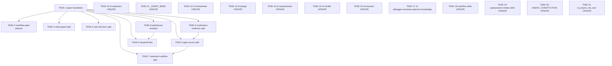

# Tasks — WI-007: SpecForge v1.1 Standard Alignment

> Work Item: WI-007
> Workflow: change_request
> Based on: design_delta.md (41 DDs), impact_analysis.md, intake.md

---

## Task Graph



## Parallel Batches

### Batch 1 — Types Foundation
- TASK-1

### Batch 2 — Code Module Splits (parallel after TASK-1)
- TASK-2
- TASK-4
- TASK-5
- TASK-6
- TASK-9

### Batch 3 — Code Module Splits (with cross-group deps)
- TASK-3 (depends on TASK-6)
- TASK-8 (depends on TASK-9)

### Batch 4 — Extension Split (depends on TASK-3)
- TASK-7

### Batch 5 — Agent Definitions (all parallel, no code deps)
- TASK-10
- TASK-11
- TASK-12
- TASK-13
- TASK-14
- TASK-15
- TASK-16
- TASK-17

### Batch 6 — Skill Updates (all parallel, no code deps)
- TASK-18
- TASK-19

### Batch 7 — Config & Project Structure
- TASK-20
- TASK-21

---

## Tasks

---

### TASK-1 Create schema.ts and constants.ts in packages/types

**task_id**: TASK-1
**refs**: [DD-A27, AC-1, AC-7]
**depends_on**: []
**parallel_safe**: true
**risk_level**: low

**context_block** (executor must read):
- **What**: Create two new files in `packages/types/src/`: `schema.ts` (JSON Schema definitions for Candidate, Delta, Gate, etc.) and `constants.ts` (version constants, status enums, path templates). Update `packages/types/src/index.ts` to re-export from both new files.
- **Why**: v1.1 standard requires centralized schema and constant definitions. Currently these are scattered in `work-item-types.ts`. This is the types foundation that all subsequent daemon-core module tasks depend on.
- **Where**:
  - read_files:
    - `packages/types/src/work-item-types.ts`
    - `packages/types/src/index.ts`
    - `packages/types/src/meta-schema.ts`
    - `packages/types/src/directory-layout.ts`
  - allowed_write_files:
    - `packages/types/src/schema.ts`
    - `packages/types/src/constants.ts`
    - `packages/types/src/index.ts`
  - forbidden_files:
    - `packages/types/src/work-item-types.ts`
    - `packages/daemon-core/**`
    - `.specforge/**`
- **Refs**:
  - requirements: [AC-1, AC-7]
  - design_decisions: [DD-A27]
  - interfaces: [schema exports, constants exports]
- **Constraints**:
  - Do not modify `work-item-types.ts` — new files extract/reorganize but original stays intact
  - `index.ts` must use explicit `export { ... } from` (not `export * from`) to avoid naming conflicts
  - New exports must not conflict with existing exports in index.ts
  - All types must pass TypeScript strict mode
- **Implementation Notes**:
  - Read `work-item-types.ts` to identify Zod schemas (e.g., `WorkItemJsonSchema`, `CandidateManifestSchema`) that belong in `schema.ts`
  - Read `work-item-types.ts` to identify constants (e.g., `WI_STATUSES`, `WORKFLOW_PATHS`, `SCHEMA_VERSION`) that belong in `constants.ts`
  - In `index.ts`, add explicit named re-exports for the new files
  - Verify that downstream packages still compile
- **Done When**:
  - `packages/types/src/schema.ts` exists and exports schema definitions
  - `packages/types/src/constants.ts` exists and exports constant values
  - `packages/types/src/index.ts` re-exports from both new files
  - `npx tsc --noEmit` passes for packages/types

**allowed_operations**:
- read
- edit_allowed_files_only
- run_verification_commands

**forbidden_operations**:
- modify_requirements
- modify_design
- modify_tasks
- install_dependency_without_task_contract
- change_environment
- restart_service
- touch_unlisted_files

**expected_file_changes**:
- `packages/types/src/schema.ts`
- `packages/types/src/constants.ts`
- `packages/types/src/index.ts`

**verification_commands**:
```bash
cd packages/types && npx tsc --noEmit
```
```bash
pwsh -c "Test-Path 'packages/types/src/schema.ts'"
```
```bash
pwsh -c "Test-Path 'packages/types/src/constants.ts'"
```
```bash
pwsh -c "Select-String -Path 'packages/types/src/index.ts' -Pattern 'schema'"
```
```bash
pwsh -c "Select-String -Path 'packages/types/src/index.ts' -Pattern 'constants'"
```

**verification_evidence_expected**:
- `npx tsc --noEmit` in packages/types exits with code 0, showing zero TypeScript errors
- `Test-Path` returns True for both new .ts files
- `Select-String` finds 'schema' and 'constants' import/export lines in index.ts

**rollback_note**:
- Delete `packages/types/src/schema.ts` and `packages/types/src/constants.ts`
- Revert `packages/types/src/index.ts` to original content

**out_of_scope**:
- Modifying work-item-types.ts
- Changes to packages/daemon-core
- Adding new Zod schemas not already in work-item-types.ts

---

### TASK-2 Extract change-classification.ts, impact-analysis.ts, trigger-result.ts from workflow-path-selector-v11.ts

**task_id**: TASK-2
**refs**: [DD-A1, DD-A2, DD-A3, AC-1, AC-2]
**depends_on**: [TASK-1]
**parallel_safe**: true
**risk_level**: low

**context_block** (executor must read):
- **What**: Extract three modules from `workflow-path-selector-v11.ts` (167 lines): `change-classification.ts` (ChangeClassification interface + canUseCodeOnlyFastPath function), `impact-analysis.ts` (selectWorkflowPath + generateTriggerResult functions), `trigger-result.ts` (MatchResultType + TriggerResult types). Add re-export lines to the source file.
- **Why**: v1.1 standard §6.2 and §6.3 require these as independent modules. Currently merged into one 167-line file. Extraction preserves all existing behavior via re-export.
- **Where**:
  - read_files:
    - `packages/daemon-core/src/tools/lib/workflow-path-selector-v11.ts`
  - allowed_write_files:
    - `packages/daemon-core/src/tools/lib/change-classification.ts`
    - `packages/daemon-core/src/tools/lib/impact-analysis.ts`
    - `packages/daemon-core/src/tools/lib/trigger-result.ts`
    - `packages/daemon-core/src/tools/lib/workflow-path-selector-v11.ts`
  - forbidden_files:
    - `packages/types/**`
    - `.specforge/**`
    - `packages/daemon-core/src/tools/handlers/**`
    - `packages/daemon-core/tests/**`
- **Refs**:
  - requirements: [AC-1, AC-2]
  - design_decisions: [DD-A1, DD-A2, DD-A3]
  - interfaces: [ChangeClassification, canUseCodeOnlyFastPath, selectWorkflowPath, generateTriggerResult, MatchResultType, TriggerResult]
- **Constraints**:
  - New modules must NOT import back from workflow-path-selector-v11.ts (单向依赖)
  - impact-analysis.ts may import from change-classification.ts and trigger-result.ts
  - workflow-path-selector-v11.ts adds `export * from './change-classification.js'`, `export * from './impact-analysis.js'`, `export * from './trigger-result.js'`
  - Existing test imports must still resolve (re-export guarantees this)
  - All existing exports from workflow-path-selector-v11.ts must remain accessible
- **Implementation Notes**:
  - Read the source file to identify the exact line ranges for each export
  - Create each new file with the extracted types/functions
  - Add import statements in new files if they reference each other (e.g., impact-analysis imports ChangeClassification from change-classification)
  - Add three `export * from` lines to workflow-path-selector-v11.ts
  - Keep §6.4 workflow_path enum, §6.5 path priority, §6.6 unknown upgrade rules, §6.7 code-only constraints in the original file
- **Done When**:
  - All three new .ts files exist with proper exports
  - workflow-path-selector-v11.ts has re-export lines
  - `npx tsc --noEmit` passes in packages/daemon-core

**allowed_operations**:
- read
- edit_allowed_files_only
- run_verification_commands

**forbidden_operations**:
- modify_requirements
- modify_design
- modify_tasks
- install_dependency_without_task_contract
- change_environment
- restart_service
- touch_unlisted_files

**expected_file_changes**:
- `packages/daemon-core/src/tools/lib/change-classification.ts`
- `packages/daemon-core/src/tools/lib/impact-analysis.ts`
- `packages/daemon-core/src/tools/lib/trigger-result.ts`
- `packages/daemon-core/src/tools/lib/workflow-path-selector-v11.ts`

**verification_commands**:
```bash
cd packages/daemon-core && npx tsc --noEmit
```
```bash
pwsh -c "Test-Path 'packages/daemon-core/src/tools/lib/change-classification.ts'"
```
```bash
pwsh -c "Test-Path 'packages/daemon-core/src/tools/lib/impact-analysis.ts'"
```
```bash
pwsh -c "Test-Path 'packages/daemon-core/src/tools/lib/trigger-result.ts'"
```
```bash
pwsh -c "Select-String -Path 'packages/daemon-core/src/tools/lib/workflow-path-selector-v11.ts' -Pattern 'export.*from.*./change-classification'"
```

**verification_evidence_expected**:
- `npx tsc --noEmit` exits with code 0 — zero TypeScript compilation errors
- All three new files exist (Test-Path returns True)
- workflow-path-selector-v11.ts contains re-export lines for all three modules

**rollback_note**:
- Delete the three new .ts files
- Revert workflow-path-selector-v11.ts to remove added re-export lines

**out_of_scope**:
- Changing classification logic or workflow path selection behavior
- Modifying test files or handler files
- Changes to gate-runner or other -v11.ts files

---

### TASK-3 Extract gate-report.ts, gate-summary.ts, gate-chain.ts, required-gates.ts, close-gate.ts from gate-runner-v11.ts and verification-evidence-v11.ts

**task_id**: TASK-3
**refs**: [DD-A4, DD-A5, DD-A6, DD-A18, DD-A23, AC-1, AC-2]
**depends_on**: [TASK-1, TASK-6]
**parallel_safe**: false
**risk_level**: medium

**context_block** (executor must read):
- **What**: Extract five gate-domain modules: `gate-report.ts` (GateReportCheck, GateReportV11, GateContext, GateCheckFn, runGate, makeSkippedReport, makeReport — from gate-runner-v11.ts), `gate-summary.ts` (GateSummaryStatus, generateGateSummaryMd — from gate-runner-v11.ts), `gate-chain.ts` (GateMeta, gateRegistry, registerGate, runRequiredGates — from gate-runner-v11.ts), `required-gates.ts` (getRequiredGates, getGateStrictness — standalone new), `close-gate.ts` (CloseGateResult, runCloseGate — from verification-evidence-v11.ts). Add re-export lines to both source files.
- **Why**: v1.1 standard §9.1-§9.6 and §15 require these as independent modules. gate-runner-v11.ts is the largest file (910 lines) and must be split by §9 sub-sections. close-gate.ts is grouped here for gate-domain cohesion but actually extracts from verification-evidence-v11.ts (created in TASK-6).
- **Where**:
  - read_files:
    - `packages/daemon-core/src/tools/lib/gate-runner-v11.ts`
    - `packages/daemon-core/src/tools/lib/verification-evidence-v11.ts`
    - `packages/daemon-core/src/tools/handlers/sf-v11-gate-run.ts`
  - allowed_write_files:
    - `packages/daemon-core/src/tools/lib/gate-report.ts`
    - `packages/daemon-core/src/tools/lib/gate-summary.ts`
    - `packages/daemon-core/src/tools/lib/gate-chain.ts`
    - `packages/daemon-core/src/tools/lib/required-gates.ts`
    - `packages/daemon-core/src/tools/lib/close-gate.ts`
    - `packages/daemon-core/src/tools/lib/gate-runner-v11.ts`
    - `packages/daemon-core/src/tools/lib/verification-evidence-v11.ts`
  - forbidden_files:
    - `packages/types/**`
    - `.specforge/**`
    - `packages/daemon-core/tests/**`
- **Refs**:
  - requirements: [AC-1, AC-2]
  - design_decisions: [DD-A4, DD-A5, DD-A6, DD-A18, DD-A23]
  - interfaces: [GateReportCheck, GateReportV11, GateContext, GateCheckFn, runGate, makeReport, GateSummaryStatus, generateGateSummaryMd, GateMeta, registerGate, runRequiredGates, getRequiredGates, getGateStrictness, CloseGateResult, runCloseGate]
- **Constraints**:
  - Sequential extraction order: gate-report first (no deps), gate-summary (no deps), gate-chain (imports from gate-report + gate-summary), required-gates (standalone), close-gate (imports from gate-report + evidence-manifest from TASK-6)
  - gate-runner-v11.ts retains §9.2 GateIdV11 enum, §9.3 hard_gate/soft_gate classification, core entry point
  - gate-runner-v11.ts adds `export * from` for gate-report, gate-summary, gate-chain, required-gates, close-gate
  - verification-evidence-v11.ts adds `export * from './close-gate.js'`
  - close-gate.ts imports GateReportV11 from gate-report.ts and EvidenceManifest from evidence-manifest.ts (created in TASK-6)
  - **HIGHEST RISK TASK**: gate-runner-v11.ts is 910 lines. Must verify re-export completeness
- **Implementation Notes**:
  - Extract gate-report first — it has the most interfaces (GateReportCheck, GateReportV11, GateContext, GateCheckFn, runGate, makeSkippedReport, makeReport)
  - Extract gate-summary — GateSummaryStatus type + generateGateSummaryMd function
  - Extract gate-chain — GateMeta, gateRegistry Map, registerGate, runRequiredGates. This module imports from gate-report and gate-summary
  - Create required-gates — standalone module defining which gates each workflow_path requires
  - Extract close-gate — from verification-evidence-v11.ts. Imports from gate-report.ts and evidence-manifest.ts
  - Verify handler sf-v11-gate-run.ts import paths still work via re-export
- **Done When**:
  - All five new .ts files exist with proper exports
  - gate-runner-v11.ts has re-export lines for gate-report, gate-summary, gate-chain, required-gates
  - verification-evidence-v11.ts has re-export line for close-gate
  - `npx tsc --noEmit` passes and all v1.1 tests pass

**allowed_operations**:
- read
- edit_allowed_files_only
- run_verification_commands

**forbidden_operations**:
- modify_requirements
- modify_design
- modify_tasks
- install_dependency_without_task_contract
- change_environment
- restart_service
- touch_unlisted_files

**expected_file_changes**:
- `packages/daemon-core/src/tools/lib/gate-report.ts`
- `packages/daemon-core/src/tools/lib/gate-summary.ts`
- `packages/daemon-core/src/tools/lib/gate-chain.ts`
- `packages/daemon-core/src/tools/lib/required-gates.ts`
- `packages/daemon-core/src/tools/lib/close-gate.ts`
- `packages/daemon-core/src/tools/lib/gate-runner-v11.ts`
- `packages/daemon-core/src/tools/lib/verification-evidence-v11.ts`

**verification_commands**:
```bash
cd packages/daemon-core && npx tsc --noEmit
```
```bash
cd packages/daemon-core && npx vitest run tests/v11-e2e-test.test.ts tests/v11-runtime-integration.test.ts
```
```bash
pwsh -c "Test-Path 'packages/daemon-core/src/tools/lib/gate-report.ts'"
```
```bash
pwsh -c "Test-Path 'packages/daemon-core/src/tools/lib/gate-chain.ts'"
```
```bash
pwsh -c "Select-String -Path 'packages/daemon-core/src/tools/lib/gate-runner-v11.ts' -Pattern 'export.*from.*./gate-report'"
```

**verification_evidence_expected**:
- `npx tsc --noEmit` exits with code 0 — zero TypeScript compilation errors
- `npx vitest run` shows all v1.1 tests passing
- All five new files exist (Test-Path returns True)
- gate-runner-v11.ts contains re-export lines for extracted modules

**rollback_note**:
- Delete all five new .ts files
- Revert gate-runner-v11.ts and verification-evidence-v11.ts to remove re-export lines
- This is the highest-risk task — if tests fail, revert immediately

**out_of_scope**:
- Changing gate check logic or gate behavior
- Modifying handler sf-v11-gate-run.ts import paths (optional optimization for later)
- Changes to test files

---

### TASK-4 Extract allowed-write-files.ts, write-policy.ts, command-write-audit.ts, changed-files-audit.ts, tool-wrapper.ts, bash-guard.ts from write-guard-v11.ts and code-permission-service-v11.ts

**task_id**: TASK-4
**refs**: [DD-A9, DD-A10, DD-A11, DD-A12, DD-A13, DD-A14, AC-1, AC-2]
**depends_on**: [TASK-1]
**parallel_safe**: true
**risk_level**: medium

**context_block** (executor must read):
- **What**: Extract/create six modules for write-guard domain: `allowed-write-files.ts` (AllowedWriteFile, validateAllowedWriteFiles — from code-permission-service-v11.ts), `write-policy.ts` (WritePolicyRule, evaluatePolicy — from write-guard-v11.ts), `command-write-audit.ts` (auditCommandWrite — from write-guard-v11.ts), `changed-files-audit.ts` (ChangedFilesAuditResult, runChangedFilesAudit — from write-guard-v11.ts), `tool-wrapper.ts` (ToolInvocation, wrapToolCall — standalone new), `bash-guard.ts` (BashGuardCheck, guardBashCommand — standalone new). Add re-export lines to source files.
- **Why**: v1.1 standard §12.3-§12.9 requires each write-guard concept as an independent module. Currently merged into write-guard-v11.ts (231 lines) and code-permission-service-v11.ts (103 lines).
- **Where**:
  - read_files:
    - `packages/daemon-core/src/tools/lib/write-guard-v11.ts`
    - `packages/daemon-core/src/tools/lib/code-permission-service-v11.ts`
    - `packages/daemon-core/src/tools/lib/agent-handoff-v11.ts`
  - allowed_write_files:
    - `packages/daemon-core/src/tools/lib/allowed-write-files.ts`
    - `packages/daemon-core/src/tools/lib/write-policy.ts`
    - `packages/daemon-core/src/tools/lib/command-write-audit.ts`
    - `packages/daemon-core/src/tools/lib/changed-files-audit.ts`
    - `packages/daemon-core/src/tools/lib/tool-wrapper.ts`
    - `packages/daemon-core/src/tools/lib/bash-guard.ts`
    - `packages/daemon-core/src/tools/lib/write-guard-v11.ts`
    - `packages/daemon-core/src/tools/lib/code-permission-service-v11.ts`
  - forbidden_files:
    - `packages/types/**`
    - `.specforge/**`
    - `packages/daemon-core/tests/**`
    - `packages/daemon-core/src/tools/handlers/**`
- **Refs**:
  - requirements: [AC-1, AC-2]
  - design_decisions: [DD-A9, DD-A10, DD-A11, DD-A12, DD-A13, DD-A14]
  - interfaces: [AllowedWriteFile, validateAllowedWriteFiles, WritePolicyRule, evaluatePolicy, auditCommandWrite, ChangedFilesAuditResult, runChangedFilesAudit, ToolInvocation, wrapToolCall, BashGuardCheck, guardBashCommand]
- **Constraints**:
  - allowed-write-files.ts extracts from code-permission-service-v11.ts (not write-guard-v11.ts)
  - write-policy.ts, command-write-audit.ts, changed-files-audit.ts extract from write-guard-v11.ts
  - tool-wrapper.ts and bash-guard.ts are standalone new modules
  - bash-guard.ts imports from write-policy.ts
  - command-write-audit.ts and changed-files-audit.ts import from write-policy.ts
  - Dependency direction: bash-guard → write-policy; command-write-audit → write-policy; changed-files-audit → write-policy
  - tool-wrapper.ts references write-guard-v11.ts concepts
  - Source files add re-export lines for extracted modules
- **Implementation Notes**:
  - Start with allowed-write-files.ts from code-permission-service-v11.ts
  - Then write-policy.ts from write-guard-v11.ts (other modules depend on it)
  - Then command-write-audit.ts and changed-files-audit.ts from write-guard-v11.ts
  - Then tool-wrapper.ts (standalone, wraps tool calls)
  - Then bash-guard.ts (standalone, imports from write-policy)
  - Add re-exports to both source files
- **Done When**:
  - All six new .ts files exist with proper exports
  - code-permission-service-v11.ts has re-export for allowed-write-files
  - write-guard-v11.ts has re-exports for write-policy, command-write-audit, changed-files-audit
  - `npx tsc --noEmit` passes

**allowed_operations**:
- read
- edit_allowed_files_only
- run_verification_commands

**forbidden_operations**:
- modify_requirements
- modify_design
- modify_tasks
- install_dependency_without_task_contract
- change_environment
- restart_service
- touch_unlisted_files

**expected_file_changes**:
- `packages/daemon-core/src/tools/lib/allowed-write-files.ts`
- `packages/daemon-core/src/tools/lib/write-policy.ts`
- `packages/daemon-core/src/tools/lib/command-write-audit.ts`
- `packages/daemon-core/src/tools/lib/changed-files-audit.ts`
- `packages/daemon-core/src/tools/lib/tool-wrapper.ts`
- `packages/daemon-core/src/tools/lib/bash-guard.ts`
- `packages/daemon-core/src/tools/lib/write-guard-v11.ts`
- `packages/daemon-core/src/tools/lib/code-permission-service-v11.ts`

**verification_commands**:
```bash
cd packages/daemon-core && npx tsc --noEmit
```
```bash
pwsh -c "Test-Path 'packages/daemon-core/src/tools/lib/allowed-write-files.ts'"
```
```bash
pwsh -c "Test-Path 'packages/daemon-core/src/tools/lib/bash-guard.ts'"
```
```bash
pwsh -c "Select-String -Path 'packages/daemon-core/src/tools/lib/write-guard-v11.ts' -Pattern 'export.*from.*./write-policy'"
```

**verification_evidence_expected**:
- `npx tsc --noEmit` exits with code 0
- All six new files exist (Test-Path returns True)
- write-guard-v11.ts and code-permission-service-v11.ts contain re-export lines

**rollback_note**:
- Delete all six new .ts files
- Revert write-guard-v11.ts and code-permission-service-v11.ts

**out_of_scope**:
- Changing write guard logic or permission behavior
- Modifying handler files
- Changes to test files

---

### TASK-5 Extract user-decision.ts and waiver.ts from user-decision-recorder-v11.ts

**task_id**: TASK-5
**refs**: [DD-A7, DD-A8, AC-1, AC-2]
**depends_on**: [TASK-1]
**parallel_safe**: true
**risk_level**: low

**context_block** (executor must read):
- **What**: Extract two modules from `user-decision-recorder-v11.ts` (191 lines): `user-decision.ts` (UserDecisionStatus type, UserDecisionV11 interface, Waiver sub-interfaces — §10.2-10.5) and `waiver.ts` (WaiverRecord, validateWaiver — §10.6). Add re-export lines to the source file.
- **Why**: v1.1 standard §10.3-10.6 requires user decision types and waiver logic as independent modules. waiver.ts depends on user-decision.ts (单向依赖).
- **Where**:
  - read_files:
    - `packages/daemon-core/src/tools/lib/user-decision-recorder-v11.ts`
  - allowed_write_files:
    - `packages/daemon-core/src/tools/lib/user-decision.ts`
    - `packages/daemon-core/src/tools/lib/waiver.ts`
    - `packages/daemon-core/src/tools/lib/user-decision-recorder-v11.ts`
  - forbidden_files:
    - `packages/types/**`
    - `.specforge/**`
    - `packages/daemon-core/tests/**`
    - `packages/daemon-core/src/tools/handlers/**`
- **Refs**:
  - requirements: [AC-1, AC-2]
  - design_decisions: [DD-A7, DD-A8]
  - interfaces: [UserDecisionStatus, UserDecisionV11, WaiverRecord, validateWaiver]
- **Constraints**:
  - waiver.ts imports from user-decision.ts (单向依赖)
  - user-decision-recorder-v11.ts adds `export * from './user-decision.js'` and `export * from './waiver.js'`
  - §10.6: soft_gate waiver requires reason, risk, expires_at, follow_up_wi; hard_gate waiver not allowed
  - If WaiverRecord and validateWaiver don't yet exist in the source file, create them as new implementations following §10.6 spec
- **Implementation Notes**:
  - Extract UserDecisionStatus type union (7 status strings) and UserDecisionV11 interface
  - Extract or create WaiverRecord interface and validateWaiver function
  - Add re-export lines to user-decision-recorder-v11.ts
- **Done When**:
  - Both new .ts files exist with proper exports
  - user-decision-recorder-v11.ts has re-export lines
  - `npx tsc --noEmit` passes

**allowed_operations**:
- read
- edit_allowed_files_only
- run_verification_commands

**forbidden_operations**:
- modify_requirements
- modify_design
- modify_tasks
- install_dependency_without_task_contract
- change_environment
- restart_service
- touch_unlisted_files

**expected_file_changes**:
- `packages/daemon-core/src/tools/lib/user-decision.ts`
- `packages/daemon-core/src/tools/lib/waiver.ts`
- `packages/daemon-core/src/tools/lib/user-decision-recorder-v11.ts`

**verification_commands**:
```bash
cd packages/daemon-core && npx tsc --noEmit
```
```bash
pwsh -c "Test-Path 'packages/daemon-core/src/tools/lib/user-decision.ts'"
```
```bash
pwsh -c "Test-Path 'packages/daemon-core/src/tools/lib/waiver.ts'"
```
```bash
pwsh -c "Select-String -Path 'packages/daemon-core/src/tools/lib/user-decision-recorder-v11.ts' -Pattern 'export.*from.*./user-decision'"
```

**verification_evidence_expected**:
- `npx tsc --noEmit` exits with code 0
- Both new files exist (Test-Path returns True)
- user-decision-recorder-v11.ts contains re-export lines

**rollback_note**:
- Delete both new .ts files
- Revert user-decision-recorder-v11.ts

**out_of_scope**:
- Changing decision recording logic
- Modifying handler sf-v11-decision.ts
- Changes to test files

---

### TASK-6 Extract verification-report.ts, evidence-manifest.ts, evidence.ts from verification-evidence-v11.ts

**task_id**: TASK-6
**refs**: [DD-A15, DD-A16, DD-A17, AC-1, AC-2]
**depends_on**: [TASK-1]
**parallel_safe**: true
**risk_level**: low

**context_block** (executor must read):
- **What**: Extract three modules from `verification-evidence-v11.ts` (310 lines): `verification-report.ts` (VerificationReport interface, validateVerificationReport — §13.3), `evidence-manifest.ts` (EvidenceManifest interface, validateEvidenceManifest — §13.4), `evidence.ts` (TraceEntry, TraceDelta interfaces — §13.1/13.5). Add re-export lines to the source file.
- **Why**: v1.1 standard §13.1-13.5 requires verification report, evidence manifest, and evidence core types as independent modules. close-gate.ts (TASK-3) depends on evidence-manifest.ts from this task.
- **Where**:
  - read_files:
    - `packages/daemon-core/src/tools/lib/verification-evidence-v11.ts`
    - `packages/daemon-core/src/tools/handlers/sf-v11-verification.ts`
  - allowed_write_files:
    - `packages/daemon-core/src/tools/lib/verification-report.ts`
    - `packages/daemon-core/src/tools/lib/evidence-manifest.ts`
    - `packages/daemon-core/src/tools/lib/evidence.ts`
    - `packages/daemon-core/src/tools/lib/verification-evidence-v11.ts`
  - forbidden_files:
    - `packages/types/**`
    - `.specforge/**`
    - `packages/daemon-core/tests/**`
    - `packages/daemon-core/src/tools/handlers/**`
- **Refs**:
  - requirements: [AC-1, AC-2]
  - design_decisions: [DD-A15, DD-A16, DD-A17]
  - interfaces: [VerificationReport, validateVerificationReport, EvidenceManifest, validateEvidenceManifest, TraceEntry, TraceDelta]
- **Constraints**:
  - New modules must not import back from verification-evidence-v11.ts
  - verification-evidence-v11.ts adds `export * from` for all three new modules
  - evidence.ts contains TraceEntry and TraceDelta — the core trace types used across v1.1
  - If types don't exist in source, create them per §13 spec
- **Implementation Notes**:
  - Extract VerificationReport interface and validateVerificationReport function
  - Extract EvidenceManifest interface and validateEvidenceManifest function
  - Extract TraceEntry and TraceDelta interfaces (evidence core types)
  - Add re-export lines to verification-evidence-v11.ts
- **Done When**:
  - All three new .ts files exist with proper exports
  - verification-evidence-v11.ts has re-export lines
  - `npx tsc --noEmit` passes

**allowed_operations**:
- read
- edit_allowed_files_only
- run_verification_commands

**forbidden_operations**:
- modify_requirements
- modify_design
- modify_tasks
- install_dependency_without_task_contract
- change_environment
- restart_service
- touch_unlisted_files

**expected_file_changes**:
- `packages/daemon-core/src/tools/lib/verification-report.ts`
- `packages/daemon-core/src/tools/lib/evidence-manifest.ts`
- `packages/daemon-core/src/tools/lib/evidence.ts`
- `packages/daemon-core/src/tools/lib/verification-evidence-v11.ts`

**verification_commands**:
```bash
cd packages/daemon-core && npx tsc --noEmit
```
```bash
pwsh -c "Test-Path 'packages/daemon-core/src/tools/lib/verification-report.ts'"
```
```bash
pwsh -c "Test-Path 'packages/daemon-core/src/tools/lib/evidence-manifest.ts'"
```
```bash
pwsh -c "Test-Path 'packages/daemon-core/src/tools/lib/evidence.ts'"
```
```bash
pwsh -c "Select-String -Path 'packages/daemon-core/src/tools/lib/verification-evidence-v11.ts' -Pattern 'export.*from.*./evidence-manifest'"
```

**verification_evidence_expected**:
- `npx tsc --noEmit` exits with code 0
- All three new files exist (Test-Path returns True)
- verification-evidence-v11.ts contains re-export lines for all three modules

**rollback_note**:
- Delete all three new .ts files
- Revert verification-evidence-v11.ts

**out_of_scope**:
- close-gate.ts extraction (done in TASK-3)
- Changing verification logic
- Modifying handler sf-v11-verification.ts
- Changes to test files

---

### TASK-7 Extract extension-registry.ts, extension-request.ts, extension-gate.ts from extension-subflow-v11.ts

**task_id**: TASK-7
**refs**: [DD-A19, DD-A20, DD-A21, AC-1, AC-3]
**depends_on**: [TASK-1, TASK-3]
**parallel_safe**: false
**risk_level**: low

**context_block** (executor must read):
- **What**: Extract three modules from `extension-subflow-v11.ts` (377 lines): `extension-registry.ts` (ExtensionRegistry interface, validateExtensionRegistry — Patch1 §1-§5), `extension-request.ts` (ExtensionRequest interface, writeExtensionRequest — Patch1 §6-§7), `extension-gate.ts` (runExtensionGate — Patch1 §12). Add re-export lines to the source file.
- **Why**: v1.1 Patch1 §6 requires extension subflow concepts as independent modules. extension-gate.ts imports from gate-report.ts (created in TASK-3) and extension-request.ts + extension-registry.ts.
- **Where**:
  - read_files:
    - `packages/daemon-core/src/tools/lib/extension-subflow-v11.ts`
    - `packages/daemon-core/src/tools/handlers/sf-v11-extension.ts`
  - allowed_write_files:
    - `packages/daemon-core/src/tools/lib/extension-registry.ts`
    - `packages/daemon-core/src/tools/lib/extension-request.ts`
    - `packages/daemon-core/src/tools/lib/extension-gate.ts`
    - `packages/daemon-core/src/tools/lib/extension-subflow-v11.ts`
  - forbidden_files:
    - `packages/types/**`
    - `.specforge/**`
    - `packages/daemon-core/tests/**`
    - `packages/daemon-core/src/tools/handlers/**`
- **Refs**:
  - requirements: [AC-1, AC-3]
  - design_decisions: [DD-A19, DD-A20, DD-A21]
  - interfaces: [ExtensionRegistry, validateExtensionRegistry, ExtensionRequest, writeExtensionRequest, runExtensionGate]
- **Constraints**:
  - extension-gate.ts imports GateReportV11 from gate-report.ts (TASK-3)
  - extension-gate.ts imports types from extension-request.ts and extension-registry.ts
  - Dependency direction: extension-gate → extension-request + extension-registry + gate-report (单向)
  - extension-subflow-v11.ts adds re-export lines for all three modules
  - If types don't exist in source, create per Patch1 spec
- **Implementation Notes**:
  - Extract extension-registry.ts first (no internal deps)
  - Extract extension-request.ts next (no internal deps)
  - Extract extension-gate.ts last (imports from both above + gate-report)
  - Add re-export lines to extension-subflow-v11.ts
- **Done When**:
  - All three new .ts files exist with proper exports
  - extension-subflow-v11.ts has re-export lines
  - `npx tsc --noEmit` passes

**allowed_operations**:
- read
- edit_allowed_files_only
- run_verification_commands

**forbidden_operations**:
- modify_requirements
- modify_design
- modify_tasks
- install_dependency_without_task_contract
- change_environment
- restart_service
- touch_unlisted_files

**expected_file_changes**:
- `packages/daemon-core/src/tools/lib/extension-registry.ts`
- `packages/daemon-core/src/tools/lib/extension-request.ts`
- `packages/daemon-core/src/tools/lib/extension-gate.ts`
- `packages/daemon-core/src/tools/lib/extension-subflow-v11.ts`

**verification_commands**:
```bash
cd packages/daemon-core && npx tsc --noEmit
```
```bash
pwsh -c "Test-Path 'packages/daemon-core/src/tools/lib/extension-registry.ts'"
```
```bash
pwsh -c "Test-Path 'packages/daemon-core/src/tools/lib/extension-gate.ts'"
```
```bash
pwsh -c "Select-String -Path 'packages/daemon-core/src/tools/lib/extension-subflow-v11.ts' -Pattern 'export.*from.*./extension-registry'"
```

**verification_evidence_expected**:
- `npx tsc --noEmit` exits with code 0
- All three new files exist (Test-Path returns True)
- extension-subflow-v11.ts contains re-export lines

**rollback_note**:
- Delete all three new .ts files
- Revert extension-subflow-v11.ts

**out_of_scope**:
- Changing extension subflow logic
- Modifying handler sf-v11-extension.ts
- Changes to test files

---

### TASK-8 Create required-files.ts standalone module

**task_id**: TASK-8
**refs**: [DD-A22, AC-1]
**depends_on**: [TASK-1, TASK-9]
**parallel_safe**: false
**risk_level**: low

**context_block** (executor must read):
- **What**: Create standalone `required-files.ts` module with `getRequiredFiles(workflowPath)` returning the list of required file paths for a given workflow, and `validateRequiredFiles(workItemDir, workflowPath)` checking that all required files exist.
- **Why**: v1.1 standard §4.3 lists all WI closure files. §8.2 requires Candidate file validation. This module provides the required files list per workflow_path. It imports PROJECT_SPEC_FILES and WI_REQUIRED_FILES from project-layout.ts (TASK-9).
- **Where**:
  - read_files:
    - `packages/daemon-core/src/tools/lib/workflow-path-selector-v11.ts`
    - `packages/daemon-core/src/tools/lib/project-layout.ts`
    - `packages/daemon-core/src/tools/lib/work-item-lifecycle-v11.ts`
  - allowed_write_files:
    - `packages/daemon-core/src/tools/lib/required-files.ts`
  - forbidden_files:
    - `packages/types/**`
    - `.specforge/**`
    - `packages/daemon-core/tests/**`
    - `packages/daemon-core/src/tools/handlers/**`
    - `packages/daemon-core/src/tools/lib/work-item-lifecycle-v11.ts`
- **Refs**:
  - requirements: [AC-1]
  - design_decisions: [DD-A22]
  - interfaces: [getRequiredFiles, validateRequiredFiles]
- **Constraints**:
  - Imports WorkflowPath type from workflow-path-selector-v11.ts
  - Imports layout constants from project-layout.ts (TASK-9 must complete first)
  - Different workflow_paths may mark some files as not_applicable
  - Pure functions — no file system side effects in getRequiredFiles
- **Implementation Notes**:
  - Define a mapping from WorkflowPath values to required file lists
  - getRequiredFiles returns string[] of relative file paths
  - validateRequiredFiles checks file existence using fs.access or similar
- **Done When**:
  - required-files.ts exists with getRequiredFiles and validateRequiredFiles exports
  - `npx tsc --noEmit` passes

**allowed_operations**:
- read
- edit_allowed_files_only
- run_verification_commands

**forbidden_operations**:
- modify_requirements
- modify_design
- modify_tasks
- install_dependency_without_task_contract
- change_environment
- restart_service
- touch_unlisted_files

**expected_file_changes**:
- `packages/daemon-core/src/tools/lib/required-files.ts`

**verification_commands**:
```bash
cd packages/daemon-core && npx tsc --noEmit
```
```bash
pwsh -c "Test-Path 'packages/daemon-core/src/tools/lib/required-files.ts'"
```
```bash
pwsh -c "Select-String -Path 'packages/daemon-core/src/tools/lib/required-files.ts' -Pattern 'getRequiredFiles'"
```

**verification_evidence_expected**:
- `npx tsc --noEmit` exits with code 0
- required-files.ts exists (Test-Path returns True)
- File contains `getRequiredFiles` export

**rollback_note**:
- Delete required-files.ts

**out_of_scope**:
- Modifying work-item-lifecycle-v11.ts to call required-files (separate concern)
- Changing workflow path definitions

---

### TASK-9 Create path-service.ts, path-policy.ts, project-layout.ts standalone modules

**task_id**: TASK-9
**refs**: [DD-A24, DD-A25, DD-A26, AC-1]
**depends_on**: [TASK-1]
**parallel_safe**: true
**risk_level**: low

**context_block** (executor must read):
- **What**: Create three standalone modules: `path-service.ts` (PathService object + resolveWIPath — §1.5 path construction), `path-policy.ts` (enforcePathPolicy — §1.6 path validation with 7 rules), `project-layout.ts` (PROJECT_SPEC_FILES, WI_REQUIRED_FILES, MVP_FORBIDDEN_DIRS constants — §1-§2).
- **Why**: v1.1 standard §1.5-§1.6 and §1-§2 require centralized path services and layout constants. Currently scattered across multiple modules. path-policy.ts imports from @specforge/types. TASK-8 (required-files.ts) depends on project-layout.ts.
- **Where**:
  - read_files:
    - `packages/types/src/directory-layout.ts`
    - `packages/types/src/index.ts`
    - `packages/daemon-core/src/tools/lib/state-machine-v11.ts`
  - allowed_write_files:
    - `packages/daemon-core/src/tools/lib/path-service.ts`
    - `packages/daemon-core/src/tools/lib/path-policy.ts`
    - `packages/daemon-core/src/tools/lib/project-layout.ts`
  - forbidden_files:
    - `packages/types/**`
    - `.specforge/**`
    - `packages/daemon-core/tests/**`
    - `packages/daemon-core/src/tools/handlers/**`
- **Refs**:
  - requirements: [AC-1]
  - design_decisions: [DD-A24, DD-A25, DD-A26]
  - interfaces: [PathService, resolveWIPath, enforcePathPolicy, PROJECT_SPEC_FILES, WI_REQUIRED_FILES, MVP_FORBIDDEN_DIRS]
- **Constraints**:
  - path-service.ts imports from @specforge/types (directory-layout)
  - path-policy.ts imports validatePathPolicy from @specforge/types and provides runtime enforcement
  - project-layout.ts defines constants only — no imports from other daemon-core modules
  - §1.6 lists 7 path rules: POSIX style, no absolute paths, no `..`, no `~`, no `\`, must have `.specforge/` prefix
  - §1.3 lists MVP forbidden dirs: standards/, archive/, state/, gates/, reports/, snapshots/
- **Implementation Notes**:
  - Create project-layout.ts first (constants only, no deps on other new modules)
  - Create path-service.ts (imports from @specforge/types)
  - Create path-policy.ts (imports from @specforge/types)
- **Done When**:
  - All three new .ts files exist with proper exports
  - `npx tsc --noEmit` passes

**allowed_operations**:
- read
- edit_allowed_files_only
- run_verification_commands

**forbidden_operations**:
- modify_requirements
- modify_design
- modify_tasks
- install_dependency_without_task_contract
- change_environment
- restart_service
- touch_unlisted_files

**expected_file_changes**:
- `packages/daemon-core/src/tools/lib/path-service.ts`
- `packages/daemon-core/src/tools/lib/path-policy.ts`
- `packages/daemon-core/src/tools/lib/project-layout.ts`

**verification_commands**:
```bash
cd packages/daemon-core && npx tsc --noEmit
```
```bash
pwsh -c "Test-Path 'packages/daemon-core/src/tools/lib/path-service.ts'"
```
```bash
pwsh -c "Test-Path 'packages/daemon-core/src/tools/lib/path-policy.ts'"
```
```bash
pwsh -c "Test-Path 'packages/daemon-core/src/tools/lib/project-layout.ts'"
```
```bash
pwsh -c "Select-String -Path 'packages/daemon-core/src/tools/lib/project-layout.ts' -Pattern 'PROJECT_SPEC_FILES'"
```

**verification_evidence_expected**:
- `npx tsc --noEmit` exits with code 0
- All three new files exist (Test-Path returns True)
- project-layout.ts contains PROJECT_SPEC_FILES constant

**rollback_note**:
- Delete all three new .ts files

**out_of_scope**:
- Modifying state-machine-v11.ts
- Changes to @specforge/types

---

### TASK-10 Create sf-extension.md Agent definition

**task_id**: TASK-10
**refs**: [DD-B11, AC-3, AC-4]
**depends_on**: []
**parallel_safe**: true
**risk_level**: low

**context_block** (executor must read):
- **What**: Create new file `setup/userlevel-opencode/agents/sf-extension.md` defining the Extension Subflow Executor agent per Patch1 §9. Must include: Agent identity, responsibilities list, prohibited actions, Extension Delta format (8 required sections per Patch1 §10), Extension Candidate requirements (Patch1 §11), Extension Gate checks (10 items per Patch1 §12), Extension Merge flow (Patch1 §14), main flow recovery (Patch1 §15).
- **Why**: Patch1 requires a dedicated sf-extension agent that handles extension_request.json → extension_delta → extension_candidate → manifest update flow. Currently no agent definition exists.
- **Where**:
  - read_files:
    - `setup/userlevel-opencode/agents/_AGENT_BASE.md`
    - `setup/userlevel-opencode/agents/sf-orchestrator.md`
  - allowed_write_files:
    - `setup/userlevel-opencode/agents/sf-extension.md`
  - forbidden_files:
    - `packages/**`
    - `.specforge/**`
    - `setup/userlevel-opencode/agents/sf-orchestrator.md`
- **Refs**:
  - requirements: [AC-3, AC-4]
  - design_decisions: [DD-B11]
  - interfaces: []
- **Constraints**:
  - Follow the format of existing agent MD files (read _AGENT_BASE.md and sf-orchestrator.md for structure reference)
  - Must include all Patch1 §9 sections: identity, responsibilities, prohibitions
  - Agent must NOT directly write official extension_registry
  - Agent must NOT advance WI state, release code_permission, or close WI
  - Use consistent terminology with other agent definitions
- **Implementation Notes**:
  - Model structure after sf-orchestrator.md (most complex existing agent)
  - Include Patch1 §10 (Extension Delta 8 sections), §11 (Candidate requirements), §12 (10 Gate checks), §14 (Merge flow), §15 (Flow recovery)
- **Done When**:
  - sf-extension.md exists with all required sections
  - File follows agent MD format conventions

**allowed_operations**:
- read
- edit_allowed_files_only
- run_verification_commands

**forbidden_operations**:
- modify_requirements
- modify_design
- modify_tasks
- install_dependency_without_task_contract
- change_environment
- restart_service
- touch_unlisted_files

**expected_file_changes**:
- `setup/userlevel-opencode/agents/sf-extension.md`

**verification_commands**:
```bash
pwsh -c "Test-Path 'setup/userlevel-opencode/agents/sf-extension.md'"
```
```bash
pwsh -c "Select-String -Path 'setup/userlevel-opencode/agents/sf-extension.md' -Pattern 'Extension Subflow'"
```
```bash
pwsh -c "Select-String -Path 'setup/userlevel-opencode/agents/sf-extension.md' -Pattern 'extension_request'"
```
```bash
pwsh -c "Select-String -Path 'setup/userlevel-opencode/agents/sf-extension.md' -Pattern 'prohibit'"
```

**verification_evidence_expected**:
- sf-extension.md exists (Test-Path returns True)
- File contains 'Extension Subflow' identity section
- File references 'extension_request' workflow
- File contains prohibition rules

**rollback_note**:
- Delete sf-extension.md

**out_of_scope**:
- Runtime code for sf-extension (already in extension-subflow-v11.ts)
- Modifying other agent definition files

---

### TASK-11 Update _AGENT_BASE.md with v1.1 concepts

**task_id**: TASK-11
**refs**: [DD-B1, AC-4]
**depends_on**: []
**parallel_safe**: true
**risk_level**: low

**context_block** (executor must read):
- **What**: Append v1.1 concept sections to `_AGENT_BASE.md`: Candidate (§8.2), Delta (§8.1), Gate (§9.1), Trace (§13.1), Evidence (§13.4), Extension (Patch1 §5), Agent prohibitions (§14.2 — 9 rules), Agent handoff format (§14.3).
- **Why**: All agents inherit from _AGENT_BASE.md. v1.1 concepts must be defined here so every agent understands Candidate/Delta/Gate/Trace/Evidence/Extension terminology and the §14.2 prohibition list.
- **Where**:
  - read_files:
    - `setup/userlevel-opencode/agents/_AGENT_BASE.md`
  - allowed_write_files:
    - `setup/userlevel-opencode/agents/_AGENT_BASE.md`
  - forbidden_files:
    - `packages/**`
    - `.specforge/**`
- **Refs**:
  - requirements: [AC-4]
  - design_decisions: [DD-B1]
  - interfaces: []
- **Constraints**:
  - Append-only — do NOT delete or modify existing content
  - Each concept must reference the specific standard chapter
  - §14.2 lists 9 prohibition rules for ordinary agents
  - §14.3 defines minimum handoff content: Inputs/Outputs/Findings/Unknowns/Escalation
- **Implementation Notes**:
  - Add a new top-level section "## v1.1 Standard Concepts" at the end of the file
  - Sub-sections for each concept with standard chapter reference
  - Include §14.2 prohibition table
  - Include §14.3 handoff format template
- **Done When**:
  - _AGENT_BASE.md contains sections for Candidate, Delta, Gate, Trace, Evidence, Extension concepts
  - _AGENT_BASE.md contains §14.2 prohibition rules
  - _AGENT_BASE.md contains §14.3 handoff format

**allowed_operations**:
- read
- edit_allowed_files_only
- run_verification_commands

**forbidden_operations**:
- modify_requirements
- modify_design
- modify_tasks
- install_dependency_without_task_contract
- change_environment
- restart_service
- touch_unlisted_files

**expected_file_changes**:
- `setup/userlevel-opencode/agents/_AGENT_BASE.md`

**verification_commands**:
```bash
pwsh -c "Select-String -Path 'setup/userlevel-opencode/agents/_AGENT_BASE.md' -Pattern 'Candidate'"
```
```bash
pwsh -c "Select-String -Path 'setup/userlevel-opencode/agents/_AGENT_BASE.md' -Pattern '§8.2|§9.1|§13.1|§13.4|§14.2'"
```
```bash
pwsh -c "Select-String -Path 'setup/userlevel-opencode/agents/_AGENT_BASE.md' -Pattern 'Extension'"
```

**verification_evidence_expected**:
- _AGENT_BASE.md contains 'Candidate' concept section
- _AGENT_BASE.md references standard chapters §8.2, §9.1, §13.1, §13.4, §14.2
- _AGENT_BASE.md contains 'Extension' concept section

**rollback_note**:
- Revert _AGENT_BASE.md to original content

**out_of_scope**:
- Agent-specific behavior changes
- Runtime code changes
- Other agent MD files

---

### TASK-12 Update sf-orchestrator.md with WI lifecycle and Extension Subflow

**task_id**: TASK-12
**refs**: [DD-B2, AC-4]
**depends_on**: []
**parallel_safe**: true
**risk_level**: low

**context_block** (executor must read):
- **What**: Append sections to `sf-orchestrator.md`: WI state machine push permissions (§5.3), state transition prohibition table (§5.2 — 12 rules), Extension Subflow dispatch (Patch1 §8), resume mechanism (§5.4 — 7 checks), close_gate responsibility (§15.1), main link (§22 — full User Request → WI → closed chain).
- **Why**: Orchestrator is the only agent that can advance WI state. Must understand §5.3 permissions, §5.2 transition prohibitions, Patch1 Extension dispatch, and §22 main link.
- **Where**:
  - read_files:
    - `setup/userlevel-opencode/agents/sf-orchestrator.md`
  - allowed_write_files:
    - `setup/userlevel-opencode/agents/sf-orchestrator.md`
  - forbidden_files:
    - `packages/**`
    - `.specforge/**`
- **Refs**:
  - requirements: [AC-4]
  - design_decisions: [DD-B2]
  - interfaces: []
- **Constraints**:
  - Append-only — do NOT delete or modify existing content
  - Each section must reference specific standard chapters
  - §5.2 has 12 explicit transition prohibition rules
  - Patch1 §8: orchestrator must block and dispatch sf-extension when extension_request.json detected
  - §22: complete link from User Request through WI lifecycle to closed

**allowed_operations**:
- read
- edit_allowed_files_only
- run_verification_commands

**forbidden_operations**:
- modify_requirements
- modify_design
- modify_tasks
- install_dependency_without_task_contract
- change_environment
- restart_service
- touch_unlisted_files

**expected_file_changes**:
- `setup/userlevel-opencode/agents/sf-orchestrator.md`

**verification_commands**:
```bash
pwsh -c "Select-String -Path 'setup/userlevel-opencode/agents/sf-orchestrator.md' -Pattern '§5.3|state machine'"
```
```bash
pwsh -c "Select-String -Path 'setup/userlevel-opencode/agents/sf-orchestrator.md' -Pattern 'Extension Subflow'"
```
```bash
pwsh -c "Select-String -Path 'setup/userlevel-opencode/agents/sf-orchestrator.md' -Pattern 'close_gate'"
```

**verification_evidence_expected**:
- sf-orchestrator.md contains state machine references with §5.3
- sf-orchestrator.md contains Extension Subflow dispatch section
- sf-orchestrator.md contains close_gate responsibility section

**rollback_note**:
- Revert sf-orchestrator.md to original content

**out_of_scope**:
- Other agent MD files
- Runtime code changes

---

### TASK-13 Update sf-design.md with Design Delta / Candidate / Gate

**task_id**: TASK-13
**refs**: [DD-B3, AC-4]
**depends_on**: []
**parallel_safe**: true
**risk_level**: low

**context_block** (executor must read):
- **What**: Append sections to `sf-design.md`: design_delta.md generation requirements (§8.1), Design Candidate generation (§8.2), Candidate path constraints (§8.2 — under WI candidates/ dir), Candidate hash calculation (§8.2 — must bind base_spec_version), Extension Subflow trigger (Patch1 §6), Gate self-check requirements (§9.1).
- **Why**: Design agent must understand Delta vs Candidate distinction, Candidate placement rules, hash calculation requirements, and when to trigger Extension Subflow.
- **Where**:
  - read_files:
    - `setup/userlevel-opencode/agents/sf-design.md`
  - allowed_write_files:
    - `setup/userlevel-opencode/agents/sf-design.md`
  - forbidden_files:
    - `packages/**`
    - `.specforge/**`
- **Refs**:
  - requirements: [AC-4]
  - design_decisions: [DD-B3]
  - interfaces: []
- **Constraints**:
  - Append-only
  - §8.1: Delta explains changes, is NOT the final write target
  - §8.2: Candidate must be a complete target file, placed under WI candidates/ dir
  - Patch1 §6: must stop and write extension_request.json when missing design type

**allowed_operations**:
- read
- edit_allowed_files_only
- run_verification_commands

**forbidden_operations**:
- modify_requirements
- modify_design
- modify_tasks
- install_dependency_without_task_contract
- change_environment
- restart_service
- touch_unlisted_files

**expected_file_changes**:
- `setup/userlevel-opencode/agents/sf-design.md`

**verification_commands**:
```bash
pwsh -c "Select-String -Path 'setup/userlevel-opencode/agents/sf-design.md' -Pattern 'design_delta'"
```
```bash
pwsh -c "Select-String -Path 'setup/userlevel-opencode/agents/sf-design.md' -Pattern 'Candidate'"
```
```bash
pwsh -c "Select-String -Path 'setup/userlevel-opencode/agents/sf-design.md' -Pattern '§8.2|§9.1'"
```

**verification_evidence_expected**:
- sf-design.md contains 'design_delta' generation section
- sf-design.md contains 'Candidate' generation requirements
- sf-design.md references standard chapters §8.2 and §9.1

**rollback_note**:
- Revert sf-design.md to original content

**out_of_scope**:
- Other agent MD files
- Runtime code changes

---

### TASK-14 Update sf-requirements.md with Requirements Delta / Candidate / Trace

**task_id**: TASK-14
**refs**: [DD-B4, AC-4]
**depends_on**: []
**parallel_safe**: true
**risk_level**: low

**context_block** (executor must read):
- **What**: Append sections to `sf-requirements.md`: requirements_delta.md generation (§8.1), Requirements Candidate generation (§8.2), Trace chain start (§13.1 — REQ→AC→DD→TASK→FILE→TEST→EVIDENCE), trace_delta.md generation (§13.2), Extension Subflow trigger (Patch1 §6).
- **Why**: Requirements agent must understand Delta generation, Candidate generation, and Trace chain initiation which starts at requirements phase.
- **Where**:
  - read_files:
    - `setup/userlevel-opencode/agents/sf-requirements.md`
  - allowed_write_files:
    - `setup/userlevel-opencode/agents/sf-requirements.md`
  - forbidden_files:
    - `packages/**`
    - `.specforge/**`
- **Refs**:
  - requirements: [AC-4]
  - design_decisions: [DD-B4]
  - interfaces: []
- **Constraints**:
  - Append-only
  - §13.1: Trace must span REQ→AC→DD→TASK→FILE→TEST→EVIDENCE
  - §13.2: Every WI must generate trace_delta.md even if Trace is unchanged
  - Patch1 §6: trigger extension when missing requirement type

**allowed_operations**:
- read
- edit_allowed_files_only
- run_verification_commands

**forbidden_operations**:
- modify_requirements
- modify_design
- modify_tasks
- install_dependency_without_task_contract
- change_environment
- restart_service
- touch_unlisted_files

**expected_file_changes**:
- `setup/userlevel-opencode/agents/sf-requirements.md`

**verification_commands**:
```bash
pwsh -c "Select-String -Path 'setup/userlevel-opencode/agents/sf-requirements.md' -Pattern 'requirements_delta'"
```
```bash
pwsh -c "Select-String -Path 'setup/userlevel-opencode/agents/sf-requirements.md' -Pattern 'Trace'"
```
```bash
pwsh -c "Select-String -Path 'setup/userlevel-opencode/agents/sf-requirements.md' -Pattern 'trace_delta'"
```

**verification_evidence_expected**:
- sf-requirements.md contains 'requirements_delta' section
- sf-requirements.md contains Trace chain section
- sf-requirements.md contains trace_delta generation requirement

**rollback_note**:
- Revert sf-requirements.md to original content

**out_of_scope**:
- Other agent MD files
- Runtime code changes

---

### TASK-15 Update sf-verifier.md with Verification Report / Evidence / Close Gate

**task_id**: TASK-15
**refs**: [DD-B5, AC-4]
**depends_on**: []
**parallel_safe**: true
**risk_level**: low

**context_block** (executor must read):
- **What**: Append sections to `sf-verifier.md`: verification_report.md requirements (§13.3 — must not just say "verified", must reference Evidence), evidence_manifest.json requirements (§13.4 — all evidence must be registered), verification_gate checklist (§13.5 — 6 items), close_gate checklist (§15.2 — 17 items), changed_files_audit integration (§12.7 — out-of-bounds writes must be blocked).
- **Why**: Verifier agent must understand the complete verification pipeline from report through evidence manifest to close gate.
- **Where**:
  - read_files:
    - `setup/userlevel-opencode/agents/sf-verifier.md`
  - allowed_write_files:
    - `setup/userlevel-opencode/agents/sf-verifier.md`
  - forbidden_files:
    - `packages/**`
    - `.specforge/**`
- **Refs**:
  - requirements: [AC-4]
  - design_decisions: [DD-B5]
  - interfaces: []
- **Constraints**:
  - Append-only
  - §13.3: verification report must reference concrete Evidence, not just "passed"
  - §13.5: 6 verification gate check items
  - §15.2: 17 close gate check items
  - §12.7: out-of-bounds writes must result in blocked status

**allowed_operations**:
- read
- edit_allowed_files_only
- run_verification_commands

**forbidden_operations**:
- modify_requirements
- modify_design
- modify_tasks
- install_dependency_without_task_contract
- change_environment
- restart_service
- touch_unlisted_files

**expected_file_changes**:
- `setup/userlevel-opencode/agents/sf-verifier.md`

**verification_commands**:
```bash
pwsh -c "Select-String -Path 'setup/userlevel-opencode/agents/sf-verifier.md' -Pattern 'verification_report'"
```
```bash
pwsh -c "Select-String -Path 'setup/userlevel-opencode/agents/sf-verifier.md' -Pattern 'evidence_manifest'"
```
```bash
pwsh -c "Select-String -Path 'setup/userlevel-opencode/agents/sf-verifier.md' -Pattern 'close_gate'"
```

**verification_evidence_expected**:
- sf-verifier.md contains verification_report requirements section
- sf-verifier.md contains evidence_manifest requirements section
- sf-verifier.md contains close_gate checklist section

**rollback_note**:
- Revert sf-verifier.md to original content

**out_of_scope**:
- Other agent MD files
- Runtime code changes

---

### TASK-16 Update sf-executor.md with code_permission / allowed_write_files / audit

**task_id**: TASK-16
**refs**: [DD-B6, AC-4]
**depends_on**: []
**parallel_safe**: true
**risk_level**: low

**context_block** (executor must read):
- **What**: Append sections to `sf-executor.md`: code_permission defaults (§12.1 — code_change_allowed=false, allowed_write_files=[]), allowed_write_files declaration (§12.4 — from tasks.md and impact_analysis), Write Guard compliance (§12.5 — must declare expected_write_files), change audit (§12.7 — must run changed_files_audit after implementation), out-of-bounds write consequences (§12.6 — must be blocked, cannot proceed to close).
- **Why**: Executor agent must understand write permission model and audit requirements to prevent unauthorized file modifications.
- **Where**:
  - read_files:
    - `setup/userlevel-opencode/agents/sf-executor.md`
  - allowed_write_files:
    - `setup/userlevel-opencode/agents/sf-executor.md`
  - forbidden_files:
    - `packages/**`
    - `.specforge/**`
- **Refs**:
  - requirements: [AC-4]
  - design_decisions: [DD-B6]
  - interfaces: []
- **Constraints**:
  - Append-only
  - §12.1: default code_change_allowed=false, allowed_write_files=[]
  - §12.5: every write entry must declare expected_write_files
  - §12.6: out-of-bounds writes result in blocked, no proceeding to close
  - §12.7: changed_files_audit mandatory after implementation

**allowed_operations**:
- read
- edit_allowed_files_only
- run_verification_commands

**forbidden_operations**:
- modify_requirements
- modify_design
- modify_tasks
- install_dependency_without_task_contract
- change_environment
- restart_service
- touch_unlisted_files

**expected_file_changes**:
- `setup/userlevel-opencode/agents/sf-executor.md`

**verification_commands**:
```bash
pwsh -c "Select-String -Path 'setup/userlevel-opencode/agents/sf-executor.md' -Pattern 'code_permission'"
```
```bash
pwsh -c "Select-String -Path 'setup/userlevel-opencode/agents/sf-executor.md' -Pattern 'allowed_write_files'"
```
```bash
pwsh -c "Select-String -Path 'setup/userlevel-opencode/agents/sf-executor.md' -Pattern 'changed_files_audit'"
```

**verification_evidence_expected**:
- sf-executor.md contains code_permission section
- sf-executor.md contains allowed_write_files declaration rules
- sf-executor.md contains changed_files_audit requirement

**rollback_note**:
- Revert sf-executor.md to original content

**out_of_scope**:
- Other agent MD files
- Runtime code changes

---

### TASK-17 Update sf-debugger.md, sf-reviewer.md, sf-task-planner.md, sf-knowledge.md with v1.1 concepts

**task_id**: TASK-17
**refs**: [DD-B7, DD-B8, DD-B9, DD-B10, AC-4]
**depends_on**: []
**parallel_safe**: true
**risk_level**: low

**context_block** (executor must read):
- **What**: Append v1.1 concept sections to four agent files:
  - `sf-debugger.md`: Write Guard exemption rules (§12.5), debugging ≠ bypassing (§14.2), debug writes must be audited (§12.7)
  - `sf-reviewer.md`: Review Gate integration (§9.4), Candidate validation (§8.2), Review ≠ Gate (§9.1)
  - `sf-task-planner.md`: Task Trace chain maintenance (§13.1), trace_delta contribution (§13.2), Agent handoff format (§14.3)
  - `sf-knowledge.md`: KG-Trace sync (§13.1), KG-Candidate association (§8.2), KG-Gate association (§9.4)
- **Why**: These four agents have smaller v1.1 updates. Grouping them into one task avoids excessive task count while ensuring all agent definitions are updated.
- **Where**:
  - read_files:
    - `setup/userlevel-opencode/agents/sf-debugger.md`
    - `setup/userlevel-opencode/agents/sf-reviewer.md`
    - `setup/userlevel-opencode/agents/sf-task-planner.md`
    - `setup/userlevel-opencode/agents/sf-knowledge.md`
  - allowed_write_files:
    - `setup/userlevel-opencode/agents/sf-debugger.md`
    - `setup/userlevel-opencode/agents/sf-reviewer.md`
    - `setup/userlevel-opencode/agents/sf-task-planner.md`
    - `setup/userlevel-opencode/agents/sf-knowledge.md`
  - forbidden_files:
    - `packages/**`
    - `.specforge/**`
- **Refs**:
  - requirements: [AC-4]
  - design_decisions: [DD-B7, DD-B8, DD-B9, DD-B10]
  - interfaces: []
- **Constraints**:
  - Append-only for all four files
  - Each file gets specific sections per its DD
  - sf-debugger: debugging still needs WI + code_permission, can apply for expanded allowed_write_files
  - sf-reviewer: review results feed into Gate Report, review doesn't replace Gate
  - sf-task-planner: TASK must link to DD/FILE/TEST/EVIDENCE
  - sf-knowledge: KG nodes should trace back to REQ/AC/DD/TASK

**allowed_operations**:
- read
- edit_allowed_files_only
- run_verification_commands

**forbidden_operations**:
- modify_requirements
- modify_design
- modify_tasks
- install_dependency_without_task_contract
- change_environment
- restart_service
- touch_unlisted_files

**expected_file_changes**:
- `setup/userlevel-opencode/agents/sf-debugger.md`
- `setup/userlevel-opencode/agents/sf-reviewer.md`
- `setup/userlevel-opencode/agents/sf-task-planner.md`
- `setup/userlevel-opencode/agents/sf-knowledge.md`

**verification_commands**:
```bash
pwsh -c "Select-String -Path 'setup/userlevel-opencode/agents/sf-debugger.md' -Pattern 'Write Guard'"
```
```bash
pwsh -c "Select-String -Path 'setup/userlevel-opencode/agents/sf-reviewer.md' -Pattern 'Gate'"
```
```bash
pwsh -c "Select-String -Path 'setup/userlevel-opencode/agents/sf-task-planner.md' -Pattern 'Trace'"
```
```bash
pwsh -c "Select-String -Path 'setup/userlevel-opencode/agents/sf-knowledge.md' -Pattern '§13.1|§8.2'"
```

**verification_evidence_expected**:
- sf-debugger.md contains Write Guard exemption section
- sf-reviewer.md contains Gate integration section
- sf-task-planner.md contains Trace chain maintenance section
- sf-knowledge.md contains KG-Trace/Candidate/Gate sync sections

**rollback_note**:
- Revert all four files to original content

**out_of_scope**:
- Other agent MD files
- Runtime code changes

---

### TASK-18 Update 8 workflow skill SKILL.md files with v1.1 checkpoints

**task_id**: TASK-18
**refs**: [DD-C1, DD-C2, DD-C3, DD-C4, DD-C5, DD-C6, DD-C7, DD-C8, AC-5]
**depends_on**: []
**parallel_safe**: true
**risk_level**: low

**context_block** (executor must read):
- **What**: Update 8 workflow skill files to inject v1.1 Candidate/Delta/Gate/Trace/Evidence checkpoints into existing step sequences:
  - `sf-workflow-feature-spec/SKILL.md`: Add Candidate/Delta/Gates at requirements, design, tasks, verification, completion phases
  - `sf-workflow-design-first/SKILL.md`: Add Design Delta generation steps (design before requirements)
  - `sf-workflow-bugfix-spec/SKILL.md`: Add Bugfix Delta/Candidate flow
  - `sf-workflow-change-request/SKILL.md`: Add impact analysis Gate checkpoint
  - `sf-workflow-investigation/SKILL.md`: Add Investigation Close Gate
  - `sf-workflow-ops-task/SKILL.md`: Add audit requirements (allowed_write_files + changed_files_audit)
  - `sf-workflow-refactor/SKILL.md`: Add behavioral invariance Evidence requirements
  - `sf-workflow-quick-change/SKILL.md`: Add lightweight verification mode (WI + tasks + trace + verification + evidence + audit + close_gate)
- **Why**: All workflow skills must reflect v1.1 Candidate/Delta/Gate/Trace/Evidence concepts. Each skill gets specific checkpoints relevant to its workflow.
- **Where**:
  - read_files:
    - `setup/userlevel-opencode/skills/sf-workflow-feature-spec/SKILL.md`
    - `setup/userlevel-opencode/skills/sf-workflow-design-first/SKILL.md`
    - `setup/userlevel-opencode/skills/sf-workflow-bugfix-spec/SKILL.md`
    - `setup/userlevel-opencode/skills/sf-workflow-change-request/SKILL.md`
    - `setup/userlevel-opencode/skills/sf-workflow-investigation/SKILL.md`
    - `setup/userlevel-opencode/skills/sf-workflow-ops-task/SKILL.md`
    - `setup/userlevel-opencode/skills/sf-workflow-refactor/SKILL.md`
    - `setup/userlevel-opencode/skills/sf-workflow-quick-change/SKILL.md`
  - allowed_write_files:
    - `setup/userlevel-opencode/skills/sf-workflow-feature-spec/SKILL.md`
    - `setup/userlevel-opencode/skills/sf-workflow-design-first/SKILL.md`
    - `setup/userlevel-opencode/skills/sf-workflow-bugfix-spec/SKILL.md`
    - `setup/userlevel-opencode/skills/sf-workflow-change-request/SKILL.md`
    - `setup/userlevel-opencode/skills/sf-workflow-investigation/SKILL.md`
    - `setup/userlevel-opencode/skills/sf-workflow-ops-task/SKILL.md`
    - `setup/userlevel-opencode/skills/sf-workflow-refactor/SKILL.md`
    - `setup/userlevel-opencode/skills/sf-workflow-quick-change/SKILL.md`
  - forbidden_files:
    - `packages/**`
    - `.specforge/**`
- **Refs**:
  - requirements: [AC-5]
  - design_decisions: [DD-C1, DD-C2, DD-C3, DD-C4, DD-C5, DD-C6, DD-C7, DD-C8]
  - interfaces: []
- **Constraints**:
  - Minimal intrusion — insert checkpoints into existing steps, don't rewrite entire flow
  - Consistent terminology: Candidate, Delta, Gate, Trace, Evidence
  - Each checkpoint references specific standard chapter
  - feature-spec is the canonical workflow — others may subset or reorder

**allowed_operations**:
- read
- edit_allowed_files_only
- run_verification_commands

**forbidden_operations**:
- modify_requirements
- modify_design
- modify_tasks
- install_dependency_without_task_contract
- change_environment
- restart_service
- touch_unlisted_files

**expected_file_changes**:
- `setup/userlevel-opencode/skills/sf-workflow-feature-spec/SKILL.md`
- `setup/userlevel-opencode/skills/sf-workflow-design-first/SKILL.md`
- `setup/userlevel-opencode/skills/sf-workflow-bugfix-spec/SKILL.md`
- `setup/userlevel-opencode/skills/sf-workflow-change-request/SKILL.md`
- `setup/userlevel-opencode/skills/sf-workflow-investigation/SKILL.md`
- `setup/userlevel-opencode/skills/sf-workflow-ops-task/SKILL.md`
- `setup/userlevel-opencode/skills/sf-workflow-refactor/SKILL.md`
- `setup/userlevel-opencode/skills/sf-workflow-quick-change/SKILL.md`

**verification_commands**:
```bash
pwsh -c "Select-String -Path 'setup/userlevel-opencode/skills/sf-workflow-feature-spec/SKILL.md' -Pattern 'Candidate|Delta|Gate'"
```
```bash
pwsh -c "Select-String -Path 'setup/userlevel-opencode/skills/sf-workflow-change-request/SKILL.md' -Pattern 'impact.analysis'"
```
```bash
pwsh -c "Select-String -Path 'setup/userlevel-opencode/skills/sf-workflow-ops-task/SKILL.md' -Pattern 'audit'"
```
```bash
pwsh -c "Select-String -Path 'setup/userlevel-opencode/skills/sf-workflow-quick-change/SKILL.md' -Pattern 'close_gate'"
```

**verification_evidence_expected**:
- sf-workflow-feature-spec SKILL.md contains Candidate/Delta/Gate checkpoint references
- sf-workflow-change-request SKILL.md contains impact analysis Gate section
- sf-workflow-ops-task SKILL.md contains audit requirement section
- sf-workflow-quick-change SKILL.md contains close_gate verification step

**rollback_note**:
- Revert all 8 SKILL.md files to original content

**out_of_scope**:
- Superpowers skills (TASK-19)
- Agent definition files
- Runtime code changes

---

### TASK-19 Update sf-intake and 3 superpowers skill SKILL.md files

**task_id**: TASK-19
**refs**: [DD-C9, DD-C10, DD-C11, DD-C12, AC-5]
**depends_on**: []
**parallel_safe**: true
**risk_level**: low

**context_block** (executor must read):
- **What**: Update 4 skill files:
  - `sf-intake/SKILL.md`: Add intake-stage required_files generation (§4.5, §8.2). intake.md must preserve original user request and generate required_files list for subsequent Gate validation.
  - `superpowers-subagent-driven-development/SKILL.md`: Add Write Guard / code_permission compliance instructions (§12.5, §12.4). Sub-agents must operate within allowed_write_files and declare expected_write_files.
  - `superpowers-verification-before-completion/SKILL.md`: Add Evidence Manifest validation (§13.3, §13.4). Before completion: evidence_manifest.json must exist with non-empty entries, verification_report.md must reference concrete Evidence.
  - `superpowers-writing-plans/SKILL.md`: Add Trace chain maintenance instructions (§13.1, §13.2). Execution plans must explain Trace impact and generate trace_delta.md.
- **Why**: These 4 skills support cross-cutting v1.1 concerns (intake file generation, write permission compliance, evidence validation, trace maintenance).
- **Where**:
  - read_files:
    - `setup/userlevel-opencode/skills/sf-intake/SKILL.md`
    - `setup/userlevel-opencode/skills/superpowers-subagent-driven-development/SKILL.md`
    - `setup/userlevel-opencode/skills/superpowers-verification-before-completion/SKILL.md`
    - `setup/userlevel-opencode/skills/superpowers-writing-plans/SKILL.md`
  - allowed_write_files:
    - `setup/userlevel-opencode/skills/sf-intake/SKILL.md`
    - `setup/userlevel-opencode/skills/superpowers-subagent-driven-development/SKILL.md`
    - `setup/userlevel-opencode/skills/superpowers-verification-before-completion/SKILL.md`
    - `setup/userlevel-opencode/skills/superpowers-writing-plans/SKILL.md`
  - forbidden_files:
    - `packages/**`
    - `.specforge/**`
- **Refs**:
  - requirements: [AC-5]
  - design_decisions: [DD-C9, DD-C10, DD-C11, DD-C12]
  - interfaces: []
- **Constraints**:
  - Minimal intrusion — insert new instructions, don't rewrite existing content
  - Each addition references specific standard chapter
  - Consistent terminology with other skill updates (TASK-18)

**allowed_operations**:
- read
- edit_allowed_files_only
- run_verification_commands

**forbidden_operations**:
- modify_requirements
- modify_design
- modify_tasks
- install_dependency_without_task_contract
- change_environment
- restart_service
- touch_unlisted_files

**expected_file_changes**:
- `setup/userlevel-opencode/skills/sf-intake/SKILL.md`
- `setup/userlevel-opencode/skills/superpowers-subagent-driven-development/SKILL.md`
- `setup/userlevel-opencode/skills/superpowers-verification-before-completion/SKILL.md`
- `setup/userlevel-opencode/skills/superpowers-writing-plans/SKILL.md`

**verification_commands**:
```bash
pwsh -c "Select-String -Path 'setup/userlevel-opencode/skills/sf-intake/SKILL.md' -Pattern 'required_files'"
```
```bash
pwsh -c "Select-String -Path 'setup/userlevel-opencode/skills/superpowers-subagent-driven-development/SKILL.md' -Pattern 'allowed_write_files|Write Guard'"
```
```bash
pwsh -c "Select-String -Path 'setup/userlevel-opencode/skills/superpowers-verification-before-completion/SKILL.md' -Pattern 'evidence_manifest'"
```
```bash
pwsh -c "Select-String -Path 'setup/userlevel-opencode/skills/superpowers-writing-plans/SKILL.md' -Pattern 'Trace|trace_delta'"
```

**verification_evidence_expected**:
- sf-intake SKILL.md contains required_files generation step
- superpowers-subagent SKILL.md contains Write Guard / allowed_write_files instructions
- superpowers-verification SKILL.md contains evidence_manifest validation step
- superpowers-writing-plans SKILL.md contains Trace chain maintenance instructions

**rollback_note**:
- Revert all 4 SKILL.md files to original content

**out_of_scope**:
- Workflow skills (TASK-18)
- Agent definition files
- Runtime code changes

---

### TASK-20 Update AGENT_CONSTITUTION.md with v1.1 concepts and baseline rules

**task_id**: TASK-20
**refs**: [DD-D1, AC-4]
**depends_on**: []
**parallel_safe**: true
**risk_level**: low

**context_block** (executor must read):
- **What**: Append v1.1 sections to `AGENT_CONSTITUTION.md` (user-level config): Candidate/Delta/Gate/Trace/Evidence/Extension concept definitions (§8, §9, §13, Patch1), Agent baseline rules (§14.2 — 9 prohibition rules), state push permissions (§5.3), write permission rules (§12.1, §12.6), Extension Subflow trigger requirements (Patch1 §6), close_gate hard constraints (§15.2 — 17 items).
- **Why**: AGENT_CONSTITUTION.md is read by all agents at startup. Must contain the v1.1 concept definitions and baseline rules that all agents must follow.
- **Where**:
  - read_files:
    - `C:\Users\luo\.config\opencode\agents\AGENT_CONSTITUTION.md`
  - allowed_write_files:
    - `C:\Users\luo\.config\opencode\agents\AGENT_CONSTITUTION.md`
  - forbidden_files:
    - `packages/**`
    - `.specforge/**`
    - `setup/**`
- **Refs**:
  - requirements: [AC-4]
  - design_decisions: [DD-D1]
  - interfaces: []
- **Constraints**:
  - Append-only — do NOT delete or modify existing content
  - §0.2 is the highest constraint level in the standard
  - §14.2: 9 prohibition rules for ordinary agents (no state push, no permission release, no official spec write, etc.)
  - §12.1: code_change_allowed=false by default
  - §15.2: 17 close_gate mandatory checks
  - File is at user-level path: `~/.config/opencode/agents/AGENT_CONSTITUTION.md`

**allowed_operations**:
- read
- edit_allowed_files_only
- run_verification_commands

**forbidden_operations**:
- modify_requirements
- modify_design
- modify_tasks
- install_dependency_without_task_contract
- change_environment
- restart_service
- touch_unlisted_files

**expected_file_changes**:
- `C:\Users\luo\.config\opencode\agents\AGENT_CONSTITUTION.md`

**verification_commands**:
```bash
pwsh -c "Select-String -Path 'C:\Users\luo\.config\opencode\agents\AGENT_CONSTITUTION.md' -Pattern 'Candidate'"
```
```bash
pwsh -c "Select-String -Path 'C:\Users\luo\.config\opencode\agents\AGENT_CONSTITUTION.md' -Pattern '§14.2'"
```
```bash
pwsh -c "Select-String -Path 'C:\Users\luo\.config\opencode\agents\AGENT_CONSTITUTION.md' -Pattern 'close_gate'"
```

**verification_evidence_expected**:
- AGENT_CONSTITUTION.md contains Candidate concept definition
- AGENT_CONSTITUTION.md references §14.2 agent baseline rules
- AGENT_CONSTITUTION.md contains close_gate hard constraints

**rollback_note**:
- Revert AGENT_CONSTITUTION.md to original content

**out_of_scope**:
- Agent definition files in setup/
- Runtime code changes
- Project-level config

---

### TASK-21 Update sf_project_init_core.ts with v1.1 directory templates

**task_id**: TASK-21
**refs**: [DD-A26, AC-1]
**depends_on**: [TASK-1]
**parallel_safe**: true
**risk_level**: low

**context_block** (executor must read):
- **What**: Update `sf_project_init_core.ts` to add v1.1 new directory structure initialization. Add creation of `candidates/` directory under each WI spec dir, and ensure the project init creates all directories required by §1-§2 and the new modules (e.g., evidence/ directories for each WI).
- **Why**: sf_project_init_core.ts is called during `sf_project_init` to create the .specforge/ directory skeleton. New v1.1 modules (evidence, candidates, gates) need their directories to exist.
- **Where**:
  - read_files:
    - `packages/daemon-core/src/tools/lib/sf_project_init_core.ts`
    - `packages/types/src/directory-layout.ts`
  - allowed_write_files:
    - `packages/daemon-core/src/tools/lib/sf_project_init_core.ts`
  - forbidden_files:
    - `packages/types/**`
    - `.specforge/**`
    - `packages/daemon-core/tests/**`
    - `packages/daemon-core/src/tools/handlers/**`
- **Refs**:
  - requirements: [AC-1]
  - design_decisions: [DD-A26]
  - interfaces: []
- **Constraints**:
  - Only ADD directory creation calls — do not modify existing directory creation logic
  - Do NOT create v1.1 forbidden directories: standards/, archive/, state/, gates/, reports/, snapshots/ at project level
  - §1.3: MVP forbidden dirs must NOT be created
  - §2.1: WI spec directory structure must include candidates/ and evidence/ subdirs
- **Implementation Notes**:
  - Find where WI spec directories are created
  - Add `candidates/` and `evidence/` subdirectory creation for each WI
  - Verify the directory-layout.ts constants match

**allowed_operations**:
- read
- edit_allowed_files_only
- run_verification_commands

**forbidden_operations**:
- modify_requirements
- modify_design
- modify_tasks
- install_dependency_without_task_contract
- change_environment
- restart_service
- touch_unlisted_files

**expected_file_changes**:
- `packages/daemon-core/src/tools/lib/sf_project_init_core.ts`

**verification_commands**:
```bash
cd packages/daemon-core && npx tsc --noEmit
```
```bash
pwsh -c "Select-String -Path 'packages/daemon-core/src/tools/lib/sf_project_init_core.ts' -Pattern 'candidates|evidence'"
```

**verification_evidence_expected**:
- `npx tsc --noEmit` exits with code 0
- sf_project_init_core.ts contains 'candidates' and/or 'evidence' directory creation logic

**rollback_note**:
- Revert sf_project_init_core.ts to original content

**out_of_scope**:
- Handler files
- Test files
- Other -v11.ts source files
- .gitignore changes

---

## Coverage Matrix

| DD | REQ/AC | Covered By TASK | Verification |
|---|---|---|---|
| DD-A1 | AC-1, AC-2 | TASK-2 | `npx tsc --noEmit` + Test-Path |
| DD-A2 | AC-1, AC-2 | TASK-2 | `npx tsc --noEmit` + Test-Path |
| DD-A3 | AC-1, AC-2 | TASK-2 | `npx tsc --noEmit` + Test-Path |
| DD-A4 | AC-1, AC-2 | TASK-3 | `npx tsc --noEmit` + vitest |
| DD-A5 | AC-1, AC-2 | TASK-3 | `npx tsc --noEmit` + vitest |
| DD-A6 | AC-1, AC-2 | TASK-3 | `npx tsc --noEmit` + vitest |
| DD-A7 | AC-1, AC-2 | TASK-5 | `npx tsc --noEmit` + Test-Path |
| DD-A8 | AC-1, AC-2 | TASK-5 | `npx tsc --noEmit` + Test-Path |
| DD-A9 | AC-1, AC-2 | TASK-4 | `npx tsc --noEmit` + Test-Path |
| DD-A10 | AC-1, AC-2 | TASK-4 | `npx tsc --noEmit` + Test-Path |
| DD-A11 | AC-1, AC-2 | TASK-4 | `npx tsc --noEmit` + Test-Path |
| DD-A12 | AC-1, AC-2 | TASK-4 | `npx tsc --noEmit` + Test-Path |
| DD-A13 | AC-1 | TASK-4 | `npx tsc --noEmit` + Test-Path |
| DD-A14 | AC-1 | TASK-4 | `npx tsc --noEmit` + Test-Path |
| DD-A15 | AC-1, AC-2 | TASK-6 | `npx tsc --noEmit` + Test-Path |
| DD-A16 | AC-1, AC-2 | TASK-6 | `npx tsc --noEmit` + Test-Path |
| DD-A17 | AC-1, AC-2 | TASK-6 | `npx tsc --noEmit` + Test-Path |
| DD-A18 | AC-1, AC-2 | TASK-3 | `npx tsc --noEmit` + vitest |
| DD-A19 | AC-1, AC-3 | TASK-7 | `npx tsc --noEmit` + Test-Path |
| DD-A20 | AC-1, AC-3 | TASK-7 | `npx tsc --noEmit` + Test-Path |
| DD-A21 | AC-1, AC-3 | TASK-7 | `npx tsc --noEmit` + Test-Path |
| DD-A22 | AC-1 | TASK-8 | `npx tsc --noEmit` + Test-Path |
| DD-A23 | AC-1 | TASK-3 | `npx tsc --noEmit` + vitest |
| DD-A24 | AC-1 | TASK-9 | `npx tsc --noEmit` + Test-Path |
| DD-A25 | AC-1 | TASK-9 | `npx tsc --noEmit` + Test-Path |
| DD-A26 | AC-1 | TASK-9 | `npx tsc --noEmit` + Test-Path |
| DD-A27 | AC-1, AC-7 | TASK-1 | `npx tsc --noEmit` + Test-Path |
| DD-B1 | AC-4 | TASK-11 | Select-String Candidate |
| DD-B2 | AC-4 | TASK-12 | Select-String state machine |
| DD-B3 | AC-4 | TASK-13 | Select-String design_delta |
| DD-B4 | AC-4 | TASK-14 | Select-String requirements_delta |
| DD-B5 | AC-4 | TASK-15 | Select-String verification_report |
| DD-B6 | AC-4 | TASK-16 | Select-String code_permission |
| DD-B7 | AC-4 | TASK-17 | Select-String Write Guard |
| DD-B8 | AC-4 | TASK-17 | Select-String Gate |
| DD-B9 | AC-4 | TASK-17 | Select-String Trace |
| DD-B10 | AC-4 | TASK-17 | Select-String §13.1 |
| DD-B11 | AC-3, AC-4 | TASK-10 | Select-String Extension Subflow |
| DD-C1 | AC-5 | TASK-18 | Select-String Candidate/Delta/Gate |
| DD-C2 | AC-5 | TASK-18 | Select-String Design Delta |
| DD-C3 | AC-5 | TASK-18 | Select-String Bugfix Delta |
| DD-C4 | AC-5 | TASK-18 | Select-String impact analysis |
| DD-C5 | AC-5 | TASK-18 | Select-String Close Gate |
| DD-C6 | AC-5 | TASK-18 | Select-String audit |
| DD-C7 | AC-5 | TASK-18 | Select-String behavioral invariance |
| DD-C8 | AC-5 | TASK-18 | Select-String close_gate |
| DD-C9 | AC-5 | TASK-19 | Select-String required_files |
| DD-C10 | AC-5 | TASK-19 | Select-String allowed_write_files |
| DD-C11 | AC-5 | TASK-19 | Select-String evidence_manifest |
| DD-C12 | AC-5 | TASK-19 | Select-String Trace |
| DD-D1 | AC-4 | TASK-20 | Select-String Candidate + §14.2 |

## Executor Readiness Checklist

| TASK | Context Complete | File Scope Clear | Machine Verification | Parallel Safe | Ready |
|---|---:|---:|---:|---:|---:|
| TASK-1 | yes | yes | yes | yes | yes |
| TASK-2 | yes | yes | yes | yes | yes |
| TASK-3 | yes | yes | yes | no | yes |
| TASK-4 | yes | yes | yes | yes | yes |
| TASK-5 | yes | yes | yes | yes | yes |
| TASK-6 | yes | yes | yes | yes | yes |
| TASK-7 | yes | yes | yes | no | yes |
| TASK-8 | yes | yes | yes | no | yes |
| TASK-9 | yes | yes | yes | yes | yes |
| TASK-10 | yes | yes | yes | yes | yes |
| TASK-11 | yes | yes | yes | yes | yes |
| TASK-12 | yes | yes | yes | yes | yes |
| TASK-13 | yes | yes | yes | yes | yes |
| TASK-14 | yes | yes | yes | yes | yes |
| TASK-15 | yes | yes | yes | yes | yes |
| TASK-16 | yes | yes | yes | yes | yes |
| TASK-17 | yes | yes | yes | yes | yes |
| TASK-18 | yes | yes | yes | yes | yes |
| TASK-19 | yes | yes | yes | yes | yes |
| TASK-20 | yes | yes | yes | yes | yes |
| TASK-21 | yes | yes | yes | yes | yes |

---

## task_contract_summary

```json
{
  "task_contract_summary": {
    "tasks": [
      {
        "task_id": "TASK-1",
        "refs": ["DD-A27", "AC-1", "AC-7"],
        "depends_on": [],
        "parallel_safe": true,
        "risk_level": "low",
        "read_files": [
          "packages/types/src/work-item-types.ts",
          "packages/types/src/index.ts",
          "packages/types/src/meta-schema.ts",
          "packages/types/src/directory-layout.ts"
        ],
        "allowed_write_files": [
          "packages/types/src/schema.ts",
          "packages/types/src/constants.ts",
          "packages/types/src/index.ts"
        ],
        "forbidden_files": [
          "packages/types/src/work-item-types.ts",
          "packages/daemon-core/**",
          ".specforge/**"
        ],
        "expected_file_changes": [
          "packages/types/src/schema.ts",
          "packages/types/src/constants.ts",
          "packages/types/src/index.ts"
        ],
        "verification_commands": [
          "cd packages/types && npx tsc --noEmit",
          "pwsh -c \"Test-Path 'packages/types/src/schema.ts'\"",
          "pwsh -c \"Test-Path 'packages/types/src/constants.ts'\"",
          "pwsh -c \"Select-String -Path 'packages/types/src/index.ts' -Pattern 'schema'\"",
          "pwsh -c \"Select-String -Path 'packages/types/src/index.ts' -Pattern 'constants'\""
        ],
        "verification_evidence_expected": [
          "npx tsc --noEmit exits code 0 for packages/types",
          "Test-Path returns True for schema.ts and constants.ts",
          "Select-String finds schema and constants re-exports in index.ts"
        ],
        "out_of_scope": [
          "Modifying work-item-types.ts",
          "Changes to packages/daemon-core",
          "Adding new Zod schemas not already in work-item-types.ts"
        ]
      },
      {
        "task_id": "TASK-2",
        "refs": ["DD-A1", "DD-A2", "DD-A3", "AC-1", "AC-2"],
        "depends_on": ["TASK-1"],
        "parallel_safe": true,
        "risk_level": "low",
        "read_files": [
          "packages/daemon-core/src/tools/lib/workflow-path-selector-v11.ts"
        ],
        "allowed_write_files": [
          "packages/daemon-core/src/tools/lib/change-classification.ts",
          "packages/daemon-core/src/tools/lib/impact-analysis.ts",
          "packages/daemon-core/src/tools/lib/trigger-result.ts",
          "packages/daemon-core/src/tools/lib/workflow-path-selector-v11.ts"
        ],
        "forbidden_files": [
          "packages/types/**",
          ".specforge/**",
          "packages/daemon-core/src/tools/handlers/**",
          "packages/daemon-core/tests/**"
        ],
        "expected_file_changes": [
          "packages/daemon-core/src/tools/lib/change-classification.ts",
          "packages/daemon-core/src/tools/lib/impact-analysis.ts",
          "packages/daemon-core/src/tools/lib/trigger-result.ts",
          "packages/daemon-core/src/tools/lib/workflow-path-selector-v11.ts"
        ],
        "verification_commands": [
          "cd packages/daemon-core && npx tsc --noEmit",
          "pwsh -c \"Test-Path 'packages/daemon-core/src/tools/lib/change-classification.ts'\"",
          "pwsh -c \"Test-Path 'packages/daemon-core/src/tools/lib/impact-analysis.ts'\"",
          "pwsh -c \"Test-Path 'packages/daemon-core/src/tools/lib/trigger-result.ts'\"",
          "pwsh -c \"Select-String -Path 'packages/daemon-core/src/tools/lib/workflow-path-selector-v11.ts' -Pattern 'export.*from.*./change-classification'\""
        ],
        "verification_evidence_expected": [
          "npx tsc --noEmit exits code 0 for packages/daemon-core",
          "All three new files exist via Test-Path",
          "workflow-path-selector-v11.ts contains re-export lines"
        ],
        "out_of_scope": [
          "Changing classification logic or workflow path selection behavior",
          "Modifying test files or handler files",
          "Changes to other -v11.ts files"
        ]
      },
      {
        "task_id": "TASK-3",
        "refs": ["DD-A4", "DD-A5", "DD-A6", "DD-A18", "DD-A23", "AC-1", "AC-2"],
        "depends_on": ["TASK-1", "TASK-6"],
        "parallel_safe": false,
        "risk_level": "medium",
        "read_files": [
          "packages/daemon-core/src/tools/lib/gate-runner-v11.ts",
          "packages/daemon-core/src/tools/lib/verification-evidence-v11.ts",
          "packages/daemon-core/src/tools/handlers/sf-v11-gate-run.ts"
        ],
        "allowed_write_files": [
          "packages/daemon-core/src/tools/lib/gate-report.ts",
          "packages/daemon-core/src/tools/lib/gate-summary.ts",
          "packages/daemon-core/src/tools/lib/gate-chain.ts",
          "packages/daemon-core/src/tools/lib/required-gates.ts",
          "packages/daemon-core/src/tools/lib/close-gate.ts",
          "packages/daemon-core/src/tools/lib/gate-runner-v11.ts",
          "packages/daemon-core/src/tools/lib/verification-evidence-v11.ts"
        ],
        "forbidden_files": [
          "packages/types/**",
          ".specforge/**",
          "packages/daemon-core/tests/**"
        ],
        "expected_file_changes": [
          "packages/daemon-core/src/tools/lib/gate-report.ts",
          "packages/daemon-core/src/tools/lib/gate-summary.ts",
          "packages/daemon-core/src/tools/lib/gate-chain.ts",
          "packages/daemon-core/src/tools/lib/required-gates.ts",
          "packages/daemon-core/src/tools/lib/close-gate.ts",
          "packages/daemon-core/src/tools/lib/gate-runner-v11.ts",
          "packages/daemon-core/src/tools/lib/verification-evidence-v11.ts"
        ],
        "verification_commands": [
          "cd packages/daemon-core && npx tsc --noEmit",
          "cd packages/daemon-core && npx vitest run tests/v11-e2e-test.test.ts tests/v11-runtime-integration.test.ts",
          "pwsh -c \"Test-Path 'packages/daemon-core/src/tools/lib/gate-report.ts'\"",
          "pwsh -c \"Test-Path 'packages/daemon-core/src/tools/lib/gate-chain.ts'\"",
          "pwsh -c \"Select-String -Path 'packages/daemon-core/src/tools/lib/gate-runner-v11.ts' -Pattern 'export.*from.*./gate-report'\""
        ],
        "verification_evidence_expected": [
          "npx tsc --noEmit exits code 0",
          "npx vitest run shows all v1.1 tests passing",
          "All five new files exist",
          "gate-runner-v11.ts contains re-export lines"
        ],
        "out_of_scope": [
          "Changing gate check logic or gate behavior",
          "Modifying handler import paths",
          "Changes to test files"
        ]
      },
      {
        "task_id": "TASK-4",
        "refs": ["DD-A9", "DD-A10", "DD-A11", "DD-A12", "DD-A13", "DD-A14", "AC-1", "AC-2"],
        "depends_on": ["TASK-1"],
        "parallel_safe": true,
        "risk_level": "medium",
        "read_files": [
          "packages/daemon-core/src/tools/lib/write-guard-v11.ts",
          "packages/daemon-core/src/tools/lib/code-permission-service-v11.ts",
          "packages/daemon-core/src/tools/lib/agent-handoff-v11.ts"
        ],
        "allowed_write_files": [
          "packages/daemon-core/src/tools/lib/allowed-write-files.ts",
          "packages/daemon-core/src/tools/lib/write-policy.ts",
          "packages/daemon-core/src/tools/lib/command-write-audit.ts",
          "packages/daemon-core/src/tools/lib/changed-files-audit.ts",
          "packages/daemon-core/src/tools/lib/tool-wrapper.ts",
          "packages/daemon-core/src/tools/lib/bash-guard.ts",
          "packages/daemon-core/src/tools/lib/write-guard-v11.ts",
          "packages/daemon-core/src/tools/lib/code-permission-service-v11.ts"
        ],
        "forbidden_files": [
          "packages/types/**",
          ".specforge/**",
          "packages/daemon-core/tests/**",
          "packages/daemon-core/src/tools/handlers/**"
        ],
        "expected_file_changes": [
          "packages/daemon-core/src/tools/lib/allowed-write-files.ts",
          "packages/daemon-core/src/tools/lib/write-policy.ts",
          "packages/daemon-core/src/tools/lib/command-write-audit.ts",
          "packages/daemon-core/src/tools/lib/changed-files-audit.ts",
          "packages/daemon-core/src/tools/lib/tool-wrapper.ts",
          "packages/daemon-core/src/tools/lib/bash-guard.ts",
          "packages/daemon-core/src/tools/lib/write-guard-v11.ts",
          "packages/daemon-core/src/tools/lib/code-permission-service-v11.ts"
        ],
        "verification_commands": [
          "cd packages/daemon-core && npx tsc --noEmit",
          "pwsh -c \"Test-Path 'packages/daemon-core/src/tools/lib/allowed-write-files.ts'\"",
          "pwsh -c \"Test-Path 'packages/daemon-core/src/tools/lib/bash-guard.ts'\"",
          "pwsh -c \"Select-String -Path 'packages/daemon-core/src/tools/lib/write-guard-v11.ts' -Pattern 'export.*from.*./write-policy'\""
        ],
        "verification_evidence_expected": [
          "npx tsc --noEmit exits code 0",
          "All six new files exist",
          "Source files contain re-export lines"
        ],
        "out_of_scope": [
          "Changing write guard logic or permission behavior",
          "Modifying handler files",
          "Changes to test files"
        ]
      },
      {
        "task_id": "TASK-5",
        "refs": ["DD-A7", "DD-A8", "AC-1", "AC-2"],
        "depends_on": ["TASK-1"],
        "parallel_safe": true,
        "risk_level": "low",
        "read_files": [
          "packages/daemon-core/src/tools/lib/user-decision-recorder-v11.ts"
        ],
        "allowed_write_files": [
          "packages/daemon-core/src/tools/lib/user-decision.ts",
          "packages/daemon-core/src/tools/lib/waiver.ts",
          "packages/daemon-core/src/tools/lib/user-decision-recorder-v11.ts"
        ],
        "forbidden_files": [
          "packages/types/**",
          ".specforge/**",
          "packages/daemon-core/tests/**",
          "packages/daemon-core/src/tools/handlers/**"
        ],
        "expected_file_changes": [
          "packages/daemon-core/src/tools/lib/user-decision.ts",
          "packages/daemon-core/src/tools/lib/waiver.ts",
          "packages/daemon-core/src/tools/lib/user-decision-recorder-v11.ts"
        ],
        "verification_commands": [
          "cd packages/daemon-core && npx tsc --noEmit",
          "pwsh -c \"Test-Path 'packages/daemon-core/src/tools/lib/user-decision.ts'\"",
          "pwsh -c \"Test-Path 'packages/daemon-core/src/tools/lib/waiver.ts'\"",
          "pwsh -c \"Select-String -Path 'packages/daemon-core/src/tools/lib/user-decision-recorder-v11.ts' -Pattern 'export.*from.*./user-decision'\""
        ],
        "verification_evidence_expected": [
          "npx tsc --noEmit exits code 0",
          "Both new files exist",
          "user-decision-recorder-v11.ts contains re-export lines"
        ],
        "out_of_scope": [
          "Changing decision recording logic",
          "Modifying handler sf-v11-decision.ts",
          "Changes to test files"
        ]
      },
      {
        "task_id": "TASK-6",
        "refs": ["DD-A15", "DD-A16", "DD-A17", "AC-1", "AC-2"],
        "depends_on": ["TASK-1"],
        "parallel_safe": true,
        "risk_level": "low",
        "read_files": [
          "packages/daemon-core/src/tools/lib/verification-evidence-v11.ts",
          "packages/daemon-core/src/tools/handlers/sf-v11-verification.ts"
        ],
        "allowed_write_files": [
          "packages/daemon-core/src/tools/lib/verification-report.ts",
          "packages/daemon-core/src/tools/lib/evidence-manifest.ts",
          "packages/daemon-core/src/tools/lib/evidence.ts",
          "packages/daemon-core/src/tools/lib/verification-evidence-v11.ts"
        ],
        "forbidden_files": [
          "packages/types/**",
          ".specforge/**",
          "packages/daemon-core/tests/**",
          "packages/daemon-core/src/tools/handlers/**"
        ],
        "expected_file_changes": [
          "packages/daemon-core/src/tools/lib/verification-report.ts",
          "packages/daemon-core/src/tools/lib/evidence-manifest.ts",
          "packages/daemon-core/src/tools/lib/evidence.ts",
          "packages/daemon-core/src/tools/lib/verification-evidence-v11.ts"
        ],
        "verification_commands": [
          "cd packages/daemon-core && npx tsc --noEmit",
          "pwsh -c \"Test-Path 'packages/daemon-core/src/tools/lib/verification-report.ts'\"",
          "pwsh -c \"Test-Path 'packages/daemon-core/src/tools/lib/evidence-manifest.ts'\"",
          "pwsh -c \"Test-Path 'packages/daemon-core/src/tools/lib/evidence.ts'\"",
          "pwsh -c \"Select-String -Path 'packages/daemon-core/src/tools/lib/verification-evidence-v11.ts' -Pattern 'export.*from.*./evidence-manifest'\""
        ],
        "verification_evidence_expected": [
          "npx tsc --noEmit exits code 0",
          "All three new files exist",
          "verification-evidence-v11.ts contains re-export lines"
        ],
        "out_of_scope": [
          "close-gate.ts extraction",
          "Changing verification logic",
          "Modifying handler sf-v11-verification.ts"
        ]
      },
      {
        "task_id": "TASK-7",
        "refs": ["DD-A19", "DD-A20", "DD-A21", "AC-1", "AC-3"],
        "depends_on": ["TASK-1", "TASK-3"],
        "parallel_safe": false,
        "risk_level": "low",
        "read_files": [
          "packages/daemon-core/src/tools/lib/extension-subflow-v11.ts",
          "packages/daemon-core/src/tools/handlers/sf-v11-extension.ts"
        ],
        "allowed_write_files": [
          "packages/daemon-core/src/tools/lib/extension-registry.ts",
          "packages/daemon-core/src/tools/lib/extension-request.ts",
          "packages/daemon-core/src/tools/lib/extension-gate.ts",
          "packages/daemon-core/src/tools/lib/extension-subflow-v11.ts"
        ],
        "forbidden_files": [
          "packages/types/**",
          ".specforge/**",
          "packages/daemon-core/tests/**",
          "packages/daemon-core/src/tools/handlers/**"
        ],
        "expected_file_changes": [
          "packages/daemon-core/src/tools/lib/extension-registry.ts",
          "packages/daemon-core/src/tools/lib/extension-request.ts",
          "packages/daemon-core/src/tools/lib/extension-gate.ts",
          "packages/daemon-core/src/tools/lib/extension-subflow-v11.ts"
        ],
        "verification_commands": [
          "cd packages/daemon-core && npx tsc --noEmit",
          "pwsh -c \"Test-Path 'packages/daemon-core/src/tools/lib/extension-registry.ts'\"",
          "pwsh -c \"Test-Path 'packages/daemon-core/src/tools/lib/extension-gate.ts'\"",
          "pwsh -c \"Select-String -Path 'packages/daemon-core/src/tools/lib/extension-subflow-v11.ts' -Pattern 'export.*from.*./extension-registry'\""
        ],
        "verification_evidence_expected": [
          "npx tsc --noEmit exits code 0",
          "All three new files exist",
          "extension-subflow-v11.ts contains re-export lines"
        ],
        "out_of_scope": [
          "Changing extension subflow logic",
          "Modifying handler sf-v11-extension.ts",
          "Changes to test files"
        ]
      },
      {
        "task_id": "TASK-8",
        "refs": ["DD-A22", "AC-1"],
        "depends_on": ["TASK-1", "TASK-9"],
        "parallel_safe": false,
        "risk_level": "low",
        "read_files": [
          "packages/daemon-core/src/tools/lib/workflow-path-selector-v11.ts",
          "packages/daemon-core/src/tools/lib/project-layout.ts",
          "packages/daemon-core/src/tools/lib/work-item-lifecycle-v11.ts"
        ],
        "allowed_write_files": [
          "packages/daemon-core/src/tools/lib/required-files.ts"
        ],
        "forbidden_files": [
          "packages/types/**",
          ".specforge/**",
          "packages/daemon-core/tests/**",
          "packages/daemon-core/src/tools/handlers/**",
          "packages/daemon-core/src/tools/lib/work-item-lifecycle-v11.ts"
        ],
        "expected_file_changes": [
          "packages/daemon-core/src/tools/lib/required-files.ts"
        ],
        "verification_commands": [
          "cd packages/daemon-core && npx tsc --noEmit",
          "pwsh -c \"Test-Path 'packages/daemon-core/src/tools/lib/required-files.ts'\"",
          "pwsh -c \"Select-String -Path 'packages/daemon-core/src/tools/lib/required-files.ts' -Pattern 'getRequiredFiles'\""
        ],
        "verification_evidence_expected": [
          "npx tsc --noEmit exits code 0",
          "required-files.ts exists",
          "File contains getRequiredFiles export"
        ],
        "out_of_scope": [
          "Modifying work-item-lifecycle-v11.ts",
          "Changing workflow path definitions"
        ]
      },
      {
        "task_id": "TASK-9",
        "refs": ["DD-A24", "DD-A25", "DD-A26", "AC-1"],
        "depends_on": ["TASK-1"],
        "parallel_safe": true,
        "risk_level": "low",
        "read_files": [
          "packages/types/src/directory-layout.ts",
          "packages/types/src/index.ts",
          "packages/daemon-core/src/tools/lib/state-machine-v11.ts"
        ],
        "allowed_write_files": [
          "packages/daemon-core/src/tools/lib/path-service.ts",
          "packages/daemon-core/src/tools/lib/path-policy.ts",
          "packages/daemon-core/src/tools/lib/project-layout.ts"
        ],
        "forbidden_files": [
          "packages/types/**",
          ".specforge/**",
          "packages/daemon-core/tests/**",
          "packages/daemon-core/src/tools/handlers/**"
        ],
        "expected_file_changes": [
          "packages/daemon-core/src/tools/lib/path-service.ts",
          "packages/daemon-core/src/tools/lib/path-policy.ts",
          "packages/daemon-core/src/tools/lib/project-layout.ts"
        ],
        "verification_commands": [
          "cd packages/daemon-core && npx tsc --noEmit",
          "pwsh -c \"Test-Path 'packages/daemon-core/src/tools/lib/path-service.ts'\"",
          "pwsh -c \"Test-Path 'packages/daemon-core/src/tools/lib/path-policy.ts'\"",
          "pwsh -c \"Test-Path 'packages/daemon-core/src/tools/lib/project-layout.ts'\"",
          "pwsh -c \"Select-String -Path 'packages/daemon-core/src/tools/lib/project-layout.ts' -Pattern 'PROJECT_SPEC_FILES'\""
        ],
        "verification_evidence_expected": [
          "npx tsc --noEmit exits code 0",
          "All three new files exist",
          "project-layout.ts contains PROJECT_SPEC_FILES constant"
        ],
        "out_of_scope": [
          "Modifying state-machine-v11.ts",
          "Changes to @specforge/types"
        ]
      },
      {
        "task_id": "TASK-10",
        "refs": ["DD-B11", "AC-3", "AC-4"],
        "depends_on": [],
        "parallel_safe": true,
        "risk_level": "low",
        "read_files": [
          "setup/userlevel-opencode/agents/_AGENT_BASE.md",
          "setup/userlevel-opencode/agents/sf-orchestrator.md"
        ],
        "allowed_write_files": [
          "setup/userlevel-opencode/agents/sf-extension.md"
        ],
        "forbidden_files": [
          "packages/**",
          ".specforge/**",
          "setup/userlevel-opencode/agents/sf-orchestrator.md"
        ],
        "expected_file_changes": [
          "setup/userlevel-opencode/agents/sf-extension.md"
        ],
        "verification_commands": [
          "pwsh -c \"Test-Path 'setup/userlevel-opencode/agents/sf-extension.md'\"",
          "pwsh -c \"Select-String -Path 'setup/userlevel-opencode/agents/sf-extension.md' -Pattern 'Extension Subflow'\"",
          "pwsh -c \"Select-String -Path 'setup/userlevel-opencode/agents/sf-extension.md' -Pattern 'extension_request'\"",
          "pwsh -c \"Select-String -Path 'setup/userlevel-opencode/agents/sf-extension.md' -Pattern 'prohibit'\""
        ],
        "verification_evidence_expected": [
          "sf-extension.md exists",
          "Contains Extension Subflow identity section",
          "References extension_request workflow",
          "Contains prohibition rules"
        ],
        "out_of_scope": [
          "Runtime code for sf-extension",
          "Modifying other agent definition files"
        ]
      },
      {
        "task_id": "TASK-11",
        "refs": ["DD-B1", "AC-4"],
        "depends_on": [],
        "parallel_safe": true,
        "risk_level": "low",
        "read_files": [
          "setup/userlevel-opencode/agents/_AGENT_BASE.md"
        ],
        "allowed_write_files": [
          "setup/userlevel-opencode/agents/_AGENT_BASE.md"
        ],
        "forbidden_files": [
          "packages/**",
          ".specforge/**"
        ],
        "expected_file_changes": [
          "setup/userlevel-opencode/agents/_AGENT_BASE.md"
        ],
        "verification_commands": [
          "pwsh -c \"Select-String -Path 'setup/userlevel-opencode/agents/_AGENT_BASE.md' -Pattern 'Candidate'\"",
          "pwsh -c \"Select-String -Path 'setup/userlevel-opencode/agents/_AGENT_BASE.md' -Pattern '§8.2|§9.1|§13.1|§13.4|§14.2'\"",
          "pwsh -c \"Select-String -Path 'setup/userlevel-opencode/agents/_AGENT_BASE.md' -Pattern 'Extension'\""
        ],
        "verification_evidence_expected": [
          "_AGENT_BASE.md contains Candidate concept section",
          "References standard chapters §8.2, §9.1, §13.1, §13.4, §14.2",
          "Contains Extension concept section"
        ],
        "out_of_scope": [
          "Agent-specific behavior changes",
          "Runtime code changes",
          "Other agent MD files"
        ]
      },
      {
        "task_id": "TASK-12",
        "refs": ["DD-B2", "AC-4"],
        "depends_on": [],
        "parallel_safe": true,
        "risk_level": "low",
        "read_files": [
          "setup/userlevel-opencode/agents/sf-orchestrator.md"
        ],
        "allowed_write_files": [
          "setup/userlevel-opencode/agents/sf-orchestrator.md"
        ],
        "forbidden_files": [
          "packages/**",
          ".specforge/**"
        ],
        "expected_file_changes": [
          "setup/userlevel-opencode/agents/sf-orchestrator.md"
        ],
        "verification_commands": [
          "pwsh -c \"Select-String -Path 'setup/userlevel-opencode/agents/sf-orchestrator.md' -Pattern '§5.3|state machine'\"",
          "pwsh -c \"Select-String -Path 'setup/userlevel-opencode/agents/sf-orchestrator.md' -Pattern 'Extension Subflow'\"",
          "pwsh -c \"Select-String -Path 'setup/userlevel-opencode/agents/sf-orchestrator.md' -Pattern 'close_gate'\""
        ],
        "verification_evidence_expected": [
          "sf-orchestrator.md contains state machine references with §5.3",
          "Contains Extension Subflow dispatch section",
          "Contains close_gate responsibility section"
        ],
        "out_of_scope": [
          "Other agent MD files",
          "Runtime code changes"
        ]
      },
      {
        "task_id": "TASK-13",
        "refs": ["DD-B3", "AC-4"],
        "depends_on": [],
        "parallel_safe": true,
        "risk_level": "low",
        "read_files": [
          "setup/userlevel-opencode/agents/sf-design.md"
        ],
        "allowed_write_files": [
          "setup/userlevel-opencode/agents/sf-design.md"
        ],
        "forbidden_files": [
          "packages/**",
          ".specforge/**"
        ],
        "expected_file_changes": [
          "setup/userlevel-opencode/agents/sf-design.md"
        ],
        "verification_commands": [
          "pwsh -c \"Select-String -Path 'setup/userlevel-opencode/agents/sf-design.md' -Pattern 'design_delta'\"",
          "pwsh -c \"Select-String -Path 'setup/userlevel-opencode/agents/sf-design.md' -Pattern 'Candidate'\"",
          "pwsh -c \"Select-String -Path 'setup/userlevel-opencode/agents/sf-design.md' -Pattern '§8.2|§9.1'\""
        ],
        "verification_evidence_expected": [
          "sf-design.md contains design_delta generation section",
          "Contains Candidate generation requirements",
          "References standard chapters §8.2 and §9.1"
        ],
        "out_of_scope": [
          "Other agent MD files",
          "Runtime code changes"
        ]
      },
      {
        "task_id": "TASK-14",
        "refs": ["DD-B4", "AC-4"],
        "depends_on": [],
        "parallel_safe": true,
        "risk_level": "low",
        "read_files": [
          "setup/userlevel-opencode/agents/sf-requirements.md"
        ],
        "allowed_write_files": [
          "setup/userlevel-opencode/agents/sf-requirements.md"
        ],
        "forbidden_files": [
          "packages/**",
          ".specforge/**"
        ],
        "expected_file_changes": [
          "setup/userlevel-opencode/agents/sf-requirements.md"
        ],
        "verification_commands": [
          "pwsh -c \"Select-String -Path 'setup/userlevel-opencode/agents/sf-requirements.md' -Pattern 'requirements_delta'\"",
          "pwsh -c \"Select-String -Path 'setup/userlevel-opencode/agents/sf-requirements.md' -Pattern 'Trace'\"",
          "pwsh -c \"Select-String -Path 'setup/userlevel-opencode/agents/sf-requirements.md' -Pattern 'trace_delta'\""
        ],
        "verification_evidence_expected": [
          "sf-requirements.md contains requirements_delta section",
          "Contains Trace chain section",
          "Contains trace_delta generation requirement"
        ],
        "out_of_scope": [
          "Other agent MD files",
          "Runtime code changes"
        ]
      },
      {
        "task_id": "TASK-15",
        "refs": ["DD-B5", "AC-4"],
        "depends_on": [],
        "parallel_safe": true,
        "risk_level": "low",
        "read_files": [
          "setup/userlevel-opencode/agents/sf-verifier.md"
        ],
        "allowed_write_files": [
          "setup/userlevel-opencode/agents/sf-verifier.md"
        ],
        "forbidden_files": [
          "packages/**",
          ".specforge/**"
        ],
        "expected_file_changes": [
          "setup/userlevel-opencode/agents/sf-verifier.md"
        ],
        "verification_commands": [
          "pwsh -c \"Select-String -Path 'setup/userlevel-opencode/agents/sf-verifier.md' -Pattern 'verification_report'\"",
          "pwsh -c \"Select-String -Path 'setup/userlevel-opencode/agents/sf-verifier.md' -Pattern 'evidence_manifest'\"",
          "pwsh -c \"Select-String -Path 'setup/userlevel-opencode/agents/sf-verifier.md' -Pattern 'close_gate'\""
        ],
        "verification_evidence_expected": [
          "sf-verifier.md contains verification_report requirements section",
          "Contains evidence_manifest requirements section",
          "Contains close_gate checklist section"
        ],
        "out_of_scope": [
          "Other agent MD files",
          "Runtime code changes"
        ]
      },
      {
        "task_id": "TASK-16",
        "refs": ["DD-B6", "AC-4"],
        "depends_on": [],
        "parallel_safe": true,
        "risk_level": "low",
        "read_files": [
          "setup/userlevel-opencode/agents/sf-executor.md"
        ],
        "allowed_write_files": [
          "setup/userlevel-opencode/agents/sf-executor.md"
        ],
        "forbidden_files": [
          "packages/**",
          ".specforge/**"
        ],
        "expected_file_changes": [
          "setup/userlevel-opencode/agents/sf-executor.md"
        ],
        "verification_commands": [
          "pwsh -c \"Select-String -Path 'setup/userlevel-opencode/agents/sf-executor.md' -Pattern 'code_permission'\"",
          "pwsh -c \"Select-String -Path 'setup/userlevel-opencode/agents/sf-executor.md' -Pattern 'allowed_write_files'\"",
          "pwsh -c \"Select-String -Path 'setup/userlevel-opencode/agents/sf-executor.md' -Pattern 'changed_files_audit'\""
        ],
        "verification_evidence_expected": [
          "sf-executor.md contains code_permission section",
          "Contains allowed_write_files declaration rules",
          "Contains changed_files_audit requirement"
        ],
        "out_of_scope": [
          "Other agent MD files",
          "Runtime code changes"
        ]
      },
      {
        "task_id": "TASK-17",
        "refs": ["DD-B7", "DD-B8", "DD-B9", "DD-B10", "AC-4"],
        "depends_on": [],
        "parallel_safe": true,
        "risk_level": "low",
        "read_files": [
          "setup/userlevel-opencode/agents/sf-debugger.md",
          "setup/userlevel-opencode/agents/sf-reviewer.md",
          "setup/userlevel-opencode/agents/sf-task-planner.md",
          "setup/userlevel-opencode/agents/sf-knowledge.md"
        ],
        "allowed_write_files": [
          "setup/userlevel-opencode/agents/sf-debugger.md",
          "setup/userlevel-opencode/agents/sf-reviewer.md",
          "setup/userlevel-opencode/agents/sf-task-planner.md",
          "setup/userlevel-opencode/agents/sf-knowledge.md"
        ],
        "forbidden_files": [
          "packages/**",
          ".specforge/**"
        ],
        "expected_file_changes": [
          "setup/userlevel-opencode/agents/sf-debugger.md",
          "setup/userlevel-opencode/agents/sf-reviewer.md",
          "setup/userlevel-opencode/agents/sf-task-planner.md",
          "setup/userlevel-opencode/agents/sf-knowledge.md"
        ],
        "verification_commands": [
          "pwsh -c \"Select-String -Path 'setup/userlevel-opencode/agents/sf-debugger.md' -Pattern 'Write Guard'\"",
          "pwsh -c \"Select-String -Path 'setup/userlevel-opencode/agents/sf-reviewer.md' -Pattern 'Gate'\"",
          "pwsh -c \"Select-String -Path 'setup/userlevel-opencode/agents/sf-task-planner.md' -Pattern 'Trace'\"",
          "pwsh -c \"Select-String -Path 'setup/userlevel-opencode/agents/sf-knowledge.md' -Pattern '§13.1|§8.2'\""
        ],
        "verification_evidence_expected": [
          "sf-debugger.md contains Write Guard exemption section",
          "sf-reviewer.md contains Gate integration section",
          "sf-task-planner.md contains Trace chain maintenance section",
          "sf-knowledge.md contains KG-Trace/Candidate/Gate sync sections"
        ],
        "out_of_scope": [
          "Other agent MD files",
          "Runtime code changes"
        ]
      },
      {
        "task_id": "TASK-18",
        "refs": ["DD-C1", "DD-C2", "DD-C3", "DD-C4", "DD-C5", "DD-C6", "DD-C7", "DD-C8", "AC-5"],
        "depends_on": [],
        "parallel_safe": true,
        "risk_level": "low",
        "read_files": [
          "setup/userlevel-opencode/skills/sf-workflow-feature-spec/SKILL.md",
          "setup/userlevel-opencode/skills/sf-workflow-design-first/SKILL.md",
          "setup/userlevel-opencode/skills/sf-workflow-bugfix-spec/SKILL.md",
          "setup/userlevel-opencode/skills/sf-workflow-change-request/SKILL.md",
          "setup/userlevel-opencode/skills/sf-workflow-investigation/SKILL.md",
          "setup/userlevel-opencode/skills/sf-workflow-ops-task/SKILL.md",
          "setup/userlevel-opencode/skills/sf-workflow-refactor/SKILL.md",
          "setup/userlevel-opencode/skills/sf-workflow-quick-change/SKILL.md"
        ],
        "allowed_write_files": [
          "setup/userlevel-opencode/skills/sf-workflow-feature-spec/SKILL.md",
          "setup/userlevel-opencode/skills/sf-workflow-design-first/SKILL.md",
          "setup/userlevel-opencode/skills/sf-workflow-bugfix-spec/SKILL.md",
          "setup/userlevel-opencode/skills/sf-workflow-change-request/SKILL.md",
          "setup/userlevel-opencode/skills/sf-workflow-investigation/SKILL.md",
          "setup/userlevel-opencode/skills/sf-workflow-ops-task/SKILL.md",
          "setup/userlevel-opencode/skills/sf-workflow-refactor/SKILL.md",
          "setup/userlevel-opencode/skills/sf-workflow-quick-change/SKILL.md"
        ],
        "forbidden_files": [
          "packages/**",
          ".specforge/**"
        ],
        "expected_file_changes": [
          "setup/userlevel-opencode/skills/sf-workflow-feature-spec/SKILL.md",
          "setup/userlevel-opencode/skills/sf-workflow-design-first/SKILL.md",
          "setup/userlevel-opencode/skills/sf-workflow-bugfix-spec/SKILL.md",
          "setup/userlevel-opencode/skills/sf-workflow-change-request/SKILL.md",
          "setup/userlevel-opencode/skills/sf-workflow-investigation/SKILL.md",
          "setup/userlevel-opencode/skills/sf-workflow-ops-task/SKILL.md",
          "setup/userlevel-opencode/skills/sf-workflow-refactor/SKILL.md",
          "setup/userlevel-opencode/skills/sf-workflow-quick-change/SKILL.md"
        ],
        "verification_commands": [
          "pwsh -c \"Select-String -Path 'setup/userlevel-opencode/skills/sf-workflow-feature-spec/SKILL.md' -Pattern 'Candidate|Delta|Gate'\"",
          "pwsh -c \"Select-String -Path 'setup/userlevel-opencode/skills/sf-workflow-change-request/SKILL.md' -Pattern 'impact.analysis'\"",
          "pwsh -c \"Select-String -Path 'setup/userlevel-opencode/skills/sf-workflow-ops-task/SKILL.md' -Pattern 'audit'\"",
          "pwsh -c \"Select-String -Path 'setup/userlevel-opencode/skills/sf-workflow-quick-change/SKILL.md' -Pattern 'close_gate'\""
        ],
        "verification_evidence_expected": [
          "sf-workflow-feature-spec SKILL.md contains Candidate/Delta/Gate checkpoint references",
          "sf-workflow-change-request SKILL.md contains impact analysis Gate section",
          "sf-workflow-ops-task SKILL.md contains audit requirement section",
          "sf-workflow-quick-change SKILL.md contains close_gate verification step"
        ],
        "out_of_scope": [
          "Superpowers skills",
          "Agent definition files",
          "Runtime code changes"
        ]
      },
      {
        "task_id": "TASK-19",
        "refs": ["DD-C9", "DD-C10", "DD-C11", "DD-C12", "AC-5"],
        "depends_on": [],
        "parallel_safe": true,
        "risk_level": "low",
        "read_files": [
          "setup/userlevel-opencode/skills/sf-intake/SKILL.md",
          "setup/userlevel-opencode/skills/superpowers-subagent-driven-development/SKILL.md",
          "setup/userlevel-opencode/skills/superpowers-verification-before-completion/SKILL.md",
          "setup/userlevel-opencode/skills/superpowers-writing-plans/SKILL.md"
        ],
        "allowed_write_files": [
          "setup/userlevel-opencode/skills/sf-intake/SKILL.md",
          "setup/userlevel-opencode/skills/superpowers-subagent-driven-development/SKILL.md",
          "setup/userlevel-opencode/skills/superpowers-verification-before-completion/SKILL.md",
          "setup/userlevel-opencode/skills/superpowers-writing-plans/SKILL.md"
        ],
        "forbidden_files": [
          "packages/**",
          ".specforge/**"
        ],
        "expected_file_changes": [
          "setup/userlevel-opencode/skills/sf-intake/SKILL.md",
          "setup/userlevel-opencode/skills/superpowers-subagent-driven-development/SKILL.md",
          "setup/userlevel-opencode/skills/superpowers-verification-before-completion/SKILL.md",
          "setup/userlevel-opencode/skills/superpowers-writing-plans/SKILL.md"
        ],
        "verification_commands": [
          "pwsh -c \"Select-String -Path 'setup/userlevel-opencode/skills/sf-intake/SKILL.md' -Pattern 'required_files'\"",
          "pwsh -c \"Select-String -Path 'setup/userlevel-opencode/skills/superpowers-subagent-driven-development/SKILL.md' -Pattern 'allowed_write_files|Write Guard'\"",
          "pwsh -c \"Select-String -Path 'setup/userlevel-opencode/skills/superpowers-verification-before-completion/SKILL.md' -Pattern 'evidence_manifest'\"",
          "pwsh -c \"Select-String -Path 'setup/userlevel-opencode/skills/superpowers-writing-plans/SKILL.md' -Pattern 'Trace|trace_delta'\""
        ],
        "verification_evidence_expected": [
          "sf-intake SKILL.md contains required_files generation step",
          "superpowers-subagent SKILL.md contains Write Guard / allowed_write_files instructions",
          "superpowers-verification SKILL.md contains evidence_manifest validation step",
          "superpowers-writing-plans SKILL.md contains Trace chain maintenance instructions"
        ],
        "out_of_scope": [
          "Workflow skills",
          "Agent definition files",
          "Runtime code changes"
        ]
      },
      {
        "task_id": "TASK-20",
        "refs": ["DD-D1", "AC-4"],
        "depends_on": [],
        "parallel_safe": true,
        "risk_level": "low",
        "read_files": [
          "C:\\Users\\luo\\.config\\opencode\\agents\\AGENT_CONSTITUTION.md"
        ],
        "allowed_write_files": [
          "C:\\Users\\luo\\.config\\opencode\\agents\\AGENT_CONSTITUTION.md"
        ],
        "forbidden_files": [
          "packages/**",
          ".specforge/**",
          "setup/**"
        ],
        "expected_file_changes": [
          "C:\\Users\\luo\\.config\\opencode\\agents\\AGENT_CONSTITUTION.md"
        ],
        "verification_commands": [
          "pwsh -c \"Select-String -Path 'C:\\Users\\luo\\.config\\opencode\\agents\\AGENT_CONSTITUTION.md' -Pattern 'Candidate'\"",
          "pwsh -c \"Select-String -Path 'C:\\Users\\luo\\.config\\opencode\\agents\\AGENT_CONSTITUTION.md' -Pattern '§14.2'\"",
          "pwsh -c \"Select-String -Path 'C:\\Users\\luo\\.config\\opencode\\agents\\AGENT_CONSTITUTION.md' -Pattern 'close_gate'\""
        ],
        "verification_evidence_expected": [
          "AGENT_CONSTITUTION.md contains Candidate concept definition",
          "References §14.2 agent baseline rules",
          "Contains close_gate hard constraints"
        ],
        "out_of_scope": [
          "Agent definition files in setup/",
          "Runtime code changes",
          "Project-level config"
        ]
      },
      {
        "task_id": "TASK-21",
        "refs": ["DD-A26", "AC-1"],
        "depends_on": ["TASK-1"],
        "parallel_safe": true,
        "risk_level": "low",
        "read_files": [
          "packages/daemon-core/src/tools/lib/sf_project_init_core.ts",
          "packages/types/src/directory-layout.ts"
        ],
        "allowed_write_files": [
          "packages/daemon-core/src/tools/lib/sf_project_init_core.ts"
        ],
        "forbidden_files": [
          "packages/types/**",
          ".specforge/**",
          "packages/daemon-core/tests/**",
          "packages/daemon-core/src/tools/handlers/**"
        ],
        "expected_file_changes": [
          "packages/daemon-core/src/tools/lib/sf_project_init_core.ts"
        ],
        "verification_commands": [
          "cd packages/daemon-core && npx tsc --noEmit",
          "pwsh -c \"Select-String -Path 'packages/daemon-core/src/tools/lib/sf_project_init_core.ts' -Pattern 'candidates|evidence'\""
        ],
        "verification_evidence_expected": [
          "npx tsc --noEmit exits code 0",
          "sf_project_init_core.ts contains candidates and/or evidence directory creation logic"
        ],
        "out_of_scope": [
          "Handler files",
          "Test files",
          "Other -v11.ts source files"
        ]
      }
    ],
    "feedback_consumed": [],
    "blocked_items": []
  }
}
```