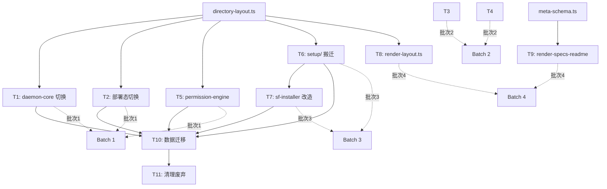

# WI-011 Design Delta — SpecForge V6 目录结构治理 P1 代码全量切换与数据迁移

**work_item_id**: WI-011
**workflow_type**: change_request
**design_type**: delta（基于 P0 产物的增量设计）
**主输入**: `intake.md` + `impact_analysis.md`
**权威 Schema**: `packages/types/src/directory-layout.ts`

---

## 增量设计描述

### DD-0 用户级路径 Schema 扩展

refs: [T1, T2, T5, T7]
constrained_by: impact_analysis §发现问题 1（directory-layout.ts 只覆盖项目级路径）

**决策 D1**：在 `directory-layout.ts` 中新增用户级路径常量段和 `resolveUserPath()` 函数，使 T1/T2/T5/T7 中的 `~/.specforge/...` 路径也能收口到单一真相源。

**扩展方案**：

```typescript
// === 新增：用户级路径常量 ===

/**
 * SpecForge 用户级目录名（与 SPEC_DIR_NAME 相同，但用于 ~/<dir>/ 上下文）。
 * 用户级路径位于 os.homedir() 下，存放全局 daemon 状态、host profile 等。
 */
export const SPEC_USER_DIR_NAME = '.specforge' as const;

/**
 * 用户级路径（`~/.specforge/` 下）的子路径字典。
 * 与项目级 LAYOUT 独立，因为两者目录结构不同。
 */
export const USER_LAYOUT = {
  /** 用户级根 runtime 目录 — `~/.specforge/runtime/` */
  runtime: 'runtime',
  /** daemon handshake 文件 — `~/.specforge/runtime/handshake.json` */
  runtimeHandshake: 'runtime/handshake.json',
  /** daemon 运行状态 — `~/.specforge/runtime/state.json` */
  runtimeState: 'runtime/state.json',
  /** daemon 事件日志 — `~/.specforge/runtime/events.jsonl` */
  runtimeEvents: 'runtime/events.jsonl',
  /** daemon lock 文件 — `~/.specforge/runtime/daemon.lock` */
  runtimeDaemonLock: 'runtime/daemon.lock',
  /** 用户级 host profile — `~/.specforge/host-profile.json` */
  hostProfile: 'host-profile.json',
  /** 用户级 logs 目录 — `~/.specforge/logs/` */
  logs: 'logs',
  /** 用户级 projects 目录（Enterprise 模式）— `~/.specforge/projects/` */
  projects: 'projects',
  /** 用户级 templates 目录 — `~/.specforge/templates/` */
  templates: 'templates',
  /** 用户级 backups 目录 — `~/.specforge/backups/` */
  backups: 'backups',
} as const;

export type UserLayoutKey = keyof typeof USER_LAYOUT;

/**
 * 构造用户级路径：`<homedir>/.specforge/<USER_LAYOUT[key]>/<...subpath>`。
 * 所有 `path.join(os.homedir(), '.specforge', ...)` 调用的收口入口。
 */
export function resolveUserPath(
  key: UserLayoutKey,
  ...subpath: string[]
): string {
  const value = USER_LAYOUT[key];
  const segment = typeof value === 'string' ? value : key;
  return path.join(os.homedir(), SPEC_USER_DIR_NAME, segment, ...subpath);
}
```

**受影响文件**：`packages/types/src/directory-layout.ts`（纯新增，不修改现有导出）

**为什么不是"保留硬编码+注释"**：用户级路径虽只有约 10 处，但集中在 `path-resolver.ts`、`sf_safe_bash_core.ts`、`sf-installer.ts` 等关键入口。不收口会导致"项目级走 Schema、用户级走硬编码"的二元状态，违反方案 A 的单一真相源原则。扩展量小（~40 行新增），收益高。

**向后兼容**：`resolveUserPath()` 不需要 `projectRoot` 参数，因为用户级路径总是基于 `os.homedir()`，因此现有函数签名全部不变。

---

### DD-1 T1: daemon-core 路径切换

refs: [intake T1]
constrained_by: directory-layout.ts LAYOUT 常量, DD-0（用户级扩展）

**技术方案**：19 个文件约 63 处替换，按 3 种模式分类处理：

#### 模式 A — 项目级带点路径

```
旧: join(baseDir, ".specforge", "specs", workItemId, ...)
新: specPath(baseDir, workItemId, ...) 或 resolveProjectPath(baseDir, 'specs', workItemId, ...)
```

**适用文件**：`sf_requirements_gate_core.ts`、`sf_verification_gate_core.ts`、`sf_design_gate_core.ts`、`sf_tasks_gate_core.ts`、`sf_trace_matrix_core.ts`、`sf_doc_lint_core.ts`、`sf_knowledge_graph_core.ts`（部分）、`sf_context_build_core.ts`（部分）

**替换规则**：
- 模式 `join(baseDir, ".specforge", "specs", wi, file)` → `specPath(baseDir, wi, file)`
- 模式 `join(baseDir, ".specforge", "specs", wi)` → `resolveProjectPath(baseDir, 'specs', wi)`

#### 模式 B — 项目级不带点路径

```
旧: join(baseDir, "specforge", "logs", "cost.jsonl")
新: resolveProjectPath(baseDir, 'logsCost')
```

**适用文件**：`sf_cost_report_core.ts`、`sf_knowledge_base_core.ts`、`sf_continuity_core.ts`、`sf_artifact_write_core.ts`（部分）、`utils.ts`、`sf_context_build_core.ts`（部分）

**替换规则**（对照表）：

| 旧路径片段 | 新 LAYOUT key |
|-----------|--------------|
| `"specforge", "manifest.json"` | `'manifest'` |
| `"specforge", "config"` | `'config'` |
| `"specforge", "config", "project.json"` | 直接拼接 `LAYOUT.configFiles.project` |
| `"specforge", "config", "skill_fragments.json"` | 直接拼接 `LAYOUT.configFiles.skillFragments` |
| `"specforge", "logs", "cost.jsonl"` | `'logsCost'` |
| `"specforge", "logs", "error.log"` | `resolveProjectPath(baseDir, 'logs')` + `'error.log'` |
| `"specforge", "logs"` | `'logs'` |
| `"specforge", "runtime", "state.json"` | `'runtimeState'` |
| `"specforge", "runtime", "events.jsonl"` | `'runtimeWal'`（注：见 DD-5 决策） |
| `"specforge", "runtime", "trace.jsonl"` | `'logsTrace'`（注：trace 在 logs/ 下） |
| `"specforge", "runtime", "conversation.jsonl"` | `'logsConversations'`（注：conversation 在 logs/ 下） |
| `"specforge", "archive", "agent_runs"` | `'archiveAgentRuns'` |
| `"specforge", "knowledge", "graph.json"` | `'knowledgeGraph'` |

**⚠️ 关键设计点 — 路径语义迁移**：impact_analysis 发现 `sf_continuity_core.ts` L650 使用 `join(baseDir, "specforge", "runtime", "trace.jsonl")`，但按方案 A §4.1，`trace.jsonl` 应在 `.specforge/logs/trace.jsonl`（对应 `LAYOUT.logsTrace`），而非 `.specforge/runtime/trace.jsonl`。同理 `conversation.jsonl` 在 logs/ 下。这属于路径语义修正，不只是目录名修正。

#### 模式 C — 用户级路径

```
旧: path.join(os.homedir(), ".specforge", "host-profile.json")
新: resolveUserPath('hostProfile')
```

**适用文件**：
- `sf_safe_bash_core.ts` — `resolveUserPath('hostProfile')`、`resolveUserPath('logs')`
- `daemon/path-resolver.ts` — `resolveUserPath('runtime')`、`resolveUserPath('runtimeHandshake')`、`resolveUserPath('runtimeState')`、`resolveUserPath('runtimeDaemonLock')`、`resolveUserPath('projects', hash)`
- `daemon/Daemon.ts` — legacy 迁移代码中的用户级路径

#### import 统一模式

所有需要路径切换的文件在文件头部统一添加：

```typescript
import { SPEC_DIR_NAME, LAYOUT, resolveProjectPath, specPath } from '@specforge/types/directory-layout';
// 如有用户级路径，还需：
import { USER_LAYOUT, resolveUserPath } from '@specforge/types/directory-layout';
```

**注意事项**：
- `sf_artifact_write_core.ts` L265-266 的 `split("/specforge/")` 分割逻辑是字符串解析而非路径构造，需改为 `split("/" + SPEC_DIR_NAME + "/")` 或 `split(path.sep + SPEC_DIR_NAME + path.sep)`
- 模板字符串 `` `.specforge/specs/${wid}/...` `` 需改为模板字符串 `` `${SPEC_DIR_NAME}/specs/${wid}/...` `` 或使用 `specPath()` 的相对路径变体
- `sf_doctor_core.ts` L40 错误消息中的 `"specforge/manifest.json"` 属于用户可见字符串，需改为动态插值：`` `${SPEC_DIR_NAME}/manifest.json` ``

---

### DD-2 T2: 部署态 tools 路径切换

refs: [intake T2]
constrained_by: DD-1（与 T1 同步）

**技术方案**：`.opencode/tools/lib/` 下 16 个文件的路径切换与 T1 完全同步。

**关键差异点**：

1. **部署态文件的 import 路径不同**：`.opencode/tools/lib/` 下的文件是独立运行的，不能使用 `@specforge/types/directory-layout` 的 npm import。需要改为**内联常量**方式：
   ```typescript
   // 部署态文件不通过 npm 包引用，直接内联关键常量
   const SPEC_DIR_NAME = '.specforge' as const;
   ```
   或通过相对路径引入（如果 `.opencode/` 能解析 monorepo 内的包）。

2. **决策**：部署态文件采用**内联常量**方案。理由：
   - `.opencode/tools/lib/` 文件被复制到用户机器的 `~/.config/opencode/tools/lib/`，脱离 monorepo 上下文
   - npm `@specforge/types` 包在用户环境中不可用
   - 内联 `SPEC_DIR_NAME = '.specforge'` 足以保证拼写正确性
   - 项目级路径的 LAYOUT key 映射通过注释标明来源

3. **thin-client.ts**（L38）的用户级路径：使用内联 `SPEC_DIR_NAME` 替代硬编码 `'.specforge'`。

**同步策略**：T2 在 T1 完成后同步执行，每个文件的替换模式与 T1 的对应文件完全一致，但 import 方式改为内联常量。

---

### DD-3 T3+T4: SKILL.md 与 Agent prompt 路径修正

refs: [intake T3, T4]
constrained_by: 无逻辑约束，纯文本替换

**技术方案**：

全局替换 `specforge/specs/` → `.specforge/specs/`（在指定文件中）。

**T3（8 个 SKILL.md）**：
- 范围：`.opencode/skills/sf-workflow-*/SKILL.md`
- 替换：`specforge/specs/` → `.specforge/specs/`
- 额外：检查是否有 `specforge/` → `.specforge/` 的其他路径引用（如 `specforge/config/`、`specforge/runtime/`）
- **不处理** `.opencode-/skills/`（废弃备份，T11 删除）

**T4（4 个 Agent prompt）**：
- 范围：`.opencode/agents/sf-task-planner.md`、`sf-requirements.md`、`sf-design.md`、`sf-knowledge.md`
- 替换：同 T3

**验证方法**：替换后 `grep -r "specforge/specs/" .opencode/skills/ .opencode/agents/` 应返回 0 结果（排除 `.opencode-/`）。

---

### DD-4 T5: permission-engine 路径切换

refs: [intake T5]
constrained_by: impact_analysis §发现问题 4

**决策 D2**：`specforge/observability/events.jsonl` 替换为 `LAYOUT.logsTelemetry`（即 `.specforge/logs/telemetry.jsonl`）。

**理由**：
1. 方案 A §4.1 明确规定 `observability/events.jsonl` → `logs/telemetry.jsonl`（决策记录 新-4 确认了方案 γ）
2. permission-engine 的事件日志是**观测埋点**（telemetry），不是状态机 WAL。`runtime/wal.jsonl` 是给 `sf_state_transition` 的写前日志用的
3. 如果 permission-engine 未来需要消费 WAL 事件，应通过独立接口而非文件路径耦合

**具体替换**：

| 文件 | 旧值 | 新值 |
|------|------|------|
| `static-api-checker.ts` L394 | `'./specforge/observability/events.jsonl'` | `'./' + SPEC_DIR_NAME + '/logs/telemetry.jsonl'` |
| `plugin-permission-validator.ts` L95 | `'./specforge/observability/events.jsonl'` | `'./' + SPEC_DIR_NAME + '/logs/telemetry.jsonl'` |
| `plugin-loader-integration.ts` L164 | `'./specforge/observability/events.jsonl'` | `'./' + SPEC_DIR_NAME + '/logs/telemetry.jsonl'` |
| `index.ts` L80, L306 | `` `./specforge/observability/events.jsonl` `` | `` `./${SPEC_DIR_NAME}/logs/telemetry.jsonl` `` |

**其他替换**：

| 文件 | 旧值 | 新值 |
|------|------|------|
| `builtin-policy-loader.ts` L44 | `path.join(process.cwd(), 'specforge', 'config', 'builtin-policies')` | `resolveProjectPath(process.cwd(), 'config', 'builtin-policies')` |
| `user-policy-loader.ts` L62 | `'.specforge'` | `SPEC_DIR_NAME` |
| `hard-rules.ts` L117 | `'.specforge/'` | `SPEC_DIR_NAME + '/'` |
| `hard-rules.ts` L278 | `'file:.specforge/*'` | `` `file:${SPEC_DIR_NAME}/*` `` |

**安全影响分析**：`hard-rules.ts` 的 `hard-007` 规则使用 `'.specforge/'` 匹配核心系统文件保护路径。替换为 `SPEC_DIR_NAME + '/'` 不会改变运行时行为（`SPEC_DIR_NAME === '.specforge'`），但需确认 `startsWith` 匹配逻辑不变。

---

### DD-5 T6: setup/ 目录搬迁

refs: [intake T6]
constrained_by: 方案 A §3（开发仓库结构修订版）

**技术方案**：

#### 目录结构

```
setup/
├── README.md                           # 总清单：每个子目录的安装去向
├── userlevel-opencode/                 # → ~/.config/opencode/
│   ├── agents/                         #   9 个 Agent prompt（.md）
│   ├── tools/                          #   Tool 入口
│   │   └── lib/                        #   17+ 个 Tool 实现（.ts）
│   ├── skills/                         #   16 个 Skill（SKILL.md + 辅助文件）
│   └── plugins/                        #   sf_specforge.ts
├── userlevel-scripts-lib/              # → ~/.config/opencode/scripts/lib/
│   └── (tools/lib 动态 import 依赖)
└── userlevel-templates/                # → ~/.specforge/templates/
    ├── dev-environment.md
    ├── prod-environment.md
    └── project-rules/
```

#### 搬迁映射表

| 源路径 | 目标路径 | 方式 |
|--------|---------|------|
| `.opencode/agents/` | `setup/userlevel-opencode/agents/` | `git mv` |
| `.opencode/tools/` | `setup/userlevel-opencode/tools/` | `git mv` |
| `.opencode/skills/` | `setup/userlevel-opencode/skills/` | `git mv` |
| `.opencode/plugins/` | `setup/userlevel-opencode/plugins/` | `git mv` |
| `scripts/lib/`（部署态部分） | `setup/userlevel-scripts-lib/` | `git mv`（选择性） |
| `templates/` | `setup/userlevel-templates/` | `git mv` |

#### 排除项

- `.opencode/node_modules/` — 不搬迁（运行时依赖，安装时由 `bun install` 生成）
- `.opencode/bun.lock` / `package-lock.json` — 不搬迁（构建产物）
- `.opencode-/` — 不搬迁（T11 直接删除）

#### setup/README.md 内容要求

```markdown
# setup/ — 安装源集中目录

本目录包含 SpecForge 安装器的所有部署源文件。
每个子目录对应一个安装目标。

| 子目录 | 安装目标 | 说明 |
|--------|---------|------|
| userlevel-opencode/ | ~/.config/opencode/ | OpenCode 框架资产（agents/tools/skills/plugins） |
| userlevel-scripts-lib/ | ~/.config/opencode/scripts/lib/ | tools/lib 动态 import 依赖 |
| userlevel-templates/ | ~/.specforge/templates/ | 项目模板文件 |

⚠️ 本目录由 sf-installer.ts 读取，手动修改需同步更新安装脚本。
```

**决策 D5**：搬迁后 `.opencode/` 目录**保留**（不删除）。理由：
1. 开发期间 `.opencode/` 仍是 opencode 框架加载 Agent/Skill 的入口
2. 删除 `.opencode/` 需要修改开发环境的 opencode 配置，属于 P2 范围
3. 方案 A §3.1 的"选项 X"（彻底删除根 `.opencode/`）需要额外适配，风险可控但工作量不在 P1

**执行步骤**：
1. `git mv .opencode/agents/ setup/userlevel-opencode/agents/`
2. `git mv .opencode/tools/ setup/userlevel-opencode/tools/`
3. `git mv .opencode/skills/ setup/userlevel-opencode/skills/`
4. `git mv .opencode/plugins/ setup/userlevel-opencode/plugins/`（如存在）
5. 从 `scripts/lib/` 选择部署态文件 → `git mv` 到 `setup/userlevel-scripts-lib/`
6. `git mv templates/ setup/userlevel-templates/`（如存在）
7. 创建 `setup/README.md`
8. 更新 `.gitignore`（如需忽略 setup 下的 node_modules/）

**⚠️ git mv 后的同步问题**：搬迁后 `.opencode/` 目录中的文件已转移到 `setup/`。由于决策 D5 保留 `.opencode/`，需要在搬迁后从 `setup/` 复制回 `.opencode/`（或使用 symlink），确保开发期 opencode 框架正常加载。具体做法：
- 方案 A（推荐）：`git mv` 后在 `.opencode/` 创建指向 `setup/userlevel-opencode/` 对应子目录的 junction/symlink
- 方案 B：`git mv` 后 `cp -r` 复制一份回 `.opencode/`（简单但不保持同步）

选择**方案 A**（junction），开发期 opencode 框架通过 `.opencode/agents/` → junction → `setup/userlevel-opencode/agents/` 正常加载，且始终保持同步。

---

### DD-6 T7: sf-installer.ts 改造

refs: [intake T7]
constrained_by: DD-5（setup/ 目录结构）, DD-0（用户级路径）

**技术方案**：

#### 核心改动点

1. **安装源路径**：从 `getSourceDir() + ".opencode/"` 改为 `getSourceDir() + "setup/userlevel-opencode/"`
2. **模板源路径**：从 `getSourceDir() + "templates/"` 改为 `getSourceDir() + "setup/userlevel-templates/"`
3. **scripts/lib 部署源**：从 `getSourceDir() + "scripts/lib/"` 改为 `getSourceDir() + "setup/userlevel-scripts-lib/"`
4. **用户级路径**：`getSpecForgeUserDir()` 中的硬编码 `".specforge"` 改为 `SPEC_DIR_NAME`（从内联常量或 import）

#### scripts/lib/project_runtime.ts 处理

该文件包含 25+ 处 `specforge/` 相对路径定义（L52-81），是项目初始化代码。

**决策 D4**：`project_runtime.ts` 中的路径全部切换为 `.specforge/`（使用内联 `SPEC_DIR_NAME`），**不保留**旧 `specforge/` 路径的向后兼容。

**理由**：
1. `project_runtime.ts` 的路径定义用于**创建新项目**的目录结构，新项目必须使用 `.specforge/`
2. 已有旧项目（使用 `specforge/`）的迁移由 T10 的 `v6-dir-rename.ts` 脚本负责，不是 installer 的职责
3. installer 不负责检测和迁移旧项目结构（那是迁移脚本的功能）

#### 其他 scripts/lib 文件

| 文件 | 改动 |
|------|------|
| `scripts/lib/runtime_manifest.ts` | `"specforge/runtime-manifest.json"` → `SPEC_DIR_NAME + "/runtime-manifest.json"` |
| `scripts/lib/install_lock.ts` | `".specforge.lock"` → 内联常量 `SPEC_LOCK_FILE = '.specforge.lock'` |
| `scripts/lib/lock.ts` | 同上 |
| `scripts/lib/host-profile/scanner.ts` | `~/.specforge/` → 内联常量 |
| `scripts/cleanup-project-runtime.ts` | 全量 `specforge/` → `.specforge/` |

#### import 方式

sf-installer.ts 及其 lib 文件不在 monorepo 编译上下文中运行（作为独立脚本），因此使用内联常量：
```typescript
const SPEC_DIR_NAME = '.specforge' as const;
```

---

### DD-7 T8: render-layout.ts 文档生成器

refs: [intake T8]
constrained_by: 方案 A §7.2（文档生成器规范）

**技术方案**：

#### 文件位置

`scripts/render-layout.ts`（新增）

#### 功能规格

```typescript
interface RenderLayoutOptions {
  /** schema 源文件路径 */
  schemaPath: string;
  /** 输出目标文件路径 */
  outputPath: string;
  /** marker 开始标记 */
  beginMarker: string;
  /** marker 结束标记 */
  endMarker: string;
}

/**
 * 从 directory-layout.ts 的 LAYOUT 常量生成人可读的目录约定文档。
 * 
 * 算法：
 * 1. 读取 schema 文件，用正则提取 LAYOUT 对象定义
 * 2. 解析为 { key: relativePath } 的扁平映射（含嵌套 configFiles）
 * 3. 按分区（committed / gitignored）分组排序
 * 4. 生成 Markdown 表格 + 树形目录图
 * 5. 在输出文件的 marker 之间插入生成内容
 */
async function renderLayout(options: RenderLayoutOptions): Promise<void>;
```

#### marker 机制

在目标 Markdown 文件中使用 HTML 注释作为标记：

```markdown
<!-- BEGIN: directory-layout -->
（自动生成的内容，手动修改会被覆盖）
<!-- END: directory-layout -->
```

**实现逻辑**：
1. 读取输出文件全部内容
2. 如果找不到 marker 对，在文件末尾追加
3. 如果找到 marker 对，替换 marker 之间的内容
4. 写回文件

**安全设计**：
- marker 之外的内容**永不修改**
- 如果 marker 只有 BEGIN 没有 END，**报错退出**（避免误删文件尾部）
- 写入前创建 `.bak` 备份

#### 生成内容格式

```markdown
> 本段内容由 `scripts/render-layout.ts` 从 `packages/types/src/directory-layout.ts` 自动生成。
> 最后生成时间：2026-05-29T15:00:00Z

#### committed 区（提交到 Git）

| LAYOUT Key | 相对路径 | 绝对路径示例 |
|-----------|---------|------------|
| `manifest` | `manifest.json` | `<root>/.specforge/manifest.json` |
| `config` | `config/` | `<root>/.specforge/config/` |
| ... | ... | ... |

#### gitignored 区（运行时数据）

| LAYOUT Key | 相对路径 | 说明 |
|-----------|---------|------|
| `runtime` | `runtime/` | 运行时状态目录 |
| ... | ... | ... |

#### 路径构造函数

| 函数 | 签名 | 用途 |
|------|------|------|
| `resolveProjectPath` | `(root, key, ...sub) => string` | 通用路径构造 |
| `specPath` | `(root, wi, file) => string` | WI 规格文件路径 |
| `agentRunArchivePath` | `(root, wi, agent, idx) => string` | Agent Run 归档路径 |
```

#### CLI 接口

```bash
bun scripts/render-layout.ts                    # 默认：生成 docs/conventions/directory-layout.md
bun scripts/render-layout.ts --dry-run          # 仅输出到 stdout，不写文件
bun scripts/render-layout.ts --target README.md # 指定目标文件
```

---

### DD-8 T9: specs/README.md 自动渲染机制

refs: [intake T9]
constrained_by: meta-schema.ts（`_meta.json` zod schema）

**技术方案**：

#### 文件位置

`scripts/render-specs-readme.ts`（新增）

#### 功能规格

```typescript
interface RenderSpecsReadmeOptions {
  /** specs 目录路径（如 `.specforge/specs/`） */
  specsDir: string;
  /** 输出文件路径（如 `.specforge/specs/README.md`） */
  outputPath: string;
}

/**
 * 从所有 WI-XXX/_meta.json 渲染 specs/README.md。
 * 
 * 算法：
 * 1. 扫描 specsDir 下的所有 WI-*/ 目录
 * 2. 读取每个目录的 _meta.json，用 WorkItemMetaSchema.safeParse 校验
 * 3. 按 current_stage 分组（active WI 在前，completed 在后）
 * 4. 组内按 created_at 排序（active 正序，completed 倒序）
 * 5. 渲染 Markdown，在 marker 之间写入
 */
async function renderSpecsReadme(options: RenderSpecsReadmeOptions): Promise<void>;
```

#### 缺失 _meta.json 处理

当前 WI 目录中可能部分缺少 `_meta.json`。处理策略：
- **有 _meta.json**：正常渲染
- **无 _meta.json**：显示为 `(metadata pending)` 行，只显示目录名
- **_meta.json 解析失败**：显示为 `(metadata error)` 行，写入 error.log

#### daemon 集成方案

在 `sf_state_transition_core.ts`（或 `sf-state-transition.ts` handler）中，每次成功流转后触发重渲染：

```typescript
// 在 sf_state_transition 成功后（非阻塞）
try {
  await renderSpecsReadme({
    specsDir: resolveProjectPath(baseDir, 'specs'),
    outputPath: resolveProjectPath(baseDir, 'specsReadme'),
  });
} catch (err) {
  // 降级：写错误日志，不阻塞主流转
  await appendToErrorLog(baseDir, `renderSpecsReadme failed: ${err}`);
}
```

**集成位置选择**：在 `sf_state_transition_core.ts` 的流转成功路径末尾，而非 handler 层，因为 core 文件能访问 `resolveProjectPath`。

#### marker

```markdown
<!-- BEGIN: specforge-managed (DO NOT EDIT MANUALLY) -->
（自动生成的 WI 索引）
<!-- END: specforge-managed -->
```

#### CLI 接口

```bash
bun scripts/render-specs-readme.ts                     # 默认：渲染当前项目的 specs/README.md
bun scripts/render-specs-readme.ts --dry-run           # 仅输出到 stdout
bun scripts/render-specs-readme.ts --specs-dir /path   # 指定 specs 目录
```

---

### DD-9 T10: 数据迁移实际执行

refs: [intake T10]
constrained_by: P0 产物（v6-dir-backup.ts, v6-dir-rename.ts）, impact_analysis §发现问题 6

**技术方案**：

#### 前置条件

1. T1-T5 代码切换已全部完成并验证通过
2. T6-T7 setup/ 搬迁和 installer 改造已完成
3. `bun run test` 全量通过
4. 当前仓库同时存在 `.specforge/` 和 `specforge/` 两个目录

#### 执行步骤

```
Step 1: Dry-run 验证
  bun scripts/migrations/v6-dir-backup.ts --dry-run
  bun scripts/migrations/v6-dir-rename.ts --dry-run
  → 检查 dry-run 输出，确认操作范围正确

Step 2: 创建备份
  bun scripts/migrations/v6-dir-backup.ts
  → 备份到 ~/.specforge/backups/<timestamp>/
  → 验证备份完整性（文件数 + 总大小）

Step 3: 执行迁移
  bun scripts/migrations/v6-dir-rename.ts
  → 将 specforge/ 下的文件合并到 .specforge/ 对应子目录
  → 处理文件冲突（同路径文件：保留新版本，旧版本移入 .bak）

Step 4: 验证迁移结果
  → 检查 .specforge/ 目录完整性
  → 确认 specforge/ 目录已清空或删除
  → 运行 bun run test 验证

Step 5: 保留旧目录为空标记（可选）
  → 如果 specforge/ 下有残留的空子目录，删除
  → 最终 specforge/ 目录整体删除
```

#### 冲突处理策略

当 `specforge/foo` 和 `.specforge/foo` 同时存在时：
- **文件内容相同**：删除 `specforge/foo`
- **文件内容不同**：保留 `.specforge/foo`（权威版本），`specforge/foo` 备份到 `~/.specforge/backups/<ts>/conflicts/`
- **仅在 specforge/ 中存在**：移动到 `.specforge/` 对应位置

#### 回滚方案

如果迁移后测试失败：
1. 从 `~/.specforge/backups/<ts>/` 恢复
2. `git checkout -- specforge/` 恢复代码中的旧路径
3. 修复问题后重新执行

---

### DD-10 T11: 清理废弃文件

refs: [intake T11]
constrained_by: 无

**技术方案**：

#### 清理清单

| 目标 | 类型 | 命令 |
|------|------|------|
| `.opencode-/`（带尾横线） | 目录 | `git rm -r .opencode-/` |
| `opencode.json`（根目录） | 文件 | `git rm opencode.json` |
| `test-error.txt` | 文件 | `git rm test-error.txt` |
| `test-output.txt` | 文件 | `git rm test-output.txt` |
| `test-output2.txt` | 文件 | `git rm test-output2.txt` |
| `test-output3.txt` | 文件 | `git rm test-output3.txt` |
| `test-help-output.ts` | 文件 | `git rm test-help-output.ts` |
| `test-init.ps1` | 文件 | `git rm test-init.ps1` |
| `run-concurrent-init.ps1` | 文件 | `git rm run-concurrent-init.ps1` |
| `run-init-test.js` | 文件 | `git rm run-init-test.js` |
| `task-4.7-completion-summary.md` | 文件 | `git rm task-4.7-completion-summary.md` |
| `agents/`（空目录） | 目录 | `git rm -r agents/` |

**决策 D3**：`.opencode-/` 直接 `git rm -r` 删除，不保留到 archive/。理由：
- 它是误命名的备份副本，内容与 `.opencode/` 高度重复
- git history 已保留所有历史，不需要额外的 archive
- 增加 archive 目录只会增加维护负担

#### 执行前提

T1-T10 全部完成后执行。此时所有代码引用已指向 `.specforge/`，被删除的文件/目录无任何引用。

---

### DD-11 分批执行策略

refs: [intake §8]
constrained_by: 所有 DD-0 ~ DD-10 的依赖关系

#### 批次定义

```
Batch 1 (T1+T2+T5): daemon-core + 部署态 + permission-engine 路径切换
  前置: DD-0（用户级路径扩展）
  风险: 高
  验证: bun run test（必须全量通过）
  回滚: git revert

Batch 2 (T3+T4): SKILL.md + Agent prompt 路径修正
  前置: 无
  风险: 低
  验证: grep 验证（确认无残留 `specforge/specs/`）
  回滚: git revert

Batch 3 (T6+T7): setup/ 搬迁 + sf-installer.ts 改造
  前置: 无（可与 Batch 1/2 并行，但建议串行减少变量）
  风险: 中
  验证: bun scripts/sf-installer.ts verify
  回滚: git revert + 恢复 .opencode/ junction

Batch 4 (T8+T9): 文档生成器
  前置: DD-0（LAYOUT 稳定）
  风险: 低
  验证: bun scripts/render-layout.ts --dry-run
  回滚: 删除新增文件

Batch 5 (T10): 数据迁移
  前置: Batch 1-3 全部通过
  风险: 高
  验证: bun run test + 手动检查 .specforge/ 完整性
  回滚: P0 备份恢复机制

Batch 6 (T11): 清理废弃文件
  前置: Batch 1-5 全部通过
  风险: 极低
  验证: bun run test + 检查根目录清洁度
  回滚: git revert
```

#### 批次间回归检查

每完成一个批次，必须执行：
1. `bun run test` — 全量测试通过
2. `bun scripts/sf-installer.ts verify` — 安装器验证
3. `git status` — 确认无意外修改
4. 手动启动 daemon 验证（Batch 1 后必做）

---

## 受影响模块

### 代码模块

| 模块 | 包路径 | 受影响文件数 | 替换处数 | 风险 |
|------|--------|------------|---------|------|
| daemon-core/tools/lib | `packages/daemon-core/src/tools/lib/` | 15 | ~63 | 高 |
| daemon-core/daemon | `packages/daemon-core/src/daemon/` | 3 | ~10 | 中 |
| daemon-core/handlers | `packages/daemon-core/src/tools/handlers/` | 1 | 2 | 低 |
| permission-engine | `packages/permission-engine/src/` | 7 | ~10 | 中 |
| types | `packages/types/src/` | 1 | ~40（新增） | 低 |
| 部署态 tools | `.opencode/tools/lib/` | 16 | ~50 | 中 |
| SKILL 文件 | `.opencode/skills/sf-workflow-*/` | 8 | ~21 | 低 |
| Agent prompts | `.opencode/agents/` | 4 | ~7 | 低 |
| installer | `scripts/sf-installer.ts` + `scripts/lib/` | 9 | ~60 | 中 |
| 新增工具 | `scripts/render-layout.ts`、`scripts/render-specs-readme.ts` | 2 | 新增 | 低 |

### 接口变更

| 接口 | 变更类型 | 影响 |
|------|---------|------|
| `directory-layout.ts` 导出 | **新增导出**（USER_LAYOUT, resolveUserPath） | 无破坏性，纯新增 |
| `resolveProjectPath()` 签名 | 不变 | — |
| `specPath()` 签名 | 不变 | — |
| `agentRunArchivePath()` 签名 | 不变 | — |
| MCP tool I/O schema | **不变**（intake §5 约束） | — |
| daemon ↔ plugin 通信协议 | **不变** | — |
| sf-installer CLI | **不变**（内部实现切换） | — |

---

## 兼容性影响

### 向后兼容

| 维度 | 兼容性 | 说明 |
|------|--------|------|
| MCP tool 外部接口 | **100% 兼容** | 仅内部路径构造方式改变，I/O schema 不变 |
| daemon 启动协议 | **100% 兼容** | handshake/state 路径通过 resolveUserPath() 生成相同结果 |
| plugin 加载 | **100% 兼容** | plugin 路径未变 |
| 8 种工作流端到端 | **100% 兼容** | 行为不变约束（继承自 WI-010） |
| sf-installer 命令行 | **100% 兼容** | 子命令和参数不变 |
| `_meta.json` schema | **100% 兼容** | P0 已定义，P1 只是消费方 |
| 已安装用户项目 | **需迁移** | T10 负责迁移 `specforge/` → `.specforge/` |
| `specforge/` 目录名 | **破坏性变更** | 删除旧目录名，所有路径统一为 `.specforge/` |

### API 变更

**无公开 API 变更**。所有改动限于：
1. 内部路径字符串 → 常量/函数调用
2. 文档中的路径引用
3. 安装器的内部源路径

### 数据格式变更

| 文件 | 变更 | 迁移策略 |
|------|------|---------|
| `specforge/` → `.specforge/` | 目录重命名 | T10 迁移脚本 |
| `observability/events.jsonl` → `logs/telemetry.jsonl` | 路径+语义变更 | permission-engine 内部切换 |
| `runtime/events.jsonl` → `runtime/wal.jsonl` | 语义重命名 | daemon-core 内部切换 |

---

## 回归风险

### 高风险项

| 风险 | 影响范围 | 缓解措施 |
|------|---------|---------|
| **路径拼写错误** | daemon 全功能失效 | TypeScript 编译检查 + 全量测试 |
| **用户级路径未正确扩展** | daemon 无法启动/handshake 失败 | DD-0 扩展后单独测试 path-resolver.ts |
| **部署态文件脱离 monorepo** | 用户环境安装失败 | 内联常量而非 npm import |
| **数据迁移冲突** | WI 数据丢失 | 备份 + 冲突文件保留策略 |
| **split("/specforge/") 逻辑** | artifact 路径解析失败 | 替换为 `SPEC_DIR_NAME` 常量 |

### 中风险项

| 风险 | 影响范围 | 缓解措施 |
|------|---------|---------|
| **permission-engine 事件路径变更** | 权限审计日志丢失 | telemetry.jsonl 替代，日志格式不变 |
| **hard-rules.ts 保护路径匹配** | 安全策略绕过 | `SPEC_DIR_NAME` 运行时值不变 |
| **setup/ junction 在 Windows 的行为** | 开发期 opencode 加载失败 | Windows junction 需要管理员权限，改用 mklink /D |
| **sf-installer 安装源路径** | 新安装失败 | `bun scripts/sf-installer.ts verify` 验证 |

### 低风险项

| 风险 | 影响范围 | 缓解措施 |
|------|---------|---------|
| SKILL.md 路径文本 | 文档指引错误 | grep 验证 |
| render-layout.ts 生成内容 | 文档过时 | marker 机制自动更新 |
| render-specs-readme.ts 缺失 meta | README 不完整 | 降级显示 pending/error |

### 已知测试债务（不阻塞）

- daemon-core SessionRegistry 5 个 pre-existing 失败（WI-010 已记录）
- 迁移脚本 dry-run 需在 T10 前单独验证

---

## KG 追溯关系

### impact_analysis 变更范围 → design_delta DD 映射

| impact_analysis 任务 | 对应 DD | 设计决策 |
|---------------------|---------|---------|
| T1 daemon-core 路径切换（19 文件 63 处） | DD-1 + DD-0 | 3 种模式分类处理 + 用户级扩展 |
| T2 部署态 tools 切换（16 文件 ~50 处） | DD-2 | 内联常量方案（脱离 monorepo） |
| T3 8 个 SKILL.md 修正（21 处） | DD-3 | 纯文本替换 |
| T4 4 个 Agent prompt 修正（7 处） | DD-3 | 纯文本替换 |
| T5 permission-engine 切换（7 文件 10 处） | DD-4 | observability → logs/telemetry |
| T6 setup/ 搬迁 | DD-5 | git mv + junction 保留开发入口 |
| T7 sf-installer 改造 | DD-6 | 安装源路径切换 + 内联常量 |
| T8 render-layout.ts | DD-7 | marker 机制 + schema 解析 |
| T9 render-specs-readme.ts | DD-8 | _meta.json 驱动 + daemon 集成 |
| T10 数据迁移 | DD-9 | 5 步执行 + 冲突策略 |
| T11 清理废弃 | DD-10 | git rm + 直接删除 |
| 分批策略 | DD-11 | 6 批次串行 + 批次间回归 |

### 待决策项解决状态

| impact_analysis ID | 问题 | 设计决策 | DD 引用 |
|-------------------|------|---------|---------|
| D1 | 用户级路径范围 | 扩展 directory-layout.ts | DD-0 |
| D2 | observability/events.jsonl 替换为 | `LAYOUT.logsTelemetry` | DD-4 |
| D3 | `.opencode-/` 是否保留历史 | 直接删除 | DD-10 |
| D4 | project_runtime.ts 向后兼容 | 不保留，T10 负责迁移 | DD-6 |
| D5 | `.opencode/` 搬迁后保留/删除 | 保留，用 junction | DD-5 |

### 与 WI-010 的追溯

| WI-010 产物 | WI-011 消费方式 | DD 引用 |
|-------------|----------------|---------|
| `directory-layout.ts`（Schema） | T1-T5 消费常量/函数 | DD-1 ~ DD-4 |
| `meta-schema.ts`（Schema） | T9 消费 `WorkItemMetaSchema` | DD-8 |
| `v6-dir-rename.ts`（迁移脚本） | T10 直接执行 | DD-9 |
| `v6-dir-backup.ts`（备份脚本） | T10 直接执行 | DD-9 |
| 21 条不变行为约束 | 全流程继承 | 全部 DD |

---

## Assumptions（设计假设）

1. **假设** `SPEC_DIR_NAME` 的运行时值始终为 `'.specforge'`，与 ADR-006 一致
2. **假设** `.opencode/` 下的文件与 `setup/userlevel-opencode/` 的文件在搬迁时 1:1 对应
3. **假设** `scripts/lib/` 中只有部分文件是"部署态"（被 installer 复制到用户机器），其余是"开发态"
4. **假设** P0 的迁移脚本 `v6-dir-rename.ts` 已通过 dry-run 验证（WI-010 承诺）
5. **假设** Windows 环境下 `mklink /D` 或 junction 可用于 `.opencode/` → `setup/` 的链接
6. **假设** 所有 8 种工作流在路径切换后行为不变（继承 WI-010 不变行为约束）
7. **假设** `_meta.json` 的 WorkItemMetaSchema 与现有 WI 目录中的实际数据兼容
8. **假设** 迁移执行时无人同时在操作 `specforge/` 或 `.specforge/` 目录

---

## Out of Scope（不在 P1 范围）

1. **CI Lint 规则**（方案 A §8 防线 B）— P2 范围
2. **Architecture Test**（方案 A §8 防线 C）— P2 范围
3. **删除根 `.opencode/` 目录**（方案 A §3.1 选项 X）— P2 范围，P1 用 junction 过渡
4. **`docs/conventions/` 其他文档**（非 directory-layout.md 的约定文档）— 方案 B 范围
5. **用户级路径的 Architecture Test** — P2 范围
6. **SessionRegistry 5 个 pre-existing 失败修复** — 独立 WI
7. **`.kiro/` 目录治理** — 用户确认暂不动
8. **Engineering Playbook 模板包** — 方案 B 范围
9. **opencode.json 的内容恢复**（当前为空文件）— 如需 opencode 配置，另立 WI

---

## 架构属性自检

### A1 单一职责

| 组件 | "我是 X" | OK? |
|------|---------|-----|
| directory-layout.ts | 我是项目级+用户级路径的单一真相源 | ✅ |
| render-layout.ts | 我是从 Schema 生成人可读文档的工具 | ✅ |
| render-specs-readme.ts | 我是从 _meta.json 渲染 specs 索引的工具 | ✅ |
| sf-installer.ts | 我是从 setup/ 部署 SpecForge 到用户环境的安装器 | ✅ |
| v6-dir-rename.ts | 我是将旧目录结构迁移到新结构的工具 | ✅ |

### A2 显式依赖



### A3 可替换性

| 组件 | 接口定义 | Mock 方式 |
|------|---------|----------|
| directory-layout.ts | `SPEC_DIR_NAME`, `LAYOUT`, `resolveProjectPath()`, `specPath()`, `resolveUserPath()` | 测试时可用 `vi.mock('@specforge/types/directory-layout')` |
| render-layout.ts | `RenderLayoutOptions` interface | 独立 CLI 脚本，不注入 daemon |
| render-specs-readme.ts | `RenderSpecsReadmeOptions` interface | daemon 通过 try/catch 降级 |

### A4 失败可观测

| 失败路径 | 观测方式 | DD |
|---------|---------|-----|
| resolveProjectPath key 不存在 | TypeScript 编译错误 | DD-1 |
| _meta.json 解析失败 | safeParse + 降级显示 error | DD-8 |
| renderSpecsReadme 失败 | 写入 error.log，不阻塞流转 | DD-8 |
| renderLayout marker 不配对 | 报错退出 + .bak 备份 | DD-7 |
| 数据迁移冲突 | 冲突文件备份到 conflicts/ | DD-9 |
| 数据迁移备份失败 | 中止迁移，报错 | DD-9 |

### A5 边界明确

见上方 **Out of Scope** 和 **Assumptions** 段。

---

## 自问自答验收清单

| # | 问题 | 状态 |
|---|------|------|
| 1 | 每个 T1-T11 都有对应的 DD 覆盖吗？ | ✅ DD-1~DD-11 全覆盖 |
| 2 | 每个 DD 都有 refs 和 constrained_by 吗？ | ✅ |
| 3 | 架构图画了吗？Out of Scope 写了吗？Assumptions 写了吗？ | ✅ |
| 4 | 每个组件都有 interface 定义 + Errors 段吗？ | ✅（DD-7/8 有 interface） |
| 5 | impact_analysis 的 5 个待决策项都解决了吗？ | ✅ D1~D5 全部决策 |
| 6 | 用户级路径处理方案明确吗？ | ✅ DD-0 扩展 USER_LAYOUT |
| 7 | permission-engine 的 observability 路径决策了吗？ | ✅ DD-4 → logsTelemetry |
| 8 | 部署态文件脱离 monorepo 后如何引用常量？ | ✅ DD-2 内联常量 |
| 9 | marker 机制安全吗？ | ✅ DD-7 不配对报错 + .bak |
| 10 | 分批策略和依赖关系清晰吗？ | ✅ DD-11 |
