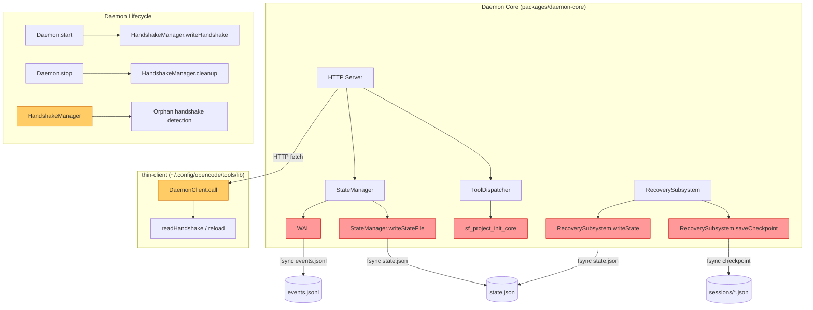

# Design: Daemon 事件循环阻塞修复

> work_item_id: WI-019
> workflow_type: bugfix_spec
> stage: design

---

## 设计目标

将 daemon 内部所有同步阻塞 I/O 操作（`fsSync.fsyncSync`、`execSync`）替换为异步非阻塞方案，确保 daemon HTTP 服务器在 I/O 密集型操作期间始终可接受新连接。同时修复 thin-client 连接失败无重试、handshake.json 残留等次级问题。

---

## 架构图



> **红色** = 必修复阻塞点 (Fix 1–4)，**橙色** = 次级修复 (Fix 5, Fix 7)

---

## Out of Scope

- 不修改 HTTP Server 的 accept 逻辑（框架层已处理）
- 不改动 events.jsonl / state.json 的 JSON 序列化格式
- 不引入额外的 IPC / 子进程架构（daemon 保持单进程模型）
- 不引入 WAL 压缩/归档后台线程（可选 Fix 6 仅做文件轮转，不做压缩）
- 不修改 `sf_state_transition` 工具的请求协议或响应格式

---

## Assumptions（设计假设）

- `fs.promises` 的 `FileHandle.sync()` 在 Node.js v24.12.0+（当前版本）上可用且稳定
- `fs.promises` 的 `FileHandle.sync()` 使用 libuv 线程池执行，不阻塞事件循环主线程
- `child_process.exec` 的异步版本同样使用 libuv 线程池，不阻塞事件循环
- thin-client 代码位于 `~/.config/opencode/tools/lib/thin-client.ts`，由 SpecForge 维护
- daemon 启动和停止由外部进程（如 OpenCode extension host）管理，`process.on('exit')` 钩子不一定触发（需同时注册 `SIGTERM`/`SIGINT`）
- 生产环境 Windows 11 家庭版，文件系统为 NTFS，磁盘为 SSD
- events.jsonl 归档（Fix 6）的阈值 5MB 基于当前观察（6.4MB 已造成明显阻塞），可作为配置项

---

## 设计决策清单

---

### DD-1: WAL.appendEvent 异步 fsync

refs: [REQ-1 blocking point #1]
constrained_by: bugfix.md.invariants.WAL 写入语义不变, bugfix.md.invariants.数据持久化保证不变

#### 当前实现

```typescript
// WAL.ts:66-80
async appendEvent(event: Event): Promise<void> {
    const line = JSON.stringify(event) + '\n';
    await fs.appendFile(this.eventsPath, line, 'utf-8');
    const fd = fsSync.openSync(this.eventsPath, 'a');
    try {
        fsSync.fsyncSync(fd);           // ← 同步阻塞 50~500ms
    } finally {
        fsSync.closeSync(fd);
    }
}
```

#### 修复方案

将 `fsSync.openSync` + `fsSync.fsyncSync` + `fsSync.closeSync` 替换为 `fs.promises.open` + `handle.sync()` + `handle.close()`：

```typescript
// WAL.ts:66-80 (修复后)
async appendEvent(event: Event): Promise<void> {
    const line = JSON.stringify(event) + '\n';
    await fs.appendFile(this.eventsPath, line, 'utf-8');

    // fsync using fs.promises FileHandle (libuv thread pool, non-blocking)
    const handle = await fs.open(this.eventsPath, 'a');
    try {
        await handle.sync();
    } finally {
        await handle.close();
    }
}
```

#### 不变行为保证

| 不变量 | 保证方式 |
|--------|----------|
| WAL 写入顺序：先 events.jsonl 再 state.json | `appendEvent` 内部 `await handle.sync()` 返回前数据已落盘 |
| fsync 耐久性语义 | `FileHandle.sync()` 最终调用系统 `fsync()` → Windows `FlushFileBuffers()`，语义等价 |
| monotonicSeq 单调递增 | `createEvent` 方法不变，`this._lastSeq += 1` 同步递增 |
| await 返回即数据落盘 | `handle.sync()` 的 Promise 在 OS 确认后 resolve，语义与 fsyncSync 一致 |

#### Interface 变更

```
// 变更类型: 内部实现变更，公共接口不变
// 方法签名不变: appendEvent(event: Event): Promise<void>
// Errors: 不变 (文件系统错误以异常抛出)
```

---

### DD-2: StateManager.writeStateFile 异步 fsync

refs: [REQ-2 blocking point #2]
constrained_by: bugfix.md.invariants.WAL 写入语义不变, bugfix.md.invariants.数据持久化保证不变

#### 当前实现

```typescript
// StateManager.ts:418-426
private async writeStateFile(state: ProjectState): Promise<void> {
    await fs.writeFile(this.statePath, JSON.stringify(state, null, 2), 'utf-8');
    const fd = fsSync.openSync(this.statePath, 'a');
    try {
        fsSync.fsyncSync(fd);           // ← 同步阻塞 10~50ms
    } finally {
        fsSync.closeSync(fd);
    }
}
```

#### 修复方案

同样的替换策略：

```typescript
// StateManager.ts:418-426 (修复后)
private async writeStateFile(state: ProjectState): Promise<void> {
    await fs.writeFile(this.statePath, JSON.stringify(state, null, 2), 'utf-8');
    const handle = await fs.open(this.statePath, 'a');
    try {
        await handle.sync();
    } finally {
        await handle.close();
    }
}
```

#### 调用链分析

```
StateManager.handleTransition()
  ├─► WAL.appendEvent(event)       // [DD-1 修复后] 异步 fsync events.jsonl
  └─► persistState()
        └─► writeStateFile(state)  // [DD-2 修复后] 异步 fsync state.json
```

调用方 `persistState()` 已 `await this.writeStateFile(state)`，无需变更。

#### Interface 变更

```
// 变更类型: 内部实现变更，公共接口不变
// 方法签名不变: writeStateFile(state: ProjectState): Promise<void>
// Errors: 不变
```

---

### DD-3: RecoverySubsystem 异步 fsync

refs: [REQ-3 blocking points #3, #4]
constrained_by: bugfix.md.invariants.数据持久化保证不变, bugfix.md.invariants.崩溃恢复语义不变

#### 当前实现

`writeState` (行 494–505) 和 `saveCheckpoint` (行 514–532) 均使用 `fsSync.openSync` + `fsSync.fsyncSync` + `fsSync.closeSync` 模式，与 DD-1/DD-2 相同。

#### 修复方案

与 DD-1/DD-2 相同的异步替换：

```typescript
// RecoverySubsystem.ts:494-505 (修复后)
private async writeState(state: ProjectState): Promise<void> {
    await fs.mkdir(path.dirname(this.statePath), { recursive: true });
    await fs.writeFile(this.statePath, JSON.stringify(state, null, 2));
    const handle = await fs.open(this.statePath, 'a');
    try {
        await handle.sync();
    } finally {
        await handle.close();
    }
}

// RecoverySubsystem.ts:514-532 (修复后，仅 fsync 部分)
async saveCheckpoint(sessionId: string, snapshotData: unknown): Promise<void> {
    try {
        const checkpointDir = path.join(path.dirname(this.statePath), 'checkpoints');
        const checkpointPath = path.join(checkpointDir, `${sessionId}.json`);
        await fs.mkdir(checkpointDir, { recursive: true });
        await fs.writeFile(checkpointPath, JSON.stringify(snapshotData, null, 2));
        const handle = await fs.open(checkpointPath, 'a');
        try {
            await handle.sync();
        } finally {
            await handle.close();
        }
    } catch (error) {
        console.error(`[RecoverySubsystem] Failed to save checkpoint for session ${sessionId}:`, error);
    }
}
```

#### 不变行为保证

| 不变量 | 保证方式 |
|--------|----------|
| 崩溃恢复语义 | `await handle.sync()` 确保数据落盘后再返回，崩溃后可以从 checkpoint 恢复 |
| fsync 耐久性 | 语义等价于 fsSync.fsyncSync |
| writeState 错误传播 | 异常仍向上抛出，由调用方处理（不变） |
| saveCheckpoint 不抛异常 | catch 块保持不变，写盘失败仅 log 不抛 |

#### Interface 变更

```
// 变更类型: 内部实现变更，公共接口不变
// 方法签名不变:
//   writeState(state: ProjectState): Promise<void>
//   saveCheckpoint(sessionId: string, snapshotData: unknown): Promise<void>
// Errors: 不变
```

---

### DD-4: sf_project_init_core execSync → async exec

refs: [REQ-4 blocking point #5]
constrained_by: dev-environment.shell=C:\WINDOWS\system32\cmd.exe, prod-environment (TODO, assumed Windows)

#### 当前实现

```typescript
// sf_project_init_core.ts:300-317 (3处 execSync 调用)
try {
    const { execSync } = await import("node:child_process")
    const nodeOut = execSync("node --version", { encoding: "utf-8", timeout: 5000 }).trim()
    nodeVersion = nodeOut.startsWith("v") ? nodeOut : `v${nodeOut}`
} catch { /* ignore */ }
// ... 类似代码用于 bun --version 和 git --version
```

#### 修复方案

将 `execSync` 替换为 `exec`（callback-based，promisified）：

```typescript
// sf_project_init_core.ts:300-317 (修复后)
import { exec } from "node:child_process"
import { promisify } from "node:util"

const execAsync = promisify(exec)

// 每个 --version 探测改为:
try {
    const { stdout } = await execAsync("node --version", { timeout: 5000 })
    const nodeOut = stdout.trim()
    nodeVersion = nodeOut.startsWith("v") ? nodeOut : `v${nodeOut}`
} catch { /* ignore */ }
```

#### 注意事项

- `exec` 返回 `{ stdout: string, stderr: string }`，需取 `stdout`
- `timeout` 选项在 promisified `exec` 中行为一致（超时抛 `ERR_CHILD_PROCESS_STDIO_MAXBUFFER` 或 `AbortError`）
- 对 `bun --version` 和 `git --version` 做同样替换
- 这三个 `exec` 调用在 `generateDevEnvironment()` 中是顺序执行的，异步化后仍保持顺序（await 串行）
- `generateDevEnvironment()` 返回 `Promise<string>`，调用方可能已经是 `await`，如果不是需同步调整

#### 方案评估：是否引入工具函数提取

根据 DD4（YAGNI 规则），三个 `execSimple()` 调用目前仅在 `generateDevEnvironment()` 中使用，且调用量 < 3 个，**不提取**公共 `execSimple` 函数，直接内联替换。

#### Interface 变更

```
// 变更类型: 内部实现变更
// 方法签名变更: generateDevEnvironment(): string → generateDevEnvironment(): Promise<string>
// 调用方需同步: 检查 sf_project_init_core.ts 内部调用点，若调用方未 await 则增加 await
// Errors: 不变（catch 块忽略所有错误，返回 "unknown"）
```

---

### DD-5: thin-client 连接失败重读 handshake

refs: [REQ-5 thin-client 次级问题]
constrained_by: bugfix.md.invariants.HTTP API 契约不变, dev-environment.os=win32

#### 当前实现

```typescript
// thin-client.ts:112-118
} catch (err) {
    if ((err as Error).name === 'AbortError') {
        throw new Error('Daemon request timed out (30s)');
    }
    throw new Error(
        `Daemon connection failed: ${(err as Error).message}`,
    );
}
```

`catch` 块仅在 `AbortError` 时特殊处理，其他连接错误（`TypeError: fetch failed`、`ECONNREFUSED`）不触发 `reload()`。

#### 修复方案

在 catch 块中增加连接错误检测，自动刷新 handshake 并重试一次：

```typescript
// thin-client.ts:112-118 (修复后)
} catch (err) {
    if ((err as Error).name === 'AbortError') {
        throw new Error('Daemon request timed out (30s)');
    }

    // Connection-level errors: reload handshake and retry once
    if (isConnectionError(err as Error)) {
        try { this.reload(); } catch {
            // Reload may fail if daemon is not running at all
        }
        try {
            // Retry once with fresh handshake
            return await this.call<T>(method, urlPath, body);
        } catch (retryErr) {
            // Retry failed — throw original error for clarity
            throw retryErr;
        }
    }

    throw new Error(
        `Daemon connection failed: ${(err as Error).message}`,
    );
}
```

#### 连接错误检测函数

```typescript
/**
 * Detect connection-level errors that indicate daemon may have restarted.
 * These errors suggest handshake.json is stale: daemon restarted with new port/token.
 */
function isConnectionError(err: Error): boolean {
    const msg = err.message.toLowerCase();
    const code = (err as NodeJS.ErrnoException).code?.toLowerCase() || '';

    // Node.js fetch() errors
    if (msg.includes('fetch failed')) return true;
    if (msg.includes('econnrefused')) return true;
    if (msg.includes('econnreset')) return true;
    // System-level error codes
    if (code === 'econnrefused') return true;
    if (code === 'econnreset') return true;
    if (code === 'enotfound') return true;
    if (code === 'econnaborted') return true;

    return false;
}
```

#### 边界条件

| 场景 | 行为 |
|------|------|
| daemon 正常运行 | 正常返回，不进入 catch |
| daemon 崩溃后重启（新端口） | `fetch failed` → reload → 读取新的 handshake.json → retry 成功 |
| daemon 已停止（无进程） | `fetch failed` → reload 失败 → retry 仍失败 → 抛出错误 |
| 超时 (AbortError) | 不触发 reload（超时是网络问题，非端口变化） |
| 401 响应 | 已有 reload + retry 逻辑（`call()` 101-108 行），不变 |
| 连续多次调用 | 每次独立 catch，各自 reload + retry（代价可接受） |

#### Interface 变更

```
// 变更类型: 内部实现变更
// 方法签名不变: call<T>(method: string, urlPath: string, body?: unknown): Promise<T>
// 新增私有函数: isConnectionError(err: Error): boolean
// Errors: 不变（连接失败仍抛出 Daemon connection failed）
```

---

### DD-6 (可选): WAL 归档机制

refs: [REQ-6 次级问题 events.jsonl 无归档]
constrained_by: 当前 events.jsonl 大小 6.4MB, 阈值可配置

#### 设计决策

此修复为**可选**（标注 Optional）——核心阻塞问题已在 Fix 1-4 中解决，异步 fsync 不再阻塞事件循环。但 events.jsonl 无限增长会带来次要问题（启动加载慢、磁盘占用）。本设计采用**非阻塞文件轮转**策略。

#### 修复方案

在 `WAL.appendEvent` 中增加大小检查和文件轮转：

```typescript
// WAL.ts (新增常量)
const WAL_MAX_SIZE = 5 * 1024 * 1024; // 5MB threshold
const WAL_MAX_ARCHIVE_FILES = 3;       // Keep at most 3 archive files

// WAL.ts appendEvent 中追加:
async appendEvent(event: Event): Promise<void> {
    const line = JSON.stringify(event) + '\n';

    // Check file size before append (optional: only check every 10th write)
    await this.rotateIfNeeded();

    await fs.appendFile(this.eventsPath, line, 'utf-8');
    const handle = await fs.open(this.eventsPath, 'a');
    try {
        await handle.sync();
    } finally {
        await handle.close();
    }
}

private async rotateIfNeeded(): Promise<void> {
    try {
        const stat = await fs.stat(this.eventsPath);
        if (stat.size < WAL_MAX_SIZE) return;
    } catch {
        // File doesn't exist yet, no rotation needed
        return;
    }

    // Rotate: rename current events.jsonl → events-{timestamp}.jsonl.bak
    const timestamp = new Date().toISOString().replace(/[:.]/g, '-');
    const archiveName = `events-${timestamp}.jsonl.bak`;
    const archiveDir = path.dirname(this.eventsPath);
    const archivePath = path.join(archiveDir, archiveName);

    await fs.rename(this.eventsPath, archivePath);

    // Create new empty events.jsonl
    await fs.writeFile(this.eventsPath, '');

    // Cleanup old archives (keep only WAL_MAX_ARCHIVE_FILES)
    await this.cleanupOldArchives();

    console.log(`[WAL] Rotated events.jsonl → ${archivePath}`);
}

private async cleanupOldArchives(): Promise<void> {
    const archiveDir = path.dirname(this.eventsPath);
    const files = await fs.readdir(archiveDir);
    const archives = files
        .filter(f => f.startsWith('events-') && f.endsWith('.jsonl.bak'))
        .sort(); // Alphabetical sort ≈ chronological
    while (archives.length > WAL_MAX_ARCHIVE_FILES) {
        const oldest = archives.shift()!;
        await fs.unlink(path.join(archiveDir, oldest)).catch(() => {});
    }
}
```

#### 不变行为保证

| 不变量 | 保证方式 |
|--------|----------|
| 数据不丢失 | `rename` 是原子操作，旧文件完整保留为 `.bak` |
| 轮转期间写入安全 | `rotateIfNeeded` 在 `appendFile` 之前执行，轮转完成后新文件已就绪 |
| 崩溃恢复兼容 | `RecoverySubsystem` 读取 `events.jsonl` 时文件名不变；旧数据在 `.bak` 文件中（仅用于审计，不参与恢复） |
| 不阻塞 | 所有文件操作使用 `fs.promises`，异步非阻塞 |

#### 风险

- `stat` → `rename` 之间存在 TOCTOU 竞态，但影响极小（偶发多写一个事件再轮转，可接受）
- 旧 `.bak` 文件需要运维策略（手动清理或扩展工具）

#### Interface 变更

```
// 变更类型: 内部实现变更（可选功能）
// 新增私有方法: rotateIfNeeded(): Promise<void>, cleanupOldArchives(): Promise<void>
// 公共接口不变
```

---

### DD-7 (可选): handshake 崩溃清理

refs: [REQ-7 次级问题 handshake.json 残留]
constrained_by: bugfix.md.invariants.handshake.json 格式不变

#### 问题分析

当前 handshake.json 仅在 `Daemon.stop()` → `HandshakeManager.cleanup()` 清理。以下场景残留：

1. **硬杀进程**：`taskkill /F` / `SIGKILL` → `stop()` 不被调用
2. **系统崩溃/强制关机**：handshake.json 残留
3. **process.exit() 钩子**：daemon 代码中未注册 `process.on('exit')` 钩子做同步清理

#### 修复方案

**A) 启动时孤儿检测**（主要修复）

在 `HandshakeManager.enforceSingleInstance()` 或 `writeHandshake()` 之前，检测残留 handshake.json：

```typescript
// HandshakeManager.ts (新增方法)
async cleanOrphanHandshake(): Promise<void> {
    const handshakeFile = this.config.getHandshakeFile();
    try {
        const content = await fs.readFile(handshakeFile, 'utf-8');
        const handshake: HandshakeFile = JSON.parse(content);

        // Check if the PID from handshake is still alive
        const pidAlive = this.isPidAlive(handshake.pid);
        if (!pidAlive) {
            console.log(`[HandshakeManager] Orphan handshake detected (PID ${handshake.pid} not running). Cleaning up.`);
            await fs.unlink(handshakeFile);
        }
    } catch (error) {
        if ((error as NodeJS.ErrnoException).code === 'ENOENT') {
            // No handshake file — normal
        }
        // JSON parse error — corrupt file, clean it up
        else if (error instanceof SyntaxError) {
            console.warn(`[HandshakeManager] Corrupt handshake file detected. Cleaning up.`);
            await fs.unlink(handshakeFile).catch(() => {});
        }
    }
}

/**
 * Cross-platform PID liveness check.
 * Windows: process.kill(pid, 0) does NOT work — must use tasklist or similar.
 * We use process.kill() with signal 0 on Unix, fallback for Windows.
 */
private isPidAlive(pid: number): boolean {
    try {
        // signal 0 = test existence without sending actual signal
        process.kill(pid, 0);
        return true;
    } catch {
        return false;
    }
}
```

在 `Daemon.start()` 中调用：

```typescript
async start(): Promise<void> {
    // ... 现有代码
    // 0. Clean orphan handshake from previous crashed instance
    await this.handshakeManager.cleanOrphanHandshake();
    // 1. Enforce single instance
    await this.handshakeManager.enforceSingleInstance();
    // ...
}
```

**B) 进程退出同步清理**（兜底方案）

在 `HTTPServer` 或 `Daemon` 中注册同步退出钩子：

```typescript
// Daemon.ts (在 start() 中注册)
process.on('exit', (code) => {
    const handshakeFile = this.config.getHandshakeFile();
    try {
        require('fs').unlinkSync(handshakeFile);
    } catch {
        // Best effort cleanup
    }
});
```

> **注意**：`process.on('exit')` 是同步钩子，只能使用同步方法，且限制严格（不能启动新的异步操作）。此钩子在正常退出 (`code=0`) 和异常退出 (`code!=0`) 时均触发，但在 `SIGKILL` / 系统崩溃时不触发。

#### 不变行为保证

| 不变量 | 保证方式 |
|--------|----------|
| handshake.json 格式不变 | 仅读取 `pid` 字段做 liveness 检查，不修改 handshake 结构 |
| 正常启动不误删 | `isPidAlive()` 确认旧 PID 不存在才清理 |
| 自身 handshake 不被误删 | `cleanOrphanHandshake()` 在 `writeHandshake()` 之前调用 |

#### Interface 变更

```
// 变更类型: 接口新增（可选功能）
// 新增公共方法: HandshakeManager.cleanOrphanHandshake(): Promise<void>
// 新增私有方法: HandshakeManager.isPidAlive(pid: number): boolean
// Daemon.start() 新增调用: await this.handshakeManager.cleanOrphanHandshake()
```

---

## 数据模型

### 现有数据结构（不变）

```typescript
// types.ts — HandshakeFile (不变)
interface HandshakeFile {
    schema_version: string;   // '1.0'
    pid: number;              // daemon 进程 PID
    port: number;             // HTTP 监听端口
    token: string;            // 认证 token（64 字符 hex）
    startedAt: number;        // 启动时间戳 (ms)
    version: string;          // daemon 版本号
    serviceMode: boolean;     // 是否服务模式
}

// types.ts — Event (不变)
interface Event {
    schema_version: string;   // '1.0'
    eventId: string;          // UUIDv7
    ts: number;               // 时间戳 (ms)
    monotonicSeq: number;     // 单调递增序列号
    projectId: string;
    actor: string;
    category: string;         // 'state' | 'session' | 'system'
    action: string;
    payload: Record<string, unknown>;
    metadata: {
        schemaVersion: string;
        source: 'daemon' | 'client' | 'adapter';
    };
}

// types.ts — ProjectState (不变)
interface ProjectState {
    projectPath: string;
    schemaVersion: string;
    activeSessions: SessionState[];
    workItems: WorkItemState[];
    lastEventId: string;
    lastEventTs: number;
}
```

### 新增数据（Fix 6 WAL 归档相关，可选）

```typescript
// WAL.ts — Archive 命名约定（无新数据结构，仅文件命名）
//   events.jsonl              ← 当前写入
//   events-{ISO-8601}.jsonl.bak  ← 归档文件
//   例: events-2026-05-30T12-00-00-000Z.jsonl.bak

// 无新增 TypeScript interface/type
// 归档文件内容格式与 events.jsonl 完全一致（JSONL）
```

---

## 错误处理策略

### 全局策略

| 错误类型 | 处理方式 |
|----------|----------|
| `handle.sync()` 失败 | 向上抛异常，由调用方处理（与 fsSync.fsyncSync 行为一致） |
| `handle.close()` 失败 | finally 块中静默忽略（close 失败通常不影响数据完整性） |
| `execAsync` 超时 | catch 块返回 "unknown"（保持现有行为） |
| thin-client 连接错误 | reload handshake + retry 一次；仍失败则抛异常 |
| handshake orphan 检测失败 | 静默继续（不影响 daemon 正常启动） |
| WAL 轮转失败 | 记录 error 日志，不影响当前事件写入 |

### 错误码

无新增错误码。所有错误沿用现有异常传播机制。

---

## 测试策略

### 单元测试

#### T1: WAL.appendEvent 异步 fsync 数据完整性

```
test: 'appendEvent fsyncs data to disk using async FileHandle.sync()'
given: WAL 实例，空 events.jsonl
when: await wal.appendEvent(event)
then:
  - events.jsonl 文件大小 > 0
  - 文件内容可通过 readFile 读取并解析为 Event
  - monotonicSeq 正确递增
```

**验证方法**：写入 event → 模拟进程崩溃（删除 WAL 实例）→ 新建 WAL 实例 → `readAllEvents()` 返回包含该 event

#### T2: StateManager.writeStateFile 异步 fsync

```
test: 'writeStateFile persists state to disk using async fsync'
given: StateManager 实例
when: await writeStateFile(mockState)
then:
  - state.json 内容与 mockState 一致
  - 后续 readStateFile 返回与写入一致的数据
```

#### T3: RecoverySubsystem.saveCheckpoint 异步 fsync

```
test: 'saveCheckpoint fsyncs checkpoint file asynchronously'
given: RecoverySubsystem 实例
when: await saveCheckpoint(sessionId, snapshotData)
then:
  - checkpoints/{sessionId}.json 文件存在
  - 内容与 snapshotData 一致
```

#### T4: sf_project_init_core execAsync 版本检测

```
test: 'generateDevEnvironment detects runtime versions without blocking'
given: 模拟 execAsync 返回固定版本号
when: await generateDevEnvironment()
then:
  - 输出包含 nodeVersion, bunVersion, gitVersion
  - execAsync 以异步方式调用，使用 libuv 线程池
```

#### T5: thin-client isConnectionError 检测

```
test: 'isConnectionError returns true for connection errors'
cases:
  - { message: 'fetch failed',              expected: true }
  - { message: 'ECONNREFUSED',              expected: true }
  - { code: 'ECONNREFUSED',                 expected: true }
  - { message: 'connect ECONNREFUSED ...',  expected: true }
  - { message: 'connection reset',          expected: true }
  - { message: 'ENOTFOUND',                 expected: true }
  - { name: 'AbortError',                   expected: false }
  - { message: '404 Not Found',             expected: false }
  - { message: 'Daemon error [HTTP_500]',   expected: false }
```

#### T6: thin-client 连接失败 reload + retry

```
test: 'DaemonClient.call reloads and retries on connection failure'
given: mock fetch 第一次抛 ECONNREFUSED，第二次成功
when: await client.call('POST', '/api/v1/test')
then:
  - reload() 被调用 1 次
  - fetch 被调用 2 次
  - 返回预期数据
```

#### T7: HandshakeManager orphan 检测

```
test: 'cleanOrphanHandshake removes handshake when PID is dead'
given: handshake.json 包含不存在的 PID
when: await handshakeManager.cleanOrphanHandshake()
then: handshake.json 文件被删除
```

```
test: 'cleanOrphanHandshake keeps handshake when PID is alive'
given: handshake.json 包含当前进程 PID
when: await handshakeManager.cleanOrphanHandshake()
then: handshake.json 文件仍存在
```

### 属性测试 (Property-Based Testing)

#### P1: fsync 异步化后数据完整性（核心属性）

```
property: 'For all event sequences, appendEvent → crash → readAllEvents =
           all events appended before crash'
strategy:
  - 生成随机 Event 序列 (n = 1..100)
  - 逐个 appendEvent
  - 在第 k 个 event 后模拟崩溃（丢弃 WAL 实例）
  - 重新初始化 WAL，读取所有 events
  - 断言前 k 个 events 完整
```

#### P2: 事件循环不阻塞属性

```
property: 'During appendEvent, event loop continues processing timers'
strategy:
  - 同时启动 WAL.appendEvent 和 setTimeout(20ms)
  - setTimeout 回调应先于 appendEvent 完成
  - 测量 event loop delay < 30ms（使用 process.hrtime 或 perf_hooks）
```

#### P3: WAL 顺序属性

```
property: 'For all event pairs (e₁, e₂) appended in order,
           e₁.monotonicSeq < e₂.monotonicSeq'
strategy: 在 append M 个事件后，验证 monotonicSeq 严格递增
```

### 集成测试

#### I1: 并发工具调用不受 fsync 阻塞

```
test: 'sf_safe_bash returns during sf_state_transition fsync'
given: daemon 运行中，events.jsonl 5MB+
steps:
  1. 发送 sf_state_transition 请求（触发 WAL append + fsync）
  2. 同时发送 sf_safe_bash 请求
  3. 两个请求均在超时前返回
```

**验证环境要求**：Windows 11，SSD 磁盘，events.jsonl > 5MB

#### I2: daemon 崩溃后 thin-client 自动恢复

```
test: 'thin-client reconnects after daemon restart with new port'
steps:
  1. daemon 运行在 port A
  2. 确认 thin-client 正常调用
  3. kill daemon (SIGTERM)
  4. 启动新 daemon 在 port B → 写入新 handshake.json
  5. thin-client call() → 首次连接失败 → reload → retry → 成功
```

#### I3: daemon 崩溃后 handshake 清理

```
test: 'daemon restart cleans orphan handshake from crashed instance'
steps:
  1. 手动写入 handshake.json（含不存在的 PID）
  2. 启动 daemon
  3. 验证旧 handshake.json 被删除，新 handshake.json 写入
```

### 兼容性测试

| 平台 | 测试点 |
|------|--------|
| Windows 11 (NTFS, SSD) | fsync 异步化后 event loop 延迟 < 30ms |
| Windows 11 (NTFS, HDD) | fsync 异步化后 event loop 延迟 < 100ms（HDD 慢但不应阻塞） |
| Linux (ext4, SSD) | 所有修复点回归测试（确保无功能退化） |
| macOS (APFS, SSD) | 所有修复点回归测试（确保无功能退化） |
| Node.js v24.12.0 (min) | `FileHandle.sync()` API 可用性 |
| Bun 1.3.11 | thin-client 的 fetch 行为（注意 Bun 的 fetch 实现差异） |

### 正确性属性清单（用于属性测试）

```
AC1: 每个 WAL.appendEvent 返回后，数据必须已落盘且可通过 readAllEvents 读取
AC2: 每个 StateManager.writeStateFile 返回后，state.json 必须已落盘
AC3: 任何 time window 内，event loop 延迟不超过 50ms（排除 fsync 线程池执行）
AC4: monotonicSeq 严格递增（无回退、无重复）
AC5: events.jsonl 写入顺序 === 事件发生顺序
AC6: 修复前后 WAL 磁盘格式完全兼容（JSONL，每行一个 JSON 对象）
AC7: thin-client 在 daemon 端口变更后，最多 2 次 HTTP 调用即可恢复
```

---

## 影响分析

### 1. WAL 语义影响

| 方面 | 影响 | 风险等级 |
|------|------|----------|
| 写入顺序（先 events 后 state） | **无影响** — `await handle.sync()` 保证返回前 fsync 完成 | ✅ 无风险 |
| fsync 耐久性语义 | **无影响** — `FileHandle.sync()` 最终调用 `fsync()` → Windows `FlushFileBuffers()` | ✅ 无风险 |
| 并发写入 | **改善** — 异步化后事件循环不被阻塞，HTTP 请求可并发处理。但 WAL 内部串行（单例）保持不变 | ✅ 低风险 |
| 写入性能 | **轻微改善** — fsync 本身耗时不变（I/O 不变），但不阻塞事件循环 | ✅ 无风险 |

### 2. 崩溃恢复影响

| 场景 | 当前行为 | 修复后行为 | 影响 |
|------|----------|------------|------|
| fsync 执行中崩溃 | 操作系统可能未完成 fsync，数据可能丢失 | 同左 — `FileHandle.sync()` 的 Promise 未 resolve 时崩溃，语义等同 | ✅ 无变化 |
| fsync 完成后崩溃 | 数据已落盘，恢复时重放事件 | 同左 — `await handle.sync()` 返回后数据已落盘 | ✅ 无变化 |
| 轮转期间崩溃（Fix 6 可选） | N/A | 旧文件已 rename 为 `.bak`，新文件已创建（可能空），恢复时读取当前 events.jsonl。最坏情况丢失 1 个事件 | ⚠️ 低风险 |

### 3. 跨平台兼容性

| 特性 | Windows | Linux | macOS |
|------|---------|-------|-------|
| `fs.promises.FileHandle.sync()` | ✅ v10.0.0+ | ✅ v10.0.0+ | ✅ v10.0.0+ |
| `child_process.exec` (async) | ✅ 所有版本 | ✅ 所有版本 | ✅ 所有版本 |
| `process.kill(pid, 0)` liveness | ⚠️ 不完全可靠 | ✅ 可靠 | ✅ 可靠 |
| 修复前 fsync 阻塞 | ❌ 50~500ms | ✅ 1~5ms | ✅ 1~5ms |
| 修复后 fsync 不阻塞 | ✅ 事件循环保持响应 | ✅ 无行为退化 | ✅ 无行为退化 |

> **Windows 兼容性说明**：`process.kill(pid, 0)` 在 Windows 上不检查信号，始终抛出异常或始终返回 true（取决于 Node.js 版本）。Fix 7（handshake 清理）的 PID liveness 检测在 Windows 上可能需要使用 `child_process.execSync('tasklist /FI "PID eq {pid}"')` 作为回退方案，或接受一定程度的误判（保守策略：不清理可能存活的 PID → 不删除 → 无风险）。

### 4. 依赖变更

| 修改文件 | 新增 import | 删除 import |
|----------|------------|------------|
| `wal/WAL.ts` | 无（`fs` 已导入，`fsSync` 保留用于其他同步操作） | 无（如其他方法不再用 `fsSync`，可一并移除） |
| `state/StateManager.ts` | 同上 | 同上 |
| `recovery/RecoverySubsystem.ts` | 同上 | 同上 |
| `tools/lib/sf_project_init_core.ts` | `import { exec } from 'node:child_process'`<br>`import { promisify } from 'node:util'` | 3 处动态 `import("node:child_process").execSync` 替换为顶层导入 |
| `thin-client.ts` | 无 | 无 |
| `daemon/HandshakeManager.ts` | 无 | 无 |
| `daemon/Daemon.ts` | 无（新增 handshakeManager 调用） | 无 |

---

## Self-Check（好架构 5 属性）

### A1 单一职责

| 组件 | "我是 X" 陈述 |
|------|--------------|
| WAL | "我是 WAL 日志写入器，负责 append + fsync events.jsonl" |
| StateManager | "我是状态管理器，负责 Work Item 状态流转 + state.json 持久化" |
| RecoverySubsystem | "我是崩溃恢复子系统，负责启动时检测和修复不一致状态" |
| sf_project_init_core | "我是项目初始化逻辑，负责创建 .specforge/ 目录结构并检测环境" |
| DaemonClient (thin-client) | "我是 daemon HTTP 客户端单例，负责 token 管理和请求转发" |
| HandshakeManager | "我是握手文件管理器，负责单实例锁和连接信息发布" |

✅ 每个组件一句话可说清。

### A2 显式依赖

依赖图见上方 Mermaid 图。所有组件间的调用关系（StateManager→WAL, Daemon→HandshakeManager, DaemonClient→readHandshake）均在图中体现。

✅ 所有箭头已绘制。

### A3 可替换性

| 组件 | 依赖方式 | 可替换性 |
|------|----------|----------|
| WAL | `StateManager` 通过 `constructor` 注入 `WAL` 实例到 `RecoverySubsystem` | ✅ 可 mock |
| StateManager | `Daemon.start()` 直接 new → 构造时注入 `pathResolver` | ⚠️ 暂无 interface（仅 1 个实现，YAGNI） |
| HandshakeManager | `Daemon.start()` 直接 new | ⚠️ 暂无 interface（仅 1 个实现，YAGNI） |
| DaemonClient | 单例模式 `getDaemonClient()` | ⚠️ 无 DI（修复范围外，后续可改进） |

✅ 符合 DD4（YAGNI）：当前无 ≥ 2 实现点，不引入抽象。

### A4 失败可观测

| 组件 | 失败路径 | 观测方式 |
|------|----------|----------|
| WAL.appendEvent | `handle.sync()` 失败 | 异常向上传播 → 调用方 catch → 错误日志 |
| StateManager.writeStateFile | 同上 | 同上 |
| RecoverySubsystem.writeState | 同上 | 同上 |
| RecoverySubsystem.saveCheckpoint | fsync/写盘失败 | `console.error`（已有） |
| sf_project_init_core | execAsync 失败 | catch → "unknown"（已有） |
| DaemonClient.call | 连接失败 + reload 仍失败 | 抛 `Daemon connection failed`（已有） |
| HandshakeManager.cleanOrphanHandshake | 文件读/删失败 | 静默忽略（不影响启动） |

✅ 每条失败路径均有日志/异常落点。

### A5 边界明确

- **Out of Scope**：见上文 Out of Scope 段
- **Assumptions**：见上文 Assumptions 段

✅ 边界已明确。

---

## 设计决策索引

| DD | 标题 | 类型 | REQ 引用 | 风险 |
|----|------|------|----------|------|
| DD-1 | WAL.appendEvent 异步 fsync | 必修复 | blocking #1 | 低 |
| DD-2 | StateManager.writeStateFile 异步 fsync | 必修复 | blocking #2 | 低 |
| DD-3 | RecoverySubsystem 异步 fsync | 必修复 | blocking #3, #4 | 低 |
| DD-4 | sf_project_init_core execSync → exec | 必修复 | blocking #5 | 低 |
| DD-5 | thin-client 连接失败重读 handshake | 必修复 | 次级 | 低 |
| DD-6 | WAL 归档机制 | 可选 | 次级 | 低 |
| DD-7 | handshake 崩溃清理 | 可选 | 次级 | 低 |
