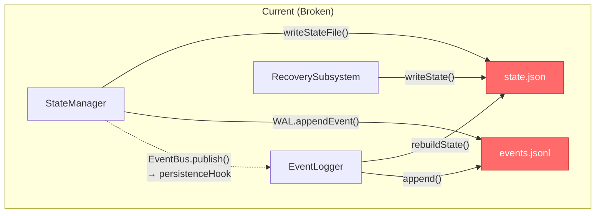
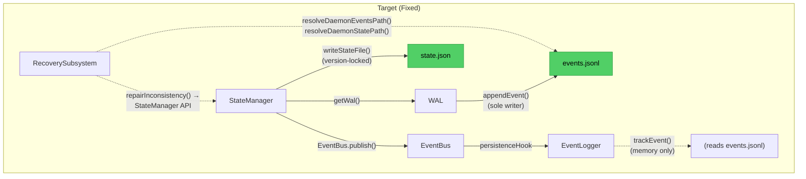
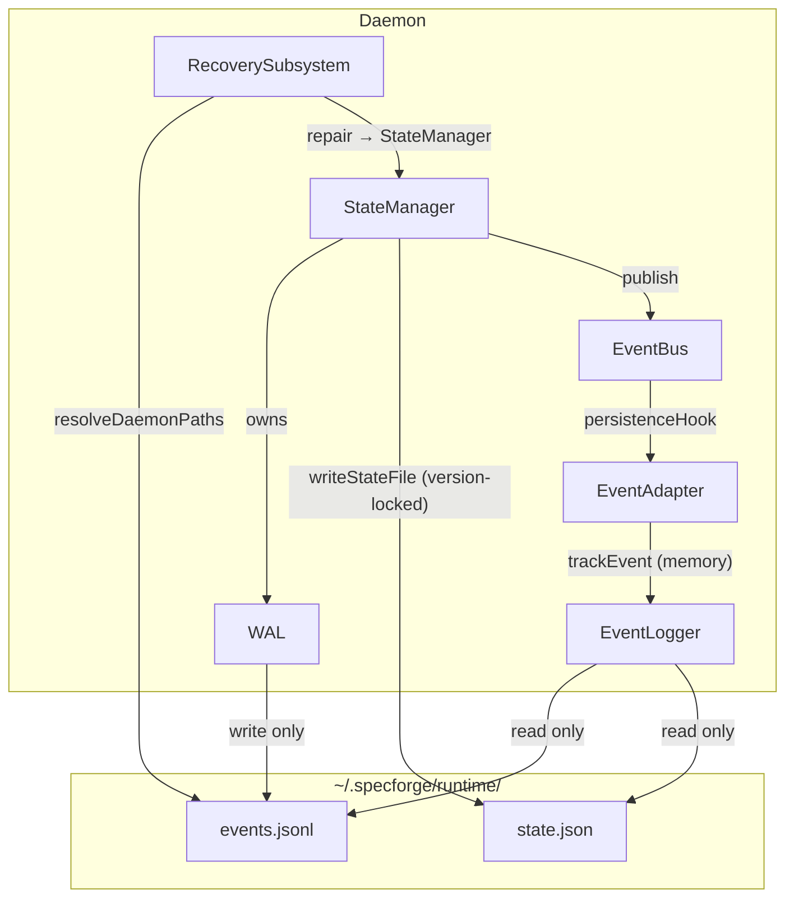

# WI-025 Fix Design: events.jsonl / state.json 并发写入一致性

> Work Item: WI-025
> Workflow Type: bugfix_spec
> Parent Investigation: INV-001
> Date: 2026-05-31
> Host: Windows 10 Pro, Node.js, UTF-8

---

## 0. 需求映射

本次 bugfix 的缺陷编号映射为设计需求：

| 缺陷编号 | 需求编号 | 描述 |
|---------|---------|------|
| **C1** | REQ-C1 | events.jsonl 双路径写入竞态 — 建立单一写入者原则 |
| **C2** | REQ-C2 | state.json 三重覆写 — 添加乐观并发控制 |
| **C3** | REQ-C3 | RecoverySubsystem 使用错误嵌套路径 — 修正为 Daemon 全局路径 |
| **C4** | REQ-C4 | Event 类型不兼容 — 创建类型转换适配器 |
| **C5** | REQ-C5 | EventLogger.initialize() 从未调用 — 补全初始化序列 |
| **M2** | REQ-M2 | 重复事件写入 — 消除 EventBus→EventLogger 的二次写入路径 |

---

## 1. 架构概述

### 1.1 当前架构问题

当前 Daemon 中 `events.jsonl` 和 `state.json` 被多个组件独立写入，无写入协调器，导致竞态条件：



### 1.2 目标架构

**核心原则：单一写入者 (Single-Writer Principle)**

- `events.jsonl`：**WAL 为唯一写入者**，EventLogger 变为只读索引/查询层
- `state.json`：**StateManager 为唯一写入者**（含乐观并发控制），EventLogger 和 RecoverySubsystem 通过 StateManager API 访问



### 1.3 组件依赖图（修复后）



---

## 2. 设计决策（Design Decisions）

### DD-1 确立 WAL 为 events.jsonl 唯一写入者

refs: [REQ-C1, REQ-M2]
constrained_by: 无（prod-environment.md / project-rules.md 均为 TODO 桩）

**决策**：移除 EventLogger 对 events.jsonl 的直接写入能力。WAL（通过 StateManager）成为 events.jsonl 的唯一写入路径。EventLogger 变为只读索引/查询层，通过内存跟踪事件而非直接写入文件。

**变更点**：

| 文件 | 变更 | 说明 |
|------|------|------|
| `Daemon.ts:163-167` | 修改 persistenceHook | 改为调用 EventLogger.trackEvent()（仅更新内存），不再调用 EventLogger.append() |
| `EventLogger/index.ts:319-345` | 重构 append() | 移除文件写入操作，改为纯内存操作；重命名为 `trackEvent()` |
| `EventLogger/index.ts:461-507` | 重构 rebuildState() | 移除 fs.writeFile(statePath)；改为通过读取 events.jsonl 重建内存状态 |
| `EventBus.ts` | 无变更 | persistenceHook 行为由 Daemon 控制，EventBus 本身不感知写入策略 |

**WAL rotation 安全性**：由于 WAL 是唯一写入者，rotation 期间不存在并发写入者竞争旧文件句柄的问题。

---

### DD-2 为 state.json 添加乐观并发控制

refs: [REQ-C2]
constrained_by: 无

**决策**：在 ProjectState 中新增 `stateVersion` 单调递增计数器。`writeStateFile()` 在写入前检查内存中的版本号与磁盘文件的首行版本号是否一致。若不一致（说明被其他写入覆盖），则重新读取 WAL 重建状态后重试（最多 3 次）。

**接口定义**：

```typescript
// StateManager.ts — 修改 writeStateFile()
interface StateManager {
  /**
   * Write state.json with optimistic concurrency control.
   * 
   * Protocol:
   * 1. Read disk version from state.json header line (or 0 if missing)
   * 2. Compare with this._stateVersion (in-memory expected version)
   * 3. If match → write + increment _stateVersion
   * 4. If mismatch (conflict) → re-read WAL, rebuild state, retry (max 3 attempts)
   * 
   * Errors: VersionConflict (retry exhausted) | DiskWriteError
   */
  private writeStateFile(state: ProjectState): Promise<void>;
}
```

**数据模型变更**：

```typescript
// types.ts — 修改 ProjectState
export interface ProjectState {
  projectPath: string;
  schemaVersion: string;
  stateVersion: number;      // 新增：单调递增版本号
  activeSessions: string[];
  workItems: WorkItemState[];
  lastEventId: string;
  lastEventTs: number;
}
```

**并发协议**：

```
writeStateFile(state):
  diskVersion = readFirstLine(statePath) → parse stateVersion field (default 0)
  if state.stateVersion !== diskVersion:
    throw VersionConflict
  state.stateVersion += 1
  fs.writeFile(statePath, JSON.stringify(state))  // 全量覆写
  fsync
```

**版本号编码**：`stateVersion` 字段作为 JSON 对象的第一个字段写入（利用 Node.js `JSON.stringify` 的稳定键序），便于通过读取文件首行快速提取版本号而无需解析整个文件。

---

### DD-3 修复 RecoverySubsystem 路径解析

refs: [REQ-C3]
constrained_by: 无

**决策**：RecoverySubsystem 不再通过 `resolveEventsPath(projectPath)` / `resolveStatePath(projectPath)` 解析路径（这些方法是项目级路径 API，会导致嵌套拼接）。改为直接使用 Daemon 全局路径方法 `resolveDaemonEventsPath()` / `resolveDaemonStatePath()`。

**接口变更**：

```typescript
// RecoverySubsystem.ts — 修改构造函数
class RecoverySubsystem {
  constructor(
    pathResolver: IPathResolver,
    daemonRuntimeDir: string,  // 语义不变，但内部使用方式变化
    wal?: WAL,
    stateManager?: StateManager,
    sessionRegistry?: SessionRegistry,
  ) {
    // 修改前（bug）：
    // this.eventsPath = this.pathResolver.resolveEventsPath(projectPath);
    // this.statePath = this.pathResolver.resolveStatePath(projectPath);
    
    // 修改后（正确）：
    this.eventsPath = this.pathResolver.resolveDaemonEventsPath();
    this.statePath = this.pathResolver.resolveDaemonStatePath();
  }
}
```

**路径对比**：

| 方法 | 结果路径 | 状态 |
|------|---------|------|
| `resolveEventsPath(runtimeDir)` | `~/.specforge/runtime/.specforge/runtime/events.jsonl` | ❌ 错误（嵌套） |
| `resolveDaemonEventsPath()` | `~/.specforge/runtime/events.jsonl` | ✅ 正确 |

**兼容性说明**：`resolveDaemonEventsPath()` 和 `resolveDaemonStatePath()` 在 `PersonalPathResolver` 和 `EnterprisePathResolver` 中均已实现（path-resolver.ts:161-167），无需新增 API。RecoverySubsystem 仍需保留 `projectPath` 成员以供 `loadState()` 中的 `createEmptyState()` 使用。

**Daemon.ts 调用方变更**：

```typescript
// Daemon.ts:67-69 — 修改前
this.recoverySubsystem = new RecoverySubsystem(
  pathResolver, runtimeDir, recoveryWal, recoveryStateManager, sessionRegistry
);

// Daemon.ts:67-69 — 修改后（参数不变，效果因 RecoverySubsystem 内部改路径解析而修正）
this.recoverySubsystem = new RecoverySubsystem(
  pathResolver, runtimeDir, recoveryWal, recoveryStateManager, sessionRegistry
);
```

**错误处理**：

```typescript
// Errors:
// - PathResolutionError: 如果 pathResolver 未提供 resolveDaemon*Path 方法
```

---

### DD-4 创建 Event 类型适配器

refs: [REQ-C4]
constrained_by: 无

**决策**：创建适配器函数 `toObservabilityEvent()` 将 daemon-core `Event` 安全转换为 observability `Event`，消除 `as unknown as` 强制类型转换。适配器负责填充缺失的必填字段（使用默认值或从 daemon-core Event 推断）。

**新增文件**：`packages/daemon-core/src/event-adapter.ts`

**接口定义**：

```typescript
// event-adapter.ts
import type { Event as DaemonEvent } from '../types';
import type { Event as ObservabilityEvent } from '@specforge/observability';

/**
 * Safely convert a daemon-core Event to an observability Event.
 * Fills in required fields that may be missing in daemon-core Event
 * with sensible defaults.
 * 
 * Errors: none — always returns a valid ObservabilityEvent (defensive defaults)
 */
export function toObservabilityEvent(event: DaemonEvent): ObservabilityEvent {
  return {
    schema_version: event.schema_version ?? '1.0',
    eventId: event.eventId,
    ts: event.ts,
    monotonicSeq: event.monotonicSeq ?? 0,
    projectId: event.projectId ?? '',
    workItemId: event.workItemId ?? null,
    actor: typeof event.actor === 'string'
      ? {
          sessionId: event.actor,
          agentRole: 'unknown',
          workflowRole: 'unknown',
          parentSessionId: null,
          workItemId: event.workItemId ?? '',
          spawnIntentId: '',
        }
      : null,
    category: (event.category as ObservabilityEvent['category']) ?? 'system',
    action: event.action,
    payload: event.payload,
    // payloadBlobRef: not set — daemon-core events don't use CAS blobs
  };
}
```

**Daemon.ts 使用**：

```typescript
// Daemon.ts:163-167 — 修改前
this.eventBus.setPersistenceHook(async (event) => {
  if (!event.projectId) return;
  await this.eventLogger.append(event as unknown as import('@specforge/observability').Event);
});

// Daemon.ts:163-167 — 修改后
this.eventBus.setPersistenceHook(async (event) => {
  if (!event.projectId) return;
  const obsEvent = toObservabilityEvent(event);
  await this.eventLogger.trackEvent(obsEvent);
});
```

**matchesFilter 兼容性修复**：

EventLogger 的 `matchesFilter()` 方法（event-logger/index.ts:441-447）通过 `event.actor?.id` 和 `event.actor?.name` 进行过滤，但 observability Event 的 `actor` 类型为 `AgentIdentity | null`，其字段为 `sessionId`（非 `id`）。需同步修复：

```typescript
// 修改 matchesFilter() 中的 actor 过滤逻辑
if (filter.actor) {
  if (filter.actor.id && event.actor?.sessionId !== filter.actor.id) {
    return false;
  }
  // ...
}
```

**Out of Scope（DD-4 范围外）**：
- 不统一两个包的 `Event` 接口为一个共享类型（留待长期重构）
- 不修改 observability 的 `Event` 接口定义
- 不添加 daemon-core → observability 的反向适配器

---

### DD-5 修复 EventLogger 初始化遗漏

refs: [REQ-C5]
constrained_by: 无

**决策**：在 `Daemon.start()` 中添加 `await this.eventLogger.initialize()` 调用，放置于 `stateManager.initialize()` 之后、`eventBus.start()` 之前。

**变更点**（Daemon.ts）：

```typescript
// Daemon.ts:151-153 — 修改后
await this.stateManager.initialize();
try {
  await this.recoverySubsystem.checkAndRepair();
} catch (err) {
  console.error('[DAEMON] RecoverySubsystem.checkAndRepair failed', err);
}

// 🔧 新增：初始化 EventLogger（播种内部计数器）
await this.eventLogger.initialize();

// 6. Start event bus
this.eventBus.start();
```

**初始化顺序理由**：
1. `stateManager.initialize()` 首先执行：重建 WAL 并从 events.jsonl 播种 monotonicSeq
2. `recoverySubsystem.checkAndRepair()` 其次执行：修复可能的不一致
3. `eventLogger.initialize()` 第三执行：此时 events.jsonl 已由 WAL 确保存在且一致性已修复，可以安全播种计数器
4. `eventBus.start()` 第四执行：启动后即可能有事件流入

**错误处理**：

```typescript
// Errors:
// - EventLoggerInitializeError: 如果 initialize() 抛错，记录日志但不阻止 Daemon 启动
//   （EventLogger 仅影响查询统计，不影响核心状态转换）
```

---

### DD-6 EventLogger 从写入者变为只读索引层的重构

refs: [REQ-C1, REQ-M2, REQ-C5]
constrained_by: 无

**决策**：重构 EventLogger 类的职责边界——从"写入 + 查询"变为纯"查询 + 索引"层。移除所有文件写入操作，保留文件读取和索引维护功能。

**EventLogger 接口变更**：

```typescript
// observability/src/types/index.ts — 修改 EventLogger 接口
interface EventLogger {
  // 【保留】初始化 — 播种内部计数器（不再创建文件，WAL 负责）
  initialize(): Promise<void>;
  // Errors: EventsFileNotFound | EventsFileUnreadable
  
  // 【重命名】从 append() 变为 trackEvent() — 仅更新内存状态
  trackEvent(event: Event): Promise<void>;
  // Errors: InvalidEventSchema
  
  // 【保留】只读查询
  getEvents(filter?: EventFilter): AsyncIterable<Event>;
  // Errors: EventsFileCorrupted | DiskReadError
  
  getEventsAcrossAllProjects(filter?: EventFilter): Promise<Event[]>;
  // Errors: DiskReadError
  
  // 【保留】统计查询
  getLastEventId(): string | null;
  getEventCount(): number;
  getEventsPath(): string;
  getStatePath(): string;
  getStats(): Promise<{ eventCount: number; lastEventId: string | null; fileSize: number }>;
  
  // 【保留】项目索引查询
  getKnownProjects(): Promise<string[]>;
  getProjectStats(projectId: string): Promise<...>;
  
  // 【移除】不再提供 rebuildState() — 此功能由 StateManager 专有
  // 【移除】不再提供 clear() — 数据管理由 WAL 专有
  // 【移除】不再提供 serialize/deserialize — 序列化由 WAL 统一管理
}
```

**trackEvent() 实现**：

```typescript
// event-logger/index.ts — 修改后
async trackEvent(event: Event): Promise<void> {
  this.validateEvent(event);
  
  // ✅ 仅更新内存状态（不写文件！）
  this.lastEventId = event.eventId;
  this.eventCount++;
  await this.updateProjectIndex(event);
  
  // ❌ 移除：fs.open / fileHandle.write / fileHandle.sync / fileHandle.close
}
```

**initialize() 改进**：

```typescript
// event-logger/index.ts — 修改后
async initialize(): Promise<void> {
  // ❌ 移除：fs.mkdir / fs.writeFile 创建文件（WAL 负责）
  // ✅ 保留：从已有 events.jsonl 播种计数器
  await this.loadLastEventInfo();
  await this.loadProjectIndices();
}
```

---

### DD-7 RecoverySubsystem 写入路径收归 StateManager

refs: [REQ-C2, REQ-C3]
constrained_by: 无

**决策**：RecoverySubsystem 的 `writeState()` 方法不再直接写入 `state.json`，改为通过注入的 `StateManager` 实例的 `persistState()` 间接写入（从而受 DD-2 的乐观并发控制保护）。

**接口变更**：

```typescript
// RecoverySubsystem.ts — 修改 writeState()
private async writeState(state: ProjectState): Promise<void> {
  // 修改前：直接写入（路径已通过 C3 修复，但仍是独立写入者）
  // await fs.writeFile(this.statePath, JSON.stringify(state, null, 2));
  // ... fsync ...
  
  // 修改后：通过 StateManager API（单一写入者）
  if (this.stateManager) {
    await this.stateManager.persistStateFromExternal(state);
  } else {
    // 降级路径：如果 StateManager 未注入（向后兼容），使用直接写入
    // 但路径已通过 resolveDaemonStatePath() 修正
    await fs.mkdir(path.dirname(this.statePath), { recursive: true });
    await fs.writeFile(this.statePath, JSON.stringify(state, null, 2));
    const handle = await fs.open(this.statePath, 'a');
    try { await handle.sync(); } finally { await handle.close(); }
  }
}
```

**StateManager 新增方法**：

```typescript
// StateManager.ts — 新增方法
/**
 * Persist an externally-built state snapshot through StateManager's
 * optimistic concurrency control.
 * Used by RecoverySubsystem after repair to persist the repaired state.
 * 
 * Errors: VersionConflict | DiskWriteError
 */
async persistStateFromExternal(state: ProjectState): Promise<void> {
  // 同步内存状态
  this.workItemStates.clear();
  for (const wi of state.workItems) {
    this.workItemStates.set(wi.work_item_id, wi);
  }
  this._lastEventId = state.lastEventId;
  this._lastEventTs = state.lastEventTs;
  
  // 通过乐观并发控制写入
  await this.writeStateFile(state);
}
```

---

### DD-8 测试策略

refs: [REQ-C1, REQ-C2, REQ-C3, REQ-C4, REQ-C5, REQ-M2]
constrained_by: host-profile.os.platform=win32

**决策**：本次修复的测试策略聚焦于回归测试，确保每个缺陷修复后不会引入新的并发问题或破坏现有行为。

#### 8.1 单元测试

| 测试文件 | 覆盖缺陷 | 测试内容 |
|---------|----------|---------|
| `WAL.test.ts` | C1 | 验证 `appendEvent()` 是 events.jsonl 唯一写入路径；验证 rotation 无竞争 |
| `StateManager.test.ts` | C2 | 验证 `writeStateFile()` 的乐观并发控制：版本匹配 → 写入成功；版本冲突 → 重试 + 重试耗尽 → 抛错 |
| `event-adapter.test.ts` | C4 | 验证 `toObservabilityEvent()` 正确填充所有必填字段；验证 actor 字段的 `string → AgentIdentity` 转换；验证缺失字段的默认值填充 |
| `EventLogger.test.ts` | C1, M2, C5 | 验证 `trackEvent()` 仅更新内存不写文件；验证 `initialize()` 正确播种计数器；验证 `append()` 已被移除或改为调用 `trackEvent()` |
| `RecoverySubsystem.test.ts` | C3 | 验证 `resolveDaemonEventsPath()` 返回正确路径（非嵌套）；验证 `writeState()` 通过 StateManager 写入 |

#### 8.2 集成测试

| 场景 | 覆盖缺陷 | 验证内容 |
|------|---------|---------|
| Daemon 正常启动流程 | C5 | 启动后 `eventLogger.getStats()` 返回正确统计信息；`getLastEventId()` 非 null |
| 单次状态转换 | C1, M2 | `events.jsonl` 只新增 1 行（非 2 行）；文件内容格式一致 |
| RecoverySubsystem 修复后状态持久化 | C2, C3 | 修复后的状态可通过 StateManager 正确读取；stateVersion 递增 |
| WAL rotation + 并发写入 | C1 | rotation 后无事件丢失；所有事件可从新 events.jsonl 读取 |

#### 8.3 属性测试（PBT）

| 属性 | 描述 |
|------|------|
| **CP-1 单写入者不变式** | 对于任意序列的状态转换，`events.jsonl` 中的事件行数 == `WAL.appendEvent()` 调用次数 |
| **CP-2 状态版本单调递增** | `stateVersion` 随每次 `writeStateFile()` 成功调用严格递增 |
| **CP-3 适配器往返一致性** | `toObservabilityEvent(event)` 的 `eventId`、`ts`、`action`、`payload` 与原始 daemon-core Event 一致 |
| **CP-4 EventLogger 只读不变式** | `trackEvent()` 调用后，`events.jsonl` 文件大小不变（验证未写入文件） |
| **CP-5 路径正确性** | `resolveDaemonEventsPath()` 结果中不包含重复的 `.specforge/runtime` 段 |

#### 8.4 E2E 测试

| 链路 | 步骤 |
|------|------|
| Daemon 启动 → 状态转换 → 查询统计 | `daemon.start()` → `sf_state_transition` 工具调用 → `GET /stats` → 验证 eventCount > 0 |

#### 8.5 兼容性测试

| 约束来源 | 测试 |
|----------|------|
| host-profile: win32 | 路径分隔符为 `\`，验证 `resolveDaemonEventsPath()` 在 Windows 上返回正确反斜杠路径 |
| host-profile: UTF-8 | JSON 序列化/反序列化含中文 payload 的 Event |

---

## 3. 数据模型变更

### 3.1 ProjectState 新增 stateVersion 字段

```typescript
// packages/daemon-core/src/types.ts
export interface ProjectState {
  projectPath: string;
  schemaVersion: string;
  stateVersion: number;      // 新增：单调递增，每次写入 +1
  activeSessions: string[];
  workItems: WorkItemState[];
  lastEventId: string;
  lastEventTs: number;
}
```

### 3.2 统一 Event 序列化格式

修复后，`events.jsonl` 中的事件**仅使用 daemon-core Event 格式**（含 `metadata` 字段）。EventLogger 通过适配器在内存中转换为 observability Event 格式进行查询和索引，不再产生混合格式的 JSON 行。

| 场景 | 写入格式 | 读取方 |
|------|---------|--------|
| `StateManager.transition()` → WAL | daemon-core Event | StateManager (rebuildState), WAL (readAllEvents) |
| EventLogger.getEvents() | observability Event (适配器转换) | 查询 API / 分析工具 |

---

## 4. 迁移方案

### 4.1 已有 events.jsonl 数据

**无需迁移**。修复后的 `WAL.readAllEvents()` 将所有 JSON 行解析为 `Event` 类型（TypeScript 的 `as Event` 类型断言），daemon-core Event 格式（含 `metadata`）和 observability Event 格式（含 `payloadBlobRef`）均可被解析。差异仅在通过 EventLogger 查询时由适配器层统一处理。

**清理建议**（可选）：如果 events.jsonl 中存在重复的 `eventId`（来自 M2 的双重写入），由于 `rebuildState()` 在回放时通过 `eventId` 去重（`applyStateTransition` 是幂等的），不会导致状态错误。可考虑在 Daemon 启动时输出日志警告检测到的重复 eventId。

### 4.2 已有 state.json 数据

**向后兼容**：如果 state.json 中缺少 `stateVersion` 字段，`writeStateFile()` 将其视为 `stateVersion = 0`（首次写入）。该兼容逻辑无需显式迁移脚本。

### 4.3 已有 RecoverySubsystem 嵌套路径数据

**自动处理**：Daemon 的 `detectAndHandleLegacyState()` 方法（Daemon.ts:205-264）已检测嵌套路径并合并数据。修复 C3 后，RecoverySubsystem 不再向嵌套路径写入，遗留的 `.orphaned` 文件可由用户手动删除或由下次 Daemon 启动自动清理。

---

## 5. 风险与回滚方案

### 5.1 风险矩阵

| 风险 | 可能性 | 影响 | 缓解措施 |
|------|--------|------|---------|
| 乐观并发控制的重试循环导致 Daemon 启动缓慢 | 低 | 中 | 重试上限 3 次；超过后使用最后读取的状态写入 |
| EventLogger 移除 `append()` 破坏现有调用方 | 中 | 高 | `append()` 改为委托到 `trackEvent()`（保持签名兼容，内部语义变化） |
| 适配器字段映射遗漏导致 EventLogger 验证失败 | 低 | 中 | 单元测试覆盖所有字段映射 + PBT 往返一致性测试 |
| 路径修复后 RecoverySubsystem 读取到错误的空文件 | 低 | 高 | 集成测试验证路径正确性 |
| 移除 EventBus → EventLogger 写入路径后事件丢失 | 低 | 高 | WAL 已在 StateManager.transition() 中写入，无丢失风险 |

### 5.2 回滚方案

如果修复引入新问题，按以下优先级回滚：

| 步骤 | 操作 | 回滚影响 |
|------|------|---------|
| **R1** | 恢复 `Daemon.ts:163-167` 的原始 persistenceHook（还原 M2 双重写入） | C1, M2 回归 |
| **R2** | 移除 `writeStateFile()` 中的版本检查（还原 C2 三重覆写风险） | C2 回归 |
| **R3** | 恢复 RecoverySubsystem 的 `resolveEventsPath(projectPath)` 路径解析 | C3 回归 |

**回滚触发条件**：
- Daemon 启动失败率 > 5%（监控 `handshake.json` 写入成功率）
- `GET /stats` 返回的 eventCount 显著下降（说明事件丢失）
- 状态转换 API 返回 `VersionConflict` 错误率 > 1%

**回滚观察窗口**：部署后 48 小时内持续监控。

---

## 6. Out of Scope（明确排除）

| 排除项 | 说明 |
|--------|------|
| **统一 Event 接口** | 不合并 daemon-core 和 observability 的 Event 接口为一个共享类型（留待长期架构重构） |
| **WAL 写入互斥锁** | 不引入文件锁或跨进程互斥机制（当前 Daemon 单实例，无需跨进程协调） |
| **SQLite 迁移** | 不将 JSONL+JSON 方案替换为 SQLite |
| **EventLogger CAS 集成** | 不修改 EventLogger 的 payloadBlobRef / CAS 逻辑 |
| **项目级 state.json 并发控制** | 仅修复 Daemon 全局运行时文件；项目级 `.specforge/runtime/state.json` 由工具处理器按需创建，不在本次修复范围 |
| **SessionRegistry 写入路径** | 不修改 SessionRegistry 对 events.jsonl 的读取方式 |
| **日志系统 (telemetry/trace/cost)** | 不修改 `logs/` 目录下的其他日志文件 |
| **性能优化** | 不优化 WAL 的 I/O 性能或 fsync 策略 |
| **CI/CD 管道变更** | 不修改构建或部署流程 |
| **文档更新** | 不更新用户文档或 API 文档 |

---

## 7. Assumptions（设计假设）

| # | 假设 | 依据 |
|---|------|------|
| A1 | Daemon 进程为单实例运行 | `handshakeManager.enforceSingleInstance()` 保证（bugfix.md 不变行为） |
| A2 | `fs.writeFile()` 在同一进程内对同一文件的并发调用表现为 Last-Write-Wins | Node.js `fs/promises` API 语义（findings_report.md 关键假设） |
| A3 | EventBus 的 `publish()` 是异步的，`persistenceHook` 在 handler fan-out 前执行 | EventBus.ts:161-170 代码逻辑 |
| A4 | Daemon 运行在 `personal` 模式下，使用 `PersonalPathResolver` | 当前生产环境配置 |
| A5 | `JSON.stringify()` 在 V8 中对同一对象按相同属性顺序输出 | V8 引擎行为（用于 stateVersion 的首字段编码） |
| A6 | WAL rotation 阈值 5MB 在正常使用下触发频率极低（< 1 次/天） | WAL.ts:13 `WAL_MAX_SIZE = 5 * 1024 * 1024` |
| A7 | events.jsonl 中的事件格式向前兼容 | daemon-core Event 包含 `metadata` 字段，observability Event 包含 `payloadBlobRef` — 两者均可被 `JSON.parse` 成功解析 |
| A8 | `prod-environment.md` 和 `project-rules.md` 当前为 TODO 桩 | 无项目级约束影响本次设计 |

---

## 8. 正确性属性（Correctness Properties）

| 编号 | 属性 | 验证方式 |
|------|------|---------|
| CP-1 | **单写入者不变式**：`events.jsonl` 的行数增量 == WAL 的 `appendEvent()` 调用次数增量 | 集成测试：执行 N 次状态转换，验证 `wc -l events.jsonl` 增加 N |
| CP-2 | **状态版本单调性**：`state.json` 的 `stateVersion` 字段严格递增 | 属性测试：执行随机序列的 writeStateFile，验证每次写入的 version > 前一次 |
| CP-3 | **适配器往返**：`toObservabilityEvent(e).eventId === e.eventId` 且 `toObservabilityEvent(e).action === e.action` | 单元测试 |
| CP-4 | **EventLogger 无副作用**：`trackEvent()` 调用后 `events.jsonl` 的 mtime 不变 | 集成测试 |
| CP-5 | **路径正确性**：`resolveDaemonEventsPath()` 结果不以 `.specforge/runtime/.specforge/` 结尾 | 单元测试：正则匹配 `.specforge[/\\]runtime[/\\].specforge` → 不应出现 |
| CP-6 | **WAL rotation 安全**：rotation 前后事件 `eventId` 集合的并集包含所有已写入事件 | 属性测试：模拟 rotation 期间的写入，验证无遗漏 |

---

## 9. 受影响文件变更摘要

| 文件 | 变更类型 | 相关 DD | 变更行数（估） |
|------|---------|--------|---------------|
| `packages/daemon-core/src/daemon/Daemon.ts` | 修改 | DD-1, DD-3, DD-4, DD-5 | ~15 行 |
| `packages/daemon-core/src/state/StateManager.ts` | 修改 | DD-2, DD-7 | ~50 行 |
| `packages/daemon-core/src/recovery/RecoverySubsystem.ts` | 修改 | DD-3, DD-7 | ~15 行 |
| `packages/observability/src/event-logger/index.ts` | 修改 | DD-1, DD-5, DD-6 | ~40 行 |
| `packages/daemon-core/src/types.ts` | 修改 | DD-2 | ~3 行 |
| `packages/observability/src/types/index.ts` | 修改 | DD-6 | ~10 行 |
| `packages/daemon-core/src/event-adapter.ts` | **新增** | DD-4 | ~50 行 |
| `packages/daemon-core/src/daemon/path-resolver.ts` | 无变更 | — | 0（已有方法） |
| `packages/daemon-core/src/event-bus/EventBus.ts` | 无变更 | — | 0 |
| `packages/daemon-core/src/wal/WAL.ts` | 无变更 | — | 0 |
| `packages/types/src/directory-layout.ts` | 无变更 | — | 0 |

---

## 10. 架构属性自检

| 属性 | 检查结果 |
|------|---------|
| **A1 单一职责** | ✅ WAL=唯一写入者，EventLogger=只读查询/索引，StateManager=状态管理+并发控制，EventAdapter=类型转换，RecoverySubsystem=一致性修复 |
| **A2 显式依赖** | ✅ Mermaid 图展示所有依赖箭头 |
| **A3 可替换性** | ✅ EventLogger 通过 IEventLogger 接口定义；EventAdapter 是纯函数可独立测试；StateManager 通过 IPathResolver 接口解耦 |
| **A4 失败可观测** | ✅ 每个组件接口定义了 Errors 段；乐观并发冲突通过 VersionConflict 异常抛出 |
| **A5 边界明确** | ✅ Out of Scope 列出 9 项排除项；Assumptions 列出 8 项假设 |
