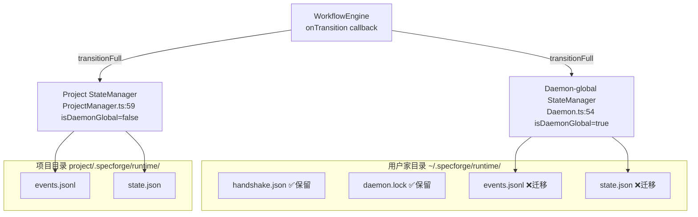
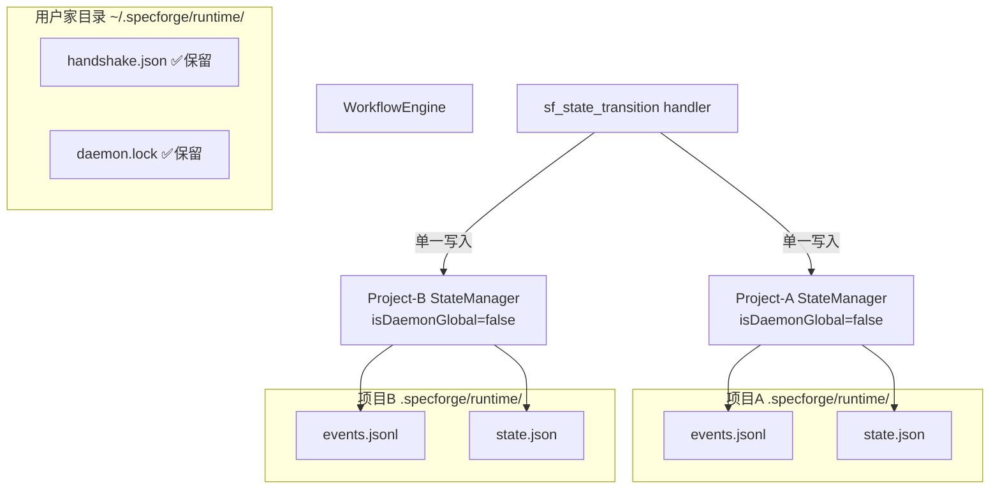

# Refactor Analysis: events.jsonl / state.json 从用户全局迁移到项目目录

> Work Item: WI-026
> 阶段: design（refactor 工作流）
> 基于: intake.md + WI-025 调查结论 + 源码逐行分析

---

## 1. 代码问题识别

### 1.1 核心问题：状态数据锚定在用户家目录，与项目无关

当前架构使用 **两层状态存储**（dual-tier）：

| 层级 | 路径 | 用途 | 初始化位置 |
|------|------|------|-----------|
| **Daemon-global** | `~/.specforge/runtime/events.jsonl`<br>`~/.specforge/runtime/state.json` | Daemon 主 StateManager 的持久化目标 | `Daemon.ts:54` — `new StateManager(pathResolver, resolveDaemonRuntimeDir(), true)` |
| **Project-scoped** | `<project>/.specforge/runtime/events.jsonl`<br>`<project>/.specforge/runtime/state.json` | 项目级 StateManager（按需创建） | `ProjectManager.ts:59` — `new StateManager(pathResolver, projectPath, false)` |



### 1.2 具体痛点

#### P1: sf_state_transition 存在双重写入（Duplicate Write）

**文件**: `packages/daemon-core/src/tools/handlers/sf-state-transition.ts`

```typescript
// 第1次写入：通过 workflowEngine.transitionFull() → onTransition 回调 → daemon-global StateManager
const result = await deps.workflowEngine.transitionFull({...}); // line 36

// 第2次写入：通过 ProjectManager 获取的项目级 StateManager  
const projectSm = await deps.projectManager.getProjectStateManager(projectPath); // line 50
await projectSm.transition(...); // line 51
```

**后果**：
- 同一个 state.transition 事件被写入两个不同的 `events.jsonl` 文件
- Daemon-global 的事件集是项目级事件集的超集（包含所有项目的事件），导致状态重建时来源不唯一
- 项目级写入失败被静默忽略（line 61: `console.warn`），产生静默数据不一致风险

#### P2: RecoverySubsystem 路径选择依赖 WAL/StateManager 注入

**文件**: `packages/daemon-core/src/recovery/RecoverySubsystem.ts:58-66`

```typescript
if (this.wal && this.stateManager) {
    // daemon-global mode: use daemon-global paths
    this.eventsPath = this.pathResolver.resolveDaemonEventsPath();  // ~/.specforge/runtime/events.jsonl
    this.statePath = this.pathResolver.resolveDaemonStatePath();     // ~/.specforge/runtime/state.json
} else {
    // legacy mode: use project-level paths
    this.eventsPath = this.pathResolver.resolveEventsPath(projectPath);  // <project>/.specforge/runtime/events.jsonl
    this.statePath = this.pathResolver.resolveStatePath(projectPath);
}
```

**后果**：
- 当 WAL/StateManager 注入时（Daemon.ts:67-68），RecoverySubsystem 操作的是 daemon-global 路径
- checkAndRepair() 检查的是 daemon-global 的 events.jsonl，而非项目级的数据
- 启动时的一致性修复无法覆盖项目级数据

#### P3: EventLogger 路径指向 daemon-global 目录

**文件**: `packages/daemon-core/src/daemon/Daemon.ts:95`

```typescript
this.eventLogger = new EventLogger(runtimeDir);  // runtimeDir = ~/.specforge/runtime/
```

**后果**：
- EventLogger 的 `getEvents()`、`loadLastEventInfo()` 等方法读取的是 daemon-global 路径下的 events.jsonl
- 迁移后 daemon-global 不再有 events.jsonl，EventLogger 将无法正常工作
- EventLogger 的 `projectIndexDir`（`basePath/project-indices/`）也指向用户家目录

#### P4: Daemon.start() 启动流程强依赖 daemon-global 状态

**文件**: `packages/daemon-core/src/daemon/Daemon.ts:127-194`

```typescript
async start(): Promise<void> {
    // ...
    await this.detectAndHandleLegacyState(this.config.getRuntimeDir()); // 步骤4: 读取daemon-global路径
    await this.stateManager.initialize();                              // 步骤5: 初始化daemon-global StateManager
    await this.eventLogger.initialize();                               // 步骤6: 初始化daemon-global EventLogger
    await this.recoverySubsystem.checkAndRepair();                     // 步骤7: 修复daemon-global一致性
    // ...
}
```

**后果**：
- 启动流程完全依赖 daemon-global 路径
- 迁移后若 daemon-global 目录下无 events.jsonl/state.json，initialize 仍会创建空文件（**反目标**）
- detectAndHandleLegacyState 处理的是 daemon-global 下的 legacy 数据

#### P5: sf_state_read 存在全局回退（Fallback）

**文件**: `packages/daemon-core/src/tools/handlers/sf-state-read.ts:6-14`

```typescript
// 优先使用项目级 StateManager
let sm = deps.stateManager;
if (projectPath && deps.projectManager) {
    try {
        sm = await deps.projectManager.getProjectStateManager(projectPath);
    } catch {
        // fallback 到全局 ← 迁移后不应存在
    }
}
```

**后果**：
- 迁移完成后 daemon-global 不再有状态数据，回退将返回空/过期数据
- 回退逻辑掩盖了项目路径获取失败的错误

---

## 2. 涉及范围

### 2.1 必须修改的文件

| 文件 | 变更类型 | 影响范围 |
|------|---------|---------|
| `packages/daemon-core/src/daemon/Daemon.ts` | **架构性修改** | 移除 daemon-global StateManager；适配 EventLogger/RecoverySubsystem/onTransition 回调 |
| `packages/daemon-core/src/tools/handlers/sf-state-transition.ts` | **逻辑修改** | 移除双重写入，仅保留项目级写入 |
| `packages/daemon-core/src/tools/handlers/sf-state-read.ts` | **逻辑修改** | 移除全局回退，仅从项目级读取 |
| `packages/daemon-core/src/recovery/RecoverySubsystem.ts` | **路径修改** | 移除 daemon-global 路径分支，始终使用项目级路径 |
| `packages/daemon-core/src/state/StateManager.ts` | **兼容性保留** | 保留 `isDaemonGlobal` 参数兼容现有调用，但标记 deprecated |
| `packages/daemon-core/src/project/ProjectManager.ts` | **逻辑调整** | `getProjectStateManager()` 可能需要在 Daemon 启动时更早被调用 |

### 2.2 必须保留在用户级的文件

| 文件 | 路径 | 理由 |
|------|------|------|
| `handshake.json` | `~/.specforge/runtime/handshake.json` | Daemon 发现机制的核心：CLI 客户端通过读取 handshake 文件获取 Daemon 端口和 token |
| `daemon.lock` | `~/.specforge/runtime/daemon.lock` | 单实例互斥锁，防止多个 Daemon 进程同时运行 |

### 2.3 不受影响的文件

| 文件/组件 | 理由 |
|-----------|------|
| WAL (`packages/daemon-core/src/wal/`) | WAL 的读写/回放逻辑不依赖文件路径，路径由调用方传入 |
| EventBus (`packages/daemon-core/src/event-bus/`) | 纯内存 pub/sub，无文件系统交互 |
| WorkflowEngine (`packages/workflow-runtime/`) | onTransition 是回调接口，调用方决定写入目标 |
| HandshakeManager | 仅操作 handshake.json 和 daemon.lock，不涉及 events.jsonl/state.json |
| SessionRegistry | 仅使用 WAL 引用（`stateManager.getWal()`），不直接依赖文件路径 |
| PermissionEngine | 无文件系统依赖 |
| 所有 HTTP API 路由 | 不直接操作文件，通过注入的组件间接访问 |

---

## 3. 重构目标

### 3.1 目标架构



### 3.2 关键变更

1. **移除 Daemon-global StateManager**（`Daemon.ts:54`）
   - Daemon 不再持有一个全局唯一的 StateManager
   - 所有状态操作都通过 ProjectManager 按需获取项目级 StateManager

2. **消除双重写入**（`sf-state-transition.ts:36,50-51`）
   - `workflowEngine.transitionFull()` 不再通过 onTransition 回调写入 daemon-global 存储
   - handler 仅通过 `projectManager.getProjectStateManager()` 写入项目级 StateManager

3. **EventLogger 改为项目感知**（`Daemon.ts:95`）
   - EventLogger 不再在 Daemon 构造时以 daemon-global 路径创建
   - 改为按需/延迟初始化，使用项目路径

4. **RecoverySubsystem 统一使用项目路径**（`RecoverySubsystem.ts:58-66`）
   - 移除 daemon-global 路径分支
   - 始终使用 `projectPath` 参数解析的项目路径

5. **sf_state_read 移除全局回退**（`sf-state-read.ts:12-14`）
   - 不再 fallback 到 `deps.stateManager`
   - 若项目路径获取失败，直接返回明确错误

### 3.3 onTransition 回调的处理方案

当前 `onTransition` 在 Daemon.ts:78-89 的实现写入了 daemon-global StateManager。迁移后有两种方案：

**方案 A（推荐）**：移除 Daemon.ts 中的 onTransition 回调设置
- `WorkflowEngine` 的 `onTransition` 参数设为 `undefined`
- `sf_state_transition` handler 成为唯一的持久化入口
- 优点：最简单，消除双重写入的根源
- 缺点：`WorkflowEngine.transitionFull()` 不再自动触发 WAL 持久化（需确保 handler 总被调用）

**方案 B**：修改 onTransition 为项目感知
- 通过某种机制（context/闭包）传入当前项目路径
- onTransition 内部通过 ProjectManager 获取正确的项目 StateManager
- 优点：保留 WAL-first 语义的声明位置
- 缺点：增加实现复杂度，需在 WorkflowEngine 调用时传递项目路径

**选择方案 A**，理由：
- `transitionFull()` 本身不保证持久化 — 它只是一个门面，持久化由 `onTransition` 回调实现
- `sf_state_transition` handler 是唯一合法的状态流转调用入口（permission-engine 硬规则：仅 sf-orchestrator 可调用）
- 因此 handler 内完成持久化是安全且充分的

---

## 4. 不变行为声明

以下行为在重构中**必须保持不变**：

| 编号 | 不变行为 | 验证方法 |
|------|---------|---------|
| INV-1 | WAL 写入语义不变：事件先写入 WAL（events.jsonl），fsync 后再更新 state.json | 检查 StateManager.transition() 步骤 4→6 的顺序未被修改 |
| INV-2 | WAL 读取/回放逻辑不变：rebuildState() 通过重放 WAL 事件重建内存状态 | 检查 StateManager.rebuildState() 逻辑未被修改 |
| INV-3 | 乐观锁（Optimistic Concurrency Control）不变：state.json 写入仍使用版本号比较 | 检查 StateManager.writeStateFile() 逻辑未被修改 |
| INV-4 | 状态名称校验不变：只接受 ALL_STATES 中定义的状态名 | 检查 StateManager.isValidStateName() 逻辑未被修改 |
| INV-5 | EventBus pub/sub 接口不变：事件的发布/订阅行为不因文件路径迁移而改变 | EventBus 是内存组件，无文件依赖，无需修改 |
| INV-6 | HTTP API 响应格式不变：所有工具处理器返回的 JSON 结构与迁移前一致 | 检查 sf_state_transition/sf_state_read 的返回结构未被修改 |
| INV-7 | 项目初始化 guard 不变：`fromState === ''` 时检查 manifest.json 是否存在 | 检查 sf-state-transition.ts:16-29 逻辑未被修改 |
| INV-8 | RecoverySubsystem 修复规则不变：state_mismatch/missing_event/out_of_order 的修复行为不变 | 检查 RecoverySubsystem.applyRepairRule() 逻辑未被修改 |
| INV-9 | 属性测试（Property Tests）全部通过 | 运行 `packages/daemon-core/tests/property/` 下的所有属性测试 |
| INV-10 | 现有单元/集成测试全部通过 | 运行 `packages/daemon-core/tests/` 和 `packages/workflow-runtime/tests/` 下的全部测试 |

### 明确不变的组件

| 组件 | 不变范围 |
|------|---------|
| WAL (`src/wal/`) | 全部源码不变 — 路径由构造参数传入，无硬编码 |
| EventBus | 全部源码不变 — 纯内存组件 |
| WorkflowEngine | 接口不变（`onTransition` 回调签名不变），内部逻辑不变 |
| SessionRegistry | 全部源码不变 — 仅持有 WAL 引用 |
| HandshakeManager | 全部源码不变 — 仅操作 handshake.json / daemon.lock |
| PermissionEngine | 全部源码不变 |
| HTTP API 路由 | 全部源码不变 — 通过依赖注入使用组件 |

---

## 5. 风险评估

### 5.1 总体风险评级：**高**

### 5.2 风险明细

| 风险项 | 等级 | 描述 | 缓解措施 |
|--------|------|------|---------|
| **R1: 启动流程断裂** | 🔴 高 | `Daemon.start()` 中 3 个步骤（stateManager.initialize / eventLogger.initialize / recoverySubsystem.checkAndRepair）依赖 daemon-global 路径。移除后启动流程需重新设计。 | 改用按需初始化：只在收到第一个项目请求时才初始化项目级 StateManager/EventLogger/RecoverySubsystem |
| **R2: 双重写入消除不当** | 🔴 高 | 当前 `transitionFull()` 通过 `onTransition` 写入 daemon-global。若移除 `onTransition` 后 handler 写入失败，则没有任何持久化发生。 | handler 内持久化加 try-catch，失败时返回明确错误（不静默吞掉） |
| **R3: EventLogger 重构复杂** | 🟡 中 | EventLogger 持有 `basePath`、`eventsPath`、`statePath`，且用于 HTTP API 的事件查询。迁移后需按项目路径定位。 | EventLogger 改为在 ToolDispatcher 中按需创建或改为支持 setBasePath() 的动态切换 |
| **R4: 多项目并发隔离破坏** | 🟡 中 | 当前 daemon-global 的 events.jsonl 是所有项目的聚合事件流。迁移后每个项目有独立 events.jsonl，跨项目事件查询需聚合多文件。 | 确认当前是否有跨项目查询的 API。若无，则无需改动；若有，需设计聚合查询逻辑 |
| **R5: 遗留嵌套路径遗留** | 🟢 低 | `detectAndHandleLegacyState()` 处理 `~/.specforge/runtime/.specforge/runtime/` 的嵌套路径。迁移后可简化或移除。 | 在 Daemon.start() 中移除该步骤，或在初始化前迁移遗留数据到项目路径 |
| **R6: 测试回归范围大** | 🟡 中 | 重构涉及 Daemon.ts、handler、RecoverySubsystem，这些是整个系统的核心。测试覆盖不足的路径可能被遗漏。 | 重构前先运行全量测试建立基线；重构后运行全量测试验证回归 |
| **R7: path-resolver 向后兼容** | 🟢 低 | `resolveDaemonEventsPath()` 和 `resolveDaemonStatePath()` 在迁移后不再被调用。若其他未被发现的代码仍调用它们，会写入错误路径。 | 保留方法但加 `@deprecated` 标记 + console.warn；逐步清理调用方 |

### 5.3 缓解策略汇总

1. **分步实施**：先修改 handler 消除双重写入，再修改 Daemon 启动流程，最后清理遗留代码
2. **保留兼容期**：`StateManager.isDaemonGlobal` 参数保留但标记 `@deprecated`；`resolveDaemonEventsPath()` 等方法保留
3. **测试先行**：重构前运行全量测试，记录基线；每步修改后立即运行受影响测试
4. **WAL 数据完整性**：重构不修改 WAL 读写逻辑，确保现有 events.jsonl 文件格式无需变更

---

## 6. Out of Scope

- ❌ 数据迁移脚本（将现有 `~/.specforge/runtime/events.jsonl` 从 daemon-global 复制/分发到各项目路径）— 由 intake 中指定的"迁移动作"涵盖，但不在此分析中展开
- ❌ WAL 内部格式变更 — WAL 的 `createEvent()` / `appendEvent()` / `readAllEvents()` 接口和行为不变
- ❌ EventBus 扩展或修改
- ❌ daemon.lock 机制修改 — 保留在用户家目录
- ❌ handshake.json 格式修改 — 保留在用户家目录
- ❌ ProjectManager 的功能扩展（如项目自动发现）
- ❌ CLI 客户端适配（CLI 已通过 context.directory 传递项目路径，无需修改）
- ❌ Daemon 进程的跨项目事件聚合查询（若不需此功能）

---

## 7. Assumptions（设计假设）

- **A1**: Daemon 启动时不需要知道具体项目路径 — handshake + daemon.lock 足以完成启动
- **A2**: 每个 `sf_state_transition` 调用时，调用方（通常是 sf-orchestrator）会通过 `context.directory` 提供正确的项目根路径
- **A3**: 不需要跨项目聚合查询 — 当前 `sf_state_read` 查询已按项目路径过滤；若未来需要，可另立 WI
- **A4**: `EventLogger` 的 `getEvents()` 等方法在迁移后仍需要读取 events.jsonl — 其路径需与 StateManager 的 WAL 路径一致
- **A5**: 现有的 WAL 文件格式（每行一个 JSON 事件）在迁移后保持不变
- **A6**: `WorkflowEngine.onTransition` 回调是 StateManager→WAL 持久化的唯一路径（除 handler 直接调用外）
- **A7**: 项目路径总是有效的文件系统路径（由 `IPathResolver` 的 `validateProjectPath()` 保证）

---

## 8. 重构策略建议

### 8.1 推荐的分步实施顺序

```
Phase 1: 消除双重写入
  ├── 修改 sf-state-transition.ts：移除 workflowEngine.transitionFull() 调用
  │   └── 直接通过 ProjectManager 写入项目级 StateManager
  ├── 修改 sf-state-read.ts：移除 global fallback
  └── 运行测试验证

Phase 2: Daemon 启动流程调整  
  ├── 移除 Daemon.ts 中的 daemon-global StateManager
  ├── 移除 onTransition 回调设置
  ├── 调整 EventLogger 初始化逻辑
  └── 运行测试验证

Phase 3: RecoverySubsystem 路径统一
  ├── 移除 daemon-global 路径分支
  ├── 始终使用项目级路径
  └── 运行测试验证

Phase 4: 清理
  ├── 标记 deprecated 方法
  ├── 移除 detectAndHandleLegacyState()
  └── 运行全量测试验证
```

### 8.2 回滚方案

若重构后出现不可恢复的问题：
1. 恢复 Daemon.ts:54 的 daemon-global StateManager 创建
2. 恢复 sf-state-transition.ts 的双重写入
3. 保留项目级写入（ProjectManager.getProjectStateManager），确保项目级数据不丢失
4. daemon-global 数据作为兜底

---
